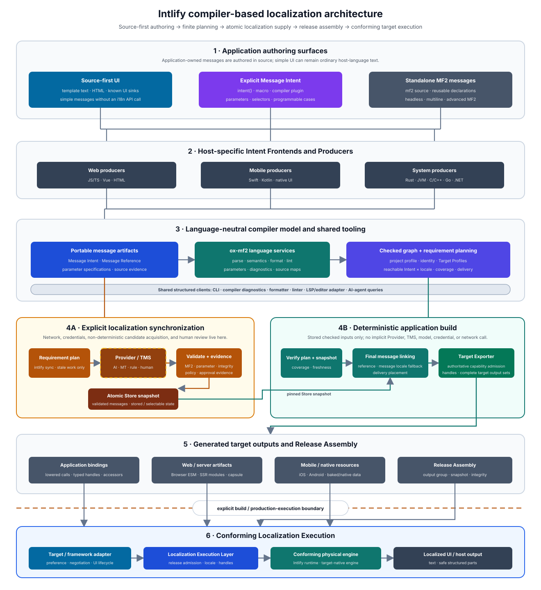

# Intlify Compiler-Based Localization Overview Design

## Status

**Proposed**

This document defines the proposed high-level product architecture for Intlify as a compiler-based localization toolchain with offline, artifact-driven production execution. It becomes **Accepted** only after the I0 product boundary, terminology, and architecture are ratified explicitly.

The component designs refine this overview. If a component requires a direction that conflicts with an Accepted overview decision, this document is updated first rather than being overridden implicitly by the component design.

It is one abstraction level above the component designs in this repository. In particular, [023](./023-intlify-localization-execution-specification-design.md) owns the logical execution specification and [027](./027-intlify-reference-runtime-design.md) describes one reference physical Runtime, while this document explains how authoring, MF2 language services, localization synchronization, linking, target generation, editor and agent tooling, and runtime delivery form one Intlify system.

The source-first PoC in [PR #183](https://github.com/intlify/intlify/pull/183) and its review discussion are design evidence, not a frozen public API. This document proposes the overall direction and responsibility boundaries; once Accepted, those decisions become the baseline for the component designs. It does not yet freeze:

- the exact JavaScript `intent()` signature or tagged-template API;
- automatic extraction rules for each host language and framework;
- the wire schemas of the source-first artifacts;
- the user-facing configuration syntax or resolved-project-profile wire schema;
- the persistent Intent identity registry encoding and reconciliation protocol;
- the Translation Store storage protocol;
- Provider, TMS, review, or approval APIs;
- final CLI command names;
- Locale Capsule, Runtime Manifest, or generated-code ABIs; or
- package, crate, binding, plugin, or adapter names.

## Product Statement

> **Localization, Compiled.**
>
> **The Source-First Localization Compiler**
>
> Write messages naturally in your application. Compile validated localization across web, mobile, and native systems—without hand-maintained catalogs.

Intlify is not an application framework and does not own application rendering, routing, state management, or deployment. It is a composable, compiler-based localization toolchain with conforming execution integrations for host languages, build systems, UI frameworks, localization services, and existing Translation Management Systems.

“Without hand-maintained catalogs” describes the application authoring model. It does not mean that requested-locale messages are never stored. Intlify replaces catalogs as the developer-maintained source of application messages with compiler-managed localization artifacts and validated releases.

The initial product scope is application- and library-owned, user-facing messages: static UI, accessibility text, explicit headless messages, MF2 interpolation and selection, and locale-aware formatting inside those messages. It is not a general engine for locale-dependent routing, input parsing, collation, regional business rules, remote content, or localized non-message media.

“Validated localization” describes localization selected and accepted for Release Assembly after the applicable deterministic checks, project policies, approval gates, and target-capability checks. It is not the name of an intermediate artifact state: a technically valid candidate may be stored before it satisfies approval policy. The phrase does not claim that a compiler can prove linguistic, cultural, legal, or product correctness.

## Purpose

Traditional i18n application development usually has this shape:

```text
application code
  -> developer-authored message key
  -> manually maintained locale catalogs
  -> runtime key lookup and fallback
  -> parse and format
```

This model was reasonable when people translated and maintained every catalog entry directly. It also made message identity, translation storage, and runtime lookup the same developer-visible concept.

In an AI-agent and automation-friendly workflow, those concerns no longer need to be coupled. Application developers should be able to author the source-locale UI naturally. Localization Providers, TMS integrations, machine translation, AI, rules, and humans can all supply requested-locale candidates through one checked workflow. A compiler can then resolve the finite localization requirements of the application, validate them, and generate target-specific code and immutable locale artifacts.

The intended model is:

```text
application-owned source messages
  -> statically discovered Message Intents and references
  -> explicit localization synchronization and governance
  -> technically valid localized candidates and governance decisions
  -> reachability, requested-locale, message-locale-fallback, and delivery linking
  -> generated application bindings and requested-locale artifacts
  -> validated ReleaseSnapshot
  -> release-bound, locale-scoped target execution with reproducibility defined by the selected Locale Service Profile
```

The resulting system keeps translation generation and remote services out of production rendering while removing hand-maintained keys and catalogs from the normal source-first application workflow. Target execution remains driven by admitted artifacts even when the physical engine is implemented through a platform-native service.

## Problem Statement

### Authoring indirection

Message keys make application code describe storage locations rather than user-facing communication.

```ts
t('checkout.actions.pay')
```

The source text, parameter specification, UI usage, and requested-locale translations live elsewhere. Reviewers cannot understand the rendered UI from the application change alone, and a rename or refactor may require coordinated edits across code, catalogs, types, tests, and TMS state.

### Catalog maintenance

Hand-maintained catalogs accumulate stale entries, missing translations, duplicate meanings, inconsistent placeholders, and orphaned keys. Extraction and synchronization become recurring application-development tasks rather than compiler work.

### Late failure

Missing messages, invalid message locale fallback, incompatible arguments, unsupported functions, and malformed translated syntax are often discovered only when a particular locale and route execute in production.

### Runtime over-responsibility

A conventional `t()` path may combine mutable locale state, catalog lookup, key fallback, loading, parsing, formatting, and error policy. This makes request-safe SSR, deterministic behavior, static optimization, and target-native output harder.

### Tool fragmentation

Extractors, formatters, linters, editors, TMS clients, build plugins, and AI coding agents often parse or infer the same message semantics independently. Their results drift because they do not share one parser, semantic model, artifact identity, or diagnostic specification.

### Delivery inefficiency

Applications frequently ship more messages, locales, and feature resources than a runtime path can reach. Dynamic catalogs prevent the build from proving completeness or pruning unreachable localization data.

### Uncontrolled automation

Calling an AI, MT service, or TMS implicitly during each build makes output depend on network availability, credentials, provider revisions, model behavior, and unreviewed candidates. The application build is no longer deterministic or reliably offline.

## Core Thesis

Intlify treats application localization as compilation.

A localizable message is not primarily a developer-authored storage key. It is a statically discoverable communication requirement with:

- source-locale MF2;
- parameter and selector specifications;
- source and UI evidence;
- stable compiler-owned identity and revision;
- locale, policy, glossary, review, and delivery requirements; and
- references from application or library code.

The toolchain resolves user-facing configuration into one language-neutral project profile and turns reachable requirements and admitted source-locale or localized message definitions into target-specific application code and immutable Store and Release snapshots. Host-language values are lowered through a shared parameter and value specification before a conforming localization execution layer evaluates the selected message.

This changes where responsibilities live:

| Concern | Traditional application responsibility | Compiler-based Intlify responsibility |
| --- | --- | --- |
| Message authoring | Choose a key and update a source catalog | Write source-locale UI or explicitly declare message semantics |
| Message identity | Developer-maintained string key | Generated, versioned identity and checked handle |
| Translation supply | Manually edit locale files | Provider, TMS, MT, AI, rule, or human adapter |
| Validation | Partial build checks or runtime errors | Shared MF2, parameter, policy, coverage, and target checks |
| Selection | Runtime key and locale-fallback search | Store-pinned candidate selection plus link-time reachability, message locale fallback, and delivery planning |
| Delivery | Catalog-oriented bundles | Target- and delivery-unit-specific artifacts |
| Target execution | Lookup, message locale fallback, parse, and format | Admit generated artifacts and evaluate an already selected message through a conforming engine |

This is not `t()` renamed to `intent()`.

- `t()` is normally a runtime lookup operation over developer-authored identity.
- `intent()` is a candidate explicit authoring marker consumed by a producer at compile time.
- Simple, statically understandable UI text may require neither API.
- The compiler lowers all supported authoring forms to checked target-specific references: a runtime-backed target may retain a Message Handle and runtime call, while an ahead-of-time target may emit a native resource reference or generated direct code.
- The exact authoring syntax may differ across JavaScript, Vue, Swift, Kotlin, Rust, and other producers.

## Goals

- Let developers author ordinary static UI messages in source without maintaining message keys or source catalogs.
- Provide explicit, statically discoverable authoring for interpolation, selectors, reusable messages, headless messages, and advanced MF2.
- Use Unicode MessageFormat 2 as the message syntax and semantic foundation instead of defining an Intlify-specific message language.
- Make source discovery predictable: automatically compile only known UI surfaces and diagnose unsupported or ambiguous cases.
- Provide an explicit, statically discoverable way to mark intentionally non-localizable UI text without guessing from its content.
- Keep the shared compiler core independent of host-language ASTs and target-platform resource formats.
- Integrate AI, MT, TMS, rule-based, and human localization through provider-neutral interfaces and specifications.
- Separate remote synchronization from deterministic, offline-capable application builds.
- Validate syntax, parameters, policy, provenance, approval, coverage, message locale fallback, reachability, and target capability before publication.
- Publish each Translation Store snapshot atomically, and stage exact Release artifacts before exposing their manifest and `ReleasePublicationRecord` atomically within the configured Release repository, so builds and target execution never observe partial or mixed revisions.
- Make invalidation content-addressed, incremental, and explainable instead of rerunning all localization work after every edit.
- Generate only the messages, locale data, functions, and execution components required by the final application, its delivery units, and admitted target capabilities.
- For each reachable Message Intent revision and requested locale, emit exactly one admitted definition or report a blocking failure; target-specific wording is represented as a distinct Intent rather than an implicit target variant.
- Compose application and library Message Intents and references before the final application performs requirement planning and linking.
- Keep migration and compatibility decisions separate so that existing resource-oriented specifications do not constrain the source-first core.
- Provide structured compiler and semantic queries that can be reused by the CLI, editors, LSP adapters, build tools, and AI coding agents.
- Keep browser locale state application-scoped and server locale state request-scoped.
- Support Web, SSR, workers, iOS, Android, native applications, system languages, libraries, and CLIs without requiring one physical execution engine everywhere.
- Keep untrusted localization data non-executable and confine credentials, network access, approval, selection, publication, and deployment powers to explicitly authorized stages and actors.

## Non-Goals

- Translating arbitrary runtime strings, user-generated content, logs, protocol values, or remote content automatically.
- Calling a Localization Provider, TMS, AI model, or machine-translation service from production formatting.
- Claiming that localized resources, translation storage, provenance, or human review disappear.
- Inferring localization semantics from every human-readable string in a general-purpose programming language.
- Making an AI model the source of truth for parsing, identity, validation, linking, approval, code generation, or runtime behavior.
- Deciding whether current key- and catalog-authoring workflows remain permanent public compatibility surfaces.
- Making JavaScript, Vue, one bundler, one UI framework, one Provider, or one TMS part of the language-neutral core.
- Moving host-language parsing, framework lifecycle, locale negotiation, application routing, or UI rendering into the MF2 Runtime Core.
- Providing general locale-aware routing, input parsing, collation, regional business rules, remote-content translation, or non-message media localization in the initial message-localization core.
- Freezing every artifact schema and public API in this overview.

## Product Design Principles

### Source-first is the authoring source of truth

Application-owned UI and messages are authored in application source, either as ordinary UI text on a recognized surface or through an explicit source declaration. The Translation Store, Locale Capsules, and target-native resources are managed outputs or integration artifacts, not developer-maintained authoring inputs.

The current resource-oriented implementation is evaluated separately as an implementation-reuse and compatibility follow-up. It does not appear in the primary source-first architecture and does not define the source-first compiler specifications.

### Automatic where provable, explicit where meaningful

A producer may automatically recognize compiler-owned or reliably known UI surfaces such as template text, static HTML text nodes, supported localizable attributes, or known DOM UI sinks.

When the producer cannot safely prove that a value is localizable or cannot follow its data flow, it reports a diagnostic. It does not silently translate every string or silently leave a known UI destination untranslated. Explicit `intent()`-like or `mf2`-like authoring makes the semantics unambiguous.

A known UI surface may also contain deliberately locale-neutral text such as a product name, command, protocol identifier, model number, source-code sample, or symbol. A host producer therefore supports an explicit, statically discoverable non-localizable marker. It never infers exclusion from spelling or content. Tooling retains the source evidence and exclusion reason so inspect, editor, and agent clients can explain why no Message Intent was created.

### Static messages, dynamic values

Message source remains statically discoverable. Runtime variation is expressed through typed parameters, MF2 declarations and selectors, or dynamic selection among statically declared messages.

An arbitrary runtime-generated source message is not sent to a translation service as a hidden fallback.

### MF2 is the message language

Intlify owns discovery, host-language integration, synchronization, validation orchestration, linking, target generation, and runtime integration. MF2 owns message syntax and message semantics.

The `ox-mf2` parser and semantic foundations are shared across compiler, formatter, linter, editor, agent, export, and runtime-preparation workflows.

### Synchronize explicitly; build and execute from admitted artifacts

Localization Sync is the explicit Provider/TMS network and credential boundary. It consumes one or more compatible, group-scoped `LocalizationRequirementPlan` values, compares them with one pinned base Translation Store snapshot, derives the missing, stale, or explicitly refreshed non-source-equal Provider-work subset, communicates with Providers or TMS systems for that subset, validates candidates, and publishes technically valid candidates through an authorized Store publication transaction. Localization Governance is a separate authority boundary that publishes approval, rejection, selection, supersession, or revocation evidence through its own authorized Store transaction.

These are not the only networked product operations. Release publication, deployment activation, and target-artifact delivery use separate host repositories, credentials, and least-authority integrations. A normal application build pins one immutable Store snapshot and verifies its applicable evidence and decisions without live Provider/TMS access or governance mutation authority. It may obtain already admitted inputs through an ordinary artifact repository or cache. Production localization execution receives only outputs named by one immutable `ReleaseSnapshot`; it may retrieve those outputs through application-owned delivery infrastructure but never contacts a Provider or TMS while rendering.

The Requirement Plan records every reachable Intent revision × requested-locale requirement, its target and delivery applicability, coverage mode, and whether it has a compiler-derived source-fulfillment path. It is a Store-independent statement of demand: current freshness, source admission, approval, selection, and localized-artifact satisfaction are evaluated only by comparing the plan and applicable source evidence with one exact Translation Store snapshot. Message locale fallback does not erase direct localization demand. A requested locale equal to an Intent's source locale remains in the plan as source-equal and creates no Provider work, but any separately required source approval is still verified before selection. Coverage policy decides whether a missing direct definition blocks Release Assembly or remains visible localization debt while an approved fallback is allowed.

### Providers propose; Intlify validates and policy approves

A Provider returns localization candidates. It does not gain authority to publish production artifacts merely because it is an AI model, TMS, MT engine, or human adapter.

MF2, parameter, and integrity validation determine whether a technically valid candidate can become a stored `LocalizedMessageArtifact`. Its `ContentDigest` identifies canonical message content, while its `ArtifactDigest` identifies the complete immutable candidate envelope, including its Intent revision, definition locale, required capabilities, and provenance reference. Deterministic policy evaluation and approval are separate governance evidence that declares the exact content or artifact identity and scope it covers. Only an artifact with the provenance and evidence required by the pinned project policy is eligible for selection. Synchronization may preflight configured targets, while the Target Exporter owns final target-capability admission.

Validation produces evidence; policy defines which evidence is required; an authorized approval makes the artifact selectable. Linguistic, cultural, legal, and product judgment remains an explicit human or organizational responsibility when policy requires it.

Eligibility does not choose among multiple selectable candidates. Localization governance owns an immutable Selection Decision that, within one versioned Selection Scope, binds one Intent revision and candidate definition locale to one exact `ArtifactDigest`. Automatic policy or an authorized reviewer may create that decision, but a Provider and the application build may not. The build resolves the Selection Scope from its pinned project profile, verifies the decision from its pinned Store snapshot, and materializes it into the final bundle plan.

### Language-neutral core, producer-specific authoring

Each host language and framework uses the authoring surface natural to it. Producers lower those surfaces into common artifacts defined by versioned specifications. The shared compiler does not need to understand OXC nodes, Vue template nodes, SwiftSyntax, Kotlin compiler trees, Rust macros, or C++ ASTs.

### Target-specific generation

The same checked localization graph can generate Browser ESM, SSR modules, Locale Capsules, iOS resources, Android resources, baked native data, generated bindings, manifests, and source maps.

Target-native export is allowed only when it can preserve the required MF2 semantics or report an explicit capability failure. Every target implements the same logical Localization Execution Layer, but it may use the Intlify MF2 Runtime Core, a conforming language implementation, native bindings, or a capability-checked platform resource engine as its physical implementation.

The logical layer specifies observable guarantees, not mandatory runtime machinery. A runtime-backed path may admit ABIs, load artifacts, resolve Message Handles, cache prepared messages, and evaluate MF2 dynamically. A target-native or ahead-of-time path may discharge compatibility admission, handle-to-resource resolution, and capability checks during export or packaging, then use generated code and platform resources without shipping an Intlify Runtime component.

### Internal identity is generated, not eliminated

Stable identity is still required for translation history, provenance, caching, review, linking, and runtime lookup. Intlify generates and versions that identity instead of requiring application developers to invent and maintain message keys.

A production `MessageIntentId` is opaque and independent of source text, file path, and occurrence order. Compiler-managed identity metadata, such as an `intent.lock`, preserves that association across edits and moves without becoming a translation catalog. An `IntentRevision` changes only when localization-relevant semantics change. Generated target code may lower the persistent identity to a compact, release-local Message Handle.

When an Intent disappears from the active application or library graph, future requirements and outputs no longer include it, but its identity is not silently reassigned. Compiler-managed identity metadata retains a retired or tombstoned association until explicit retention policy permits cleanup. Reintroduction inherits history only through unambiguous or explicit reconciliation.

### Immutable snapshots make publication explicit

Candidate acquisition, validation, approval, build generation, and deployment do not mutate one live catalog in place. Store transactions publish complete immutable Translation Store snapshots. Release Assembly creates an immutable `ReleaseSnapshot`, and a later publication transaction exposes its manifest together with an immutable `ReleasePublicationRecord`. A failed synchronization, export, or publication leaves the previously visible Store or Release repository view unchanged.

Store publication, message eligibility and selection, Release Assembly, Release publication, deployment activation, and execution admission are distinct states. A Store snapshot may contain technically valid but unapproved artifacts. Applicable evidence makes an artifact selectable, and at most one active Selection Decision per Selection Scope, Intent revision, and candidate definition locale makes an exact selectable localized artifact selected in that snapshot. A compiler-derived source artifact has no competing candidate for an exact Intent revision: source-admission policy and any required source `ApprovalRecord` make it selectable, after which the Linker selects it deterministically and records its `ArtifactDigest` in the bundle plan. Release Assembly binds that choice to capability-admitted outputs under pinned inputs. Production publication separately checks an exact authorized revocation view and records that identity in a `ReleasePublicationRecord`. A later override, supersession, review decision, or revocation publishes new immutable evidence or snapshots without rewriting artifact history.

A historical Store snapshot remains reproducible: a deterministic Release Assembly over that exact snapshot can recreate its previous output. Revocation instead invalidates affected selection in subsequent Store snapshots and prevents an affected artifact from being publication-admitted against a revocation view that already contains that revocation. Publication admission is relative to the exact authorized view recorded in its `ReleasePublicationRecord`; a later revocation, including one concurrent with publication, becomes an impact on existing or in-flight publication that requires replacement or deployment-owned withdrawal. It does not rewrite historical Store snapshots, assembled Release snapshots, publication records, or deployed Releases.

### Versioned specifications admit compatibility explicitly

Every shared artifact declares its specification version, required capabilities, and integrity identity. Consumers admit only declared compatible versions and never infer unknown required semantics or silently downgrade them. Deterministic migration belongs to the toolchain, creates new immutable artifacts or snapshots, and preserves provenance; production execution admits only the versions fixed by its Release snapshot.

### One semantic foundation for people and agents

Editors and AI coding agents need more than source strings or TypeScript declarations. They should consume the same structured parser, semantic, artifact, finding, reference, and suggested-edit data as the compiler.

LSP is one editor adapter over those services, not the core semantic protocol.

### Bounded, artifact-driven execution

Message locale fallback, reachability, coverage, approval, selection, and target generation finish before target execution. The logical Localization Execution Layer preserves the deployment-selected Release whose execution compatibility has been admitted, selected definition, declared locale-service behavior, scoped locale state, safe output model, and failure semantics whether those guarantees are discharged statically, by a runtime, or by a conforming target-native engine.

No Provider, TMS, hidden message fallback, or process-global mutable locale is required. Exact locale-service output is reproducible under a pinned Locale Service Profile; a platform-managed profile permits only its explicitly declared locale-dependent variation.

Emitted localization data and execution components remain proportional to reachable messages, requested locales, delivery units, and required capabilities. Unused messages, locale data, functions, and runtime components are not shipped. Target-specific component designs define measurable artifact-size, initialization, loading, formatting, and memory budgets.

## Terminology

| Term | Meaning |
| --- | --- |
| **Intlify** | A composable, compiler-based localization toolchain with conforming execution integrations spanning authoring, synchronization, validation, linking, target generation, and localized execution. |
| **Locale Compiler** | The compiler-based toolchain that converts checked application localization requirements and their admitted source-locale or localized definitions into generated application bindings, requested-locale outputs, and an immutable Release Snapshot. It is a pipeline, not one parser-sized component. |
| **Authoring Surface** | Host-language or framework syntax through which a developer expresses localizable UI or message semantics. |
| **Intent Frontend / Producer** | Host-specific analyzer that recognizes authoring surfaces and emits language-neutral message and reference artifacts. |
| **Host Lowering Backend** | Host-specific transformer that applies a compiler-decided source-lowering plan to an AST, template, macro expansion, bytecode, or equivalent host representation and emits applicable source maps. It may share a package with a Producer while retaining a separate logical responsibility. |
| **Message Intent** | A statically discoverable communication requirement: source MF2, parameters, selectors, meaning or usage evidence, constraints, identity, and revision. |
| **MessageIntentId** | Compiler-managed opaque persistent identity independent of source text, file path, occurrence order, and release-local runtime identity. |
| **IntentRevision** | Exact revision of localization-relevant semantics such as source MF2, parameters, selectors, explicit context, usage, and constraints. |
| **Message Reference** | Evidence that application or library code may use a message in a scope and delivery unit. |
| **Library Manifest** | Versioned language-neutral package artifact containing package identity, source-first Intents, references, source definitions, exported entries, and declared needs for direct final-application graph composition. Optional localized candidates are supply inputs and require explicit application import and governance. |
| **Localization Project Profile** | Language-neutral, resolved project configuration consumed by shared compiler stages. It identifies the Selection Scope, project requested-locale set, Target Profiles, and one or more Deployment Compatibility Groups and references locale negotiation, message locale fallback, coverage, Provider-routing, approval, Glossary Set, delivery, trust, and resource-limit policies by explicit revision. |
| **Selection Scope** | Opaque, versioned governance namespace in which at most one Selection Decision is active for an Intent revision and definition locale. It is not a Target Profile, runtime platform, requested locale, or Deployment Compatibility Group, and no relationship to those dimensions may be inferred from its identifier. |
| **Glossary Set** | Versioned terminology constraints used as Provider context and, where machine-checkable, deterministic validation input. |
| **Delivery Unit** | Smallest route-, feature-, module-, or target-defined unit independently placed, loaded, and pruned by linking and target generation. |
| **Localization Requirement Plan** | Deterministic, Store-independent finite set of every reachable Intent revision × requested-locale requirement for one compiler transaction and one Deployment Compatibility Group, including target and delivery applicability, coverage mode, and its source-equal fulfillment path. It does not record current source admission or localized-artifact satisfaction and does not select the final definition locale; those are resolved against an exact Translation Store snapshot and applicable source evidence. A source-equal requirement remains in the plan and creates no Provider work even when separate source approval is required. |
| **Localization Provider** | Adapter that returns requested-locale candidates from AI, MT, TMS, rules, or human-authored sources. |
| **Localization Sync** | Explicit workflow that compares one or more compatible, group-scoped Requirement Plans from the same project and Selection Scope with one pinned base Store snapshot, derives finite missing, stale, or refreshed non-source-equal Provider work, obtains candidates through Providers or TMS systems, validates them, and stages technically valid artifacts for authorized Store publication. It may deduplicate equivalent demand without merging the plans or their Release authority, and may orchestrate automatic governance only when its actor independently holds each required power. |
| **Localization Governance** | Explicit workflow that reviews compiler-derived source artifacts and technically valid localized candidates and publishes immutable `ApprovalRecord`, `RejectionRecord`, `SelectionDecision`, supersession, or `RevocationRecord` evidence through an authorized Store transaction. It may be exposed through a CLI, API, CI policy actor, TMS review interface, or another authenticated integration. |
| **Source-Locale Message Artifact** | Compiler-derived source-locale message for an exact Intent revision. It is regenerated from application or library source rather than synchronized through a Provider, and has content and complete-artifact identities distinct from its source payload location. |
| **Localized Message Artifact** | Immutable localized MF2 candidate bound to one exact Intent revision and definition locale. It carries canonical message content, parameter specification, required capabilities, and a reference to immutable provenance evidence; its complete envelope has an `ArtifactDigest` distinct from its `ContentDigest`. Multiple candidate artifacts may exist for the same Intent revision and definition locale. |
| **Content Digest (`ContentDigest`)** | Identity of canonical message content used for change detection, comparison, and policy-controlled review reuse. It does not by itself identify the candidate's Intent, locale, capabilities, or provenance. |
| **Artifact Digest (`ArtifactDigest`)** | Identity of one complete immutable source or localized message-artifact envelope, binding its `ContentDigest`, Intent revision, definition locale, parameter and capability specifications, and applicable provenance-evidence reference. Store selection and Release binding name this identity. |
| **Governance Evidence** | Independently identified immutable approval, rejection, selection, supersession, or revocation evidence. Each item names its target identity, policy and actor scope, and applicable provenance conditions rather than relying on a bare content digest. |
| **Review Decision** | Conceptual umbrella for an authorized review outcome represented by an `ApprovalRecord` or `RejectionRecord`. It does not require one shared public artifact type. |
| **Approval Record** | Positive Governance Evidence that approves an exact source or localized artifact, or permits content-level review reuse within an explicit Intent, locale, policy, and provenance scope. Project policy decides which scope is admissible. |
| **Rejection Record** | Negative Governance Evidence that records why an exact source or localized artifact was rejected within an explicit policy and actor scope. It is immutable and does not mutate or delete the rejected payload. |
| **Revocation Record** | Governance Evidence that makes a named artifact or evidence item ineligible within an explicit scope without deleting its content or rewriting historical snapshots. |
| **Selection Decision** | Immutable Governance Evidence in one Store snapshot that binds a Selection Scope, Intent revision, and candidate definition locale to one exact selectable Localized Message Artifact `ArtifactDigest`. At most one decision is active for that triple in a snapshot. |
| **Translation Store** | Logical storage and query system for localized artifacts and decision evidence. It may be local, remote, TMS-backed, or hybrid. |
| **Translation Store Snapshot** | Atomically published immutable view of technically valid localized candidates, applicable evidence, and Selection Decisions. Evidence in the snapshot may also refer by `ArtifactDigest` to compiler-derived source artifacts stored outside the Translation Store. |
| **Stored / Selectable / Selected** | Message-artifact lifecycle: a localized candidate is present as a technically valid Store artifact; becomes eligible under pinned policy and approval evidence; and is named by `ArtifactDigest` in the active scoped Selection Decision. A compiler-derived source artifact bypasses `stored`, becomes selectable through source-admission policy, and is selected deterministically by the Linker rather than by a governance Selection Decision. |
| **Release-assembled / Publication-admitted / Deployment-activated / Execution-admitted** | Release lifecycle: Release Assembly creates an immutable `ReleaseSnapshot`; it becomes publication-admitted for one destination and exact revocation view when an authorized transaction creates a `ReleasePublicationRecord`; the host deployment system activates a compatible Release reference; and compatibility and integrity are admitted before execution, either dynamically at runtime load or statically during ahead-of-time export, packaging, or application admission. |
| **Message Linker** | Language-neutral tool that resolves references, message locale fallback, coverage, reachability, and delivery placement before export. |
| **Message Bundle Plan** | Deterministic Linker output for one compiler transaction and Deployment Compatibility Group that records exactly one admitted source or localized definition/artifact for each required Intent revision × requested locale, including its definition locale and evidence identities, then records the Delivery Units in which that selection is placed. |
| **Capability** | Named and versioned semantic, representation, function, locale-service, resource, or execution feature required or provided by an artifact, Target Profile, or physical execution path. |
| **Capability Admission** | Deterministic verification that a target output or execution path satisfies every required Capability without silent downgrade. |
| **Target Profile** | Versioned deployment-target requirements including its supported requested-locale subset, optional target-specific default-requested-locale override, semantic specification, applicable Runtime ABI or native resource profile, locale-service profile, supported capabilities, and output model. |
| **Locale Negotiation Profile** | Versioned rules for choosing one supported requested locale from application-supplied preferences. It is separate from message locale fallback. |
| **Locale Service Profile** | Versioned identity, capability set, allowed variation envelope, and reproducibility class of the locale-data and formatting services used by one target execution path. A pinned profile fixes exact implementation and data revisions; a platform-managed profile fixes a compatible service envelope even when the platform does not expose exact data revisions. |
| **Target Exporter** | Generator that turns checked link results into target-specific code, manifests, locale assets, and native resources. |
| **Source Lowering Plan** | Conceptual checked mapping from host source occurrences to target handles, generated functions, native references, or direct code. A Host Lowering Backend applies it without exposing host AST types to the shared compiler. |
| **Message Handle** | Compiler-generated checked identity retained by a runtime-backed target for compatible lookup. An ahead-of-time target may erase it into a native resource reference or generated direct code. |
| **Source Locale** | Locale in which one Message Intent's source message is authored. A project default applies only when the Intent does not declare one; libraries retain their own source locales. |
| **Requested Locale** | Supported locale selected for a user or operation and used as a semantic dimension for requirement planning, coverage, definition selection, and target-artifact partitioning. It does not imply one emitted artifact per locale. |
| **Default Requested Locale** | Project-level locale selected when negotiation cannot match application-supplied preferences unless a Target Profile provides an override. It is independent of the default source locale. |
| **Effective Default Requested Locale** | The project default or Target Profile override resolved for one Target Profile. Exactly one must belong to that target's supported requested-locale subset. Hydration-coupled targets must resolve compatible effective defaults and negotiation results. |
| **Fallback Locale** | Locale considered by the Message Linker when the requested locale has no eligible definition. Runtime does not search this chain. |
| **Definition Locale** | Locale of the message definition selected by the Linker. It may differ from the requested locale and supplies the language context for MF2 evaluation. |
| **Deployment Compatibility Group** | Set of Target Profile output sets that must be generated and assembled under one Release compatibility boundary and kept version-consistent during coupled execution. It declares cross-target requirements such as hydration render equivalence but does not require simultaneous physical activation or a distributed transaction. |
| **Release Snapshot** | Immutable localization release manifest binding one Deployment Compatibility Group of generated bindings and one or more Target Profile output sets to their exact project, Store, source-message, bundle-plan, manifest, specification, and applicable Runtime ABI or native resource-profile identities. |
| **Release Publication Record** | Immutable evidence of one successful publication transaction that binds a `ReleaseSnapshot` identity to a destination namespace, exact authorized revocation-view identity, publication-policy revision, publisher actor, an applicable repository publication identity such as a commit or manifest pointer, and its own integrity or signature. It records publication facts, not mutable deployment activation state. |
| **Localization Execution Layer** | Logical cross-phase responsibility that preserves release compatibility, selected-message and locale semantics, scoped locale state, safe output, and failure behavior. Export, packaging, a runtime, or a target-native engine may discharge its guarantees. |
| **Localization Runtime** | One physical target-facing implementation of the Localization Execution Layer. |
| **MF2 Runtime Core** | Language-neutral physical evaluator for one already selected, checked MF2 message; a conforming target-native engine may fulfill the same semantic role. |
| **Finding** | Structured diagnostic or informational result with stable code, severity, evidence, typed dependency cause, affected entities, and an optional suggested action or edit. |
| **Dependency Edge** | Typed relation that explains why a source, policy, artifact, selection, target, delivery unit, or Release change invalidates or affects downstream work. |

## Architecture



The diagram contains seven numbered Architectural Areas. The numbers group ownership and responsibility; they are not a chronological execution sequence. Area 4 is split into two sibling workflows so that remote localization synchronization and the deterministic application build are not mistaken for one build-time operation.

1. **1 — Application authoring surfaces** — source-first UI, explicit Message Intent declarations, and standalone MF2 messages.
2. **2 — Host-specific Intent Frontends, Producers, and Lowering Backends** — recognize host-language and framework syntax, emit portable compiler inputs, and later apply compiler-decided lowering without leaking host ASTs into the shared core.
3. **3 — Language-neutral compiler model and shared tooling** — composes application artifacts with prebuilt Library Manifests, resolves the project profile, provides portable message artifacts and MF2 language services, plans finite localization requirements with coverage modes, and exposes structured tooling queries.
4. **4A — Explicit localization synchronization and governance workflows** — compare one or more compatible, group-scoped Requirement Plans with a pinned base Store snapshot, obtain requested-locale candidates through Provider or TMS adapters, and keep candidate validation, `ApprovalRecord` or `RejectionRecord` publication, selection, revocation, and Store publication as separately authorized operations even when one trusted workflow orchestrates several of them.
5. **4B — Deterministic application build** — runs one compiler transaction for one Deployment Compatibility Group, recomputes its requirement plan, pins and verifies a Store snapshot, performs final linking and authoritative target-capability admission, then orchestrates host-specific lowering and passes complete target output sets to Release Assembly without Provider/TMS or governance side effects.
6. **5 — Generated target outputs and Release Assembly** — assembles application bindings, Web/server artifacts, mobile/native resources, Runtime metadata, and their exact inputs into an explicit Release Snapshot for one Deployment Compatibility Group.
7. **6 — Conforming localization execution** — preserves one compatible release, the application-selected locale, and the Linker-selected message semantics through either a runtime-backed path or a capability-checked ahead-of-time target-native path.

`4A` and `4B` are connected by a Translation Store snapshot, but they are not sequential steps of every build. Synchronization updates stored compiler inputs explicitly; the normal application build pins one exact snapshot and never follows a changing `latest` view while code generation is running.

Area 2 deliberately owns two host-specific roles that execute at different points in the chronological Compilation Pipeline. A Host Producer runs near the front to project host source into portable compiler inputs. A Host Lowering Backend runs after language-neutral analysis, planning, linking, and target decisions are available to apply checked transformations to host code. One integration package may implement both roles without making them one compiler phase. The chronological order is defined only by [Compiler Pipeline Interpretation](#compiler-pipeline-interpretation).

The word “compiler” describes the complete static transformation from application localization semantics and admitted source-locale and selected localized definitions through Release Assembly to deployable code, artifacts, and one Release Snapshot. Localization synchronization supplies compiler inputs, but a reproducible build transaction does not run remote Providers. Production localization execution begins after this compiler boundary. The Localization Execution Layer is a logical responsibility; it does not require one identical physical engine on every target.

## Ownership by Architectural Area

### Authoring, producer, and host-lowering area

Host-specific Producers own:

- known UI sink and template recognition;
- explicit authoring marker recognition;
- host-language syntax, import, macro, plugin, and source-map behavior;
- safe bounded data-flow analysis;
- parameter-expression and source-span evidence;
- reference and delivery-unit discovery; and
- projection into common artifacts defined by versioned specifications.

They do not own requested-locale localization, cross-locale coverage, message locale fallback resolution, approval, or target formatting.

Host Lowering Backends own:

- consuming compiler-decided target references and a conceptual source-lowering plan;
- rewriting host ASTs, templates, macro expansions, bytecode, or equivalent representations;
- preserving host evaluation order and framework semantics;
- emitting transformed source and applicable source maps; and
- reporting host-specific lowering Findings.

The shared build orchestrates lowering and decides which target-specific checked reference replaces each source occurrence. It does not mutate OXC, Vue, SwiftSyntax, Kotlin, Rust, C++, or other host representations itself. A physical compiler plugin may implement both Producer and Lowering Backend interfaces in one package without merging their logical responsibilities.

Candidate producer families include:

```text
JavaScript / TypeScript -> OXC producer
Vue SFC                 -> Vue producer
HTML                    -> HTML producer
Swift / SwiftUI         -> Swift producer
Kotlin / Compose        -> Kotlin producer
Java / Android Views    -> JVM / Android producer
Rust                    -> macro and binary-evidence producer
C / C++                 -> compiler or object-evidence producer
Go / .NET               -> language-specific producers
```

### Shared semantic and tooling area

This area owns the common meaning of a message after a Producer has projected host authoring syntax into portable compiler artifacts. Host source rewriting happens later through a Lowering Backend.

It includes:

- `ox-mf2` parsing and parser-owned semantic validation;
- formatter and linter behavior;
- Message Intent, Message Reference, and localized-artifact admission;
- project-profile resolution plus parameter, selector, and portable-value specification derivation;
- stable identity and revision rules;
- dependency-digest tracking and typed invalidation reasons;
- the common Finding envelope, typed dependency causes, deterministic ordering, and source evidence;
- source maps and suggested edits;
- structured queries for CLI, editor, LSP, build integrations, and AI agents; and
- common conformance fixtures for producers and targets.

Host-specific tooling projects these facts back to host syntax. It must not reimplement MF2 semantics independently.

Policy is not one monolithic engine. The resolved project profile pins versioned policy inputs, and the authoritative stage evaluates the applicable subset:

- locale negotiation, message locale fallback, coverage, and delivery policies are resolved by the project-profile and planning specifications and applied by the Linker or execution integration as appropriate;
- Provider routing, refresh, and Glossary Set inputs are applied by synchronization;
- approval, selection, revocation, actor authority, provenance, and trust policy are applied by governance and Store publication;
- target capability and resource-limit policy are applied authoritatively by export and execution admission; and
- deployment compatibility and Release-publication policy are applied by Release Assembly and publication integration, while activation, withdrawal, rollback, and garbage-collection policy are applied by the host deployment integration.

Each component specification owns its Finding codes and component-specific evidence. The shared project-graph and query specification owns the common Finding shape; conformance verifies that CLI, editor, agent, build, and Runtime projections preserve the same meaning.

### Localization synchronization and governance workflows

Synchronization owns networked and potentially non-deterministic candidate acquisition.

Requirement planning happens before remote synchronization. The Message Linker core therefore has two deterministic operations: conceptual `plan_requirements` before synchronization and `link_outputs` after a Store snapshot exists. Conceptually:

```text
application and library source/reference artifacts
  + prebuilt Library Manifests
  + Localization Project Profile
  + selected Deployment Compatibility Group
  -> plan localization requirements
  -> one group-scoped LocalizationRequirementPlan with every reachable requirement,
     coverage mode, applicability, and source-equal fulfillment paths
pinned base TranslationStoreSnapshot --------------------+
explicit refresh request --------------------------------+-> evaluate snapshot-bound satisfaction
  -> intlify sync
  -> derive finite missing, stale, or refreshed non-source-equal Provider work
  -> call configured Provider or TMS adapter
  -> parse and validate returned MF2
  -> validate parameters, integrity, provenance, and machine-checkable constraints
  -> derive required capabilities and optionally preflight Target Profiles
  -> stage immutable LocalizedMessageArtifacts
  -> publish technically valid candidates through an authorized Store transaction
  -> run a separate automatic or human governance workflow when applicable
  -> attach ApprovalRecord, RejectionRecord, supersession, or RevocationRecord evidence when authorized
  -> publish a scoped automatic or authorized Selection Decision when chosen
  -> atomically publish a new TranslationStoreSnapshot for each Store transaction
```

`plan_requirements` consumes exactly one selected Deployment Compatibility Group and emits exactly one Store-independent plan for that group. A higher-level synchronization orchestration may accept multiple plans only when they belong to the same project and Selection Scope, use the same Store lineage and pinned base snapshot, and have compatible Provider and governance inputs. The orchestration may deduplicate Provider work for the same Intent revision and requested locale only when the source revision, semantic context, Glossary Set, Provider routing, and other localization-relevant policy inputs are equivalent. It retains every originating group, target, and delivery-applicability edge. This aggregation is a snapshot-bound synchronization view, not a merged authoritative Requirement Plan or shared Release boundary.

`intlify dev --sync` may provide an explicit watch-mode convenience, but it retains the same validation rules and independent governance authority checks. Normal `intlify dev`, test, and build workflows do not unexpectedly invoke Provider/TMS services or perform governance mutations.

Synchronization derives Provider work only from requirements in the plan and their evaluation against one pinned base Store snapshot. The derived satisfaction result and Provider-work subset are snapshot-bound views, not fields of the Store-independent Requirement Plan. Synchronization does not decide final message locale fallback selection, silently broaden the reachable application graph, or make one target-specific wording variant for the same Intent revision and requested locale.

The plan identifies reachable Intent revisions, requested locales, target applicability, delivery units, applicable policy inputs, source-equal fulfillment paths, and whether direct localization is required or policy permits fallback during Release Assembly. It does not record Store-dependent satisfaction or select a definition locale. A direct request equal to the Intent's source locale remains in the plan with a compiler-derived source-fulfillment path and is excluded from Provider work, while any required source-admission evidence is evaluated separately. A normal build recomputes and validates the plan against current source and profile inputs, then evaluates it against the build's pinned Store snapshot. A stale plan never triggers implicit synchronization.

Synchronization continues to seek missing direct-localization demand even when policy permits fallback during Release Assembly. If no direct artifact exists, the Linker may select an approved fallback according to coverage policy while retaining an explainable coverage-debt Finding. Direct-required demand remains a blocking build requirement.

Technically valid artifacts may be published before human approval so that review can be asynchronous. Candidate validation cannot approve or select its own result. Store publication makes an artifact visible; applicable validation and approval evidence makes it selectable. A separate Localization Governance workflow then publishes one active Selection Decision per Selection Scope, Intent revision, and candidate definition locale when a candidate is chosen. Automatic policy may orchestrate candidate publication, evidence, and selection together only when its actor independently holds each required authority, while a later human Review Decision, override, supersession, or revocation produces a new immutable snapshot. A publisher commits exact artifacts and decisions atomically but cannot alter them implicitly.

### Deterministic build, link, and export area

The normal application build owns:

- source and dependency inventory;
- producer execution or artifact consumption;
- resolved `LocalizationProjectProfile` and pinned Translation Store snapshot reads;
- recomputation and freshness validation of the `LocalizationRequirementPlan`;
- stale, missing, incompatible, or unapproved artifact checks;
- source-admission and scoped Selection Decision verification;
- finite requested-locale and delivery-unit requirements;
- message reference and definition resolution;
- message locale fallback materialization;
- reachability and placement;
- MF2 export validation and authoritative Target Profile capability admission;
- orchestration of source lowering to checked target-specific references;
- target code and locale-asset generation;
- Runtime Manifest, loader, and binding generation plus invocation of Host Lowering Backends for transformed source and source maps;
- handoff of one or more complete Target Profile output sets to Release Assembly;
- invocation of Release Assembly after the complete deployment compatibility group is available;
- registration of the resulting `ReleaseSnapshot` and output artifacts with the host build system.

Normal build Findings are scoped to the current source and library graph, selected Deployment Compatibility Group, recomputed Requirement Plan, pinned Store snapshot, applicable selected or fallback definitions, selected Target Profiles, and reachable Delivery Units. Missing direct localization remains an applicable coverage-debt Finding when policy permits an approved fallback. Unreachable retired Intents, unselected historical candidates, and artifacts applicable only to another project, Selection Scope, group, target, or delivery path do not become default build Findings merely because they remain in the immutable Store. Explicit Store-wide `inspect` or `audit` operations report those historical and unselected states separately.

One Locale Compiler transaction is scoped to exactly one selected Deployment Compatibility Group and produces exactly one `LocalizationRequirementPlan`, one `MessageBundlePlan`, and one `ReleaseSnapshot` for that group. A host build may orchestrate multiple independent transactions for multiple groups, but Intlify does not give those groups one shared atomic Release boundary. Synchronization may aggregate compatible Store-independent Requirement Plans from the same project, Selection Scope, Store lineage, and pinned base snapshot. It deduplicates Provider demand only when all localization-relevant source, semantic-context, Glossary Set, routing, and policy inputs are equivalent, while retaining each group's target and delivery applicability.

The build is deterministic for the same checked inputs, resolved configuration, tool versions, and artifact revisions. A missing or stale localization emits a diagnostic that points to the explicit synchronization workflow; it does not trigger hidden remote generation.

### Localization execution area

The logical Localization Execution Layer owns observable guarantees rather than one mandatory runtime mechanism:

- exact use of content admitted by one compatible Release;
- requested-locale binding after application-owned or optional Intlify locale negotiation;
- use of the Linker-selected definition without production message locale fallback;
- declared MF2, parameter, locale-service, parts, and failure semantics;
- application-, request-, scene-, task-, or operation-scoped locale state;
- plain text or safe structured-parts output;
- bounded resource behavior; and
- no Provider/TMS connection and no localization-supply, governance, selection, or publication credential.

A runtime-backed physical path may perform artifact and ABI admission, delivery-unit loading, generated Message Handle lookup, prepared-message caching, MF2 evaluation, and typed runtime diagnostics after deployment. A target-native or ahead-of-time path may instead perform compatibility admission, capability checking, and handle-to-resource resolution during export or packaging, then execute generated code or platform resources without an Intlify Runtime component. Package composition may enforce release consistency where no active runtime admission step exists.

Browser applications bind locale to an application tree. Servers bind locale to a request or task. Mobile and native adapters bind locale to an application, scene, view tree, job, or explicit operation. The detailed reference split between Runtime Engine, locale-bound Localizer, application adapter, and MF2 Runtime Core is defined by [027](./027-intlify-reference-runtime-design.md).

## Localization Project Profile

User-facing configuration may be JavaScript, TOML, YAML, framework configuration, workspace metadata, or another host-specific format. Before shared compilation begins, host tooling resolves it into one language-neutral `LocalizationProjectProfile`. Shared compiler stages consume only that resolved profile, not host configuration objects.

The profile identifies the project, Selection Scope, project requested-locale set, default source and requested locales, optional Target Profile default-requested-locale overrides, locale-negotiation and message-locale-fallback policies, coverage, Provider routing, approval and Glossary Set revisions, Target Profiles, one or more Deployment Compatibility Groups, delivery topology, trust inputs, and resource limits. It references mutable external policy data by immutable revision and never carries Provider credentials into a normal build or production execution path.

Each Message Intent has one source locale. The project default source locale applies only when authoring omits it, and a library retains the source locale of each published Intent. Requested locale is a semantic dimension of requirement planning, coverage, definition selection, and target-artifact partitioning; it is not a one-artifact cardinality rule. The Linker still records exactly one admitted definition for each required Intent revision × requested locale and selects its definition locale through message locale fallback. The project default requested locale belongs to locale negotiation and is independent of the default source locale.

Each Target Profile declares a supported requested-locale subset of the project set and may override the project default requested locale. The project default or target override resolves to exactly one effective default requested locale inside that target's supported subset; omitting an override when the project default is unsupported is a configuration Finding. For one compiler transaction, the build derives requirements from the union needed by the selected Target Profiles in exactly one Deployment Compatibility Group and retains typed target-applicability edges. Excluding a locale from a Target Profile does not create missing-localization debt for that target. A group whose targets are coupled through hydration must resolve compatible effective defaults and negotiation results and must declare a render-equivalence requirement: server output and the client's initial render must use the same effective locale and selected definition and produce the same logical text or parts for the applicable messages. Release Assembly admits the group only when its Target and Locale Service Profiles can guarantee that result. Independently released groups receive independent plans and Release snapshots; a higher-level sync workflow may deduplicate their common Provider demand without coupling their Release transactions. The exact override configuration and resolution algorithm belong to the project-profile and locale-policy specification in 015.

## Authoring Model

### Ordinary static UI

A supported producer may recognize simple UI text without requiring an Intlify API.

```js
const button = document.querySelector('#pay')

button.textContent = 'Pay now'
```

The source message remains readable in application code. The producer proves that the assignment targets a supported UI sink, creates or references a Message Intent, and lets a Host Lowering Backend lower the expression to a checked target-specific reference.

Conceptually:

```js
button.textContent = __intlify_message(messageHandles.payNow)
```

This generated runtime call is one possible Web lowering. Other targets may emit a compact Message Handle, a generated typed function, a native resource identifier, or direct ahead-of-time code. None of these generated forms is a proposed public authoring API.

Automatic recognition is intentionally bounded. A producer can support:

- static template or markup text;
- statically known localizable attributes;
- known framework text expressions;
- known DOM or native UI setters; and
- values whose origin it can safely and predictably follow.

If a known UI destination receives a value the producer cannot understand, the preferred behavior is a diagnostic with an explicit-authoring suggestion.

### Explicitly non-localizable source

Applications also contain intentionally literal UI: product names, protocol tokens, test fixtures, user-authored content, or values localized by another subsystem. A supported producer must offer a static, explicit way to mark such a source occurrence or UI destination as non-localizable.

The marker is semantic author input, not a content heuristic. The producer records it as inspectable source evidence, excludes the occurrence from Message Intent and localization-requirement generation, and lets editor, lint, and agent clients explain why it was excluded. Exact host-language syntax belongs to the source-authoring design; this overview does not reserve an API name.

### UI context and disambiguation

Automatic authoring does not make identical source text one shared message. Two occurrences of `Open` are distinct Message Intents by default, even if translation memory or a Provider can reuse one as a suggestion. Identity is never merged solely from matching text or inferred context.

Producer context has three layers:

1. **Source evidence** — file, span, syntax node, component, and producer information used for diagnostics and navigation.
2. **Derived UI usage** — a bounded classification such as button label, heading, accessibility label, placeholder, notification, or headless output, plus the applicable element role, attribute, component, and nearby static text.
3. **Explicit semantic context** — source-authored information such as developer note, audience, tone, subject, character limit, terminology domain, or accessibility purpose.

Source evidence such as a file path or span does not by itself change the Intent revision. Derived usage that changes the communication purpose, explicit semantic context, and localization constraints do change the revision. A coding agent may propose structured context, but that proposal becomes authoritative only after it is represented explicitly in source and recompiled.

### Explicit programmable messages

Interpolation, selectors, advanced MF2, non-UI output, reuse, or an ambiguous host-language location requires explicit semantics.

Conceptual JavaScript examples are:

```js
intent('Hello {$name}!', { name })
```

```js
const inboxMessage = mf2`
  .input {$count :number}
  .match $count
  one {{You have one message}}
  * {{You have {$count} messages}}
`
```

`intent()` already establishes a localizable context, so requiring `intent(mf2\`...\`)`for the same message would be redundant. A standalone`mf2` tagged template remains useful for reusable, headless, multiline, or advanced messages.

The exact API and multiline-whitespace behavior remain open. Both forms must use the same MF2 parser, semantic checks, parameter model, source mapping, and tooling.

Other languages may use macros, compiler plugins, annotations, compiler-recognized declarations, or generated typed functions instead of JavaScript-shaped APIs.

### Static and bounded selection instead of dynamic source

This is supported conceptually:

```js
const current = pending ? messages.loading : messages.done
```

Both messages are statically declared; runtime chooses between checked handles. A finite selection expressed through an array, map, enum, switch, or equivalent host-language construct is also admissible when a producer can enumerate every possible Message Intent. Requirement planning conservatively includes all members that remain reachable for the selected build and targets.

This is not a source-first compiler input:

```js
intent(createMessageAtRuntime())
```

An arbitrary dynamic source prevents extraction, translation coverage, parameter validation, AOT generation, and editor reasoning. If a producer cannot prove a finite identity set, it reports a compile-time Finding and requires either static declarations or an explicit bounded-reference declaration defined by the source-authoring specification. It never silently invokes runtime translation.

## End-to-End Workflows

### Source-first synchronization

```text
application and library source
  -> host-specific producers
  -> MessageIntentArtifact + MessageReferenceArtifact
  -> compiler-derived SourceLocaleMessageArtifact ----------+
prebuilt LibraryManifest artifacts --------------------+
resolved LocalizationProjectProfile ------------------+
selected DeploymentCompatibilityGroup ----------------+-> compose final application graph
  -> one group-scoped LocalizationRequirementPlan for all reachable requirements and coverage modes
pinned base TranslationStoreSnapshot -----------------+-> evaluate current localized-artifact satisfaction
  -> derive the snapshot-bound Provider-work subset
  -> intlify sync
  -> Provider / TMS candidate acquisition
  -> Candidate Validation: MF2 + parameter + integrity checks
  -> technically valid LocalizedMessageArtifact
  -> authorized candidate Store Publication before approval when policy permits
  -> atomic TranslationStoreSnapshot N

TranslationStoreSnapshot N + compiler-derived source-artifact evidence
  + authorized reviewer or policy actor
  -> separate Localization Governance workflow
  -> review or deterministic policy evaluation
  -> ApprovalRecord / RejectionRecord / SelectionDecision / supersession / RevocationRecord evidence
  -> authorized governance Store Publication
  -> atomic TranslationStoreSnapshot N+1
```

The Requirement Plan retains every reachable Intent revision × requested locale requirement for exactly one selected Deployment Compatibility Group, including source-equal requirements with a compiler-derived source-fulfillment path. It remains independent of the Translation Store. Synchronization compares it with one pinned base Store snapshot and derives a smaller snapshot-bound Provider-work subset containing only missing, changed, stale, explicitly refreshed, or policy-invalid direct-localization demand. Source-equal requirements create no Provider work but remain visible in planning and explanation, and any required source approval remains a separate governance input. A compatible multi-plan synchronization may deduplicate equivalent Provider work under the rules above while preserving the originating group, target, and delivery applicability of every requirement.

A technically valid localized candidate may be stored before approval. It becomes selectable only when pinned governance rules find all required evidence in the snapshot, and it becomes selected only through the active `SelectionDecision` for the applicable Selection Scope. Fallback-allowed demand remains visible coverage debt until a direct artifact is selected.

Library-supplied localized candidates do not form a second build authority. An explicit import or synchronization operation validates them under application trust policy and publishes technically valid candidates into the application's Translation Store. Localization Governance separately supplies any required approval and Selection Decision; one trusted tool may orchestrate both workflows only with their independent powers. Compiler-derived library source artifacts instead compose directly under the application's source trust and admission rules.

### Normal application build

```text
source/reference/source-locale artifacts
  + admitted LibraryManifest artifacts
  + resolved LocalizationProjectProfile
  + selected DeploymentCompatibilityGroup
  + pinned TranslationStoreSnapshot
  -> recompute and verify LocalizationRequirementPlan
  -> source-admission or scoped Selection Decision checks for every chosen definition
  -> final reference, message locale fallback, reachability, and delivery linking
  -> MF2 export preparation
  -> Host Lowering Backend orchestration and authoritative Target Profile admission
  -> generated application bindings and target output sets
  -> Release Assembly over one deployment compatibility group
  -> ReleaseSnapshot
```

The build does not contact a Provider or TMS. It either produces a complete compatible artifact set or fails without publishing a valid-looking partial release.

### Production localization execution

```text
generated bindings or target-native references
  + one deployment-selected ReleaseSnapshot whose execution compatibility has been admitted
  -> application preference resolution
  -> optional Locale Negotiator or directly selected supported locale
  -> application-, request-, or operation-scoped localization context
  -> Release-bound Runtime Manifest resolution of required delivery-unit artifact references
  -> runtime Message Handle or ahead-of-time native-resource resolution
  -> already selected message
  -> conforming Localization Execution Layer
  -> string or structured parts
```

Target execution does not rediscover source, synchronize translations, repeat message locale fallback, or invent missing requested-locale messages. An Intlify MF2 Runtime Core is one conforming physical path, not a mandatory binary component on every target.

## Compiler Pipeline Interpretation

The Locale Compiler is the whole static pipeline, not a box named “Intent Compiler.”

The closest programming-language analogy is:

| Compiler phase | Intlify responsibility |
| --- | --- |
| Host-language frontend | Recognize UI sinks, templates, explicit markers, macros, and application references |
| Parsing and semantic analysis | Parse MF2; derive parameters and selectors; validate Message Intents, localized messages, policies, and source evidence |
| Program analysis | Build localization requirements; resolve identity, scope, locales, coverage, and stale revisions |
| Linking | Resolve references, message locale fallback selections, reachability, delivery units, and final bundle plans |
| Optimization | Prune unreachable messages, split locales and delivery units, reuse approved artifacts, and prepare target representations |
| Code generation | Ask Host Lowering Backends to lower host expressions; emit handles, bindings, manifests, Locale Capsules, ESM, and native resources |

The static Locale Compiler ends when Release Assembly produces one immutable `ReleaseSnapshot` and its complete target output sets. Release publication, deployment activation, execution admission, and production localization execution are downstream consumers of that assembled release, even when an ahead-of-time exporter has discharged most execution responsibilities during compilation.

Localization Provider execution is not lexical or semantic compilation. It is an explicit supply workflow that produces technically valid candidates and governance inputs consumed by deterministic compiler transactions.

## Artifact and Identity Model

| Artifact or model | Produced by | Consumed by | Purpose |
| --- | --- | --- | --- |
| `LocalizationProjectProfile` | Host configuration resolver | Shared compiler stages | Canonical project, locale, policy, target, and delivery inputs |
| `MessageIntentArtifact` | Source-first producer | Sync inventory, validation, planning | Portable specification of localizable communication |
| `SourceLocaleMessageArtifact` | Compiler from one Message Intent | Governance, Linker, export, Release snapshot | Deterministic source-locale definition without Provider synchronization, with distinct content and complete-artifact identities |
| `MessageReferenceArtifact` | Application or library producer | Linker | Portable reachability and delivery evidence |
| `LibraryManifest` | Library producer and package publication | Final-application graph composition | Versioned package identity, source-first Intent and reference artifacts, exported entries, source definitions, and declared needs; optional localized candidates require application import and governance |
| `LocalizationRequirementPlan` | Final-application requirement-planning operation for one Deployment Compatibility Group | Synchronization and build verification | Store-independent finite set of every reachable Intent revision × requested locale requirement, its coverage mode and source-equal state; Store satisfaction and Provider work are snapshot-bound derived views, and synchronization may aggregate multiple plans without coupling their Releases |
| `LocalizedMessageArtifact` | Candidate-validation pipeline | Translation Store and build | Technically valid localized MF2 candidate whose `ArtifactDigest` binds its `ContentDigest`, Intent revision, definition locale, capabilities, and provenance reference |
| `ContentDigest` and `ArtifactDigest` | Canonical artifact encoding | Review, Store, linking, Release, and audit | Separate content identity used for comparison or policy-controlled review reuse from the complete immutable source or localized artifact identity used for selection and Release binding |
| Validation Evidence | Deterministic validator | Candidate admission, Store publication, build verification, and target admission | Independently identified evidence for exact parser, parameter, integrity, capability, and other technical checks; it supplies facts but grants no governance authority |
| Governance Evidence | Source admission, deterministic policy evaluator, or authorized reviewer | Store publication, build verification, and Release publication | Independently identified `ApprovalRecord`, `RejectionRecord`, `SelectionDecision`, supersession, and `RevocationRecord` evidence naming exact target identities and explicit policy, actor, and provenance scope |
| `SelectionDecision` | Localization governance or deterministic automatic policy | Store publication and build | Exact binding from Selection Scope × Intent revision × candidate definition locale to one selectable localized-artifact `ArtifactDigest` |
| `TranslationStoreSnapshot` | Store publication transaction | Deterministic build | Atomic immutable view of technically valid artifacts, evidence, and active Selection Decisions, including artifacts not yet selectable or selected |
| `MessageBundlePlan` | Message linker | Export preparation | Exactly one chosen source or localized definition/artifact for each required Intent revision × requested locale, plus separate delivery-unit placement and dependency evidence |
| `TargetProfile` | Project-profile resolution | Sync preflight and Target Exporter | Applicable project-locale subset, target semantics, Runtime ABI or native profile, locale services, capabilities, and output model |
| Conceptual `SourceLoweringPlan` | Shared planning and export orchestration | Host Lowering Backend | Checked mapping from host source occurrences to target handles, native references, generated functions, or direct code without putting host AST types in shared specifications |
| Generated Message Handle or native reference | Target code generator | Application binding and execution integration | Checked target identity, retained for runtime lookup or lowered ahead of time to a native resource reference |
| Locale Capsule / target resource | Target Exporter | Localization Execution Layer | Immutable deployable localization data for one conforming physical path |
| Runtime Manifest / loader map | Target Exporter | Runtime and build host | Compatibility metadata plus the deterministic mapping from requested locale and Delivery Unit to exact ordered artifact references |
| `ReleaseSnapshot` | Release Assembly | Release publication, deployment, and execution admission | Atomic identity of one compatibility group containing one or more Target Profile output sets |
| `ReleasePublicationRecord` | Authorized Release publication transaction | Deployment activation checks, audit, revocation-impact analysis, withdrawal, and rollback | Immutable publication evidence binding one `ReleaseSnapshot` to a destination namespace, exact checked revocation view, publication policy, publisher actor, an applicable repository publication identity such as a commit or manifest pointer, and its own integrity or signature without storing mutable activation state |

These artifacts and their specifications must be:

- explicitly versioned;
- language-neutral where shared;
- deterministic in canonical encoding and ordering;
- bounded and fail-complete on admission;
- admitted only through declared specification and capability compatibility, without silent downgrade;
- linked to exact source, intent, policy, provider, and approval revisions where applicable; and
- testable through producer, store, linker, exporter, and runtime conformance fixtures.

### Source-locale lifecycle

`MessageIntentArtifact` is the source of truth for the source-locale message. The compiler deterministically derives a `SourceLocaleMessageArtifact` for the Intent revision and source locale.

The source-locale artifact is not translated through a Provider or manually maintained in the Translation Store. It is regenerated from source and participates in the same checked message-locale-fallback and release path as localized artifacts without pretending that source text came from a Provider. Its payload remains a compiler input rather than a stored localization candidate.

Project policy may treat authenticated source and code-review provenance as the default source approval, or it may require a separate wording review. A separate review publishes an `ApprovalRecord` bound to the exact source `ArtifactDigest` and applicable policy scope. Localization Governance can publish that evidence by `ArtifactDigest` in the Store snapshot without storing the source payload. A source change creates new content and artifact identities and makes prior approval inapplicable. Compiler-derived source artifacts therefore bypass the localized candidate's `stored` state but must still satisfy source-admission policy before they are selectable.

A source artifact never receives a `SelectionDecision`: for one Intent revision and its source locale, its content is deterministic and exact. The Linker chooses it only after verifying source admission, then records that resolved `ArtifactDigest` in the `MessageBundlePlan` and `ReleaseSnapshot`. For a localized definition, the Linker instead verifies the active scoped `SelectionDecision` and records its selected `ArtifactDigest`.

### Intent identity and revision

`MessageIntentId` is opaque persistent identity for history and references; `IntentRevision` identifies localization-relevant semantics. Source text, parameter or selector specifications, semantic UI usage, explicit context, and localization constraints affect revision, while source location and formatting do not. Policy, glossary, Provider, target, and locale-service revisions remain separate dependency inputs.

Compiler-managed identity metadata preserves IDs across ordinary edits and unambiguous moves without becoming a translation catalog. Ambiguous copy, split, merge, or identity conflict requires explicit reconciliation rather than silent history reuse. Persistent Intent identity remains separate from the compact, release-bound Message Handle generated for a target. Exact registry and reconciliation mechanics belong to a dedicated producer and identity design.

When an Intent disappears from the composed project graph, future Requirement Plans, Bundle Plans, and target outputs omit it once no reachable reference remains. Immutable Store and Release history is retained for audit and rollback. Identity metadata records the Intent as retired or tombstoned so a later unrelated message cannot silently reuse the ID; an intentional restoration, split, merge, or reassignment requires explicit and unambiguous reconciliation.

### Dependency and stale-state model

Generated artifacts retain typed dependency identities and digests so source, semantic, policy, approval, reachability, target, and runtime changes invalidate only affected work. Invalidation never deletes immutable history or calls a Provider; it makes an old artifact or evidence item ineligible until the applicable explicit workflow supplies a replacement. Exact dependency schemas and cache algorithms belong to component designs.

## Localization Provider and TMS Integration

Intlify does not replace every TMS or localization service. It provides a checked interoperability layer around them.

### Provider-neutral candidate acquisition

Candidate sources may include:

- AI localization;
- managed machine translation;
- an existing TMS;
- human-authored translations;
- deterministic rules or terminology templates; and
- previously approved local or remote artifacts.

Projects may select different Providers by locale, message surface, semantic context, risk, or policy. Provider routing does not create different target-specific wording for the same Intent revision and requested locale; a target-specific communication requirement is authored as a distinct Message Intent. AI is optional and is never implied by the name “Locale Compiler.”

### Translation Store topologies

The logical Translation Store may be implemented as:

1. local generated artifacts checked into or cached beside the project;
2. a local materialized snapshot pulled from a TMS;
3. a remote artifact store with an integrity-pinned local build input;
4. a TMS as system of record plus an Intlify validation/provenance layer; or
5. a hybrid with sparse human overrides over generated or machine-provided candidates.

The build must consume a stable, complete snapshot. It must not rely on eventually consistent remote reads during code generation.

### Atomic Store publication

Each authorized synchronization or governance Store transaction publishes one immutable `TranslationStoreSnapshot` atomically. A failed publication leaves the previously visible snapshot unchanged, and a build pins one exact snapshot rather than following a changing view during compilation. Local, remote, and TMS-backed stores may use different physical protocols as long as readers never observe a partial snapshot or silent last-write-wins result.

A snapshot may contain technically valid artifacts without approval and multiple historical or competing candidates for the same Intent revision and candidate definition locale. Those artifacts are stored for inspection and review but remain unselectable until applicable evidence is published. Eligibility alone does not choose a winner: within each Selection Scope, one active Selection Decision for the Intent revision and candidate definition locale in the same or a later snapshot identifies the selected `ArtifactDigest`. Exact transaction, conflict, retention, and partitioning protocols belong to the Store design.

### Human review

Human-authored localized messages use the same candidate and validation path as any other localized supply source. Compiler-derived source messages remain source artifacts, but Localization Governance can review their exact `ArtifactDigest` when project policy requires separate source wording review. A positive decision publishes an `ApprovalRecord`; a negative decision publishes a `RejectionRecord`. Both are separate immutable evidence bound to exact content or artifact identity, explicit scope, provenance conditions, and applicable policy inputs, and neither mutates the message payload. An authorized reviewer can approve content and, when separately authorized, publish a Selection Decision that supersedes an earlier automatic or human choice. A later policy change can stale review evidence without pretending that the message bytes or Intent semantics changed.

Revocation is also new immutable evidence. Publishing a `RevocationRecord` creates a new Store snapshot in which the affected artifact or supporting evidence is no longer eligible and any active Selection Decision that depends on it is invalid. The artifact, old evidence, decisions, and old snapshots remain immutable for audit. A publication check fails when its exact authorized revocation view already contains the applicable revocation; a revocation committed after that check becomes traceable impact on existing or in-flight publications. Neither case rewrites historical snapshots, publication records, or existing Releases.

### Authority and permissions

Candidate supply, deterministic validation, approval or rejection, candidate selection, Store publication, Release Assembly, Release publication, deployment activation, execution admission, and deployment withdrawal or rollback are separate powers. A Provider cannot approve or select merely by supplying a candidate, and an AI agent acts only with the permissions of its authenticated automation identity. Policy may allow low-risk automatic approval and selection and require a distinct human reviewer for high-risk content. Release publication makes immutable artifacts visible in a configured repository; activation, withdrawal, rollback, and garbage collection remain powers of the host deployment system.

Intlify consumes actor identity and authorization from the surrounding development, CI, TMS, or organizational system rather than becoming an identity provider. Store adapters enforce approval, selection, revocation, and publication authority; builds verify applicable evidence and decisions; and the production Localization Execution Layer receives neither credentials nor governance power. Exact roles, scopes, signatures, and evidence schemas belong to the synchronization and governance design.

## Developer, Editor, and AI-Agent Tooling

The toolchain exposes structured facts instead of forcing every client to scrape diagnostics or understand every host grammar.

Potential shared capabilities include:

- MF2 completion and syntax diagnostics;
- parameter, selector, function, and markup information;
- missing and unexpected argument diagnostics;
- definition, reference, rename, and source mapping;
- Intent identity and stale-localization explanation;
- coverage, message locale fallback, reachability, and delivery findings;
- Provider sync previews and approval status;
- target capability explanations;
- deterministic suggested edits; and
- machine-readable project and artifact inspection.

The same core queries can be adapted to:

- CLI text and JSON output;
- an LSP server;
- editor-native extensions;
- build-plugin diagnostics;
- CI reports;
- TMS review interfaces; and
- AI coding-agent tools.

Public names should communicate semantics clearly to both developers and coding agents. That consideration supports an explicit name such as `intent`, but naming alone is not a substitute for structured interfaces, specifications, and documentation.

### Development workflow

Normal development remains remote-side-effect free. The Linker derives a development-mode `MessageBundlePlan` and associated development findings from the current source and pinned Store snapshot:

- an admitted source locale renders from the compiler-derived source-locale artifact;
- when explicit source approval is required but still missing, the normal development preview may render that exact source artifact under a clearly marked development-only admission while emitting a typed unapproved-source Finding;
- a valid approved target artifact renders normally;
- missing, stale, or unapproved requested-locale data renders a Linker-selected approved fallback definition or source artifact and emits a typed development diagnostic;
- a UI adapter may highlight the affected surface and link it to source, status, and the applicable synchronization action; and
- headless, SSR, CLI, notification, and email paths expose the same status through terminal, editor, or structured diagnostics.

`intlify dev` does not call a Provider. `intlify dev --sync` or an equivalent explicit watch command may run synchronization through a trusted development server, keeping credentials out of browser code and applying the same validation policy. It may also orchestrate automatic governance only when its authenticated actor holds the separate approval, selection, and Store publication powers required by policy. Development-only source admission never creates Release-assembled or publication-admitted content. A strict development mode uses production source-approval, coverage, and freshness rules: Release Assembly fails closed when required source approval is absent, and publication admission fails if its independent verification finds that evidence invalid.

Stale requested-locale text is not presented as current by default. Tooling may offer an explicitly labeled stale-candidate preview without changing production message-locale-fallback semantics.

### Incremental and explainable processing

Parser, producer, planning, synchronization, validation, linking, and export caches use complete typed dependency digests. Editing one Intent invalidates only that Intent's affected locale requirements and dependent delivery units. Adding a locale creates only the newly required Intent × locale work. A Provider revision does not invalidate an already approved artifact unless policy explicitly requires regeneration or review.

An inspect or explain query reports the dependency path responsible for work, for example source semantic change → new Intent revision → stale Japanese approval → affected checkout delivery unit. Cache presence, concurrency, and execution order cannot change the selected artifacts or findings.

## Portable Parameter, Value, and Function Model

Host types are not the cross-platform semantic model. Generated bindings lower host-language values into a versioned language-neutral `MessageValue` and `ParameterSpecification` model before MF2 evaluation. The portable model is closed and explicit enough to preserve numeric, temporal, selector, missing-value, and function behavior across languages without relying on implicit host coercion.

Functions have versioned identities, checked inputs and options, declared locale-service requirements, and defined failure classifications. Localized MF2 can select only admitted functions and never supplies implementation code. Platform-specific values or functions are explicit Target Profile capabilities; a message that depends on one is not portable to an incompatible target. Exact value families, ranges, encodings, function behavior, and extension rules belong to the logical localization execution specification in 023; physical Runtime and target bindings implement the applicable interfaces.

## Localization Execution Model Summary

The Localization Execution Layer is downstream of all localization authority. Its guarantees may be discharged partly before deployment rather than by one mandatory runtime component.

```text
build/production-execution boundary
  -> one deployment-selected ReleaseSnapshot whose execution compatibility has been admitted
  -> immutable target artifacts
  -> application-selected locale or optional Locale Negotiator
  -> conforming Localization Execution Layer
     -> runtime-backed handle lookup and MF2 evaluation
        or
     -> ahead-of-time native-resource reference and platform execution
  -> text or structured parts
```

Required invariants are:

- no production Provider, TMS, model, prompt, or localization-supply/governance credential connection;
- no process-global mutable current locale;
- locale negotiation is separate from message locale fallback and single-message evaluation;
- browser localization is application-scoped;
- server localization is request- or task-scoped;
- linker-materialized message locale fallback is authoritative;
- translated markup remains inert until an allowlisted adapter projects it;
- missing or incompatible deployed data is an explicit artifact/integration failure;
- runtime-backed paths may share immutable artifacts and compatible prepared messages, load asynchronously, and format synchronously after readiness; and
- ahead-of-time paths may satisfy compatibility, reference resolution, and release consistency through exporter and package admission without shipping an Intlify Runtime.

The application, framework, HTTP layer, or platform obtains user or request locale preferences. It may select a supported requested locale directly or pass those preferences to an optional Intlify Locale Negotiator. Negotiation chooses one requested locale before formatting; it is independent of the source locale, Linker-selected definition locale, and message locale fallback policy.

For runtime-backed paths, the Runtime Manifest records supported requested locales, the locale-negotiation profile revision, and a deterministic map from each requested locale and Delivery Unit to an ordered set of exact artifact references for its Target Profile. Across a Release, target artifact partitioning is modeled as `Requested Locale × Target Profile × Delivery Unit -> ordered artifact references`. Once a locale is selected, generated bindings and Message Handles identify the required Delivery Units, and execution loads or reuses only their referenced artifacts. One requested locale may therefore use multiple feature, route, shared, or fallback-materialized artifacts; execution is not defined as loading one monolithic locale artifact. Ahead-of-time paths encode the equivalent locale, target, delivery placement, and selected-definition bindings into generated code, native resource identifiers, data sections, or package metadata. In either path, each selected record retains its definition locale for language-sensitive evaluation and production execution never searches another locale definition.

An Intlify Runtime Engine and locale-bound Localizer are the reference physical model described in [027](./027-intlify-reference-runtime-design.md). A target-native path may replace that physical engine only when its exporter, adapter, capabilities, and conformance evidence preserve the same logical responsibilities.

## Language and Target Strategy

| Family | Candidate authoring and producer surface | Candidate target output | Execution ownership |
| --- | --- | --- | --- |
| Browser JS/TS | Known DOM/UI sinks, `intent()`, `mf2`, generated handles | ESM, Locale Capsule, manifest, source lowering | Application-scoped Localizer and Web adapter |
| Vue and Web frameworks | Template extraction, compiler plugin, explicit script authoring | Client and SSR modules, generated render bindings | Framework context over client or request Localizer |
| SSR and server | Producer-generated handles and explicit headless formatting | Server modules and immutable locale artifacts | Request- or task-scoped Localizer |
| iOS | Swift macro/compiler plugin, SwiftUI/UIKit sink analysis | Locale Capsule, `.xcstrings`, generated Swift bindings | Application, scene, or view-tree adapter |
| Android | Kotlin/Java plugin, Compose and Views/XML analysis | Locale Capsule, `strings.xml`, generated Kotlin/Java bindings | Application, activity, composition, or task adapter |
| Rust and native | Macros, build integration, object/final-binary evidence | Baked Rust, capsule, native data, C ABI bindings | Explicit Localizer or application adapter |
| C/C++, Go, .NET, JVM services | Language/compiler-specific producers | Generated bindings, native artifact, capsule | Conforming binding or target-native execution |

Every target must provide the same logical Intlify semantics and conformance rules for MF2 declarations and structural evaluation, parameter validation, MF2 fallback values, markup safety and parts ordering, bidi isolation behavior, failure classification, diagnostic and evidence schemas, resource-limit meaning, handle/artifact compatibility, and output model. Artifact and definition selection, parameter validation, result schemas, failure classifications, safety and bidi requirements, and compatibility admission are invariant across conforming targets. The physical code and platform services do not need to be identical, and locale-service-dependent results follow the reproducibility class declared by the applicable Locale Service Profile.

For example, Node.js may call the Rust reference implementation through N-API, a browser may use WASM or a conforming JavaScript implementation, and a mobile or native target may use a C ABI or locale services such as Foundation, ICU4J, ICU4X, or ICU. Platform-native resource formats may also be generated when they can represent the required behavior without changing its meaning.

Locale-dependent number, date, time, plural, and similar operations run through an explicit `LocaleServiceProfile`. Every profile identifies the provider kind, supported functions and capabilities, semantic-specification version, reproducibility class, allowed locale-dependent variation, and adapter or integration revision.

- A `pinned` profile additionally fixes the exact locale-service implementation version and locale-data and timezone-data revisions or digests. It must produce the same MF2 variant selection, locale-dependent result parts, final results, and diagnostics for the same complete semantic input, tool versions, and profile revision.
- A `platform-managed` profile instead fixes the platform or service family, compatible API or operating-system range, required capabilities, adapter revision, and permitted variation envelope. It records exact locale-data or timezone-data revisions when the platform exposes them, but its profile revision identifies the behavior envelope rather than promising byte-for-byte identical locale-dependent output. It still preserves artifact and definition selection, parameter validation, MF2 structural semantics, result schemas, failure classification, safety, and compatibility admission. Declared variation may include number, date, and time rendering, plural-category selection, and the message output affected by those operations.

A project that requires exact output reproduction across targets chooses compatible `pinned` profiles. A `platform-managed` profile deliberately trades that exact reproducibility for integration with platform-owned locale services; conformance tests verify both the common invariants and the declared variation boundary.

That declared variation does not waive a Deployment Compatibility Group's hydration requirement. Hydration-coupled server and client outputs normally use compatible `pinned` Locale Service Profiles and locale-data inputs. A `platform-managed` profile is admissible for such content only when applicable capability and conformance evidence guarantees the same effective locale, MF2 variant, and logical initial-render text or parts across the coupled targets. Otherwise it is limited to non-hydrated or client-only output, or localization performed after hydration. Release Assembly rejects a coupled target set whose initial-render equivalence cannot be established; it does not require both targets to use the same physical engine.

Each `TargetProfile` records the semantic-specification version, Locale Service Profile, supported capabilities, output model, and either the applicable Runtime ABI version or native resource-format profile. Each physical implementation must pass the applicable conformance tests and report its capabilities. If a target runtime or native resource format cannot preserve a required Intlify or MF2 feature, the Target Exporter must select a compatible representation or report the unsupported feature instead of silently changing the result.

## Library and Final-Application Composition

A library cannot know the final application's requested locales, Provider routing, message locale fallback, approval policy, Target Profiles, or delivery topology. A source-first library therefore publishes a versioned language-neutral `LibraryManifest` containing its package identity, Message Intents, source-locale artifacts, references, exported message entry points, and declared semantic or capability needs. It may include localized artifacts as optional candidates, but it does not publish a locale-specific `LocalizationRequirementPlan` or precompute the final application bundle plan.

The final application composes direct and transitive library Message Intents and references with application artifacts, computes final reachability, then derives the authoritative group-scoped `LocalizationRequirementPlan` for each selected Deployment Compatibility Group. A higher-level synchronization workflow may aggregate compatible plans from the same project, Selection Scope, Store lineage, and pinned base snapshot only to deduplicate otherwise equivalent Provider demand; it does not replace their group-specific build authority or discard their target and delivery applicability. The library owns source message semantics; the application owns requested locales, message locale fallback, coverage, Provider routing, trust, final reachability, and release approval. Application policy decides whether the provenance and approval evidence of any library-supplied localized candidate is admissible.

Compiler-derived library source artifacts follow the same `ArtifactDigest`-bound source-admission model as application source. Application trust policy decides whether package provenance or signature is sufficient, or whether an explicit source `ApprovalRecord` is required before a library source definition becomes selectable.

Library-localized artifacts are candidate supply, not an additional Store. They become build-authoritative only after an explicit application import or synchronization workflow validates them, applies application trust and governance, and publishes them into the application's pinned `TranslationStoreSnapshot`. A deterministic build never searches a package and the Translation Store as competing localization authorities.

Package and Intent identity prevent collisions when multiple library versions coexist, and each library Intent retains its own source locale. The final application admits supported manifest specification versions and never silently rewrites incompatible semantics. A library is published without knowing the final application's locales, policies, targets, or dependency graph, but the initial final-application compilation closes over a build-known static application and library graph. Admission of modules unknown at application-build time remains a separate later design.

## Release Assembly and Deployment

Each Target Exporter produces a complete, capability-admitted output set for one Target Profile. Host build integration then invokes Release Assembly after all outputs in one deployment compatibility group are available. Release Assembly creates one immutable `ReleaseSnapshot` over the pinned project and Store inputs, source-locale artifacts, Message Bundle Plan, generated bindings, one or more Target Profile output sets, manifests, semantic specifications, and applicable Runtime ABIs or native resource profiles.

The Release lifecycle has five distinct operations and owners:

| Operation | Owner and responsibility |
| --- | --- |
| Release Assembly | Locale Compiler transaction and build actor create one immutable `ReleaseSnapshot` and its complete target output sets |
| Release publication | An authorized publisher uses an Intlify publication integration to check the latest obtainable authorized revocation view immediately before manifest visibility and atomically publish the manifest with a `ReleasePublicationRecord` naming that exact view |
| Deployment activation | The host deployment system verifies the applicable `ReleasePublicationRecord` and activates a CDN pointer, server deployment, application package, or equivalent application Release reference |
| Execution admission | A Runtime verifies the deployment-selected Release at load time, or an ahead-of-time exporter, package, or application admission step discharges the equivalent compatibility and integrity checks statically |
| Withdrawal, rollback, and garbage collection | The host deployment system deactivates or replaces a Release and eventually removes retained artifacts according to its deployment policy |

Store publication and Release publication are each atomic inside their own authority, repository, and transaction boundary. Atomic Release publication means that consumers of the configured release repository observe either the complete previous Release or the complete new Release: artifacts are published and verified before its manifest and `ReleasePublicationRecord` become visible together. The successful transaction creates that record; a failed transaction exposes neither as a newly publication-admitted Release. One `ReleaseSnapshot` may have multiple records for different repositories, namespaces, or environments. Publication does not mean that application deployment has been activated, and a publication record contains no mutable activation state. Intlify does not require a distributed transaction spanning the Translation Store, application build, artifact upload, Release publication, revocation authority, and deployment system. A Release pins one already-published Store snapshot; failure in later Release Assembly, publication, or deployment does not roll back or mutate that Store snapshot.

Release Assembly and new production Release publication have different time semantics. Assembly remains deterministic for its pinned inputs and may reproduce an output from a historical Store snapshot. Immediately before making a new production Release manifest visible, the publication integration resolves the latest authorized revocation view it can obtain, re-evaluates every included source or localized artifact and its supporting evidence against that exact view, and records the view identity in the `ReleasePublicationRecord`. An artifact already ineligible under that view blocks publication even when the Release was assembled reproducibly from an older Store snapshot. Publication-admitted therefore means admitted relative to the exact recorded view, not guaranteed admissible against every later view. This check belongs to publication integration rather than Compiler or Release Assembly and requires no Provider/TMS access.

No core invariant requires a distributed transaction with the revocation authority. A revocation committed after the recorded check, including during the check-to-repository-commit interval, becomes an impact on an existing or in-flight publication and drives a replacement Release or deployment-owned withdrawal. An integration may optionally offer fenced publication through compare-and-swap against a revocation head, a short-lived admission token, or a shared transaction, but those stronger mechanisms are deployment capabilities rather than a universal Intlify requirement.

The compatibility group follows deployment coupling rather than product family: Browser and SSR outputs that must hydrate consistently may share a Release snapshot, while independently built Web and mobile applications may use separate snapshots. It is one compatibility and Release Assembly boundary, not a requirement for simultaneous physical activation. A host may preserve version consistency through an atomic pointer switch, version routing, dual serving, or an application package. In particular, an SSR response must route the Browser assets from the matching Release rather than combine independently active server and client outputs. Hydration coupling requires Release Assembly evidence that the applicable profiles preserve the same effective locale, selected definition, and logical initial-render text or parts; common physical engines are not required. A Release snapshot is a localization release manifest, not the application's complete deployment manifest.

Intlify does not own a project's CDN, application store, artifact repository, or deployment orchestrator. It provides publication integrations, immutable artifact naming, integrity data, compatibility admission, revocation-impact queries, and the Release snapshot needed for a consistent rollout. The host deployment system activates, withdraws, rolls back, and eventually garbage-collects a published Release. Runtime admission or statically checked package composition prevents handles, native references, manifests, or locale artifacts from different releases from being combined.

Packaged mobile and native applications may obtain this atomicity from the application package itself. Web, server, OTA, and remotely loaded locale deployments use versioned release namespaces and activate the manifest last. Previous releases remain addressable long enough for rollback and already-running clients, then may be garbage-collected by deployment policy.

A target may support a localization-only Release when its generated bindings, source graph, Intent revisions, Target Profile, and compatibility inputs are unchanged. The build still recomputes planning, linking, and admission for changed locale artifacts; reuses only digest-identical compatible outputs; re-exports affected requested locales and delivery units; and assembles a new immutable `ReleaseSnapshot`. It never overwrites locale data inside an existing Release identity. Targets whose packaging or native resource model couples code and locale data continue to require a full application release.

Approval revocation publishes a new Store snapshot, invalidates the affected selection in subsequent Store snapshots, blocks the artifact from publication against any revocation view containing it, and can be traced through `ReleasePublicationRecord` values to existing or in-flight publications that already contain it. It does not change historical selection, prevent deterministic reproduction from an old pinned snapshot, or mutate an immutable publication record or deployed Release. Removing revoked content from production requires a replacement Release or a deployment-owned withdrawal and rollback. Offline or packaged clients cannot be revoked immediately without an application or resource update. Online revocation checks are not part of the core production execution path; each new production publication records the exact authorized view it checked instead.

## Conceptual Product Surfaces

Exact commands and package names are deferred, but Intlify needs coherent surfaces for:

| Surface | Responsibility |
| --- | --- |
| `intlify fmt` | Format source-authored MF2 and supported localization interchange content |
| `intlify lint` / `check` | Report syntax, semantics, policy, localization coverage, and project findings |
| `intlify sync` | Compare finite localization demand with a pinned base Store snapshot, execute the derived Provider work, validate candidates, and stage or publish technically valid localized candidates without implicitly gaining governance authority |
| Review / governance integration | Inspect candidates and publish authorized `ApprovalRecord`, `RejectionRecord`, `SelectionDecision`, supersession, or `RevocationRecord` evidence through a CLI, API, CI actor, TMS review UI, or equivalent authenticated surface |
| `intlify dev` / `intlify dev --sync` | Run side-effect-free development diagnostics or opt into trusted incremental synchronization |
| Build integration | Run producers, pin profiles and Store snapshots, link, lower source, export, and assemble a Release snapshot |
| Release publication integration | Check one exact authorized revocation view, stage and verify a complete set of immutable Release artifacts, then atomically expose its manifest and a signed or integrity-protected `ReleasePublicationRecord` in a configured host repository without activating application deployment |
| Inspect/explain/audit API | Expose identity, dependency invalidation, requirements, selection, publication records, revocation impact, message locale fallback, reachability, provenance, and stale reasons; an explicit Store-wide audit includes historical and unselected states outside normal build scope |
| Editor/agent service | Return structured semantic queries, diagnostics, references, and edits |
| Execution integration | Provide locale-bound reference Runtime APIs or generated target-native integration while preserving the same logical execution guarantees |

No command in this table is reserved merely by appearing here. The fixed property is the separation among explicit synchronization, governance, deterministic build, Release publication, deployment activation, and production localization execution. One trusted tool may orchestrate several operations only when its actor independently holds every required power.

## Security, Trust, and Reproducibility

Intlify uses bounded trust and least authority. Trust is never inferred merely because data came from source control, a package, a configured Provider, a TMS, an AI agent, or a previously successful build. The resolved project profile pins the applicable trust roots, actor and adapter identities, policy revisions, allowed provenance, signatures or integrity requirements, and resource limits. Trust delegation is explicit and cannot silently expand across package, project, Store, target, Release, or deployment boundaries.

Each operation and integration admits only the inputs and powers it needs. Producers can describe source but cannot approve localization; Providers can supply candidates but cannot select them; reviewers cannot publish unless separately authorized; builds can verify decisions but cannot invent them; Runtimes can execution-admit and execute one deployment-selected Release but cannot synchronize, approve, or deploy. Component designs define exact credentials, signatures, role scopes, and audit records while preserving this separation.

Credential boundaries are purpose-specific. Synchronization holds only the Provider/TMS access needed for candidate acquisition; Governance holds review, approval, selection, or revocation authority; Release publication holds repository publication and signing authority; deployment activation and artifact delivery use host deployment, repository, CDN, or application credentials. Compiler and Release Assembly transactions consume pinned inputs and verification material without Provider/TMS or governance-mutation credentials. A target execution integration may use application-owned delivery access to fetch exact Release artifacts, but that access grants no candidate-generation, approval, selection, or publication authority.

- Treat source comments, external documents, TMS content, Provider output, and imported localization data as untrusted data.
- Never forward credentials, production requests, secrets, or unrelated user-generated content into Provider requests implicitly.
- AI prompts and responses are candidate-generation inputs, not executable compiler instructions.
- Parse and validate all returned MF2 with the shared implementation.
- Check declared parameters, selectors, functions, markup, and policy before Store publication; derive required capabilities for preflight and perform authoritative Target Profile admission before target or Release publication.
- Bind provenance, approval, selection, and revocation to the applicable exact revisions, `ContentDigest`, `ArtifactDigest`, and independently identified Governance Evidence rather than treating one digest as every kind of identity.
- Keep localized-message payloads logically separate from validation, approval, and revocation evidence.
- Canonicalize artifact field ordering, message ordering, locale ordering, and digest inputs.
- Pin Provider configuration and revision when reproducibility requires it; do not regenerate approved output implicitly.
- Make translated markup inert and allowlist its projection at the target adapter.
- Reject incompatible, oversized, incomplete, or integrity-invalid artifact sets fail-completely.
- Publish Store snapshots atomically, and publish each Release manifest with its `ReleasePublicationRecord` atomically within the configured Release repository; reject concurrent publication conflicts rather than silently overwriting them, and do not treat Release publication as deployment activation.
- Give source authors, synchronization operators, Providers, reviewers, publishers, builders, deployers, and runtimes only their required powers.
- Keep Provider/TMS networks, localization-supply and governance credentials, Provider SDKs, and model clients outside production execution artifacts; host artifact-delivery access remains separate and least-authority.

## Failure and Diagnostic Model

Intlify should make localization failures early and actionable.

| Situation | Required behavior |
| --- | --- |
| Known UI sink with unanalyzable value | Compile diagnostic with an explicit-authoring suggestion |
| Dynamic message identity outside a provable finite set | Compile Finding that requests static declarations or an explicit bounded-reference declaration; no hidden runtime translation |
| Message definition unreachable from application, library-export, or other declared roots | Prune it normally; a project may enable an optional unused or orphaned-authoring lint Finding, but unreachability alone does not block Release Assembly or publication |
| Reachable required reference with no resolvable message definition | Blocking linker/build Finding with the reference and dependency cause |
| Invalid source or target MF2 | Parser/semantic finding with mapped source or artifact evidence |
| Missing or unexpected parameter | Compile/export diagnostic where provable; typed runtime failure only for unchecked external calls |
| Target Profile cannot resolve exactly one effective default requested locale inside its supported subset | Configuration Finding identifying the project default, target override, and supported subset; no Release Assembly for that group |
| Missing direct localized artifact | Blocking build finding when direct-required; otherwise approved fallback plus an explicit coverage-debt finding |
| Missing, stale, or invalid Selection Decision | Build diagnostic that identifies the candidate, governance decision, and synchronization or review action |
| Store publication conflict or incomplete transaction | Keep the previous snapshot visible and require retry, replanning, or explicit merge |
| Unapproved high-risk candidate | Keep the candidate unselectable and fail Release Assembly if no policy-admissible definition remains |
| Required source-locale approval missing | Development preview may render the exact source artifact only under development-only admission with a typed Finding; strict development and Release Assembly fail closed, and publication admission fails if publication-time verification finds the required evidence invalid |
| Missing requested-locale definition with configured message locale fallback | Linker materializes the selected definition and retains its definition locale |
| Unsupported target feature | Export capability error before publishing partial outputs |
| Hydration-coupled profiles resolve incompatible effective defaults or negotiation results, or cannot guarantee the same initial localization result | Release Assembly error identifying the incompatible target, locale policy, locale service, capability, or data-profile edge |
| Artifact is revoked in the exact view checked for a new publication | Publication-admission failure identifying the `RevocationRecord` and checked view identity; historical snapshots remain reproducible |
| Artifact is revoked after its recorded publication check | Revocation-impact Finding identifying affected `ReleasePublicationRecord` values and existing or in-flight publications; replacement or deployment-owned withdrawal is required |
| Missing, invalid, or destination-mismatched `ReleasePublicationRecord` before deployment activation | Deployment activation failure; do not activate an unproven publication |
| Mixed-release handle, native reference, manifest, or locale artifact | Execution or package admission failure; never combine releases |
| Missing deployed handle or incompatible artifact | Target integration failure; no Provider call or invented message locale fallback |

Diagnostics should explain not only what failed, but also which producer, Intent revision, locale requirement or coverage mode, Provider/store artifact, policy, approval, rejection, selection, or revocation revision, dependency edge, message locale fallback decision, delivery unit, Target Profile capability, Store snapshot, Release snapshot, publication record, or execution compatibility edge caused it.

Every applicable problem knowable from the current source and library graph, selected Deployment Compatibility Group, Requirement Plan, pinned Store snapshot, selected or fallback definitions, selected targets, reachable Delivery Units, or generated outputs must block or be reported before Release Assembly completes according to its configured severity. Immutable Store history outside that closure is available to explicit inspect or audit operations rather than becoming default build noise. Publication-view changes, missing publication evidence, deployment corruption, mixed Release data, unavailable external artifacts, or unchecked external runtime calls must fail or be reported explicitly at the earliest publication-admission, deployment-activation, execution-admission, or execution point; they never trigger hidden Provider access, implicit message locale fallback, or silent semantic downgrade.

## Current Foundation and Gaps

As of this overview:

| Area | Current foundation | Main gap to the New Concept |
| --- | --- | --- |
| MF2 syntax and semantics | `ox_mf2_parser`, semantic validation design and implementation foundations, N-API/WASM bindings | Complete shared semantic/query surfaces needed by every compiler and tooling client |
| Formatter | Initial Rust formatter and bindings | Integration with all source-first embedded authoring surfaces |
| Linter | Initial detailed design | Product implementation and project/source-first rule integration |
| CLI and transport | Shared CLI/tooling designs and implementation foundations | Final product command model for sync, build, inspect, editor, and agent clients |
| Existing resource implementation | `intlify_resource` host-format parsing, extraction, source mapping, and validated write-back | Decide which implementation capabilities are reusable and whether any catalog compatibility remains outside the source-first core |
| Message linker and exporter | Language-neutral artifact specifications, initial implementation, ESM export path | Accept formal source-first Intent/localized-artifact inputs without making catalog projection part of the new specification |
| JavaScript producer | OXC-based producer direction and implementation foundations | Hybrid UI-sink, `intent()`, and `mf2` source-first production specification |
| Source-first flow | Isolated end-to-end PoC in PR #183 | Resolved project profile, stable identity, production MF2, requirement planning, versioned artifacts, and target integration |
| Editor and AI-agent tooling | LSP/editor and agent integration designs | One shared structured semantic/query service and host-language projections |
| Localization synchronization and governance | Provider concepts proven by PoC and design discussion | Provider/TMS/store APIs, atomic snapshots, validation gates, provenance, scoped approval, selection, revocation, review integrations, and product workflow |
| Localization execution | Reference physical Runtime architecture in 027 | Normative logical execution, target, Release, and conformance specifications in 023–026 plus production Runtime Core, target-native adapters, and measurable execution footprints |
| Libraries | Existing package and linker foundations | Source-first Intent/reference manifests, final-application requirement planning, trust, and optional future dynamic-module admission |
| Mobile and native | Architecture direction and target strategy | Producers, capability-checked exporters, native resources/bindings, Runtime adapters, and Release snapshot integration |

The New Concept is therefore an integration direction over foundations already present in the repository, not a claim that every architectural area is implemented.

## Existing Resource Implementation and Compatibility Follow-Up

The target architecture in this document is source-first. The current `intlify_resource` implementation, catalog assignment model, key-based `MessageDefinitionArtifact`, and `t()`-style authoring path are not primary authoring surfaces or source-first core artifacts.

They are existing implementation assets whose future disposition requires a separate design decision. This overview does not promise that catalog authoring remains a permanent compatibility mode, and it does not require removing the current implementation before the source-first path can be built.

Reusable implementation knowledge may include host-format parsing, escaping, source mapping, bounded admission, validated write-back, and JSON, YAML, XLIFF, or Vue SFC interchange behavior. Reuse remains behind source-first interfaces; a reused parser or mapping utility does not make a catalog an authoring source.

A dedicated follow-up decides whether existing catalogs are migration-only inputs or remain behind a legacy adapter, whether bidirectional interchange needs write-back, how existing keys and translation history associate with generated Intent identity, which modules are generalized, and how long compatibility is maintained. Until then, the current resource path is implementation context rather than normative source-first architecture.

## Expected Outcomes

The architecture succeeds when:

- **O1 — Natural source authoring:** a developer can add ordinary static UI text without creating a message key or editing locale catalogs.
- **O2 — Explicit power when needed:** advanced, parameterized, reusable, or headless messages have a predictable MF2-based authoring path.
- **O3 — Provider-neutral supply:** requested-locale messages can come from AI, MT, TMS, rules, or humans without changing compiler or execution specifications.
- **O4 — Governed localization:** stored, selectable, and selected message states are distinct from Release-assembled, publication-admitted, deployment-activated, and execution-admitted Release states; every selected definition is validated, traceable, and approved according to pinned policy; every publication records the exact revocation view it checked; and later revocation remains traceable to affected publications without rewriting historical snapshots, publication records, or deployed Releases.
- **O5 — Offline, artifact-driven delivery:** normal builds and production formatting work from pinned artifacts without Provider or TMS network access.
- **O6 — Early, explainable failure:** every applicable statically knowable missing, stale, invalid, unapproved, unresolved, fallback-dependent, or unsupported state in the current build closure is diagnosed before Release Assembly completes with its dependency cause; Store-wide historical and unselected state is available through explicit audit, while publication-view changes, deployment corruption, mixed releases, and unchecked external calls fail explicitly at their earliest publication, activation, admission, or execution point.
- **O7 — Finite delivery:** only reachable messages, requested locales, and required delivery units are emitted.
- **O8 — Scoped locale state:** every target binds locale to an explicit application, request, task, scene, view tree, job, operation, or equivalent host-owned scope and never depends on process-global mutable locale state.
- **O9 — Shared tooling semantics:** editors and AI-agent tools query the same semantics, evidence, and findings as the compiler.
- **O10 — Source-first integrity:** reuse and compatibility work remains isolated from source-first interfaces and artifact specifications.
- **O11 — Cross-platform meaning:** Web, mobile, and native targets use the same language-neutral semantic, value, function, shared-artifact, and logical execution specifications while target-specific output formats, bindings, locale-service adapters, and conforming physical engines may differ. Common execution invariants hold everywhere; exact locale-dependent results are reproducible under compatible pinned Locale Service Profiles, while platform-managed profiles permit only their declared variation and cannot weaken a hydration-coupled group's required render equivalence.
- **O12 — Consistent releases:** generated bindings, locale outputs, manifests, specifications, and applicable Runtime ABIs or native resource profiles for one Deployment Compatibility Group are assembled under one Release compatibility boundary and kept version-consistent during coupled execution, including any declared cross-target hydration render-equivalence requirement.
- **O13 — Library composition:** application and transitive library Message Intents and references compose before the final application derives localization requirements, linking, and release policy.
- **O14 — Incremental operation:** source, policy, locale, target, and dependency changes invalidate only affected work and are explainable through typed dependency edges.
- **O15 — Proportionate execution footprint:** emitted localization data, locale services, functions, and execution components are proportional to reachable messages, requested locales, delivery units, and required target capabilities, with measurable size and execution costs.
- **O16 — Bounded trust and authority:** untrusted inputs, credentials, candidate supply, approval, selection, publication, build, deployment, and execution remain in explicit least-authority boundaries with verifiable provenance and no implicit trust expansion.

## Roadmap

The Roadmap is ordered by implementation dependencies. It records product-level direction rather than component exit criteria; implementation plans own exact tests, schedules, and completion gates. The traceability table distinguishes specification foundations from the first observable product evidence.

### I0: Shared interfaces and artifact specifications

- Ratify this product boundary and glossary.
- Define the shared project, locale, Message Intent, complete reachable-requirement and derived Provider-demand, coverage-mode, message-artifact state, `ApprovalRecord`, `RejectionRecord`, selection, revocation, Store, target-output, Release lifecycle, `ReleasePublicationRecord`, and execution specifications.
- Define explicit specification-version and capability admission plus deterministic toolchain migration.
- Define `LibraryManifest` schema and package identity as shared artifacts.
- Define requirement planning, final output linking, and static library composition semantics.
- Define bounded-trust inputs, provenance, actor powers, credential isolation, and authority checks across compiler, Store, Release, and execution operations.
- Define the common Finding envelope and explicit Store-wide audit-query semantics separately from normal build diagnostics.
- Establish language-neutral conformance fixtures shared across producers, stores, linkers, exporters, locale services, and execution engines.
- Define common artifact-size, initialization, loading, formatting, and memory measurement categories without freezing target-specific budgets.

### I1: JavaScript/Web vertical slice

- Replace the PoC placeholder parser with `ox-mf2`.
- Implement bounded JavaScript/TypeScript UI-sink recognition plus explicit `intent()` and standalone `mf2` authoring.
- Support conservative finite dynamic selection and diagnose unknown message identity.
- Generate stable Intent identity metadata and compiler-derived source-locale artifacts.
- Add an explicit local or fixture-backed synchronization operation over the finite Provider-work subset derived by comparing a complete Requirement Plan and its coverage modes with a pinned base Store snapshot; final command naming and product workflow belong to 029.
- Materialize stored, selectable, and selected states through separately authorized local candidate-publication and governance transactions, including distinct `ApprovalRecord` and `RejectionRecord` evidence, with each transaction producing an atomic Store snapshot.
- Reuse or adapt the current linker and ESM exporter while keeping source-first interfaces normative.
- Compose one fixture source-first library through a `LibraryManifest` before final-application requirement planning.
- Implement the reference Web execution path from 027, assemble a local Web Release snapshot, and exercise a fixture `ReleasePublicationRecord` without conflating publication and activation.
- Prove separate local source, fixture-library, Store, Release-publication, and execution trust admission without giving the Provider build or publication authority.
- Add development message-locale-fallback diagnostics and dependency-digest incremental processing.
- Prove that normal build Findings exclude unrelated Store history and expose an explicit local Store-wide audit query for historical and unselected candidates.
- Record a Web baseline for emitted artifacts, execution components, initialization, locale loading, hot formatting, and memory.

### I2: Vue, SSR, editor, and agent integration

- Add Vue template and script producers without putting Vue types in shared specifications.
- Expand bounded-reference analysis to framework templates and build-known lazy modules.
- Add client and SSR target lowering with request-safe Localizers.
- Expose shared MF2, Intent, dependency, planning, and Store-audit queries to editor and AI-agent adapters.
- Add incremental project inventory, sync preview, coverage, and stale-artifact diagnostics.
- Assemble Browser and SSR outputs as one hydration-coupled Deployment Compatibility Group and prove Release consistency, render equivalence, and concurrent request safety.

### I3: TMS and production synchronization

- Add at least one real TMS/Localization Provider adapter.
- Define pull, push, conflict, refresh, retry, rate-limit, scoped-actor, `ApprovalRecord`, `RejectionRecord`, selection, supersession, and revocation workflows.
- Support local, TMS-backed, and hybrid Translation Store topologies with atomic snapshot publication.
- Add integrity-pinned CI synchronization, concurrent-publication checks, and deterministic build fixtures.
- Prove production actor separation, imported-candidate trust admission, and credential confinement.
- Prove sparse human review and override without returning to hand-maintained full catalogs.
- Prove versioned Release publication, revocation impact queries, withdrawal, and rollback through a deployment integration fixture.
- Expand Store-wide audit to production Store topologies, governance evidence, revocation impact, and Release publication records.

### I4: Mobile targets

- Add Swift/SwiftUI and Kotlin/Compose producer experiments.
- Generate `.xcstrings`, Android resources, or portable Locale Capsules through authoritative capability-checked exporters.
- Add application/scene-equivalent execution adapters and portable value bindings.
- Reuse shared artifact, locale-service-profile, and MF2 conformance fixtures across Web, iOS, and Android.
- Prove package provenance, artifact integrity, and least-authority Release publication, deployment activation, and execution admission for both mobile targets.
- Compare runtime-backed and ahead-of-time target-native artifact and execution footprints.

### I5: Native and system-language composition

- Add Rust and at least one additional system-language producer.
- Expand static library-manifest composition and final-application linking to native and system-language packages.
- Add C ABI or conforming native execution bindings.
- Generate native or baked target artifacts without changing shared message semantics.
- Prove bounded dynamic references, final-binary reachability evidence, and offline deployment.
- Prove native package provenance, artifact integrity, and least-authority execution admission.
- Prove capability-based pruning of unused runtime components, functions, and locale data.
- Consider self-contained runtime module admission only after static composition is stable.

### Outcome traceability

| Outcome | Foundation | First observable evidence | Expanded evidence |
| --- | --- | --- | --- |
| O1 | I0 authoring specification | I1 Web | I4–I5 mobile and native |
| O2 | I0 message specification | I1 explicit MF2 | I4–I5 host-language authoring |
| O3 | I0 Provider specification | I1 fixture Provider | I3 real Provider/TMS |
| O4 | I0 state, evidence, decision, and publication-record specifications | I1 local Store and fixture publication | I3 production governance and publication workflow |
| O5 | I0 build/execution boundary | I1 offline Web | I3–I5 production and native paths |
| O6 | I0 Finding and audit-query specifications | I1 Web diagnostics and local Store audit | I2 editor/agent projections; I3 production Store and publication audit; I4–I5 target integrations |
| O7 | I0 planning/linking specification | I1 Web pruning | I5 final-binary evidence |
| O8 | I0 execution specification | I1 scoped Web execution | I2 concurrent SSR |
| O9 | I0 query specification | I2 editor and agent integration | Later host projections |
| O10 | I0 architecture | I1 source-first slice | Continuous across milestones |
| O11 | I0 semantic and conformance foundation | I4 Web/mobile conformance | I5 native conformance |
| O12 | I0 Release specification | I1 local Web release | I2 hydration-coupled Browser/SSR Release; I3–I5 production, mobile, and native deployment groups |
| O13 | I0 `LibraryManifest` and composition specifications | I1 Web app plus fixture library | I5 native/static expansion and later dynamic-module work |
| O14 | I0 dependency specification | I1 local incremental flow | I2–I3 project and Store workflows |
| O15 | I0 measurement specification | I1 Web footprint baseline | I4–I5 runtime-backed and target-native comparison |
| O16 | I0 trust and authority specification | I1 local source/package/Store admission evidence | I3 production actors and I4–I5 target/deployment evidence |

## Deferred Follow-Up Notes

The following need dedicated designs and do not block this overview:

- source authoring and identity: producer recognition, `intent()` and `mf2` APIs, source mapping, persistent-ID encoding, and reconciliation;
- shared inputs: exact project-profile, artifact, dependency, capability, version-admission, and migration schemas;
- synchronization and governance: Provider/TMS transport, Store protocol, review, policy, `ApprovalRecord`, `RejectionRecord`, selection, supersession, revocation, actor scope, conflict, retention, and credentials;
- linking and generation: requirement-plan and final-link APIs, source lowering, bundler integration, and target capability matrices;
- target execution: Locale Capsule, Runtime Manifest, Message Handle, portable values, parts, function ABI, locale services, bindings, conformance, and target-specific size/performance budgets;
- tooling: LSP, editor, agent, inspect, Store-wide audit, and suggested-edit query protocols;
- composition and release: library manifests, package identity, optional dynamic modules, Release wire format, `ReleasePublicationRecord`, publication fencing, signing, deployment adapters, retention, and rollback; and
- migration and packaging: existing catalog import and translation-memory association, commands, configuration layout, packages, and release sequencing.

No dormant field, package, command, API, wire tag, or format name is reserved merely by appearing as a candidate in this overview.

## Detailed Design Traceability

Documents 015–036 refine this overview in implementation-dependency order. “Owns” identifies the normative design authority so that later integration documents consume rather than redefine shared specifications.

Design 028 proves the first end-to-end JavaScript/Web path through internal APIs, fixture configuration, and an integration harness without freezing public commands, package layout, workspace behavior, or CI workflow. Design 029 then productizes that proven path and owns those user-facing workflow and packaging decisions.

| Design | Role | Owns | Depends on | Roadmap | Outcomes | Status |
| --- | --- | --- | --- | --- | --- | --- |
| [015 — Project profile and locale policy](./015-intlify-project-profile-and-locale-policy-design.md) | Shared input specification | Resolved project profile; project and target locale sets; project, target-override, and effective default requested locales; negotiation, message locale fallback, coverage, and delivery policy inputs | 000 | I0 | O3–O8, O12–O14 | Planned |
| [016 — Source authoring and Intent identity](./016-intlify-source-authoring-and-intent-identity-design.md) | Producer-facing source specification | Ordinary UI, explicit localizable and non-localizable authoring, bounded references, Intent identity/revision, retirement, reconciliation, and source evidence | 000, 001, 012 | I0–I2 | O1, O2, O6, O7, O9, O14 | Planned |
| [017 — Shared artifacts and version admission](./017-intlify-shared-artifact-and-version-admission-design.md) | Language-neutral artifact specification | Intent, reference, source, candidate, dependency, `LibraryManifest`, package identity, canonical digest, specification-version, and capability-admission schemas | 000, 001, 012, 016 | I0 | O3–O7, O10–O16 | Planned |
| [018 — Security, trust, and provenance](./018-intlify-security-trust-and-provenance-design.md) | Cross-cutting trust specification | Trust roots and delegation, actor powers including publication actors, credentials, provenance, signatures, publication-record integrity, untrusted-input admission, and resource limits | 000, 017 | I0–I5 | O3–O6, O12, O13, O16 | Planned |
| [019 — Project graph, query, and incremental processing](./019-intlify-project-graph-query-and-incremental-design.md) | Shared graph and tooling specification | Dependency graph, common Finding envelope and projections, Store-wide audit-query semantics, inventory, invalidation, caches, explanations, queries, and client projections | 015–018 | I0–I3 | O6, O7, O9, O14 | Planned |
| [020 — Requirement planning and linking](./020-intlify-requirement-planning-and-linking-design.md) | Shared planning and composition specification | Complete Requirement Plan, Provider-work derivation inputs, reachability, fallback selection, Bundle Plan, delivery placement, pruning, and static library-composition semantics | 014–019 | I0–I5 | O3–O7, O10, O12–O15 | Planned |
| [021 — Translation Store and governance](./021-intlify-translation-store-and-governance-design.md) | Store authority specification | Candidate cardinality and lifecycle, Selection Scope, `ApprovalRecord`, `RejectionRecord`, selections, supersession, authorized revocation views, immutable snapshots, Store history and candidate audit queries, conflicts, and retention | 017–020 | I0–I3 | O3–O6, O12, O14, O16 | Planned |
| [022 — Provider and localization sync](./022-intlify-provider-and-localization-sync-design.md) | Explicit supply-workflow specification | Provider/TMS adapters, finite work derivation, candidate validation, Glossary Sets, retries, import, synchronization, and Store publication orchestration | 015, 017–021 | I0–I3 | O3–O6, O13, O14, O16 | Planned |
| [023 — Localization execution specification](./023-intlify-localization-execution-specification-design.md) | Normative logical execution specification | Selected-message evaluation, portable values and functions, parts, locale ownership, locale-service behavior, failure semantics, resource bounds, and observable results | 012, 015, 017, 020 | I0–I5 | O2, O5, O6, O8, O11, O15, O16 | Planned |
| [024 — Target Profile and export](./024-intlify-target-profile-and-export-design.md) | Normative target-output specification | `TargetProfile`, Capability admission, conceptual `SourceLoweringPlan`, generated handles and bindings, Locale Capsules, manifests, native references, and output sets | 017, 020, 023 | I0–I5 | O5–O8, O11, O12, O15, O16 | Planned |
| [025 — Release Assembly and deployment](./025-intlify-release-assembly-and-deployment-design.md) | Normative release specification | Deployment Compatibility Groups, Release Assembly and snapshots, `ReleasePublicationRecord`, exact-view publication semantics, optional publication fencing, deployment activation, execution admission, revocation-impact queries, localization-only releases, rollout, withdrawal, rollback, and retention | 017, 018, 020, 024 | I0–I5 | O4–O6, O11, O12, O16 | Planned |
| [026 — Conformance and measurement](./026-intlify-conformance-and-measurement-design.md) | Cross-target verification specification | Conformance fixtures, Finding projection checks, capability evidence, and common artifact-size, initialization, loading, formatting, and memory measurements | 017, 019, 023–025 | I0–I5 | O6, O9, O11, O12, O15, O16 | Planned |
| [027 — Reference Runtime](./027-intlify-reference-runtime-design.md) | Reference physical implementation design | Intlify Runtime Engine, locale-bound Localizer, artifact loader/cache, MF2 Runtime Core integration, and target bindings that implement 023–026 | 023–026 | I1–I5 | O5, O6, O8, O11, O12, O15, O16 | Draft; implementation not started |
| [028 — JavaScript/Web vertical slice](./028-intlify-javascript-web-vertical-slice-design.md) | First end-to-end integration harness | Internal I1 Web acceptance path using fixture-level orchestration for a fixture library, local sync, governance, Store-wide local audit, and Store, Web lowering/export/runtime, Release and fixture publication record, diagnostics, and baseline measurements without freezing product workflow or packaging | 015–027 | I1 | O1–O8, O10, O12–O16 | Planned |
| [029 — Product workflow and packaging](./029-intlify-product-workflow-and-packaging-design.md) | Product assembly design | Productize the 028 harness through commands, configuration, workspaces, user-facing inspect and audit workflows, build orchestration, packages, CI, and release sequencing | 015–028 | I1–I5 | O3–O6, O9, O10, O12, O14, O16 | Planned |
| [030 — Vue, SSR, and tooling integration](./030-intlify-vue-ssr-tooling-integration-design.md) | Framework and tooling integration design | Vue producers/lowering, bounded lazy references, client/SSR hydration, request-safe locale ownership, editor, and agent projections | 016, 019, 020, 023–029 | I2 | O1, O2, O6–O9, O11, O14–O16 | Planned |
| [031 — TMS production sync integration](./031-intlify-tms-production-sync-integration-design.md) | Production governance integration design | Real TMS adapter, production actor separation, review, conflicts, CI sync, Store publication, production Store and publication audit, revocation impact, and deployment fixture | 018, 021, 022, 025, 026, 029 | I3 | O3–O6, O9, O12, O14, O16 | Planned |
| [032 — iOS target](./032-intlify-ios-target-design.md) | Apple target integration design | Swift and Apple UI authoring/lowering, resources or capsules, portable bindings, scoped execution, capability evidence, and footprint | 016, 023–026, 029 | I4 | O1, O2, O5–O8, O11, O12, O15, O16 | Planned |
| [033 — Android target](./033-intlify-android-target-design.md) | Android target integration design | Kotlin/Java and Compose/Views authoring/lowering, resources or capsules, portable bindings, scoped execution, capability evidence, and footprint | 016, 023–026, 029 | I4 | O1, O2, O5–O8, O11, O12, O15, O16 | Planned |
| [034 — Library composition](./034-intlify-library-composition-design.md) | Package-composition integration design | Distribution, import, trust, transitive package integration, and native/static expansion using the 017 manifest and 020 composition semantics | 017–020, 024–026, 028 | I5 | O5–O7, O10, O12–O16 | Planned |
| [035 — Native and system targets](./035-intlify-native-system-target-design.md) | Native target integration design | Rust and additional system-language producers/lowering, C ABI or conforming bindings, baked outputs, final-binary reachability, and capability pruning | 016–020, 023–026, 034 | I5 | O1, O2, O5–O8, O11–O16 | Planned |
| [036 — Resource migration and compatibility](./036-intlify-resource-migration-and-compatibility-design.md) | Explicit compatibility decision | Whether and how existing key/catalog implementations become migration inputs or legacy adapters, including history association and compatibility duration | 013, 014, 016, 017, 020, 029 | Deferred after I1 evidence | O10 | Deferred decision; non-normative to source-first core |

## Existing Foundations and Design Evidence

Documents 001–014 describe implemented or previously designed `ox-mf2`, tooling, resource, and linker foundations. They remain evidence and reusable implementation input; where they conflict with the source-first target architecture, the normative 015–036 design named above owns the new specification.

| Document | Existing role and use by this overview |
| --- | --- |
| [001 — Toolchain foundation](./001-ox-mf2-toolchain-foundation.md) | Establishes `ox-mf2` as the shared parser, semantic, representation, and binding foundation. |
| [002 — Rust parser](./002-ox-mf2-phase-1-rust-parser-design.md) | Defines the parser implementation and lossless syntax foundations reused by MF2 authoring and validation. |
| [003 — Binary AST snapshot](./003-ox-mf2-phase-2-binary-ast-snapshot-design.md) and [format changelog](./003-ox-mf2-binary-ast-format-changelog.md) | Provide tooling transport and compatibility experience; the lossless snapshot is not presumed to be Runtime bytecode. |
| [004 — Language bindings](./004-ox-mf2-phase-2-language-bindings-design.md) | Provides cross-language binding foundations for shared parser and semantic capabilities. |
| [005 — Tooling transport](./005-ox-mf2-phase-3-tooling-transport-design.md) | Defines transport direction for CLI, editor, agent, and long-lived tooling clients. |
| [006 — Tooling foundation](./006-ox-mf2-phase-3a-tooling-foundation-design.md) | Provides CLI and project-tooling implementation foundations for future product workflows. |
| [007 — Formatter](./007-ox-mf2-phase-3b-formatter-design.md) | Owns current formatter behavior and specifications. |
| [008 — Linter](./008-ox-mf2-phase-3c-linter-design.md) | Owns current lint rules, results, reporting, and configuration behavior. |
| [009 — LSP/editor](./009-ox-mf2-phase-3d-lsp-editor-design.md) | Owns current editor lifecycle and LSP projection; future clients share the 019 query semantics. |
| [010 — Agent integration](./010-ox-mf2-phase-3e-agent-integration-design.md) | Provides the current coding-agent-as-tooling-client direction. |
| [011 — Formatter IR](./011-ox-mf2-formatter-ir-design.md) | Defines the formatting intermediate representation and separation from source syntax. |
| [012 — Parser semantic validation](./012-ox-mf2-parser-semantic-validation-design.md) | Owns parser-backed MF2 semantic validation reused across authoring, synchronization, export, and runtime preparation. |
| [013 — Resource/catalog adapter](./013-ox-mf2-resource-catalog-adapter-design.md) | Documents current format parsing, extraction, source mapping, and write-back capabilities that 036 may reuse behind source-first interfaces. |
| [014 — Message linker](./014-ox-mf2-message-linker-design.md) | Provides current resolution, fallback, reachability, delivery planning, export preparation, and ESM implementation foundations; 020 and 024 own their source-first evolution. |
| [PR #183](https://github.com/intlify/intlify/pull/183) | Provides the isolated source-first PoC and review feedback that motivated this direction; it does not freeze production APIs. |
