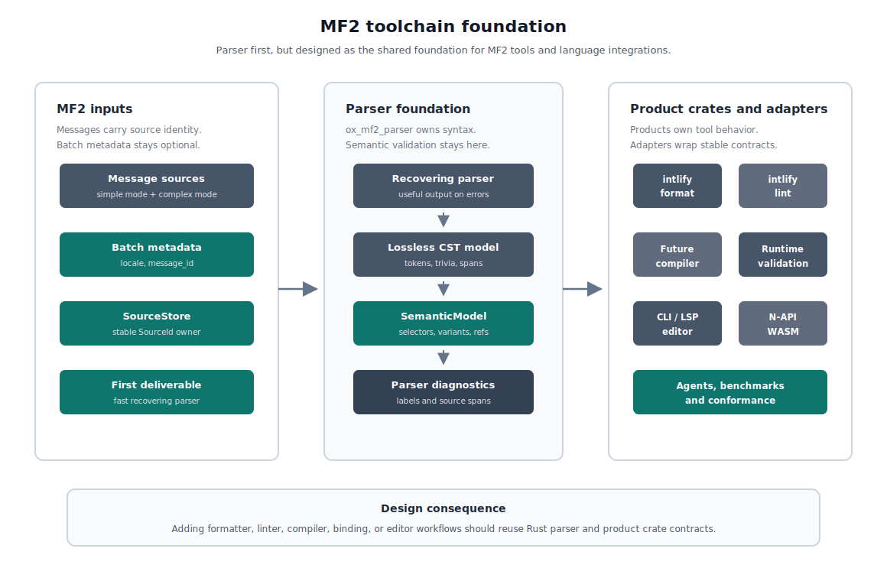
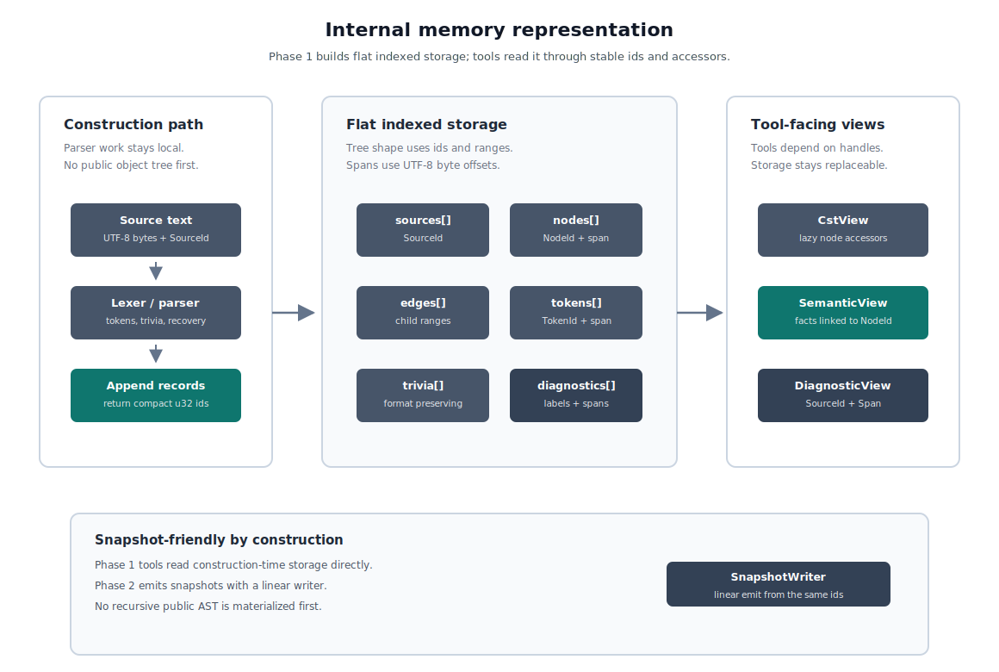
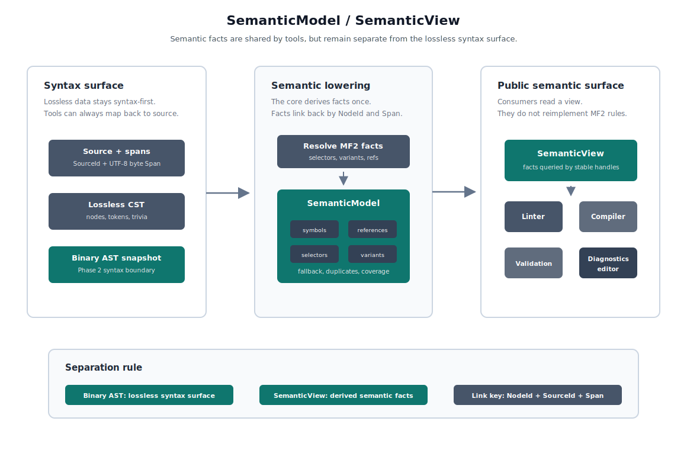
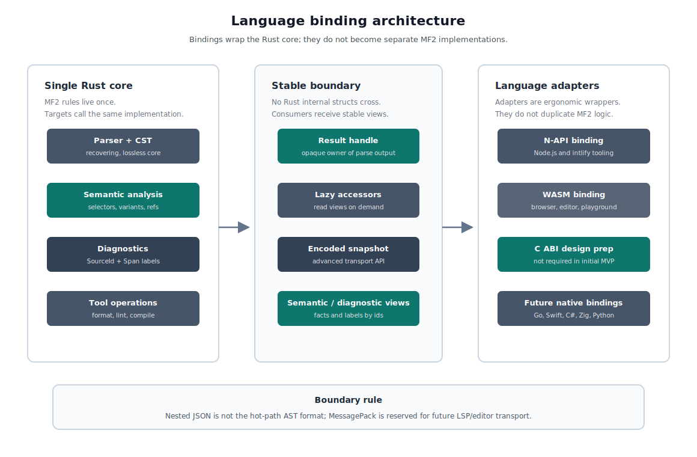
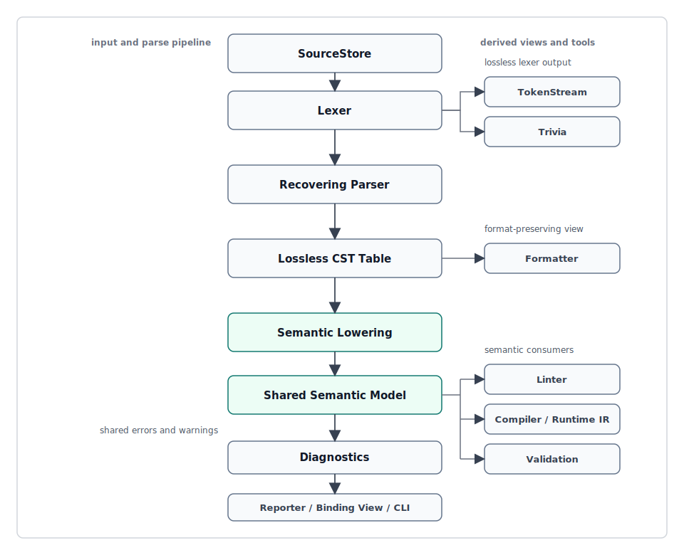
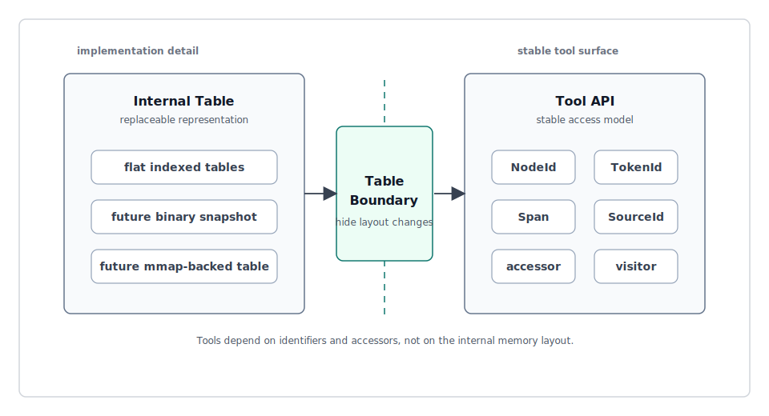

# ox-mf2 Toolchain Foundation Design

## Purpose

ox-mf2 is designed not only as a high-performance parser for MessageFormat 2.0 (MF2), but also as an MF2 toolchain foundation that can later support linting, formatting, compilation, diagnostics, and bindings.

The initial implementation focuses on the parser. However, tokens, trivia, spans, NodeId, diagnostics, and the table boundary are treated as part of the initial design so that later tools can be added without breaking the foundation.

## Design Overview

- Make the Rust core the single semantic implementation.
- In Phase 1, build a recovering, lossless, snapshot-friendly parser foundation.
- In Phase 2, make a versioned Binary AST snapshot the standard boundary for the public CST/AST view.
- Treat N-API and WASM as the primary language binding targets.
- Keep SemanticView separate from the lossless Binary AST snapshot and link it to NodeId / Span.
- Treat the Unicode WG interchange data model as an on-demand compatibility surface, not as a Phase 1 or Phase 2 deliverable.
- Reserve MessagePack for future LSP/editor transport, not as an AST representation.
- The Rust parser / AST / performance details for Phase 1 live in [002-ox-mf2-phase-1-rust-parser-design.md](./002-ox-mf2-phase-1-rust-parser-design.md).
- The implementation-oriented details for Phase 2 Binary AST, snapshots, bindings, and transport live in [003-ox-mf2-phase-2-binary-ast-bindings-design.md](./003-ox-mf2-phase-2-binary-ast-bindings-design.md).

## Design Philosophy

### Design as an MF2 Toolchain Foundation



The central design principle of ox-mf2 is **MF2 toolchain foundation**.

The parser is central, but the goal is not merely to build the fastest standalone parser. The goal is to build a foundation where linting, formatting, compilation, runtime validation, editor integration, and benchmarking can all sit on top of the same core model.

### Inherit oxc's High-Performance Design Philosophy

ox-mf2 may reuse some crates provided by oxc. This is not only about crate reuse. ox-mf2 also explicitly inherits oxc's high-performance design philosophy: phase separation, data-oriented tables, allocation control, and benchmark-driven design.

- phase separation: make lexer, parse, semantic lowering, diagnostics, formatting, and linting individually measurable.
- data-oriented tables: avoid relying only on pointer traversal, and use NodeId plus flat indexed tables to make downstream work fast.
- stable identifiers: allow AST/CST nodes, tokens, and sources to be referenced by IDs.
- allocation control: avoid unnecessary heap allocation during the parse phase.
- benchmark-driven design: measure internal phases, not only end-to-end performance.

However, ox-mf2 does not adopt the same arena typed AST model as oxc. MF2 has a smaller syntax surface than JavaScript/TypeScript, and formatting / linting matter more for an internationalization message format. Therefore, flat indexed tables are the primary representation.

### Make the Core Extensible Into a Toolchain

Existing dedicated parser toolchains show that it is effective to put the parser, CST/AST, semantic analysis, and diagnostics in the core, and place CLI, LSP, formatter, linter, and external toolchain integrations around it as adapters.

ox-mf2 follows the same direction. It puts the MF2-specific parser, CST, semantic model, and diagnostics in the core, while external toolchain integrations are designed as adapters. This keeps the core focused on MF2 while allowing extension to Node bindings, CLI, LSP, and various linter integrations.

### Binary AST Is Not the Initial Internal Representation

The Binary AST-style designs in ox-jsdoc and typescript-go are useful references for bindings, snapshots, persistence, and fast transfer.

However, ox-mf2 does not make Binary AST the first primary internal representation. The Phase 1 tool-facing syntax boundary is centered on NodeId, TokenId, Span, and accessors. This preserves the table boundary, avoids forcing the parser construction path to be Binary AST-first, and allows the public AST view to move to a Binary AST snapshot in Phase 2.

## Agreed Design Decisions

### Initial Responsibilities

ox-mf2 is a `toolchain foundation`.

The parser is implemented first, but token, span, accessor, and table boundary design are also included from the initial stage. This allows linting, formatting, and compilation to be added later.

### Syntax Tree

Adopt `Lossless CST + SemanticModel`.

```text
source
  -> lexer / token stream + trivia
  -> lossless CST
  -> SemanticModel / SemanticView
  -> linter / formatter / compiler
```

The formatter primarily uses CST, tokens, and trivia. The linter and compiler primarily use the semantic model.

### Parser Error Handling

Adopt a `recovering parser`.

Even when syntax errors are found, the parser builds as much CST as possible and returns diagnostics. If a fatal gap exists, the SemanticModel may be partially generated or not generated at all.

The Phase 1 result shape, recovery behavior, and diagnostic cost model are defined in [002-ox-mf2-phase-1-rust-parser-design.md](./002-ox-mf2-phase-1-rust-parser-design.md).

### Internal Memory Representation



Adopt `flat indexed tables`.

Core identifiers use stable `u32` indexes, and spans use UTF-8 byte offsets. The same identifier model is shared by construction-time CST tables, future Binary AST snapshots, SemanticView, diagnostics, formatters, linters, and language bindings.

Linters, formatters, and compilers do not depend directly on typed node structs. They read through NodeId and accessors.

Internal tables are snapshot-friendly. ox-mf2 avoids building a public typed AST first and then recursively converting it to Binary AST. Instead, the parser and lowering phase generate table-oriented records so that SnapshotWriter can emit nodes, edges, tokens, trivia, inline span fields, strings, and diagnostics in a linear pass.

Phase 1 Rust tools may directly use construction-time flat indexed tables. From Phase 2 onward, the Binary AST decoder/accessor view shared by Rust, N-API, WASM, and other consumers becomes the canonical public AST view. This aligns the public AST surface across languages while allowing the parser to use efficient internal construction tables.

The Phase 1 table contract, identifier model, and source/span rules are defined in [002-ox-mf2-phase-1-rust-parser-design.md](./002-ox-mf2-phase-1-rust-parser-design.md). The Phase 2 Binary AST snapshot layout is defined in [003-ox-mf2-phase-2-binary-ast-bindings-design.md](./003-ox-mf2-phase-2-binary-ast-bindings-design.md).

### Formatter

Adopt `format-preserving first`.

The formatter itself does not need to be part of the initial MVP. However, the parser/table layer keeps tokens, trivia, original lexemes, delimiter spans, recovery nodes, and source-map-like information so that a formatter can be built later.

From Phase 2 onward, the formatter's public AST input is the Binary AST decoder/accessor view. The Rust implementation may have an internal fast path over construction-time tables when needed, but the stable public formatter surface is aligned with the Binary AST view shared by Rust, N-API, and WASM consumers.

A future formatter should support at least two modes.

- preserve mode: preserve the original representation as much as possible.
- canonical mode: format to the standard ox-mf2 style.

### Linter

Adopt `diagnostics foundation`.

The initial MVP does not need to implement many lint rules. However, the diagnostic model is designed early so that parser errors and lint diagnostics can share the same foundation.

From Phase 2 onward, the linter's public AST input is the Binary AST decoder/accessor view. Rule implementations may use Rust-internal semantic fast paths, but rule-facing / binding-facing traversal should converge on the same public Binary AST view whenever practical.

Core diagnostics use SourceId and UTF-8 byte Span as the canonical location model. Labels also have byte spans. CLI, LSP, and editor integration are responsible for converting spans to line/column or UTF-16 positions through SourceStore.

The concrete diagnostic shape and success-path cost constraints are defined in [002-ox-mf2-phase-1-rust-parser-design.md](./002-ox-mf2-phase-1-rust-parser-design.md).

### SemanticModel / SemanticView



Adopt a `shared semantic model`.

This is not a low-level IR immediately before runtime execution. It is a semantic information model shared by the linter, compiler, and validation.

From Phase 2 onward, the public semantic surface is SemanticView, and semantic facts are linked to Binary AST NodeId and Span. Semantic information is not forced into the initial Binary AST snapshot. Binary AST handles the lossless CST surface, while SemanticView handles semantic facts such as declarations, references, selectors, variants, fallback/default information, duplicate keys, and coverage metadata.

Candidate contents:

- symbol table
- variable declarations
- variable references
- function annotations
- selector list
- variant matrix
- fallback/default variant
- duplicate key set
- reachability / coverage metadata
- source span mapping

### Unicode WG Interchange Data Model

Adopt `defer until compatibility surface is needed`.

The Unicode WG data model in `refers/message-format-wg/spec/data-model` is an interchange representation for messages. It is useful for cross-implementation compatibility, JSON/YAML exchange, legacy format conversion, and translation-format integration, but it is not required to be the internal representation of an implementation.

ox-mf2 therefore does not make the WG data model a mandatory Phase 1 or Phase 2 output. Phase 1 focuses on `CstTables + CstView + SemanticModel`, and Phase 2 focuses on the Binary AST snapshot and language binding boundary.

When a compatibility surface is needed, ox-mf2 can add a dedicated `DataModelView` / `InterchangeDataModel` API that exports and imports the WG data model from the existing semantic layer. The important constraint is that `SemanticModel` must retain enough information to derive the WG data model later, including message kind, declarations, selectors, variants, patterns, expressions, markup, options, attributes, and cooked literal values.

This keeps the hot parser and binding path compact while preserving a clear path for future compatibility APIs.

### Language Binding



Adopt `Rust core as the single semantic implementation`.

ox-mf2 does not reimplement MF2 parsing, CST construction, semantic analysis, diagnostics, formatting, or linting per target language. The Rust core is the only implementation of MF2 semantics, and each language binding is a thin ergonomic wrapper around that core.

N-API, WASM, C ABI, and other language bindings are not required in the initial MVP. However, the Rust core external API is designed to be binding-friendly from the beginning.

Binding implementation priority:

1. N-API binding: the primary Node.js target for intlify and JavaScript tooling integration
2. WASM binding: the portable target for browsers, playgrounds, editor extensions, and edge runtime integration
3. C ABI binding design: the foundation for future Go, Swift, C#, Zig, Python FFI, and broader native language integration

Rust internal types are not directly exposed to other languages. Boundary types such as Binary AST decoder/accessor views, DiagnosticView, and encoded snapshot views are allowed.

The binding layer is an ergonomic surface, not a place to duplicate MF2 semantics. JS, WASM, C ABI, Go, Swift, C#, and other consumers call the same Rust core and receive stable views, handles, diagnostics, formatted text, and encoded snapshots.

When returning full CST/AST output across a language boundary, the canonical Phase 2 product boundary is a versioned Binary AST snapshot, not a nested JSON AST. Debug JSON and compatibility JSON may exist, but they are not the standard hot-path representation.

The Phase 2 Binary AST snapshot focuses on the lossless CST surface. Semantic information is exposed separately as SemanticView or a later semantic snapshot. N-API and WASM bindings return result objects with lazy decoder/accessors rather than eagerly materialized object trees. Raw snapshot bytes are not included in the default result; they are available only through explicit advanced/debug/transport APIs.

MessagePack is not the CST/AST representation of ox-mf2. It is reserved as a future transport for long-lived language-service workflows such as LSP, editor integration, daemon mode, and repeated semantic queries.

The detailed design for Binary AST, bindings, snapshots, and transport is defined in [003-ox-mf2-phase-2-binary-ast-bindings-design.md](./003-ox-mf2-phase-2-binary-ast-bindings-design.md).

### Parser API

Adopt `parse_source + SourceStore`.

SourceStore is the common source ownership layer for single parse, batch parse, diagnostics, editor boundaries, and future snapshot roots sections. Convenience APIs also register source text internally and process through SourceId.

MF2 workloads often contain many messages in one file, one locale set, or one project, so batch parsing is a first-class API. Batch metadata such as path, locale, message_id, and base_offset is used for identity, diagnostics, fixtures, benchmarks, and future snapshot root mapping. It must not change parser semantics.

The Phase 1 parser APIs, SourceStore contract, ParseInput metadata, ParseOptions defaults, and result types are defined in [002-ox-mf2-phase-1-rust-parser-design.md](./002-ox-mf2-phase-1-rust-parser-design.md). Snapshot-producing APIs are defined in [003-ox-mf2-phase-2-binary-ast-bindings-design.md](./003-ox-mf2-phase-2-binary-ast-bindings-design.md).

### Suppression / Directive Comments

Adopt `diagnostic suppression boundary only`.

At the initial stage, ox-mf2 does not fix a concrete directive comment syntax inside MF2. However, the diagnostic pipeline has a boundary where diagnostics can be suppressed.

Suppression is treated as a diagnostic-layer concern, not a parser syntax policy. The concrete suppression data shape can be defined when linter and language-service workflows enter the implementation phase.

### Benchmark

Adopt `phase-separated benchmark`.

In addition to hyperfine measurement for the entire CLI, internal performance is made visible by phase.

Target phases:

- lexer
- parse_cst
- lower_semantic
- diagnostics
- encode_snapshot
- decode_snapshot
- snapshot_accessor_traversal
- snapshot_to_bytes_copy
- binding_call
- parse_batch_to_snapshot
- format_preserve
- format_canonical
- e2e_parse
- e2e_lint

The Phase 1 parser / AST / performance design is detailed in [002-ox-mf2-phase-1-rust-parser-design.md](./002-ox-mf2-phase-1-rust-parser-design.md).

### Crate Structure

Adopt `core split minimal`.

Initial candidates:

```text
crates/
  ox_mf2_syntax        # lexer, token, CST, parser, recovery
  ox_mf2_semantic      # semantic model, symbol/reference/selector/variant analysis
  ox_mf2_diagnostics   # Diagnostic, Severity, Label, suppression boundary
  ox_mf2               # facade API
```

Future candidates:

```text
ox_mf2_linter
ox_mf2_formatter
ox_mf2_codegen
ox_mf2_cli
ox_mf2_napi
ox_mf2_wasm
```

### Spec Tracking

Adopt `Unicode spec primary + TC39 proposal tracking`.

Primary source:

- `refers/message-format-wg/spec`
- `refers/message-format-wg/spec/data-model`

Tracked source:

- `refers/proposal-intl-messageformat`

MF2 syntax and the message data model primarily follow the Unicode WG spec. The data model is tracked as a future compatibility/export surface, not as the parser's primary internal representation. Intl.MessageFormat API integration and ECMAScript-side behavior track the TC39 proposal.

### Conformance Tests

Adopt `spec fixtures + implementation fixtures`.

```text
fixtures/
  spec/
    unicode-wg/
    tc39/
  implementations/
    formatjs/
    messageformat/
    mf2-tools/
    ox-content/
  recovery/
  formatter/
  diagnostics/
```

Spec fixtures are the basis for conformance checks, and implementation fixtures are used for compatibility and diff detection.

Spec fixtures are based on the Unicode Message Format WG spec and the TC39 proposal. Their purpose is to verify that ox-mf2 accepts MF2 that is valid under the spec and rejects syntax that is invalid under the spec. In other words, spec fixture results represent parser conformance.

Implementation fixtures are based on existing parser implementations and real-world messages. Their purpose is to observe differences between cases accepted/rejected by existing implementations and ox-mf2. They include edge cases, error recovery, MF1 compatibility cases, and real project messages. Implementation fixture results do not define spec conformance. They are treated as compatibility information, diff detection, and input for design decisions.

For example, spec fixtures can be structured as follows.

```text
fixtures/spec/unicode-wg/valid/local-declaration.mf2
fixtures/spec/unicode-wg/valid/matcher-select.mf2
fixtures/spec/unicode-wg/invalid/unclosed-expression.mf2
fixtures/spec/tc39/valid/intl-messageformat-api-options.mf2
```

Implementation fixtures can be structured as follows.

```text
fixtures/implementations/messageformat/accepted-edge-cases.mf2
fixtures/implementations/mf2-tools/error-recovery-cases.mf2
fixtures/implementations/formatjs/mf1-compat-cases.mf1
fixtures/implementations/ox-content/real-world-messages.mf2
```

Implementation fixtures are not a substitute for the specification. Even if another implementation accepts a message, ox-mf2 may reject it when it violates the Unicode WG spec or the TC39 proposal. The difference should still be recorded as compatibility input.

## Initial Architecture



## Table Boundary

The table boundary is the boundary between the internal table representation and tool-facing APIs.



This boundary allows linter, formatter, and compiler APIs to remain mostly stable even if the initial implementation uses flat indexed tables and the public AST view later moves to Binary AST-style compact tables.

## Phase Plan

### MVP / Phase 1

The first phase focuses on the parser foundation.

- lexer
- recovering CST parser
- diagnostics model
- conformance fixtures
- implementation fixtures for compatibility observation
- phase-separated benchmark
- parser performance design
- snapshot-friendly flat indexed tables
- Rust facade API with SourceStore / SourceId
- Rust batch parsing API shape

### Phase 2

The second phase adds the cross-language product boundary.

- versioned Binary AST snapshot
- SnapshotWriter
- lossless CST snapshot sections for roots, sources, nodes, edges, tokens, optional trivia, diagnostics, diagnostic labels, string table, optional source text data, and optional extended data
- spans are stored inline in NodeRecord, TokenRecord, TriviaRecord, and DiagnosticRecord, not in a separate section
- Rust Binary AST decoder / accessor API
- N-API binding with lazy decoder/accessor API
- WASM binding with portable decoder/accessor API
- first-class parseBatch API with shared snapshot buffer and shared string table
- semantic model exposed separately as SemanticView or a future semantic snapshot
- C ABI design preparation without requiring a stable C ABI implementation
- snapshot encoding / decoding / binding benchmarks

### Phase 3

The third phase expands ox-mf2 into broader tooling workflows.

- formatter expansion
- linter expansion
- language service / LSP model
- editor workflow cache and repeated query model
- optional MessagePack transport for internal language-service sessions
- editor workflow benchmarks that separate parser, semantic, snapshot, transport, and binding costs

## Non-Goals

The initial stage does not implement the following.

- Binary AST-first internal representation in Phase 1
- Unicode WG data model import/export API unless a compatibility surface is required
- full linter ruleset
- canonical formatter
- N-API / WASM binding
- MessagePack transport
- complete Intl.MessageFormat runtime

However, the initial design includes the boundaries required to add these later.
