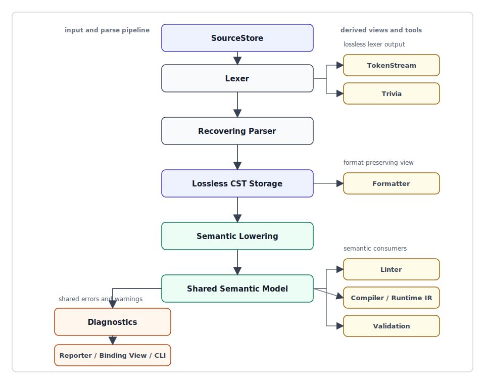
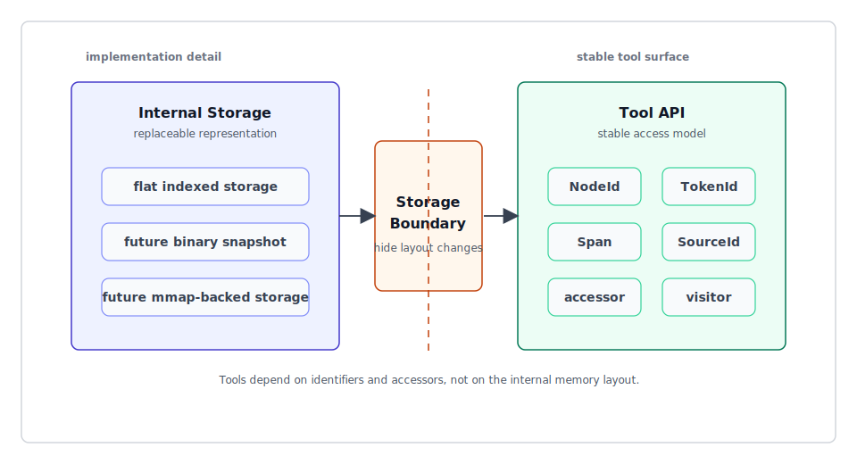

# ox-mf2 Toolchain Foundation Design

## Purpose

ox-mf2 is designed not only as a high-performance parser for MessageFormat 2.0 (MF2), but also as an MF2 toolchain foundation that can later support linting, formatting, compilation, diagnostics, and bindings.

The initial implementation will focus on the parser. However, token, trivia, span, NodeId, diagnostics, and the storage boundary are part of the initial design so that later tools can be added without breaking the foundation.

## Design Philosophy

### MF2 toolchain foundation

The core design principle of ox-mf2 is **MF2 toolchain foundation**.

The parser is central, but the goal is not only to build the fastest standalone parser. The foundation should support linting, formatting, compilation, runtime validation, editor integration, and benchmarking on top of the same core model.

### Inherit oxc's high-performance design philosophy

ox-mf2 will use some crates provided by oxc. However, this is not only about reusing crates; ox-mf2 also explicitly inherits high-performance design principles such as phase separation, data-oriented storage, allocation control, and benchmark-driven design.

- phase separation: make lexer, parse, semantic lower, diagnostics, format, and lint phases measurable independently
- data-oriented storage: avoid relying only on pointer traversal, and use NodeId plus flat indexed storage to make later processing fast
- stable identifiers: make AST/CST nodes, tokens, and sources referable by IDs
- allocation control: avoid unnecessary heap allocation during the parse phase
- benchmark-driven design: measure not only end-to-end performance but also each internal phase

However, ox-mf2 will not directly adopt the same arena typed AST model as oxc. MF2 has a smaller syntax surface than JavaScript/TypeScript, and formatting/linting needs are central for an internationalization message format, so flat indexed storage will be the primary representation.

### Make the core extensible into a toolchain

Existing dedicated parser toolchains show that it is effective to place the parser, CST/AST, semantic analysis, and diagnostics in the core, while keeping CLI, LSP, formatter, linter, and external toolchain integrations as adapters around it.

ox-mf2 will follow the same direction: the MF2-specific parser, CST, semantic model, and diagnostics form the core, and external toolchain integrations are designed as adapters. This keeps the core focused on MF2 while allowing it to expand into Node bindings, CLI, LSP, and other linter integrations.

### BinaryAST is not the initial internal representation

BinaryAST-style designs in ox-jsdoc and typescript-go are useful references for bindings, snapshots, persistence, and high-speed transfer.

However, ox-mf2 will not start with BinaryAST as the primary internal representation. The initial representation will be flat indexed storage, and the external API will be centered on NodeId, TokenId, Span, and accessors. This keeps a storage boundary that allows the internals to move to BinaryAST or compact snapshots later.

## Agreed Design Decisions

### Initial responsibility

ox-mf2 is a `toolchain foundation`.

The parser will be built first, but token, span, accessor, and storage boundary design are included from the beginning so that linting, formatting, and compilation can be added later.

### Syntax tree

Use `Lossless CST + Semantic AST`.

```text
source
  -> lexer / token stream + trivia
  -> lossless CST
  -> semantic AST / shared semantic model
  -> linter / formatter / compiler
```

The formatter primarily uses the CST, tokens, and trivia. The linter and compiler primarily use the semantic model.

### Parser error handling

Use a `recovering parser`.

Even when syntax errors are found, the parser should build a CST as far as possible and return diagnostics. The semantic AST / semantic model may be partially generated, or may not be generated at all, when there are fatal missing parts.

```rust
ParseResult {
  cst,
  semantic: Option<SemanticModel>,
  diagnostics,
}
```

### Internal memory representation

Use `flat indexed storage`.

```rust
Ast {
  nodes: Vec<NodeRecord>,
  edges: Vec<NodeId>,
  tokens: Vec<Token>,
  trivia: Vec<Trivia>,
  spans: Vec<Span>,
}
```

The linter, formatter, and compiler should not depend directly on typed node structs. They should read through NodeId and accessors.

```rust
let kind = ast.kind(node_id);
let span = ast.span(node_id);
let children = ast.children(node_id);
```

### Formatter

Use `format-preserving first`.

The formatter itself does not have to be part of the initial MVP. However, the parser/storage layer must retain token, trivia, original lexeme, delimiter span, recovery node, and source-map-like information so that a formatter can be built later.

The future formatter should support at least the following two modes.

- preserve mode: preserve the original representation as much as possible
- canonical mode: format into the standard ox-mf2 style

### Linter

Use `diagnostics foundation`.

The initial MVP does not have to implement many lint rules, but the diagnostic model should be designed first so that parser errors and lint diagnostics can use the same foundation.

```rust
Diagnostic {
  source: SourceId,
  span: Span,
  severity: Severity,
  code: DiagnosticCode,
  message: CompactString,
  labels: Vec<Label>,
  help: Option<Help>,
}
```

### Semantic AST / IR

Use a `shared semantic model`.

This is not a low-level IR immediately before runtime execution. It is a semantic information model shared by the linter, compiler, and validation.

Candidate contents:

- symbol table
- variable declarations
- variable references
- function annotations
- selector list
- variant matrix
- fallback/default variant
- duplicate key set
- reachability / coverage metadata
- source span mapping

### JS / Node binding

Use `binding boundary only`.

The initial MVP does not require an N-API or WASM implementation. However, the external API of the Rust core should be designed in a binding-friendly shape.

```rust
parse(source, options) -> ParseResult
lower(cst, options) -> SemanticModel
diagnostics -> serializable model
```

Rust internal types should not be exposed directly to JS. The design should allow boundary types such as AstView and DiagnosticView.

### Parser API

Use `parse_source + SourceStore`.

```rust
let mut sources = SourceStore::new();
let source_id = sources.add("messages/en.mf2", source_text);
let result = Parser::new(&sources).parse_source(source_id, ParseOptions::default());
```

Provide a convenience API for one-shot use.

```rust
parse_message(source: &str) -> ParseResult
```

The standard internal model is SourceId / SourceStore.

### Suppression / directive comment

Use `diagnostic suppression boundary only`.

At the initial stage, ox-mf2 will not fix a specific directive comment syntax inside MF2. However, the diagnostic pipeline should have a boundary where diagnostics can be suppressed.

```rust
Suppression {
  source: SourceId,
  span: Span,
  target: SuppressionTarget,
  reason: Option<CompactString>,
}
```

### Benchmark

Use `phase-separated benchmark`.

In addition to hyperfine measurements for the whole CLI, internal performance should be visible per phase.

Target phases:

- lexer
- parse_cst
- lower_semantic
- diagnostics
- format_preserve
- format_canonical
- e2e_parse
- e2e_lint

### Crate structure

Use `core split minimal`.

Initial candidates:

```text
crates/
  ox_mf2_syntax        # lexer, token, CST, parser, recovery
  ox_mf2_semantic      # semantic model, symbol/reference/selector/variant analysis
  ox_mf2_diagnostics   # Diagnostic, Severity, Label, suppression boundary
  ox_mf2               # facade API
```

Future candidates:

```text
ox_mf2_linter
ox_mf2_formatter
ox_mf2_codegen
ox_mf2_cli
ox_mf2_napi
ox_mf2_wasm
```

### Specification tracking

Use `Unicode spec primary + TC39 proposal tracking`.

Primary source:

- `refers/message-format-wg/spec`

Tracked source:

- `refers/proposal-intl-messageformat`

The MF2 syntax and message data model should primarily follow the Unicode WG spec. Intl.MessageFormat API integration and ECMAScript-side behavior should track the TC39 proposal.

### Conformance test

Use `spec fixtures + implementation fixtures`.

```text
fixtures/
  spec/
    unicode-wg/
    tc39/
  implementations/
    formatjs/
    messageformat/
    mf2-tools/
    ox-content/
  recovery/
  formatter/
  diagnostics/
```

Spec fixtures are the basis for conformance checks, while implementation fixtures are used for compatibility and diff detection.

Spec fixtures are based on the Unicode Message Format WG spec and the TC39 proposal. Their purpose is to verify that ox-mf2 accepts syntactically valid MF2 and rejects syntax that is invalid according to the specification. In other words, the result of spec fixtures represents parser conformance.

Implementation fixtures are based on existing parser implementations and real-world messages. Their purpose is to observe behavioral differences between ox-mf2 and cases accepted or rejected by existing implementations, including edge cases, error recovery, MF1 compatibility cases, and messages from real projects. The result of implementation fixtures does not define spec conformance; it is compatibility information, diff detection, and design-decision input.

For example, spec fixtures may be structured as follows.

```text
fixtures/spec/unicode-wg/valid/local-declaration.mf2
fixtures/spec/unicode-wg/valid/matcher-select.mf2
fixtures/spec/unicode-wg/invalid/unclosed-expression.mf2
fixtures/spec/tc39/valid/intl-messageformat-api-options.mf2
```

Implementation fixtures may be structured as follows.

```text
fixtures/implementations/messageformat/accepted-edge-cases.mf2
fixtures/implementations/mf2-tools/error-recovery-cases.mf2
fixtures/implementations/formatjs/mf1-compat-cases.mf1
fixtures/implementations/ox-content/real-world-messages.mf2
```

Implementation fixtures are not a substitute for the specification. Even if another implementation accepts a message, ox-mf2 may reject it when it violates the Unicode WG spec or the TC39 proposal. However, that difference should be recorded as compatibility input.

## Initial Architecture



## Storage Boundary

The storage boundary is the boundary between the internal storage representation and the tool-facing API.



This boundary allows the initial implementation to use flat indexed storage while keeping the linter, formatter, and compiler APIs mostly stable even if the internal representation later moves to a BinaryAST-style compact storage.

## Non-goals

The initial stage does not aim to implement the following.

- BinaryAST-first internal representation
- full linter ruleset
- canonical formatter
- N-API / WASM binding
- complete Intl.MessageFormat runtime

However, the initial design should include the boundaries needed to add them later.
