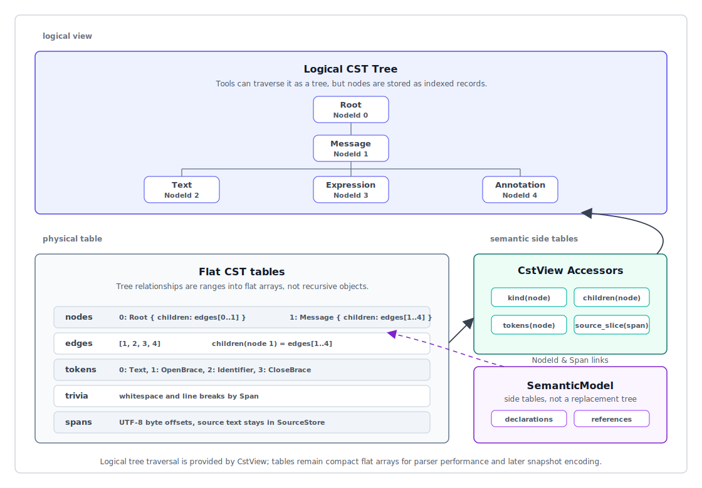
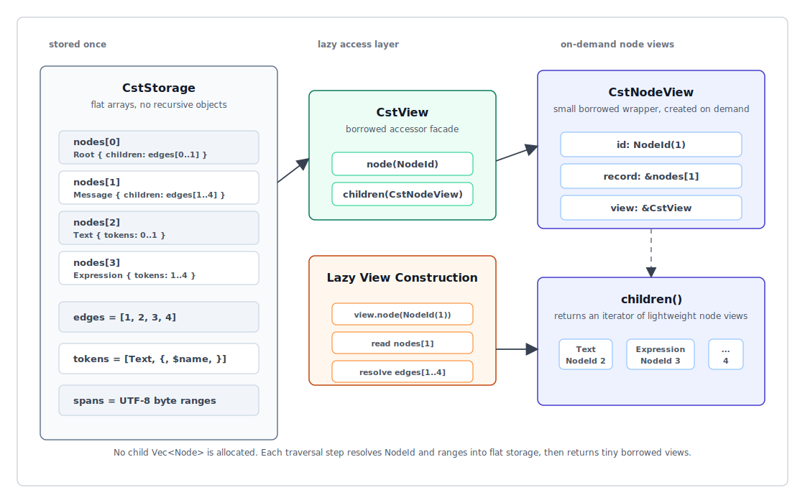
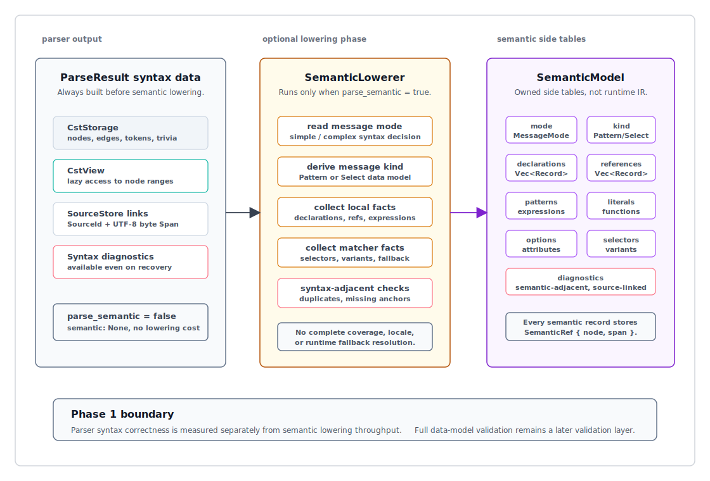
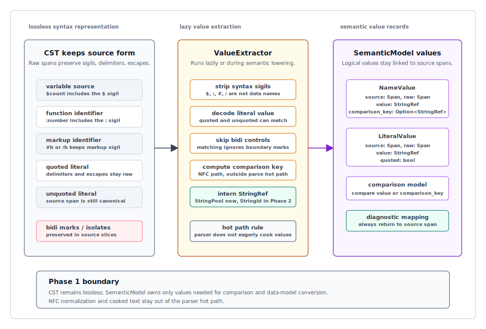

# ox-mf2 Phase 1 Rust Parser / AST / Performance Design

## Purpose

This document defines the Phase 1 implementation design for the Rust MF2 parser. It covers not only parser performance, but also lossless CST, SemanticModel, SyntaxKind, token/trivia, accessors, diagnostics, recovery, tests, and benchmarks.

The foundation document is [001-ox-mf2-toolchain-foundation.md](./001-ox-mf2-toolchain-foundation.md). Binary AST snapshot details live in [003-ox-mf2-phase-2-binary-ast-snapshot-design.md](./003-ox-mf2-phase-2-binary-ast-snapshot-design.md), language binding details live in [004-ox-mf2-phase-2-language-bindings-design.md](./004-ox-mf2-phase-2-language-bindings-design.md), and API error code ranges live in [appendix-ox-mf2-error-code.md](./appendix-ox-mf2-error-code.md). This document focuses on the parser implementation path before Binary AST snapshot encoding becomes the Phase 2 product boundary.

This design takes several ideas from the ox-jsdoc performance design: parser/semantic separation, clear source lifetime, allocation discipline, scanner/parser boundaries, and measurement-driven optimization.

## Goals

Phase 1 builds a Rust parser core that is fast, recoverable, lossless enough for formatter/linter work, and ready for Phase 2 snapshot encoding.

Primary goals:

1. Keep the parse hot path small.
2. Preserve tokens, trivia, spans, and source slices required by downstream tools.
3. Separate parser work from semantic lowering and validation.
4. Avoid a public typed AST object graph.
5. Use table-oriented records that can later be passed to SnapshotWriter.
6. Make parser, diagnostics, recovery, and allocation costs measurable separately.
7. Provide a stable accessor surface for formatters, linters, and compilers from Phase 1.
8. Provide SyntaxKind and fixture-driven tests that can track the Unicode WG spec.

## Non-Goals

Phase 1 does not target the following optimizations.

- Binary AST snapshot encoding as part of the normal parse output
- N-API / WASM boundary overhead
- MessagePack / LSP transport
- full semantic validation
- canonical formatting
- complete linter rule execution
- public recursive typed AST hierarchy
- final Binary AST snapshot schema freeze

These belong to later phases. Phase 1 shapes the parser so that these capabilities can be added without rewriting the parser foundation.

## Phase Separation

The parser does not perform all correctness work during parsing.

```text
source
  -> lexer / scanner helpers
  -> recovering CST parser
  -> diagnostics
  -> optional semantic lowering
  -> later formatter / linter / compiler
```

Parser responsibilities:

- Recognize MF2 syntax.
- Build lossless CST tables.
- Preserve tokens, trivia, original lexemes, and byte spans.
- Recover where possible.
- Report parser diagnostics.

Parser non-responsibilities:

- final selector coverage analysis
- duplicate declaration policy beyond syntax-adjacent cases
- runtime message resolution
- locale-aware behavior
- formatter style decisions
- linter rule policy
- Intl.MessageFormat API behavior

Semantic lowering and validation can interpret the CST later.

## Phase 1 Deliverables

Phase 1 is not only "a fast parser"; it builds the Rust core foundation needed to add later tools without breaking downstream consumers.

Phase 1 deliverables:

- `SourceStore`: manages source text, path, line index, and SourceId.
- `Scanner`: parser-internal component that reads source bytes and recognizes tokens/trivia.
- `Parser`: recovering CST parser that recognizes syntax and produces CstTables plus diagnostics.
- `ParseWorkspace`: public workspace reusable for repeated parse, batch parse, benchmarks, and LSP.
- `SyntaxKind`: stable compact kind enum for message modes, nodes, tokens, trivia, errors, and missing nodes.
- `CstTables`: flat indexed tables containing nodes, edges, tokens, and trivia. Spans are stored inline in records.
- `CstView`: accessor surface for reading CST from NodeId / TokenId / Span.
- `SemanticModel`: optional semantic lowering result shared by linter/compiler/validation.
- `Diagnostic`: shared location model for parser diagnostics and future lint diagnostics.
- `Fixture runner`: test harness for spec fixtures, implementation fixtures, and recovery fixtures.
- `Benchmark harness`: phase-separated benchmarks and hyperfine CLI benchmarks.

Phase 1 does not make Binary AST snapshot the standard output. However, CstTables and accessors are shaped so that Phase 2 SnapshotWriter can encode them with a linear transformation.

## AST / CST Terminology

In ox-mf2, the primary Phase 1 parse output is `CstTables`. This is a lossless syntax tree and the basis for formatters and recovery diagnostics.

CST and AST have different purposes.

- CST, Concrete Syntax Tree: represents the concrete source syntax as losslessly as possible. It keeps tokens, delimiters, trivia, escapes, missing/error nodes, and source spans needed to reconstruct, diagnose, and format the original source.
- AST, Abstract Syntax Tree: abstracts away surface syntax and is easier to process semantically. It often omits delimiters, trivia, parentheses, and quote presence, and focuses on semantic units such as declarations, references, selectors, and variants.

MF2 requires good formatting, diagnostics, recovery, and preserve-mode formatting. Therefore the Phase 1 base representation is CST. Linters, compilers, and validation also need AST-like semantic information, so a `SemanticModel` is lowered from the CST.

`CstTables + CstView + optional SemanticModel` is conceptually a tree, but physically represented as flat indexed tables and side tables.



This document uses the following terms.

- CST: a lossless syntax tree that preserves tokens, trivia, delimiters, error/missing nodes, and byte spans.
- SemanticModel: semantic information lowered from CST, such as declarations, references, selectors, and variants.
- Binary AST snapshot: the Phase 2 cross-language public CST/AST view. It is not the normal Phase 1 parse output.
- typed AST object graph: a recursive Rust struct tree. It is not adopted as the Phase 1 public API.

Therefore, the answer to "does Phase 1 need an AST?" is: it needs `CstTables + CstView + optional SemanticModel`, not a recursive typed AST.

## SyntaxKind Design

`SyntaxKind` is the shared classification used by parser, CstTables, diagnostics, formatter, linter, and snapshot encoding.

Design policy:

- `SyntaxKind` has a compact integer representation.
- Node kinds, token kinds, trivia kinds, error kinds, and missing kinds live in the same enum family.
- In Phase 2 Binary AST snapshots, the numeric `SyntaxKind` value is encoded directly as `kind: u16` in NodeRecord / TokenRecord / TriviaRecord.
- Once published, numeric values are part of the snapshot compatibility contract. Do not reorder, reuse, or change their meaning incompatibly. Add new kinds with new values.
- Snapshot decoders reject unknown `SyntaxKind` numeric values. Emitting a new kind in a core NodeRecord / TokenRecord / TriviaRecord affects compatibility and requires a major version change plus decoder/accessor updates. If backward compatibility is required, represent the case with an existing `Unknown` / `Error` / `Missing` kind or an optional section.
- Rust public APIs should not give semantic meaning to enum ordering, and consumer code should not rely on numeric comparison.
- Manage kinds by grammar category so spec changes are easy to track.
- Provide helper predicates so formatters and linters can test kind categories efficiently.

Expected categories:

```text
Root / Message / SimpleMessage / ComplexMessage
Pattern / Text / QuotedPattern
Expression / LiteralExpression / VariableExpression / FunctionExpression
Placeholder / Function / Option / Attribute
Declaration / LocalDeclaration / InputDeclaration
ComplexBody / QuotedPattern / Matcher / Selector / Variant / VariantKey
Markup / MarkupOpen / MarkupStandalone / MarkupClose
Token / Keyword / Punctuation / Name / Identifier / Variable / Literal / QuotedLiteral / UnquotedLiteral / CatchAllKey
Trivia / Whitespace / Bidi
Error / Missing / Unknown
```

`SyntaxKind` is not fixed as a strict 1:1 mapping to spec syntax categories. Implementation recovery nodes, missing nodes, and grouping nodes are needed. However, spec conformance fixtures track which kinds are produced.

Parser tables and snapshot encoding use the same numeric representation. SnapshotWriter does not remap `SyntaxKind` into a separate wire kind table. It writes the construction-time kind value directly. This keeps encode cost and compatibility surface small and makes the relationship between Phase 1 parser records and Phase 2 snapshot records simple.

## CST Construction Design

The parser commits accepted syntax as table-oriented records.

```rust
#[repr(C)]
pub(crate) struct CstNodeRecord {
  kind: u16,
  flags: u16,
  span_start: u32,
  span_end: u32,
  first_child: u32,
  child_count: u32,
  data_ref: u32,
}

#[repr(C)]
pub(crate) struct CstEdgeRecord {
  kind: u16,
  flags: u16,
  ref_id: u32,
}
```

`first_child` / `child_count` represent a range in the edge table. `CstEdgeRecord.kind` identifies node or token, and `ref_id` points to NodeId or TokenId. Tokens are reachable as CST children through the edge table, while token payloads stay in the token table.

Trivia is not mixed into child edges. Tokens hold leading/trailing trivia ranges. This lets `CstView` syntax traversal return node/token children, while formatters reconstruct source-preserving output from token order and trivia ranges.

Important constraints:

- The parser does not build a public typed AST and then convert it to tables.
- Spans store source byte offsets only.
- Delimiter spans and original lexemes must be recoverable from token/trivia/span data.
- Recovery nodes and missing nodes are stored in the same table as normal nodes.
- Malformed input should still return a root node and partial CST whenever possible.

### Record Layout / Size Budget

Phase 1 construction-time records are centered on `u32` indexes and fixed-size fields so that Phase 2 Binary AST snapshot encoding is mostly linear. The Rust layout in Phase 1 is not a public ABI. `#[repr(C)]` is used only to stabilize implementation size/alignment and simplify snapshot encoding and benchmarks.

Record size budget:

| Record | Target size | Notes |
| --- | --: | --- |
| `CstNodeRecord` | 24 bytes | `kind: u16`, `flags: u16`, span, child range, `data_ref` |
| `CstEdgeRecord` | 8 bytes | references node/token targets by `ref_id` |
| `TokenRecord` | 28 bytes or less | token kind, SourceId, span, compact trivia range |
| `TriviaRecord` | 16 bytes or less | trivia kind, SourceId, span |
| `DiagnosticRecord` | 32 bytes or less | SourceId, span, severity, code, message ref, label range |
| `DiagnosticLabelRecord` | 16 bytes or less | SourceId, span, message ref |

Implementation should include `size_of::<T>()` unit tests to prevent accidental field growth from hurting cache locality. Data that would make records larger should first be moved to `data_ref`, semantic side tables, diagnostic label tables, or future optional sections.

## CST Accessor Design

Downstream tools do not depend directly on raw `CstTables`. They read through `CstView`.

`CstView` does not eagerly build a recursive object tree. When a `NodeId` is requested, it creates a lightweight `CstNodeView` that references the node record and edge range in `CstTables`; traversal APIs such as `children()` lazily return the next node views.



```rust
CstView {
  source: SourceId,
  tables: &CstTables,
  sources: &SourceStore,
}
```

Expected accessors:

```rust
CstView::source() -> SourceId
CstView::root() -> Option<CstNodeView>
CstView::node(id: NodeId) -> Option<CstNodeView>
CstView::token(id: TokenId) -> Option<CstTokenView>
CstView::trivia(id: TriviaId) -> Option<CstTriviaView>
CstView::source_slice(span: Span) -> &str

CstNodeView::kind() -> SyntaxKind
CstNodeView::span() -> Span
CstNodeView::children() -> CstChildren
CstNodeView::tokens() -> CstNodeTokens

CstTokenView::kind() -> SyntaxKind
CstTokenView::span() -> Span
CstTokenView::text() -> &str
CstTokenView::leading_trivia() -> CstTriviaRange
CstTokenView::trailing_trivia() -> CstTriviaRange
```

Expected lightweight node view:

```rust
CstNodeView<'a> {
  id: NodeId,
  view: CstView<'a>,
}
```

Phase 1 does not require parent pointers in node records. Tools that need parent queries can build a traversal index as needed. Keeping parent pointers out of every node record avoids increasing parse hot-path memory traffic.

## SemanticModel Design



When `parse_semantic = true`, a lightweight SemanticModel is produced from the CST.

SemanticModel is not a runtime execution IR. It is shared semantic information for linter, compiler, and validation.

Minimal Phase 1 semantic model:

```rust
SemanticModel {
  mode: MessageMode,
  kind: SemanticMessageKind,
  declarations: Vec<DeclarationRecord>,
  references: Vec<ReferenceRecord>,
  patterns: Vec<PatternRecord>,
  expressions: Vec<ExpressionRecord>,
  markups: Vec<MarkupRecord>,
  literals: Vec<LiteralRecord>,
  functions: Vec<FunctionRecord>,
  options: Vec<OptionRecord>,
  attributes: Vec<AttributeRecord>,
  selectors: Vec<SelectorRecord>,
  variants: Vec<VariantRecord>,
}

enum SemanticMessageKind {
  Pattern,
  Select,
}
```

SemanticModel owns semantic facts, not semantic diagnostics. Parser-owned semantic validation diagnostics are produced by the `validate_semantics(model)` boundary defined by [012-ox-mf2-parser-semantic-validation-design.md](./012-ox-mf2-parser-semantic-validation-design.md). `SemanticDiagnostic` is a separate type with its own kebab-case `SemanticDiagnosticCode` catalog, kept out of `ParseResult.diagnostics` and out of Binary AST snapshot diagnostics sections. The Phase 3C linter consumes and surfaces these diagnostics; it does not own their detection semantics.

Every semantic record must link back to a source NodeId and Span.

```rust
SemanticRef {
  node: NodeId,
  span: Span,
}
```

Phase 1 semantic lowering performs:

- record message mode
- record data-model message kind
- collect local/input declarations
- collect variable references
- collect patterns, expressions, and markups
- collect literals, functions, options, and attributes
- collect matcher selectors
- collect variants and fallback/default markers
- detect syntax-adjacent duplicates or missing semantic anchors

Phase 1 does not perform:

- complete selector coverage
- locale-aware behavior
- runtime fallback resolution
- Intl.MessageFormat constructor/runtime behavior
- full linter rule policy

SemanticModel does not replace CST. Formatters use CST; linters, compilers, and validators combine SemanticModel with CstView.

`MessageMode` represents syntactic `simple-message` / `complex-message`. `SemanticMessageKind` represents data-model `PatternMessage` / `SelectMessage`. A simple message is always `Pattern`; a complex message is `Pattern` when its body is a quoted pattern and `Select` when its body is a matcher.

### Data Model Validation Boundary

The MF2 spec separates _Syntax Errors_ for malformed syntax from _Data Model Errors_ for invalid message structure.

The Phase 1 parser primarily handles Syntax Errors. Data Model Errors belong to the validation layer that uses SemanticModel. This document defines the SemanticModel foundation and source links needed by validation; [012-ox-mf2-parser-semantic-validation-design.md](./012-ox-mf2-parser-semantic-validation-design.md) owns the detailed semantic validation contract, diagnostic catalog, spans, ordering, and cascade policy.

Information that Phase 1 should expose to validation:

- declarations and implicit input variable references
- selectors and selector count
- variants and key count
- catch-all key `*`
- option identifiers
- source span and cooked value for literal keys

Examples of Data Model Errors:

- Variant Key Mismatch
- Missing Fallback Variant
- Missing Selector Annotation
- Duplicate Declaration
- Invalid Declaration Dependency
- Duplicate Option Name
- Duplicate Variant

These are not parser syntax errors. However, when optional semantic validation is enabled in Phase 1, SemanticModel keeps the source links needed to report them as diagnostics.

## Name / Identifier / Literal Value Design



CST preserves the source representation losslessly. SemanticModel handles logical values needed for comparison and data-model conversion.

Important spec differences:

- A variable name source includes `$`, but the data-model `name` does not.
- A function identifier source includes `:`, but the data-model `name` does not.
- A markup identifier source includes `#` or `/`, but the data-model `name` does not include the sigil.
- Quoted and unquoted literals are not semantically distinct if they have the same string value.
- Bidi marks / isolates around names remain in source, but are ignored for name/identifier/unquoted literal matching.
- Name and literal-key comparison uses code point sequences after NFC normalization.

Phase 1 policy:

- The parser does not create cooked values on the hot path.
- CST keeps raw source spans, delimiters, and escape sequences.
- SemanticModel computes values lazily or during lowering only when needed.
- Cooked values and comparison keys are records that can link back to source spans.
- NFC normalization is confined to semantic validation / comparison paths, not parse hot paths.

```rust
NameValue {
  source: Span,
  raw: Span,
  value: StringRef,
  comparison_key: Option<StringRef>,
}

LiteralValue {
  source: Span,
  raw: Span,
  value: StringRef,
  quoted: bool,
}
```

`StringRef` is an abstract name for an interned string table or owned string pool in Phase 1. In Phase 2 it maps to the indexed StringRef of the Binary AST snapshot, that is, a StringId into the string offsets section.

## Grammar / Spec Tracking Design

The parser grammar uses `refers/message-format-wg/spec` as the primary source. ECMAScript API integration and Intl.MessageFormat behavior are tracked through `refers/proposal-intl-messageformat`.

The Phase 1 grammar implementation splits parser functions by spec category and pairs each group with benchmarks and fixtures.

Expected parser function groups:

```text
parse_message
parse_simple_message
parse_complex_message
parse_complex_body
parse_pattern
parse_text
parse_expression
parse_function
parse_option
parse_attribute
parse_declaration
parse_matcher
parse_variant
parse_markup
parse_literal
parse_quoted_literal
parse_name
parse_identifier
```

Each group has:

- valid spec fixtures
- invalid spec fixtures
- recovery fixtures
- focused micro benchmark
- syntax kind snapshot

This lets grammar, SyntaxKind, diagnostics, and performance impact be reviewed separately when the spec changes.

## Message Mode Design

MF2 syntax distinguishes `simple-message` and `complex-message`.

```abnf
message = simple-message / complex-message

simple-message  = o [simple-start pattern]
complex-message = o *(declaration o) complex-body o
```

The Phase 1 parser handles this distinction explicitly.

```rust
enum MessageMode {
  Simple,
  Complex,
}
```

`parse_message` detects the mode and creates either a `SimpleMessage` or `ComplexMessage` node in the CST. Mode is not just semantic metadata; it affects whitespace, body structure, and recovery points at the syntax level.

### Simple Message

A simple message contains a single pattern. The empty string is also a valid simple message.

In a simple message, whitespace at the start and end of the message is significant and part of the message text. Therefore the parser must not discard leading/trailing whitespace as trivia.

Phase 1 behavior:

- `SimpleMessage` node has a child/token range equivalent to a pattern.
- Leading/trailing whitespace is preserved as a text token or a source span inside the pattern.
- Declarations, matchers, and quoted-pattern-only complex bodies are not treated as simple messages.
- If the first non-whitespace character violates the constraint, the parser tries complex parsing first; if that fails, it returns a parser diagnostic.

### Complex Message

A complex message consists of optional declarations and a complex body. The complex body is either a `quoted-pattern` or a `matcher`, so `{{ ... }}` without declarations or a matcher is still a complex message.

A complex message starts after optional whitespace `o` with `.input`, `.local`, `.match`, or quoted pattern `{{`.

Complex message structure:

```text
ComplexMessage
  declarations*
  complex_body
```

The complex body is `quoted-pattern` or `matcher`.

```text
ComplexBody = QuotedPattern | Matcher
```

In complex messages, leading and trailing message whitespace is not significant. The parser may preserve it as syntax trivia, but it is not message text.

Phase 1 behavior:

- `.input` and `.local` are parsed as declaration lists.
- `.match` is parsed as a matcher body.
- `{{ ... }}` is parsed as a quoted pattern body.
- `{{ ... }}` without declarations is still parsed as a complex message.
- If declarations are not followed by a complex body, return a recovery diagnostic.
- A matcher variant's quoted pattern is preserved as a variant child.

### Mode Detection and Recovery

Mode detection is on the parse hot path and must remain small.

Basic policy:

1. From the beginning of the source, skip only optional whitespace `o`, meaning `ws` or `bidi`, far enough to decide the mode.
2. If the first significant input is `.input`, `.local`, `.match`, or `{{`, treat it as a complex candidate.
3. If the complex candidate does not succeed, choose whether to recover as complex parsing or treat it as a simple message, with parser diagnostics.
4. If the message is simple, preserve leading/trailing whitespace as text.

Ambiguous or malformed input makes mode detection part of recovery. For example, if input begins with a `.` that looks like a keyword but the declaration or matcher is broken, treating it as complex usually preserves better diagnostics than simply falling back to simple text.

## Parser API Contract

The primary parser API uses SourceStore and SourceId for caller-managed and batch parsing. The `parse_message` convenience API keeps the same `ParseResult` shape but may bypass SourceStore registration on the successful one-shot path.

```rust
parse_source(sources: &SourceStore, source_id: SourceId, options: ParseOptions) -> ParseResult
parse_message(source: &str) -> ParseResult
parse_batch(inputs: &[ParseInput], options: BatchParseOptions) -> BatchParseResult

parse_source_session<'a>(
  sources: &'a SourceStore,
  source_id: SourceId,
  workspace: &'a mut ParseWorkspace,
  options: ParseOptions,
) -> ParseSessionResult<'a>
```

API roles:

- `parse_source`: normal Rust core API for users who manage SourceStore explicitly. Useful for diagnostics, line/column conversion, batch preprocessing, and editor integration.
- `parse_message`: one-shot convenience API. Useful for tests, REPLs, small utilities, and benchmark smoke tests. The valid-input hot path parses directly from the borrowed `&str`; malformed inputs may build a temporary SourceStore only to materialize diagnostic locations.
- `parse_batch`: API for parsing multiple messages at once. Useful for locale files, project-wide analysis, benchmark corpora, and future shared snapshot buffers.
- `parse_source_session`: advanced API for repeated parse, benchmarks, LSP, and batch workers that reuse allocation and return a result view borrowed from the workspace.

Default APIs return owned `ParseResult`. Advanced APIs return `ParseSessionResult` tied to the workspace lifetime. Public API exposes a single `ParseWorkspace`, while internally separating parser workspace and semantic workspace.

```rust
pub struct ParseWorkspace {
  // private implementation detail
  parser: ParserWorkspace,
  semantic: SemanticWorkspace,
}

pub struct ParseCapacity {
  nodes: usize,
  edges: usize,
  tokens: usize,
  trivia: usize,
  diagnostics: usize,
}

impl Default for ParseCapacity { ... }

impl ParseWorkspace {
  pub fn new() -> Self;
  pub fn with_capacity(capacity: ParseCapacity) -> Self;
  pub fn reserve_for_source_len(&mut self, source_len: usize);
  pub fn clear(&mut self);
  pub fn reset(&mut self);
  pub fn shrink_to_fit(&mut self);
}
```

`clear()` and `reset()` keep capacity and clear only contents. Memory is released explicitly through `shrink_to_fit()` or `drop(ParseWorkspace)`. This reduces allocation variance in benchmarks and batch parsing.

The `semantic` component is used only when `parse_semantic = true`. When `parse_semantic = false`, the parser-only hot path does not grow semantic tables or allocate semantic strings.

Owned `ParseResult` is a materialized result that the caller can keep; it is not the zero-copy reuse path. Use `ParseSessionResult` when allocation reuse is the main goal. Benchmarks report owned materialization and borrowed session paths separately.

`parse_source` example:

```rust
let mut sources = SourceStore::new();
let source_id = sources.add(SourceFileInput {
  source: "{ $name }",
  path: Some("messages/en.mf2"),
  locale: Some("en"),
  message_id: Some("hello"),
  base_offset: None,
});

let options = ParseOptions::default();
let result = parse_source(&sources, source_id, options);

for diagnostic in &result.diagnostics {
  let location = sources.location(diagnostic.source, diagnostic.span);
  eprintln!("{}:{}: {}", location.line, location.column, diagnostic.message);
}
```

`ParseWorkspace` example:

```rust
let mut workspace = ParseWorkspace::new();

for source_id in source_ids {
  workspace.clear();
  let session = parse_source_session(&sources, source_id, &mut workspace, options);
  consume(session);
}
```

Borrowed session API example:

```rust
let mut workspace = ParseWorkspace::with_capacity(ParseCapacity::default());
workspace.reserve_for_source_len(source.len());

let session = parse_source_session(&sources, source_id, &mut workspace, options);
let root = session.cst.root();
```

`parse_message` example:

```rust
let result = parse_message("Hello, {$name}!");

assert!(result.diagnostics.is_empty());
let root = result.cst.root_id();
```

`parse_batch` example:

```rust
let inputs = vec![
  ParseInput {
    source: "Hello, {$name}!",
    path: Some("messages/en.mf2"),
    locale: Some("en"),
    message_id: Some("hello"),
    base_offset: None,
  },
  ParseInput {
    source: "Bonjour, {$name} !",
    path: Some("messages/fr.mf2"),
    locale: Some("fr"),
    message_id: Some("hello"),
    base_offset: None,
  },
];

let result = parse_batch(&inputs, BatchParseOptions::default());

for item in result.items {
  println!("source={:?}, diagnostics={}", item.source, item.result.diagnostics.len());
}
```

`parse_message(source)` is a convenience API. It parses with `SourceId(0)` and does not need to retain a SourceStore on the successful path because `ParseResult` owns CST tables and diagnostics. If diagnostics are emitted, the implementation may register a temporary SourceFile in SourceStore to resolve line/column information before returning owned diagnostics.

MF2 workloads often contain many messages in one file, locale set, or project. Therefore batch parsing is a first-class API from Phase 1.

```text
ParseInput {
  source,
  path?,
  locale?,
  message_id?,
  base_offset?,
}
```

Only `source` determines parser semantics. `path`, `locale`, `message_id`, and `base_offset` are metadata for diagnostics, batch result mapping, LSP document identity, locale-aware workflows, project fixtures, benchmark reports, and future snapshot roots entries.

`base_offset` is a UTF-8 byte offset. Even if optional in API input, it is not optional in the internal representation and snapshot metadata; `0` is used when unspecified. The Rust parser / snapshot hot path does not perform UTF-16 position conversion. LSP, editor, and JavaScript APIs that need UTF-16 code unit positions convert at the binding/editor boundary.

```rust
ParseOptions {
  recovery: bool,
  parse_semantic: bool,
  collect_trivia: bool,
}
```

Defaults:

- `recovery = true`
- `parse_semantic = false`
- `collect_trivia = true`

Phase 1 `ParseResult` does not contain snapshot bytes.

```rust
ParseResult {
  source: SourceId,
  cst: CstTables,
  semantic: Option<SemanticModel>,
  diagnostics: Vec<Diagnostic>,
}

ParseSessionResult<'a> {
  source: SourceId,
  cst: CstView<'a>,
  semantic: Option<SemanticView<'a>>,
  diagnostics: DiagnosticView<'a>,
}
```

`ParseResult` is an owned result detached from the workspace. `ParseSessionResult` is a borrowed result that references tables and diagnostic buffers inside the workspace, and is valid only until the next `workspace.clear()` / `workspace.reset()`. Both result types carry the `SourceId` that was parsed. Normal APIs return `ParseResult`; performance-sensitive repeated parsing uses `ParseSessionResult`.

Batch parsing uses a separate option type so execution strategy can evolve without changing parse semantics.

```rust
BatchParseOptions {
  execution: BatchExecution,
  max_threads: Option<usize>,
  preserve_order: bool,
  parse: ParseOptions,
}

enum BatchExecution {
  Sequential,
  Parallel,
}
```

Defaults:

- `execution = BatchExecution::Sequential`
- `max_threads = None`
- `preserve_order = true`
- `parse = ParseOptions::default()`

Batch results must preserve the mapping from each ParseInput to SourceId and ParseResult.

```rust
BatchParseResult {
  sources: SourceStore,
  items: Vec<BatchParseItem>,
  execution: BatchExecution,
  degraded: bool,
}

BatchParseItem {
  source: SourceId,
  result: ParseResult,
}
```

The returned `sources` store owns the batch source text and metadata used by diagnostics and result mapping. `execution` reports the mode that actually ran. `degraded` is `true` when the requested execution mode was not honoured.

Phase 1 implements `BatchExecution::Sequential`. Requesting `BatchExecution::Parallel` falls back to sequential execution, returns `execution = BatchExecution::Sequential`, and sets `degraded = true`. `max_threads` and `preserve_order` are reserved for the future parallel implementation; the current sequential implementation always preserves input order.

The facade may expose aggregate diagnostics for convenience. The canonical mapping remains per source. This preserves identity semantics while allowing batch results to later map to snapshot roots entries.

`parse_semantic` defaults to `false` so parser throughput and semantic lowering throughput can be measured separately.

## Parallel Parsing Design

ox-mf2 considers multi-threaded parsing, but Phase 1 does not implement parallel execution. MF2 messages are usually small compared with source files, so future parallelism should be message-level parallelism across project / locale files / benchmark corpora, not internal splitting of a single message.

Current Phase 1 behavior:

- `parse_message`, `parse_source`, and `parse_source_session` are deterministic single-message parsers.
- `parse_batch` always runs sequentially.
- Requesting `BatchExecution::Parallel` does not fail; it degrades to sequential execution.
- A degraded batch result returns `execution = BatchExecution::Sequential` and `degraded = true`.
- Result order is always input order.

Future parallel implementation policy:

- `parse_batch` may use message-level parallelism.
- Each worker owns a thread-local `ParseWorkspace` and does not share parser state, CstTables, diagnostic buffers, or temporary allocation.
- SourceStore assigns SourceId before parsing and is read immutably during parsing.
- BatchParseResult preserves input-order mapping and does not depend on parallel completion order.
- Diagnostics carry `SourceId + Span`, so source identity can be shared across workers.
- The accessor surface used by formatter/linter/compiler is the same regardless of parallel parsing.

`parse_batch` parallelism must not change parser semantics. The only difference between parallel and sequential execution is strategy; CST, SemanticModel, diagnostics, and result ordering should be the same.

Implementation constraints:

- The parser has no shared mutable global state.
- If string interning or cooked value caches are introduced, keep them worker-local on the parse hot path; global table merging happens after the batch.
- SourceStore should use immutable data layout that can be `Sync`.
- CstTables and ParseResult should be `Send` so workers can move results to the main thread.
- Executors such as Rayon are implementation details; the public API does not depend on a specific executor.
- WASM and embedded targets may not support threads, so sequential fallback is mandatory.

Benchmarks must not report a parallel number until a real parallel implementation exists. Phase 1 reports `parse_batch_session` and `parse_batch_sequential`. Future parallel benchmarks should be added as separate phase names, such as `parse_batch_parallel` and `parse_batch_parallel_with_semantic`.

External parser comparison uses parser-core single-message phases, primarily `parse_cst_no_trivia` and `parse_cst`, rather than degraded batch execution. `parse_batch_session` and future parallel phases are reported separately as project-scale ox-mf2 throughput.

## Source and Span Contract

SourceStore is the common source ownership layer for single parse, batch parse, diagnostics, and future snapshot roots sections.

Spans are UTF-8 byte offsets.

```text
Span = { start: u32, end: u32 }
```

Span does not include source_id. Source identity comes from ParseInput, SourceStore, diagnostics, snapshot record `source_id`, or current root/source context.

Line/column positions are derived from SourceStore; they are not stored on each node.

SourceStore owns source text and line indexes.

```text
SourceFile {
  id: SourceId,
  path?,
  text,
  line_starts: Vec<u32>,
}
```

If source length does not fit in `u32`, `SourceStore::add` panics and `SourceStore::try_add` returns the `SourceTooLarge` API error before parsing starts. The parser itself does not emit a `SpanOverflow` diagnostic on this path; the code remains reserved.

### Source Encoding Policy

The Phase 1 Rust convenience API takes `&str`, so internal source text is treated as UTF-8. In this case, core spans can be UTF-8 byte offsets.

However, the MF2 syntax spec allows unpaired surrogate code points for compatibility with UTF-16-based implementations in places such as quoted literals. Rust `&str` cannot represent unpaired surrogates, so the Phase 1 `&str` API alone is not considered capable of representing every ECMAScript String input.

Therefore SourceStore is designed so that it can later introduce a `SourceText` abstraction.

```rust
enum SourceText {
  Utf8(String),
  // Phase 2 binding compatibility candidate:
  // Wtf8(Vec<u8>) or Utf16(Vec<u16>)
}
```

The Phase 1 parser hot path prioritizes the UTF-8 fast path. If N-API / WASM bindings need ECMAScript String compatibility, WTF-8 or UTF-16 ingestion can be added at the binding/source boundary, and the mapping between core spans and editor-facing UTF-16 positions must be measured explicitly.

## Identifier Model

Core identifiers use `u32` indexes.

```rust
pub struct NodeId(u32);
pub struct EdgeId(u32);
pub struct TokenId(u32);
pub struct TriviaId(u32);
pub struct SourceId(u32);

pub struct Span {
  start: u32,
  end: u32,
}
```

The same identifier model is used by construction-time CST tables, future Binary AST snapshots, SemanticView, diagnostics, formatters, linters, and language bindings.

Span does not include source_id. Source identity is held by the record or context.

`NodeId = 0`, `EdgeId = 0`, `TokenId = 0`, `TriviaId = 0`, and `SourceId = 0` are all valid indexes. Optional table references use `u32::MAX` as the none sentinel. Required references must not use the none sentinel.

Recoverable parse failure is represented by diagnostics and partial CST. Fatal failure where even the root node cannot be built is represented as an API error, not a sentinel in the parse result.

Line/column positions are derived from SourceStore line indexes when needed. UTF-16 columns, grapheme-aware columns, and LSP-facing positions belong to display/editor boundaries and are not part of the core parser span model.

## CstTables Contract

Phase 1 uses flat indexed CST tables.

```rust
CstTables {
  nodes: Vec<CstNodeRecord>,
  edges: Vec<CstEdgeRecord>,
  tokens: Vec<TokenRecord>,
  trivia: Vec<TriviaRecord>,
}
```

Rules:

- `NodeId`, `EdgeId`, `TokenId`, `TriviaId`, and `SourceId` are `u32` newtype indexes.
- Node records stay small and table-oriented.
- Spans are stored inline in CstNodeRecord, TokenRecord, TriviaRecord, and Diagnostic, not as a separate span table / span_id.
- Child relationships are represented as ranges into the edge table.
- Token and trivia tables are lossless enough for preserve-mode formatting.
- Parser code does not build a public typed AST and then convert it to tables.
- Construction-time records are close enough to Phase 2 snapshot sections that SnapshotWriter can encode them in a linear pass.

## Scanner / Parser Boundary

Phase 1 architecture starts with internal scanner helpers and a recovering CST parser.

```text
source text
  -> parser-owned cursor / scanner helpers
  -> token and trivia records as accepted
  -> CST node records
```

Phase 1 does not expose a public token stream. A public token API would create a second compatibility surface before CST shape is stable.

A full pre-tokenization pass is not required as the only architecture. MF2 is smaller than JavaScript/TypeScript, so a mandatory `Vec<Token>` pass may add unnecessary allocation and span duplication. However, lossless CST and formatter support require tokens, so the parser may store accepted tokens into the final token table.

The scanner does not use Rust `char` iteration as the main path. It reads source as UTF-8 bytes and keeps spans as UTF-8 byte offsets. The common path is split into an ASCII fast path and Unicode slow paths only where needed.

ASCII fast path:

- MF2 delimiters: `{`, `}`, `.`, `@`, `|`, `=`, `:`, `$`, `/`, `*`
- keywords: `.input`, `.local`, `.match`
- ASCII whitespace
- plain text runs
- ASCII prefixes of names / identifiers

Unicode slow path:

- non-ASCII identifier characters
- bidi marks / isolates
- Unicode whitespace
- quoted literal escape validation
- NFC comparison keys needed by semantic paths

Normal text is not tokenized byte by byte. In both simple mode and complex mode, text-run scanning reads until the next delimiter or mode-specific boundary.

```text
"Hello {$name}!"
  -> TextRun("Hello ")
  -> OpenBrace
  -> Variable
  -> CloseBrace
  -> TextRun("!")
```

This reduces token count, branch count, and table pushes for typical translation messages.

Intended v1 boundary:

```text
internal scanner helpers
+ parser cursor
+ token/trivia records committed to table
+ small checkpoints for ambiguous regions
- public token/event stream
- mandatory full tokenization pass
- arena rollback
```

## Checkpoint and Recovery Contract

Recovery is enabled by default.

Checkpoint / rollback is an internal parser mechanism, not a public API contract. The current Phase 1 parser avoids checkpoint work on common speculative branches by using non-destructive lookahead. For example, optional trivia and delimiter-sensitive branches first peek with a copied cursor, then commit only after the parser knows the branch is accepted.

The table builder still keeps a full rollback primitive for future recovery paths and table-level tests, but the parser hot path should not depend on it for ordinary "is this optional construct present?" decisions.

Representative rollback marker:

```rust
struct BuilderLengths {
  node_len: u32,
  edge_len: u32,
  token_len: u32,
  trivia_len: u32,
  frame_depth: u32,
  pending_edge_len: u32,
}
```

Cursor-only scanner checkpoints remain cheap and `Copy`, but they should be used for source offset restoration, not as a reason to commit CST records speculatively.

Recovery rules:

1. Prefer non-destructive lookahead over checkpoint/rollback on the hot path.
2. Where practical, do not commit nodes/tokens until an interpretation is accepted.
3. If a future recovery path must push speculative records, rollback truncates all affected table and staging lengths in one operation.
4. Prefer one useful diagnostic over diagnostic cascades.
5. Recovery nodes keep enough spans and source text for formatters and diagnostics.

Expected recovery points:

- simple / complex mode detection failure
- unclosed placeholder / expression
- malformed declaration
- incomplete matcher
- malformed variant key
- invalid markup boundary
- unclosed quoted literal
- unexpected end of input inside nested syntax

### Zero-Diagnostic Guarantee

A parse result with zero parser diagnostics means the message is syntactically valid under the MF2 ABNF. Grammar-invalid input that the recovering parser can still shape into a CST must always carry at least one parser diagnostic.

Downstream consumers may rely on this guarantee. In particular, the Phase 3B formatter strict diagnostics policy in [007-ox-mf2-phase-3b-formatter-design.md](./007-ox-mf2-phase-3b-formatter-design.md) formats only diagnostic-free parses, and the formatter IR in [011-ox-mf2-formatter-ir-design.md](./011-ox-mf2-formatter-ir-design.md) treats grammar-impossible CST shapes as internal invariant errors rather than recoverable formatter diagnostics.

This guarantee covers syntax-level validity only. Data-model and semantic errors, such as a matcher without a catch-all `*` variant, duplicate declarations, or missing selector annotations, are semantic diagnostics and do not violate the guarantee when a syntactically valid message parses with zero parser diagnostics. Configurable lint findings, such as undeclared non-selector variable references, are also outside the parser zero-diagnostic guarantee.

## Allocation Contract

The parse hot path avoids unnecessary heap allocation.

Rules:

- Store source-derived text as spans or string references, not owned strings.
- Successful parse paths do not allocate diagnostic messages.
- Use `Vec::with_capacity` or local pre-sizing when input size gives a useful estimate.
- Reuse `ParseWorkspace` for repeated parse, batch parse, benchmarks, and LSP.
- `ParseWorkspace::clear()` / `reset()` keep capacity; only `shrink_to_fit()` explicitly releases capacity.
- Workspace table builders can conservatively pre-reserve using `reserve_for_source_len(source.len())`.
- Keep temporary allocation stack-local where practical.
- Do not allocate normalized strings during parsing.
- Normalize and unescape only when needed in semantic, formatter, or runtime-oriented layers.

Allocator policy:

- The public parser API does not contract on a specific allocator.
- Default benchmarks state the Rust default allocator or system allocator being used.
- Stress benchmarks may add a grow-in-place-resistant allocator or allocation-counting allocator.
- Do not confuse allocator-driven improvements with parser algorithm improvements.

Owned strings are allowed in:

- source ownership inside SourceStore
- dynamic diagnostic arguments on error paths
- later snapshot string table construction
- later binding/debug serialization

## Token and Trivia Policy

`collect_trivia` defaults to `true`.

The parser collects trivia because this project explicitly targets lossless CST, preserve-mode formatting, diagnostics, and future Binary AST snapshots.

The parser may provide `collect_trivia = false` for parser-only experiments. That is not the normal toolchain mode.

When both modes are supported, benchmarks must report them separately.

## Token / Trivia Record Design

Tokens and trivia refer to source text through spans and do not copy text.

```rust
TokenRecord {
  kind: u16,
  flags: u16,
  source_id: u32,
  span_start: u32,
  span_end: u32,
  first_trivia: u32,
  leading_trivia_count: u32,
  trailing_trivia_count: u32,
}

TriviaRecord {
  kind: u16,
  flags: u16,
  source_id: u32,
  span_start: u32,
  span_end: u32,
}
```

Token text is read from `SourceStore` and `Span`. The normal parse path does not store token text as owned strings.

To keep record size small, the Phase 1 `TokenRecord` represents leading/trailing trivia as one compact range plus two counts. `first_trivia` points to the first trivia item belonging to the token. The first `leading_trivia_count` items are leading trivia, and the next `trailing_trivia_count` items are trailing trivia. If the Phase 2 Binary AST snapshot needs separate `leading_trivia_start` / `trailing_trivia_start`, SnapshotWriter expands this compact range linearly.

The compact counts are `u32`, matching the Phase 2 Binary AST snapshot wire counts. Trivia records are per-run, so adversarial input can create a very large number of alternating whitespace and bidi runs before a single token. The parser MUST NOT silently truncate or wrap the count. If a token's leading or trailing trivia run count would exceed `u32::MAX`, the parser cannot represent the token/trivia relation losslessly in either Phase 1 records or the snapshot wire format. That condition is treated as a resource-limit API error before a successful parse or snapshot is returned; it is not a grammar error, and no parser diagnostic is emitted.

Trivia handling:

- Syntax `ws` goes into the trivia table. It includes `SP`, `HTAB`, `CR`, `LF`, and `U+3000`.
- Syntax `bidi` is stored as `Bidi` trivia or a dedicated token flag. The distinction between `ws` and `bidi` is needed for `o` and `s`.
- Trivia needed by preserve-mode formatting is kept by default.
- With `collect_trivia = false`, trivia records may be omitted, but diagnostic spans and token spans remain. In that case, `first_trivia = 0`, `leading_trivia_count = 0`, and `trailing_trivia_count = 0`.
- Text skipped during recovery should preserve spans as trivia or error tokens whenever possible.

Delimiter token handling:

- Delimiters such as `{`, `}`, `|`, `.`, `@`, and `*` are stored as tokens.
- Node spans point to syntactic regions including delimiters.
- Formatters can reconstruct delimiter presence, position, and original spacing.

## Diagnostics Cost Contract

Core diagnostics use SourceId and UTF-8 byte Span.

```rust
DiagnosticRecord {
  source_id: u32,
  span_start: u32,
  span_end: u32,
  severity: u8,
  code: u16,
  message_ref: u32,
  label_start: u32,
  label_count: u32,
}

DiagnosticLabelRecord {
  source_id: u32,
  span_start: u32,
  span_end: u32,
  message_ref: u32,
}
```

`DiagnosticRecord` and `DiagnosticLabelRecord` are parser-internal compact representations. Public `Diagnostic` may be exposed as a view / owned facade resolved through SourceStore and the diagnostic catalog.

`DiagnosticCode` is a parser diagnostic classification enum, not an API error code. It is intentionally outside the `OxMf2ErrorCode` range policy defined in [appendix-ox-mf2-error-code.md](./appendix-ox-mf2-error-code.md).

Some `DiagnosticCode` values are defined ahead of their emit sites because the code catalog is part of the snapshot compatibility surface. A defined code that is not yet emitted is reserved, not dead: removing or renumbering it is a snapshot compatibility change. `SpanOverflow` in particular is superseded on the current API surface by the `SourceStore::try_add` / `SourceTooLarge` API error; it remains reserved for a future path that reports oversized input as a fatal diagnostic instead of an API error.

Diagnostics must be cheap on the success path.

- Fully valid input performs no diagnostic allocation.
- Use a static diagnostic catalog where practical.
- `severity` and `code` are compact numeric enums.
- Human-readable messages are obtained from `message_ref`.
- Dynamic message text escapes into an interned string / diagnostic argument table only when needed.
- Labels are span-based.
- Diagnostics do not copy source snippets.
- Diagnostic construction is on error paths only.
- Recovery avoids diagnostic cascades.

Parser diagnostics stay parser-focused. Examples:

- invalid token
- unexpected token
- unclosed expression
- unclosed quoted literal
- invalid declaration start
- invalid matcher syntax
- invalid variant boundary

Semantic diagnostics belong to later phases. Examples:

- unreachable variant
- duplicate semantic key that cannot be decided from syntax alone
- selector coverage failure
- function / option validation policy
- runtime fallback behavior

## Hot Path and Cold Path

The parser keeps common paths direct and branch-light.

Recommended patterns:

- direct `match` dispatch on byte or token kind
- small Copy token/scanner state where practical
- inline tiny cursor helpers only when benchmarks show they matter
- move diagnostic-heavy paths to cold helpers only when benchmarks show they matter
- avoid virtual dispatch in parser core
- keep mode flags compact
- keep common node records small

Do not add low-level annotations such as `#[inline(always)]` or `#[cold]` by guesswork. Add them only when benchmark evidence shows the path matters.

## Test Strategy

Phase 1 tests separate parser correctness, CST stability, recovery quality, semantic lowering, and performance guards.

Test categories:

- spec conformance tests: valid/invalid fixtures based on Unicode WG spec and TC39 proposal
- message mode tests: simple/complex mode detection, whitespace significance, empty simple message
- CST snapshot tests: SyntaxKind tree, token/trivia, and span snapshots generated from input
- recovery tests: malformed input returns a root CST and useful diagnostics
- semantic lowering tests: declarations, references, selectors, and variants link correctly to NodeId / Span
- data model validation tests: distinguish Variant Key Mismatch, Missing Fallback Variant, Duplicate Declaration, and similar cases from parser syntax errors
- source mapping tests: conversion from UTF-8 byte span to line/column and UTF-16 boundaries
- batch parse tests: ParseInput metadata, SourceId, and diagnostic mapping remain stable
- batch execution fallback tests: requesting `BatchExecution::Parallel` in Phase 1 returns sequential results with `degraded = true`
- future parallel batch tests: once parallel execution is implemented, sequential and parallel modes produce the same CST, SemanticModel, diagnostics, and result ordering
- benchmark smoke tests: benchmark corpus and CLI commands are runnable

CST snapshots are not themselves the public compatibility contract. They are used to detect unintended parser implementation changes. When spec changes intentionally alter snapshots, fixtures and changelog are updated together.

Recovery tests check not only diagnostic count, but also the first useful diagnostic, its span, and whether CST continues after the error. Increasing diagnostic cascades is treated as a regression.

## Benchmark Policy

Performance work must be measurement-driven.

Phase 1 benchmark levels:

1. Micro benchmarks
   - lexer/scanner hot path
   - placeholder/expression parsing
   - declarations
   - matchers and variants
   - quoted literals
   - markup syntax

2. Component benchmarks
   - parse_message_owned
   - parse_cst
   - parse_cst_no_trivia
   - lower_semantic
   - owned_materialize
   - cst_view_traversal
   - diagnostics for malformed input
   - source_mapping
   - parse_batch_session
   - parse_batch_sequential
   - allocations

3. Corpus benchmarks
   - real locale files
   - generated large batches
   - spec fixtures
   - implementation fixtures
   - malformed/recovery corpus

4. CLI benchmarks
   - hyperfine on parser CLI commands
   - cold runs and warm runs when relevant

Do not collapse the benchmark matrix into one number.

Reproducibility policy:

- separate `parse_message` with and without SourceStore registration
- separate `ParseWorkspace` reuse and no reuse
- separate capacity pre-reserve and no pre-reserve
- separate owned `ParseResult` materialization and borrowed `ParseSessionResult`
- separate valid corpus, invalid corpus, and recovery-heavy corpus
- separate `collect_trivia = true` and `collect_trivia = false`
- separate `parse_semantic = false` and `parse_semantic = true`
- state allocator conditions in benchmark reports
- fix hyperfine warmup, minimum runs, setup command, working directory, and whether CLI startup is included

Primary comparison with other parsers targets the closest available parse-only equivalent first. For ox-mf2, `parse_cst_no_trivia` and `parse_cst` are the parser-core baselines; `parse_message_owned` is reported when comparing public convenience APIs. Internal ox-mf2 micro/component benchmarks separate scanner, parser, semantic lowering, source mapping, owned materialization, and snapshot encode.

Relevant phase names:

```text
lexer
parse_message_owned
parse_cst
parse_cst_no_trivia
lower_semantic
owned_materialize
cst_view_traversal
diagnostics
source_mapping
parse_batch_session
parse_batch_sequential
allocations
encode_snapshot   // Phase 2
decode_snapshot   // Phase 2
e2e_parse
e2e_lint
```

Phase meanings:

- `parse_message_owned`: convenience `parse_message` path with fresh workspace setup and owned result construction. This is useful for API ergonomics and smoke comparisons, but it is not the pure parser-core baseline.
- `parse_cst`: parser-core path using `parse_source_session`, borrowed result, workspace reuse, and `collect_trivia = true`.
- `parse_cst_no_trivia`: parser-core path using `parse_source_session`, borrowed result, workspace reuse, and `collect_trivia = false`.
- `lower_semantic`: parser-core plus `SemanticModel` lowering.
- `owned_materialize`: cost of converting the session/table output into an owned `ParseResult`.
- `parse_batch_session`: one `SourceStore` and one reused `ParseWorkspace` over a corpus, returning borrowed session results.
- `parse_batch_sequential`: public owned batch API cost, including owned `ParseResult` materialization per item.
- `allocations`: allocation count and bytes for a selected parse path.

External parser comparison primarily reports `parse_cst_no_trivia`, `parse_cst`, and `parse_message_owned` depending on what the compared parser exposes. The report must clearly state whether the number includes trivia collection, source registration, workspace reuse, owned materialization, diagnostics, semantic lowering, or CLI startup.

## Benchmark Corpus

The corpus includes at least the following buckets:

- simple messages
- complex messages
- simple/complex mode boundary cases
- placeholders
- declarations
- local variables
- functions, options, and attributes
- selectors
- variants
- fallback/default variants
- markup
- quoted literals
- bidi/unicode-heavy text
- whitespace/trivia-heavy messages
- large batches
- malformed/recoverable messages

Fixture roles:

- spec fixtures validate conformance
- implementation fixtures observe compatibility differences
- generated fixtures stress scale
- real project fixtures represent practical intlify workloads

## External Baselines

External baselines are used as context, not as the only performance guard.

Expected baselines:

- `messageformat`
- `mf2-tools`
- `formatjs` where relevant
- `ox-content`
- current intlify parser paths where relevant

Comparisons must state exactly what is being measured.

- parser only
- parser plus diagnostics
- parser plus semantic lowering
- parser plus snapshot encoding
- CLI startup included or excluded

## Regression Rules

Every performance change should answer these questions.

- Does it improve the common parser hot path?
- Does it increase CstTables memory traffic?
- Does it make recovery worse?
- Does it preserve trivia and source fidelity?
- Does it move work from parser to semantic lowering? If yes, is that intentional?
- Does it improve parser-only numbers while making batch or formatter/linter usage worse?
- Does it hide snapshot, binding, or CLI overhead inside parser timing?

The desirable tradeoff is not always the fastest parser-only number. ox-mf2 is a toolchain foundation, so parser performance must preserve the data required by diagnostics, formatters, linters, semantic lowering, and Phase 2 Binary AST snapshot encoding.
