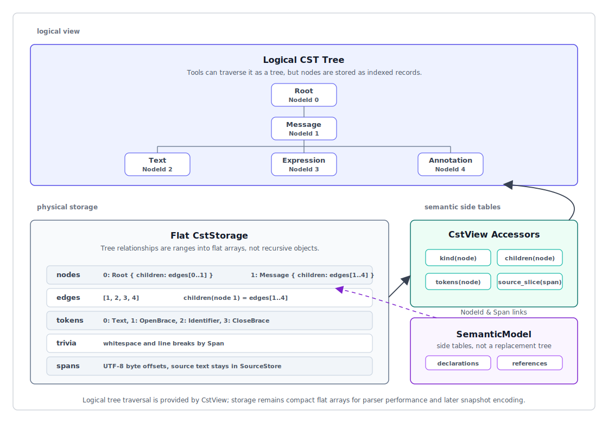

# ox-mf2 Phase 1 Rust Parser / AST / Performance 設計

## 目的

このドキュメントは、Rust MF2 parser の Phase 1 実装設計を定義する。対象は parser performance だけではなく、lossless CST、SemanticModel、SyntaxKind、token/trivia、accessor、diagnostics、recovery、test/benchmark の設計を含む。

foundation document は [001-ox-mf2-toolchain-foundation.md](./001-ox-mf2-toolchain-foundation.md) である。Binary AST と binding の詳細は [003-ox-mf2-phase-2-binary-ast-bindings-design.md](./003-ox-mf2-phase-2-binary-ast-bindings-design.md) に置く。このドキュメントは、Binary AST snapshot encoding が Phase 2 の product boundary になる前の parser implementation path に集中する。

この設計は ox-jsdoc の performance design から、parser/semantic separation、source lifetime の明確化、allocation discipline、scanner/parser boundary、measurement-driven optimization といった考え方を取り入れる。

## 目標

Phase 1 では、高速で、recoverable で、formatter/linter work に十分な lossless 性を持ち、Phase 2 snapshot encoding に備えた Rust parser core を作る。

主要な目標:

1. parse hot path を小さく保つ。
2. 後続 tool が必要とする tokens、trivia、spans、source slices を保持する。
3. parser work を semantic lowering と validation から分離する。
4. public typed AST object graph を避ける。
5. 後から SnapshotWriter に渡せる table-oriented storage を使う。
6. parser、diagnostics、recovery、allocation cost を個別に計測できるようにする。
7. formatter/linter/compiler が使える stable accessor surface を Phase 1 から用意する。
8. Unicode WG spec に追従しやすい SyntaxKind と fixture-driven test structure を持つ。

## 非目標

Phase 1 では次の最適化を対象にしない。

- normal parse output の一部として Binary AST snapshot encoding を行うこと
- N-API / WASM boundary overhead
- MessagePack / LSP transport
- full semantic validation
- canonical formatting
- complete linter rule execution
- public recursive typed AST hierarchy
- final Binary AST snapshot schema の固定

これらは後続 phase の対象である。Phase 1 は、parser foundation を書き直さずにこれらを追加できる形に parser を整える。

## Phase Separation（phase 分離）

parser は parsing 中にすべての correctness work を行わない。

```text
source
  -> lexer / scanner helpers
  -> recovering CST parser
  -> diagnostics
  -> optional semantic lowering
  -> later formatter / linter / compiler
```

parser の責務:

- MF2 syntax を認識する。
- lossless CST storage を構築する。
- tokens、trivia、original lexemes、byte spans を保持する。
- 可能な範囲で recover する。
- parser diagnostics を報告する。

parser の非責務:

- final selector coverage analysis
- syntax-adjacent な case を超える duplicate declaration policy
- runtime message resolution
- locale-aware behavior
- formatter style decisions
- linter rule policy
- Intl.MessageFormat API behavior

semantic lowering と validation は、後から CST を解釈できる。

## Phase 1 の成果物

Phase 1 は「速い parser」だけではなく、後続 tool を壊さずに追加するための Rust core foundation を作る。

Phase 1 の成果物:

- `SourceStore`: source text、path、line index、SourceId を管理する。
- `Scanner`: source bytes を読み、token/trivia を認識する parser-internal component。
- `Parser`: recovering CST parser。syntax を認識し、CstStorage と diagnostics を生成する。
- `SyntaxKind`: message mode、node、token、trivia、error、missing node を分類する stable な kind enum。
- `CstStorage`: nodes、edges、tokens、trivia を持つ flat indexed storage。spans は各 record に inline で保持する。
- `CstView`: NodeId / TokenId / Span から CST を読む accessor surface。
- `SemanticModel`: optional semantic lowering の結果。linter/compiler/validation のための共有意味情報。
- `Diagnostic`: parser diagnostics と将来の lint diagnostics が共有する location model。
- `Fixture runner`: spec fixtures、implementation fixtures、recovery fixtures を実行する test harness。
- `Benchmark harness`: phase-separated benchmarks と hyperfine CLI benchmarks。

Phase 1 の時点では Binary AST snapshot を標準出力にしない。ただし、CstStorage と accessor は Phase 2 の SnapshotWriter に線形変換しやすい形にする。

## AST / CST の用語整理

ox-mf2 では、Phase 1 の primary parse output は `CstStorage` である。これは lossless syntax tree であり、formatter と recovery diagnostics の基礎になる。

一般的に、CST と AST は目的が異なる。

- CST, Concrete Syntax Tree: source text の構文上の形をできるだけ失わずに表す tree。tokens、delimiter、trivia、escape、missing/error node、source span など、元の source を復元・診断・整形するための情報を持つ。
- AST, Abstract Syntax Tree: 構文の表面表現を抽象化し、意味処理しやすい形にした tree。delimiter、trivia、括弧、quote の有無などは省かれることが多く、declaration、reference、selector、variant などの意味単位を扱いやすい。

MF2 では formatter、diagnostics、recovery、preserve-mode formatting が重要なので、Phase 1 の基礎表現は CST にする。一方で、linter、compiler、validation には AST 的な意味情報が必要になるため、CST から `SemanticModel` を lowering する。

`CstStorage + CstView + optional SemanticModel` は、概念的には tree だが、物理的には flat indexed storage と side table で表現する。



このドキュメントでは次の用語を使い分ける。

- CST: token、trivia、delimiter、error/missing node、byte span を保持する lossless syntax tree。
- SemanticModel: CST から lowering される意味情報モデル。declaration、reference、selector、variant などを扱う。
- Binary AST snapshot: Phase 2 以降の cross-language public CST/AST view。Phase 1 の通常 parse output ではない。
- typed AST object graph: Rust struct の再帰的な木。Phase 1 の public API としては採用しない。

つまり、Phase 1 で「AST が必要か」という問いへの答えは、recursive typed AST ではなく、`CstStorage + CstView + optional SemanticModel` が必要、という設計にする。

## SyntaxKind 設計

`SyntaxKind` は parser、CstStorage、diagnostics、formatter、linter、snapshot encoding の共通分類になる。

設計方針:

- `SyntaxKind` は compact な integer representation を持つ。
- node kind、token kind、trivia kind、error kind、missing kind を同じ enum family で扱えるようにする。
- Phase 2 の Binary AST snapshot では `SyntaxKind` の numeric value を NodeRecord / TokenRecord / TriviaRecord の `kind: u16` として直接 encode する。
- 一度公開した numeric value は snapshot compatibility contract の一部として扱い、reorder、reuse、意味の incompatible 変更をしない。新しい kind は新しい value を割り当てる。
- snapshot decoder は自身が知らない `SyntaxKind` numeric value を invalid snapshot として reject する。新しい kind を core NodeRecord / TokenRecord / TriviaRecord に出力する変更は既存 decoder との互換性に影響するため、major version change と decoder/accessor update を伴う。backward compatibility を保ちたい場合は、既存の `Unknown` / `Error` / `Missing` kind または optional section で表現する。
- Rust public API では enum ordering に意味を持たせず、数値比較に依存した consumer code を推奨しない。
- spec 変更に追従しやすいように、kind は grammar category に沿って管理する。
- formatter/linter が kind 判定しやすいように、helper predicate を用意する。

想定する category:

```text
Root / Message / SimpleMessage / ComplexMessage
Pattern / Text / QuotedPattern
Expression / LiteralExpression / VariableExpression / FunctionExpression
Placeholder / Function / Option / Attribute
Declaration / LocalDeclaration / InputDeclaration
ComplexBody / QuotedPattern / Matcher / Selector / Variant / VariantKey
Markup / MarkupOpen / MarkupStandalone / MarkupClose
Token / Keyword / Punctuation / Name / Identifier / Variable / Literal / QuotedLiteral / UnquotedLiteral / CatchAllKey
Trivia / Whitespace / Bidi
Error / Missing / Unknown
```

`SyntaxKind` は spec の syntax category と 1:1 に固定しすぎない。implementation 上の recovery node、missing node、grouping node が必要になるためである。ただし、spec conformance fixtures からどの kind が生成されるかは snapshot test で追跡する。

parser storage と snapshot encoding は同じ numeric representation を使う。SnapshotWriter は `SyntaxKind` を別の wire kind table に remap せず、construction-time storage の kind value をそのまま書き出す。これにより encode cost と compatibility surface を小さくし、Phase 1 の parser records と Phase 2 の snapshot records の対応を単純にする。

## CST construction 設計

parser は accepted syntax を table-oriented records として commit する。

```rust
CstNodeRecord {
  kind: SyntaxKind,
  span: Span,
  first_child: u32,
  child_count: u32,
  flags: NodeFlags,
}

CstEdgeRecord {
  kind: CstEdgeKind,
  ref_id: u32,
  flags: EdgeFlags,
}

CstEdgeKind {
  Node,
  Token,
}
```

`first_child` / `child_count` は edge table への range を表す。`CstEdgeRecord.kind` は node または token を表し、`ref_id` は NodeId または TokenId を指す。token は CST children として edge table から辿れるが、token payload 自体は token table に保持する。

trivia は child edge に混ぜない。token に leading/trailing trivia range を持たせる。これにより `CstView` の syntax traversal は node/token children を返し、formatter は token order と trivia ranges から source-preserving reconstruction を行う。

重要な制約:

- parser は node を作った後に public typed AST へ変換しない。
- span は source byte offset のみを保持する。
- delimiter span や original lexeme は token/trivia/span から復元できるようにする。
- recovery node と missing node も通常 node と同じ table に入れる。
- malformed input でも、可能な限り root node と部分 CST を返す。

## CST accessor 設計

後続 tool は `CstStorage` の raw table に直接依存しない。`CstView` を通して読む。

`CstView` は recursive tree object を事前構築しない。`NodeId` が要求された時点で、`CstStorage` の node record と edge range を参照する軽量な `CstNodeView` を作り、`children()` などの traversal API で次の node view を lazy に返す。


```rust
CstView {
  source: SourceId,
  storage: &CstStorage,
  sources: &SourceStore,
}
```

想定する accessor:

```rust
kind(node: NodeId) -> SyntaxKind
span(node: NodeId) -> Span
children(node: NodeId) -> CstChildren
tokens(node: NodeId) -> TokenRange  // convenience view derived from child edges
token_kind(token: TokenId) -> SyntaxKind
token_span(token: TokenId) -> Span
trivia(token: TokenId) -> TriviaRange
source_slice(span: Span) -> &str
```

想定する lightweight node view:

```rust
CstNodeView<'a> {
  id: NodeId,
  record: &'a CstNodeRecord,
  view: &'a CstView<'a>,
}
```

Phase 1 では parent pointer を node record に必須で持たせない。parent query が必要な tool では、必要に応じて traversal index を構築する。常時 parent pointer を持つと node record が大きくなり、parse hot path と memory traffic に影響するためである。

## SemanticModel 設計

`parse_semantic = true` の場合、CST から lightweight な SemanticModel を生成する。

SemanticModel は runtime execution IR ではない。linter、compiler、validation が共有する意味情報である。

Phase 1 の最小 semantic model:

```rust
SemanticModel {
  mode: MessageMode,
  kind: SemanticMessageKind,
  declarations: Vec<DeclarationRecord>,
  references: Vec<ReferenceRecord>,
  patterns: Vec<PatternRecord>,
  expressions: Vec<ExpressionRecord>,
  markups: Vec<MarkupRecord>,
  literals: Vec<LiteralRecord>,
  functions: Vec<FunctionRecord>,
  options: Vec<OptionRecord>,
  attributes: Vec<AttributeRecord>,
  selectors: Vec<SelectorRecord>,
  variants: Vec<VariantRecord>,
  diagnostics: Vec<Diagnostic>,
}

enum SemanticMessageKind {
  Pattern,
  Select,
}
```

各 semantic record は必ず source 上の NodeId と Span に戻れるようにする。

```rust
SemanticRef {
  node: NodeId,
  span: Span,
}
```

Phase 1 で行う semantic lowering:

- message mode の記録
- data model 上の message kind の記録
- local/input declarations の収集
- variable references の収集
- patterns、expressions、markups の収集
- literals、functions、options、attributes の収集
- matcher selector の収集
- variants と fallback/default marker の収集
- syntax-adjacent な duplicate や missing semantic anchor の検出

Phase 1 で行わない semantic validation:

- complete selector coverage
- locale-aware behavior
- runtime fallback resolution
- Intl.MessageFormat constructor/runtime behavior
- full linter rule policy

SemanticModel は CST を置き換えない。formatter は CST を使い、linter/compiler/validation は SemanticModel と CST view を組み合わせて使う。

`MessageMode` は syntax 上の `simple-message` / `complex-message` を表す。`SemanticMessageKind` は data model 上の `PatternMessage` / `SelectMessage` を表す。simple message は常に `Pattern` だが、complex message は quoted pattern body なら `Pattern`、matcher body なら `Select` になる。

### Data Model validation boundary

MF2 spec は、well-formed syntax に対する _Syntax Errors_ と、message structure の validity に対する _Data Model Errors_ を分けている。

Phase 1 parser は Syntax Errors を主に扱う。Data Model Errors は SemanticModel を使った validation layer の責務にする。

Phase 1 で validation layer に渡せるようにしておくべき情報:

- declarations と暗黙 input variable の参照
- selectors と selector count
- variants と key count
- catch-all key `*`
- option identifiers
- literal key の source span と cooked value

Data Model Errors の例:

- Variant Key Mismatch
- Missing Fallback Variant
- Missing Selector Annotation
- Duplicate Declaration
- Duplicate Option Name
- Duplicate Variant

これらは parser syntax error として扱わない。ただし、Phase 1 の optional semantic validation が有効な場合に diagnostics として報告できるよう、SemanticModel は必要な source links を保持する。

## Name / Identifier / Literal value 設計

CST は source representation を lossless に保持する。一方、SemanticModel は比較や data model 変換に必要な logical value を扱う。

spec 上の重要な差分:

- variable name の source は `$` を含むが、data model の `name` は `$` を含まない。
- function identifier の source は `:` を含むが、data model の `name` は `:` を含まない。
- markup identifier の source は `#` または `/` を含むが、data model の `name` は sigil を含まない。
- quoted literal と unquoted literal は source representation が異なっても、同じ string value なら semantic value として区別しない。
- name の前後にある bidi marks / isolates は source には残すが、name/identifier/unquoted literal value の matching では存在しないものとして扱う。
- name と literal key の比較は NFC 適用後の code point sequence として扱う。

Phase 1 の方針:

- parser は cooked value を hot path で作らない。
- CST は raw source span、delimiter、escape sequence を保持する。
- SemanticModel は必要になった value だけを lazy または lowering phase で計算する。
- cooked value と comparison key は source span へ戻れる record として保持する。
- NFC normalization は parse hot path ではなく semantic validation / comparison path に閉じ込める。

```rust
NameValue {
  source: Span,
  raw: Span,
  value: StringRef,
  comparison_key: Option<StringRef>,
}

LiteralValue {
  source: Span,
  raw: Span,
  value: StringRef,
  quoted: bool,
}
```

`StringRef` は Phase 1 では interned string table または owned string pool を指す抽象名とする。Phase 2 では Binary AST snapshot の indexed StringRef、つまり string offsets section への StringId に対応付けられる。

## Grammar / spec tracking 設計

parser grammar は `refers/message-format-wg/spec` を primary source とする。ECMAScript API integration や Intl.MessageFormat 側の挙動は `refers/proposal-intl-messageformat` を tracking source とする。

Phase 1 の grammar 実装では、spec category ごとに parser function を分け、benchmark と fixture を対応付ける。

想定する parser function group:

```text
parse_message
parse_simple_message
parse_complex_message
parse_complex_body
parse_pattern
parse_text
parse_expression
parse_function
parse_option
parse_attribute
parse_declaration
parse_matcher
parse_variant
parse_markup
parse_literal
parse_quoted_literal
parse_name
parse_identifier
```

各 group は次を持つ。

- valid spec fixtures
- invalid spec fixtures
- recovery fixtures
- focused micro benchmark
- syntax kind snapshot

これにより、spec 変更時に grammar、SyntaxKind、diagnostics、performance impact を分けて確認できる。

## Message mode 設計

MF2 syntax は message を `simple-message` と `complex-message` に分ける。

```abnf
message = simple-message / complex-message

simple-message  = o [simple-start pattern]
complex-message = o *(declaration o) complex-body o
```

Phase 1 parser は、この区別を明示的に扱う。

```rust
enum MessageMode {
  Simple,
  Complex,
}
```

`parse_message` は mode を判定して、CST に `SimpleMessage` または `ComplexMessage` node を作る。mode は単なる semantic metadata ではなく、whitespace、body structure、recovery point に影響する syntax-level decision である。

### Simple message

simple message は single pattern を含む。empty string も valid simple message である。

simple message では、message 先頭と末尾の whitespace は significant であり、message text の一部として扱う。したがって parser は simple message の leading/trailing whitespace を discardable trivia として捨ててはならない。

Phase 1 の扱い:

- `SimpleMessage` node は pattern 相当の child/token range を持つ。
- leading/trailing whitespace は text token または pattern 内の source span として保持する。
- declarations、matcher、quoted-pattern-only complex body は simple message として扱わない。
- first non-whitespace character の制約に違反する場合は、complex message として parse できるか試し、できなければ parser diagnostic を返す。

### Complex message

complex message は optional declarations と complex body から成る message である。complex body は `quoted-pattern` または `matcher` であるため、declarations も matcher も持たない `{{ ... }}` の quoted-pattern-only message も complex message である。

complex message は、optional whitespace `o` の後に `.input`、`.local`、`.match` のいずれかの keyword、または quoted pattern `{{` で始まる。

complex message は次の構造を持つ。

```text
ComplexMessage
  declarations*
  complex_body
```

complex body は `quoted-pattern` または `matcher` である。

```text
ComplexBody = QuotedPattern | Matcher
```

complex message では、message 先頭と末尾の whitespace は significant ではない。parser はそれらを syntax trivia として保持してよいが、message text としては扱わない。

Phase 1 の扱い:

- `.input` と `.local` は declaration list として parse する。
- `.match` は matcher body として parse する。
- `{{ ... }}` は quoted pattern body として parse する。
- declarations を持たない `{{ ... }}` も complex message として parse する。
- declarations の後に complex body がない場合は recovery diagnostic を返す。
- matcher variant の quoted pattern は variant の child として保持する。

### Mode 判定と recovery

mode 判定は parse hot path に入るため、小さく保つ。

判定の基本方針:

1. source の先頭から optional whitespace `o`、つまり `ws` または `bidi`、を skip して mode 判定に必要な範囲だけを見る。
2. skip 後の先頭が `.input`、`.local`、`.match`、または `{{` なら complex candidate とする。
3. complex candidate が成立しない場合、recover しながら complex parse を継続するか、simple message として扱う方が有用かを parser diagnostic とともに選ぶ。
4. simple message と判定した場合、leading/trailing whitespace を text として保持する。

ambiguous または malformed な input では、mode 判定自体も recovery 対象にする。たとえば `.` で始まる keyword 風の入力で declaration や matcher が壊れている場合、単純に simple text へ落とすと有用な diagnostic を失うため、complex candidate として扱う方を優先する。

## Parser API の契約

primary parser API は SourceStore と SourceId を使う。

```rust
parse_source(source_id: SourceId, options: ParseOptions) -> ParseResult
parse_message(source: &str) -> ParseResult
parse_batch(inputs: &[ParseInput], options: ParseOptions) -> BatchParseResult
```

API の使い分け:

- `parse_source`: SourceStore を明示的に管理したい通常の Rust core API。diagnostics、line/column conversion、batch 前処理、editor integration に向く。
- `parse_message`: one-shot parse 用の convenience API。test、REPL、small utility、benchmark smoke に向く。
- `parse_batch`: 複数 message を一括 parse する API。locale file、project-wide analysis、benchmark corpus、将来の shared snapshot buffer に向く。

`parse_source` の使用例:

```rust
let mut sources = SourceStore::new();
let source_id = sources.add(SourceFileInput {
  source: "{ $name }",
  path: Some("messages/en.mf2"),
  locale: Some("en"),
  message_id: Some("hello"),
  base_offset: None,
});

let options = ParseOptions::default();
let result = parse_source(source_id, options);

for diagnostic in &result.diagnostics {
  let location = sources.location(diagnostic.source, diagnostic.span);
  eprintln!("{}:{}: {}", location.line, location.column, diagnostic.message);
}
```

`parse_message` の使用例:

```rust
let result = parse_message("Hello, {$name}!");

assert!(result.diagnostics.is_empty());
let root = result.cst.root();
```

`parse_batch` の使用例:

```rust
let inputs = vec![
  ParseInput {
    source: "Hello, {$name}!",
    path: Some("messages/en.mf2"),
    locale: Some("en"),
    message_id: Some("hello"),
    base_offset: None,
  },
  ParseInput {
    source: "Bonjour, {$name} !",
    path: Some("messages/fr.mf2"),
    locale: Some("fr"),
    message_id: Some("hello"),
    base_offset: None,
  },
];

let result = parse_batch(&inputs, ParseOptions::default());

for item in result.items {
  println!("source={:?}, diagnostics={}", item.source, item.result.diagnostics.len());
}
```

`parse_message(source)` は convenience API である。内部では SourceFile を SourceStore に登録し、SourceId で parse する。

MF2 workloads では、1 file、1 locale set、1 project に多数の message が含まれることが多いため、batch parsing は Phase 1 から first-class API にする。

```text
ParseInput {
  source,
  path?,
  locale?,
  message_id?,
  base_offset?,
}
```

parser semantics を決めるのは `source` だけである。`path`、`locale`、`message_id`、`base_offset` は diagnostics、batch result mapping、LSP document identity、locale-aware workflows、project fixtures、benchmark reports、将来の snapshot roots section entries のための metadata である。

`base_offset` は UTF-8 byte offset とする。API input では省略可能でも、内部 representation と snapshot metadata では optional にしない。未指定時は `0` を使う。Rust parser / snapshot hot path は UTF-16 position conversion を行わない。LSP、editor、JavaScript API が UTF-16 code unit positions を必要とする場合は binding/editor boundary で変換する。

```rust
ParseOptions {
  recovery: bool,
  parse_semantic: bool,
  collect_trivia: bool,
}
```

default:

- `recovery = true`
- `parse_semantic = false`
- `collect_trivia = true`

Phase 1 の `ParseResult` は snapshot bytes を含まない。

```rust
ParseResult {
  cst: CstStorage,
  semantic: Option<SemanticModel>,
  diagnostics: Vec<Diagnostic>,
}
```

batch result は各 ParseInput から SourceId と ParseResult への mapping を保持しなければならない。

```rust
BatchParseResult {
  items: Vec<BatchParseItem>,
}

BatchParseItem {
  source: SourceId,
  result: ParseResult,
}
```

facade は convenience のため aggregate diagnostics を expose してもよい。ただし canonical mapping は source ごとに保持する。これにより、identity semantics を変えずに batch result を将来の snapshot roots section entries へ移行できる。

`parse_semantic` の default は `false` にする。parser throughput と semantic lowering throughput を分離して測定できるようにするためである。

## Parallel parsing 設計

ox-mf2 は multi-threaded parsing を考慮する。ただし、Phase 1 では単一 message の内部を細かく並列化しない。MF2 は message 単位の syntax surface が比較的小さいため、単一 message 内で thread を分けるより、project / locale file / benchmark corpus に含まれる多数の message を message 単位で並列 parse する方が自然である。

基本方針:

- `parse_message` と `parse_source` は single-message parse として deterministic に保つ。
- `parse_batch` は message 単位の parallelism を許可する。
- 各 worker は parser state、CstStorage、diagnostics buffer、temporary allocation を thread-local に持つ。
- SourceStore は parse 開始前に SourceId を確定し、parse 中は immutable に読む。
- BatchParseResult は入力順の mapping を保持し、parallel execution の完了順に依存しない。
- diagnostics は `SourceId + Span` を持つため、worker 間で source identity を共有できる。
- formatter/linter/compiler が後続で使う accessor surface は、parallel parse の有無に関係なく同じにする。

`parse_batch` の parallelism は parser semantics を変えてはならない。parallel / sequential の違いは execution strategy だけであり、CST、SemanticModel、diagnostics の内容と順序は同じであるべきである。

Batch execution の制御は parse semantics とは別に扱う。

```rust
BatchParseOptions {
  execution: BatchExecution,
  max_threads: Option<usize>,
  preserve_order: bool,
}

enum BatchExecution {
  Sequential,
  Parallel,
}
```

default は実装初期では `Sequential` でもよい。ただし API と storage design は、後から `Parallel` を default または feature-gated にしても壊れない形にする。`preserve_order` は default `true` とし、結果 mapping と diagnostics ordering を入力順で安定させる。

実装上の制約:

- parser は shared mutable global state を持たない。
- string interning や cooked value cache を導入する場合、parse hot path では worker-local にし、global table merge は batch 後に行う。
- SourceStore は `Sync` にできる immutable data layout を目指す。
- CstStorage と ParseResult は worker から main thread へ move できるよう `Send` を満たす設計にする。
- Rayon などの executor は実装詳細に留め、public API が特定 executor に依存しないようにする。
- WASM target や embedded target では thread が使えない場合があるため、sequential fallback を必ず持つ。

benchmark では、single-thread と multi-thread を分けて測定する。

```text
parse_message_single
parse_batch_sequential
parse_batch_parallel
parse_batch_parallel_with_semantic
```

外部 parser との比較では `parse_message_single` を primary baseline にする。`parse_batch_parallel` は ox-mf2 の project-scale throughput として別軸で測定する。

## Source と Span の契約

SourceStore は single parse、batch parse、diagnostics、将来の snapshot roots section に共通する source ownership layer である。

span は UTF-8 byte offsets とする。

```text
Span = { start: u32, end: u32 }
```

Span は source_id を含まない。source identity は ParseInput、SourceStore、diagnostics、snapshot records の `source_id`、または current root/source context から取得する。

line / column positions は SourceStore から導出し、各 node には保存しない。

SourceStore は source text と line indexes を所有する。

```text
SourceFile {
  id: SourceId,
  path?,
  text,
  line_starts: Vec<u32>,
}
```

source length または span が `u32` に収まらない場合、parser は reject するか fatal diagnostic を出す。

### Source encoding policy

Phase 1 の Rust convenience API は `&str` を受け取るため、内部 source text は UTF-8 として扱う。この場合、core span は UTF-8 byte offsets でよい。

一方、MF2 syntax spec は UTF-16 based implementation との互換性のため、quoted literal などで unpaired surrogate code points を許容する。Rust `&str` は unpaired surrogate を表現できないため、Phase 1 の `&str` API だけで ECMAScript String の全入力を表現できるとはみなさない。

そのため、SourceStore は将来 `SourceText` abstraction を持てる設計にしておく。

```rust
enum SourceText {
  Utf8(String),
  // Phase 2 binding compatibility candidate:
  // Wtf8(Vec<u8>) or Utf16(Vec<u16>)
}
```

Phase 1 の parser hot path は UTF-8 fast path を優先する。N-API / WASM binding で ECMAScript String compatibility が必要になった場合、WTF-8 または UTF-16 ingestion を binding/source boundary で追加し、core span model と editor-facing UTF-16 positions の mapping を明示的に測定する。

## Identifier model（識別子モデル）

core identifiers は `u32` index を使う。

```text
NodeId = u32 construction/snapshot node index
TokenId = u32 token index
TriviaId = u32 trivia index
SourceId = u32 SourceStore index
Span = { start: u32, end: u32 } // UTF-8 byte offsets
```

同じ identifier model を construction-time CST storage、将来の Binary AST snapshots、SemanticView、diagnostics、formatter、linter、language bindings で使う。

Span は source_id を含まない。source identity は record/context 側で保持する。

`NodeId = 0`、`TokenId = 0`、`TriviaId = 0`、`SourceId = 0` はすべて有効な index とする。none sentinel は定義しない。recoverable parse failure は diagnostics と partial CST で表現し、CST / snapshot を構築できない fatal failure は parse result 内の sentinel ではなく API error として扱う。

line / column positions は必要なときに SourceStore line indexes から導出する。UTF-16 columns、grapheme-aware columns、LSP-facing positions は display/editor boundary の責務であり、core parser span model には含めない。

## Storage の契約

Phase 1 は flat indexed CST storage を使う。

```rust
CstStorage {
  nodes: Vec<CstNodeRecord>,
  edges: Vec<CstEdgeRecord>,
  tokens: Vec<TokenRecord>,
  trivia: Vec<TriviaRecord>,
}
```

rules:

- `NodeId`、`TokenId`、`TriviaId`、`SourceId` は `u32` indexes とする。
- node records は小さく、table-oriented に保つ。
- span は separate span table / span_id にせず、CstNodeRecord、TokenRecord、TriviaRecord、Diagnostic に inline で保持する。
- child relationships は edge table への range として表現する。
- token と trivia storage は preserve-mode formatting に十分な lossless 性を持つ。
- parser code は public typed AST を構築してから table へ変換しない。
- construction-time records は Phase 2 snapshot sections に十分近い形にし、SnapshotWriter が linear pass で encode できるようにする。

## Scanner / Parser boundary（scanner/parser 境界）

Phase 1 architecture は internal scanner helpers と recovering CST parser から始める。

```text
source text
  -> parser-owned cursor / scanner helpers
  -> token and trivia records as accepted
  -> CST node records
```

Phase 1 では public token stream を expose しない。public token API は、CST shape が固まる前に 2 つ目の compatibility surface を作ってしまう。

full pre-tokenization pass を唯一の architecture として要求しない。MF2 は JavaScript/TypeScript より小さいため、必須の `Vec<Token>` pass は不要な allocation と span duplication を増やす可能性がある。ただし、lossless CST と formatter support には token が必要なので、parser は accepted tokens を最終 token table に保存してよい。

意図する v1 boundary:

```text
internal scanner helpers
+ parser cursor
+ token/trivia records committed to storage
+ small checkpoints for ambiguous regions
- public token/event stream
- mandatory full tokenization pass
- arena rollback
```

## Checkpoint と Recovery の契約

recovery は default で有効にする。

checkpoint は parser 内部 state である。小さく保ち、CST nodes、tokens、trivia、diagnostics、source text を所有してはならない。

代表的な shape:

```rust
struct Checkpoint {
  offset: u32,
  node_len: u32,
  edge_len: u32,
  token_len: u32,
  trivia_len: u32,
  diagnostic_len: u32,
  scanner_state: ScannerState,
}
```

checkpoint rules:

1. checkpoints は ambiguous または recoverable な region の周辺だけで使う。
2. 実用上可能な範囲で、解釈が accepted されるまで nodes/tokens を commit しない。
3. speculative records を push した場合は、rollback 時に table lengths を truncate する。
4. cascade より、役に立つ diagnostic を 1 つ出すことを優先する。
5. recovery nodes は formatter と diagnostics に十分な spans と source text を保持する。

想定される recovery points:

- simple / complex mode 判定の失敗
- unclosed placeholder / expression
- malformed declaration
- incomplete matcher
- malformed variant key
- invalid markup boundary
- unclosed quoted literal
- nested syntax 内の unexpected end of input

## Allocation の契約

parse hot path では不要な heap allocation を避ける。

rules:

- source-derived text は owned string ではなく span または string reference として保存する。
- successful parse path では diagnostic message allocation を発生させない。
- input size から良い見積もりができる場合は `Vec::with_capacity` または local pre-sizing を使う。
- temporary allocation は可能な範囲で stack-local に保つ。
- parsing 中に normalized strings を allocate しない。
- normalize や unescape は、必要になったときに semantic、formatter、runtime-oriented layer で行う。

owned strings を許容する場所:

- SourceStore 内の source ownership
- error path 上の diagnostic messages
- 後続の snapshot string table construction
- 後続の binding/debug serialization

## Token と Trivia の方針

`collect_trivia` の default は `true` とする。

parser は trivia を収集する。これは、この project が lossless CST、preserve-mode formatting、diagnostics、将来の Binary AST snapshots を明示的に対象にしているためである。

parser-only experiments 用に `collect_trivia = false` mode を用意してもよい。ただし、それは通常の toolchain mode ではない。

両方の mode を support する場合、benchmarks はそれぞれ別に report しなければならない。

## Token / Trivia record 設計

token と trivia は source text を copy せず、span で参照する。

```rust
TokenRecord {
  kind: SyntaxKind,
  span: Span,
  leading_trivia: TriviaRange,
  trailing_trivia: TriviaRange,
  flags: TokenFlags,
}

TriviaRange {
  start: u32,
  count: u32,
}

TriviaRecord {
  kind: SyntaxKind,
  span: Span,
}
```

token text は `SourceStore` と `Span` から取得する。normal parse path では token text を owned string にしない。

trivia の扱い:

- syntax 上の `ws` は trivia table に入れる。対象は `SP`、`HTAB`、`CR`、`LF`、`U+3000` である。
- syntax 上の `bidi` は `Bidi` trivia または dedicated token flag として保持する。`o` と `s` の判定では `ws` と `bidi` の違いが必要になる。
- preserve-mode formatter に必要な trivia は default で保持する。
- `collect_trivia = false` では trivia record を省略できるが、diagnostic span と token span は維持する。
- malformed input の recovery 中に読み飛ばした text も、可能な限り trivia または error token として span を保持する。

delimiter token の扱い:

- `{`、`}`、`|`、`.`、`@`、`*` などの delimiter は token として保持する。
- node span は delimiter を含む syntactic region を指す。
- formatter が delimiter の有無、位置、original spacing を復元できるようにする。

## Diagnostics cost の契約

core diagnostics は SourceId と UTF-8 byte Span を使う。

```rust
Diagnostic {
  source: SourceId,
  span: Span,
  severity: Severity,
  code: DiagnosticCode,
  message: CompactString,
  labels: Vec<Label>,
  help: Option<Help>,
}
```

diagnostics は success path で安価でなければならない。

- fully valid input では diagnostic allocation を行わない。
- 実用上可能な範囲で static diagnostic messages を使う。
- labels は span-based にする。
- diagnostics 内に source snippets を copy しない。
- diagnostic construction は error path のみで行う。
- recovery は diagnostic cascade を避ける。

parser diagnostics は parser-focused に保つ。例:

- invalid token
- unexpected token
- unclosed expression
- unclosed quoted literal
- invalid declaration start
- invalid matcher syntax
- invalid variant boundary
- span overflow

semantic diagnostics は後続 phase に属する。例:

- unreachable variant
- syntax だけでは不十分な duplicate semantic key
- selector coverage failure
- function / option validation policy
- runtime fallback behavior

## Hot path と cold path

parser は common path を直接的で branch-light に保つ。

推奨 pattern:

- byte または token kind に対する direct `match` dispatch
- 実用上可能な小さな Copy token/scanner state
- measurement によって必要性が示された場合のみ tiny cursor helpers を inline する。
- measurement によって必要性が示された場合のみ diagnostic-heavy path に cold error helpers を置く。
- parser core では virtual dispatch を避ける。
- mode flags を compact に保つ。
- common node records を小さく保つ。

`#[inline(always)]` や `#[cold]` のような low-level annotation を推測で追加しない。対象 path が重要であることを benchmark evidence が示した場合だけ追加する。

## Test strategy

Phase 1 の test は parser correctness、CST stability、recovery quality、semantic lowering、performance guard を分けて扱う。

test category:

- spec conformance tests: Unicode WG spec と TC39 proposal に基づく valid/invalid fixtures。
- message mode tests: simple message と complex message の判定、whitespace significance、empty simple message を確認する。
- CST snapshot tests: input から生成される SyntaxKind tree、token/trivia、span の snapshot。
- recovery tests: malformed input に対して root CST と useful diagnostics が返ることを確認する。
- semantic lowering tests: declarations、references、selectors、variants が NodeId / Span に正しく link することを確認する。
- data model validation tests: Variant Key Mismatch、Missing Fallback Variant、Duplicate Declaration などを parser syntax error と分けて確認する。
- source mapping tests: UTF-8 byte span から line/column、UTF-16 boundary への変換を確認する。
- batch parse tests: ParseInput metadata、SourceId、diagnostics mapping が壊れないことを確認する。
- parallel batch tests: sequential と parallel で CST、SemanticModel、diagnostics、result ordering が一致することを確認する。
- benchmark smoke tests: benchmark corpus と CLI command が実行可能であることを確認する。

CST snapshot は public compatibility contract そのものではない。ただし、parser implementation の意図しない変化を検出するために使う。spec change に伴って snapshot が変わる場合は、fixture と changelog を一緒に更新する。

recovery tests では、diagnostic の数だけでなく、最初の有用な diagnostic、span、以降の CST 継続性を確認する。diagnostic cascade を増やす変更は regression とみなす。

## Benchmark 方針

performance work は measurement-driven でなければならない。

Phase 1 benchmark levels:

1. Micro benchmarks
   - lexer/scanner hot path
   - placeholder/expression parsing
   - declarations
   - matchers and variants
   - quoted literals
   - markup syntax

2. Component benchmarks
   - parse_cst
   - parse_cst with trivia
   - parse_cst without trivia
   - cst_view traversal
   - malformed input に対する parse_cst + diagnostics
   - parse_cst + semantic lowering
   - source span to line/column conversion
   - parse_batch sequential
   - parse_batch parallel

3. Corpus benchmarks
   - real locale files
   - generated large batches
   - spec fixtures
   - implementation fixtures
   - malformed/recovery corpus

4. CLI benchmarks
   - parser CLI commands に対する hyperfine
   - 関係する場合は cold run と warm run を分ける。

benchmark matrix を 1 つの数字に潰してはならない。

Relevant phase names:

```text
lexer
parse_cst
parse_cst_no_trivia
cst_view_traversal
lower_semantic
diagnostics
source_mapping
parse_batch_sequential
parse_batch_parallel
encode_snapshot   // Phase 2
decode_snapshot   // Phase 2
e2e_parse
e2e_lint
```

## Benchmark corpus（計測 corpus）

corpus は少なくとも次の buckets を含める。

- simple messages
- complex messages
- simple/complex mode boundary cases
- placeholders
- declarations
- local variables
- functions, options, and attributes
- selectors
- variants
- fallback/default variants
- markup
- quoted literals
- bidi/unicode-heavy text
- whitespace/trivia-heavy messages
- large batches
- malformed/recoverable messages

fixture roles:

- spec fixtures は conformance を検証する。
- implementation fixtures は compatibility differences を観測する。
- generated fixtures は scale に対する stress をかける。
- real project fixtures は実用的な intlify workloads を表す。

## 外部 baseline

external baselines は context として使う。唯一の performance guard にしない。

想定される baselines:

- `messageformat`
- `mf2-tools`
- relevant な場合は `formatjs`
- `ox-content`
- 該当する場合は current intlify parser paths

comparison では何を計測しているかを明示しなければならない。

- parser only
- parser plus diagnostics
- parser plus semantic lowering
- parser plus snapshot encoding
- CLI startup included or excluded

## Regression rules（性能退行の判断基準）

performance change は次の質問に答えられる必要がある。

- common parser hot path を改善しているか。
- CstStorage の memory traffic を増やしていないか。
- recovery を悪化させていないか。
- trivia と source fidelity を保持しているか。
- parser から semantic lowering に work を移しているか。その移動は意図的か。
- parser-only numbers を改善する一方で batch や formatter/linter use を悪化させていないか。
- snapshot、binding、CLI overhead を parser timing に隠していないか。

望ましい tradeoff は、常に最速の parser-only number とは限らない。ox-mf2 は toolchain foundation であるため、parser performance は diagnostics、formatter、linter、semantic lowering、Phase 2 Binary AST snapshot encoding が必要とする data を保持しなければならない。
