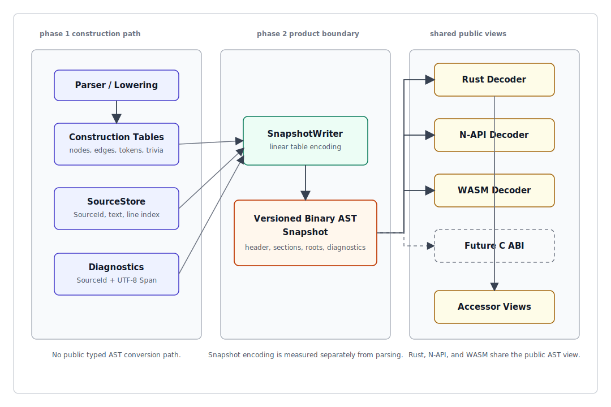
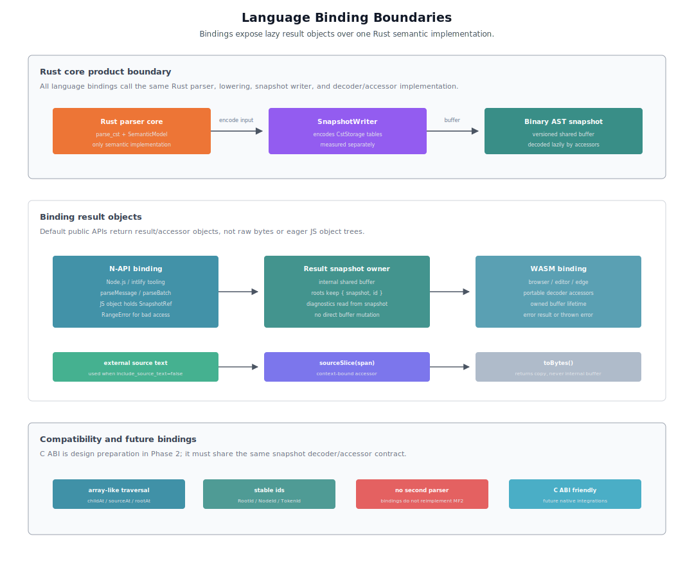

# ox-mf2 Phase 2 Binary AST and Language Binding 詳細設計

## 目的

このドキュメントは、ox-mf2 の Phase 2 cross-language boundary に関する implementation-oriented design details を定義する。

foundation document は [001-ox-mf2-toolchain-foundation.md](./001-ox-mf2-toolchain-foundation.md) である。このドキュメントは high-level philosophy と phase plan を定義する。本ドキュメントでは、Binary AST snapshot、language bindings、snapshot APIs、binding result boundaries、transport boundaries の lower-level shape を定義する。

## 基本方針

ox-mf2 は Rust core を唯一の semantic implementation にする。他言語で MF2 parsing、CST construction、semantic analysis、diagnostics、formatting、linting を再実装しない。

Phase 1 では recovering parser と snapshot-friendly construction-time tables を作る。Phase 2 では versioned Binary AST snapshot を導入し、N-API、WASM、後続 language bindings、persistence、transport の product boundary にする。

Rust core の hot path は `CstTables` / `CstView` / `SemanticModel` を維持する。Binary AST snapshot は Rust core の通常 parse output ではなく、language boundary、persistence、worker transfer、batch transfer のために `CstTables` から encode される表現である。

この設計では次の path を避ける。

```text
public typed AST
  -> recursive conversion
  -> Binary AST snapshot
```

意図する path は次のとおり。

```text
parser / lowering
  -> snapshot-friendly construction tables
  -> SnapshotWriter
  -> versioned Binary AST snapshot
  -> N-API / WASM / persistence decoder-accessor view
```



## Identifier model（識別子モデル）

Binary AST snapshot は、[002-ox-mf2-phase-1-rust-parser-design.md](./002-ox-mf2-phase-1-rust-parser-design.md) で定義される Phase 1 identifier model を継承し、snapshot entry point 用に RootId を追加する。

snapshot 内では、RootId、NodeId、TokenId、TriviaId、SourceId は、それぞれ対応する section または source table への `u32` index のままにする。これらの id は optional にしない。`RootId = 0`、`NodeId = 0`、`TokenId = 0`、`TriviaId = 0`、`SourceId = 0` はすべて有効な index であり、none sentinel は定義しない。span は UTF-8 byte offset のままにし、source_id は含めない。source identity は record の `source_id` または root/source context から取得する。line/column と UTF-16 editor positions は display/editor boundary の責務であり、snapshot node fields にはしない。

SourceStore と ParseInput も Phase 1 parser design で定義する。Phase 2 は同じ SourceId と ParseInput metadata を使い、snapshot roots section entries と binding result mappings を構築する。

## Parser と Snapshot API

Phase 2 snapshot APIs:

```rust
parse_to_snapshot(
  source_id: SourceId,
  parse_options: ParseOptions,
  snapshot_options: SnapshotOptions,
) -> SnapshotResult

parse_batch_to_snapshot(
  inputs: &[ParseInput],
  parse_options: ParseOptions,
  snapshot_options: SnapshotOptions,
) -> BatchSnapshotResult
```

`ParseInput`、`ParseOptions`、normal parse results は [002-ox-mf2-phase-1-rust-parser-design.md](./002-ox-mf2-phase-1-rust-parser-design.md) で定義する。snapshot generation は Phase 2 の独立した責務とし、parse cost と snapshot encoding cost を個別に計測できるようにする。

## Options（オプション）

parse behavior と snapshot output は別々の option type を使う。parse behavior は Phase 1 の `ParseOptions` で定義し、このドキュメントでは snapshot-specific options のみを定義する。

```rust
SnapshotOptions {
  include_diagnostics: bool,
  include_source_text: bool,
  include_trivia: bool,
  preserve_whitespace: bool,
}
```

snapshot options は MF2 parser semantics を変えてはならない。すでに parser が生成した data のうち、どれを snapshot に encode するかだけを決める。

default:

- `include_diagnostics = true`
- `include_source_text = false`
- `include_trivia = true`
- `preserve_whitespace = true`

`include_source_text = false` を default にする。通常の binding parse result では、source text は caller / binding layer / SourceStore 側ですでに保持されているため、snapshot に重複して入れない方が size と transfer cost を抑えられる。

`include_source_text = true` は、snapshot 単体で `source_slice(source_id, span)` を解決したい場合に使う。主な用途は debug dump、persistence、worker transfer、fixture snapshot、外部 process への transport である。

## Result types（結果型）

この section の result type は Rust snapshot-producing API の形である。N-API / WASM binding の default public API は raw bytes を直接返さず、後述の result object と snapshot accessor で包む。

```rust
SnapshotResult {
  bytes: Vec<u8>,
  root: RootId,
  diagnostics: Vec<Diagnostic>,
}

BatchSnapshotResult {
  bytes: Vec<u8>,
  roots: Vec<RootId>,
  diagnostics: Vec<Diagnostic>,
}
```

`SnapshotResult.root` は single input の RootId である。`BatchSnapshotResult.bytes` は共有 snapshot buffer である。`roots` は input order に対応する RootId array であり、各 root は RootRecord 経由で root node、source_id、diagnostic range だけを持つ。path、locale、message_id、base_offset、optional source text は `SourceRecord` 側に置く。これにより、batch parsing は多くの message 間で string tables と snapshot sections を共有できる。

Rust snapshot-producing API は `bytes + RootId` を返し、self-referential な `RootHandle { snapshot, id }` を result struct に直接格納しない。RootHandle は decoded `SnapshotView` または binding result object が snapshot owner を持った後に作る accessor handle である。

## Binary AST snapshot

Binary AST snapshot は、Phase 2 以降の canonical cross-language CST/AST product boundary であり persistence format である。Rust core の通常 parse output を置き換えるものではなく、2 つ目の semantic implementation でもない。


Phase 2 snapshot は lossless CST surface に集中する。

- optional source text
- string table
- nodes
- edges
- tokens
- trivia
- inline span fields in records
- diagnostics
- roots section / RootRecord entry points

semantic model は Rust 内部で利用可能なままにし、SemanticView または後続の compact semantic snapshot として分離して expose する。

source metadata は core section である。source text bytes は optional `source text data` section である。snapshot は separate spans section を持たず、NodeRecord、TokenRecord、TriviaRecord、DiagnosticRecord に `span_start` / `span_end` を inline で持つ。`include_source_text = false` の場合、decoder は snapshot 単体では `source_slice(source_id, span)` を返せない。その場合、decoder/accessor は binding layer が保持する external source text を参照するか、source text unavailable として扱う。

### Wire layout（wire layout）


snapshot format は、固定長 header、section table、typed fixed-record sections を基本形にする。

```text
SnapshotHeader {
  magic: [u8; 8],
  major_version: u16,
  minor_version: u16,
  feature_flags: u32,
  header_len: u32,
  section_table_offset: u32,
  section_count: u16,
  reserved: u16,
}

SectionRecord {
  kind: u16,
  flags: u16,
  offset: u32,
  byte_len: u32,
  count: u32,
  record_size: u16,
  alignment: u8,
  reserved: u8,
}
```

`SectionRecord.kind` は stable numeric enum である。一度割り当てた SectionKind number は再利用しない。section の意味を incompatible に変える場合は major version を上げる。

snapshot header は wire format compatibility のために `major_version` と `minor_version` だけを持つ。patch version は snapshot header に入れず、crate / npm package / WASM package の release version で管理する。`major_version` は incompatible format change、`minor_version` は backward-compatible section、flag、metadata addition を表す。

新しい optional section の追加は minor version で許可する。既存 decoder は `SectionFlags.required = false` の unknown section を validation 後に skip できるため、既存 semantic を壊さない optional metadata、debug data、future semantic data は minor addition として扱える。新しい required section がないと snapshot を正しく解釈できない場合は major version を上げる。

`feature_flags` は v1 では全 bit reserved とし、`0` のみ許可する。v1 の拡張判定は section table と `SectionFlags.required` で行い、header-level feature flags は用途が明確になるまで使わない。

```text
SectionFlags {
  required: bit0,
}
```

unknown section の扱いは `SectionFlags.required` で判定する。decoder が知らない section kind でも、`required = false` かつ offset/size/alignment が valid であれば skip できる。`required = true` の unknown section は、その section を読めない decoder では snapshot を正しく解釈できない可能性があるため reject する。

すべての multi-byte numeric fields は little-endian とする。`offset` と `byte_len` は snapshot buffer 先頭からの byte offset / byte length である。Phase 2 では buffer offset、section length、record count、NodeId、TokenId、TriviaId、SourceId を `u32` domain に揃える。

各 section の count は `SectionRecord.count` を唯一の source of truth とする。root count、node count、edge count、token count、trivia count はそれぞれ `roots`、`nodes`、`edges`、`tokens`、`trivia` section の count から読む。header には重複 count を置かない。

section start は 8-byte alignment を基本にする。`record_size > 0` の section は typed fixed-record array として扱い、decoder は `offset + index * record_size` で lazy access する。`record_size = 0` の section は string data、source text data、extended variable data のような raw byte section として扱う。

section table は `SectionKind` ごとに安定した ID を持つ。v1 section kinds:

```text
0  = invalid/reserved
1  = roots
2  = sources
3  = nodes
4  = edges
5  = tokens
6  = trivia
7  = diagnostics
8  = diagnostic_labels
9  = string_offsets
10 = string_data
11 = source_text_data
12 = extended_data
```

`SectionKind = 0` は valid section として使わない。decoder は `kind = 0` の section を invalid snapshot として reject する。

nodes、edges、tokens、roots、sources、string offsets、string data は core sections とする。core sections は section table に存在し、`SectionFlags.required = true` でなければならない。missing core section、または `required = false` の core section は invalid snapshot として reject する。

core section の minimum count は、`roots.count >= 1`、`sources.count >= 1`、`nodes.count >= 1` とする。`edges.count` と `tokens.count` は `0` を許可する。string offsets は文字列がない場合 `count = 0` を許可し、string data は `byte_len = 0` を許可する。

source text data、trivia、diagnostics、diagnostic labels、extended data は optional sections とする。optional sections は `SectionFlags.required = false` を基本にする。option または content に応じて空 section になってよい。存在しない optional section は `count = 0` と同等に扱う。

decoder rules:

- incompatible major versions は reject する。
- minor version differences は backward compatible な場合のみ accept する。
- patch-level implementation differences は snapshot header では判定しない。
- v1 decoder は `feature_flags != 0` を reject する。
- unknown required features は reject する。
- unknown required sections は、`SectionFlags.required = true` の場合 reject する。
- unknown optional sections は、`SectionFlags.required = false` かつ `offset`、`byte_len`、`alignment` が valid なら skip する。
- `offset + byte_len` が buffer length を超える section は reject する。
- `record_size > 0` かつ `byte_len != count * record_size` の section は reject する。

### Roots section


roots section は core section である。RootRecord は batch input の entry point であり、metadata payload を持たない compact record にする。

RootRecord array order は `parse_batch` input order と同じに固定する。`roots[i]` は `inputs[i]` に対応する。single input の snapshot も同じ layout を使い、`roots.count = 1` とする。

```text
RootRecord {
  root_node: u32,
  source_id: u32,
  diagnostic_start: u32,
  diagnostic_count: u32,
}
```

`root_node` は nodes section 内の valid NodeId であり、常に `root_node < nodes.count` を満たさなければならない。root none sentinel は定義しない。Phase 1 recovering parser は malformed input でも可能な限り root node と部分 CST を返すため、通常の parse failure は diagnostics と partial tree で表現する。snapshot を構築できない fatal error は snapshot result ではなく API error として扱う。

`source_id` は SourceRecord を指す valid SourceId であり、常に `source_id < sources.count` を満たさなければならない。root-level source none sentinel は定義しない。path、locale、message_id、base_offset、optional source text は SourceRecord から読む。これにより RootRecord は fixed 16 bytes の entry point に留まり、source metadata の拡張と roots section の random access を分離できる。

`diagnostic_start` と `diagnostic_count` は diagnostics section 内の contiguous range を指す。diagnostics section は root order に沿って grouped layout にする。これにより decoder は `roots[i]` から diagnostics を O(1) で slice できる。

`include_diagnostics = false` の場合でも RootRecord の layout は変えない。`diagnostic_count = 0` とし、`diagnostic_start = 0` とする。diagnostics section と diagnostic labels section は空 section、または optional section として存在しない扱いにできる。decoder は RootRecord の record_size を option によって変えてはならない。

### String table（文字列テーブル）


string table は snapshot metadata、diagnostic message、semantic-independent small strings、normalized strings など、source span だけでは表現できない文字列のために使う。original source text は string data に混ぜず、`include_source_text = true` の場合だけ dedicated `source text data` section に置く。

string offsets section と string data section は core sections であり、文字列が 0 個でも必ず存在させる。その場合、string offsets section は `count = 0`、string data section は `byte_len = 0` にできる。

```text
StringRef {
  id: u32,
}

StringOffsetRecord {
  offset: u32,
  len: u32,
}
```

`StringRef.id` は string offsets section 内の StringId である。decoder は `string_offsets[id]` を読み、そこから string data section の `offset..offset+len` を slice する。`StringId` は snapshot 内で canonical な interned string identity として扱う。

`StringId = 0` は有効な string id であり、`string_offsets[0]` を指す。ただし string offsets section の `count = 0` の場合、有効な StringId は存在しない。optional string は `StringId = 0xFFFF_FFFF` を none sentinel とする。decoder は none sentinel を string offsets lookup してはならない。none sentinel 以外の StringId が `string offsets` section count 以上の場合は invalid snapshot として reject する。

decoder は consumer が読むときだけ UTF-8 strings を lazy に materialize する。

### Source text data section


source text data section は optional raw byte section である。`include_source_text = true` の場合、各 input の original MF2 source text を UTF-8 bytes としてこの section に格納する。`include_source_text = false` の場合、この section は存在しないか空 section になる。

v1 snapshot の source text data は UTF-8-valid source text のみを対象にする。ECMAScript String compatibility のために unpaired surrogate を含む input を扱う場合、binding/source boundary は external source text として保持し、`include_source_text = false` の snapshot と組み合わせる。WTF-8 または UTF-16 source text を snapshot 内に保存する必要が出た場合は、future version の optional section または format change として設計する。

```text
SourceTextRef {
  source_id: u32,
  offset: u32,
  len: u32,
}
```

`offset` と `len` は source text data section 内の byte range である。`SourceTextRef.source_id = 0xFFFF_FFFF` は none sentinel であり、source text bytes が snapshot に含まれていないことを表す。none sentinel の場合、decoder は `offset` と `len` を参照してはならない。

通常の SourceId は none sentinel を持たないが、SourceTextRef は optional field なので sentinel を持つ。source text data は string table と分離するため、metadata strings の dedup、diagnostic strings、normalized strings の layout と original source text の lifetime / transfer policy を独立して扱える。

### Source section


source section は core section である。source record は source identity と metadata を持ち、source text bytes は持たない。

SourceRecord array order は `parse_batch` input order に固定しない。sources section は source identity による dedup を許可する。複数の RootRecord が同じ `source_id` を指してよい。root と source の対応は常に `RootRecord.source_id` で解決する。

v1 snapshot format は source dedup key を定義しない。`path + base_offset + source text` のような identity rule は wire format に焼き込まない。SourceStore / binding が割り当てた SourceId を canonical source identity として扱い、snapshot はその mapping を encode する。

```text
SourceRecord {
  source_id: u32,
  path: StringRef,
  locale: StringRef,
  message_id: StringRef,
  base_offset: u32,
  text: SourceTextRef,
}
```

SourceId は sources section への required index である。`SourceRecord.source_id` はその record 自身の sources section index と一致しなければならない。RootRecord、TokenRecord、TriviaRecord、DiagnosticRecord の `source_id` は none sentinel を持たず、常に `source_id < sources.count` を満たさなければならない。`SourceId = 0` は有効である。

`path`、`locale`、`message_id` は optional metadata である。これらは `StringRef` field として常に SourceRecord に存在し、値がない場合は `StringId = 0xFFFF_FFFF` の none sentinel を使う。SourceRecord の record layout は metadata の有無によって変えない。

`base_offset` は UTF-8 byte offset である。optional にせず、未指定時は `0` を格納する。absolute byte position は `base_offset + span_start/end` で計算できる。UTF-16 code unit positions、line/column、LSP positions は binding/editor boundary で変換し、snapshot node fields には保存しない。

`include_source_text = false` の場合、`text.source_id = 0xFFFF_FFFF` とする。SourceRecord の record layout は変えない。roots section と diagnostics は SourceId と Span を保持するため、binding layer は外部 source text を使って location や source slice を解決できる。

`include_source_text = true` の場合、snapshot は source text を dedicated source text data section に格納する。`SourceRecord.text.source_id` は同じ record の `source_id` と一致しなければならない。large batch では SourceRecord ごとに text range を持ち、roots section は source metadata と root node を結びつける。

source slice は SourceId と Span の組で解決する。`sourceSlice(span)` という表記は、`SourceView.sourceSlice(span)` や node/token handle 上の convenience accessor のように source context を持つ API を指す。snapshot 内の source text data または binding result が保持する external source text のどちらかから source text を解決できる場合だけ成功する。どちらも利用できない場合、decoder/accessor は silent `undefined` を返さず source text unavailable error を返す。

### Node section（node section）


snapshot node records は、可能な限り fixed-size にする。これにより NodeId を node section への直接 `u32` index として維持できる。

```text
NodeRecord {
  kind: u16,
  flags: u16,
  span_start: u32,
  span_end: u32,
  first_child: u32,
  child_count: u32,
  data_ref: u32,
}
```

`kind` は Phase 1 parser が使う `SyntaxKind` の numeric value をそのまま格納する。SnapshotWriter は NodeRecord.kind を別の snapshot-specific kind table に remap しない。`SyntaxKind` numeric value は snapshot compatibility contract の一部であり、一度公開した value は reorder、reuse、意味の incompatible 変更をしない。decoder は自身が知らない `SyntaxKind` numeric value を invalid snapshot として reject する。新しい kind を core NodeRecord / TokenRecord / TriviaRecord に出力する変更、または kind の意味を incompatible に変える変更は snapshot major version を上げる。

`first_child` と `child_count` は edges section への range を表す。children は source order の EdgeRecord array として並び、各 edge が node または token を参照する。

variable-length data や node-kind-specific data は、`data_ref` から参照される extended data section に置く。extended data section は `record_size = 0` の raw byte section である。`data_ref = 0xFFFF_FFFF` は none sentinel であり、その node に extended data がないことを表す。none sentinel 以外の `data_ref` は extended data section 内の valid byte offset でなければならない。NodeId / TokenId / TriviaId / SourceId は sentinel を持たないが、`data_ref` は optional field なので sentinel を持つ。

extended data payload は必ず header を持つ。

```text
ExtendedDataHeader {
  kind: u16,
  flags: u16,
  byte_len: u32,
}
```

`data_ref` は ExtendedDataHeader の先頭 byte offset を指す。`byte_len` は header を含む payload 全体の byte length である。decoder は `data_ref + byte_len <= extended_data.byte_len` を検証する。`kind` は node-kind-specific payload kind であり、NodeRecord.kind と互換でなければならない。互換でない場合は invalid snapshot として reject する。

### Edge section


edge section は core section である。EdgeRecord は CST の parent-child relationship を表す compact typed reference である。

```text
EdgeRecord {
  kind: u16,
  flags: u16,
  ref_id: u32,
}
```

`kind` は `node = 0` または `token = 1` を表す numeric enum である。他の値は invalid snapshot として reject する。`ref_id` は `kind = node` の場合は NodeId、`kind = token` の場合は TokenId である。decoder/accessor は NodeRecord の `first_child` / `child_count` から EdgeRecord range を読み、edge kind に応じて node view または token view を lazy に返す。`kind = node` の場合は `ref_id < nodes.count`、`kind = token` の場合は `ref_id < tokens.count` を満たさなければならない。

trivia は child edge に混ぜない。trivia は TokenRecord の leading/trailing trivia ranges から読む。これにより、syntax traversal は node/token children に集中し、formatter は token order と trivia range から source-preserving reconstruction を行える。

### Token と Trivia sections


tokens と trivia は専用 snapshot section を持つ。TokenId と TriviaId はそれぞれの section への `u32` index である。

```text
TokenRecord {
  kind: u16,
  flags: u16,
  span_start: u32,
  span_end: u32,
  source_id: u32,
  leading_trivia_start: u32,
  leading_trivia_count: u32,
  trailing_trivia_start: u32,
  trailing_trivia_count: u32,
}

TriviaRecord {
  kind: u16,
  flags: u16,
  span_start: u32,
  span_end: u32,
  source_id: u32,
}
```

TokenRecord.kind と TriviaRecord.kind も Phase 1 `SyntaxKind` の numeric value を直接格納する。node、token、trivia は同じ `SyntaxKind` family を共有するが、decoder/accessor は section context と helper predicate により node kind、token kind、trivia kind として扱う。decoder は TokenRecord.kind / TriviaRecord.kind についても unknown `SyntaxKind` numeric value を reject する。これにより parser tables、snapshot records、binding accessor の kind identity が一致し、snapshot encode 時の kind conversion table を不要にする。

formatter、特に preserve mode は、nested object tree に依存せず source を faithful に再構築するために token と trivia sections を使う。

`include_trivia = false` の場合でも TokenRecord の layout は変えない。`leading_trivia_count` と `trailing_trivia_count` は `0` にし、`leading_trivia_start` と `trailing_trivia_start` も `0` にする。trivia section は空 section、または optional section として存在しない扱いにできる。decoder は TokenRecord の record_size を option によって変えてはならない。

v1 の TokenRecord / TriviaRecord は `text_ref` を持たない。original token / trivia text は `source_id + span_start/span_end` で参照する。`include_source_text = false` の場合は external source text を使い、`include_source_text = true` の場合は `SourceRecord.text` が指す source text data section を使う。source span だけでは表現できない normalized text、cooked text、debug text が必要になった場合は、TokenRecord / TriviaRecord を太らせず、extended data または optional token-text section として追加する。

### Diagnostics section（診断 section）


`include_diagnostics = true` の場合、snapshot は diagnostics section を含む。これにより、snapshot は parse diagnostics を添付した状態で inspect または transport できる。

```text
DiagnosticRecord {
  source_id: u32,
  span_start: u32,
  span_end: u32,
  severity: u8,
  code: u16,
  message: StringRef,
  label_start: u32,
  label_count: u32,
}
```

`severity` と `code` は compact numeric enum とする。`message` は indexed StringRef である。extension/custom diagnostics が human-readable string code を必要とする場合は、DiagnosticRecord を太らせず、将来 optional diagnostic-code string section を追加する。

diagnostic records は RootRecord の `diagnostic_start` / `diagnostic_count` で参照できるよう、root order に沿って grouped layout にする。各 DiagnosticRecord は SourceId と Span を持つため、同じ root に複数 source 由来の diagnostic を関連付ける必要が出ても表現できる。snapshot 内の root-local diagnostics は RootRecord の range が source of truth である。

diagnostic labels は separate diagnostic labels section に置く。DiagnosticRecord の `label_start` / `label_count` は DiagnosticLabelRecord array の contiguous range を指す。

```text
DiagnosticLabelRecord {
  source_id: u32,
  span_start: u32,
  span_end: u32,
  message: StringRef,
}
```

labels がない diagnostic は `label_count = 0` とする。decoder は `label_start + label_count <= diagnostic_labels.count` を検証する。help text は v1 snapshot record には含めず、必要になった時点で optional diagnostic-help section として追加する。

public API は convenience のため diagnostics を別に返してもよいが、snapshot format は encoded result の一部として diagnostics を保持できなければならない。binding result の flat diagnostics array は snapshot 内の diagnostic records を root order で読んだ view であり、別の diagnostic table ではない。

## SemanticView（意味情報 view）


SemanticView は lossless Binary AST snapshot とは分離する。

Binary AST は CST、tokens、trivia、source spans を扱う。SemanticView は semantic facts を扱う。

- declarations
- references
- selectors
- variants
- fallback/default information
- duplicate keys
- coverage metadata
- NodeId と Span への links

linter、compiler、validation は Binary AST decoder/accessor traversal と SemanticView を組み合わせて使える。

## Decoder error boundary（decoder error 境界）

snapshot decode は panic ではなく typed error で失敗する。

Rust decoder API:

```rust
decode_snapshot(bytes: &[u8]) -> Result<SnapshotView<'_>, DecodeError>
decode_snapshot_owned(bytes: Arc<[u8]>) -> Result<SnapshotViewOwned, DecodeError>
```

`DecodeError` は invalid snapshot、unsupported version、missing required section、invalid section layout、invalid index、unknown required section、unknown `SyntaxKind`、invalid UTF-8 string、out-of-range source text、invalid extended data、diagnostic range mismatch などを表す。

Rust API は invalid snapshot を `Result::Err(DecodeError)` として返す。decoder/accessor は untrusted bytes を扱う可能性があるため、validation failure で panic してはならない。internal invariant violation を debug assertion で検出することはできるが、public decode boundary では recoverable error として返す。

N-API と WASM bindings は Rust の `DecodeError` をそれぞれの language boundary に変換する。

- N-API: `DecodeError` を JS exception または explicit `Result` object に変換する。
- WASM: `DecodeError` を thrown JS error、または exported API の error result に変換する。

binding boundary は error code、message、optional section kind、optional offset、optional record index を保持できる shape にする。human-readable message は developer ergonomics のために返してよいが、programmatic handling は compact error code を基本にする。

## Snapshot buffer ownership（snapshot buffer 所有権）

Rust decoder は borrowed view と owned view の両方を提供する。

```rust
pub struct SnapshotView<'a> {
  bytes: &'a [u8],
  sections: SectionIndex,
}

pub struct SnapshotViewOwned {
  bytes: Arc<[u8]>,
  sections: SectionIndex,
}
```

`SnapshotView<'a>` は caller が snapshot bytes の lifetime を管理する。decode は section table と validation metadata を構築するだけで、nodes、tokens、strings を eager に materialize しない。これは Rust 内部 tests、benchmarks、temporary decode、zero-copy inspection に使う。

`SnapshotViewOwned` は snapshot bytes を `Arc<[u8]>` として所有する。long-lived cache、daemon、LSP、binding object、worker handoff のように accessor が buffer より長く残る可能性がある境界では owned view を使う。

N-API と WASM bindings は基本的に owned/shared buffer を保持する。Node / Token / Trivia / Root handle は raw pointer ではなく、snapshot view object または shared buffer owner への参照を保持する。これにより JS GC、WASM object lifetime、worker transfer 後も dangling view を作らない。

binding は snapshot bytes を JS object tree に展開しない。JS/WASM consumer が node、token、string、diagnostic を読むときだけ accessor が snapshot buffer を slice して必要な値を返す。

## Handle model（handle model）

Root / Node / Token / Trivia の public handle は object pointer ではなく、snapshot owner と section-local id の組み合わせにする。

```text
RootHandle   { snapshot: SnapshotRef, id: RootId }
NodeHandle   { snapshot: SnapshotRef, id: NodeId }
TokenHandle  { snapshot: SnapshotRef, id: TokenId }
TriviaHandle { snapshot: SnapshotRef, id: TriviaId }
```

`SnapshotRef` は Rust では `SnapshotView` / `SnapshotViewOwned` への参照または owned view、N-API / WASM では snapshot buffer を保持する accessor object への参照である。handle 自体は snapshot bytes を複製しない。

RootId、NodeId、TokenId、TriviaId は snapshot-local identity である。異なる snapshot に属する handle の id 値が同じでも同一 node/token/trivia とはみなさない。handle equality は snapshot identity と id の両方で判定する。

handle construction 時には `id < section.count` を検証する。children traversal、root lookup、token trivia lookup は同じ `SnapshotRef` を持つ lightweight handle を返す。これにより lazy accessor は materialized object tree を作らず、GC-managed language でも dangling pointer を避けられる。

Rust low-level API は performance-sensitive path のために `SnapshotView` と raw id を別々に受け取る accessor も提供してよい。ただし public binding API は `{ snapshot, id }` handle model を標準にする。

## Accessor traversal API（accessor traversal API）

N-API / WASM の public traversal API は iterator を主表現にせず、array-like snapshot view を基本にする。

```ts
type ChildHandle = NodeHandle | TokenHandle

root.node(): NodeHandle
root.diagnostics(): DiagnosticView[]

node.kind(): SyntaxKind
node.span(): Span
node.childCount(): number
node.childAt(index: number): ChildHandle
node.children(): ChildHandle[]

token.kind(): SyntaxKind
token.span(): Span
token.leadingTrivia(): TriviaHandle[]
token.trailingTrivia(): TriviaHandle[]

trivia.kind(): SyntaxKind
trivia.span(): Span
```

`node.children()` は source order の lightweight child handles array を返す。これは subtree を materialize する API ではなく、各 element は `{ snapshot, id }` handle である。MF2 message は一般的な source file に比べて小さいため、default API は ergonomics を優先する。

allocation-sensitive path では `node.childCount()` と `node.childAt(index)` を使う。これにより consumer は child handle array の allocation を避けて indexed traversal できる。Rust low-level API は `SnapshotView` と raw id/index を受け取る allocation-free accessor を提供してよい。

indexed accessor に out-of-range index が渡された場合、binding は silent `undefined` を返さず error にする。N-API では `RangeError`、WASM では exported API の error result または thrown JS error に変換する。formatter/linter が traversal bug を早く検出できるよう、invalid accessor usage は明示的に失敗させる。

JS iterator は convenience として追加してもよいが、primary compatibility surface にはしない。binding の標準 traversal contract は array-like methods と indexed accessors で定義する。

## Bindings（言語 binding）



binding 実装の優先順位:

1. N-API binding: intlify と JavaScript tooling integration の主要 Node.js target
2. WASM binding: browser、playground、editor extension、edge runtime integration 向けの portable target
3. C ABI binding design: 将来の Go、Swift、C#、Zig、Python FFI、より広い native language integration の foundation

Phase 2 では stable C ABI implementation を必須にしない。C ABI は design preparation に留める。ただし snapshot record layout、numeric error codes、handle ids、buffer ownership、`toBytes()` copy semantics、decode error boundary は C ABI friendly に保つ。N-API / WASM が Rust core と異なる semantic implementation を持たないよう、将来の C ABI も同じ snapshot decoder/accessor model を共有できる形にする。

N-API と WASM bindings は、eager に materialized JS object tree を返すのではなく、lazy decoder/accessor を持つ result object を返す。default public API は raw snapshot bytes を直接返さない。snapshot bytes は result/accessor object の内部 buffer として保持する。

binding は original source text を caller 側または binding result 側で保持できる。default snapshot は `include_source_text = false` なので、decoder/accessor が context-bound `sourceSlice(span)` を提供する場合は、snapshot bytes ではなく external source text を参照する。

binding result が external source text を保持している場合、context-bound `sourceSlice(span)` は `include_source_text = false` でも成功してよい。binding result が source text を保持しておらず、snapshot に source text data も含まれていない場合、`sourceSlice(span)` は source text unavailable error を返す。

single-message binding shape:

```ts
type ParseInputObject = {
  source: string
  path?: string
  locale?: string
  messageId?: string
  baseOffset?: number
}

const result = parseMessage(source)
const input: ParseInputObject = { source, locale: 'en', messageId: 'hello' }
const resultWithMetadata = parseMessage(input)

result.diagnostics
result.source
result.root
result.snapshot
```

`parseMessage(source)` は simple convenience overload である。`parseMessage({ source, path?, locale?, messageId?, baseOffset? })` は SourceRecord metadata を指定する標準 object form であり、single input でも batch input と同じ metadata handling を使う。

batch binding shape:

```ts
const result = parseBatch(items: ParseInputObject[])

result.sources
result.roots
result.diagnostics
result.snapshot
```

`parseBatch(items)` は `{ source, path?, locale?, messageId?, baseOffset? }[]` を標準入力にする。`source` だけが parser semantics を決める required field であり、`path`、`locale`、`messageId`、`baseOffset` は SourceRecord metadata、diagnostics mapping、LSP/editor mapping、benchmark/reporting、root mapping のための optional metadata である。

binding は `messageId` を snapshot/Rust 側の `message_id` に、`baseOffset` を `base_offset` に変換する。`baseOffset` は UTF-8 byte offset とし、未指定時は `0` として扱う。JavaScript string の UTF-16 position conversion は binding/editor boundary の責務であり、snapshot node fields には保存しない。

`result.roots[i]` は常に `items[i]` に対応する。sources section は source identity による dedup を許可するため、複数 root が同じ SourceRecord を指すことはあるが、batch result の root order は input order から変えない。

`result.source` と `result.sources` は SourceRecord-backed SourceView であり、raw source string ではない。source text が必要な場合は `sourceSlice(span)` または SourceView の accessor を使う。batch では sources section が dedup されるため、`result.sources` の order は input order ではなく SourceId order である。

`result.snapshot` は raw bytes ではなく accessor object である。root、node、token、trivia、diagnostic、source metadata は accessor 経由で lazy に読む。raw snapshot bytes は default result shape に含めない。

debug、fixture、persistence、worker transfer、external process transport のような advanced use case では、明示 API で snapshot bytes を取り出せるようにする。

```ts
const bytes = result.snapshot.toBytes()
```

`toBytes()` は内部 snapshot buffer の copy を返す。binding は internal buffer を直接 expose しない。これにより consumer が returned bytes を保持、mutate、worker transfer しても、既存の accessor object の lifetime と validation invariant を壊さない。

batch parsing では、bindings は 1 つの shared snapshot buffer を内部に保持し、input item ごとの root handles、diagnostics、snapshot accessor を返す。nodes と strings は consumer が読むときだけ materialize する。

`result.diagnostics` は root order の flat array として返す。single-message result では root 1 件分の diagnostics、batch result では `result.roots` order に grouped された全 diagnostics を表す。各 root handle からも `root.diagnostics()` のような lazy accessor で自分の diagnostics range を取得できる。

flat diagnostics array と root-local diagnostics accessor は同じ snapshot diagnostics section を読む。binding は diagnostics を別 table として複製しない。ただし JS/WASM ergonomics のため、consumer が `result.diagnostics` を読む時点で lightweight diagnostic view objects を materialize してよい。

`include_source_text = false` の batch result では、各 root が `source_id` を持ち、source metadata は SourceRecord、input source text への参照は binding result 側に保持する。`include_source_text = true` の batch result では、snapshot 内に source text data を含めるため、worker transfer や persistence 後も snapshot 単体で source slice を解決できる。

## Formatter と Linter の入力

Phase 2 以降、formatter と linter の public AST input は Binary AST decoder/accessor view にする。Rust implementation は必要に応じて construction-time tables または semantic model の internal fast path を持ってよいが、stable public traversal model は Rust、N-API、WASM consumer で共有される Binary AST view に揃える。

## MessagePack transport

MessagePack は ox-mf2 の CST/AST representation ではない。

これは LSP、editor integration、daemon mode、repeated semantic queries のような long-lived language-service workflows に対する future transport の候補である。standard CST/AST product boundary は versioned Binary AST snapshot のままにする。

将来 MessagePack transport を追加する場合、その overhead は parser、semantic lowering、snapshot encoding、binding costs とは別に計測しなければならない。

## Snapshot test strategy

Phase 2 snapshot tests は binary golden fixtures と decoded structural fixtures の両方を持つ。

binary golden fixtures:

- snapshot header、section table、record layout、alignment、endianness、required/optional section flags を検証する。
- versioned wire format の accidental change を検出する。
- `include_source_text`、`include_trivia`、`include_diagnostics` の option combinations を含める。
- invalid snapshot fixtures を用意し、decoder が panic ではなく `DecodeError` で reject することを確認する。

decoded structural fixtures:

- decoder/accessor から得られる roots、sources、nodes、edges、tokens、trivia、diagnostics、labels、strings を review しやすい text または JSON snapshot として保持する。
- binary layout の byte-level change と semantic structure の change を分けて review できるようにする。
- root order、source dedup、diagnostic grouping、token/trivia spans、`SyntaxKind` numeric values を確認する。
- binary bytes の完全一致だけでは読みにくい CST/diagnostics regressions を検出する。

binary golden は wire compatibility を守るための contract test であり、decoded structural fixture は implementation behavior を説明可能に保つための review aid である。snapshot format version を意図的に変更する場合は、binary fixture、decoded fixture、format changelog を同じ変更で更新する。

## Benchmarks（性能計測）

snapshot と binding work を 1 つの parser number の中に隠してはならない。

関連する benchmark phases:

- lexer
- parse_cst
- lower_semantic
- diagnostics
- encode_snapshot
- decode_snapshot
- snapshot_to_bytes_copy
- binding_call
- parse_batch
- parse_batch_to_snapshot
- lsp_jsonrpc
- lsp_msgpack

Phase 2 benchmark は parser hot path、snapshot encoding、snapshot decoding、binding/export cost を分離して測る。

- `parse_cst`: Rust parser が CstTables を構築する cost。
- `encode_snapshot`: 既存の CstTables / diagnostics / source metadata から Binary AST snapshot bytes を構築する cost。
- `decode_snapshot`: snapshot bytes を validation し、lazy SnapshotView / section index を構築する cost。node/token/string traversal は含めない。
- `snapshot_accessor_traversal`: decoded SnapshotView から roots、nodes、tokens、trivia、diagnostics を lazy accessor で読む cost。
- `snapshot_to_bytes_copy`: `result.snapshot.toBytes()` が internal buffer を copy して external bytes を返す cost。
- `binding_call`: N-API / WASM boundary を通って result object と handle を返す cost。parse / encode / decode とは別に測る。
- `parse_batch_to_snapshot`: batch parse と shared snapshot encode の combined product path。single-message parser baseline と混ぜない。

benchmark report は少なくとも `parse_cst`、`parse_cst + encode_snapshot`、`decode_snapshot`、`snapshot_accessor_traversal`、`snapshot_to_bytes_copy` を別系列で出す。external parser との single-message 比較では `parse_cst` を primary baseline にし、snapshot/binding 系の数字は ox-mf2 の product boundary cost として別に提示する。
