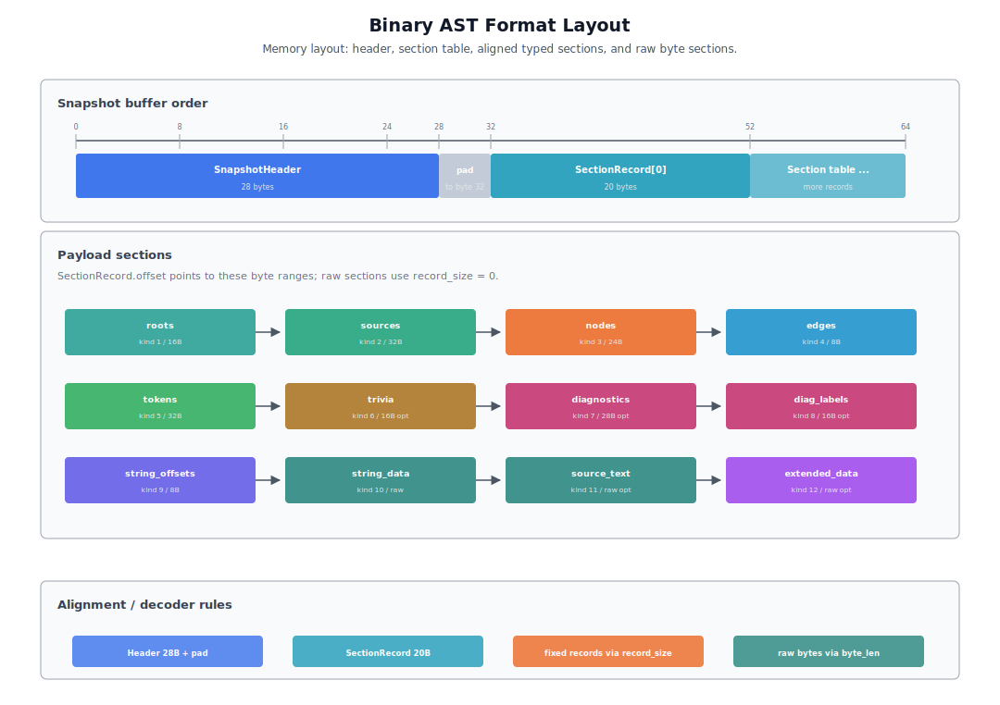
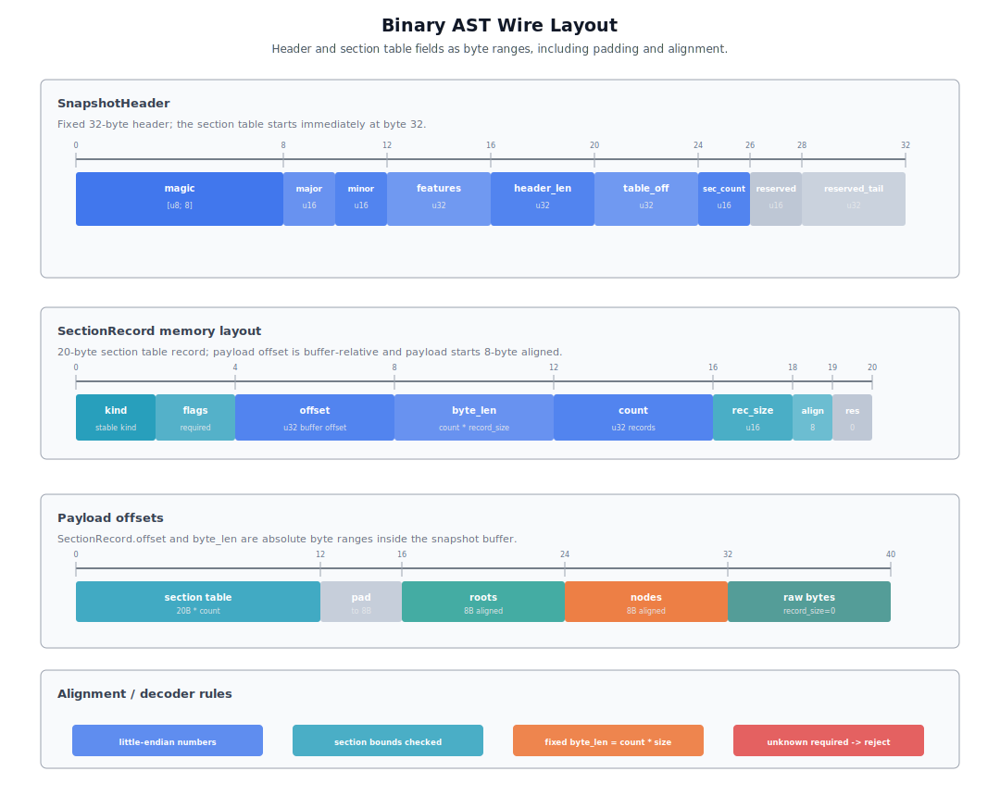
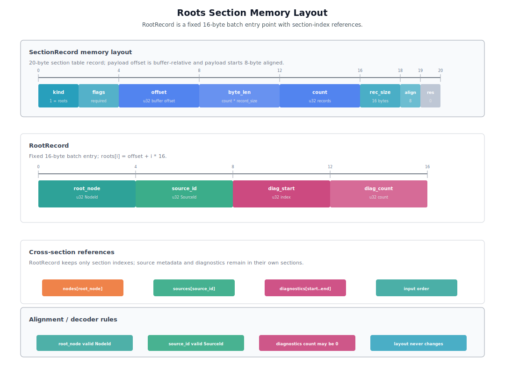
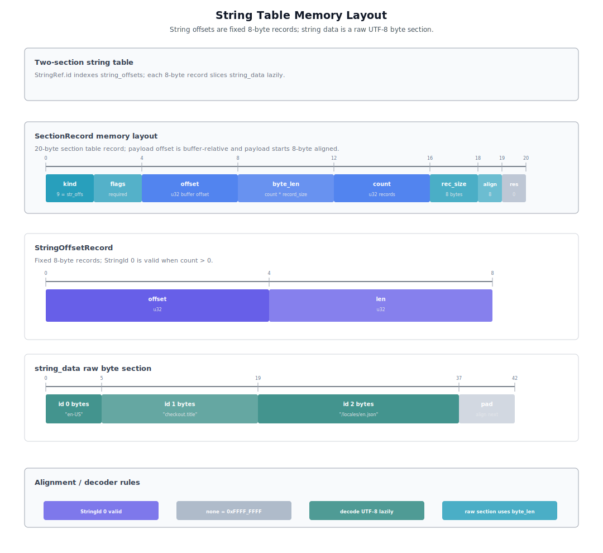
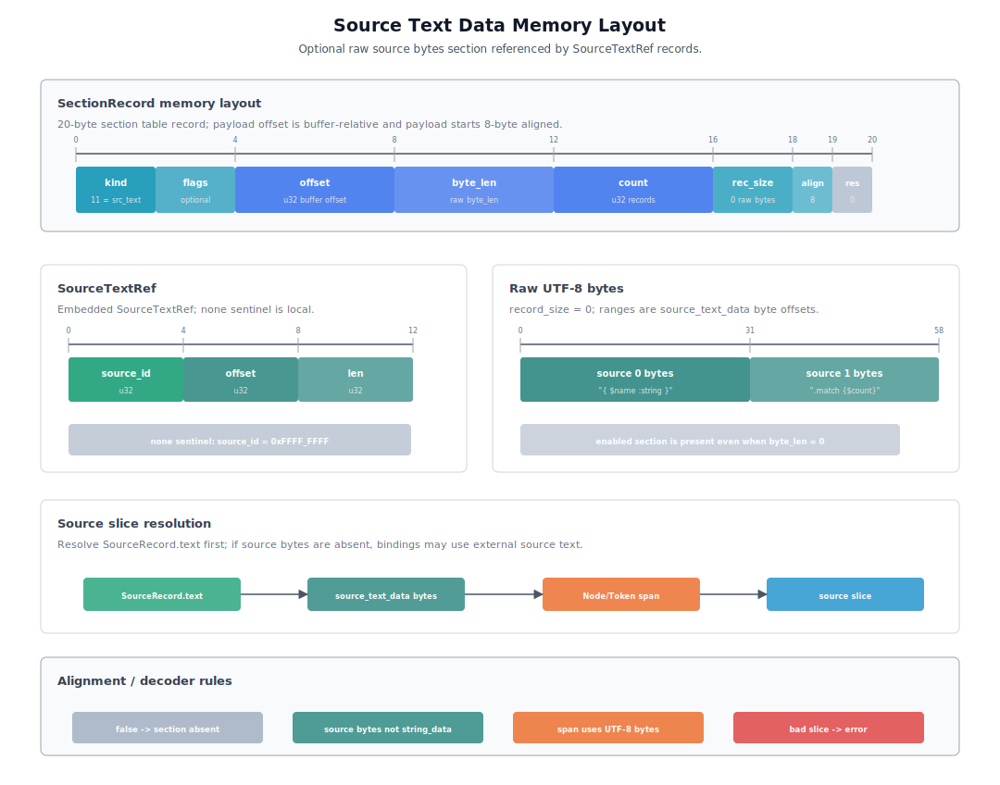
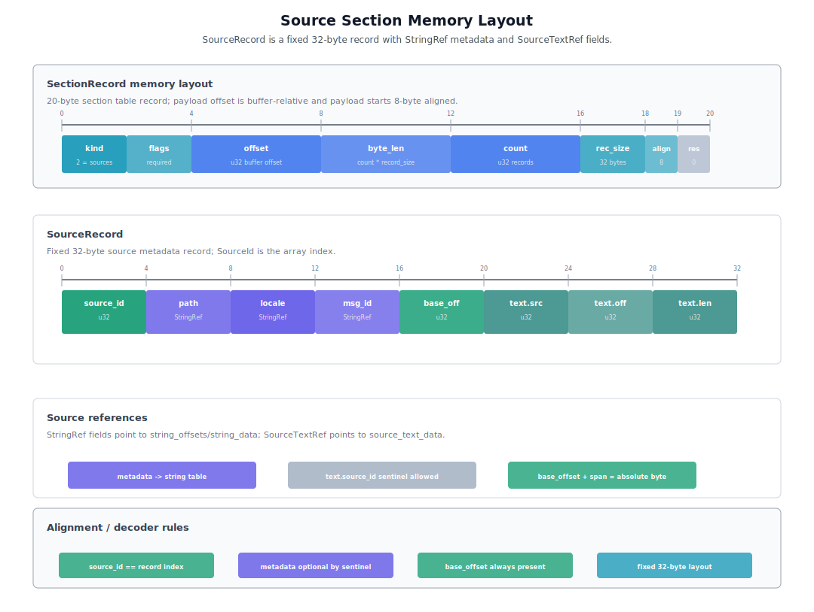
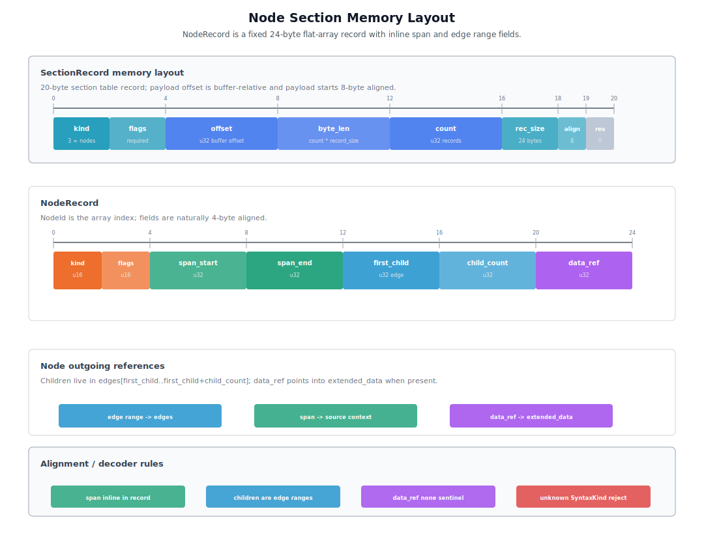
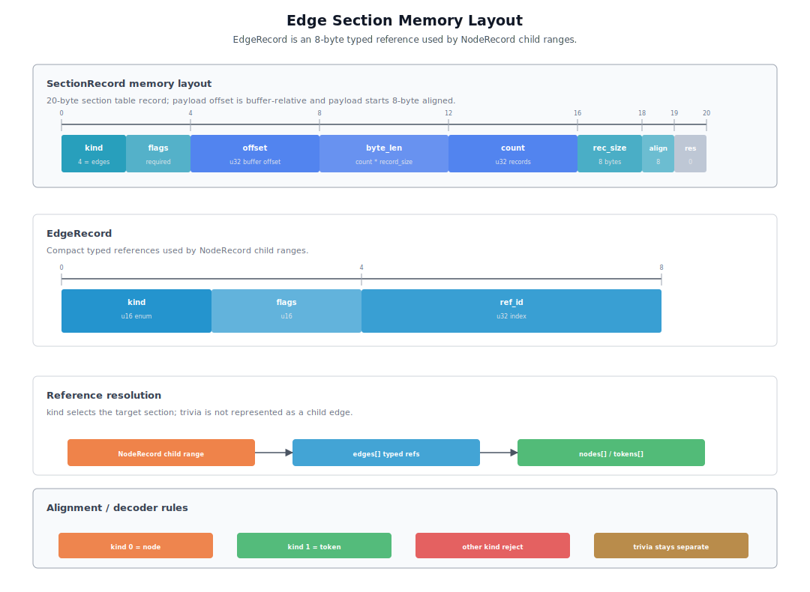
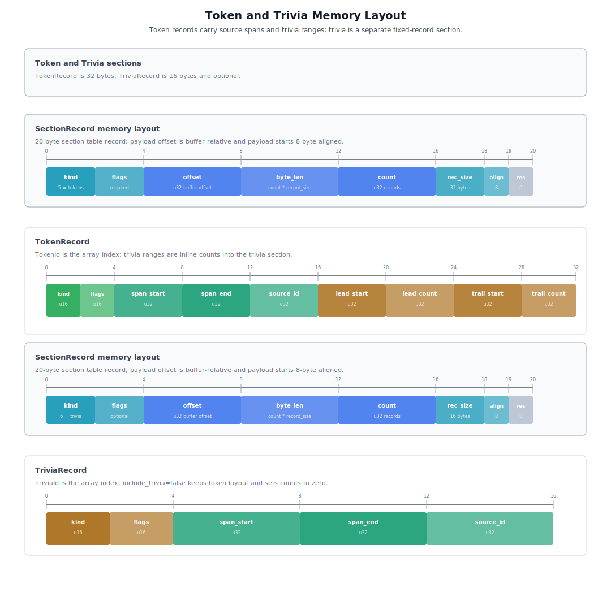
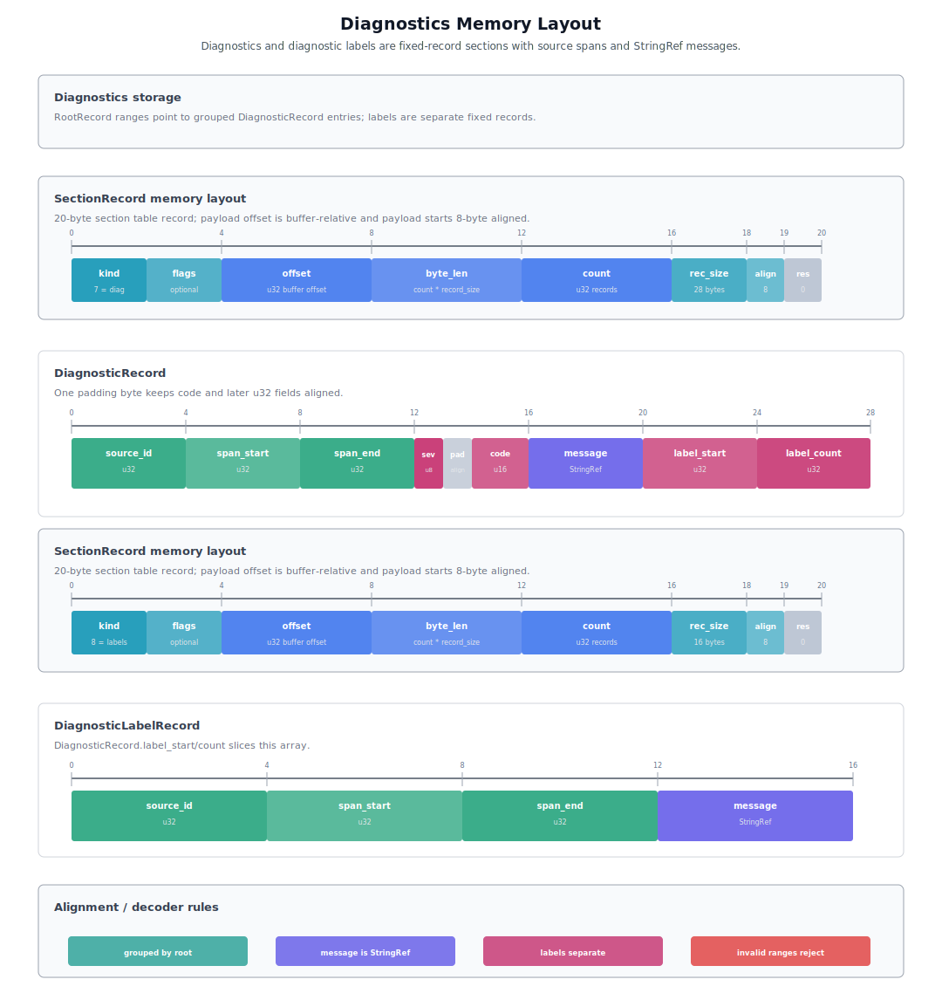

# ox-mf2 Phase 2 Binary AST Snapshot Design

## Purpose

This document defines implementation-oriented design details for the Phase 2 Binary AST snapshot of ox-mf2.

The foundation document is [001-ox-mf2-toolchain-foundation.md](./001-ox-mf2-toolchain-foundation.md). It defines the high-level philosophy and phase plan. This document defines the lower-level shape of Binary AST snapshots, snapshot-producing APIs, decoder/accessor APIs, snapshot ownership, wire compatibility, tests, and snapshot-specific benchmarks.

Language binding design is defined separately in [004-ox-mf2-phase-2-language-bindings-design.md](./004-ox-mf2-phase-2-language-bindings-design.md). Tooling and transport design is defined separately in [005-ox-mf2-phase-3-tooling-transport-design.md](./005-ox-mf2-phase-3-tooling-transport-design.md).

Intentional Binary AST format changes are tracked in [003-ox-mf2-binary-ast-format-changelog.md](./003-ox-mf2-binary-ast-format-changelog.md).

## Document Structure

This document is organized in implementation order.

1. Basic policy and identifier model
2. Snapshot-producing APIs, options, and result types
3. SnapshotWriter responsibilities and canonical encoding rules
4. Binary AST snapshot wire format and sections
5. Decoder, ownership, handle, and accessor APIs
6. Tests and benchmarks

## Basic Policy

ox-mf2 uses the Rust core as the single semantic implementation. MF2 parsing, CST construction, semantic analysis, diagnostics, formatting, and linting are not reimplemented in other languages.

Phase 1 builds a recovering parser and snapshot-friendly construction-time tables. Phase 2 introduces a versioned Binary AST snapshot as the product boundary for cross-language CST/AST views, persistence, worker transfer, and batch transfer.

The Rust core hot path keeps `CstTables` / `CstView` / `SemanticModel`. Binary AST snapshot is not the normal Rust core parse output. It is an encoded representation derived from `CstTables` for language boundaries, persistence, worker transfer, and batch transfer.

This design avoids the following path.

```text
public typed AST
  -> recursive conversion
  -> Binary AST snapshot
```

The intended path is as follows.

```text
parser / lowering
  -> snapshot-friendly construction tables
  -> SnapshotWriter
  -> versioned Binary AST snapshot
  -> decoder-accessor view
```

## Identifier Model

Binary AST snapshot inherits the Phase 1 identifier model defined in [002-ox-mf2-phase-1-rust-parser-design.md](./002-ox-mf2-phase-1-rust-parser-design.md), and adds RootId for snapshot entry points.

Inside a snapshot, RootId, NodeId, TokenId, TriviaId, and SourceId remain `u32` indexes into the corresponding section or source table. These ids are snapshot-local. Phase 1 SourceId values are used by SnapshotWriter to look up SourceStore metadata, but they are remapped to compact snapshot-local SourceId values when SourceRecord entries are emitted. These ids are not optional. `RootId = 0`, `NodeId = 0`, `TokenId = 0`, `TriviaId = 0`, and `SourceId = 0` are all valid indexes, and no none sentinel is defined for them. Spans remain UTF-8 byte offsets and do not include source_id. Source identity is obtained from record `source_id` or root/source context. Line/column and UTF-16 editor positions belong to display/editor boundaries and are not stored in snapshot node fields.

SourceStore and ParseInput are also defined in the Phase 1 parser design. Phase 2 uses Phase 1 SourceId and ParseInput metadata to build snapshot-local SourceRecord entries and root-to-source mappings.

## Snapshot-Producing API

This section defines the public Rust entry points that create Binary AST snapshot bytes. It covers both convenience APIs that parse and encode in one call and APIs that encode an already produced Phase 1 parse result.

### API Entry Points

Phase 2 snapshot APIs:

```rust
parse_source_to_snapshot(
  sources: &SourceStore,
  source_id: SourceId,
  parse_options: ParseOptions,
  snapshot_options: SnapshotOptions,
) -> Result<SnapshotResult, SnapshotWriteError>

parse_message_to_snapshot(
  source: &str,
  metadata: Option<SnapshotSourceMetadata<'_>>,
  parse_options: ParseOptions,
  snapshot_options: SnapshotOptions,
) -> Result<SnapshotResult, SnapshotWriteError>

parse_result_to_snapshot(
  sources: &SourceStore,
  result: &ParseResult,
  snapshot_options: SnapshotOptions,
) -> Result<SnapshotResult, SnapshotWriteError>

parse_session_to_snapshot(
  session: &ParseSessionResult<'_>,
  snapshot_options: SnapshotOptions,
) -> Result<SnapshotResult, SnapshotWriteError>

parse_batch_to_snapshot(
  inputs: &[ParseInput],
  batch_options: BatchParseOptions,
  snapshot_options: SnapshotOptions,
) -> Result<BatchSnapshotResult, SnapshotWriteError>

parse_batch_result_to_snapshot(
  result: &BatchParseResult,
  snapshot_options: SnapshotOptions,
) -> Result<BatchSnapshotResult, SnapshotWriteError>
```

`SourceStore`, `ParseInput`, `ParseOptions`, `BatchParseOptions`, `ParseResult`, `ParseSessionResult`, and `BatchParseResult` are defined in [002-ox-mf2-phase-1-rust-parser-design.md](./002-ox-mf2-phase-1-rust-parser-design.md). `SnapshotSourceMetadata` is the Phase 2-specific metadata carrier for `parse_message_to_snapshot`; it intentionally omits the `source` field that `SourceFileInput` carries so a single call can never disagree about what the parser and the snapshot point at. Snapshot generation is a separate Phase 2 responsibility so parse cost and snapshot encoding cost can be measured independently.

`parse_source_to_snapshot` is a convenience API equivalent to `parse_source` followed by `parse_result_to_snapshot`. It exists for callers that want a single operation and do not need to inspect or reuse the owned `ParseResult`.

`parse_message_to_snapshot` is the standalone counterpart for callers that do not own a `SourceStore`. It builds a private one-entry `SourceStore` from `source` plus the optional `SnapshotSourceMetadata`, then runs the same `parse_source` + `parse_result_to_snapshot` pipeline. This is the API to use when porting code that used `parse_message(source)` directly — pairing a `parse_message` `ParseResult` with an unrelated `SourceStore` is unsafe (see below).

`parse_result_to_snapshot` encodes an already produced owned `ParseResult` without reparsing. It reads SourceRecord metadata and optional source text from `sources.get(result.source)`. The contract is that `sources` is the same `SourceStore` the result was parsed against — i.e. the result came from `parse_source(sources, ...)` or `parse_batch(...).items[i].result`. SnapshotWriter then maps the Phase 1 SourceId to a snapshot-local SourceId. This API is the standard path when a caller has already parsed with Phase 1 APIs and later decides to export a Binary AST snapshot.

`parse_result_to_snapshot` MUST NOT be paired with a `ParseResult` produced by `parse_message(source)`: that path returns a hard-coded `SourceId::new(0)` without registering the source in any store, so a `sources.get(SourceId::new(0))` lookup against an unrelated store would silently encode the wrong source metadata or source text. Standalone callers should use `parse_message_to_snapshot` instead.

`parse_session_to_snapshot` encodes a snapshot from a borrowed parse result produced with `ParseWorkspace`; it is used by paths that want to reduce allocation variance, such as workspace reuse, benchmarks, and LSP. The snapshot builds SourceRecord and RootRecord from the `SourceStore` / Phase 1 SourceId reachable from the session, then emits snapshot-local SourceIds.

`parse_batch_to_snapshot` is a convenience API equivalent to `parse_batch` followed by `parse_batch_result_to_snapshot`.

`parse_batch_result_to_snapshot` encodes an already produced `BatchParseResult` without reparsing. It uses `BatchParseResult.sources` for SourceRecord metadata and encodes `BatchParseResult.items` in input order as RootRecord entries. This preserves the original batch `execution` / `degraded` values and keeps parse cost separate from snapshot encode cost.

`parse_batch_to_snapshot` accepts the same `BatchParseOptions` as the Phase 1 `parse_batch` API. If `BatchExecution::Parallel` is requested before real parallel execution exists, parsing downgrades to sequential execution and the result exposes that through `execution` / `degraded`. Snapshot encoding must not hide degraded fallback behavior.

`parse_session_to_snapshot` uses the `SourceStore` and Phase 1 SourceId reachable from `ParseSessionResult` / `CstView` as the only source metadata. It does not accept a second metadata argument. Passing independent metadata would create two sources of truth for path, locale, message_id, base_offset, and source text availability.

Parser diagnostics and writer errors are different failure classes. Recoverable parser syntax errors are represented as diagnostics plus a partial CST root and can be encoded into a snapshot. `SnapshotWriteError` means the writer cannot produce a valid snapshot, such as missing root, invalid source id, or `u32` overflow. In batch snapshot APIs, any `SnapshotWriteError` fails the entire call and returns `Err`; partial snapshot bytes are not returned.

### Snapshot Options

Parse behavior and snapshot output use separate option types. Parse behavior is defined by Phase 1 `ParseOptions`; this document defines only snapshot-specific options.

```rust
SnapshotOptions {
  include_diagnostics: bool,
  include_source_text: bool,
  include_trivia: bool,
}
```

Snapshot options must not change MF2 parser semantics. They only decide which already-produced parser data is encoded into the snapshot.

Defaults:

- `include_diagnostics = true`
- `include_source_text = false`
- `include_trivia = true`

`include_source_text = false` is the default. In normal snapshot-producing workflows, source text is already retained by the caller or SourceStore, so duplicating it in the snapshot increases size and transfer cost.

`include_source_text = true` is used when the snapshot alone must resolve `source_slice(source_id, span)`. Main uses are debug dump, persistence, worker transfer, fixture snapshots, and transport to external processes.

Whether whitespace / bidi trivia is collected by the parser is controlled by Phase 1 `ParseOptions.collect_trivia`. `SnapshotOptions.include_trivia` only controls whether already-produced trivia records are encoded into the snapshot. If a snapshot is built from a parse result produced with `collect_trivia = false`, there is no trivia to encode even when `include_trivia = true`.

When `include_trivia = true` but the parse result was produced with `collect_trivia = false`, SnapshotWriter encodes no trivia. TokenRecord trivia starts and counts are written as `0`, and the optional trivia section is omitted because it is empty. SnapshotWriter must not rescan source text to reconstruct trivia.

### Result Types

The result types in this section are Rust snapshot-producing API shapes. Higher-level APIs may wrap these bytes in result objects, but the snapshot layer itself returns encoded bytes plus root identity and diagnostics.

```rust
SnapshotResult {
  bytes: Vec<u8>,
  root: RootId,
  diagnostics: Vec<Diagnostic>,
}

BatchSnapshotResult {
  bytes: Vec<u8>,
  roots: Vec<RootId>,
  diagnostics: Vec<Diagnostic>,
  execution: BatchExecution,
  degraded: bool,
}
```

`SnapshotResult.root` is the RootId for a single input. `BatchSnapshotResult.bytes` is a shared snapshot buffer. `roots` is a RootId array corresponding to input order. `execution` is the batch strategy that actually ran, and `degraded` reports whether the requested strategy was downgraded. Each root has only root node, source_id, and diagnostic range through RootRecord. Path, locale, message_id, base_offset, and optional source text live in SourceRecord. This lets batch parsing share string tables and snapshot sections across many messages.

`BatchSnapshotResult.roots` remains a thin `Vec<RootId>`. It does not wrap roots into per-item result structs. `roots[i]` corresponds to `inputs[i]`; source id and diagnostic range are read through RootRecord in the decoded snapshot view. Rich per-item objects belong to higher-level result layers, not the Rust snapshot-producing result.

Rust snapshot-producing APIs return `bytes + RootId` and do not store a self-referential `RootHandle { snapshot, id }` directly in the result struct. RootHandle is created after a decoded `SnapshotView`, `SnapshotViewOwned`, or higher-level result object owns the snapshot.

`SnapshotOptions.include_diagnostics` controls whether diagnostics are encoded into snapshot bytes. It does not control whether the Rust API result returns diagnostics. `SnapshotResult.diagnostics` and `BatchSnapshotResult.diagnostics` are returned for caller convenience even when `include_diagnostics = false`; in that case the diagnostics and diagnostic labels sections are omitted from the snapshot bytes.

When `include_diagnostics = false`, diagnostic message strings are not interned into the snapshot string table. Diagnostic strings remain available through the Rust API result diagnostics, but they do not increase snapshot byte size.

Snapshot-producing APIs return `Vec<u8>`. SnapshotWriter naturally assembles the final buffer as a `Vec<u8>`, and callers can convert it to `Arc<[u8]>` when constructing a long-lived `SnapshotViewOwned` or higher-level result object.

## SnapshotWriter Design

### Build Phases

SnapshotWriter builds the snapshot in two phases.

1. Build section-local records and byte buffers.
2. Assemble all sections into one final `Vec<u8>` after section sizes, alignments, offsets, and the section table are known.

SnapshotWriter does not write directly into the final output buffer while parsing records. The writer first creates temporary section builders such as roots, sources, nodes, edges, tokens, trivia, diagnostics, diagnostic labels, string offsets, string data, source text data, and extended data.

This avoids fragile backpatching. Sections such as string data, source text data, and extended data have byte lengths that are only known after collection and deduplication. Keeping section-local buffers lets SnapshotWriter compute the final section table in one place, apply alignment consistently, and then copy records/bytes into the final snapshot buffer in section order.

The final assemble phase owns these responsibilities:

- compute each section's byte length, record count, record size, alignment, and required/optional flag
- compute aligned offsets from the start of the snapshot buffer
- write `SnapshotHeader`
- write `SectionRecord[]`
- write padding bytes with zeroes
- write fixed-record sections and raw byte sections
- verify that the final buffer length matches the computed layout

SnapshotWriter may pre-size section builders from `CstTables` counts and SourceStore metadata. It should avoid recursive AST conversion and should encode from table-oriented records in linear passes.

SnapshotWriter maintains a temporary Phase 1 SourceId to snapshot-local SourceId map while building roots, sources, tokens, trivia, and diagnostics. The map is not encoded as a snapshot section. It exists only to keep the snapshot compact and to avoid requiring SourceStore SourceId numeric values to be dense from zero for every emitted snapshot.

### Encode-Time Errors

SnapshotWriter returns `SnapshotWriteError` for encode-time failures.

```rust
pub enum SnapshotWriteError {
  SourceTooLarge,
  TooManyRoots,
  TooManySources,
  TooManyStrings,
  TooManyNodes,
  TooManyEdges,
  TooManyTokens,
  TooManyTrivia,
  TooManyDiagnostics,
  TooManyDiagnosticLabels,
  SectionTooLarge,
  MissingRoot,
  InvalidSourceId,
}
```

`SnapshotWriteError` is separate from `DecodeError`. `DecodeError` is for validating untrusted snapshot bytes. `SnapshotWriteError` is for cases where trusted parser output, source metadata, or snapshot options cannot be encoded into the v0.1 format.

v0.1 writer uses checked conversion and checked arithmetic for all `u32` fields.

- record counts greater than `u32::MAX` return the matching `TooMany*` error
- byte offsets or byte lengths greater than `u32::MAX` return `SectionTooLarge`
- source spans outside the `u32` domain return `SourceTooLarge`
- offset plus length calculations use checked addition
- final buffer layout calculations use checked addition before allocation

The writer must not truncate `usize` into `u32`.

### Section Emission

SnapshotWriter emits sections in stable `SectionKind` order.

```text
header
section table
roots
sources
nodes
edges
tokens
trivia
diagnostics
diagnostic_labels
string_offsets
string_data
source_text_data
extended_data
```

The section table remains the source of truth for decoders; decoders must not rely only on physical order. However, the writer uses deterministic SectionKind order so binary fixtures, layout diagrams, and byte-level diffs remain stable and reviewable. Optional sections may be absent or empty depending on options and content, but any emitted section uses the same order.

Section kind entries must be unique. If the section table contains the same `SectionKind` more than once, the decoder rejects the snapshot. The decoder reads sections through the section table and does not require physical section order to match SectionKind order. The v0.1 writer still emits sections in SectionKind order for deterministic output.

Optional sections are omitted when empty.

Required core sections are always emitted, even when their count or byte length is zero where the format permits it. Optional sections such as trivia, diagnostics, diagnostic labels, source text data, and extended data are emitted only when they contain data or when a future option explicitly requires their presence for debugging. The v0.1 default writer omits empty optional sections.

Decoders treat a missing optional section as an empty section. This keeps `include_trivia = false`, `include_diagnostics = false`, and `include_source_text = false` compact in the binary layout while preserving a simple read contract.

Empty required sections still receive an aligned `offset`. The `offset` represents the section start and must satisfy `offset <= snapshot.len()` and the normal alignment rule even when `byte_len = 0`. Optional empty sections are omitted instead of being represented with `byte_len = 0`.

### Explicit Wire Encoding

Snapshot records are encoded explicitly; Rust struct memory is never dumped directly.

Each fixed-record section has a specified wire `record_size`. SnapshotWriter writes every numeric field with explicit little-endian operations such as `write_u16_le` and `write_u32_le`. Decoder accessors read fields from fixed byte offsets using explicit little-endian operations.

Rust implementation structs may use any convenient in-memory layout, but `repr(C)`, Rust padding, platform alignment, or bytemuck-style casting must not define the snapshot wire format. This keeps the binary format stable across Rust compiler versions, targets, and future implementation refactors.

v0.1 fixed record sizes:

| Record                  | Wire size |
| ----------------------- | --------: |
| `SnapshotHeader`        |  32 bytes |
| `SectionRecord`         |  20 bytes |
| `RootRecord`            |  16 bytes |
| `StringOffsetRecord`    |   8 bytes |
| `SourceTextRef`         |  12 bytes |
| `SourceRecord`          |  32 bytes |
| `NodeRecord`            |  24 bytes |
| `EdgeRecord`            |   8 bytes |
| `TokenRecord`           |  36 bytes |
| `TriviaRecord`          |  16 bytes |
| `DiagnosticRecord`      |  28 bytes |
| `DiagnosticLabelRecord` |  16 bytes |
| `ExtendedDataHeader`    |   8 bytes |

The `TokenRecord` wire layout includes an explicit `reserved_tail` field so that the record is 36 bytes and future token-local compact metadata can be added without changing the v0.1 field offsets. The `DiagnosticRecord` wire layout includes an explicit reserved byte after `severity` so that the record is 28 bytes and every following multi-byte field starts at a stable offset. Decoder validation requires reserved bytes to be `0`.

All v0.1 reserved fields must be zero.

- `SnapshotHeader.reserved = 0`
- `SnapshotHeader.reserved_tail = 0`
- `SectionRecord.reserved = 0`
- `TokenRecord.reserved_tail = 0`
- `DiagnosticRecord` reserved byte = `0`
- any future reserved field in v0.1 must be `0`

Decoders reject non-zero reserved fields.

### Alignment and Canonical Output

v0.1 section alignment is fixed to 8 bytes.

- every section start offset is 8-byte aligned
- `SnapshotHeader` is fixed to 32 bytes
- padding may appear between the section table and the first section
- padding may appear between sections
- all padding bytes are `0x00`
- `SectionRecord.alignment` is always `8` in v0.1
- raw byte sections also start at an 8-byte aligned offset
- raw byte section `byte_len` may be any value
- fixed-record sections must satisfy `byte_len == count * record_size`
- final snapshot buffer length is exactly the end offset of the last emitted section

The `alignment` field remains in `SectionRecord` for format clarity and future evolution, but v0.1 decoders reject any section whose `alignment != 8`. This keeps the binary layout deterministic, makes validation simple, and leaves room for future native decoder optimizations without tying the wire format to Rust struct layout.

Padding bytes are part of the canonical encoding. SnapshotWriter writes `0x00` for every padding byte, and v0.1 decoders validate that all padding bytes are `0x00`. Non-zero padding is rejected as an invalid canonical snapshot.

Trailing padding after the last emitted section is not allowed. The final buffer length must be exactly the last section's `offset + byte_len`. This prevents multiple byte representations of the same snapshot content.

v0.1 writer output is canonical for the same parser output, input order, SourceStore metadata, and snapshot options. The format does not guarantee identical bytes across parser versions or package versions because SyntaxKind values, parser recovery behavior, diagnostics, and section contents may intentionally change before a future stable format.

Persistent caches that store snapshot bytes must include at least the snapshot format version and parser/package version in the cache key. A source hash alone is not sufficient for durable snapshot cache correctness.

## Binary AST Snapshot Format

### Format Overview

Binary AST snapshot is the canonical Phase 2 cross-language CST/AST product boundary and persistence format. It does not replace the normal Rust core parse output, and it is not a second semantic implementation.



Phase 2 snapshot focuses on the lossless CST surface.

- optional source text
- string table
- nodes
- edges
- tokens
- trivia
- inline span fields in records
- diagnostics
- roots section / RootRecord entry points

The semantic model remains available inside Rust and is exposed separately as SemanticView or a later compact semantic snapshot.

Source metadata is a core section. Source text bytes are an optional `source text data` section. The snapshot does not have a separate spans section; NodeRecord, TokenRecord, TriviaRecord, and DiagnosticRecord hold `span_start` / `span_end` inline. With `include_source_text = false`, the decoder cannot resolve `source_slice(source_id, span)` from the snapshot alone. In that case, the decoder/accessor uses external source text retained by the source owner or reports source text unavailable.

### Wire Layout



The snapshot format is based on a fixed-size header, section table, and typed fixed-record sections.

```text
SnapshotHeader {
  magic: [u8; 8],
  major_version: u16,
  minor_version: u16,
  feature_flags: u32,
  header_len: u32,
  section_table_offset: u32,
  section_count: u16,
  reserved: u16,
  reserved_tail: u32,
}

SectionRecord {
  kind: u16,
  flags: u16,
  offset: u32,
  byte_len: u32,
  count: u32,
  record_size: u16,
  alignment: u8,
  reserved: u8,
}
```

The v0.1 magic value is the ASCII byte sequence `b"OXMF2AST"`.

Initial v0.1 header values:

```text
major_version = 0
minor_version = 1
feature_flags = 0
header_len = 32
section_table_offset = 32
reserved = 0
reserved_tail = 0
```

In v0.1, the section table starts immediately after the fixed 32-byte header. `section_table_offset` must equal `header_len`, and both must be `32`. The field remains in the header for future evolution, but v0.1 decoders reject other values.

`section_count` is the number of emitted `SectionRecord` entries. It must be greater than zero, and the section table byte length is `section_count * 20`. The section table must fit in the buffer before the first emitted section offset. Because core sections are required, valid v0.1 snapshots have at least the core section count.

`SectionRecord.kind` is a stable numeric enum. Once assigned, a SectionKind number is not reused. Changing the meaning of a section incompatibly requires a major version bump.

The snapshot header has only `major_version` and `minor_version` for wire format compatibility. Patch version is not stored in the snapshot header; it is managed by the crate / npm package / WASM package release version.

While `major_version = 0`, the format is draft and decoders use exact version matching. A v0.1 decoder accepts only `major_version = 0` and `minor_version = 1`. It rejects `major_version = 0` with a higher minor version, because 0.x record layouts and section semantics may still change.

After a future v1.0 format freeze, `major_version` represents incompatible format changes, while `minor_version` can represent backward-compatible additions to sections, flags, or metadata.

In v0.1, unknown section kinds are rejected even when `SectionFlags.required = false`. Since v0.x uses exact version matching, unknown sections indicate either a corrupted snapshot or a snapshot from a different draft format.

After v1.0, adding a new optional section is allowed in a minor version. Existing decoders can skip unknown sections with `SectionFlags.required = false` after validation, so optional metadata, debug data, and future semantic data that do not change existing semantics can be minor additions. A new required section that is necessary to interpret the snapshot correctly requires a major version bump.

`feature_flags` is fully reserved in v0.1 and only `0` is allowed. v0.1 extension detection uses the section table and `SectionFlags.required`; header-level feature flags are not used until a clear purpose exists.

```text
SectionFlags {
  required: bit0,
}
```

In v0.1, unknown sections are always rejected. After v1.0, unknown sections are handled using `SectionFlags.required`: an unknown section kind can be skipped if `required = false` and offset/size/alignment are valid, while an unknown section with `required = true` is rejected because a decoder that cannot read it may be unable to interpret the snapshot correctly.

All multi-byte numeric fields are little-endian. `offset` and `byte_len` are byte offsets / byte lengths from the start of the snapshot buffer. In Phase 2, buffer offsets, section lengths, record counts, NodeId, TokenId, TriviaId, and SourceId are all in the `u32` domain.

Each section's count uses `SectionRecord.count` as the only source of truth. root count, node count, edge count, token count, and trivia count are read from the corresponding `roots`, `nodes`, `edges`, `tokens`, and `trivia` section counts. The header does not duplicate counts.

Section starts are 8-byte aligned by default. Sections with `record_size > 0` are typed fixed-record arrays, and decoders lazy-access `offset + index * record_size`. Sections with `record_size = 0` are raw byte sections, such as string data, source text data, and extended variable data.

The section table has stable IDs per `SectionKind`. v0.1 section kinds:

```text
0  = invalid/reserved
1  = roots
2  = sources
3  = nodes
4  = edges
5  = tokens
6  = trivia
7  = diagnostics
8  = diagnostic_labels
9  = string_offsets
10 = string_data
11 = source_text_data
12 = extended_data
```

`SectionKind = 0` is not a valid section. Decoders reject a section with `kind = 0`.

nodes, edges, tokens, roots, sources, string offsets, and string data are core sections. Core sections must exist in the section table with `SectionFlags.required = true`. A missing core section, or a core section with `required = false`, makes the snapshot invalid.

Minimum counts for core sections are `roots.count >= 1`, `sources.count >= 1`, and `nodes.count >= 1`. `edges.count` and `tokens.count` may be `0`. string offsets may have `count = 0` when there are no strings, and string data may have `byte_len = 0`.

source text data, trivia, diagnostics, diagnostic labels, and extended data are optional sections. Optional sections normally use `SectionFlags.required = false`. They may be empty depending on options or content. A missing optional section is equivalent to `count = 0`.

In v0.1, section flags are strict:

- every core section must have `required = true`
- every known optional section must have `required = false`
- a known optional section with `required = true` is invalid
- flags other than `required` are reserved and must be `0`

Decoder rules:

- for `major_version = 0`, accept only the exact supported draft version
- after v1.0, reject incompatible major versions
- after v1.0, accept minor version differences only when backward compatible
- do not use the snapshot header to distinguish patch-level implementation differences
- reject `feature_flags != 0` in v0.1
- for v0.1, reject any unknown section kind
- after v1.0, reject unknown required sections when `SectionFlags.required = true`
- after v1.0, skip unknown optional sections when `SectionFlags.required = false` and `offset`, `byte_len`, and `alignment` are valid
- reject sections where `offset + byte_len` exceeds buffer length
- reject sections where `record_size > 0` and `byte_len != count * record_size`
- reject overlapping section byte ranges

Section overlap validation sorts decoded section ranges by `offset`. Non-empty ranges must not overlap. Empty required sections are treated as zero-length ranges and may share an offset with the next section if that offset is aligned and within the buffer. Padding ranges between non-overlapping sections are validated as `0x00`.

### Roots Section



The roots section is a core section. RootRecord is the batch input entry point and stays compact without metadata payload.

RootRecord array order is fixed to `parse_batch` input order. `roots[i]` corresponds to `inputs[i]`. A single-input snapshot uses the same layout with `roots.count = 1`.

```text
RootRecord {
  root_node: u32,
  source_id: u32,
  diagnostic_start: u32,
  diagnostic_count: u32,
}
```

`root_node` is a valid NodeId into the nodes section and must satisfy `root_node < nodes.count`. There is no root none sentinel. The Phase 1 recovering parser returns diagnostics and partial trees for normal parse failure whenever possible. Fatal errors that prevent snapshot construction are API errors, not snapshot results.

If the parser result has no root node, SnapshotWriter returns a snapshot API error. It must not synthesize a replacement root node. A missing root is treated as an internal/fatal failure, not as a recoverable parse result.

`source_id` is a valid SourceId pointing to SourceRecord and must satisfy `source_id < sources.count`. There is no root-level source none sentinel. Path, locale, message_id, base_offset, and optional source text are read from SourceRecord. This keeps RootRecord as a fixed 16-byte entry point and separates source metadata expansion from roots-section random access.

`diagnostic_start` and `diagnostic_count` point to a contiguous range in the diagnostics section. Diagnostics are grouped by root order. This allows decoders to slice diagnostics from `roots[i]` in O(1).

When `include_diagnostics = false`, RootRecord layout does not change. `diagnostic_count = 0` and `diagnostic_start = 0`. The diagnostics section and diagnostic labels section may be empty or absent optional sections. Decoders must not vary RootRecord record_size by option.

### String Table



In v0.1, the string table stores snapshot metadata and diagnostic messages. It does not store source-derived text, cooked text, normalized text, debug text, or semantic payload text. Original source text is not mixed into string data; it is stored in the dedicated `source text data` section only when `include_source_text = true`.

The string offsets section and string data section are core sections and always exist, even with zero strings. In that case, string offsets can have `count = 0`, and string data can have `byte_len = 0`.

v0.1 string table deduplicates only metadata and diagnostics strings:

- `SourceRecord.path`
- `SourceRecord.locale`
- `SourceRecord.message_id`
- `DiagnosticRecord.message`
- `DiagnosticLabelRecord.message`
- future optional metadata strings

v0.1 string table does not store source-derived text that can be represented by `source_id + span_start/span_end`:

- original source text
- token text
- trivia text
- node text
- source slices
- cooked / normalized text

If cooked, debug, or normalized text becomes necessary later, add it through extended data or a dedicated optional section instead of mixing it into the v0.1 metadata/diagnostic string table.

String interning uses first-seen order during snapshot encoding.

The writer interns strings while building sections in deterministic writer order:

1. source metadata strings
2. diagnostic messages and diagnostic label messages
3. future optional metadata strings

The writer does not sort strings lexicographically. This avoids extra encode cost and keeps StringId assignment deterministic for the same input order, same diagnostics, and same snapshot options.

```text
StringRef {
  id: u32,
}

StringOffsetRecord {
  offset: u32,
  len: u32,
}
```

`StringRef.id` is a StringId into the string offsets section. The decoder reads `string_offsets[id]` and slices `offset..offset+len` from the string data section. `StringId` is the canonical interned string identity inside the snapshot.

`StringId = 0` is a valid string id and points to `string_offsets[0]`. If the string offsets section has `count = 0`, no valid StringId exists. Optional strings use `StringId = 0xFFFF_FFFF` as the none sentinel. Decoders must not look up the none sentinel in string offsets. A non-sentinel StringId greater than or equal to string offsets count is invalid.

The empty string is an ordinary interned string. It is not assigned a reserved StringId. If `""` is interned and happens to be the first string, it may receive `StringId = 0`; otherwise it receives whichever StringId the intern table assigns. Absence is represented only by the none sentinel `0xFFFF_FFFF`, not by `StringId = 0` or an empty string.

Decoders materialize UTF-8 strings lazily, only when a consumer reads them.

### Source Text Data Section



The source text data section is an optional raw byte section. When `include_source_text = true`, each emitted SourceRecord's original MF2 source text is stored in this section as UTF-8 bytes. When `include_source_text = false`, this section is absent or empty.

v0.1 snapshot source text data covers only UTF-8-valid source text. If an input with unpaired surrogates must be handled for ECMAScript String compatibility, the source/language boundary keeps it as external source text and combines it with a snapshot using `include_source_text = false`. If storing WTF-8 or UTF-16 source text in snapshots becomes necessary, it should be designed as a future optional section or format change.

When `include_source_text = true`, source text bytes are stored as one concatenated byte buffer.

- each SourceRecord stores `SourceTextRef { source_id, offset, len }` using the snapshot-local SourceId
- `offset` is relative to the start of the source text data section
- source text entries do not have NUL terminators
- source text entries do not have per-entry padding
- the source text data section start is 8-byte aligned like every other section
- decoder validation checks `offset + len <= source_text_data.byte_len`

The section-level alignment is enough. Individual source text entries are byte slices, so per-entry alignment would only increase snapshot size without improving decode behavior.

The v0.1 writer does not deduplicate source text bytes.

Even if two inputs have identical source text, the default writer appends each SourceRecord's text separately to the source text data section. This keeps root/source/text identity straightforward. The format can represent shared ranges, but default source text deduplication is deferred until a precise identity policy and benchmark motivation exist.

```text
SourceTextRef {
  source_id: u32,
  offset: u32,
  len: u32,
}
```

`offset` and `len` are byte ranges inside the source text data section. `SourceTextRef.source_id = 0xFFFF_FFFF` is the none sentinel and means source text bytes are not included in the snapshot. In the sentinel case, SnapshotWriter writes `offset = 0` and `len = 0`, and v0.1 decoders reject non-zero offset or length so the none representation stays canonical.

Normal SourceId has no none sentinel, but SourceTextRef is an optional field and therefore has one. Source text data is separated from the string table so metadata string deduplication, diagnostic strings, future derived text payloads, and original source text lifetime / transfer policy can evolve independently.

### Source Section



The source section is a core section. Source records contain source identity and metadata, but not source text bytes.

SourceRecord array order is not fixed to `parse_batch` input order. The sources section may deduplicate by source identity. Multiple RootRecords may point to the same snapshot-local `source_id`. Root-to-source mapping is always resolved through `RootRecord.source_id`.

v0.1 snapshot format does not define a source dedup key. Identity rules such as `path + base_offset + source text` are not baked into the wire format. Phase 1 SourceId assigned by SourceStore or a higher-level source owner is the input-side source identity. SnapshotWriter encodes a compact snapshot-local SourceId mapping into SourceRecord and RootRecord fields.

The v0.1 writer does not deduplicate SourceRecord entries.

For v0.1 output, each input root gets a corresponding SourceRecord, and RootRecord points to that SourceRecord using the snapshot-local SourceId. The wire format and decoder still allow multiple roots to reference the same SourceRecord, but the default writer avoids source deduplication until a precise dedup key and benchmark motivation exist. This keeps diagnostics, source slices, and root-to-input mapping straightforward.

```text
SourceRecord {
  source_id: u32,
  path: StringRef,
  locale: StringRef,
  message_id: StringRef,
  base_offset: u32,
  text: SourceTextRef,
}
```

Snapshot SourceId is a required index into the sources section. `SourceRecord.source_id` must match its own index in the sources section. RootRecord, TokenRecord, TriviaRecord, and DiagnosticRecord `source_id` fields have no none sentinel and must satisfy `source_id < sources.count`. `SourceId = 0` is valid.

`path`, `locale`, and `message_id` are optional metadata. They always exist as `StringRef` fields in SourceRecord, and use `StringId = 0xFFFF_FFFF` as the none sentinel when absent. SourceRecord layout does not vary by metadata presence.

`base_offset` is a UTF-8 byte offset. It is not optional; `0` is stored when unspecified. Absolute byte positions are computed as `base_offset + span_start/end`. UTF-16 code unit positions, line/column, and LSP positions are converted at the editor/language boundary and are not stored in snapshot node fields.

When `include_source_text = false`, `text.source_id = 0xFFFF_FFFF`. SourceRecord layout does not change. Roots and diagnostics retain SourceId and Span, so an external source owner can resolve locations or source slices.

When `include_source_text = true`, the snapshot stores source text in the dedicated source text data section. `SourceRecord.text.source_id` must equal the same record's `source_id`. In large batches, each SourceRecord has its own text range, and the roots section links source metadata to root nodes.

Source slices are resolved with SourceId plus Span. `source_slice(span)` refers to APIs with source context, such as `SourceView::source_slice(span)` or convenience accessors on node/token handles. It succeeds only when source text can be resolved from snapshot source text data or from external source text retained by the source owner. If neither is available, the decoder/accessor returns a source text unavailable error instead of silently returning an empty value.

Rust source slice accessors return an explicit error when source text is unavailable.

```rust
SourceView::source_slice(span: Span) -> Result<&str, SourceTextUnavailable>
```

Higher-level APIs convert the same condition into their language boundary, such as a thrown error or explicit error result. Accessors must not use `None` / `undefined` for this case because an empty slice and unavailable source text are different states.

### Node Section



Snapshot node records are fixed-size as much as possible. This keeps NodeId as a direct `u32` index into the node section.

```text
NodeRecord {
  kind: u16,
  flags: u16,
  span_start: u32,
  span_end: u32,
  first_child: u32,
  child_count: u32,
  data_ref: u32,
}
```

`kind` stores the numeric value of the Phase 1 parser `SyntaxKind` directly. SnapshotWriter does not remap NodeRecord.kind through a snapshot-specific kind table. `SyntaxKind` numeric values are snapshot-visible draft data in v0.x. Changing them requires binary fixture updates, decoded fixture updates, and a format changelog entry. After a future v1.0 format freeze, published `SyntaxKind` values must not be reordered, reused, or changed incompatibly without a snapshot major version bump. A decoder rejects unknown `SyntaxKind` numeric values.

`flags` is reserved in v0.1. SnapshotWriter writes `0`, and decoders reject non-zero flags.

`first_child` and `child_count` represent a range in the edges section. Children are stored as an EdgeRecord array in source order, where each edge references either a node or a token.

Variable-length data or node-kind-specific data lives in the extended data section referenced by `data_ref`. The extended data section is a raw byte section with `record_size = 0`. `data_ref = 0xFFFF_FFFF` is the none sentinel and means the node has no extended data. Any non-sentinel `data_ref` must be a valid byte offset into the extended data section. NodeId / TokenId / TriviaId / SourceId have no sentinel, but `data_ref` is optional and therefore has one.

The v0.1 writer does not emit extended data.

In v0.1 output, `NodeRecord.data_ref = 0xFFFF_FFFF` for every node, and the optional extended data section is omitted. The field and section kind remain in the format so future versions can add cooked literals, normalized identifiers, debug text, or node-kind-specific payloads without changing the NodeRecord layout.

Extended data payloads always have a header.

```text
ExtendedDataHeader {
  kind: u16,
  flags: u16,
  byte_len: u32,
}
```

`data_ref` points to the first byte of ExtendedDataHeader. `byte_len` is the total payload length including the header. Decoders verify `data_ref + byte_len <= extended_data.byte_len`. `kind` is a node-kind-specific payload kind and must be compatible with NodeRecord.kind. If not, the snapshot is invalid.

### Edge Section



The edge section is a core section. EdgeRecord is a compact typed reference representing CST parent-child relationships.

```text
EdgeRecord {
  kind: u16,
  flags: u16,
  ref_id: u32,
}
```

`kind` is a numeric enum: `node = 0` or `token = 1`. Other values are invalid. If `kind = node`, `ref_id` is a NodeId; if `kind = token`, `ref_id` is a TokenId. The decoder/accessor reads the EdgeRecord range from NodeRecord `first_child` / `child_count` and lazily returns node views or token views according to edge kind. For `kind = node`, `ref_id < nodes.count` must hold; for `kind = token`, `ref_id < tokens.count` must hold.

`flags` is reserved in v0.1. SnapshotWriter writes `0`, and decoders reject non-zero flags.

Trivia is not mixed into child edges. Trivia is read from TokenRecord leading/trailing trivia ranges. This keeps syntax traversal focused on node/token children, while formatters reconstruct source-preserving output from token order and trivia ranges.

### Token and Trivia Sections



Tokens and trivia have dedicated snapshot sections. TokenId and TriviaId are `u32` indexes into their respective sections.

```text
TokenRecord {
  kind: u16,
  flags: u16,
  span_start: u32,
  span_end: u32,
  source_id: u32,
  leading_trivia_start: u32,
  leading_trivia_count: u32,
  trailing_trivia_start: u32,
  trailing_trivia_count: u32,
  reserved_tail: u32,
}

TriviaRecord {
  kind: u16,
  flags: u16,
  span_start: u32,
  span_end: u32,
  source_id: u32,
}
```

TokenRecord.kind and TriviaRecord.kind also store the Phase 1 `SyntaxKind` numeric value directly. Nodes, tokens, and trivia share the same `SyntaxKind` family, while decoders/accessors interpret node kind, token kind, and trivia kind using section context and helper predicates. Decoders reject unknown `SyntaxKind` numeric values for TokenRecord.kind and TriviaRecord.kind too. This keeps kind identity identical across parser tables, snapshot records, and accessors, and removes the need for a kind conversion table during snapshot encoding.

TokenRecord.flags, TokenRecord.reserved_tail, and TriviaRecord.flags are reserved in v0.1. SnapshotWriter writes `0`, and decoders reject non-zero values.

The internal Phase 1 `TokenRecord` may use a compact layout with `first_trivia` and leading/trailing counts to reduce record size. SnapshotWriter expands it linearly into snapshot `leading_trivia_start` / `leading_trivia_count` / `trailing_trivia_start` / `trailing_trivia_count`. The snapshot format does not need to be byte-identical to construction-time layout, but the conversion should require only per-token arithmetic.

Formatters, especially preserve mode, use token and trivia sections to reconstruct source faithfully without relying on a nested object tree.

When `include_trivia = false`, TokenRecord layout does not change. `leading_trivia_count` and `trailing_trivia_count` are `0`, and `leading_trivia_start` and `trailing_trivia_start` are also `0`. The trivia section may be empty or absent as an optional section. Decoders must not vary TokenRecord record_size by option.

v0.1 TokenRecord / TriviaRecord has no `text_ref`. Original token / trivia text is referenced by `source_id + span_start/span_end`. With `include_source_text = false`, external source text is used. With `include_source_text = true`, `SourceRecord.text` points to the source text data section. If normalized text, cooked text, or debug text becomes necessary and cannot be represented only by source spans, add extended data or an optional token-text section instead of growing TokenRecord / TriviaRecord.

### Diagnostics Section



When `include_diagnostics = true`, SnapshotWriter encodes parser diagnostics and diagnostic labels when they are present. The diagnostics and diagnostic labels sections are optional and may still be omitted when empty. This allows snapshots to be inspected or transported with parse diagnostics attached without forcing empty optional sections into every snapshot.

```text
DiagnosticRecord {
  source_id: u32,
  span_start: u32,
  span_end: u32,
  severity: u8,
  reserved: u8,
  code: u16,
  message: StringRef,
  label_start: u32,
  label_count: u32,
}
```

`severity` and `code` are compact numeric enums. `message` is an indexed StringRef. If extension/custom diagnostics need human-readable string codes, add a future optional diagnostic-code string section rather than growing DiagnosticRecord.

In v0.1, `code` stores the parser diagnostic code numeric value. This mapping is snapshot-visible draft data, so changing numeric diagnostic code values requires fixture updates and a format changelog entry. The parser implementation must not silently rely on Rust enum declaration order if that would make diagnostic code numbers accidental.

Diagnostic records are grouped by root order so RootRecord `diagnostic_start` / `diagnostic_count` can reference them. In v0.1 writer output, diagnostics belong to the root's SourceRecord. `DiagnosticRecord.source_id` is still stored explicitly so the record layout stays uniform and future writer policies can evolve, but the v0.1 writer does not emit multi-source diagnostics within one root. The RootRecord range is the source of truth for root-local diagnostics in the snapshot.

Diagnostic labels live in a separate diagnostic labels section. DiagnosticRecord `label_start` / `label_count` points to a contiguous range in the DiagnosticLabelRecord array.

```text
DiagnosticLabelRecord {
  source_id: u32,
  span_start: u32,
  span_end: u32,
  message: StringRef,
}
```

Diagnostics without labels use `label_count = 0`. Decoders verify `label_start + label_count <= diagnostic_labels.count`. In v0.1 writer output, DiagnosticLabelRecord `source_id` also points to the same root SourceRecord as the parent diagnostic. Help text is not included in the v0.1 snapshot record; add it later as an optional diagnostic-help section when needed.

Public APIs may return diagnostics separately for convenience, but the snapshot format must be able to keep diagnostics as part of the encoded result. A flat diagnostics array in a binding result is a view over snapshot diagnostic records in root order, not a separate diagnostic table.

## Decoder and Accessor API

This section defines how validated snapshot bytes become read-only Rust views. It covers decode errors, buffer ownership, handle identity, raw-id accessors, and traversal APIs.

### Decoder Error Boundary

Snapshot decode fails with typed errors, not panics.

Rust decoder API:

```rust
decode_snapshot(bytes: &[u8]) -> Result<SnapshotView<'_>, DecodeError>
decode_snapshot_owned(bytes: Arc<[u8]>) -> Result<SnapshotViewOwned, DecodeError>
```

`DecodeError` covers invalid snapshot, unsupported version, missing required section, invalid section layout, invalid index, unknown section, unknown required section, unknown `SyntaxKind`, invalid UTF-8 string, out-of-range source text, invalid extended data, diagnostic range mismatch, and similar failures.

Rust `DecodeError` uses a compact error code plus optional context fields.

```rust
pub struct DecodeError {
  pub code: DecodeErrorCode,
  pub section: Option<SectionKind>,
  pub offset: Option<u32>,
  pub index: Option<u32>,
}

pub enum DecodeErrorCode {
  BufferTooShort,
  InvalidMagic,
  UnsupportedMajorVersion,
  UnsupportedMinorVersion,
  InvalidHeaderLength,
  InvalidFeatureFlags,
  InvalidReservedField,
  SectionTableOutOfBounds,
  DuplicateSection,
  MissingRequiredSection,
  UnknownSection,
  UnknownRequiredSection,
  InvalidSectionFlags,
  InvalidSectionAlignment,
  InvalidSectionBounds,
  InvalidRecordSize,
  InvalidSectionCount,
  OverlappingSection,
  InvalidPadding,
  TrailingPadding,
  InvalidStringOffset,
  InvalidUtf8,
  InvalidStringRef,
  InvalidSourceRef,
  InvalidRootRef,
  InvalidNodeRef,
  InvalidTokenRef,
  InvalidTriviaRef,
  UnknownSyntaxKind,
  InvalidDiagnosticSeverity,
  UnknownDiagnosticCode,
  InvalidDiagnosticRange,
  InvalidSourceTextRange,
  InvalidExtendedData,
}
```

Human-readable messages are generated through `Display`. They are not stored in snapshot bytes and are not part of the wire format. Programmatic handling uses `DecodeErrorCode` and optional context fields.

Rust APIs return invalid snapshots as `Result::Err(DecodeError)`. Decoder/accessors may handle untrusted bytes, so validation failures must not panic. Internal invariant violations may use debug assertions, but public decode boundaries return recoverable errors.

Language bindings convert Rust `DecodeError` into their own error boundaries as defined in the binding design. The snapshot layer preserves error code, message, optional section kind, optional offset, and optional record index so bindings and tests can handle decode failures programmatically.

`decode_snapshot` eagerly validates all records needed for safe traversal. Header and section table validation are not enough. Index references, string refs, source refs, child ranges, token/trivia ranges, diagnostics ranges, source text ranges, reserved fields, and v0.1 flag constraints are all validated before returning `SnapshotView`.

After `SnapshotView` is created, normal traversal is treated as trusted and may use internal unchecked helpers. Decode benchmarks and accessor traversal benchmarks are reported separately so eager validation cost remains visible.

Decoder validation order:

1. check minimum buffer length
2. decode `SnapshotHeader`
3. validate magic, exact v0.1 version, `feature_flags`, `header_len`, and header reserved fields
4. validate section table bounds
5. decode `SectionRecord[]`
6. reject duplicate section kinds
7. validate required section presence
8. in v0.1, reject unknown sections; after v1.0, reject unknown required sections and skip unknown optional sections
9. validate section flags, reserved fields, offset, byte length, alignment, and record size
10. validate padding bytes are `0x00` and reject trailing padding after the last section
11. validate core section minimum counts
12. validate string table offsets and UTF-8
13. validate source records
14. validate root records
15. validate node, edge, token, trivia indexes, and `SyntaxKind` numeric values
16. validate diagnostics, diagnostic severity/code values, and diagnostic label ranges
17. validate source text ranges
18. validate extended data, which is expected to be empty for v0.1 writer output

String table validation happens before SourceRecord and DiagnosticRecord validation because those records contain StringRef fields. A decoder must know that string offsets and string data are valid before validating StringRef references from other records.

### Snapshot Buffer Ownership

The Rust decoder provides both borrowed and owned views.

```rust
pub struct SnapshotView<'a> {
  bytes: &'a [u8],
  sections: SectionIndex,
}

pub struct SnapshotViewOwned {
  bytes: Arc<[u8]>,
  sections: SectionIndex,
}
```

`SectionIndex` stores only validated section metadata, not per-record validation caches.

```rust
SectionIndex {
  roots: SectionSlice,
  sources: SectionSlice,
  nodes: SectionSlice,
  edges: SectionSlice,
  tokens: SectionSlice,
  trivia: Option<SectionSlice>,
  diagnostics: Option<SectionSlice>,
  diagnostic_labels: Option<SectionSlice>,
  string_offsets: SectionSlice,
  string_data: ByteSection,
  source_text_data: Option<ByteSection>,
  extended_data: Option<ByteSection>,
}
```

Once eager validation succeeds, accessors read records from `bytes + SectionIndex`. The decoder does not keep a separate per-record validation cache. This keeps `SnapshotView` small and makes decode cost visible instead of hiding materialization in the view.

`SnapshotView<'a>` requires the caller to manage the lifetime of snapshot bytes. Decode builds only the section table and validation metadata; it does not eagerly materialize nodes, tokens, or strings. This is used by Rust internal tests, benchmarks, temporary decode, and zero-copy inspection.

`SnapshotViewOwned` owns snapshot bytes as `Arc<[u8]>`. Long-lived caches, daemons, language bindings, LSP, and worker handoff use owned views when accessors may outlive the original buffer owner.

`Arc<[u8]>` is the v0.1 owned backing storage. It gives cheap immutable clones, can be shared across threads, and avoids adding a bytes/buffer dependency to the Rust core. Single-owner storage such as `Box<[u8]>` may be used internally before ownership is promoted, but the public owned view stores `Arc<[u8]>`.

Accessors do not expand snapshot bytes into a recursive object tree. They slice the snapshot buffer and return values only when consumers read nodes, tokens, strings, or diagnostics.

### Handle Model

Public Root / Node / Token / Trivia handles are pairs of snapshot owner and section-local id, not object pointers.

```text
RootHandle   { snapshot: SnapshotRef, id: RootId }
NodeHandle   { snapshot: SnapshotRef, id: NodeId }
TokenHandle  { snapshot: SnapshotRef, id: TokenId }
TriviaHandle { snapshot: SnapshotRef, id: TriviaId }
```

In Rust, `SnapshotRef` is a reference to `SnapshotView` / `SnapshotViewOwned` or an owned view. In bindings, the equivalent reference is a language-specific accessor object that owns or shares the snapshot buffer. The handle itself does not copy snapshot bytes.

RootId, NodeId, TokenId, TriviaId, and SourceId are snapshot-local identities. Equal id values from different snapshots do not mean the same root/node/token/trivia/source. Handle equality is based on both snapshot identity and id.

Handle construction validates `id < section.count`. Children traversal, root lookup, and token trivia lookup return lightweight handles with the same `SnapshotRef`. This lets lazy accessors avoid materializing object trees and avoids dangling pointers in GC-managed languages.

Rust low-level APIs may also provide accessors that take `SnapshotView` and raw ids separately for performance-sensitive paths. Language bindings standardize their own ergonomic handle API on top of this snapshot handle model.

Rust accessors use checked public lookup and internal unchecked lookup.

```rust
SnapshotView::root(id: RootId) -> Option<RootView>
SnapshotView::node(id: NodeId) -> Option<NodeView>
SnapshotView::token(id: TokenId) -> Option<TokenView>
SnapshotView::trivia(id: TriviaId) -> Option<TriviaView>

// internal or unsafe hot path after decoder validation
SnapshotView::node_unchecked(id: NodeId) -> NodeView
```

Public raw-id accessors return `Option` for out-of-range ids. Traversal from already validated records may use internal unchecked helpers to avoid repeated range checks. Unchecked helpers are not the cross-language compatibility surface.

SnapshotView exposes read-only section metadata for tests, debug dumps, and structural fixture generation.

```rust
SnapshotView::section(kind: SectionKind) -> Option<SectionView>

SectionView {
  kind: SectionKind,
  offset: u32,
  byte_len: u32,
  count: u32,
  record_size: u16,
  alignment: u8,
}
```

This API does not allow mutation and does not expose unvalidated bytes. It reflects the already validated section table.

Rust snapshot views expose read-only raw bytes.

```rust
SnapshotView::as_bytes() -> &[u8]
SnapshotViewOwned::as_bytes() -> &[u8]
```

This is useful for hashing, fixture generation, debug dumps, and persistence. Rust can expose borrowed bytes safely through lifetimes. Language bindings may still use copy semantics for raw byte export, as defined in the binding design.

### Accessor Traversal API

The snapshot accessor model uses array-like views as the primary representation, not recursive materialized trees.

Rust snapshot accessors keep traversal allocation-free.

```rust
enum ChildView<'a> {
  Node(NodeView<'a>),
  Token(TokenView<'a>),
}

root.node() -> NodeView<'a>
root.diagnostics() -> DiagnosticIter<'a>

node.kind() -> SyntaxKind
node.span() -> Span
node.child_count() -> u32
node.child_at(index: u32) -> Option<ChildView<'a>>
node.children() -> Children<'a>

token.kind() -> SyntaxKind
token.span() -> Span
token.leading_trivia() -> TriviaIter<'a>
token.trailing_trivia() -> TriviaIter<'a>

trivia.kind() -> SyntaxKind
trivia.span() -> Span
```

`node.children()` returns an iterator or range view in source order. It does not allocate and does not materialize a subtree. `node.child_count()` and `node.child_at(index)` are available for indexed traversal.

Rust `node.child_at(index)` returns `Option<ChildView<'a>>`; out-of-range indexes return `None`. Language bindings may convert the same condition into a `RangeError` or explicit API error, as defined in the binding design. Binding-level error ergonomics do not change the Rust snapshot accessor baseline.

Language bindings may expose ergonomic array-returning helpers such as `children(): ChildHandle[]`, as defined in the binding design. Those helpers are not the Rust snapshot accessor baseline.

Indexed accessors must distinguish out-of-range access from an empty child list. Rust snapshot accessors use `Option` for this boundary. Language bindings may convert the same condition into an explicit error so formatter/linter traversal bugs fail loudly.

Language-specific iterator helpers may be added as convenience APIs, but they are not the snapshot compatibility surface. The snapshot traversal contract is defined by array-like methods and indexed accessors.

## Snapshot Test Strategy

Phase 2 snapshot tests use both binary golden fixtures and decoded structural fixtures.

Binary golden fixtures:

- validate snapshot header, section table, record layout, alignment, endianness, and required/optional section flags
- detect accidental changes to the versioned wire format
- include option combinations for `include_source_text`, `include_trivia`, and `include_diagnostics`
- include invalid snapshot fixtures and verify decoders reject them with `DecodeError`, not panic

Decoded text fixtures:

- keep decoded roots, sources, nodes, edges, tokens, trivia, diagnostics, labels, and strings as reviewable text dump snapshots
- separate byte-level binary layout changes from semantic structure changes during review
- check root order, source deduplication, diagnostic grouping, token/trivia spans, and `SyntaxKind` numeric values
- detect CST/diagnostics regressions that are hard to review from exact binary bytes alone

Text dump is the standard decoded structural fixture format because it keeps node/edge/token/trivia ordering easy to review in pull requests. JSON debug output may exist for tooling, but it is not the default structural golden format.

Binary golden fixtures are contract tests for wire compatibility. Decoded text fixtures are review aids that keep implementation behavior explainable. When intentionally changing the snapshot format version, update binary fixtures, decoded text fixtures, and the format changelog in the same change.

Fixture update policy:

- binary golden fixtures store the exact little-endian snapshot bytes
- decoded text fixtures are generated from the same inputs as the binary fixtures
- changes to format version, record layout, `SectionKind`, or `SyntaxKind` numeric values update the binary fixture, decoded text fixture, format changelog, and this design document in the same commit
- parser behavior changes may update decoded text fixtures without changing the wire format changelog
- fixture generation is performed by a dedicated CLI or test helper so fixture bytes are reproducible

Binary fixture review should distinguish wire layout changes from parser behavior changes. A wire layout change without a format changelog entry is treated as a test failure or review blocker.

Format changelog updates are required when any of the following change:

- header layout or initial header values
- `SectionKind` numeric values
- section required/optional status
- section alignment or padding rules
- record field layout or `record_size`
- `SyntaxKind` numeric values emitted into snapshot records
- `DiagnosticCode` numeric values emitted into diagnostic records
- decoder validation rules
- canonical writer output rules
- source text data layout
- string table interning or deduplication policy
- SourceRecord deduplication policy
- extended data payload policy

## Benchmarks

Snapshot work must not be hidden inside one parser number.

Relevant benchmark phases:

- lexer
- parse_message_owned
- parse_cst
- parse_cst_no_trivia
- lower_semantic
- owned_materialize
- diagnostics
- source_mapping
- parse_batch_session
- parse_batch_sequential
- encode_snapshot
- decode_snapshot
- snapshot_accessor_traversal
- snapshot_to_bytes_copy
- parse_batch_to_snapshot

Phase 2 snapshot benchmarks measure parser hot path, snapshot encoding, snapshot decoding, and snapshot accessor cost separately.

- `parse_message_owned`: convenience `parse_message` path, including fresh workspace setup and owned `ParseResult` materialization.
- `parse_cst`: cost for the Rust parser to build CstTables through `parse_source_session` with `collect_trivia = true`.
- `parse_cst_no_trivia`: cost for the Rust parser to build CstTables through `parse_source_session` with `collect_trivia = false`.
- `lower_semantic`: parser-core cost plus `SemanticModel` lowering.
- `owned_materialize`: cost to create an owned `ParseResult` from borrowed session / table output.
- `encode_snapshot`: cost to build Binary AST snapshot bytes from existing CstTables / diagnostics / source metadata.
- `decode_snapshot`: cost to validate snapshot bytes and build lazy SnapshotView / section index. It does not include node/token/string traversal.
- `snapshot_accessor_traversal`: cost to read roots, nodes, tokens, trivia, and diagnostics lazily from a decoded SnapshotView.
- `snapshot_to_bytes_copy`: cost to copy snapshot bytes from an owned snapshot buffer into a caller-owned byte buffer.
- `parse_batch_session`: cost to parse a corpus with one `SourceStore` and one reused `ParseWorkspace` through borrowed session results.
- `parse_batch_sequential`: public owned batch API cost, including owned `ParseResult` materialization per item.
- `parse_batch_to_snapshot`: combined product path for batch parse plus shared snapshot encoding. Do not mix it with the single-message parser baseline.

Benchmark reports include at least separate series for `parse_cst_no_trivia`, `parse_cst`, `parse_cst + encode_snapshot`, `decode_snapshot`, `snapshot_accessor_traversal`, and `snapshot_to_bytes_copy`. For single-message comparison with external parsers, the primary baseline must match the closest parse-only equivalent exposed by the compared parser; ox-mf2 reports must clearly state whether they use `parse_cst_no_trivia`, `parse_cst`, or `parse_message_owned`. Snapshot numbers are reported separately as ox-mf2 product-boundary cost.
