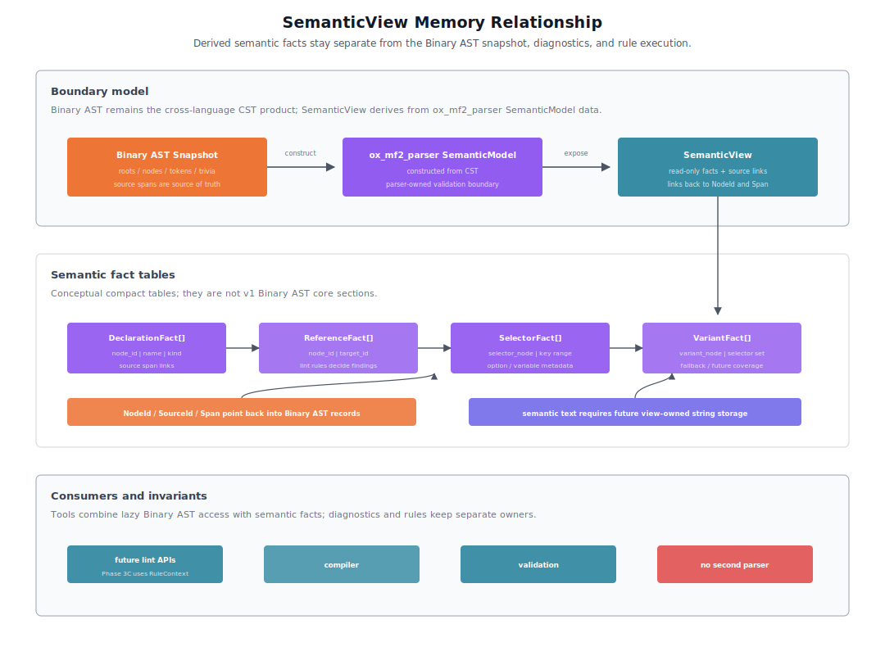

# ox-mf2 Phase 3 Tooling and Transport Design

## Purpose

This document defines the Phase 3 design boundary for tooling and transport workflows around ox-mf2.

Phase 1 parser design is defined in [002-ox-mf2-phase-1-rust-parser-design.md](./002-ox-mf2-phase-1-rust-parser-design.md). Phase 2 Binary AST snapshot design is defined in [003-ox-mf2-phase-2-binary-ast-snapshot-design.md](./003-ox-mf2-phase-2-binary-ast-snapshot-design.md). Phase 2 language binding design is defined in [004-ox-mf2-phase-2-language-bindings-design.md](./004-ox-mf2-phase-2-language-bindings-design.md).

This document focuses on formatter/linter input, future SemanticView exposure, LSP/editor workflows, agent coding workflows, transport choices, and long-lived language-service scenarios.

## Basic Policy

The standard CST/AST product boundary remains the versioned Binary AST snapshot. Tooling may use Rust-internal construction-time tables for fast paths, but public cross-language tooling input should converge on the Binary AST decoder/accessor view.

Semantic information can be exposed later as SemanticView or a later compact semantic snapshot. It is not forced into the lossless Binary AST snapshot.

MessagePack is not the CST/AST representation of ox-mf2. It is reserved as a future transport for long-lived language-service workflows.

## Implementation Phasing

This document defines the broader tooling and consumer boundary for Phase 3 and later work. It does not require formatter, linter, LSP/editor, agent integration, and long-lived transport features to be implemented in one release or one milestone.

Implementation should be split by consumer-facing product surface:

1. **Phase 3A: Tooling Foundation**
   - `crates/intlify_cli` and the `intlify` command structure
   - unified `fmt` / `lint` project config model and JSON Schema
   - shared machine-readable output conventions
   - package and distribution boundaries for CLI, N-API, and WASM tooling

2. **Phase 3B: Formatter Product**
   - workspace-internal `crates/intlify_format`
   - `intlify fmt`
   - `fmt --check` and formatter check result contract
   - standard and preserve formatting modes
   - `@intlify/format-napi` and `@intlify/format-wasm`

3. **Phase 3C: Linter Product**
   - `crates/intlify_lint`
   - `intlify lint`
   - parser, semantic, and lint diagnostic result contract
   - recommended preset, core semantic diagnostics, and initial configurable lint rules
   - `@intlify/lint-napi` and `@intlify/lint-wasm`

4. **Phase 3D: LSP/Editor Integration**
   - adapter workflows for diagnostics and formatting
   - `.mf2` and JSON/YAML resource message mapping
   - UTF-8 byte span to editor position conversion
   - editor-specific configuration source handling

5. **Phase 3E: Agent Coding Integration**
   - agent workflows over stable CLI JSON output
   - repo instructions, skills, plugins, hooks, or MCP wrappers as needed
   - no vendor-specific agent protocol as the core contract

6. **Phase 3F or Later: Long-lived Transport**
   - JSON-RPC baseline measurement
   - MessagePack transport evaluation
   - daemon/session/cache optimization for repeated language-service queries

Earlier phases should keep later consumers in mind when shaping public contracts, but later consumer workflows remain layered integrations until their product phase starts.

## SnapshotView

Phase 3 does not introduce a second public AST view. The existing Binary AST `SnapshotView` / binding-side snapshot accessor remains the common public serialized syntax foundation for formatter, linter, LSP/editor, and transport consumers; this does not require every initial product entry point to accept a snapshot directly.

`SnapshotView` is already defined by the Phase 2 Binary AST snapshot design as a lazy decoder/accessor over versioned snapshot bytes. Phase 3 extends that contract at the consumer-requirements level rather than replacing it with a recursive object AST.

The Phase 3C initial linter is the explicit source-backed exception: `lintMessage(source)` parses into construction-time `CstView` plus parser-owned `SemanticModel` facts and does not expose `lintSnapshot`. Snapshot-backed linting remains deferred until the parser owns a snapshot-to-`SemanticModel` path that preserves semantic validation behavior. Formatter snapshot APIs and future snapshot-backed linter/editor optimizations continue to use `SnapshotView` as the public serialized syntax boundary.

Core `SnapshotView` requirements:

- root, node, token, trivia, source, and diagnostic access by snapshot-local id
- child traversal in source order without materializing a recursive tree
- node, token, trivia, and diagnostic spans as UTF-8 byte ranges
- token leading/trailing trivia access
- source metadata and source text slicing through embedded or externally supplied source text
- stable raw snapshot bytes for persistence, worker transfer, and cross-process transport

Tooling-facing helpers may be layered on top of this core accessor when they can be derived from snapshot records and source text.

- raw token and trivia text helpers
- root/source-aware token stream traversal
- delimiter and keyword token lookup for formatter rules
- single-line / multi-line shape checks
- blank-line and line-break checks between adjacent syntax records
- byte-offset range lookup for editor requests
- UTF-8 byte span to UTF-16 editor position conversion at the editor boundary

These helpers should not become a second AST format. If a helper cannot be derived from the Binary AST snapshot plus source text, that is a signal to either extend the snapshot format deliberately or keep the feature in a Rust-internal fast path until the public product boundary is clarified.

## SemanticView

SemanticView is separate from the lossless Binary AST snapshot.

Binary AST handles CST, tokens, trivia, and source spans. SemanticView handles semantic facts and source links derived from `ox_mf2_parser`-owned `SemanticModel` data.

The v0.1 Binary AST does not serialize Phase 1 semantic `StringRef` values. A future public SemanticView that exposes cooked or normalized text must define explicit view-owned or future-snapshot string storage instead of treating the v0.1 metadata/diagnostic string table as semantic storage.

- declarations
- references
- selectors
- variants
- fallback/default information
- links to NodeId and Span
- future duplicate-key or coverage metadata if those facts become part of the shared semantic surface

Bindings, editors, future snapshot-backed linting, compiler-like consumers, and language-service features can combine Binary AST decoder/accessor traversal with SemanticView. Initial Phase 3C built-in lint rules use the Rust-internal `RuleContext` described in the linter input section instead of requiring SemanticView as a public rule API.

Semantic diagnostics are produced separately by the parser-owned `validate_semantics(model)` boundary. SemanticView is not the diagnostic owner; it is the semantic fact/source-link concept that consumers can combine with diagnostics and Binary AST traversal. In the initial Phase 3 scope, it is a tooling-facing semantic concept and future public semantic surface rather than a fixed N-API/WASM public API or built-in lint rule API. Bindings may expose it later, but they must not implement a separate semantic analyzer in JavaScript or another host language.

## Formatter Input

### Product Surface

Phase 3 should provide a dedicated formatter engine and reusable formatter entry points for workspace Rust, N-API, and WASM consumers. The CLI is the primary user-facing workflow, while N-API and WASM bindings allow the same formatter engine to power playgrounds, editor integrations, workers, and Node-based tools.

### Crate Ownership

The Rust formatter engine should live in a separate workspace-internal `crates/intlify_format` crate that depends on `ox_mf2_parser`. This crate is not a crates.io deliverable in Phase 3B; public formatter distribution happens through the `intlify fmt` CLI and formatter N-API/WASM packages. The parser crate remains responsible for CST construction, parser diagnostics, Binary AST snapshots, SemanticModel construction, and parser-owned semantic validation. The formatter crate owns formatting modes, formatter configuration, layout construction, rendering, and formatter result shaping.

### CLI and Package Distribution

The CLI binary should live in `crates/intlify_cli` and expose `intlify fmt` alongside `intlify lint`. Distribution should happen through npm packages that let JavaScript users install and run the Rust CLI through the npm ecosystem: `@intlify/cli` is the JavaScript wrapper package, while `@intlify/cli-native` owns the compiled native CLI binary artifacts.

N-API and WASM formatter bindings should be published as formatter-specific packages rather than added to the existing parser binding packages. Parser bindings stay focused on parsing, snapshots, and parser-level APIs, while `@intlify/format-napi` and `@intlify/format-wasm` expose formatter-specific APIs backed by `crates/intlify_format`.

The npm distribution surface should separate the CLI wrapper/native binary packages from formatter API packages. `@intlify/cli` exposes the command-line wrapper, `@intlify/cli-native` owns the compiled native binary artifacts, `@intlify/format-napi` exposes Node APIs, and `@intlify/format-wasm` supports browser, worker, and playground use cases.

The Phase 3 formatter deliverables are the Rust formatter engine, CLI command, N-API formatter package, WASM formatter package, JSON configuration contract, generated JSON Schema, and formatter result contract. LSP/editor integration, playground usage, and resource/catalog formatting are consumers or layered workflows rather than separate direct products in this phase.

### Public Syntax Input

From Phase 2 onward, public AST input for formatter APIs is the Binary AST decoder/accessor view.

Formatter implementation may have Rust-internal fast paths over construction-time tables when formatting immediately after parse. However, stable public formatter input is the Binary AST view shared by Rust, N-API, WASM, and later consumers.

The primary public API is `formatMessage(source, options?)`, which parses one MF2 message and returns a formatter result. `formatSnapshot(snapshot, source, options?)` is an advanced parse-artifact reuse path for playgrounds, workers, and language-service caches that already hold a Binary AST snapshot. The complete source string is required in every formatter mode for source slicing, parser diagnostic materialization, output comparison, and available snapshot/source consistency checks; preserve mode additionally uses it for source-shape decisions. The Phase 3 formatter does not expose a source-free snapshot mode. Binding packages should expose direct programmatic formatter APIs rather than a CLI callback bridge.

### Formatting Modes

The formatter should support at least two modes. Detailed formatter rules, API shape, fixtures, and implementation requirements are tracked separately in [007-ox-mf2-phase-3b-formatter-design.md](./007-ox-mf2-phase-3b-formatter-design.md). This document only fixes the Phase 3 boundary and high-level formatter direction.

- standard mode: format to the standard ox-mf2 style without using the original layout as a primary decision input
- preserve mode: preserve source shape where it is meaningful while still applying standard local formatting rules

Standard mode is a deterministic pretty-printer over the public syntax view.

Preserve mode is source-shape-sensitive pretty formatting. It may preserve single-line / multi-line choices, blank-line grouping, and whitespace trivia placement when those choices are recoverable from tokens, trivia, delimiter spans, and source slices. It should still normalize local spacing, indentation, and other standard formatting rules. In Phase 3B, both standard and preserve modes preserve translatable pattern text, quoted and unquoted literal spelling, and escape spelling through verified source slices. MF2 defines no line-comment or block-comment syntax, so comment placement is not a formatter mode capability.

### Message-Level Formatting

The formatter core formats one whole MF2 message at a time. Range-only formatting is outside the initial formatter core. LSP/editor adapters should call whole-message formatting, compare the original and formatted message, and produce editor `TextEdit` values at the integration boundary. Minimal-diff edit computation belongs to the editor/resource adapter, not the formatter core.

### Layout Architecture

The formatter should separate syntax traversal from rendering. Internally, it should have a layout model capable of delayed line/group/indent decisions so line width, standard mode, preserve mode, and future resource/catalog adapters can reuse one message-level formatter core. The concrete IR/document implementation is a formatter-specific design detail.

### CLI Input Model

The CLI accepts file path and glob inputs so users can format MF2 files directly, for example `intlify fmt "locales/**/*.mf2"` or `intlify fmt messages/en.mf2`. The primary CLI input unit is a single MF2 message file: one file contains one MF2 message that can be parsed and formatted directly. Resource files containing multiple messages, framework-specific i18n files, and multi-locale catalogs are layered consumers that extract message entries and reuse the message-level formatter; their host-file parsing, string escaping, and outer document edits are not fixed by the Phase 3 core formatter contract.

### CLI Write and Check Workflows

`intlify fmt` should default to write mode and modify files in place. It should also support check workflows such as `--check` and `--list-different` for CI and pre-commit usage. Stdin formatting should be supported through a file-aware option such as `--stdin-filepath`, allowing editors and scripts to pipe source while still giving the formatter enough context for extension checks and configuration.

### Formatter Parallelism

The CLI may format multiple files in parallel, but observable behavior must remain deterministic. File discovery should normalize and de-duplicate paths before formatting so write mode never races on the same file when overlapping globs or repeated paths are provided.

Text output, `--check`, and `--list-different` results should be reported in stable normalized path order, independent of worker scheduling. Programmatic APIs such as `formatMessage(source, options?)` remain single-message operations; resource/catalog adapters and CLI workflows decide whether to parallelize multiple message entries.

Benchmarks should report formatter concurrency settings separately from parser, syntax traversal, layout construction, rendering, binding, and file I/O costs.

### Configuration

The formatter should load JSON project configuration. Formatter and linter configuration are separate responsibility areas, but they should be sections of one ox-mf2 tooling config so the CLI can resolve `fmt` and `lint` settings from the same root project configuration. The initial config discovery model is intentionally simple: only the root config defined by the Phase 3A CLI foundation is loaded. Nearest-config-wins and nested config discovery are out of scope until a concrete multi-workspace need appears.

The project configuration surface should use one unified JSON Schema with `fmt` and `lint` sections. Formatter and linter crates may keep separate resolved config models internally, but editor completion and config validation should point users at the unified ox-mf2 tooling config schema published through `@intlify/cli/schema/config.schema.json`. CLI output schemas are separate from this config schema and may be split by command.

Formatter configuration should support `ignorePatterns` but not file-specific `overrides` in the initial design. The initial formatter target is a narrow MF2 message file/resource workflow, so file-kind-specific overrides are unnecessary. If future resource/catalog or multi-file-kind workflows need per-file options, overrides can be reconsidered then.

### EditorConfig

The Phase 3B initial formatter does not read `.editorconfig` because `mode` is the only supported formatting option. Once formatter options with corresponding EditorConfig properties, such as line width, indent width, line ending, or final newline, are explicitly supported, the formatter should read `.editorconfig` as formatter-only fallback input for those options when they remain unset by higher-precedence sources. The linter should not read `.editorconfig`.

### Invalid Syntax

Formatter behavior for invalid syntax is strict in the initial design. If parsing produces any parser diagnostic, the formatter does not produce public formatted output. CLI write mode must not modify the file. API consumers should receive diagnostics or an error result without formatted output. LSP/editor adapters should treat incomplete or invalid editing buffers as no-op formatting requests. Recovery-aware formatting is future editor-specific scope.

### Formatter Results

Formatter results are distinct from linter diagnostic results, but parser diagnostic locations should share the core SourceId and UTF-8 byte Span location model. CLI, N-API, WASM, and LSP/editor integrations can derive line/column or UTF-16 positions as needed. Formatter-specific diagnostics may be added later under a formatter category, but linter rule ids and severity configuration should not be mixed into formatter results.

### Formatter Ignore Directives

Formatter ignore directives are not in scope for the initial formatter. MF2 does not define line or block comments, and `#` is a markup sigil, so a comment-like formatter directive would be a syntax extension. Initial formatter ignoring is file-level only, through formatter config, root `.gitignore`, and explicit ignore paths. A future syntax-unit suppression mechanism must be spec-compatible and belongs to the formatter-specific design.

### Formatter and Linter Boundary

The Phase 3 responsibility boundary is style in the formatter and correctness in the linter. Formatting checks should use `intlify fmt --check` or formatter check APIs. If a future linter workflow needs style diagnostics or style fixes, it should delegate to formatter APIs rather than reimplement formatter layout rules in lint rules.

### Dedicated Formatter Design Notes

Formatter detail notes to resolve in the dedicated formatter design:

- exact Rust, N-API, and WASM result types
- formatter options and defaults
- formatter config section schema shape
- future spec-compatible formatter suppression mechanism
- line wrapping rules
- matcher layout rules
- formatter fixture and idempotency requirements
- native package lazy-loading and config helper behavior
- required SnapshotView helper priority

### Formatter Benchmarks

Formatter output should measure parser, snapshot encode/decode/access, syntax traversal, layout construction, rendering, binding calls, and CLI end-to-end cost separately.

## Linter Input

### Product Surface

Phase 3 should provide a dedicated lint CLI and reusable linter entry points for Rust, N-API, and WASM consumers. The CLI is the primary user-facing workflow, while N-API and WASM bindings allow the same linter engine to power playgrounds, editor integrations, and Node-based tools.

### Crate Ownership

The Rust linter engine should live in a separate workspace-internal `crates/intlify_lint` crate that depends on `ox_mf2_parser`. This crate is not a crates.io deliverable in Phase 3C; public linter distribution happens through the `intlify lint` CLI and linter N-API/WASM packages. The parser crate remains responsible for CST, diagnostics, snapshots, SemanticModel construction, and parser-owned semantic validation, while the lint crate owns rule execution, presets, lint configuration, and lint result shaping.

### CLI and Package Distribution

The CLI binary should live in a separate `crates/intlify_cli` crate. That crate composes parser, formatter, and linter crates into user-facing commands such as `intlify lint`. Distribution should happen through npm packages that let JavaScript users install and run the Rust CLI through the npm ecosystem: `@intlify/cli` is the JavaScript wrapper package, while `@intlify/cli-native` owns the compiled native CLI binary artifacts.

N-API and WASM linter bindings should be published as linter-specific packages rather than added to the existing parser binding packages. Parser bindings stay focused on parsing, snapshots, and parser-level APIs, while `@intlify/lint-napi` and `@intlify/lint-wasm` expose lint-specific APIs backed by `crates/intlify_lint`.

The npm distribution surface should separate the CLI wrapper/native binary packages from linter API packages. `@intlify/cli` exposes the command-line wrapper, `@intlify/cli-native` owns the compiled native binary artifacts, `@intlify/lint-napi` exposes Node APIs, and `@intlify/lint-wasm` supports browser, worker, and playground use cases.

The Phase 3 linter deliverables are the Rust linter engine, CLI, N-API linter package, WASM linter package, and shared diagnostic result schema. LSP/editor integration and playground usage are consumers of those deliverables rather than separate direct products in this phase.

### CLI Input Model

The CLI accepts file path and glob inputs so users can lint MF2 files directly, for example `intlify lint "locales/**/*.mf2"` or `intlify lint messages/en.mf2 messages/ja.mf2`.

The primary CLI input unit is a single MF2 message file: one file contains one MF2 message that can be parsed and linted directly. Resource files containing multiple messages, framework-specific i18n files, and multi-locale catalogs are layered consumers that extract message entries and reuse the message-level linter; their concrete file formats are not fixed by the Phase 3 core linter contract.

### Configuration

The CLI should load JSON project configuration for rule severity, presets, and ignore patterns. Formatter and linter configuration are separate responsibility areas, but they should be sections of one ox-mf2 tooling config so the CLI can resolve `fmt` and `lint` settings from the same root project configuration. The initial config discovery model is intentionally simple: only the root config defined by the Phase 3A CLI foundation is loaded. Nearest-config-wins and nested config discovery are out of scope until a concrete multi-workspace need appears. `crates/intlify_lint` is the source of truth for the resolved lint config model, rule registry, preset expansion, defaults, and validation so the CLI, N-API, and WASM entry points share the same behavior.

The JSON configuration surface should be part of the unified config JSON Schema published through `@intlify/cli/schema/config.schema.json`. This schema is part of the tooling contract for editor completion and config validation, while the Rust config model remains the source of truth. Linter configuration should not support file-specific `overrides` in the initial design; file selection belongs to CLI operands and ignore patterns. Resource/catalog linting can revisit this if per-resource configuration becomes necessary.

### Presets

The initial linter preset should be a `recommended`-style preset focused on broadly useful, low-noise message-level diagnostics. Rule category alone does not determine preset membership: the initial recommended rules are best-practice warnings, while a context-dependent correctness rule may remain opt-in. Parser and semantic correctness diagnostics are independent of configurable presets and remain enabled by their pipeline contract. Stricter, nursery, experimental, and resource/catalog-oriented presets are future or linter-specific design details rather than Phase 3 core requirements.

While the linter remains in 0.x, the `recommended` preset may evolve by adding broadly useful, low-noise configurable diagnostics from suitable categories. Preset stability policy should be finalized before a 1.0 release.

### CLI Output and Exit Behavior

The initial CLI output formats should include human-readable `text` output and machine-readable `json` output. Additional formats can be added later, but `json` should use the same diagnostic schema exposed by Rust, N-API, and WASM entry points.

Machine-readable output schemas are distinct from the unified project config schema. `lint`, `fmt --check`, and a future combined `check` command may use command-specific JSON result schemas, while sharing common grouping and summary conventions where practical.

The CLI exits with a failure status when any diagnostic whose JSON `severity` is `"error"` is reported. Diagnostics whose JSON `severity` is `"warn"` do not fail the process by default. A `--max-warnings <n>` option should allow CI users to fail when the warning count exceeds the configured threshold.

Detailed CLI option semantics, including quiet mode, fix mode, linter config section schema details, ignore/include behavior, unmatched-pattern behavior, and additional output formats, belong to the linter-specific design document rather than this Phase 3 consumer contract.

### Public Syntax and Semantic Input

The initial public linter API is source-backed: `lintMessage(source, options?)` parses, performs semantic validation, and runs enabled rules over one MF2 message.

The initial linter rule API is Rust-internal. Built-in rules receive a `RuleContext` that can expose CST access, parser-owned `SemanticModel` facts, source links, and resolved lint configuration without making public bindings depend on a fixed `SemanticView` API. The Binary AST decoder/accessor view remains the shared syntax foundation. Future SemanticView exposure remains the semantic foundation for bindings, editors, and future snapshot-backed linting, but Phase 3C rules do not require SemanticView to be a public N-API/WASM contract.

For N-API and WASM consumers, the primary public entry point is `lintMessage(source, options?)`. A snapshot-based entry point such as `lintSnapshot(snapshot, source?, options?)` is a future advanced parse-artifact reuse path; it is deferred from the initial linter product because linting requires `SemanticModel` construction and parser-owned semantic validation, and no snapshot-to-`SemanticModel` path exists yet, as recorded in the detailed linter design. The source text or SourceStore-equivalent context is still needed whenever consumers require line/column, UTF-16 positions, or source-slice-aware diagnostics. Binding packages should expose direct programmatic lint APIs rather than a CLI callback bridge or plugin host.

### Location Model

Core diagnostics use SourceId and UTF-8 byte Span as the canonical location model. CLI, LSP, and editor integrations convert spans to line/column or UTF-16 positions through SourceStore or SourceView.

### Diagnostic Result Contract

CLI JSON output, Rust results, N-API results, WASM results, and LSP bridges should share one diagnostic result contract. The exact serialized schema belongs to the linter-specific design, but the shared contract includes:

- result grouping by file or message entry
- diagnostics with `parser`, `semantic`, or `lint` category
- `"error"` or `"warn"` severity
- a single JSON-visible `code` field across parser, semantic, and lint diagnostics
- UTF-8 byte span as the canonical location
- optional derived line/column or UTF-16 positions for CLI/editor consumers
- surface-specific diagnostic and operational counts as defined below

Count field names are intentionally surface-specific:

| Surface | Diagnostic counts | Operational error count |
| --- | --- | --- |
| CLI JSON `summary` | `diagnosticErrorCount` and `diagnosticWarningCount` | `errorCount`, counting top-level `errors` plus all target-local `results[].errors` |
| Programmatic lint `ok: true` | `errorCount` and `warningCount`, derived from the returned diagnostics | none; this branch has no operational errors |
| Programmatic lint `ok: false` | none; incomplete/partial diagnostics are not returned | represented by `errors[]`, without a numeric count field |

The programmatic success branch can use plain `errorCount` for diagnostic errors because no operational error count coexists on that surface. CLI summaries reserve plain `errorCount` for operational errors and use the `diagnostic*` prefix for diagnostic counts, following the shared [Phase 3A machine-readable output](./006-ox-mf2-phase-3a-tooling-foundation-design.md#machine-readable-output) rule for command-specific counts.

### Stable Identifiers and Rule Metadata

Parser diagnostic codes, semantic diagnostic codes, and configurable lint rule ids share one JSON-visible diagnostic `code` namespace and are public stable identifiers because configs, suppressions, JSON output, editor integrations, and external tooling may depend on them. Human-readable diagnostic message text is not a stable compatibility surface and may change for clarity.

The lint crate should own rule metadata used by config validation, JSON Schema generation, generated artifacts, documentation pipelines, and internal runtime behavior. Metadata includes at least rule id, category, default/recommended status, default severity, fix capability, docs slug, and rule option schema when a rule accepts options. The docs slug is internal generated metadata unless the linter-specific design defines a public documentation URL, JSON `help`, or CLI display contract. Exact metadata fields are linter-specific design details. Runtime rule listing or introspection APIs for CLI, N-API, or WASM are deferred from the initial linter product.

### Operational Errors

The linter distinguishes lint diagnostics from operational errors. Parser, semantic, and rule diagnostics belong to lint results. Configuration parse errors, invalid config shape, file system errors, snapshot version mismatches, and internal failures are CLI/API errors and should not be mixed into normal lint diagnostics.

### Parallelism

The CLI may lint multiple files in parallel, but output must be deterministic. Text and JSON output should order file results by a stable normalized path order, independent of worker scheduling. Benchmarks should report concurrency settings separately from parser, semantic, rule, binding, and serialization costs.

### Message and Catalog Scope

The linter should support message-level linting first and allow resource/catalog-level linting to be layered on top. Catalog-level linting represents i18n resource validation across a locale/message collection, while the message-level core remains reusable by bindings and tools.

### File Discovery

CLI file discovery should use an explicit supported-extension list owned by the linter/CLI crates. The initial linter CLI supports direct `.mf2` message files. Unsupported files and unmatched patterns are CLI input conditions rather than parser diagnostics.

The detailed discovery, ignore, file framing, unmatched-pattern, invalid-glob, and shared input error semantics are fixed by the linter-specific [File Discovery and Shared CLI Contract](./008-ox-mf2-phase-3c-linter-design.md#file-discovery-and-shared-cli-contract). Resource/catalog input remains a future layered adapter workflow that can extend the supported-extension list without changing the message-level linter core.

### Lint Pipeline

`lintMessage(source)` should parse the message, perform semantic validation as needed, run enabled rules, and return parser, semantic, and lint diagnostics in one result. Parser diagnostics are always included in the lint result, even when no lint rules run, so CLI and editor users can treat syntax failures as lint failures.

Diagnostics should identify their source category and stable JSON-visible code. Parser diagnostics use `category: "parser"` and a parser diagnostic code. Parser diagnostics are independent of rule configuration and are emitted with `severity: "error"` in the initial design, including recoverable syntax errors. `severity: "warn"` is reserved for future compatibility or deprecation-style parser diagnostics.

If parsing produces any parser diagnostics, the initial linter stops before semantic validation and rule execution. This keeps rule implementations from depending on incomplete recovery AST shapes. A future recovery-aware editor mode may run selected rules on partial syntax, but that is outside the initial linter core.

Semantic diagnostics, when produced by parser-owned semantic validation, are included in `lintMessage(source)` after successful parsing. They use `category: "semantic"` and a semantic diagnostic code. These diagnostics represent MF2 meaning errors rather than configurable lint rules. Initial semantic diagnostics are emitted with `severity: "error"`; `severity: "warn"` is reserved for future best-practice or ambiguous-but-valid semantic diagnostics.

If semantic validation produces any semantic diagnostics, configurable lint rules do not run. The initial linter pipeline is strictly `parser -> semantic -> rules`, and each stage must complete without diagnostics before the next stage runs.

### Severity

Rule configuration uses an ESLint/oxlint-style severity state:

- `off`: disable the rule
- `warn`: report diagnostics as warnings
- `error`: report diagnostics as errors

Emitted linter diagnostics initially use only `"warn"` and `"error"`. In prose, "warning" refers to diagnostics whose JSON `severity` is `"warn"`. `off` is a rule configuration state, not an emitted diagnostic severity. `info` and `hint` are reserved for LSP/editor or advice-style layers, not for the initial linter core.

### Fixes and Formatter Boundary

Initial configurable lint rules should be built into the Rust linter crate. JavaScript custom rules and linter plugins are out of scope. Auto-fix is also out of scope initially; future style fixes should delegate to the formatter API/crate so formatting behavior stays consistent between formatter and linter integrations.

The Phase 3 responsibility boundary is correctness in the linter and style in the formatter. Formatting style diagnostics are not part of the initial linter core. If a future lint workflow needs formatting checks or style fixes, it should call formatter check/format APIs rather than duplicate formatting logic in lint rules. Non-style lint fixes, if added later, should remain semantic-safe and independent from formatter output.

### Initial Core Semantic Diagnostics

The initial core semantic diagnostics are classified by the linter product design and specified by the parser-owned semantic validation design:

- `duplicate-declaration`
- `invalid-declaration-dependency`
- `missing-selector-annotation`
- `variant-key-arity-mismatch`
- `missing-fallback-variant`
- `duplicate-variant`
- `duplicate-option-name`

Reader-facing design-time explanations for these semantic diagnostics and configurable lint rules are indexed in [linter-rules/index.md](./linter-rules/index.md). Canonical semantic diagnostic spans, ordering, duplicate-family partitioning, and cascade behavior remain owned by [012-ox-mf2-parser-semantic-validation-design.md](./012-ox-mf2-parser-semantic-validation-design.md).

The remaining early candidates were classified out of the core semantic set: undeclared-variable checking is the configurable rule `no-undeclared-variable` because undeclared variables are valid external inputs in MF2, `unreachable-variant` is deferred, and SemanticModel construction or semantic validation invariant failures after a clean parse are internal operational errors rather than user-facing diagnostics. The linter product classification is owned by [008-ox-mf2-phase-3c-linter-design.md](./008-ox-mf2-phase-3c-linter-design.md), while parser-owned semantic diagnostic behavior is owned by [012-ox-mf2-parser-semantic-validation-design.md](./012-ox-mf2-parser-semantic-validation-design.md).

### Detailed Linter Design Reference

Detailed linter product behavior, pipeline rules, reporter behavior, binding contracts, and implementation contracts are specified in [008-ox-mf2-phase-3c-linter-design.md](./008-ox-mf2-phase-3c-linter-design.md). The parser-owned semantic validation catalog, spans, ordering, duplicate-family partitioning, and cascade behavior are specified in [012-ox-mf2-parser-semantic-validation-design.md](./012-ox-mf2-parser-semantic-validation-design.md). Reader-facing design-time rule and semantic diagnostic pages live in [linter-rules/index.md](./linter-rules/index.md). This phase document only fixes the consumer-facing pipeline and initial scope.

### Suppression

MF2 does not define line or block comments, so inline comment-style linter disable directives are not part of the initial linter product. Future suppression must be spec-compatible, such as baseline suppression files or resource/container-level metadata owned by a host format adapter. The detailed linter design owns the suppression model notes.

### Phase 3 Linter Scope

Phase 3 linter core scope:

- Rust linter engine in `crates/intlify_lint`
- CLI in `crates/intlify_cli`
- npm-distributed native CLI package
- linter-specific N-API package
- linter-specific WASM package
- JSON project configuration
- generated JSON Schema for configuration
- shared diagnostic result contract
- rule metadata for config, schema, and documentation generation
- message-level linting for single MF2 message files
- `recommended` preset
- parser and semantic diagnostics integrated into lint results
- initial configurable lint rules

### Future or Layered Linter Scope

Future or layered linter scope:

- resource/catalog linting
- nested config discovery
- recovery-aware editor linting
- spec-compatible suppression model
- `lint --fix`
- rule listing/introspection commands
- resolved config printing
- file discovery debugging
- rule timing output
- LSP/editor as a direct product
- output formats beyond `text` and `json`

### Out-of-Scope Linter Features

Out-of-scope linter features:

- JavaScript custom rules
- linter plugin system

## LSP and Editor Workflow

### Product Boundary

Phase 3 does not require a dedicated LSP server or editor extension as a direct product. Instead, LSP and editor integrations are treated as adapter workflows built on top of the parser, formatter, linter, binding packages, `SnapshotView` for syntax traversal, and future `SemanticView` once semantic APIs are exposed.

The parser, formatter, and linter cores remain LSP-agnostic. They should not return LSP protocol types such as `Diagnostic`, `TextEdit`, `CodeAction`, or UTF-16 positions directly.

### Initial Scope

The initial editor workflow focuses on diagnostics and formatting.

Code actions, quick fixes, hover, completion, go-to-definition, rename, true range-only formatting, and minimal-diff formatting are not required in the initial workflow. Future `SemanticView` exposure should preserve enough stable semantic relationships to support those future editor features.

### Document and Message Mapping

Editor adapters should support both standalone `.mf2` documents and MF2 messages embedded in JSON/YAML resource or catalog files.

For standalone `.mf2` files, the adapter applies the formatter's CLI [File Framing](./007-ox-mf2-phase-3b-formatter-design.md#file-framing) contract before treating the document as one MF2 message: remove at most one leading UTF-8 BOM and then exactly one trailing `LF` or `CRLF`. The adapter retains the removed framing in its document mapping so message-local spans can be translated back to the original document. For JSON/YAML resources, the adapter does not apply file framing; it extracts each embedded MF2 message from the relevant resource or catalog key/value entry and tracks the relationship between:

- document URI and version
- resource or catalog key
- document-level value range
- extracted message text
- message-local byte offsets

Parser, formatter, and linter core APIs operate on the extracted message text. Adapters map message-local results back to the containing document.

Host document parsing, string escaping, message-to-raw offset mapping, and outer document edit ownership are adapter concerns. Their exact contracts should be specified in a dedicated LSP/editor or resource adapter design.

### Span and Position Conversion

Core parser, snapshot, semantic, formatter, and linter APIs use message-local UTF-8 byte spans as their canonical location model.

LSP and editor adapters are responsible for:

- mapping message-local UTF-8 spans to document-level UTF-8 spans
- converting document-level UTF-8 spans to editor-facing UTF-16 positions
- preserving source identity through `SourceStore` / `SourceView` or equivalent adapter state

This keeps JSON/YAML parsing, document URI handling, and LSP position encoding outside the core crates and bindings.

### Artifact Reuse

Long-lived language-service workflows may reuse parse artifacts per document version to avoid re-parsing and re-encoding on every request. They can combine:

- `SourceStore` / `SourceView` for source identity and location conversion
- binary AST snapshot or decoded `SnapshotView` for syntax traversal
- future `SemanticView` for semantic queries once semantic APIs are exposed
- diagnostics store for parser, semantic, and linter diagnostics

Cached artifacts must be invalidated when the document version changes. Cache ownership and eviction are adapter concerns, not parser, formatter, or linter core responsibilities. Detailed parse artifact cache policy belongs in `design/ox-mf2-parse-artifact-cache.md`.

### Diagnostics Workflow

Editor diagnostics are produced by combining parser, semantic, and linter diagnostics through the shared diagnostic result contract.

When an adapter uses `lintMessage` (or a future `lintSnapshot`), that result should be treated as the preferred diagnostic source because it already contains parser, semantic, and lint diagnostics. Adapters must avoid publishing parser diagnostics twice when they also keep parser results in a separate cache.

The initial workflow is strict:

- parser diagnostics are always reported
- semantic diagnostics are reported only when parsing has no parser diagnostics and semantic validation runs
- linter diagnostics are reported only when parser and semantic diagnostics are clean
- parser diagnostics prevent semantic validation and linter rule execution

Core `"error"` and `"warn"` severities map to editor/LSP diagnostic severity at the adapter boundary; adapters convert `"warn"` to the editor's warning severity. The core linter does not emit `info` or `hint` diagnostics initially, but editor layers may add advice-style diagnostics on top of the shared results.

Recovery-aware partial semantic or lint diagnostics for incomplete editor buffers are a future editor-mode concern. The initial editor workflow keeps the same strict `parser -> semantic -> rules` pipeline used by CLI and bindings.

### Formatting Workflow

Formatter core APIs format whole MF2 messages and return formatted message text. They do not return LSP `TextEdit` values directly.

Editor adapters should:

1. find the containing MF2 message or resource entry
2. call whole-message formatting
3. compare the original and formatted message text
4. create editor `TextEdit` values at the adapter boundary

The initial adapter replaces the whole containing message range rather than computing a minimal diff. For standalone `.mf2` documents, that range is the whole document and the replacement is the formatted unframed message followed by exactly one `LF`, with no BOM. This intentionally applies the same BOM removal and final-line-ending normalization as the CLI. For JSON/YAML resources, the replacement is only the containing message value range after required host-string re-escaping; no file framing is added to the embedded message.

If a format request contains a selected range, the initial workflow formats the containing MF2 message rather than performing true range-only formatting. When the message has parse errors, editor formatting should no-op instead of returning partially formatted output.

Editor adapters should only return `TextEdit` values when the document version and message mapping used to create the edit still match the current document. If the document version or mapping is stale, or the containing message range can no longer be identified, the adapter silently returns no edits rather than an operational editor error. Exact protocol-specific version comparisons belong in the dedicated LSP/editor implementation design.

### Configuration

Editor adapters should normalize their settings into the same resolved formatter and linter configuration models used by CLI workflows. They may combine project configuration with editor-specific settings such as workspace settings, user settings, or LSP initialization options before passing options to core APIs.

Configuration loading failures are operational editor errors, not parser, semantic, formatter, or linter diagnostics. Exact config sources, precedence, reload behavior, fallback behavior, and editor error presentation belong in dedicated formatter, linter, or LSP/editor design documents.

### Out-of-Scope Editor Features

The following features are deferred from the initial Phase 3 editor workflow:

- code actions and quick fixes
- hover, completion, go-to-definition, and rename
- true range-only formatting
- minimal-diff formatting
- recovery-aware partial linting for incomplete buffers
- dedicated LSP server CLI, protocol handlers, and extension packaging

Future editor quick fixes are adapter-owned. They may use stable diagnostic codes, configurable rule metadata, formatter output, and future rule suggestions, but the initial linter core does not expose a fix API. Style fixes should call formatter APIs rather than reimplementing formatting inside editor or linter adapters. Future semantic editor features should build on future `SemanticView` exposure rather than requiring LSP-specific semantic state in the parser core.

### Implementation Targets

Different integration environments can use the same conceptual workflow through different implementation targets:

- Rust LSP servers can call parser, formatter, and linter crates directly
- Node-based language servers or editor extensions can use N-API packages
- browser-based editors and playgrounds can use WASM packages

The transport or binding layer is selected by the integration environment. The core workflow remains the same across these targets.

## Agent Coding Workflow

Agent coding tools such as Codex, Claude Code, Grok Build, and similar systems are separate consumers from LSP/editor integrations. They may expose plugins, skills, commands, hooks, MCP servers, ACP clients, headless execution, or other agent-specific extension points, but those extension systems should wrap the same formatter, linter, parser, and snapshot contracts rather than defining new core behavior.

The initial Phase 3 agent-facing surface should be the `intlify` CLI and stable machine-readable output. Agents can call `intlify fmt`, `intlify lint`, and future check commands in repo workflows, CI-style verification, pre-commit automation, and code review tasks. Agent, CI, and editor-adapter integrations should prefer JSON output over human-readable text output when they need to inspect diagnostics or formatting status.

Agent integrations may later provide MCP servers, agent plugins, skills, or commands, but those should remain distribution and workflow wrappers. They should not become the source of truth for formatting rules, lint diagnostics, configuration semantics, AST structure, parser-owned semantic validation, or linter result contracts.

Detailed agent integration choices are tracked in [010-ox-mf2-phase-3e-agent-integration-design.md](./010-ox-mf2-phase-3e-agent-integration-design.md).

## MessagePack Transport

MessagePack is not the CST/AST representation of ox-mf2.

It is a future transport candidate for long-lived language-service workflows such as LSP, editor integration, daemon mode, and repeated semantic queries. The standard CST/AST product boundary remains the versioned Binary AST snapshot.

MessagePack transport is not an initial Phase 3 deliverable. The initial transport baseline is JSON-based CLI/API output and JSON-RPC-style language-service communication. MessagePack remains a future optimization candidate for long-lived sessions after JSON payload costs are measured.

If MessagePack transport is added later, its overhead must be measured separately from parser, SemanticModel construction, semantic validation, snapshot encoding, snapshot decoding, binding cost, and LSP request handling.

MessagePack payloads should transport query/response data or language-service session messages. They should not become a second AST format that competes with the Binary AST snapshot.

Linter results should be transportable over JSON-RPC or a future MessagePack session using the shared diagnostic result contract. Transport payloads may carry source text, Binary AST snapshot bytes, or diagnostic results depending on the consumer, but the transport layer must not redefine lint diagnostics or AST structure. Benchmarks must keep parse, SemanticModel construction, semantic validation, rule execution, snapshot encode/decode, diagnostic serialization, and transport overhead as separate phases.

## Benchmarks

Tooling and transport benchmarks must be phase-separated.

Initial Phase 3 benchmark phases:

- cli_startup_native
- cli_startup_wrapper
- cli_startup_installed
- format_preserve
- format_standard
- format_check_cli_e2e
- format_check_json
- lint_message_core
- lint_cli_e2e
- lint_json
- lint_binding_napi
- lint_binding_wasm
- check_cli_e2e
- check_json
- agent_cli_json
- cache_miss_parse
- e2e_format

The CLI startup benchmarks are Phase 3A foundation baselines. They should measure a direct native binary invocation, the npm wrapper invoking the native binary from the source tree, and an installed `node_modules/.bin/intlify` invocation separately. These measurements isolate Node.js wrapper startup, native package resolution, and native process spawn overhead from formatter, linter, parser, and transport work. They are baseline measurements rather than blocking performance gates.

Future transport benchmark phases:

- lint_snapshot_core
- lint_lsp_diagnostics
- semantic_query
- jsonrpc_baseline
- messagepack_transport
- lsp_jsonrpc
- lsp_msgpack
- cache_hit_query
- long_lived_session_query

Reports should separate parser, SemanticModel construction, semantic validation, snapshot encode/decode, binding calls, CLI wrapper startup, native package resolution, native process spawn overhead, CLI JSON serialization, JSON-RPC transport, MessagePack transport, cache hit/miss behavior, and actual rule/formatter work.
