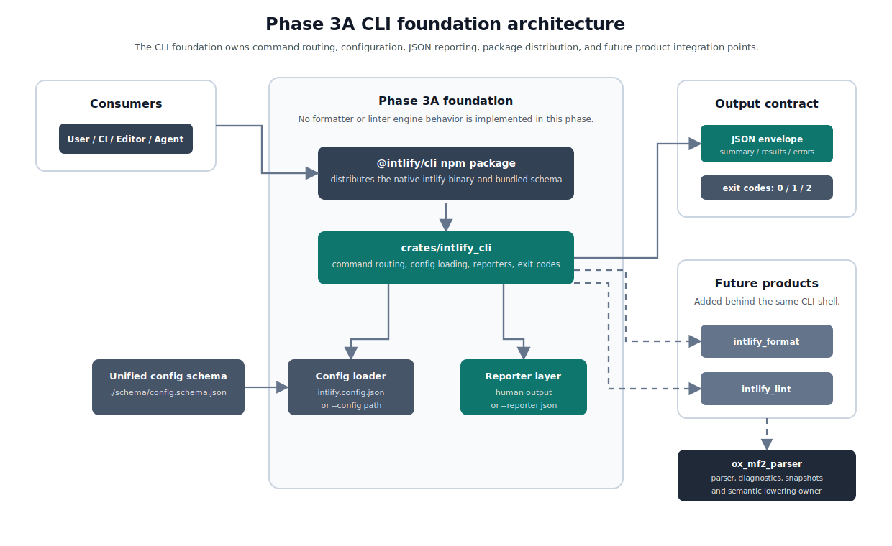

# ox-mf2 Phase 3A Tooling Foundation Design

## Purpose

This document tracks the detailed design for Phase 3A: Tooling Foundation.

The broader Phase 3 tooling and consumer boundary is defined in [005-ox-mf2-phase-3-tooling-transport-design.md](./005-ox-mf2-phase-3-tooling-transport-design.md). That document splits implementation into consumer-facing product phases. This document covers the first phase: the shared CLI, configuration, machine-readable output, and distribution foundation needed before formatter, linter, LSP/editor, agent, or long-lived transport products are implemented.

## Goals

- Establish the Phase 3A CLI crate and the `intlify` command structure.
- Define the shared CLI package and native binary distribution boundary.
- Define the unified project configuration model with `fmt` and `lint` sections.
- Publish a unified JSON Schema for editor completion and config validation.
- Define shared machine-readable output conventions for future `fmt --check`, `lint`, and combined `check` workflows.
- Keep formatter and linter resolved config models separate internally while exposing one project-level config file to users.
- Keep CLI output schemas separate from the project config schema.
- Provide enough package and API boundaries for Phase 3B formatter and Phase 3C linter work to proceed independently.
- Keep later LSP/editor, agent, and transport workflows as consumers of the foundation instead of direct Phase 3A deliverables.

## Non-Goals

- Implementing the formatter engine.
- Implementing the linter engine.
- Implementing formatter or linter N-API/WASM packages beyond defining their package boundaries.
- Implementing an LSP server, editor extension, or editor adapter.
- Implementing agent-specific plugins, skills, hooks, MCP servers, or ACP integrations.
- Implementing MessagePack transport or a long-lived daemon.
- Defining formatter layout rules, linter rule semantics, suppression directives, or resource/catalog mapping details.
- Supporting nested config discovery or nearest-config-wins behavior in the initial foundation.
- Supporting file-specific config overrides in the initial foundation.

## Deliverables

Phase 3A deliverables:

- `crates/intlify_cli` crate skeleton
- `intlify` CLI command structure
- native `intlify` CLI npm package boundary
- unified project config model
- generated unified project config JSON Schema
- shared machine-readable output envelope conventions
- package boundary notes for future formatter/linter CLI, N-API, and WASM packages
- validation fixtures for config parsing and CLI JSON output shape

The Rust CLI crate is defined as:

- crate directory: `crates/intlify_cli`
- Cargo package name: `intlify_cli`
- crates.io publishing: disabled with `publish = false`
- binary target name: `intlify`
- binary entry point: `src/main.rs`
- library target: `src/lib.rs`

The native binary copied into npm packages is `intlify` on Unix platforms and `intlify.exe` on Windows.

`intlify_cli` is a workspace-internal Rust package used to build the native CLI binary for npm distribution. It is not a public crates.io package and does not support `cargo install intlify_cli` in Phase 3A. Public CLI distribution is handled by `@intlify/cli` and the `@intlify/cli-native` native npm package source.

The binary entry point should stay thin. CLI core behavior, including command routing, config discovery, config loading, config validation, reporter selection, and output shaping, should live in library modules under `src/lib.rs`. This is required so Phase 3A can test config loader behavior directly without adding hidden public CLI commands.

## Ownership

The CLI crate owns command routing, config discovery, config loading, output formatting, exit-code behavior, and package-level CLI composition.

Formatter and linter crates own their resolved config models once Phase 3B and Phase 3C begin. Phase 3A owns only the project-level config envelope, schema generation boundary, and normalization path that lets the CLI pass `fmt` and `lint` sections to product-specific crates later.

Parser crates remain responsible for parsing, diagnostics, Binary AST snapshots, and semantic lowering. Phase 3A should not move parser behavior into the CLI crate.

## Architecture

Phase 3A introduces the CLI shell and distribution layer without moving parser behavior or implementing formatter/linter engines. The architecture separates the user-facing `intlify` binary from product-specific engines so later phases can add formatter and linter behavior behind the same command and reporting contracts.



The public `@intlify/cli` wrapper package owns the user-facing command, bundled config schema, native package resolution, and release-time installed-package smoke-test coverage. The `@intlify/cli-native` package source owns the compiled native `intlify` binary artifacts prepared by release automation. The Rust CLI crate owns runtime command routing, config loading, reporter selection, JSON envelope shaping, and exit-code mapping.

Formatter and linter crates remain product-specific extension points. Both future engines consume parser-owned parse artifacts instead of owning parsing themselves. Phase 3A only defines how their future config sections, results, and operational errors flow through the CLI foundation.

## CLI Surface

The initial CLI should reserve the user-facing command shape without requiring all product implementations to exist immediately:

```text
intlify fmt
intlify lint
intlify check
intlify init
```

Phase 3A reserves the `fmt`, `lint`, `check`, and `init` command names but keeps them out of normal `intlify --help` output until the required product behavior is ready. If any reserved command is invoked directly in Phase 3A, the CLI returns an operational error, exits with code `2`, and uses `kind: "unsupported"` with `code: "command_not_ready"` in JSON reporter output. `intlify check` requires both formatter and linter products, so its placeholder error uses `details.requiredPhase: "3B+3C"`. `intlify init` is reserved for future config scaffolding.

The CLI should provide consistent global behavior for help output, version output, config path handling, machine-readable output selection, and operational errors. Phase 3A global options are:

- `--help`
- `-h`
- `--version`
- `-V`
- `--config <path>`
- `--reporter <text|json>`

Phase 3A should implement argument parsing with a small hand-written parser rather than introducing a CLI framework dependency. The initial command surface is limited to global options, reserved commands, help/version behavior, and operational error shaping. A CLI framework can be reconsidered in a later product phase if formatter or linter command surfaces become large enough to justify it.

The default reporter is `text`. Machine-readable JSON output is selected with `--reporter json`. Phase 3A does not support `--cwd` or `--root`; project root discovery is fixed by the config discovery contract below.

Value-taking long options accept both separated and equals forms. `--reporter json` and `--reporter=json` are equivalent. `--config path` and `--config=path` are equivalent. Phase 3A does not define `-r` or `-c`; the only short options are `-h` and `-V`. Clustered short options such as `-hV` are not supported and are treated as invalid or unknown options rather than as multiple short flags. The `--` end-of-options marker is not special in Phase 3A and is treated as invalid or unknown input; file operand handling should be reconsidered in formatter and linter product phases.

`intlify --version` reports the public `@intlify/cli` package version as the version number only, for example `0.14.0-alpha.0` for the initial CLI prerelease. The JSON envelope `version` field uses the same value. The wrapper package, `@intlify/cli-native` native package source, Rust binary, and CLI crate should be released with matching versions; version mismatches should be caught by build, validation, or publish workflows instead of being surfaced as a normal runtime mode.

The first monorepo-managed `@intlify/cli` release line is `0.14.0`, but the first npm publish target is the prerelease `0.14.0-alpha.0`. The monorepo version policy remains unified: ox-mf2 npm packages, ox-mf2 crates, `@intlify/cli`, `@intlify/cli-native`, and the Rust CLI crate should all release with the same exact version for that release. Stable `0.14.0` follows after alpha validation. This keeps the existing standalone `@intlify/cli` npm version history, which has already reached `0.13.1`, compatible with the unified monorepo version policy.

Top-level help and version behavior:

- `intlify`, `intlify --help`, and `intlify -h` write top-level help to stdout and exit with `0`.
- `intlify --version` and `intlify -V` write only the public `@intlify/cli` version number to stdout and exit with `0`.
- Top-level help does not list reserved `fmt`, `lint`, `check`, or `init` commands as normal available commands in Phase 3A.
- `intlify fmt --help`, `intlify lint --help`, `intlify check --help`, and `intlify init --help` write reserved-command placeholder help to stdout and exit with `0`.
- Reserved-command placeholder help states that the command is reserved but not available in the current release.
- The `intlify init --help` placeholder also states that `init` is reserved for future config scaffolding.
- Help and version output are always human-readable stdout output. They are not wrapped in the JSON envelope even when `--reporter json` is present.

`intlify --reporter json` without a subcommand follows the same behavior as `intlify`: it writes human-readable top-level help to stdout and exits with `0`. The JSON reporter affects command result output and operational errors, but it does not JSON-encode help output for no-subcommand execution.

Global options can appear before or after the subcommand. For example, `intlify --reporter json fmt` and `intlify fmt --reporter json` are equivalent. Duplicate global options, including duplicate value-taking options such as `--config`, are operational input errors with `kind: "input"`, `code: "duplicate_cli_option"`, and exit code `2`.

Operational error precedence:

1. Help and version flags return help/version output and exit with `0`.
2. CLI argument shape errors are reported next, including unknown options, missing option values, duplicate options, and unsupported reporters.
3. Command routing errors are reported next, including unknown commands and reserved commands that return `command_not_ready`.
4. Config discovery, loading, and validation errors are reported only after the command is known to require config.

Because help and version flags have highest precedence, examples such as `intlify fmt --help --config missing.json` return help output and exit with `0` without loading config. Help and version also win over invalid argument shape; for example, `intlify --help --unknown` returns help output and exits with `0`, and `intlify --version --unknown` returns version output and exits with `0`. If help and version are both present, help wins.

For example, `intlify fmt --config missing.json --reporter json` returns `command_not_ready` in Phase 3A rather than `config_not_found`, because the reserved formatter command does not execute far enough to require config loading.

The same applies to discovered config conflicts. If both `intlify.config.json` and `intlify.config.jsonc` exist, `intlify fmt --reporter json` still reports `command_not_ready` in Phase 3A because the reserved formatter placeholder does not load config.

Phase 3A input and routing error codes:

- `invalid_cli_argument`: malformed CLI input not covered by a more specific code, with `kind: "input"`
- `unknown_cli_option`: unknown option, with `kind: "input"`
- `missing_cli_option_value`: missing value for a value-taking option, with `kind: "input"`
- `duplicate_cli_option`: duplicate global option, with `kind: "input"`
- `reporter_not_supported`: unsupported reporter value, with `kind: "reporter"`
- `unknown_command`: unknown subcommand, with `kind: "unsupported"`
- `command_not_ready`: reserved command without an implementation in the current phase, with `kind: "unsupported"`

Two Phase 3A codes are defined ahead of their emit sites. `invalid_cli_argument` currently has no Phase 3A emit path because every argv failure maps to a more specific code; it is reserved as the generic fallback and is used by the Phase 3B `intlify fmt` design for operand and option-combination validation and by the Phase 3C `intlify lint` design for invalid `--max-warnings` values. `config_schema_generation_failed` is reserved for build/validation workflows; schema generation runs through the `cli#schema` / `cli#schema:check` tasks and currently reports failures as ordinary process failures rather than through the CLI JSON envelope. Defining codes ahead of their emit sites keeps the output contract stable for integrations.

Phase 3A also reserves a shared binding/API operational code for later product packages:

- `invalid_input`: raw external binding or programmatic API input shape is invalid before typed command-specific input can be constructed, with `kind: "input"`. This is for values such as a non-string `source` argument or non-`Uint8Array` snapshot argument. Product-specific option/config validation remains separate and uses product-owned codes such as `invalid_options` or `config_validation_failed`.

Input and routing errors use small structured `details` payloads when the rejected token is available:

- `unknown_cli_option`: `details.option`
- `missing_cli_option_value`: `details.option`
- `duplicate_cli_option`: `details.option`
- `invalid_cli_argument`: `details.argument`, when a single rejected argument can be identified
- `unknown_command`: `details.command`

For `unknown_command`, the top-level envelope `command` remains `"intlify"` and the unknown subcommand is reported in `errors[].details.command`. For example, `intlify foo --reporter json` reports `details: { "command": "foo" }`.

Unknown positional input is treated as command routing input. For `intlify foo bar`, the first unknown positional token is the unknown command and `details.command` is `"foo"`. For `intlify file.mf2`, `details.command` is `"file.mf2"`. Reserved commands still route to their placeholder behavior before validating future command operands; for example, `intlify fmt file.mf2` reports `command_not_ready` in Phase 3A rather than an operand validation error.

## Configuration Contract

Project configuration is one config file with separate `fmt` and `lint` sections. Phase 3A supports JSON and JSONC config syntax through these root config file names:

- `intlify.config.json`
- `intlify.config.jsonc`

The initial config discovery model is root-only. Root means the git repository root found by walking up from `cwd`; when no git repository root exists, root falls back to `cwd`. Discovery checks for `<root>/intlify.config.json` and `<root>/intlify.config.jsonc`. If exactly one exists, that file is used. If both exist, the CLI reports a config conflict instead of silently choosing one. Nested config discovery, nearest-config-wins behavior, and file-specific overrides are deferred until a concrete multi-workspace or resource/catalog requirement appears.

Git root discovery uses filesystem walking rather than invoking the `git` executable. Starting from `cwd`, the CLI walks upward and treats the first directory containing a `.git` directory or `.git` file as the project root. This covers normal repositories, worktrees, and submodules without depending on an external Git command. If no `.git` marker is found, the project root is `cwd`.

The CLI supports an explicit `--config <path>` option in Phase 3A. This is an escape hatch for CI, fixtures, and integrations, not nested discovery. When `--config` is provided, the CLI loads that exact file instead of the root-discovered config. Relative `--config` paths are resolved from the process `cwd`; absolute paths are used as-is. `--config` replaces config discovery, so root config conflicts are ignored when an explicit config file is provided. It does not change `projectRoot`. Explicit config paths must use a supported `.json` or `.jsonc` extension.

Explicit config validation order is: path existence, file readability, supported extension, parse, then config-model validation. For example, a missing `foo.json5` reports `config_not_found`, while an existing `foo.json5` file reports `config_extension_unsupported`.

When root discovery does not find any supported config file, the CLI continues with the default project config without emitting a warning or error. The default normalized project config is:

```json
{
  "fmt": {},
  "lint": {}
}
```

When `--config <path>` is provided and that file does not exist, the CLI returns an operational config error with `code: "config_not_found"` and exits with code `2`.

The unified config JSON Schema is the schema that users and editors should reference. Formatter and linter config models can be defined independently under the unified root schema, but users should not need separate top-level schemas for one project config file.

The unified config JSON Schema is published with the public `@intlify/cli` wrapper package. The schema is exported at `./schema/config.schema.json` from that package and can internally separate formatter and linter configuration under draft-07 `definitions` such as `definitions.fmt` and `definitions.lint`. Formatter and linter detail schemas remain separately owned, but users reference one schema for `intlify.config.json` or `intlify.config.jsonc`. Native packages may contain internal implementation artifacts, but they do not define a public config schema path.

Config parsing should deserialize supported config syntax into the same Rust config model. JSON configs use `serde_json`; JSONC configs use a syntax-aware parser or comment/trailing-comma normalization before applying the same config-model validation. Phase 3A JSONC accepts line comments (`//`), block comments (`/* */`), and trailing commas. JSON5 config files are not supported in Phase 3A, and JSON5-only syntax such as single-quoted strings or unquoted object keys is invalid. Schema generation uses Rust config types as the source of truth and should use `schemars` to generate the unified JSON Schema from the project-level Rust config model, using standard schema annotations for editor-facing descriptions and examples where needed. The generated schema should follow JSON Schema draft-07 and should not include a `$id`; the npm package artifact path is the canonical public location. The schema artifact itself remains standard JSON and should not emit non-standard editor extensions such as `allowComments`, `allowTrailingCommas`, or `markdownDescription`. A dedicated schema generation crate is not required in Phase 3A.

The generated `packages/cli/schema/config.schema.json` file is committed to the repository because it is a public artifact. Schema generation tests or CI checks should verify that regenerating the schema from Rust config types produces the committed file. Any Rust config-model change that affects the public schema must update the committed schema in the same change.

The committed schema artifact should be pretty-printed JSON with a trailing newline for reviewability. Schema verification should compare regenerated output with the committed artifact exactly after normalizing CRLF to LF.

The root-level `$schema` field is allowed as metadata for editor completion and validation. It is accepted by validation but is not passed into the resolved config model.

The recommended `$schema` value for root config files is:

```json
{
  "$schema": "./node_modules/@intlify/cli/schema/config.schema.json",
  "fmt": {},
  "lint": {}
}
```

The same `$schema` value is recommended for `intlify.config.jsonc`:

```jsonc
{
  "$schema": "./node_modules/@intlify/cli/schema/config.schema.json",
  // Formatter options are added in Phase 3B.
  "fmt": {},
  // Linter options are added in Phase 3C.
  "lint": {}
}
```

The `$schema` field is optional. The CLI does not use the `$schema` value to locate its validation schema at runtime; it is editor-facing metadata only. JSONC editor schema support is expected in VS Code-compatible JSONC tooling.

Unknown root-level fields are validation errors, except for the root-level `$schema` metadata field. Unknown fields inside `fmt` and `lint` are also validation errors. This keeps typo detection strict; future configuration fields should be added through explicit schema and config-model updates.

In Phase 3A, `fmt` and `lint` must be objects and only empty objects are valid product configs. When a config file exists, both the `fmt` and `lint` sections are required. A config file that omits either section fails validation with `config_validation_failed`; the implicit default project config applies only when no root config file is discovered and no explicit `--config` path is given. Product-specific formatter and linter options are not accepted until Phase 3B and Phase 3C add explicit schema and config-model fields.

Phase 3A config error codes:

- `config_not_found`: explicit `--config <path>` does not exist
- `config_conflict`: multiple root config files exist, such as both `intlify.config.json` and `intlify.config.jsonc`
- `config_extension_unsupported`: explicit `--config <path>` uses an unsupported extension or no extension
- `config_read_failed`: config exists but cannot be read because of permissions or IO failures
- `config_parse_failed`: config cannot be parsed as its supported syntax
- `config_validation_failed`: config parses successfully but fails schema or config-model validation
- `config_schema_generation_failed`: config schema generation fails in a build or validation workflow

Config validation errors should include the config path in `errors[].path`. When a specific invalid location is available, `errors[].details.pointer` uses JSON Pointer syntax, such as `/fmt/unknown`, and `errors[].details.reason` uses a stable short reason such as `unknown_field`, `missing_field`, or `expected_object`.

Config parse errors should include the config path in `errors[].path`. When available from the parser, `errors[].details.line` and `errors[].details.column` should report the parse error location. For JSONC, line and column should refer to the original config file, not to normalized intermediate text. If the parser or normalizer cannot report an accurate original position, line and column may be omitted.

Config read errors should include the config path in `errors[].path`. When available, `errors[].details.ioKind` should contain the Rust `std::io::ErrorKind` value as a stable string and `errors[].details.rawOsError` may contain the raw OS error code.

If an explicit `--config` path resolves to a directory or another non-file entry, the CLI reports `config_read_failed`.

For `config_not_found`, `errors[].path` follows the shared machine-readable path rule: it is relative to `projectRoot` when representable, otherwise absolute and slash-normalized.

For `config_conflict`, `errors[].path` is omitted and `errors[].details.paths` lists the conflicting config paths using the shared machine-readable path rule.

For `config_extension_unsupported`, `errors[].path` follows the shared machine-readable path rule and `errors[].details.supportedExtensions` is `[".json", ".jsonc"]`.

Open product-specific config details remain in the formatter and linter design documents.

## Machine-Readable Output

Machine-readable CLI output should use JSON and should be stable enough for CI, editor adapters, and agent coding workflows to consume.

The config schema and output schemas are separate surfaces. `lint`, `fmt --check`, and future combined `check` output may use command-specific JSON result schemas while sharing common conventions where practical.

Phase 3A publishes only the config JSON Schema. The output envelope remains documented and fixture-tested, but no public output JSON Schema is published while `schemaVersion` is `"0"`. Publishing output schemas should be reconsidered in Phase 3B or Phase 3C after command-specific result shapes become clearer.

JSON reporter output should be serialized from typed Rust structs with `serde_json`, so field order follows the struct definition and remains deterministic. Phase 3A writes compact JSON as a single line followed by a trailing newline. Pretty-printed JSON output is not provided in Phase 3A.

The initial shared top-level JSON envelope uses `schemaVersion: "0"` while the output contract remains pre-stable. It contains:

- `schemaVersion`: output contract version
- `command`: command that produced the result, such as `fmt`, `lint`, `check`, or `init`
- `version`: CLI/package version
- `projectRoot`: discovered project root
- `summary`: command-level aggregate status and optional command-specific counts
- `results`: command-specific file, message, diagnostic, or formatting results
- `errors`: operational errors separated from parser, formatter, and linter diagnostics

Command-specific result schemas should preserve deterministic ordering and stable command/version metadata through this envelope.

The shared `summary.status` values are:

- `success`: successful execution, corresponding to exit code `0`
- `failure`: command executed successfully but reported a check, lint, or formatting failure, corresponding to exit code `1`
- `error`: operational error, corresponding to exit code `2`

In Phase 3A, only `summary.status` is required in the shared envelope. Command-specific count fields are not defined until formatter, linter, or combined check result schemas are defined in Phase 3B or Phase 3C.

The `projectRoot` field is the discovered project root: the git repository root when available, otherwise the process `cwd`. It is an absolute path and is slash-normalized in machine-readable output. File paths inside command results or operational errors are relative to `projectRoot` and also use `/` separators on every platform. The `results` and `errors` fields are always arrays, even when empty.

If a path cannot be represented relative to `projectRoot`, such as an explicit `--config` path outside the project root, machine-readable output may use an absolute slash-normalized path for that field. No extra boolean is added to distinguish relative and absolute paths; consumers can determine that from the path string.

The envelope `command` field is the resolved command name when a subcommand is known: `fmt`, `lint`, `check`, or `init`. If no subcommand is resolved, if an invalid top-level argument prevents command resolution, or if a wrapper-level native resolution error occurs before the Rust CLI starts, `command` is `"intlify"`. Unknown command tokens are reported in `errors[].details` while keeping `command: "intlify"`. The envelope does not use `null` or `"unknown"` for the command field.

Reserved command placeholder JSON output uses the same envelope. For example, `intlify fmt --reporter json` returns:

```json
{
  "schemaVersion": "0",
  "command": "fmt",
  "version": "0.14.0-alpha.0",
  "projectRoot": "/repo",
  "summary": {
    "status": "error"
  },
  "results": [],
  "errors": [
    {
      "kind": "unsupported",
      "code": "command_not_ready",
      "message": "The fmt command is reserved but not available in this release.",
      "details": {
        "phase": "3A",
        "requiredPhase": "3B"
      }
    }
  ]
}
```

For `lint`, `details.requiredPhase` is `"3C"`. For `check`, `details.requiredPhase` is `"3B+3C"` and `details.requires` is `["fmt", "lint"]`. For `init`, `details.requiredPhase` is `"3B+3C"` and `details.requires` is `["fmt", "lint"]` because config scaffolding should wait until formatter and linter config fields are stable enough to write.

Operational errors are represented only in the top-level `errors` array. They are CLI execution failures rather than parser, formatter, or linter diagnostics.

CLI operational error codes are stable string identifiers scoped to the CLI JSON output contract. They are intentionally separate from the numeric `OxMf2ErrorCode` API namespace defined in [appendix-ox-mf2-error-code.md](./appendix-ox-mf2-error-code.md). CLI operational failures may wrap lower-level API errors later, but the top-level CLI `errors[].code` field remains a string.

Each operational error contains:

- `kind`: broad error group, such as `config`, `input`, `io`, `reporter`, `unsupported`, or `internal`
- `code`: stable machine-readable error code
- `message`: human-readable message
- `path`: optional related file path
- `details`: optional structured data for integrations

If an unsupported reporter is requested, the CLI returns an operational reporter error with `kind: "reporter"`, `code: "reporter_not_supported"`, and exit code `2`. Its `details` object contains the requested `reporter` value and `supportedReporters: ["text", "json"]`.

If `--reporter` is provided without a value, the CLI reports `missing_cli_option_value` with `details.option: "--reporter"`. If `--reporter` has a value outside `text` or `json`, such as `xml`, the CLI reports `reporter_not_supported`.

If the Rust CLI can parse `--reporter json` before rejecting invalid command-line arguments, invalid arguments without a more specific Phase 3A code are reported as a JSON envelope with `kind: "input"`, `code: "invalid_cli_argument"`, and exit code `2`. Phase 3A currently maps all implemented argv failures to more specific codes, so this remains a reserved fallback until a later command needs it. If argument parsing fails before reporter selection can be determined, the CLI falls back to a human-readable stderr error and exits with code `2`.

Human-readable text output can optimize for users, but integrations should use `--reporter json` when they need to inspect diagnostics or formatting status. Phase 3A supports only `text` and `json` reporter names. The reporter name leaves room for future human-readable or integration-specific reporters without overloading formatter terminology.

The Phase 3A text reporter should stay minimal. Top-level help, reserved command help, and version output use dedicated human-readable text. Reserved command errors, config errors, native wrapper errors, and input errors should use concise stderr messages with the documented exit code. Tests should primarily lock stdout/stderr stream selection, exit code, and JSON reporter shape rather than over-constraining exact human-readable wording.

Output streams:

- For command results and operational errors with `--reporter json`, the JSON envelope is written to stdout and no human-readable log is emitted.
- With the human-readable reporter, normal results and summaries are written to stdout.
- Human-readable operational errors are written to stderr.
- After the Rust CLI starts, `--version` and `--help` write to stdout and exit with `0`.
- Invalid CLI arguments write to stderr and exit with code `2` unless `--reporter json` can be parsed before the argument error is reported.
- Wrapper-level native resolution failures happen before Rust CLI stream rules apply and may fall back to a minimal human-readable stderr message when the Rust CLI cannot be started and a JSON envelope cannot be produced.

Exit codes:

- `0`: success, including passing check-style commands
- `1`: check failure, such as lint diagnostics, format mismatch, or future combined `check` failure
- `2`: operational error, such as config errors, IO errors, invalid CLI arguments, or unsupported reporters

If check failures and operational errors both occur, the CLI exits with `2`.

## Package Boundaries

Phase 3A should define package boundaries without forcing all packages to exist immediately.

Expected package groups:

- CLI package: `@intlify/cli`, distributing the `intlify` command as a wrapper package.
- CLI native package source: `@intlify/cli-native`, the single package source used by release automation to build target-specific native `intlify` binary artifacts.
- Formatter packages: future formatter-specific N-API and WASM APIs.
- Linter packages: future linter-specific N-API and WASM APIs.

Initial package directories:

- `packages/cli`: `@intlify/cli`
- `packages/cli-native`: `@intlify/cli-native`

`@intlify/cli` should resolve `@intlify/cli-native` and execute the binary prepared for the current platform. This keeps the public npm entry point stable while avoiding checked-in per-architecture package skeletons under `packages/`. The native package assembly and publish model should follow the same single-source package direction as the existing `@intlify/ox-mf2-napi` publishing flow, while packaging CLI binaries under target-specific directories inside one `@intlify/cli-native` artifact.

Wrapper execution contract:

- Native binary file names are `intlify` on Unix platforms and `intlify.exe` on Windows.
- The native binary is stored at `bin/<rust-target>/intlify` or `bin/<rust-target>/intlify.exe` inside `@intlify/cli-native`.
- The wrapper passes `process.argv.slice(2)` through unchanged.
- The wrapper forwards stdin, stdout, stderr, and `process.env` to the native process.
- The wrapper exits with the native process exit code.
- The wrapper forwards process termination signals to the native process where the host platform allows it.
- The wrapper owns output only for wrapper-level native resolution failures.

Platform resolution table:

| Runtime platform | Runtime arch | Runtime libc | Rust target                 |
| ---------------- | ------------ | ------------ | --------------------------- |
| `darwin`         | `x64`        | n/a          | `x86_64-apple-darwin`       |
| `darwin`         | `arm64`      | n/a          | `aarch64-apple-darwin`      |
| `linux`          | `x64`        | `glibc`      | `x86_64-unknown-linux-gnu`  |
| `linux`          | `arm64`      | `glibc`      | `aarch64-unknown-linux-gnu` |
| `linux`          | `x64`        | `musl`       | `x86_64-unknown-linux-musl` |
| `win32`          | `x64`        | n/a          | `x86_64-pc-windows-msvc`    |

Unsupported platform, architecture, or libc combinations return `native_platform_unsupported`. Linux libc detection is performed by the wrapper. If libc detection fails, the wrapper reports `native_platform_unsupported` rather than guessing.

Initial CLI native package source:

- `@intlify/cli-native`

Future native target candidates:

- `aarch64-pc-windows-msvc`
- `aarch64-unknown-linux-musl`

Wrapper-level native resolution error codes:

- `native_platform_unsupported`: the current platform is not in the supported platform table
- `native_package_not_found`: the platform is supported but `@intlify/cli-native` cannot be resolved
- `native_binary_not_found`: `@intlify/cli-native` resolves but the expected binary path does not exist
- `native_binary_failed`: the native binary exists but cannot be spawned or executed

These are operational errors and use exit code `2`. The wrapper should parse only the minimum command-line surface needed to detect `--reporter json` for native resolution failures. When `--reporter json` is detected and the wrapper can construct the standard JSON envelope safely, it should write the native resolution error to stdout in `errors`. Otherwise, it should print a minimal human-readable stderr fallback.

The wrapper's minimal reporter parser detects only `--reporter json` and `--reporter=json`. If either JSON reporter form appears anywhere in argv, wrapper-level native resolution failures use the JSON envelope. The wrapper does not validate duplicate reporter options, missing reporter values, unknown options, or unsupported reporter values. For example, `--reporter xml` is not treated as a JSON reporter by the wrapper and uses the human-readable stderr fallback if the Rust CLI cannot be started. Once the Rust CLI starts, unsupported reporter values are reported by the Rust CLI as `reporter_not_supported`. If the Rust CLI cannot be started and no JSON reporter form is present, wrapper-level native resolution failures use the human-readable stderr fallback.

The wrapper does not implement help or version shortcuts. Help/version precedence is owned by the Rust CLI after the native binary has started. If native package resolution fails, even `intlify --help`, `intlify -h`, `intlify --version`, or `intlify -V` report the wrapper-level native resolution failure instead of top-level help or version output. This keeps CLI behavior centralized in Rust and prevents the public command surface from being split between Node and Rust implementations.

Once the native binary is spawned successfully, wrapper-level native resolution is complete. The wrapper forwards the Rust CLI process exit code unchanged, including operational error exits and unexpected non-zero exits. Those exits are not reported as `native_binary_failed`.

For wrapper-level native resolution failures, the wrapper does not perform git-root discovery. If it emits a JSON envelope, `projectRoot` is the absolute slash-normalized `process.cwd()` value and the native resolution error includes `details.projectRootSource: "cwd-fallback"`. Normal Rust CLI execution uses the standard git-root discovery contract.

If the wrapper emits a JSON envelope before the Rust CLI starts, the envelope `version` field uses the wrapper `@intlify/cli` package version read from its own package metadata. If the wrapper cannot safely determine that version or construct the envelope, it should use the minimal human-readable stderr fallback instead of emitting partial JSON.

`@intlify/cli` already exists as a standalone package and repository. Phase 3A treats this monorepo as the future source of truth for `@intlify/cli`; the standalone `intlify/cli` repository should be deprecated as part of the migration. Because the existing package has already reached `v0.13.1`, the first monorepo-managed `@intlify/cli` release line is `0.14.0`, with `0.14.0-alpha.0` as the first publish target.

`packages/cli/package.json` contract:

- `name`: `@intlify/cli`
- `version`: monorepo release version; `0.14.0-alpha.0` for the first monorepo-managed publish, with stable `0.14.0` as a follow-up after alpha validation
- `description`: public package summary for the `intlify` CLI
- `keywords`: include at least `intlify`, `messageformat`, `mf2`, and `cli`
- `homepage`: `https://github.com/intlify/intlify#readme`
- `bugs.url`: `https://github.com/intlify/intlify/issues`
- `license`: `MIT`
- `repository`: git repository metadata with `directory: "packages/cli"`
- `type`: `module`
- `bin`: `{ "intlify": "./bin/intlify.mjs" }`
- `exports`: expose only `./package.json` and `./schema/config.schema.json`
- `files`: `["bin", "schema", "README.md", "package.json"]`
- `dependencies`: `@intlify/cli-native`, using `workspace:*` in source so the monorepo-managed workspace version is applied and rewritten by the package manager to the resolved exact version in published package metadata
- `publishConfig`: `{ "access": "public" }`
- `engines.node`: `>=22.12.0`

`packages/cli/README.md` is the public CLI README. It should document the `intlify` command, the Phase 3A reserved-command status, config schema location, and installation expectations. Its primary config example should use `intlify.config.json`; JSONC can be shown as a secondary option.

`packages/cli-native/package.json` contract:

- `name`: `@intlify/cli-native`
- `version`: same exact version as `@intlify/cli`
- `description`: public package summary for the native `intlify` binary package source
- `keywords`: include at least `intlify`, `messageformat`, `mf2`, and `cli`
- `homepage`: `https://github.com/intlify/intlify#readme`
- `bugs.url`: `https://github.com/intlify/intlify/issues`
- `license`: `MIT`
- `repository`: git repository metadata with `directory: "packages/cli-native"`
- `files`: `["bin", "README.md", "package.json"]`
- no `engines` field is required
- no `bin` entry; the public command is exposed only by `@intlify/cli`
- no JavaScript import API is exposed
- `publishConfig`: `{ "access": "public", "executableFiles": [...] }`, listing every native binary path so packed Unix binaries remain executable even though the package intentionally has no `bin` entry. Release publishing should publish a pnpm-produced tarball for packages that use `executableFiles`, while keeping npm as the final publish command for Trusted Publishing.

The `@intlify/cli-native` README should stay minimal. It should state that the package is the native binary package source for `@intlify/cli`, that release automation prepares target-specific binaries under `bin/<rust-target>/`, and that users normally install or invoke `@intlify/cli` rather than this package directly.

Linux libc selection is represented by the wrapper platform table and release build target selection.

Native CLI Rust target matrix:

| Runtime platform | Runtime arch | Runtime libc | Rust target                 |
| ---------------- | ------------ | ------------ | --------------------------- |
| `darwin`         | `x64`        | n/a          | `x86_64-apple-darwin`       |
| `darwin`         | `arm64`      | n/a          | `aarch64-apple-darwin`      |
| `linux`          | `x64`        | `glibc`      | `x86_64-unknown-linux-gnu`  |
| `linux`          | `arm64`      | `glibc`      | `aarch64-unknown-linux-gnu` |
| `linux`          | `x64`        | `musl`       | `x86_64-unknown-linux-musl` |
| `win32`          | `x64`        | n/a          | `x86_64-pc-windows-msvc`    |

Wrapper-based execution remains responsible for reporting unsupported platform combinations as `native_platform_unsupported`.

Future native target mapping:

| Runtime platform | Runtime arch | Runtime libc | Rust target                  |
| ---------------- | ------------ | ------------ | ---------------------------- |
| `win32`          | `arm64`      | n/a          | `aarch64-pc-windows-msvc`    |
| `linux`          | `arm64`      | `musl`       | `aarch64-unknown-linux-musl` |

Build and package assembly pipeline:

- Build the Rust CLI with `cargo build --release -p intlify_cli --bin intlify`.
- Integrate CLI package publishing into the existing `.github/workflows/release.yml` release-tag workflow, alongside npm package publishing and crates.io publishing for public library crates such as `ox_mf2_parser`.
- Run cross-target binary builds in the GitHub Actions release matrix.
- Copy the built host binary into `packages/cli-native/bin/<rust-target>/intlify` or `packages/cli-native/bin/<rust-target>/intlify.exe`.
- Preserve or set executable permissions for Unix native package binaries with `chmod +x`.
- Ensure `packages/cli/bin/intlify.mjs` has a `#!/usr/bin/env node` shebang and executable permissions.
- Generate `config.schema.json` from Rust config types and write it to the committed `packages/cli/schema/config.schema.json` artifact.
- Expose host CLI build assembly as `vp run cli#build`, covering the Rust CLI release build, copying the host binary into `packages/cli-native/bin/<rust-target>` as `intlify` or `intlify.exe`, and applying Unix executable permissions where needed.
- Expose schema generation as `vp run cli#schema`.
- Expose schema verification as `vp run cli#schema:check`, comparing regenerated schema output with the committed schema artifact.
- Expose package validation as `vp run cli#pack:check`, depending on `cli#build` so the task is safe to run directly, and covering wrapper and `@intlify/cli-native` package contents, package metadata, included files, and executable permissions.
- Expose local CLI smoke validation as `vp run cli#smoke`, depending on `cli#build` so the task is safe to run directly, and covering `cli#build` artifacts with `intlify --version`, reserved-command placeholder behavior, schema presence, wrapper native resolution, and direct native binary execution for the host platform.
- Expose root scripts as wrappers around those Vite Task commands: `build:cli`, `schema:cli`, `schema:cli:check`, `check:cli-pack`, and `test:cli-smoke`.
- Validate version consistency across `packages/cli/package.json`, `packages/cli-native/package.json`, `crates/intlify_cli/Cargo.toml`, and the monorepo release version.
- Validate package contents with `npm pack --dry-run` or the equivalent release-pack step.
- Validate executable permissions for `packages/cli/bin/intlify.mjs` and Unix `@intlify/cli-native` binaries during pack or release validation.
- Validate that each published CLI package includes its expected `README.md`.
- Publish `@intlify/cli-native` before publishing the public `@intlify/cli` wrapper package, because the wrapper depends on it.
- Use npm trusted publishing for normal CLI package releases through `.github/workflows/release.yml`. The public `@intlify/cli` package already exists on npm, so it should publish through trusted publishing once its trusted publisher settings are configured. The new `@intlify/cli-native` package may require a token-based bootstrap release before npm trusted publisher settings can exist. That bootstrap must be limited to a dedicated `@intlify/cli-native` publish step using the `npm-release` environment's `NPM_TOKEN_BOOTSTRAP` secret. The normal publish step should not configure an npm token, so existing packages such as `@intlify/cli` keep using trusted publishing.
- Publish the initial `0.14.0-alpha.0` CLI prerelease with a prerelease npm dist-tag such as `alpha`; do not publish it under `latest`. Stable `0.14.0` may use the normal release tag after alpha validation.
- Run release-time installed-package smoke tests for `intlify --version`, reserved command placeholder behavior, native package resolution through the `@intlify/cli` wrapper, direct execution of the `@intlify/cli-native` binary with `--version`, and schema file presence. Wrapper install smoke should install `@intlify/cli@<version>` from the published registry and verify that the compatible `@intlify/cli-native` package is resolved. Native direct smoke should install `@intlify/cli-native@<version>` on a compatible host runner and execute that package's `intlify` or `intlify.exe` binary directly. Do not use npm lifecycle `postinstall` for smoke testing in user environments.

The release workflow should order publish, smoke, and release-note steps as:

1. Validate the release tag and version consistency.
2. Build ox-mf2 npm packages, ox-mf2 native packages, and CLI native binaries.
3. Publish crates.io artifacts for public library crates such as `ox_mf2_parser`; `intlify_cli` remains `publish = false`.
4. Publish the CLI native package artifacts.
5. Publish the public `@intlify/cli` wrapper package.
6. Run published artifact smoke tests for ox-mf2 npm packages, crates.io public library artifacts, and CLI wrapper/native packages.
7. Create GitHub Release notes only after all publish and smoke steps pass.

Normal CI should validate the CLI foundation before publishing by running schema verification, Rust tests, `check:cli-pack`, and local `test:cli-smoke`. The `check:cli-pack` and `test:cli-smoke` root scripts are standalone entry points because their underlying tasks depend on `cli#build`; CI may still split `build:cli` into an earlier visible step for log clarity, but correctness must not depend on callers remembering that order. Local smoke tests directly execute the host platform native binary. Release workflow validation owns cross-target native builds, package publishing, and smoke tests against installed published packages. Target build jobs should directly execute the built target binary when the runner can execute that target; targets that cannot be executed on the runner are covered by package content checks, executable permission checks where applicable, and installed-package smoke tests on supported host runners.

Parser binding packages remain focused on parsing, snapshots, and parser-level APIs. Formatter and linter APIs should not be folded into parser packages.

## CLI Startup Benchmarks

Phase 3A should provide a standalone benchmark entry point for measuring CLI startup overhead. This benchmark is a foundation baseline for the broader Phase 3 benchmark plan in [005-ox-mf2-phase-3-tooling-transport-design.md](./005-ox-mf2-phase-3-tooling-transport-design.md), not a formatter, linter, parser, or transport benchmark.

The purpose is to quantify the cost added by the npm wrapper before later `fmt`, `lint`, `check`, editor, or agent benchmarks start measuring product work. The benchmark must separate:

- direct native binary startup
- npm wrapper startup from the source tree
- installed package startup through `node_modules/.bin/intlify`

Initial Phase 3A startup benchmark phases:

- `cli_startup_native`
- `cli_startup_wrapper`
- `cli_startup_installed`

The primary benchmark command is `--version`. It is intentionally chosen because it exercises wrapper resolution, process startup, native binary startup, argument parsing, and version output without loading config or running formatter/linter behavior. This keeps the baseline focused on startup overhead.

Benchmark commands:

- `cli_startup_native`: execute the host native package binary copied by `cli#build`, such as `packages/cli-native/bin/aarch64-apple-darwin/intlify --version`, or `packages/cli-native/bin/x86_64-pc-windows-msvc/intlify.exe --version` on Windows.
- `cli_startup_wrapper`: execute `node packages/cli/bin/intlify.mjs --version` after `cli#build`, using the source-tree wrapper and host native package.
- `cli_startup_installed`: create a temporary install fixture, install the locally packed or published `@intlify/cli` package plus the compatible `@intlify/cli-native` package, and execute `node_modules/.bin/intlify --version`.

The startup benchmark entry point should be exposed separately from validation tasks, for example as `vp run cli#bench:startup` and a root script such as `bench:cli-startup`. It may depend on `cli#build` and package assembly, but it must not be part of `vpr check`, `vpr test`, normal CI success gates, or release publish gates.

Benchmark reporting should include:

- benchmark phase name
- command line
- package version
- git commit
- operating system, architecture, and libc where applicable
- Node.js and npm versions for wrapper and installed-package phases
- native binary path
- sample count and timing summary
- derived wrapper overhead compared with direct native startup
- derived installed-package overhead compared with direct native startup

Timing results are environment-sensitive, so Phase 3A should not define pass/fail thresholds. Failures to execute the benchmark command itself are implementation errors for the benchmark entry point, but slow timings are observations rather than blocking failures. Benchmark results should be used to compare startup overhead over time and to subtract wrapper/native launch cost from later formatter, linter, and transport end-to-end measurements.

## Validation

Phase 3A validation should focus on foundation behavior:

- config discovery and parsing through crate-level unit/integration tests
- JSONC config discovery through crate-level unit/integration tests
- JSON/JSONC root config conflict handling through crate-level unit/integration tests
- JSONC comment and trailing-comma parsing through crate-level unit/integration tests
- JSON5-only syntax rejection in JSONC config through crate-level unit/integration tests
- default config behavior when no root config exists through crate-level unit/integration tests
- explicit `--config` missing-file errors through crate-level unit/integration tests
- config error code fixtures through crate-level unit/integration tests
- unknown-field validation through crate-level unit/integration tests
- config schema generation through crate-level unit/integration tests
- config validation fixtures through crate-level unit/integration tests
- CLI help/version behavior
- reserved command placeholder behavior
- release-time installed-package smoke tests for CLI wrapper/native resolution
- native package resolution error handling
- output envelope fixtures
- slash-normalized `projectRoot` and result paths
- stdout/stderr behavior
- deterministic JSON ordering
- operational error shape
- standalone CLI startup benchmark entry point

Formatter and linter semantic correctness tests belong to later product phases.

Phase 3A does not add hidden internal CLI commands just to exercise config loading. Reserved `fmt`, `lint`, `check`, and `init` commands stop at `command_not_ready`, so config loader behavior is verified directly at the crate level rather than through public CLI execution.

## Deferred Follow-Up Notes

The following items are intentionally not delivered in Phase 3A, but should remain visible for later implementation phases:

- Formatter and linter engines remain follow-up products. Phase 3A only reserves `intlify fmt`, `intlify lint`, `intlify check`, and `intlify init` and returns placeholder operational errors for those commands.
- User-visible `intlify init` config scaffolding is deferred until Phase 3B formatter and Phase 3C linter config fields are stable enough to write. Its future default output should be `intlify.config.json`; JSONC remains supported for users who want comments, but the scaffolded default should be strict JSON.
- User-visible `intlify check` behavior is deferred until both Phase 3B formatter and Phase 3C linter products exist.
- Formatter-specific option names, defaults, layout rules, ignore directive behavior, and formatter result schemas belong to [007-ox-mf2-phase-3b-formatter-design.md](./007-ox-mf2-phase-3b-formatter-design.md).
- Linter-specific rule semantics, presets, include/exclude behavior, ignore behavior, severity policy details, and diagnostic result schemas belong to [008-ox-mf2-phase-3c-linter-design.md](./008-ox-mf2-phase-3c-linter-design.md).
- Command-specific JSON result schemas for `fmt --check`, `lint`, and combined `check` are deferred to the product phases. Phase 3A owns only the shared envelope and operational error shape.
- Formatter and linter N-API/WASM packages are deferred to their product phases. Phase 3A only records package boundaries and keeps parser binding packages focused on parser-level APIs.
- Resource/catalog parsing, host-file escaping, outer document edits, and resource-level linting or formatting remain layered workflows outside the Phase 3A CLI foundation.
- LSP/editor adapters, agent integrations, and MessagePack or daemon transport remain later consumers of this foundation.
- Nested config discovery, nearest-config-wins behavior, file-specific config overrides, `--cwd`, and `--root` remain out of scope until a concrete multi-workspace or adapter requirement appears.
- Additional native targets such as `aarch64-pc-windows-msvc` and `aarch64-unknown-linux-musl` are future candidates, not initial Phase 3A requirements.

## Open Questions

No unresolved Phase 3A foundation questions remain in this document. Product-specific formatter, linter, LSP/editor, and agent questions are tracked in their dedicated design documents.
