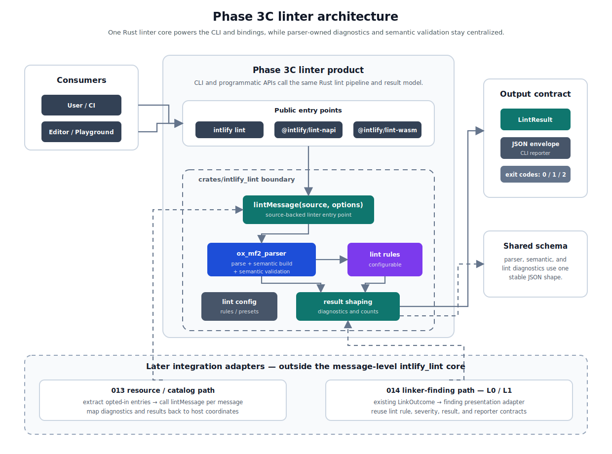
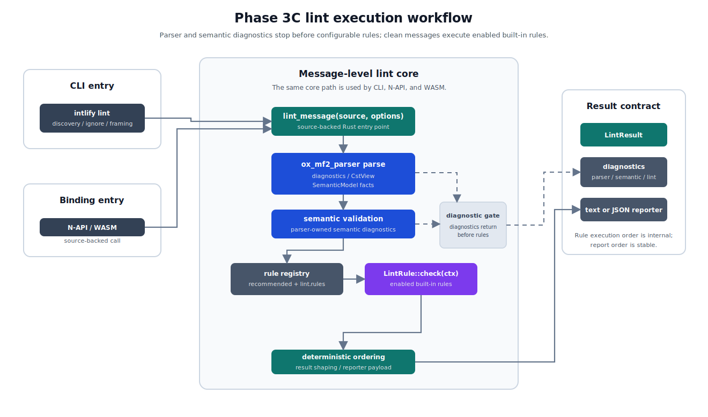

# ox-mf2 Phase 3C Linter Design

This document captures the detailed design for the ox-mf2 linter. The Phase 3 tooling and transport design fixes the high-level consumer contract; this file tracks the rule-level behavior, examples, and implementation decisions.

## Goals

- Provide a message-level linter core for MF2 messages.
- Provide a dedicated lint CLI backed by the same core.
- Include parser and semantic diagnostics in `lintMessage(source)` results.
- Keep initial configurable lint rules implemented in the Rust linter crate.
- Expose stable linter results through Rust, N-API, and WASM bindings for playgrounds, editor integrations, and Node-based tools.
- Share the file discovery, ignore, file framing, exit code, and JSON envelope contracts with `intlify fmt`.
- Leave resource/catalog linting as a layer above message-level linting.

## Deliverables

Phase 3C linter deliverables:

- Rust linter engine
- CLI
- N-API linter package
- WASM linter package
- shared diagnostic result schema

LSP/editor integration and playground usage are consumers of these deliverables, not separate direct products in this phase.

## Ownership

The Rust linter engine lives in a workspace-internal crate named `crates/intlify_lint` and depends on `ox_mf2_parser`. Like `intlify_format`, this crate is not published to crates.io in Phase 3C (`publish = false`); public linter distribution happens through the `intlify lint` CLI and the linter N-API/WASM packages. The parser crate owns CST construction, parser diagnostics, Binary AST snapshots, `SemanticModel` construction, and the semantic validation layer that emits the core semantic diagnostics. The lint crate owns rule execution, presets, lint configuration, and lint result shaping; it consumes semantic diagnostics from the parser crate and does not reimplement them.

The user-facing CLI binary lives in `crates/intlify_cli`. It composes the parser, formatter, and linter crates into commands such as `intlify lint`. npm distribution follows the Phase 3A CLI package boundary: `@intlify/cli` is the JavaScript wrapper package, while `@intlify/cli-native` owns the compiled native CLI binary artifacts.

N-API and WASM linter bindings are distributed as linter-specific packages backed by `crates/intlify_lint`:

- `@intlify/lint-napi`
- `@intlify/lint-wasm`

These names are symmetric with `@intlify/format-napi` and `@intlify/format-wasm`. `@intlify/lint-napi` follows the same wrapper-plus-platform-native-package model and lazy native loading as the formatter N-API package. Platform native package names use the same normalized triple package model used by formatter N-API packages: `@intlify/lint-napi-<platform-triple>`, for example `@intlify/lint-napi-linux-x64-gnu`, `@intlify/lint-napi-linux-x64-musl`, `@intlify/lint-napi-linux-arm64-gnu`, `@intlify/lint-napi-darwin-x64`, `@intlify/lint-napi-darwin-arm64`, and `@intlify/lint-napi-win32-x64-msvc`. These examples describe naming only and do not promise support for an exhaustive target set. The initial linter support matrix must be fixed by its implementation/release plan and backed by CI build, loading, packaging, and publish smoke tests for every listed target. Optional dependency wiring, package files, and lazy native loading follow the formatter N-API package model. `@intlify/lint-wasm` follows the same explicit `init()` contract as `@intlify/ox-mf2-wasm` and `@intlify/format-wasm`. Existing parser binding packages remain focused on parsing, snapshots, and parser-level APIs, and linter binding packages do not have runtime dependencies on parser or formatter binding packages.

Binding packages expose direct programmatic lint APIs. They do not host plugins and do not need a CLI callback bridge.

This design fixes the linter package boundary and public entry points, not the npm release procedure. Trusted publishing setup, dist-tag policy, native package publish order, smoke tests for published artifacts, and bootstrap-token handling belong to the Phase 3C implementation or release plan.

## Architecture

Phase 3C introduces the linter product behind the Phase 3A CLI shell while keeping parser and semantic validation ownership in `ox_mf2_parser`. The architecture has one Rust linter core that powers `intlify lint`, N-API, and WASM entry points.



`crates/intlify_lint` owns rule execution, presets, lint configuration, and linter result shaping. Parser diagnostics and core semantic diagnostics remain parser-owned, so CLI, binding, editor, and future resource/catalog consumers see one consistent diagnostic model without duplicating parser or semantic behavior.

At the npm package level, `@intlify/cli` owns the `intlify lint` command and links `crates/intlify_lint` through the native CLI binary distributed by `@intlify/cli-native`. Programmatic linter APIs are distributed separately:

- `@intlify/lint-napi`
- `@intlify/lint-wasm`

`@intlify/lint-napi` is a wrapper package with platform-specific native packages named by the same normalized triple package model used by formatter N-API packages: `@intlify/lint-napi-<platform-triple>`. The wrapper uses lazy native loading: importing `@intlify/lint-napi` must not eagerly load a native binary, and API calls load the binding as needed.

`@intlify/lint-wasm` is browser-first for playground, worker, and browser tooling use cases. Node users should prefer `@intlify/lint-napi`. After `await init()`, the WASM package exposes the synchronous `lintMessage(source, options?)` API. The initialization contract follows `@intlify/ox-mf2-wasm` and `@intlify/format-wasm`; this design does not redefine the shared WASM init state machine.

Existing parser binding packages remain focused on parser-level APIs. Linter APIs are not added to `@intlify/ox-mf2-napi` or `@intlify/ox-mf2-wasm`, and linter binding packages do not have runtime dependencies on parser binding packages.

The linter binding packages call the same source-backed `lintMessage(source, options)` flow as the CLI. Resource/catalog adapters remain outside the linter core: they extract message-level source text, call the linter product, and map diagnostics back to host-file ranges.

## Non-Goals

- JavaScript custom rules.
- A linter plugin system.
- Style or formatting fixes in lint rules.
- Recovery-aware rule execution on incomplete parser or semantic output.
- Resource/catalog rule implementation details.
- Suppression directives or MF2 syntax extensions in the first linter design.
- LSP/editor as a direct product.
- Nested config discovery.
- File-specific config overrides.
- Output formats beyond `text` and `json` in the first CLI contract.
- `lint --fix`, rule listing/introspection commands, and resolved-config printing in the first CLI version.
- Per-rule CLI severity flags such as oxlint-style `-A` / `-W` / `-D`; CLI rule severity is controlled through `lint.rules` config, while programmatic callers use `LintOptions.rules`.

Some non-goals are still tracked in [Deferred Follow-Up Notes](#deferred-follow-up-notes) when they are plausible future linter product work; they are excluded only from the Phase 3C initial contract.

## Pipeline

The initial linter pipeline is strict:

```text
parser -> semantic -> rules
```

Parser diagnostics are always included in lint results. If any parser diagnostic is produced, `SemanticModel` construction, semantic validation, and configurable lint rules do not run.

Core semantic diagnostics, when produced by parser-owned semantic validation, are included after successful parsing. If semantic validation produces any semantic diagnostic, configurable lint rules do not run.

Parser-owned semantic validation is the `ox_mf2_parser` validation layer over a constructed `SemanticModel`. The core semantic diagnostic codes and their catalog live in the parser crate, so a future compiler, validator, or LSP shares one implementation with the linter. [012-ox-mf2-parser-semantic-validation-design.md](./012-ox-mf2-parser-semantic-validation-design.md) is the canonical parser-owned contract for semantic validation. `SemanticModel` construction happens only after parser diagnostics are empty. If construction or validation hits an invariant failure, the host boundary reports an `internal_error` operational error. The current `SemanticModel` construction collects records without emitting validation diagnostics, so the parser-side semantic validation layer is a Phase 3C prerequisite PR.

Configurable rules only run when parsing and parser-owned semantic validation complete without diagnostics.

The zero-diagnostic guarantee in [002-ox-mf2-phase-1-rust-parser-design.md](./002-ox-mf2-phase-1-rust-parser-design.md) applies: a parse result with zero parser diagnostics is syntactically valid per the MF2 ABNF, so `SemanticModel` construction, semantic validation, and rules never see grammar-invalid CST shapes.

### Lint Execution Workflow

The CLI and binding entry points share the same message-level lint workflow. `intlify lint` adds file discovery, ignore handling, and file framing before entering the core linter; bindings call the same source-backed core directly.



The message-level workflow is:

1. Parse source text and construct parser diagnostics plus a `CstView`.
2. If parser diagnostics exist, return parser diagnostics and skip `SemanticModel` construction, semantic validation, and configurable rules.
3. Construct `SemanticModel` from the diagnostic-free parse result.
4. If `SemanticModel` construction hits an invariant failure, return an `internal_error` operational error.
5. Run parser-owned semantic validation over `SemanticModel`.
6. If semantic validation hits an invariant failure, return an `internal_error` operational error.
7. If semantic diagnostics exist, return semantic diagnostics and skip configurable rules.
8. Resolve the lint rule registry against `recommended` defaults and `lint.rules` overrides.
9. Construct one `RuleContext` per lint target, carrying source text, read-only `CstView`, `SemanticModel`, resolved config, and a `RuleReport` sink.
10. Execute each enabled built-in rule by calling `LintRule::check(ctx) -> Result<(), LintRuleInvariantError>` in registry declaration order.
11. If a rule returns `Err(LintRuleInvariantError)`, discard any partial rule diagnostics for that lint target and return a target-level `internal_error` operational error with `details.reason: "lint_rule_invariant_failed"` and `details.ruleId`.
12. Normalize emitted rule diagnostics into deterministic report order: primary span start, primary span end, JSON-visible rule id in ASCII ascending order, and the stable occurrence key carried by the `RuleReport` for exact ties.
13. Shape the result for the Rust API, bindings, or CLI reporter.

For a single lint target, parser diagnostics, semantic diagnostics, and configurable rule diagnostics are stage-exclusive. Parser diagnostics short-circuit semantic validation and configurable rules. Semantic diagnostics short-circuit configurable rules. Configurable rule diagnostics are produced only when parser and semantic diagnostics are empty.

Rule execution order is deterministic and follows registry declaration order for reproducible debugging and benchmarking, but it is not a compatibility surface. Report order is the compatibility surface. Exact report-order ties use occurrence keys derived from the parser-owned `SemanticModel` fact order defined by the semantic validation design, or syntax-local occurrence order for CST-only reports.

## Diagnostic Classification

Diagnostic candidates are classified into three groups. This classification is fixed by this document:

- **core semantic diagnostic**: always enabled after successful parsing, independent from rule configuration, and reported as `error`. These correspond to MF2 Data Model Errors: messages that carry them are not valid MF2 and will fail or misbehave at runtime, so they must not be configurable.
- **configurable lint rule**: runs only after parser and semantic diagnostics are clean, and is controlled by `off`, `warn`, or `error`.
- **deferred**: requires more MF2 selection semantics, resource/catalog context, or editor-specific behavior before implementation.

Classification result:

| Candidate | Classification | Notes |
| --- | --- | --- |
| `duplicate-declaration` | core semantic | MF2 Duplicate Declaration data model error |
| `invalid-declaration-dependency` | core semantic | declaration self-reference and forward-binding cases of the Duplicate Declaration family, including input declaration function option value references and local declaration expressions |
| `missing-selector-annotation` | core semantic | MF2 Missing Selector Annotation data model error |
| `variant-key-arity-mismatch` | core semantic | MF2 Variant Key Mismatch data model error |
| `missing-fallback-variant` | core semantic | MF2 Missing Fallback Variant data model error |
| `duplicate-variant` | core semantic | MF2 Duplicate Variant data model error |
| `duplicate-option-name` | core semantic | MF2 Duplicate Option Name data model error |
| `no-undeclared-variable` | configurable rule, default `off` | undeclared variables are valid external inputs in MF2, so this is a strict-workflow opt-in, not an error; selector variables are handled by `missing-selector-annotation` |
| `no-unused-declaration` | configurable rule, default `warn` | declaration is not reachable from message output or selector setup |
| `no-duplicate-attribute` | configurable rule, default `warn` | the MF2 spec says attribute identifiers SHOULD be unique; duplicates are ignored with last-one-wins semantics |
| `unreachable-variant` | deferred | needs sound selection-semantics and selector-domain modeling |

Semantic invariant failures are intentionally absent from the diagnostic classification table. They are not parser, semantic, or lint diagnostics and never appear as a diagnostic `code`. Under the zero-diagnostic guarantee, `SemanticModel` construction and semantic validation must succeed for any parse result with zero parser diagnostics. Semantic validation may return user-facing semantic diagnostics, but it must not fail internally. An invariant failure in any of those steps indicates an implementation bug and is reported as an `internal_error` operational error, mirroring the formatter's invariant-violation boundary. The operational error uses `code: "internal_error"` with `details.reason: "semantic_invariant_failed"` and `details.stage`, where `stage` is `"semantic_model_construction"` or `"semantic_validation"`. Configurable rules do not run after such failures.

## Diagnostic Shape

Every diagnostic carries a category, a stable code, a severity, a UTF-8 byte span, and a message. The JSON representation is shared by the fmt and lint CLI JSON reporters and by the linter N-API/WASM binding result objects:

```json
{
  "category": "semantic",
  "code": "duplicate-declaration",
  "severity": "error",
  "span": { "start": 32, "end": 38 },
  "location": { "line": 2, "column": 8 },
  "message": "variable $count is already declared",
  "labels": [{ "span": { "start": 8, "end": 14 }, "message": "first declared here" }]
}
```

Formatter N-API/WASM programmatic results are outside this linter binding-shape statement. They retain the parser `DiagnosticView` JavaScript shape specified by the formatter design; only formatter CLI JSON reporting uses the shared reporter representation below.

- `category` is `"parser"`, `"semantic"`, or `"lint"`.
- `code` is a single field across all categories. Parser diagnostics, semantic diagnostics, and lint rule diagnostics all use JSON-visible kebab-case stable strings. Rust enum names such as `MissingRequiredWhitespace` are internal; lint JSON emits `"missing-required-whitespace"`. There is no separate `ruleId` field.
- JSON-visible diagnostic codes share one global namespace across parser, semantic, and lint categories. Category is classification metadata, not a namespace escape hatch. Parser diagnostic codes, semantic diagnostic codes, and configurable lint rule ids must not collide. The parser crate exposes parser and semantic diagnostic code catalogs, and `intlify_lint` owns a collision test that combines those catalogs with the lint rule registry.
- `span` uses UTF-8 byte offsets with half-open ranges.
- `location` uses the parser `SourceLocation` semantics: one-based `line` and zero-based UTF-8 byte `column`. It is `null` when source text is unavailable.
- `labels` is an array of `{ span, message }` entries and may be empty.
- `severity` is `"warn"` or `"error"`. Parser and semantic diagnostics are always `"error"`. Configurable lint rule diagnostics use the resolved rule severity. The JSON value `"warning"` is not emitted.
- `message` text and `labels` messages are not stable compatibility surfaces.
- A `help` field is reserved for future static per-code help text; the initial release does not populate it. Adding help content is a follow-up after a public generated documentation or static help contract is defined for codes and rules.

The UTF-8 span contract is canonical across CLI JSON, Rust, N-API, and WASM outputs. Bindings do not add binding-specific UTF-16 range fields to diagnostic objects. JavaScript, editor, and LSP consumers convert UTF-8 spans to UTF-16 or another editor encoding through source-text helper APIs or adapter layers. Future LSP/editor adapters own `PositionEncodingKind` conversion and must not change the linter diagnostic shape.

### Semantic Diagnostic Representation

Semantic diagnostics get their own representation in `ox_mf2_parser`: a `SemanticDiagnosticCode` Rust enum whose public stable names are the kebab-case codes, and a `SemanticDiagnostic` value carrying code, severity, span, and labels. The canonical semantic diagnostic contract is defined in [012-ox-mf2-parser-semantic-validation-design.md](./012-ox-mf2-parser-semantic-validation-design.md). This section only states the linter-visible API shape.

The parser crate exposes semantic validation as an explicit API:

```rust
fn validate_semantics(
    model: &SemanticModel,
) -> Result<Vec<SemanticDiagnostic>, SemanticInvariantError>
```

`SemanticModel` owns semantic facts. `validate_semantics` owns diagnostic production and returns diagnostics in deterministic report order through the `Ok` branch. If validation hits an invariant failure, it returns `Err(SemanticInvariantError)`, and downstream host boundaries convert that to an `internal_error` operational error with `details.reason: "semantic_invariant_failed"` and `details.stage: "semantic_validation"`. Linter, future validator, and LSP/editor consumers call this API after constructing a semantic model. Semantic diagnostics are also not encoded into Binary AST snapshot diagnostics sections, consistent with the standing policy that semantic information stays outside the lossless snapshot; snapshot-carried diagnostics remain parser diagnostics only.

## Failure Model

Lint diagnostics and operational errors are separate.

Lint diagnostics:

- parser diagnostics
- core semantic diagnostics
- configurable lint rule diagnostics

Operational errors:

- config errors (parse, validation, conflict)
- file system and encoding errors
- invalid CLI arguments
- invalid binding inputs
- invalid binding options
- internal failures, including semantic invariant failures after a clean parse
- internal parser API misuse, including accidental `SemanticModel` construction attempts after parser diagnostics
- internal failures from built-in lint rule invariant errors

Operational errors use the Phase 3A operational error shape `{ kind, code, message, path?, details? }` and the shared string code namespace. The CLI exit code classification follows Phase 3A: `0` success, `1` lint failure (any `error` diagnostic, or warnings over `--max-warnings`), `2` operational error, with `2 > 1 > 0` priority for mixed outcomes. JSON output uses the Phase 3A top-level envelope, including its top-level `errors` array for global operational errors and `results[].errors` for file-specific operational errors.

Semantic invariant failures use `internal_error` with `details.reason: "semantic_invariant_failed"` and a `details.stage` of `"semantic_model_construction"` or `"semantic_validation"`. Semantic API misuse uses `internal_error` with `details.reason: "semantic_api_misuse"` when a host boundary accidentally asks the parser semantic layer to build a `SemanticModel` from a parse result that still has parser diagnostics. Built-in rule invariant failures use `internal_error` with `details.reason: "lint_rule_invariant_failed"` and `details.ruleId`. Semantic invariant failures, semantic API misuse, and rule invariant failures are target-level operational errors during message-level linting: they report an incomplete lint target, while other targets in the same CLI run may still finish normally. Rule invariant failures also discard any diagnostics already emitted by earlier rules for that target because the target's lint result is incomplete. The `details.reason`, `details.stage`, and `details.ruleId` fields are stable debugging aids for implementation failures; the human-readable operational error `message` is not stable. These errors are not user-facing diagnostics and are not configurable through `lint.rules`.

## Stable Identifiers

Semantic diagnostic codes and configurable lint rule ids are public stable identifiers. Config files, future suppression mechanisms, JSON output, editor integrations, and external tools may depend on them.

Naming rules:

- Semantic diagnostic codes are noun-phrase kebab-case: `duplicate-declaration`, `missing-fallback-variant`.
- Configurable rule ids are kebab-case and use a `no-` prefix when the rule forbids something: `no-undeclared-variable`, `no-unused-declaration`, `no-duplicate-attribute`.
- There is no namespace prefix. Plugins are a non-goal, and future resource/catalog rules can add a category-style prefix later if needed.
- There is no alias or deprecation mechanism before 1.0. Renaming an identifier is a breaking change and requires a normal breaking-change release process.

Diagnostic message text is not a stable compatibility surface and may change for clarity.

## Rule Metadata

The lint crate owns rule metadata for generated artifacts and internal runtime behavior.

Metadata includes at least:

- rule id
- category
- default severity
- recommended preset membership
- whether the rule severity is configurable through `lint.rules`
- fix capability (always `false` in the initial rules)
- docs slug, generated from the rule id
- rule option schema when a rule accepts options

No initial rule accepts options, so rule option schemas are an empty surface in Phase 3C. The exact Rust metadata struct is an implementation detail. Rule metadata is used to generate the unified config schema and can feed future documentation generation, but Phase 3C does not expose a runtime metadata API through CLI, N-API, or WASM. The generated docs slug is internal generated metadata for a future generated documentation or help pipeline, not the current `design/linter-rules/*.md` path and not a runtime or JSON compatibility surface. Exposing docs URLs or populating diagnostic `help` requires a separate public contract. The design-time pages under `design/linter-rules/` are not the generated-docs source of truth unless a later documentation pipeline explicitly adopts them. They are also not the source for runtime `help` text or public documentation URLs. Having a design-time rule page does not make the JSON `help` field, CLI output URL, npm docs page, or website docs URL available. Rule listing and introspection commands remain deferred.

## Rule Implementation Model

Configurable lint rules are implemented as built-in Rust rules inside `crates/intlify_lint`. Phase 3C does not expose an ESLint-compatible custom-rule API, a JavaScript plugin API, or a stable Rust plugin API. The internal design is intentionally inspired by ESLint and oxlint: every rule receives a context object that exposes source text, semantic information, resolved rule configuration, and a `RuleReport` sink, but the compatibility surface is the rule ids, config schema, and lint result shape, not the Rust trait itself.

The internal rule interface is model-level first:

```rust
trait LintRule {
    fn metadata(&self) -> RuleMetadata;
    fn check(&self, ctx: &mut RuleContext<'_>) -> Result<(), LintRuleInvariantError>;
}

struct RuleContext<'a> {
    source: &'a str,
    cst: CstView<'a>,
    semantic: &'a SemanticModel,
    config: &'a ResolvedLintConfig,
    reports: &'a mut Vec<RuleReport>,
}
```

The exact Rust names are implementation details, but the responsibilities are fixed:

- the rule registry owns the list of built-in configurable rules, their metadata, default severities, and recommended preset membership
- resolved config decides which rules run and what severity their diagnostics receive
- `CstView` is available as a read-only syntax accessor for rules that need exact node kind, token, trivia, or source-span relationships
- rules report through the context rather than constructing JSON output directly, so category, code, severity, primary span, labels, and ordering stay centralized
- rules run only after parser and core semantic diagnostics are clean, so rule implementations never need to handle grammar-invalid CST recovery shapes
- rule invariant failures are returned as `Err(LintRuleInvariantError)` and converted by host boundaries into `internal_error` with `details.reason: "lint_rule_invariant_failed"` and the failing rule id
- style fixes are not available from the rule context in Phase 3C

`SemanticModel` is the shared fact owner for parser-owned semantic validation and configurable lint rules. Its canonical fact surface is defined in [012-ox-mf2-parser-semantic-validation-design.md](./012-ox-mf2-parser-semantic-validation-design.md). Facts needed by both layers are derived once by the parser-side semantic model construction path and are then consumed by `validate_semantics` and `intlify_lint` rules. The lint crate must not build a parallel semantic fact model for declarations, references, option occurrences, attributes, or matcher variants; rule-local CST traversal is only for syntax-local details that are not yet useful as shared semantic facts.

Initial configurable lint rules should be implemented as one pass per enabled rule over `SemanticModel`, not as public AST-node listener callbacks. MF2 messages are small, and the initial rules are semantic facts checks:

- `no-unused-declaration` reads declarations and references from `SemanticModel`
- `no-undeclared-variable` reads unresolved variable references from `SemanticModel`
- `no-duplicate-attribute` reads expression and markup attribute occurrences from `SemanticModel`

From the linter consumer view, the initial rules need these parser-owned fact groups: declarations, resolved and unresolved references, selector references, message-body references, option occurrences with function or markup owner kind, attribute occurrences, matcher variants, and shared output-reference / selection-reference helper capability. The detailed reference taxonomy, dependency context, and helper ownership live in the parser semantic validation design; this document only defines how the linter consumes those facts.

`no-unused-declaration` uses the parser-owned output-reference and selection-reference helpers as reachability roots. Output references are non-selector references owned by the message body's expression or markup subtree, including pattern placeholder expressions, function option value references, and markup option value references. Selection references include `.match` selector variable occurrences, resolved selector declaration chains, function annotation subtrees that annotate selectors, function option value references inside those selector annotation subtrees, and declaration dependency references used by selector setup. The rule then follows references marked as declaration dependencies, including input declaration function option value references and local declaration expression references. Configurable rules run only after parser and semantic diagnostics are clean, so this reachability walk observes only a semantically valid declaration graph. `no-undeclared-variable` reports unresolved references for every kind except selector references, which are owned by `missing-selector-annotation`.

Rule diagnostics are built in two stages. A rule emits an internal `RuleReport` containing the rule id, primary span, stable occurrence key, optional labels, and optional typed message arguments. The occurrence key is required on every report and is derived from the `SemanticModel` fact that caused the report. Parser-owned fact order is defined canonically by the semantic validation design; linter rules consume that order instead of redefining source declaration order, reference source order, owner primary span source order plus owner-local occurrence order, or matcher variant order locally. Syntax-local reports that are intentionally based only on `CstView` may derive their occurrence key from the primary span plus a syntax-local occurrence order. In all cases the occurrence key is an opaque comparable key with a stable total ordering; the exact representation may be an enum, tuple, or compact integer as long as central report sorting does not depend on emission order. It does not choose the final severity, JSON category, JSON code, or reporter shape. The linter's central shaper converts `RuleReport` into `LintDiagnostic`: category is `"lint"`, code is the rule id, severity comes from `ResolvedLintConfig`, messages come from rule metadata/templates, and report ordering is normalized centrally. This keeps rule implementations focused on detection and prevents each rule from owning reporter-compatible diagnostics.

Rules may use `CstView` when a check is inherently syntax-local, for example to distinguish exact placeholder shape, inspect markup syntax, walk tokens, or compute labels from source spans. Rule implementations should still prefer `SemanticModel` when the needed information is semantic, and should not perform ad hoc reparsing. If multiple rules need the same syntax-derived fact, that fact should be promoted into `SemanticModel` or a shared helper instead of duplicating CST traversal in each rule.

The initial rule interface is not an ESLint-style CST visitor map. Rules do not register callbacks such as `VariableExpression(node)` or `Markup(node)`, and the linter does not dispatch every CST node to every rule. A rule owns its own check over `SemanticModel` and may use `CstView` only for the syntax relationships it needs.

For example, `no-unused-declaration` is expected to run as a model-level rule. This is conceptual shorthand; the concrete report API still supplies the required occurrence key, message arguments, and labels needed to construct a `RuleReport`.

```rust
impl LintRule for NoUnusedDeclaration {
    fn check(&self, ctx: &mut RuleContext<'_>) -> Result<(), LintRuleInvariantError> {
        let reachable = ctx.semantic.reachable_declarations_from_outputs();

        for declaration in ctx.semantic.declarations() {
            if !reachable.contains(declaration.id) {
                ctx.report("no-unused-declaration", declaration.name_span);
            }
        }

        Ok(())
    }
}
```

`reachable_declarations_from_outputs` is conceptual pseudocode: it starts from the parser-owned output-reference and selection-reference helpers, then walks declaration dependency references to mark declarations that can affect message output, markup, function option values, selector annotations, or selection. The dependency walk includes input declaration function option value references and local declaration expression references, but it does not need recovery behavior for invalid dependency graphs because semantic diagnostics short-circuit configurable rules.

Future syntax-heavy rules may add internal visitor hooks such as `check_declaration`, `check_expression`, or `check_markup`, but those hooks remain an implementation detail. Adding them does not create a public plugin system or an ESLint-compatible rule API.

## Severity

Rule configuration uses an ESLint/oxlint-style state:

- `off`: disable a configurable rule
- `warn`: report configurable rule diagnostics as warning diagnostics
- `error`: report configurable rule diagnostics as errors

`off` is not an emitted severity.

Parser and semantic diagnostics are independent from rule configuration and are emitted as `error`. Future compatibility, deprecation, or best-practice diagnostics may use `"warn"` severity.

In prose, "warning" refers to diagnostics whose JSON `severity` is `"warn"`.

`info` and `hint` are reserved for LSP/editor or advice-style layers.

## Presets

The initial preset is `recommended`. It is applied implicitly as the default rule configuration; there is no `preset` config field until additional presets actually exist.

`recommended` enables:

- `no-unused-declaration`: `warn`
- `no-duplicate-attribute`: `warn`

`no-undeclared-variable` defaults to `off` and is not part of `recommended`, because undeclared variables are valid external inputs in MF2.

While the linter remains in 0.x, `recommended` may evolve by adding useful diagnostics in minor releases. Patch releases should avoid changing the preset except to correct implementation bugs or documentation drift. Preset stability policy should be finalized before a 1.0 release. `strict`, `nursery`, `experimental`, and resource/catalog-oriented presets are future design work.

## Config Contract

Project configuration is JSON or JSONC, not JavaScript or TypeScript. Lint settings live in the `lint` section of one ox-mf2 tooling config shared with formatter settings. Ownership is split deliberately: the Phase 3A CLI foundation owns shared config discovery, JSON/JSONC parsing, and the unified project schema, while `crates/intlify_lint` owns lint-specific defaults, rule validation, binding option validation, and construction of `ResolvedLintConfig`.

Initial config discovery is root-only and follows the Phase 3A CLI foundation contract. Nearest-config-wins and nested config discovery are not part of the initial design. Initial linter config does not support file-specific `overrides`.

Initial lint config supports:

```json
{
  "lint": {
    "rules": {
      "no-undeclared-variable": "warn"
    },
    "ignorePatterns": []
  }
}
```

Schema-level lint config rules:

- the `lint` section is optional; omitted `lint` resolves as `rules: {}` and `ignorePatterns: []` over the implicit `recommended` defaults
- when present, `lint` must be an object; `lint: null` is invalid and the Phase 3A unknown-field rules apply
- `lint.rules` is optional and defaults to `{}`
- `lint.rules` keys must be known configurable rule ids; unknown rule ids are `config_validation_failed` errors
- `lint.rules` values accept only the strings `"off"`, `"warn"`, or `"error"`; the ESLint-style `["warn", { ... }]` tuple form is reserved for future rules with options and is invalid in Phase 3C
- parser and semantic diagnostic codes are not accepted as `lint.rules` keys; core parser and semantic diagnostics are not configurable
- `lint.ignorePatterns` is optional, defaults to `[]`, and uses the same gitignore-compatible subset and validation rules as `fmt.ignorePatterns`

Valid examples:

```json
{}
```

```json
{
  "lint": {}
}
```

```json
{
  "lint": {
    "rules": {
      "no-unused-declaration": "off"
    },
    "ignorePatterns": ["fixtures/**"]
  }
}
```

Invalid examples:

```json
{
  "lint": null
}
```

```json
{
  "lint": {
    "rules": {
      "duplicate-declaration": "off"
    }
  }
}
```

```json
{
  "lint": {
    "rules": {
      "no-unused-declaration": ["warn", {}]
    }
  }
}
```

Resolution starts from the implicit `recommended` defaults and overlays `lint.rules`. The CLI loads JSON or JSONC config files, validates the shared project config, applies command-specific CLI overrides, and passes only lint-specific unresolved config input into the Rust lint model. `crates/intlify_lint` expands presets from its rule registry, validates configurable rule ids and severities, and constructs `ResolvedLintConfig`. N-API and WASM entry points accept equivalent structured options and normalize them through the same Rust validation path; invalid binding options use `invalid_options`.

`intlify lint` validates the shared project config as a whole. Invalid `fmt` configuration in the same file still produces `config_validation_failed` during a lint command, and invalid `lint` configuration likewise fails formatter commands. Command-specific CLI overrides are applied only for the active command after the shared config has validated. When no config file is discovered and no explicit `--config` is provided, the implicit default project config is used.

CLI config validation reports the first deterministic `config_validation_failed` error. Validation order is:

1. top-level config shape: root must be an object, then unknown top-level fields in ASCII ascending order
2. `fmt` section validation, using the formatter config validation order from the Phase 3B formatter design
3. `lint` section shape: `lint` must be an object when present, then unknown `lint` fields in ASCII ascending order
4. `lint.rules` shape: `rules` must be an object when present
5. `lint.rules` entries: rule ids are processed in ASCII ascending order; for each entry, parser or semantic diagnostic codes are reported before unknown rule ids, and unknown rule ids are reported before invalid severity values for known configurable rule ids
6. `lint.ignorePatterns` shape: value must be an array, then entries are validated in array order and the first non-string or invalid pattern entry is reported

This order is command-independent. If both `fmt` and `lint` sections are invalid, `fmt` validation reports first even during `intlify lint`, because the shared project config has one deterministic first-error contract.

Object-map validation uses ASCII ascending order. Array validation uses source order. This keeps validation independent of JSON object insertion order so JSON, JSONC, and runtime parser differences do not change fixture output.

Invalid `lint.ignorePatterns` entries use `config_validation_failed` with JSON pointers such as `/lint/ignorePatterns/0`, including non-string entries, invalid pattern syntax, and unsupported constructs. Unsupported or unrecognized patterns in the root `.gitignore` are ignored as non-fatal compatibility behavior. Invalid patterns in `--ignore-path` files remain operational errors and use `invalid_ignore_pattern`, matching the shared formatter contract.

Lint config validation failures use stable `details`:

```json
{
  "reason": "unknown_rule",
  "pointer": "/lint/rules/no-such-rule",
  "ruleId": "no-such-rule"
}
```

Parser and semantic diagnostic codes are not configurable rule ids. For example, this config is invalid because `duplicate-declaration` is a core semantic diagnostic and must remain an always-on `error`:

```json
{
  "lint": {
    "rules": {
      "duplicate-declaration": "off"
    }
  }
}
```

It reports:

```json
{
  "reason": "non_configurable_diagnostic",
  "pointer": "/lint/rules/duplicate-declaration",
  "ruleId": "duplicate-declaration"
}
```

`details.reason` is one of `"invalid_config_shape"`, `"unknown_field"`, `"invalid_section_shape"`, `"invalid_rules_shape"`, `"non_configurable_diagnostic"`, `"unknown_rule"`, `"invalid_rule_severity"`, `"invalid_ignore_patterns_shape"`, or `"invalid_ignore_pattern"`. `details.pointer` is a JSON Pointer to the invalid location because CLI config errors point into a JSON/JSONC document: `""` for the root, `/<field>` for top-level fields, `/lint/<field>` for lint fields, `/lint/rules/<rule-id>` for rule entries, and `/lint/ignorePatterns/<index>` for ignore pattern entries. Binding option validation uses dot paths instead because it points into JavaScript object input rather than a config document. Shared semantic reason names such as `"non_configurable_diagnostic"`, `"unknown_rule"`, and `"invalid_rule_severity"` are intentionally reused across CLI config validation and binding option validation, but the operational error code and path format remain boundary-specific: CLI config errors use `config_validation_failed` with JSON Pointer paths, while bindings use `invalid_options` with dot paths. `details.ruleId` is included for both unknown rules and non-configurable diagnostic codes. `details.field` is included for unknown fields, `details.index` for ignore pattern entry failures, and `details.value` only for scalar JSON values.

The lint schema definitions live under the unified project config schema published through `@intlify/cli/schema/config.schema.json`.

## File Discovery and Shared CLI Contract

`intlify lint` shares the `intlify fmt` contract for everything that is not lint-specific:

- the primary input unit is `1 file = 1 MF2 message`; the supported-extension list is initially `.mf2` only
- input rules, hidden-file and VCS/dependency-directory exclusion, symlink behavior, duplicate de-duplication, stable slash-normalized ordering, unmatched-input errors, zero-target success, and invalid-glob handling follow the `intlify fmt` Input Discovery contract
- non-Unicode project roots, explicit config paths, repeated ignore paths, operands, stdin virtual paths, and discovered entries follow the formatter's `input_path_unrepresentable` contract and are never lossily converted; lint reuses the same `source`, `ignorePathIndex`, omitted-`path`, and setup-abort shapes
- setup precedence is shared exactly with `intlify fmt`: CLI option shape, project-root representability, explicit-config representability, config load/validation, ignore-path representability in CLI order, then ignore read/pattern errors and discovery
- ignore sources are one ordered pattern list: root `.gitignore`, then `--ignore-path` files in CLI argument order, then `lint.ignorePatterns`, with later patterns overriding earlier ones
- read framing follows the `intlify fmt` File Framing contract: one leading UTF-8 BOM and then one trailing `LF` or `CRLF` are removed before parsing, so lint spans match fmt spans for the same file; lint never writes files, so write framing does not apply
- non-UTF-8 input reports `input_read_failed` with `details.reason: "invalid_utf8"`
- Phase 3C processes selected files sequentially; future parallel execution must not change observable output ordering
- exit codes and the JSON envelope follow Phase 3A
- the discovery, ignore, and input operational error codes defined in the formatter design (`unsupported_input_file`, `unmatched_input`, `input_path_unrepresentable`, `invalid_ignore_pattern`, `ignore_file_read_failed`, `input_read_failed`) are shared CLI codes, not formatter-only codes; `intlify lint` reuses them with the same `kind`, exit code, and `details` shapes

Resource/catalog input such as JSON and YAML i18n files is planned as a layered adapter workflow. When resource/catalog adapters arrive, they extend the supported-extension list and own host-file parsing, message extraction, and span mapping; the message-level linter core and this shared discovery contract do not change.

## CLI Detailed Behavior

The CLI command is `intlify lint`.

Initial CLI flags:

- `--max-warnings <n>`
- `--quiet`
- `--stdin-filepath <path>`
- `--ignore-path <path>`; may be provided multiple times
- `--reporter <text|json>`

The flag surface intentionally mirrors oxlint's basic flags plus the oxfmt-style explicit stdin mode already adopted by `intlify fmt`. Per-rule CLI severity flags (`-A` / `-W` / `-D`) are intentionally not provided; CLI rule severity lives in `lint.rules`, while programmatic callers use `LintOptions.rules`.

Flag semantics:

- `--max-warnings <n>`: the CLI exits with `1` when the total warning count exceeds `n`, even when no `error` diagnostics are reported. The default is unlimited. `n` must be ASCII decimal digits only and parse as a `u32`; leading zeros are accepted. Empty strings, signs, whitespace, decimal points, exponent notation, non-ASCII digits, and values greater than `u32::MAX` are `invalid_cli_argument` errors with `details.option: "--max-warnings"`, `details.value`, and `details.reason: "invalid_non_negative_integer"`.
- `--quiet`: warning diagnostics are not reported in text or JSON output, matching ESLint and oxlint behavior. Exit code behavior does not change: `--max-warnings` still counts suppressed warnings. `results[].status` and all summary counts are computed from the full diagnostic set; `--quiet` filters only the reported `diagnostics` arrays.
- `--stdin-filepath <path>`: explicit stdin mode with the same semantics as `intlify fmt`: reads all source text from stdin, uses `<path>` as the virtual input path for supported-input classification, ignore rules, and output, and cannot be combined with file, directory, or glob operands. Standalone `.mf2` stdin applies read framing. An opted-in catalog virtual path instead follows the resource adapter's [stdin selection](./013-ox-mf2-resource-catalog-adapter-design.md#stdin-selection) and receives the exact unframed host document.
- `--ignore-path <path>`: same resolution and pattern rules as `intlify fmt`.
- `--reporter <text|json>`: Phase 3A reporter selection.
- `--max-warnings`, `--quiet`, `--stdin-filepath`, and `--reporter` are not repeatable; duplicates are `duplicate_cli_option` errors.
- `--` end-of-options handling follows `intlify fmt`.

When no operands are provided and stdin mode is not selected, `intlify lint` behaves as `intlify lint .`.

Human-readable output renders oxlint-style diagnostic blocks and summaries to stderr and keeps stdout machine-friendly and normally empty, following the Phase 3A text reporter conventions. Clean text-reporter runs produce no stdout or stderr output by default. `--quiet` suppresses reported warnings but still emits remaining error diagnostics to stderr. If `--quiet` hides every diagnostic for a warning-only run and no operational error exists, the text reporter produces no stdout or stderr output. Operational errors are emitted to stderr for the text reporter.

The initial visual target is a colorful oxlint-style diagnostic block on TTY output: severity and failing category/code are emphasized, file locations are visually distinct, source lines are dimmed or neutral, primary spans are underlined, and labels point back to the highlighted source range. The text reporter heading uses `category(code)`, where category is `parser`, `semantic`, or `lint`, so parser and semantic diagnostics are not presented as configurable lint rules. The stable compatibility surface is the presence of path, line, display column, severity, category, code, message, primary source line, primary underline, and any available label content. Exact wording, colors, box drawing characters, underline glyphs, and spacing are not fixture-locked contracts.

Text color is automatic in Phase 3C: color is emitted only when stderr is a TTY, `NO_COLOR` is not set, and the process is not running under `CI=true`. Non-TTY output, CI output, and JSON reporter output are always uncolored. Color is not fixture-locked.

Each text diagnostic block includes at least path, one-based line and one-based display column, severity, category, code, and message. When source text is available, the block includes the primary source line and marks the primary span with underline indicators such as `^`, `~`, or line-style glyphs. Labels on the same source line may be rendered as additional underline messages when practical. Labels on other source lines should prefer compact summary text in Phase 3C and may be omitted when rendering them would make the block misleading. Multi-line spans render only the primary start line and optional surrounding context in Phase 3C; full multi-line rendering is deferred, and the full byte span plus labels remain available in JSON output. When source text is unavailable, the reporter falls back to a compact `path:line:column severity category(code) message` form.

Text reporter summaries are best-effort human output, not a compatibility surface. Implementations may print a final count summary for problem runs that have reporter-visible diagnostics, but tests must not fixture-lock the summary wording or require summary output to exist. A warning-only run whose diagnostics are fully hidden by `--quiet` must not print a summary solely for those hidden warnings.

Text reporter line and column are human-facing: line is one-based, column is one-based display column, and underline placement uses the same display-width calculation. Display width follows the Rust `unicode-width` crate semantics for `UnicodeWidthStr` / `UnicodeWidthChar`: combining marks are width `0`, East Asian wide/fullwidth characters are width `2`, and tabs are width `1` in the initial implementation. JSON `location.column` remains the zero-based UTF-8 byte column defined by `SourceLocation`.

```text
x semantic(duplicate-declaration): variable $count is already declared
  [messages/foo.mf2:2:9]

  1 | .input {$count :number}
  2 | .input {$count :number}
    |        ^^^^^^ variable is already declared here
```

For `--reporter json`, the JSON envelope is emitted to stdout, including operational errors when the envelope can be constructed. Only fatal CLI failures that prevent envelope construction are emitted directly to stderr.

### JSON Reporter

JSON output uses the Phase 3A envelope with `command: "lint"`. `schemaVersion`, `version`, `projectRoot`, path normalization, and the top-level `errors` array follow the Phase 3A shared envelope contract; file-specific operational errors live in `results[].errors`.

Global operational errors that occur before target selection or before any target can be linted, such as `config_validation_failed`, are reported in the top-level `errors` array with `results: []`, `summary.status: "error"`, and exit code `2`. Their `summary.operation` is `"lint"` unless the failure is specific to stdin mode before target execution.

Each standalone message `results[]` entry uses this shape:

```json
{
  "path": "messages/foo.mf2",
  "status": "problems",
  "diagnostics": [],
  "errors": []
}
```

Catalog targets instead use the mutually exclusive nested `entries[]` result variant defined by [013-ox-mf2-resource-catalog-adapter-design.md](./013-ox-mf2-resource-catalog-adapter-design.md#catalog-json-result-layout). The file result retains the linter aggregate `status` and `errors` fields, while every successfully processed entry carries its identity, status, and mapped diagnostics. Summary counts, `--max-warnings`, and `--quiet` apply to the complete diagnostic set across those entry arrays.

`status` is one of:

- `"clean"`: the target produced no lint diagnostics
- `"problems"`: the target produced at least one parser, semantic, or rule diagnostic
- `"error"`: a file-specific operational error occurred

`status` is computed from the full diagnostic set even when `--quiet` filters warnings out of the `diagnostics` array.

`results[]` is always ordered by the stable selected target path order, even when diagnostics and file-specific operational errors are mixed. A target that hits a file-specific operational error such as `input_read_failed` is not parsed or linted; it reports `status: "error"`, an empty `diagnostics` array, and the error in `errors`. Other targets in the same run may still report diagnostics normally. Top-level `errors` remains reserved for global operational errors. File-specific read, encoding, and framing errors live in `results[].errors`.

Semantic invariant failures, semantic API misuse, and rule invariant failures use the same target-level `results[].errors` surface during message-level linting. The target reports `status: "error"`, an empty `diagnostics` array, and an `internal_error` entry. Semantic invariant failures include `details.reason: "semantic_invariant_failed"` plus `details.stage`; semantic API misuse includes `details.reason: "semantic_api_misuse"`; rule invariant failures include `details.reason: "lint_rule_invariant_failed"` plus `details.ruleId`. Partial rule diagnostics emitted before a failing rule are discarded. Such targets contribute to `errorCount`, not `problemFiles`, because they produced an operational error rather than a complete diagnostic result:

```json
{
  "path": "messages/foo.mf2",
  "status": "error",
  "diagnostics": [],
  "errors": [
    {
      "kind": "internal",
      "code": "internal_error",
      "message": "internal linter error",
      "details": {
        "reason": "lint_rule_invariant_failed",
        "ruleId": "no-unused-declaration"
      }
    }
  ]
}
```

When any file-specific operational error is present, the process exit code is `2` because Phase 3A exit priority is `2 > 1 > 0`, even if other files also produced lint diagnostics. The summary still counts every selected target:

```json
{
  "results": [
    {
      "path": "a.mf2",
      "status": "problems",
      "diagnostics": [{ "code": "no-unused-declaration" }],
      "errors": []
    },
    {
      "path": "b.mf2",
      "status": "error",
      "diagnostics": [],
      "errors": [{ "code": "input_read_failed" }]
    }
  ],
  "summary": {
    "status": "error",
    "matchedFiles": 2,
    "cleanFiles": 0,
    "problemFiles": 1,
    "diagnosticErrorCount": 0,
    "diagnosticWarningCount": 1,
    "errorCount": 1
  }
}
```

`summary` fields:

- `status`: `"success"` for exit `0`, `"failure"` for exit `1` (any `error`-severity diagnostic, or warnings over `--max-warnings`), `"error"` for exit `2`
- `operation`: `"lint"` or `"stdin"`
- `matchedFiles`: final selected lint targets
- `cleanFiles`: targets with `status: "clean"`
- `problemFiles`: targets with `status: "problems"`, including targets whose only diagnostics are warnings hidden by `--quiet`
- `diagnosticErrorCount`: total `error`-severity diagnostics across all targets
- `diagnosticWarningCount`: total diagnostics whose severity is `"warn"` across all targets, including warnings hidden by `--quiet`
- `errorCount`: operational errors, counting top-level `errors` plus all `results[].errors`, matching the command-specific count rule in [Phase 3A Machine-Readable Output](./006-ox-mf2-phase-3a-tooling-foundation-design.md#machine-readable-output)

Diagnostic counts deliberately use the `diagnostic*` prefix so they cannot be confused with the Phase 3A operational `errorCount`. Zero-target execution uses a zero-count summary with `status: "success"`, mirroring the fmt zero-target contract. Stdin mode reports `matchedFiles: 1` with the `--stdin-filepath` virtual path unless ignore rules skip it, in which case the zero-target summary keeps `operation: "stdin"`.

When `--quiet` suppresses warnings, `diagnostics` arrays omit those warnings, but `status`, `problemFiles`, and summary counts still use the full diagnostic set. In other words, `results[].status` is computed from the full diagnostic set, while `results[].diagnostics` contains only the reporter-visible diagnostic set. `summary.status` remains the process-level exit classification, while `results[].status` remains the target-level diagnostic classification before reporter filtering. For example, a file with one warning and no errors reports an empty `diagnostics` array with `--quiet --reporter json`, while still counting the warning and classifying the file as a problem:

```json
{
  "results": [
    {
      "path": "messages/foo.mf2",
      "status": "problems",
      "diagnostics": [],
      "errors": []
    }
  ],
  "summary": {
    "status": "success",
    "matchedFiles": 1,
    "cleanFiles": 0,
    "problemFiles": 1,
    "diagnosticErrorCount": 0,
    "diagnosticWarningCount": 1,
    "errorCount": 0
  }
}
```

Deferred CLI features: `lint --fix`, rule listing/introspection commands, resolved-config printing, file discovery debugging, rule timing output, additional reporters (including GitHub annotations and SARIF), and concurrency controls such as `--threads`.

## Programmatic API Shape

The primary Rust entry point is source-backed; the formatter's snapshot-backed counterpart has no lint equivalent in Phase 3C (see below):

```rust
lint_message(source: &str, options: LintOptions) -> LintResult
```

`LintOptions` is the caller-facing unresolved input model. It carries rule severity overrides but does not represent the fully resolved rule state. `crates/intlify_lint` resolves `LintOptions` by applying the implicit `recommended` defaults, validating rule ids and severities, and constructing an internal `ResolvedLintConfig` before any rule runs. `RuleContext` always receives `ResolvedLintConfig`, not raw options. CLI config, N-API options, and WASM options normalize into the same `LintOptions`-equivalent model before entering the lint core, so preset expansion and rule validation stay inside `crates/intlify_lint`.

N-API and WASM expose the same contract as a discriminated union, using the Phase 3A operational error shape:

```ts
type LintRuleSeverity = 'off' | 'warn' | 'error'

type LintOptions = {
  rules?: Record<string, LintRuleSeverity>
}

type LintResult =
  | { ok: true; diagnostics: LintDiagnostic[]; errorCount: number; warningCount: number }
  | { ok: false; errors: OperationalError[] }

function lintMessage(source: string, options?: LintOptions): LintResult
```

`@intlify/lint-napi` and `@intlify/lint-wasm` both export these public TypeScript types: `LintRuleSeverity`, `LintOptions`, `LintResult`, `LintDiagnostic`, and `OperationalError`. The two packages must keep those exported type names and their structural shape in sync so browser, worker, and Node callers can share typed integration code. `LintDiagnostic` follows this document's [Diagnostic Shape](#diagnostic-shape), and `OperationalError` follows the Phase 3A operational error shape.

`ok: true` results always include parser, semantic, and rule diagnostics in one flat array with category markers; a message with parser diagnostics is still an `ok: true` lint result. `ok: false` is reserved for operational errors such as invalid options or internal failures. Semantic invariant failures, semantic API misuse, and rule invariant failures all return `ok: false` with the same `internal_error` details used by the CLI boundary, including `details.reason: "semantic_invariant_failed"`, `"semantic_api_misuse"`, or `"lint_rule_invariant_failed"` as appropriate. If a rule invariant failure happens after earlier rules emitted reports, those partial reports are discarded and are not returned through the programmatic API.

`ok` describes whether lint execution completed, not whether the message is clean. Programmatic callers must use `diagnostics.length`, `errorCount`, and `warningCount` to decide whether a result contains problems.

For programmatic APIs, `errorCount` and `warningCount` are derived from the returned `diagnostics` array. `errorCount` is the number of diagnostics whose severity is `"error"` and `warningCount` is the number whose severity is `"warn"`, across parser, semantic, and configurable lint rule diagnostics. Parser and semantic diagnostics are always counted as errors. Configurable rule diagnostics use their resolved severity. CLI-only reporter behavior such as `--quiet` does not affect programmatic counts, and operational errors are represented only by the `ok: false` branch.

`source` must be a JavaScript string for N-API and WASM bindings. Bindings do not apply `String(value)` coercion. `null`, numbers, booleans, arrays, objects, `Uint8Array`, functions, and symbols return `ok: false` with the shared Phase 3A `invalid_input` operational error and `details.reason: "invalid_source_type"`. A JavaScript string containing an unpaired surrogate instead throws `TypeError` before UTF-8 conversion, parsing, or `LintResult` construction. Bindings must not replace it with U+FFFD because that would make diagnostics refer to a different source string. The Rust API accepts `&str`, so this validation is a binding-boundary concern.

Operational source-type validation always reports `details.path: "source"` for `invalid_input`. For `details.reason: "invalid_source_type"`, `details.value` is included only for JSON-safe scalar values: string, number, boolean, or `null`. Objects, arrays, typed arrays, `undefined`, functions, and symbols omit `details.value`. N-API and WASM parity tests compare the operational error shape for equivalent non-string inputs and separately assert that unpaired-surrogate strings throw `TypeError` in both bindings.

`LintOptions` carries rule severity overrides; the binding shape is validated like the config `lint.rules` map, with unknown rule ids rejected as `invalid_options`. Parser or semantic diagnostic codes used as rule ids are also rejected as `invalid_options` with `details.reason: "non_configurable_diagnostic"`. Omitted `options` and omitted `rules` use the implicit `recommended` defaults during config resolution; `null` options are invalid, matching the formatter binding contract. Phase 3C does not provide a programmatic `recommended: false`, `preset: "none"`, or equivalent preset-disabling shortcut. Programmatic callers that want parser and semantic diagnostics without configurable lint rules must disable each configurable rule through `rules`.

The `ok: true` result uses plain `errorCount` / `warningCount` for diagnostic counts because no operational error count coexists on that surface; only the CLI summary needs the `diagnostic*` prefix. Message-level APIs do not perform file selection or file framing, so `lint.ignorePatterns` is CLI config only and intentionally absent from programmatic `LintOptions`; programmatic API sources are treated as whole messages, matching `formatMessage`.

Binding options use a JSON-compatible strict model across N-API and WASM. `options === undefined` and `rules: undefined` are treated as omitted. `options` and `rules` must otherwise be strict plain objects from the current JavaScript realm: their JavaScript prototype must be the current realm's `Object.prototype` or `null`. `Object.create(null)` is accepted. Cross-realm plain objects are intentionally rejected so N-API and WASM wrappers can keep the same observable boundary. A cross-realm `options` object reports `invalid_options_shape`; a cross-realm `rules` object reports `invalid_rules_shape`. Class instances, `Map`, `Date`, arrays, `null`, primitives, functions, and symbols report `invalid_options_shape` for `options` and `invalid_rules_shape` for `rules`. Rule values must be the strings `"off"`, `"warn"`, or `"error"`; `undefined`, `null`, booleans, numbers, arrays, objects, functions, symbols, and other strings report `invalid_rule_severity` for known configurable rule ids. Parser or semantic diagnostic codes report `non_configurable_diagnostic` before their value shape is considered. Unknown rule ids report `unknown_rule` before their value shape is considered. Both binding packages normalize through the same Rust validation path and return the same `invalid_options` details for equivalent inputs; binding parity tests should cover the strict plain object boundary.

Binding validation is split into a JS-shape gate and Rust lint option validation. N-API and WASM wrappers own JavaScript-specific shape checks, including string source validation, strict plain object prototype checks, and rejection of functions or symbols. Values that pass the JS-shape gate are normalized into Rust-owned option data. Rust lint option validation then owns default expansion, unknown rule detection, severity validation, deterministic first-failure ordering, and stable `invalid_options` details. N-API and WASM may implement their JS-shape gates locally, but they must be covered by parity tests so equivalent inputs produce the same `code`, `details.reason`, `details.path`, and `details.ruleId`.

Binding option validation returns the first validation failure as `invalid_options` with stable `details`:

```json
{
  "reason": "unknown_rule",
  "path": "rules.no-such-rule",
  "ruleId": "no-such-rule",
  "value": "bad"
}
```

Using a parser or semantic diagnostic code as a binding rule id reports the same semantic reason with binding-specific dot-path details:

```json
{
  "reason": "non_configurable_diagnostic",
  "path": "rules.duplicate-declaration",
  "ruleId": "duplicate-declaration",
  "value": "off"
}
```

`details.reason` is required and is one of `"non_configurable_diagnostic"`, `"unknown_rule"`, `"invalid_rule_severity"`, `"invalid_rules_shape"`, or `"invalid_options_shape"`. `details.path` is always required for Phase 3C `invalid_options`. Root `options` shape failures use `details.path: "options"`, `rules` shape failures use `details.path: "rules"`, and rule-specific failures use `rules.<rule-id>`, such as `rules.no-unused-declaration`. The path is a dot path, not a JSON Pointer. Phase 3C rule ids are kebab-case ASCII and require no escaping; future rule option paths may extend the notation if escaping becomes necessary. `details.ruleId` is required for rule-specific failures. `details.value` is included only for scalar values: string, number, boolean, or `null`. Arrays and objects are omitted even when JSON-safe; `undefined`, functions, and symbols are omitted because they have no JSON representation. CLI config validation continues to use `config_validation_failed`; this `invalid_options` detail shape is binding-specific.

| Error code | Detail field | Required | Meaning |
| --- | --- | --- | --- |
| `invalid_input` | `details.reason` | yes | `invalid_source_type`. Unpaired-surrogate strings throw `TypeError` before this result boundary. |
| `invalid_input` | `details.path` | yes | Always `source`. |
| `invalid_input` | `details.value` | no | Included only for JSON-safe scalar invalid source values. |
| `invalid_options` | `details.reason` | yes | One of the stable option-validation reasons listed above. |
| `invalid_options` | `details.path` | yes | `options`, `rules`, or `rules.<rule-id>`. |
| `invalid_options` | `details.ruleId` | rule-specific only | The invalid configurable rule id. |
| `invalid_options` | `details.value` | no | Included only for scalar invalid option values. |

Reason-specific `invalid_options` details:

| Reason | `details.path` | `details.ruleId` | `details.value` |
| --- | --- | --- | --- |
| `invalid_options_shape` | `options` | omitted | scalar invalid `options` values only |
| `invalid_rules_shape` | `rules` | omitted | scalar invalid `rules` values only |
| `non_configurable_diagnostic` | `rules.<rule-id>` | required | scalar configured rule value only |
| `unknown_rule` | `rules.<rule-id>` | required | scalar configured rule value only |
| `invalid_rule_severity` | `rules.<rule-id>` | required | scalar invalid severity value only |

The first validation failure is deterministic. Validation checks `options` shape first, then `rules` shape, then `rules` entries by rule id in ascending order. For each rule entry, parser or semantic diagnostic codes are reported before unknown rule ids; unknown rule ids are reported before invalid severity values; known configurable rule ids then validate that the value is `"off"`, `"warn"`, or `"error"`.

Snapshot-backed linting (`lintSnapshot`) is deferred from Phase 3C. Linting requires `SemanticModel` construction and parser-owned semantic validation, and no path currently exists from decoded snapshot bytes to the parser's `SemanticModel`. A snapshot-backed entry point would either reimplement parser-owned semantic behavior over snapshot traversal or silently reparse the supplied source. The parser semantic validation design owns the future snapshot-to-`SemanticModel` path; this linter design owns only the future `lintSnapshot` API and consumer contract once that parser path exists. A future `lintSnapshot` must define how it consumes that parser-owned path and adopt the formatter's snapshot input constraints, including verifiable diagnostic capability. Until then, parse-artifact reuse callers lint from source text.

A future `lintSnapshot` requires, at minimum: a parser-owned path from snapshot bytes to `SemanticModel`; verifiable parser diagnostic capability so diagnostic absence can be trusted; snapshot schema/version support for all semantic facts needed by linting; source/span consistency guarantees equivalent to source-backed linting; fixtures proving that snapshot-backed and source-backed semantic validation produce the same diagnostic codes, order, and spans; and a contract that the API does not silently reparse source text behind a snapshot entry point.

`@intlify/lint-wasm` follows the `@intlify/ox-mf2-wasm` initialization contract as specified for `@intlify/format-wasm` in [007-ox-mf2-phase-3b-formatter-design.md](./007-ox-mf2-phase-3b-formatter-design.md).

## Core Semantic Diagnostics

Core semantic diagnostics are always enabled after successful parsing, are reported as `error`, and are not configurable. They correspond to MF2 Data Model Errors. They are implemented in the `ox_mf2_parser` semantic validation layer and surfaced through lint results; `intlify_lint` does not reimplement them.

The canonical diagnostic catalog, ordering policy, duplicate-family partitioning, cascade suppression, primary spans, labels, and parser fixtures live in [012-ox-mf2-parser-semantic-validation-design.md](./012-ox-mf2-parser-semantic-validation-design.md). This document keeps only the linter-visible contract:

- semantic diagnostics are included in `lintMessage(source)` and `intlify lint` results
- semantic diagnostics short-circuit configurable lint rules
- semantic diagnostics are emitted as `error`
- semantic diagnostic codes participate in the shared JSON-visible diagnostic code namespace
- `intlify_lint` consumes parser semantic diagnostics and shapes them for reporters

The initial semantic diagnostic codes surfaced by the linter are:

- `duplicate-declaration`
- `invalid-declaration-dependency`
- `missing-selector-annotation`
- `variant-key-arity-mismatch`
- `missing-fallback-variant`
- `duplicate-variant`
- `duplicate-option-name`

This list records the initial linter-visible semantic diagnostic surface. The parser-owned semantic validation design remains the canonical source for each diagnostic's meaning, spans, labels, ordering, cascade suppression, and fixtures.

The complete diagnostic and rule documentation index lives at [linter-rules/index.md](./linter-rules/index.md), with one page per semantic diagnostic and configurable lint rule. This section intentionally does not duplicate per-diagnostic examples; [012-ox-mf2-parser-semantic-validation-design.md](./012-ox-mf2-parser-semantic-validation-design.md) owns the canonical semantic validation behavior, and `design/linter-rules/` owns design-time reader-facing documentation. Those pages are not the runtime `help` field or public docs URL contract.

## Configurable Rules

Initial configurable rules avoid style concerns. Style checks and formatting fixes are delegated to the formatter API/crate.

Detailed configurable rule behavior and examples live in [linter-rules/index.md](./linter-rules/index.md). This design document keeps only the product-level contract:

| Rule ID | Category | Default Severity | Recommended | Configurable | Fixable | Notes |
| --- | --- | --- | --- | --- | --- | --- |
| `no-unused-declaration` | `best-practice` | `warn` | yes | yes | no | Reports `.input` or `.local` declarations that are not reachable from message output or selector setup. |
| `no-duplicate-attribute` | `best-practice` | `warn` | yes | yes | no | Reports repeated attributes on one expression or markup placeholder. |
| `no-undeclared-variable` | `correctness` | `off` | no | yes | no | Opt-in declare-all-inputs check for unresolved non-selector references. |

Reader-facing rule documentation may use "selector setup references" for the parser-owned `selection_references()` helper described in the semantic validation design. The phrases refer to the same reachability roots; this design uses the reader-facing wording in linter rule descriptions.

## Deferred Diagnostics

### unreachable-variant

Reports variants that cannot be selected. Deferred: it must only report cases that are provably unreachable from MF2 selection semantics and known selector domains, which requires selector-function domain modeling that is out of scope for Phase 3C.

## Rule Categories

- `correctness`: checks that catch likely-broken messages beyond core semantic diagnostics
- `best-practice`: maintainability or translation workflow checks
- `resource`: future resource/catalog-level checks

Categories are rule metadata, not part of rule ids, so a rule can be recategorized without a breaking change.

Rule categories are documentation and grouping metadata. They are not the diagnostic JSON `category` field: every configurable rule diagnostic uses `category: "lint"` in JSON output regardless of its rule category metadata. Phase 3C diagnostic JSON objects do not include rule category metadata fields such as `ruleCategory`; a future metadata surface would require an explicit JSON contract update.

## Resource and Catalog Linting

Message-level linting is the core. Resource/catalog linting for host formats such as JSON and YAML i18n files is planned as a layer above message-level linting that extracts message entries and reuses `lintMessage(source)` per entry.

Future resource/catalog examples:

- missing translation keys across locales
- placeholder mismatch across locales
- variant coverage mismatch across locales
- duplicate message ids
- unused messages

## Formatter Interaction

Lint rules do not implement style fixes. Future `lint --fix` behavior should call formatter APIs for style-related fixes so style decisions remain consistent across formatter, linter, and editor integrations.

## Suppression Model

MF2 does not define line comments or block comments, and comment-like disable directives would be a syntax extension. Phase 3C therefore does not support message-local suppression directives.

The linter result model should be able to represent suppressed diagnostics later, but any future suppression mechanism must be spec-compatible. Possible directions include baseline suppression files or resource/container-level metadata owned by a host format adapter; no inline comment-style directive is part of the initial linter product.

## Fixtures and Validation

Fixture ownership is split by source of truth. The parser semantic validation design owns parser semantic fixtures in `crates/ox_mf2_parser`; this linter design owns linter flow-through, reporter, binding, and configurable-rule fixtures. Parser semantic fixtures are canonical for core semantic diagnostic codes, primary spans, report order, duplicate-family partitioning, and cascade suppression. Linter fixtures verify that parser semantic diagnostics flow through `LintResult`, CLI reporters, binding results, and target-level envelopes. They should not duplicate the parser semantic fixture suite as a second canonical source for semantic spans or ordering. Configurable lint rule detection, severity resolution, and rule-specific ordering are canonical in `crates/intlify_lint` fixtures.

Core linter fixtures live under `crates/intlify_lint/fixtures` and use directory fixtures, mirroring the formatter fixture harness with diagnostics expectations instead of formatted output:

```text
crates/intlify_lint/fixtures/
  duplicate_declaration/
    input.mf2
    diagnostics.json
    options.json
```

The core linter fixture `options.json` is required and uses a strict `cases[]` array. This file is local to the `crates/intlify_lint` fixture harness and is not the same schema as the `packages/cli` scenario `options.json` used by CLI fixtures. Unknown fields are fixture authoring errors.

```json
{
  "cases": [
    {
      "name": "default",
      "rules": {},
      "expectedDiagnostics": "diagnostics.json"
    },
    {
      "name": "rule-off",
      "rules": { "no-unused-declaration": "off" },
      "expectedDiagnostics": "clean.json"
    }
  ]
}
```

`rules` uses the same shape and validation as the config `lint.rules` map and overlays the implicit `recommended` defaults. `expectedDiagnostics` points to a JSON file containing the expected diagnostics as an ordered array; an empty array means the case is clean.

```json
[
  {
    "category": "semantic",
    "code": "duplicate-declaration",
    "severity": "error",
    "span": [24, 30]
  }
]
```

Expected entries lock `category`, `code`, `severity`, and the UTF-8 byte `span` of the primary diagnostic location, in report order. For lint diagnostics, `code` is the configured rule id. Diagnostic message text and labels are not fixture-locked; message wording may change for clarity without fixture churn.

Fixture `.mf2` files use the CLI file framing convention: files end with one final LF that the harness strips when loading message text. Fixture updates use `INTLIFY_UPDATE_LINT_FIXTURES=1 cargo test -p intlify_lint`; update mode rewrites declared `expectedDiagnostics` files and never rewrites `options.json`. Fixture authoring errors — malformed `options.json`, unknown fields, unknown rule ids, or missing expected files — are hard test failures.

CLI fixtures for `intlify lint` follow the `packages/cli` fixture conventions established by the fmt CLI fixtures, including scenario `options.json`, stdout/stderr/exit expectations, and `stdoutJson` structural comparison.

Reporter contract tests should make the JSON reporter the strict contract surface. `--reporter json` fixtures validate structure, counts, diagnostics, and operational errors exactly. Text reporter tests are smoke or snapshot-lite tests: clean runs and `--quiet` warning-only runs assert no output, and problem runs with reporter-visible diagnostics assert that stderr contains the essential path, severity, `category(code)`, primary message fragment, and source line presence. Source line presence is required for source-available single-line primary spans. Multi-line primary spans require only the primary start line; full range rendering is not fixture-locked. Source-unavailable cases assert the compact fallback form instead. Tests may also assert that a primary underline marker is present, but not its exact glyph or spacing. Colors, box drawing, underline glyphs, spacing, and exact prose are not fixture-locked. CI and non-TTY runs are expected to be uncolored; TTY color rendering can be covered by lightweight unit or smoke tests rather than full output snapshots.

Minimum coverage includes: every core semantic diagnostic with positive and negative parser-side cases, every core semantic diagnostic flowing through linter results and reporters, every configurable rule in `off` / `warn` / `error` states, preset default behavior, parser-diagnostic short-circuiting, source-order diagnostic reporting, the `duplicate-declaration` / `invalid-declaration-dependency` partition, `--max-warnings` valid and invalid numeric forms, `--quiet` behavior, stdin mode, ignore precedence, JSON reporter output, mixed file operational errors plus diagnostics, and binding parity for `lintMessage`. Linter flow-through smoke tests cover all core semantic diagnostic codes without re-locking parser-owned semantic span, ordering, or cascade behavior. Binding parity fixtures must include `invalid_source_type`, unpaired-surrogate `TypeError`, `invalid_options_shape`, `invalid_rules_shape`, cross-realm `options` and `rules` rejection, `non_configurable_diagnostic`, `unknown_rule`, and `invalid_rule_severity`.

Internal implementation failures such as `semantic_invariant_failed`, `lint_rule_invariant_failed`, and `semantic_api_misuse` are not normal `.mf2` fixture cases because user input should not trigger them. They should be covered by unit or synthetic tests across the owning boundaries: parser tests cover the semantic model boundary rejecting diagnostic-bearing parse results and returning `Err` for construction or validation invariant failures; linter tests cover target-level `internal_error` shaping; CLI JSON tests cover `results[].errors`, `status: "error"`, `errorCount`, and exit code `2`; and binding tests cover the equivalent `ok: false` result. A test-only rule that returns `Err(LintRuleInvariantError)` is the preferred way to exercise rule invariant shaping.

## Benchmarks

Linter benchmarks are local-first tooling under `tools/`, following the parser and formatter benchmark patterns. They should separate parse cost, `SemanticModel` construction cost, parser-owned semantic validation cost, rule execution cost (per rule where practical), binding call cost, and CLI end-to-end cost, matching the Phase 3 benchmark names `lint_message_core`, `lint_cli_e2e`, `lint_json`, `lint_binding_napi`, and `lint_binding_wasm`. `lint_snapshot_core` becomes relevant when snapshot-backed linting lands. Benchmark commands must be executable and testable, but timings are not CI gates.

## Implementation Phasing

Phase 3C linter implementation should be split into reviewable PRs:

1. `ox_mf2_parser` semantic validation layer emitting the core semantic diagnostics (parser-side prerequisite PR, specified by `design/012-ox-mf2-parser-semantic-validation-design.md`, including the semantic diagnostic code catalog and fixtures)
2. `intlify_lint` crate scaffold, result/options/config model, rule registry, fixture harness, and core semantic diagnostic integration
3. configurable rules and the `recommended` preset
4. `intlify lint` CLI integration, shared discovery/ignore/framing reuse, and JSON reporter
5. `@intlify/lint-napi` wrapper and platform native packages
6. `@intlify/lint-wasm`
7. local-first linter benchmarks under `tools/`

Each PR should be cut from `main` and keep linter work separated from formatter work. Shared CLI infrastructure (discovery, ignore, framing, envelope) introduced by the fmt CLI PR should be reused, not duplicated.

The parser-side implementation steps listed in the semantic validation design describe the internal scope of the first prerequisite PR; this section owns the product-level milestone order for the linter as a whole.

This design records product contracts and implementation boundaries. Only the coarse milestone order belongs in this design file. PR sequencing, CI jobs, benchmark command wiring, release-flow tasks, and exact fixture update commands should be expanded in the Phase 3C implementation plan rather than duplicated further in this design file.

## Deferred Follow-Up Notes

These items are intentionally deferred and do not block this design document's Phase 3C contract. Later implementation or release plans may promote individual items when they become necessary.

Parser-owned deferred items remain specified by the semantic validation design; this list tracks only their linter product impact.

- Suppression model: spec-compatible suppression mechanisms such as baseline suppression files, resource/container-level metadata, and any unused-suppression diagnostics. Inline comment-style disable directives are not part of the initial direction because MF2 has no comments.
- Fix model: safe fixes, suggestions, dangerous fixes, and how non-style fixes interact with formatter-owned style changes.
- Machine reporter roadmap beyond `text` and `json`, including GitHub annotations and SARIF.
- CLI inspection and debug modes: rule listing, resolved config printing, file discovery debugging, and rule timing output.
- Explicit color control such as `--color always|auto|never`; Phase 3C only provides automatic TTY/CI/`NO_COLOR` behavior.
- Rule options and the `["severity", { options }]` config tuple form, once a rule needs options.
- Binding `details.path` escaping policy for future rule option paths. Phase 3C rule ids are kebab-case ASCII and need no escaping, but option paths may need an explicit escaping or path notation policy once rule options exist.
- `preset` config field or preset composition, once presets beyond `recommended` exist.
- `unreachable-variant` selection-semantics modeling.
- Additional body-owned reference kinds that extend the parser-owned `output_references()` fact surface and affect configurable rule reachability.
- Resource/catalog adapters for JSON/YAML host files and resource-level rules.
- Parallel file linting with deterministic output, and concurrency controls.
- Snapshot-backed linting (`lintSnapshot`), including how the linter consumes the parser-owned snapshot-to-`SemanticModel` path and applies snapshot capability checks after that parser path exists.
- Linter npm release flow details: trusted publishing setup, dist-tag policy, native package publish order, published-artifact smoke tests, and any bootstrap-token migration for first-time native package publication.
- The combined `intlify check` command is not part of v0.1. It may be designed in a short dedicated addendum after both the formatter and linter products ship, once their JSON reporters and exit behavior exist as implemented contracts.

## Open Questions

No linter-specific open questions remain at this design level. Deferred items are tracked in [Deferred Follow-Up Notes](#deferred-follow-up-notes) or in later product-specific design documents.
