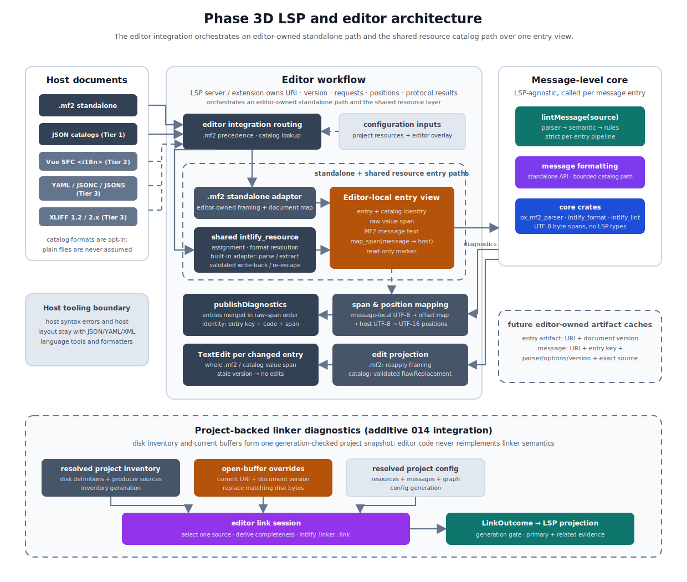

# ox-mf2 Phase 3D LSP and Editor Design

This document tracks the detailed LSP and editor integration design for ox-mf2.

The Phase 3 tooling boundary is defined in [005-ox-mf2-phase-3-tooling-transport-design.md](./005-ox-mf2-phase-3-tooling-transport-design.md). That document fixes the high-level tooling workflow. This document is the implementation-facing place to refine host document mapping, diagnostic publication, formatting edits, configuration reload behavior, and future editor features.

Where the Phase 3 boundary document describes resource and catalog files, the editor workflow is specified against the host-format-agnostic message entry model. Localizable MF2 messages are managed in message catalogs with many different host formats — JSON, YAML, JSON5, XLIFF, framework-specific single-file-component blocks, and other localization interchange formats — so this document specifies editor behavior against extracted message entries rather than against any concrete host format. The message entry model, the host format adapter contract, the host format registry, catalog configuration, and the host format tier roadmap are owned by [013-ox-mf2-resource-catalog-adapter-design.md](./013-ox-mf2-resource-catalog-adapter-design.md); this document owns the editor-facing behavior built on those shared contracts.

## Goals

- Reuse the parser, formatter, linter, `SnapshotView`, and future `SemanticView` without making the core crates depend on LSP protocol types.
- Support diagnostics and formatting for standalone `.mf2` files.
- Support diagnostics and formatting for MF2 messages embedded in message catalog host files through resource-owned extraction and mapping, starting with JSON catalogs; later host formats follow the tier roadmap owned by [013-ox-mf2-resource-catalog-adapter-design.md](./013-ox-mf2-resource-catalog-adapter-design.md).
- Build the editor workflow on the consumer-neutral message entry contract owned by [013-ox-mf2-resource-catalog-adapter-design.md](./013-ox-mf2-resource-catalog-adapter-design.md), so additional catalog formats extend the shared registry without changing diagnostics publication, formatting edits, caching, or position conversion behavior.
- Convert core UTF-8 byte spans into editor-facing positions, UTF-16 by default, at the editor integration boundary.
- Keep LSP/editor artifact caches, document version checks, and host-file edit ownership outside of the parser, formatter, and linter cores.

## Non-Goals

- Making an LSP server or editor extension a direct Phase 3 product.
- Adding LSP protocol types to parser, formatter, or linter result objects.
- Implementing code actions, quick fixes, hover, completion, go-to-definition, or rename in the initial workflow.
- Implementing true range-only formatting or minimal-diff formatting in the formatter core.
- Owning the message entry model, host format adapter contract, registry, catalog configuration, or host format tier roadmap; those are owned by [013-ox-mf2-resource-catalog-adapter-design.md](./013-ox-mf2-resource-catalog-adapter-design.md).
- Owning editor-facing host-format syntax diagnostics, host-format schema diagnostics, or host-format styling. Resource-owned built-in adapters still perform the complete host parse and validation required for fail-complete extraction and write-back; the editor integration does not reinterpret those checks or present itself as the JSON, YAML, or XML language service. Host syntax diagnostics and document layout remain owned by host-format tooling.
- Cross-file and cross-locale catalog features such as missing-translation or key-parity checks. They belong to future catalog-level linting layered per [008-ox-mf2-phase-3c-linter-design.md](./008-ox-mf2-phase-3c-linter-design.md) and [013-ox-mf2-resource-catalog-adapter-design.md](./013-ox-mf2-resource-catalog-adapter-design.md).
- Defining a plugin system for editor integrations or a third-party host format adapter API.

## Initial Workflow

The initial editor workflow focuses on diagnostics and formatting.

For a catalog document, the editor integration asks the resource-owned layered resolver and registry to classify and extract MF2 message entries; the selected built-in host adapter parses the host syntax and populates the resource artifact. For a standalone `.mf2` document, the editor-owned standalone adapter constructs its separate framing-aware artifact. The editor integration then calls core APIs per entry and maps message-local results back to document-level ranges. Core APIs operate on message-local UTF-8 byte spans. The editor integration owns document URI handling, document version checks, editor position conversion, request orchestration, and protocol-specific result shapes.

## Host Document Model



Editor integrations treat every supported document as a host document that yields zero or more message entries over the same message-level core.

- A **host document** is one editor document: a standalone `.mf2` file or an opted-in message catalog file, beginning with JSON catalogs.
- A **message entry** is the behavioral unit that connects one host document region to one MF2 message: a stable concrete entry key, a logical catalog key for future cross-locale grouping, a raw host value span, MF2 message text, a message-to-raw offset map, and a read-only marker. The canonical behavioral fields and mapping invariants are owned by [013-ox-mf2-resource-catalog-adapter-design.md](./013-ox-mf2-resource-catalog-adapter-design.md). Resource catalog artifacts and standalone editor artifacts do not share one constructible concrete Rust entry type: the editor presents both through an editor-local read-only entry view.
- An **editor integration** is the LSP server or extension boundary that owns document lifecycle, routing requests into the standalone or resource path, core-call orchestration, editor position conversion, and protocol results. It does not own catalog matching or host syntax.
- A **standalone editor adapter** is the editor-owned `.mf2` entry producer that applies file framing and constructs the standalone document map. It is not a resource host-format adapter.
- A **built-in host format adapter** is the resource-owned, format-specific component that receives an already validated `ResolvedHostFormat`, parses catalog host syntax, extracts and maps entries, and plans and materializes value-identical re-escaping. Catalog assignment, top-level format resolution, and dispatch precede this adapter and belong to the resource resolver and registry, per [013](./013-ox-mf2-resource-catalog-adapter-design.md#host-format-adapter-contract).

Standalone `.mf2` files are the degenerate host format in the editor workflow. Before producing its one editor-owned entry artifact, the standalone editor adapter applies the Phase 3B [File Framing](./007-ox-mf2-phase-3b-formatter-design.md#file-framing) read contract: it removes at most one leading UTF-8 BOM and then one trailing `LF` or `CRLF`, when present. The entry's message text is that unframed text, its raw value span is the whole document, and its editor-owned document map retains the removed framing so message-local positions map back to the original bytes. Standalone and catalog entries take the same downstream per-message parser, linter, formatter, and diagnostic-mapping path through the common view. Final edit construction remains path-specific: the editor integration reapplies standalone file framing, while catalog edits come only from the resource artifact's integrated validated write-back.

All downstream editor behavior in this document — diagnostics publication, formatting edits, artifact caching, and position conversion — is defined against message entries, never against concrete host formats. Supporting a new catalog format means adding its built-in adapter and registry entry to `crates/intlify_resource`; it must not require changes to parser, formatter, or linter core APIs or to the editor workflow contract.

## Entry Production and Ownership Boundaries

The editor integration consumes catalog assignment, format resolution, built-in adapter dispatch, extraction, offset mapping, and validated write-back from the shared resource layer specified by [013-ox-mf2-resource-catalog-adapter-design.md](./013-ox-mf2-resource-catalog-adapter-design.md). The editor-owned standalone adapter produces its separate entry artifact, exposes the same read-only behavioral fields and `map_span` operation through the editor-local common view, and applies the Phase 3B file-framing contract; it does not construct a resource `MessageEntry` or route `.mf2` files through catalog extraction. The editor workflow relies on these guarantees:

- entries are ordered by raw span start and raw value spans do not overlap
- catalog entry text is byte-exact, with no trimming, normalization, or injected framing; standalone entry text differs from the document bytes only by the explicitly removed file framing
- before catalog host parsing, the editor passes the current Unicode document's UTF-8 byte length through the resource-owned `preflight_host_bytes` limit check; `extract` defensively repeats that check, while decoding of editor protocol input remains outside the resource layer
- offset maps are monotonic and mapped ranges never split a host escape sequence
- write-back re-escaping is value-identical, and entries that cannot be safely re-escaped are marked read-only
- project-configured catalog detection is strictly opt-in and resolves identically in editor and CLI resource workflows
- the editor validates the normalized ad-hoc value through the resource-owned overlay validator and calls `ResolvedResources::resolve_path_with_overlay`; after its opaque layered result selects one assignment, the editor calls the registry's `resolve_format` boundary to obtain a `ResolvedHostFormat` or the shared typed `resource_format_unsupported`, then moves that resolved context into extraction; it does not compile overlay globs, construct assignments, or reconstruct unsupported-format details or target-extension evidence

Editor routing over the resource registry follows these rules:

- documents with the `.mf2` extension or the exact case-sensitive canonical language id `messageformat2` always select the standalone editor path before any project or ad-hoc catalog match is considered; no `mf2` language-id alias is defined
- among catalog membership sources, the shared layered resolver orders project catalog configuration before the validated editor overlay and returns project or overlay provenance; editor-specific settings may add editor-only ad-hoc catalog opt-in only for documents left unmatched by resolved project configuration
- the shared layered resolver de-duplicates a same-format project/ad-hoc overlap as project-owned and returns source-qualified conflict evidence for a different-format overlap; its overlay layer applies the same same-format de-duplication and different-format conflict rule internally
- after standalone precedence, the layered resource resolver returns at most one opaque catalog assignment or one conflict; `HostFormatRegistry::resolve_format` then resolves at most one shipped format, and extraction dispatches exactly that format's one built-in adapter

Editor document identity is the client-owned document URI together with its protocol version, not filesystem physical identity. The editor does not stat, canonicalize, or group open documents by device/inode, volume/file id, hard-link target, or symlink target. Two URIs that happen to name the same physical file retain independent text snapshots, versions, diagnostics, caches, and formatting transactions; a change or edit for one URI is never inferred for the other. The CLI's physical alias conflict and post-write fail-stop rules do not apply because the editor returns version-checked protocol edits and does not directly coordinate writes to those aliases. Detecting an external disk change or reconciling multiple URI buffers remains the client/integration's document-lifecycle responsibility.

## Diagnostics Publication

Editor diagnostics should be produced from the shared diagnostic result contract used by parser, semantic, and linter workflows.

The preferred initial path is to use source-backed `lintMessage` per message entry as the diagnostic source for editor publication because it already includes parser, semantic, and lint diagnostics. A future `lintSnapshot` path is an optimization for parse-artifact reuse after the parser owns a snapshot-to-`SemanticModel` path. If an editor integration composes diagnostics manually from cached parser, semantic, and linter results, that composition is an internal optimization only and must preserve the same ordering, category/code/severity values, and de-duplication behavior as `lintMessage`.

The editor integration consumes the linter result contract from [008-ox-mf2-phase-3c-linter-design.md](./008-ox-mf2-phase-3c-linter-design.md). Parser-owned semantic diagnostic catalog and ordering details remain owned by [012-ox-mf2-parser-semantic-validation-design.md](./012-ox-mf2-parser-semantic-validation-design.md). Rule-facing documentation and rule ids are indexed from [linter-rules/index.md](./linter-rules/index.md). Editor integrations should not redefine diagnostic meaning, rule metadata, or semantic validation behavior.

The initial editor workflow follows the same strict pipeline as CLI and bindings for each message entry:

- parser diagnostics are always reported
- semantic diagnostics are reported only when parsing has no parser diagnostics and semantic validation runs
- lint diagnostics are reported only when parser and semantic diagnostics are clean
- parser diagnostics prevent semantic validation and linter rule execution

Multi-entry host documents add document-level publication rules on top of the per-entry contract:

- Entries are independent. Parser diagnostics in one entry never suppress semantic validation, linting, or publication for other entries; the strict pipeline is per entry, not per document.
- Published document diagnostics are the union of all entries' mapped diagnostics. Entries appear in raw span order; within one entry, the core result order is preserved verbatim. Because entry spans do not overlap, this ordering is deterministic.
- Diagnostic identity across document updates should combine the entry key, the stable diagnostic code, and the message-local span. Entry keys survive unrelated edits elsewhere in the catalog, so this identity is more stable than document-level spans alone.
- Catalog-level findings such as duplicate catalog keys or cross-locale checks are future catalog-level linting. They use the dedicated catalog finding contract owned by the linter design rather than being attached to an arbitrary entry. Concrete related-entry spans still use the shared entry mapping, while a missing-locale finding has no synthetic owner entry or host span. Editor layers present that future result contract and must not reimplement the rules or duplicate one finding across related entries.

Every diagnostic job captures the exact document version, mapping-generation token, and root config-generation token used for extraction, linting, and span conversion. Immediately before publication, all three must still match the installed state. A stale job is discarded without publishing or clearing diagnostics; the document-change or successful-config-reload event that advanced a token owns scheduling its replacement. A membership or mapping change clears the prior mapped publication before rebuilding because its host ranges are no longer trustworthy. A lint-option-only change may retain the last complete publication until the replacement job succeeds, then replaces the complete set atomically; results from the old config generation can never overwrite the new set.

Extraction failure presentation depends on the failure class, and every class returns no formatting edits.

The special projection of selected resource operational codes into editor diagnostics, without admitting them to the parser/semantic/lint diagnostic namespace, is indexed in [appendix-ox-mf2-error-code.md](./appendix-ox-mf2-error-code.md). The behavior below remains authoritative for editor publication and retained state.

- `resource_parse_failed` publishes no new MF2 or resource diagnostic and retains the last successfully published MF2 diagnostic set for that document. Host syntax breakage is usually a transient typing state and host-format tooling owns its syntax diagnostic. If no successful set exists, the document has no ox-mf2 diagnostics. The retained set is replaced on the next successful extraction.
- `resource_format_unsupported`, `resource_entry_unsupported`, `resource_document_unsupported`, and `resource_limit_exceeded` with `phase: "extract"` replace the previous ox-mf2 state: stale MF2 diagnostics are cleared and exactly one error-severity editor diagnostic is published with source `ox-mf2-resource` and the corresponding stable resource code. The editor integration uses the precise original-host span carried by the typed resource error. When a document-wide extraction failure has no truthful original-host site, it uses an empty range at document start. These resource diagnostics are not parser, semantic, or lint diagnostics and do not participate in rule configuration or `--max-warnings`.
- `resource_limit_exceeded` with `phase: "validate_write_back"` describes only a rejected formatting candidate, not the installed host document. The formatting request returns this typed request-scoped operational failure with no edits, but publishes no document diagnostic, clears no existing diagnostic, installs no artifact or mapping, advances no mapping or config generation, and schedules no diagnostic refresh merely to clear a candidate-only condition. A later independent request starts from the unchanged installed state. This failure does not activate the root-scoped configuration-failure episode below or disable subsequent formatting requests.
- Configuration and internal failures publish neither MF2 nor resource diagnostics. They use the editor integration's operational error channel and leave the last successfully applied configuration and diagnostic publication unchanged; no partial configuration, extraction artifact, or new diagnostic set is installed. While that failure is active, formatting requests return no edits. Recovery atomically replaces the retained state after a successful reload and extraction.

The CLI presents resource failures through its target-local operational error contract instead; that surface behavior is owned by [013-ox-mf2-resource-catalog-adapter-design.md](./013-ox-mf2-resource-catalog-adapter-design.md).

Core `"error"` and `"warn"` severities map to editor/LSP diagnostic severity at the editor integration boundary; integrations convert `"warn"` to the editor's warning severity. Editor layers may add protocol-specific advice later, but the core linter does not emit `info` or `hint` diagnostics initially.

## Formatting Edits

Formatter core APIs return formatted message text, or the Rust-only bounded path's no-text capacity signal, rather than LSP `TextEdit` objects.

The editor integration finds the containing message entry and calls whole-message formatting. The initial integration replaces the whole containing message range rather than computing a minimal diff. For standalone `.mf2` files, that range is the whole document and the replacement is the formatted unframed message followed by exactly one `LF`, with no BOM, matching the Phase 3B [File Framing](./007-ox-mf2-phase-3b-formatter-design.md#file-framing) write contract. The standalone path compares those framed replacement bytes with the original document, so a leading BOM, a missing final newline, or a final `CRLF` produces an edit even when the unframed message text is already formatted.

For a catalog host document, the editor uses the Rust-only bounded formatter path with the resource layer's fixed per-message cap. It observes every artifact entry through one resource-owned `CandidateMessageAdmission` in raw entry order: a successful selected writable output contributes its complete byte length, while an unselected, diagnostic-bearing, or read-only entry contributes its original message. The editor retains a successful writable string, including byte-identical output, only after admission succeeds. A formatter operational error wins over a prospective admission error and returns no edits; otherwise failed admission returns its request-scoped resource error without invoking write-back. Successful admission supplies the retained outputs as `FormattedEntry` input to the shared `build_and_validate_write_back` boundary in [013-ox-mf2-resource-catalog-adapter-design.md](./013-ox-mf2-resource-catalog-adapter-design.md); catalog entries never receive standalone file framing. `WriteBackOutcome::Unchanged` returns no edits. On `Changed`, the editor discards the validated candidate artifact only after success and converts its resource-owned `RawReplacement` values into protocol edits over their original raw value spans. Those spans satisfy the resource contract's stronger edit-disjoint rule, including its zero-length insertion restrictions, so the protocol result does not depend on edit ordering.

This full-candidate validation remains mandatory for a single-entry format request and for large catalogs. Editor settings and size thresholds cannot disable it. A future parse-state reuse or incremental implementation is valid only when it proves the same complete identity and value invariants and passes the shared equivalence fixtures; editor latency is tracked by the dedicated single-entry catalog benchmark in the resource design. A candidate `resource_limit_exceeded` follows the request-scoped, no-publication behavior above; every other candidate-validation failure follows its typed operational boundary. No candidate failure installs edits or mutates the retained diagnostic and extraction state.

Document formatting for a catalog host document evaluates entries independently and admits only selected writable outputs:

- Entries whose extracted text has parser diagnostics are skipped as per-entry no-ops, matching the strict invalid-syntax contract in [007-ox-mf2-phase-3b-formatter-design.md](./007-ox-mf2-phase-3b-formatter-design.md). Other entries still format.
- Read-only entries still use bounded formatter evaluation so parser diagnostics remain available, but a clean complete output or bounded-output signal is discarded and the original message is admitted. Crossing the output cap is not a candidate resource failure for an entry that cannot participate in write-back.
- The integrated resource method produces one replacement for each byte-different selected writable entry only after the raw-order limit checks and complete candidate validation succeed. Byte-identical entries produce no replacement or edit.
- Formatting edits never touch host syntax outside raw value spans: no key reordering, no indentation or quoting changes outside the message value, and no host layout normalization. Host-format styling belongs to host formatters, so keeping MF2 edits inside value spans lets an MF2 formatter and a host-format formatter coexist on one document without conflicting edits.

A range formatting request first resolves both protocol positions against the current document version using the negotiated position encoding and converts them to one ordered host-document UTF-8 byte range. A position outside the document, a reversed range, or a UTF-8/UTF-16 position that splits a Unicode scalar is rejected as a protocol-level invalid-params failure before entry selection; the editor integration does not clamp, swap, return a successful empty edit merely for malformed input, or call parser, formatter, or resource APIs. A valid request formats selected writable entries through bounded whole-entry formatting, admits their successful outputs while observing originals for every unselected entry, and passes only admitted outputs to `build_and_validate_write_back`, which validates the resulting complete candidate host document before returning any edit. Unselected entries retain their original messages during candidate total calculation and validation. A non-empty raw value span uses normal half-open intersection with the converted host UTF-8 range. A zero-length span at host position `p`, such as an explicitly paired empty XLIFF element content span, is treated as a point and is selected when `range.start <= p <= range.end`; an empty caret range at exactly `p` therefore selects it. This point rule does not expand the replacement span into surrounding host syntax.

At request start, the editor integration captures one immutable request snapshot containing the document URI, the exact client-supplied protocol version currently installed for that URI, the source text, the active classification/extraction artifact, an opaque mapping-generation token, and the applicable root config-generation token. Both tokens are server-local and never reused for a later installed state during the server process. The mapping token changes whenever the URI is opened or reopened, closed, reclassified, re-extracted, or receives a replacement mapping because of a document or membership change. The config token changes after any semantically different resolved configuration is installed for the root. A source hash or byte comparison is not a substitute for the protocol version or either generation token.

Immediately before returning a successful standard document- or range-formatting response, the editor integration looks up the URI again and requires exact equality of the installed protocol version, mapping-generation token, and root config-generation token. It also verifies that every selected entry handle still belongs to the captured artifact. A closed document, an incremented version, a same-bytes edit that nevertheless changed the version, a classification or mapping replacement, a formatter-option change, or a missing entry makes the request stale. The integration then returns an empty `TextEdit[]`, publishes no operational editor error, and does not retry formatting automatically. Position conversion, entry selection, formatting, and candidate validation always use the captured request snapshot rather than mixing old and current document or configuration state.

The final state comparison and response construction occur under one consistent document-state read boundary. A standard LSP formatting response cannot carry a document version, so this server-side check cannot prevent a client-side edit made after the response leaves the server; client document lifecycle and application ordering remain the protocol integration's responsibility. Future operations that return `WorkspaceEdit` may use versioned `TextDocumentEdit`, but the initial standard formatting handlers do not replace themselves with a custom command solely to obtain that guard.

Editor integration tests must cover unchanged version and generations returning edits; a changed version with identical bytes returning `[]`; close and reopen with a reused client version returning `[]` because the mapping generation differs; configuration-driven reclassification or re-extraction at the same client version returning `[]`; a formatter-only config change returning `[]` because the config generation differs even when the mapping does not; a selected entry disappearing before return; and no automatic core re-invocation after any stale outcome.

True range-only formatting and minimal-diff formatting are deferred. A selection inside an MF2 message should initially format the containing message rather than requiring range-local formatting from the formatter core.

## Span and Position Conversion

Core parser, snapshot, semantic, formatter, and linter APIs use message-local UTF-8 byte spans as their canonical location model. Editor integrations convert spans through a fixed pipeline at the editor integration boundary:

1. Core APIs return message-local UTF-8 byte spans over the entry message text.
2. The entry offset map, per the mapping contract in [013-ox-mf2-resource-catalog-adapter-design.md](./013-ox-mf2-resource-catalog-adapter-design.md), converts message-local spans to host-document UTF-8 byte spans.
3. The editor integration converts host-document UTF-8 spans to the editor-facing position encoding.

For standalone `.mf2` documents, step 2 uses the file-framing-aware document map. A removed leading UTF-8 BOM shifts mapped byte positions by its three-byte length, while a removed trailing newline stays outside the message range; when no framing was removed, the map is the identity over the message body. If framing leaves an empty message, the map retains an independent empty-message anchor at the first message-body byte position: after a removed BOM and before a removed trailing newline. Mapping the only valid message span, `0..0`, returns that exact zero-length host span even when adjacent raw-only framing segments coalesce. The editor-facing default is UTF-16 positions; integrations that negotiate a different LSP `positionEncoding`, UTF-8 or UTF-32 in LSP 3.17 and later, still perform the conversion at the same boundary. The parser, formatter, and linter cores never perform position encoding conversion.

## Configuration Sources

Editor integrations normalize project configuration and editor-specific settings into the same resolved formatter and linter configuration models used by CLI workflows.

The initial cross-editor configuration model accepts exactly four source classes:

1. built-in formatter, linter, and editor integration defaults
2. the unified project configuration discovered and validated through the Phase 3A project-config contract
3. optional editor settings normalized from LSP `initializationOptions` during server initialization
4. optional effective dynamic editor settings delivered through `workspace/configuration` or `workspace/didChangeConfiguration`

An editor client may derive the fourth source from product-specific user, workspace, or workspace-folder scopes, but it resolves those scopes before the settings cross the integration boundary. The server consumes one normalized effective settings object for the applicable project/workspace root and does not model VS Code, another editor's preference hierarchy, or a vendor-specific settings-file format as separate configuration sources. A client without dynamic-configuration support may use initialization options for the lifetime of the server session.

Per-document option overrides, CLI flags, environment variables, editor-specific files read directly by the server, and direct reuse of a client's raw user/workspace settings objects are outside the initial model. `.editorconfig` remains governed by the formatter design and is not an editor-integration configuration source in the initial formatter surface. Editor-only catalog membership uses the normalized ad-hoc overlay below rather than introducing another source class. Source precedence for overlapping non-membership formatter, linter, and editor options is defined separately below; reload application is transactional under the failure-class rules above, so an invalid or internally failed dynamic update does not partially replace the last successful state.

For non-membership formatter, linter, and editor-integration options, resolution is field-by-field in this highest-to-lowest precedence order:

1. effective dynamic editor settings
2. LSP `initializationOptions`
3. unified project configuration
4. built-in defaults

An absent field falls through to the next source. JSON `null` is not an unset or inheritance marker and is rejected unless a future individual option explicitly defines `null` as a value. Each dynamic notification or `workspace/configuration` response replaces the complete previous dynamic layer for its applicable root; it is not a merge patch. An empty normalized object therefore clears all dynamic overrides and reveals initialization, project, or default values. The server resolves a fresh immutable formatter/linter configuration from all four layers and installs it atomically only after complete validation.

Every lower-precedence source is still validated even when a higher-precedence source supplies the same field. In particular, an invalid project configuration cannot be hidden by initialization or dynamic editor settings. The editor integration may retain internal field provenance for logging or debugging, but provenance is not passed into formatter or linter core option types and is not a diagnostic category.

Catalog membership and host-format classification are the deliberate exception to ordinary field precedence. Project `resources` membership remains authoritative; the editor overlay can only add an otherwise unmatched document and cannot override a project-selected format. The overlap, conflict, and editor-local coverage rules below apply after both source shapes have been validated.

Every integration maps its product-specific editor setting into this common normalized ad-hoc catalog overlay shape before classification:

```jsonc
{
  "catalogs": [
    {
      "include": ["locales/**/*.json"],
      "exclude": ["locales/generated/**"],
      "format": "json"
    }
  ]
}
```

`catalogs` defaults to an empty array. Each entry requires a non-empty string `include` array; `exclude` is optional and defaults to an empty array. Patterns use the same project-root-relative, slash-normalized glob semantics as project `resources.catalogs`. A path without glob metacharacters is an exact document-path match, so the model does not need a second per-document URI variant. `format` is optional and accepts only a canonical id for an adapter shipped in the current release. When omitted, classification uses the matched document's extension; an extension-ambiguous document therefore requires an explicit `format`. The initial overlay applies only to `file` URI documents whose paths are representable relative to `projectRoot`; untitled and other non-file documents are not catalog targets.

This is a normalized cross-editor contract, not a mandated product-facing setting key. VS Code extensions, LSP initialization options, or other integrations may expose an idiomatic outer key, but they only map that product-specific value into the common object. The resource-owned overlay validator performs the exact object, field, shipped-format, and resource-glob validation and produces an opaque `ResolvedCatalogOverlay`; integrations do not compile or resolve the inner shape themselves. Its normalized RFC 6901 pointers are rooted at `""` and `/catalogs`, independently of the product-facing outer setting name.

Catalog opt-in and extraction scope configuration are owned by [013-ox-mf2-resource-catalog-adapter-design.md](./013-ox-mf2-resource-catalog-adapter-design.md) as the `resources` section of the unified project config. The unified loader validates that section through the resource-owned validator and produces `ResolvedResources`; the resource-owned overlay validator independently produces `ResolvedCatalogOverlay` only after the normalized editor value succeeds completely. For each eligible file URI, the editor calls `ResolvedResources::resolve_path_with_overlay` once rather than resolving and recombining the layers itself. Its `LayeredCatalogMatch` returns project or overlay provenance plus an opaque assignment. Project precedence is authoritative: an overlay may opt in an unmatched document, including one excluded from every project catalog definition, but cannot override or repair a project match. Same-format overlap de-duplicates to project ownership; different-format, known-versus-unrecognized, and internally conflicting overlay assignments return source-qualified configuration conflict evidence. Invalid project configuration is reported before overlay validation and cannot be bypassed by editor settings.

Overlay structural failures and layered assignment conflicts reuse `config_validation_failed` in the root-scoped editor configuration channel; they are never document diagnostics. Overlay structural details use the resource validator's normalized pointer and omit a filesystem config path. A layered `catalog_format_conflict` fingerprint uses `targetPath` and the resource-provided `assignment` and `conflictingAssignment` objects with exact `source: "project" | "overlay"` and zero-based `definitionIndex` fields. A config path is retained only for a conflict entirely between project definitions. Reload remains transactional, so neither an invalid overlay nor a layered conflict replaces the last successful overlay, classification, extraction artifact, mapping, or diagnostics.

Changing either source re-runs editor document classification and extraction, with the invalidation consequences described below. The integration should identify an ad-hoc-only document as editor-local rather than CI-covered; once an equivalent project match appears, the classification becomes project-owned without running extraction twice. Editor-only membership is never implied to exist in CLI or CI.

Configuration loading, validation, and internal reload failures are root-scoped operational editor errors. They are not mixed into parser, semantic, formatter, linter, resource input, or future catalog diagnostics and follow the last-successful-state transaction above.

For each project/workspace root, the integration retains at most one active structured configuration error and its notification fingerprint. The fingerprint is the stable operational `code`, normalized optional `path`, and canonical stable `details` value; human-readable `message`, dependency text, timestamps, and backtraces do not participate. The first failure in an episode, or a later failure with a different fingerprint, sends one LSP `window/showMessage` notification of type `Error` with concise actionable prose. Repeated reloads, document requests, and open documents that observe the same active fingerprint do not send another popup.

Every observed configuration failure also emits one `window/logMessage` error entry containing its stable code and safe path/reason context. The log message does not expose source contents, arbitrary dependency debug output, panic payloads, or a backtrace. If the server discovers the failure before the protocol lifecycle permits window notifications, it queues the one popup and log entry until after initialization rather than converting the condition into an initialize-response schema or document diagnostic.

An active failure installs no configuration, advances no config or mapping generation, invalidates no artifact, and starts no replacement diagnostic job. The last successfully installed configuration, artifacts, and diagnostic publication remain visible; when no successful publication exists, none is synthesized. Formatting requests for an affected root return an empty `TextEdit[]` while the failure is active, even though the retained state remains available for recovery and comparison.

The next successful validated reload atomically installs its resolved state, clears the active error, applies the normal selective invalidation matrix, and records one informational recovery entry through `window/logMessage`. It does not show a success popup. A later recurrence, including the same fingerprint after recovery, begins a new failure episode and may notify once again. Roots maintain independent error episodes, so one broken workspace root does not suppress or duplicate another root's notification.

## Artifact Cache and Invalidation

Editor integrations may cache two artifact classes per document version once semantic APIs are exposed:

- extraction artifacts per host document version: classification results, entry lists, and offset maps
- message-level artifacts per entry: source views, decoded snapshots, diagnostics, and future semantic views

Message-level artifacts should follow the cache-key discipline in [ox-mf2-parse-artifact-cache.md](./ox-mf2-parse-artifact-cache.md), using the entry key as the message id and the document URI as part of the namespace. Because that cache key includes the exact source bytes, entries whose message text is unchanged across host document versions can hit the cache even when unrelated parts of a large catalog changed. Extraction artifacts remain version-specific.

Each project/workspace root owns an immutable resolved configuration plus an opaque, process-local config-generation token. A validated reload first resolves all source layers, then compares the complete result semantically with the installed configuration. An equal result performs no cache work and does not advance the token. A different result is installed atomically with a fresh non-reused token, after which affected open documents are processed according to this dependency matrix:

- A `resources` membership, host-format assignment, or normalized editor catalog-overlay change reclassifies every potentially affected open document in the root. It discards version-specific extraction artifacts, offset maps, mapped diagnostics, and pending formatting candidates and advances the document mapping generation when a classification or installed mapping changes. If a document is no longer an MF2 or catalog target, the editor integration publishes an empty diagnostic set. Exact-source message parse or semantic artifacts remain eligible for reuse only through their complete cache keys; no cached host mapping survives.
- A formatter-option change invalidates cached formatter output or candidate state and makes in-flight formatting requests stale through the root config generation. It does not discard classification, extraction, offset maps, parser artifacts, semantic artifacts, or lint diagnostics.
- A linter-option change invalidates resolved lint-result caches and schedules one new diagnostic job for each affected open target. Parser, extraction, offset-map, and parser-owned `SemanticModel` artifacts remain reusable when their own keys still match. The last complete lint publication may remain until the new generation publishes atomically, as defined above.
- A future parser- or semantic-result-affecting option must participate in the parse artifact `CacheKey`; changing it causes natural misses or explicit removal for the affected namespace. Formatter- or linter-only settings must not be added to the parse key merely to force broad invalidation.
- Editor scheduling or presentation settings that do not affect extraction, core results, mapping, or protocol positions update their owner without evicting core artifacts. The root config generation still prevents an already running request from installing state computed from a superseded resolved configuration.

A document text/version change always drops its version-specific extraction and mapping state, advances its mapping generation, and schedules new diagnostics. Message-level parse artifacts for entries whose exact message bytes and complete cache keys remain equal may survive and be reused across host-document versions. A failed configuration load, validation, or internal reload installs nothing, advances neither generation, invalidates no cache, and leaves the last successful configuration and publication in force.

Tests must cover each matrix row independently, a mixed reload that takes the union of affected artifacts, semantically equal reloads with no generation change, stale formatting and diagnostic jobs losing the final-generation check, exact-source parse reuse across unrelated host edits, and failed reloads preserving every installed token and artifact. Cache eviction, hashing, and persistence policy remain owned by the parse artifact cache design.

## Shared Resource Layer Ownership

Catalog assignment, top-level format resolution, built-in adapter dispatch, host format extraction, mapping, and validated write-back are implemented once in the shared resource layer owned by [013-ox-mf2-resource-catalog-adapter-design.md](./013-ox-mf2-resource-catalog-adapter-design.md). Editor integrations must consume that layer rather than reimplementing catalog membership or host-format knowledge per editor. Message-to-raw mapping and re-escaping correctness is subtle and must not drift between the CLI and editor surfaces.

Editor-side glue stays thin. Document lifecycle, URI and version tracking, request orchestration, protocol result shapes, and position encoding remain editor integration code; catalog assignment and host-format knowledge do not.

## Future Editor Features

The initial workflow does not require code actions, quick fixes, hover, completion, go-to-definition, rename, true range-only formatting, or minimal-diff formatting.

Future editor features should build on stable core concepts rather than adding LSP-specific state to parser, formatter, or linter crates. Quick fixes are a future editor-integration-owned feature. They may use stable diagnostic codes, configurable rule metadata, formatter output, and future rule suggestions, but the initial linter core does not expose a fix API. Style fixes should call formatter APIs rather than reimplementing formatting inside editor integrations or linter rules. Semantic features should build on future `SemanticView` exposure.

Cross-locale editor features — missing-translation indicators, catalog key completion, and locale parity lenses — additionally build on future catalog-level linting and locale-bound catalog configuration, not on editor-local extraction alone.

## Open Questions

- Once snapshot-to-`SemanticModel` exists, when should editor integrations switch from source-backed `lintMessage` to future `lintSnapshot` for parse-artifact reuse?
- Should a future recovery-aware editor mode provide partial semantic or lint diagnostics for incomplete buffers, and how would it avoid conflicting with the strict CLI and binding pipeline?
- Which future editor features should be designed first after diagnostics and formatting: quick fixes, hover, completion, go-to-definition, or rename?
