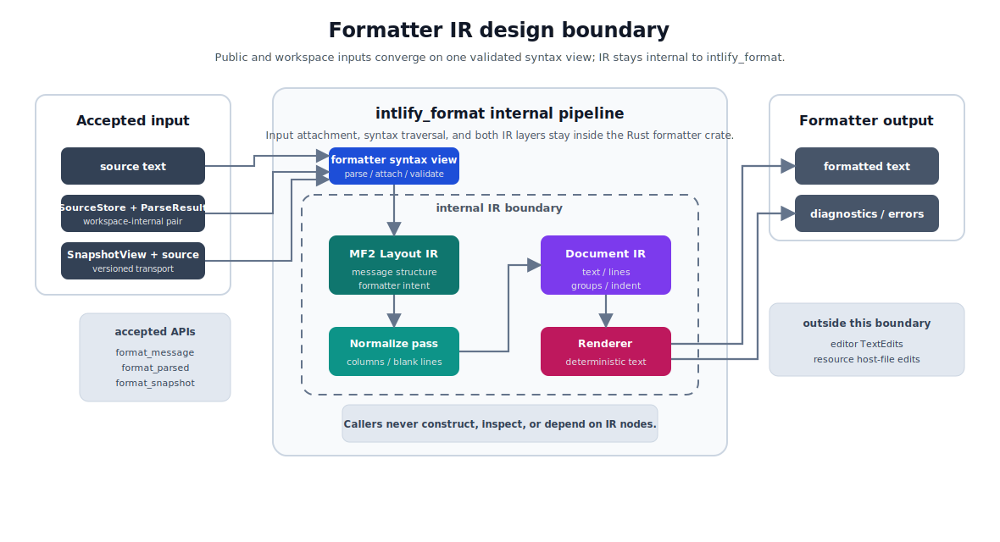
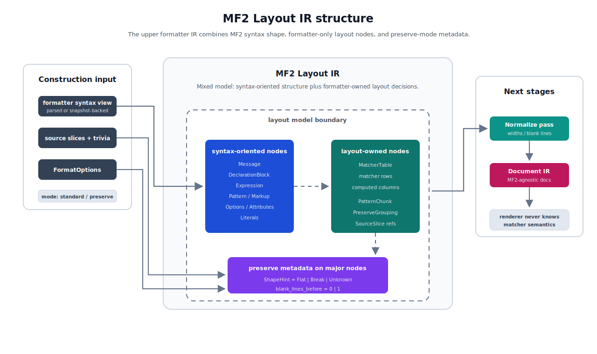
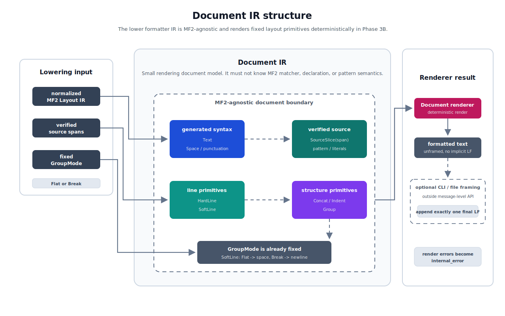

# ox-mf2 Formatter IR Design

## Purpose

This document tracks the detailed design for the internal formatter IR used by `intlify_format`.

The Phase 3B formatter product design is defined in [007-ox-mf2-phase-3b-formatter-design.md](./007-ox-mf2-phase-3b-formatter-design.md). That document fixes formatter modes, public APIs, CLI behavior, fixtures, diagnostics policy, and SnapshotView requirements. This document focuses only on the internal layout/document model that turns parsed MF2 syntax into formatted text.

## Goals

The formatter IR should provide a stable implementation boundary between syntax traversal and text rendering.

Primary goals:

- avoid direct string concatenation during `SnapshotView` traversal
- represent formatter output as a structured document or layout tree before rendering
- support standard and preserve formatting modes through one formatter pipeline
- keep line, group, and indent decisions explicit enough for future line wrapping
- preserve semantically significant pattern text and literal spelling
- allow resource/catalog adapters to reuse message-level formatting later
- make formatting behavior testable independently from CLI, N-API, and WASM bindings
- keep benchmark stages separable for traversal, IR construction, and rendering

## Non-Goals

Initial non-goals:

- public AST replacement or a second public syntax format
- exposing the formatter IR through N-API or WASM
- range-only formatting
- minimal-diff edit generation
- JSON/YAML/resource host-file edit modeling
- finalizing line wrapping behavior
- implementing formatter ignore directives
- preserving parser recovery output with diagnostics

Range-only and minimal-diff editing remain LSP/editor integration concerns. Resource/catalog host-file edits remain adapter concerns above the message-level formatter.

## Design Boundary



The IR is an internal implementation detail of `intlify_format`.

The public formatter API accepts source text or a `SnapshotView`, then returns formatted text or diagnostics/errors. Callers do not construct or inspect formatter IR nodes.

The intended pipeline is:

```text
source text
  -> parser / SnapshotView
  -> formatter syntax traversal
  -> MF2 Layout IR construction
  -> MF2 Layout IR normalize pass
  -> Document IR lowering
  -> Document IR rendering
  -> formatted source text
```

The formatter uses a two-layer IR:

1. **MF2 Layout IR**: an ox-mf2-specific layout model that captures message structure and formatter intent.
2. **Document IR**: a small Prettier-style document model that captures text rendering primitives.

The MF2 Layout IR carries enough structure for MF2-specific rendering decisions without duplicating the full parser snapshot. Source-sensitive decisions, such as preserve-mode source shape and blank-line grouping, are derived from `SnapshotView` spans and trivia during MF2 Layout IR construction.

The Document IR is independent of MF2 semantics. It should not know about matcher tables, declarations, selectors, or pattern semantics. Its job is to render an already-decided document layout deterministically.

## MF2 Layout IR



The MF2 Layout IR is a mixed model:

- it is syntax-oriented for ordinary message structure, such as messages, declarations, expressions, patterns, markup, options, attributes, and literals
- it uses dedicated layout nodes where formatter decisions are MF2-specific, such as matcher tables, pattern chunks, and preserve-mode grouping

The initial model should include a dedicated matcher table layout node. The matcher table node owns row data and computed column widths. Document IR and the renderer must not know MF2 matcher semantics.

### Minimal Node Set

Phase 3B uses a closed Rust enum/struct model for the MF2 Layout IR. It is an internal formatter implementation detail, not a public AST or plugin extension surface.

The top-level message node is:

```rust
struct LayoutMessage {
    meta: LayoutNodeMeta,
    declarations: Vec<LayoutDeclaration>,
    body: LayoutMessageBody,
}

enum LayoutMessageBody {
    Pattern(LayoutPattern),
    MatcherTable(LayoutMatcherTable),
}
```

The formatter IR only represents valid messages. Parser recovery, missing-node, and error-node shapes are not part of the initial IR because formatter APIs return `ok: false` when parser diagnostics exist.

Declarations are split by syntax shape:

```rust
enum LayoutDeclaration {
    Input(LayoutInputDeclaration),
    Local(LayoutLocalDeclaration),
}

struct LayoutInputDeclaration {
    meta: LayoutNodeMeta,
    value: LayoutExpression,
}

struct LayoutLocalDeclaration {
    meta: LayoutNodeMeta,
    variable: LayoutVariable,
    value: LayoutExpression,
}
```

`LayoutInputDeclaration` stores only the placeholder expression. The declared input variable is derived from the variable operand inside `value`, matching the parser and semantic model where `.input {$name}` owns one placeholder expression. Constructing a `LayoutInputDeclaration` whose `value` does not contain exactly one variable operand is an internal invariant error, not a recoverable formatter diagnostic, because formatter IR is built only after parser diagnostics have succeeded.

`LayoutLocalDeclaration` keeps `variable` and `value` separately because `.local $name = {...}` has an explicit left-hand-side variable outside the expression value.

Expressions are decomposed at the units where the formatter controls spacing:

```rust
struct LayoutExpression {
    meta: LayoutNodeMeta,
    operand: Option<LayoutOperand>,
    function: Option<LayoutFunction>,
    attributes: Vec<LayoutAttribute>,
}

enum LayoutOperand {
    Variable(LayoutVariable),
    Literal(LayoutLiteral),
}

struct LayoutFunction {
    name: LayoutIdentifier,
    options: Vec<LayoutOption>,
}

struct LayoutOption {
    name: LayoutIdentifier,
    value: LayoutLiteralOrVariable,
}

struct LayoutAttribute {
    name: LayoutIdentifier,
    value: Option<LayoutLiteralOrVariable>,
}

enum LayoutLiteralOrVariable {
    Literal(LayoutLiteral),
    Variable(LayoutVariable),
}
```

`LayoutExpression.function` represents the optional `:` function syntax from the current MF2 grammar. The IR does not model a separate private-use annotation form because the current grammar and parser do not expose such a syntax. `@` syntax is represented only as `LayoutAttribute`.

Patterns preserve translatable text and literal spelling through source slices while still allowing embedded expressions and markup to be formatted:

```rust
struct LayoutPattern {
    meta: LayoutNodeMeta,
    chunks: Vec<LayoutPatternChunk>,
}

enum LayoutPatternChunk {
    Text(SourceSlice),
    Expression(LayoutExpression),
    Markup(LayoutMarkup),
}
```

Markup is split by syntax shape:

```rust
enum LayoutMarkup {
    Open(LayoutOpenMarkup),
    Close(LayoutCloseMarkup),
    Standalone(LayoutStandaloneMarkup),
}

struct LayoutOpenMarkup {
    meta: LayoutNodeMeta,
    name: LayoutIdentifier,
    options: Vec<LayoutOption>,
    attributes: Vec<LayoutAttribute>,
}

struct LayoutCloseMarkup {
    meta: LayoutNodeMeta,
    name: LayoutIdentifier,
}

struct LayoutStandaloneMarkup {
    meta: LayoutNodeMeta,
    name: LayoutIdentifier,
    options: Vec<LayoutOption>,
    attributes: Vec<LayoutAttribute>,
}
```

Matcher syntax uses a dedicated table node:

```rust
struct LayoutMatcherTable {
    meta: LayoutNodeMeta,
    selectors: Vec<LayoutExpression>,
    rows: Vec<LayoutMatcherRow>,
    column_widths: Vec<usize>,
}

struct LayoutMatcherRow {
    meta: LayoutNodeMeta,
    keys: Vec<LayoutVariantKey>,
    value: LayoutPattern,
}

enum LayoutVariantKey {
    Literal(LayoutLiteral),
    CatchAll,
}
```

Leaf tokens that must preserve source spelling are source-backed. `LayoutVariable` stores the full `$name` span. Keywords such as `.input`, `.local`, and `.match`, as well as delimiters and punctuation such as `{`, `}`, `=`, `:`, and `@`, are generated formatter text rather than source-backed leaves.

```rust
struct LayoutIdentifier {
    source: SourceSlice,
}

struct LayoutVariable {
    source: SourceSlice,
}

struct LayoutLiteral {
    source: SourceSlice,
}
```

`SourceSlice` is span-only. The source text itself is owned by the formatter construction/render context, and source slices are resolved against that context.

```rust
struct SourceSlice {
    span: SourceSpan,
}

struct SourceSpan {
    start: u32,
    end: u32,
}
```

`SourceSpan` uses UTF-8 byte offsets and half-open ranges. JavaScript UTF-16 conversion remains a binding/editor adapter concern.

`LayoutNodeMeta.source_span` is the original syntax node's full source range, excluding leading and trailing trivia. Blank-line detection uses leading trivia or the gap from the previous token rather than expanding the node span. Generated punctuation may fall inside a node's source span, but it is still emitted as formatter-generated `Text` during rendering instead of being copied as source-backed leaves.

Preserve mode records source-shape metadata on major syntax/layout nodes:

```text
ShapeHint = Flat | Break | Unknown
blank_lines_before = 0 | 1
```

`ShapeHint` is stored on major nodes such as message, input declaration, local declaration, expression, matcher table, matcher row, pattern, and markup. Phase 3B does not store shape hints at every token pair, option, attribute, leaf, or delimiter.

`Flat` means the source shape should be treated as single-line where possible. `Break` means the source shape should be treated as multi-line. `Unknown` is used when standard mode is active, when source shape is not meaningful, or when shape cannot be recovered.

`blank_lines_before` records whether a major node had a blank-line gap before it. Multiple blank lines are normalized to one blank line. This preserves grouping intent without letting arbitrary vertical spacing leak into formatter output.

Major nodes carry shared metadata:

```rust
struct LayoutNodeMeta {
    source_span: SourceSpan,
    shape_hint: ShapeHint,
    blank_lines_before: u8,
}
```

`ShapeHint` is computed during MF2 Layout IR construction from source spans, trivia, and token line positions. In standard mode, shape hints are `Unknown`. In preserve mode, a major node whose span contains no line break is `Flat`; a major node whose span contains a line break is `Break`; nodes without meaningful or recoverable source shape are `Unknown`. Pattern text line breaks contribute to the parent pattern's shape hint, but the pattern text itself remains a source slice and is not rewritten.

`blank_lines_before` is computed from the major node's leading trivia or previous-token gap and then normalized to `0` or `1`. Preserve mode uses blank-line grouping only at major syntax boundaries such as top-level declarations, message body, matcher rows, and major pattern or markup chunks. Standard mode treats `blank_lines_before` as `0`. Leading blank lines before the message are not emitted, final output still ends with exactly one LF, and blank lines inside pattern text are preserved as semantically significant source slices rather than normalized as grouping metadata.

MF2 does not define line comments or block comments. The formatter IR does not model comments, and Phase 3B does not support syntax-local formatter ignore directives. Attribute syntax remains part of expressions and markup, but attributes are not treated as formatter comments or suppression directives.

## Normalize Pass

After MF2 Layout IR construction, a normalize pass prepares data that needs whole-structure knowledge.

Phase 3B normalize work includes:

- matcher table column width calculation using Unicode display width over emitted raw source spelling
- `blank_lines_before` normalization to `0` or `1`

Matcher column widths are computed from the same text the renderer emits. `LayoutVariantKey::Literal` therefore measures the `LayoutLiteral` source slice, including quoted-literal delimiters and escape spelling, instead of decoding the literal value first. `LayoutVariantKey::CatchAll` measures the generated `*` token.

`Group(flat|break)` decisions are made during MF2 Layout IR construction from formatter mode and shape hints. The normalize pass should not become the place where all formatting decisions are delayed.

## Document IR



The initial Document IR uses a minimal document model with dormant wrapping hooks:

```rust
enum Doc {
    Text(Cow<'static, str>),
    SourceSlice(SourceSpan),
    Space,
    HardLine,
    SoftLine,
    Concat(Vec<Doc>),
    Indent(Box<Doc>),
    Group { mode: GroupMode, doc: Box<Doc> },
}
```

`Group` has a fixed mode in Phase 3B:

```text
GroupMode = Flat | Break
```

Phase 3B does not use `lineWidth`, so rendering is deterministic:

- `SoftLine` inside `Group(Flat)` renders as a space
- `SoftLine` inside `Group(Break)` renders as a newline

This keeps line-breaking intent explicit without implementing width-based wrapping in the first formatter.

`Text` and `SourceSlice` are separate:

- `Text` is generated formatter syntax, such as `.input`, spaces, braces, separators, and normalized punctuation.
- `SourceSlice(span)` is verified source text copied from the original input, such as whitespace-sensitive pattern text, literal spelling, or escape spelling.

`Text` uses `Cow<'static, str>` so static formatter tokens and computed generated text, such as matcher padding, can share one representation.

Phase 3B generated `Text` is limited to fixed MF2 syntax tokens and whitespace: keywords such as `.input`, `.local`, and `.match`; punctuation such as `{`, `}`, `:`, `=`, and `@`; spaces; LF; indentation; and matcher padding. User-controlled identifiers, variables, literals, pattern text, and escape spelling are not generated as `Text`; they remain source-backed through `SourceSlice`. Future semantic rewriting or identifier normalization requires a separate escaping and validation design.

`SourceSlice(span)` remains a source span in Document IR and is resolved during rendering from the renderer source context. It may use token spans or formatter-computed contiguous spans. Formatter-computed spans must be derived from verified token/source ranges. Snapshot/source consistency and span boundaries are checked during IR construction, before rendering.

The renderer returns errors. IR invariant violations, invalid unverified source slices, or source access failures are converted to formatter operational errors such as `internal_error`; they must not leak as public API panics.

## Tests and Dumps

Final formatted output remains the primary formatter fixture assertion.

Selective stable text dumps are also used where intermediate IR behavior is important. These dumps should not use Rust `Debug` output. They should use a stable formatter-owned text representation that includes only reviewable fields such as node kind, `shape_hint`, `blank_lines_before`, spans, matcher rows, and matcher column widths.

Phase 3B stable dumps cover:

- MF2 Layout IR before normalization
- MF2 Layout IR after normalization

Document IR dumps are not required initially. Final output fixtures validate Document IR lowering and rendering unless a future bug or feature makes Document IR dumps necessary.

Initial selective dump fixtures should focus on:

- matcher table normalization
- preserve-mode `shape_hint`
- `blank_lines_before` normalization
- `SourceSlice` construction

Layout dump fixtures live next to formatter input/output fixtures and are selective. A formatter fixture only validates layout dumps when both files exist:

```text
crates/intlify_format/fixtures/
  matcher_table/
    input.mf2
    standard.mf2
    standard.layout.before.txt
    standard.layout.after.txt
    preserve.mf2
    preserve.layout.before.txt
    preserve.layout.after.txt
    options.json
```

Layout dump filenames follow the case expected output basename. For example, `standard.layout.before.txt` stores the MF2 Layout IR before normalization for the case that expects `standard.mf2`, and `standard.layout.after.txt` stores the same case after normalization. If only one of the two layout dump files exists for a case, the test treats it as a fixture authoring error.

The dump format is a dedicated two-space-indented text format. It is not Rust `Debug`, JSON, RON, or a public serialization contract.

Each dump starts with a minimal key/value header:

```text
format=ox-mf2-layout-dump
stage=before-normalize
mode=preserve

Message span=0..84 shape=Break blank=0
```

Header fields are fixed to:

- `format=ox-mf2-layout-dump`
- `stage=before-normalize | after-normalize`
- `mode=standard | preserve`

The dump does not include package versions, parser versions, fixture paths, or dump format versions. Fixture updates happen inside the same repository, so version churn should not affect expected files.

Major node lines use this field order:

```text
Kind span=START..END shape=Flat|Break|Unknown blank=N [extra-fields]
```

`span` uses UTF-8 byte offsets and half-open ranges. `shape` and `blank` are always emitted for major nodes, even when `shape=Unknown` or `blank=0`. Node-specific fields follow the common metadata fields. Empty lists are omitted unless the empty value is meaningful, such as `columns=[]` before matcher table normalization.

Before normalization, `blank=N` may contain the raw blank-line count. After normalization, `blank` is limited to `0` or `1`. `shape` is emitted in both before and after dumps and is not changed by normalization.

Source-backed leaves use lower-case formatter-owned names and include both span and JSON-string-escaped source text:

```text
variable span=8..14 text="$count"
identifier span=16..22 text="number"
literal span=30..35 text="|foo|"
pattern_text span=40..46 text="Hello "
```

Generated keywords and punctuation, such as `.input`, `.local`, `.match`, `{`, `}`, `=`, `:`, and `@`, are not emitted in MF2 Layout IR dumps because they are not MF2 Layout IR nodes.

Expressions, patterns, markup, and matcher tables are dumped as trees instead of source-like formatted text:

```text
Expression span=8..23 shape=Flat blank=0
  variable span=9..15 text="$count"
  Function
    identifier span=17..23 text="number"
    option
      identifier span=24..27 text="min"
      literal span=28..29 text="1"
  attribute
    identifier span=31..35 text="unit"
    literal span=36..40 text="meter"
```

Pattern chunks are emitted in source order:

```text
Pattern span=30..60 shape=Flat blank=0
  pattern_text span=32..38 text="Hello "
  Expression span=38..45 shape=Flat blank=0
    variable span=39..44 text="$name"
  MarkupOpen span=45..55 shape=Flat blank=0
    identifier span=47..51 text="link"
```

Markup node names are `MarkupOpen`, `MarkupClose`, and `MarkupStandalone`.

Matcher table dumps include selectors, rows, variant keys, and computed columns:

```text
MatcherTable span=24..96 shape=Break blank=0 columns=[]
  selectors
    Expression span=31..38 shape=Flat blank=0
      variable span=32..38 text="$count"
  Row span=39..58 shape=Flat blank=0
    key literal span=39..40 text="0"
    Pattern span=42..58 shape=Flat blank=0
      pattern_text span=44..52 text="No items"
  Row span=59..82 shape=Flat blank=0
    key catch_all span=59..60 text="*"
    Pattern span=62..82 shape=Flat blank=0
      pattern_text span=64..75 text="Other items"
```

After normalization, the same matcher table emits computed column widths:

```text
format=ox-mf2-layout-dump
stage=after-normalize
mode=preserve

MatcherTable span=24..96 shape=Break blank=0 columns=[1]
```

Fixture updates use the same explicit update flag as final formatter output fixtures:

```sh
INTLIFY_UPDATE_FORMAT_FIXTURES=1 cargo test -p intlify_format
```

Without `INTLIFY_UPDATE_FORMAT_FIXTURES=1`, tests compare the generated output and any present layout dump pair against checked-in expected files.

Update mode may rewrite existing declared layout dump pairs, but it does not auto-create missing dump files. Because layout dumps are selective, fixture authors must opt in by adding both `*.layout.before.txt` and `*.layout.after.txt`; a single missing side of the pair remains a fixture authoring error even in update mode.

## Invariant and Error Boundaries

Formatter public APIs, CLI, N-API, and WASM bindings must not expose panics for normal formatter execution. Runtime invariant violations in the formatter pipeline are converted into the shared formatter operational error code `internal_error`.

`internal_error` is for internal formatter state that should have been impossible after validation. It is not used for user input validation, parser diagnostics, unsupported input files, or fixture authoring mistakes.

Runtime invariant violations include:

- an invalid `SourceSlice(SourceSpan)` inside the IR, such as `start > end`, `end > source.len()`, or non-UTF-8 character boundaries
- formatter-computed source spans that were not derived from verified token/source ranges
- matcher table normalization state where `column_widths` does not match selector/key columns, row key counts are inconsistent, or uncomputed columns reach lowering
- Document IR lowering/rendering state that violates renderer assumptions, such as invalid source slices, missing source context for `SourceSlice`, or unsupported line/group structure

`formatSnapshot(snapshot, source, options)` and `checkSnapshot(snapshot, source, options)` have a separate boundary before IR construction. Snapshot/source mismatches detected during that input consistency check return `source_snapshot_mismatch`. Invalid snapshot bytes, unsupported snapshot versions, or missing formatter-required snapshot capabilities detected before IR construction return `invalid_snapshot`. Once the formatter has built IR from supposedly consistent input, later source/span contradictions are `internal_error`.

Parser diagnostics are not internal errors. If source text or a supplied snapshot contains parser diagnostics, formatter APIs return `ok: false` with `diagnostics` populated and do not start IR construction. `errors` remains empty unless an independent operational error also occurred.

Invalid options are rejected before IR construction:

- CLI config/schema validation failures use `config_validation_failed`
- Rust, N-API, and WASM formatter API option validation failures use `invalid_options`

Unsupported CLI input files or unsupported `--stdin-filepath` extensions are rejected during CLI/input discovery with `unsupported_input_file`. They do not enter parser or formatter IR construction.

Fixture authoring failures are test-only failures, not public formatter errors. They include:

- only one of `.layout.before.txt` and `.layout.after.txt` exists
- an expected layout dump file cannot be read
- an expected layout dump header is malformed
- a success formatter fixture input produces parser diagnostics
- `INTLIFY_UPDATE_FORMAT_FIXTURES=1` is used while only one file in a layout dump pair exists

Generated output or layout dump differences are ordinary test assertion failures. They mean formatter behavior changed or the expected fixture is stale, and may be updated intentionally with `INTLIFY_UPDATE_FORMAT_FIXTURES=1`.

Test helpers and fixture loaders may use assertions, but fixture authoring failures should produce explicit messages that identify the bad fixture path and condition.

`debug_assert!` may be used as an additional development aid inside IR construction, normalization, lowering, or rendering. It must not be the only correctness check. Release/public API execution still needs `Result`-based validation that can become `internal_error`.

Public `internal_error.details` should be minimal and must not expose IR dumps, source text, node spans, or parser internals. It may include a stable pipeline phase:

```text
snapshot_traversal
layout_ir_construction
layout_ir_normalize
document_ir_lowering
document_ir_render
```

## Benchmarks

Formatter IR benchmark stages should align with the pipeline:

- `SnapshotView` traversal
- MF2 Layout IR construction
- MF2 Layout IR normalize pass
- Document IR lowering
- Document IR rendering

These stages supplement the formatter benchmark categories in [007-ox-mf2-phase-3b-formatter-design.md](./007-ox-mf2-phase-3b-formatter-design.md). They should make traversal, IR construction, normalization, lowering, and rendering costs observable separately without adding CI timing thresholds.

## Open Questions

No formatter IR design open questions remain at this level. Later implementation details should be handled in the Phase 3B formatter implementation work or in targeted follow-up design notes.
