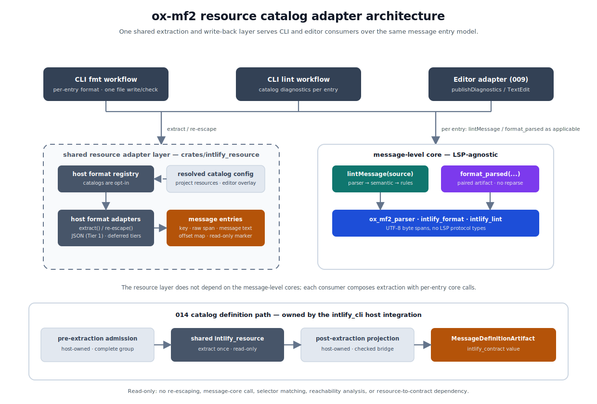
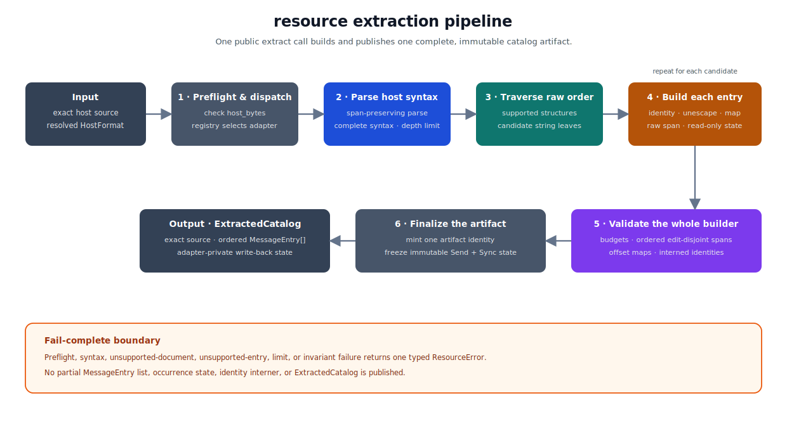
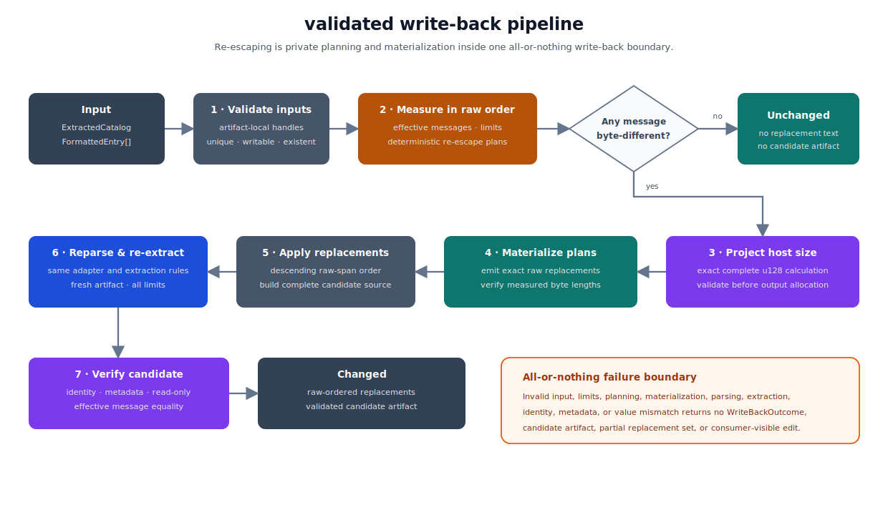

# ox-mf2 Resource Catalog Adapter Design

## Purpose

This document tracks the detailed design of the shared resource catalog adapter layer for ox-mf2: extraction of MF2 message entries from multi-entry host files such as JSON catalogs, mapping between message text and raw host documents, write-back re-escaping, and the CLI resource workflows that formatting and linting build on that layer.

The Phase 3 tooling boundary is defined in [005-ox-mf2-phase-3-tooling-transport-design.md](./005-ox-mf2-phase-3-tooling-transport-design.md). That document treats resource files, framework-specific i18n files, and multi-locale catalogs as layered consumers of the message-level formatter and linter. The formatter-side expectations are recorded in [007-ox-mf2-phase-3b-formatter-design.md](./007-ox-mf2-phase-3b-formatter-design.md#resource-and-catalog-formatting), the linter-side expectations in [008-ox-mf2-phase-3c-linter-design.md](./008-ox-mf2-phase-3c-linter-design.md#resource-and-catalog-linting), and the editor-side consumption in [009-ox-mf2-phase-3d-lsp-editor-design.md](./009-ox-mf2-phase-3d-lsp-editor-design.md). This document is the dedicated resource adapter design those documents defer to.

The message entry model and the host format adapter contract were first drafted from the editor perspective. This document owns them as consumer-neutral contracts; [009-ox-mf2-phase-3d-lsp-editor-design.md](./009-ox-mf2-phase-3d-lsp-editor-design.md) retains only editor-specific behavior over the same contracts. Resource catalog support is a layered milestone on top of the Phase 3 products, not itself a numbered Phase 3 product phase.

## Terminology

ox-mf2 documents reserve encode and decode for Binary AST snapshot encoding and decoding, defined by [003-ox-mf2-phase-2-binary-ast-snapshot-design.md](./003-ox-mf2-phase-2-binary-ast-snapshot-design.md). To keep those words unambiguous, this layer names its string conversions differently:

- **raw text**: bytes as they appear in the host file, addressed by raw host value spans.
- **message text**: the exact MF2 message string that an i18n runtime would receive from the host format; the input to message-level core APIs.
- **unescaping**: the host-format-specific conversion from raw text to message text. It covers string escapes, quoting and scalar styles, XML entities, and CDATA sections.
- **re-escaping**: the write-back conversion from formatted message text to replacement raw text.

LSP position encodings in [009-ox-mf2-phase-3d-lsp-editor-design.md](./009-ox-mf2-phase-3d-lsp-editor-design.md) are protocol terminology, unrelated to either conversion.

## Goals

- Define one consumer-neutral message entry model and host format adapter contract shared by CLI formatting, CLI linting, and editor adapters.
- Fix one shared implementation home for catalog assignment and top-level host-format resolution, span-preserving parsing, extraction, offset mapping, and write-back re-escaping.
- Define catalog opt-in configuration as part of the unified project config so CLI and editor surfaces resolve identical project-configured catalog membership, while allowing an editor to add an explicitly editor-only ad-hoc overlay.
- Define the CLI resource workflows: input selection, per-entry formatting and linting, result reporting, write-back composition, and `fmt --check` semantics.
- Keep the message-level parser, formatter, and linter cores unchanged; the resource layer and its consumers compose them.
- Keep observable CLI output deterministic, following the shared Phase 3A output conventions.

## Non-Goals

- Implementing every candidate host format at once; host formats arrive in tiers behind one adapter contract.
- Owning host-format syntax validation, host-format schema validation, or host-format styling. JSON, YAML, and XML syntax errors and document layout belong to host-format tooling.
- Catalog-level and cross-locale rules such as duplicate catalog keys, key parity, or missing translations in the initial milestone. The entry model must support them later, but their rule design is future work.
- Extracting MF2 messages from executable JS/TS catalog modules. Extraction from code requires host-language semantic analysis that this layer does not own; bundler and build tooling own that surface.
- A third-party host format adapter plugin API in the initial resource milestone. The initial host format registry is a built-in, per-release set; the future extension direction is tracked in [Deferred Follow-Up Notes](#deferred-follow-up-notes).
- Editor-specific behavior. Document lifecycle, versions, position encodings, publish timing, staleness handling, and editor edits remain owned by [009-ox-mf2-phase-3d-lsp-editor-design.md](./009-ox-mf2-phase-3d-lsp-editor-design.md).
- Defining combined `intlify check` behavior. As specified by [006-ox-mf2-phase-3a-tooling-foundation-design.md](./006-ox-mf2-phase-3a-tooling-foundation-design.md), that command remains outside v0.1 and belongs to a dedicated post-v0.1 addendum, including extraction sharing, the combined result schema, summary aggregation, and exit-code composition.
- Nested config discovery, nearest-config-wins behavior, and per-catalog formatter or linter option overrides.

## Architecture



The resource layer sits beside the message-level cores, not on top of them. It depends only on host-format parsing and produces message entries; it does not call the parser, formatter, or linter itself. Consumers — the CLI fmt workflow, the CLI lint workflow, and editor adapters — compose extraction with per-entry message-level core calls and own their surface-specific presentation.

That ownership also applies to concurrency. Resource APIs are synchronous and thread-safe, while the CLI owns the bounded worker runtime, physical-file-group scheduling, and deterministic aggregation. Editor adapters retain their separate document-lifecycle scheduling model.

The architecture overview intentionally collapses host adapter work into `extract` and re-escaping. Their complete fail-safe flows are expanded under [Extraction](#extraction) and [Write-Back Re-Escaping](#write-back-re-escaping). Re-escaping is not a consumer-callable operation by itself; it runs only inside the integrated validated write-back boundary.

## Message Entry Model

A message entry is the unit that connects one host document region to one MF2 message. An entry consists of:

- a stable concrete entry key
- a catalog-key comparison domain
- a logical catalog key for future catalog-level grouping
- a raw host value span, as a host-document UTF-8 byte range
- MF2 message text
- a message-to-raw offset map
- a read-only marker for values that cannot be safely re-escaped

Consumer-neutral invariants:

- Extraction returns entries in strictly increasing raw span start order. Raw value spans of different entries must be edit-disjoint under the replacement rule below, not merely non-overlapping as mathematical half-open sets.
- Message text must be the exact string value that an i18n runtime would receive from the host format. Adapters must not trim, normalize, or append to message text; per the [Phase 3B file framing contract](./007-ox-mf2-phase-3b-formatter-design.md#file-framing), message-level core APIs never receive an injected final newline or lose message-leading content.
- A candidate host string whose unescaped value or structural identity cannot satisfy these invariants fails complete extraction with `resource_entry_unsupported`; it is never silently omitted. This includes JSON escape sequences that denote unpaired surrogates within that candidate's value or structural path until the parser-level source-text direction noted in [002-ox-mf2-phase-1-rust-parser-design.md](./002-ox-mf2-phase-1-rust-parser-design.md) supports them.

This fail-complete rule is intentional even for a large catalog with only one unsupported candidate. `readOnly` is not an escape hatch for an entry whose `message_text`, structural identity, or offset map cannot be constructed: it represents an otherwise complete entry that can be analyzed but not safely re-escaped. Returning only the representable entries would make lint output look complete while silently omitting part of the opted-in catalog. Supporting partial analysis would require a separately designed rejected-entry result model and incomplete-result semantics; the initial artifact therefore returns neither a partial entry list nor a partial lint or format result.

Standalone `.mf2` files reuse this model's behavioral shape as a degenerate single-entry host document, but not its concrete resource artifact or `MessageEntry` type. The editor-owned standalone artifact carries the empty `StructuralPathKey`, `occurrence: 0`, `CatalogKeyDomain::StandaloneMf2`, and the empty `CatalogKey`; its document URI remains the external namespace for cache and diagnostic identity, and it never participates in catalog-level grouping. Its map is not unconditionally the identity: the editor adapter applies the Phase 3B [File Framing](./007-ox-mf2-phase-3b-formatter-design.md#file-framing) read contract and retains any removed BOM and trailing newline in its own framing-aware document map. When the framed standalone message is empty, that map follows the shared empty-message-anchor behavior below and places the anchor after a removed BOM and before a removed trailing newline. The editor exposes standalone and catalog entries through one editor-local read-only entry view containing the common identity, message text, raw span, read-only state, and `map_span` behavior. Catalog-only `EntryHandle` and integrated resource write-back remain outside that view. This uniform per-message view is an editor-workflow concern owned by [009-ox-mf2-phase-3d-lsp-editor-design.md](./009-ox-mf2-phase-3d-lsp-editor-design.md). CLI formatting and linting keep their existing direct `.mf2` file paths unchanged; resource workflows neither apply standalone file framing to embedded messages nor reroute standalone message files through catalog extraction.

### Rust Types and Mapping API

The workspace-internal Rust contract uses resource-owned UTF-8 byte span and entry identity types. `crates/intlify_resource` does not reuse `ox_mf2_parser::Span`, because the resource crate must not depend on the parser crate even though both span types use the same half-open `u32` representation.

```rust
#[derive(Debug, Default, Clone, Copy, PartialEq, Eq, Hash)]
pub struct Utf8ByteSpan {
    pub start: u32,
    pub end: u32,
}

#[derive(Debug, Clone, PartialEq, Eq, Hash, PartialOrd, Ord)]
pub struct StructuralPathKey(Arc<str>);

#[derive(Debug, Clone, Copy, PartialEq, Eq, Hash, PartialOrd, Ord)]
pub enum CatalogKeyDomain {
    StandaloneMf2,
    JsonPointer,
    YamlTypedPath,
    Xliff12,
    Xliff2,
}

#[derive(Debug, Clone, PartialEq, Eq, Hash, PartialOrd, Ord)]
pub struct CatalogKey(Arc<str>);

#[derive(Debug, Clone, PartialEq, Eq, Hash, PartialOrd, Ord)]
pub struct EntryKey {
    structural_path: StructuralPathKey,
    occurrence: u32,
}

#[derive(Debug, Clone, Copy, PartialEq, Eq, Hash)]
pub struct EntryHandle {
    // Private process-unique u64 artifact identity and u32 entry index.
}

#[derive(Debug, Clone)]
pub struct MessageEntry {
    handle: EntryHandle,
    key: EntryKey,
    catalog_key_domain: CatalogKeyDomain,
    catalog_key: CatalogKey,
    display_key: Option<Arc<str>>,
    raw_value_span: Utf8ByteSpan,
    message_text: String,
    offset_map: MessageOffsetMap,
    read_only: bool,
}

#[derive(Debug, Clone)]
pub struct MessageOffsetMap {
    // Private validated segments and an empty-message raw anchor when applicable.
}

#[derive(Debug, Clone, Copy, PartialEq, Eq)]
pub enum OffsetMapError {
    Reversed { start: u32, end: u32 },
    OutOfBounds { end: u32, message_len: u32 },
}
```

- `StructuralPathKey` provides construction from the adapter's serialized structural path and read-only string access; consumers do not mutate its representation. The empty string remains valid because it is the RFC 6901 identity of a JSON document-root value.
- One artifact-construction interner owns the exact UTF-8 payloads used by `StructuralPathKey`, `CatalogKey`, and non-absent `displayKey`. Equal byte strings share one `Arc<str>` allocation even when they occur in different fields or entries; the newtypes still preserve their semantic distinction. Matching is byte-exact with no Unicode normalization. The interner lookup table may be discarded after artifact publication because the entry fields retain the shared allocations. `message_text` is not interned and remains governed by its separate limits.
- `CatalogKeyDomain` identifies the comparison semantics of a catalog key independently of parser dispatch or outer host format. Equality of serialized `CatalogKey` strings is meaningful only when their domains are equal. JSON, JSONC, and JSON5 use `JsonPointer`; YAML uses `YamlTypedPath` even for an individual JSON-compatible path; XLIFF 1.2 uses `Xliff12`; and the structurally compatible XLIFF 2.0, 2.1, and 2.2 profiles use `Xliff2`. A composed Vue entry copies its inner adapter's domain rather than receiving a `Vue` domain. `StandaloneMf2` is non-comparable catalog metadata for the degenerate standalone shape and never enters catalog-level grouping. A future built-in adapter or profile may reuse an existing built-in domain only after its complete catalog-key equivalence is fixed by design and fixtures; otherwise it adds a fixed built-in domain variant. A third-party provider never selects, impersonates, or globally registers one of these variants; the future resource-owned domain-issuance contract is recorded in [Deferred Follow-Up Notes](#deferred-follow-up-notes).
- `CatalogKey` is the logical message identity used for future cross-locale grouping. It has read-only string access and is distinct from concrete host identity even when its serialized value is equal. JSON and YAML copy the structural path value; composed Vue entries copy the inner catalog key; XLIFF removes the final source/target side segment so both locale variants share one logical key. Consumers compare it only together with its `CatalogKeyDomain`; outer host-format equality alone neither establishes nor prevents comparability.
- `EntryKey` combines that structural path with a zero-based occurrence number. Its read-only accessors expose `structural_path()` and `occurrence()`. Equality, hashing, and ordering use both fields; no concatenated suffix representation is constructed internally or exposed publicly.
- `EntryHandle` is an opaque, artifact-local reference minted during extraction. Its private representation includes both a process-unique `u64` artifact identity and a `u32` entry index, so a same-index handle from another artifact is rejected rather than addressing the wrong entry. It remains `Copy`, is not serialized, persisted, or used as catalog identity, and consumers use it only with the `ExtractedCatalog` that returned the corresponding entry.
- Artifact identity `0` is reserved as invalid. A process-wide, thread-safe monotonic allocator assigns each successfully constructed artifact one value from `1..=u64::MAX` and never reuses it during that process, including after the artifact and its entries have been dropped. The allocator does not wrap. If no unused value remains, artifact construction fails with `internal_error`, `details.reason: "resource_artifact_identity_exhausted"`, and `details.phase` equal to `"extract"` or `"validate_write_back"` for the active construction. No artifact, candidate, replacement result, or partial target result is returned. Atomic ordering and allocation timing before publication are internal implementation details as long as concurrent construction cannot duplicate an identity.
- `message_text` is an owned `String`. Extraction artifacts must be cacheable and movable into per-entry parallel work without borrowing from a self-referential host-document object.
- `MessageEntry` fields are private and exposed through read-only accessors for its handle, concrete entry key, catalog-key domain, catalog key, optional display key, raw value span, message text, offset map, and read-only state. Consumers cannot mutate adapter-produced invariants or construct entries independently of an extraction artifact.
- That construction restriction applies to the concrete catalog type. The editor-owned standalone type independently validates its simpler framing contract and implements the editor-local common view; it does not construct, impersonate, or require a public constructor for resource `MessageEntry`, `EntryHandle`, or `MessageOffsetMap`.
- `raw_value_span` and every raw span inside the map use absolute host-document UTF-8 byte offsets. Message spans are relative to `message_text`.
- The map's crate-private builder uses an immutable segment sequence with `Identity`, `Unescape`, and `RawOnly` segment kinds plus one absolute empty-message raw anchor when `message_text` has zero bytes. It validates ordered, gap-free, non-overlapping coverage of every raw byte in `raw_value_span`; complete ordered coverage of message bytes; segment-kind length rules; UTF-8 boundaries; and the anchor invariant below. No raw gap is implicit: syntax that consumes no message bytes must be represented by `RawOnly`. Invalid adapter-produced maps are internal invariant failures.
- Consumers map core ranges through `MessageOffsetMap::map_span(Utf8ByteSpan) -> Result<Utf8ByteSpan, OffsetMapError>` rather than inspecting segments. Validation first returns `Reversed` when `start > end`, then `OutOfBounds` when `end` exceeds the map's complete message byte length. No UTF-8 scalar-boundary condition is imposed on an otherwise ordered in-bounds byte span. For a non-empty message, non-empty ranges apply the escape-boundary and raw-only-gap rules above; an empty span maps to the host position before the next message byte, or before trailing raw-only syntax when it is at message end, and an empty position inside the output of one `Unescape` unit maps to that unit's raw escape start. For an empty message, the only valid message span is `0..0`, and it maps exactly to `empty_message_anchor..empty_message_anchor` independently of segment coalescing. A returned `OffsetMapError` indicates internal consumer misuse of a published map and converts to `internal_error` with `details.reason: "resource_offset_map_failed"` and `details.phase: "map"`; the consumer includes the containing entry key when it invoked the map for a known entry.
- Inputs whose host or message text cannot be addressed by `u32` UTF-8 byte offsets fail with `resource_limit_exceeded` before entries are constructed.

No stable binding-facing resource entry or offset-map type ships in the initial milestone, because no resource N-API or WASM package is planned. A future concrete non-Rust consumer must receive a separately designed, camel-cased, read-only DTO derived from these Rust types rather than exposing the internal segment representation as an ABI contract.

## Host Format Adapter Contract

A host format adapter is the format-specific component that receives an already resolved host format, parses and interprets that host syntax, maps it into message entries, and re-escapes formatted message text back into host raw text. Catalog matching, assignment, extension classification, and top-level `HostFormat` resolution occur before adapter dispatch and are not adapter operations. A composed outer adapter may resolve a nested declaration such as Vue `lang` only to select an inner adapter for an already selected outer host; that embedded declaration resolution does not reclassify the top-level catalog target.

### Rust Registry and Extraction Artifact API

The consumer-facing Rust boundary is an opaque extracted-document artifact rather than a public adapter plugin trait or a stateless pair of extraction and re-escaping functions. Its conceptual signatures are:

```rust
pub enum ResourcePhase {
    Extract,
    ValidateWriteBack,
}

pub fn preflight_host_bytes(
    observed_bytes: usize,
    phase: ResourcePhase,
) -> Result<(), ResourceError>

HostFormatRegistry::resolve_format(
    &self,
    assignment: &ResolvedCatalogAssignment,
) -> Result<ResolvedHostFormat, ResourceError>

HostFormatRegistry::extract(
    &self,
    resolved: ResolvedHostFormat,
    source: Arc<str>,
) -> Result<ExtractedCatalog, ResourceError>

pub struct ResolvedHostFormat {
    // Private shipped HostFormat and exact retained target extension spelling.
}

ExtractedCatalog::source(&self) -> &str
ExtractedCatalog::entries(&self) -> &[MessageEntry]
ExtractedCatalog::build_and_validate_write_back(
    &self,
    formatted_entries: &[FormattedEntry<'_>],
) -> Result<WriteBackOutcome, ResourceError>

ExtractedCatalog::begin_candidate_message_admission(
    &self,
) -> CandidateMessageAdmission<'_>

CandidateMessageAdmission::admit_original(
    &mut self,
    entry: EntryHandle,
) -> Result<(), ResourceError>

CandidateMessageAdmission::admit_formatted_bytes(
    &mut self,
    entry: EntryHandle,
    observed_bytes: u64,
) -> Result<(), ResourceError>

CandidateMessageAdmission::finish(self) -> Result<(), ResourceError>

pub struct FormattedEntry<'a> {
    pub entry: EntryHandle,
    pub formatted_message: &'a str,
}

pub enum WriteBackOutcome {
    Unchanged,
    Changed(ValidatedWriteBack),
}

pub struct ValidatedWriteBack {
    replacements: Vec<RawReplacement>,
    candidate: ExtractedCatalog,
}

pub struct RawReplacement {
    entry: EntryHandle,
    span: Utf8ByteSpan,
    raw_text: String,
}
```

`CandidateMessageAdmission` is a resource-owned, target-local preflight for consumers that are producing formatter output incrementally. It retains only the next raw-order entry index, the running effective-message byte total, and the first admission state; it never owns message text. The consumer observes every artifact entry exactly once in raw entry order. `admit_original` selects the artifact's original message for an unselected, diagnostic-bearing, or read-only entry; a read-only handle is valid on this operation. `admit_formatted_bytes` selects a successful writable formatter output, rejects a read-only handle, and checks that entry's `message_bytes` before adding and checking `total_message_bytes`. `finish` succeeds only after every entry was observed without a limit failure. A foreign, repeated, skipped, or out-of-order handle, or a read-only handle supplied as formatted, is `internal_error` with `details.reason: "resource_invalid_entry_handle"` and `details.phase: "validate_write_back"`; these are consumer invariant failures rather than a second candidate ordering convention.

The admission methods construct the same typed `resource_limit_exceeded` value, original-entry site, and `phase: "validate_write_back"` details as integrated write-back. A bounded formatter outcome supplies `MAX_MESSAGE_BYTES + 1` as its first observed byte count, so the resource layer — not the formatter crate or CLI/editor adapter — owns the public error conversion. Once admission returns its first error, that admission object is terminal and may be dropped; the consumer may continue bounded formatter calls only to preserve formatter-operational-error precedence, without retaining their successful output. Successful admission is memory preflight, not write-back authorization: `build_and_validate_write_back` still validates the actual supplied strings and complete candidate independently.

`preflight_host_bytes` is the resource-owned entry point for the fixed `host_bytes` limit. A consumer that owns undecoded host bytes must call it before UTF-8 decoding. It converts `observed_bytes` exactly to the typed error counter, accepts the inclusive limit, and its first value over the limit returns `resource_limit_exceeded` with the supplied phase, `resource: "host_bytes"`, the fixed limit, `actual` equal to `observed_bytes`, and no site. The helper does not decode, classify, parse, or retain the input.

`HostFormatRegistry` contains the built-in, per-release adapter set. Catalog membership resolution first produces an opaque `ResolvedCatalogAssignment`. `resolve_format` consumes its read-only classification evidence without repeating membership or overlap resolution. A `Shipped` assignment returns an opaque `ResolvedHostFormat` containing the shipped `HostFormat` and the target path's exact retained extension spelling, including original case or `""` when no extension exists. `KnownButUnshipped` and `UnrecognizedExtension` return the complete typed extension-classified `resource_format_unsupported`, including normalized optional format id, that same exact extension spelling, and the registry's ASCII-ordered shipped top-level ids. That typed error has no source site or target path; the CLI or editor caller attaches its already owned logical path and projects the surface-specific result. Consumers must not reconstruct this error from assignment accessors independently.

`ResolvedHostFormat` fields are private and it has no public constructor. Its read-only `format()` accessor exposes the shipped `HostFormat` needed for workflow classification; the retained extension remains resource-owned error context rather than a second consumer-supplied argument. Moving the value into `extract` proves that registry dispatch and every nested adapter observe the same validated context. An explicit format assignment still retains the actual target extension instead of substituting that format's conventional extension, so an explicitly assigned Vue target named `component.VUE`, `messages.txt`, or `messages` retains `".VUE"`, `".txt"`, or `""` respectively.

The same resource-owned unsupported-format builder is used privately by composed adapters. A Vue embedded declaration supplies `classificationSource: "embedded"`, its normalized optional known id, exact decoded declared value or valueless marker, outer format, the target extension retained by `ResolvedHostFormat`, supported inner ids, and declaration site under the embedded contract below. This shares stable details construction without exposing an invalid `ResolvedCatalogAssignment`, accepting caller-reconstructed extension evidence, or rerunning project membership inside the adapter.

After `resolve_format` succeeds, `extract` dispatches `resolved.format()` to its corresponding built-in implementation and makes the complete resolved context available to composed adapters. Because third-party adapter providers are outside the initial milestone, concrete adapters and their dispatch trait or enum remain crate-private rather than becoming a public extensibility contract.

`HostFormatRegistry::extract` is therefore the consumer-facing resource-extraction facade, not the format-specific parser API. For each shipped `HostFormat`, `crates/intlify_resource` owns a built-in adapter that parses the host syntax, extracts entries into the shared artifact builder, attaches immutable format-specific mapping and write-back state, plans and materializes deterministic re-escaping, and participates in complete candidate reparse and re-extraction. The exact internal Rust interface may be a private trait, enum dispatch, or direct concrete calls and is deliberately not a compatibility surface. External crates cannot implement or register that interface in the initial milestone; adding a shipped format requires changing `crates/intlify_resource`, the shipped-only `HostFormat` and configuration schema, fixtures, and release contents together.

`HostFormatRegistry` and all built-in dispatch state reachable from it must be `Send + Sync`. Multiple threads may call `extract` concurrently on the same registry. Each call owns its artifact builder, host-parser scratch state, counters, interner, and resource-budget accounting; an adapter must not retain call-local mutable state in the registry or share it with another extraction. Process-wide state is limited to concurrency-safe facilities such as the artifact-identity allocator and must not make extracted content, entry order, error selection, or resource accounting depend on thread scheduling. Opaque process-unique artifact identities may reflect allocation order and are not deterministic report or cache identities.

Owned public resource values that may cross the consumer's scheduling boundary, including `ResolvedHostFormat`, `ResourceError`, `ExtractedCatalog`, and `WriteBackOutcome`, must be `Send`. Registry, resolved configuration, and artifact state intended for immutable sharing must be `Send + Sync`. These bounds are part of the crate contract rather than incidental auto-trait outcomes of the initial field layout.

One top-level `extract` call creates one private artifact builder. The builder owns the ordered entries, occurrence counters, identity interner, and cumulative resource budget for the complete artifact. A composed outer adapter invokes a private inner-adapter entry point with that same builder and the inner region's absolute source base; it does not call public `extract`, mint an inner artifact identity, or reset cumulative counters between regions. Inner parser state required for mapping or write-back may be attached privately to the outer builder. This private composition boundary keeps one published artifact and one set of artifact-wide invariants while reusing the same format-specific parsing and re-escaping implementations as top-level adapters.

`ExtractedCatalog` owns the exact original host source as `Arc<str>`, the `ResolvedHostFormat` context consumed by extraction, the ordered `MessageEntry` values, and immutable crate-private adapter state. That state retains any parsed structure, raw spelling, scalar style, outer/inner adapter composition, or other format-specific information needed for mapping and write-back without exposing it through `MessageEntry`. Candidate re-extraction reuses the artifact's retained resolved context and never reclassifies the candidate path or substitutes a conventional extension. The artifact contains no parser, formatter, or linter core result. As a defense for text-native and programmatic callers, `HostFormatRegistry::extract` begins by calling `preflight_host_bytes(source.len(), ResourcePhase::Extract)` before host parsing. This internal recheck does not replace the mandatory pre-decode call when a consumer starts from raw bytes.

Artifact construction validates all entry spans before `extract` returns: every `raw_value_span` must be on UTF-8 boundaries, contained in the original source, and ordered by strictly increasing start offset. Two non-empty spans may touch at one boundary but must not overlap. A zero-length span at `p` must have a distinct position from every other zero-length span, and `p` must not be inside or equal to either boundary of another entry's non-empty span. These edit-disjoint rules ensure that replacing non-empty spans and inserting at zero-length spans has one result independent of replacement ordering or protocol edit application. A violation aborts the complete extraction before any artifact or partial entry list reaches a consumer and maps to `internal_error` with `details.reason: "resource_adapter_invariant_failed"` and `details.phase: "extract"`. Host syntax errors remain `resource_parse_failed`; this invariant error indicates a built-in adapter defect, not invalid user input.

`FormattedEntry` is the complete bounded, successfully admitted formatter output for one selected writable entry, whether or not its text changed. A consumer omits an entry whose formatter result contains parser diagnostics, an unselected entry in an editor range request, and every read-only entry after retaining any parser diagnostics for reporting. After all selected formatter calls establish that no formatter operational error exists and candidate-message admission finishes successfully, the consumer passes all retained outputs together in one call to `build_and_validate_write_back`. An empty input is valid.

`build_and_validate_write_back` is the only consumer-callable re-escaping and candidate-construction boundary. It first validates every supplied handle against the artifact and rejects foreign, duplicate, nonexistent, or read-only inputs as `internal_error` with `details.reason: "resource_invalid_entry_handle"` and `details.phase: "validate_write_back"`; valid inputs are indexed by their artifact entry rather than processed in caller slice order. Adapter-specific re-escaping and replacement application remain private implementation steps, so CLI and editor consumers cannot bypass candidate limit checks or full validation by calling a lower-level method.

For valid input, the method first performs a measurement pass over every artifact entry in raw span order. At each entry it selects the supplied formatted message when present and otherwise the original message, checks `message_bytes`, updates and checks running `total_message_bytes`, and then privately plans re-escaping for a present byte-different formatted message. A plan validates every adapter-specific re-escaping condition and records the exact UTF-8 byte length of the complete raw replacement without allocating the replacement text. This gives the first failing raw-order entry precedence; at the same entry the per-message limit precedes the running-total limit, which precedes re-escaping-plan validation.

After the complete measurement pass, the method computes the one final projected `host_bytes` value from the original host length, all replaced raw-span lengths, and all measured replacement lengths. It does not reject an intermediate prefix that temporarily expands when a later replacement makes the complete candidate fit. Only when that final projection is within the inclusive host limit does a second raw-order pass materialize each planned `raw_text`, apply the replacements in descending raw-span order, and use the same built-in adapter composition to parse and extract the complete candidate host document again. Formatter operational errors precede both candidate-message admission errors and this entire method: if any selected formatter call fails operationally, the consumer selects the lowest raw-order formatter error under the parallelism rule below and does not begin write-back construction.

If no formatted input differs from its original message, the result is `WriteBackOutcome::Unchanged`; no re-escaping text, `RawReplacement`, candidate source, or candidate artifact is constructed. Otherwise `Changed` contains replacements ordered by original raw entry order and the complete validated candidate artifact. `ValidatedWriteBack` exposes read-only access to `replacements()` and `candidate()`, plus ownership-consuming access to the candidate. A `RawReplacement` privately retains only its original artifact handle, original span, and materialized raw text; it does not clone or retain the expected formatted message. Its read-only `span()` is exactly the entry's original `raw_value_span`, and `raw_text()` is the complete re-escaped host value for that span. Consumers cannot construct or mutate replacements independently of the integrated method. CLI consumers use the candidate source; editor consumers retain the replacements long enough to produce protocol edits and discard the candidate artifact only after the method succeeds.

As defense in depth, private replacement application revalidates each handle, its unchanged original span, uniqueness by entry, and the edit-disjoint span rules even though the integrated method makes violations unreachable through the public API.

Candidate validation requires the re-extracted `EntryKey`, `CatalogKeyDomain`, `CatalogKey`, optional `displayKey`, and `readOnly` sequences to equal their original sequences exactly. While the `FormattedEntry` borrows are still valid inside `build_and_validate_write_back`, the method compares each candidate entry's message text with its effective expected value: the caller-supplied formatted message when present, including a byte-identical one, otherwise the original artifact message. The borrowed lookup is discarded before return and is never copied into `RawReplacement`. Future consumer-visible entry metadata, such as intrinsic locale when it becomes part of an artifact, is equality-checked by default; the design that introduces a field must explicitly justify any candidate-time change rather than inheriting one accidentally.

Candidate extraction necessarily mints new `EntryHandle` values under a newly allocated artifact identity. Raw value spans, offset maps, raw spelling, the complete candidate source, and adapter-private parse state may also change as required by the validated replacements. Those artifact-local and source-coordinate changes never relax the equality requirements for consumer-visible identity and capability metadata above.

Candidate re-extraction first selects one failure under the same parser, traversal, resource-limit, and invariant order as original extraction; only then does the write-back boundary classify that selected failure. A resource overrun remains `resource_limit_exceeded` with `details.phase: "validate_write_back"`, because it is expected input-size handling. Artifact-identity exhaustion retains `resource_artifact_identity_exhausted`, and an invalid candidate offset map or other adapter invariant retains `resource_offset_map_invariant_failed` or `resource_adapter_invariant_failed`; each internal error uses `details.phase: "validate_write_back"`. These reasons diagnose the implementation component that violated its contract and are never hidden by the broader write-back reason.

A candidate failure that would have been user-actionable for a caller-owned original host — `resource_format_unsupported`, `resource_parse_failed`, `resource_entry_unsupported`, or `resource_document_unsupported` — instead becomes `internal_error` with `details.reason: "resource_write_back_failed"` and `details.phase: "validate_write_back"`, because the adapter generated this candidate after accepting the original artifact as writable. Re-escaping or replacement validation that cannot produce an acceptable candidate, and candidate identity, metadata, or effective-value mismatch, use that same reason. `resource_offset_map_failed` is reserved for consumer mapping through an already published map and cannot originate from candidate construction. Every failure returns no `WriteBackOutcome`, candidate artifact, or partial replacement set. A successful changed result contains the complete re-extracted `ExtractedCatalog` for the validated candidate, including its exact candidate source, entries, and offset maps.

Full-candidate validation is mandatory for CLI and editor consumers even when an editor changes only one entry. No size threshold, editor setting, or fast path may return unvalidated edits. Implementations may reuse immutable parse state or introduce incremental validation only when the optimized path establishes every invariant above and remains fixture-equivalent to complete reparse and re-extraction; this is an internal optimization, not a weaker API mode. Interactive cost is measured separately by the editor single-entry benchmark below rather than hidden inside aggregate write-back timing.

The artifact and every adapter state reachable from it must be `Send + Sync`. Extraction completes all mutable host parsing before publishing the artifact; concurrent read access, offset mapping, and independent `build_and_validate_write_back` calls do not mutate it. The source ownership and owned message strings make the artifact cacheable without self-referential borrows. `EntryHandle` has meaning only within its originating artifact, while stable cache and reporting identity continues to use `EntryKey`.

The exact `ResourceError` variants and their CLI operational-error mapping follow the resource error model below; this API does not expose CLI JSON error objects from the resource crate.

### Extraction



`HostFormatRegistry::extract` is one fail-complete pipeline:

1. **Preflight and dispatch.** A byte-owning consumer checks `host_bytes` before UTF-8 decoding, and `extract` repeats the check against the supplied `Arc<str>`. The registry-issued `ResolvedHostFormat` selects one built-in adapter while retaining exact target-extension context for composed errors and candidate re-extraction; registry dispatch does not repeat catalog membership or configuration resolution.
2. **Span-preserving host parse.** The selected adapter parses the complete host syntax while retaining raw token and value spans and enforcing the parser-local nesting limit. Value-only deserialization in the plain `serde` style is insufficient. For a composed adapter, the complete syntax boundary includes the outer syntax and, after every selected inner declaration resolves to a shipped adapter, every selected inner region under the composition precedence defined below. A syntax or depth failure returns before entry traversal.
3. **Raw-order traversal.** After a complete parse, the adapter walks supported and unsupported document structures and candidate string leaves in source order. This is the deterministic selection boundary for document features, entry representability, and resource-limit failures.
4. **Entry construction.** For each candidate, the shared artifact builder derives structural and catalog identity, assigns occurrence in raw order, unescapes the exact runtime message text, constructs the raw value span and offset map, records read-only state, and updates the cumulative budgets and interner. A composed outer adapter supplies absolute source bases to the same builder rather than publishing an inner artifact.
5. **Artifact-wide validation.** Before publication, the builder validates ordered edit-disjoint entry spans, complete offset maps, identity and occurrence invariants, and every artifact-wide limit across all composed regions.
6. **Finalization.** Only a complete valid builder receives one process-unique artifact identity and becomes an immutable `Send + Sync` `ExtractedCatalog` containing the exact source, ordered entries, and adapter-private write-back state.

Failure at any stage returns one typed `ResourceError`. No partial entry list, partially consumed resource budget, or incomplete artifact becomes observable to a consumer.

### Entry Identity

- `StructuralPathKey` is a serialized host path whose token boundaries and key payloads are unambiguous under its format contract. JSON adapters use RFC 6901 JSON Pointer, so the literal catalog key `"a.b"` and the nested path `a` → `b` remain distinct even when a runtime flattens both to `a.b`. RFC 6901 tokens intentionally do not encode the containing JSON node kind: an object member named `"0"` and array index `0` at the same token path share one structural-path string. YAML adapters instead use a typed structural path that distinguishes mapping keys from sequence indices and preserves each scalar key's resolved tag and value; a candidate string below an initially unsupported complex mapping key fails extraction with `resource_entry_unsupported` and `details.reason: "structural_path_unsupported"`. A YAML adapter may use JSON Pointer serialization only for JSON-compatible, string-keyed paths. Thus a YAML string key `"1"`, integer key `1`, and sequence index `1` cannot collide.
- `EntryKey` is the unique occurrence identity, not a display string. For every set of extracted entries with the same structural path, adapters assign `occurrence` in raw source order starting at `0`. An entry whose path appears only once still carries `occurrence: 0`; the field is never omitted or inferred from duplication discovered later.
- When a host document contains duplicate keys or duplicate ancestor paths, each raw leaf occurrence is a separate entry. Numbering is over entries with the same complete structural path, so nested duplicates remain unambiguous without including byte offsets in identity. Reporting duplicate catalog keys as a problem is future catalog-level linting, not an extraction failure.
- `CatalogKey` represents the runtime-style logical message independently of a concrete host role. JSON and YAML set it to the same serialized value as `StructuralPathKey`; formats whose host identity contains locale-role syntax may derive a different value under an explicit format contract. Future cross-locale grouping uses `CatalogKeyDomain` and `CatalogKey` together with comparison scope and locale. Consequently, equal JSON Pointer tokens compare as one logical JSON key even when one catalog reaches the final numeric token through an object and another through an array. A host duplicate-key rule instead groups by `StructuralPathKey` without occurrence, so distinct XLIFF source and target roles are never duplicates merely because they share a catalog key. Occurrence and concrete evidence always use `EntryKey`.
- Adapters may additionally expose a human-oriented display key for UI and reporting purposes, but omission is the default. Before an adapter emits one, its format-specific contract must define a deterministic derivation and collision behavior; an implementation-only convention is not sufficient. The Tier 1 JSON adapter does not emit `displayKey`, because its JSON Pointer structural path is already suitable for display. Consumers use that path when a JSON entry needs a human-readable label. Reporting, editor diagnostic identity, and message cache identity use the complete `EntryKey`; display identity never replaces either stable key type.

YAML serializes its typed structural path as a pointer whose root is the empty string. Each path step appends `/` followed by one typed segment, with `~` encoded as `~0` and `/` as `~1` inside the complete segment, matching RFC 6901 escaping. No percent encoding, Unicode normalization, or display-key flattening is applied. Initial segment forms are:

| YAML path step      | Unescaped typed segment         | Example serialized path |
| ------------------- | ------------------------------- | ----------------------- |
| string mapping key  | `k:str:<resolved string>`       | `/k:str:greeting`       |
| null mapping key    | `k:null`                        | `/k:null`               |
| boolean mapping key | `k:bool:true` or `k:bool:false` | `/k:bool:true`          |
| integer mapping key | `k:int:<canonical integer>`     | `/k:int:1`              |
| float mapping key   | `k:float:<canonical float>`     | `/k:float:15e-1`        |
| sequence index      | `i:<zero-based decimal index>`  | `/i:1`                  |

String payload is the exact resolved Unicode scalar sequence; for example, key `a/b~c` produces `/k:str:a~1b~0c`. Integer canonical form is arbitrary-precision base-10 with no leading plus sign or redundant leading zeroes, and every zero spelling becomes `0`. A finite float is normalized as an exact base-10 coefficient and exponent: the coefficient has no leading or trailing zeroes, the exponent has no leading plus sign or redundant zeroes, and zero, including negative zero, is `0e0`; for example `1.0` becomes `1e0`, `1.50` becomes `15e-1`, and `1e3` remains `1e3`. Positive infinity, negative infinity, and NaN are `.inf`, `-.inf`, and `.nan`. This normalizer is resource-owned and must not use dependency debug or display formatting.

Different source spellings with the same resolved Core tag and value therefore share one structural path and receive distinct occurrence numbers, while a string key `"1"`, integer key `1`, and sequence index `1` remain `/k:str:1`, `/k:int:1`, and `/i:1`. Explicit supported Core tags use the same resolved-type serialization. A complex mapping key has no initial segment form and causes the previously defined `resource_entry_unsupported` failure instead of receiving an opaque or lossy path.

### Message-to-Raw Offset Mapping

Each entry carries a monotonic offset map that aligns message-local UTF-8 byte ranges of the message text with raw host UTF-8 byte ranges inside the raw value span.

- Every raw byte in `raw_value_span` belongs to exactly one map segment. The map has no unrepresented raw gaps; an empty raw value span is covered by the empty segment sequence.
- A map whose complete message length is zero must carry exactly one `empty_message_anchor`; a map with a non-empty message must not carry one. The anchor is an absolute host UTF-8 byte boundary satisfying `raw_value_span.start <= anchor <= raw_value_span.end`. It identifies the adapter-defined logical insertion or caret position between leading and trailing host syntax when segments alone cannot distinguish that boundary. For an empty raw value span, the anchor is necessarily its single start/end position. The anchor is fixed-size per-entry state bounded by the entry limit and does not consume an offset-map segment or identity-byte budget.
- Canonical form maximally coalesces adjacent `Identity` segments when both their message spans and raw spans are contiguous. It likewise maximally coalesces adjacent `RawOnly` segments when their raw spans are contiguous at the same zero-length message position. `Unescape` segments are never coalesced with another segment: each atomic unescaping unit remains exactly one segment even when adjacent units could be represented by one larger monotonic range. The builder canonicalizes incrementally before validation, publication, and resource accounting. Coalescing may cross the independent empty-message anchor's raw position and never changes that anchor.
- Runs where message text bytes equal raw bytes share one identity segment.
- Each atomic unescaping unit — a single host escape, multiple escapes that jointly unescape to one scalar such as a JSON UTF-16 surrogate pair, or an XML entity — is one segment mapping the message text bytes to the full raw escape range.
- Raw-only syntax such as string quotes and CDATA delimiters remains inside the raw value span used for replacement but consumes no message text bytes. Offset maps retain these boundary gaps so diagnostic ranges do not consume delimiters. When the entry shape is reused by the standalone editor adapter, removed file framing is represented by the same kind of raw-only boundary gap.
- Each adapter derives an empty-message anchor from syntax tokens rather than guessing from a coalesced raw-only span. Quoted JSON, JSON5, and YAML values place it after the opening delimiter and before the closing delimiter or other trailing raw-only syntax. An empty YAML block scalar uses its token-defined first logical content position after leading header and indentation syntax. A composed adapter lifts the inner anchor by the same absolute source base as its spans. Format-specific sections may define a more specialized position, such as XLIFF content below.
- A message-local position that falls inside the output of one escape maps to the raw escape start when it is a range start and to the raw escape end when it is a range end, so mapped ranges never split a host escape sequence.
- Byte positions need not be Unicode scalar boundaries. Inside an `Identity` segment they retain their byte-relative offset; inside an `Unescape` segment they use the escape-boundary rule above. `map_span` never clamps, swaps, or otherwise repairs an invalid caller range.

### Write-Back Re-Escaping



Re-escaping is private adapter work inside `ExtractedCatalog::build_and_validate_write_back`; consumers cannot request an unchecked raw replacement. The integrated pipeline is:

1. **Validate inputs.** Every supplied `EntryHandle` must belong to the artifact, exist once, and identify a writable entry. The method indexes valid inputs by artifact entry, so caller slice order cannot affect behavior.
2. **Measure in raw order.** For every artifact entry, the method chooses the supplied formatted message or the original message, checks per-message and running-total limits, and creates a deterministic re-escaping plan only for byte-different writable input. Planning verifies representability and records the exact raw output length without allocating output-sized text. If no supplied message differs, the method returns `WriteBackOutcome::Unchanged` without replacements or a candidate artifact.
3. **Project the complete candidate size.** For changed input, one exact `u128` calculation combines original host bytes, removed raw spans, and every measured replacement length. The complete projection, not an expanding intermediate prefix, must satisfy `host_bytes` before output allocation begins.
4. **Materialize the plans.** Each accepted plan emits the exact raw replacement text and must match its measured length and serializer branch.
5. **Apply replacements.** The method revalidates handles and edit-disjoint spans, applies replacements in descending raw-span offset order, and constructs one complete candidate host source.
6. **Reparse and re-extract.** The candidate runs through the same adapter composition and extraction contract, including all syntax, representability, mapping, identity-budget, and resource-limit checks, and receives a fresh artifact identity.
7. **Verify candidate equivalence.** Candidate entry identity, catalog-key domain and key, display identity, read-only state, and every effective message value must equal the original artifact plus the supplied formatted messages. Only then does the method return `WriteBackOutcome::Changed` with raw-ordered replacements and the validated candidate artifact.

Any failure returns no `WriteBackOutcome`, candidate artifact, partial replacement set, or consumer-visible edit. Candidate failures are classified only after the normal extraction failure order selects one cause: resource limits and the dedicated artifact, offset-map, and adapter invariant reasons remain specific, while generated-host acceptance or equivalence failures use `resource_write_back_failed` as defined above. This validation is identical for CLI write, check, stdin, and editor formatting; those consumers differ only in how they use the successful outcome.

- Re-escaping must be value-identical: unescaping the re-escaped text must produce exactly the formatted message text.
- Re-escaping should preserve the host value style, such as quoting or scalar style, when that style can represent the formatted text. Otherwise the adapter may switch to a style that can, while keeping the host document semantically identical outside the message value.
- When the adapter cannot guarantee value-identical re-escaping for a host construct, extraction marks the entry read-only. The formatter still evaluates read-only message text so parser diagnostics remain visible, but it discards successful formatted output and never turns it into a replacement or check difference.
- Every writable adapter provides one private deterministic re-escaping plan operation. Planning borrows the formatted message, chooses the exact serializer branch and host style, performs every value-representability check that materialization would perform, and computes the exact complete raw replacement byte length as `u64`. A plan contains only bounded metadata plus borrowed input; it must not allocate a buffer proportional to the measured output.
- Materialization runs only after document-wide candidate-size validation and emits from the previously validated plan. It reserves the measured length, must produce exactly that many UTF-8 bytes, and cannot choose a different style or serializer branch. A materialization failure or measured-length mismatch is `internal_error` with `details.reason: "resource_adapter_invariant_failed"` and `details.phase: "validate_write_back"`; no candidate or partial replacement result is returned.

### Extraction Failure Presentation

When the host document itself cannot be parsed, extraction fails for the whole document. Host syntax errors are never translated into MF2 diagnostics; host-format tooling owns them. The CLI reports `resource_parse_failed` as a target-local operational error, while editor adapters treat that code as a transient host-editing state and retain the last successful MF2 diagnostic publication.

Other actionable resource input failures are not transient parse state. The CLI reports their stable operational codes below. For original extraction, an editor clears stale MF2 diagnostics and publishes one separate `ox-mf2-resource` diagnostic for format-, entry-, document-, or limit-related input failure. A `resource_limit_exceeded` raised only while validating a rejected write-back candidate is instead a request-scoped formatting failure: it returns no edits and does not change the installed document diagnostics, artifact, mapping, or generation state. Configuration and internal failures use the editor operational error channel and transactionally retain the last successful state. Exact editor publication and recovery behavior is owned by [009-ox-mf2-phase-3d-lsp-editor-design.md](./009-ox-mf2-phase-3d-lsp-editor-design.md); every extraction failure returns no formatting edits and no partial artifact.

## Host Format Registry and Catalog Detection

Consumers resolve each input file or document to at most one host format adapter through a host format registry.

- Standalone MF2 classification runs before catalog membership. A `.mf2` file, or an editor document carrying the exact case-sensitive `messageformat2` language id, always uses the standalone workflow even when a broad project or ad-hoc catalog pattern also matches its path. That catalog match is inapplicable to the reserved standalone target rather than a format conflict; it never reroutes the file through resource extraction.
- Catalog host formats are strictly opt-in. Arbitrary JSON, YAML, or XML files must not be assumed to contain MF2 messages; a false positive reports wrong diagnostics on unrelated files and, worse, exposes them to formatting write-back. That is worse than requiring configuration.
- Project-configured catalog opt-in comes from the `resources` section of the unified project config defined below. Editor adapters may additionally layer the explicitly editor-only normalized ad-hoc catalog settings defined by [009-ox-mf2-phase-3d-lsp-editor-design.md](./009-ox-mf2-phase-3d-lsp-editor-design.md#configuration-sources) over that result under the fixed precedence below. Filename conventions never imply catalog membership: names such as `*.mf2.json` may be documented as recommended `include` patterns, but they are not automatic opt-in defaults in any tier.
- CLI resource workflows and editor adapters first resolve project-configured membership and host format identically. A project match is authoritative and cannot be reclassified by an editor setting. An overlapping ad-hoc match resolving to the same format is de-duplicated as the project-owned target; one resolving to a different format is an editor configuration error and never overrides or masks the project result.
- The ad-hoc layer may opt in only a document left unmatched by the resolved project configuration, including a path removed by a project catalog's `exclude`. Overlapping ad-hoc entries use the same rule: same-format matches de-duplicate and different-format matches are an editor configuration error. An invalid project configuration is reported before applying the overlay rather than being bypassed by it.
- An editor-only ad-hoc target is intentionally absent from CLI and CI processing until persisted in project configuration; editor integrations distinguish that state rather than presenting it as CI coverage.
- If overlapping catalog configuration maps one concrete file to multiple host formats, that is a configuration validation failure and therefore an operational error, not silent precedence. The conflict is evaluated from concrete selected or editor-open document paths rather than by attempting static glob-intersection analysis.

### Format IDs and Extension Classification

Registry ids are canonical lowercase ASCII strings. Extension-derived classification uses one platform-independent lexical rule over the final slash-separated basename of the normalized logical path; it does not delegate this compatibility surface to an OS path API. The final `.` starts an extension only when it is neither the first nor the last Unicode scalar value in the basename. A qualifying extension is the exact substring from that `.` through the end of the basename; otherwise the file has no extension and the retained original extension spelling is `""`. Thus `messages.json`, `.config.json`, and `messages..json` retain `.json`, while `.json` and `messages.` have no extension. Registry lookup compares a qualifying extension under ASCII case folding on every operating system, independent of filesystem case sensitivity, while operational-error details retain its original spelling. Initial and deferred mappings fixed by this design are:

| Registry id | Derived filename extensions | Tier |
| ----------- | --------------------------- | ---- |
| `json`      | `.json`                     | 1    |
| `vue`       | `.vue`                      | 2    |
| `yaml`      | `.yaml`, `.yml`             | 3    |
| `jsonc`     | `.jsonc`                    | 3    |
| `json5`     | `.json5`                    | 3    |
| `xliff`     | `.xlf`, `.xliff`            | 3    |

Classification keeps the fixed known-id vocabulary separate from adapters shipped in the current release:

```rust
pub enum KnownHostFormatId {
    Json,
    Vue,
    Yaml,
    Jsonc,
    Json5,
    Xliff,
}

pub enum HostFormat {
    Json,
}

pub enum HostFormatClassification {
    Shipped(HostFormat),
    KnownButUnshipped(KnownHostFormatId),
    UnrecognizedExtension,
}
```

`KnownHostFormatId` contains every canonical id fixed by this design, independent of release tier. `HostFormat` contains only adapters shipped in the current release and expands as tiers land. Extension classification returns `HostFormatClassification`; its input context retains the original extension spelling for error details. `HostFormatRegistry::resolve_format` converts `KnownButUnshipped` and `UnrecognizedExtension` into `resource_format_unsupported` before extraction, while a successful `Shipped(HostFormat)` result is wrapped with that retained extension as `ResolvedHostFormat` before reaching `extract`. An explicit config `format` deserializes directly to the shipped-only `HostFormat` and therefore fails schema validation rather than producing a deferred runtime classification; resolution still pairs that explicit format with the concrete target's actual retained extension.

For overlapping catalog definitions, each explicit format or extension-derived `Shipped`/`KnownButUnshipped` result contributes one format assignment. An `UnrecognizedExtension` match establishes catalog membership but contributes no assignment. If all contributed assignments name one canonical known id, that id wins and same-id definitions de-duplicate even when additional unrecognized matches exist. If no definition contributes an assignment, the opted-in target is `resource_format_unsupported` with omitted `format`. If assignments name two or more distinct known ids, the target is `catalog_format_conflict`; only definitions that contributed those actual assignments participate in earliest/later conflict-pointer selection. Thus a broad extension-derived definition may overlap a specific `format: "json"` override for an extensionless or arbitrary filename without poisoning that explicit classification.

For example, `.YML` derives canonical `yaml` on Linux, macOS, and Windows alike, while error details still preserve `.YML`. An explicit catalog `format` is schema-validated as an exact canonical id: aliases such as `yml` and `xlf`, uppercase values such as `JSON`, surrounding whitespace, and comma-joined values are invalid rather than normalized. `HostFormat`, the generated config schema, and `supportedFormats` expose only adapters shipped in that release, while extension classification may recognize a deferred id and report `resource_format_unsupported` until its adapter ships.

These filename rules also classify a catalog stdin virtual path. They do not apply to an embedded Vue `lang` declaration, whose exact ids and explicit `yml` alias are defined separately above, and they do not perform content sniffing.

Within an opted-in catalog document, the default extraction scope begins with every host-typed string leaf value, including string elements of arrays. The adapter then validates the candidate's path and unescaped value against the message-entry representability invariants above. If any candidate fails, extraction fails for the complete host document with `resource_entry_unsupported`; no partial artifact or entry list is returned, and linting, formatting, and write-back do not process that file. When multiple candidates fail, the error for the lowest raw source offset is selected deterministically.

Non-string scalars are outside the message-entry candidate set and do not produce an error. Future explicit key selectors intentionally remove matching strings from the configured extraction scope and likewise do not produce an error; they express a user-selected scope rather than an adapter coverage gap.

Locale identity is not required by per-entry formatting and linting, because parsing, formatting, and linting one MF2 message do not depend on locale. The future locale binding defined in [Locale Binding for Future Catalog Checks](#locale-binding-for-future-catalog-checks) associates locale metadata with entries for catalog-level and cross-locale lint rules without changing message extraction or message-level core APIs.

## Host Format Tiers

Host formats are introduced in tiers behind the same adapter contract. Tiers order implementation effort and ecosystem demand; they do not change the contract.

| Tier | Host formats | Status |
| --- | --- | --- |
| 1 | JSON catalogs (`.json`) | initial resource milestone |
| 2 | Vue SFC `<i18n>` custom blocks through adapter composition | deferred follow-up |
| 3 | YAML catalogs (`.yaml`, `.yml`); JSONC and JSON5 catalogs; XLIFF 1.2 / 2.x | deferred follow-up, demand-driven |

Only Tier 1 is implemented in the initial resource milestone. Tier 2 and Tier 3 formats are deferred and tracked in [Deferred Follow-Up Notes](#deferred-follow-up-notes). Their subsections below record contract-level design notes so the shared contracts stay tier-proof; they are not initial implementation commitments.

ARB, gettext PO, Java properties, and other interchange formats are unassigned demand-driven candidates rather than Tier 3 members. A candidate enters a tier only after its canonical registry id, extension mapping, extraction scope, structural and catalog identity, offset mapping, unsupported constructs, and value-identical re-escaping contract are designed together and added to `KnownHostFormatId` with fixtures.

### JSON Catalogs

JSON catalogs unescape RFC 8259 string escapes. The JSON Pointer entry identity rules above apply. An escape sequence in a candidate string value that denotes an unpaired surrogate fails extraction with `resource_entry_unsupported` and `details.reason: "message_text_unrepresentable"`. An unpaired-surrogate escape in an object member name fails with `resource_entry_unsupported` and `details.reason: "structural_path_unsupported"` only when that member lies on the path to at least one string value candidate; the position is the first such escape in the path. If that member's complete value subtree contains no string value candidate, its unrepresentable name remains outside extraction scope and does not fail the catalog. The parser frontend must therefore retain enough raw member-name structure to determine candidate reachability without first requiring every member name to become a Rust `str`; a dependency rejection caused only by such an out-of-scope unpaired surrogate must not become `resource_parse_failed`. Formatted multi-line MF2 output, such as a formatted matcher, re-escapes line breaks as `\n` escapes inside the single-line JSON string value.

Every JSON entry uses `CatalogKeyDomain::JsonPointer`.

JSON Pointer comparison is deliberately token-based rather than container-type-based. For example, `/items/0` denotes the same structural and catalog key whether `items` is an object with member `"0"` or an array whose first element is the message. If duplicate ancestors allow both concrete forms in one source, raw-order occurrence numbers keep their `EntryKey` values distinct while a future within-file duplicate rule groups the shared pointer without occurrence. A future rule that diagnoses cross-locale object-versus-array shape differences is a separate structural check and does not change entry or catalog identity.

The JSON adapter leaves `displayKey` absent for every entry. Human-readable output uses the entry's JSON Pointer `StructuralPathKey`; it does not invent dot-joined or array-index display syntax.

A JSON catalog may begin with exactly one UTF-8 BOM. The adapter retains its bytes at host span `0..3`, passes only the source after that BOM to the JSON syntax parser, and adds the three-byte base offset back to every parser span and error offset. The BOM is outside every entry and offset map, and write-back preserves it byte-for-byte. A second leading BOM or a BOM code point outside a JSON string is ordinary invalid JSON and produces `resource_parse_failed`; `U+FEFF` inside a string remains message data. A JSON catalog does not use standalone `.mf2` file framing: trailing `LF` or `CRLF`, missing final newline, and all other bytes outside replaced value spans remain unchanged.

For a JSON entry, `raw_value_span` includes both surrounding double quotes. The quotes are `RawOnly` offset-map segments, while the content between them maps through identity and unescape segments. For `""`, canonicalization may coalesce both raw-only quote segments, but the independent empty-message anchor remains at the byte position immediately after the opening quote. JSON has no alternate writable quote style in this adapter.

Re-escaping uses two exact paths:

- If the supplied formatted message is byte-identical to the entry's original `message_text`, the integrated write-back method produces no replacement for that entry. Existing optional escape spellings are therefore never normalized for an unchanged message.
- If the message changed, the private JSON re-escaping step serializes the complete formatted message into one canonical JSON string value. It does not attempt to align unchanged message characters with their original host escape spellings.

The canonical changed-value serializer emits the opening and closing `"` and applies these scalar rules in order:

- `U+0022` quotation mark becomes `\"`, and `U+005C` reverse solidus becomes `\\`.
- `U+0008`, `U+0009`, `U+000A`, `U+000C`, and `U+000D` use `\b`, `\t`, `\n`, `\f`, and `\r` respectively.
- Every other scalar from `U+0000` through `U+001F` uses `\u` followed by exactly four lowercase hexadecimal digits.
- `U+002F` solidus is emitted as `/`, not `\/`.
- Every other Unicode scalar value is emitted directly as UTF-8, including `U+003C`, `U+2028`, and `U+2029`; changed values are not converted to ASCII-only JSON. This is the top-level JSON rule. The private Vue inline embedding context overrides `U+003C` to `\u003c` as defined below without changing the resolved string value.

Rust `str` input cannot contain an unpaired surrogate, so a JSON host value that unescapes to one produces `resource_entry_unsupported` before this serializer is reached. The fixed serializer makes changed-value output independent of the host parser dependency and deterministic across CLI and editor consumers.

### Vue SFC `<i18n>` Custom Blocks

Single-file-component `<i18n>` blocks embed a catalog region inside a `.vue` host document. This is adapter composition: an outer adapter locates the block region and its declared language, an inner catalog adapter runs over the region text, and the offset maps compose into document coordinates. The entry model is closed under this composition; no new consumer-facing behavior is required.

Only a root-level SFC custom block whose raw opening-tag name is the exact ASCII byte sequence `i18n` is a resource block. The adapter performs no ASCII case folding, Unicode normalization, namespace/local-name extraction, or component-name normalization. `<I18N>`, `<I18n>`, and `<x:i18n>` are unrelated custom blocks and contribute no resource entries or resource error; an `<i18n>` nested inside `<template>` or another root block is not an SFC custom block and is likewise outside this adapter. Closing-tag matching and mismatched-tag errors remain outer SFC parser semantics, so an outer parser that validly pairs an exact `<i18n>` opening tag with a differently cased closing spelling still supplies the same selected block; the adapter does not parse the closing tag a second time.

Within a selected block, only plain static attributes whose raw names are exactly `lang`, `src`, or `locale` have resource meaning. Name matching performs no trimming or case folding. Case variants, namespace-qualified names, Vue directive forms such as `:lang`, `v-bind:src`, and `.locale`, and every other attribute are unrelated block metadata. They neither shadow nor supply the exact static attribute and may coexist with it. Thus `LANG="yaml"` or `:lang="'yaml'"` without an exact static `lang` follows the missing-`lang` JSON default, while `:src="path"` without exact static `src` remains an inline block. Static attribute values are the entity-decoded values returned by the span-preserving SFC parser; the existing value-specific exact comparison, valueless, and empty rules apply after that decoding.

Two plain static attributes with the same exact raw name, including two `lang`, `src`, or `locale` attributes, are invalid outer SFC syntax. The span-preserving frontend must report that duplicate during outer parsing, and complete extraction returns `resource_parse_failed` with `details.format: "vue"` before block enumeration. Case-distinct names such as `lang` and `LANG` are not duplicates under this rule; only the exact lowercase attribute has resource meaning. Other duplicate directive or attribute spellings follow the outer parser's syntax-error contract and likewise prevent extraction when that parser reports them.

The outer parser boundary must retain raw opening-tag and attribute names plus their spans instead of exposing only a normalized descriptor map. A parser dependency that folds those names must be wrapped or its raw syntax nodes used, so a dependency upgrade cannot silently broaden resource recognition. Exact `<i18n>` blocks are enumerated even when self-closing or content-empty; an SFC descriptor convenience option that drops empty custom blocks must be disabled or bypassed. An empty inline block consequently reaches its selected inner parser and follows that format's normal syntax result, while an exact `src` block continues to use the external-resource boundary below.

The initial Vue adapter extracts inline `<i18n>` blocks only. A block with a `src` attribute is an external-resource reference and contributes no entries to the `.vue` extraction artifact; the resource layer does not resolve its path, read it transitively, validate that it exists, or write through the SFC. The referenced file must independently match `resources.catalogs` and is then processed as its own catalog target by CLI and editor consumers. This explicit external-resource boundary prevents duplicate diagnostics and gives reads, errors, cache identity, and edits to the file that actually owns the message bytes. A `src` block is therefore intentionally outside the inline candidate set and is not `resource_entry_unsupported`.

A `src` block may have an empty content span or contain only HTML whitespace characters (`U+0009`, `U+000A`, `U+000C`, `U+000D`, and `U+0020`); that content is ignored as layout around the external reference. If any other character occurs between the block tags, extraction of the complete `.vue` target fails with `resource_document_unsupported`, `details.feature: "vue_src_with_inline_content"`, and a span covering the first non-whitespace character. The adapter never silently discards inline catalog data merely because `src` is present, and it never chooses inline content over the external-resource boundary.

Composition consumes only the inner adapters that have shipped when this tier lands: blocks whose language is JSON, the `<i18n>` block default, compose the Tier 1 JSON adapter, while `lang="yaml"` or `lang="json5"` blocks require their Tier 3 adapters. If an inline block declares an inner format whose adapter has not shipped, extraction of the complete `.vue` target fails with `resource_format_unsupported`; supported blocks in the same SFC are not returned as a partial artifact. A `src` block is interpreted as an external-resource reference before inner-format dispatch, so its `lang` does not trigger this error in the `.vue` target. Detecting non-whitespace inline content in that external-reference block remains a later document-traversal check.

Vue composition uses phase precedence rather than comparing every cross-phase failure by source position. After the complete outer SFC parse succeeds, the adapter enumerates blocks in absolute source order, excludes `src` blocks from the inline candidate set, and resolves the declaration of every inline candidate without invoking an inner parser. If any declaration is unsupported, the adapter returns the `resource_format_unsupported` whose declaration site starts first; no supported inner region is parsed. Only when every inline declaration resolves to a shipped adapter does the adapter parse all selected inner regions in absolute content-start order. The first inner syntax or depth failure in that order is returned, and no entry traversal starts until every selected inner parse succeeds. Candidate re-extraction uses the identical phase order. Consequently an unsupported declaration wins over an inner syntax error even when the syntax error occurs earlier in the SFC, while failures within either the declaration-resolution phase or inner-parse phase remain source ordered.

The outer adapter passes a private Vue-inline embedding context into inner write-back planning and materialization. For every changed JSON, JSON5, or YAML message value in an inline block, that context requires each `U+003C` less-than sign to be emitted as the format-valid escape `\u003c`; top-level adapters retain their normal serializer rules. JSON and JSON5 apply the substitution within their canonical changed string. YAML may preserve an original double-quoted style while using the escape, but a changed value containing `<` cannot use plain or single-quoted output and falls back to the canonical double-quoted form. An unchanged message retains its exact original raw spelling through the existing fast path.

This conservative all-`<` rule prevents a formatted value from materializing any new literal HTML/SFC end-tag opener, including `</i18n>`, without requiring the resource layer to duplicate parser-specific end-tag lookahead or case rules. Measurement uses the context-specific escaped byte length, materialization must emit that exact plan, and complete outer SFC reparse and re-extraction remain mandatory defense in depth. A valid changed message containing `<` must therefore produce a normal validated candidate rather than falling through to `resource_write_back_failed` merely because the top-level inner serializer would have emitted it literally.

An inline block with no `lang` attribute selects `json`. A present attribute is matched exactly without trimming or case folding: the recognized declarations are `json`, `json5`, `yaml`, and `yml`, with only `yml` normalized to the `yaml` registry id. A valueless or empty attribute, surrounding whitespace, values such as `JSON`, and unknown values do not fall back to JSON and do not trigger content sniffing; they produce `resource_format_unsupported`. Whether a recognized id is usable still depends on its inner adapter having shipped. These rules consume the static attribute value returned by the SFC syntax parser and never interpret Vue expressions as language declarations.

`jsonc` is intentionally not a Vue embedded-language declaration, even after the top-level JSONC adapter ships. An inline `lang="jsonc"` block therefore produces embedded `resource_format_unsupported`; a `.jsonc` file referenced through `src` may still be processed independently when that external path is opted into `resources.catalogs`. The Vue adapter never treats `lang="json"` as permissive JSONC.

A static `locale` attribute on an inline `<i18n>` block is the Vue adapter's documented provider for the future `locale: { "from": "host" }` binding. Once a catalog-level locale consumer enables that binding, every entry lifted from the block receives the attribute's exact static string as its host-provided locale. The value is not trimmed, canonicalized, or validated as BCP 47. An absent, valueless, or empty `locale` attribute leaves those entries without a host locale and follows the future missing-provider error contract rather than excluding them silently. Initial Tier 2 extraction, message-level linting, and formatting do not attach this value to `MessageEntry` or change behavior based on it. A `locale` attribute on a `src` block never propagates to the independently processed referenced catalog.

`crates/intlify_resource` owns the built-in Vue SFC outer adapter and the composition with inner catalog adapters. Consumers pass the complete `.vue` host document to the shared registry and must not locate `<i18n>` blocks independently. The outer adapter preserves the block content spans and declared languages, visits supported inline regions in absolute content-start order, and invokes each shipped inner adapter against the one outer artifact builder. The inner adapter emits lifted entries, final absolute offset-map segments, and private write-back state directly into that builder rather than publishing an intermediate `ExtractedCatalog`. This keeps embedded declaration resolution, extraction, resource accounting, and write-back identical across CLI and editor consumers.

For a lifted entry, `StructuralPathKey` remains the inner adapter's structural path and does not include a Vue block index or source offset. Entries are admitted in absolute raw span order, and the shared builder assigns `occurrence` across the complete SFC for each identical structural path. Thus the same `/greeting` path in two blocks becomes occurrences `0` and `1`. Only the completed outer artifact mints handles; it privately retains each entry's block identity and inner-adapter state for mapping and write-back, and no inner handle exists. `CatalogKeyDomain`, `CatalogKey`, and `displayKey` likewise remain the inner adapter's comparison, logical, and display identities but use the outer artifact's shared interner. A Vue artifact may therefore contain entries from more than one catalog-key domain when its inline blocks use different inner formats. This keeps the logical key free of block positions; the complete `EntryKey` intentionally reflects source order among duplicate occurrences.

Ownership of the outer adapter does not require the resource crate to implement Vue syntax parsing itself. It may use a dedicated parser dependency or a private workspace helper, provided that the helper exposes the span-preserving SFC syntax information required by the adapter and does not become a second consumer-facing extraction path.

Parse errors identify the adapter layer that rejected its source. Invalid SFC syntax produces `resource_parse_failed` with `details.format: "vue"` and no `outerFormat`. If the SFC is valid but an inline catalog is invalid, `format` is the normalized inner registry id and `outerFormat` is `"vue"`. In both cases, `offset`, `line`, and `column` are absolute coordinates in the complete `.vue` source after the outer adapter lifts an inner error position; no supported block is returned when another block fails to parse.

The same failing-layer attribution applies when an inner adapter returns `resource_entry_unsupported` or `resource_document_unsupported`: `format` names the inner adapter, `outerFormat` names `vue`, and the outer artifact lifts the primary unsupported position into absolute SFC coordinates. A failure in SFC structure itself instead uses `format: "vue"` and omits `outerFormat`.

### YAML Catalogs

YAML catalogs resolve entries from tag-resolved string scalars under the YAML 1.2 Core Schema. The adapter configures that schema explicitly and does not inherit a parser dependency's default or YAML 1.1 compatibility mode. Consequently plain `true`, `false`, `null`, and recognized numeric forms are non-string scalars, while values such as `yes`, `on`, and timestamp-shaped text remain strings unless an explicit supported tag changes their type. Fixtures lock these boundaries across dependency upgrades.

Every YAML entry uses `CatalogKeyDomain::YamlTypedPath`, including an entry whose individual structural path happens to be JSON-compatible.

An absent `%YAML` directive selects that fixed YAML 1.2 behavior, and a syntactically valid `%YAML 1.2` directive is accepted without changing it. Any other syntactically valid declared version, including `1.1` or a future version, fails complete extraction with `resource_document_unsupported` and `details.feature: "yaml_version"` at the directive token. The adapter neither switches schemas per document nor silently ignores the declaration. A malformed directive remains invalid host syntax and uses `resource_parse_failed` instead.

A YAML catalog may begin with exactly one UTF-8 BOM under the same source-preservation rule as JSON. The adapter retains bytes `0..3`, parses the source after them, and lifts every span and error offset by three bytes; write-back preserves the BOM byte-for-byte. Any later `U+FEFF`, including a second leading code point, is not framing and is passed to the YAML parser as ordinary source or scalar data. A parser rejection is `resource_parse_failed`, while a `U+FEFF` that the fixed YAML rules admit inside a string remains message text. YAML catalog processing does not apply standalone `.mf2` trailing-newline framing, so all bytes outside replaced scalar spans retain their exact line-ending spelling.

Explicit tags are restricted to the YAML 1.2 Core tag set: `tag:yaml.org,2002:str`, `null`, `bool`, `int`, `float`, `seq`, and `map`, including their standard `!!` shorthand. An explicit string tag therefore makes `!!str true` a string entry, while supported explicit non-string tags retain their declared types. A node carrying any local or global tag outside that set fails complete extraction with `resource_document_unsupported` and `details.feature: "custom_tags"` at the tag token; the adapter never ignores the tag and guesses from the underlying scalar or collection. A `%TAG` directive that is declared but never used does not fail extraction.

The initial YAML adapter accepts one YAML document only. An empty stream and one empty document are valid catalogs with zero entries. Encountering a second document fails complete extraction with `resource_document_unsupported` at that document's start; entries from the first document are not returned or processed. A document-end marker does not itself create another document, and an optional first document-start marker remains valid.

Duplicate mapping keys are preserved rather than rejected or collapsed. The adapter consumes a span-preserving node or event representation, traverses concrete values in raw source order, and compares mapping keys by the canonical resolved tag-and-value path serialization above. Every string leaf under an identical complete structural path becomes a separate entry with document-wide occurrences `0`, `1`, and so on, including leaves below duplicate ancestor mappings. A dependency mode that deserializes into a map, rejects duplicates before nodes can be inspected, or keeps only a runtime winner is unsuitable for this adapter. Extraction does not decide first-wins or last-wins runtime semantics; future catalog-level duplicate-key linting reports the ambiguity while each concrete raw value remains independently diagnosable and writable.

Plain, single-quoted, and double-quoted string scalars are read-write when this tier lands. Literal and folded block scalars produce correct offset maps for diagnostics but remain read-only for the entire initial YAML adapter milestone. Write support for block scalars is a separate follow-up milestone rather than a condition for shipping the Tier 3 YAML adapter.

For a block scalar, `raw_value_span` starts at the `|` or `>` indicator, includes the complete header and owned body lines, and ends before the first following token or line that is outside the scalar; a preceding explicit tag or anchor is outside that span. The header, its optional indentation and chomping indicators or comment, and each stripped body indentation prefix are `RawOnly`. Content bytes that survive resolution unchanged use `Identity`. Each physical line-break unit whose resolved form is a folded space or a retained line feed uses one `Unescape` segment, so a diagnostic never splits that transformation. Breaks removed by strip or clip chomping are `RawOnly`, while the one clip-retained break and every keep-retained break map to their corresponding message line feeds. Empty lines and more-indented lines follow the same YAML 1.2 folding rules rather than a simplified newline substitution.

The adapter must derive these segments from span-preserving block tokens, not by searching for decoded substrings after parsing. Failure to build a complete validated map for a supported block scalar is `internal_error` with `details.reason: "resource_offset_map_invariant_failed"`; it does not downgrade the diagnostic to the whole scalar. A valid block scalar is still returned as `read_only: true` and participates in normal per-entry linting and formatter evaluation. The formatter retains parser diagnostics but discards a successful formatted result, so only write-back and difference reporting are skipped under the shared read-only contract.

Multi-line plain, single-quoted, and double-quoted scalars remain read-write and require equally exact maps. Their `raw_value_span` covers the complete scalar presentation and owned continuation lines, including surrounding quotes but excluding a preceding tag or anchor. Quote delimiters, stripped continuation indentation, and non-value syntax are `RawOnly`; unchanged content runs are `Identity`; doubled single quotes, double-quoted escapes, and physical line breaks that resolve to a folded space or retained line feed are atomic `Unescape` segments. Each `LF`, `CRLF`, or `CR` physical break is one raw unit so a mapped range never splits `CRLF`. A double-quoted escaped line continuation, including its following indentation, produces no message bytes and is `RawOnly`. These maps are derived from parser tokens under the YAML 1.2 folding rules, never by substring search.

Formatting such a scalar follows the same original-style attempt and exact reparse check below. If a changed multi-line value cannot retain its original presentation exactly, the adapter replaces the complete raw scalar span with the canonical one-physical-line double-quoted form; tags, anchors, surrounding comments, and all bytes outside that span remain unchanged.

YAML re-escaping has the same unchanged-value fast path as JSON: when formatted message text is byte-identical to `message_text`, the integrated method produces no replacement for that entry. For a changed plain, single-quoted, or double-quoted scalar, a resource-owned style serializer first produces a candidate in the original style only when that style can represent the new value unambiguously in the scalar's existing syntactic context. The adapter reparses the candidate and accepts it only when the resolved tag remains string and the resolved value equals the formatted message exactly. If original-style construction or validation fails, it emits the resource-owned canonical double-quoted form instead. It never delegates spelling or style selection to a dependency emitter. Final full-document validation inside `build_and_validate_write_back` remains mandatory after these per-scalar checks.

The plain-style candidate is the formatted message verbatim and is attempted only for a single physical line with no C0 or C1 control character and no `U+2028` or `U+2029`; context-sensitive indicators, surrounding whitespace, comments, and implicit Core typing are left to the mandatory reparse/tag/value check. The single-quoted candidate has the same single-line character precondition, surrounds the value with `'`, and replaces each embedded `'` with `''`; backslashes and double quotes remain literal. Multi-line changed values therefore fall back to double-quoted form rather than relying on YAML folding.

The canonical double-quoted serializer emits one physical line with opening and closing `"` and applies these rules in order:

- `U+0022` quotation mark becomes `\"`, and `U+005C` reverse solidus becomes `\\`.
- `U+0008`, `U+0009`, `U+000A`, `U+000C`, and `U+000D` use `\b`, `\t`, `\n`, `\f`, and `\r` respectively.
- Every other scalar in `U+0000..U+001F` or `U+007F..U+009F` uses `\x` followed by exactly two lowercase hexadecimal digits.
- `U+2028` and `U+2029` use `\u2028` and `\u2029` so YAML does not interpret them as physical line breaks.
- `U+002F` solidus is emitted as `/`. Every other Unicode scalar value, including `U+003C`, is emitted directly as UTF-8 in a top-level YAML catalog; changed values are not converted to ASCII-only YAML and do not use optional YAML named escapes such as `\0`, `\a`, `\e`, `\N`, `\_`, `\L`, or `\P`. In the private Vue inline context, `U+003C` instead uses `\u003c` under the composition rule above.

The serializer then reparses this scalar under the fixed Core Schema and requires an exact string value match. An unexpected mismatch is `internal_error` with `details.reason: "resource_write_back_failed"`; it never falls through to another dependency-chosen spelling.

An anchor annotation on a directly defined node does not change that node's extraction: the scalar at the definition site produces its normal entry, and an anchor that is never referenced is accepted. Any alias node that is actually used fails complete extraction with `resource_document_unsupported` and `details.feature: "aliases"`, because silently omitting the alias path would diverge from the runtime catalog and expanding it would make multiple logical entries share one raw source value. YAML merge keys likewise fail with `details.feature: "merge_keys"`; for `<<: *defaults`, the merge-key token is the primary unsupported position rather than the nested alias token. No alias or merge expansion produces a partial or read-only entry in the initial adapter.

Block scalar entries graduate to writable only after the adapter supports value-identical re-escaping for both literal and folded styles; indentation indicators `1` through `9`; strip, clip, and keep chomping; empty and leading-empty content; trailing line breaks and trailing empty lines; and more-indented lines. Fixtures must reparse every generated candidate and compare its resolved string value with the formatted message text, and must prove formatting idempotency. Until those requirements land, linting reports mapped diagnostics normally; fmt also reports parser diagnostics, but write mode constructs no replacement and `--check` does not count a clean formatted difference.

Once that follow-up milestone makes block scalars writable, re-escaping uses a fixed fallback order. The adapter first preserves the original literal or folded style, adjusting indentation and chomping indicators as necessary, when reparsing produces the exact formatted message text. If folded style cannot represent that value identically, it switches to literal style. If literal style also cannot represent the value safely, it switches to double-quoted style. Every candidate is reparsed and accepted only on exact value equality; failure of all candidates is a `resource_write_back_failed` internal error and produces no file write.

### JSONC and JSON5 Catalogs

The `jsonc` adapter implements a fixed ox-mf2 profile over RFC 8259 JSON. It adds JavaScript-style `//` line comments and non-nesting `/* ... */` block comments wherever JSON whitespace is permitted, plus one optional trailing comma after the last member of a non-empty object or the last element of a non-empty array. It does not admit array elisions, `#` comments, single-quoted strings, unquoted member names, hexadecimal or non-finite numbers, or any other JSON5 syntax. This deliberately enables the trailing-comma option that the [JSONC specification](https://jsonc.org/) leaves profile-selectable rather than inheriting a parser default.

JSONC string values, member-name resolution, duplicate occurrence identity, optional single leading BOM, offset mapping, unchanged raw-spelling preservation, canonical changed-value serialization, and full candidate validation are exactly the Tier 1 JSON rules. Comments and trailing commas are host syntax outside string value spans and remain byte-identical during MF2 formatting. A parser dependency must retain their spans and duplicate nodes; stripping comments into a temporary JSON buffer without a complete source map is insufficient.

Every JSONC entry uses `CatalogKeyDomain::JsonPointer`, so its catalog key is comparable with an equal JSON or JSON5 key despite the different host parser grammar.

JSONC is a top-level catalog format only. It is not added to the Vue `<i18n>` inner-language allowlist; external `.jsonc` resources remain separate targets under the `src` boundary above.

The `json5` adapter implements the complete [Standard JSON5 1.0.0 grammar](https://spec.json5.org/), not an arbitrary JavaScript object-literal parser or a dependency-specific permissive mode. JSON5 comments, trailing commas, identifier member names, expanded number syntax, single- and double-quoted strings, additional escapes, and line continuations are accepted only as that grammar defines them. Non-string values remain outside the message candidate set. String and identifier member names resolve to their exact string value for JSON Pointer structural identity, so alternative spellings of one resolved name share a path and use occurrence numbering. A syntactically admitted quoted member name that cannot become a Rust string follows JSON's candidate-reachability rule: it is `structural_path_unsupported` only when it lies on a path to a string value candidate and otherwise remains outside extraction scope.

Every JSON5 entry uses `CatalogKeyDomain::JsonPointer`.

JSON5 follows its grammar's `U+FEFF` rule rather than the JSON-family single-leading-BOM rule. Any number of `U+FEFF` code points outside strings are ordinary token-separating whitespace at any permitted position and remain byte-identical in the host document; the adapter does not strip a leading instance before parsing. Inside a string, `U+FEFF` is message data. All absolute spans and errors therefore count every raw UTF-8 byte directly, and write-back leaves whitespace instances outside replaced value spans untouched.

For a JSON5 string entry, `raw_value_span` includes its exact single or double quote delimiters. Delimiters and a backslash plus its complete physical line-terminator sequence in a line continuation are `RawOnly`; unchanged content is `Identity`; every escape is one atomic `Unescape` unit, including compound UTF-16 surrogate escapes that resolve to one scalar. `CRLF` is never split. A string escape that resolves to an unpaired surrogate fails complete extraction with `resource_entry_unsupported` and `details.reason: "message_text_unrepresentable"`, matching JSON's UTF-8 representability rule.

JSON5 re-escaping preserves the complete original raw string byte-for-byte when the formatted message is unchanged. For a changed value, it retains the original quote delimiter and emits one physical line with these rules:

- The active delimiter becomes `\'` for a single-quoted string or `\"` for a double-quoted string. The other quote remains literal, and reverse solidus becomes `\\`.
- `U+0008`, `U+0009`, `U+000A`, `U+000C`, and `U+000D` use `\b`, `\t`, `\n`, `\f`, and `\r` respectively.
- Every other scalar in `U+0000..U+001F` or `U+007F..U+009F` uses `\x` followed by exactly two lowercase hexadecimal digits. In particular, changed output does not use context-sensitive `\0` or optional `\v`.
- `U+2028` and `U+2029` use `\u2028` and `\u2029`. Solidus is emitted as `/`.
- Every other Unicode scalar value, including `U+003C`, is emitted directly as UTF-8 for a top-level JSON5 catalog; output is not ASCII-only and never uses a line continuation. In the private Vue inline context, `U+003C` instead uses `\u003c` under the composition rule above.

The resource-owned serializer does not modify string or identifier member-name spelling because those tokens lie outside message value spans. The complete candidate is reparsed as Standard JSON5 1.0.0 and must preserve both key sequences and exact message values under the normal integrated write-back contract; a dependency generator is never used.

### XLIFF

XLIFF is an XML host format: XLIFF 1.2 stores message text in `<trans-unit>` `<source>`/`<target>` elements and XLIFF 2.x in `<unit>`/`<segment>` `<source>`/`<target>` elements. Entry keys serialize the file/group/unit and, where present, segment identity path. Unescaping covers XML entities, CDATA sections, and XML line-ending normalization; `xml:space` is retained as host metadata but does not cause adapter-defined text normalization.

The adapter selects one explicit profile from the root element's expanded namespace name and exact `version` attribute. The initial supported pairs are:

| Profile   | Root namespace                          | `version` |
| --------- | --------------------------------------- | --------- |
| XLIFF 1.2 | `urn:oasis:names:tc:xliff:document:1.2` | `1.2`     |
| XLIFF 2.0 | `urn:oasis:names:tc:xliff:document:2.0` | `2.0`     |
| XLIFF 2.1 | `urn:oasis:names:tc:xliff:document:2.0` | `2.1`     |
| XLIFF 2.2 | `urn:oasis:names:tc:xliff:document:2.2` | `2.2`     |

Namespace prefixes are arbitrary and do not participate in matching. A missing namespace or version, a mismatched pair, and an unknown future version are valid XML but unsupported XLIFF profiles and fail complete extraction with `resource_document_unsupported` and `details.feature: "xliff_version"`. Malformed XML remains `resource_parse_failed`. Adding another version requires an explicit tested profile; the adapter never assumes that an arbitrary `2.x` document has compatible structure. Profile selection recognizes the XLIFF structural vocabulary needed for extraction but does not turn this resource layer into a complete XSD or XLIFF constraint validator.

For an explicitly opted-in XLIFF catalog, every supported primary plain-text `<source>` and `<target>` element is an independent read-write MF2 entry. XLIFF 1.2 candidates are direct children of `<trans-unit>` in the 1.2 namespace; XLIFF 2.x candidates are direct children of `<segment>` in the selected 2.x namespace. Matching uses expanded names and exact parent relationships, not namespace prefixes or local names alone. The structural path contains an explicit `source` or `target` role segment after its unit or segment identity, so the two sides never rely on occurrence numbering merely to distinguish their roles. A missing side produces no synthetic entry. Formatting either side is permitted by the catalog opt-in and uses the same value-identical XML write-back contract; format-specific source/target selection is not added to the initial configuration.

`<source>` or `<target>` elements inside XLIFF 1.2 `<alt-trans>`, XLIFF 2.x `<ignorable>`, metadata, extension elements, or any other non-primary context are intentionally outside the candidate set. They produce neither entries nor unsupported-entry errors, even when their content is plain text. This is a semantic scope boundary rather than an adapter coverage gap: the initial adapter processes only the primary translation values that represent the catalog's active messages.

XLIFF also defines an intrinsic-locale source for the future `locale: { "from": "host" }` binding. For XLIFF 1.2, a primary source entry uses its effective `xml:lang` when present, otherwise its enclosing `<file source-language>`; a target uses effective `xml:lang`, otherwise `<file target-language>`. For XLIFF 2.x, the corresponding fallbacks are the root `<xliff srcLang>` and `<xliff trgLang>`. Effective `xml:lang` follows normal XML ancestor inheritance. The resolved string is preserved exactly without BCP 47 validation, case folding, or canonicalization. This metadata does not affect entry-level extraction, linting, or formatting and is consumed only when the future catalog linter explicitly enables host locale binding.

XLIFF workflow metadata such as `translate`, `state`, approval, or review attributes does not alter extraction or writeability. The resource layer is not a TMS state machine: it neither interprets version-specific inheritance as an edit lock nor changes status, timestamps, provenance, or approval after formatting. Those attributes remain outside the raw message span and are preserved byte-for-byte. An entry is read-only only when its host representation cannot satisfy value-identical re-escaping; explicitly opting the XLIFF file into formatter processing authorizes syntax-only formatting of otherwise writable primary source and target values.

XLIFF structural paths use the same slash-separated `~0`/`~1` escaping rule as the typed YAML pointer, with format-specific typed segments. XLIFF 1.2 uses a non-empty `<file original>` value for `file:original:<value>` and `<group id>` or `<trans-unit id>` for `group:id:<value>` and `unit:id:<value>`. XLIFF 2.x uses non-empty `id` values on `<file>`, `<group>`, `<unit>`, and `<segment>` as `file:id:<value>`, `group:id:<value>`, `unit:id:<value>`, and `segment:id:<value>`. Nested groups append one segment per level. The final segment is always `side:source` or `side:target`.

An absent or empty identity attribute uses `<kind>:i:<zero-based same-kind sibling index>`, such as `segment:i:0`; the adapter does not fail the document merely to enforce an XLIFF schema-required identity. Attribute payload is the XML-resolved Unicode value without trimming, case folding, or Unicode normalization before pointer escaping. Duplicate attribute identities deliberately produce the same structural path, and concrete entries receive document-wide occurrence numbers in raw source order. For example, representative paths are `/file:original:app.json/group:id:menu/unit:id:welcome/side:source` and `/file:id:f1/group:i:0/unit:id:u1/segment:id:s1/side:target`. A runtime-oriented `displayKey` may shorten this hierarchy, but reporting and cache identity use the complete path.

The XLIFF `CatalogKey` is that same serialized hierarchy with the final `side:source` or `side:target` segment omitted. XLIFF 1.2 entries use `CatalogKeyDomain::Xliff12`; XLIFF 2.0, 2.1, and 2.2 entries use `CatalogKeyDomain::Xliff2`. Thus both entries under one unit or segment share `/file:original:app.json/group:id:menu/unit:id:welcome` or `/file:id:f1/group:i:0/unit:id:u1/segment:id:s1` as their logical message identity while retaining distinct concrete `EntryKey` values. Source and target are comparable within one selected XLIFF profile family, while identical serialized strings from the structurally different 1.2 and 2.x families are not. Host locale binding can therefore compare source and target as locale variants without erasing their physical roles from diagnostics, caches, or write-back.

DTD processing is disabled before any entity resolution or external access. A well-formed `DOCTYPE` declaration fails complete extraction with `resource_document_unsupported` and `details.feature: "xml_dtd"` at `<!DOCTYPE`; the adapter never reads a system identifier, performs a network request, or expands an internal entity declaration. Malformed XML, including an incomplete declaration, remains `resource_parse_failed`. Text and identity attributes may use only the five predefined XML entities and decimal or hexadecimal numeric character references. Each reference is one `Unescape` offset-map segment; an undeclared named entity is invalid XML and produces `resource_parse_failed`. The byte sequence `<!DOCTYPE` inside a comment, CDATA section, or ordinary escaped character data is data rather than a declaration.

XLIFF input remains subject to the shared UTF-8 host-source contract and XML 1.0 processing rules. When Tier 3 XLIFF support lands, the CLI input layer checks a classified XLIFF target's raw prefix before generic UTF-8 decoding. A UTF-16 little-endian BOM (`FF FE`) or big-endian BOM (`FE FF`) produces `input_read_failed` with `details.reason: "unsupported_encoding"` and `details.detectedEncoding: "utf-16le"` or `"utf-16be"`; the target is not transcoded or passed to the adapter. BOM-less UTF-16 is not guessed and remains the normal `invalid_utf8` input failure. This preflight improves the error for common TMS output without introducing encoding-dependent span mapping or write-back.

After successful UTF-8 decoding, an absent XML declaration selects XML 1.0. A declaration must contain exact `version="1.0"`; any other syntactically valid version fails complete extraction with `resource_document_unsupported` and `details.feature: "xml_version"` at the version value. The adapter does not apply XML 1.1 character or line-ending rules.

The declaration may omit `encoding`; when present, the encoding name must equal `UTF-8` under XML's ASCII case-insensitive comparison. Any other syntactically valid encoding declaration fails complete extraction with `resource_document_unsupported` and `details.feature: "xml_encoding"` at the encoding value; the adapter does not transcode or ignore it. A malformed declaration, including one without its XML-required version, is `resource_parse_failed`.

Exactly one leading UTF-8 BOM is accepted, retained at bytes `0..3`, removed only for XML parsing, and added back to every span and error offset. Write-back preserves it byte-for-byte. A second leading `U+FEFF` is ordinary XML source and fails if the XML grammar rejects it, while an admitted `U+FEFF` inside `<source>` or `<target>` character data remains message text. XLIFF catalog processing does not apply standalone `.mf2` trailing-newline framing.

The message value is the exact XML character-data sequence after predefined or numeric entity resolution and XML line-ending normalization. The adapter never trims leading or trailing whitespace, collapses internal runs, removes formatting indentation, or appends a newline based on an effective inherited `xml:space` value. Both `default` and `preserve` therefore keep the same character sequence at this layer; applications may interpret that metadata later, but resource extraction cannot guess an application-specific whitespace policy while satisfying the exact-value contract.

Raw `CRLF` and `CR` units that XML normalizes to `LF` are atomic `Unescape` map segments, while a raw `LF` that survives unchanged is `Identity`. The same rule applies inside ordinary character data and CDATA. Attribute spelling, namespace declarations, and `xml:space` values remain outside message spans and are preserved byte-for-byte by write-back.

For a non-self-closing `<source>` or `<target>`, `raw_value_span` is the complete byte range between the end of the start tag and the start of the end tag. Entity references are atomic `Unescape` segments; CDATA opening and closing delimiters are `RawOnly`; CDATA and ordinary text bytes that survive XML processing are `Identity` or the line-ending segments above. Adjacent ordinary text, references, and CDATA chunks form one message and one offset map.

A self-closing `<source/>` or `<target/>` is a writable empty-string entry rather than an omission or read-only special case. Its `raw_value_span` is the complete self-closing element. All tag bytes are `RawOnly` and may coalesce, while the independent empty-message anchor is the byte position immediately before the closing `/>`. An unchanged empty value returns the original element byte-for-byte. If a non-empty replacement is ever requested, re-escaping removes only the terminal `/`, retains the exact raw qualified name, prefix, attributes, quoting, and whitespace in the resulting start tag, inserts canonical XML character data, and appends an end tag using that same qualified name. The full-document reparse must confirm the same entry identity and expected value before the expanded element can be written.

Any non-self-closing XLIFF entry whose resolved message is empty uses `raw_value_span.start` as its empty-message anchor, including an explicitly paired empty element, an empty CDATA presentation, and a read-only content slice containing only comments or processing instructions. For `<target></target>`, the content span itself is zero length at that insertion point and remains writable under the normal content replacement path. Replacement validation permits such zero-length spans but still rejects duplicate replacements for the same entry; distinct empty elements have distinct absolute insertion offsets.

XLIFF re-escaping preserves the complete original content slice byte-for-byte when the formatted message is unchanged. For a changed value, it replaces that entire content span with one resource-owned canonical XML character-data sequence; it does not align the new value to old chunks or retain CDATA boundaries and optional entity spellings. Canonical text applies these rules in order:

- `&` becomes `&amp;` and `<` becomes `&lt;`.
- `>` remains literal except when it would complete the forbidden character-data sequence `]]>`, in which case that `>` becomes `&gt;`.
- `U+000D` becomes the hexadecimal numeric reference `&#xd;` so reparsing does not normalize it to `LF`. Tab and `LF` remain literal.
- Quotes and apostrophes remain literal because the replacement is element content, not an attribute. Every other XML 1.0-permitted Unicode scalar is emitted directly as UTF-8.

The candidate content is reparsed in its complete XLIFF document and must resolve to the formatted message exactly. A formatted value containing a scalar that XML 1.0 cannot represent, or any unexpected value mismatch, is `internal_error` with `details.reason: "resource_write_back_failed"` and produces no candidate or partial write.

The initial XLIFF adapter extracts only primary candidates whose content is plain XML character data, including character data represented through entity references or CDATA sections. A candidate `<source>` or `<target>` that contains any inline child element, including character, standalone, paired, spanning, marker, or annotation elements, fails extraction with `resource_entry_unsupported` and `details.reason: "inline_content_unsupported"`. The generic resource adapter does not replace inline elements with sentinel placeholders or translate them into MF2 markup, because doing so would require format- and project-specific rules for identity, pairing, nesting, movement, deletion, and round-trip preservation.

XML comments and processing instructions inside an otherwise plain primary candidate are not inline elements and do not fail extraction. They contribute no message bytes and are `RawOnly`; character data before and after them is concatenated in document order into the exact message value. Because a changed canonical content replacement would delete or relocate that host metadata, the complete entry is marked read-only. It still produces normally mapped lint diagnostics, including ranges on either side of a raw-only gap. Formatter evaluation likewise retains parser diagnostics but discards successful formatted output, so write mode constructs no replacement and check mode reports no clean difference under the shared read-only contract. CDATA delimiters alone do not make an entry read-only because changed writable content may safely replace them with equivalent canonical character data.

Inline-element support, if a concrete project or TMS workflow requires it later, is introduced as a separate explicit XLIFF profile. That profile must define the XLIFF-to-MF2 representation, protected-edit semantics, validation rules, and lossless round-trip behavior before entries containing inline elements become extractable. Whether MF2 message text is carried inside XLIFF at all remains a project or TMS convention; the adapter processes only catalogs that configuration explicitly opts in.

## Catalog Configuration

Catalog opt-in is a new `resources` section of the unified project config, alongside the existing `fmt` and `lint` sections, because catalog membership is consumed by formatting, linting, and editor surfaces alike. The section follows the Phase 3A configuration contract in [006-ox-mf2-phase-3a-tooling-foundation-design.md](./006-ox-mf2-phase-3a-tooling-foundation-design.md): root-only discovery, strict unknown-field validation, Rust config model as the source of truth, and schema generation into the committed `config.schema.json` artifact.

Shared project-config validation remains command-independent and runs in the fixed section order `root`, `fmt`, `lint`, then `resources`. The new section is appended after the established formatter and linter validation so adding catalog support does not change which pre-existing error wins when several sections are invalid. The deterministic validation order within `resources` is fixed below.

Section-local validation returns the first failure in this order:

1. When present, `resources` must be an object; then unknown `resources` fields are checked in ASCII ascending order.
2. When present, `resources.catalogs` must be an array.
3. Catalog definitions are processed to completion in array index order. A definition must first be an object, after which its unknown fields are checked in ASCII ascending order.
4. Within that definition, `include` is checked first: presence, array shape, non-empty length, then entries in array order. At each entry, string shape precedes resource-glob syntax validation.
5. `exclude` is checked next when present: array shape, then entry string shape and resource-glob syntax in array order.
6. `format` is checked last when present: scalar string shape, followed by exact shipped `HostFormat` value validation.

An earlier definition's pattern or format failure therefore precedes every failure in a later definition; validation does not perform a shapes-across-all-definitions pass before semantic checks. Omitted optional `resources`, `catalogs`, `exclude`, and `format` values reach their documented defaults only after the applicable enclosing shape and unknown-field checks succeed.

Structural resource-config failures use `config_validation_failed` with the following stable `details.reason` and JSON Pointer combinations:

- `invalid_section_shape` with `pointer: "/resources"` when a present `resources` value is not an object.
- `unknown_field` at the exact unknown property, with `details.field`, for an unknown property in either the `resources` object or a catalog definition.
- `invalid_catalogs_shape` with `pointer: "/resources/catalogs"` when a present `catalogs` value is not an array.
- `invalid_catalog_definition_shape` with `pointer: "/resources/catalogs/<index>"` when that array entry is not an object.
- `invalid_catalog_include_shape` with `pointer: "/resources/catalogs/<index>/include"` when `include` is absent, is not an array, or is empty.
- `invalid_catalog_exclude_shape` with `pointer: "/resources/catalogs/<index>/exclude"` when a present `exclude` value is not an array. An empty array is valid.
- `invalid_catalog_glob` at the exact `include` or `exclude` array entry when it is not a string or its string does not satisfy the resource glob grammar.
- `invalid_catalog_format` with `pointer: "/resources/catalogs/<index>/format"` when a present value is not a string or is not an exact canonical id in the shipped-only `HostFormat` set.

`details.value` is included only when the rejected config value at `pointer` is a scalar JSON value. Array, object, missing, and non-existent values are not copied into error details. A non-string glob entry therefore omits `value` when it is an array or object, while an invalid string pattern and an invalid string format retain their exact strings. Assignment-time `catalog_format_conflict` retains its separately defined two-definition details below rather than using one of these structural shapes.

Both stages intentionally reuse the shared `config_validation_failed` code but are not one validation pass. Every structural reason above is selected before ignore setup or discovery and returns only the first error under the fixed shared and section-local order. `catalog_format_conflict` is instead an assignment-time config failure because its subject is a concrete selected path; it is appended after retained discovery/input errors and then aborts the complete target set under the workflow contract below. A consumer must not move structural failures later or attempt static glob-intersection analysis merely to collapse the two stages.

The initial section shape is:

```jsonc
{
  "resources": {
    "catalogs": [
      {
        // Required. Files covered by this catalog definition.
        "include": ["locales/**/*.json"],
        // Optional. Excluded files within include.
        "exclude": ["locales/**/generated.*.json"],
        // Optional. Single per-file classification override; when omitted,
        // each matched file's format defaults from its own extension.
        "format": "json"
      }
    ]
  }
}
```

The normalized Rust configuration types are:

```rust
#[derive(Debug, Clone, Default, PartialEq, Eq)]
pub struct ResourcesConfig {
    catalogs: Vec<CatalogConfig>,
}

#[derive(Debug, Clone, PartialEq, Eq)]
pub struct CatalogConfig {
    include: Vec<String>,
    exclude: Vec<String>,
    format: Option<HostFormat>,
}

pub struct ResolvedResources {
    // Private compiled membership patterns and definition metadata.
}

#[derive(Debug, Clone, Default, PartialEq, Eq)]
pub struct CatalogOverlayConfig {
    catalogs: Vec<CatalogConfig>,
}

pub struct ResolvedCatalogOverlay {
    // Private compiled additive membership patterns and definition metadata.
}

pub struct ProjectRelativeResourcePath(Arc<str>);

pub enum CatalogResolution {
    Unmatched,
    Matched(ResolvedCatalogAssignment),
}

pub enum CatalogAssignmentOrigin {
    Project,
    Overlay,
}

pub enum LayeredCatalogResolution {
    Unmatched,
    Matched(LayeredCatalogMatch),
}

pub struct LayeredCatalogMatch {
    // Private origin plus one ResolvedCatalogAssignment.
}

pub struct ResolvedCatalogAssignment {
    // Private classification plus source-qualified matching and assigning definitions.
}

pub struct CatalogDefinitionRef {
    // Private CatalogAssignmentOrigin and zero-based definition index.
}

pub struct CatalogAssignmentConflict {
    // Private ordered decisive CatalogDefinitionRef pair.
}
```

The resource crate owns section-local normalization and resolution rather than exposing config data for consumers to reinterpret. `ResourcesConfig` and `CatalogConfig` fields are private; consumers may inspect documented read-only values when needed but cannot construct an unvalidated normalized value or mutate it after validation. `ResourcesConfig::default()` is the resource-owned empty configuration. After the unified config loader reaches the `resources` step in the shared validation order, it delegates this section's exact shape, field, pattern, and format checks to the resource-owned validator, which is the only non-default construction path and returns `ResourcesConfig` only on success.

`ResourcesConfig::resolve(self) -> ResolvedResources` is infallible. It compiles the accepted patterns through the same resource-owned grammar implementation and retains definition indices needed for deterministic evidence. The accepted validated representation must make compilation total; it does not invoke a dependency-specific parser, perform a second semantic validation pass, or introduce `ResourceConfigError`. Every user-correctable failure is therefore selected by the earlier deterministic `config_validation_failed` contract, while consumers cannot bypass that contract with direct struct construction.

`CatalogOverlayConfig` is the consumer-neutral normalized form of an additive catalog overlay. Its private catalog definitions have the same `include`, `exclude`, and shipped-only `format` contract as project definitions, but the value has no `resources` wrapper and cannot remove, override, or mutate a project definition. The resource-owned overlay validator accepts only an object with optional `catalogs`, applies the same definition-field validation order and resource glob implementation, and returns `CatalogOverlayConfig` only after complete success. The root object uses RFC 6901 pointer `""`; its catalogs and definition pointers begin at `/catalogs`. Thus product-specific editor setting names do not leak into this shared value or its validation evidence. `CatalogOverlayConfig::default()` is empty, and `CatalogOverlayConfig::resolve(self) -> ResolvedCatalogOverlay` is infallible for the same accepted-representation reason as project resolution.

An integration maps its product-specific setting into that normalized object shape but does not validate resource glob syntax, compile patterns, derive extensions, or construct assignments itself. An overlay validation failure is projected by the editor configuration channel as `config_validation_failed` with the same applicable section-local reason vocabulary as project catalogs, a normalized overlay pointer, no filesystem config path, and the normal transactional retention of the last successful editor configuration. The editor design owns notification presentation; the resource validator owns the stable shape and pointer evidence.

`ProjectRelativeResourcePath` is constructed only from a non-empty, slash-normalized Unicode path that is lexically relative to `projectRoot` and contains no empty, `.` or `..` segment. Its constructor validates those lexical conditions but does not normalize, canonicalize, case-fold, or reinterpret an OS-native path. CLI and editor integrations remain responsible for establishing `projectRoot`, exact Unicode representability, and the within-root relationship before construction.

The consumer-neutral lookup boundary is conceptually:

```rust
ResolvedResources::resolve_path(
    &self,
    path: &ProjectRelativeResourcePath,
) -> Result<CatalogResolution, CatalogAssignmentConflict>

ResolvedResources::resolve_path_with_overlay(
    &self,
    overlay: &ResolvedCatalogOverlay,
    path: &ProjectRelativeResourcePath,
) -> Result<LayeredCatalogResolution, CatalogAssignmentConflict>
```

For project-only `resolve_path`, `Unmatched` means no definition includes the path after its own excludes. `Matched` exposes read-only access to the final `HostFormatClassification`, the original extension spelling used for classification, every matching project definition, and the subset that contributed the one resolved format assignment. A matched result with no contributing assignment carries `UnrecognizedExtension`; a unique known assignment carries `Shipped` or `KnownButUnshipped` as appropriate. A conflict exposes its source-qualified decisive definition references under project definition-index order; the CLI combines those project indices with the already supplied path and loaded config path to form its existing surface-specific pointer details. Unrecognized matches never appear in a same-layer assigning subset.

`resolve_path_with_overlay` resolves both already validated layers through that same matcher and assignment algorithm, then combines them without exposing a constructible assignment. Project definitions are ordered before overlay definitions, and definition indices order entries within each layer. A project-layer assignment conflict is returned first, followed by an overlay-layer conflict; only two independently unambiguous layer results reach cross-layer combination. If both are unmatched, the result is `Unmatched`. If exactly one is matched, its assignment and `Project` or `Overlay` origin become the `LayeredCatalogMatch`. If both match the same canonical known format, or both match without a known assignment, they de-duplicate to the project assignment and `Project` origin. Different known formats, or a known assignment on one layer and no known assignment on the other, return a cross-layer conflict rather than allowing the overlay to reclassify or repair the project match. The decisive reference for a known assignment is its lowest-index assigning definition; for a no-assignment match it is its lowest-index matching definition. The ordered pair therefore remains defined for every cross-layer conflict.

`LayeredCatalogMatch` exposes only read-only `origin()` and `assignment()` accessors. `CatalogDefinitionRef` likewise exposes its origin and zero-based definition index without exposing compiled patterns. In the editor configuration channel, `catalog_format_conflict` canonical details use `targetPath` plus `assignment` and `conflictingAssignment` objects, each containing `source: "project" | "overlay"` and `definitionIndex`. `assignment` is the later decisive reference under the ordering above and `conflictingAssignment` is the earlier one. The optional top-level config path is present only when both references are project definitions; an overlay-only or cross-layer conflict has no truthful filesystem config path and omits it. These source-qualified details are for editor configuration state and fingerprints; they do not replace the CLI project-only pointer shape defined below.

CLI consumers call `resolve_path` for project catalog membership, same-format de-duplication, extension classification, and conflict selection. Editor consumers call `resolve_path_with_overlay` after both layers validate; they do not resolve either layer independently and recombine its evidence. For every project or layered `Matched` result, the consumer calls `HostFormatRegistry::resolve_format` and moves its `ResolvedHostFormat` result into extraction. Consumers do not branch on `KnownButUnshipped` or `UnrecognizedExtension`, reconstruct extension evidence, construct assignments, compile resource globs, repeat either overlap algorithm, or duplicate unsupported-format detail construction. The editor uses `LayeredCatalogMatch::origin()` only to label project coverage versus editor-local coverage.

`HostFormat` is the shipped-only enum defined under [Format IDs and Extension Classification](#format-ids-and-extension-classification). The root `resources` section and its `catalogs` field are optional and normalize to `ResourcesConfig { catalogs: [] }` when absent. Each catalog definition requires a non-empty `include` array. `exclude` is optional and defaults to an empty array; `format` is optional and defaults to extension-based classification. The initial `HostFormat` schema accepts only `"json"` and expands as deferred adapters ship.

A project that manages MF2 messages in several host formats opts them all in at once; classification is per file, so no `format` field is needed for mixed sets:

```jsonc
{
  "resources": {
    "catalogs": [
      // Mixed-format catalogs: format omitted, classified per file extension.
      { "include": ["locales/**/*.json", "locales/**/*.yaml"] },
      // SFC catalogs: the file classifies as the SFC host format; embedded
      // block languages come from each <i18n> block's lang attribute.
      { "include": ["src/**/*.vue"] }
    ]
  }
}
```

Opted-in files whose format tier has not shipped yet follow the `resource_format_unsupported` rule below, so a project widens its include globs as deferred tiers land.

Mixed host formats remain valid for the initial entry-level formatting and linting workflows. The later locale-aware catalog-check workflow uses `CatalogKeyDomain`, not outer host format, to decide whether keys are comparable inside one scope. Its single-domain scope rule is defined under [Locale Binding for Future Catalog Checks](#locale-binding-for-future-catalog-checks).

- `include` globs are required per catalog definition and must contain at least one valid string pattern; `exclude` is optional. Both fields use the fixed resource membership grammar below. Every pattern is resolved relative to `projectRoot`, and `exclude` removes matches only from the `include` set of the same catalog definition.
- `format` is a single-valued, per-file classification override, because the registry resolves every file to exactly one host format adapter. It is not a list of enabled formats: list-like values such as `"json,yaml"` or arrays are invalid.
- One catalog definition may cover files of multiple host formats. When `format` is omitted, each matched file's format defaults from its own extension, so a mixed include set needs no `format` field at all. An explicit `format` override applies to every file its definition matches and exists for extension-ambiguous cases; a heterogeneous file set that needs different overrides is expressed as multiple `catalogs` definitions. Content sniffing is never used for classification.
- For Vue SFC catalogs, `format` identifies only the outer SFC host format. The embedded block language comes from each `<i18n>` block's `lang` attribute inside the file, not from configuration.
- A file matched by multiple definitions whose actual format assignments resolve to the same canonical id is de-duplicated and processed once. An extension-unrecognized match contributes membership but no assignment and therefore neither overrides nor conflicts with a unique format supplied by another matching definition. After structural config validation and file discovery, every concrete selected path is resolved against all catalog definitions before any target file is read. A file assigned to different known formats is a `config_validation_failed` error under the assignment-conflict contract below; no assigning definition silently takes precedence. Glob patterns that could overlap but match no concrete selected path are valid and do not require static intersection analysis. Editor adapters pass each concrete open-document path and the already validated overlay to `resolve_path_with_overlay`, which reuses this same per-layer resolution before applying the fixed additive combination.
- Explicit `format` values are schema-validated against the host formats shipped in the current release. Opted-in files whose derived format has no shipped adapter, such as `.yaml` catalogs before their tier lands, are reported by the CLI as target-local operational errors with `kind: "input"` and `code: "resource_format_unsupported"` rather than being silently skipped; editor adapters do not process such documents.
- Key selectors are not accepted as reserved, nullable, or placeholder fields in the initial schema; their future names and semantics are designed with their workflow. The future locale binding has the shape fixed below, but the `locale` field likewise remains invalid until catalog-level linting that consumes it is implemented.
- Per-catalog formatter and linter overrides are likewise absent rather than reserved in the initial schema. Uniform project-level `fmt` and `lint` options apply to every catalog entry.
- An explicit `--config <path>` follows the Phase 3A contract: it replaces root config discovery without merging with a discovered config and does not change `projectRoot`. Its OS-native path must be exactly representable as Unicode before config I/O. Relative `--config` paths resolve from the process working directory, while resource `include` and `exclude` globs remain relative to `projectRoot`, including when the explicit config file lives elsewhere.
- The field names and initial semantics in this section are fixed by this document and must be represented directly in the Rust config model and generated unified config schema.

An empty or absent `resources` section means no catalog files are processed. Standalone `.mf2` workflows are unaffected by the `resources` section.

### Resource Membership Glob Grammar

Resource `include` and `exclude` patterns decide catalog membership after the existing CLI or editor surface has produced a concrete document path. They do not discover files independently and do not override the CLI's hidden-file, directory, ignore, symlink, or explicit-operand rules.

For CLI file mode, “produced a concrete document path” means the extension-neutral filesystem-enumeration stage of the shared discovery contract, not the final selected-target set. Supported-input classification then applies standalone MF2 precedence followed by the membership and format rules in this document. This avoids a circular dependency in which discovery would have to classify a catalog before obtaining the concrete path needed to match its resource glob.

Catalog membership exists only for a normalized logical document path that is lexically within `projectRoot` and can therefore be represented as a non-empty project-relative path without `.` or `..` segments. An absolute input path outside that root, a path on another Windows volume, and any other path with no such relative representation cannot match a catalog definition. Membership uses the selected logical path before physical canonicalization: a symlink path inside `projectRoot` may match even when its target is physically outside, while an outside logical alias does not become eligible merely because it points to a file inside the root.

The grammar is platform-independent:

- A pattern is a non-empty, slash-normalized path relative to `projectRoot`. Leading `/`, Windows drive prefixes, UNC prefixes, empty path segments, and segments equal to `.` or `..` are invalid. Backslash is never a path separator.
- `*` matches zero or more Unicode scalar values other than `/` within one segment.
- `?` matches exactly one Unicode scalar value other than `/` within one segment.
- `**` is special only as a complete segment and matches zero or more complete path segments. A segment that embeds consecutive unescaped `**`, such as `foo**bar`, is invalid rather than being interpreted dependency-specifically.
- `\` escapes the immediately following character and removes any metacharacter meaning from it. A trailing unpaired `\` is invalid. An escaped `/` remains invalid because a path separator cannot be part of one segment.
- Character classes, brace expansion, extglob syntax, and negation patterns are unsupported. `!` has no negation meaning and matches a literal `!` unless otherwise escaped.
- Matching is exact and case-sensitive on every operating system, independent of filesystem case behavior. Neither patterns nor paths receive Unicode normalization.
- `include` and `exclude` use the same grammar. Array order does not create precedence: membership is the union of `include` matches minus the union of `exclude` matches within that definition.
- A syntactically valid definition that currently matches no concrete path is valid configuration and produces no warning or error.

Invalid patterns are `config_validation_failed` with `details.reason: "invalid_catalog_glob"` and `details.pointer` identifying the exact array entry, such as `/resources/catalogs/0/include/1`. This grammar is a resource config compatibility surface; adding syntax later requires explicit design and fixtures rather than inheriting a dependency upgrade.

## Implementation Home and Package Boundaries

The shared layer lives in a workspace-internal `crates/intlify_resource` crate, following the crate conventions of the formatter and linter products: not a crates.io deliverable, `publish = false`, consumed by `crates/intlify_cli`.

- `crates/intlify_resource` owns the host format registry, span-preserving host parsers, extraction, entry identity, offset mapping, write-back re-escaping, the section-local validator and resolved catalog configuration model for `resources`, and the one project-path membership/format resolver consumed by CLI and editor integrations. This includes the built-in Vue SFC outer adapter and its composition with inner catalog adapters; a private parser helper may supply SFC syntax spans without owning the extraction workflow.
- The crate does not depend on `ox_mf2_parser`, `intlify_format`, or `intlify_lint`. Consumers compose extraction with message-level core calls. This keeps the dependency direction acyclic and the layer reusable by any consumer.
- The crate exposes synchronous, thread-safe operations and owns no worker threads, thread pool, executor, async runtime, filesystem reads or writes, CLI task scheduling, or reporter aggregation. Its responsibility is to make concurrent consumer calls safe; deciding whether, where, and with what concurrency bound to invoke them belongs to the consumer.
- Concrete host parser dependencies are implementation choices, constrained by the contract: raw value spans, byte-exact unescaping, and value-identical re-escaping, all locked by fixtures.
- Host parsing, extraction, and retained adapter state must use memory linear in the accepted host source plus the final bounded artifact representation. An adapter may use a streaming/event frontend or a compact span-preserving syntax tree, but it must not retain a separately decoded full host object graph merely for traversal, copy source-sized payloads per node or entry, or keep syntax nodes that are unnecessary for entry identity, mapping, read-only classification, re-escaping, and complete candidate validation. `ExtractedCatalog` retains only the exact source, published entry data, and the compact format-specific state needed by those operations. A parser dependency whose representation violates this scaling requirement is unsuitable even when it accepts the syntax correctly.
- The crate is the only planned deliverable for this layer. No resource N-API or WASM binding packages are planned at this time; reconsidering package distribution is a deferred follow-up that requires a concrete non-Rust consumer. Parser, formatter, and linter binding packages do not absorb resource APIs.

## CLI Resource Workflow

### Parallel Execution Ownership

`crates/intlify_cli` owns the worker pool, physical-file grouping, serial logical-alias execution, backpressure, runtime-failure handling, and deterministic aggregation under the shared [CLI Parallel Execution Boundary](./005-ox-mf2-phase-3-tooling-transport-design.md#cli-parallel-execution-boundary). The formatter owns the exact `output_write_failed` and `alias_processing_blocked` result contract under [Physical Alias Write Failure](./007-ox-mf2-phase-3b-formatter-design.md#physical-alias-write-failure). This document does not redefine either shared contract.

For a catalog logical target, one group worker performs the complete read, resource extraction, per-entry message-core processing, candidate validation, result construction, and optional write sequence. `crates/intlify_resource` remains synchronous and scheduler-neutral: it creates no worker pool or runtime, and concurrent calls through shared registry or artifact state obey the `Send + Sync` contract above. Catalog-specific classification conflicts and result payload specializations remain owned below.

### Input Selection

A file enters resource processing only when it is both selected by CLI operands or globs and opted-in by the resolved `resources` configuration.

- The supported CLI input set extends from direct `.mf2` files to opted-in catalog files. The extension alone does not make a file a catalog; membership requires configuration. This extends the supported-input membership promised by the shared discovery contract in [008-ox-mf2-phase-3c-linter-design.md](./008-ox-mf2-phase-3c-linter-design.md#file-discovery-and-shared-cli-contract) without changing that contract's shape.
- Glob expansion intersects the supported input set during classification: `.mf2` files plus opted-in catalog files. Non-opted-in JSON, YAML, Vue, XLIFF, or other host-format files matched by a glob remain enumerated filesystem candidates but are skipped before becoming selected targets.
- An explicit file operand that is neither a `.mf2` file nor an opted-in catalog follows the existing unsupported-input handling of the shared discovery contract.
- For that `unsupported_input_file`, `details.supportedExtensions` remains `[".mf2"]`: the field lists only config-free direct classifications, not extensions that could become catalogs under another `resources` definition. An opted-in target that cannot resolve to a shipped adapter instead uses `resource_format_unsupported` and its format-oriented details.
- An explicit non-`.mf2` file outside `projectRoot` cannot be opted into a catalog and therefore follows that same unsupported-input handling. Directory and glob discovery outside the root may still select standalone `.mf2` files, but non-`.mf2` entries there are not catalog targets. Absolute reporting for such standalone or input-error paths continues to use the Phase 3A machine-readable path rule.

Project-root discovery and exact Unicode representability run before config discovery under the Phase 3A contract. A non-Unicode project root therefore produces the shared `projectRoot: null` error envelope and never reaches resource configuration or membership. After a representable root is established, an explicit `--config` path is checked for exact representability before config I/O; structural configuration loading and validation then run before ignore setup or discovery. A non-Unicode config path or structural config error aborts before any resource membership work. After config succeeds, all OS-native `--ignore-path` values are resolved and checked for exact representability in CLI order before any ignore source is read or discovery begins. Their first representability failure likewise aborts with empty results before resource membership. Otherwise ignore sources are read and validated, extension-neutral filesystem enumeration produces the concrete candidate path set, and every top-level discovery/input error is retained in its existing deterministic order. Supported-input classification processes each representable candidate in this order: reserved standalone MF2 classification; project resource membership and format resolution; then nonmember handling. A nonmember explicit file produces `unsupported_input_file`, while a nonmember reached through a directory or glob is skipped. Catalog assignment resolution runs for every opted-in concrete candidate before the CLI reads or processes any target. If any path resolves to conflicting host formats, the command appends one top-level `config_validation_failed` after those already discovered or classified input errors, aborts the complete target set with an empty `results` array and no command-specific target counters, and does not perform ignore matching, physical grouping, reads, or formatting. Conflict selection is deterministic: choose the first conflicting slash-normalized target path in ascending order, then the lowest-index later catalog definition that conflicts for that path. The earlier conflicting definition is the lowest-index definition assigning a different format to that same path.

The shared `input_path_unrepresentable` guard also runs during discovery, before resource membership, catalog format classification, and ignore matching. An unrepresentable operand, virtual stdin path, or encountered filesystem entry never reaches the Unicode-scalar resource glob grammar and is never lossily converted into a matchable or reportable path. Its top-level error is retained with other discovery/input errors, while representable candidates continue unless a later catalog assignment conflict aborts the complete target set. The earlier config and ignore-path variants are setup failures, so neither can coexist with discovery errors.

After supported-input membership and catalog format classification, file-mode targets pass through the invoking command's existing ordered ignore contract: root `.gitignore`, then `--ignore-path` files in CLI argument order, then `fmt.ignorePatterns` or `lint.ignorePatterns`. Ignore rules apply to explicit file operands as well as discovered targets. An ignored catalog is not extracted, and an empty target set after ignore filtering retains the existing zero-target success behavior. Formatter and linter ignore lists are intentionally independent, so the same opted-in catalog may be skipped by `fmt` and processed by `lint`, or vice versa.

After ignore filtering, standalone and catalog targets follow the shared physical-identity inspection, grouping, metadata-failure, alias ordering, fresh-read, and fail-stop contract in [005](./005-ox-mf2-phase-3-tooling-transport-design.md#cli-parallel-execution-boundary). Physical identity never replaces a catalog target's normalized logical path in results, diagnostics, config matching, or cache namespaces. `matchedFiles`, `results[]`, and human path output continue to treat each logical alias as a separate target; for example, the first alias may format the physical file and a later alias may observe the resulting source as unchanged.

For a catalog predecessor, the formatter-owned [Physical Alias Write Failure](./007-ox-mf2-phase-3b-formatter-design.md#physical-alias-write-failure) specializes the current target to `status: "error"`, `changed: false`, `entries: []`, and only its `output_write_failed` error. Completed pre-write entry results and diagnostics are discarded, and later aliases receive the shared `alias_processing_blocked` result without another filesystem access. Catalog extraction, formatter/linter, candidate-validation, mapping, and result-construction failures all occur before that write boundary and therefore do not stop later aliases. Tier 3 XLIFF adds `unsupported_encoding` to the shared `input_read_failed` vocabulary only when its classified raw-prefix preflight ships.

Every processable target in one physical group must have the same workflow classification. The stable classification strings are `"standalone:mf2"` and `"catalog:<registry-id>"`, such as `"catalog:json"`. If one physical file is selected through different classifications, none of that group is read or processed. The CLI emits one top-level `input_target_conflict` for every conflicting physical group, continues non-conflicting groups, and exits with `2`. These errors follow all retained discovery/input errors and are ordered by each group's first normalized logical path. Each error's path and classification arrays contain every successfully identified, non-ignored logical target in that group, in normalized logical path order. Broken symlinks and failures to inspect an otherwise selected file remain target-local input read or metadata I/O failures rather than being guessed as alias conflicts.

### Stdin Selection

Explicit stdin mode supports catalogs through the existing `--stdin-filepath <path>` option. The virtual path does not need to exist. A relative value resolves from the process working directory and is then slash-normalized relative to `projectRoot` when representable, using the same path identity as file-mode configuration matching and reporting.

The resolved virtual path is catalog-eligible only when that normalized identity is within `projectRoot`. An outside virtual path may still select the standalone workflow through its `.mf2` classification; any other outside path cannot match `resources.catalogs` and is `unsupported_input_file`. The CLI does not reinterpret an absolute path as a project-relative suffix or permit `..` matching.

After config loading, the CLI classifies the virtual path in this order:

1. A `.mf2` extension or MF2 direct-file classification selects the existing standalone stdin workflow.
2. Otherwise the path must match a resolved `resources.catalogs` include, survive that definition's exclude patterns, and resolve to exactly one host format under the normal override, extension, and overlap rules.
3. A non-`.mf2` path that is not opted into a catalog is `unsupported_input_file`; a catalog-like extension never opts stdin in by itself.
4. Supported-input classification happens before ignore matching, preserving the existing rule that an ignored unsupported virtual path is still an input error. After classification, normal formatter or linter ignore sources may skip the target.

Non-ignored catalog stdin performs the bounded host-byte preflight before UTF-8 decoding and never checks or writes the virtual filesystem path. An accepted input is then read as the complete UTF-8 host document. It does not apply standalone `.mf2` BOM or final-newline framing: extraction sees the exact accepted host bytes, and formatter output is the complete validated host document. Normal formatter mode uses stdout for that host source, while `--reporter json` reserves stdout for the JSON envelope as in the existing stdin contract. Lint JSON uses the nested catalog result shape with the virtual path as `results[0].path`.

Ignored stdin still undergoes UTF-8 validation, matching the existing CLI contract. For valid UTF-8, normal formatter mode passes the original host bytes through to stdout exactly, formatter check and lint produce no human output, JSON uses the existing zero-target stdin summary, and no extraction runs. Catalog stdin keeps the existing prohibition on file, directory, or glob operands alongside `--stdin-filepath`.

For non-ignored normal formatter stdin, successful host extraction always produces one complete host document on stdout, even when one or more message entries have parser diagnostics. Writable diagnostic-free entries contribute validated replacements; parser-diagnostic and read-only entries retain their original raw values. If no entry changes, the original host source is emitted byte-for-byte. Entry diagnostics are rendered to stderr and retain exit code `1`; emitting the safely processed host source does not convert that result to success.

This is an intentional catalog specialization of standalone stdin behavior. A host extraction failure, including invalid host syntax or an unsupported candidate entry, a formatter operational error, a re-escaping failure, or a final candidate-validation failure emits no host source and exits with `2`. With `--reporter json`, stdout contains only the JSON envelope and never the host source. In stdin check mode no host source is emitted: a valid-entry difference prints the virtual path in human mode even when other entries have diagnostics, while diagnostics render to stderr and the combined result exits with `1`; diagnostics without a difference do not print the path.

### Host Parse Failures

When a catalog file cannot be parsed as its host format, the CLI reports a target-local operational error in `results[].errors` using the shared operational error shape: `kind: "input"`, `code: "resource_parse_failed"`, and the mandatory host location details defined below. The file contributes no diagnostics, is never written by fmt, and other selected files are still processed. Operational errors drive `summary.status: "error"` and exit code `2` per the Phase 3A output contract.

### Resource Error Model

`crates/intlify_resource` returns a typed `ResourceError` whose variants may remain more precise than the CLI surface. The CLI consumer performs one centralized conversion into the shared Phase 3A operational-error type; resource APIs do not construct CLI JSON values and resource failures are never parser, semantic, or lint diagnostics.

The top-level resource codes, shared-code reuse, and editor diagnostic projection are indexed in [appendix-ox-mf2-error-code.md](./appendix-ox-mf2-error-code.md). This section remains authoritative for typed variants, detail schemas, precedence, and recovery behavior.

The initial implementation enforces fixed, inclusive resource limits. They are compile-time product constants shared by CLI and editor consumers, not config fields or CLI options:

| Resource                                    |             Initial maximum |
| ------------------------------------------- | --------------------------: |
| Raw host source                             | 64 MiB (`67,108,864` bytes) |
| Host nesting depth                          |                       `256` |
| Extracted entries                           |                   `100,000` |
| One entry's UTF-8 message text              |   1 MiB (`1,048,576` bytes) |
| Total UTF-8 message text across the catalog | 64 MiB (`67,108,864` bytes) |
| Distinct interned identity string payloads  | 64 MiB (`67,108,864` bytes) |
| Total message-to-raw offset-map segments    |                 `1,000,000` |

The Rust constant names used by formatter admission are `MAX_MESSAGE_BYTES = 1_048_576` and `MAX_TOTAL_MESSAGE_BYTES = 67_108_864`. They name the same public product limits in the table rather than introducing separate formatter limits. The remaining concrete constant names are implementation choices unless another cross-crate boundary needs them.

For a non-ignored CLI catalog target, host byte length is checked through `preflight_host_bytes` before UTF-8 decoding or host parsing. File and stdin readers are bounded to the first `67,108,865` bytes: reaching that first byte over the inclusive maximum stops the read and reports `actual: 67108865`, without reading the remainder merely to discover its full length. An I/O failure before that byte is observed retains the shared `input_read_failed` behavior. After an accepted byte count, invalid UTF-8 remains `input_read_failed` with `details.reason: "invalid_utf8"` and the shared required `details.validUpTo` longest-valid-prefix byte count. Consequently an input that is both oversized and invalid UTF-8 reports `resource_limit_exceeded` as soon as the first excess byte is observed; UTF-8 decoding is never attempted. Ignore filtering still occurs before target reading, so an ignored target follows the existing ignored-input contract and does not acquire resource processing merely for this preflight.

An editor document is already Unicode text by the time the resource adapter receives it. The editor calls the same helper with the document's UTF-8 byte length before host parsing, and `extract` performs its mandatory defensive recheck. Pre-protocol byte decoding belongs to the editor transport and is outside this resource contract. Candidate projection applies the same `host_bytes` limit and `ResourcePhase::ValidateWriteBack` directly to its exact `u128` calculation before allocation. An accepted projection is at most 64 MiB and therefore converts losslessly to `usize` on every supported target; candidate re-extraction then defensively calls `preflight_host_bytes` again before parsing.

One complete `ExtractedCatalog` has one cumulative extraction budget. For a composed Vue artifact, `entries`, `total_message_bytes`, `identity_bytes`, and `offset_map_segments` therefore count across every supported inline block in absolute raw source order and are never reset per block or inner format. `message_bytes` remains a per-entry check. The identity interner belongs to the same outer builder, so equal strings may share backing across blocks while distinct payload accounting remains artifact-wide. Offset-map accounting charges the final canonical segments after their inner spans are lifted to absolute outer coordinates. The incremental builder consults only the last canonical segment when deciding whether to coalesce and charges a new segment only when that merge is impossible; an adapter must therefore check the limit before allocating or publishing each new final segment rather than constructing an unbounded noncanonical intermediate map first. The first entry or segment that crosses a cumulative limit supplies the normal absolute original-host site and global `actual` value.

`host_bytes` measures only the complete top-level source passed to public `extract`. An inline source region is a slice of that already accepted host and does not start another host-byte budget or preflight. Nesting depth is the one deliberately parser-local limit: it is the maximum number of simultaneously open structural containers within one parser instance, including JSON and JSON-family arrays or objects, YAML sequences or mappings, and XML or SFC elements. A root container or element has depth `1`; a root scalar has depth `0`. The Vue outer parser and each invoked inline inner parser start their own depth counter at zero, so outer element depth is not added to inner JSON or YAML depth. A future deeper adapter composition applies the same rule independently at every parser layer while retaining the one outer cumulative artifact budget.

Every built-in adapter's host parser frontend must enforce the depth limit when it confirms an opening structural container, before allocating or recursively descending into that container. A parser dependency with an exact configurable limit uses `256`; one without that capability must be wrapped by a resource-owned iterative token or event frontend that tracks the same structure with host-syntax awareness. A dependency-internal recursion limit lower than the public resource limit is not permitted, and dependency-specific recursion errors are never exposed as host syntax errors.

Syntax and depth failures follow raw source order. If the frontend encounters a host syntax error before it would confirm the opening container at depth `257`, the result is `resource_parse_failed`. If it confirms that opening container first, the result is `resource_limit_exceeded` with `resource: "nesting_depth"`, `actual: 257`, and the phase appropriate to original or candidate extraction; later syntax is not examined. Adapter code must not panic or overflow the stack for bounded input. A dependency panic, stack overflow, or recursion failure that violates this requirement is an adapter implementation defect, not `resource_parse_failed`; a catchable failure maps to `internal_error` with `details.reason: "resource_adapter_invariant_failed"` and the active extraction phase. Candidate re-extraction uses the identical frontend, limit, and precedence.

A complete host syntax parse is the boundary before extraction-stage failure selection. Except for the source-ordered syntax-versus-depth rule above, any host syntax failure prevents extraction and returns `resource_parse_failed`; an adapter does not select a document feature, entry representability, or post-parse resource failure from a partial syntax tree instead. A composed region whose declaration does not resolve to a shipped adapter has no selected grammar to parse, so the Vue composition contract resolves every declaration before starting any inner parse. This dispatch-phase `resource_format_unsupported` precedence is the only exception to comparing a supported inner syntax failure with a later extraction-stage failure; once every declaration resolves, all outer and inner syntax parses complete before document or entry traversal.

After a successful host parse, extraction performs one raw-source-order event traversal over supported and unsupported document structures and message candidates. The first event that fails stops the traversal and determines the target error. Failures at different offsets therefore select the lower primary raw source offset regardless of their public code. When multiple checks fail at the same primary offset, their fixed precedence is:

1. a document-level unsupported construct, producing `resource_document_unsupported`
2. candidate path or message representability, producing `resource_entry_unsupported`
3. resource limits, checked as entry count, one message's byte length, running total message byte length, running distinct identity byte length, and running total offset-map segment count

This order means an unrepresentable candidate is not counted as a successfully constructible entry merely so an entry limit can mask its more specific failure. It also avoids collecting failures or continuing after a resource overrun. Candidate re-extraction uses the same event and tie order before its result is mapped through the candidate-validation error contract.

The `identity_bytes` counter is local to one complete extraction artifact and starts at zero. For each otherwise representable candidate entry in raw source order, the builder considers its serialized `StructuralPathKey`, then `CatalogKey`, then present `displayKey`. A string already interned anywhere in that artifact adds zero; a new exact byte string adds its complete UTF-8 length before it is admitted. The empty string is internable but adds zero. The first addition that would make the running total exceed `67,108,864` returns `resource_limit_exceeded` with `resource: "identity_bytes"`, `actual` equal to that checked sum, and the current entry as its original-host site. `CatalogKeyDomain`, occurrence numbers, handles, spans, and fixed per-entry storage do not enter this byte counter; their population is independently bounded by the entry limit.

The first observed resource overrun returns `resource_limit_exceeded`; no partial artifact, formatter result, linter result, or write is produced. Replacement count needs no separate public limit because only writable extracted entries can produce replacements, so it cannot exceed the fixed entry maximum. Changing these public limits requires an explicit compatibility decision and fixture update rather than an undocumented dependency or platform-specific default.

The initial contract does not add a public `host_syntax_nodes` or token/event-count limit. Non-message host structure remains bounded by `host_bytes`, while parser and retained-state memory amplification is controlled by the linear-memory implementation contract above and the command-wide worker ceiling. Allocation failure is not converted into a guessed `resource_limit_exceeded` value when no documented resource counter crossed its limit. Peak-memory benchmarks and adversarial structure tests must demonstrate near-linear scaling; a dependency or representation that shows superlinear growth is replaced or wrapped rather than hidden behind a dependency-specific limit or error.

The same limits apply to every write-back candidate in write and check modes. A catalog formatter calls the bounded Rust formatter path from [007](./007-ox-mf2-phase-3b-formatter-design.md#bounded-rust-rendering-for-resource-consumers) with `MAX_MESSAGE_BYTES`, never a smaller remaining-total cap. This preserves the fixed same-entry precedence: the bounded renderer reports the first byte beyond `message_bytes`, and only a complete output at or below that limit proceeds to the running `total_message_bytes` check.

The CLI or editor integration opens one `CandidateMessageAdmission` and aggregates formatter results in artifact raw entry order. It admits an original message for an unselected, diagnostic-bearing, or read-only entry and the observed complete byte length for a successful writable output. A successful writable string, including a byte-identical one, is retained only after that admission call succeeds. Under the initial sequential intra-file execution, retained formatted strings therefore total at most 64 MiB for one target, plus at most one currently returned bounded output of 1 MiB before its admission; the formatter sink itself never stores a byte beyond its cap. This bound is per active target, while the CLI-owned worker ceiling bounds how many target-local sets coexist. Any future intra-file formatter parallelism must preserve raw-order admission, define bounded backpressure for completed-but-not-yet-admitted outputs, include that queue in the peak-memory contract and benchmark, and receive the separate graduation decision below before it may replace this initial one-in-flight bound.

If admission finds the first raw-order candidate limit failure, the integration drops the current output, retains the typed resource error rather than later successful strings, and continues any still-required bounded formatter calls only to establish formatter operational-error precedence. A formatter operational error still wins and is selected at the lowest raw-order entry. If no formatter operational error exists, the retained admission error is returned and `build_and_validate_write_back` is not called. A bounded-output signal from a read-only entry is discarded as a clean read-only skip because that output is not an effective candidate message; its admitted value remains the already bounded original message. Parser-diagnostic and unselected entries likewise admit their originals.

Successful admission is followed by `build_and_validate_write_back`, whose raw-entry-order measurement pass defensively repeats the authoritative checks over the actual borrowed strings. It checks each effective candidate message against `message_bytes` and computes running `total_message_bytes` from supplied formatted values and original values for omitted, diagnostic-bearing, read-only, or unselected entries. Planning re-escaping for one changed entry occurs only after that entry's two message checks pass and returns its exact raw output length without materializing that output. A mismatch between successful pre-admission and this defensive result is an integration or adapter invariant failure, not permission to continue with a different candidate.

After the pass, candidate host byte length is computed once before any replacement-text or candidate allocation as `original_host_bytes - sum(replaced_raw_span_bytes) + sum(measured_raw_text_bytes)`. All terms and intermediate sums use `u128`; original spans are disjoint and contained in the accepted host, and at most `100,000` measured lengths of type `u64` can participate, so this arithmetic cannot overflow `u128`. The complete projected value is the exact `actual` for a `host_bytes` overrun. The implementation does not use a saturating value, `limit + 1` sentinel, platform `usize` overflow branch, or raw-order partial projection. The centralized error conversion serializes the `u128` value directly as a non-negative decimal JSON integer without passing through a floating-point representation.

Only a complete candidate within the host limit proceeds to raw-text materialization. If `O` is original host bytes, `R` is the sum of replaced disjoint original spans, `A` is the sum of materialized raw replacements, and `C = O - R + A` is the accepted candidate size, then `A = C - O + R <= C + O`; because both accepted hosts are at most 64 MiB, retained replacement payload is at most 128 MiB. This derived bound, the entry-count bound on plan metadata, and removal of copied expected messages bound write-back working storage without a separate user-visible transient-memory limit. Materialization verifies each planned byte length, candidate construction allocates only the already accepted `C` bytes, and private application and full validation then proceed normally.

Candidate re-extraction rebuilds the same one-builder, one-budget composition, creates a new artifact-local interner, and re-applies `host_bytes`, parser-local `nesting_depth`, per-entry `message_bytes`, and artifact-wide `entries`, `total_message_bytes`, `identity_bytes`, and `offset_map_segments`; it does not assume that candidate identity-equality checks make those limits redundant. A candidate overrun returns `resource_limit_exceeded` with `details.phase: "validate_write_back"` and is never converted to `resource_write_back_failed`. Initial extraction uses `details.phase: "extract"`. This applies equally when check mode will discard the otherwise valid candidate.

Only user-actionable resource failures receive dedicated public codes:

| Code | Kind | Exit | When |
| --- | --- | --- | --- |
| `resource_format_unsupported` | `input` | `2` | An opted-in target resolves to a known or extension-derived host format whose adapter has not shipped, or no supported adapter can be resolved. |
| `resource_parse_failed` | `input` | `2` | The selected host adapter rejects the complete host document as invalid host syntax. |
| `resource_entry_unsupported` | `input` | `2` | A candidate host string or message container cannot be represented as one MF2 message entry by the selected adapter. |
| `resource_document_unsupported` | `input` | `2` | A valid host document uses a document-level structure that the selected adapter intentionally does not support. |
| `resource_limit_exceeded` | `input` | `2` | Host bytes, extracted message bytes, entry count, or another documented resource representation exceeds its fixed addressable limit. |

The resource workflow reuses existing shared codes instead of adding aliases:

| Code | Kind | Exit | Resource workflow use |
| --- | --- | --- | --- |
| `config_validation_failed` | `config` | `2` | Invalid `resources` shape, unknown fields, invalid glob or format values, and conflicting catalog assignments. |
| `input_path_unrepresentable` | `input` | `2` | A project root, explicit config path, repeated ignore path, selected operand, virtual stdin path, or filesystem entry cannot form the exact Unicode path identity required by its setup or discovery boundary before resource membership. |
| `input_read_failed` | `io` | `2` | Input file read failure or non-UTF-8 host bytes before adapter extraction, including the XLIFF UTF-16 BOM preflight. |
| `output_write_failed` | `io` | `2` | A validated formatted host source cannot be written. |
| `internal_error` | `internal` | `2` | A supposedly valid adapter artifact, core span, replacement, or write-back result violates an implementation invariant. |

`alias_processing_blocked` is a formatter/shared-CLI target-local code rather than a `ResourceError`. Its exact details, standalone/catalog result variants, and summary effects are owned by [007](./007-ox-mf2-phase-3b-formatter-design.md#physical-alias-write-failure); this resource workflow supplies the catalog result specialization described above.

Physical aliases with conflicting workflow classifications use a CLI input-selection error rather than a `ResourceError`:

```json
{
  "kind": "input",
  "code": "input_target_conflict",
  "message": "The same physical input was selected with conflicting classifications.",
  "details": {
    "paths": ["locales/en.json", "messages/en.mf2"],
    "classifications": ["catalog:json", "standalone:mf2"]
  }
}
```

`paths` and the positionally corresponding `classifications` arrays are required, contain every logical alias in the conflicting group, contain at least two entries, and use ascending normalized logical path order. Each path follows the shared machine-readable path rule: project-relative when representable, otherwise absolute and slash-normalized. The error is top-level because no one logical alias owns the physical conflict. The conflicting group contributes no `results[]` item and no matched-file count; other physical groups continue under the normal mixed-input contract. Physical identity itself, device numbers, inode values, volume IDs, and file IDs are internal scheduling data and are never serialized.

A concrete catalog assignment conflict uses a top-level `config_validation_failed` whose `path` is the loaded config file. Its stable details are:

```json
{
  "reason": "catalog_format_conflict",
  "pointer": "/resources/catalogs/2",
  "conflictingPointer": "/resources/catalogs/0",
  "targetPath": "locales/en.json"
}
```

`pointer` identifies the later conflicting catalog definition and `conflictingPointer` the earliest definition that assigned a different known format. Both point to the complete definition because either assignment may be extension-derived rather than present at a `/format` field. A matching definition whose extension classification is unrecognized contributes no format assignment and is never selected for either pointer. `targetPath` is the concrete project-relative slash-normalized path. The error is selected under the deterministic path and definition-index order above and follows any discovery/input errors already retained in the top-level array. Its JSON envelope has `summary.status: "error"`, `results: []`, and no command-specific target counters because a complete unambiguous target set was not established.

Top-level resource-selection error ordering therefore extends the shared Phase 3B pipeline order: discovery errors and supported-input classification errors retain their section-local ordering from the formatter design, followed by the one selected catalog assignment conflict when present; otherwise they are followed by every physical-group conflict in group-path order. Structural config errors abort before this aggregation. Once target processing begins, metadata, read, extraction, formatter/linter, validation, and write failures belong only to their logical target's `results[].errors` and are never duplicated in the top-level array.

Initial stable `internal_error.details.reason` values owned by this layer are:

- `resource_invalid_entry_handle`: a foreign, duplicate, nonexistent, out-of-order, or otherwise operation-invalid artifact-local handle reaches candidate admission or write-back. A read-only handle is valid for `admit_original` and invalid when supplied as formatted or for replacement.
- `resource_artifact_identity_exhausted`: the process-wide artifact identity allocator has no unused nonzero `u64` value remaining during original extraction or candidate validation.
- `resource_offset_map_invariant_failed`: an adapter attempts to publish an invalid map during original or candidate extraction.
- `resource_offset_map_failed`: a supposedly valid core span cannot be mapped through a published map.
- `resource_write_back_failed`: after an entry was validated as writable, re-escaping or replacement validation cannot produce an acceptable candidate, a generated candidate hits a user-actionable host-extraction failure, or candidate identity, metadata, or effective-value equality fails. It excludes resource overruns, artifact-identity exhaustion, and offset-map or adapter invariant failures, which retain their more specific classifications.
- `resource_adapter_invariant_failed`: any other built-in adapter state or registry invariant fails.

Expected host syntax failures never use `internal_error`, while adapter-generated invalid state never uses `resource_parse_failed` merely because validation reparses host text. The CLI attaches the selected target path and, when known, the structured `{ path, occurrence }` entry key. Any non-empty resource operational-error array produces `summary.status: "error"` and exit code `2`, following the shared `2 > 1 > 0` priority.

Stable reason-specific `details` are part of the resource CLI JSON contract.

For a classified XLIFF target whose raw bytes begin with a UTF-16 BOM, `input_read_failed.details` uses `reason: "unsupported_encoding"` and requires `detectedEncoding` as exactly `"utf-16le"` or `"utf-16be"`. Other non-UTF-8 input retains the shared `reason: "invalid_utf8"` shape and does not guess an encoding.

`resource_format_unsupported` uses:

```json
{
  "classificationSource": "extension",
  "format": "yaml",
  "extension": ".yaml",
  "supportedFormats": ["json"]
}
```

- `classificationSource` is required and is `"extension"` or `"embedded"`. An explicit config `format` never reaches this error: shipped ids construct `HostFormat`, while unknown, known-but-unshipped, alias, or otherwise invalid values fail schema validation with `config_validation_failed`.
- `declaredFormat` is required only for `"embedded"` and omitted for `"extension"`. A valued static `lang` stores its exact decoded Unicode value without trimming, case folding, alias resolution, or other normalization; therefore `lang="toml"` is `"toml"`, `lang=""` is `""`, and entity references are decoded. A valueless `lang` stores JSON `null`. A missing `lang` selects the default JSON inner format and therefore does not produce `resource_format_unsupported`.
- `format` is the normalized lowercase registry id and is omitted only when the extension, configured input, or embedded declaration cannot be associated with a known format id.
- `extension` is required, includes its leading `.`, preserves the target path's spelling, and is `""` when no extension exists.
- `outerFormat` is omitted for extension-classified targets. It is required for `"embedded"` and contains the normalized registry id of the already selected outer adapter.
- `supportedFormats` is required and contains registry ids in ASCII ascending order. For extension classification it lists shipped top-level adapters; for embedded classification it lists the shipped inner adapters accepted by that outer adapter.
- The selected target path is the operational error's top-level `path`, not duplicated in `details`.

For example, a Vue SFC with an inline `lang="yaml"` block before the YAML adapter ships uses:

```json
{
  "classificationSource": "embedded",
  "declaredFormat": "yaml",
  "format": "yaml",
  "extension": ".vue",
  "outerFormat": "vue",
  "supportedFormats": ["json"]
}
```

The complete `.vue` file remains the selected target and top-level error path. The error position is not added to this code's stable CLI details. `declaredFormat` carries semantic decoded attribute data, while the typed error separately carries an original-host site for an embedded declaration: a present valued `lang` uses the complete raw attribute-value token, including its quotes when present; an empty quoted value therefore uses the quote-delimited empty token, while a valueless `lang` uses the complete attribute-name token. An extension-classified failure has no source token and therefore no site. When several unsupported inline blocks exist, the outer adapter deterministically selects the one with the lowest site start for its human message and editor projection.

`resource_parse_failed` uses:

```json
{
  "format": "json",
  "offset": 18,
  "line": 2,
  "column": 4
}
```

- All four fields are required. A host parser dependency must provide a primary syntax-error position that its adapter can convert to an absolute UTF-8 byte offset; a parser without that capability does not satisfy the span-preserving adapter contract.
- `format` identifies the adapter layer that rejected its input. `outerFormat` is omitted for a direct host parse or an outer-layer failure; it is required for a composed inner-adapter failure and identifies the normalized outer registry id.
- `offset` is the zero-based byte offset from the beginning of the exact host document and may equal the source byte length for an unexpected end of input.
- `line` is one-based and `column` is a zero-based UTF-8 byte column, matching the shared diagnostic `SourceLocation` convention. Both are derived from the exact host source and `offset`, not copied from dependency-specific line/column semantics.
- Every raw byte before the error contributes to `offset` and the first line's byte column. An adapter that removes one leading BOM for parsing adds its three bytes back; JSON5 instead passes every `U+FEFF` whitespace instance through and counts it directly. Parser-specific error codes, expected-token sets, and prose are not stable `details`; the operational error's human `message` may summarize them without becoming a compatibility surface.

For example, invalid JSON inside a valid Vue SFC uses:

```json
{
  "format": "json",
  "outerFormat": "vue",
  "offset": 118,
  "line": 8,
  "column": 6
}
```

The position is derived after lifting the inner parser offset into the complete outer source. An invalid Vue SFC instead uses `format: "vue"` and omits `outerFormat`.

`resource_entry_unsupported` uses:

```json
{
  "format": "json",
  "reason": "message_text_unrepresentable",
  "offset": 18,
  "line": 2,
  "column": 4
}
```

- All five fields are required. Stable initial `reason` values are `"message_text_unrepresentable"`, `"structural_path_unsupported"`, and `"inline_content_unsupported"`; an adapter adds another value only with the deferred format contract that needs it.
- `format` identifies the adapter layer that rejected the candidate. `outerFormat` is omitted for a direct target or outer-layer failure and required for a composed inner-adapter failure, using the same normalized registry-id rule as `resource_parse_failed`.
- The typed error site is the smallest complete raw syntax token that first makes the lowest-offset candidate unsupported: the complete unpaired-surrogate escape, the unsupported complex mapping-key node, or the first inline child element's complete start-tag token. If the unsupported property has no narrower token, the site is the candidate's complete `raw_value_span`. The public `offset` is exactly that site's start.
- `offset`, `line`, and `column` use the same exact-host UTF-8 coordinate rules as `resource_parse_failed`, including retained BOM bytes and lifting through adapter composition. The operational error's top-level `path` identifies the complete outer host file.
- No `entryKey` is attached: failure occurs before a valid `MessageEntry` identity has been constructed. No extracted entries, diagnostics, formatted candidate, or partial file write are returned for that target.

`resource_document_unsupported` uses:

```json
{
  "format": "yaml",
  "feature": "multiple_documents",
  "offset": 42,
  "line": 5,
  "column": 0
}
```

- All five fields are required. Initial stable `feature` values are `"vue_src_with_inline_content"`, `"multiple_documents"`, `"yaml_version"`, `"custom_tags"`, `"aliases"`, `"merge_keys"`, `"xliff_version"`, `"xml_dtd"`, `"xml_version"`, and `"xml_encoding"`; future adapters add values only for document-wide structures that cannot be represented safely by that adapter.
- `format` identifies the adapter layer whose supported document model rejected the construct. `outerFormat` is omitted for a direct target or outer-layer failure and required for a composed inner-adapter failure.
- The typed error site is the smallest complete raw syntax token whose recognition establishes the unsupported document feature. For a multi-document YAML stream it is the second document's complete `---` marker when present, otherwise its first syntactic token. For an unsupported YAML version it is the complete `%YAML` directive token. For an unsupported YAML tag it is the first used non-Core tag token. For an alias it is the complete alias token beginning at `*`, and for a merge key it is the complete `<<` key token even when the merge value is itself an alias. For an unsupported XLIFF profile it is the complete `version` attribute-value token when present, otherwise the root `<xliff>` start-tag token. For a DTD it is the `<!DOCTYPE` opener token; for unsupported XML version or encoding it is the corresponding declaration-value token. `vue_src_with_inline_content` uses the complete UTF-8 scalar span of the first non-HTML-whitespace character. When more than one unsupported construct exists, the error with the lowest site start wins. Public `offset` is exactly that start; `line` and `column` use the same exact-host UTF-8 coordinate rules as `resource_parse_failed`, including lifting through adapter composition.
- The operational error's top-level `path` identifies the complete outer target. No `entryKey`, partial artifact, diagnostics, formatted candidate, or partial write is returned.

`resource_limit_exceeded` uses:

```json
{
  "phase": "extract",
  "resource": "host_bytes",
  "limit": 67108864,
  "actual": 67108865
}
```

- `phase` is required and is `"extract"` for the original host artifact or `"validate_write_back"` for a candidate artifact.
- `resource`, `limit`, and `actual` are required; the two numeric fields are non-negative JSON integers serialized exactly from the typed error's `u128` counters, never through a floating-point value.
- Initial `resource` values are `"host_bytes"`, `"nesting_depth"`, `"entries"`, `"message_bytes"`, `"total_message_bytes"`, `"identity_bytes"`, and `"offset_map_segments"`.
- `limit` is the fixed inclusive maximum accepted for that representation and `actual` is the first observed value that exceeded it under the deterministic check order above. Candidate `host_bytes` projection is one document-wide post-measurement observation, so its `actual` is the exact complete projected byte length. Internal byte-span and entry-handle domains remain `u32`, but the smaller public product limits are enforced before those representation bounds can be reached.

The typed `ResourceError` also carries an optional primary site expressed against the original host document retained by the caller, never solely against a write-back candidate that the user will not keep. A site contains an original-host `Utf8ByteSpan` and, when the failure belongs to a constructible entry, its `EntryKey`. `resource_format_unsupported`, `resource_entry_unsupported`, and `resource_document_unsupported` use the token-span rules fixed above. The first has no site for extension classification and has the embedded declaration site for embedded classification; the latter two always have the complete cause-token or fallback candidate site and never carry an entry key because failure precedes a valid `MessageEntry`. The remaining initial site rules for `resource_limit_exceeded` are:

- `host_bytes` has no site because the original limit is checked before UTF-8 decoding and candidate projection is document-wide.
- `nesting_depth` in the original extraction points to the opening structural token that would establish depth `257`; it has no entry key.
- `entries`, `message_bytes`, and `total_message_bytes` point to the offending entry's complete original `raw_value_span` and carry its key. Entry representability has already succeeded under the same-offset precedence above, so this key is available even when the entry is not added to the returned artifact.
- `identity_bytes` points to that same complete original `raw_value_span` and carries the constructible entry key whose structural, catalog, or display identity introduces the first excess distinct string. The offending string may be retained by the error value even though it is not admitted to the artifact interner.
- `offset_map_segments` points to the original raw span of the segment that crosses the running limit and carries the containing entry key.
- During `validate_write_back`, an entry-related overrun maps back to the corresponding original artifact entry and uses that entry's original raw span and key. A document-wide or structural candidate overrun for which no truthful original construct can be identified has no site; candidate-only byte coordinates are not exposed.

For `resource_limit_exceeded`, when a site exists, CLI JSON adds `offset`, `line`, and `column` using the same original-host coordinate rules as `resource_parse_failed`; all three fields appear together, and `entryKey` also appears when the site carries one. When that code has no site, all four fields are omitted. `resource_entry_unsupported` and `resource_document_unsupported` serialize their required position from `site.span.start`; `resource_format_unsupported` never serializes its typed site and retains the stable detail shape above. Editor consumers use the typed original-host span directly for actionable failures from original extraction and use an empty range at document start only for an extraction code instance with no site. A `validate_write_back` limit failure is not projected as a document diagnostic even when its typed error carries an original-entry site.

For example, an original entry message overrun may use:

```json
{
  "phase": "extract",
  "resource": "message_bytes",
  "limit": 1048576,
  "actual": 1048577,
  "offset": 18,
  "line": 2,
  "column": 4,
  "entryKey": {
    "path": "/greeting",
    "occurrence": 0
  }
}
```

Resource-owned `internal_error` values require both `reason` and `phase`:

```json
{
  "reason": "resource_write_back_failed",
  "phase": "validate_write_back",
  "entryKey": {
    "path": "/greeting",
    "occurrence": 0
  }
}
```

Stable initial `phase` values are `"registry"`, `"extract"`, `"map"`, and `"validate_write_back"`. `entryKey` uses the normal structured identity and is included when one entry is known; it is omitted for document-wide failures or failures before entry identity exists. Source text, raw replacement text, dependency-specific errors, and internal adapter type names are never included. Additional structured fields require a separately documented stable need rather than leaking arbitrary Rust debug data.

For candidate validation, the selected error is converted by this fixed matrix after normal extraction ordering: `resource_limit_exceeded` remains that public code; `resource_artifact_identity_exhausted`, `resource_offset_map_invariant_failed`, and `resource_adapter_invariant_failed` retain their internal reasons; generated-host `resource_format_unsupported`, `resource_parse_failed`, `resource_entry_unsupported`, and `resource_document_unsupported` become `resource_write_back_failed`; and post-extraction identity, metadata, or effective-value mismatch also becomes `resource_write_back_failed`. Every internal result in this matrix uses `phase: "validate_write_back"`. The conversion does not search for a later, more specific failure after extraction has already selected its first cause.

### Determinism and Parallelism

File results are reported in stable normalized path order; entries within a file are reported in raw span order. The shared CLI boundary in [005](./005-ox-mf2-phase-3-tooling-transport-design.md#cli-parallel-execution-boundary) parallelizes physical groups, serializes logical aliases, and restores stable result order. The formatter contract in [007](./007-ox-mf2-phase-3b-formatter-design.md#physical-alias-write-failure) inserts `alias_processing_blocked` results for later aliases after a group write failure and contains that failure to its group. Resource workers return keyed structured results, while the resource crate remains scheduler-neutral and creates no thread pool or runtime.

The initial implementation has no intra-file parallelism. Intra-file execution is reconsidered only after file-level parallelism benchmarks show that a single very large catalog leaves the command pool materially underutilized. The future unit is a contiguous chunk of entries in raw span order, not one task per entry and not a host-format syntax subtree. Chunking amortizes scheduling overhead for small messages, stays host-format-neutral, and lets a single catalog share the same CLI-owned pool without creating nested crate-owned parallelism or oversubscription.

Chunk results carry their original entry indices and are reassembled in raw span order before reporting or write-back. Formatter replacement composition remains a single deterministic file-level step after all chunks succeed. If concurrent entry work produces more than one operational error, the error for the lowest raw-order entry is selected regardless of task completion order; the existing no-partial-result and no-partial-write rules still apply. Exact chunk size, minimum entry count or measured-work threshold, and worker scheduling strategy are benchmark-tuned internal details rather than config fields or CLI compatibility surfaces.

Benchmarks report extraction, re-escaping, core calls, scheduling overhead, and file I/O as separate phases. Intra-file parallelism may land only when representative large-catalog benchmarks demonstrate a repeatable improvement after scheduling and ordered aggregation costs are included.

### Catalog JSON Result Layout

The JSON reporter keeps one `results[]` item per selected host file and nests complete entry results under catalog targets. A standalone message result requires `diagnostics` and omits `entries`, preserving the Phase 3B and Phase 3C shape. A catalog result requires `entries` and omits the file-level `diagnostics` field; a typed Rust result DTO represents these as mutually exclusive enum variants. Diagnostic objects are not duplicated between file and entry levels and do not gain resource-specific optional fields.

While `schemaVersion` remains `"0"`, the project does not generate, commit, or publish command-output JSON Schemas, including internal test-only schemas. The configuration JSON Schema is a separate compatibility surface and remains committed and published. The typed Rust enum/DTO and exact JSON fixtures define and verify the output variants, required and omitted fields, field order, and summary aggregation. Publishing an output JSON Schema is reconsidered only after `schemaVersion` becomes stable.

On successful extraction and complete per-entry processing, `entries` contains every extracted message entry in raw span order, including clean, unchanged, diagnostic-bearing, and read-only entries. `displayKey` is omitted when an adapter has no display identity. The linter variant is:

```json
{
  "path": "locales/en.json",
  "status": "problems",
  "entries": [
    {
      "key": {
        "path": "/greeting",
        "occurrence": 0
      },
      "status": "problems",
      "diagnostics": []
    }
  ],
  "errors": []
}
```

Lint entry `status` is `"clean"` or `"problems"` and is computed from the full entry diagnostic set before reporter filtering, following the file-level `--quiet` rule. The formatter variant adds `changed` to both the file result and every entry result and uses the formatter status vocabulary at entry scope:

```json
{
  "path": "locales/en.json",
  "status": "formatted",
  "changed": true,
  "entries": [
    {
      "key": {
        "path": "/greeting",
        "occurrence": 0
      },
      "status": "formatted",
      "changed": true,
      "readOnly": false,
      "diagnostics": []
    }
  ],
  "errors": []
}
```

Every formatter entry result has a `readOnly` boolean. For a completed writable entry, `status` is `"formatted"`, `"would_format"`, `"unchanged"`, or `"diagnostic"` with the same mode-dependent meaning as the corresponding file status. A read-only entry with no parser diagnostics uses `status: "skipped"`, `changed: false`, and `readOnly: true`; `"unchanged"` is reserved for a writable entry whose successful formatted output participated in difference evaluation. If a read-only entry has parser diagnostics, `"diagnostic"` takes precedence while `readOnly` remains `true`, so its diagnostics are not hidden.

The complete JSON entry array is the only informational reporting for a read-only skip. Human write, check, and list-different output does not mention it on stdout or stderr; no read-only counter is added to the summary; and the skip does not affect file status or the process exit code. In particular, a catalog containing only valid read-only entries is `"unchanged"` and does not appear in the path-only `fmt --check` output.

Entry results do not contain an `errors` array. A host-level operational error stays in the file result's `errors`. A per-entry operational error also makes the catalog result incomplete under the failure rules below: the file has `status: "error"`, its `entries` array is empty, and the file-level error carries `details.entryKey` with the same `{ path, occurrence }` object when known. This avoids presenting partial entry results as a complete catalog result.

An `output_write_failed` after complete pre-write processing uses that same empty-entry error shape even though entry evaluation itself completed. Direct-write failure makes the retained host source indeterminate, so the reporter does not preserve diagnostics mapped against either the original or candidate artifact and does not count them in the summary.

Every diagnostic `span`, `location`, and `labels[].span` in a catalog entry result uses mapped host-document coordinates. `span` and label spans are absolute UTF-8 byte ranges in the applicable complete host source, and `location` is derived from that source. Catalog formatting selects the original or validated candidate source according to the mode-specific rule below; linting always uses the input source. The JSON result does not expose a parallel `messageSpan` or message-local location. Message-local spans remain available internally in the core diagnostic result before `MessageOffsetMap` mapping; keeping one public coordinate space prevents consumers from accidentally applying a message-local range to the host file. A future concrete consumer that needs both coordinate spaces requires an explicit schema addition rather than overloading `span`.

The consumer completes all diagnostic mapping and constructs the complete successful entry-result data before a formatter file write or normal text-reporter stdin host-source emission. Mapping visits entries in raw span order, diagnostics in their retained core-result order, then each diagnostic's primary span followed by its labels in stored array order. The first `OffsetMapError` in that order becomes `internal_error` with `details.reason: "resource_offset_map_failed"`, the catalog result uses `status: "error"` with an empty `entries` array, and no partial diagnostics or successful entry results are published. Formatter file mode performs no write, formatter stdin emits no host source, and a later physical alias remains processable because this is a pre-write failure. Only a subsequent `output_write_failed` crosses the indeterminate-file boundary and blocks later aliases in that physical group.

## Catalog Linting

Catalog linting runs the message-level linter per entry and aggregates per file.

- Each entry's message text goes through `lintMessage(source, options)` with the same resolved lint configuration used for `.mf2` files. The strict `parser -> semantic -> rules` pipeline applies per entry.
- Entries are independent: parser diagnostics in one entry never suppress semantic validation, linting, or reporting for other entries.
- Entry diagnostics are reported exclusively with host-file coordinates in JSON: the mapped host UTF-8 byte span and derived line/column, produced through the entry offset map. Each entry-level result carries its entry key; a display key may accompany it for human-readable output. Message-local spans remain internal and are not serialized alongside the mapped spans.
- If any per-entry linter call returns an operational error instead of a complete diagnostic result, the catalog target follows the existing target-level linter error contract: it reports `status: "error"`, an empty `entries` array, and the error in `results[].errors`, with `details.entryKey` when the entry is known. Diagnostics already collected from other entries in that catalog are discarded because the target result is incomplete; other selected files still continue.
- Entry-level results use the nested catalog JSON result DTO above as an extension of the linter JSON result contract, inside the existing envelope, summary, and count conventions of [008-ox-mf2-phase-3c-linter-design.md](./008-ox-mf2-phase-3c-linter-design.md). Diagnostic counts and `--max-warnings` include `entries[].diagnostics`.
- Lint options apply uniformly; there are no per-catalog rule overrides initially. The evidence-gated reconsideration policy below applies to both lint and formatter options.

A successfully extracted catalog with zero message entries is one completed linter target, not a zero-target discovery result and not an operational error. Its file result is `status: "clean"`, `entries: []`, and `errors: []`; `matchedFiles` and `cleanFiles` each increase by one, while `problemFiles`, diagnostic counts, and `errorCount` do not. The text reporter emits nothing and the command exits with `0` absent failures elsewhere. Non-ignored catalog stdin follows the same target and summary treatment with its virtual path and emits one clean catalog result under the JSON reporter.

## Catalog Formatting

Catalog formatting runs the message-level formatter per entry and composes write-back edits per file.

- Every extracted entry's message text goes through the Rust-only bounded equivalent of `formatMessage(source, options?)`, capped at `MAX_MESSAGE_BYTES` and using the same resolved fmt configuration as `.mf2` files, regardless of writeability. The consumer retains parser diagnostics in message-local coordinates. It observes effective original or formatted byte lengths through one raw-order `CandidateMessageAdmission` and retains a successful writable output only after admission. After all formatter calls finish, any formatter operational error wins over a prospective admission failure. Otherwise successful admission passes every retained writable output, including byte-identical output, to one `build_and_validate_write_back` call; failed admission returns its resource error without that call.
- Candidate construction and validation are identical in write, `--check`, and `--list-different` file modes and in normal and check stdin modes. `WriteBackOutcome::Unchanged` uses the already extracted original artifact and has no replacement set or candidate. `Changed` supplies the complete raw-ordered replacement set and a reparsed, re-extracted, value-verified candidate artifact after internally applying edits in descending raw-span offset order. Check modes discard that validated candidate after comparing its source byte-for-byte with the original host source; they never report a difference that cannot pass the same resource-owned re-escaping and full-document validation as write mode.
- Write mode writes the validated host source once, using the Phase 3B CLI's file-I/O and operational-error conventions but not its standalone `.mf2` file framing. All bytes outside replaced value spans remain byte-identical, including any host-file BOM and trailing line ending: no key reordering, no indentation or quoting changes outside message values, and no host layout normalization. Check modes perform no filesystem write, and normal catalog stdin emits the validated host source only under its existing stdout contract.
- When that one file write returns `output_write_failed`, the current logical target uses `status: "error"`, `changed: false`, `entries: []`, and the write error, with only `matchedFiles` and `errorCount` affected. The formatter then applies its shared [Physical Alias Write Failure](./007-ox-mf2-phase-3b-formatter-design.md#physical-alias-write-failure) contract: every later alias receives `alias_processing_blocked` without another filesystem access. A failure before the write boundary and every no-write mode continue to the next alias normally.
- Entries whose extracted text has parser diagnostics are skipped per entry and reported with the same strict invalid-syntax semantics that [007-ox-mf2-phase-3b-formatter-design.md](./007-ox-mf2-phase-3b-formatter-design.md) fixes for invalid standalone files, scoped to the entry. Other entries still format. One broken message must not block formatting of a large catalog; this mirrors the editor behavior in [009-ox-mf2-phase-3d-lsp-editor-design.md](./009-ox-mf2-phase-3d-lsp-editor-design.md).
- For catalog targets, the formatting unit affected by parser diagnostics is the entry, not the whole host file. A diagnostic-bearing entry is never replaced, but the same catalog file may still be written once when other entries produce valid changes. This is the resource-layer specialization of Phase 3B's rule that parser diagnostics do not modify the affected formatting unit.
- Read-only entries are excluded from write-back and difference reporting, not from bounded formatter evaluation. A read-only entry with parser diagnostics uses `status: "diagnostic"`; otherwise write mode and check modes discard either its complete formatted output or its bounded-output signal, admit the original message as the effective candidate value, and record `status: "skipped"`, `changed: false`, and `readOnly: true`. An output-cap crossing is not `resource_limit_exceeded` in this case because no formatted value can enter the candidate. The entry is not supplied as a `FormattedEntry`, and no `RawReplacement` is constructed for it. Human output, summary counts, file status, and the process exit code do not report or change because of a clean read-only skip.
- `--check` and `--list-different` report a catalog file as different when at least one writable, syntactically valid entry differs after formatting.
- If a per-entry formatter call, candidate-message admission, or `build_and_validate_write_back` returns an operational error, the catalog produces no write and no partial formatting result. The formatter-owned bounded-output signal is not itself an operational error; admission converts it for a writable entry. Any formatter operational error prevents the integrated method from being called and wins over a previously observed admission error; when several formatter calls fail, the lowest raw-order entry wins. The file result uses `status: "error"`, `changed: false`, an empty `entries` array, and the selected operational error in `results[].errors`, with `details.entryKey` when known. A fixed resource-limit overrun remains `resource_limit_exceeded`; artifact-identity exhaustion and offset-map or adapter invariant failures retain their dedicated internal reasons; generated-host acceptance, re-escaping, replacement-validation, and candidate-equivalence failures use `internal_error` with `details.reason: "resource_write_back_failed"`. Other selected files still continue.
- Idempotency: the validated write-back round-trip law plus message-level formatter idempotency imply that formatting an already formatted catalog produces no writes. Fixtures lock this.

Formatter diagnostics remain message-local until the consumer knows which host source the user will retain. During pre-write processing, file write mode maps them through the validated candidate artifact because that is the source the write will attempt to retain; only after mapping and complete successful-result construction does the consumer attempt the write. Normal text-reporter stdin likewise maps through the candidate artifact before that source is emitted on stdout. `--check`, `--list-different`, stdin check, and normal stdin with the JSON reporter map through the original artifact because none of those operations exposes a changed host source. Candidate validation guarantees that every diagnostic-bearing entry is unreplaced and has byte-identical message text in both artifacts, so the same message-local diagnostic can be mapped through either artifact without rerunning the formatter.

A successfully extracted catalog with zero message entries is one completed formatter target, not a zero-target discovery result and not an operational error. Its empty `FormattedEntry` input resolves to `WriteBackOutcome::Unchanged`. The file result is `status: "unchanged"`, `changed: false`, `entries: []`, and `errors: []`; `matchedFiles` and `unchangedFiles` each increase by one, while `formattedFiles`, `differentFiles`, and diagnostic counts do not. File write mode performs no write, check and list-different modes produce no human output and exit with `0` absent failures elsewhere. Normal text-reporter stdin emits the original host source byte-for-byte; stdin with the JSON reporter emits one unchanged catalog result under the normal single-target stdin summary.

A catalog may contain both valid changed entries and parser-diagnostic entries. The catalog has entry diagnostics when at least one `entries[].diagnostics` array is non-empty; this aggregate condition is used for file status, summary counts, and exit status without adding or duplicating a file-level `diagnostics` field. The file-level JSON result keeps the Phase 3B status enum and applies this precedence after successful, non-operational processing:

1. In write mode, any composed byte change uses `status: "formatted"` and `changed: true`, even when one or more entries have diagnostics; the file is written once and the command still exits with `1` because diagnostics remain.
2. In check mode, any composed byte difference uses `status: "would_format"` and `changed: true`, even when one or more entries have diagnostics; no file is written.
3. When no writable entry differs but one or more entries have diagnostics, the result uses `status: "diagnostic"` and `changed: false`.
4. When no writable entry differs, every entry diagnostic array is empty, and no operational error exists, the result uses `status: "unchanged"` and `changed: false`.

Accordingly, `formattedFiles` or `differentFiles` and `diagnosticFiles` may count the same catalog file; these summary counts are intentionally not a partition of `matchedFiles`. `diagnosticFiles` counts a catalog once when any entry diagnostic array is non-empty, and `diagnosticCount` is the sum of all mapped diagnostics in those arrays. Entry diagnostics or check differences keep `summary.status: "failure"` and exit code `1` unless an operational error raises the result to exit code `2`.

## Editor Consumption

For project-configured and editor-overlay catalog documents, editor adapters consume the resource-owned `ResolvedResources`, `ResolvedCatalogOverlay`, layered path resolver, registry, extraction, offset maps, and write-back re-escaping through this shared layer, so project membership, catalog assignment, top-level host-format resolution, conflict evidence, and mapping are identical in CI and in the editor. Project resolution runs first and is authoritative; editor-only ad-hoc opt-in is additive only under the layered overlap rules above. An overlay-owned target still uses the same host adapter contract, but its membership is intentionally editor-local until persisted in project configuration. Standalone `.mf2` documents continue through the editor-owned adapter defined by [009-ox-mf2-phase-3d-lsp-editor-design.md](./009-ox-mf2-phase-3d-lsp-editor-design.md), not catalog extraction. Surface behavior stays intentionally different: editors convert mapped spans to editor position encodings, publish per document, retain previous diagnostics across transient host parse failures, and no-op on stale document versions, while the CLI reports host parse failures as target-local operational errors and writes files directly.

## Catalog-Level Checks

Catalog-level and cross-locale linting remains a deferred follow-up in both design completion and implementation. Nothing in this section schedules a rule, reserves an initial-schema field, or adds a reporter/result variant to the current resource milestone. The entry identity, key-domain, locale-binding, and comparison-scope constraints already fixed below are inputs to a future dedicated linter addendum; that addendum must complete the product and output contracts before the first rule lands.

Catalog-level and cross-locale checks — duplicate catalog keys, key parity across locales, missing or unused translations — operate across entries and files above this layer. A within-file duplicate-key rule groups complete concrete structural paths without occurrence and therefore operates without locale metadata. Cross-locale rules group `CatalogKey` values and require the locale binding and comparison scope below, while an unused-translation rule may require additional product-specific reference input. Their rule identities, inputs, presets, and severities belong to the linter product design track. They are future work, and they must flow through the same entry model rather than introducing a second extraction path.

A future resource-aware config-lint rule may detect a Vue `<i18n src>` reference whose resolved external target does not match `resources.catalogs`, preventing silent catalog-coverage gaps. This is not initial extraction behavior: the Vue adapter continues to return no entry for the `src` block and performs no transitive path resolution, existence check, read, or diagnostic publication. Before such a rule ships, its linter design must fix the rule id and default severity; static `src` path interpretation relative to the SFC; non-file URI, `projectRoot`, symlink, and missing-file handling; lookup through the shared `ResolvedResources` resolver; duplicate-report suppression; and concrete finding ownership and source range.

The logical subject of a catalog finding is a typed variant under one comparison scope. A concrete-path subject carries `StructuralPathKey` for a host duplicate rule; a catalog-message subject carries the pair of `CatalogKeyDomain` and `CatalogKey` for cross-locale rules. Occurrence is absent from both subject variants. Any concrete evidence references the normalized host path and complete `{ path, occurrence }` `EntryKey`. A duplicate-key finding can therefore reference every duplicate occurrence of one concrete role without conflating XLIFF source and target, while a missing-locale finding identifies the absent locale and entries that establish the side-free catalog key elsewhere.

A catalog finding has no owning host file. The linter must not attach a missing-locale finding to an arbitrary existing entry, synthesize a nonexistent entry or zero-length host span, or duplicate one logical finding across all related entries. The current `results[]` file variants and `entries[].diagnostics` remain the contract for diagnostics that belong to concrete message entries only.

When the first catalog-level rule ships, its linter design adds a dedicated catalog-level result and finding collection beside the file results. That design must define the serialized comparison-scope identity, typed subject variant and key, affected locale or locales, concrete related-entry references, optional real source spans, deterministic ordering, human and editor presentation, `--quiet` and `--max-warnings` behavior, and summary counting. One logical finding is counted once regardless of its number of related entries. No placeholder JSON fields, Rust reporter variants, or output schemas are added before those rules and their complete output contract land together.

## Locale Binding for Future Catalog Checks

When catalog-level linting first consumes locale identity, `CatalogConfig` gains an optional, discriminated `locale` object. It does not accept a string shorthand, and locale capture is not embedded into `include` glob syntax. The two initial binding variants are a path capture:

```jsonc
{
  "include": ["locales/*.json"],
  "locale": {
    "from": "path",
    "pattern": "locales/{locale}.json"
  }
}
```

and a fixed locale:

```jsonc
{
  "include": ["vendor/english/*.json"],
  "locale": {
    "from": "fixed",
    "value": "en"
  }
}
```

The normalized Rust shape is a tagged enum rather than optional fields whose valid combinations must be inferred:

```rust
#[serde(tag = "from", rename_all = "snake_case")]
pub enum LocaleBindingConfig {
    Path { pattern: String },
    Fixed { value: String },
}
```

`locale` remains absent from the initial resource schema and Rust `CatalogConfig`; the field and enum land together with their first catalog-level consumer. Once present, strict unknown-field validation rejects unknown binding variants, a string `locale` value, and variant-inappropriate fields.

When the first catalog-level consumer of an intrinsic-locale provider lands, the schema and enum add a fieldless `Host` variant in that same milestone. For example, an XLIFF definition uses:

```jsonc
{
  "include": ["locales/**/*.xlf"],
  "format": "xliff",
  "locale": { "from": "host" }
}
```

```rust
pub enum LocaleBindingConfig {
    // Existing Path and Fixed variants.
    Host,
}
```

`from: "host"` resolves locale per entry rather than once per file, using the selected adapter's documented provider: the static inline-block `locale` for Vue entries or the XLIFF source/target rules above. It is not accepted as a placeholder before at least one intrinsic provider and its first catalog-level consumer ship. A catalog definition using it may match only adapters with a documented intrinsic-locale provider; matching another format is `config_validation_failed` at that definition rather than a fallback to path inference. If any selected entry has no non-empty locale under its provider's rules, the future catalog workflow reports an explicit target-local operational error and does not silently exclude that entry; the linter design must add that error contract when the consumer lands.

For `from: "path"`, `pattern` uses the [Resource Membership Glob Grammar](#resource-membership-glob-grammar) against the slash-normalized, `projectRoot`-relative file path, with exactly one additional construct: one unescaped `{locale}` capture token. The token captures one or more Unicode scalar values without crossing `/`. Its segment may contain literal prefix or suffix text, escaped metacharacters, and `?`, as in `?-{locale}.json`; it may not contain an unescaped `*`. `**` remains valid only as another complete segment. Any other unescaped `{` or `}` is invalid under the normal no-brace rule. `\{locale\}` matches the literal text `{locale}` and does not count as a capture token.

A token count other than one, an empty capture, a forbidden construct in the capture segment, or any other pattern syntax failure is `config_validation_failed` with `details.reason: "invalid_locale_capture_pattern"` and `details.pointer: "/resources/catalogs/<index>/locale/pattern"`. Once a locale-aware workflow resolves concrete catalog assignments, a selected catalog path that does not fully match its definition's valid capture pattern is `config_validation_failed` with `details.reason: "locale_capture_mismatch"`, the same exact pointer, and `details.targetPath` as the project-relative slash-normalized path. Both reason values and fields land with the first locale-aware consumer; they are not accepted by the initial schema that still rejects `locale` entirely.

Path captures, `fixed.value`, and host-provided entry locales must resolve to a non-empty string. The resource layer preserves that string byte-for-byte: it does not trim whitespace, change case, replace `_` with `-`, validate BCP 47 or Unicode locale syntax, or canonicalize deprecated subtags. Locale identity comparison is exact and case-sensitive. Standards conformance and canonical-spelling advice belong to future configurable linter rules, so project- or runtime-specific locale identifiers remain representable without changing resource extraction.

The resource layer resolves locale identity as consumer-neutral entry metadata. The future catalog linter groups that metadata with entry identity and a comparison scope, then owns rule definitions, severity, and reporting. Locale binding does not select a runtime locale, define locale fallback, change message text, or enable rules by itself.

Each locale-bound `CatalogConfig` is one comparison scope by default. All files matched by that definition are therefore treated as parts of the same logical message collection, and cross-locale grouping uses the tuple of that implicit scope, the exact resolved locale string, `CatalogKeyDomain`, and `CatalogKey`. The complete `EntryKey` continues to identify each reported occurrence inside that group. Projects with independent message namespaces split them into separate catalog definitions so identical catalog keys do not create false cross-file relationships.

One locale-aware comparison scope may contain entries from exactly one `CatalogKeyDomain`. This applies both to an implicit one-definition scope and to every definition joined by the same explicit `group`. Initial entry-level formatting and linting may still process a mixed-format catalog definition or a Vue artifact containing several inner domains because they do not compare `CatalogKey` values across entries or files. Once locale-aware catalog checks land, the workflow resolves domains from the successfully extracted entries before running catalog rules. Zero participating entries contribute no domain and do not make an otherwise valid scope fail. A scope with entries from two domains is `config_validation_failed` with `details.reason: "catalog_scope_key_domain_conflict"`; the workflow does not silently partition it.

Outer host-format equality is neither necessary nor sufficient for this check. JSON, JSONC, JSON5, and Vue entries lifted from those inner adapters may share one `JsonPointer` scope despite different outer host formats. Conversely, one Vue target whose participating blocks use JSON and YAML, or one scope containing both XLIFF 1.2 and XLIFF 2.x entries, conflicts because their domains differ. The locale-aware linter design must fix deterministic conflicting-path, entry, domain-id, and pointer details together with the rest of its catalog-level error and extraction-failure precedence contract before this future reason becomes an emitted surface. A valid scope with no concrete assigned file remains non-erroneous.

When multiple catalog definitions must form one comparison scope, such as separate fixed-locale definitions, they opt into the same non-empty `group` string:

```jsonc
{
  "group": "vendor-messages",
  "include": ["vendor/en/*.json"],
  "locale": { "from": "fixed", "value": "en" }
}
```

```jsonc
{
  "group": "vendor-messages",
  "include": ["vendor/ja/*.json"],
  "locale": { "from": "fixed", "value": "ja" }
}
```

`group` is an exact, case-sensitive identifier and is not trimmed or normalized. Definitions with the same group share one comparison scope; an ungrouped definition never shares its implicit scope with another definition. The field lands together with locale-aware catalog linting and remains invalid in the initial resource schema. A catalog definition cannot specify `group` without `locale`, because no locale-indexed comparison scope would be constructible.

If one file is matched by multiple locale-aware definitions, de-duplication is valid only when they resolve to the same host format, comparison scope, and exact locale assignment for every extracted entry. For path and fixed bindings that assignment is one repeated file locale; for host binding it is the ordered per-entry locale sequence. The extracted catalog-key domain sequence is intrinsic to the one de-duplicated host artifact rather than independently assigned by either definition. Different assignments or scopes are a configuration conflict rather than placing one physical entry into multiple comparison groups. This extends the existing overlapping-definition conflict rule once locale-aware configuration lands.

## Per-Catalog Option Override Reconsideration

Per-catalog formatter or linter option overrides have no scheduled tier and are reconsidered only when a concrete workflow cannot be expressed reasonably with uniform project options, catalog `include` and `exclude`, or separate CLI invocations using explicit config files. Generated or externally managed catalogs with demonstrably different policy are examples of evidence, not automatic justification for adding overrides.

No `fmt`, `lint`, `options`, or other placeholder field is reserved inside `CatalogConfig` before that evidence exists. A later additive design must define all of the following before changing the schema:

- the inheritance and merge rules from project-level formatter and linter options
- conflict handling when one file matches multiple catalog definitions with different resolved overrides
- identical option resolution for CLI and editor consumers
- configuration identity in formatter, linter, extraction, and editor cache keys and invalidation
- whether overrides apply to entry-level rules only or also to future catalog-level and cross-locale checks
- deterministic JSON and human reporting of the effective policy when a target fails

Until those requirements are designed together, catalog processing always uses the single resolved project-level formatter and linter configurations.

## Benchmarks

Resource benchmarks are phase-separated, following the Phase 3 benchmark conventions:

- `resource_extract`: host parse and entry extraction per format
- `resource_extract_peak_memory`: allocator- or process-level peak live memory across increasing host sizes, reported separately for message-dense catalogs and structurally dense catalogs with few or no string candidates
- `resource_write_back`: exact re-escaping measurement, deferred raw-text materialization, edit composition, and full candidate reparse/re-extraction validation, with measurement and materialization timings reported separately
- `fmt_catalog_output_admission_peak_memory`: bounded per-entry formatter rendering plus raw-order candidate-message admission across expanding and byte-identical outputs, reported at worker width one and the default automatic width
- `editor_catalog_single_entry_format`: one changed entry followed by mandatory full-candidate validation across representative catalog sizes, with re-escaping and validation reported separately
- `fmt_catalog_check_e2e` and `fmt_catalog_write_e2e`
- `lint_catalog_e2e`
- multi-file physical-group execution at worker width one and the default automatic width, including pool scheduling, backpressure, and stable ordered aggregation
- large single-catalog sequential and candidate chunked execution, including scheduling and ordered-aggregation overhead before intra-file parallelism may graduate
- catalog-shaped cache scenarios from [ox-mf2-parse-artifact-cache.md](./ox-mf2-parse-artifact-cache.md), such as entries with unchanged message text across host file edits

Extraction and re-escaping costs must be reported separately from parser, semantic, rule, formatter, and file I/O costs.

## Validation

- Extraction fixtures per host format, landing with each format's tier. The Tier 1 JSON set covers string unescaping, JSON Pointer identity including `"a.b"` versus nested `a` → `b`, intentional pointer equality for an object numeric member versus the corresponding array index, `{ path, occurrence }` identity for unique and duplicate keys including duplicate ancestors, array elements, absent `displayKey`, optional single-BOM acceptance and absolute span adjustment, repeated/out-of-place BOM rejection, trailing-line-ending preservation, quote-inclusive raw value spans, unchanged raw-spelling preservation, every canonical changed-value escape branch, direct non-ASCII plus `U+2028`/`U+2029` output, deterministic fail-complete `message_text_unrepresentable` reporting for an unpaired surrogate in a candidate value, `structural_path_unsupported` reporting for one in a candidate path, and acceptance of an unrepresentable member name whose subtree has no string candidate. Deferred tiers add their own sets when they land, such as typed YAML path identity including string-key/integer-key/sequence-index collisions, YAML scalar styles, anchors and aliases, block scalar read-only marking, complex-key unsupported-entry reporting, and XLIFF inline-content unsupported-entry reporting.
- Tier 2 Vue composition fixtures cover inline JSON with a missing `lang`, exact language-id and `yml` alias handling, permanent `jsonc` inner-language rejection even after the top-level adapter ships, external `src` blocks with empty or HTML-whitespace-only content producing no SFC entries, non-whitespace `src` content producing `vue_src_with_inline_content` at the first such character, unsupported inner formats failing without partial extraction, absolute-block-order direct admission into one outer builder without inner artifact identities, multiple-block document-wide occurrence numbering and identity interning, complete-SFC host-byte accounting, independent outer and per-inner nesting counters, cumulative entry, total-message, distinct-identity, and final-offset-map-segment boundaries crossed only by later blocks, global `actual` values and absolute sites, identical candidate re-extraction budgets, outer and inner parse, entry-unsupported, and document-unsupported attribution with absolute SFC coordinates, composed offset maps, unchanged raw spelling, context-specific `\u003c` emission for every `<` in changed JSON, JSON5, and YAML values including an attempted `</i18n>` payload, YAML double-quoted fallback, top-level serializer non-regression, and validated write-back that changes only inner value spans. When host locale binding lands, the set also covers exact static inline `locale` values, absent/empty values, and no propagation from a `src` block to its referenced catalog.
- Tier 2 Vue recognition fixtures cover exact raw root-level `<i18n>` opening-tag selection; unrelated uppercase, mixed-case, namespace-qualified, and nested spellings; outer-parser acceptance of a differently cased matching closing tag; and retention of self-closing and content-empty selected blocks through inner parsing rather than descriptor-level empty-block filtering. Attribute cases cover exact plain static `lang`, `src`, and `locale`; unrelated case variants, qualified names, and directive or shorthand forms; only-lowercase-plus-case-variant coexistence; entity-decoded static values; `LANG` and `:lang` following the missing-`lang` JSON default; `:src` remaining inline; and exact duplicate static attributes producing an outer Vue `resource_parse_failed` before block enumeration. Future host-locale fixtures apply the same exact-name distinction to `locale`.
- Tier 2 embedded unsupported-format fixtures cover exact `declaredFormat` details for known-but-unshipped and unknown valued declarations, aliases before normalization, empty and whitespace-padded values, decoded entity references, and valueless `lang` as JSON `null`; they also verify that a missing `lang` selects JSON and does not produce this error.
- Tier 2 composition-precedence fixtures cover outer SFC parse failure before declaration resolution, the earliest declaration site among multiple unsupported inline formats, a later unsupported declaration winning over an earlier supported block's syntax failure, the earliest absolute inner parse or depth failure after every declaration resolves, all inner parses completing before document and entry traversal, exclusion of `src` blocks from declaration dispatch, and identical ordering during candidate re-extraction.
- Tier 3 JSONC and JSON5 fixtures cover the exact accepted and rejected grammar differences, JSONC comments and trailing commas with otherwise strict JSON syntax, preservation of all comment and comma bytes, Standard JSON5 1.0.0 identifiers and resolved key collisions, comments, trailing commas, expanded numbers as non-entries, arbitrary-position `U+FEFF` whitespace, single- and double-quoted values, every escape and line-terminator continuation map, unpaired-surrogate unsupported-entry reporting, unchanged raw spelling, both quote-preserving canonical serializer branches, and full candidate reparse/value verification.
- Tier 3 YAML fixtures cover fixed 1.2 Core resolution and explicit tags, accepted and unsupported version directives, optional single-BOM lifting and preservation, empty and single-document streams, multi-document rejection, custom tags, aliases and merge keys, typed-pointer escaping and numeric canonicalization, duplicate paths and ancestors, every scalar style, `LF`/`CRLF`/`CR` folding and continuation maps, block indentation and chomping maps, read-only block reporting, original-style changed-value attempts, every canonical double-quoted escape branch, and full candidate reparse/value verification.
- Tier 3 XLIFF fixtures cover every exact version/namespace profile and mismatch, namespace-prefix independence, primary-context selection, source/target concrete role identity with a shared side-free catalog key, attribute and ordinal path segments, duplicate identities, per-entry host locale inheritance, XML 1.0 and UTF-8 declarations, one retained UTF-8 BOM, dedicated UTF-16 LE/BE BOM rejection without transcoding, BOM-less non-UTF-8 fallback, DTD rejection without I/O or expansion, predefined and numeric references, invalid named entities, exact whitespace and line-ending maps, mixed text and CDATA, canonical changed XML text including `]]>` and `CR`, self-closing expansion, comments and processing instructions as read-only raw gaps, inline-element unsupported-entry errors, workflow-metadata preservation, and full-document reparse/value verification.
- Resource-error site fixtures cover no site for extension-classified `resource_format_unsupported`; complete quoted, empty quoted, unquoted, and valueless embedded declaration tokens; complete unpaired-surrogate escape, complex-key node, and inline-element start-tag sites plus the candidate-span fallback for `resource_entry_unsupported`; every complete cause-token variant for `resource_document_unsupported`; absolute lifting through adapter composition; public `offset` equality with `site.span.start`; exact editor range projection; and the document-start empty-range fallback only when the typed error has no site.
- Round-trip tests: for writable constructs, extracting the re-escaped output yields exactly the formatted message text.
- Resolved-host-format tests cover private construction through `resolve_format`, the read-only shipped-format accessor, compile-time `Send`, exact retained `".VUE"`, unrelated `".txt"`, and empty extension spellings under explicit format assignment, consumption by `extract`, embedded unsupported-format details sourced from that retained context, and identical context reuse during candidate re-extraction without membership or extension reclassification.
- Extraction-artifact tests: compile-time `Send + Sync` assertions for `HostFormatRegistry`, `ExtractedCatalog`, and adapter state; concurrent `extract` calls through one shared registry with isolated builders and deterministic content/errors; source ownership, artifact-wide exact-byte identity interning across key types and entries, shared `Arc<str>` backing for equal values, non-sharing for byte-distinct and canonically equivalent Unicode spellings, zero-byte empty identity accounting, structural-then-catalog-then-display first-seen order, distinct identity-byte totals at the exact boundary and one byte over, long shared-ancestor amplification rejection, original-entry sites, read-only entry access, structural key, catalog-key domain, and catalog key access and invariants, artifact-local handle validation, process-lifetime identity non-reuse after artifact drop, stale-handle rejection against later artifacts, concurrent identity-allocation uniqueness, reserved-zero handling, injected allocator exhaustion without wrap in both extraction phases, immutable `Send + Sync` state, concurrent deterministic integrated write-back calls, foreign, nonexistent, duplicate, and read-only `FormattedEntry` rejection, caller-input-order independence, empty and byte-identical inputs returning `Unchanged` without re-escaping text or candidate allocation, raw-ordered replacements in `Changed` without copied expected messages, private replacement handle, span, uniqueness, and edit-disjoint revalidation, non-empty overlap rejection, zero-length same-point and non-empty interior or boundary conflict rejection, adjacent non-empty span acceptance, complete candidate reparse and re-extraction, returned candidate-artifact source and offset maps, exact entry-key, catalog-key-domain, catalog-key, display-key, and read-only sequence preservation, fresh candidate identities and handles, borrowed effective-message comparison for supplied changed, supplied identical, and omitted entries, `preflight_host_bytes` acceptance at the exact boundary and rejection one byte over in both phases, defensive text-input recheck before parsing, every remaining fixed resource limit at its exact boundary and one unit over in both extract and validate-write-back phases, exact original-host limit sites and no-site cases, original-entry mapping for candidate overruns, syntax-error-versus-depth source ordering, post-parse cross-family failure ordering and same-offset tie precedence, dependency recursion-limit independence, raw-entry `message_bytes` then running-total then re-escaping-plan failure order, exact plan-length measurement without output-sized allocation, materialization only after projection succeeds, measured-versus-emitted length invariant failure, final-document rather than raw-prefix host projection including an early expansion followed by a later shrink, exact `u128` projection and decimal JSON `actual` above the host limit, derived replacement-payload bound, deterministic first-overrun selection, and fixture equivalence for any optimized or incremental validation path.
- Candidate-error classification fixtures inject each normally selected candidate cause and verify conversion only after parser/traversal precedence: every resource overrun remains `resource_limit_exceeded`; artifact-identity exhaustion, invalid offset maps, and other adapter invariants retain `resource_artifact_identity_exhausted`, `resource_offset_map_invariant_failed`, and `resource_adapter_invariant_failed`; generated-host format, parse, entry, and document failures become `resource_write_back_failed`; and identity, metadata, and effective-value mismatches use that same write-back reason. Every internal case has `phase: "validate_write_back"`, `resource_offset_map_failed` is never emitted by candidate construction, and no case returns an outcome, candidate, partial replacements, or edits.
- Candidate-message admission fixtures cover exact bounded formatter completion at `message_bytes`, the first-byte-over signal becoming `actual: 1048577`, per-message precedence over running-total failure at one entry, exact cumulative acceptance at `total_message_bytes`, the first raw-order byte over, original-value admission for unselected and diagnostic-bearing entries, clean read-only completion and overflow both becoming an original-value skip, byte-identical writable output admission, and foreign, repeated, skipped, or out-of-order handle rejection. Integration fixtures verify that strings are retained only after admission, retained output stays within the total budget plus one bounded in-flight result, later successful outputs are dropped after the first prospective admission error, a later formatter operational error still wins with lowest-raw-order selection, admission failure prevents integrated write-back, and successful admission is defensively rechecked against the actual borrowed strings.
- Parser-memory stress coverage uses increasing message-dense and non-message structurally dense hosts, including wide arrays/objects of non-string scalars, and verifies near-linear peak live-memory growth for original extraction and candidate re-extraction. It also verifies that published artifacts do not retain a complete decoded host object graph or source-sized duplicate buffers unrelated to mapping and write-back state.
- Offset map fixtures: message-local spans map to expected host spans across single escapes, compound surrogate-pair escapes, and raw-only delimiters, including the escape-boundary rule. Empty-message cases cover the JSON `""` anchor after the opening quote; deferred quoted JSON5 and YAML anchors; a token-derived empty YAML block-scalar anchor; XLIFF self-closing anchors immediately before `/>`; paired, empty-CDATA, and comment- or processing-instruction-only XLIFF anchors at the content start; composed Vue lifting; and standalone framing after an optional BOM and before an optional trailing newline. The set verifies exact `0..0` mapping, unchanged anchors when raw-only segments coalesce across them, and `resource_offset_map_invariant_failed` for a missing or extra anchor, an out-of-span or non-UTF-8-boundary anchor, and an anchor attached to a non-empty message.
- CLI end-to-end fixtures: lint and fmt write/check over catalog fixtures, including broken-entry and broken-host-file cases, every resource-specific public error code and internal reason, shared I/O/config code reuse, non-Unicode project-root abort before config with `projectRoot: null`, non-Unicode explicit config rejection before config I/O, non-Unicode repeated ignore-path rejection in CLI order after config validation but before ignore reads or discovery with exact `ignorePathIndex`, empty setup-error results without lossy path output, non-Unicode input rejection before resource membership without lossy path output, root-external file and stdin catalog rejection, root-internal logical symlinks whose physical targets are outside, opt-in classification before command-specific ignore filtering, ignored explicit catalog operands, intentional fmt/lint ignore asymmetry, zero-entry catalog file and stdin formatter `Unchanged` and linter `clean` results, exact-limit and first-byte-over-limit bounded reads for file and stdin targets, oversized valid and oversized invalid-UTF-8 precedence, under-limit invalid-UTF-8 handling, no resource preflight for ignored targets, symlink and hard-link physical grouping, same-classification aliases with serialized rereads after success and continued processing after pre-write failure, first- and middle-alias injected `output_write_failed`, empty predecessor entries and exact predecessor counts after write failure, no subsequent filesystem access in the failed group, exact `alias_processing_blocked` details and counts for every remaining alias, continued unrelated physical groups, no fail-stop in check or lint mode, conflicting-classification alias rejection and continued unrelated groups, metadata-failure reporting without path fallback, one integrated write-back call and identical validation across write/check/list-different/stdin modes, formatter operational errors preventing candidate construction, lowest-raw formatter error precedence, raw-entry candidate error precedence independent of formatter task completion and input slice order, mixed changed-plus-diagnostic formatter results and overlapping summary counts, original-versus-candidate diagnostic coordinate selection by output mode, diagnostic mapping and successful-result construction before file write or stdin host emission, raw-entry/diagnostic/primary-then-label mapping-failure precedence, mapping failures producing no write, no host-source emission, and no alias fail-stop, read-only parser diagnostics and discarded clean formatter differences, per-entry operational failures with no partial file write, deterministic ordering, complete nested entry arrays, host-coordinate-only diagnostic JSON shapes, and JSON-only read-only skip reporting.
- Configuration fixtures: `resources` section validation; every accepted `*`, `?`, standalone `**`, escape, and literal-`!` behavior in the resource glob grammar; rejection of empty, absolute, drive-prefixed, UNC, dot-segment, empty-segment, embedded-`**`, trailing-escape, character-class, brace, and extglob patterns; OS-independent case-sensitive membership and exact Unicode matching; valid no-match definitions; exact canonical format ids; rejection of alias, uppercase, whitespace-padded, list-like, and known-but-unshipped explicit `format` values; platform-independent final-extension extraction for `messages.json`, `.json`, `messages.`, `.config.json`, and `messages..json`; OS-independent ASCII-case-folded extension mapping and alias pairs; all three `HostFormatClassification` variants; preserved qualifying extension spelling and empty no-extension details in errors; known-but-unshipped and unrecognized extension `resource_format_unsupported` targets; same-format overlap de-duplication; an unrecognized broad match resolved by one specific format assignment; all-unrecognized overlap remaining unsupported; concrete-path different-known-format conflicts that exclude unrecognized definitions from exact pointer selection; target path, deterministic selection, empty results, and omitted counters; and empty-section behavior. When locale-aware catalog linting lands, its fixtures additionally cover the tagged binding variants, capture-pattern validation, path matches, exact locale identity, rejection of string shorthand, implicit definition scopes, explicit group joining, single-domain comparison scopes, same-domain scopes spanning JSON, JSONC, JSON5, and composed Vue entries, mixed-domain conflicts within one Vue artifact and across files, zero-entry scopes, exact `catalog_scope_key_domain_conflict` reporting, overlap conflicts across locale or scope assignments, concrete-path duplicate subjects, domain-qualified catalog-key cross-locale subjects, Vue inline-block locale assignment, and XLIFF source/target non-duplication within each versioned domain.
- Overlay-resolution fixtures cover resource-owned normalized-object validation, root and `/catalogs` pointer evidence, grammar equivalence with project catalogs, private fields and infallible compilation, compile-time `Send + Sync` for `ResolvedCatalogOverlay`, one combined lookup per document, project-only and overlay-only matches with exact provenance, opt-in after project exclusion, same-known-format and both-unrecognized project-owned de-duplication, known-versus-unrecognized and different-known-format cross-layer conflicts, project-conflict then overlay-conflict then cross-layer precedence, deterministic source-qualified decisive references, canonical editor conflict fingerprints, config-path presence only for project-only conflicts, and transition from overlay to project ownership without assignment reconstruction or duplicate extraction.
- Editor classification, range, and failure fixtures: standalone `.mf2` or exact case-sensitive `messageformat2` language-id precedence over catalog matches with no `mf2` alias, normalized ad-hoc overlay shape validation, project-root-relative glob and exact-path matches, extension-derived and explicit-format overlay classification, non-file URI rejection, project-authoritative matches, ad-hoc opt-in for unmatched and project-excluded paths, same-format de-duplication, different-format project/ad-hoc and ad-hoc/ad-hoc errors, invalid project configuration preventing overlay fallback, editor-local coverage labeling, transition to project ownership without duplicate extraction, URI-and-version document identity with no stat or canonicalization, independent state for two URIs that name one symlinked or hard-linked physical file, no cross-URI invalidation or CLI alias fail-stop, exact host-byte-limit acceptance and one-byte-over rejection before host parsing, defensive extraction recheck, integrated single-entry and multi-entry write-back, `Unchanged` no-edit behavior, validated `Changed` replacements only, selected-entry input with unselected originals retained, formatter operational failure before resource invocation, strict incoming UTF-8/UTF-16/UTF-32 range conversion, out-of-bounds, reversed, and split-scalar invalid-params rejection without core calls, half-open non-empty range intersection, zero-length entry point and caret selection, parse-failure diagnostic retention, actionable original-extraction resource diagnostic replacement, candidate `resource_limit_exceeded` returning no edits without diagnostic publication or retained-state mutation, transactional config/internal failure retention, and recovery without formatting edits from a failed state.
- CLI scheduler tests at worker width one and multiple: production-default runnable group counts below, at, and above the shared `MAX_CLI_WORKERS = 4` ceiling; bounded active physical groups; forced out-of-order group completion; stable normalized-path reporting; width-independent summaries and exit status; serial aliases with rereads; write-failure containment; continued unrelated groups; and injected initialization/dispatch/execute/join failures that produce the command-fatal empty-results envelope without serial fallback. Formatter tests also confirm that already completed writes are not rolled back. Resource-level determinism tests additionally cover stable entry ordering and lowest-raw-order operational-error selection when future chunked execution is enabled.

## Relationship to Other Documents

| Document | Owns |
| --- | --- |
| [005-ox-mf2-phase-3-tooling-transport-design.md](./005-ox-mf2-phase-3-tooling-transport-design.md) | Phase 3 boundary; worker runtime, physical identity/grouping, serial alias execution, common fail-stop boundary, and deterministic aggregation |
| [006-ox-mf2-phase-3a-tooling-foundation-design.md](./006-ox-mf2-phase-3a-tooling-foundation-design.md) | CLI foundation: config envelope, operational error shape, exit codes, schema pipeline |
| [007-ox-mf2-phase-3b-formatter-design.md](./007-ox-mf2-phase-3b-formatter-design.md) | message-level formatter contract, file framing, check contract, and exact `output_write_failed` / `alias_processing_blocked` result and counting behavior |
| [008-ox-mf2-phase-3c-linter-design.md](./008-ox-mf2-phase-3c-linter-design.md) | message-level linter contract, shared file discovery, diagnostic schema and envelope |
| [009-ox-mf2-phase-3d-lsp-editor-design.md](./009-ox-mf2-phase-3d-lsp-editor-design.md) | editor-facing behavior over this layer |
| [ox-mf2-parse-artifact-cache.md](./ox-mf2-parse-artifact-cache.md) | per-entry parse artifact reuse |
| this document | message entry model, host format adapter contract, registry and catalog configuration, `crates/intlify_resource` boundary, catalog classification conflicts, and catalog-specific CLI result specializations |

## Deferred Follow-Up Notes

The following items are intentionally not part of the initial resource milestone, but should remain visible for later work:

- Tier 2 Vue SFC `<i18n>` custom block support: `crates/intlify_resource` owns outer block extraction and adapter composition over the block region, per the tier notes above. An inline block whose declared language has no shipped inner adapter fails complete SFC extraction with the embedded `resource_format_unsupported` contract; external `src` blocks remain separate catalog targets.
- Tier 3 YAML catalog support (`.yaml`, `.yml`): fixed Core Schema resolution, typed structural path identity, scalar-style handling, unused anchor annotations, alias and merge-key rejection, and exact diagnostic mapping with block scalars kept read-only per the tier notes above. Writable block scalar re-escaping is a separate follow-up milestone gated by the listed round-trip and idempotency requirements.
- Tier 3 JSONC and JSON5 catalog support: the fixed comments-plus-trailing-comma JSONC profile reuses JSON string behavior, while Standard JSON5 1.0.0 adds its exact whitespace, identifier, string, mapping, and quote-preserving write-back rules above.
- Tier 3 XLIFF 1.2 / 2.x support: exact versioned profiles, secure XML parsing, entity and CDATA mapping, exact character-data whitespace, primary source/target extraction, and read-only handling for comments or processing instructions. Inline-element support requires a separately designed, explicit XLIFF profile with protected-edit and lossless round-trip semantics.
- ARB, gettext PO, Java properties, and other interchange formats remain tier-unassigned, demand-driven candidates until their complete adapter contracts and registry identities are designed.
- Third-party host-format adapter providers are a future extension milestone. The planned direction is a separately versioned, out-of-process provider protocol rather than publishing the crate-private Rust dispatch trait or loading Rust dynamic libraries with an unstable ABI. A provider executable is enabled only by explicit project configuration; there is no extension-based auto-discovery, content-triggered execution, or implicit override of a built-in format. Its versioned manifest advertises namespaced format ids, extension mappings, protocol versions, extraction/write-back capabilities, and provider-local catalog-key domain names. Conceptual protocol operations describe the provider, extract one complete host source into ordered declarative entries and offset maps, and plan or materialize re-escaping for selected entries. The host retains ownership of fixed resource budgets and validates every returned UTF-8 span, ordering, edit-disjointness, identity, offset map, read-only marker, output size, and deterministic error before constructing an artifact. For changed output, the host applies only validated bounded replacements, asks the same provider to re-extract the complete candidate, and enforces the same identity, metadata, effective-message, and resource-limit comparisons as built-in adapters.

  The resource layer, not the provider, owns third-party `CatalogKeyDomain` issuance. The follow-up protocol gives each enabled provider one canonical, validated provider identity and validates every adapter-local domain name against that provider's manifest. It constructs an opaque domain whose semantic identity is the pair `(provider identity, adapter-local domain name)`; entries may reference only a declared local name, never submit a global domain id or a built-in variant. The same pair compares equal across files, artifacts, registry instances, worker threads, and candidate re-extraction in one compatible installation, while another provider using the same local name remains distinct. A provider must keep the key-equivalence semantics of a published pair stable; an incompatible change requires a new local name or provider identity. Cross-provider or built-in-domain equivalence is denied by default and may be introduced only by a future host-owned compatibility design with explicit fixtures, never by a provider's unilateral claim. Before providers ship, the closed copyable built-in representation may therefore evolve into an opaque host-constructed value while preserving the fixed semantics and names of all built-in domains.

  A dedicated follow-up design must fix the wire schema and framing, canonical provider-identity and local-domain-name grammar, identifier length and count bounds, domain interning and serialization, namespaced-id collision rules, configuration and schema loading order, provider discovery paths, process lifecycle, timeout and output limits, crash and protocol-error mapping, concurrency declaration and serialization, cache identity, editor reuse, security and trust presentation, and compatibility negotiation. Its fixtures must cover same-pair equality across independent extractions, separation of equal local names from different providers, undeclared and built-in-domain impersonation rejection, candidate domain stability, and identifier-budget enforcement. Providers run with the invoking user's authority unless that follow-up explicitly introduces a sandbox; installation alone never opts a project into execution. This protocol layer must adapt into the existing `ExtractedCatalog` facade without exposing its private builder or weakening built-in validation invariants.

- Resource N-API and WASM binding packages are not planned at this time. Distribution stays the workspace-internal `crates/intlify_resource` crate; package distribution is reconsidered only if a concrete non-Rust consumer needs direct access to this layer.
- Key selectors, locale binding, and catalog-level checks remain deferred configuration and linting design work tracked in the sections above. When a concrete first rule is scheduled, a dedicated linter addendum must choose its rule id, default severity and preset membership, complete inputs, dedicated catalog result/finding schema, serialized scope and typed subject identities, related-entry evidence, deterministic ordering, text/editor presentation, `--quiet`, `--max-warnings`, summary counting, and every new operational-error detail and precedence rule. Locale binding then uses the fixed discriminated object and comparison-scope constraints above; `locale`, `group`, catalog findings, and placeholder reporter variants are not reserved or accepted in the initial schema.
- `intlify init` resource scaffolding belongs to a future init addendum; the initial resource milestone does not change that reserved command. The addendum must choose whether generated config omits `resources`, emits `{ "catalogs": [] }`, or offers an interactive example; define non-interactive behavior, updates to an existing config, idempotency, and schema-version awareness; and avoid implying catalog opt-in that the user did not select.
- Per-catalog formatter and linter option overrides remain unscheduled and evidence-gated; no placeholder fields are accepted before the reconsideration requirements above are met.
- Intra-file parallelism remains disabled until representative benchmarks of the implemented file-group scheduler justify contiguous-entry chunking on the same CLI-owned pool under the determinism rules above.

## Open Questions

No resource catalog adapter open questions remain at this design level. Deferred implementation work and evidence-gated reconsiderations are tracked in the sections above.
