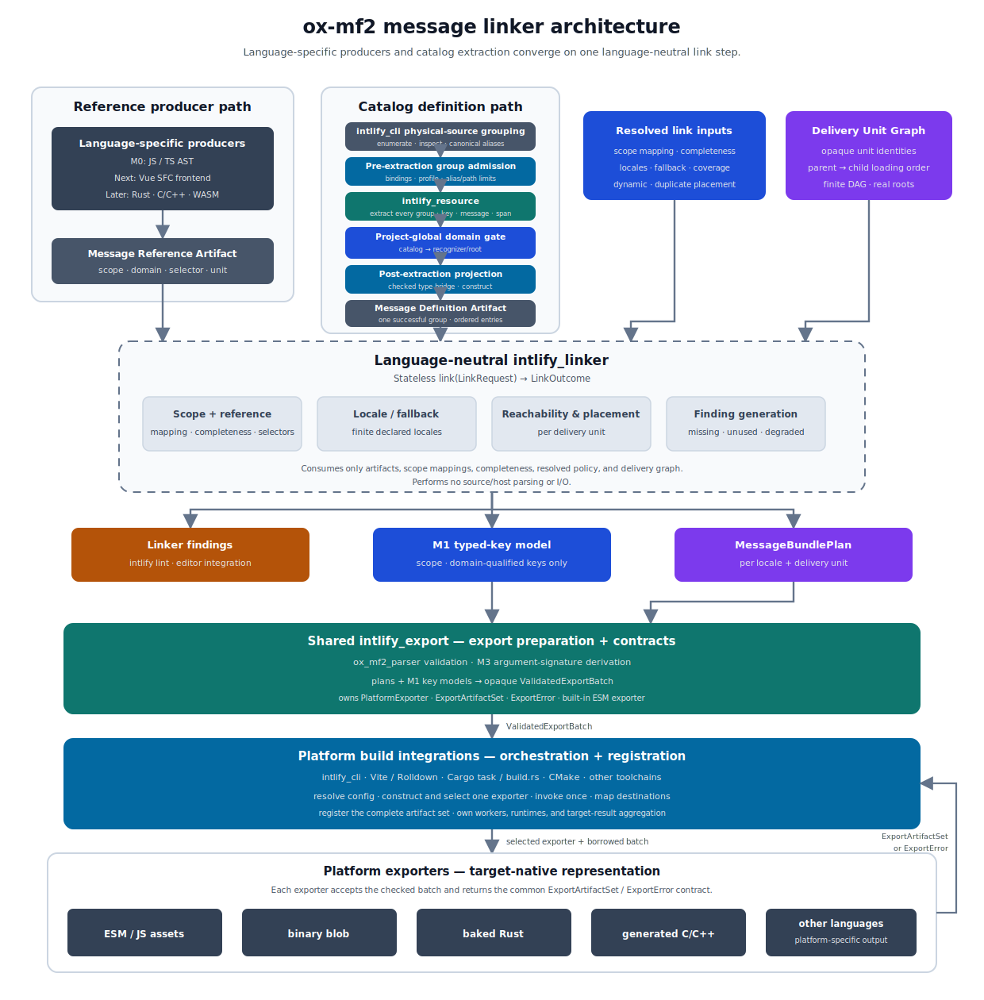

# ox-mf2 Message Linker Design

## Purpose

This document defines the overview-level architecture for an Intlify message linker. The linker connects application message references with catalog definitions, resolves locale fallback, computes message reachability, reports consistency findings, and produces platform-neutral bundle plans.

The design makes data requirements, finite production locales, generated artifacts, and pre-runtime validation explicit. It also covers the application-specific concepts that message catalogs require: language-specific reference production, dynamic-key bounds, authored-catalog maintenance, delivery-unit reachability, and final-application composition.

This document owns the language-neutral linker boundary and its public artifacts.

It builds on four related designs:

- resource extraction and validated write-back in [013-ox-mf2-resource-catalog-adapter-design.md](./013-ox-mf2-resource-catalog-adapter-design.md);
- the CLI and configuration foundation in [006-ox-mf2-phase-3a-tooling-foundation-design.md](./006-ox-mf2-phase-3a-tooling-foundation-design.md);
- the later linter presentation surface in [008-ox-mf2-phase-3c-linter-design.md](./008-ox-mf2-phase-3c-linter-design.md); and
- the editor integration boundary in [009-ox-mf2-phase-3d-lsp-editor-design.md](./009-ox-mf2-phase-3d-lsp-editor-design.md).

## Goals

- Define a programming-language-neutral contract for message references and catalog definitions.
- Resolve exact and bounded dynamic references without silently dropping a possibly used message.
- Detect ambiguous definitions, unresolved references, translation coverage gaps, orphaned translations, and unused definitions before production runtime.
- Produce deterministic per-locale and per-delivery-unit bundle plans that avoid whole-catalog and all-locale eager delivery.
- Reuse one linker analysis across lint, generation, pruning, bundler integration, and future editor features.
- Support final-application composition across application code, libraries, plugins, and multiple producer languages.
- Keep catalog extraction, host-format parsing, and validated write-back owned by `intlify_resource`.
- Make public artifacts versioned, testable by third-party producers, and safe to reject when incomplete or incompatible.

## Non-Goals

- Replacing the message-level parser, formatter, linter, or runtime formatter.
- Introducing a second catalog extractor, key resolver, locale-binding implementation, or host-format write-back path.
- Making the linker core parse JS/TS, Rust, C/C++, WASM, or build-system-specific inputs directly.
- Defining runtime caching, retries, suspense, locale negotiation, or application loading policy beyond the generated loader-map contract.
- Shipping every producer, exporter, native embedding strategy, or delivery-unit granularity in the first milestone.
- Requiring code-first message authoring or replacing catalog-authored workflows.
- Treating open-world development or library builds as if they were closed final-application links.
- Finalizing evidence-gated payload containers, deduplication strategies, or baked native data before concrete consumers and benchmarks justify them.

## Ownership

The future `intlify_contract` boundary owns public artifact types, wire compatibility, version negotiation, selector wire grammar, the normative selector semantics for each catalog-key domain, and producer/linker conformance fixtures.

Language-specific producers own source, object, or binary analysis and emit that contract.

The future `intlify_linker` core consumes only reference artifacts, definition artifacts, checked scope mapping and completeness inputs, a resolved link policy, and the delivery graph; it owns execution of the contract-defined selector matching, resolution, reachability, placement, findings, and bundle plans.

`intlify_resource` remains the sole owner of catalog assignment, host parsing, message entry extraction, catalog-key production and domain issuance, source spans, and validated write-back.

It emits canonical domain-qualified keys but has no selector-matching API and never expands selectors. `intlify_linker` returns linker-owned findings without depending on `intlify_lint`; a later lint integration presents those findings through its rule and reporting contracts.

Platform integrations own build-graph adaptation and exporter invocation, while runtimes own loading policy after consuming generated assets and loader maps.

This overview fixes those responsibility boundaries and the intended product direction.

Detailed wire schemas, rule contracts, configuration validation, producer encodings, delivery-graph algorithms, and exporter formats live in their owning sections below or in explicitly named milestone implementation addenda rather than being inferred by individual implementations.

## Problem Statement

i18n libraries and message resources repeatedly produce the same failures:

1. **Missing message**: application code references a message that no catalog supplies. Discovered at runtime, in production, in whichever locale a user happened to hit.
2. **Untranslated locale**: one or more locales lack a translation for an existing message.
3. **Unused messages**: entries no code can reference anymore accumulate in the catalog, costing translation, review, and bytes forever.
4. **Whole-catalog delivery**: importing the catalog ships every message — into the JS bundle, or compiled into the native binary — regardless of what the code can reference.
5. **All locales up front**: every supported locale enters the initial bundle instead of one asset per locale loaded on demand.
6. **Lazy features pay eagerly**: messages used only by a lazily loaded feature still land in the main delivery unit.
7. **Per-tool reimplementation**: lint rules, source scanners, and bundler-specific tree-shaking each re-implement the same reachability analysis.

Problems 1–3 are consistency problems between two things the project itself authors — its code and its catalogs — and their fixes are edits to authored files. Problems 4–6 are delivery problems and belong to packaging. Problem 7 is the architectural problem: every prior mitigation solved one surface at a time.

Solving these problems requires the project to state data requirements before generation, constrain production locales to a finite set, generate only what is reachable, and detect required-but-unavailable messages before production runtime.

Message resources also need application-reference analysis, bounded dynamic-key handling, locale fallback, and final program or module composition. Intlify therefore gets a dedicated **message linker**.

## Design Overview: A Linker for Messages

The linker core recognizes no particular programming language or build system. JS/TS, Rust, C/C++, and others are **reference producers** that feed one common contract; catalogs feed the other side through the existing `intlify_resource` extraction path.

The linker first applies one checked host scope-mapping table, then resolves references against definitions under a resolved link policy — locale/fallback, dynamic-reference, coverage, and placement policy — and a delivery-unit graph, and produces bundle plans and findings. One analysis, every surface:

| Problem | Linker behavior |
| --- | --- |
| referenced message key does not exist | symbol resolution error (`unresolved-message`) |
| a locale lacks a translation | locale/fallback resolution finding (`missing-translation`) |
| catalog contains unused messages | unreachable definition (`unused-message`) |
| whole catalog gets bundled | emit only reachable messages |
| all locales in the initial bundle | separate assets per locale |
| lazy-feature messages in the main unit | split messages per delivery unit |
| linter and build integration repeat the analysis | one shared linker core |

## Architecture



The linker never parses JS/TS source, Rust crates, or C/C++ objects directly. Each language producer emits a common-format `MessageReferenceArtifact`; the catalog side converts `intlify_resource` extraction results into a common-format `MessageDefinitionArtifact`.

The linker consumes only the two artifacts, a checked `ScopeMappingTable`, a checked `ScopeCompletenessTable`, the resolved link policy, and the delivery graph.

A platform build integration orchestrates the surrounding workflow: it runs the relevant producer or scanner, resolves policy and scope mappings, derives scope completeness from configured inputs and their execution results, supplies the delivery graph, invokes the linker and selected exporter, and registers emitted artifacts with the build system.

### Architecture Components

The diagram separates language- and host-specific input production from language-neutral linking and platform-specific export. Each box has one responsibility:

#### Reference producer path

Runs outside the linker core and recognizes message usage in one source or build artifact format. A JS/TS producer may inspect an AST and bundler graph, while native producers may use macros plus object or final-binary scanning.

The producer owns language-specific recognition, provenance, and delivery-unit attribution; it does not resolve references against catalogs.

#### Message Reference Artifact

Carries the producer's versioned, language-neutral output: one portable artifact identity plus an ordered array of scope- and domain-qualified exact references, bounded selectors, or explicit `UnboundedDynamic` evidence, together with their owning delivery unit and optional source origins.

The artifact identity plus each array ordinal gives every reference record a deterministic portable identity. It is the only application-reference input accepted by the linker core.

#### Catalog definition path

Uses the configured `intlify_resource` registry and host-format adapters to extract messages from catalog files. This path owns catalog assignment, host parsing, canonical catalog keys, locale binding, source spans, and validated write-back; it does not inspect application code or decide reachability.

#### Message Definition Artifact

Projects exactly one completely extracted, selected catalog source document into ordered language-neutral definitions containing a portable namespaced source identity, scope, key domain, canonical key, locale, message payload, and source-entry evidence.

It is the only catalog-definition input accepted by the linker core; several source artifacts compose through `LinkRequest`.

#### Scope Mapping Table

Carries the final application's checked, exact, one-hop structural-scope mappings. It permits explicit many-to-one equivalence, leaves unmapped scopes unchanged, and forbids artifact rewriting, chains, cycles, namespace inference, and name-only fallback.

The host constructs it from resolved configuration and the linker applies it uniformly before semantic indexing.

#### Scope Completeness Table

Records, for each application-owned scope targeted by this link, whether its configured definition sources and reference producers completed as a closed input set or remained partial for one typed reason. The integration derives this table from resolved configuration plus execution results; an artifact cannot claim that its project scope is complete.

#### Resolved link policy

Declares the finite production locale set, explicit fallback chains, coverage baselines, dynamic-reference mode, and the M0–M3 `duplicate` placement policy. The linker uses it for locale resolution, coverage findings, dynamic-reference disposition, and plan placement; runtime locale negotiation and asset-loading policy remain outside the linker.

#### Delivery Unit Graph

Describes project-contextual delivery nodes identified by the shared non-empty logical segment-array `DeliveryUnitId` and their dependency or loading-order relationships.

A bundler or build integration supplies the graph and binds every reference artifact to one existing node; the linker uses it to calculate per-unit reachability and shared-message placement without interpreting platform-specific labels or unit types.

#### Language-neutral `intlify_linker`

Consumes only the two artifacts, scope mapping table, scope completeness table, resolved link policy, and delivery graph as one immutable `LinkRequest`.

It performs deterministic scope resolution, completeness gating, reference resolution, reachability, placement, and finding generation without parsing source languages, binaries, catalog host formats, or build-system configuration directly, and returns one `LinkOutcome`.

#### Reference resolution

Matches exact and bounded selectors to domain-qualified canonical catalog keys within their scopes and applies strict/compat policy to `UnboundedDynamic`. A reference that cannot resolve under the relevant locale chains becomes an `unresolved-message` finding.

#### Locale / fallback resolution

Resolves each reachable key for every requested locale through its explicit fallback chain. It distinguishes a resolvable coverage gap (`missing-translation`) from a reference with no definition anywhere in the chain (`unresolved-message`).

#### Reachability and placement

Computes which definitions are reachable from static references, bounded selectors, configured roots, and compat-mode conservative widening, then assigns shared messages to delivery units under the selected placement policy. Definitions outside the closed and complete root set are candidates for `unused-message`.

#### Finding generation

Produces typed linker findings and related evidence for ambiguous, unresolved, missing, orphaned, unused, unbounded, or degraded cases. It does not define a second reporting surface or decide lint severity and preset membership.

#### Linker findings

Feed `intlify lint` and future editor integration through the diagnostic, rule, and catalog-finding contracts owned by 008 and 013. Consumers present the findings but do not rerun link analysis.

#### `MessageBundlePlan`

Records the deterministic resolved-message selection and placement for one locale and delivery unit. It is an input to shared export preparation, not a directly callable exporter argument, runtime serialization format, or loading policy.

#### Platform build integrations

Orchestrate the platform build around the neutral contracts.

A Vite/Rolldown plugin, Cargo task or `build.rs`, CMake integration, or another toolchain adapter runs producers or scanners, resolves the checked scope mapping table and execution-derived completeness table, supplies the delivery graph, invokes the linker, and asks the shared export-preparation boundary to create one opaque `ValidatedExportBatch` before invoking exactly one selected exporter for the export transaction.

It maps each generic returned artifact's portable relative logical path, kind, payload, and metadata into platform-specific registration and then registers the one returned `ExportArtifactSet` in the final build. A syntax failure produces no batch, invokes no exporter, and publishes no partial asset or manifest.

The integration does not reimplement linking or message parsing semantics. Integrations and exporters are selectable rather than fixed one-to-one pairs: integrations may share one exporter, and one integration may reuse the same borrowed batch in separate independent transactions with different exporters.

One exporter may return multiple artifacts and artifact kinds in its one set.

#### Platform exporters

Convert the syntax-cleared plans and selected definitions exposed read-only through `ValidatedExportBatch` into an ordered list of generic `ExportArtifact` records representing ESM, binary blobs, baked Rust, generated C/C++, or outputs for other languages and platforms.

Each record uses an open namespaced semantic `ExportArtifactKind` plus an explicit kind-specific `ExportArtifactFormatVersion`; loader maps and manifests are ordinary artifacts with distinct kinds in the same list rather than side-channel result fields.

The set is extensible through the shared object-safe `PlatformExporter` trait, whose only plan-bearing argument is the opaque batch and whose result uses the concrete `ExportArtifactSet` / `ExportError` contracts.

Exporters choose representation and emit deterministic metadata, but they neither accept a raw `MessageBundlePlan`, return a closed platform-specific enum or opaque `Any` payload, repeat reference resolution, fallback resolution, reachability, or placement, nor substitute a target-specific MF2 syntax validator for the shared gate.

## Data Selection and Delivery Constraints

- State data requirements explicitly before generation.
- Constrain production locales to a finite, declared set.
- Generate data only after requirements are fixed.
- Detect required-but-unavailable data before production runtime.
- Separate source data from generated artifacts.
- Make runtime data requirements extractable from a binary.

The linker selection input is not the message key alone. It is the combination of exact or bounded references and explicit unbounded-dynamic evidence produced per language, the resolved link policy, and the delivery graph.

### Mechanism decisions

| Mechanism | Decision |
| --- | --- |
| Native final-binary scanning | Required for the initial Rust/C/C++ native producer direction because the final binary identifies which references survived conditional compilation, dead-code elimination, and LTO. JS instead uses its bundler's module and chunk graph. |
| Packed container with a hashed key index | Deferred. Per-locale, per-unit assets over HTTP or the filesystem cover the initial delivery model; a packed container requires concrete evidence. |
| Cross-locale deduplication and locale families | Deferred. Applications enumerate locales explicitly; omitting values identical to fallback remains evidence-gated. |
| Runtime provider or adapter stack | Out of scope. Delivery ends at assets plus a minimal loader map; runtimes own loading policy. |
| Artifact versioning | Required for public linker artifacts. Catalog sources remain versioned by VCS, while each artifact carries an explicit format version and participates in compatibility negotiation. |

## Message-Domain Prior Art

- **`@intlify/eslint-plugin-vue-i18n`** (`no-missing-keys`, `no-unused-keys`): the right checks in an awkward home — per-file, JS-implemented, duplicated configuration, unconnected to delivery. The linker gives the same checks one core and connects them to what ships.
- **lingui** (`extract --clean`, `compile --strict`), **i18next-parser** (sync): reference-driven catalog maintenance precedent.
- **formatjs** (`refers/formatjs`): the inverse, code-first authoring model; out of scope, but the reference-producer half is reusable if ever wanted.
- **paraglide-js**: per-message accessor functions make bundler DCE prune per key — proof that per-key delivery works when the API is accessor-shaped, and a demonstration of its limit: string-keyed `t(variable)` defeats import-graph DCE, which is why pruning here is linker-driven.
- **Android resources / App Bundles**: per-locale splits delivered on demand — the shape of problem 5, in production for a decade.
- **gettext** (`msgfmt --statistics`, `.mo`): parity reporting and precompiled catalogs as ordinary build steps.

## Artifacts and Contracts

### Message Reference Artifact

Conceptual shape:

```rust
pub struct ArtifactVersion {
    major: u16,
    minor: u16,
}

pub enum ArtifactNamespace {
    Project,
}

pub struct CatalogScopeId {
    namespace: ArtifactNamespace,
    name: CatalogScopeName,
}

pub struct CatalogScopeName(String);

pub struct Locale(String);

pub struct MessageReferenceArtifact {
    version: ArtifactVersion,
    producer: ProducerIdentity,
    identity: ReferenceArtifactIdentity,
    delivery_unit: DeliveryUnitId,
    references: Vec<MessageReference>,
}

pub struct ReferenceArtifactIdentity {
    namespace: ArtifactNamespace,
    segments: ReferenceArtifactSegments,
}

pub struct ReferenceArtifactSegments(Vec<ReferenceArtifactSegment>);

pub struct ReferenceArtifactSegment(String);

pub struct DeliveryUnitId(Vec<DeliveryUnitSegment>);

pub struct DeliveryUnitSegment(String);

pub struct ReferenceRecordIdentity {
    artifact: ReferenceArtifactIdentity,
    ordinal: u32,
}

pub struct MessageReference {
    scope: CatalogScopeId,
    domain: CatalogKeyDomain,
    selector: MessageSelector,
    reason: Option<ReasonText>,
    origin: Option<SourceOrigin>,
}

pub struct ReasonText(String);

pub struct SourceOrigin {
    source: SourceDocumentIdentity,
    span: SourceUtf8Span,
}

pub struct SourceUtf8Span {
    start: u32,
    end: u32,
}

pub enum MessageSelector {
    Exact(CatalogKey),
    Prefix(CatalogKeyPrefix),
    Pattern(CatalogKeyPattern),
    AllInScope,
    UnboundedDynamic,
}

impl MessageReferenceArtifact {
    pub fn try_new(
        version: ArtifactVersion,
        producer: ProducerIdentity,
        identity: ReferenceArtifactIdentity,
        delivery_unit: DeliveryUnitId,
        references: Vec<MessageReference>,
        limits: &LinkLimits,
    ) -> Result<Self, ArtifactContractError>;

    pub fn version(&self) -> &ArtifactVersion;
    pub fn producer(&self) -> &ProducerIdentity;
    pub fn identity(&self) -> &ReferenceArtifactIdentity;
    pub fn delivery_unit(&self) -> &DeliveryUnitId;
    pub fn references(&self) -> &[MessageReference];
}
```

Every reference/definition artifact wire value, nested record, identity, and scalar newtype in this artifact input contract has private state and read-only accessors.

Each scalar/identity constructor validates its complete value before exposure; each record constructor accepts its complete field tuple once and is infallible only when the checked field types leave no cross-field invariant, otherwise returning a closed type-local construction error.

No public struct literal, mutable field, setter, unchecked `From`, or partially initialized builder can create one of these values.

The artifact-level `try_new` is the one direct-construction admission boundary: it preserves the submitted record order, applies the same canonical structural, cross-record, decoded-accounting, and current-lower-limit phases as decoding, and exposes no partial artifact.

Decoder and producer paths feed the same internal validator rather than reconstructing the rules independently. The private sequence storage is owned by the artifact and exposed only as a slice; whether the implementation compacts a consumed `Vec` into a boxed slice is not public identity or ABI.

A cache that needs shared ownership wraps the complete immutable artifact externally in `Arc`; the artifact contract itself contains no `Arc`, borrow from producer scratch storage, or mutable copy-on-write state.

Link-request, finding, plan, and export-result construction remain governed by their owning sections and are not implicitly changed by this artifact-input rule.

- `ArtifactVersion` is shared by reference and definition artifacts and contains only unsigned `major` and `minor` components.
  - A major increment denotes a breaking contract change; a minor increment denotes compatible additive evolution under the negotiation rules fixed below.
  - Patch and build identity do not belong here and remain producer-revision concerns.
  - The canonical fingerprint payload is exactly `major:u16be || minor:u16be`, with no text, separator, sign, variable-width integer, or patch component.
- While the repository remains WIP, the initial writer emits `{ major: 0, minor: 1 }`.
  - As with the existing v0.1 binary contract precedent, coordinated writer, reader, schema, fixture, and document changes may revise this draft without promising compatibility across producer revisions.
  - M0 intentionally remains at this mutable v0.1 point and does not freeze v1.
  - Declaring the first stable artifact compatibility point ends that exception; it is reconsidered only after N0 validates the native binary-scan and reference-ID constraints, and subsequent breaking and additive changes then follow the major/minor meanings above.
  - Reader/writer negotiation uses the exact-draft and stable-range rules fixed in [Artifact version negotiation](#artifact-version-negotiation).
- `version` identifies wire-contract compatibility; `producer` identifies the emitting frontend or scanner and its provenance revision.
- `identity` is exactly one `ArtifactNamespace` plus one non-empty logical segment array. It names this reference artifact independently of its content, delivery unit, producer identity or revision, input position, and host filesystem spelling; together with a record ordinal it forms the reference-record identity used by findings.
- `delivery_unit` identifies the output unit that owns the references.
- `domain` identifies the 013 catalog-key comparison domain. A reference matches definitions only within the same `scope` and `domain`; `AllInScope` means every key in that exact scope-domain pair, not every domain carrying the same scope name. `UnboundedDynamic` is likewise contained by the already resolved scope-domain pair, but records that the producer could not derive a narrower key set.
- `selector` expresses a static key, an intentionally bounded dynamic set, or the explicit fact that a recognized dynamic lookup could not be bounded. **Non-`Exact` selectors should carry `reason`** (from the declaring API, config, or producer analysis) so reviewers can see why a widening exists; producers that cannot supply one emit it absent, never fabricated.
- `origin` is diagnostic source location; linker correctness never depends on it. Producers that have locations should supply them (directly or via a debug sidecar artifact) so findings can point at reference sites.

#### Reference artifact identity

`ArtifactNamespace` is shared by reference-artifact identity, portable source-document identity, and catalog-scope identity.

M0 admits only `Project`, contextual to the one consuming application represented by a `LinkRequest`; the host must bind it to the current project root before admitting a locally produced or cached value.

The explicit enum and wire tag reserve a versioned extension point without making published-package resources part of M0. A published artifact cannot make a portable `Project` claim, and a namespace kind other than exact `project` is unsupported under v0.1 rather than inferred from package-manager metadata.

Package-owned resource artifacts are deferred below.

`ReferenceArtifactSegments` is a non-empty ordered array of logical labels, not a host or output path. Each `ReferenceArtifactSegment` uses the same scalar grammar as one 013-derived `PortablePathSegment`: a non-empty Unicode scalar sequence other than exact `.` or `..`, containing neither `U+0000` nor `/`.

The bytes and segment boundaries are retained exactly without Unicode normalization, case folding, trimming, percent decoding, or separator rewriting. Backslash is an ordinary character.

The types remain distinct because a reference artifact may represent an aggregate module, generated unit, object set, or final binary rather than one filesystem object; no implicit conversion from a path is part of the contract.

Reference-artifact logical identity uses three independent inclusive protocol ceilings:

| `LinkLimits` counter | Accounting rule | Initial protocol ceiling |
| --- | --- | --: |
| `reference_identity_segment_bytes` | Exact decoded UTF-8 bytes in one `ReferenceArtifactSegment`. | 255 bytes |
| `reference_identity_segments` | Number of elements in one non-empty `ReferenceArtifactSegments` array. | `64` |
| `reference_identity_bytes` | Sum of decoded UTF-8 byte lengths of all segments in one identity. | 4 KiB (`4,096` bytes) |

The segment-count limit is checked before retaining the array; known structured lengths are preflighted, and streaming adapters stop admitting elements at the first value above the limit. After that preflight, segments are processed in semantic array order.

Each decoded segment is checked against its individual byte ceiling before retention and contributes through checked `u64` addition to the per-identity total before the identity is exposed. Empty arrays remain structurally invalid rather than a zero-sized identity.

Exactly 255 bytes in one otherwise valid segment, exactly 64 segments, and exactly 4,096 total segment bytes are accepted when all other limits pass; the first byte or element above any applicable ceiling rejects the complete reference artifact.

`reference_identity_bytes` charges every segment occurrence independently. Equal segment values, shared prefixes, interning, zero-copy storage, and a slash-joined display form provide no deduction.

It excludes array/object framing, display separators, allocation capacity, and the fixed `Project` namespace discriminant; actual serialized bytes remain subject to `reference_artifact_wire_bytes`, while every segment occurrence also contributes to `reference_artifact_decoded_bytes`.

Producers, decoders, direct checked constructors, and defensive link admission enforce identical accounting without truncating, merging, hashing, shortening, or replacing an identity.

The fixed ceilings follow the common `LinkLimits` model: callers may select lower immutable values, including zero, but cannot raise a protocol ceiling; the lower values do not change identity equality, ordering, or serialization for an admitted artifact.

The containing `LinkRequest` adds two independent inclusive aggregate ceilings:

| `LinkLimits` counter | Accounting rule | Initial protocol ceiling |
| --- | --- | --: |
| `reference_artifacts` | Number of submitted `MessageReferenceArtifact` occurrences in one request. | `65,536` |
| `reference_identity_bytes_total` | Sum of `reference_identity_bytes` across every decoded reference-artifact identity submitted to one request. | 64 MiB (`67,108,864` bytes) |

The linker checks `reference_artifacts` from the input slice length before per-artifact validation, sorting, duplicate detection, index allocation, or semantic analysis.

A structured integration with a known collection length performs the same preflight before allocating artifact storage; a streaming integration stops at the 65,537th submitted occurrence. Empty input and exactly 65,536 artifacts are accepted when every other constraint passes.

Every submitted occurrence counts, including a duplicate or an artifact later rejected for another reason; sorting, filtering, deduplication, cache reuse, and worker partitioning never reduce the count.

After every submitted artifact has passed its complete structural and effective per-artifact limits, each exact `reference_identity_bytes` value contributes once to the first request aggregate pass, `reference_identity_bytes_total`, with checked `u64` addition.

A duplicate identity or an artifact rejected later by a cross-artifact rule still receives no deduction. The fixed `Project` namespace discriminant remains excluded from this specific counter, exactly as above.

Zero and exactly 64 MiB are accepted; conversion or addition overflow and the first byte above the ceiling reject the complete request. The artifact-count preflight and every per-artifact failure precede this aggregate check; `reference_records_total` and `reference_artifact_decoded_bytes_total` follow it.

The shared canonical identity-group reduction fixed below makes input order, parallel decoding, interning, equal identities, and shared prefixes unable to change the accepted total or selected error.

Both aggregate counters use the same immutable lower-budget rule as the per-identity counters. A zero artifact limit admits only an empty reference-artifact collection, and a zero total-byte limit likewise admits no non-empty logical identity.

An over-limit request returns one `LinkOperationalError` with no findings or plans; the caller must submit one new complete admissible request and may not make the linker silently drop artifacts, split global analysis across requests, truncate identities, or retry with relaxed limits.

Exact aggregate definition, policy, graph, and output counters remain separate decisions.

The initial JSON identity value is exactly an object with `namespace` and `segments`, for example `"identity":{"namespace":{"kind":"project"},"segments":["js","module","src","checkout.ts"]}`. The namespace uses the same exact tagged-object codec as definition sources: `{"kind":"project"}`.

Input member order is non-semantic; canonical emission orders `namespace` before `segments`. The segment array is non-empty and order-sensitive.

A slash-joined rendering is presentation-only and cannot be parsed back into identity. Missing, duplicate, unknown, mistyped, or invalid members, including a `"package"` kind or extra `package` member, reject the complete reference artifact rather than being normalized.

The build integration owns namespace binding and assigns the portable logical segment array to the producer.

For a source-level artifact it may map an already root-bound logical module name, such as `["js", "module", "src", "checkout.ts"]`; for an aggregate or native artifact it may assign a configured build identity such as `["native", "binary", "app"]`.

Neither the integration nor producer derives identity from an absolute path, current directory, temporary/output path, content-addressed filename, content hash, `ProducerId`, producer revision, delivery-unit ID, artifact input order, or random value.

Changing one of those facts alone therefore preserves identity; changing the assigned namespace or any exact segment changes it. Producer families operating in the same namespace must coordinate their assigned logical IDs, and a duplicate is rejected rather than namespaced implicitly by provenance.

Identity equality compares the exact segment sequence under the single M0 `Project` namespace. Canonical ordering compares segments lexicographically by exact decoded UTF-8 bytes with a shorter equal-prefix sequence first.

Host path rules, locale collation, normalized display strings, producer data, and discovery order never participate. This order is reused wherever `ReferenceArtifactIdentity` contributes to a finding subject, cache key, structured output, or deterministic sort.

A project-scoped persistent cache additionally carries the host's project binding outside the artifact so equal contextual identities from unrelated projects are never confused. Any future namespace variant must extend this ordering explicitly through the artifact-version contract.

#### Delivery unit identity

`DeliveryUnitId` is a project-contextual, non-empty ordered array of logical segments. It names one node in the exact `DeliveryUnitGraph` supplied by the same `LinkRequest`; it is not a globally published package identity, platform enum, host/output path, filename, URL, MIME value, or artifact identity.

The linker assigns no meaning to labels such as `js`, `chunk`, `native`, or `binary`.

Multiple reference artifacts may name the same delivery unit, one graph node may have no reference artifact, and changing an artifact's delivery unit changes reachability and placement inputs without changing its `ReferenceArtifactIdentity` or existing record ordinals.

`DeliveryUnitSegment` uses the same scalar grammar as `ReferenceArtifactSegment`: a non-empty Unicode scalar sequence other than exact `.` or `..`, containing neither `U+0000` nor `/`, retained exactly without normalization, case folding, trimming, percent decoding, or separator rewriting. Backslash is ordinary.

The types are distinct and have no implicit conversion because an artifact logical identity and a graph-node identity have different ownership and lifecycle even when their segment bytes happen to match.

The required JSON value is the segment array itself, for example `"deliveryUnit":["js","chunk","checkout"]`. It is never a slash-joined string, namespace object, platform-tagged union, integer index, or `null`.

Array order and boundaries are semantic and preserved exactly; an empty array or invalid segment rejects the complete reference artifact. Canonical output uses the decoded segment sequence in order with the shared JSON string-escaping rules.

Human-facing slash joining is display-only and cannot be parsed back into an ID.

Delivery-unit identity uses three independent inclusive protocol ceilings:

| `LinkLimits` counter | Accounting rule | Initial protocol ceiling |
| --- | --- | --: |
| `delivery_unit_segment_bytes` | Exact decoded UTF-8 bytes in one `DeliveryUnitSegment`. | 255 bytes |
| `delivery_unit_segments` | Number of elements in one non-empty `DeliveryUnitId`. | `64` |
| `delivery_unit_bytes` | Sum of decoded UTF-8 byte lengths of every segment in one `DeliveryUnitId`. | 4 KiB (`4,096` bytes) |

Known array lengths are preflighted before retaining segments; adapters then validate and charge each decoded segment in array order using checked `u64` arithmetic before exposing the ID.

Exactly 255 bytes in one valid segment, 64 segments, and 4,096 total bytes are accepted when all other checks pass; the first value over any ceiling rejects the complete artifact or graph. Repeated segment values and shared prefixes are charged per occurrence without deductions for interning or zero-copy storage.

Framing, display separators, and allocation capacity are excluded, while the actual JSON spelling remains part of the enclosing wire-byte counter.

Producers, graph constructors, artifact decoders, and direct checked constructors apply the same fixed ceilings and caller-selected lower immutable budgets without truncation, hashing, replacement, or fallback to a string form.

Aggregate graph-node, edge, and ID-byte limits are fixed in the Delivery Units section below.

The build integration deterministically assigns IDs from its pre-output logical delivery graph and supplies the exact same checked values to reference producers and `DeliveryUnitGraph`.

It does not derive them from an absolute/current/temporary path, a content-addressed output filename, array position, worker completion, random value, or final registration destination.

M0 assigns IDs only for reference artifacts produced within the current application; binding reusable-package references into final contextual graph nodes belongs to the deferred package-resource design.

The checked graph constructor requires every node ID to be unique by exact segment equality. During `LinkRequest` validation, each reference artifact's `delivery_unit` must equal exactly one existing graph node; a missing node is an operational error and the linker never creates one implicitly.

Equality and canonical ordering compare segment-by-segment exact decoded UTF-8 bytes, with a shorter equal-prefix sequence first. Locale collation, host path behavior, display rendering, artifact order, and platform conventions do not participate.

The value participates in artifact equality, cache identity, structured output, finding evidence, plan placement, and deterministic ordering.

`ReferenceRecordIdentity` is exactly `(artifact, ordinal)`. `ordinal` is the zero-based position in the artifact's semantic `references` array and is derived rather than redundantly serialized on each `MessageReference`. The array order is therefore preserved by every wire adapter and checked typed constructor.

An empty vector is valid; a non-empty vector's first record is `0`.

Reference-record collections use two independent inclusive protocol ceilings:

| `LinkLimits` counter | Accounting rule | Initial protocol ceiling |
| --- | --- | --: |
| `reference_records` | Number of submitted `MessageReference` occurrences in one artifact's semantic `references` array. | `1,000,000` |
| `reference_records_total` | Sum of submitted reference-record counts across every reference artifact in one `LinkRequest`. | `4,000,000` |

The producer and reference-artifact decoder preflight `reference_records` from the array length before allocating or decoding individual records, and a direct checked constructor verifies the supplied vector length before exposing the artifact.

Empty and exactly 1,000,000-record arrays are valid when their contents pass every other check; the latter assigns exact ordinals `0.. =999,999`.

Length conversion is checked even though the protocol ceiling is below `u32::MAX`; the 1,000,001st submitted occurrence or any conversion failure rejects the complete artifact before a `ReferenceRecordIdentity` is exposed.

Every submitted occurrence counts, including equal, duplicate, or later-invalid records, without deductions for sorting, grouping, interning, or presentation aggregation.

After phase-zero wire-byte admission succeeds, complete reference-artifact validation first validates the root shape, version, producer, checked `ReferenceArtifactIdentity`, and checked `DeliveryUnitId`, then performs that `reference_records` length preflight.

It next runs one complete `catalog_scope_name_bytes` pass over the preserved semantic reference array in ordinal order before domain, selector, reason, origin, or remaining record validation.

An overrun uses `CatalogScopeNameBytes`, the already established `ReferenceArtifactGroup(identity)`, and `Exact(effective_limit + 1)` without retaining the raw scope, a `CatalogScopeId`, or record ordinal. A scope-name failure in this pass wins even when a later field or semantic failure occurs at an earlier ordinal.

JSON member order, decoder strategy, cache reuse, partitioning, and worker completion cannot interleave or reorder this pass.

After the complete scope-name pass succeeds, record admission uses one fixed hybrid precedence. First, one complete `selector_path_bytes` pass visits every `Exact` and `Prefix` payload in record-ordinal order; other selector variants contribute nothing to this pass.

Second, one complete `selector_pattern_bytes` pass visits every `Pattern` payload in record-ordinal order.

Both byte passes operate on the decoded strings before domain-path grammar or pattern parsing, and an overrun in an earlier complete pass wins over every failure in a later pass even when the later failure belongs to an earlier ordinal.

Third, a pattern parse/token phase visits `Pattern` records in ordinal order and each pattern segment from left to right, performing slash segmentation, escape decoding, operator/literal disambiguation, and `selector_pattern_tokens` admission together.

Because a token exists only after those structural steps succeed, this third phase does not fabricate a token count for malformed input or defer a structural parse error merely to search later records for a token overrun: the first parse error or token overrun in that canonical record-and-segment order wins.

Fourth, one complete `reason_bytes` pass visits every present reason in record-ordinal order before empty/control-scalar grammar; omission contributes nothing. Fifth, one complete `path_segments` pass preflights the source path of every present origin in record-ordinal order.

Sixth, one complete `path_segment_bytes` pass visits those origins in record-ordinal order and each decoded segment in segment order. Seventh, one complete `path_bytes` pass visits the same origins in record-ordinal order and adds each already admitted complete segment to a counter reset for that path.

All four passes use the established `ReferenceArtifactGroup(identity)` subject. `ReasonBytes`, `PathSegments`, and `PathSegmentBytes` return exactly `Exact(effective_limit + 1)`; `PathBytes` returns the exact attempted per-path running total.

An earlier complete pass wins over every later failure regardless of record ordinal. Only after all seven admission phases succeed does validation continue with remaining domain-specific path/literal rules, selector semantics, reason grammar, origin path grammar and span validation, and other record fields.

Sequential, cached, partitioned, and parallel implementations must expose the same phase and canonical-order result without retaining a reason, path, segment, or ordinal in limit evidence.

Each per-artifact record count is checked during the complete per-artifact phase.

After that phase and a successful `reference_identity_bytes_total` pass, the integration and linker run the second request aggregate pass and sum the counts into `reference_records_total` with checked `u64` arithmetic before `reference_artifact_decoded_bytes_total`, aggregate record-index allocation, or semantic analysis.

Zero and exactly 4,000,000 records are accepted; conversion or addition overflow and the 4,000,001st record reject the complete request.

The shared canonical identity-group reduction makes artifact input order, parallel decoding, worker partitioning, identical records, cache reuse, and records later suppressed as secondary findings unable to change the charged total or selected error.

This count is independent of record payload bytes, which remain subject to the reference artifact's decoded-byte and field-specific limits.

Both record counters follow the common immutable lower-budget rule. A per-artifact lower limit of zero admits only empty `references` arrays, and a total lower limit of zero requires every admitted reference artifact to be empty.

Exceeding either counter produces no truncated artifact, partial identity set, sampled findings, partial plans, automatic artifact sharding, or relaxed-limit retry.

A producer may intentionally define several separately identified logical artifacts, but neither the decoder nor linker invents shards to make an over-limit artifact admissible.

The containing `LinkRequest` rejects duplicate `ReferenceArtifactIdentity` values before semantic analysis, because they would make record identity ambiguous; it never disambiguates them with producer revision, delivery unit, artifact input order, or a content hash.

Within one admitted artifact, every ordinal occurs exactly once by construction. Reordering, inserting, or deleting reference records changes affected ordinals and therefore their identities in the new artifact.

The contract guarantees portability and determinism for one exact artifact, not cross-revision identity stability after its semantic array changes.

`origin`, selector, reason, scope, domain, delivery unit, producer identity/revision, record content, and hashes are not fallback identity inputs. They remain semantic fields, provenance, or evidence attached to the record.

`ReferenceRecordIdentity` participates in finding subjects, equality, cache keys, structured output, and deterministic within-kind ordering; identical record fields at two ordinals remain distinct, while changing only optional reason or origin does not create a new identity for the same artifact and ordinal.

#### M0 reference-artifact transport and limits

##### Encoding contract

The M0 serialized `MessageReferenceArtifact` wire is exactly one JSON object encoded as valid UTF-8 without a byte-order mark. It uses the same JSON transport contract as `MessageDefinitionArtifact`.

CBOR, MessagePack, a custom binary envelope, and content-sniffed alternatives cannot claim the same artifact contract or `ArtifactVersion`; another encoding requires an explicitly identified transport contract and compatibility decision.

The decoder never guesses from leading bytes, a filename extension, MIME metadata, or content.

##### Per-artifact byte budgets

Reference-artifact admission uses two independent, inclusive per-artifact byte counters:

| `LinkLimits` counter | Accounting rule | Initial protocol ceiling |
| --- | --- | --: |
| `reference_artifact_wire_bytes` | Exact bytes in one uncompressed serialized `MessageReferenceArtifact` JSON document supplied to the `intlify_contract` decoder, including member names, punctuation, number tokens, string escaping, whitespace, and trailing or otherwise invalid input bytes that the decoder receives. External transport or container compression is not artifact wire; integrations feed its decompressed output through the bounded decoder without first materializing an unbounded buffer. | 512 MiB (`536,870,912` bytes) |
| `reference_artifact_decoded_bytes` | Sum of the exact decoded UTF-8 byte lengths of every variable-width scalar payload in the final logical typed reference artifact. Each logical occurrence is charged independently after wire unescaping and any artifact-local expansion. | 256 MiB (`268,435,456` bytes) |

These values intentionally match the definition-artifact byte ceilings, but the four counters are distinct: no artifact kind borrows, transfers, pools, or offsets another kind's budget.

A reference artifact must pass both counters independently, and neither counter estimates or substitutes for the other; no required two-to-one wire/decoded ratio exists. `reference_artifact_decoded_bytes` includes producer id and revision, reference-artifact identity segments, delivery-unit segments, every catalog-scope name, every `Exact`, `Prefix`, or `Pattern` payload, each present reason, and every present origin source-path segment.

A more specific field or path limit overlaps rather than replaces this total. Fixed-width integers, closed enum and namespace discriminants, wire-only kind strings after validation, JSON framing, and member names add zero decoded bytes.

Repeated equal values, shared strings, zero-copy slices, and interning provide no deduction.

##### Wire-byte admission

Wire-byte admission is phase zero before root syntax and every decoded or semantic check. When the uncompressed document length is known, the decoder compares it before parsing.

For an unknown-length stream, it counts through EOF or the first byte at `effective_limit + 1`; a syntax error discovered earlier remains provisional until that bounded wire admission finishes.

Reaching the first excess byte selects `ReferenceArtifactWireBytes` over every syntax or decoded failure and stops without reading the remainder; reaching EOF at or below the limit permits the previously selected canonical syntax result.

Chunking, parser lookahead, and known-versus-streaming ingestion therefore cannot change the public failure. Direct typed construction has no wire phase or synthetic wire charge.

A producer validates the decoded total over the complete logical artifact and validates wire bytes with a bounded counting encoder before publication, exposing no partial artifact.

A decoder counts exact wire bytes incrementally, including invalid trailing input, and charges each decoded scalar before allocation or typed admission.

Direct checked construction enforces the decoded and structural limits. `intlify_linker` may defensively recompute the observable decoded total from a typed artifact but never invents a wire length after decoding.

Caller-selected lower immutable values for the two counters are independent, and every overrun follows the common fail-complete, cache-revalidation, and versioned-ceiling rules.

##### Decoded-byte accounting

Decoded-budget failure selection follows the canonical reference-artifact validation phases above, never input object-member order or the point at which a streaming parser happens to encounter bytes.

Within each phase, the applicable shape and field-specific limit checks run first; only an admitted complete variable-width payload is then added once, with checked arithmetic, to the artifact's decoded running total.

If that addition exceeds the effective `reference_artifact_decoded_bytes` ceiling, the per-artifact decoded-budget failure wins over every later phase but never over an unfinished earlier phase.

A decoder may measure and mark provisional charges while scanning wire order, but it exposes that failure only after all logically preceding phases have passed.

It uses bounded staging, skips retention of payload beyond the effective budget, and may continue the bounded syntax scan needed to resolve earlier-phase validity; it never allocates decoded storage past the effective ceiling merely to preserve precedence.

Producers, direct checked constructors, cache revalidation, defensive linker validation, partitioned implementations, and parallel implementations select the same canonical phase result.

##### Request aggregate decoded-byte budget

At request admission, `intlify_linker` owns one additional inclusive aggregate `LinkLimits` counter named `reference_artifact_decoded_bytes_total`, with a fixed protocol ceiling of 1 GiB (`1,073,741,824` bytes).

It is the checked `u64` sum of the exact `reference_artifact_decoded_bytes` charge for every submitted reference artifact that reaches aggregate admission.

Each artifact occurrence contributes once; duplicate identities, later cross-artifact validation or semantic rejection, equal payloads, interning, zero-copy storage, cache reuse, worker partitioning, and parallel execution provide no deduction.

The core recomputes the observable charge from typed artifacts, so decoded artifacts and direct checked construction receive identical aggregate treatment without depending on their ingestion route.

Zero and exactly 1 GiB are accepted; the first byte above the effective ceiling or checked-addition / host-size conversion overflow rejects the complete request without findings or plans.

At protocol-default limits, four artifacts each charged at the exact 256 MiB per-artifact ceiling fit exactly, while any positive charge from a fifth artifact exceeds the aggregate ceiling. This is a boundary illustration, not a required artifact size or sharding policy.

A caller may select an independent lower immutable aggregate value, including zero; because every structurally valid reference artifact contains non-empty variable-width identity and provenance payloads, a zero aggregate value admits only an empty reference-artifact collection.

##### Request admission precedence

Reference-artifact request admission uses this exact, non-interleaved precedence:

1. preflight the `reference_artifacts` collection length;
2. complete structural and effective per-artifact validation for every submitted artifact;
3. complete the `reference_identity_bytes_total` aggregate pass;
4. complete the `reference_records_total` aggregate pass;
5. complete the `reference_artifact_decoded_bytes_total` aggregate pass; and
6. perform duplicate-identity detection, other cross-artifact validation, index construction, and semantic analysis.

A failure in an earlier phase or aggregate counter always wins even if a later counter would exceed its ceiling at an earlier artifact identity. Implementations may compute provisional charges early, but they may not expose, cache-admit, or select a later-phase failure before every preceding phase has passed.

Each of the three aggregate passes orders admitted artifacts by canonical `ReferenceArtifactIdentity`.

Occurrences with one equal identity form one contiguous group: the pass adds each occurrence's charge with checked arithmetic into a counter-specific group subtotal and then adds that subtotal once to the request counter, without deduplicating any occurrence.

It stops at the first canonical group whose addition exceeds the effective ceiling; it does not scan later groups merely to report a larger value. Grouping makes the selected aggregate overrun independent of input order within an invalid duplicate group.

Sequential, partitioned, and parallel implementations must select the same counter, canonical identity group, and attempted value as this serial reduction and may not return a racing worker's overrun.

##### Aggregate error evidence

An aggregate-limit `LinkOperationalError` from any of those three passes retains exactly the one `ReferenceArtifactIdentity` naming the canonical group whose checked addition selected the failure.

The subject denotes the whole equal-identity group rather than an arbitrary occurrence, so it remains well-defined even when duplicate artifacts have different producer, delivery-unit, record, or payload data.

It never carries every contributing artifact, an input index, worker identity, producer value, delivery unit, record ordinal, selector, origin, payload excerpt, or a second representative occurrence.

A `reference_artifacts` collection-count preflight failure is request-level and therefore has no fabricated artifact-group subject.

#### Shared artifact limit and error contracts

##### Link limit evidence

The common checked operational-limit evidence has this conceptual shape:

```rust
pub enum LinkLimitCounter {
    ReferenceArtifacts,
    ReferenceIdentityBytesTotal,
    ReferenceRecordsTotal,
    ReferenceArtifactDecodedBytesTotal,
    DefinitionArtifacts,
    DefinitionsTotal,
    DefinitionArtifactDecodedBytesTotal,
    DeliveryGraphNodes,
    DeliveryGraphEdges,
    DeliveryGraphIdBytes,
    ProductionLocales,
    FallbackSources,
    ConfiguredRoots,
    FallbackTargetsPerSource,
    LocaleBytes,
    EntryStructuralPathBytes,
    CatalogKeyBytes,
    MessageBytes,
    TotalMessageBytes,
    CatalogScopeNameBytes,
    ScopeMappingEntries,
    SelectorPathBytes,
    SelectorPatternBytes,
    SelectorPatternTokens,
    PatternMatchStatesTotal,
    ReasonBytes,
    PathSegments,
    PathSegmentBytes,
    PathBytes,
    LogicalAliases,
    SourcePathBytes,
    ReferenceArtifactWireBytes,
    ReferenceArtifactDecodedBytes,
    DefinitionArtifactWireBytes,
    DefinitionArtifactDecodedBytes,
    // Later owning decisions add explicit variants; there is no custom-string case.
}

pub enum LinkLimitObservation {
    Exact(u64),
    ArithmeticOverflow,
}

pub enum LinkLimitSubject {
    Request,
    DefinitionArtifactEnvelope,
    ReferenceArtifactGroup(ReferenceArtifactIdentity),
    DefinitionArtifactGroup(SourceDocumentIdentity),
    DeliveryGraph,
    DeliveryUnitGroup(DeliveryUnitId),
    ResolvedPolicy,
    FallbackSource(Locale),
    ScopeMappings,
}

pub struct LinkLimitEvidence {
    counter: LinkLimitCounter,
    subject: LinkLimitSubject,
    effective_limit: u64,
    observation: LinkLimitObservation,
}
```

The fields are private and exposed read-only through a checked constructor. The thirty-five currently fixed counter variants form a closed set.

Within the reference-request, definition-request, delivery-graph, and resolved-policy groups, declaration order matches the non-interleaved local precedence fixed in their owning sections.

`ScopeMappingEntries` is appended as the twenty-first variant to preserve the already fixed ordinals 1 through 20; its owning mapping phase explicitly runs before the shared `CatalogScopeNameBytes` phase despite their enum declaration positions.

`SelectorPathBytes`, `SelectorPatternBytes`, and `SelectorPatternTokens` are appended as variants 22 through 24 in their selector-contract order while preserving ordinals 1 through 21; their exact cross-record validation precedence is fixed by the complete reference-artifact validation phase below rather than inferred from enum order.

`PatternMatchStatesTotal` is appended as the twenty-fifth variant without changing ordinals 1 through 24; its request-wide pattern-evaluation phase occurs after admitted references and definitions have formed canonical candidate sets, not at its enum declaration position. `ReasonBytes` is the twenty-sixth variant.

The shared portable-path variants follow their local admission order as `PathSegments`, `PathSegmentBytes`, and `PathBytes` at ordinals 27 through 29. The definition-only set counters follow as `LogicalAliases` and `SourcePathBytes` at ordinals 30 and 31.

The per-artifact transport/accounting counters follow without renumbering those variants: `ReferenceArtifactWireBytes`, `ReferenceArtifactDecodedBytes`, `DefinitionArtifactWireBytes`, and `DefinitionArtifactDecodedBytes` occupy ordinals 32 through 35.

Their declaration order groups one artifact kind's wire and decoded boundary and does not create cross-artifact-kind precedence. Field-, path-, and artifact-level variants follow their owning contexts' local phases rather than creating a cross-input group by declaration position.

Declaration order does not silently decide precedence between otherwise independent request-input groups.

Structured adapters use these exact spellings:

| `LinkLimitCounter` variant            | Structured spelling                       |
| ------------------------------------- | ----------------------------------------- |
| `ReferenceArtifacts`                  | `reference_artifacts`                     |
| `ReferenceIdentityBytesTotal`         | `reference_identity_bytes_total`          |
| `ReferenceRecordsTotal`               | `reference_records_total`                 |
| `ReferenceArtifactDecodedBytesTotal`  | `reference_artifact_decoded_bytes_total`  |
| `DefinitionArtifacts`                 | `definition_artifacts`                    |
| `DefinitionsTotal`                    | `definitions_total`                       |
| `DefinitionArtifactDecodedBytesTotal` | `definition_artifact_decoded_bytes_total` |
| `DeliveryGraphNodes`                  | `delivery_graph_nodes`                    |
| `DeliveryGraphEdges`                  | `delivery_graph_edges`                    |
| `DeliveryGraphIdBytes`                | `delivery_graph_id_bytes`                 |
| `ProductionLocales`                   | `production_locales`                      |
| `FallbackSources`                     | `fallback_sources`                        |
| `ConfiguredRoots`                     | `configured_roots`                        |
| `FallbackTargetsPerSource`            | `fallback_targets_per_source`             |
| `LocaleBytes`                         | `locale_bytes`                            |
| `EntryStructuralPathBytes`            | `entry_structural_path_bytes`             |
| `CatalogKeyBytes`                     | `catalog_key_bytes`                       |
| `MessageBytes`                        | `message_bytes`                           |
| `TotalMessageBytes`                   | `total_message_bytes`                     |
| `CatalogScopeNameBytes`               | `catalog_scope_name_bytes`                |
| `ScopeMappingEntries`                 | `scope_mapping_entries`                   |
| `SelectorPathBytes`                   | `selector_path_bytes`                     |
| `SelectorPatternBytes`                | `selector_pattern_bytes`                  |
| `SelectorPatternTokens`               | `selector_pattern_tokens`                 |
| `PatternMatchStatesTotal`             | `pattern_match_states_total`              |
| `ReasonBytes`                         | `reason_bytes`                            |
| `PathSegments`                        | `path_segments`                           |
| `PathSegmentBytes`                    | `path_segment_bytes`                      |
| `PathBytes`                           | `path_bytes`                              |
| `LogicalAliases`                      | `logical_aliases`                         |
| `SourcePathBytes`                     | `source_path_bytes`                       |
| `ReferenceArtifactWireBytes`          | `reference_artifact_wire_bytes`           |
| `ReferenceArtifactDecodedBytes`       | `reference_artifact_decoded_bytes`        |
| `DefinitionArtifactWireBytes`         | `definition_artifact_wire_bytes`          |
| `DefinitionArtifactDecodedBytes`      | `definition_artifact_decoded_bytes`       |

There is no unknown, other, custom, or raw-string counter. Adding a later policy or output counter adds one explicit variant and its ordering/ceiling/subject invariants through the owning compatibility decision rather than accepting an extension string.

##### Artifact contract errors

###### Boundary and evidence ownership

`ArtifactContractError::Limit` is the producer/decoder/checked-constructor boundary for one artifact and carries exactly the same closed `LinkLimitCounter`, effective limit, and `LinkLimitObservation`, but no `LinkLimitSubject`, artifact index, fabricated identity, raw field, or payload excerpt.

The counter itself identifies the artifact kind and wire-versus-decoded budget. `ReferenceArtifactWireBytes` and `DefinitionArtifactWireBytes` occur only at serialized production/ingestion and never in `LinkLimitEvidence`, because `link` receives typed artifacts and cannot reconstruct an honest wire length.

`ReferenceArtifactDecodedBytes` and `DefinitionArtifactDecodedBytes` may occur both in subject-free `ArtifactContractError::Limit` and, when `link` revalidates a checked artifact under a lower request budget, in `LinkOperationalError` with the already established exact `ReferenceArtifactGroup(identity)` or `DefinitionArtifactGroup(source)`.

This split preserves one counter vocabulary without forcing an identity to exist before contract admission.

###### Top-level error model

The complete M0 top-level contract-error shape is closed to three variants:

```rust
pub enum ArtifactContractError {
    InvalidArtifact(ArtifactViolation),
    UnsupportedVersion(ArtifactVersionEvidence),
    Limit(ArtifactLimitEvidence),
}

pub struct ArtifactViolation {
    code: ArtifactViolationCode,
    location: ArtifactViolationLocation,
}

pub struct ArtifactVersionEvidence {
    observed: ArtifactVersion,
    supported: ArtifactVersionSupport,
}

pub enum ArtifactVersionSupport {
    Exact(ArtifactVersion),
    StableRange { major: u16, max_minor: u16 },
}

pub struct ArtifactLimitEvidence {
    counter: LinkLimitCounter,
    effective_limit: u64,
    observation: LinkLimitObservation,
}
```

###### Artifact violation model

```rust

pub enum ArtifactViolationCode {
    InvalidUtf8,
    InvalidJsonSyntax,
    TrailingData,
    MissingMember,
    DuplicateMember,
    UnknownMember,
    NullNotAllowed,
    TypeMismatch,
    InvalidInteger,
    KindMismatch,
    UnknownTag,
    InvalidValueGrammar,
    NonCanonicalOrder,
    DuplicateValue,
    InconsistentValue,
    DiscontinuousOccurrence,
}

pub enum ArtifactViolationLocation {
    Root,
    Envelope(ArtifactEnvelopeLocation),
    EnvelopePathSegment {
        role: ArtifactPathRole,
        segment_ordinal: u32,
    },
    LogicalAlias {
        alias_ordinal: u32,
        segment_ordinal: Option<u32>,
    },
    Definition {
        ordinal: u32,
        field: Option<DefinitionField>,
    },
    Reference {
        ordinal: u32,
        field: Option<ReferenceField>,
    },
    ReferenceOriginSegment {
        reference_ordinal: u32,
        segment_ordinal: u32,
    },
}

pub enum ArtifactEnvelopeLocation {
    Reference {
        field: Option<ReferenceEnvelopeField>,
    },
    Definition {
        field: Option<DefinitionEnvelopeField>,
    },
}

pub enum ReferenceEnvelopeField {
    Kind,
    Version,
    VersionMajor,
    VersionMinor,
    Producer,
    ProducerId,
    ProducerRevision,
    Identity,
    IdentityNamespace,
    IdentitySegments,
    DeliveryUnit,
    References,
}

pub enum DefinitionEnvelopeField {
    Kind,
    Version,
    VersionMajor,
    VersionMinor,
    Producer,
    ProducerId,
    ProducerRevision,
    Source,
    SourceNamespace,
    SourcePath,
    LogicalAliases,
    InputFingerprint,
    FingerprintAlgorithm,
    FingerprintDigest,
    Definitions,
}

pub enum ArtifactPathRole {
    DefinitionSource,
    ReferenceIdentity,
    DeliveryUnit,
}

pub enum DefinitionField {
    Scope,
    ScopeNamespace,
    ScopeName,
    Domain,
    Key,
    Locale,
    Message,
    Source,
    SourceStructuralPath,
    SourceOccurrence,
}

pub enum ReferenceField {
    Scope,
    ScopeNamespace,
    ScopeName,
    Domain,
    Selector,
    SelectorKind,
    SelectorKey,
    SelectorPrefix,
    SelectorPattern,
    Reason,
    Origin,
    OriginSource,
    OriginSourceNamespace,
    OriginSourcePath,
    OriginSpan,
    OriginSpanStart,
    OriginSpanEnd,
}
```

`InvalidArtifact` covers malformed UTF-8/JSON, the selected schema, exact kind/tag/value grammar, canonical-order/duplicate rules, and cross-field consistency.

A structurally valid `ArtifactVersion` that fails the negotiated exact pair or stable range uses `UnsupportedVersion` with the already fixed observed/supported evidence; a malformed version object or integer remains `InvalidArtifact`. Resource exhaustion alone uses `Limit`.

No variant accepts a free-form message, arbitrary code, source chain, parser error object, `Other`, or `Custom`; presentation derives text from the closed code and typed location.

An explicitly detected implementation invariant is not forged from untrusted bytes as an artifact violation: linker-side detection remains `LinkOperationalError::InternalInvariant`, while producer/ingestion implementation failures remain their owning integration error.

##### Artifact violation classification

The sixteen violation codes have these exact classification boundaries:

| `ArtifactViolationCode` | Exact use |
| --- | --- |
| `InvalidUtf8` | The input byte sequence cannot decode as UTF-8. |
| `InvalidJsonSyntax` | The bytes are valid UTF-8 but violate the selected JSON lexical/grammar contract, including a BOM, comment, trailing comma, malformed escape, or unpaired surrogate. |
| `TrailingData` | One complete root value is followed by non-whitespace or another root value; permitted trailing JSON whitespace is not a violation. |
| `MissingMember` | A required member is absent from an otherwise identified containing object. |
| `DuplicateMember` | One object submits the same decoded member name more than once, before map-style overwrite. |
| `UnknownMember` | A member is not declared by the selected supported schema. |
| `NullNotAllowed` | An explicitly present `null` occurs where omission or a non-null value is required; this is selected instead of `TypeMismatch`. |
| `TypeMismatch` | A present value has the wrong JSON category, such as an object where a string is required. |
| `InvalidInteger` | An integer token has a sign, fraction, exponent, forbidden spelling, or value outside its declared unsigned width. |
| `KindMismatch` | A decoded string in `kind` is not the exact artifact kind required by the typed decoder/generic dispatch; a non-string still uses `TypeMismatch`. |
| `UnknownTag` | A decoded string tag inside an otherwise supported schema, such as a domain, selector kind, namespace, or fingerprint algorithm, is not one of that schema's exact closed tags. |
| `InvalidValueGrammar` | A correctly typed scalar or compound value violates its field grammar, including producer, locale, path, span, selector literal, or reason rules not represented by a more specific code. |
| `NonCanonicalOrder` | A submitted collection required to be strictly increasing contains a descending adjacent pair; non-semantic JSON object-member order never uses this code. |
| `DuplicateValue` | Exact equality creates a forbidden repeated alias, identity, mapping key, or other value-level duplicate; duplicate object members remain `DuplicateMember`. |
| `InconsistentValue` | Individually well-shaped fields conflict across a required binding, namespace, scope/domain, physical group, or other cross-field invariant. |
| `DiscontinuousOccurrence` | `EntryReference.occurrence` skips, decreases, repeats improperly, or cannot advance within its `u32` sequence. |

This table classifies a failure after the owning validation phase has selected it; declaration order is not a global error precedence. Wire admission still precedes UTF-8/JSON, root syntax and duplicate-member checks precede schema phases, and every envelope/record phase retains its already fixed ordering.

A malformed version shape or integer uses the applicable invalid-artifact code, while a structurally valid but incompatible version alone uses `UnsupportedVersion`. Parser-native categories are translated into this table and never leak into the public contract.

##### Artifact violation locations

The location is semantic and bounded, not a reconstruction of input JSON syntax. The closed `ArtifactEnvelopeLocation`, `ArtifactPathRole`, `DefinitionField`, and `ReferenceField` enums name only versioned contract fields; the path role is exactly definition source, reference identity, or delivery unit.

An envelope location always retains `Reference` or `Definition`, including its container form. `None` identifies that containing known object when a missing/unknown member has no valid field identity.

Every ordinal is bounded by the already admitted collection/path ceilings and is stored as `u32`. Invalid UTF-8/JSON with no typed position uses `Root`; a primary path segment, logical alias/segment, definition field, reference field, and reference-origin segment use their corresponding variant.

Unknown raw member names, rejected values, JSON Pointer strings, byte offsets, line/column, excerpts, and host paths are absent.

A decoder may retain byte-oriented detail in implementation-local tracing, but decoder, checked constructor, cache revalidation, and defensive validation expose the same public semantic location regardless of member order, escaping, whitespace, or ingestion route.

`ArtifactEnvelopeLocation` is intrinsically tagged by artifact kind, so a reference-only field such as `DeliveryUnit` and a definition-only field such as `InputFingerprint` cannot form a cross-kind location, and a container-level failure cannot lose its artifact kind.

The nested envelope enums name both a containing object and its known leaves; an object-shape failure selects the kind-tagged container, while a known leaf failure selects that leaf.

`EnvelopePathSegment` is used only after the applicable definition-source, reference-identity, or delivery-unit path has exposed a submitted segment ordinal; a whole-path/count/shape failure remains at its envelope field.

`LogicalAlias` similarly uses `segment_ordinal: None` for the submitted alias as a whole and `Some` only for one exposed segment. Definition/reference object-shape or unknown-member failure uses the record ordinal with `field: None`; a known member or nested leaf uses `Some`.

Reference-origin source-path segments use the dedicated variant, while whole source/span failures use the applicable `ReferenceField`. Enum declaration order is a stable adapter order only and never replaces the owning canonical validation precedence.

##### Structured error adapters

The structured adapter for `ArtifactContractError` is an internally tagged, closed JSON object contract. Its exact top-level shapes and canonical member orders are:

```json
{"kind":"invalid_artifact","violation":{"code":"missing_member","location":{"kind":"envelope","artifact":"definition","field":"producer_revision"}}}
{"kind":"unsupported_version","observed":{"major":0,"minor":2},"supported":{"kind":"exact","version":{"major":0,"minor":1}}}
{"kind":"limit","counter":"definition_artifact_wire_bytes","effectiveLimit":536870912,"observation":{"kind":"exact","attempted":536870913}}
```

The top-level order is `kind`, then `violation`; `kind`, `observed`, then `supported`; or `kind`, `counter`, `effectiveLimit`, then `observation`, respectively. A violation orders `code` before `location`; a version orders `major` before `minor`.

`ArtifactVersionSupport::Exact` is exactly `{"kind":"exact","version":...}` and `StableRange` is exactly `{"kind":"stable_range","major":N,"maxMinor":N}` in the shown member order.

`LinkLimitObservation::Exact` is exactly `{"kind":"exact","attempted":N}` and `ArithmeticOverflow` is exactly `{"kind":"arithmetic_overflow"}`. Limit counters use the exact snake-case tokens fixed above.

JSON input member order is non-semantic, while canonical output always uses these orders. Missing, duplicate, unknown, or required `null` members are rejected; no Rust enum ordinal, display message, parser error, or source chain is serialized.

The sixteen exact violation-code tokens are `invalid_utf8`, `invalid_json_syntax`, `trailing_data`, `missing_member`, `duplicate_member`, `unknown_member`, `null_not_allowed`, `type_mismatch`, `invalid_integer`, `kind_mismatch`, `unknown_tag`, `invalid_value_grammar`, `non_canonical_order`, `duplicate_value`, `inconsistent_value`, and `discontinuous_occurrence`.

Their Rust declaration ordinals are not part of the representation.

The seven exact location shapes and their canonical member orders are:

- root: `{"kind":"root"}`;
- an envelope container or leaf: `{"kind":"envelope","artifact":"reference"}` or `{"kind":"envelope","artifact":"definition","field":"producer_revision"}`;
- an envelope path segment: `{"kind":"envelope_path_segment","role":"definition_source","segmentOrdinal":1}`;
- a logical alias or its segment: `{"kind":"logical_alias","aliasOrdinal":3}` or the same object followed by `"segmentOrdinal":1`;
- a definition container or leaf: `{"kind":"definition","ordinal":2}` or the same object followed by `"field":"message"`;
- a reference container or leaf: `{"kind":"reference","ordinal":4}` or the same object followed by `"field":"selector_pattern"`;
- a reference-origin segment: `{"kind":"reference_origin_segment","referenceOrdinal":4,"segmentOrdinal":1}`.

The envelope `artifact` token is exactly `reference` or `definition`. The path-role tokens are exactly `definition_source`, `reference_identity`, and `delivery_unit`.

Reference-envelope field tokens are exactly `kind`, `version`, `version_major`, `version_minor`, `producer`, `producer_id`, `producer_revision`, `identity`, `identity_namespace`, `identity_segments`, `delivery_unit`, and `references`.

Definition-envelope field tokens are exactly `kind`, `version`, `version_major`, `version_minor`, `producer`, `producer_id`, `producer_revision`, `source`, `source_namespace`, `source_path`, `logical_aliases`, `input_fingerprint`, `fingerprint_algorithm`, `fingerprint_digest`, and `definitions`.

Definition-field tokens are exactly `scope`, `scope_namespace`, `scope_name`, `domain`, `key`, `locale`, `message`, `source`, `source_structural_path`, and `source_occurrence`.

Reference-field tokens are exactly `scope`, `scope_namespace`, `scope_name`, `domain`, `selector`, `selector_kind`, `selector_key`, `selector_prefix`, `selector_pattern`, `reason`, `origin`, `origin_source`, `origin_source_namespace`, `origin_source_path`, `origin_span`, `origin_span_start`, and `origin_span_end`.

Optional `field` and `segmentOrdinal` members are omitted when absent and are never encoded as `null`; all other members shown for a location shape are required. Unknown raw member names still map only to the applicable kind-tagged container location and are never copied into this representation.

##### Schema-error precedence

Schema-error selection is deterministic and independent of parser discovery or JSON member order.

For one root document, schema errors use this fixed precedence:

1. Phase-zero wire-byte admission.
2. UTF-8, JSON syntax, and trailing-data validation.
3. Duplicate root-member selection in canonical root-field order.
4. `kind` presence, followed by `null`, JSON type, and exact-value checks.
5. `version` presence, followed by version-object duplicate/shape checks and then `major` and `minor` integer checks.
6. Version compatibility.
7. Supported-version required-root-member presence preflight in canonical emission order, excluding the already checked `kind` and `version`.
8. Root unknown-member rejection.
9. The remaining fields in their already fixed canonical envelope phases.

The reference presence preflight orders `producer`, `identity`, `deliveryUnit`, then `references`; the definition preflight orders `producer`, `source`, `logicalAliases`, `inputFingerprint`, then `definitions`.

Thus a structurally valid newer unsupported version wins over an unknown member from that unselected schema, while malformed bootstrap version data remains `InvalidArtifact`.

When an owning phase enters any nested object, its local schema precedence is: (1) duplicate-member selection in that object's canonical field order; (2) required-member presence preflight in canonical emission order; (3) unknown-member rejection; and (4) present-member validation in canonical field order, applying `null`, JSON type, scalar/compound value grammar, then cross-field consistency as applicable.

Optional members do not participate in the presence preflight. Duplicate selection is semantic and container-scoped: buffering may discover candidates in any order, but the public result selects the canonical field and location.

Collection counts, byte budgets, canonical-set checks, and record phases retain their more specific precedence already fixed by their owning sections; this rule orders schema failures within a phase and does not reorder those phase boundaries.

##### Decoder and encoder APIs

M0 provides both known-length slice entry points and synchronous pull-based reader entry points over one incremental decoder:

```rust
pub fn decode_reference_artifact(
    input: &[u8],
    limits: &LinkLimits,
) -> Result<MessageReferenceArtifact, ArtifactContractError>;

pub fn decode_reference_artifact_from_reader<R: std::io::Read>(
    reader: &mut R,
    limits: &LinkLimits,
) -> Result<MessageReferenceArtifact, ArtifactReadError>;

pub fn decode_definition_artifact(
    input: &[u8],
    limits: &LinkLimits,
) -> Result<MessageDefinitionArtifact, ArtifactContractError>;

pub fn decode_definition_artifact_from_reader<R: std::io::Read>(
    reader: &mut R,
    limits: &LinkLimits,
) -> Result<MessageDefinitionArtifact, ArtifactReadError>;

pub fn encode_reference_artifact(
    artifact: &MessageReferenceArtifact,
    limits: &LinkLimits,
) -> Result<Box<[u8]>, ArtifactContractError>;

pub fn encode_definition_artifact(
    artifact: &MessageDefinitionArtifact,
    limits: &LinkLimits,
) -> Result<Box<[u8]>, ArtifactContractError>;

pub enum ArtifactReadError {
    Transport(std::io::Error),
    Contract(ArtifactContractError),
}
```

The two encode functions are the complete M0 canonical-writer surface. They accept only immutable checked artifacts and already valid limits, select an explicitly supported writer for the artifact version, and return exactly one owned canonical JSON document with no final newline.

Within that selected writer, a bounded counting pass applies the matching artifact wire counter as phase zero and stops at the first attempted byte above the current effective limit without allocating or emitting a partial document.

If the count fits, the encoder runs the same current-lower decoded and structural revalidation as direct construction, allocates only the exact bounded output length, and emits the canonical spelling fixed by the selected artifact schema. The resulting box length is therefore at or below the effective wire limit.

A count/emission disagreement is an implementation invariant, not fabricated untrusted-input evidence.

M0 exposes no generic `std::io::Write` encoder, callback sink, caller-provided mutable buffer, streaming iterator, partial-success count, or resumable writer state.

Filesystem writes, temporary files, atomic rename, socket/backpressure handling, compression, framing, and publication remain integration responsibilities performed only after a complete `Box<[u8]>` is returned.

An I/O failure can therefore leave integration-owned transport state but never a partially successful contract encode result.

A future transactional or streaming encoder requires concrete memory/throughput evidence and a separate API addition that preserves the same canonical bytes, preflight result, limits, and fail-complete contract; it cannot silently replace these functions.

The encoder has no `ArtifactWriteError` because it performs no external I/O. Unsupported writer versions use `UnsupportedVersion`, current limit failures use `Limit`, and a checked artifact never regresses into parser/schema-shaped `InvalidArtifact` merely because it is being re-encoded.

##### Reader semantics

The slice path supplies its exact length hint to the same state machine; the reader path neither seeks nor closes the borrowed reader and consumes through artifact EOF unless phase-zero wire admission stops at the first excess byte.

An I/O or decompression adapter error before EOF means that no complete artifact was supplied and therefore returns `ArtifactReadError::Transport`, winning over every provisional syntax/schema/value result.

If the wire ceiling is reached first, the decoder returns `Contract(ArtifactContractError::Limit(...))` without another read, so a later hypothetical transport failure cannot replace it. At bounded EOF the normal contract precedence selects the result.

`ArtifactReadError` is an ingestion wrapper, not serialized artifact evidence or a linker error, and its transport payload never enters equality, cache identity, structured contract output, or conformance comparisons.

One reader invocation accepts exactly one EOF-delimited artifact document.

Completing the first JSON root is never early success: the decoder continues through permitted trailing whitespace until the reader returns EOF, classifies any non-whitespace or second root as `TrailingData`, and includes every consumed byte in wire accounting. A successful call leaves the borrowed reader at EOF.

An integration carrying several artifacts owns their framing and passes each exact frame through a separately bounded reader such as `std::io::Take`; reaching that frame boundary is the decoder's EOF and leaves the outer reader positioned immediately after the frame.

M0 does not interpret concatenated JSON, NDJSON, a root-array batch, a length prefix, or a transport container. On wire-limit failure it has consumed exactly `effective_limit + 1` document bytes and leaves the remainder unread; on transport failure it leaves the reader at the position of the failing read.

The slice entry point applies the same single-complete-document rule to the entire slice.

The synchronous decoder never calls `Read::read` with an empty destination buffer. `Ok(n)` for any positive `n` consumes exactly those `n` bytes even when the read is shorter than the requested buffer; a positive short read is ordinary chunking and never EOF.

`Ok(0)` therefore means EOF for this API and triggers the bounded contract-result selection described above.

`ErrorKind::Interrupted` is retried internally without advancing wire accounting, parser state, provisional failure, or reader position; any number of consecutive interruptions remains semantically invisible, although the caller remains responsible for a reader that eventually progresses.

Every other error, including `WouldBlock` and `TimedOut`, returns `ArtifactReadError::Transport` immediately.

The synchronous API never spins, sleeps, polls, or installs readiness handling for `WouldBlock`; an asynchronous or nonblocking integration must perform that work outside the contract boundary and present a blocking `Read` adapter or a complete bounded slice.

Once a wire overrun has been selected, no further call—including an interruption probe—is made. Reader chunk sizes, positive short reads, and inserted interruptions cannot change the successful artifact or public contract failure selected from the same byte sequence.

##### Async and transport boundary

`intlify_contract` owns no async runtime, executor, worker pool, cancellation mechanism, or decompressor.

An async integration adapts its stream to the synchronous reader on its own blocking worker or performs an equivalently bounded chunk pump outside the contract crate; transport-wide buffering, cancellation, and decompression policy remain integration-owned.

A future no-`std` or native async source requires a separate evidenced API addition and must preserve exact equivalence with these slice/reader semantics rather than introducing another decoder contract.

A generic artifact dispatcher may wrap the two typed decoders after exact kind selection but cannot use different limits, precedence, error codes, locations, or buffering semantics.

##### Limit subjects

In the subject rules below, “the other three reference variants” means only the three request-aggregate variants already declared next to `ReferenceArtifacts`; it does not include the newly appended per-artifact variants.

In `LinkLimitEvidence`, `ReferenceArtifactDecodedBytes` requires exactly the checked `ReferenceArtifactGroup(identity)` and `DefinitionArtifactDecodedBytes` requires exactly the checked `DefinitionArtifactGroup(source)`.

Their wire counterparts are unconstructible in that wrapper, and all four per-artifact variants are valid in subject-free `ArtifactContractError::Limit` only for their matching artifact kind and boundary.

`ReferenceArtifacts`, `DefinitionArtifacts`, and `PatternMatchStatesTotal` require `LinkLimitSubject::Request`. `PatternMatchStatesTotal` never accepts a reference-artifact group, reference-record identity, candidate key, pattern, matcher state, worker identity, or another subject.

Each of the other three reference variants requires the exact selected `ReferenceArtifactGroup`; `DefinitionsTotal` and `DefinitionArtifactDecodedBytesTotal` require the exact selected `DefinitionArtifactGroup`.

`EntryStructuralPathBytes`, `CatalogKeyBytes`, `MessageBytes`, and `TotalMessageBytes` also require exactly `DefinitionArtifactGroup(source)` and never retain a raw field, `EntryReference`, definition index, occurrence index, or an arbitrary duplicate artifact occurrence.

`CatalogScopeNameBytes` requires the exact owning `ReferenceArtifactGroup(identity)`, `DefinitionArtifactGroup(source)`, `ResolvedPolicy`, or payload-free `ScopeMappings` subject according to whether the occurrence belongs to a reference artifact, definition artifact, policy/completeness input, or scope-mapping endpoint; it never accepts `Request`, a raw `CatalogScopeName` or `CatalogScopeId`, a record/mapping index, or another subject.

`ScopeMappingEntries` also requires exactly the payload-free `ScopeMappings` subject; it never accepts `Request`, an individual mapping, an endpoint, or an entry index.

`SelectorPathBytes`, `SelectorPatternBytes`, `SelectorPatternTokens`, and `ReasonBytes` each require exactly the owning `ReferenceArtifactGroup(identity)` established before record validation; they never accept `Request`, a raw selector, pattern, token, or reason, a record ordinal, or another subject.

`PathSegments`, `PathSegmentBytes`, and `PathBytes` use exactly the payload-free `DefinitionArtifactEnvelope` when validating a definition artifact's primary source path, exactly `DefinitionArtifactGroup(source)` for a definition alias after that primary identity is checked, and exactly `ReferenceArtifactGroup(identity)` for a reference origin.

Primary-path validation keeps `DefinitionArtifactEnvelope` even when a cache or defensive revalidation route already knows the eventual source, so every route selects identical evidence.

These path counters never accept `Request`, a raw or partial path or segment, an alias or record index, or another subject; no other currently fixed counter accepts `DefinitionArtifactEnvelope`.

`LogicalAliases` and `SourcePathBytes` require exactly the `DefinitionArtifactGroup(source)` established by the checked primary path. They never accept `Request`, `DefinitionArtifactEnvelope`, `ReferenceArtifactGroup`, a raw alias or path, an alias index, or another subject.

`DeliveryGraphNodes` and `DeliveryGraphEdges` require `LinkLimitSubject::DeliveryGraph`, while `DeliveryGraphIdBytes` requires the exact selected `DeliveryUnitGroup`.

`ProductionLocales`, `FallbackSources`, and `ConfiguredRoots` require `LinkLimitSubject::ResolvedPolicy`; `FallbackTargetsPerSource` requires the exact checked and unique `FallbackSource(locale)` selected by the canonical source-order pass.

`LocaleBytes` requires `DefinitionArtifactGroup(source)` for a definition occurrence and `ResolvedPolicy` for any production, fallback-source, or fallback-target occurrence; it never accepts `Request`, `FallbackSource`, a raw locale, or an occurrence index.

A later locale- or scope-bearing context must add its one bounded owning subject explicitly rather than reuse an unrelated subject. Every other mismatched counter/subject pair is unconstructible.

`Exact(attempted)` stores the exact first attempted total and is constructible only when `attempted > effective_limit`.

##### Limit observations

For `LocaleBytes`, `EntryStructuralPathBytes`, `CatalogKeyBytes`, `MessageBytes`, `CatalogScopeNameBytes`, `ReasonBytes`, and `PathSegmentBytes`, `attempted` is always exactly `effective_limit + 1`; every valid effective limit is at most `67,108,864`, so `ArithmeticOverflow` is unconstructible for those counters.

Streaming decode stops field-byte accounting at that first attempted byte and does not retain, re-decode, or scan the remainder merely to compute a complete submitted length; direct construction and cache revalidation report the same canonical observation even when a complete length is already available.

`ScopeMappingEntries`, `PathSegments`, and `LogicalAliases` follow the same canonical first-over rule: known-length construction compares the bounded effective limit without converting or reporting the complete collection length, streaming construction stops before retaining the first excess entry, segment, or alias, and all three return exactly `Exact(effective_limit + 1)`.

Their effective limits are at most 4,096, 1,024, and 4,096 respectively, so `ArithmeticOverflow` is unconstructible for all three.

`SelectorPathBytes`, `SelectorPatternBytes`, and `SelectorPatternTokens` also always return exactly `Exact(effective_limit + 1)`: selector-string decoding stops at the first excess decoded byte, token parsing stops before retaining the first excess token, and direct construction or cache revalidation does not substitute a complete value length or token count.

Their effective limits are at most 67,108,864 bytes, 134,217,728 bytes, and 513 tokens respectively, so `ArithmeticOverflow` is unconstructible for all three. `PathBytes` records the exact checked per-path running total after adding the complete current segment; it never substitutes `effective_limit + 1`.

Because `PathSegmentBytes` has already limited the addend to 4,096 bytes and the prior accepted total is at most 262,144 bytes, the first rejected attempted total is at most `266,240` and `ArithmeticOverflow` is unconstructible.

`SourcePathBytes` records the exact checked definition-artifact running total after adding one complete primary or alias path; it also never substitutes `effective_limit + 1`.

Because `PathBytes` has already limited each addend to 262,144 bytes and the prior accepted total is at most 67,108,864 bytes, the first rejected attempted total is at most `67,371,008` and `ArithmeticOverflow` is unconstructible.

`TotalMessageBytes` similarly records the exact checked running total after adding the complete current message.

Because the per-message pass has already limited that addend to 1 MiB and the prior accepted total is at most 64 MiB, its first rejected attempted total is at most `68,157,440`; `ArithmeticOverflow` is therefore also unconstructible for `TotalMessageBytes`.

`PatternMatchStatesTotal` likewise records the exact checked request total after atomically adding the complete reachable-state count of the current canonical evaluation; it never substitutes `effective_limit + 1`.

The prior accepted total is at most 100,000,000 and one evaluation contributes at most 132,098, so the first rejected attempted total is at most `100,132,098` and `ArithmeticOverflow` is unconstructible for this counter.

For other counters, `ArithmeticOverflow` is used only when checked length conversion, group-subtotal addition, or request-total addition cannot produce an exact `u64` attempted value.

It never substitutes `u64::MAX`, saturation, wrapping, a decimal string, or an arbitrary-precision value.

`effective_limit` is the exact immutable limit applied to this invocation. It is either a valid caller-selected lower value or the protocol ceiling when no lower value was selected.

The evidence does not redundantly store protocol ceiling, configured override, remaining budget, allocation size, or a second attempted representation; the protocol ceiling is derived from the closed counter.

For `ReferenceArtifactWireBytes` and `DefinitionArtifactWireBytes`, `observation` is always exactly `Exact(effective_limit + 1)`. A known larger document length is not substituted, and a streaming decoder stops after reading the first excess byte.

For `ReferenceArtifactDecodedBytes` and `DefinitionArtifactDecodedBytes`, `observation` is instead the exact checked running total after adding the complete admitted payload that first crosses the effective ceiling; it is never replaced by `effective_limit + 1`.

Every addend has already passed a fixed field/shape ceiling no greater than 128 MiB and the prior accepted total is at most 256 MiB, so the first attempted total is bounded and `ArithmeticOverflow` is unconstructible for all four per-artifact counters.

Implementations compare a known or host-sized length against the bounded ceiling before conversion and report the canonical first-over observation rather than using conversion overflow to expose a route-specific result.

There is deliberately no linker-owned `reference_artifact_wire_bytes_total` counter. Wire bytes exist only at serialized transport or ingestion boundaries, and direct typed construction has no honest wire length to contribute.

An integration that accepts a serialized batch or stream must bound its total decompressed input, buffering, concurrency, and cancellation under that integration's transport contract while still enforcing `reference_artifact_wire_bytes` for every individual document.

Such a transport budget is not part of `LinkLimits`, artifact identity or versioning, `InputFingerprint`, link semantics, or linker cache admission, and the core never synthesizes it from canonical re-encoding.

#### M0 reference-artifact JSON schema

##### Root envelope

The root object has the required wire-only discriminator `"kind":"message-reference"`.

A typed reference decoder compares the decoded string exactly and rejects a missing, duplicate, non-string, differently cased, aliased, unknown, or `"message-definition"` value rather than normalizing or dispatching it as a reference.

After root syntax and duplicate-member checks, it validates `kind` before `ArtifactVersion` compatibility and the remaining schema. A generic artifact decoder may use the same exact discriminator to select the typed decoder, and generic and direct decoding must agree.

Successful decoding returns `MessageReferenceArtifact` without storing a redundant kind field.

For v0.1 the root contains exactly six required, non-null members. Their canonical emission order is `kind`, `version`, `producer`, `identity`, `deliveryUnit`, and `references`; the first bytes after `{` are therefore exactly `"kind":"message-reference"`.

Input object-member order is non-semantic. `references` is an array whose order remains semantic and is emitted without sorting because its zero-based positions define `ReferenceRecordIdentity.ordinal`; an empty array is valid. No record carries or accepts a redundant serialized `ordinal`.

A missing, duplicate, unknown, mistyped, flattened, or `null` root member rejects the complete artifact.

`version` uses the shared exact `{"major":0,"minor":1}` bootstrap codec, `producer` uses the shared exact `{"id":...,"revision":...} ` `ProducerIdentity` codec, and `identity` uses the `{"namespace":...,"segments":[...]}` codec fixed above.

Canonical nested member order is respectively `major` then `minor`, `id` then `revision`, and `namespace` then `segments`. `deliveryUnit` uses the required non-empty logical segment-array `DeliveryUnitId` codec fixed above.

##### Reference record envelope

Each `references` element is exactly one `MessageReference` object. `scope`, `domain`, and `selector` are required, non-null members carrying the checked `CatalogScopeId`, `CatalogKeyDomain`, and `MessageSelector` codecs. `reason` and `origin` are optional members carrying checked `ReasonText` and `SourceOrigin` values.

Absence is represented only by omitting the member; a present `null` is invalid and is never treated as `None`. The object contains no `ordinal`, `deliveryUnit`, producer, artifact identity, `metadata` wrapper, flattened extension, or unknown member.

Input member order is non-semantic. Canonical emission always begins `scope`, `domain`, `selector`, then emits `reason` when present and `origin` when present.

The four exact canonical member sequences are therefore `(scope, domain, selector)`, `(scope, domain, selector, reason)`, `(scope, domain, selector, origin)`, and `(scope, domain, selector, reason, origin)`.

A conforming writer never emits an absent optional member as `null`, an empty placeholder object, or a default string. Missing required members, duplicate members, unknown members, a mistyped required or present optional value, and `null` at any record member reject the complete reference artifact.

`reason` may be present with any selector kind. A non-`Exact` producer provides it when it has a real declaring source and never fabricates one. `origin` is independently optional, including when a producer supplies coordinates through a separate debug sidecar.

Neither optional field is inferred from the other, the selector, producer, delivery unit, or array position.

Presence and exact checked value participate in typed artifact equality, canonical bytes, decoded/wire accounting, cache input, and finding evidence, but not in `ReferenceRecordIdentity`; changing either at an unchanged artifact identity and ordinal changes record evidence without minting a new record identity.

##### Reason text

`ReasonText` is human-readable producer evidence represented by one JSON string and retained as an exact Unicode scalar sequence. Its decoded UTF-8 length is from 1 through 4,096 bytes inclusive.

Empty is invalid rather than another spelling of absence; absence remains omission of the `reason` member. Length is measured after JSON unescaping and before constructing the checked newtype, in bytes rather than scalars, grapheme clusters, display columns, or serialized escape bytes.

Horizontal tab (`U+0009`), line feed (`U+000A`), and carriage return (`U+000D`) are the only permitted C0/C1 control characters.

The decoder rejects `U+0000..U+0008`, `U+000B`, `U+000C`, `U+000E..U+001F`, `U+007F`, and `U+0080..U+009F` wherever they occur, including through JSON escapes. All other Unicode scalar values are allowed.

The value is not trimmed, Unicode-normalized, case-folded, newline-normalized, localized, Markdown-parsed, or otherwise rewritten; a whitespace-only but non-empty value remains syntactically valid, and CRLF, LF, and CR spellings remain distinct exact values.

Presentation layers escape unsafe display contexts without mutating the stored evidence.

`reason_bytes` is the field-specific inclusive `LinkLimits` counter with a fixed protocol ceiling of 4 KiB (`4,096` decoded UTF-8 bytes) per present reason. Its public evidence variant is the twenty-sixth common counter, `ReasonBytes`.

Exactly 1 and 4,096 bytes are accepted; the first decoded byte above rejects the complete reference artifact with the established `ReferenceArtifactGroup(identity)` and exactly `Exact(effective_limit + 1)`.

Bounded first-over admission makes length-conversion failure and `ArithmeticOverflow` unconstructible for this counter. A decoded empty string, invalid scalar/control, or non-string JSON value instead fails the later applicable grammar or shape rule.

Streaming decoders count decoded bytes and reject before retaining an over-limit value; direct construction, cache revalidation, and producer paths select the same evidence without a raw reason, complete length, or record ordinal.

Repeated equal reasons are charged independently to `reference_artifact_decoded_bytes` without interning deductions. A caller-selected lower value follows the common immutable-budget rule; zero permits only omission and never coerces a present reason to absence.

No layer truncates, replaces, hashes, sanitizes, or drops an invalid reason to recover.

The linker never parses `ReasonText` as a policy, selector, code, locale, or control instruction. It carries the exact value into applicable finding evidence and structured output.

Presence and bytes affect artifact equality and cache input but not selector matching, reachability, record identity, or finding disposition. A future machine-readable reason code would be a separately versioned typed field rather than an overloaded text convention.

##### Source origin

`SourceOrigin` is optional diagnostic evidence represented by exactly one object containing `source` and `span`. Its canonical JSON shape is, for example, `"origin":{"source":{"namespace":{"kind":"project"},"path":["src","checkout.ts"]},"span":{"start":128,"end":146}}`.

Input member order is non-semantic; canonical emission orders `source` before `span`, the nested `SourceDocumentIdentity` orders `namespace` before `path`, and the span orders `start` before `end`. Missing, duplicate, unknown, mistyped, or `null` members reject the complete reference artifact.

`source` uses exactly the shared `SourceDocumentIdentity` type and codec used by a definition artifact's catalog document: the explicit M0 `Project` namespace plus one non-empty `PortableRelativePath`.

It does not inherit the reference artifact's namespace; an aggregate producer supplies the exact project-relative identity for each origin independently. The same current-project binding applies to the origin.

Reusing one source identity across any number of records is valid evidence and does not conflict with the rule that definition artifacts have unique envelope source identities. Published-package origins are unavailable until the deferred namespace extension lands.

`span` is one exact object containing unsigned lexical JSON integers `start` and `end`, both represented as `u32`. It denotes the half-open UTF-8 byte range `[start, end)` in the exact valid-UTF-8 source document analyzed by the producer.

The invariant is `start <= end`; an empty range is valid, including `0..0` and an end-of-document caret. Offsets count source bytes, not Unicode scalars, UTF-16 code units, grapheme clusters, lines, display columns, AST nodes, instructions, or bytes in an object file.

Signed, fractional, exponent, string, overflowing, reversed, missing, duplicate, unknown, and `null` forms are invalid.

The producer validates both endpoints against the exact analyzed source length and at UTF-8 scalar boundaries before constructing the origin.

A standalone artifact decoder can validate integer width and ordering but cannot revalidate those external-source facts because source bytes and a source digest are intentionally absent.

When a host resolves the identity to source bytes, it may use the location only if those bytes make the range valid; a stale, unavailable, out-of-bounds, or split-scalar mapping remains unavailable diagnostic evidence and is never clamped, shifted, widened, or converted into a linker failure.

A source location whose endpoint cannot be represented by `u32`, or a producer with only binary/object offsets and no exact UTF-8 source mapping, omits `origin` rather than encoding another coordinate system in this type.

No host path, URI, line/column pair, source excerpt, source digest, language id, symbol, or producer-specific payload is serialized.

A presentation layer derives line and column from the resolved exact source bytes and chooses display-base conventions outside the artifact contract; line/column never participates in equality, ordering, cache input, or record identity.

`SourceOrigin` remains evidence only: changing it changes typed artifact equality, canonical bytes, cache input, and applicable finding evidence, but never selector matching, reachability, disposition, or `ReferenceRecordIdentity`.

Every origin path independently obeys the shared `path_segment_bytes`, `path_segments`, and `path_bytes` ceilings and any caller-selected lower values.

Its path payload is charged per occurrence to `reference_artifact_decoded_bytes` without deductions for repeated identities, shared segments, interning, or zero-copy storage; actual JSON spelling contributes to `reference_artifact_wire_bytes`. The two fixed-width `u32` values add no variable-width decoded scalar bytes.

There is no separate free-form `origin_bytes` field or source-origin string budget. A lower path budget of zero therefore permits only omission of `origin`, never a truncated or pathless coordinate.

The M0 `CatalogScopeId` object shape, host mapping semantics, `CatalogScopeName` byte ceiling, `CatalogKeyDomain` codec, and `MessageSelector` tagged-object envelope are fixed below. The `Prefix` representation, inclusive root semantics, and empty-root rejection are also fixed below.

`Exact.key` and `Prefix.prefix` share the fixed 64 MiB `selector_path_bytes` ceiling defined below.

`Pattern` matching is fixed over complete parsed structural token sequences with a non-empty payload, the complete-token `*` and `**` operators, the pattern-only `~2` literal-asterisk escape, and rejection of adjacent `**` operators as defined below.

It uses the separate per-value `selector_pattern_bytes` counter with a fixed 128 MiB ceiling, a fixed 513-token ceiling, and the iterative NFA/DP evaluation model below, with one logical work unit per distinct reachable state pair and a derived per-evaluation maximum of 132,098 units.

Its inclusive request-level `pattern_match_states_total` ceiling is fixed at 100,000,000 logical states, using the canonical request-wide accounting defined below.

A future compatible minor may add an optional member only with omission as an unambiguous older-version default and a declared canonical position; v0.1 decoders reject it as unknown.

Making an optional member required, changing omission semantics, accepting `null` as equivalent to absence, or moving existing data behind a wrapper is breaking.

The strict decoder acceptance and canonical-emission rules stated for the definition JSON wire below apply verbatim:

- one root followed only by permitted JSON whitespace and EOF;
- no BOM, comments, trailing comma, or extra root value;
- duplicate rejection at every object depth;
- no unknown field under v0.1;
- Unicode-scalar strings without normalization;
- lexical, width-checked unsigned integers;
- non-semantic object-member order;
- semantic array order;
- no insignificant whitespace or final newline in canonical output;
- shortest integer spelling; and
- the same exact string escaping.

Accepted noncanonical member placement, whitespace, or equivalent string escapes re-emit as the single canonical spelling and decode to the same typed artifact.

The discriminator and every other actual JSON byte contribute to `reference_artifact_wire_bytes`. Because `kind` is not retained in the typed artifact, its fixed decoded constant contributes zero to `reference_artifact_decoded_bytes`.

It is not producer provenance, artifact or record identity, a semantic link input, a finding field, or a plan field.

Changing the root member set, requiredness, field meaning, or canonical name follows `ArtifactVersion` compatibility rules; an alternative transport cannot obtain compatibility merely by emitting equivalent values.

#### Message key domains and selector semantics

A message key is **not restricted to an object path** and has no universal dot-separated format. The linker-facing identity is the opaque, canonical `CatalogKey` defined by 013 and interpreted only together with its `CatalogKeyDomain`.

For example, JSON uses RFC 6901 JSON Pointer (`/checkout/title`), YAML uses a typed path (`/k:str:checkout/k:str:title`), and XLIFF uses its unit hierarchy. A literal JSON member named `checkout.title` canonicalizes to `/checkout.title`, which is distinct from the nested JSON path `/checkout/title`.

M0 encodes `CatalogKeyDomain` as exactly one of four closed, lowercase ASCII JSON strings:

| Canonical order | `CatalogKeyDomain` variant | Exact JSON string   |
| --------------: | -------------------------- | ------------------- |
|               0 | `JsonPointer`              | `"json-pointer"`    |
|               1 | `YamlTypedPath`            | `"yaml-typed-path"` |
|               2 | `Xliff12`                  | `"xliff-1.2"`       |
|               3 | `Xliff2`                   | `"xliff-2"`         |

The decoder compares the decoded string exactly and rejects `StandaloneMf2`, including a hypothetical `"standalone-mf2"` spelling, because 013 defines it as non-comparable metadata that never enters catalog-level grouping.

It likewise rejects an empty string, `null`, case variants, surrounding whitespace, aliases such as `"json_pointer"`, unknown strings, numbers, and object forms without trimming or normalization. Canonical emission uses the table's exact token.

Equality uses the typed variant, canonical ordering uses the table order, and the canonical fingerprint payload is the exact ASCII token bytes.

The actual escaped JSON token contributes to `reference_artifact_wire_bytes`; the checked enum has no variable decoded scalar payload and therefore adds zero to `reference_artifact_decoded_bytes`.

Because the accepted set is closed and its longest token is 15 bytes, M0 has no caller-adjustable `catalog_key_domain_bytes` limit. Adding a built-in domain requires a coordinated 013 semantic contract, artifact schema/version decision, canonical ordering and fingerprint update, and conformance fixtures.

A third-party domain cannot claim an arbitrary token under v0.1.

Source spellings such as `t('checkout.title')`, `message!(" checkout.title")`, or `useMessageSet('errors.*')` belong to a configured runtime API or producer recognizer; they are not artifact key syntax.

Before emitting an artifact, the producer must resolve the target `scope` and `domain` and canonicalize the source spelling under that runtime-key contract.

If the spelling cannot be mapped unambiguously — for example, whether `.` is a literal character or a path separator is unspecified — artifact production fails instead of guessing.

##### Message selector wire envelope

M0 encodes every `MessageSelector` variant as one internally tagged JSON object. It has no bare-string shortcut, externally tagged form, or generic payload member:

| Canonical order | Variant            | Exact member set and canonical emission           |
| --------------: | ------------------ | ------------------------------------------------- |
|               0 | `Exact`            | `{"kind":"exact","key":"/checkout/title"}`        |
|               1 | `Prefix`           | `{"kind":"prefix","prefix":"/checkout"}`          |
|               2 | `Pattern`          | `{"kind":"pattern","pattern":"<domain-pattern>"}` |
|               3 | `AllInScope`       | `{"kind":"all-in-scope"}`                         |
|               4 | `UnboundedDynamic` | `{"kind":"unbounded-dynamic"}`                    |

Input object-member order is non-semantic; canonical emission always writes `kind` first and then the variant-specific payload when one exists. `kind` is required, non-null, and compared as the exact lowercase ASCII token shown above.

`Exact` requires exactly one additional non-null string member `key`, `Prefix` requires exactly `prefix`, and `Pattern` requires exactly `pattern`. `AllInScope` and `UnboundedDynamic` contain no payload member.

A missing, duplicate, unknown, mistyped, or `null` member rejects the complete artifact. A payload member belonging to another variant is unknown rather than ignored.

A bare key string, `{"exact":"..."}`, `{"kind":"exact","value":"..."}`, an array, an integer tag, and placing `reason` inside the selector are invalid alternate forms. `reason` remains the independent optional `MessageReference` member.

The illustrative `Pattern` string in the table fixes only its object envelope and field name; the `Prefix` representation is fixed below.

Selector equality compares the typed variant and then its exact validated payload when present. Canonical ordering uses the table order and then the exact canonical payload bytes; the `Prefix` representation and `Pattern` grammar/order are fixed below.

The fixed kind token adds zero variable decoded scalar bytes. `key` and `prefix` contribute their decoded UTF-8 bytes to the shared `selector_path_bytes` check and `reference_artifact_decoded_bytes`; `pattern` contributes to `selector_pattern_bytes` and `reference_artifact_decoded_bytes`.

The actual JSON spelling contributes to `reference_artifact_wire_bytes`. `AllInScope` and `UnboundedDynamic` add no variable decoded payload.

Because the five kind tokens are a closed set and the longest is 17 bytes, M0 has no caller-adjustable `selector_kind_bytes` limit. Adding a selector variant requires coordinated artifact schema/version, ordering, accounting, and conformance changes.

`Exact.key` carries one canonical `CatalogKey`.

`Prefix.prefix` and `Pattern.pattern` are also domain-qualified and match domain-defined key or token boundaries. They are not raw prefix or glob operations over the serialized `CatalogKey` string.

`intlify_contract` owns their normative specification for every supported `CatalogKeyDomain`. That contract covers tokenization, equality and boundary behavior, escaping, pattern operators, normalization (none unless the domain explicitly specifies it), invalid-selector rejection, and conformance fixtures.

##### Prefix payload representation

`Prefix.prefix` is one canonical string interpreted under the `CatalogKeyDomain` already selected by its enclosing reference.

It reuses that domain's `CatalogKey` path serialization, escaping, and structural-token vocabulary, but may terminate at any valid token boundary that can be an ancestor of a complete `CatalogKey`.

It therefore does not introduce a token-array wire form, and it is not a display key, host path, source-language key spelling, or arbitrary byte prefix. A structurally valid prefix need not itself identify an existing message definition.

The decoder dispatches through the selected domain contract, validates the complete string as a canonical structural prefix path, and retains its exact UTF-8 bytes. It rejects a noncanonical spelling rather than normalizing it.

For matching, `intlify_linker` parses both the prefix and candidate `CatalogKey` into the domain's structural token sequence and performs an inclusive sequence-prefix comparison at token boundaries: a candidate matches when its token sequence equals the prefix token sequence or has that sequence as a proper structural prefix.

It never applies a string `starts_with` operation to their serialized bytes. `Exact` continues to select only one complete key, whereas `Prefix` selects that root key plus its structural descendants.

For example:

- JSON prefix `/checkout` matches both `/checkout` and `/checkout/title` but not `/checkout2`; RFC 6901 `~0` and `~1` are decoded as part of token parsing before comparison.
- YAML prefix `/k:str:checkout` is structurally ancestral to `/k:str:checkout/k:str:title` but not `/k:str:checkout2`; typed segments keep mapping keys and sequence indices distinct.
- XLIFF prefix `/file:original:app.json/group:id:menu` is structurally ancestral to `/file:original:app.json/group:id:menu/unit:id:welcome`; the XLIFF domain's typed hierarchy and escaping remain authoritative.

`Prefix.prefix` must be non-empty in every domain. The decoder rejects `{"kind":"prefix","prefix":""}` even where an empty string is the canonical catalog root, because an inclusive empty token sequence would select every key and duplicate `AllInScope`.

Callers use `AllInScope` to state that broad intent explicitly. Where a domain admits an actual root message with the empty `CatalogKey`, `Exact.key` remains able to select only that root; `Prefix` does not provide an alias for either behavior.

`Exact.key` and `Prefix.prefix` share the twenty-second common `LinkLimitCounter` variant, `SelectorPathBytes`, whose exact structured spelling is `selector_path_bytes`. Its inclusive fixed protocol ceiling is 64 MiB (`67,108,864` decoded UTF-8 bytes) per payload.

It checks the decoded UTF-8 length of each selector payload independently after JSON unescaping and before retaining or structurally parsing the value. There is no separate `exact_key_bytes` or `prefix_bytes` limit: both canonical path forms have the same effective protocol ceiling and caller-selected lower value.

A syntactically valid path exactly at the effective ceiling is admitted; the first decoded byte above it rejects the complete reference artifact with `SelectorPathBytes`, the established `ReferenceArtifactGroup(identity)`, and exactly `Exact(effective_limit + 1)`.

It never retains the raw selector or record ordinal, scans for a complete length, or produces `ArithmeticOverflow`.

Their bytes also contribute per occurrence to `reference_artifact_decoded_bytes`, without deductions for equal values, interning, shared prefixes, or zero-copy storage; serialized escaping remains part of `reference_artifact_wire_bytes` instead.

Streaming decoders, direct checked constructors, and producers apply the same check without truncation, hashing, replacement, or selector widening. A lower value of zero admits only a valid empty `Exact.key` in a domain whose `CatalogKey` grammar permits it and rejects every `Prefix`.

Under protocol-default limits, the 64 MiB ceiling aligns with 013's artifact-wide `identity_bytes` ceiling, so any single `CatalogKey` admitted by 013 fits this field check; `reference_artifact_decoded_bytes` and any caller-selected lower limit remain independent admission checks.

##### Pattern structural matching domain

###### Structural tokens and operators

`Pattern.pattern` is evaluated against the parsed structural token sequence of a candidate `CatalogKey` in the reference's selected `CatalogKeyDomain`. It is never a glob, regular expression, or substring operation over the serialized canonical path bytes.

Pattern operators may occupy only complete structural-token positions; no operator can consume a byte, Unicode scalar, or substring inside one literal token.

Consequently, a pattern that selects the JSON token `checkout` does not partially select `checkout2`, YAML typed key tokens remain distinct from sequence-index tokens, and XLIFF hierarchy tokens retain their typed boundaries.

M0 has exactly two pattern operators:

| Operator token | Structural consumption                                                   |
| -------------- | ------------------------------------------------------------------------ |
| `*`            | Exactly one complete candidate token of any domain-defined token kind.   |
| `**`           | Zero or more complete candidate tokens of any domain-defined token kind. |

An operator is recognized only when its spelling occupies one complete pattern-token position after domain path segmentation. `*` never matches zero or two tokens, and `**` may consume an empty sequence. Neither operator inspects or partially matches a token payload.

No question mark, character class, alternation, brace expansion, capture, backreference, lookaround, or regular-expression construct has operator semantics in M0; whether such characters are valid literal payload is determined only by the domain literal grammar.

Adding another operator requires an artifact compatibility, canonical grammar, complexity, and conformance decision rather than treating a formerly literal or invalid spelling as an implicit extension.

###### Canonical syntax and escaping

Pattern strings reuse the selected domain's slash-separated canonical path and structural-token grammar, with one pattern-only extension to the token escape table:

| Raw character in a literal structural token | Canonical pattern escape |
| ------------------------------------------- | ------------------------ |
| `~`                                         | `~0`                     |
| `/`                                         | `~1`                     |
| `*`                                         | `~2`                     |

Encoding applies this table directly to raw token characters; it does not escape a previously serialized string in a second pass. Decoding scans left to right and accepts only `~0`, `~1`, and `~2`; a dangling `~`, any other `~X`, percent escape, or backslash escape is invalid.

JSON string escaping remains a separate outer wire concern and does not introduce pattern semantics.

After splitting at unescaped `/`, a segment spelled exactly `*` is the one-token operator and a segment spelled exactly `**` is the zero-or-more operator.

Every asterisk in a literal segment must be `~2`; consequently, any other segment containing a raw `*`, such as `a*` or `***`, is rejected rather than interpreted as a partial wildcard or noncanonical literal. `~2` is `Literal("*")`, and `~2~2` is `Literal("**")`.

A raw token `~2` canonicalizes to `~02`, so it remains distinct from a literal asterisk. The decoder then validates each decoded literal as one token in the selected domain grammar.

For example, the checked pattern tokens `[Literal("checkout"), *]` canonically serialize as `/checkout/*` in the JSON Pointer domain. JSON literal key `*` serializes as `/~2` in a pattern, and `a/b~c*` serializes as `/a~1b~0c~2`.

A YAML literal string-key token for `*` is `/k:str:~2`, while `/*` means any one complete YAML typed token. XLIFF uses the same escape inside its typed hierarchy segments.

This `~2` extension belongs only to `Pattern.pattern`: an `Exact.key` or `Prefix.prefix` continues to use the unmodified domain `CatalogKey` spelling, so the JSON literal key `*` remains `/*` there.

###### Empty patterns and adjacent globstars

`Pattern.pattern` must be non-empty in every domain. The decoder rejects `{"kind":"pattern","pattern":""}` rather than interpreting the empty token sequence as a root-only selector, an implicit `**`, or `AllInScope`.

Where a domain admits an actual root message with the empty `CatalogKey`, callers use `Exact.key` with that domain-valid empty key to select only the root. Callers use `AllInScope` for an intentional complete scope-domain selection.

No decoder rewrites an empty pattern into either form.

Two `**` operator tokens may not be adjacent. Any parsed run of two or more consecutive `**` tokens is noncanonical and rejects the complete artifact; the decoder does not silently collapse the run.

For example, `/**/**/title` is rejected and a producer emits the single equivalent `/**/title` instead.

This rule applies after operator/literal disambiguation, so `/~2~2/~2~2` contains two literal `**` keys and remains valid when the domain admits those tokens. `*/*` remains valid because it consumes exactly two tokens, and `**/*/**` remains valid because the two multi-token operators are not adjacent and the middle `*` requires at least one candidate token.

###### Pattern byte limits and accounting

`Pattern.pattern` has the twenty-third common `LinkLimitCounter` variant, `SelectorPatternBytes`, whose exact structured spelling is `selector_pattern_bytes`. Its inclusive fixed protocol ceiling is 128 MiB (`134,217,728` decoded UTF-8 bytes) per payload.

It measures the decoded UTF-8 byte length of the complete canonical pattern string after JSON unescaping and before path segmentation, pattern-escape decoding, domain-literal validation, or matcher compilation.

The bytes of `/`, `*`, `**`, `~0`, `~1`, and `~2` therefore count exactly as they appear in that decoded canonical string. JSON quotes, JSON escape expansion, and other serialized spelling belong only to `reference_artifact_wire_bytes`.

A valid canonical pattern exactly at the effective ceiling is admitted; the first decoded byte above it rejects the complete reference artifact with `SelectorPatternBytes`, the established `ReferenceArtifactGroup(identity)`, and exactly `Exact(effective_limit + 1)`.

It never retains the raw pattern or record ordinal, scans for a complete length, or produces `ArithmeticOverflow`.

Each pattern occurrence is checked independently and contributes the same canonical-string length to `reference_artifact_decoded_bytes`. Equal patterns, shared literal tokens, interning, compiled-matcher reuse, and zero-copy storage provide no deduction.

A streaming decoder counts decoded JSON-string bytes with checked arithmetic before retaining an over-limit value; a producer and direct checked constructor apply the same check before pattern parsing or compilation. No layer truncates, hashes, replaces, splits, drops, or widens an over-limit pattern.

A caller-selected lower immutable value follows the common `LinkLimits` rule; because `Pattern.pattern` is non-empty, a lower value of zero rejects every `Pattern` while leaving the other selector variants unaffected.

The 128 MiB ceiling preserves literal-pattern representability for every single `CatalogKey` admitted by 013's 64 MiB artifact-wide `identity_bytes` ceiling.

Re-encoding one canonical domain key as a literal-only pattern leaves separators and the existing `~0` / `~1` escapes unchanged and can at most replace each one-byte literal `*` with the two-byte `~2`; therefore its canonical pattern is strictly less than or equal to twice the key's canonical byte length.

This alignment does not bypass `reference_artifact_decoded_bytes`, pattern-complexity limits, or a caller-selected lower value.

There is no `pattern_literal_bytes`, `pattern_operator_bytes`, or shared use of `selector_path_bytes`. Token and operator counts required to bound matching work are independent complexity counters rather than deductions from this byte accounting.

Selector equality and canonical ordering use the exact validated canonical pattern-string bytes after the fixed variant order.

###### Matching execution model

Pattern evaluation uses an iterative finite-state NFA/DP model over checked token arrays. For a pattern with `m` tokens and candidate with `n` tokens, a state is one pair `(pattern_position, candidate_position)` in `0..=m × 0..=n`. Evaluation starts at `(0, 0)` and accepts only `(m, n)`. Transitions are exactly:

- a matching literal advances to `(i + 1, j + 1)`;
- `*` advances to `(i + 1, j + 1)` when one candidate token exists;
- `**` has an epsilon transition to `(i + 1, j)` for zero tokens and a consuming transition to `(i, j + 1)` when one candidate token exists.

An iterative worklist or row-wise active-state implementation marks each reachable state pair at most once.

Candidate positions are processed in ascending order and pattern positions in ascending order within one candidate position, making work accounting and the first limit failure independent of hash iteration, thread scheduling, or transition insertion order.

The matcher performs no recursive descent, path enumeration, speculative capture, or exponential backtracking. Its worst-case logical time is `O((m + 1) × (n + 1))`; a row-wise implementation retains `O(m + 1)` active/visited state storage rather than an unbounded search tree.

Checked addition and multiplication are required before allocating state storage or deriving a work bound.

One distinct reachable state pair is exactly one logical pattern-match work unit. `(0, 0)` always contributes the first unit.

A pair contributes when it is first admitted to the canonical row-ordered worklist, before its outgoing transitions are evaluated; several incoming transitions to the same pair add no further units.

The accepting `(m, n)` pair contributes when reachable, while every unreachable cell in the theoretical state rectangle contributes zero. A mismatch therefore charges only the reachable prefix of the computation, not the full `(m + 1) × (n + 1)` rectangle.

Checked `u64` addition records the complete exact per-evaluation count. M0 has no independent effective work budget inside one evaluation; request-level admission atomically attempts to add that complete count only after the evaluation finishes.

The unit covers the fixed control decision and at most one exact domain-token equality test associated with that state.

Transition fan-in, epsilon-edge discovery, queue operations, allocation capacity, wall-clock time, machine instructions, thread count, and compiled representation do not create additional logical units.

Artifact byte and token limits independently bound the data compared and compiled; future index-construction limits remain separate from pattern-state accounting rather than being hidden in this unit.

Literal transitions use exact decoded domain-token equality. `intlify_linker` may reuse an immutable compiled pattern or use an equivalent trie/batched traversal, but the observable match result and logical-work accounting must be identical to this model.

After the logical evaluations defined below have been formed, every evaluation is charged its conceptual reachable-state count independently.

A cache hit, an equal pattern in another reference record, a repeated evaluation of the same key by another reference record, interning, shared trie prefixes, SIMD/bitset processing, and parallel execution provide no deduction. Optimization cannot change admission, findings, plans, or the selected limit failure.

Exceeding a complexity budget is a fail-complete `LinkOperationalError`, never a non-match, partial candidate set, pattern downgrade, or fallback to `AllInScope`.

###### Token limit and derived maximum

`selector_pattern_tokens` is the exact structured spelling of the twenty-fourth common `LinkLimitCounter` variant, `SelectorPatternTokens`. It is an inclusive per-pattern counter with a fixed protocol ceiling of `513` parsed pattern tokens.

Every literal, `*`, and `**` occurrence counts as one after slash segmentation and operator/literal disambiguation, independently of its encoded byte length or how many candidate tokens `**` later consumes.

The parser walks segments from left to right and checks the incremented count before retaining the next parsed token; the first token above the effective limit rejects the complete reference artifact with `SelectorPatternTokens`, the established `ReferenceArtifactGroup(identity)`, and exactly `Exact(effective_limit + 1)`.

It never retains the raw pattern, rejected token, or record ordinal, reports a complete token count, or produces `ArithmeticOverflow`; it also never truncates, drops a suffix, splits the pattern, or converts it to another selector.

A caller-selected lower immutable value follows the common limits rule, and zero rejects every non-empty `Pattern`.

The value is derived from 013's fixed maximum candidate structural-path depth of 256 tokens. A literal or `*` consumes exactly one candidate token, so a pattern that can match an admitted candidate has at most 256 consuming tokens.

Because adjacent `**` operators are forbidden, at most one `**` can occupy each of the 257 gaps before, between, and after those consuming tokens. The largest potentially matchable pattern therefore has `256 + 257 = 513` tokens.

Any larger admitted spelling would necessarily require at least 257 consuming tokens and could never match a 013-admitted candidate. `*/*` and the alternating maximum remain expressible; the token ceiling does not count decoded token bytes or NFA state pairs.

This derivation is part of the coordinated 013/014 contract rather than a universal glob constant. Changing 013's maximum structural depth requires re-evaluating the formula `2 × candidate_token_ceiling + 1`, its protocol value, artifact compatibility, work ceilings, and fixtures.

An implementation must not infer a larger local value from a parser setting or accept an otherwise unmatchable oversized pattern as a harmless non-match.

M0 has no independent caller-adjustable `pattern_match_states` limit for one pattern-candidate evaluation. The structural ceilings already derive the inclusive absolute maximum as `(513 + 1) × (256 + 1) = 132,098` possible state pairs, and reachable-state accounting can never exceed that rectangle.

The implementation computes the exact reachable count with checked `u64` arithmetic and treats a value above the derived maximum as an internal contract invariant failure, not as another configurable resource outcome. There is no separate protocol value to clamp, serialize, or negotiate.

A caller that needs less per-evaluation work lowers `selector_pattern_tokens`; the candidate ceiling remains inherited from the admitted 013 definition contract. Aggregate logical work uses the inclusive request-level `LinkLimits` counter `pattern_match_states_total`.

Thus a single evaluation cannot bypass the aggregate budget, but M0 does not add a redundant per-evaluation knob whose hard ceiling is already completely implied by two existing structural limits.

###### Candidate-set construction and order

For one `Pattern` reference record, the logical candidate set is the set of distinct canonical `CatalogKey` values present among admitted definitions in that record's exact resolved scope-domain pair.

Exact domain-key equality removes duplicate definition occurrences before matching, so one key is evaluated exactly once for that reference record even when it appears in several locales, in several source artifacts, or in an ambiguous-definition collision.

Locale bindings, fallback edges, message payload equality, source/entry identity, and collision-evidence cardinality do not create additional pattern candidates. A scope-domain pair containing no definition keys produces zero pattern-candidate evaluations.

The match result is key-only and may be reused by later locale reachability, coverage, ambiguity, and bundle-plan processing. Each different `Pattern` reference record forms and charges its own candidate set, however, even when two records carry an equal scope, domain, and pattern.

Reference-record duplication is therefore not a work-accounting deduction, while definition-occurrence duplication is not part of the candidate set in the first place.

Pattern-candidate evaluations use one canonical nested order.

`Pattern` reference records are ordered first by their canonical `ReferenceRecordIdentity` ordering — `ReferenceArtifactIdentity`, then unsigned ordinal — and the distinct candidates for one record are ordered by the exact canonical `CatalogKey` bytes under that record's already-fixed domain.

All evaluations for one record precede those for the next record in this logical order. Input artifact order, source or definition order, locale order, configuration or discovery order, hash-map iteration, worker partitioning, and worker completion do not participate.

An implementation may execute or precompute matches concurrently, but aggregate accounting, the first attempted excess, and any evidence that identifies that failure must be observationally identical to this serial canonical order.

It may buffer out-of-order results for canonical admission; cancellation after a deterministic failure may avoid unnecessary physical work but never reduces the logical work charged before that failure or changes which evaluation fails first.

###### Request-wide pattern-work budget

`pattern_match_states_total` is the exact structured spelling of the twenty-fifth common `LinkLimitCounter` variant, `PatternMatchStatesTotal`.

It starts at zero for each checked `LinkRequest` and atomically adds the complete exact reachable-state count of every logical pattern-candidate evaluation in that canonical nested order with checked `u64` arithmetic. It never resets per artifact, record, scope, domain, locale, or delivery unit.

`Exact`, `Prefix`, `AllInScope`, and `UnboundedDynamic` add zero, as does a `Pattern` record whose candidate set is empty. Its inclusive fixed protocol ceiling is `100,000,000` logical states; any caller-selected lower immutable value follows the common `LinkLimits` rule.

An effective value of zero therefore admits requests with no pattern-candidate evaluation and rejects the first non-empty evaluation after its complete reachable-state count has been computed.

At the derived per-evaluation maximum of 132,098 states, the protocol ceiling admits 757 complete maximum-cost evaluations (`99,998,186` states) and rejects a 758th if it also reaches that maximum (`100,130,284` attempted states).

This is not a 757-evaluation count limit: any number of evaluations admitted by the separate artifact, record, and key limits remains valid when their exact reachable-state sum stays within 100,000,000.

The ceiling is a deterministic logical-work bound, not a wall-clock, instruction-count, throughput, or memory guarantee.

Protocol evolution follows the common versioned-ceiling rule. A protocol-ceiling increase requires a newer compatible minor contract; while `major == 0`, exact version matching means both producer/integration and consumer must explicitly select that new minor rather than treating it as an automatic backward read.

A ceiling reduction requires a breaking major.

Changing the `pattern_match_states_total` name, logical unit, candidate-set construction, canonical evaluation/state order, reset boundary, or deduction rules is also breaking because it can change deterministic admission and the first limit failure for an unchanged request.

No implementation release silently changes any of these under the same contract version.

A caller-selected lower immutable value is request policy, not protocol evolution, and requires no artifact-version change. It participates in link admission and cache input under the common `LinkLimits` rule but never changes artifact bytes, the 100,000,000-state protocol ceiling, or another caller's result.

The implementation attempts one atomic request-total addition after completing each canonical evaluation.

The first evaluation whose addition exceeds the effective ceiling returns one fail-complete `LinkOperationalError` carrying `PatternMatchStatesTotal`, `LinkLimitSubject::Request`, and `Exact(previous_total + current_evaluation_states)`, with no partial findings, plans, match set, or relaxed-limit retry.

It never substitutes `effective_limit + 1` or retains the selected artifact, reference record, candidate key, pattern, matcher-state position, or worker. Because the attempted total is at most `100,132,098`, `ArithmeticOverflow` is unconstructible.

Repeated patterns, records, or cross-record keys, cache reuse, compiled matcher reuse, and physical parallelism do not reduce this request total; duplicate definition occurrences were already excluded by candidate-set construction and therefore never create units to deduct.

###### Anchoring and responsibility boundaries

Matching is anchored at both ends of the structural token sequence. Evaluation begins at the candidate's first token and succeeds only when one pattern evaluation consumes the complete pattern and the complete candidate sequence.

There is no implicit leading or trailing `**`, substring search, suffix search, or prefix completion.

Conceptually, `[Literal("checkout"), *]` matches `["checkout", "title"]` but not `["checkout"]` or `["checkout", "form", "title"]`; `[Literal("checkout"), **]` can match the root sequence `["checkout"]` and any deeper sequence below it.

These examples describe checked tokens; their canonical strings use the fixed domain-pattern spelling above.

`intlify_contract` owns pattern parsing into a checked sequence of literal and operator tokens, including domain path separators, literal escaping, canonical emission, and invalid-input rejection. `intlify_linker` evaluates only that checked token pattern against candidate token sequences after the exact scope-domain filter.

Producers canonicalize source-language patterns into this representation but do not enumerate definitions or pre-expand matches. No layer applies Unicode normalization, case folding, percent decoding, or host-path rules unless a future version explicitly adds an operator with such semantics.

The M0 `pattern_match_states_total` contract, including compatible evolution, is fixed above and completes the selector-domain contract for this milestone.

`intlify_linker` filters candidates by the exact scope-domain pair and is the sole layer that evaluates a selector against definition keys.

`Exact`, `Prefix`, and `Pattern` dispatch through the selected domain contract; `AllInScope` selects all keys only after that scope-domain filter; and `UnboundedDynamic` carries no matcher payload and enters strict/compat policy instead of the matcher.

A producer canonicalizes its source-language spelling into the contract representation but neither enumerates catalog definitions nor pre-expands a selector. `intlify_resource` supplies only the canonical `CatalogKeyDomain` and `CatalogKey` values on the definition side and has no dependency on selector grammar or linker execution.

An unsupported selector/domain-contract version or an invalid selector is rejected during artifact compatibility validation before semantic linking, not approximated as a broader match.

`AllInScope` is an intentional, explicit bound selected by an API or configuration contract. `UnboundedDynamic` is never a spelling or fallback encoding of `AllInScope`; it preserves the producer's inability to prove a bound so link policy can decide the outcome.

These boundaries keep source syntax in producers, canonical catalog identity in `intlify_resource`, portable semantics in `intlify_contract`, and catalog enumeration and matching in `intlify_linker`.

#### Public artifact stability

**The artifact is a public, versioned contract from day one.** Independent producers, build integrations, caches, and consumers exchange it across crate and process boundaries, so it is not merely a linker-internal struct.

It needs explicit stability stages and v1 freeze criteria, reserved room for extension, a conformance test suite that any third-party producer can run, and explicit version negotiation at link time. M0 artifacts remain contextual to the current project and are not package-published resource artifacts.

A producer failure (unparsable configured source, scanner error) fails artifact production fail-complete, in the 013 tradition — a partial artifact is never emitted silently.

Recognizing an otherwise representable unbounded dynamic lookup is not such a failure: the producer emits `UnboundedDynamic`, preserving the same artifact independently of the consuming project's strict or compat policy.

#### Artifact version negotiation

Version support is consumer-defined and independent of producer identity:

```rust
pub enum ArtifactVersionSupport {
    Exact(ArtifactVersion),
    StableRange {
        major: u16,
        max_minor: u16,
    },
}
```

`Exact` and `StableRange` are the only Rust/API names; `DraftExact`, `Stable`, `Compatible`, and aliases do not exist. Their exact structured tags remain `exact` and `stable_range`.

The checked `ArtifactVersionEvidence` construction boundary admits `Exact` only when its version has `major == 0`, and admits `StableRange` only when `major >= 1`; an invalid mode/major combination cannot enter an `UnsupportedVersion` error or consumer support table.

For `major == 0`, a consumer uses `Exact` and accepts only the configured major/minor pair. The current reader and writer pair is `0.1`; `0.0`, `0.2`, and every other draft pair are incompatible.

Exact v0 matching remains only a gate, not a cross-revision compatibility promise: the mutable-draft constraints above still apply, and complete structural/semantic validation is required.

For a stable `major >= 1`, a consumer uses `StableRange` and accepts an artifact exactly when its major equals the supported major and its minor is in `0..=max_minor`. A newer reader decodes every accepted older minor using that minor's defaults and normalizes it into the current in-memory contract before linking.

Removing a field or variant, changing an existing meaning/default, tightening previously valid input, or otherwise preventing that normalization requires a major increment. An additive minor may add only contract elements for which the newer reader has an unambiguous older-version default.

Each reference and definition artifact is checked independently. One `LinkRequest` may contain different accepted stable minor versions; equality of artifact minor versions is not required after each has been normalized.

A different major, a newer minor, or any unsupported v0 pair fails compatibility validation before semantic linking and returns an operational error with the observed version and supported exact pair or range.

The consumer never guesses, downgrades, rewrites the claimed version, or treats a producer id/revision as an override.

M0 has no `required_features` list. All required semantics are represented by `ArtifactVersion`; an older consumer rejects a newer minor even if it could skip the unfamiliar outer fields mechanically.

Introducing orthogonal feature negotiation later requires concrete evidence and its own versioned contract change. A writer may claim an older supported minor only when it emits exactly that minor's schema and semantics, not merely by lowering the version numbers.

### Message Definition Artifact

One `MessageDefinitionArtifact` represents exactly one selected catalog source document after complete `intlify_resource` extraction and scope/locale binding. Its conceptual envelope and entry shape are:

```rust
pub struct MessageDefinitionArtifact {
    version: ArtifactVersion,
    producer: ProducerIdentity,
    source: SourceDocumentIdentity,
    logical_aliases: Vec<PortableRelativePath>,
    input_fingerprint: InputFingerprint,
    definitions: Vec<MessageDefinition>,
}

pub struct SourceDocumentIdentity {
    namespace: ArtifactNamespace,
    path: PortableRelativePath,
}

pub struct ProducerIdentity {
    id: ProducerId,
    revision: ProducerRevision,
}

pub struct ProducerId(String);

pub struct ProducerRevision(String);

pub struct InputFingerprint {
    algorithm: FingerprintAlgorithm,
    digest: FingerprintDigest,
}

pub enum FingerprintAlgorithm {
    Blake3_256,
}

pub struct FingerprintDigest([u8; 32]);

pub struct PortableRelativePath(Vec<PortablePathSegment>);

pub struct PortablePathSegment(String);

pub struct MessagePayload(String);

pub struct EntryReference {
    structural_path: EntryStructuralPath,
    occurrence: u32,
}

pub struct EntryStructuralPath(String);

pub struct MessageDefinition {
    scope: CatalogScopeId,
    domain: CatalogKeyDomain,
    key: CatalogKey,
    locale: Locale,
    message: MessagePayload,
    source: EntryReference,
}

impl MessageDefinitionArtifact {
    pub fn try_new(
        version: ArtifactVersion,
        producer: ProducerIdentity,
        source: SourceDocumentIdentity,
        logical_aliases: Vec<PortableRelativePath>,
        input_fingerprint: InputFingerprint,
        definitions: Vec<MessageDefinition>,
        limits: &LinkLimits,
    ) -> Result<Self, ArtifactContractError>;

    pub fn version(&self) -> &ArtifactVersion;
    pub fn producer(&self) -> &ProducerIdentity;
    pub fn source(&self) -> &SourceDocumentIdentity;
    pub fn logical_aliases(&self) -> &[PortableRelativePath];
    pub fn input_fingerprint(&self) -> &InputFingerprint;
    pub fn definitions(&self) -> &[MessageDefinition];
}
```

The same private-state and complete-construction rule applies to the definition side.

`MessageDefinitionArtifact::try_new` takes ownership of the complete alias and definition sequences, retains their submitted semantic order, and performs the definition envelope, alias-set, fingerprint-shape, record, occurrence-continuity, decoded-accounting, and current-lower-limit phases before exposing the artifact.

It does not perform a wire-byte check, freshness recomputation, host parsing, or MF2 parsing. A failed call returns no artifact and leaves no builder state that can later be completed under a different validation order.

#### M0 definition-artifact JSON schema

The M0 serialized `MessageDefinitionArtifact` wire is exactly one JSON object encoded as valid UTF-8 without a byte-order mark.

CBOR, MessagePack, a custom binary envelope, and content-sniffed alternatives cannot claim the same artifact contract or `ArtifactVersion`; introducing another encoding requires an explicitly identified transport contract and a compatibility decision.

The artifact decoder never guesses an encoding from leading bytes, a file extension, or content.

##### Root and identity envelopes

The root object has the required wire discriminator `"kind":"message-definition"`. A decoder compares the decoded string exactly; case variants, aliases, unknown values, non-string values, and a reference-artifact kind are invalid rather than normalized or dispatched as a definition.

After root syntax and duplicate-member checks, the typed definition decoder validates `kind` before `ArtifactVersion` compatibility and the remaining schema.

A future generic decoder may use the same value to select a typed decoder, but successful decoding returns `MessageDefinitionArtifact` without storing a redundant kind field. The constant is not provenance, source or message identity, semantic link input, or a fingerprint-tuple component.

`ArtifactVersion` has the required JSON object shape `"version":{"major":0,"minor":1}` for the current WIP writer. `major` and `minor` are separate unsigned `u16` JSON numbers under the lexical integer rules below; a dotted string, array, single combined integer, signed value, or additional version component is invalid.

The object contains exactly the required `major` and `minor` members. Their input order is non-semantic, while canonical emission orders `major` before `minor`.

This object is part of the bootstrap JSON envelope used to select the remaining schema, so every version of this JSON transport retains its shape; changing it requires a separately identified transport-contract change rather than an artifact minor bump.

`SourceDocumentIdentity` has the required JSON object shape `"source":{"namespace":{...},"path":[...]} `.

It contains exactly `namespace` and `path`; input member order is non-semantic, while canonical emission orders `namespace` before `path`. `path` uses the non-empty portable segment-array codec fixed below.

The same checked type and codec identify a definition artifact's catalog document and a reference record's optional source origin; the type name therefore does not assign ownership to either artifact family.

The required `logicalAliases` member applies that same `PortableRelativePath` codec directly to every array element. Its exact shape is therefore an array of zero or more non-empty arrays of non-null JSON strings, for example `"logicalAliases":[["locales","ja.json"],["resources","ja.json"]]`.

An alias never repeats the enclosing `source.namespace` and is not wrapped in a `{ "path": ... }` object. A slash-separated string, object, `null` element or segment, non-string segment, flattened path, host path, or namespace-bearing alias is invalid rather than converted.

The empty array is the one no-alias value fixed above.

`ArtifactNamespace` uses one uniform tagged-object codec for source-document, reference-artifact, and catalog-scope identity. M0 accepts only `"namespace":{"kind":"project"}` with exactly one `kind` member.

The decoded value is compared exactly. Case variants, aliases, unknown values including `"package"`, missing or duplicate discriminators, non-string discriminators, and any additional `package` or other member are invalid rather than normalized or inferred.

Canonical output is exactly `{"kind":"project"}`.

Unlike the root wire-only discriminator, this nested discriminator is retained as the explicit contextual namespace and participates in source equality and the fingerprint input through `SourceDocumentIdentity`. Its JSON bytes count toward the wire limit; the fixed typed discriminant adds no decoded scalar bytes.

A future package variant requires the deferred design, coordinated artifact-version and schema work, a canonical fingerprint payload, limits, and host trust binding. An M0 decoder never accepts package coordinates speculatively.

##### Entry reference

`EntryReference` is the portable projection of the 013 `EntryKey`, not a catalog key or an artifact-local handle. Its required JSON object is `"source":{"structuralPath":"...","occurrence":0}` and contains exactly `structuralPath` and `occurrence`.

Input member order is non-semantic; canonical emission orders `structuralPath` before `occurrence`. `structuralPath` is the exact decoded UTF-8 serialization returned by the selected 013 host-format contract and may be empty for a valid root entry.

It is retained without Unicode normalization, case folding, display-key flattening, or conversion to a host path. `occurrence` is the zero-based `u32` occurrence among entries with the same complete structural path and is always present, including `0` for a path that occurs only once.

Within one definition artifact, the pair `(structural_path, occurrence)` is unique.

Reading `definitions` in its preserved 013 raw-entry order, occurrences for each equal structural path must begin at `0` and advance contiguously by one whenever that path appears again; a duplicate, skipped, decreasing, or overflowing occurrence rejects the complete artifact.

The complete portable entry identity is the envelope's `SourceDocumentIdentity` together with this `EntryReference`. It deliberately excludes `EntryHandle`, `CatalogKey`, display key, host span, message offset map, vector index, and generated numeric ID.

The structural-path bytes contribute once per definition to `definition_artifact_decoded_bytes` and their actual JSON spelling contributes to `definition_artifact_wire_bytes`; the fixed-width occurrence contributes no decoded scalar bytes.

Its canonical semantic payload is a two-field tagged record with structural-path UTF-8 bytes at tag `0x01` and `occurrence:u32be` at tag `0x02`.

##### Definition identity limits

Every `EntryStructuralPath` independently uses the inclusive field-specific `LinkLimits` counter `entry_structural_path_bytes`, with a fixed protocol ceiling of 64 MiB (`67,108,864` decoded UTF-8 bytes) per value. Its public evidence variant is the sixteenth common counter, `EntryStructuralPathBytes`.

The check measures the exact decoded serialization supplied by the selected 013 host-format contract; an empty root path contributes zero and remains valid.

Its bytes still contribute independently per definition occurrence to `definition_artifact_decoded_bytes`, without a deduction for equal values, interning, shared storage, or repeated occurrences.

The default ceiling deliberately matches 013's complete source-local `identity_bytes` ceiling, so one structural path admitted by 013 is not rejected merely by definition projection. A caller-selected lower value may intentionally reject it; no layer truncates, hashes, replaces, or normalizes an over-limit path.

The definition-side `MessageDefinition.key` carries the exact canonical `CatalogKey` emitted by 013 and is interpreted only with the record's `CatalogKeyDomain`.

Every value independently uses the inclusive field-specific `LinkLimits` counter `catalog_key_bytes`, also with a fixed protocol ceiling of 64 MiB (`67,108,864` decoded UTF-8 bytes). Its public evidence variant is the seventeenth common counter, `CatalogKeyBytes`.

A domain-valid empty root key contributes zero and remains valid.

Key bytes are charged independently per definition occurrence to `definition_artifact_decoded_bytes`, including repeated equal keys. `catalog_key_bytes` is distinct from the reference-side `selector_path_bytes`: the former validates a catalog definition produced by resource extraction, while the latter validates an `Exact` or `Prefix` reference selector, and neither counter borrows, pools, or offsets the other.

The matching numeric ceiling preserves the same single-value compatibility with 013; a caller may select independent lower values for the two counters.

There is no additional `definition_identity_bytes_total` counter. The 013 `identity_bytes` counter remains a source-local producer fact over distinct interned structural-path, catalog-key, and display-key payloads and is enforced before projection.

A published artifact does not expose enough trusted interner state to reconstruct that accounting.

On the consumer side, the two per-value checks above, `definition_artifact_decoded_bytes`, and `definition_artifact_decoded_bytes_total` already bound both individual identities and every serialized occurrence across an artifact and request.

Implementations therefore do not re-intern definition identities merely to create a second aggregate limit.

##### Message payload

M0 `MessagePayload` is one required JSON string, for example `"message":"Hello, {$name}"`.

Its decoded value is exactly the Unicode-scalar `message_text` supplied by the admitted 013 entry, including an empty string, and is retained without Unicode normalization, newline conversion, trimming, placeholder rewriting, or re-escaping into the host format.

It contains neither raw host-string syntax nor an AST, Binary AST snapshot, compiled runtime representation, fallback value, or format tag.

JSON escaping is only the outer wire representation and follows the canonical/accepted spelling rules below; after decoding, equivalent JSON escapes produce the same `MessagePayload` bytes.

The JSON codec, definition-artifact conformance boundary, and `intlify_linker` treat the string as an opaque MF2 source payload. Structural decoding validates its scalar/string and resource-limit contract but does not parse MF2 syntax.

A structurally conforming artifact may therefore retain syntactically invalid message text, and that definition still participates in key resolution and usage findings; `intlify lint` can present the existing message-parser diagnostic together with linker-backed key findings instead of losing the complete source definition set.

The producer must copy the accepted extraction value exactly rather than substituting a formatted or reparsed spelling.

Every occurrence independently uses the inclusive `message_bytes` counter inherited from 013, with a fixed protocol ceiling of 1 MiB (`1,048,576` decoded UTF-8 bytes). Its public evidence variant is the eighteenth common counter, `MessageBytes`.

An empty payload is valid and contributes zero, so an effective lower value of zero admits only empty messages. A non-empty overrun stops at the first attempted byte and returns `Exact(effective_limit + 1)` without retaining or scanning the remainder merely to compute a larger value.

The complete source artifact also uses the inclusive running `total_message_bytes` counter inherited from 013, with a fixed protocol ceiling of 64 MiB (`67,108,864` bytes) and the nineteenth public variant `TotalMessageBytes`.

Each already admitted message contributes its complete decoded length in raw-entry order, including empty and repeated equal values; the first rejected addition records the exact checked running sum rather than a `limit + 1` sentinel.

Both variants require `DefinitionArtifactGroup(source)`, expose no message, definition index, or `EntryReference`, and permit independent caller-selected lower values.

Each occurrence also contributes its complete decoded length to `definition_artifact_decoded_bytes`, while its actual escaped JSON spelling contributes to `definition_artifact_wire_bytes`. Those enclosing counters overlap rather than replace either inherited message counter.

Equal strings, interning, zero-copy storage, cache reuse, or repeated locale placement provide no deduction from any applicable total. Deployable-output safety is enforced by the build/export integration gate below, never by adding an MF2 parser to the linker core.

An object, array, number, boolean, or `null` in `message` is invalid in M0. A future AST, snapshot, or compiled payload must use an explicitly versioned additional representation; it cannot reinterpret an M0 string.

Keeping the string while adding an optional understood field requires the applicable compatible minor-version decision, while replacing the string shape is a breaking major-version change.

##### Accepted and canonical JSON

Decoder acceptance and canonical producer emission are intentionally distinct. The decoder accepts object-member order and insignificant JSON whitespace as non-semantic, but otherwise applies a strict grammar and the schema selected by `ArtifactVersion`:

- The input contains one root object followed only by optional JSON whitespace and EOF. JSON whitespace is limited to `U+0020`, `U+0009`, `U+000A`, and `U+000D`. A BOM, comments, trailing commas, multiple root values, and non-whitespace trailing data are invalid.
- Duplicate member names are rejected at every object depth before any map-like representation could overwrite them. Unknown members, missing required members, and `null` where the selected version does not explicitly permit it are invalid. An older consumer rejects a newer artifact version rather than accepting its unfamiliar members.
- JSON strings decode to Unicode scalar sequences. Unpaired surrogate escapes are invalid; decoded values are not Unicode-normalized, case-folded, or otherwise rewritten. The decoder accepts semantically equivalent valid JSON escape spellings, and the decoded scalar sequence is the contract value.
- Every M0 numeric field is an unsigned integer with a contract-defined width. Its JSON token is `0` or an unsigned base-10 sequence beginning with `[1-9]`; a sign, fraction, exponent, out-of-range value, or conversion through an IEEE-754 value is invalid. Implementations parse the token lexically into the target integer type. M0 does not encode a wider integer as an imprecise JSON number or an ad hoc decimal string.
- Object-member order does not change the typed artifact. Array order remains semantic: `logicalAliases` uses its canonical alias order, and `definitions` preserves 013 raw-entry order.

A conforming producer emits one canonical JSON spelling.

The root contains exactly seven required, non-null members in this exact order: `kind`, `version`, `producer`, `source`, `logicalAliases`, `inputFingerprint`, `definitions`. `logicalAliases` is always an array and is emitted as `[]` when there are no aliases; omission is not an alternate empty spelling.

A missing, duplicate, unknown, mistyped, conditionally omitted, or `null` root member rejects the complete artifact. Input object-member order remains non-semantic, but canonical re-emission always includes all seven members, so the first bytes after `{` are exactly `"kind":"message-definition"`.

Nested record members follow the order declared by their versioned contract; maps with unconstrained user keys are not part of the M0 definition envelope.

The encoder emits no insignificant whitespace or final newline and uses the shortest unsigned decimal integer spelling.

For strings, `\"`, `\\`, and control scalars are escaped. It uses `\b`, `\t`, `\n`, `\f`, and `\r` where applicable, and lowercase `\u00xx` for the remaining `U+0000..U+001F` scalars. `/` and all other Unicode scalars are emitted directly as UTF-8.

A consumer may accept a noncanonical but otherwise conforming member order, whitespace layout, or equivalent string escape. Canonical re-emission produces the one spelling above.

This JSON canonicalization governs reproducible artifact bytes only. It is not the semantic fingerprint framing and does not replace the tagged, typed fingerprint byte stream.

Equivalent accepted JSON spellings decode to the same typed artifact and fingerprint inputs, while `definition_artifact_wire_bytes` always charges the exact input bytes actually supplied to the decoder.

The `kind` member's actual JSON bytes contribute to `definition_artifact_wire_bytes`. Its fixed decoded constant contributes zero to `definition_artifact_decoded_bytes` because the typed artifact does not retain it; this cannot create data-dependent expansion.

##### Producer identity and provenance

- For both reference and definition artifacts, `producer` is the required wire object `{ id, revision }` represented by the shared `ProducerIdentity` type. `id` is a stable, cross-ecosystem namespaced identifier for one producer implementation family; it remains unchanged across releases, installation paths, package managers, and host processes. `revision` is the exact implementation/build revision that emitted the artifact.
  - It is an opaque string rather than a SemVer value: consumers compare its decoded bytes for equality and never parse ordering, compatibility ranges, or release precedence from it.
- `ProducerId` uses the canonical lowercase-ASCII grammar `<reverse-dns>/<producer-slug>` and is at most 255 decoded bytes in total.
  - The reverse-DNS part contains at least two `.`-separated labels; each label is 1–63 bytes, starts and ends with `[a-z0-9]`, and otherwise contains only `[a-z0-9-]`.
  - An internationalized domain uses its lowercase ASCII IDNA spelling rather than Unicode.
  - The slug is one kebab-case component matching `[a-z0-9]+(?:-[a-z0-9]+)*`.
  - There is exactly one `/`; empty components, uppercase, `_`, whitespace, URI schemes, percent encoding, query/fragment text, and additional `/` are invalid rather than normalized.
  - The built-in 013 definition projection uses `dev.intlify/resource-definition`; a third party uses a namespace conventionally controlled by that producer, such as `com.example/custom-json`.
  - A release or build identifier belongs in `revision`; a producer does not mint a new id merely because its implementation version changes.
- `ProducerRevision` is 1–128 decoded ASCII bytes and matches `[A-Za-z0-9][A-Za-z0-9._+-]*`.
  - Uppercase is valid in a revision even though it is forbidden in a producer ID.
  - Reject leading or trailing whitespace, control characters, Unicode, `/`, `:`, and every other character outside the grammar.
  - Never trim, case-fold, Unicode-normalize, or substitute an empty value.
  - Apply length checks to decoded wire strings before constructing the validated newtypes.
- The 255-byte id ceiling and 128-byte revision ceiling are fixed structural limits of the artifact contract, not separate `LinkLimitCounter` variants and not caller-lowerable budgets.
  - In every reference or definition artifact, the exact decoded bytes of `id` and `revision` contribute once each to that artifact's `*_artifact_decoded_bytes` total after JSON unescaping and before checked newtype construction.
  - Their actual escaped JSON spellings contribute only to `*_artifact_wire_bytes`; object framing and member names contribute zero decoded bytes.
  - Grammar and structural-length failures are selected within the complete `ProducerIdentity` phase before source validation.
  - Provenance comparison, cache partitioning, interning, or reuse never adds a second charge or provides a deduction.
- Reverse-DNS spelling provides collision-resistant allocation, not authority or network discovery. A consumer performs no DNS request, ownership lookup, redirect, case fold, or alias resolution, and two distinct valid byte strings are distinct producer ids. Once published, an id remains stable even if implementation packaging or domain ownership changes; provenance authentication remains external as described below.
- `ProducerRevision` identifies the artifact-producing build, not merely its marketing release.
  - A producer must advance it whenever a code, build-feature, generated-table, output-affecting dependency, or other implementation change could produce a different artifact from the same effective source/configuration inputs under the same `ArtifactVersion`.
  - It may remain unchanged only when the producer can establish that a change cannot affect artifact production, such as a documentation-only change.
  - An immutable released build may use its exact release version when that value uniquely identifies the artifact-producing implementation; otherwise it adds a build/source fingerprint, for example `0.4.2+sha.0123abcd`.
  - A development or locally modified build must not claim an unchanged released revision when its artifact-producing implementation differs.
- Revision generation must be deterministic for equivalent producer builds.
  - Wall-clock timestamps, random identifiers, installation paths, process-local state, and other per-invocation values are forbidden because they would defeat cache reuse without identifying an output-affecting change.
  - The revision value remains opaque to consumers: a linker accepts valid artifacts from different revisions of the same producer in one `LinkRequest`, does not require revision uniformity, and does not infer that one revision is newer or safer than another.
- The complete `{ id, revision }` value is provenance and a producer-specific cache namespace only.
  - A change prevents reuse of a cached artifact.
  - It does not change source identity, message identity, finding semantics, plan ordering, or any other `LinkOutcome` behavior for otherwise equivalent inputs.
  - Neither field is inferred from an executable path or local package-manager installation location.
  - `ArtifactVersion`, not producer identity, controls wire compatibility and version negotiation.
- `intlify_linker` does not maintain a producer allowlist and does not treat a familiar producer id as proof of authenticity or correctness.
  - An unknown third-party producer is accepted when its artifact version is supported and the complete artifact passes contract validation; a malformed or incompatible artifact is rejected even when it claims the built-in producer identity.
  - Operational validation evidence may include producer provenance, but rule subjects and semantic findings do not depend on it.
  - Authenticating an artifact remains a host/integration concern rather than a meaning assigned to this field.
- The artifact is source-complete by construction.
  - It contains every entry admitted by one successful extraction in 013 raw-entry order, including an empty `definitions` vector for a valid zero-entry catalog.
  - A host parse, extraction, binding, domain-consistency, or projection failure emits no artifact for that source; partial entry subsets are invalid rather than a degraded form.
  - The initial envelope therefore has no source-level `complete` / `partial` discriminator: the presence of a valid artifact means complete for that source, while set-level completeness is separate.
- `source` names the selected logical catalog document and is the base identity for each definition's `source` evidence.
  - Equality is the tuple of namespace and exact portable relative path.
  - Source bytes, `input_fingerprint`, an absolute or canonical filesystem path, device or inode identity, symlink target, and adapter identity never participate in source equality.
  - Equal bytes at different source identities remain different sources, while editing bytes preserves source identity.
- `ArtifactNamespace::Project` is contextual to the one consuming application represented by a `LinkRequest`. It is valid for locally produced or locally cached artifacts only after the host binds the artifact to the current `projectRoot`; a published artifact cannot make a portable `Project` claim. M0 has no second namespace variant and therefore no portable package-root source identity.
- `PortableRelativePath` is serialized as a non-empty array of UTF-8 string segments, for example `["locales", "ja", "messages.json"]`; it is never serialized as one slash-separated path string.
  - Each decoded segment must be a non-empty Unicode scalar sequence other than exact `.` or `..`, must not contain `U+0000` or `/`, and is retained byte-for-byte in UTF-8 without Unicode normalization or case folding.
  - A backslash is an ordinary segment character, not a separator, so a Unicode-representable Unix filename is not rejected merely because another host treats that spelling specially.
  - The producer first binds an exactly Unicode-representable host path beneath the project root, splits host separators at that boundary, and only then constructs the segment array; an absolute, drive-prefixed, UNC-prefixed, or root-escaping host path therefore has no valid wire representation.
  - Equality compares the namespace and segment arrays exactly.
  - Human-readable paths may join reporter-escaped segments with `/`, but that rendering is display-only and must never be parsed back into identity.
- `logical_aliases` is sorted, duplicate-free source evidence under the same namespace and never changes `SourceDocumentIdentity` or creates another set of definitions. Host physical identity helps the local integration discover aliases, but it is never serialized.
- `input_fingerprint` is exactly one wire object with the two required, non-null members `algorithm` and `digest`.
  - A missing, duplicate, unknown, mistyped, or `null` member rejects the complete artifact.
  - Input member order is non-semantic, but the canonical encoder always emits `algorithm` followed by `digest`; M0 never infers a default algorithm from an omitted member or accepts a bare/external-tagged digest as the same contract.
  - M0 emits the exact algorithm tag `"blake3-256"` and computes the standard unkeyed BLAKE3 hash with its 32-byte output over the domain-separated canonical fingerprint byte stream.
  - No secret key, salt, random value, machine identity, or process-specific input participates.
  - The semantic input tuple and framing are fixed below.
- `digest` serializes those 32 bytes as exactly 64 lowercase ASCII hexadecimal characters, with no `0x` prefix, separators, padding, or alternate base64 form.
  - Uppercase hex, a wrong length, a non-hex character, a missing field, an extra field, and every algorithm tag other than the negotiated contract's supported exact spelling are artifact-validation failures rather than values to normalize or guess.
  - A future algorithm receives a distinct tag and compatibility treatment; it never reuses `"blake3-256"` with different hash semantics.
  - The actual 64-character spelling and JSON syntax contribute to `definition_artifact_wire_bytes`.
  - After successful hex decoding, the retained opaque digest contributes exactly 32 bytes once to `definition_artifact_decoded_bytes`; the fixed `FingerprintAlgorithm::Blake3_256` discriminant contributes zero.
  - The decoder never charges both the wire hex and decoded digest to the decoded total or treats the digest as zero merely because its Rust storage has a fixed array length.
- The fingerprint is freshness/cache evidence, never source identity, artifact authenticity, semantic link input, or a substitute for complete artifact validation.
  - A cache owner that has the complete canonical inputs recomputes it and treats a mismatch as a cache miss or stale artifact, not as a linker finding.
  - A consumer without the complete canonical inputs may validate the structural envelope but cannot claim to have verified the producer's digest.
  - Changing only a valid fingerprint cannot change findings or plans for otherwise equal artifacts.

#### Fingerprint input tuple

The producer hashes exactly one resolved semantic tuple for the complete artifact:

```rust
struct DefinitionFingerprintInputs<'a> {
    artifact_version: ArtifactVersion,
    source: &'a SourceDocumentIdentity,
    logical_aliases: &'a [PortableRelativePath],
    host_format: CanonicalHostFormatId,
    scope: CatalogScopeId,
    locale: Locale,
    domain: CatalogKeyDomain,
    projection_options: CanonicalProjectionOptions,
    source_bytes: &'a [u8],
}
```

The fingerprint tuple uses the following resolved values:

- `source_bytes` is the complete exact selected host document, including any retained BOM, original line endings, whitespace, comments, and bytes outside message entries.
- `source` includes its explicit fixed `Project` namespace.
- `logical_aliases` uses the already validated and sorted segment arrays.
- `host_format` is the resolved canonical registry id, independent of whether config or extension classification selected it.
- `scope`, `locale`, and `domain` are the exact resolved values serialized into or governing the definitions.
- `projection_options` is the canonical typed collection of every remaining resolved option that can alter entry admission, key construction, message extraction, or definition projection; it is empty when no such option exists.

An implementation-dependent environment value may affect output only after it is represented in this collection or covered by a changed producer revision.

The tuple deliberately excludes raw config bytes and formatting, catalog-definition/glob spelling and order, match provenance, CLI operand and filesystem enumeration order, the project absolute root, canonical host paths, mtime, size metadata, device/inode and symlink targets, reporter or command-mode settings, and producer id/revision.

Producer identity already partitions the cache separately. The emitted `definitions`, extraction artifact, and fingerprint itself are outputs and are not recursively hashed.

Two configurations that resolve to the same tuple must produce the same fingerprint under the same producer identity; changing any included component must change the fingerprint input even when the resulting message text happens to remain equal.

#### Fingerprint byte framing

The BLAKE3 input starts with these exact bytes followed by the unsigned big-endian framing version `1`:

```text
69 6e 74 6c 69 66 79 00                         # "intlify\0"
64 65 66 69 6e 69 74 69 6f 6e 2d 66 69 6e 67 65 # "definition-finge"
72 70 72 69 6e 74 00                            # "rprint\0"
62 6c 61 6b 65 33 2d 32 35 36 00                # "blake3-256\0"
00 01                                           # framing version: u16be(1)
```

The remaining stream contains exactly these fields in ascending tag order:

| Tag    | Tuple field          |
| ------ | -------------------- |
| `0x01` | `artifact_version`   |
| `0x02` | `source`             |
| `0x03` | `logical_aliases`    |
| `0x04` | `host_format`        |
| `0x05` | `scope`              |
| `0x06` | `locale`             |
| `0x07` | `domain`             |
| `0x08` | `projection_options` |
| `0x09` | `source_bytes`       |

Each field is `tag:u8 || payload_len:u64be || payload`. Every field appears exactly once; there are no unknown or duplicate tags, alternate order, padding, alignment bytes, terminator, or trailing data.

Lengths count payload bytes only. A sequence payload is `item_count:u64be` followed by `item_len:u64be || item_payload` for each item in semantic order.

Records nested inside a payload use the same ascending-tag field framing. Validated UTF-8 or ASCII scalar newtypes contribute their decoded bytes exactly, while fixed numeric scalars use their contract-defined unsigned big-endian width.

Enums start with their contract-defined `u8` discriminant followed by variant payload when present. They are semantic encodings: JSON key order, escaping, number spelling, and other outer artifact-wire syntax never enter the hash.

`PortableRelativePath` is a sequence of its UTF-8 segment payloads. `logical_aliases` is a sequence of complete path payloads in the already fixed order. `SourceDocumentIdentity` is a two-field nested record: namespace at tag `0x01`, path at tag `0x02`.

M0 `Project` has namespace discriminant `0x00` and no variant payload; no other discriminant is valid. `projection_options` is a nested record ordered by stable option tags and is an empty record payload when M0 has no format-specific options.

Adding or changing an output-affecting option requires a stable option tag and the applicable artifact/framing compatibility change; it cannot be inserted as untagged bytes.

The M0 `CatalogScopeId` record framing is fixed below; canonical payload codecs for other public inner types that remain open are fixed by those owning decisions and then used unchanged here. `ArtifactVersion` already contributes its exact four-byte major/minor payload above.

These type decisions do not change the framing itself. Until every type present in an input has such a codec, a producer cannot claim a conformant fingerprint for that input.

Because the final `source_bytes` field supplies its known byte length before its payload, the producer can feed the exact source directly to BLAKE3 in chunks without constructing the complete framed stream or making a second source-sized copy.

#### Definition projection semantics

- Source completeness does not claim that every source in a project, scope, or producer participated. Closed/partial world and prune eligibility come only from the execution-derived `ScopeCompletenessTable` above. A linker therefore never infers project completeness merely because every supplied source artifact is individually complete.
- The projection layer is outside `intlify_resource`: it consumes a successful extraction plus resolved catalog assignment and serializes the public contract. `intlify_resource` neither imports the linker contract nor aggregates files.
- `scope`, `domain`, and `key` define message identity. `scope` resolves from the explicit 013 `resources.catalogs[].scope`, `locale` resolves from its paired locale binding, and the entry-level `source` keeps entry identity and span under the envelope's catalog-source identity.
- `locale` is mandatory from M0.
  - M0 is fallback-blind, not locale-absent: it retains the exact locale on every definition but resolves references against a locale-agnostic union keyed by `(scope, domain, key)`.
  - An M0 `unresolved-message` therefore means that no configured locale defines the referenced key; a reachable union member marks all of its locale-specific definitions reachable, so M0 reports `unused-message` only for keys unreachable in every locale.
  - M2 activates per-requested-locale fallback and coverage semantics without changing the definition artifact shape.
- The general resource schema keeps the `CatalogConfig.scope` / `locale` pair optional because entry-level formatting does not need it.
  - A catalog participating in linker definition input must resolve one exact scope and locale for every selected entry.
  - M0 never emits a definition with missing or optional identity metadata.
  - An entry-level-only catalog may still be formatted, but a linker invocation that selects it fails before linking.
- Catalog-level checks and the linker share one extraction result. No second catalog parser or key resolver is introduced.
- A `LinkRequest` rejects duplicate definition-artifact `SourceDocumentIdentity` values as an operational contract error rather than silently choosing, merging, or de-duplicating artifacts, even when their fingerprints and definitions are byte-identical. Repeated use of one source identity in independent optional reference origins is evidence and is not subject to that definition-artifact uniqueness rule.

#### Logical alias grouping and primary identity

The local definition producer resolves catalog membership and binding independently for every selected logical target, then groups targets that the shared 005/013 host inspection identifies as the same physical source. This grouping is only a local production step; it does not add physical identity to the artifact contract.

Every participating alias in one physical group must resolve to the same binding tuple: `ArtifactNamespace`, canonical host-format id, `CatalogScopeId`, and exact locale. A mismatch is a configuration operational error for the complete group.

The producer emits no artifact for it and does not pick one binding by config order, discovery order, or path order. Excluded or otherwise non-participating logical targets are absent from the group and from alias evidence.

For a valid group, paths are ordered segment-by-segment by exact UTF-8 bytes, with a shorter equal-prefix path first. The first path becomes `SourceDocumentIdentity.path`; the remaining paths become `logical_aliases` in that same order.

The producer performs one complete extraction and emits one definition artifact whose entries use the primary source identity. Input enumeration order, filesystem enumeration order, symlink traversal order, and command operand order cannot affect the artifact.

If two distinct host paths collapse to the same `PortableRelativePath`, production fails as a duplicate logical identity rather than retaining one arbitrarily.

This read-only linker projection intentionally differs from 013's formatter/linter CLI alias behavior, where every logical alias retains a separate result and writes require serialized rereads.

Definition linking needs one semantic definition set per source; aliases remain evidence for diagnostics and local source lookup, not duplicate definitions. The artifact consumer validates the portable identities and ordering but neither reconstructs nor trusts a serialized device/inode claim.

### Locale identity

`Locale` is one shared checked, opaque identity used by 013 catalog binding, every `MessageDefinition`, and resolved policy or output fields that name a locale. Its M0 scalar grammar is exactly one or more Unicode scalar values.

Equality and canonical ordering use the exact decoded UTF-8 bytes and are case-sensitive. No layer trims, Unicode-normalizes, case-folds, replaces `_` with `-`, canonicalizes deprecated subtags, or requires BCP 47, Unicode Locale Identifier, ICU, or POSIX syntax.

Standards advice and project-specific naming conventions belong to locale-aware lint rules rather than artifact admission.

The opaque grammar intentionally preserves all non-empty Unicode-scalar sequences, including leading or trailing whitespace, whitespace-only values, and control scalars. Those values remain distinct identities rather than being repaired or treated as omission.

JSON writers, reporters, diagnostics, and exporters must escape them for their output context.

A locale value is never concatenated directly into a host path, output path, shell token, source literal, or C string; an integration that maps locale identity into such a namespace validates and encodes that destination independently.

An unpaired surrogate is not a Unicode scalar and remains invalid at the JSON boundary.

`locale_bytes` is the field-specific inclusive `LinkLimits` counter for one submitted `Locale` occurrence, with a fixed protocol ceiling of 255 decoded UTF-8 bytes. The accepted protocol-default range is therefore 1 through 255 bytes.

Decoders count after JSON unescaping, 013 path binding counts the exact captured scalar bytes, fixed and future host bindings count the exact resolved value, and direct constructors check before retaining the newtype.

Exactly 255 bytes is valid; an empty value, the first byte above the effective limit, checked conversion failure, or a non-string wire value rejects the complete owning configuration, artifact, policy, or output input.

A caller-selected lower immutable value applies wherever that invocation consumes `Locale`; zero admits no locale occurrence and never turns a required value into omission.

Every occurrence is checked and contributes its exact bytes independently to any enclosing decoded-byte counter. Equal values, production-set membership, fallback reuse, sorting, deduplication, interning, cache reuse, and parallel execution provide no deduction.

`MessageDefinition.locale` is one required JSON string carrying this exact codec, contributes once to `definition_artifact_decoded_bytes`, and uses its exact decoded bytes as the canonical `locale` fingerprint payload.

The coordinated 013 validator applies the same protocol ceiling before definition projection, so a producer cannot emit a locale that the shared contract rejects.

The resolved policy's finite production/fallback portion needs no independent `policy_locale_bytes_total` counter.

Its existing collection ceilings admit at most 1,024 production occurrences, 1,024 fallback-source occurrences, and `1,024 × 64 = 65,536` fallback-target occurrences: 67,584 submitted locale occurrences and therefore at most `67,584 × 255 = 17,233,920` locale bytes.

Duplicate, malformed, out-of-set, and later-rejected occurrences receive no accounting deduction.

This derivation covers these already fixed locale-bearing policy collections; every later locale-bearing coverage or output collection must receive its own bounded occurrence count in its owning decision and reuse `locale_bytes`, rather than silently expanding this derivation or introducing one generic aggregate counter.

The explicit `LocaleBytes` variant is the fifteenth member of the closed common `LinkLimitCounter`. A definition occurrence uses `DefinitionArtifactGroup(source)` and a resolved-policy occurrence uses `ResolvedPolicy`; neither subject retains the raw locale or an occurrence index.

Decoded-byte admission stops accounting at the first attempted byte above the effective limit and records exactly `Exact(effective_limit + 1)`, never the full submitted scalar length or `ArithmeticOverflow`.

A transport parser may still skip and validate bounded wire syntax needed to finish the enclosing object and establish its source identity, but it does not retain, re-decode, or scan the remaining scalar merely to compute a larger observation.

`LocaleBytes` creates no counter-global priority between definition and policy inputs; the eventual request-wide input-group order selects between independently failing groups.

### Project scope identity

M0 supports application-owned resources only. `ArtifactNamespace` therefore has exactly one admitted value, `Project`, bound by the host to the current application/project root.

Package-provided resources, package namespaces, and portable artifacts published by libraries or resource-only packages are outside M0 and are retained in [Package-provided resources and published artifacts](#package-provided-resources-and-published-artifacts).

`CatalogScopeId` is the portable structural pair `(ArtifactNamespace, CatalogScopeName)`. Its required JSON value is exactly an object with `namespace` and `name`, for example `"scope":{"namespace":{"kind":"project"},"name":"app"}`.

Input member order is non-semantic; canonical emission orders `namespace` before `name`, and the nested namespace is exactly `{"kind":"project"}`. Missing, duplicate, unknown, mistyped, flattened, or `null` members reject the complete artifact.

A `"package"` kind or a `package` member is invalid in v0.1 rather than a partially supported alternate form.

`CatalogScopeName` is exactly the 013 validated non-empty Unicode-scalar name. Its decoded UTF-8 bytes are retained and compared case-sensitively without trimming, Unicode normalization, case folding, separator rewriting, percent decoding, or locale-sensitive comparison.

A bare string such as `"app"`, a combined string such as `"project/app"` or `"com.example/app"`, an array, a request-local integer, a hash, and a producer-defined opaque object are not alternate wire spellings and are never normalized into this object.

`catalog_scope_name_bytes` is the field-specific inclusive `LinkLimits` counter with a fixed protocol ceiling of 255 decoded UTF-8 bytes for each `CatalogScopeName` occurrence. Its public evidence variant is the twentieth common counter, `CatalogScopeNameBytes`.

Because the scalar grammar is non-empty, the accepted default range is 1 through 255 bytes: exactly 255 is valid and the first byte above is rejected.

JSON decoders count after string unescaping and before constructing the checked newtype; direct constructors and the coordinated 013 configuration validator apply the same byte boundary.

A caller-selected lower value follows the common immutable-budget rule, so zero admits no scope name rather than creating an empty or implicit scope.

An overrun always records `Exact(effective_limit + 1)` and never scans the remaining scalar merely to recover its complete length or produces `ArithmeticOverflow`.

The subject is selected only from the occurrence's owning bounded context: `ReferenceArtifactGroup(identity)`, `DefinitionArtifactGroup(source)`, `ResolvedPolicy`, or `ScopeMappings`.

Evidence never retains the raw name, a partially constructed `CatalogScopeId`, a record or mapping index, or an arbitrary duplicate artifact occurrence. Context-specific validation phases decide precedence without changing the counter, ceiling, lower value, or observation contract.

The counter excludes the namespace payload, JSON quotes and escaping, object framing, and allocation capacity. Those bytes remain subject to their enclosing decoded or wire counters.

Equal names and interned storage do not bypass the per-occurrence validation or reduce enclosing aggregate accounting. No producer, decoder, configuration layer, mapping constructor, or linker truncates, hashes, aliases, replaces, or normalizes an over-limit value to recover.

Each linker-participating 013 catalog definition's `scope: "app"` resolves to `CatalogScopeId { namespace: Project, name: "app" }`.

The resolved configuration may intern equal complete structural values for memory and lookup efficiency, but an interner handle is process-local implementation state and never enters an artifact, fingerprint, cache key, finding, or structured output.

Definitions, producer recognizers, configured roots, and coverage policy resolve through the same host registry. Definition order, include patterns, matched paths, config location, source identity, reference-artifact identity, and producer identity never supply or modify the scope.

The scope namespace is carried independently rather than inherited from a surrounding definition source, reference artifact, producer id, delivery unit, or input position.

Producers and decoders preserve the explicit `Project` claim exactly; only the checked host mapping stage below may introduce semantic equivalence between declared project scopes. For example, `Project/vendor-checkout` and `Project/checkout` remain distinct until the consuming application maps the former to the latter.

Equality compares the fixed `Project` namespace and then the exact name bytes; canonical ordering therefore compares catalog scope names by decoded UTF-8 bytes.

The canonical fingerprint payload is a two-field nested record with namespace at tag `0x01` and exact scope-name bytes at tag `0x02`; internal interner handles, JSON spelling, and any future host mapping are absent.

The actual JSON bytes contribute to the enclosing artifact wire counter, and each scope-name payload contributes per occurrence to its decoded counter without interning deductions.

An unknown project-local name or a name bound only to entry-level catalogs fails configuration or artifact production before linking rather than creating an implicit scope. No producer, decoder, mapping table, or linker silently falls back from an unknown identity to an equal local name.

#### Scope mapping and semantic resolution

The final application may explicitly make independently named structural scopes participate in one semantic scope through an immutable host-owned mapping table:

```rust
pub struct ScopeMapping {
    pub source: CatalogScopeId,
    pub target: CatalogScopeId,
}

pub struct ScopeMappingTable(Vec<ScopeMapping>);

pub struct ResolvedCatalogScopeId(CatalogScopeId);
```

`ScopeMappingTable` is a link-invocation input, not a member of either artifact and not a mechanism for rewriting an artifact. The host builds it from fully resolved configuration after project binding.

Its checked form is sorted by exact canonical `source` order and has at most one entry for each source. A duplicate source is invalid even when both targets are equal.

A self-map is invalid because omission already preserves identity. Every source and target must be a declared, host-validated scope in the same consuming-project registry; unknown or entry-level-only scopes are configuration failures rather than new declarations.

Mapping is deliberately one hop. No target may also occur as a source anywhere in the same table, which rejects chains and cycles before scope resolution and makes entry order irrelevant. Multiple distinct admitted sources, up to the table limit below, may name one equal target, so explicit many-to-one equivalence is valid. An empty table is valid.

`scope_mapping_entries` is the exact structured spelling of the twenty-first common `LinkLimitCounter` variant, `ScopeMappingEntries`. It counts submitted `ScopeMapping` occurrences under a fixed protocol ceiling of `4,096` entries per link request.

Empty and exact-boundary tables are accepted when otherwise valid; the first occurrence above the effective limit rejects the complete table with `ScopeMappingEntries`, the payload-free `ScopeMappings` subject, and exactly `Exact(effective_limit + 1)`.

It never uses `Request`, an individual entry or endpoint, an entry index, a complete submitted count, or `ArithmeticOverflow`.

A structured adapter preflights a known collection length before retaining or validating entries by comparing it with the bounded effective limit without converting or reporting the complete length.

A streaming adapter stops before retaining the first excess entry, and direct typed construction applies the same preflight before sorting or semantic validation. Thus the default first-over case is the 4,097th occurrence and every ingestion path exposes identical evidence.

Every submitted occurrence counts, including a later-invalid unknown endpoint, duplicate source, self-map, chain, or cycle participant. Sorting, duplicate rejection, equal source or target values, many-to-one mapping, interning, and cache reuse provide no deduction.

A caller-selected lower value follows the common immutable-budget rule; zero admits only the empty table. Count preflight precedes endpoint validation, derived-byte accounting, canonical sorting, and semantic mapping validation.

Immediately after the count preflight, checked construction runs one complete, non-interleaved `catalog_scope_name_bytes` pass over the occurrence-preserving table in submitted entry order, visiting each source before its target.

Only after that complete pass succeeds does it validate the remaining endpoint namespace/name grammar and declared-registry membership in the same source-then-target order, reject duplicate sources, reject self-maps, reject every target that is also a source, and finally sort and construct the canonical table.

Decoder-level object/array shape validation may establish the typed endpoint envelopes needed to locate those names, but it cannot perform a later semantic check ahead of this local precedence. Parallel implementations may detect later failures provisionally and must expose only the serial winner.

M0 has no independent `scope_mapping_bytes` admission counter. A mapping payload contains exactly two `CatalogScopeName` values per entry and no variable-width namespace payload.

The existing ceilings therefore derive an inclusive maximum of `4,096 * 2 * 255 = 2,088,960` decoded name bytes for a table.

The decoder or constructor still validates and accounts for each source and then target in submitted order with checked `u64` addition before exposing the complete table; integer overflow or host-size conversion failure is an operational error.

A per-name overrun uses `CatalogScopeNameBytes` with the payload-free `ScopeMappings` subject and no raw endpoint or entry index. This accounting proves the derived bound and preserves deterministic validation order but does not introduce another caller-adjustable limit.

Equal endpoints, later-invalid entries, many-to-one targets, sorting, interning, and cache reuse provide no accounting deduction. A future package namespace must re-evaluate whether its additional variable payload warrants an independent aggregate byte counter.

Resolution is the exact function `resolve(scope) = target` when the table contains that structural source and `resolve(scope) = scope` otherwise.

It performs no transitive traversal, reverse lookup, name-only comparison, namespace inheritance, wildcard, prefix match, case fold, Unicode normalization, or closest-scope fallback. The target is the canonical semantic identity for that invocation; an unmapped scope remains its own canonical target.

The result is wrapped as `ResolvedCatalogScopeId` so implementation code cannot accidentally mix artifact identity with post-mapping semantic identity.

After complete artifact, trust, resolved-policy, and table validation but before definition ambiguity grouping, domain-consistency checks, reference matching, coverage, reachability, or placement, the linker resolves every `MessageReference.scope`, every `MessageDefinition.scope`, and every scope-keyed policy/completeness input through the same table.

A mapping that brings incompatible domains into one resolved scope fails the resolved input contract before semantic linking rather than silently partitioning that scope.

A mapping that brings two definitions onto the same resolved `(scope, domain, key, locale)` intentionally exposes the ordinary `ambiguous-message-definition` semantics instead of selecting a winner.

All semantic indexes, finding subjects, coverage identities, and plan selections use `ResolvedCatalogScopeId`.

The original `CatalogScopeId` remains byte-for-byte in its immutable artifact and is recoverable through reference-record or definition-location provenance; neither the linker nor host writes the target back into an artifact.

Artifact equality, canonical bytes, producer fingerprints, and artifact-cache keys therefore remain unchanged by project mapping.

Link-request/incremental-result cache identity includes the complete canonical mapping table, so changing only a mapping invalidates semantic results without invalidating extraction or producer artifacts.

The host constructs the table through a checked API before calling `link`, and `intlify_linker` defensively rejects any directly supplied table that violates the same invariants. Invalid mapping input is one fail-complete `LinkOperationalError` before semantic findings, plans, or cache admission.

The raw configuration spelling that produces this typed table belongs to the configuration schema decision; it cannot weaken these semantics or introduce a second mapping path.

### Scope-level input completeness

Completeness is an explicit request input, not a property inferred from the artifacts that happened to arrive. One valid `MessageDefinitionArtifact` proves only that its one source was extracted completely, and one valid `MessageReferenceArtifact` proves only that its producer output is structurally complete.

Neither artifact can prove that every source or producer configured for its project scope participated in the current link.

The integration constructs the following checked, request-local model from the resolved target-scope inventory and the execution result of every configured catalog source and reference producer:

```rust
pub struct ScopeCompletenessTable {
    entries: Vec<ScopeCompleteness>,
}

pub struct ScopeCompleteness {
    scope: CatalogScopeId,
    definitions: InputCompleteness,
    references: InputCompleteness,
}

pub enum InputCompleteness {
    Closed,
    Partial(PartialReason),
}

pub enum PartialReason {
    OpenEditorWorld,
    SourceOmitted,
    SourceFailed,
    ProducerOmitted,
    ProducerFailed,
    ExternalArtifactUnverified,
}

pub enum CompletenessSide {
    Definitions,
    References,
}
```

All fields are private and exposed through read-only accessors. Checked construction requires exactly one entry for every application-owned scope targeted by the current link, rejects an extra or missing scope and an equal duplicate, and stores entries in canonical `CatalogScopeId` order.

The target inventory comes from resolved configuration and can include a scope with no artifact because a configured input was omitted or failed.

It is admitted and bounded by its owning configuration contract before table construction; the completeness table cannot add another scope or bypass that admission, so M0 adds no independent `LinkLimitCounter` or artifact wire member for it.

`Closed` has a positive meaning. On the definition side it means every catalog source selected for that exact scope completed extraction, binding, freshness checks, and artifact projection.

On the reference side it means every enabled producer selected for that scope completed its closed-world scan, including the valid case where all of them produced zero references. `Closed` is never a user-authored promise in raw configuration and is never copied from an artifact field.

An integration derives it only after comparing the resolved inventory with complete successful execution results.

`Partial` records why the integration cannot make that proof. `SourceOmitted` and `SourceFailed` are valid only for `definitions`; `ProducerOmitted` and `ProducerFailed` are valid only for `references`; `OpenEditorWorld` and `ExternalArtifactUnverified` are valid for either side.

A side-inapplicable reason rejects checked construction. When several causes affect one side, the integration chooses the deterministic most-specific reason in this order: failed input, omitted input, unverified external artifact, then intentionally open editor world.

The complete execution report remains integration-owned operational evidence; the table carries only the semantic fact needed by the linker.

Canonical `PartialReason` comparison uses declaration order above, while `CompletenessSide` orders `Definitions` before `References`; neither comparison order changes cause-selection priority.

Scope mapping is applied to completeness through the same one-hop function used for artifacts and policy. A resolved scope is definition-closed only when every original completeness entry that maps to it is definition-closed, and is reference-closed only when every such entry is reference-closed.

Mapping can therefore preserve or weaken closure but can never upgrade a partial source scope to `Closed`. When several partial entries merge, finding evidence retains every contributing original scope and reason in canonical scope/side/reason order even though the effective resolved status is simply partial.

Completeness-table validation runs after complete artifact, resolved-policy, scope-mapping, and delivery-graph validation and after the original target-scope inventory is known, but before resolved semantic indexes, ambiguity grouping, reference matching, coverage, reachability, or placement.

A malformed, noncanonical, incomplete, or inventory-mismatched table is one fail-complete `LinkOperationalError`. A well-formed `Partial` value is not an operational error: it deliberately permits useful partial lint and editor analysis.

The semantic gates are per resolved scope:

- Definition-partial scopes do not emit absence-dependent `unresolved-message`, `missing-translation`, or `orphaned-translation` findings. Present-definition ambiguity remains reportable.
- Reference-partial scopes do not emit `unused-message`. `unused-message` is emitted only when both definitions and references are closed for that scope.
- Each partial side emits one `degraded-analysis` finding whose typed subject is `(ResolvedCatalogScopeId, CompletenessSide)` and whose evidence is the complete non-empty canonical vector of contributing `(CatalogScopeId, PartialReason)` values. Completeness-derived degradation is linker-blocking for generation even though its proposed lint presentation remains `warn`; other degradation cases retain their independently specified disposition.
- `messages emit` and `MessageBundlePlan` generation require both sides to be `Closed` for every scope targeted by the link. Because `LinkOutcome` carries one all-or-nothing `bundle_plans` option, any targeted partial scope returns `bundle_plans: None` with the complete finding set.
- `messages prune` additionally requires no unbounded-dynamic degradation in the affected scope. Partial inputs and any inability to prove a bounded closed reference world forbid deletion rather than producing a partial deletion plan.

The complete canonical `ScopeCompletenessTable` participates in link-request and incremental-result cache identity. Changing only a side from `Closed` to `Partial`, changing its reason, or changing the target inventory invalidates semantic results without invalidating already verified extraction or producer artifacts.

### Linker core API and result boundary

`intlify_linker` exposes one immutable, stateless core operation. The conceptual Rust boundary is:

```rust
pub struct LinkRequest<'a> {
    pub reference_artifacts: &'a [MessageReferenceArtifact],
    pub definition_artifacts: &'a [MessageDefinitionArtifact],
    pub policy: &'a LinkPolicy,
    pub scope_mappings: &'a ScopeMappingTable,
    pub scope_completeness: &'a ScopeCompletenessTable,
    pub delivery_graph: &'a DeliveryUnitGraph,
    pub limits: &'a LinkLimits,
}

pub struct LinkOutcome {
    pub findings: Vec<LinkFinding>,
    pub bundle_plans: Option<Vec<MessageBundlePlan>>,
}

pub fn link(
    request: &LinkRequest<'_>,
) -> Result<LinkOutcome, LinkOperationalError>;
```

Artifact inputs use the private owned values and read-only slices fixed above, while `LinkRequest` borrows those complete immutable values for one call; exact private `Vec`-versus-boxed-slice storage remains an implementation detail.

The request/result shape and the one-source-per-definition-artifact granularity are fixed.

`LinkPolicy` is the fully resolved, typed policy input. It contains finite locales and fallback chains, plus coverage, dynamic-reference, and placement decisions. The core never reads raw configuration.

`scope_mappings` is the checked one-hop semantic mapping above. It is applied uniformly to artifact, policy, and completeness scopes without mutating any input.

`scope_completeness` is the checked execution-derived table above and cannot be inferred from artifact presence.

`LinkLimits` is a separate immutable operational budget and never changes linking semantics for an admitted request.

A caller resolves configuration, runs producers and resource extraction, constructs the mapping, completeness, and delivery-graph inputs, and chooses its effective limits before invoking `link`; the core performs no filesystem I/O, source parsing, provider execution, exporter invocation, environment lookup, or mutation of caller data.

It keeps no process-global mutable state. Independent calls are reentrant and safe to run concurrently, while worker scheduling and cross-call caching belong to the caller.

### Resource-limit ownership

#### Protocol ceilings and construction

`intlify_contract` owns one platform-independent hard ceiling for every public artifact and aggregate-link counter. These ceilings define the largest interoperable request; they are not suggestions and do not vary by pointer width, available memory, producer, reporter, command, or trust level.

The caller constructs `LinkLimits` by selecting values less than or equal to every corresponding ceiling. Omitting an override uses that ceiling.

The checked constructor rejects a value above its ceiling rather than creating an invalid or silently clamped object, and no artifact field, producer claim, project configuration, or command option can raise it.

`LinkLimits` has private fields and no unchecked aggregate literal, public mutable field, lossy deserializer, or post-construction setter. Its minimum public construction boundary is:

```rust
pub struct LinkLimits {
    // private effective values for the closed LinkLimitCounter set
}

pub struct LinkLimitConfigurationError {
    counter: LinkLimitCounter,
    submitted: u64,
}

impl LinkLimits {
    pub fn protocol_defaults() -> Self;

    pub fn try_with_limit(
        self,
        counter: LinkLimitCounter,
        value: u64,
    ) -> Result<Self, LinkLimitConfigurationError>;

    pub fn effective_limit(&self, counter: LinkLimitCounter) -> u64;
}
```

`Default`, if implemented, is exactly `protocol_defaults()`. `try_with_limit` accepts zero and every value through that counter's inclusive protocol ceiling, returns a new complete immutable value, and rejects the first submitted value above the ceiling without clamping or changing the original value.

The error stores only the closed counter and submitted value; the ceiling and presentation text are derived from the counter. Configuration decoding must finish through this checked boundary before artifact production, decoding, cache admission, or `link` starts.

Consequently every public operation receives an already valid `&LinkLimits`: an invalid limits object never competes with wire, syntax, contract, or operational failures, and no artifact bytes are read to report a configuration mistake.

Duplicate or otherwise malformed raw configuration remains configuration-schema evidence outside this type; successive programmatic calls deliberately replace the selected effective value before the immutable object is shared.

The same counter vocabulary is shared across production, decoding, and linking. Producers enforce per-artifact ceilings and any lower caller budget before emitting an artifact.

Where the transport exposes a length, the `intlify_contract` decoder bounds raw wire bytes before complete decoding. It checks individual lengths and counts before allocating their payloads and validates cumulative decoded budgets incrementally.

Before constructing indexes or result storage, `intlify_linker` defensively applies the relevant checked contracts to already typed artifacts, policy, scope mappings, scope completeness, and the delivery graph.

All additions and host-size conversions are checked; integer overflow is an operational limit failure, never wrapping, saturation, or allocation-dependent behavior.

The inherited definition-source counters and the definition-request counters fixed below are normative; counters not fixed here follow in later envelope decisions.

#### Definition extraction limits

The definition producer inherits these inclusive source-local ceilings directly from 013:

| Counter | Initial protocol ceiling |
| --- | --: |
| `host_bytes` | 64 MiB (`67,108,864` bytes) |
| `entries` / emitted `definitions` | `100,000` |
| `message_bytes` for one definition's extracted UTF-8 message text | 1 MiB (`1,048,576` bytes) |
| `total_message_bytes` across one source artifact | 64 MiB (`67,108,864` bytes) |
| `identity_bytes` for distinct interned structural-path, catalog-key, and present display-key payloads | 64 MiB (`67,108,864` bytes) |

All five counters retain 013's exact admission order, distinct-string accounting, and inclusive-boundary semantics. Under protocol-default limits, every successful 013 extraction is therefore eligible for definition projection without a stricter duplicate source budget.

A caller-selected lower value may intentionally reject it. The built-in producer consumes the accepted extraction's counters and exact messages without reparsing the host document or maintaining a second interpretation of entry identity.

It emits one definition for every admitted entry; a payload that cannot represent one admitted message makes production fail-complete rather than reducing the definition count.

`host_bytes`, raw extracted message lengths, and 013-only display-key accounting are producer-side facts and are not added redundantly to the definition artifact merely to make a published consumer trust a claim. A local cache owner with the source can recheck them while recomputing the fingerprint.

A remote consumer validates every observable projected count and payload under the artifact-wire and decoded-budget counters fixed separately; it does not claim to have verified unavailable host bytes.

The open limits work therefore covers reference artifacts, serialized/decoded definition expansion, aliases and paths, aggregate request counts, the delivery graph, and bounded output construction — not replacement values for these five source-local ceilings.

#### Definition artifact byte budgets

Definition-artifact admission uses two independent, inclusive byte counters:

| `LinkLimits` counter | Accounting rule | Initial protocol ceiling |
| --- | --- | --: |
| `definition_artifact_wire_bytes` | Exact bytes in one uncompressed serialized `MessageDefinitionArtifact` JSON document supplied to the `intlify_contract` decoder, including member names, punctuation, number tokens, string escaping, whitespace, and trailing or otherwise invalid input bytes that the decoder receives. External transport or container compression is not artifact wire; integrations must feed its decompressed output through the bounded decoder without first materializing an unbounded buffer. | 512 MiB (`536,870,912` bytes) |
| `definition_artifact_decoded_bytes` | Sum of the exact byte lengths of every variable-width scalar payload in the final logical typed artifact. This includes decoded UTF-8 strings and opaque byte strings after wire unescaping, binary decoding, and any artifact-local table or reference expansion. Each logical occurrence is charged independently. | 256 MiB (`268,435,456` bytes) |

An artifact must pass both counters; neither is an estimate of or substitute for the other.

The 256 MiB decoded ceiling leaves bounded composition headroom above the 64 MiB source-local message, identity, and source-path classes, while the 512 MiB wire ceiling permits additional framing and escaping growth without defining a required two-to-one relationship.

An artifact may independently exceed either counter. `definition_artifact_decoded_bytes` includes message, locale, identity, source-path, alias, producer, and other variable-width payloads even where a more specific counter also applies, so all overlapping limits must pass.

Every decoded segment occurrence in the primary path and every submitted alias contributes its UTF-8 bytes exactly once to this enclosing total, including a repeated alias that later fails canonical-set validation.

`PathSegmentBytes`, `PathBytes`, and `SourcePathBytes` are overlapping admission views of those same payload bytes; their observed or derived counter values are not added again, so no segment is double- or triple-charged.

Array framing, path/segment counts, and the fixed namespace discriminant add zero decoded bytes, while their actual JSON syntax contributes only to `definition_artifact_wire_bytes`. Repeated values, shared string-table entries, zero-copy slices, and interner reuse do not reduce the decoded charge.

Container framing, fixed-width integers, and enum discriminants add no decoded bytes; record and collection growth is bounded by separate count limits, while linker indexes, graph state, and output buffers belong to later aggregate and output counters.

Wire-byte admission is phase zero before root syntax and every decoded or semantic check. When the uncompressed document length is known, the decoder compares it before parsing.

For an unknown-length stream, it counts through EOF or the first byte at `effective_limit + 1`; a syntax error discovered earlier remains provisional until that bounded wire admission finishes.

Reaching the first excess byte selects `DefinitionArtifactWireBytes` over every syntax or decoded failure and stops without reading the remainder; reaching EOF at or below the limit permits the previously selected canonical syntax result.

Chunking, parser lookahead, and known-versus-streaming ingestion therefore cannot change the public failure. Direct typed construction has no wire phase or synthetic wire charge.

A producer validates the decoded counter over the logical artifact and validates the wire counter through a bounded counting encoder before publication, without exposing partial output. A decoder counts exact bytes incrementally and charges each decoded scalar before allocating or admitting that value.

Direct typed construction through `intlify_contract` has no synthetic wire-byte charge, but its checked constructors enforce the decoded and structural limits. `intlify_linker` can therefore defensively recompute observable decoded charges from typed artifacts but does not invent a wire length after decoding.

Caller-selected lower values for the two counters remain independent.

Decoded-budget failure selection follows the canonical definition-artifact envelope and field phases below, never input object-member order or the point at which a streaming parser encounters bytes.

Within each phase, the applicable shape and field-specific limit checks run first; only an admitted complete variable-width payload is then added once, with checked arithmetic, to the artifact's decoded running total.

If that addition exceeds the effective `definition_artifact_decoded_bytes` ceiling, the per-artifact decoded-budget failure wins over every later phase but never over an unfinished earlier phase.

A decoder may measure and mark provisional charges in wire order, but it exposes that failure only after all logically preceding phases have passed.

It uses bounded staging, skips retention of payload beyond the effective budget, and may continue the bounded syntax scan needed to resolve earlier-phase validity; it never allocates decoded storage past the effective ceiling merely to preserve precedence.

Producers, direct checked constructors, cache revalidation, defensive linker validation, partitioned implementations, and parallel implementations select the same canonical phase result.

#### Definition artifact validation precedence

Within complete definition-artifact validation, the decoder uses one member-order-independent envelope precedence after root syntax and duplicate-member checks: exact `kind`, supported `ArtifactVersion`, complete `ProducerIdentity`, checked primary `SourceDocumentIdentity`, the fixed alias count/per-path numeric/cumulative-byte/grammar/canonical-set phases, and then structural `InputFingerprint` validation.

It only then preflights the submitted `definitions` length. Structural fingerprint validation checks the exact algorithm/digest object and decoded digest but does not recompute freshness.

The decoder subsequently runs four complete, non-interleaved field-byte passes over definitions in preserved 013 raw-entry order: first `locale_bytes`, then `catalog_scope_name_bytes`, then `entry_structural_path_bytes`, then `catalog_key_bytes`.

It next runs one complete message-admission pass in the same raw-entry order. For each definition, that pass checks `message_bytes` first and, only after the per-value check succeeds, adds the complete message length to the one artifact-local `total_message_bytes` running counter.

It stops at the first failing record, so an earlier record's total overrun wins over a later record's per-message overrun, while the same record's per-message overrun wins before its prospective total addition.

A producer failure wins over every source-envelope failure, an alias-set failure wins over malformed fingerprint or definition payload, and a malformed fingerprint wins over a `definitions` length or record failure even when the latter is discoverable from a known array length.

This preserves source-envelope validation as one complete phase, the already fixed locale-byte precedence, scope-namespace validation before key-bearing identity fields, and 013's per-entry message-then-running-total order.

A cache owner with the complete canonical fingerprint inputs may recompute only after structural admission and treats mismatch as stale/cache-miss evidence; `intlify_linker` and a remote consumer never fabricate unavailable inputs or turn mismatch into a semantic finding.

Only after all five passes succeed does validation apply locale and scope-name grammar, domain-specific catalog-key grammar, entry-reference continuity, and the remaining definition-record semantics.

A failure in an earlier pass wins even when a later counter would fail at an earlier definition occurrence; decoder strategy, JSON member order, partitioning, and worker completion cannot interleave or reorder the passes.

A zero-length locale or scope name passes its maximum-byte comparison and is then rejected by its non-empty scalar grammar; any non-empty value under an effective lower value of zero fails at its first byte.

Empty structural paths, domain-valid empty root catalog keys, and empty messages pass their respective byte checks.

A protocol or lower-budget per-value overrun returns its exact `LocaleBytes`, `CatalogScopeNameBytes`, `EntryStructuralPathBytes`, `CatalogKeyBytes`, or `MessageBytes` variant with `DefinitionArtifactGroup(source)` and `Exact(effective_limit + 1)`.

A running message-total overrun instead returns `TotalMessageBytes` with the same subject and the exact attempted sum. Neither form retains a submitted scalar, `CatalogScopeId`, `EntryReference`, definition index, or occurrence index.

When linker-side lower-budget revalidation sees several artifact groups, canonical `SourceDocumentIdentity` order selects the first failing group for the current pass; equal-source occurrences retain the same group subject and observation, so their input or worker order cannot change public evidence.

These local passes remain inside definition-request phase 2 and do not move ahead of the request's `definition_artifacts` preflight.

#### Definition request aggregate limits

One checked `LinkRequest` applies three independent, inclusive definition-set counters:

| `LinkLimits` counter | Accounting rule | Initial protocol ceiling |
| --- | --- | --: |
| `definition_artifacts` | Number of submitted `MessageDefinitionArtifact` occurrences in the request. | `65,536` |
| `definitions_total` | Number of submitted `MessageDefinition` record occurrences across all definition artifacts in the request. | `4,000,000` |
| `definition_artifact_decoded_bytes_total` | Sum of the defensively recomputed `definition_artifact_decoded_bytes` charge for every submitted typed definition-artifact occurrence. | 1 GiB (`1,073,741,824` bytes) |

An empty definition-artifact collection and every exact boundary are valid; the first occurrence or byte above an effective limit rejects the complete request.

At the protocol defaults, four artifacts charged at exactly 256 MiB each fit the decoded total. Any positive decoded charge from a fifth artifact exceeds it.

`definition_artifacts = 0` admits only an empty collection.

`definitions_total = 0` may admit structurally valid artifacts only when every `definitions` array is empty.

`definition_artifact_decoded_bytes_total = 0` admits only an empty collection because every structurally valid definition artifact retains non-empty variable-width source and producer identity payloads.

A caller may independently select a lower value for any of the three counters.

Every submitted occurrence is charged even when a later duplicate-identity, cross-artifact, or semantic check rejects it. Sorting, filtering, deduplication, interning, cache reuse, partitioning, and physical parallelism never reduce the count or decoded-byte charge.

Direct typed construction receives no synthetic wire charge, but the linker recomputes each observable decoded charge and adds it exactly once with checked arithmetic before constructing definition indexes or result storage.

The linker core deliberately has no `definition_artifact_wire_bytes_total` counter.

Each serialized document must still pass `definition_artifact_wire_bytes`, while the integration transport or ingestion contract owns a bounded total for decompressed batch/stream bytes, buffering, concurrency, and cancellation before checked artifacts reach `link`.

That transport total is not stored in `LinkLimits`, artifact identity, `ArtifactVersion`, `InputFingerprint`, or linker cache inputs, and the core never synthesizes it by canonical re-encoding.

Definition-artifact request admission uses this exact, non-interleaved precedence:

1. preflight the `definition_artifacts` collection length;
2. complete structural and effective per-artifact validation for every submitted artifact;
3. complete the `definitions_total` aggregate pass;
4. complete the `definition_artifact_decoded_bytes_total` aggregate pass; and
5. perform duplicate-source-identity detection, other cross-artifact validation, definition-index construction, and semantic analysis.

A failure in an earlier phase or aggregate counter always wins even if a later counter would exceed its ceiling at an earlier source identity. Implementations may compute provisional charges early, but they may not expose, cache-admit, or select a later-phase failure before every preceding phase has passed.

Both aggregate passes group admitted artifacts by the exact `SourceDocumentIdentity` contract ordering and visit those groups canonically.

That ordering compares the namespace discriminant first and then compares `PortableRelativePath` segments one by one by exact UTF-8 bytes, with a shorter equal-prefix path first; M0's only valid namespace is `Project`. Occurrences with one equal source identity form one contiguous group.

The `definitions_total` pass adds every occurrence's submitted `definitions.len()` charge into a checked group subtotal; the decoded-total pass likewise adds every occurrence's recomputed `definition_artifact_decoded_bytes` charge.

Each pass then adds the group subtotal once to its request counter without deduplicating any occurrence and stops at the first canonical group whose addition exceeds the effective limit.

Equal-group input permutations, hash-map iteration, worker partitioning, and racing completion cannot change the selected counter, source-identity group, or attempted value from the serial canonical reduction.

A later decoded-byte crossing at an earlier source identity never beats an earlier `definitions_total` failure.

A `definition_artifacts` collection-count failure uses `LinkLimitSubject::Request`, because the preflight has no validated individual artifact to blame.

A failure from either aggregate pass instead retains exactly `LinkLimitSubject::DefinitionArtifactGroup(source)` for the canonical equal-source group whose checked addition selected it.

It never chooses an arbitrary duplicate occurrence or carries every contributing artifact, an input index, producer, fingerprint, definition record, message payload, or worker identity.

The three counters are the closed `DefinitionArtifacts`, `DefinitionsTotal`, and `DefinitionArtifactDecodedBytesTotal` variants and use the exact structured-adapter spellings fixed in the common evidence contract above.

#### Portable path and alias limits

Portable source identity uses five independent, inclusive counters. The first three apply to every `PortableRelativePath` carried by a `SourceDocumentIdentity`, including a reference origin; the final two apply only to the primary-plus-alias set in one definition artifact:

| `LinkLimits` counter | Accounting rule | Initial protocol ceiling |
| --- | --- | --: |
| `path_segments` | Number of segments in one non-empty source path or definition alias. | `1,024` |
| `path_segment_bytes` | Exact decoded UTF-8 bytes in one validated segment of any source path or definition alias. | 4 KiB (`4,096` bytes) |
| `path_bytes` | Sum of segment UTF-8 byte lengths in one source path or definition alias; array framing and display separators add zero. | 256 KiB (`262,144` bytes) |
| `logical_aliases` | Number of alias paths in one definition artifact; the primary path is not an alias. | `4,096` |
| `source_path_bytes` | Sum of `path_bytes` for the primary path followed by every alias in canonical alias order. | 64 MiB (`67,108,864` bytes) |

These counters are platform-independent and apply after wire strings are decoded but before path newtypes or alias storage are admitted. They do not consult `PATH_MAX`, `NAME_MAX`, Windows extended-path rules, the current filesystem, or display rendering.

The first three use the twenty-seventh through twenty-ninth common variants `PathSegments`, `PathSegmentBytes`, and `PathBytes`, with exact structured spellings `path_segments`, `path_segment_bytes`, and `path_bytes`.

The final two use the thirtieth and thirty-first common variants `LogicalAliases` and `SourcePathBytes`, with exact spellings `logical_aliases` and `source_path_bytes`.

Within one path, admission first preflights the submitted segment count, then performs the complete segment-byte checks in segment order, then adds each admitted complete segment in the same order to the per-path byte total.

`PathSegments`, `PathSegmentBytes`, and `LogicalAliases` return exactly `Exact(effective_limit + 1)`; `PathBytes` and `SourcePathBytes` return their exact attempted running totals after the current complete segment or path. None can produce `ArithmeticOverflow`.

A definition primary path always uses the payload-free `DefinitionArtifactEnvelope` subject, including direct, cached, and lower-budget revalidation routes that already possess an eventual checked source.

Its segment-count, complete segment-byte, and per-path-total phases run first, followed by the remaining primary-path grammar needed to establish the checked `SourceDocumentIdentity`; a primary failure therefore wins over every alias failure.

After that identity exists, `LogicalAliases`, every alias-path counter, and `SourcePathBytes` use exactly `DefinitionArtifactGroup(source)`. A reference origin uses its already established `ReferenceArtifactGroup(identity)`.

No path or alias-set failure retains a raw or partial path, segment, alias index, record ordinal, complete submitted alias count, or full submitted byte length.

Definition alias admission then uses the following non-interleaved phases. First, one `logical_aliases` preflight counts every submitted alias occurrence before validating any alias or checking canonical order or duplicates; the primary path is excluded.

It accepts an empty list and exactly 4,096 aliases, stops before retaining the first excess alias, and reports exactly `Exact(effective_limit + 1)`. A caller-selected lower limit of zero therefore permits only an empty alias list.

Second, one complete `path_segments` pass visits all aliases in submitted array order, which a valid artifact must already make canonical. Third, one complete `path_segment_bytes` pass visits aliases in that order and decoded segments in segment order.

Fourth, one complete `path_bytes` pass visits aliases in the same order and resets its running total for each alias. An earlier complete counter pass wins over every later pass regardless of which alias would fail first within the later pass.

Fifth, one complete `source_path_bytes` pass adds the already admitted `path_bytes` for the primary path and then every alias in submitted array order. It charges every submitted complete path occurrence independently: shared prefixes, repeated segment strings, and interner reuse do not reduce it.

The exact attempted running total after adding the current complete path is retained, not `effective_limit + 1`; the maximum first rejected value is `67,371,008`, so `ArithmeticOverflow` is unconstructible. A lower limit of zero rejects every otherwise valid definition artifact because its primary path is non-empty.

Only after all five numeric alias/set phases succeed does one complete alias-grammar pass visit every alias in submitted array order and every segment in segment order. It applies the shared `PortableRelativePath` rules, including non-empty path and segment requirements and rejection of `.

`, `.. `, `U+0000`, and `/`, before any alias-order comparison.

Consequently, a grammar failure in a later alias wins over an ordering or duplicate failure near the front of the array. After all aliases are checked paths, one canonical-set pass compares adjacent paths in `[source.path] + logicalAliases` using the exact existing `PortableRelativePath` ordering.

Every adjacent pair must be strictly increasing: equality is a duplicate logical identity, descending order is a noncanonical alias-order error, and the first violating adjacent pair in submitted sequence selects the failure. The decoder never sorts, deduplicates, drops an alias, or selects a different primary.

Remaining physical binding and artifact semantics follow. Sequential, cached, partitioned, and parallel implementations must reproduce these phases, submitted ordering, and the same selected failure.

Empty `logical_aliases` remains valid; an empty source path is structurally invalid regardless of limits. A definition artifact can carry at most `4,097` total primary-plus-alias paths only when their combined bytes also remain within 64 MiB.

A reference origin applies the three per-path counters to its one path and does not consume the definition-only alias or cumulative counter.

The definition producer applies all five counters to the complete participating physical-source group before extraction. If any ceiling or lower caller budget is exceeded, it rejects the group without extracting, truncating aliases, selecting a smaller subset, or changing the primary path.

A reference producer applies the first three before admitting each present origin. The published consumer repeats all observable checks and additionally requires a definition alias sequence to remain sorted and duplicate-free.

Invalid path syntax, duplicate logical identity, and resource overrun remain distinct validation causes; their exact deterministic precedence is fixed with the numeric ceilings and operational-error contract.

#### Resolved policy limits

The resolved link-policy input has four now-fixed inclusive numeric collection ceilings:

| `LinkLimits` counter | Counted unit | Initial protocol ceiling |
| --- | --- | --: |
| `production_locales` | One submitted production-locale occurrence. | `1,024` |
| `fallback_sources` | One submitted fallback-map source occurrence. | `1,024` |
| `configured_roots` | One submitted root occurrence to be resolved into the common scope, domain, selector, and optional reason vocabulary. | `4,096` |
| `fallback_targets_per_source` | One submitted ordered target-locale occurrence in one source locale's fallback sequence. | `64` |

Every submitted locale occurrence counted by the first, second, or fourth row independently passes the shared 1-through-255-byte `locale_bytes` field contract before a checked `Locale` is retained.

Collection counts and per-value bytes are overlapping limits: passing one does not bypass the other, and equal locale spelling or later membership in the production set gives no deduction.

Each exact numeric boundary is admissible and the first count above it rejects the complete policy/request before work or storage proportional to that excess is admitted.

A valid M0 resolved policy has at least one and at most 1,024 production locales; the linker has no command-dependent empty-policy exception for lint or another analysis-only caller.

Every fallback-map source must be one of those production locales, and omitting a production locale from the map means that locale has no fallback sequence. Every target retained in a fallback sequence must also be a member of the same production-locale set.

An out-of-set source or target rejects the complete policy rather than being ignored, inferred from catalog definitions, or retained as an implicit resolution-only locale.

A future distinction between emitted and resolution-only locales requires an explicit versioned policy contract rather than widening this set silently.

After construction of checked `Locale` values, the production-locale collection must be duplicate-free and the fallback mapping may contain at most one source entry for each equal locale.

An equal duplicate rejects the complete policy; first-wins, last-wins, source-order override, sorting-based retention, and silent set/map normalization are forbidden. This semantic rejection occurs after the submitted collection counters have already charged every occurrence.

A configured root's semantic identity is exactly its checked `(CatalogScopeId, CatalogKeyDomain, MessageSelector)` tuple. `reason` is optional declaration evidence and does not participate in identity or reachability.

Two roots with the same tuple reject the complete policy even when their reasons differ; the resolver never runs both, chooses one reason, or merges reasons into a new multi-reason representation. Both submitted roots remain charged to the collection limit before duplicate detection.

Each fallback array is the complete ordered fallback sequence for its one source locale, not an adjacency list. Resolution for source `S` considers `S` first and then the array's targets exactly once in stored order.

It never recursively splices in a target locale's own configured sequence; that other sequence applies only when the target locale itself is the resolution source. The source locale cannot appear in its own array, and one target locale cannot appear twice in the same array.

Either case rejects the complete policy after accounting. Reciprocal references across different source arrays are finite and valid under this non-recursive model rather than being a graph cycle: for example, `en: [fr]` and `fr: [en]` each define a separate two-locale resolution order.

M0 performs no global fallback-DAG expansion, cycle breaking, visited-set truncation, or inferred transitive suffix. Omission is the only canonical no-fallback form.

A submitted explicit empty fallback array first charges its source occurrence and passes the zero target-count boundary, then rejects the complete policy; it is never accepted, normalized to omission, or retained as a second representation of the same semantics.

Input order is non-semantic for the production-locale set, fallback-source mapping, and configured-root set.

After their submitted limits, scalar checks, membership checks, and duplicate rules pass, checked construction sorts production locales by the exact UTF-8 bytes of their checked `Locale` spelling; sorts fallback entries by the same source-locale order; and sorts roots by the exact contract order of `(CatalogScopeId, CatalogKeyDomain, MessageSelector)`, carrying each root's optional reason with it.

It applies no host collation, case folding, Unicode normalization, configuration-enumeration order, or hash-map order. In contrast, each fallback target array's order is semantic fallback priority and is retained exactly; it is never sorted or inferred from the ordering of another source's chain.

Equivalent collection permutations therefore produce the same checked policy while different target orders remain different policies.

Every collection ceiling charges submitted occurrences before scalar validation, membership checks, sorting, canonicalization, duplicate rejection, or any semantic use.

A duplicate, malformed, out-of-set, or otherwise later-rejected locale, fallback source, fallback target, or root therefore consumes one unit and receives no deduction from map overwrite, filtering, deduplication, equality, interning, cache reuse, partitioning, or parallel validation.

Configuration decoders must detect and count duplicate object members before a map-like representation could overwrite them, and direct checked construction must expose an occurrence-preserving bounded input rather than accepting an already lossy map.

Known lengths are preflighted before retaining proportional values; streaming adapters stop before admitting the first occurrence above the applicable effective limit. Each collection supports the common caller-selected lower immutable budget rule.

Resolved-policy admission uses this exact, non-interleaved precedence:

1. Preflight `production_locales`.
2. Preflight `fallback_sources`.
3. Preflight `configured_roots`.
4. Run a complete `locale_bytes` pass over submitted production-locale occurrences.
5. Validate the remaining production-locale grammar, reject the empty set and equal checked duplicates, and construct the canonical production set.
6. Run a complete `locale_bytes` pass over submitted fallback-source occurrences.
7. Validate the remaining fallback-source grammar and production-set membership, reject equal checked source duplicates, and establish canonical source order.
8. Run one complete `fallback_targets_per_source` count pass in that source order.
9. Run one complete `locale_bytes` pass in canonical source order and declared target-priority order within each sequence.
10. Validate the remaining target grammar, membership, non-empty-chain, self-reference, repeated-target, and ordered-chain semantics.
11. Run one complete `catalog_scope_name_bytes` pass over configured roots in submitted root order.
12. Validate the remaining root fields, reject equal checked `(scope, domain, selector)` duplicates, and canonically order roots.
13. Perform the remaining policy-dependent link semantics.

An earlier phase always wins even when a later failure occurs in an earlier submitted member. Implementations may provisionally detect later failures concurrently, but they expose only the serial winner.

Every policy `LocaleBytes` or `CatalogScopeNameBytes` failure uses `ResolvedPolicy` and `Exact(effective_limit + 1)`, so production, source, or root collection permutation and racing workers cannot expose a raw value or change the evidence; target traversal and the root byte pass nevertheless follow their fixed serial orders.

The current phase 11 covers configured roots because their shape and 4,096-occurrence bound are fixed.

A future locale-bearing coverage-baseline mapping or another scope-bearing policy collection does not silently join that pass: its owning design first fixes an occurrence-preserving representation, its own count preflight and ceiling, and an explicit position in resolved-policy precedence, then reuses `CatalogScopeNameBytes` with `ResolvedPolicy`.

Rejecting equal checked fallback sources in phase 7 deliberately precedes the per-source target limit in phase 8. Until the source is valid and unique, no single target sequence or `FallbackSource(locale)` subject can be selected without depending on an arbitrary duplicate occurrence.

This precedence does not authorize unbounded ingestion: a decoder or checked constructor must detect a sequence overrun with bounded state while reading it and may defer only selection of the public error.

Once sources are unique, the target-count pass selects the first over-limit source in canonical checked-locale order, and sequential, partitioned, and parallel implementations must return the same source and observation.

`ProductionLocales`, `FallbackSources`, and `ConfiguredRoots` failures use `LinkLimitSubject::ResolvedPolicy`, because their collection-length preflights have no validated individual member to blame.

A `FallbackTargetsPerSource` failure instead retains exactly `LinkLimitSubject::FallbackSource(locale)` for the canonical checked source selected in phase 8.

Every policy-owned `LocaleBytes` failure uses `ResolvedPolicy`, including one selected while traversing a target sequence; it never switches to `FallbackSource` or retains the invalid locale. Every configured-root `CatalogScopeNameBytes` failure likewise uses `ResolvedPolicy` and retains neither the root nor its scope.

None of these subjects carries a source occurrence index, complete target list, target locale, configuration-member order, or worker identity.

`fallback_sources` is a distinct counter with a 1,024 hard ceiling rather than an alias for `production_locales`: the two collections have different units and may have independent lower budgets and failures.

Because a valid fallback map has at most one sequence for each production locale and each sequence has at most 64 targets, the current ceilings derive a maximum of 65,536 fallback targets.

M0 deliberately adds no independent `fallback_entries_total` counter, `LinkLimits` field, lower override, or operational-evidence variant: the source and per-sequence limits already bound storage and work. A future aggregate budget requires a concrete need and an explicit compatibility decision.

The four exact `ProductionLocales`, `FallbackSources`, `ConfiguredRoots`, and `FallbackTargetsPerSource` variants are part of the closed `LinkLimitCounter` in their local admission order and use the exact structured spellings in the table.

The 4,096-root ceiling treats configuration roots as bounded exceptional reachability declarations; a larger generated reference corpus should normally be supplied by a reference producer artifact so it retains producer, source, and delivery-unit evidence. The numeric ceiling does not otherwise change root semantics.

#### Failure and retry behavior

Any overrun is fail-complete. Artifact production emits no partial artifact; decoding returns no partially trusted value; `link` returns one `LinkOperationalError` with neither findings nor plans.

Validation uses a documented deterministic counter and input order when several limits could fail, and stops once the winning overrun is established without scanning an unbounded remainder merely to report a larger `actual`.

A caller may retry the same immutable inputs with a larger valid lower limit, but the linker never retries or relaxes limits internally.

#### Lower-limit cache revalidation

Effective lower limits are invocation/cache-admission policy, not artifact semantics.

A checked `MessageReferenceArtifact` or `MessageDefinitionArtifact` is always structurally valid under the protocol hard ceilings, but it does not store, adopt, or expose the lower `LinkLimits` value that happened to admit one earlier invocation.

That value is not serialized, included in `InputFingerprint`, used in artifact/source/message identity or equality, or made part of canonical bytes.

Raising a protocol hard ceiling so a newer writer may emit formerly invalid artifacts requires at least an artifact minor-version compatibility decision, while lowering a ceiling within the same major is forbidden because it would invalidate previously conformant artifacts.

Every producer emission, decoder return, checked-constructor call, cache admission, and `link` invocation compares the artifact against that operation's current immutable effective limits. A previous acceptance never bypasses this comparison.

Revalidation follows the same canonical counter and field phases and derives failure evidence from the current effective limit, so moving to a stricter budget may reject a cached artifact while moving to a more permissive valid budget may admit it without changing the artifact.

An implementation may cache a complete contract-revision-tagged accounting summary or recompute usage from the immutable semantic value; either route must retain enough canonical per-phase information to reproduce the same first failing counter and attempted value under every lower budget.

A lone prior pass/fail bit, the previous effective limit, or only one artifact-wide total is insufficient and cannot be used as proof for another budget.

The summary is implementation/cache metadata only: it contributes to neither artifact equality nor fingerprinting, and an absent or revision-mismatched summary causes deterministic recomputation rather than trust or rejection.

Wire-byte limits remain unrecoverable from a typed artifact and are checked only during production or serialized ingestion; typed reuse revalidates every observable decoded and structural counter but never invents a wire charge.

### Link outcome semantics

Semantic findings are successful analysis data, not operational failures. `link` completes deterministic analysis and returns `Ok(LinkOutcome)` even when one or more findings have linker-owned blocking disposition.

If no finding blocks generation, `bundle_plans` is `Some`, including `Some(Vec::new())` for a valid link with no output plans. If any finding blocks generation, it is `None`; the outcome still contains the complete deterministically ordered finding set.

Examples include `ambiguous-message-definition`, `unresolved-message`, strict-mode `unbounded-dynamic-reference`, completeness-derived `degraded-analysis`, and a coverage finding made blocking by link policy. This blocking disposition governs plan validity and is independent of configurable lint severity.

`Err(LinkOperationalError)` is reserved for a request that cannot be analyzed under the contract: malformed or incompatible artifact data, an unsupported selector/domain-contract version, an invalid resolved policy, scope mapping table, scope completeness table, or delivery graph, a resource-limit failure, or an internal invariant failure.

It returns neither partial findings nor partial plans. Producer, resource-extraction, configuration-I/O, and exporter failures occur outside this call and remain owned by their respective layers; an integration maps them together with `LinkOperationalError` into its user-facing operational-error surface.

### Export preparation handoff

Shared export preparation considers only concrete `MessageBundlePlan` values from `Some` and exposes them to exporters only through `ValidatedExportBatch`; exporters never inspect findings or attempt to repair a blocked outcome.

A future incremental editor or dev-server session may cache indexes and invalidation state around this operation, but it must preserve equivalence with a full `link` call for the same logical request.

The incremental wrapper does not become a second source of linking semantics or a way to construct a validated batch without the current export gate.

## Delivery Units

A JS/TS bundler chunk is one platform-specific example of the project-contextual segment-array `DeliveryUnitId` fixed above. The linker combines those identifiers with a dependency graph and has no platform enum.

Reference artifacts and graph nodes share that exact checked type, and an admitted artifact must name one existing node without implicit creation or platform-specific conversion.

| Platform      | Example delivery units                     |
| ------------- | ------------------------------------------ |
| Vite/Rolldown | JavaScript chunk                           |
| Rust          | executable, crate, feature module          |
| C/C++         | executable, shared library, static library |
| WASM          | WASM module                                |
| Mobile        | application feature, asset pack            |
| Plugin system | plugin package                             |

```text
entry
├─ checkout
│  └─ payment
└─ settings
```

For each delivery unit the linker computes reachable messages and produces per-locale `MessageBundlePlan`s. Whether a unit is a JavaScript chunk or a native shared library is irrelevant to the core.

**Granularity differs per platform and must be declared honestly.** A bundler integration can attribute references to chunks from its live graph.

A final-binary scan can only produce a single-unit artifact — post-link, references cannot be attributed to sub-units; per-unit native granularity requires object-level scanning before link. Native v1 is therefore whole-program (one unit), which is correct, just coarse.

### Delivery-graph resource limits

`DeliveryUnitGraph` uses three independent inclusive `LinkLimits` counters:

| `LinkLimits` counter | Accounting rule | Initial protocol ceiling |
| --- | --- | --: |
| `delivery_graph_nodes` | Number of submitted delivery-node occurrences in one graph. | `65,536` |
| `delivery_graph_edges` | Number of submitted directed edge occurrences in one graph. | `1,048,576` |
| `delivery_graph_id_bytes` | Sum of each submitted node occurrence's exact `delivery_unit_bytes` charge. | 64 MiB (`67,108,864` bytes) |

Empty graphs, edgeless graphs, and exact boundaries are admitted when every other invariant passes; the 65,537th node, 1,048,577th edge, or first aggregate ID byte above 64 MiB rejects the complete graph and request.

The edge ceiling permits an average of sixteen submitted edges per node at the maximum node count, but it is not a per-node degree limit: a valid graph may distribute edges unevenly while remaining under the request-wide ceiling.

Each node ID must also pass the independent 255-byte segment, 64-segment, and 4 KiB per-ID ceilings above. Consequently, 65,536 nodes can coexist only when their combined ID payload stays within 64 MiB; the theoretical 256 MiB product of maximum count and maximum per-ID bytes is intentionally not admissible.

Every submitted occurrence is charged, including a duplicate node ID or an edge later rejected for a duplicate, unknown endpoint, disallowed self-reference, cycle, direction, or other graph-semantic reason.

Sorting, validation, deduplication, pruning unreferenced nodes, interning, shared prefixes, adjacency compression, cache reuse, and worker partitioning provide no deduction. `delivery_graph_id_bytes` counts each node's segment payload once and excludes array/record framing, display separators, allocation capacity, and edge records.

Logical edges reference nodes already present in the graph's checked node table and do not create another node-ID payload occurrence merely because one node participates in many edges.

All three counters use checked `u64` conversion and addition, the common fail-complete rule, and independent caller-selected lower immutable values. A zero node limit or zero ID-byte total admits only an empty graph because every valid node ID is non-empty; a zero edge limit admits any otherwise valid edgeless graph.

The linker never drops nodes or edges, partitions one graph into requests, truncates IDs, widens a lower limit, or retries internally. The numeric ceilings and accounting units are independent of the fixed edge direction and M0–M3 duplicate-placement semantics and remain unchanged by the deferred M4 hoist design.

`DeliveryUnitGraph` admission uses this exact, non-interleaved precedence:

1. preflight `delivery_graph_nodes` from the submitted node collection length;
2. preflight `delivery_graph_edges` from the submitted edge collection length;
3. complete structural and effective per-ID validation for every submitted node ID;
4. run the complete `delivery_graph_id_bytes` aggregate pass; and
5. detect duplicate node IDs, resolve edge endpoints, and apply duplicate-edge, self-reference, cycle, direction, and other graph-semantic validation.

A failure in an earlier phase always wins even when a later failure appears in an earlier submitted record. Implementations may compute provisional values concurrently, but they may not expose or select a later-phase failure before all preceding phases pass.

The ID-byte aggregate pass orders nodes by canonical `DeliveryUnitId`: segment-by-segment exact decoded UTF-8 byte order with the shorter equal-prefix sequence first. Equal IDs form one contiguous group.

Every submitted occurrence contributes its complete `delivery_unit_bytes` charge to a checked group subtotal, and that subtotal is added once to the request counter without deduplication.

Reduction stops at the first canonical group whose addition exceeds the effective limit; later groups are not scanned merely to report a larger value.

Sequential, partitioned, and parallel implementations must select the same group and attempted value as this serial canonical reduction, independently of submitted order or worker completion.

A `DeliveryGraphNodes` or `DeliveryGraphEdges` limit failure uses `LinkLimitSubject::DeliveryGraph`, because a collection-length preflight has no validated individual node or edge to blame.

A `DeliveryGraphIdBytes` failure instead uses exactly `LinkLimitSubject::DeliveryUnitGroup(id)` for the canonical equal-ID group whose addition selected the overrun. It never chooses an arbitrary duplicate occurrence or retains every contributing node.

These subject rules identify the narrowest validated cause without making evidence proportional to graph size.

### Delivery-graph semantics

M0 through M3 use one exact graph contract even when a particular milestone has only one delivery unit. A directed edge `parent -> child` means the child may become loadable only after the parent is loadable; it is a loading-order/dependency edge, not a reference-flow or message-copy edge.

A **real graph root** is a submitted node with indegree zero. Multiple roots and disconnected DAG components are valid.

The checked graph is finite and acyclic. Node identities and directed edge pairs must be exact and duplicate-free; every edge endpoint must name one submitted node; self-edges and cycles are invalid.

Input order is non-semantic: after validation the checked graph stores nodes in canonical `DeliveryUnitId` order, edges lexicographically by `(parent, child)`, and its derived roots in canonical node order. These checks run in the graph-semantic phase after the resource-limit admission order above.

Every admitted reference artifact names exactly one existing node. The linker never creates an implicit node, reverses an edge, infers an edge from artifact order, or chooses a platform-specific root.

An empty graph is valid only when the current request has no reference artifact, no configured root, and no output that requires a delivery unit. A configured root intentionally has no owning delivery unit, so under M0–M3 `duplicate` placement it is assigned to every real graph root.

Supplying one or more configured roots with an empty graph is therefore an invalid resolved request and returns `LinkOperationalError`; it does not produce `bundle_plans: None`, invent a synthetic output unit, or drop the roots. Every non-empty admitted DAG has at least one real root.

### Shared-message placement policy

When several units reach the same message (`common.ok` from both `checkout` and `settings`), the plan must place it deterministically. M0 through M3 support exactly one placement policy, `duplicate`, and it is the default.

A resolved policy or configuration that spells `hoist` is rejected as unsupported; it is never silently normalized or mapped to `duplicate`.

```rust
pub enum PlacementPolicy {
    Duplicate,
}
```

The closed enum is the only placement value stored in an M0–M3 `LinkPolicy`; omission in raw target configuration is resolved to `Duplicate` before construction.

Under `duplicate`, a message selected several times by references in the same delivery unit is stored once in that unit's plan for each locale. If references in several units select the same message, it is stored once per referencing unit for each locale.

Configured roots are stored once in every real graph root. Canonical plan construction deduplicates only equal resolved message identity within the same `(delivery unit, locale)` output; it never coalesces copies across units.

The duplicate algorithm uses the owning unit attached to each reference and does not traverse ancestors, descendants, or siblings to relocate that selection. Graph edges still validate loading topology and bind roots, but shared ancestry has no effect on M0–M3 placement.

Exporters consume these fixed placement results and never re-derive, merge, or hoist them.

`hoist` and mixed per-scope placement are deferred. The M4 candidate is a dominator-tree algorithm over a virtual super-root connected to every real graph root: a message may move only to a real node that dominates all referencing units and is loading-order-safe.

The virtual super-root is analysis-only and can never become a plan delivery unit. M4 must validate the exact algorithm, tie-breaking, no-common-real-dominator behavior, and output-size/load-order trade-offs against real bundler graph fixtures before `hoist` becomes an admitted policy.

## Linking Semantics

### Ambiguous message definitions

After scope mapping and before fallback or reference resolution, the linker groups every admitted definition by the exact logical identity `(resolved_scope, domain, key, locale)`. A group containing two or more definitions produces exactly one `ambiguous-message-definition` finding.

Definitions in different exact locales do not collide. A physical source exposed through several logical aliases has already become one definition artifact and does not create a collision merely because it has aliases.

The finding's typed subject is the complete `(ResolvedCatalogScopeId, CatalogKeyDomain, CatalogKey, Locale)` tuple. Its evidence contains every colliding location as `DefinitionLocation { source: SourceDocumentIdentity, entry: EntryReference }`.

Evidence is canonicalized by `SourceDocumentIdentity` and then `EntryReference`, using their exact contract ordering, independently of artifact input, configuration, filesystem discovery, hash-map, or worker-completion order.

The vector is never truncated and is bounded by the request's admitted aggregate definition count; a request that exceeds that operational bound fails before semantic analysis rather than returning incomplete ambiguity evidence.

Ambiguity is always linker-blocking and cannot be made non-blocking by lint severity, coverage policy, dynamic-reference policy, source order, or exporter selection. Equal message payloads, equal fingerprints, equal producer identities, or equal source bytes do not coalesce definitions and do not select a winner.

The linker likewise never chooses by artifact order, configuration order, lexical source path, locale fallback order, or first/last occurrence.

It reports every collision group deterministically and returns `bundle_plans: None`; the evidence preserves both duplicate entries within one source and collisions across distinct sources.

After collecting collision groups, the linker derives the exact set of ambiguous logical keys `(scope, domain, key)`. It continues complete semantic analysis for every key outside that set and continues reference-owned `unbounded-dynamic-reference` and `degraded-analysis` detection.

For a key inside the set, it emits no derived `unresolved-message`, `unused-message`, `missing-translation`, or `orphaned-translation`: an ambiguous definition is neither a successful resolution candidate nor evidence of absence, and those secondary findings would be consequences of an identity that must first be repaired.

This suppression covers every locale of that logical key even when only one exact locale has a collision. It does not remove any ambiguity evidence, make the collision non-blocking, coalesce definitions for analysis, or suppress findings for another exact key.

### Resolution and unresolved messages

The artifact contract is locale-bearing from M0. For M0's limited resolution and reachability analysis, definitions are projected into the locale-agnostic `(scope, domain, key)` union described above; exact locale metadata is preserved but does not yet affect resolution. M2 activates the following production semantics.

Production linking is **closed-world over locales**: the supported locale set is finite and declared, and each locale resolves through its explicit fallback chain (byte-exact locale strings per 013):

```text
ja-JP → ja → en
```

If no locale in a requested chain defines a referenced message, runtime formatting cannot succeed; that is the build error `unresolved-message`.

### Reference-finding granularity

Every admitted `MessageReference` record is one distinct semantic observation. The linker emits at most one `unresolved-message` and at most one `unbounded-dynamic-reference` for that record; records are never grouped by equal scope, domain, selector, reason, origin, delivery unit, or resulting missing key.

Two call sites that make the same lookup therefore remain two findings. The same rule applies when an origin is absent, as for a stripped native artifact: missing presentation coordinates do not make distinct records equal.

In M2, one reference may fail resolution for several requested locales. It still produces one `unresolved-message`; its typed evidence contains the complete non-empty set of failing requested locales and each exact probed fallback chain in canonical locale order.

A locale whose chain resolves is absent from that evidence. The vector is never truncated and is bounded by the admitted finite locale policy.

M0 uses the same one-record/one-finding shape with its one fallback-blind resolution result, so activating M2 does not change finding identity or multiply one call site into locale-specific finding records.

The finding retains the containing artifact's delivery-unit identity and the reference's exact scope, domain, selector, optional reason, and optional origin together with its exact `ReferenceRecordIdentity { artifact, ordinal }`.

That record identity is the reference-owned part of the typed subject and the first reference-record tie-break within the kind-specific canonical subject order. `origin` remains diagnostic evidence rather than identity or a sorting fallback.

A wide-selector `degraded-analysis` caused by a particular reference also remains attached to that one record; degradation caused by an open-world participant instead uses that participant as its subject; completeness-derived degradation uses the `(resolved scope, side)` subject and contributing evidence fixed above.

Presentation may visually group equal findings, but the linker outcome and machine-facing adapter preserve every per-record finding and its count.

### Coverage and the baseline locale

If `ja` lacks a message that `en` supplies, fallback makes runtime resolution succeed; that is not an unresolved reference but a translation-coverage gap: `missing-translation`, warning or error by project policy (a strict coverage policy may reject gaps even when fallback would save them).

Resolution semantics need no privileged locale — the chain replaces it. A **coverage baseline** locale per scope survives for exactly two jobs: as the yardstick for coverage-style reporting (`orphaned-translation`: defined in some locale but absent from the baseline) and as the source of typed-key generation.

It has no effect on resolution. The `coverageBaseline` mapping is optional per scope, but a scope selected for typed-key generation must have one explicit entry.

The integration never infers a baseline from the largest catalog, the first discovered locale, fallback order, or definition order. The selected locale must belong to `messages.locales` and have a definition-closed baseline inventory for that scope.

For typed-key generation, the baseline's canonical key set must contain the union of keys defined by every admitted production locale in the same resolved scope-domain pair.

If another locale contains a key absent from the baseline, generation for that scope fails complete and emits no stale or partial accessor module; it never silently omits the runtime-resolvable key or widens the generated surface from the union.

M1 performs this deterministic baseline-versus-union preflight as a generation gate without publishing an `orphaned-translation` linker finding. M2 reuses the same canonical difference as the subject set for that finding.

Missing keys in a non-baseline locale do not invalidate the baseline key surface; M2 reports them separately as `missing-translation` according to fallback and coverage policy.

### Reachability and unused messages

Reachability roots are: static references, bounded selectors, and roots declared in configuration — messages requested from outside scanned code (server-driven, feature flags), each declared as a selector with a reason. A definition reachable from none of them is `unused-message`:

```text
catalog definitions
  ├─ checkout.title  ← reachable
  ├─ checkout.total  ← reachable
  └─ checkout.old    ← unreachable
```

`checkout.old` can be excluded from production assets. Project-wide unused definitions are distinct from messages that are used by one delivery unit but absent from another's plan — the latter is normal slicing, not a finding. Exclusion from shipping does not remove the entry from the catalog; that is `prune`'s job below.

### Dynamic references

Dynamic keys are the safety boundary shared by every producer. When a full key is not statically known but a finite or scope-level bound is intentional and provable, the producer emits `Prefix`, `Pattern`, or `AllInScope`.

When it recognizes a lookup under a known scope-domain pair but cannot prove any bound on the key expression, it emits `UnboundedDynamic`. Producers do not read or apply `messages.dynamicReferences`; the same artifact can be consumed under either policy.

- **strict mode**: emit a blocking `unbounded-dynamic-reference` finding and produce no valid bundle plan.
- **compat mode**: emit a non-blocking `unbounded-dynamic-reference` finding and conservatively treat the record as reaching every definition in its exact scope-domain pair.
- In no mode does the linker guess a narrower set — a possibly-used message is never silently dropped.

`UnboundedDynamic` always produces the dedicated finding above and never produces `unresolved-message` for the same record: strict mode does not pretend to resolve an unbounded selector, while compat mode conservatively widens it.

Compat mode does not additionally duplicate it as `degraded-analysis`; that category remains for intentional wide selectors (`AllInScope`, broad `Prefix`), open-world participants, and the explicit partial-completeness states above that suppress absence-dependent analysis.

It names the scope, selector or participant, producer, or completeness side and reason so a project can see _why_ analysis was weakened instead of trusting a silent suppression. Selector `reason` fields feed the reference-owned finding categories.

## Linker Findings and Later Lint Integration

M0 returns findings as deterministic, language-neutral `intlify_linker` result data. Finding kinds, typed subjects, and evidence belong to the linker contract; lint rule configuration, severity, preset membership, reporter serialization, warning counts, and lint exit status do not.

Core tests and non-lint consumers inspect these linker-owned records directly, so implementing or invoking the linker never requires `intlify_lint`.

Linker finding categories, their suggested severity when explicitly enabled as lint rules, and their initial rollout state are:

| Finding | Meaning | Suggested explicit severity | Initial lint default |
| --- | --- | --- | --- |
| `ambiguous-message-definition` | two or more definitions claim the same exact scope, domain, key, and locale | error | off |
| `unresolved-message` | reference resolves in no locale of a requested chain | error | off |
| `missing-translation` | resolvable only via fallback; coverage gap in a requested locale | warn | off |
| `orphaned-translation` | defined in a locale but absent from the coverage baseline | warn | off |
| `unused-message` | definition unreachable from every root | warn | off |
| `unbounded-dynamic-reference` | `UnboundedDynamic` site; blocks in strict mode, retains its scope-domain pair in compat mode | error in strict, warn in compat | off |
| `degraded-analysis` | a wide selector, open-world participant, or partial scope input suppressed absence-dependent analysis; completeness-derived cases block plans | warn | off |

`LinkOutcome.findings` uses this fixed primary kind precedence, from lowest comparison value to highest: `ambiguous-message-definition` (`0`), `unresolved-message` (`1`), `missing-translation` (`2`), `orphaned-translation` (`3`), `unused-message` (`4`), `unbounded-dynamic-reference` (`5`), and `degraded-analysis` (`6`).

A read-only `LinkFindingKind::precedence() -> u8` exposes those values. They are explicit comparison data, not Rust enum discriminants, wire tags, diagnostic codes, severities, exit codes, blocking ranks, or an instruction to run semantic phases in that order; enum declaration order does not define them.

Within one kind, findings compare by that kind's versioned canonical typed subject tuple and then its canonical evidence tuple. The ambiguity order fixed above is therefore subject `(scope, domain, key, locale)` followed by its already canonical complete location vector.

No final sort consults human-rendered text, optional source availability, host path, line/column, lint severity, blocking disposition, configuration order, artifact order, discovery order, hash-map iteration, analysis scheduling, or worker completion.

Suppressed findings are removed before this sort, and sorting never deduplicates two distinct typed subjects or evidence values.

Adding a finding kind or changing an existing kind's precedence or canonical tie-break is an explicit public compatibility change with corresponding conformance fixtures rather than an incidental implementation reorder.

**The later `intlify lint` integration is a presentation adapter, not an M0 dependency.**

It maps each category one-to-one to a lint rule under the same ID. Configuration, reporting, counting, and exit status remain governed by the 008 contracts and the catalog-level linter addendum already required by 013: project-scope execution, typed subject identities, and related-entry evidence.

The adapter does not rerun resolution or create a second finding model. These rules are the toolchain successor of the ESLint plugin's `no-missing-keys` / `no-unused-keys`.

Reference-anchored findings (`unresolved-message`, `unbounded-dynamic-reference`) anchor at the code site when `origin` is available, with the probed chain as evidence; definition-anchored findings (`ambiguous-message-definition`, `unused-message`, coverage findings) anchor at 013 entries.

The ambiguity adapter derives one deterministic primary entry and the remaining related entries from the already canonical complete evidence vector without dropping any collider. Other definition findings use reference sites or their absence as related evidence.

One linker finding counts exactly once under the 008 warning/error accounting regardless of the number of related entries. The editor (009) presents both directions incrementally from whatever source-level reference information is available in the open development world.

Producer failures are producer-owned operational errors, not linker findings; when a later lint adapter invokes production, it maps those failures into the existing lint operational-error surface.

The lint integration first resolves rule configuration, preset membership, and severity, then unions the declared input capabilities of every enabled linker-backed rule. If no linker-backed rule is enabled, it performs no linker orchestration.

If at least one is enabled but none requires application-reference analysis, it invokes the shared linker orchestration once with the required definition/policy inputs and an integration-derived non-closed reference side, but neither loads nor produces reference artifacts and pays no source-scan cost.

If reference input is required, the same orchestration additionally uses the shared producer and artifact cache. In both enabled cases all adapters consume the resulting single `LinkOutcome`; a rule is never allowed to scan or link independently.

Disabled findings are filtered only by the presentation adapter and do not change producer output, linker semantics, or cache identity.

Reference-artifact cache identity depends on the actual producer inputs — artifact version, producer identity/revision, resolved producer and recognizer configuration, source identity, and input fingerprint — never on lint severity, preset membership, reporter choice, or enabled-rule order.

Compatible fresh artifacts created by another invocation may be reused. `messages emit` and `messages prune` invoke the same orchestration whenever their own contracts require it, independently of lint rules.

A narrow lint operand that cannot prove the project-wide reference or definition world derives the applicable `Partial` completeness state; absence-dependent findings are suppressed and the existing completeness-derived `degraded-analysis` evidence is adapted instead of guessing from the subset.

All L0/L1 linker-backed lint rules are initially default-off and excluded from `recommended`, even when the table suggests an error or warning severity for explicit opt-in.

A later catalog-level lint addendum may promote individual rules only after measuring scan cost, cache behavior, project-scope operand semantics, completeness UX, and false positives.

Promotion is per rule and is a deliberate preset/default change; merely configuring `resources.catalogs`, invoking another linker consumer, or warming a cache never enables a lint rule.

## Fixes and Generation

- **`prune`**: the linker makes shipping safe even with stale entries, but stale entries still cost translation and review. `intlify messages prune` turns `unused-message` findings into a deterministic deletion plan applied through 013 validated write-back (plan/dry-run by default, `--write` to apply).
  - It requires definition-closed and reference-closed completeness plus no unbounded-dynamic degradation for every affected scope; otherwise it refuses mutation rather than deleting from partial evidence.
  - Deleting entries is a semantic decision, so it is a command, never a lint autofix.
  - Initial milestones provide no missing-message or missing-translation stub insertion; that mutation is deferred below.
- **Typed keys**: generated from each explicitly configured coverage baseline after the baseline-versus-union preflight.
  - The language-neutral generation model carries resolved scope, canonical domain-qualified keys, and MF2 argument information.
  - Each platform integration renders that model in its native form.
  - The initial JS/TS form is an explicit scope-bound generated accessor module containing TypeScript key unions and, where MF2 declarations allow, argument types.
  - It does not use global or ambient `.d.ts` augmentation:

```ts
// Example for a runtime configured with dot-path key syntax.
type MessageKey = 'checkout.title' | 'checkout.total' | 'errors.network'

declare function t<K extends MessageKey>(key: K, args: MessageArgs<K>): string
```

Generated types give early, in-editor feedback; per-locale availability and fallback resolution remain the linker's final authority. The generated strings use the target runtime API's configured key spelling and do not replace the domain-qualified canonical keys used internally by the linker.

Explicit module imports keep scopes and generated revisions visible and avoid cross-project ambient-type collisions.

They also allow later Rust, C/C++, and other platform generators to consume the same language-neutral model without treating TypeScript augmentation as the contract.

`useMessageSet` remains a producer-side bounded-selector API. It may consume generated key or pattern types in a later JS integration, but M1 does not replace it with, or make it an implicit entry point into, the generated accessor module.

- **Determinism and freshness**: linker output (plans, exported assets, generated types) is byte-deterministic for identical inputs, and every generation surface has a `--check` mode that re-runs and diffs instead of writing — the CI freshness job.

## Reference Producers

Each producer owns the conversion from its source-facing runtime key syntax to `(CatalogScopeId, CatalogKeyDomain, MessageSelector)`.

Every M0 recognizer or native build binding names an explicit project scope and domain and resolves them through the host scope registry; a producer never infers either value from an API name, source path, catalog glob, definition order, or source spelling. Multiple recognizers may bind to different declared scopes.

The examples below use an explicitly configured dot-path spelling; they do not make dot paths the linker key format. With JSON definitions, for example, `keySyntax: "literal"` maps `t('checkout.title')` to `/checkout.title`, while `keySyntax: "dot-path"` maps it to `/checkout/title`.

### JS/TS

An AST transform recognizes existing static-key APIs (`t('checkout.title')` and the configured recognizer surface). Dynamic sets are declared with a bounding API rather than an annotation comment — the declaration is code: refactorable, type-checkable, and usable as a runtime value:

```ts
const errors = useMessageSet('errors.*')

errors.format(errorCode)
```

#### M0 recognizer and key-canonicalization contract

Every JS/TS recognizer binding requires all three fields `scope`, `domain`, and `keySyntax`; none has a default and none is inferred. The exact M0 `keySyntax` tokens are `canonical`, `literal`, and `dot-path`.

The configured `domain` must equal the one canonical `CatalogKeyDomain` resolved for the declared scope after host scope resolution. A mismatch, unknown scope, or unsupported syntax/domain pair is a configuration error before source scanning or artifact production.

`canonical` means a normal lookup string is already the canonical `CatalogKey` for the selected domain, while a bounding-API string is already the canonical pattern payload for that domain. `literal` treats the entire source string as one literal structural key segment. `dot-path` parses the source string into structural segments as specified below.

M0 supports `literal` and `dot-path` only with `json-pointer`; the YAML and XLIFF domains accept only `canonical`. No producer retries a rejected spelling under another syntax.

The M0 `dot-path` grammar is exact:

- `.` separates segments.
- `\.` encodes a literal dot in one segment, and `\\` encodes one literal backslash.
- Any other backslash escape, including a trailing backslash, is invalid.
- An empty string and a leading, trailing, or consecutive separator are invalid because they would create an empty segment. A caller that needs a domain-valid empty key or segment uses `canonical` or `literal` instead.

For a normal lookup call such as `t(...)`, every parsed segment is literal. The producer JSON-Pointer-escapes each segment by replacing `~` with `~0` and `/` with `~1`, joins the segments with `/`, prefixes the result with `/`, validates the resulting canonical key, and emits `Exact`.

A segment spelled exactly `*` or `**` in a normal lookup remains an ordinary literal asterisk spelling; the producer never infers a `Pattern` from characters in the string.

For the configured bounding API, call kind — not string contents — selects `Pattern`. With `dot-path`, only a complete segment spelled `*` or `**` becomes the corresponding pattern operator.

Every other segment is literal and is escaped with `~0`, `~1`, and pattern-only `~2` for `~`, `/`, and `*` before joining into the canonical pattern payload.

Thus `useMessageSet('errors.*')` emits a bounded pattern, while `t('errors.*')` emits one exact key whose final segment is the literal `*`. `literal` likewise escapes every asterisk as a literal; `canonical` validates against the selected call kind's canonical key or pattern grammar without rewriting.

Constant propagation may supply the same exact string value to these rules, but it cannot alter the configured scope, domain, key syntax, or call kind.

If a normal lookup expression is not statically known, the producer emits `UnboundedDynamic`; if a bounding-API argument is not a valid finite pattern under its configured syntax, artifact production fails rather than widening it silently.

For a recognized normal lookup such as `t(runtimeKey)`, the producer emits `UnboundedDynamic` when constant propagation cannot prove an exact string.

It still records the known scope, domain, producer, and source origin. `useMessageSet('errors.*')`, by contrast, emits the corresponding bounded `Pattern`; producer policy never rewrites one call kind into the other.

Integration with Vite/Rolldown:

```text
JS/TS frontend
    → module-level references
    → bundler's live chunk graph
    → delivery-unit references
    → MessageReferenceArtifact
```

The catalog object is never imported wholesale into JavaScript; the integration emits virtual modules or external assets from the linker's plan. A CLI source-scan mode (globs, no bundler) produces a single-unit artifact for projects without bundler integration.

### Rust

Macros or generated APIs are more reliable than source-text scanning:

```rust
let title = intlify::message!("checkout.title");
let errors = intlify::message_set!("errors.*");
```

The macro records one complete native reference entry in a build-time producer dictionary and embeds only its tagged, versioned fixed-width ID into executed code. Scanning the final binary therefore collects the IDs that survived `#[cfg]`, dead-code elimination, and LTO without embedding complete selectors or source paths in the shipped executable:

```text
Rust source
    ↓ macro expansion
message reference ID
    ↓ rustc / linker / DCE
final executable
    ↓ intlify reference scanner
MessageReferenceArtifact
```

The final binary is the authority for native reachability because it reflects conditional compilation, dead-code elimination, and LTO. Source locations are not embedded in binaries because of size and build-path leakage; the reference-ID-to-origin mapping is a debug sidecar artifact.

#### N0 reference-ID and producer-dictionary contract

N0 uses dictionary join rather than embedding a complete `MessageReference` record in each binary marker. A marker contains only the exact native-reference magic/tag, an ID-format major/minor, and a 32-byte `NativeReferenceId`.

The ID is an unkeyed BLAKE3-256 digest over a domain-separated, versioned, typed length-prefixed input containing the artifact version, producer identity, producer-stable logical site identity, resolved scope, domain, selector, and optional reason.

Origin is excluded from the digest and binary marker; it remains optional debug-sidecar data keyed by the same ID. The logical site identity makes equal selectors at distinct source sites distinct without exposing a source path in the marker.

Its exact portable codec, bounds, marker bytes, and object-section representation are fixed by the N0 implementation addendum before a producer ships; changing any digest input, framing rule, tag meaning, or ID width is an ID-format compatibility change.

The producer dictionary stores every available ID together with the complete checked digest input and the full reference record needed to reconstruct the artifact.

Dictionary construction recomputes every ID, permits repeated emission of one byte-identical site entry to collapse to one available entry, and rejects one ID associated with different canonical input as a collision. It is build metadata, not a reachability-root list.

The debug sidecar may add the origin for the same site ID but cannot change its selector or make an unavailable entry reachable.

The final scanner validates marker and ID-format compatibility, collects distinct surviving IDs, orders them by exact ID bytes, and joins each against the matching dictionary from the same producer/build.

It recomputes the digest from the dictionary entry before constructing one complete single-delivery-unit `MessageReferenceArtifact`.

An unknown surviving ID, missing dictionary, incompatible version, malformed marker, digest mismatch, or conflicting dictionary entry is a fail-complete native build error; the scanner never skips it, substitutes an unversioned selector, or treats the remaining subset as closed.

Dictionary entries not observed in the final binary remain available references only and do not become surviving roots.

Repeated occurrences of one exact ID represent the same source site and produce one reference record; final artifact ordinals follow canonical surviving-ID order rather than scan offset or section order.

### C/C++

```cpp
INTLIFY_MESSAGE(CheckoutTitle, "checkout.title");
INTLIFY_MESSAGE_SET(ErrorMessages, "errors.*");
```

Macros use the same tagged ID plus producer-dictionary contract and are scanned after final link. They do not select an alternative full-record binary encoding.

How IDs survive LTO, COMDAT folding, and Mach-O/ELF/PE handling must be validated before implementation; where exact elimination cannot be guaranteed, the producer over-retains a proven available set and reports degradation — it never guesses in the under-inclusive direction or ignores an unknown surviving ID.

### WASM and other languages

WASM built from Rust or C/C++ reuses the same scanner if the tagged IDs survive into the module. Any other language participates via a compiler plugin, macro/annotation processor, semantic analyzer, object/binary scanner, or an explicit build-system manifest — all producing the same artifact. The linker core never grows language-specific analysis.

### Native build ordering

External message bundles need no cycle: build the executable, scan it, generate per-locale bundles, ship them alongside.

Baking messages _into_ the binary is circular (selecting messages needs the binary; finishing the binary needs the data) and requires one of: a probe-build → datagen → final-build two-phase build, object-file scanning before final link, generated source/objects added at link time, or a conservative per-crate/library manifest.

**Native v1 ships external bundles**; baked native data is a later milestone.

## Future reusable libraries and plugins

This section records the intended future reachability model only. M0 does not admit package-published reference or definition artifacts; the identity, trust, and final-build binding needed to activate this model are deferred in [Package-provided resources and published artifacts](#package-provided-resources-and-published-artifacts).

A reusable package knows which messages it _may_ reference, but only the final application build knows which package modules, native symbols, or plugins actually survive and must ship. The integration therefore distinguishes two sets:

- **Available references** are every reference that a published library or plugin can contribute. They are capability metadata, not reachability roots by themselves.
- **Surviving roots** are the references selected by the final bundler graph, executable or shared-library scan, or declared plugin delivery graph. Only these roots seed the final reachability calculation when exact selection is available.

| Use case | Reusable package supplies | Final build supplies |
| --- | --- | --- |
| Bundled JS/TS library | module-addressable references and optional definitions | live modules/chunks selected by the bundler graph |
| Native library | reference-ID dictionary and optional definitions | IDs surviving in the final executable or shared library |
| Build-time-known plugin | references, optional definitions, and plugin delivery unit | enabled plugin set and its place in the final delivery graph |
| Runtime-discovered plugin | independently linked bundles and loader metadata | no host-side roots unless the plugin exposes a bounded host contract |

### Bundled JS/TS libraries

For example, `@acme/checkout-ui` may contain a payment module referencing `checkout.pay` and a receipt module referencing `checkout.receipt`. An application that imports only the payment module must not retain the receipt message merely because both references were published in one package.

The bundler integration selects references from its live module graph and attributes them to final delivery units. A published flat artifact containing every library reference is only a conservative fallback: treating all of it as surviving roots is safe but over-retains messages and reports `degraded-analysis`.

The exact module-addressable packaging and selection contract remains part of the deferred package-artifact design; it must not require the linker core to understand JavaScript modules.

### Native libraries

A Rust or C/C++ library can publish a dictionary that maps embedded reference IDs to selectors, but that dictionary describes available references. The final executable or shared-library scan determines which IDs survived dead-code elimination, LTO, and linking; those IDs become the surviving roots.

If the toolchain cannot recover them exactly, it may conservatively promote the library's available set, report `degraded-analysis`, and retain too much — never too little.

The tagged BLAKE3-256 ID, checked dictionary join, collision rejection, and unknown-ID failure rules are the same N0 contract above; package publication and trust remain deferred separately.

### Build-time-known plugins

A plugin enabled before the final application link participates like another delivery unit. Its reference artifact and optional catalog definitions are composed with the application's inputs, while the host integration declares the plugin node and loading edges in the delivery graph.

This supports separately loaded plugin assets without pretending that all plugin messages belong to the application entry unit.

### Runtime-discovered plugins

A plugin that is unknown until runtime cannot participate in the host application's closed-world link. It is an independent link target and ships its own message bundles and loader metadata.

If such a plugin accesses messages owned by the host, it must expose an exact or bounded selector contract that the host can include at build time.

Without that contract, the affected host scope is open-world: the linker retains the whole scope, reports `degraded-analysis`, and refuses destructive pruning that depends on proving the scope complete.

### Composition invariants

- Merely discovering or installing a package artifact does not make all of its available references reachable.
- When an integration cannot derive surviving roots, it may widen to the available set and report degradation; it never guesses an under-inclusive subset.
- Optional catalog definitions provide candidates for resolution. Their presence does not create message reachability.
- A production link is closed-world only when every configured source, producer, and build-time-known plugin has participated and the relevant `ScopeCompletenessTable` sides are `Closed`. `prune` additionally requires no unbounded-dynamic degradation for the affected scope.

## World Model

- **Production application link: closed world.** Supported locales are a finite declared set; static references come from producers; dynamic references are bounded selectors; unbounded dynamics are rejected or conservatively retained per policy; the final delivery graph fixes the reachability roots; and every target scope is definition-closed and reference-closed before plans are generated.
- **Development: open world.** Catalog additions, HMR, and not-yet-resolved references are tolerated. The integration marks affected sides `Partial(OpenEditorWorld)`; absence-dependent findings are suppressed as specified above and completeness-derived degradation blocks deployable plans, while the available lint/editor findings remain advisory.
- **Future library builds: open or partial world**, closed only at the final application link after the deferred package-artifact contract exists.

Closed world does not mean eager loading: it means the finite message × locale universe is known at build time, while runtime lazily loads exactly the delivery units and locales it needs.

### Adoption gradient

Existing applications are full of `t(dynamicKey)`.

The entry point is compat mode: dynamic scopes are retained whole with warnings, while static references immediately power `unresolved-message` and `unused-message` (outside degraded scopes), per-locale splitting, and typed keys — value on day one with zero API changes. `useMessageSet` / `message_set!

` are the opt-in tightening tools, applied scope by scope where teams want strict mode and maximal slicing. Nothing requires a flag-day migration.

## Platform Exporters

### Output model

The linker's output is a plan, not a runtime format:

```rust
pub struct MessageBundlePlan {
    pub delivery_unit: DeliveryUnitId,
    pub locale: Locale,
    pub messages: Vec<ResolvedMessage>,
}
```

| Exporter                    | Example output                                     |
| --------------------------- | -------------------------------------------------- |
| JavaScript                  | ESM virtual module, JavaScript asset               |
| Web runtime                 | binary message pack                                |
| Rust                        | baked Rust module, external blob                   |
| C/C++                       | generated source, object, external blob            |
| WASM                        | sidecar asset, custom section                      |
| Other languages / platforms | generated modules, source, objects, or data assets |

The table is illustrative, not exhaustive. A language or platform not listed above participates by providing an exporter and build integration that consume the same opaque `ValidatedExportBatch` and return the common `ExportArtifactSet` / `ExportError` result.

Every target uses the same generic `ExportArtifact` envelope; adding an exporter does not add a platform variant to the common contract or require language-specific logic in `intlify_linker`, provided it preserves the plan's resolved messages, locale, delivery-unit identity, and placement.

The exporter owns its target-native representation, packaging, and loader metadata.

### Export transaction model

The build integration and exporter are separate responsibilities. In M3, one export transaction consists of one prepared batch, exactly one selected exporter invocation, one complete in-memory artifact set, and registration of that set.

The integration supplies build context, selects and invokes the exporter, and registers the returned set; the exporter performs no final-build registration itself.

Integrations and exporters need not be paired one-to-one: Vite and Rolldown integrations can share an ESM exporter, and the same integration may reuse a borrowed batch in separate independent transactions with different exporters.

Multiple output records do not require multiple exporters: one Rust exporter can return a baked module and companion blob, for example, in the same `ExportArtifactSet`.

### MF2 syntax-validation export gate

#### Validation scope

`MessageDefinitionArtifact` structural conformance and `intlify_linker` intentionally do not assert that `MessagePayload` parses as MF2. A `MessageBundlePlan` can therefore be computed while syntax diagnostics exist, which lets lint and editor consumers preserve key-resolution, missing, and unused analysis over the complete definition set.

Any integration that turns plans into deployable output must run the shared `ox_mf2_parser` semantics over the exact decoded `MessagePayload` values of every definition actually selected into otherwise valid `MessageBundlePlan` values before invoking the transaction's selected exporter.

Definitions absent from all plans, including unused definitions that will not ship, are outside this export gate; their syntax remains visible through ordinary lint/editor diagnostics but does not block deployment of a disjoint valid output set. The gate does not format, normalize, repair, or re-escape a payload.

#### Definition selection and deduplication

The integration unions selections from the complete `Some(bundle_plans)` value and validates each stable definition record identity exactly once across repeated placement, locales, and delivery units.

Dedupe is by the selected definition record — the artifact's `SourceDocumentIdentity` plus its entry-level `EntryReference` under the canonical codec above — never by message text, message identity, or plan position. An M3 transaction selects exactly one exporter, so exporter identity is not a dedupe dimension.

Implementations may reuse one parse result for byte-identical payloads only if each selected record retains the same diagnostic mapping and observable result as its own validation.

#### Failure behavior

If any linker-owned finding blocks plans and `bundle_plans` is `None`, there is no export transaction and the syntax gate is not run merely to manufacture export errors. `Some(Vec::new())` has an empty validation set and passes the gate.

For a non-empty set, one syntax failure fails the complete export transaction: no exporter is invoked, no asset, generated source, blob, loader map, or manifest is registered, and `--check` also reports failure.

The failure belongs to the build/export integration surface, not `LinkFinding` or `LinkOperationalError`, because linking itself completed over a structurally valid request.

#### Diagnostic ordering and retention

The gate parses every unique selected definition in stable definition-record identity order even after the diagnostic reporting limit is reached.

Within one record it preserves `ox_mf2_parser` diagnostic order, maps each admitted diagnostic to that record's source evidence, and appends diagnostics until the effective bounded limit is full.

Later diagnostics are counted but not retained, so the final failure can report the exact total and whether its returned list is truncated without making memory proportional to all parser output. Checked arithmetic applies to the total.

The shared export-validation contract sets an inclusive hard ceiling of `10,000` retained mapped syntax diagnostics per export transaction. An integration uses `1,000` when the caller omits an explicit retention limit; the caller may select any value from zero through `10,000`.

Zero deliberately retains no diagnostic records while still parsing the complete selected set and reporting the exact nonzero total and truncation state. A value above `10,000` is rejected before parsing rather than clamped.

This retention budget is separate from linker-core `LinkLimits`: it neither changes `LinkOutcome` nor limits how many selected definitions or parser diagnostics are examined.

#### Syntax failure contract

The checked failure value has exactly this result-level shape:

```rust
pub struct ExportSyntaxValidationFailure {
    pub diagnostics: Vec<MappedSyntaxDiagnostic>,
    pub total_diagnostics: u64,
    pub truncated: bool,
}
```

It exists only when `total_diagnostics > 0`. `diagnostics` is the retained deterministic prefix and its length never exceeds the effective retention limit.

Its checked constructor requires `total_diagnostics >= diagnostics.len()` after a checked length conversion and sets `truncated` if and only if `total_diagnostics > diagnostics.len()`.

The omitted count is therefore exactly `total_diagnostics - diagnostics.len()` and is not stored redundantly; the effective limit is request context and is also not copied into the failure. Structured camel-case adapters expose the three fields as `diagnostics`, `totalDiagnostics`, and `truncated`.

#### Portable diagnostic mapping

Every `MappedSyntaxDiagnostic` is anchored by the artifact's exact `SourceDocumentIdentity` and the selected definition's exact `EntryReference`.

Its primary span and every label span use half-open UTF-8 byte offsets into that definition's exact decoded `MessagePayload`; they retain the parser's message-local values without shifting them by an entry or host-file offset.

The shared record does not claim that these are host-document coordinates and does not serialize a `MessageOffsetMap`, raw-value span, host line/column, or a second host-coordinate span solely for export validation.

This makes the result complete for a published or third-party definition artifact even when the original host document and 013 extraction artifact are unavailable.

A local integration that still owns the matching 013 extraction artifact may map the message-local spans through its validated `MessageOffsetMap` when constructing CLI, editor, or build-tool presentation.

Those derived host coordinates belong only to that presentation DTO; they do not replace or mutate the shared failure, alter diagnostic ordering or counting, or become required evidence for invoking an exporter.

An integration without that local map reports the portable source identity, entry evidence, and message-local coordinates.

The mapped record is self-contained apart from the definition artifact values it copies. Its conceptual read-only Rust shape is:

```rust
pub struct MappedSyntaxDiagnostic {
    source: SourceDocumentIdentity,
    entry: EntryReference,
    severity: DiagnosticSeverity,
    code: DiagnosticCode,
    message: &'static str,
    span: MessageUtf8Span,
    labels: Vec<MappedSyntaxLabel>,
}

pub struct MappedSyntaxLabel {
    span: MessageUtf8Span,
    message: &'static str,
}

pub struct MessageUtf8Span {
    start: u32,
    end: u32,
}
```

The Rust fields are private and exposed through read-only accessors; construction accepts the exact definition identity/evidence, decoded payload, and an `ox_mf2_parser` diagnostic rather than independently supplied field values.

It drops the parse-workspace-local `SourceId` and parser-computed `location`, retains `severity` and `code`, borrows the exact `&'static str` message supplied by the parser catalog without localization or rewriting, and converts the primary span and labels in their parser order.

`MessageUtf8Span` retains the parser's `u32` half-open byte offsets and does not require an additional Unicode-scalar-boundary rule.

Static catalog references make the failure independent of the parser workspace without allocating one duplicate message string per record; their exact text is presentation, not diagnostic identity.

#### Diagnostic mapper invariants

Each mapped diagnostic has an inclusive hard ceiling of `32` labels with no caller override. The checked mapper validates the complete parser label count before allocating or admitting the mapped record, then validates every span and requires every label to refer to the same parser source as the primary diagnostic.

An inverted or out-of-payload span, foreign label source, or thirty-third label is an integration invariant failure: the integration discards the partial syntax-failure value, invokes no exporter, and reports an internal operational failure rather than silently dropping labels or setting the diagnostic-list `truncated` flag.

This invariant failure may stop the gate; the complete-set parsing rule applies to ordinary syntax diagnostics, not trusted parser/integration contract violations.

Structured adapters retain the same field order and names: `source`, `entry`, `severity`, `code`, `message`, `span`, and `labels`; labels contain `span` then `message`.

Parser `code` uses the shared kebab-case tooling spelling and `severity` uses the shared lowercase spelling from 008, so an export reporter does not define a second parser-diagnostic vocabulary.

Neither `SourceId`, `location`, `category`, nor host coordinates are added: every record in this failure is already parser-owned syntax evidence, making `category: "parser"` redundant.

Adapter serialization reads the static catalog strings directly and is governed by its ordinary bounded reporter/output writer; the in-memory failure has no separate diagnostic-message-byte counter.

A future parser diagnostic with input-dependent or otherwise owned message text requires an explicit bounded owned-message contract and cannot silently change these fields from `&'static str` to `String`. The concrete checked wrapper supplied to exporters remains separate.

All platform integrations use the same parser contract and diagnostic ordering rather than implementing target-specific syntax rules. They map each parser diagnostic back through the definition's `EntryReference` and artifact source identity.

An integration may reuse a previously computed parse result or cache, but reuse must be observationally equivalent to parsing the same exact payload under the same parser revision.

A third-party artifact, direct exporter selection, or custom platform integration cannot opt out of this gate when claiming deployable output. Parsing remains outside `intlify_linker` and is owned by the shared export-preparation boundary that also owns the exporter trait.

#### Export preparation API

##### Preparation entry point

That boundary exposes this conceptual Rust API:

```rust
pub fn prepare_export<'a>(
    outcome: &'a LinkOutcome,
    definition_artifacts: &'a [MessageDefinitionArtifact],
    limits: ExportValidationLimits,
) -> Result<Option<ValidatedExportBatch<'a>>, ExportPreparationError>;

pub struct ValidatedExportBatch<'a> {
    // Private immutable borrows of the exact plans and their selected definitions.
}
```

##### Output artifact types

```rust

pub struct ExportArtifactSet {
    artifacts: Vec<ExportArtifact>,
}

pub struct ExportArtifact {
    logical_path: ExportArtifactPath,
    kind: ExportArtifactKind,
    format_version: ExportArtifactFormatVersion,
    payload: ExportArtifactPayload,
    metadata: ExportArtifactMetadata,
}

pub struct ExportArtifactPath {
    segments: Vec<ExportArtifactPathSegment>,
}

pub struct ExportArtifactPathSegment(String);

pub struct ExportArtifactKind(String);

pub struct ExportArtifactFormatVersion {
    major: u16,
    minor: u16,
}

pub struct ExportArtifactPayload(Box<[u8]>);

pub struct ExportArtifactMetadata {
    media_type: Option<ExportMediaType>,
    relationships: Vec<ExportArtifactRelationship>,
}

pub struct ExportMediaType(String);

pub struct ExportArtifactRelationship {
    kind: ExportArtifactRelationshipKind,
    target: ExportArtifactPath,
}

pub enum ExportArtifactRelationshipKind {
    EagerLoad,
    LazyLoad,
}
```

##### Export error types

```rust

pub struct ExportError {
    evidence: ExportErrorEvidence,
}

pub enum ExportErrorKind {
    UnsupportedBatch,
    GenerationFailed,
    OutputLimitExceeded,
    InvalidOutput,
    InternalInvariant,
}

pub enum ExportErrorEvidence {
    UnsupportedBatch(UnsupportedBatchEvidence),
    GenerationFailed(GenerationFailedEvidence),
    OutputLimitExceeded(OutputLimitExceededEvidence),
    InvalidOutput(InvalidOutputEvidence),
    InternalInvariant(InternalInvariantEvidence),
}

pub struct UnsupportedBatchEvidence {
    feature: UnsupportedBatchFeature,
    location: UnsupportedBatchLocation,
}

pub enum UnsupportedBatchFeature {
    BatchComposition,
    DeliveryUnitPartitioning,
    LocalePartitioning,
    FallbackSemantics,
    MessageSemantics,
}

pub enum UnsupportedBatchLocation {
    Batch,
    Plan {
        delivery_unit: DeliveryUnitId,
        locale: Locale,
    },
    Definition {
        delivery_unit: DeliveryUnitId,
        locale: Locale,
        source: SourceDocumentIdentity,
        entry: EntryReference,
    },
}

pub struct GenerationFailedEvidence {
    stage: GenerationStage,
    location: GenerationLocation,
}

pub enum GenerationStage {
    MessageCompilation,
    PayloadEncoding,
    MetadataGeneration,
}

pub enum GenerationLocation {
    Batch,
    Plan {
        delivery_unit: DeliveryUnitId,
        locale: Locale,
    },
    Definition {
        delivery_unit: DeliveryUnitId,
        locale: Locale,
        source: SourceDocumentIdentity,
        entry: EntryReference,
    },
}

pub struct OutputLimitExceededEvidence {
    counter: OutputLimitCounter,
    observation: OutputLimitObservation,
}

pub enum OutputLimitCounter {
    ArtifactRecordsPerSet,
    ArtifactPathSegmentsPerPath,
    ArtifactPathSegmentBytes,
    ArtifactPathBytesPerPath,
    ArtifactPathBytesPerSet,
    ArtifactKindBytes,
    MediaTypeComponentBytes,
    MediaTypeBytes,
    RelationshipRecordsPerArtifact,
    RelationshipRecordsPerSet,
    RelationshipTargetBytesPerSet,
    PayloadBytesPerArtifact,
    PayloadBytesPerSet,
}

pub enum OutputLimitObservation {
    Exact(u64),
    ArithmeticOverflow,
}

pub struct InvalidOutputEvidence {
    violation: InvalidOutputViolation,
}

pub enum InvalidOutputViolation {
    ArtifactEnvelope,
    ArtifactPath,
    DuplicateArtifactPath,
    ArtifactKind,
    FormatVersion,
    MetadataEnvelope,
    MediaType,
    RelationshipEnvelope,
    RelationshipKind,
    RelationshipTarget,
    DuplicateRelationship,
    ConflictingRelationshipClassification,
    RelationshipSelfEdge,
    LazyTargetInEagerClosure,
}

pub struct InternalInvariantEvidence {
    invariant: InternalInvariantViolation,
}

pub enum InternalInvariantViolation {
    ValidatedBatchContract,
    CapabilityPreflightContract,
    GenerationState,
    OutputBudgetAccounting,
    ArtifactAssemblyState,
    SharedConstructorState,
}
```

##### Exporter trait

```rust

pub trait PlatformExporter {
    fn export(
        &self,
        batch: &ValidatedExportBatch<'_>,
    ) -> Result<ExportArtifactSet, ExportError>;
}
```

#### Validated batch lifecycle

`prepare_export` returns `Ok(None)` for `bundle_plans: None` without running the syntax gate. It returns `Ok(Some(batch))` for a syntax-clean `Some`, including one valid empty batch for `Some(Vec::new())`.

Ordinary syntax diagnostics return `ExportPreparationError::Syntax(ExportSyntaxValidationFailure)`; an invalid retention limit, checked-count overflow, or mapper/parser integration invariant returns the operational variant. Every error returns no batch.

Platform integrations map that typed distinction to their own 006-compatible user-facing surface, but neither error kind is a `LinkFinding` or `LinkOperationalError`.

`ValidatedExportBatch` has private fields, no public or unsafe constructor, no deserializer, and no persisted proof-token format.

It borrows the exact `LinkOutcome` plans and the definition artifacts used to resolve every selected stable definition identity, and exposes read-only plan iteration plus selected syntax-cleared definition/message access.

Preparation verifies that every plan selection resolves to exactly one supplied definition record before parsing it.

The immutable borrows prevent mutation or replacement of either input while the batch lives; a separately constructed plan slice, changed artifact set, or later link outcome therefore requires a new call to `prepare_export`. Parse-cache reuse may accelerate that call but never restores a prior batch.

The batch is borrowed by exporter calls rather than consumed, so one successful preparation can feed separate independent exporter invocations without reparsing. Each M3 export transaction nevertheless passes the batch to exactly one exporter; reusing the batch does not combine those invocations into one transaction.

`PlatformExporter` has no associated output or error types: every implementation returns the same concrete `ExportArtifactSet` / `ExportError` result, so a heterogeneous runtime registry can store trait objects without an exporter-specific type-erasure adapter.

`ExportArtifactSet` is the complete in-memory result of one exporter invocation and contains a private `Vec<ExportArtifact>` exposed read-only in its checked canonical order. It does not itself register files or mutate the final build; `ExportError` returns no partial set.

### Exporter error contract

#### Boundary and evidence model

`ExportError` begins only after a `PlatformExporter` is invoked with a valid `ValidatedExportBatch`.

It owns failures while the exporter interprets that batch for its selected representation, generates in-memory bytes and metadata, or submits its candidate result through the shared checked `ExportArtifactSet` constructor.

A syntax-gate or batch-preparation failure remains `ExportPreparationError`; a linker finding or linker operation remains in `LinkOutcome` / `LinkOperationalError`; and unsupported platform capabilities, destination mapping, collision under platform rules, and final registration remain integration operational errors after a successful export.

An exporter performs no final-build mutation or platform registration, so it cannot wrap those integration failures as `ExportError`.

The common error is a checked value with one private `evidence: ExportErrorEvidence` field. `ExportErrorKind` is a derived read-only classification, not independently stored data.

It is not an arbitrary message string, `anyhow::Error`, `Box<dyn Error>`, `Any`, platform error, opaque source chain, or exporter-specific payload. Human-readable messages and platform-specific presentation are derived from the common kind and evidence outside the contract.

Built-in and third-party exporters map their internal failures into this same bounded deterministic contract and return no candidate or partial set. The closed kinds are:

| `ExportErrorKind` | Exact responsibility |
| --- | --- |
| `UnsupportedBatch` | The batch is valid under the common contract, but the selected exporter cannot represent one of its required plan or definition features in that exporter's output representation. It does not mean that the eventual platform cannot register an otherwise valid exported artifact. |
| `GenerationFailed` | The exporter supports the batch feature but its deterministic representation generation, message compilation, or byte encoding operation fails before a valid candidate set exists. It does not wrap final-build I/O. |
| `OutputLimitExceeded` | A shared artifact-count, logical-path, relationship, payload, or other common output resource ceiling is exceeded either during bounded generation or final checked construction. A stricter platform destination limit remains an integration error. |
| `InvalidOutput` | The candidate violates a non-limit common output contract such as path grammar or uniqueness, kind/version/metadata conformance, relationship resolution or semantics, or canonical set invariants. |
| `InternalInvariant` | Exporter logic detects an impossible internal state that is neither an unsupported valid batch, an ordinary generation failure, nor a candidate output-contract rejection. |

There is no `Other`, `Custom`, `Unknown`, `Io`, `Platform`, `Cancelled`, or open namespaced variant. Allocation failure is not modeled as a recoverable `ExportError`.

The kind describes the common failure class rather than exporter identity or presentation severity. Exact evidence records and their bounds are fixed next; no evidence may change the meaning of its enclosing kind.

#### Unsupported batches

`UnsupportedBatch` carries exactly one `UnsupportedBatchEvidence { feature, location }`, not an unbounded or truncated collection.

The exporter completes a read-only capability preflight before payload or metadata generation and selects the first unsupported requirement in canonical plan order, then stable definition-record identity order.

When more than one unsupported feature applies at the same location, declaration order of the closed `UnsupportedBatchFeature` enum breaks the tie: `BatchComposition`, `DeliveryUnitPartitioning`, `LocalePartitioning`, `FallbackSemantics`, then `MessageSemantics`. Existing variants are never reordered.

The same valid batch and exporter implementation therefore produce the same evidence regardless of input enumeration, hash-map iteration, or worker scheduling.

`UnsupportedBatchLocation::Batch` is used only when the unsupported requirement belongs to the complete batch or combination of plans and has no narrower valid coordinate. `Plan { delivery_unit, locale }` identifies a plan-level requirement by its stable semantic identity.

`Definition { delivery_unit, locale, source, entry }` identifies a particular definition use within a plan; it retains the plan coordinate because the same stable definition may be representable in one plan context but not another. `source` is the exact `SourceDocumentIdentity`, and `entry` is the stable `EntryReference` already used by batch preparation and syntax evidence.

No variant stores a vector index, display path, host path, source span, payload excerpt, or generated-output path.

The selected exporter identity remains in the invoking registry/integration context and is not duplicated inside the evidence. Presentation joins that context with the typed evidence when rendering a diagnostic.

`UnsupportedBatchEvidence` has private fields, checked construction, and read-only accessors; callers and third-party exporters cannot attach a free-form reason or invent another location variant.

The five features have exact common meanings and checked location combinations:

| `UnsupportedBatchFeature` | Required location | Meaning |
| --- | --- | --- |
| `BatchComposition` | `Batch` | The exporter cannot represent the otherwise valid combination of plans as one export invocation. This is a semantic capability mismatch, not the artifact-count or another resource ceiling. |
| `DeliveryUnitPartitioning` | `Plan` | The exporter cannot preserve the plan's required delivery-unit partition or placement. |
| `LocalePartitioning` | `Plan` | The exporter cannot preserve the plan's required per-locale separation and locale identity. |
| `FallbackSemantics` | `Plan` | The exporter cannot carry the fallback chain required for that plan without changing its resolved loading semantics. |
| `MessageSemantics` | `Definition` | The message is syntax-valid, but the exporter knows before generation that its target representation cannot preserve that message's MF2 semantics losslessly. |

Checked construction rejects every feature/location mismatch. A known unsupported message construct is `MessageSemantics`; if an exporter declares that construct supported and its compiler or encoder then fails, the failure is `GenerationFailed` instead.

Output configuration and platform capabilities are not batch features. There is no generic representation, target-option, or custom-string feature.

A future language-neutral plan requirement adds a new closed variant through the public contract compatibility process and conformance fixtures; it does not reuse an existing variant with a changed meaning or bypass the enum.

#### Generation failures

`GenerationFailed` carries exactly one private checked `GenerationFailedEvidence { stage, location }`. `MessageCompilation` means a target message compiler failed after capability preflight had declared the syntax-valid definition representable; its location must be `Definition`.

`PayloadEncoding` means generation or encoding of representation bytes failed and uses the narrowest stable input location: `Batch` for a batch-wide payload such as a loader map, `Plan` for a locale/delivery-unit asset, or `Definition` for independently generated message output.

`MetadataGeneration` means deterministic common metadata generation failed and uses the same narrowest-location rule. A failure in the final shared output constructor is instead `OutputLimitExceeded` or `InvalidOutput`, and a detected impossible exporter state is `InternalInvariant`.

When several generation operations fail, the observable error is the minimum by stage declaration order — `MessageCompilation`, `PayloadEncoding`, then `MetadataGeneration` — followed by canonical location order.

Within one stage, `Batch` precedes `Plan`, and plans use the canonical `(delivery_unit, locale)` order fixed for bundle plans; `Definition` locations follow their plan and then stable definition-record identity order.

Concurrent implementations may collect or coordinate bounded failure candidates internally, but completion, cancellation, or worker scheduling cannot choose a different public error. They return no payload, metadata, candidate artifact, or partial set.

`GenerationFailedEvidence` stores no generated artifact path or kind because no valid candidate artifact is required to exist at this boundary. It also stores no compiler-owned diagnostic object, numeric vector index, payload excerpt, free-form reason, arbitrary error code, source chain, or platform/exporter error.

The invoking exporter context, stage, and stable input location are sufficient for deterministic common presentation.

Exact source-language or target-compiler debugging may be emitted only through an implementation-local debug channel that is not part of `ExportError`, structured output, cache identity, or conformance behavior.

#### Output limit failures

`OutputLimitExceeded` carries exactly one private checked `OutputLimitExceededEvidence { counter, observation }`.

`OutputLimitObservation::Exact(value)` is the exact attempted count produced by checked measurement and is valid only when `value` is strictly greater than the fixed inclusive ceiling returned by `counter.ceiling()`.

It may be more than ceiling plus one when one bounded append, declared collection length, or complete payload length attempts a larger increment.

`ArithmeticOverflow` is used only when a source length cannot convert to `u64` or checked `u64` addition cannot represent the attempted total; implementations never saturate, wrap, clamp, or substitute `u64::MAX` as an exact observation.

The ceiling is a normative property of `OutputLimitCounter` and is derived through the read-only `ceiling() -> u64` API rather than copied into the evidence.

The evidence likewise omits remaining capacity, accepted prefix, caller/configured limit, lower budget, allocation capacity, physical memory use, compressed size, and partial totals. All common output ceilings are fixed and have no lower-budget override, so no request-specific value is needed to interpret the error.

No artifact path, relationship path, plan/definition coordinate, vector index, or optional location is stored.

Limit enforcement can occur before a submitted path or candidate artifact has a valid common identity; attaching a location only in later validation paths would make equivalent failures expose different shapes.

The invoking exporter and the closed counter provide presentation context, while implementation-local tracing may carry non-contract debugging detail.

`OutputLimitCounter` has exactly the following declaration order and inclusive `ceiling()` values:

| `OutputLimitCounter`             |     `ceiling()` |
| -------------------------------- | --------------: |
| `ArtifactRecordsPerSet`          |        `65,536` |
| `ArtifactPathSegmentsPerPath`    |            `64` |
| `ArtifactPathSegmentBytes`       |           `255` |
| `ArtifactPathBytesPerPath`       |         `4,096` |
| `ArtifactPathBytesPerSet`        |    `67,108,864` |
| `ArtifactKindBytes`              |           `255` |
| `MediaTypeComponentBytes`        |           `127` |
| `MediaTypeBytes`                 |           `255` |
| `RelationshipRecordsPerArtifact` |         `4,096` |
| `RelationshipRecordsPerSet`      |        `65,536` |
| `RelationshipTargetBytesPerSet`  |    `67,108,864` |
| `PayloadBytesPerArtifact`        |   `268,435,456` |
| `PayloadBytesPerSet`             | `1,073,741,824` |

Declaration order is also the normative precedence when one candidate result violates more than one counter; the first counter wins regardless of discovery or worker completion order. Within one counter, `ArithmeticOverflow` wins over every `Exact` observation.

Otherwise the greatest exact attempted value wins, so record enumeration and parallel completion cannot select a smaller violation. A validator may stop after establishing that no lower-precedence result can replace the selected evidence, but it cannot expose the first racing failure.

Existing counters are never reordered, removed, or reinterpreted; a future common output ceiling requires a public contract compatibility update, a new closed variant, a fixed insertion/evolution rule, and conformance fixtures.

`ArtifactPathSegmentsPerPath`, `ArtifactPathSegmentBytes`, and `ArtifactPathBytesPerPath` apply to every `ExportArtifactPath`, including each relationship target.

`ArtifactPathBytesPerSet` counts only submitted artifact `logical_path` values, while relationship target occurrences use `RelationshipTargetBytesPerSet`; the two cumulative counters never substitute for or deduct from each other.

`ArtifactKindBytes`, `MediaTypeComponentBytes`, and `MediaTypeBytes` classify only an otherwise countable overlength spelling. An invalid character, delimiter, case, component shape, or other lexical/semantic violation is `InvalidOutput`.

Likewise a malformed or out-of-range format-version representation is `InvalidOutput`, not a resource-limit counter. No unknown, generic-byte, configured-limit, platform-limit, or custom counter is admitted.

#### Invalid output

`InvalidOutput` carries exactly one private checked `InvalidOutputEvidence { violation }`. The closed violation identifies a non-limit common output-contract failure and is sufficient for the presentation layer to select one static human-readable message.

It never stores a raw or display path, invalid character or substring, media/kind spelling, payload or metadata excerpt, relationship endpoint, vector index, source span, free-form reason, arbitrary code, nested error, or exporter/platform detail.

There is deliberately no required or optional location.

Some violations occur before an artifact path, kind, relationship endpoint, or complete candidate record can construct a valid common identity; attaching a location only to later failures would make equivalent structured-adapter, typed-constructor, built-in, and third-party failures expose different shapes.

The invoking exporter context and implementation-local tracing remain available outside the common contract for debugging.

If one candidate has several non-limit contract violations, the checked boundary selects one by the fixed `InvalidOutputViolation` declaration order below, never by input enumeration, validation discovery, hash-map iteration, or worker completion order. It exposes no rejected value and no secondary violation vector.

An implementation may validate in resource-safe stages, but it must produce the same selected violation whenever the same complete candidate can be examined under the fixed limits.

| `InvalidOutputViolation` | Exact meaning |
| --- | --- |
| `ArtifactEnvelope` | The common artifact root has a missing, duplicate, unknown, or wrong-shaped field, including an absent or incorrectly represented payload container. A present nested value with a more specific violation uses that specific variant. |
| `ArtifactPath` | An artifact logical path or relationship target is not the required non-empty segment array, or a segment is empty, exact `.` / `..`, or contains `/`, `\`, `U+0000`, or another `Cc` scalar. Path byte/count excess uses `OutputLimitExceeded`. |
| `DuplicateArtifactPath` | Two submitted artifact records have the same exact validated logical segment sequence. |
| `ArtifactKind` | A present kind violates the canonical namespace/slug grammar for a reason other than its byte ceiling. A syntactically valid unknown kind remains valid common output. |
| `FormatVersion` | A present version has a malformed shape or component outside `u16`; a well-formed but integration-unsupported kind/version pair remains an integration error. |
| `MetadataEnvelope` | The metadata object or one of its required fields is missing, duplicate, unknown, flattened, or wrong-shaped. The canonical `{ media_type: None, relationships: empty }` value is valid. |
| `MediaType` | A present media type violates canonical parameter-free grammar for a reason other than its component or total byte ceiling. `None` and a syntactically valid unregistered name remain valid. |
| `RelationshipEnvelope` | A relationship record has a missing, duplicate, unknown, or wrong-shaped field. A malformed target path uses `ArtifactPath`, and an unknown kind tag uses `RelationshipKind`. |
| `RelationshipKind` | A relationship tag is not the exact supported `EagerLoad` or `LazyLoad` contract value. |
| `RelationshipTarget` | A syntactically valid exact target path does not resolve to exactly one artifact in the same set after artifact-path uniqueness is established. |
| `DuplicateRelationship` | One source artifact submits the same exact `(kind, target)` pair more than once. |
| `ConflictingRelationshipClassification` | One source artifact submits both eager and lazy classifications for the same exact target. |
| `RelationshipSelfEdge` | An eager or lazy relationship resolves from an artifact to that same artifact. |
| `LazyTargetInEagerClosure` | A lazy target is already reachable from its source through a non-empty eager-only path. |

This declaration order is the normative precedence among non-limit candidate violations and existing variants are never reordered or reinterpreted. Common construction canonicalizes valid artifact and relationship order, so unsorted input is not a separate violation.

Valid multi-artifact cycles remain common output unless they violate `LazyTargetInEagerClosure`; a platform that cannot preserve an otherwise valid cycle reports an integration operational error. Destination collision, unsupported valid kind/version, and final registration also remain integration errors.

A shared output ceiling is always `OutputLimitExceeded`, while an impossible state originating inside exporter logic rather than rejected candidate data is `InternalInvariant`.

A future common structural rule requires a public contract compatibility update and conformance fixtures rather than `Other`, `Unknown`, or reuse of an existing meaning.

#### Internal invariants

`InternalInvariant` carries exactly one private checked `InternalInvariantEvidence { invariant }`. It records an impossible state that exporter or shared-constructor code explicitly detects after its public preconditions have been satisfied.

Candidate data that a checked constructor can reject remains `InvalidOutput` or `OutputLimitExceeded`; a supported operation that reports an ordinary compiler or encoder failure remains `GenerationFailed`; and an unsupported valid requirement remains `UnsupportedBatch`.

Third-party implementations use `InternalInvariant` only for the same internal-contract meaning, not as a generic error escape hatch.

The common evidence stores no arbitrary message or code, source/error chain, panic payload, exception object, backtrace, thread ID, source/output location, internal index, rejected value, or implementation state. Presentation chooses one static message from the closed invariant.

Implementation-local logs or tracing may retain debugging details but do not enter structured output, equality, cache identity, or conformance behavior. The error returns no candidate or partial set.

This variant represents only an explicit recoverable detection path. The contract does not require catching a Rust panic, allocation failure, process abort, or foreign exception and converting it into `InternalInvariant`; unwind/exception containment at an FFI or plugin boundary is separate runtime-safety policy.

If several invariants are explicitly detected for one invocation, `InternalInvariantViolation` declaration order selects one independently of discovery or worker order.

| `InternalInvariantViolation` | Exact meaning |
| --- | --- |
| `ValidatedBatchContract` | Exporter code observes a state forbidden by `ValidatedExportBatch`, such as a selected stable definition identity resolving to zero or multiple records after successful preparation. It does not reclassify a batch-preparation failure. |
| `CapabilityPreflightContract` | The exporter's internal capability decision or checked feature/location correspondence contradicts itself, including a support result changing without an input change between preflight and generation. An ordinary known unsupported requirement is `UnsupportedBatch`. |
| `GenerationState` | The internal generation state machine takes an impossible transition or produces mutually contradictory stage state. An ordinary reported compiler or encoder failure is `GenerationFailed`. |
| `OutputBudgetAccounting` | Shared bounded-writer or set-budget state underflows, is released or charged twice, or disagrees with its own checked accounting. An actual ceiling excess, failed length conversion, or checked-addition overflow is `OutputLimitExceeded`. |
| `ArtifactAssemblyState` | Generated parts and the exporter's planned artifact records cannot be paired or completed despite individually consistent stage results. Once a candidate record or set exists and violates the common contract, the failure is `InvalidOutput` instead. |
| `SharedConstructorState` | The common checked constructor's own sorting, indexing, graph, or validation state contradicts itself after ordinary candidate validation. Rejecting invalid candidate data is not an internal invariant. |

This declaration order follows the export pipeline and is the normative precedence for simultaneous explicit detections. Existing variants are never reordered or reinterpreted.

There is no generic exporter-bug, adapter-bug, assertion, unreachable, or custom invariant; a newly observable common invariant class requires a public contract compatibility update and conformance fixtures. Implementation-specific assertions may map to one of these variants only when its exact common meaning applies.

`ExportErrorEvidence` is the sole stored discriminated union and maps one-to-one to `ExportErrorKind`: each evidence variant maps to the same-named kind. `ExportError::kind()` derives that mapping on every call, and `ExportError::evidence()` returns only `&ExportErrorEvidence`.

There is no stored duplicate discriminant, optional evidence, empty error, multiple-evidence collection, or state in which a kind and evidence disagree.

#### Error construction and precedence

The public construction surface provides exactly one checked constructor per evidence variant: `unsupported_batch`, `generation_failed`, `output_limit_exceeded`, `invalid_output`, and `internal_invariant`. Each accepts only its matching already-checked evidence type.

There is no public or unsafe generic `new(kind, evidence)`, mutable setter, default constructor, tuple constructor, deserializer that accepts the pair independently, `From<(ExportErrorKind, _)>`, or custom/unknown evidence constructor.

Third-party Rust exporters use those same variant constructors; non-Rust adapters select one corresponding checked operation rather than sending an independently editable kind field.

Adding, removing, or changing a kind requires the matching `ExportErrorEvidence` variant, derived mapping, constructor, presentation, adapter, and conformance fixtures in the same public compatibility change.

An implementation never preserves an unknown evidence payload under a known kind or rewrites one variant into another merely to cross an adapter boundary.

Within one `PlatformExporter::export` invocation, simultaneous explicitly detected error kinds use this fixed precedence, from highest to lowest: `InternalInvariant`, `UnsupportedBatch`, `GenerationFailed`, `OutputLimitExceeded`, then `InvalidOutput`.

`ExportErrorKind::precedence() -> u8` returns `0` through `4` in that order, and the lower value wins.

This value is a comparison contract only: it is not a Rust discriminant, wire tag, serialized field, process exit code, diagnostic severity, or compatibility shortcut, and declaration order of `ExportErrorKind` does not define it.

`InternalInvariant` wins because a detected broken internal guarantee makes ordinary results from the affected invocation unreliable. Capability preflight completes before generation, so `UnsupportedBatch` normally prevents later work.

`GenerationFailed` precedes failures from a candidate that could not be completed. `OutputLimitExceeded` precedes `InvalidOutput` because resource accounting deliberately charges records that later fail semantic validation and may reject before that validation runs.

Each winning kind then applies its own already-defined evidence precedence. Discovery order, validation order chosen for efficiency, hash-map iteration, cancellation, and worker completion never alter the observable selection.

This precedence applies to the one exporter invocation in an M3 export transaction and therefore selects the transaction's one `ExportError`. Separate invocations may reuse the same borrowed batch but remain independent transactions.

Cross-exporter scheduling, atomicity, error aggregation, and presentation are deferred; M3 neither combines their results nor manufactures a synthetic `ExportError` by merging their evidence.

### Export artifact set

#### Set size and generic envelope

One `ExportArtifactSet` has a fixed inclusive hard ceiling of 65,536 submitted artifact records. An empty set and exactly 65,536 records are accepted when otherwise valid; length conversion failure or the 65,537th record rejects the complete set.

Every submitted record is charged once before semantic validation, including a record later rejected for a duplicate logical path or another invalid field. Canonical sorting, duplicate rejection, equal payload bytes, relationship targets, and platform destination mapping never reduce or increase this record count.

Structured adapters preflight a known collection length and otherwise increment the checked counter before retaining each decoded record. Direct typed construction converts and checks the input `Vec` length before sorting, per-record semantic validation, relationship graph work, or cumulative payload accounting.

Built-in exporters collect through the same bounded set builder and never materialize a conforming result above the ceiling.

The ceiling has no caller, configuration, exporter, kind, integration, platform, command-mode, or lower-budget override; exceeding it never drops an artifact, partitions the set, or returns partial output.

`ExportArtifact` is one generic output envelope rather than a built-in-target enum. Its fields have distinct responsibilities:

- `ExportArtifactPath` is a portable relative logical path that identifies the emitted item and proposes its registration name.
- The open, namespaced semantic `ExportArtifactKind` identifies the representation and role.
- The required `ExportArtifactFormatVersion` identifies the contract revision of that kind's payload and metadata.
- The payload is an owned, bounded byte sequence, including UTF-8 generated text.
- Metadata carries only deterministic registration information.

A loader map, manifest, generated module, source file, object, and data blob all use this same record. There is no exporter-defined `Any`, callback, trait object, or typed side channel inside the set.

Checked construction rejects an unbounded payload and any set that is not valid under the shared path, ordering, uniqueness, kind, format-version, metadata, and cumulative-size contracts.

#### Artifact paths

`ExportArtifactPath` is a non-empty ordered `Vec<ExportArtifactPathSegment>`, not a host `Path` / `PathBuf`, absolute pathname, filesystem capability, or command to write a file. A segment is an owned non-empty sequence of Unicode scalar values encoded as UTF-8.

It rejects the exact navigation segments `.` and `..`, `/`, `\`, `U+0000`, and every Unicode General Category `Control` (`Cc`) scalar.

Dots inside any other segment, including an extension such as `en.json`, remain ordinary data.

Construction performs no Unicode normalization, case folding, trimming, percent decoding, separator rewriting, or host-filesystem canonicalization; equality retains the exact decoded scalar sequence and therefore the exact UTF-8 bytes.

Structured adapters and any future wire form preserve the ordered string array — for example `["assets", "messages", "en.json"]` — and never accept a slash-delimited string as the identity form.

Human-readable display may join segments with `/`, but that display is not parsed back into a path and is never accepted as equality, cache, or `--check` input. Canonically equivalent but differently encoded Unicode strings remain distinct logical segments rather than being silently collapsed.

The path is never resolved against the current directory, project root, output directory, or symlink state, and common validation does not test whether it exists.

A build integration maps the segment sequence to an emitted relative file, virtual-module identifier, object/custom-section registration, in-memory asset key, or another platform-native destination. That mapping must be injective over every artifact set it registers.

If distinct exact logical paths collapse under a platform's Unicode normalization, case behavior, escaping, reserved-name handling, or other destination rules, the integration fails the complete registration instead of selecting one, overwriting, or inventing renamed output.

The platform mapping does not alter the original segment sequence used for set equality, duplicate detection, deterministic ordering, cache keys, or `--check`; any mapping failure is an integration operational error and publishes no substitute.

The checked `ExportArtifactSet` constructor canonicalizes caller order rather than requiring exporters to pre-sort. It compares paths segment by segment; each segment uses exact UTF-8 byte lexicographic order, and when every compared segment is equal, the path with fewer segments comes first.

After sorting, two equal segment sequences are a duplicate-path error for the complete set. Input enumeration, exporter construction, parallel completion, hash-map iteration, and platform registration order therefore cannot affect the exposed artifact sequence.

This canonical sequence exists only for equality, fingerprints, cache keys, serialization, reporting, and `--check`; it is not dependency, load, write, or registration order.

Portable relationships are represented explicitly by the checked metadata edges below, and integrations may schedule registration differently while preserving those semantics and fail-complete behavior.

The common path contract has these fixed inclusive hard ceilings:

| Counter                                                           |                     Ceiling |
| ----------------------------------------------------------------- | --------------------------: |
| Decoded UTF-8 bytes in one segment                                |                   255 bytes |
| Segments in one `ExportArtifactPath`                              |                          64 |
| Sum of decoded UTF-8 segment bytes in one path                    |       4 KiB (`4,096` bytes) |
| Decoded segment bytes across all submitted artifact logical paths | 64 MiB (`67,108,864` bytes) |

All four ceilings apply independently. The per-path byte counter charges every segment's exact decoded UTF-8 bytes once within that path.

The set counter charges the same bytes again as resource accounting for every submitted artifact record, including a logical path later rejected as invalid or duplicate. Repeated paths, equal segments, shared prefixes, sorting, duplicate rejection, and interner reuse never reduce that cumulative charge.

Both byte counters exclude segment-array and record framing, presentation `/` separators, allocation capacity, artifact kind, payload, metadata, and relationship targets; target-path occurrences are charged only by the separate relationship-target byte counter below.

Structured adapters preflight available collection and string lengths and otherwise accumulate decoded segment bytes with checked `u64` conversion and addition before retaining an unbounded record collection.

Direct typed construction performs the same accumulation after the artifact-count preflight but before path sorting, duplicate detection, metadata validation, relationship graph work, or cumulative payload accounting.

Zero and exact-boundary values are accepted; conversion or addition overflow, or the first value over any ceiling, rejects the complete `ExportArtifactSet` without truncating a segment, dropping an artifact, partitioning the set, or returning partial output.

These ceilings have no caller, configuration, exporter, artifact, integration, platform, command-mode, or lower-budget override and are separate from `LinkLimits`, syntax-diagnostic retention, metadata, payload, relationship, and set-size budgets.

A platform integration may have a stricter destination limit, but that is an integration mapping failure and does not redefine, shorten, or rename the common logical path.

#### Artifact kinds

`ExportArtifactKind` is an open, namespaced semantic identifier carried as a validated string, not a MIME media type, filename extension, platform destination, Rust enum discriminant, or content-sniffing hint.

It reuses the `ProducerId` lexical contract `<reverse-dns>/<kebab-slug>` and its validator, with a fixed inclusive maximum of 255 decoded ASCII bytes, but remains a distinct semantic newtype with no implicit conversion, shared equality, or interchangeability with `ProducerId`.

The reverse-DNS part has at least two `.`-separated labels. Each label is 1–63 bytes, begins and ends with `[a-z0-9]`, and otherwise contains only `[a-z0-9-]`; an internationalized domain uses its lowercase ASCII IDNA spelling.

The kind slug is one kebab-case component matching `[a-z0-9]+(?:-[a-z0-9]+)*`. Exactly one `/` separates them.

Empty components, uppercase, `_`, whitespace, Unicode, URI schemes, percent encoding, query or fragment text, and additional `/` are invalid rather than normalized.

The exact 255-byte boundary is accepted and the first byte over it is rejected; construction does not trim, case-fold, decode aliases, or perform network or ownership lookup.

M3 initially defines the exact built-in kinds `dev.intlify/esm-module` and `dev.intlify/loader-map`; both initially emit format version `{ major: 0, minor: 1 }`. Later built-in representations allocate additional stable IDs without adding variants to a closed common enum.

A third-party exporter uses a namespace it conventionally controls, such as `com.example/custom-bundle`. The ID denotes representation semantics and role: two JSON payloads may use different kinds for a loader map and manifest, while optional MIME metadata never replaces the semantic kind.

Common construction accepts every syntactically valid kind without a built-in allowlist or inference from path, extension, MIME type, or payload bytes. An integration selected for the transaction declares the kinds it can register and an independent format-version support entry for each kind.

Encountering a valid but unsupported kind is one fail-complete integration operational error; it is not rewritten to a generic blob, content-sniffed, or silently dropped. Kind equality uses the exact validated ASCII bytes.

An exporter release or implementation revision does not mint a new kind merely because its version changes.

#### Artifact format versions

Every artifact carries a mandatory `ExportArtifactFormatVersion { major: u16, minor: u16 }`; patch, prerelease, build, exporter revision, and variable-width/string forms are not part of this field.

It intentionally remains a separate semantic newtype from the reference/definition `ArtifactVersion`, with no implicit conversion or shared compatibility table. The pair `(kind, format_version)` selects the representation contract.

It participates in artifact equality, fingerprints, cache keys, structured output, and `--check`, while path and MIME type never supply or override it.

Format-version compatibility is evaluated separately for each kind. While an output kind has `major == 0`, its support entry names one exact draft pair and an integration accepts only that pair; the initial built-in writer and integration pair is `0.1`, so `0.0`, `0.2`, and every other draft pair are incompatible.

Draft matching is only an admission gate and does not promise compatibility across coordinated exporter, integration, fixture, and document revisions while the repository remains WIP.

For a stable `major >= 1`, a support entry names a supported major and `max_minor`. An integration accepts an artifact exactly when its major equals that supported major and its minor is in `0..=max_minor`.

It interprets each accepted older minor using the defaults defined by that kind/version contract and normalizes it into its current in-memory registration model.

Removing a field or representation, changing an existing meaning or default, tightening previously valid input, or otherwise preventing that normalization requires a major increment. An additive minor may add only elements for which a newer integration has an unambiguous older-version default.

These rules deliberately parallel the artifact-version policy, but `ExportArtifactFormatVersion` retains its own per-kind support entries and tests; it does not reuse the `ArtifactVersion` compatibility table.

Before inspecting or interpreting payload content or metadata, an integration validates every canonical artifact's kind/version pair against the support declared for that kind.

Any unknown kind, unsupported version, malformed version adapter value, or mixed-set incompatibility fails the complete integration before registration; no payload is speculatively parsed, downgraded, version-rewritten, content-sniffed, or partially published.

#### Artifact metadata

`ExportArtifactMetadata` is a closed common typed struct with private fields, checked construction, and read-only accessors. It contains only bounded, deterministic, portable registration facts whose meaning is shared by build integrations without parsing the payload.

It has no arbitrary JSON/object/map, stringly typed key/value entry, namespaced extension bag, `Any`, callback, trait object, or exporter-defined side channel.

Kind-specific representation data remains in `ExportArtifactPayload` under the `(kind, format_version)` contract; platform-only policy remains an input to the selected build integration rather than artifact metadata.

A third-party kind uses those same boundaries and cannot smuggle a private registration protocol through common metadata.

##### Media type

The first common field is `media_type: Option<ExportMediaType>`. `Some` is an explicit checked MIME claim for that artifact under its `(kind, format_version)` contract.

`None` means that the artifact makes no MIME claim; neither the common layer nor an integration may fill it from the logical-path extension, kind ID, payload bytes, content sniffing, or a platform default.

An integration that requires a MIME type for the selected destination rejects a missing or unsupported claim for the complete artifact set before registration. It does not guess, rewrite the metadata, or publish a partial set.

The complete metadata value participates in artifact equality, fingerprints, cache keys, structured output, and `--check`.

`ExportMediaType` stores only the parameter-free MIME essence `type/subtype`. Its grammar is the [RFC 6838 Section 4.2](https://www.rfc-editor.org/rfc/rfc6838.html#section-4.2) registered-name grammar narrowed to one canonical lowercase ASCII spelling:

```text
media-type      = restricted-name "/" restricted-name
restricted-name = name-first *126name-rest
name-first      = %x61-7A / DIGIT
name-rest       = name-first / "!" / "#" / "$" / "&" / "-" /
                  "^" / "_" / "." / "+"
```

Each type and subtype is therefore 1–127 ASCII bytes, and the complete value is 3–255 bytes including the one required `/`. Exact component and total ceilings are accepted; the first byte over either component ceiling rejects construction without truncation.

A structured suffix such as `+json`, vendor and personal tree spelling, and a syntactically conforming unregistered name are ordinary accepted names. Common validation performs no IANA registry, suffix-registry, alias, ownership, or network lookup.

Uppercase, Unicode, empty components, a missing or additional `/`, wildcard `*`, whitespace, comments, percent encoding, URI-like text, and every character outside the grammar are invalid rather than normalized.

The semicolon and all [RFC 9110 Section 8.3.1](https://www.rfc-editor.org/rfc/rfc9110.html#section-8.3.1) media-type parameters, including `charset`, are outside this initial field.

Equality compares the exact validated ASCII bytes; aliases and case-insensitive MIME comparison are not applied because noncanonical spellings never construct a value.

If parameters become necessary, they are added as separate bounded typed metadata with an unambiguous absent default and the affected per-kind minor-version update. The only other initial common metadata field is `relationships`, defined below; payload limits remain a separate decision.

##### Relationships

The second common field is a checked, bounded `relationships: Vec<ExportArtifactRelationship>`. Each record contains a typed `ExportArtifactRelationshipKind` and one exact `ExportArtifactPath` target.

The target must resolve to exactly one artifact in the same completed `ExportArtifactSet`; it is never an external package, runtime module, URL, host path, virtual-module spelling, or platform destination.

Resolution compares the original logical segment arrays, never slash-joined display, extension inference, filesystem state, or the integration's mapped destination.

The checked set constructor validates targets after artifact-path uniqueness is established, canonicalizes relationship order by the contract kind tag and then the exact target-path order, and rejects a duplicate `(kind, target)` pair rather than silently deduplicating it.

An empty relationship vector is valid and is the older-format default. Missing or ambiguous targets, invalid relation values, noncanonical input that cannot be checked, and checked-count overflow reject the complete set without dropping an edge or artifact.

Relationship order itself has no dependency, scheduling, load, write, or registration semantics. Relationships participate in artifact equality, fingerprints, cache keys, structured output, and `--check`.

The initial portable kind set is closed to `EagerLoad` with contract tag `0`, followed by `LazyLoad` with contract tag `1`. The tags define validation, canonical ordering, fingerprints, cache keys, and structured-adapter discriminants; they do not declare the Rust ABI or memory representation.

Every edge is directed from the artifact whose metadata contains it to `target`.

`EagerLoad` means the target belongs to the source artifact's initial load closure and no deferred load boundary may be required between making the source usable and making the target available.

`LazyLoad` means the target is excluded from that initial closure and remains addressable through the source's deferred load path. Neither kind prescribes ESM static/dynamic import syntax, a filesystem write sequence, or platform registration order.

An integration that cannot preserve the declared load classification rejects the complete set before registration instead of promoting, demoting, dropping, or rewriting the edge.

For one source artifact and one exact logical target path, the load classification is single-valued. Therefore `EagerLoad` and `LazyLoad` edges to the same target are mutually exclusive even though their `(kind, target)` pairs differ.

Checked set construction rejects that conflict for the complete set without choosing precedence, promoting lazy to eager, demoting eager to lazy, merging the records, or retaining only the first/last edge.

Separate source artifacts may each point to the same target, and one source may point to multiple distinct targets; those cases do not conflict. Conflict identity uses the original source and target logical paths, not mapped platform destinations.

A relationship whose target path exactly equals its source artifact path is invalid for both initial kinds. An `EagerLoad` self-edge is a non-informative recursive assertion, while a `LazyLoad` self-edge contradicts the requirement that the source itself is available before its deferred path can be used.

Checked construction detects self-edges after exact target resolution and before graph-cycle analysis, and rejects the complete set without deleting the edge, reducing it to a warning, or treating it as an empty relationship.

Destination mapping, case behavior, and filesystem aliases neither create nor excuse a common-layer self-edge.

Multi-artifact cycles are valid common graph shapes rather than construction errors. The constructor forms the directed subgraph containing only `EagerLoad` edges, computes its strongly connected components, and computes reachability over the resulting condensation DAG.

Every eager SCC belongs to one inseparable initial load closure, without requiring a topological registration order inside the component. Cycles containing one or more `LazyLoad` edges are also accepted when every lazy edge preserves its meaning.

Graph identity and traversal use exact logical paths and canonical edge order, not caller order or mapped destinations.

For every `LazyLoad(source, target)`, `target` must not already be reachable from `source` through a non-empty path of only `EagerLoad` edges.

Such eager reachability would place the target in the source's initial closure while the lazy edge simultaneously claims it is excluded, so checked construction rejects the complete set.

This transitive rule covers an indirect eager path, an eager SCC, and a lazy edge between two members of the same eager SCC; it does not reject a pure lazy cycle or a mixed cycle whose individual lazy edges all target artifacts outside their respective source eager closures.

Self-edges remain rejected separately before this analysis.

The common layer does not require every platform to implement cyclic loading. After common graph validation and before any registration, a selected integration preflights the complete relationship graph against its capabilities.

An integration that cannot preserve a valid eager, lazy, or mixed cycle returns one fail-complete operational error without breaking the cycle, duplicating an artifact, changing an edge kind, or partially registering an acyclic subset.

###### Relationship resource limits

One artifact may submit at most 4,096 relationship records across `EagerLoad` and `LazyLoad` combined. This is a fixed inclusive hard ceiling: zero and exactly 4,096 records are accepted when otherwise valid, and the 4,097th rejects the complete `ExportArtifactSet`.

Counting uses the input vector length before sorting, duplicate/conflict detection, target resolution, self-edge rejection, or graph analysis, so invalid or repeated records cannot reduce the charged count.

Structured adapters preflight the declared count before allocating or decoding individual relationship records; direct typed construction checks the supplied vector length with checked conversion before graph work.

The complete set may submit at most 65,536 relationship records across all artifacts and both kinds. The constructor converts each raw input-vector length to `u64` and accumulates it with checked addition after the per-artifact length check but before relationship sorting, graph allocation, or semantic validation.

Zero and exactly 65,536 cumulative records are accepted when otherwise valid; the 65,537th, integer-conversion failure, or addition overflow rejects the complete set. Charging every submitted occurrence prevents many low-fan-out artifacts, duplicate edges, or later-invalid records from bypassing the cumulative bound.

Where structured framing exposes nested counts, adapters validate the per-artifact count and checked cumulative declared count before allocating or decoding the corresponding records.

The relationship-metadata ceilings are:

| Counter                                                       |                     Ceiling |
| ------------------------------------------------------------- | --------------------------: |
| Submitted relationship records in one artifact                |                       4,096 |
| Submitted relationship records in the entire set              |                      65,536 |
| Decoded target-segment bytes across all submitted occurrences | 64 MiB (`67,108,864` bytes) |

For the byte ceiling, every submitted relationship occurrence contributes the exact decoded UTF-8 byte length of every segment in its target `ExportArtifactPath`. The counter excludes the source artifact path, kind tag, segment-array/object framing, presentation `/` separators, allocation capacity, and graph indices.

Repeated or equal target paths are charged again for every occurrence; string interning, target resolution, duplicate/conflict rejection, and shared prefixes never reduce the charge. No Unicode normalization, case folding, destination mapping, or serialized escape spelling changes the counted decoded bytes.

Adapters accumulate target bytes with checked `u64` conversion and addition as segments are decoded, after count preflight but before retaining an unbounded relationship collection or allocating graph state.

Direct typed construction traverses the submitted targets and performs the same checked accumulation before sorting or semantic graph validation. Zero and exactly 64 MiB (`67,108,864` bytes) are accepted when otherwise valid; conversion/addition overflow or the first byte above the ceiling rejects the complete set.

All three ceilings have no caller, configuration, exporter, kind, integration, platform, command-mode, or lower-budget override and apply independently. Exceeding any ceiling never truncates a path or vector, splits an artifact or set, drops lazy edges, applies interning deductions, or returns partial output.

For the M3 built-in loader map, the loader-map artifact is the source of one edge to each emitted locale ESM artifact. A locale listed in `eagerLocales` receives `EagerLoad`; every other supported locale receives `LazyLoad`.

Locale assets need no reverse edge merely because the loader map names them. Runtime-specific loading mechanisms remain runtime/integration policy, but they must preserve this exporter-selected initial-versus-deferred boundary.

Only portable relationships that a common build integration can interpret belong in this vector. External imports and platform-specific dependencies remain in the versioned payload or selected integration inputs; exporters cannot encode them as invented paths or private relationship variants.

Adding another common kind requires an affected per-kind format minor and an unambiguous older-format default; implementations never accept an unknown tag under `0.1`. These count and byte ceilings complete the initial relationship resource contract.

##### Metadata evolution

For output format `0.1`, `ExportArtifactMetadata` has exactly the two fields shown in the API: `media_type` and `relationships`. The metadata object itself is mandatory on every artifact; `{ media_type: None, relationships: Vec::new() }` is its valid canonical empty semantic value rather than an absent metadata object.

Checked construction and structured adapters reject missing required fields, unknown or duplicate fields, flattened alternatives, and any attempt to preserve an extra value for round-trip output.

The initial contract deliberately has no integrity hash, source-map pointer, file permission or executable bit, compression/content-encoding field, locale, delivery-unit ID, or platform registration option. Payload bytes can be hashed by cache/build owners without making a supplied digest authoritative.

A source map, if required, is a separate artifact plus a future typed relationship kind. Permissions, compression, and registration options are platform integration inputs; locale and delivery placement remain in plans or kind-specific versioned representations.

None is encoded into an arbitrary metadata extension. A concrete cross-platform consumer can justify a later bounded typed field or relationship kind through the format-version evolution rule below.

Adding another common metadata field requires an unambiguous default for every older compatible format and the corresponding per-kind minor-version and fixture updates.

Removing a field, changing its meaning or default, or making an optional field required is breaking for every affected kind and requires its format major to advance. All envelope members are concrete shared types rather than target-specific associated types.

#### Artifact payloads

`ExportArtifactPayload` is an owned immutable byte sequence stored by the concrete private newtype `Box<[u8]>` and exposed only as a read-only `&[u8]`. Every artifact contains exactly one payload; an empty box is valid and is distinct from an absent payload, which the envelope cannot represent.

Construction takes ownership of the final bytes before the checked `ExportArtifactSet` is exposed, so the payload does not borrow exporter scratch memory or retain a mutable `Vec`, file/mmap handle, reader, stream, callback, trait object, `Any`, or deferred producer closure.

Text and binary outputs use the same byte type. The `(kind, format_version)` contract alone defines whether those bytes are UTF-8 source, JSON, an object, a snapshot, a compressed representation, or another format.

The common envelope performs no UTF-8 validation, decoding or encoding, BOM handling, newline conversion, Unicode normalization, transcoding, compression/decompression, content sniffing, media-type inference, or semantic parsing.

Thus an arbitrary sequence containing any byte value from `0x00` through `0xff` is structurally representable; a selected integration interprets it only after the complete kind/version preflight described above.

Payload equality is exact byte-for-byte equality, including empty content, BOM-like prefixes, line endings, and bytes that are invalid UTF-8. The exact bytes participate in artifact fingerprints, cache keys, lossless structured output, and `--check`; allocation capacity and the exporter's source buffer do not.

A structured adapter must preserve the complete byte sequence through its eventual versioned byte representation rather than substitute a text string or lossy escape form.

##### Payload resource limits

One `ExportArtifactPayload` has a fixed inclusive hard ceiling of 256 MiB (`268,435,456` bytes).

Empty and exact-boundary payloads are accepted; conversion failure or the first byte over the ceiling rejects the complete `ExportArtifactSet` without truncating bytes, splitting the artifact, changing its representation, or returning a partial set.

Checked construction converts the exact `Box<[u8]>::len()` to `u64` and compares that stored length; allocation capacity, textual character count, encoded/decoded expansion, compression ratio, and kind-specific meaning neither add to nor reduce this counter.

The ceiling has no caller, configuration, exporter, kind, integration, platform, command-mode, or lower-budget override.

Across one complete `ExportArtifactSet`, the cumulative exact stored payload length has a fixed inclusive hard ceiling of 1 GiB (`1,073,741,824` bytes). Every artifact contributes its exact payload length once, including artifacts whose payload bytes are equal; an empty payload contributes zero.

Checked construction converts every length to `u64` and uses checked addition. Allocation capacity, deduplication, interning, shared prefixes, compression ratio, encoded or decoded expansion, artifact kind, and relationship structure neither add to nor reduce the charge.

An empty set and an exact-boundary total are accepted; length conversion failure, addition overflow, or the first byte above the ceiling rejects the complete set without dropping an artifact, truncating or splitting a payload, changing a representation, or returning a partial set.

This ceiling has the same no-override rule as the per-artifact ceiling.

Built-in exporters must produce each payload through a shared bounded byte writer and place all writers for one export invocation under one set-scoped cumulative budget.

Before every reserve, append, formatting write, encoder emission, or final conversion to `Box<[u8]>`, a writer uses checked `u64` arithmetic against both the 256 MiB per-artifact ceiling and the shared 1 GiB set ceiling and refuses the operation that would cross either one.

Concurrent generation may coordinate that shared budget internally, but worker scheduling cannot change whether the exact final byte total is accepted.

A refusal returns one `ExportError` with no `ExportArtifactSet`; it never constructs an over-limit final set and never retries through truncation or a different representation. Non-Rust adapters use the same bounded buffering and set-scoped accounting rules.

The checked result constructor revalidates every final box length and their cumulative sum so a custom or third-party `PlatformExporter` cannot bypass either contract, although the common type does not pretend to prevent arbitrary out-of-contract code from allocating its own temporary memory.

### Exporter registration boundary

Built-in exporters keep any raw-plan helper private, and exporter registries accept only `PlatformExporter` implementations.

A third-party Rust exporter implements that trait and uses the same concrete result boundary; non-Rust bindings expose a validate-and-export orchestration operation or an opaque batch handle, never the batch constructor or a serialized capability.

Code may define an unrelated raw-plan function, but it is outside the conforming exporter contract and cannot be registered as a `PlatformExporter`. This boundary prevents accidental bypass in supported integrations without pretending that a Rust type can prohibit arbitrary out-of-contract code.

### Initial ESM exporter behavior

Payloads are pre-processed at export (message-compiler-style generated code; Binary AST snapshot (003) where codegen does not fit; raw-text escape hatch for debugging); representation defaults are benchmark-driven follow-up.

Exporters also emit the locale → asset map with the fallback chains embedded, and runtimes must resolve with the same chains (for vue-i18n, aligning `fallbackLocale` with this config is the integration point).

The ESM exporter additionally takes `eagerLocales`: the locales whose assets the entry delivery unit imports eagerly; every other supported locale loads lazily through the map — the default that answers problem 5.

The loader-map relationship metadata records that exact eager/lazy classification without prescribing the platform mechanism. The loader contract stays minimal: the generated map plus a `loadLocale(unit, locale)` hook; loading mechanism within that classification belongs to runtimes.

M3 currently selects ESM as the first exporter milestone; that product ordering does not make ESM part of the linker core contract.

## Component Boundaries

```text
intlify_contract
  └─ artifact types, selector/domain contracts, wire format, conformance fixtures

intlify_resource
  └─ catalog definitions, canonical domain-qualified keys, messages, source spans (013)

language reference producers
  ├─ intlify_producer_js   (oxc-based JS/TS + Vue SFC frontend)
  └─ intlify_producer_bin  (tagged-ID scanner for native/WASM; later)

intlify_linker
  ├─ domain-dispatched selector matching, reference resolution
  ├─ locale/fallback resolution
  ├─ reachability over the delivery graph, placement
  ├─ bundle plans + findings
  └─ stateless link(LinkRequest) -> LinkOutcome

intlify_lint integration (later; not an M0 dependency)
  └─ maps linker findings to rules (008 + catalog-level addendum)

platform build integrations
  └─ orchestrate producers, graph, linker, shared export preparation, exporters, and output registration

shared export preparation + exporter API
  ├─ shared-parser syntax gate
  ├─ opaque ValidatedExportBatch tied to exact plans + definitions
  ├─ PlatformExporter accepts only &ValidatedExportBatch
  └─ common ExportArtifactSet { Vec<ExportArtifact> } / ExportError result contract

platform exporters
  └─ convert the batch's syntax-cleared plans into ordered generic byte artifacts

LSP/editor integration (009)
  └─ incremental findings from available source-level reference info
```

013's deferred catalog-level and cross-locale checks, unused-translation reporting, and application-source reference analysis all layer above the one shared catalog extraction path; no second resource extractor is introduced.

Linker M0 brings forward 013's explicit `scope` plus `path` and `fixed` locale-binding configuration as a coordinated prerequisite and projects their resolved values into mandatory `MessageDefinition.scope` and `MessageDefinition.locale`.

The resource/configuration integration owns binding resolution; `intlify_linker` only consumes the resulting definition metadata.

## Configuration (sketch)

### Configuration ownership

Additive sections under the 006 unified config contract. `messages` is the normative section name for linker policy, reference producers, and delivery targets; `catalog` is not accepted as an alias. `resources.catalogs` remains the separately owned resource-source selection section from 013.

The remaining enclosing shape is still a sketch, while the recognizer and M0–M3 placement leaf contracts below are normative. The shape mirrors the linker's three configured concerns — link policy, reference producers, delivery targets — rather than the pre-linker "one CLI scanner" shape.

Scope completeness is deliberately absent because integrations derive it from resolved inventory and execution results rather than trusting a user-authored closed-world claim.

```jsonc
{
  "resources": {
    "catalogs": [
      {
        "scope": "app",
        "include": ["locales/*.json"],
        "locale": { "from": "path", "pattern": "locales/{locale}.json" }
      }
    ]
  },
  "lint": {
    "rules": {
      "ambiguous-message-definition": "error",
      "unresolved-message": "error",
      "unused-message": "warn" /* later L0/L1 adapters expose linker findings as rules */
    }
  },
  "messages": {
    // link policy: the closed world
    "locales": ["en", "ja", "ja-JP"],
    "fallback": { "ja-JP": ["ja", "en"], "ja": ["en"] },
    "coverageBaseline": { "app": "en" },
    "dynamicReferences": "strict", // strict | compat
    "roots": [
      {
        "scope": "app",
        "domain": "json-pointer",
        "selector": { "kind": "exact", "key": "/legal/notice" },
        "reason": "rendered server-side"
      }
    ],
    // reference producers: who supplies MessageReferenceArtifacts
    "producers": {
      "js": {
        "include": ["src/**/*.{ts,tsx,vue}"],
        "recognizers": {
          "t": {
            "scope": "app",
            "domain": "json-pointer",
            "keySyntax": "dot-path"
          },
          "i18n.t": {
            "scope": "app",
            "domain": "json-pointer",
            "keySyntax": "dot-path"
          }
        }
      },
      "artifacts": [
        "services/mailer/intlify-references.json" /* externally produced, composed at link */
      ]
    },
    // delivery: exporters consuming bundle plans
    "delivery": {
      "targets": [
        {
          "name": "web",
          "exporter": "esm",
          "placement": "duplicate",
          "eagerLocales": ["en"],
          "out": "src/generated/messages"
        },
        { "name": "native", "exporter": "blob", "out": "build/messages" }
      ]
    }
  }
}
```

### Locale and fallback policy

`messages.locales` resolves to the one non-empty M0 production-locale set; the same set bounds both emitted locales and every locale that may participate in fallback resolution. A `fallback` member may be present only for a locale in that set, and every locale in its ordered array must also be in the set.

Omitting a member means no fallback for that source locale. Configuration resolution rejects an out-of-set source or target before constructing `LinkPolicy`; it never ignores one or admits it conditionally because a matching catalog definition exists.

Collection limits count the submitted `locales`, fallback-source members, each fallback target array, and `roots` before duplicate or semantic validation.

A JSON/JSONC configuration decoder therefore rejects and charges duplicate `fallback` object members before any ordinary map could overwrite them; another adapter must preserve the same occurrence information through its bounded construction boundary.

Every locale spelling in `locales`, a fallback source member, or a fallback target is decoded directly into the shared opaque `Locale` identity and must contain 1 through 255 decoded UTF-8 bytes. Configuration does not trim, canonicalize, validate BCP 47, or rewrite the value before equality and membership checks.

The 67,584-occurrence and 17,233,920-byte derived maxima above eliminate a separate aggregate locale-byte setting for this finite production/fallback portion.

The resolver rejects an equal checked locale repeated in `locales`, a repeated fallback source member, an explicit empty fallback array, a source locale repeated in its own target array, and a target repeated within one array; it never selects, deduplicates, or normalizes one occurrence to omission.

Each fallback array is already the complete sequence used after its source locale and is not recursively expanded through another member's configuration. Reciprocal arrays are consequently finite and valid.

Roots are duplicate when their checked `(scope, domain, selector)` tuples are equal, regardless of `reason`, and duplicate roots are rejected rather than merged.

Checked policy construction canonically sorts locale-set values, fallback entries by source locale, and roots by their semantic identity, while preserving each fallback target array's exact declared priority order.

### Coverage baseline

`coverageBaseline` is an optional exact mapping from declared scope name to one locale in `messages.locales`. It has no project-wide default and no inference rule.

Omitting a scope disables coverage-baseline reporting and typed-key generation for that scope without changing reference resolution or ordinary bundle emission; requesting typed-key generation for an omitted scope is a configuration error rather than a request to guess.

An explicit entry whose scope is unknown, whose locale is outside `messages.locales`, or whose selected scope has no definition-closed inventory for that locale is rejected before generation.

M1 must promote this sketch field together with its occurrence-preserving bounded configuration representation, count/byte ceilings, admission precedence, schema, and exact error contract; it cannot borrow the configured-root pass or silently collapse duplicate object members.

### Reference producers and roots

`producers.js` configures the built-in CLI source-scan producer. Each recognizer binding requires exact `scope`, `domain`, and `keySyntax` members and follows the M0 canonicalization contract above; there is no default or inference.

The scope must be declared by at least one linkable resource definition, and the domain must match that scope's resolved catalog domain. `producers.artifacts` composes externally produced artifacts at link time.

Bundler integrations and native binary scanners supply their artifacts through their build integrations (plugin options, build-script invocation, scan inputs per `emit` invocation), not through this file. `roots` are config-declared reachability roots: additional references in artifact vocabulary (scope + domain + selector + reason).

They accept only intentional `Exact`, `Prefix`, `Pattern`, or `AllInScope` selectors; `UnboundedDynamic` is producer evidence and is invalid as a configured root. Scope names in recognizers, roots, and `coverageBaseline` resolve through the same project registry and are never created by first use.

Domain IDs use the exact `CatalogKeyDomain` tokens above, and selector objects use the fixed artifact selector envelope without a bare-string shortcut.

### Delivery placement

For every delivery target in M0 through M3, omitting `placement` resolves to `duplicate` and explicitly spelling `"duplicate"` is equivalent. Any other token, including `"hoist"`, is an unsupported-configuration error before `LinkPolicy` construction. Placement is target-wide; a scope-level override is not accepted.

## CLI Surface (proposal)

At M0, linker-native findings are a library result validated directly by the core conformance and semantic suites; no standalone linker check command is introduced. The later `intlify lint` adapter becomes the general user-facing check surface, while generation and mutation commands consume the same linker findings independently of lint-rule enablement:

- `intlify messages prune [--write]` — deletion plan for `unused-message` findings via validated write-back; refuses mutation unless every affected scope is definition-closed, reference-closed, and free of unbounded-dynamic degradation.
- `intlify messages emit [--target <name>] [--check]` — run the link and exporters for named targets; requires both completeness sides to be closed for every target scope, and `--check` re-runs and diffs as the CI freshness job. M0–M3 expose no plan-dump mode: tests and in-process integrations inspect the typed `MessageBundlePlan`, while the CLI proceeds directly to the selected exporter in M3.

Global options, reporters, operational error shaping, and exit codes inherit the Phase 3A contracts. `messages` is the canonical command namespace; `catalog` is not a command alias.

## Milestones

### Main track

#### M0 — contract

Define the mutable WIP v0.1 `MessageReferenceArtifact` contract (selector semantics, provenance, version negotiation) with its conformance suite and the one-complete-source `MessageDefinitionArtifact` envelope. M0 does not freeze v1 or introduce a required-feature list.

Deliver a fallback-blind linker core over locale-bearing definitions through the stateless `link(&LinkRequest) -> Result<LinkOutcome, LinkOperationalError>` API: references resolve against the locale-agnostic `(scope, domain, key)` union, while every definition retains its mandatory exact locale.

M0 also fixes the execution-derived `ScopeCompletenessTable`, the explicit JS recognizer `scope` / `domain` / `keySyntax` contract, the delivery-DAG direction and validation rules, and target-wide `duplicate` placement.

It returns deterministic linker-owned `ambiguous-message-definition`, `unresolved-message`, `unused-message`, `unbounded-dynamic-reference`, and `degraded-analysis` findings and produces basic plans only when no finding or completeness gate blocks them; no exporter consumes those plans until M3.

M0 includes a JS/TS source-scan producer without bundler integration and has no dependency on `intlify_lint`. It depends on 013 Tier 1 extraction, the coordinated promotion of explicit 013 `scope` plus `path` / `fixed` locale binding, and explicit producer-to-scope/domain bindings.

#### M1 — typed keys

Derive the language-neutral typed-key model from each explicit per-scope coverage baseline. Fail generation when any production-locale key is absent from that baseline, and emit the initial JS/TS scope-bound generated accessor module without ambient `.d.ts` augmentation.

The M1 implementation addendum fixes the bounded `coverageBaseline` config admission contract plus exact module ABI, file naming, runtime binding, argument-type derivation, and freshness behavior. `useMessageSet` remains a producer-side bounded-selector API.

#### M2 — fallback-aware link

Activate per-requested-locale chains, `missing-translation` versus `unresolved-message`, and `orphaned-translation` over the locale-bearing M0 artifacts. The orphaned finding reuses M1's canonical baseline-versus-union difference rather than defining a second comparison path.

#### M3 — initial exporter

Establish the initial exporter contract:

- shared `prepare_export` and `ValidatedExportBatch` boundaries;
- an object-safe `PlatformExporter`;
- the concrete, versioned `ExportArtifactSet { Vec<ExportArtifact> }` and `ExportError` boundary;
- exactly one exporter per export transaction, with multiple artifact records allowed in its one set;
- initial built-in output format `0.1`;
- per-locale ESM assets and a loader map represented through the generic artifact envelope;
- `--check`; and
- one delivery unit under the same `duplicate` policy.

#### M4 — bundler integration

Use the live chunk DAG as delivery units, with `duplicate` placement over real graphs, virtual modules, and dev-mode findings. Design and fixture validation for optional `hoist` via a virtual-super-root dominator tree begins here but does not become supported merely by entering M4.

#### M5 — prune

Add write-back.

### Lint integration track (not a gate on the main track)

#### L0 — M0 finding adapter

After the Phase 3C contracts and the dedicated catalog-level addendum are available, map the five M0 linker finding categories into initially default-off `intlify lint` rules without changing linker analysis.

Resolve enabled-rule input capabilities before work, skip reference production when none requires it, and otherwise reuse one shared producer/cache/linker orchestration and one `LinkOutcome`.

#### L1 — locale finding adapter

After M2, extend the same initially default-off adapter with `missing-translation` and `orphaned-translation`. Preset promotion remains evidence-gated per rule.

### Native track (parallel after M0)

#### N0

Rust `message!` / `message_set!` + tagged/versioned BLAKE3-256 reference IDs + complete producer dictionary + checked final-binary dictionary join (single-unit artifact) + external per-locale bundles; producer-stable logical site identity and a separate debug sidecar preserve per-site origins without embedding paths.

#### N1

C/C++ macros and WASM after object/linker format-survival validation.

#### Deferred

baked native data (two-phase build machinery), per-object unit granularity, binary container, stub scaffolding, identical-to-fallback omission.

## Validation

### Configuration, CLI, and lint integration

- Configuration and CLI naming fixtures accept the exact `messages` section and `intlify messages ...` namespace, keep `resources.catalogs` valid as the independent resource-source section, and reject `catalog` as a config-section or command alias.
- M0–M3 CLI-surface fixtures reject plan-dump options and serialized-plan output.
  - Core tests and in-process integration tests inspect the typed `MessageBundlePlan` directly, while M3 `emit` passes it through export preparation without adding a public inspection wire format.
- Coverage-baseline semantic fixtures require an explicit entry for every typed-key generation scope, accept omission for scopes not requesting coverage or types, reject largest-catalog, discovery-order, fallback-order, and definition-order inference, and reject an unknown scope, an out-of-policy locale, or an incomplete baseline inventory.
  - Baseline-versus-union fixtures accept equal sets and baseline-only keys, reject every non-baseline-locale-only key fail-complete before writing generated output, preserve canonical offending-key order under input and worker permutations, and make M2 expose the same difference as `orphaned-translation` without changing M1 output semantics.
- Typed-key generation fixtures emit explicit scope-bound JS/TS modules and require explicit imports; reject global or ambient `.d.ts` augmentation, cross-scope merging, partial output after baseline failure, and treatment of `useMessageSet` as a generated accessor.
  - Cross-platform fixtures prove the language-neutral model contains no TypeScript module, declaration-merging, path, or runtime-binding assumptions.
- Stub-absence fixtures expose no initial config field, CLI option, lint autofix, placeholder default, destination inference, or partial write for `unresolved-message` or `missing-translation`; the only initial catalog mutation remains the explicitly requested, eligibility-checked `prune` path.
- Lint-gating fixtures resolve rules and severities before producer work; perform no linker invocation when no linker-backed rule is enabled; skip reference-artifact load, source scan, and reference-cache lookup when enabled rules require only definition/policy inputs; and invoke exactly one shared linker orchestration, adding the shared producer/cache path only when one or several enabled rules require references.
  - They prove rule order, severity, preset, reporter, and disabled findings do not alter artifact/cache identity or linker output; `emit` and `prune` remain independent consumers; absent reference production and narrow operands derive typed `Partial` completeness and adapt `degraded-analysis` instead of fabricating absence-dependent results.
- Lint-rollout fixtures make every L0/L1 linker-backed rule `off` and absent from `recommended` initially, require explicit configuration to enable it, apply ordinary 008 severity/quiet/max-warning/exit behavior, and count one linker finding once regardless of related-entry count.
  - They reject implicit enablement from resource config, cache presence, or another linker command and require a deliberate per-rule contract change for later preset promotion.

### Native reference production

- Native-ID fixtures use an exact versioned marker plus one 32-byte BLAKE3 ID and no embedded selector or origin; distinguish equal selectors at distinct logical sites; recompute every dictionary ID; collapse only byte-identical repeated site entries; and reject different canonical inputs with one ID as a collision.
  - Scanner fixtures canonicalize distinct surviving IDs by exact bytes, join every ID against the same-build dictionary, construct one record per ID in that order, leave unobserved entries available but unreachable, and fail complete on unknown ID, missing dictionary, incompatible version, malformed marker, digest mismatch, or conflicting entry without subset artifacts.
  - Object-format fixtures must validate DCE/LTO/COMDAT behavior before N0/N1 promotion and may over-retain only through the explicit degraded available-set fallback, never through unknown-ID skipping.

### Definition artifact envelope and accounting

- Definition-root member fixtures require exactly seven required, non-null M0 members; accept every input member permutation; and canonically emit `kind`, `version`, `producer`, `source`, `logicalAliases`, `inputFingerprint`, then `definitions`.
  - They require `logicalAliases` to be an array even when empty, emit exact `[]` for no aliases, and reject its omission, `null`, mistyped shape, conditional omission, duplicate member, or unknown replacement rather than defaulting an absent member to an empty sequence.
  - Alias-element fixtures accept only the direct `PortableRelativePath` segment-array codec, including literal backslashes and non-normalized Unicode; reject path wrappers, slash/host strings, namespace repetition, `null`, flattened arrays, and non-string segments; and prove primary and alias paths use one identical codec.
- Definition-local precedence fixtures require exact `kind`, supported version, complete producer validation, complete primary identity construction, every alias count/numeric/cumulative/grammar/canonical-set phase, structural fingerprint validation, and only then the `definitions` length preflight and fixed definition field passes after root syntax and duplicate-member checks.
  - They exercise conflicting failures at every adjacent phase: producer wins over source, alias wins over fingerprint, and malformed fingerprint wins over an already-known excessive definitions length.
  - Decoder member order, direct construction, cache revalidation, partitioning, or worker completion cannot reverse that result, and a remote consumer never performs unverifiable digest recomputation.
- Producer-identity accounting fixtures accept the exact 255-byte id and 128-byte revision boundaries and reject the first excess as structural `ProducerIdentity` failures without `LinkLimitCounter` evidence or caller-lowerable budgets.
  - For both artifact kinds they charge the exact decoded id and revision once each to the enclosing decoded total, charge only actual JSON spelling to wire bytes, add zero decoded bytes for object framing/member names, and reject double charging or interning/cache deductions across decoder, producer, direct construction, cache revalidation, and defensive-link paths.
- Definition source-path decoded-accounting fixtures charge every primary and submitted-alias segment occurrence exactly once to `definition_artifact_decoded_bytes`, including occurrences later rejected as duplicate or noncanonical.
  - They prove that per-segment, per-path, and cumulative path-limit observations add no second charge; framing, counts, and namespace discriminants add zero; actual JSON syntax belongs only to wire accounting; repeated storage has no deduction; and decoder, producer, direct-construction, cache, and defensive-link recomputation produce the same total.
- Fingerprint-codec and accounting fixtures require exactly the two non-null `algorithm` and `digest` members, accept both input permutations, and canonically emit `algorithm` then `digest`.
  - They reject missing, duplicate, unknown, mistyped, or `null` members, omitted-algorithm defaulting, a bare digest, and an externally tagged digest.
  - They charge exact input hex spelling and object syntax only to `definition_artifact_wire_bytes`, decode every accepted digest to exactly 32 opaque bytes charged once to `definition_artifact_decoded_bytes`, and charge zero decoded bytes for the fixed algorithm discriminant.
  - They reject 64-byte decoded charging, zero-byte digest charging, dual wire/decoded charging, uppercase or malformed hex, and any accounting difference among decoder, producer, direct construction, cache, and defensive validation.
  - Freshness fixtures permit recomputation only to an owner with the complete canonical inputs and map mismatch to stale/cache-miss handling rather than a linker finding or semantic difference.
- Per-artifact decoded-budget precedence fixtures place one field-specific or shape failure against a decoded-total overrun at every adjacent canonical phase for both artifact kinds.
  - They require the current phase's field check before its decoded addition, an admitted payload's decoded overrun before every later phase, and every unfinished earlier phase before that overrun, independently of JSON member order.
  - Streaming fixtures provisionally observe an overrun, retain no payload beyond the effective budget, continue only the bounded syntax/earlier-phase scan needed to select the public result, and produce the same failure as producer, direct-construction, cache, defensive, partitioned, and parallel routes without allocating past the decoded ceiling.
- Per-artifact limit-contract fixtures require the thirty-five-variant closed set with `ReferenceArtifactWireBytes`, `ReferenceArtifactDecodedBytes`, `DefinitionArtifactWireBytes`, and `DefinitionArtifactDecodedBytes` at ordinals 32 through 35 and their exact snake-case spellings.
  - Contract-boundary failures use subject-free `ArtifactContractError::Limit`; linker lower-budget revalidation permits only the matching decoded counter with its established artifact-group subject, and wire counters are unconstructible in `LinkLimitEvidence`.
  - Wire observations are exactly `Exact(effective_limit + 1)` and decoded observations are the exact attempted running total after one complete admitted payload; none of the four permits `ArithmeticOverflow`.
  - Wire-precedence fixtures make known-length and every stream chunking return wire overrun before syntax, stop at the first excess byte, return syntax only after bounded at-or-below-limit EOF, and give direct typed construction no wire phase.

### Shared artifact errors and codecs

- Artifact-contract error fixtures admit exactly `InvalidArtifact`, `UnsupportedVersion`, and `Limit`.
  - Violation-code fixtures admit exactly the sixteen declared codes and exercise every row of the normative classification table, including valid-UTF-8 forbidden JSON forms, root-complete trailing data, `null` before generic type mismatch, non-string versus wrong-string kind, unknown closed tags, semantic order versus member order, object-member versus value duplicates, cross-field inconsistency, and occurrence discontinuity.
  - They preserve the owning canonical validation precedence under conflicting failures and reject parser-native categories, free-form messages, arbitrary codes, `Other`, `Custom`, source chains, and input-derived internal-invariant errors.
  - Version fixtures distinguish a malformed version as `InvalidArtifact` from a structurally valid unsupported pair/range as `UnsupportedVersion`; resource fixtures use only `Limit`.
- Artifact-violation location fixtures admit exactly the declared artifact-kind-tagged envelope leaf enums, three path roles, ten definition fields, seventeen reference fields, and the seven location shapes with ceiling-bounded `u32` ordinals.
  - They reject every cross-artifact envelope field, undeclared path role or field, whole-path failure mislabeled as a segment, whole-alias failure with a fabricated segment, and known-leaf failure collapsed to its container.
  - They map missing or unknown fields without a valid identity to the containing object, map unpositioned UTF-8/JSON failures to root, and reject raw unknown names, rejected values, JSON Pointers, byte offsets, line/column, excerpts, host paths, unbounded vectors, and route-specific optional detail.
  - Decoder, constructor, cache, defensive, member-permutation, escape, whitespace, slice, and reader fixtures select identical semantic code/location pairs, and enum order never changes failure precedence.
- Structured artifact-error adapter fixtures require the exact internally tagged top-level shapes, canonical member orders, three error-kind tokens, sixteen violation-code tokens, exact/stable-range version-support shapes, all thirty-five counter tokens, and exact/arithmetic-overflow observation shapes.
  - They accept every input object-member permutation but reject missing, duplicate, unknown, or required `null` members, Rust enum ordinals, alternate casing, display messages, parser errors, and source chains; canonical round trips reproduce the exact examples above.
- Artifact-version-support fixtures admit only the Rust/API names `Exact` and `StableRange` and the structured tags `exact` and `stable_range`; reject `DraftExact`, `Stable`, `Compatible`, aliases, alternate casing, and raw strings; and require the checked evidence/support-table boundary to pair `Exact` only with major zero and `StableRange` only with a nonzero stable major.
  - Exact draft and stable range acceptance follow the same negotiation result in direct construction, both typed decoders, both encoders, cache revalidation, and linker admission.
- Structured location fixtures require every envelope container and leaf to carry exactly one `reference` or `definition` artifact tag.
  - They cover all seven exact location objects, three role tokens, both envelope-field vocabularies, ten definition-field tokens, and seventeen reference-field tokens; require the declared camel-case ordinal member names; and require absent optional `field` or `segmentOrdinal` members to be omitted rather than encoded as `null`.
  - They reject a kindless envelope container, cross-kind field, raw unknown member name, alternate tag/case, additional detail, and any canonical key order different from the one fixed above.
- Artifact-schema precedence fixtures permute root and nested members and combine failures at every adjacent phase.
  - They require wire admission; complete syntax/trailing-data; canonical root duplicates; `kind`; bootstrap version shape/integer; version compatibility; canonical required-root presence preflight; root unknown members; and remaining envelope phases in exactly that order.
  - They prove a structurally valid unsupported newer version wins over fields unknown to the unselected schema.
  - For every nested object they require canonical duplicate selection, canonical required presence, unknown members, then canonical present-member `null`/type/value/consistency checks; optional members are excluded from presence preflight, and parser discovery, hash-map order, streaming chunks, constructors, caches, and worker completion cannot alter the public code/location pair.
- Artifact-construction fixtures require private fields and read-only accessors for artifacts, records, identities, and scalar newtypes; compile-fail for public literals, mutation, setters, unchecked `From`, borrowed scratch storage, and partial builders; and exercise the complete `try_new` boundaries at every structural, cross-record, decoded-accounting, and lower-limit phase.
  - Reference and definition sequence order is preserved, failed construction exposes no artifact or resumable state, decoder/producer/direct routes select identical semantic failures, private storage choice is unobservable, and external `Arc` sharing cannot alter identity, equality, accounting, or validation.
- Canonical-encoder fixtures run both artifact kinds through exact/current lower limits and require one complete owned box, the selected schema's exact canonical bytes, no final newline, exact-boundary wire acceptance, first-over wire evidence, deterministic decoded/structural revalidation, and decode-encode-decode equality.
  - Compile-fail/API fixtures reject `Write`, sink/callback/buffer/iterator inputs, partial counts, resumable state, `ArtifactWriteError`, and any partial returned document.
  - Counting and emission lengths must agree; filesystem/transport failure tests remain integration-owned and cannot change the completed encode result.
- `LinkLimits` construction fixtures require private immutable effective values, exact protocol defaults, zero and exact-ceiling acceptance for every closed counter, first-above-ceiling rejection without clamping or original-value mutation, deterministic replacement by successive valid programmatic calls, and a configuration error containing only the counter and submitted value.
  - Compile-fail/API fixtures reject aggregate literals, public field mutation, unchecked/lossy deserialization, post-construction setters, and every route that supplies an invalid `&LinkLimits` to a producer, decoder, cache, or linker.
  - Conflicting invalid configuration and artifact bytes produce only the earlier configuration result and perform zero artifact reads.
- Lower-limit reuse fixtures construct and decode artifacts under several valid budgets, cache them, and re-admit them under stricter, equal, and more permissive budgets.
  - They require current-limit canonical revalidation on every route, current effective-limit evidence, no retained/adopted previous limit, no limit-dependent artifact equality/bytes/fingerprint, no synthetic wire charge, and equivalence between recomputation and a complete revision-matched accounting summary.
  - They reject a prior pass/fail bit, previous limit, or lone artifact total as reuse proof; an absent or stale summary deterministically recomputes every observable decoded/structural phase.
- Artifact-decoder entry-point fixtures run slice and every reader chunking through one incremental state machine for both artifact kinds and require typed/generic dispatch equivalence.
  - Slice fixtures use exact length preflight and one-complete-document semantics.
  - Reader fixtures neither seek nor close, refuse early success at root completion, consume permitted trailing whitespace through EOF, classify later non-whitespace or another root as `TrailingData`, and stop at the first wire excess.
  - They prove success leaves the reader at EOF, an externally framed `std::io::Take` leaves its outer reader immediately after that frame, wire failure consumes exactly `effective_limit + 1` bytes, and transport failure leaves the failing-read position.
  - They reject built-in concatenated JSON, NDJSON, root-array batch, length-prefix, and container framing.
  - A transport failure before EOF wins over every provisional contract result, while an already selected wire overrun performs no further read and wins over a hypothetical later transport failure.
  - They keep `ArtifactReadError::Transport` outside artifact/linker evidence, provide no async runtime or decompressor in `intlify_contract`, and require external async/no-`std` adapters to preserve the same bounded semantics.
- Reader-call fixtures inject every positive short-read boundary and arbitrary consecutive `Interrupted` results without changing state or output; treat `Ok(0)` from the decoder's always-nonempty buffer as EOF; and map `WouldBlock`, `TimedOut`, and every other non-interruption error immediately to `Transport`.
  - They prove the decoder never calls with an empty buffer, never polls/sleeps/spins on a nonblocking reader, makes no call after wire overrun, counts each positive byte exactly once, and produces the same result as slice decoding for the same complete byte sequence.

### Aggregate limits and pattern work

- Reference-artifact byte-limit fixtures independently accept exactly 512 MiB and reject the first byte above for `reference_artifact_wire_bytes`, and accept exactly 256 MiB and reject the first decoded byte above for `reference_artifact_decoded_bytes`.
  - Cover compact wire with expanded decoded payloads and heavily escaped or framed wire with smaller decoded payloads.
  - Charge every enumerated variable-width occurrence without reuse deductions.
  - Add zero decoded bytes for fixed integers, enum or discriminant values, and framing.
  - Preflight known lengths and count streaming or invalid trailing input.
  - Enforce decoded limits on direct typed construction without synthetic wire charge.
  - Keep definition and reference budgets distinct.
  - Apply independent zero or lower caller values.
  - Return no partial artifact or cache admission.
- Reference-artifact aggregate-byte ownership fixtures require `reference_artifact_decoded_bytes_total` to charge every submitted typed artifact occurrence exactly once under decoded, direct-construction, cached, sequential, partitioned, and parallel admission paths.
  - They accept zero and exactly 1 GiB, reject the first byte above, prove four exact-256-MiB artifact charges fit while any positive fifth charge does not, apply independent caller-selected lower values including zero, give duplicate or later-rejected artifacts no deduction, and fail the complete request on checked `u64` or host-size conversion overflow.
  - Precedence fixtures require collection-count preflight, complete validation of every artifact, a complete identity-byte aggregate pass, a complete record-count aggregate pass, a complete decoded-byte aggregate pass, and only then duplicate/cross-artifact checks, index construction, and semantics.
  - They prove that a later counter crossing at an earlier identity cannot beat an earlier counter, the passes never interleave, reduction stops at the first over-limit canonical group, and equal-identity permutations and racing workers select the serial canonical counter, group, and attempted value.
  - Aggregate-error subject fixtures retain exactly the canonical `ReferenceArtifactIdentity` group that selected any of the three aggregate failures, use no arbitrary duplicate occurrence or unbounded contributing vector, omit occurrence/producer/delivery/record/payload details, and give the collection-count preflight no fabricated identity.

#### Operational-limit evidence fixtures

- **Counter vocabulary:** require all thirty-five closed counter variants and the exact snake-case adapter spellings defined in [Link limit evidence](#link-limit-evidence).
  - The list includes `locale_bytes`, `entry_structural_path_bytes`, `catalog_key_bytes`, `message_bytes`, `total_message_bytes`, `catalog_scope_name_bytes`, and `scope_mapping_entries`.
  - Selector and pattern spellings include `selector_path_bytes`, `selector_pattern_bytes`, `selector_pattern_tokens`, `pattern_match_states_total`, and `reason_bytes`.
  - Path spellings include `path_segments`, `path_segment_bytes`, `path_bytes`, `logical_aliases`, and `source_path_bytes`.
  - Artifact-byte spellings include `reference_artifact_wire_bytes`, `reference_artifact_decoded_bytes`, `definition_artifact_wire_bytes`, and `definition_artifact_decoded_bytes`.
  - Reject unknown, custom, or raw counter values.
- **Subject vocabulary:** enforce compatibility with `Request`, `DefinitionArtifactEnvelope`, `ReferenceArtifactGroup`, `DefinitionArtifactGroup`, `DeliveryGraph`, `DeliveryUnitGroup`, `ResolvedPolicy`, `FallbackSource`, and `ScopeMappings`.
- **Effective limit:** retain the invocation's exact effective lower or default limit.
- **Locale subjects:** permit `LocaleBytes` only with `DefinitionArtifactGroup` or `ResolvedPolicy`.
- **Definition subjects:** permit `EntryStructuralPathBytes`, `CatalogKeyBytes`, `MessageBytes`, and `TotalMessageBytes` only with `DefinitionArtifactGroup`.
- **Scope subjects:** permit `CatalogScopeNameBytes` only with `ReferenceArtifactGroup`, `DefinitionArtifactGroup`, `ResolvedPolicy`, or `ScopeMappings`, according to the owning context.
  - Permit `ScopeMappingEntries` only with `ScopeMappings`.
- **Reference subjects:** permit `SelectorPathBytes`, `SelectorPatternBytes`, `SelectorPatternTokens`, and `ReasonBytes` only with `ReferenceArtifactGroup`.
- **Path subjects:** permit the three path counters only with the subject that owns the path.
  - Use `DefinitionArtifactEnvelope` for a primary definition path.
  - Use `DefinitionArtifactGroup` for an alias.
  - Use `ReferenceArtifactGroup` for an origin.
  - Permit `LogicalAliases` and `SourcePathBytes` only with `DefinitionArtifactGroup`.
- **Pattern-work subject:** permit `PatternMatchStatesTotal` only with `Request`.
- **Per-value observations:** require the ten per-value field, selector, and path-segment counters, plus `ScopeMappingEntries`, `PathSegments`, and `LogicalAliases`, to carry exactly `Exact(effective_limit + 1)` and never `ArithmeticOverflow`.
- **Running-sum observations:** require `PathBytes`, `SourcePathBytes`, and `TotalMessageBytes` to carry their exact checked attempted running sums and never `ArithmeticOverflow`.
- **Pattern-work observations:** require `PatternMatchStatesTotal` to carry the exact attempted total after one complete evaluation, never `effective_limit + 1` or `ArithmeticOverflow`.
- **Other observations:** admit only `Exact(attempted > effective_limit)` or a true `ArithmeticOverflow`.
- **Excluded evidence:** reject raw field, locale, message, scope, selector, pattern, token, reason, path, segment, alias, candidate, and matcher-state values.
  - Also reject individual mappings or endpoints; `CatalogScopeId`; `EntryReference`; alias, record, mapping, definition, or occurrence indexes and ordinals; complete mapping, value, token, path, or alias counts and lengths; saturation; wrapping; `u64::MAX` substitution; decimal or big-integer alternatives; protocol-ceiling duplication; remaining budget; allocation data; and configured-override copies.
- **Transport:** independently enforce each document's wire ceiling and an integration-owned bounded decompressed batch or stream budget.
  - Prove that `LinkLimits`, linker admission, and cache keys expose no `reference_artifact_wire_bytes_total` and synthesize no wire charge from canonical re-encoding.
- Definition-request aggregate-limit fixtures accept an empty collection and the exact `65,536` artifact, `4,000,000` definition-record, and 1 GiB decoded-byte boundaries, and reject the first occurrence or byte above each effective limit fail-complete.
  - Cover zero and independent lower caller values.
  - Allow zero-definition artifacts when `definitions_total` is zero.
  - Require an empty collection when `definition_artifacts` or `definition_artifact_decoded_bytes_total` is zero.
  - Prove that four exact-256-MiB charges fit while any positive fifth charge does not.
  - Charge duplicate or later-rejected occurrences without sorting, filtering, deduplication, interning, cache, partition, or parallel deductions.
  - Reject checked `u64` and host-size conversion overflow without a partial index or result.
  - Direct-construction fixtures recompute every observable decoded charge exactly once without synthetic wire bytes.
  - Transport fixtures independently enforce every document's `definition_artifact_wire_bytes` and an integration-owned bounded decompressed batch/stream budget, while proving that `LinkLimits`, linker admission, artifact/fingerprint identity, and cache keys expose no `definition_artifact_wire_bytes_total` and synthesize no aggregate wire charge from canonical re-encoding.
  - Precedence fixtures require artifact-count preflight, complete validation of every artifact, a complete definition-record aggregate pass, a complete decoded-byte aggregate pass, and only then duplicate/cross-artifact checks, index construction, and semantics.
  - Canonical-reduction fixtures group by exact `SourceDocumentIdentity`, charge every equal-identity occurrence into counter-specific subtotals, stop at the first over-limit canonical group, and require input permutations and racing workers to select the serial counter, group, and attempted value.
  - Error-subject fixtures use `Request` only for collection count and exactly one `DefinitionArtifactGroup` for either aggregate failure, with no arbitrary occurrence or unbounded contributing vector.
- Resolved-policy numeric-limit fixtures accept exactly 1,024 production-locale occurrences, exactly 1,024 fallback-source occurrences, exactly 64 target occurrences in one source locale's fallback sequence, and exactly 4,096 configured root occurrences, and reject each first-over count fail-complete before proportional work or storage.
  - Locale-value fixtures accept exact 1-byte and 255-byte occurrences; reject empty and 256-byte values; preserve case, whitespace, control scalars, and canonically equivalent Unicode as distinct exact identities without BCP 47 validation or rewriting; and charge each occurrence independently to enclosing decoded accounting.
  - They prove the 67,584-occurrence and 17,233,920-byte derived maxima for the finite production/fallback portion and require no `policy_locale_bytes_total` counter, lower override, or aggregate-evidence variant.
  - They reject an empty production-locale set, accept an omitted fallback sequence as no fallback, and reject every fallback source or target outside the declared production-locale set without inference or silent removal.
  - Accounting fixtures preflight every submitted collection length; charge duplicate, malformed, out-of-set, and later-rejected occurrences without overwrite, sorting, filtering, deduplication, interning, cache, partition, or parallel deductions; require duplicate-member detection before map materialization and occurrence-preserving direct construction; and apply independent lower budgets.
  - They require the distinct `fallback_sources` counter, derive 65,536 as the structural target maximum, and prove that M0 exposes no `fallback_entries_total` counter or lower override.
  - Semantic fixtures reject duplicate checked production locales and fallback sources without first/last-wins or normalization; reject a fallback source appearing in its own sequence and a repeated target within one sequence; and reject roots with equal checked `(scope, domain, selector)` regardless of reason without reason selection or merging.
  - Fallback-order fixtures prepend the source exactly once, preserve the complete declared target order, never recursively expand another source's sequence, and accept reciprocal source arrays as separate finite chains.
  - Counter-name fixtures require exactly `production_locales`, `fallback_sources`, `fallback_targets_per_source`, and `configured_roots` without policy-prefixed, config-shaped, aggregate-fallback, alias, or custom alternatives.
  - Empty-chain fixtures charge the source and zero targets before rejecting an explicit empty member and accept omission as the only no-fallback form.
  - Canonical-order fixtures permute locale, fallback-source, root, configuration, and map enumeration order and require identical checked policies by exact checked-locale/source/root order, while proving fallback target permutations remain distinct and are never sorted.
  - Admission-precedence fixtures require this order:
    1. the `production_locales`, `fallback_sources`, and `configured_roots` outer preflights;
    2. a complete production `locale_bytes` pass, followed by remaining production validation;
    3. a complete fallback-source `locale_bytes` pass, followed by remaining source validation with equal-source rejection;
    4. one complete target-count pass in canonical checked-source order;
    5. a complete target `locale_bytes` pass in canonical source and declared target-priority order;
    6. target semantics;
    7. root validation; and
    8. remaining policy semantics.
  - They require every earlier phase to win over a later failure regardless of submitted-member or worker order.
  - Duplicate-plus-overrun fixtures require an equal checked fallback-source error to win over either duplicate occurrence's target overrun while proving bounded decoding.
  - Subject fixtures use `ResolvedPolicy` for each outer count and every policy `LocaleBytes` failure.
    - Use the exact canonical checked `FallbackSource(locale)` only for a target-list count overrun.
    - Require every locale-byte observation to equal `Exact(effective_limit + 1)` without full-length scanning or `ArithmeticOverflow`.
    - Reject every mismatched pair.
    - Retain no occurrence index, target vector or locale, configuration order, or worker identity.
  - Sequential, partitioned, and parallel paths must select the same counter, subject, effective limit, and observation.

- Pattern candidate-set and ordering fixtures form one set per `Pattern` reference record from the distinct canonical keys in its exact resolved scope-domain pair, evaluate each key once across locale, source, entry, and ambiguity duplicates, and produce zero evaluations for an empty pair.
  - They order records by canonical `ReferenceRecordIdentity` and then candidates by exact canonical `CatalogKey` bytes, charge equal records independently, never multiply evaluations for repeated definition occurrences, and require concurrent execution to reproduce the same accounting and first attempted excess as the serial canonical order.

- Pattern aggregate-counter fixtures require the twenty-fifth `PatternMatchStatesTotal` variant, exact `pattern_match_states_total` spelling, and `Request` subject.
  - They start the counter at zero per checked request, atomically add each complete exact evaluation count in canonical order with checked `u64` arithmetic, never reset at inner boundaries, and charge no non-`Pattern` selector or empty candidate set.
  - They accept exactly 100,000,000 states and reject the first complete evaluation whose attempted total is greater: 757 maximum-cost evaluations reach 99,998,186 and a 758th maximum-cost evaluation attempts 100,130,284.
  - They prove the ceiling is not an evaluation-count limit, the observation is the exact attempted running total rather than `effective_limit + 1`, and `ArithmeticOverflow` is unconstructible because no attempted total exceeds 100,132,098.
  - They reject artifact, record, candidate, pattern, matcher-state, and worker evidence; apply zero and lower immutable caller values; select the same first rejected evaluation and total deterministically; return no partial outcome or relaxed retry; and prove cache, matcher, and parallel reuse provide no deduction.
  - Evolution fixtures reject any same-version change; permit an increase only under a newer compatible minor, with exact opt-in while major is zero; require a breaking major for a reduction or any name, unit, candidate-set, order, reset, or deduction change; and prove a caller lower value changes request/cache admission without changing artifact versions or bytes.

### Export error contract

- Export-error-precedence fixtures map `InternalInvariant`, `UnsupportedBatch`, `GenerationFailed`, `OutputLimitExceeded`, and `InvalidOutput` to explicit comparison values `0..=4`; exercise every pair and multi-kind permutation under sequential and concurrent discovery; and then apply the selected kind's own evidence precedence.
  - They prove enum declaration/discriminant, wire spelling, severity, exit code, validation scheduling, hash-map iteration, cancellation, and worker completion do not affect selection.
  - Cross-exporter fixtures keep separate invocations separate and require integration-owned fail-complete aggregation without synthetic merged `ExportError` evidence.
- Export-error-union fixtures prove `ExportError` stores exactly one `ExportErrorEvidence`, derives the same-named `ExportErrorKind`, and exposes only read-only kind/evidence access.
  - Each of the five public variant constructors accepts only its matching checked evidence; built-in, third-party Rust, and non-Rust adapter paths produce the same union.
  - Compile-fail and adapter fixtures reject separately stored or supplied kind fields, mismatched pairs, absent or multiple evidence, generic/default/tuple/unsafe constructors, mutable setters, independent-pair deserialization, `From` pair shortcuts, unknown/custom variants, preserved unknown payloads, and adapter relabeling; evolution fixtures require coordinated kind/evidence/mapping/constructor/presentation/adapter/fixture changes.
- Internal-invariant-violation fixtures admit exactly `ValidatedBatchContract`, `CapabilityPreflightContract`, `GenerationState`, `OutputBudgetAccounting`, `ArtifactAssemblyState`, and `SharedConstructorState`; preserve declaration precedence under sequential and concurrent multi-detection permutations; and exercise each stated impossible state.
  - They keep preparation failures, known unsupported requirements, ordinary generation failures, actual limit/overflow failures, invalid candidate records/sets, and ordinary constructor rejection in their respective error kinds; reject generic bug/assertion/unreachable/adapter/custom variants and reinterpretation of existing meanings; and require a public compatibility change for a new common invariant class.
- Internal-invariant evidence fixtures require exactly one private, checked, closed invariant and derive one static presentation message.
  - Reject candidate-data violations, resource limits, unsupported requirements, ordinary generation failures, and generic third-party errors.
  - Reject arbitrary messages or codes, chains, panic or exception objects, backtraces, thread IDs, locations, indexes, rejected values, implementation state, and secondary invariant vectors.
  - Return no candidate or partial set.
  - Runtime-safety fixtures do not require panic, OOM, abort, or foreign-exception capture, while explicit multi-invariant detections select fixed precedence under sequential and concurrent permutations.
- Invalid-output-violation fixtures admit exactly the fourteen declared variants and preserve declaration precedence under every applicable multi-violation permutation.
  - They cover root/payload envelope shape, logical and target path grammar, duplicate artifact identities, kind grammar, malformed/out-of-range format versions, metadata shape, media grammar, relationship shape/kind/target resolution, duplicate and conflicting edges, self-edges, and lazy-to-eager-closure conflicts.
  - Classify byte and count ceilings as `OutputLimitExceeded`.
  - Accept unknown valid kinds, unregistered valid media types, canonical empty metadata, constructor-canonicalized ordering, and allowed cycles.
  - Route unsupported valid kind or version, destination collision, unsupported valid cycles, and registration to integration errors.
  - Route exporter-internal impossible state to `InternalInvariant`.
  - Reject reordered or reinterpreted variants and `Other`, `Unknown`, custom, platform, or generic structural variants.
- Invalid-output evidence fixtures require exactly one closed violation with private checked construction and read-only access.
  - Derive presentation from the violation.
  - Reject raw or display paths, invalid substrings or characters, kind or media spellings, payload or metadata excerpts, relationship endpoints, indexes, and spans.
  - Reject free-form reasons, arbitrary codes, nested errors, optional locations, and exporter or platform detail.
  - Prove that structured adapters, typed constructors, built-in exporters, and third-party exporters expose the same shape.
  - Multi-violation permutations select fixed violation precedence rather than discovery, input, hash-map, or worker order and return neither rejected values nor secondary violations.
- Output-limit-counter fixtures admit exactly the thirteen declared variants and exact inclusive ceiling values; preserve declaration precedence under every multi-counter violation permutation; choose `ArithmeticOverflow` over exact observations and otherwise the greatest exact attempt for one counter; and prove sequential, streaming, and concurrent validation produce identical evidence.
  - They reuse the three per-path counters for relationship targets while keeping artifact logical-path and relationship-target cumulative bytes separate; classify kind/media overlength as a limit but invalid grammar and malformed/out-of-range format versions as `InvalidOutput`; and reject reordered, unknown, generic, configured, lower-budget, platform, and custom counters or changed existing ceilings.

### Export preparation and output artifacts

- Message-payload JSON fixtures accept empty and non-empty Unicode-scalar strings, preserve exact decoded UTF-8 across equivalent escapes without normalization or newline conversion, canonically escape the outer JSON, and reject object, array, number, boolean, and `null` forms.
  - Projection fixtures compare the payload byte-for-byte with the admitted 013 `message_text` and exercise overlapping per-message, per-source-total, decoded-artifact, and actual-wire budgets.
  - No M0 fixture accepts an AST, snapshot, compiled payload, raw host string, fallback, or format tag in place of the string.
  - Structural artifact and linker fixtures retain a syntactically invalid payload as a definition and prove that key findings are unchanged apart from their normal source evidence.
- Export-gate fixtures construct the stable-identity union of definitions selected across all valid plans and run the shared `ox_mf2_parser` contract once per selected record over exact decoded payloads before any exporter call.
  - They cover repeated placement/locale/unit references, equal text at distinct identities, optional byte-identical parse-result reuse with record-specific evidence, `None` plans skipping the gate, `Some(Vec::new())` passing an empty gate, and unused invalid definitions not blocking a disjoint output.
  - They preserve stable record order, parser order within a record, and `EntryReference` mapping; prove cached and fresh parsing equivalent; and exercise invalid built-in and third-party artifacts, exactly one selected exporter per transaction, an exporter returning multiple artifact kinds, direct/custom integrations, and `--check`.
  - Limit fixtures cover the omitted-value default of `1,000`, zero, caller-selected values below and above the default, the exact hard ceiling of `10,000`, and rejection of the first value above the ceiling.
  - They continue parsing every selected record after the retention limit is full, retain only the bounded deterministic prefix, count all later diagnostics with checked arithmetic, and expose an exact total plus truncation state.
  - Failure-shape fixtures cover nonzero-total construction, an empty retained prefix at limit zero, exact-limit and truncated results, checked length conversion, the `total_diagnostics >= diagnostics.len()` invariant, equivalence of `truncated` with a positive derived omitted count, and camel-case adapter field names without redundant omitted-count or limit fields.
  - Diagnostic-coordinate fixtures cover empty, scalar-boundary, escape-adjacent, and end-of-message half-open spans; primary and label spans; exact attachment of source identity and entry evidence; no host-offset shifting in the shared result; a published artifact with no host source; and equivalent optional local 013 mapping into a presentation DTO without mutating the shared failure.
  - Record-shape fixtures cover the complete portable diagnostic contract.
    - Require the exact field set and structured order.
    - Retain severity, stable code spelling, exact static message references, and label order.
    - Omit `SourceId`, `location`, `category`, and host spans.
    - Accept byte-boundary spans without adding a second scalar-boundary rule.
    - Keep the record independent of parser workspace storage.
    - Use read-only construction that cannot create inconsistent code, severity, and message triples.
    - Accept exactly 32 labels.
    - Map a thirty-third label, inverted span, out-of-payload span, or foreign label source to one internal integration failure, with no partial syntax failure or exporter invocation.
  - Serialization fixtures prove static messages are not copied into the mapped record and the bounded writer emits their exact text.
  - Batch fixtures prove `None -> Ok(None)` without parsing and `Some(Vec::new()) -> Ok(Some(empty batch))`.
    - Syntax and operational errors return no batch.
    - Stable-record resolution precedes parsing.
    - A batch borrows its exact immutable plans and artifacts.
    - No constructor, deserializer, or persisted-token bypass exists.
    - A changed input requires new preparation; cached and fresh preparation are equivalent.
    - The same batch can feed separate independent invocations of built-in and third-party `PlatformExporter` implementations without another parse.
    - Every transaction still invokes exactly one exporter.
  - Compile-fail/API-surface fixtures reject raw `MessageBundlePlan` as a `PlatformExporter::export` argument and prevent registry admission of a raw-plan callback.
  - Any ordinary selected-record syntax failure yields one integration-owned fail-complete result with zero exporter invocations and no asset, generated source, blob, loader map, manifest, or partial registration.
  - The fixtures do not produce a `LinkFinding` or `LinkOperationalError` for syntax.
- Exporter-result API fixtures prove heterogeneous built-in and third-party implementations can coexist behind `dyn PlatformExporter`; every invocation returns the concrete `Result<ExportArtifactSet, ExportError>` without associated types or an exporter-specific erased adapter; a successful call returns one complete in-memory set and performs no final-build registration; and an error exposes no partial set.
  - Responsibility fixtures keep syntax and batch preparation in `ExportPreparationError`, linker analysis in `LinkOutcome` / `LinkOperationalError`, exporter interpretation/generation/shared-result construction in `ExportError`, and platform capability, destination mapping, platform collision, and final registration in integration operational errors.
  - They prove no failure is relabeled merely to pass it through another layer.
  - Error-boundary fixtures require one closed kind with matching checked, bounded, deterministic typed evidence and read-only access.
    - Reject arbitrary strings, `anyhow::Error`, `Box<dyn Error>`, `Any`, platform errors, opaque source chains, exporter-specific payloads, and open custom-error variants.
    - Derive human-facing text in presentation.
    - Require built-in and third-party failures to return the same common shape with no candidate or partial set.
  - Kind fixtures admit exactly `UnsupportedBatch`, `GenerationFailed`, `OutputLimitExceeded`, `InvalidOutput`, and `InternalInvariant`; classify representative failures at each boundary; reject `Other`, `Custom`, `Unknown`, I/O, platform, cancellation, allocation, and namespaced variants; and prove evidence cannot reclassify or contradict its enclosing kind.
  - Unsupported-batch evidence fixtures require exactly one feature and one of `Batch`, `Plan`, or `Definition`.
    - Retain exact delivery-unit, locale, source, and entry identities where applicable.
    - Reject mismatched, missing, additional, index-based, path-based, span, excerpt, output-path, free-form-reason, exporter-ID, vector, and unknown-location forms.
    - Prove capability preflight selects the same first evidence under plan, input, hash-map, and worker permutations before generating payload or metadata.
  - Feature fixtures admit exactly `BatchComposition`, `DeliveryUnitPartitioning`, `LocalePartitioning`, `FallbackSemantics`, and `MessageSemantics`.
    - Require respectively `Batch`, `Plan`, `Plan`, `Plan`, and `Definition` locations.
    - Preserve the declared tie-break order.
    - Distinguish known unsupported message semantics from a claimed-supported generation failure.
    - Reject generic representation, target-option, custom-string, unknown, and mismatched-location forms.
    - Require a public compatibility change rather than reinterpretation when a new common plan feature is added.
  - Generation-failure fixtures admit exactly `MessageCompilation`, `PayloadEncoding`, and `MetadataGeneration`.
    - Require `Definition` for message compilation and the narrowest `Batch`, `Plan`, or `Definition` input location for the other stages.
    - Select stage declaration order and then canonical location order under sequential and concurrent failure permutations.
    - Reject generated paths or kinds, indexes, excerpts, arbitrary codes or reasons, compiler diagnostics, source chains, implementation errors, invalid stage and location pairs, and unknown stages.
  - They distinguish final-constructor limit/contract failures and internal invariants, return no generated candidate or partial set, and keep implementation-local debug output outside common equality and conformance behavior.
  - Output-limit evidence fixtures require exactly one counter and either `Exact(value > ceiling)` or `ArithmeticOverflow`.
    - Accept an exact attempted value more than one above the ceiling.
    - Reject equal or below-ceiling exact values, saturation, wrapping, clamping, and `u64::MAX` substituted for overflow.
    - Reject copied ceiling, remaining, lower-budget, or allocation fields; every location or index; and arbitrary detail.
    - Prove that the fixed ceiling is derived only from the counter and that equivalent early and final-constructor failures retain the same evidence shape.
- Export-artifact envelope fixtures prove that every built-in and third-party target returns the same checked `Vec<ExportArtifact>` shape.
  - Generated text and binary payloads use bounded owned bytes.
  - Loader maps and manifests are ordinary records.
  - Ordering and metadata are deterministic.
  - Admit no closed target enum, `Any`, callback, trait object, exporter-specific side channel, unbounded payload, duplicate `ExportArtifactPath`, or partial set.
  - Artifact-count fixtures accept an empty set and exactly 65,536 submitted records.
    - Reject length-conversion failure and the 65,537th record before semantic or graph work.
    - Charge later-invalid and duplicate-path records without deductions for sorting, deduplication, equal payloads, relationship targets, or platform mappings.
    - Exercise known-length preflight and incremental decode admission.
    - Reject every override source.
    - Prove that the built-in bounded collector and final checked constructor return no partitioned or partial set.
  - Path-shape fixtures accept a non-empty ordered segment array such as `["assets", "messages", "en.json"]` and non-ASCII scalar segments.
    - Reject an empty array, empty segment, exact `.`, `..`, slash, backslash, `U+0000`, every `Cc` scalar, and slash-string identity form.
    - Preserve segment boundaries and exact decoded Unicode through structured adapters, without normalization, case folding, trimming, percent decoding, or separator rewriting.
    - Distinguish canonically equivalent encodings.
    - Prove that slash-joined display is presentation-only.
  - Path-limit fixtures accept exact boundaries and reject the first value over 255 decoded UTF-8 bytes per segment, 64 segments per path, 4,096 decoded segment bytes per path, and 64 MiB across all submitted artifact logical paths.
  - Charge later-invalid and duplicate paths independently without deductions for equal segments, shared prefixes, sorting, or interning.
    - Exclude array or record framing, display separators, allocation capacity, kind, payload, metadata, and separately counted relationship targets.
    - Exercise known-length preflight, incremental decode accounting, checked conversion and addition, and overflow.
    - Reject every override source.
    - Fail the complete set without truncation, artifact dropping, set partitioning, fallback renaming, or partial output.
  - Canonical-order fixtures permute input, exporter construction, parallel completion, and hash-map iteration; sort segment by segment using exact UTF-8 bytes with a shorter equal-prefix path first; reject an exact duplicate after sorting; and prove array order carries no dependency or registration semantics.
  - Path-mapping fixtures map the same segment sequence to emitted files, virtual modules, custom sections, and in-memory keys without changing set identity or canonical order.
    - Reject absolute or host paths and implicit current-directory or output-root resolution in the common layer.
    - Reject a case-insensitive, normalization, escaping, or reserved-name collision between distinct logical paths.
    - Report an unmappable or non-injective destination as one integration operational error without overwrite, fallback renaming, or partial registration.
- Export-kind fixtures distinguish `dev.intlify/esm-module` from `dev.intlify/loader-map`, distinguish same-MIME payloads with different semantic roles, accept an unknown conforming third-party kind without a common allowlist, and compare exact validated IDs.
  - Grammar fixtures share the `ProducerId` validator behavior while retaining distinct Rust types.
    - Accept valid built-in, third-party, and lowercase IDNA namespaces.
    - Accept exactly 255 bytes and reject the first byte over.
    - Cover reverse-DNS label boundaries and one kebab slug.
    - Reject empty, uppercase, underscore, whitespace, Unicode-domain, URI-like, percent-encoded, query or fragment, and extra-slash forms.
    - Perform no normalization, alias lookup, or implicit conversion to or from `ProducerId`.
  - They prove MIME type, extension, destination, and payload bytes never infer or replace a kind; common validation performs no network or ownership lookup; and a selected integration rejects an unsupported valid kind fail-complete without generic-blob fallback, content sniffing, artifact dropping, or partial registration.
- Export-format-version fixtures require a distinct `ExportArtifactFormatVersion { major: u16, minor: u16 }` on every artifact; cover `0`, `1`, and `u16::MAX` for both components; reject missing, signed, fractional, string, patch, prerelease, build, overflowing, and implicit `ArtifactVersion` forms; and prove `(kind, format_version)` affects equality, fingerprints, cache keys, structured output, and `--check`.
  - The two initial built-in kinds emit and accept exact `0.1`; draft fixtures accept that exact pair and reject `0.0`, `0.2`, and every other pair.
  - Stable fixtures accept the same supported major through the per-kind `max_minor`, interpret and normalize every accepted older minor through explicit defaults, and reject a newer minor or different major.
  - They prove each kind owns independent support entries and tests despite the parallel negotiation rule.
  - Compatibility preflight validates the complete canonical set before inspecting or interpreting any payload content or metadata and rejects unknown kinds, unsupported versions, and mixed incompatibilities without downgrade, version rewriting, content sniffing, exporter invocation retry, or partial registration.
- Export-metadata-boundary fixtures require one metadata object on every artifact with exactly `media_type` and `relationships`; accept `{ None, empty }` as the canonical empty semantic value; and reject an absent object, missing required field, duplicate or unknown field, flattened alternative, and retained round-trip extension.
  - They expose only checked, bounded, deterministic, portable registration fields through read-only accessors.
  - Compile-fail and construction fixtures reject arbitrary JSON/object/map values, stringly typed key/value entries, namespaced extension bags, `Any`, callbacks, trait objects, exporter-defined side channels, kind-specific representation data outside the payload, and platform policy embedded in metadata.
  - Third-party kinds use the same boundary.
  - Exclusion fixtures prove no integrity, source-map, permission/executable, compression/content-encoding, locale, delivery-unit, or platform-option field exists in `0.1`, and that hashing, separate source-map artifacts, plans/kind payloads, and integration inputs retain the stated ownership without an extension escape hatch.
  - MIME-presence fixtures distinguish `Some(ExportMediaType)` from `None`; prove the complete metadata affects equality, fingerprints, cache keys, structured output, and `--check`; and prove absence is never filled from extension, kind, payload, content sniffing, or platform defaults.
  - MIME-grammar fixtures accept `text/javascript`, `application/json`, `application/vnd.example+json`, syntactically conforming unregistered names, and exact 127-byte component / 255-byte total boundaries.
  - They reject an empty or 128-byte component; missing or extra slash; uppercase, Unicode, wildcard, whitespace, comment, percent-encoded, URI-like, and parameterized forms; every character outside the restricted grammar; and alias, case, IANA, suffix-registry, ownership, or network normalization/lookup.
  - An integration that requires MIME rejects a missing or unsupported claim fail-complete before registration.
  - Evolution fixtures require separate bounded typed fields, an unambiguous older-version default, and the affected per-kind minor-version update before parameters or another additive common field can appear, and a format-major update for removal, changed meaning/default, or newly required data.
- Export-payload shape fixtures require one private owned `Box<[u8]>` payload per artifact and expose only `&[u8]`; accept empty, UTF-8 text, every byte value, BOM-like prefixes, mixed line endings, interior NUL, and invalid UTF-8; and preserve the exact bytes through equality, fingerprints, cache keys, lossless structured round trips, and `--check`.
  - Compile-fail/API fixtures prevent an absent payload, borrowed exporter scratch, public mutable `Vec`, file/mmap handle, reader, stream, callback, trait object, `Any`, or deferred producer closure.
  - Transformation fixtures prove the common layer performs no UTF-8 or semantic validation, text conversion, BOM/newline/Unicode normalization, transcoding, compression, content sniffing, or media-type inference, and that integrations inspect bytes only after complete kind/version preflight.
  - Per-artifact limit fixtures accept empty and exactly 256 MiB; reject the first byte over, length-conversion failure, and every override source; count exact stored bytes without capacity/character/expansion/compression adjustment; and return no truncation, split artifact, representation change, or partial set.
  - Cumulative-limit fixtures accept an empty set, any number of empty payloads, and an exact 1 GiB total; reject the first byte over, length-conversion failure, checked-addition overflow, and every override source; charge equal payload bytes independently without deduplication, interning, compression, representation, kind, or relationship deductions; and cover multiple individually valid payloads whose sum is invalid.
  - Bounded-writer fixtures exercise exact-boundary chunked generation and first-over failure before reserve/append/format/encode/final-box operations, coordinate one set-scoped budget across sequential and concurrent generation, return one `ExportError` without an over-limit final set, and prove final checked construction revalidates the per-artifact and cumulative limits for built-in and third-party results.
- Export-relationship shape fixtures accept an empty vector and exact logical-path targets in the same set; reject an external package/module/URL/host path, slash-joined path, destination spelling, nonexistent or ambiguous target, duplicate `(kind, target)` pair, invalid kind, noncanonical input, and checked-count overflow; and return no partial set.
  - Kind fixtures accept only `EagerLoad` tag `0` and `LazyLoad` tag `1` under format `0.1`, reject unknown tags, and prove tags do not claim a Rust ABI.
  - Permutation fixtures prove artifact-path uniqueness is established before target resolution; canonical ordering is kind tag then exact target path; vector position has no scheduling semantics; and original segment-array identity is retained across platform mapping.
  - Semantic fixtures prove eager targets belong to the source's initial load closure, lazy targets remain outside it but addressable through a deferred path, and an incapable integration fails before registration without promotion/demotion or platform-import inference.
  - Conflict fixtures reject eager and lazy edges from one source to the same exact target without precedence, promotion/demotion, merge, or first/last selection; permit distinct sources to share a target and one source to reference distinct targets; and prove mapped destinations do not define conflict identity.
  - Self-edge fixtures reject exact eager and lazy self-targets after resolution and before cycle analysis without edge deletion or warning downgrade, while mapped-path collisions and filesystem aliases do not define common self-identity.
  - Cycle fixtures accept two- and multi-node eager SCCs, pure lazy cycles, and mixed cycles whose lazy edges remain outside their source eager closures; reject direct and indirect lazy-to-eager-reachable conflicts, including a lazy edge within one eager SCC; and prove input permutation and mapped destinations do not change the result.
  - Integration fixtures reject a commonly valid but unsupported cyclic graph before registration without edge rewriting, artifact duplication, or acyclic-subset publication.
  - Relationship-limit fixtures cover count, byte, accounting, and failure boundaries.
    - Accept zero and the exact per-artifact and cumulative count boundaries of 4,096 and 65,536.
    - Accept the exact 64 MiB target-byte boundary.
    - Reject the 4,097th local record, 65,537th cumulative record, and first target byte over 64 MiB before graph work.
    - Convert lengths to `u64` and use checked accumulation.
    - Charge every target occurrence's exact decoded segment bytes without framing, separator, or interning deductions.
    - Charge invalid, duplicate, conflicting, and self-edge records before later semantic validation.
    - Preflight available structured counts and incrementally decoded bytes before unbounded allocation.
    - Reject conversion or addition overflow and every override source.
    - Return no path or vector truncation, split artifact or set, dropped edge, or partial output.
  - M3 fixtures map loader-map edges exactly from `eagerLocales`, emit lazy edges for every other supported locale, and add no reverse edge.
  - Equality, fingerprint, cache, structured-output, and `--check` fixtures vary one relationship at a time.

### Artifact wire and identity conformance

- Definition-source JSON fixtures require exactly `namespace` and `path`, accept either input order, and canonically emit namespace first.
  - Namespace fixtures accept only `{"kind":"project"}` with its exact decoded tag; reject a `"package"` kind, a `package` member, `null`, mixed/flattened/string forms, duplicate or unknown members, case variants, aliases, and unknown tags; and prove only the explicit fixed `Project` namespace participates in source equality and fingerprint inputs under v0.1.
- Artifact-version JSON fixtures require the exact two-member `{"major":0,"minor":1}` object for the current writer; accept either input-member order but re-emit `major` then `minor`; exercise `0`, `1`, and `u16::MAX` for each member; and reject duplicate, unknown, missing, `null`, boolean, dotted-string, decimal-string, array, combined-number, signed, fractional, exponent, and overflowing forms.
  - Bootstrap parsing validates this shape before selecting the remaining versioned schema, and no artifact minor version changes the transport-level shape.

#### Artifact-version conformance

- Keep golden artifacts for every producer.
- Require the exact v0.1 major and minor values.
- Exercise `0`, `1`, and `u16::MAX` component boundaries without signed, floating, string, patch, or variable-width forms.
- Require exact four-byte big-endian fingerprint-payload goldens.
- For draft versions, accept only the exact supported version and reject every neighboring mismatch.
- For stable versions, accept same-major `0..=max_minor` values and normalize every accepted older minor.
- Reject a newer minor or different major with observed and supported version evidence.
- Accept mixed compatible minor versions in one request.
- Never allow producer identity to override compatibility.
- Perform no implicit downgrade or version rewriting.
- Reject a writer that lowers only its version fields.
- Define no M0 required-feature negotiation.
- Include third-party-producer fixtures.
- Round-trip an explicit `UnboundedDynamic` record without rewriting it to `AllInScope`.

#### M0 definition-wire conformance

- **Document encoding:** accept UTF-8 JSON without a BOM, with one root object followed by EOF.
  - Accept the four JSON whitespace scalars.
  - Reject invalid UTF-8, BOMs, comments, trailing commas, multiple roots, and trailing non-whitespace.
- **Object members:** reject duplicate members at every depth, unknown or missing members, and forbidden `null` values.
  - Accept non-semantic input-member permutations.
- **String decoding:** accept noncanonical whitespace and escape spellings that decode identically.
  - Reject unpaired surrogates without normalization.
- **Unsigned integers:** parse lexically at every field boundary without IEEE-754 conversion.
  - Reject signs, fractions, exponents, overflow, imprecise numbers, and ad hoc decimal strings.
- **Semantic ordering:** preserve the defined array ordering.
- **Canonical output:** emit the exact canonical root and nested-member order, without whitespace or a final newline.
  - Cover canonical integer and string escaping, including control and non-ASCII scalars.
  - Require byte-identical repeated emission across platforms.
- **Accounting and identity:** charge actual input wire bytes for accepted noncanonical spellings.
  - Require equal semantic fingerprints for equivalent JSON spellings.
- **Transport boundary:** reject alternate or content-sniffed encodings under the same contract version.
- M0 reference-wire envelope fixtures apply the same UTF-8 JSON lexical, duplicate, unknown/missing/null, member-order, whitespace, escaping, EOF, and alternate-encoding matrix to the reference decoder.
  - They require exactly the six root members and canonically emit `kind`, `version`, `producer`, `identity`, `deliveryUnit`, then `references`; share the version, producer, identity, and delivery-unit codecs; retain the exact semantic reference-array order including an empty array; reject a serialized record ordinal, sorting, or array-to-map alternative; and prove accepted noncanonical root spelling re-emits byte-identically across platforms.
  - Nested project-namespace, scope-name, catalog-key-domain, selector-envelope, fixed prefix-representation, inclusive-prefix, empty-prefix-rejection, shared selector-path-accounting, and 64 MiB selector-path-boundary fixtures are mandatory and enforce their fixed shapes, semantics, and limits.
  - Pattern fixtures enforce structural-token matching rather than serialized-byte or intra-token matching; require `*` to consume exactly one complete token and `**` to consume zero or more complete tokens across every domain token kind; prove both pattern and candidate sequences must be fully consumed without implicit leading or trailing operators; and enforce slash segmentation plus the exact `~0` / `~1` / `~2` literal escape table.
  - Pattern-token fixtures distinguish operator `*` and `**`, literal `~2` and `~2~2`, and raw token `~2` encoded as `~02`.
    - Reject raw asterisks in other segments, dangling or unknown tilde escapes, percent or backslash alternatives, and typed-domain-invalid decoded literals.
    - Prove that `~2` has no meaning in `Exact` or `Prefix`.
    - Reject an empty pattern without converting it to root-only, `**`, or `AllInScope` semantics.
    - Reject every adjacent run of `**` without collapsing it, while accepting literal `**` tokens, `*/*`, and `**/*/**`.
  - Pattern-accounting fixtures measure the complete decoded canonical string before pattern parsing, charge every occurrence to the dedicated per-value check and enclosing decoded total without reuse deductions, keep actual JSON in the wire total, apply zero/lower caller budgets, and prove no literal/operator subcounter or reuse of `selector_path_bytes` exists.
  - Boundary fixtures accept a valid canonical pattern at exactly 128 MiB, reject the first decoded byte above it, exercise checked addition and host-size conversion, apply caller-selected lower values, prove the independent enclosing decoded budget can still reject an individually valid pattern, and cover worst-case literal-asterisk expansion from a 64 MiB 013 key.
  - Matcher-model fixtures compare the iterative NFA/DP result against exhaustive small cases.
    - Cover every literal, `*`, and `**` transition, including zero consumption.
    - Require complete anchoring.
    - Process every reachable `(pattern position, candidate position)` once in canonical row order.
    - Prove that iterative, compiled, trie or batched, cached, and parallel implementations return identical matches and logical accounting.
    - Permit no recursion, exponential backtracking, partial results, or widened fallback.
  - Work-unit fixtures count `(0, 0)`, each distinct reachable pair, and a reachable accepting pair once; reject full-rectangle, edge, fan-in, queue-operation, instruction, and wall-clock accounting; count unreachable pairs zero; use checked `u64` addition and the exact first attempted excess; and charge conceptual evaluations without cache, equality, interning, trie, bitset, SIMD, or parallel deductions.
  - Token-limit fixtures accept one and exactly 513 parsed tokens, reject the 514th before retention, count literal / `*` / `**` occurrences equally, apply zero and lower caller limits, exercise the 256-consuming-plus-257-globstar maximum, reject every larger provably unmatchable pattern, and require coordinated 013/014 revision when the depth premise changes.
  - Derived-maximum fixtures prove the complete 514-by-257 rectangle is 132,098, no reachable count can exceed it, an observed excess is an internal invariant failure, no independent `pattern_match_states` limit or override exists, and lowering `selector_pattern_tokens` reduces the possible per-evaluation work.
  - Aggregate work-ceiling fixtures apply the exact 100,000,000-state boundary and first-over rejection.
  - A root-envelope fixture claims the Pattern portion complete only when it includes the fixed candidate-set, ordering, counter, and ceiling contracts.
- Message-reference record-envelope fixtures require non-null `scope`, `domain`, and `selector`; accept all four omission/presence combinations of `reason` and `origin`; and canonically emit required fields first, followed by present `reason` and then present `origin`.
  - They accept non-semantic input-member permutations but reject missing required fields, duplicate/unknown/mistyped members, `null` for any field, default placeholders for absence, `ordinal`, repeated delivery/provenance/identity fields, a `metadata` wrapper, and flattened extensions.
  - Round-trip fixtures prove omitted members decode to `None`, writers never emit nulls, exact optional presence/value changes record evidence and artifact bytes but not `ReferenceRecordIdentity`, and later additive fields require an omission default plus versioned canonical position rather than v0.1 extension retention.
- Reason-text fixtures accept exact decoded UTF-8 boundaries of 1 and 4,096 bytes, non-ASCII scalars, whitespace-only non-empty text, tab/LF/CR, and distinct CRLF/LF/CR values; reject empty, the first byte over, non-string/null values, unpaired surrogates, and every forbidden C0/C1 code point whether literal or escaped.
  - Limit fixtures require the twenty-sixth `ReasonBytes` variant, exact `reason_bytes` spelling, only `ReferenceArtifactGroup(identity)`, and exactly `Exact(effective_limit + 1)`; reject `Request`, a raw reason, record ordinal, complete length, conversion-failure alternative, and `ArithmeticOverflow`; and prove bounded first-over admission makes both alternate numeric failures unreachable.
  - Precedence fixtures run one complete ordinal-order reason-byte pass after selector token admission and before reason grammar or origin admission, with identical selection under decoder, direct-construction, cache, partition, and worker paths.
  - Round trips preserve exact bytes without trimming, Unicode/case/newline normalization, localization, or Markdown parsing and canonicalize only the outer JSON escaping.
  - Accounting fixtures apply zero/lower caller budgets before retention, charge repeated equal reasons independently to decoded totals, return no truncation/replacement/hash/sanitization/drop, and prove reason content affects evidence/cache but never matching, reachability, record identity, or disposition.
- Source-origin fixtures require exactly `source` then `span` in canonical output while accepting non-semantic member permutations; reuse the exact project-only `SourceDocumentIdentity` namespace/path codec; require exactly lexical `u32` `start` then `end`; and accept `0..0`, non-empty ranges, `u32::MAX..u32::MAX`, and repeated source identities across records.
  - They reject a package namespace, missing, duplicate, unknown, mistyped, `null`, signed, fractional, exponent, string, overflowing, and reversed coordinates; host/display/slash paths, URIs, line/column, excerpts, digests, binary offsets, and producer-specific payloads; and namespace inheritance or fallback.
  - Producer fixtures validate exact source length and scalar boundaries before construction; detached-decoder fixtures validate only width/order; reporter fixtures use a resolved range only against compatible exact UTF-8 source bytes and otherwise preserve unavailable/stale evidence without clamping, shifting, widening, or failing linking.
  - Path-limit fixtures require the twenty-seventh through twenty-ninth `PathSegments`, `PathSegmentBytes`, and `PathBytes` variants with exact `path_segments`, `path_segment_bytes`, and `path_bytes` spellings.
  - For origins they require only `ReferenceArtifactGroup(identity)`, exactly `Exact(effective_limit + 1)` for the first two counters, and the exact attempted per-path running total for `PathBytes`; they reject `Request`, `DefinitionArtifactEnvelope`, raw paths/segments, record ordinals, full submitted lengths, `effective_limit + 1` substitution for `PathBytes`, and `ArithmeticOverflow`.
  - Precedence fixtures run complete ordinal-order path-count, ordinal/segment-order segment-byte, and ordinal-order per-path-total passes after the complete reason-byte pass and before origin grammar/span validation, with identical selection under decoder, direct, cache, partitioned, and parallel routes.
  - Accounting fixtures charge repeated paths independently to `reference_artifact_decoded_bytes` and exact spelling to `reference_artifact_wire_bytes`, add no variable decoded bytes for fixed `u32` fields, and prove origin affects evidence/cache but never linking semantics or record identity.
- Shared portable-path subject fixtures use payload-free `DefinitionArtifactEnvelope` for every primary definition-source path failure even when a direct, cached, or lower-budget route already knows the eventual source; use `DefinitionArtifactGroup(source)` for aliases only after the primary identity is checked and for both definition-only set counters; and use `ReferenceArtifactGroup(identity)` only for origins.
  - They reject every cross-role pairing, raw or partial path/segment/alias data, alias or record indexes, and use of `DefinitionArtifactEnvelope` by another currently fixed counter.
  - Boundary fixtures accept exactly 1,024 segments, 4,096 bytes per segment, and 262,144 bytes per path; reject the first excess with the fixed observations; prove the `PathBytes` attempted total cannot exceed 266,240; and require empty-path grammar to remain distinct from numeric admission.
  - Definition-alias admission fixtures require this exact order:
    1. complete primary numeric and grammar validation;
    2. alias-count preflight before any alias validation or canonical-order and duplicate check;
    3. complete, non-interleaved `PathSegments`, `PathSegmentBytes`, and `PathBytes` passes over submitted alias order;
    4. one complete `SourcePathBytes` pass over the primary and submitted aliases;
    5. one complete alias-grammar pass in alias and segment order;
    6. one adjacent canonical-set pass; and
    7. remaining physical-binding and artifact semantics.
  - They accept zero and exactly 4,096 submitted aliases, reject the first excess with the thirtieth `LogicalAliases` variant, exact `logical_aliases` spelling, `DefinitionArtifactGroup(source)`, and `Exact(effective_limit + 1)`, and charge invalid and duplicate occurrences without retaining the complete count or alias index.
  - Cumulative fixtures accept exactly 64 MiB.
    - Reject the first complete-path addition above it with the thirty-first `SourcePathBytes` variant, exact `source_path_bytes` spelling, the same group subject, and the exact attempted running total.
    - Prove that the total cannot exceed 67,371,008 and never uses `ArithmeticOverflow`.
    - Charge the primary even when there are no aliases and reject every valid artifact under a zero cumulative lower limit.
    - Require sequential, cached, partitioned, and parallel routes to select the same earliest complete pass and canonical evidence.
  - Alias-semantic fixtures require complete grammar validation to win over every ordering failure, then require `[source.path] + logicalAliases` to be strictly increasing under exact portable-path ordering.
  - They classify an equal adjacent pair as duplicate logical identity and a descending pair as noncanonical order, select the first violating submitted adjacent pair, and reject every implementation that sorts, deduplicates, drops an alias, changes primary, compares unchecked paths, or makes worker completion select the result.
- Catalog-scope identity fixtures require exactly the `namespace` and `name` object members and canonicalize them in that order while accepting non-semantic member permutations.
  - They accept the exact project namespace plus every non-empty exact 013 scope-name spelling within 255 decoded UTF-8 bytes and preserve case, Unicode, whitespace, and canonically equivalent scalar sequences without trimming or normalization.
  - They reject a package namespace, an empty or 256-byte name, missing/duplicate/unknown/mistyped/flattened/`null` members, bare or combined strings, arrays, integers, hashes, opaque producer objects, and published contextual `Project` claims.
  - Resolution fixtures map project config `scope: "app"` to structural `Project/app`, permit only implementation-local interning, keep distinct project names distinct until an explicit mapping, and perform no name-only fallback or implicit surrounding-namespace inheritance.
  - Equality/order/fingerprint fixtures compare the fixed namespace then exact UTF-8 name bytes and encode tags `0x01`/`0x02`; accounting charges each name occurrence without interner deductions.
  - Limit fixtures accept exact 1-byte and 255-byte boundaries, reject the first byte over the ceiling before retention, count after JSON unescaping, distinguish decoded from serialized escape bytes, apply zero and lower `catalog_scope_name_bytes` budgets, charge every enclosing occurrence without interner deductions, and fail complete input without truncation, hashing, aliasing, replacement, or normalization.
- Scope-mapping fixtures accept an empty table and exact sorted one-hop mappings; accept distinct structural sources mapping many-to-one to one declared validated target; and leave every unmapped scope unchanged.
  - They reject an unknown or entry-level-only endpoint, duplicate source even with an equal target, self-map, any target that also occurs as a source, chain, cycle, name-only/wildcard/prefix/case/normalization fallback, surrounding-namespace inheritance, reverse lookup, and input-order precedence.
  - Permutation fixtures produce the same table and outcomes, and checked/direct-link validation returns one fail-complete operational error before semantic work for every invalid table.
  - Uniform-resolution fixtures apply the table to references, definitions, policy, and completeness inputs before domain and semantic indexes; use `ResolvedCatalogScopeId` in finding/coverage/plan semantics; expose a mapped domain conflict as invalid input and a mapped definition collision as ordinary complete ambiguity evidence; retain original artifact scopes through provenance; and never rewrite artifact bytes or fingerprints.
  - Cache fixtures keep extraction/producer caches valid while changing the mapping invalidates the link-result cache through the complete canonical table.
  - Count-limit fixtures accept zero and exactly 4,096 submitted entries and reject the first occurrence above each effective limit before endpoint or mapping-semantic validation.
  - Count-limit evidence uses `ScopeMappingEntries`, payload-free `ScopeMappings`, and exactly `Exact(effective_limit + 1)`.
    - Do not use `Request`, an entry, endpoint, or index, a complete submitted count, or `ArithmeticOverflow`.
    - Compare known lengths against the bounded limit without converting the full length.
    - Stop incremental admission before retaining the first excess entry.
    - Charge invalid and duplicate entries without sorting, deduplication, equality, interning, many-to-one, or cache deductions.
    - Apply zero and lower caller budgets.
    - Return no truncated table, dropped mapping, partitioned request, partial outcome, or relaxed-limit retry.
  - Derived-byte fixtures account for each source then target name with checked arithmetic, prove the exact `2,088,960`-byte maximum implied by 4,096 entries and 255 bytes per name, reject arithmetic or host-size conversion failure, exclude the fixed project discriminant and framing, and prove no independent aggregate-byte admission counter or lower override exists in M0.
- Artifact-kind fixtures require decoded exact `message-definition` and `message-reference` strings for their respective typed decoders; reject missing, duplicate, non-string, differently cased, aliased, unknown, and opposite-artifact values before version/schema validation; and prove generic dispatch and direct typed decoding agree.
  - Canonical bytes begin with `{"kind":"message-definition"` or `{"kind":"message-reference"` respectively, and accepted noncanonical escaping or member placement re-emits the applicable prefix.
  - Each wire-only discriminator changes only its artifact's wire-byte accounting and never the typed artifact, fingerprint where present, identity, findings, or plans.
- Entry-reference fixtures project the exact 013 `EntryKey` into `EntryReference { structural_path, occurrence }`; accept an empty root structural path and `occurrence: 0`; preserve non-normalized Unicode, control scalars, escaped separators, and format-specific canonical path spelling as exact decoded UTF-8; and require exactly the `structuralPath` and `occurrence` JSON members with canonical emission in that order.
  - They reject missing, duplicate, unknown, `null`, non-string path, signed/fractional/string/overflowing occurrence, duplicate pairs, and a first, skipped, decreasing, or overflowing per-path occurrence.
  - Identity fixtures prove `SourceDocumentIdentity + EntryReference` is stable and unique, distinguish equal structural paths in different sources and successive duplicate-key occurrences in one source, and prove `EntryHandle`, catalog/display key, host span, offset map, vector index, and generated IDs do not enter the portable identity.
  - Codec fixtures cover tag `0x01` structural-path bytes and tag `0x02` `u32be` occurrence, plus independent decoded-byte and actual-wire-byte accounting.

#### Definition-artifact conformance

- **Artifact production:** produce one complete artifact for every selected source and retain stable raw-entry ordering.
  - Accept a valid source with zero entries.
  - Produce no artifact after a source-level extraction, binding, domain, or projection failure.
  - A source edit invalidates only that source's artifact.
  - Compose several artifacts independently of input order.
  - Do not infer project or scope completeness from individually complete sources.
- **Locale codec:** require the exact locale-string codec.
  - Accept 1-byte and 255-byte values; reject empty and 256-byte values.
  - Preserve case, whitespace, control characters, and non-normalized Unicode as byte-exact identity.
  - Use exact UTF-8 bytes for equality, ordering, and the fingerprint payload.
  - Charge decoded bytes per occurrence.
  - Perform no BCP 47 validation or spelling rewrite.
- **Locale admission precedence:** validate definition-local source identity, then definition count, then raw-entry `locale_bytes`.
  - Represent both protocol and lower-budget overruns as `LocaleBytes` with only `DefinitionArtifactGroup(source)` and `Exact(effective_limit + 1)`.
  - Select the canonical source group under input, duplicate, partition, and worker permutations.
  - Do not retain a full-length observation, invalid-locale copy, occurrence index, or `ArithmeticOverflow`.
- **Source identity:** require exact project-relative identity.
  - Reject package-relative identity and published contextual `Project` claims.
  - Keep identity stable across content edits.
  - Keep equal content at distinct paths separate.
  - Use segment-array wire goldens rather than slash-string paths.
  - Reject empty arrays; empty segments; `.`; `..`; `U+0000`; `/`; absolute host paths; and root escape.
  - Preserve literal backslashes and non-normalized Unicode exactly.
  - Never accept display rendering as identity input.
  - Reject duplicate source identities.
  - Do not allow fingerprints or physical identity to change source equality.
- **Producer identity shape:** require separate `id` and `revision` fields and compare revision as opaque exact text.
  - Accept built-in, third-party, and lowercase IDNA producer IDs.
  - Accept exactly 255 bytes for a producer ID and reject the first byte over.
  - Reject single-label, empty, uppercase, non-canonical, URI-like, and extra-path-component producer IDs.
  - Accept revisions at exactly 1 and 128 bytes; reject empty and 129-byte revisions.
  - Accept every declared revision grammar class.
  - Reject whitespace, control characters, Unicode, `/`, `:`, and other characters outside the grammar without trimming or normalization.
  - Perform no DNS or alias lookup.
- **Producer revision semantics:** keep a producer ID stable across release and installation changes.
  - Keep revisions deterministic and stable for equivalent builds.
  - Advance the revision for output-affecting code, feature, table, and dependency changes.
  - Leave it unchanged for changes proven to be output-independent.
  - Include no timestamp, randomness, path, or process state.
  - Use a distinct development revision for code modified from a release.
  - Accept mixed valid revisions in one request without semantic differences.
- **Fingerprint envelope:** require the exact `blake3-256` envelope and unkeyed 32-byte hash goldens.
  - Accept and decode exactly 64 lowercase hexadecimal characters.
  - Reject unknown or differently cased tags, uppercase, non-hex, or wrong-length digests, alternate encodings, and missing or extra fingerprint fields.
  - Require recomputation to match and stale-cache mismatches to fail.
  - Preserve semantic outcomes when only the fingerprint changes.
  - Exercise mutation of every included fingerprint-tuple component and byte-exact source changes outside entries.
  - Produce equal fingerprints when raw config, glob, discovery, absolute root, metadata, reporter, or command mode changes but the resolved tuple remains equal.
  - Partition caches by producer identity.
  - Reject implicit output-affecting environment inputs.
  - Do not hash output artifacts recursively.
- **Fingerprint framing:** require exact domain-header and framing-version bytes, fixed tag order, and TLV byte goldens.
  - Cover empty and multi-item sequence and record cases.
  - Require concatenation-collision pairs to produce different streams.
  - Require assembled and chunked-source hashing to agree.
  - Exercise `u64` big-endian length and count boundaries within resource limits.
  - Make the conformance encoder reject omissions, duplicates, reordering, padding, trailing data, and types without canonical payload codecs.
- **Producer interoperability:** accept an unknown conformant producer without an allowlist.
  - Never let a claimed built-in identity bypass validation or unsupported `ArtifactVersion` rejection.
  - Preserve semantic outcomes and ordering when producer provenance alone changes.
  - Invalidate producer-specific cache reuse when producer identity changes.
- **Physical aliases:** make physical-alias grouping invariant under input permutation.
  - Order the primary path and aliases by exact UTF-8 segment ordering.
  - Perform one extraction and produce one definition set per physical group.
  - Exclude non-participating aliases.
  - Serialize no physical identity.
  - Reject the complete group when namespace, canonical host-format ID, scope, or locale bindings differ.
- Catalog-key-domain wire fixtures accept exactly `"json-pointer"`, `"yaml-typed-path"`, `"xliff-1.2"`, and `"xliff-2"`; map them to the four comparable 013 variants; re-emit the exact token; order them by the fixed table; and fingerprint the exact ASCII token bytes.
  - They reject `StandaloneMf2` / `"standalone-mf2"`, empty, `null`, case/whitespace variants, aliases, unknown strings, numbers, and objects without normalization.
  - Accounting fixtures charge actual JSON bytes to the enclosing wire total, add zero variable decoded bytes for the checked enum, and prove that no domain-byte limit exists.
  - Version fixtures reject an added domain under v0.1 and require coordinated 013 semantics, schema/version, order, fingerprint, and conformance work.
- Message-selector envelope fixtures accept all five exact internally tagged object shapes and non-semantic input-member permutations, then canonically emit `kind` before `key`, `prefix`, or `pattern`.
  - They require the exact lowercase kind token and the one variant-specific non-null string where applicable; require no payload for `AllInScope` / `UnboundedDynamic`; and reject missing, duplicate, unknown, mistyped, `null`, cross-variant payload, bare-string, externally tagged, generic-`value`, array, integer-tag, and nested-`reason` forms.
  - Equality/order fixtures use the typed variant, fixed table order, and exact validated payload.
  - Accounting fixtures add zero variable decoded bytes for kind, charge `Exact.key` and `Prefix.prefix` to the same per-value `selector_path_bytes` check and `reference_artifact_decoded_bytes`, charge `Pattern.pattern` to `selector_pattern_bytes` and `reference_artifact_decoded_bytes`, charge actual JSON to `reference_artifact_wire_bytes`, and prove no `selector_kind_bytes`, `exact_key_bytes`, or `prefix_bytes` limit exists.
  - They count repeated equal selector paths independently and prove a zero lower path budget admits only a domain-valid empty `Exact`, never a `Prefix`.
  - Boundary fixtures accept a syntactically valid selector path at exactly 64 MiB, reject the first decoded byte above it, exercise checked addition and host-size conversion, apply caller-selected lower values, and prove the independent enclosing decoded budget can still reject an individually valid path.
  - Version fixtures reject an added selector kind under v0.1.
  - Prefix-representation fixtures require one canonical domain-path string, permit a structurally valid ancestor that names no definition, reject token-array/display-key/host-path/source-spelling alternatives and noncanonical spellings, and distinguish structural ancestry from serialized-byte prefixes across JSON, YAML, XLIFF 1.2, and XLIFF 2.
  - Inclusive-prefix fixtures match an equal root and every structural descendant, reject neighboring serialized prefixes, and distinguish `Exact(root)` from `Prefix(root)`.
  - Empty-prefix fixtures reject `Prefix("")` in every domain, require `AllInScope` for an intentionally complete scope-domain selection, and retain `Exact("")` only where the selected domain admits an empty root key.
  - Pattern-semantic fixtures apply the complete fixed structural grammar, matching, ordering, work-accounting, and limit contract above.
- The selector and domain conformance matrix is shared by `intlify_contract` and `intlify_linker`.
  - Cover `Exact`, `Prefix`, and `Pattern` over every admitted built-in domain.
  - Cover structural-token boundaries and reject serialized-byte or intra-token pattern matching.
  - Cover escaped separators and literal pattern characters once their grammar is fixed.
  - Require explicit no-normalization behavior and invalid-selector rejection.
  - Exercise the same serialized key under different domains.
  - Include producer goldens whose canonical selectors are evaluated without definition-side expansion.

### Linking semantics and delivery

- Ambiguous-definition fixtures group by exact `(scope, domain, key, locale)` and emit one always-blocking `ambiguous-message-definition` per group with every colliding `SourceDocumentIdentity + EntryReference`.
  - They cover two and many colliders within one source and across sources, equal and unequal payloads, equal producer/fingerprint/source-byte evidence, duplicate host keys with distinct occurrences, same key in distinct locales or domains remaining non-colliding, and physical aliases producing one definition set rather than a false collision.
  - Permutation fixtures order groups by canonical logical identity and evidence by source, then entry.
    - Keep that order independent of artifact, configuration, discovery, hash-map, and worker order.
    - Reject first, last, path, or fallback precedence and payload-based coalescing.
    - Admit no truncated or partial evidence.
    - Report every collision group rather than stopping at the first.
    - Return `Ok(LinkOutcome { bundle_plans: None, .. })`, not an operational error or a plan containing an ambiguous definition.
- Ambiguity-suppression fixtures derive the exact ambiguous `(scope, domain, key)` set after collecting every collision group.
  - They suppress `unresolved-message`, `unused-message`, `missing-translation`, and `orphaned-translation` for every locale of those keys, including a collision confined to one locale, without treating any collider as a successful resolution or absence fact.
  - They retain all ambiguity evidence, `unbounded-dynamic-reference`, `degraded-analysis`, and every applicable finding for unrelated exact keys; prove one ambiguous key does not stop analysis of the rest of the request; and reject suppression by source, one locale only, selector breadth, payload equality, or finding discovery order.
- Reference-artifact identity fixtures cover only the project namespace and contextual project-cache binding.
  - Reject a published `Project` claim and every package namespace.
  - Require a non-empty segment array.
  - Preserve exact Unicode bytes and segment boundaries.
  - Reject empty, `.`, `..`, `U+0000`, and slash-containing segments without normalization.
  - JSON fixtures require exactly `namespace` then `segments` on canonical output, accept non-semantic object-member order, preserve array order, and reject slash-string, host-path, missing, duplicate, unknown, or mistyped alternatives.
  - Limit fixtures accept exact boundaries and reject the first value over 255 decoded UTF-8 bytes per segment, 64 segments, and 4,096 decoded segment bytes per identity.
    - Preflight counts before array retention.
    - Use checked cumulative arithmetic in array order.
    - Charge repeated values and shared prefixes without interning deductions.
    - Exclude framing, display separators, and the fixed namespace discriminant.
    - Apply accepted zero or lower caller budgets.
    - Fail the complete artifact without truncation, merging, hashing, or replacement.
  - Equality and permutation fixtures compare the fixed namespace then exact segment sequence, reject duplicates in one request, and prove absolute/current/output paths, content or hash, producer identity/revision, delivery unit, discovery/input order, and random values neither derive nor disambiguate identity.
- Delivery-unit identity fixtures require a project-contextual non-empty segment-array JSON value and the same exact scalar preservation as reference-artifact segments; reject an empty array, invalid segment, slash-string, namespace object, platform union, numeric index, host/output path, and `null`; and prove display rendering cannot round-trip as identity.
  - Limit fixtures accept exact 255-byte segment, 64-segment, and 4,096-byte ID boundaries; reject each first-over case with checked accounting before exposure; charge repeated segments without interning deductions; apply zero/lower caller budgets; and produce no truncation, hashing, replacement, or string fallback.
  - Assignment fixtures derive IDs only from the current application's deterministic pre-output logical graph and reject package-local references plus path/hash/position/worker/random/registration-derived values.
  - Graph fixtures require unique exact node IDs and exactly one matching existing node per reference artifact; allow several artifacts per node and nodes without artifacts; reject missing or duplicate nodes without implicit creation; and preserve exact equality/order across graph, artifacts, findings, plans, cache, and structured output while proving a changed delivery unit does not change artifact/record identity.
- Reference-request aggregate fixtures accept zero and exact boundaries at 65,536 submitted artifacts and 64 MiB of identity segment bytes, and reject the 65,537th artifact or first aggregate byte over its ceiling.
  - Preflight artifact count before per-artifact work.
    - Require complete validation of every artifact before aggregate selection.
    - Accumulate every admitted identity once with checked arithmetic in the first aggregate pass.
    - Trigger the count and byte ceilings independently.
    - Charge duplicates and artifacts rejected by later cross-artifact rules.
    - Take no deductions for sorting, filtering, deduplication, cache reuse, worker partitioning, interning, or shared prefixes.
  - They exclude the fixed project namespace discriminant from the identity-specific total, apply zero and lower caller budgets, preserve count-before-byte failure precedence, and return no partial findings or plans, dropped/split artifacts, truncated identity, or internal relaxed-limit retry.
- Reference-record limit fixtures accept empty and exact-boundary arrays at 1,000,000 records per artifact and an exact 4,000,000-record request total, then reject the 1,000,001st per-artifact or 4,000,001st aggregate occurrence.
  - They preflight known lengths before record allocation/decoding, use checked conversion and cumulative `u64` arithmetic, independently trigger both counters, place the request total in the second complete aggregate pass between identity bytes and decoded bytes, charge equal/duplicate/later-invalid and later-suppressed records, and take no deductions for sorting, grouping, interning, presentation, cache reuse, sharding, or worker partitioning.
  - Zero and lower caller budgets admit only the corresponding empty collections; every failure returns no truncated artifact, partial identities, sampled findings, partial plans, automatic shards, or relaxed-limit retry.
- Reference-record identity fixtures construct the identity exactly as `ReferenceArtifactIdentity + zero-based u32 ordinal` over the preserved semantic `references` array.
  - They cover an empty array, ordinal `0`, exact maximum admitted ordinal `999,999`, checked length conversion, and complete-artifact rejection before identity exposure at 1,000,001 records.
  - They reject duplicate artifact identities before semantic analysis and prove producer revision, delivery unit, request input order, content hash, origin, selector, and other record content never disambiguate or replace identity.
  - Reordering, insertion, and deletion change every affected ordinal; changing only optional reason or origin at an unchanged artifact identity and ordinal does not; and identical records at two ordinals remain distinct.
  - Structured round trips preserve array order without serializing a redundant per-record ordinal, while finding subjects, equality, cache keys, structured output, and within-kind ordering use artifact identity followed by ordinal.
- Reference-finding granularity fixtures emit separate findings for every admitted reference record even when scope, domain, selector, reason, origin, delivery unit, or missing key is equal.
  - They cover distinct `ReferenceRecordIdentity` values with otherwise equal semantic fields, distinct call sites, and origin-less native records without aggregation or deduplication.
  - M2 fixtures produce one `unresolved-message` per record with the complete canonical non-empty set of only the requested locales whose exact chains fail, rather than one finding per locale; M0 retains the same identity shape.
  - Dynamic fixtures produce one `unbounded-dynamic-reference` per `UnboundedDynamic` record in both modes and no `unresolved-message` or duplicate `degraded-analysis` for it; attach wide-selector degradation to its reference record and open-world degradation to its participant; and prove presentation grouping never changes core or machine-result records or counts.
- Finding-order fixtures map the seven kinds to explicit precedence values `0..=6` in the declared contract order and exercise every cross-kind pair and multi-kind permutation.
  - Within each kind they compare the canonical typed subject and then evidence tuple, including ambiguity subject/location ordering, without consulting rendered text, optional origins, host coordinates, severity, blocking disposition, config/artifact/discovery order, hash-map iteration, phase scheduling, or worker completion.
  - They prove suppression precedes sorting, sorting does not deduplicate distinct findings, enum declaration/discriminant and wire spelling do not define precedence, and a changed or added kind/tie-break requires coordinated compatibility fixtures.
- Linker finding goldens exercise M0 directly without linking `intlify_lint`; later L0/L1 adapter fixtures prove one-to-one kind, subject, evidence, ordering, and operational-error mapping into the 008/013 surfaces.
- Core API fixtures distinguish `Ok` semantic outcomes from `Err` operational failures: non-blocking findings retain `Some` plans, any blocking finding returns the complete finding set with `bundle_plans: None`, a valid no-output link returns `Some(Vec::new())`, and every operational error returns no partial outcome.
  - Reentrant concurrent calls and a cached incremental wrapper must produce the same ordered outcome as independent full calls for equal logical requests.

#### Resource-limit conformance

- **Inherited 013 limits:** cover protocol-default ceilings and exact and first-over boundaries for inherited 013 `host_bytes`, `entries`, per-message bytes, total-message bytes, and distinct identity bytes.
  - Cover zero-entry and empty-message cases.
  - Project exactly one definition for every admitted entry.
  - Perform no second host parse or identity interpretation.
- **Artifact byte limits:** independently cover exact and first-over boundaries at 512 MiB wire bytes and 256 MiB decoded bytes.
  - Include wire-heavy artifacts and compact-wire, expanded-decoded artifacts that fail only the applicable counter.
  - Assume no ratio between the counters.
  - Charge envelope syntax, invalid trailing input, unescaping, binary decoding, and artifact-local reference expansion to the counter specified by the contract.
  - Charge decoded values per occurrence without string-table, zero-copy, or interner deductions.
  - Require both overlapping field-specific and decoded limits.
  - Bound streaming decompression into the decoder.
  - Add no synthetic wire charge for checked direct typed construction.
- **Portable-path limits:** cover exact and first-over boundaries for 4 KiB segment bytes, 1,024 segments, 256 KiB path bytes, 4,096 aliases, and 64 MiB cumulative source-path bytes.
  - Exclude framing and display separators from path bytes.
  - Accumulate without shared-prefix or interner deductions.
  - Cover empty aliases, the possible 4,097 total paths, and invalid empty primary paths.
  - Accumulate the primary path and then canonical aliases with checked arithmetic.
  - Perform no host-filesystem limit lookup.
  - Reject the whole group without extraction, truncation, subset selection, or primary-path changes.
  - Require consumers to revalidate that aliases are sorted and duplicate-free.
- **Caller-selected limits:** accept zero and lower caller budgets.
  - Permit an intentional lower limit to reject an otherwise valid 013 extraction.
  - Reject rather than clamp an above-ceiling `LinkLimits` value.
  - Never allow artifacts to raise budgets.
- **Evidence and accounting:** distinguish locally recheckable source facts from remotely observable artifact counters.
  - Preflight byte and count limits before allocation.
  - Use checked cumulative arithmetic and reject conversion overflow.
  - Preserve identical observable counter semantics during production, decoding, and defensive link validation.
  - Select the first overrun deterministically.
- **Failure and retry:** return no partial artifact, decoded value, findings, plan, or cache admission.
  - Retry only through a new request with larger valid limits.
  - Revalidate cached artifacts under changed limits.
  - Keep fingerprints and semantic outcomes independent of the lower limit that admitted an artifact.
  - Increase ceilings only through a versioned change and never reduce a ceiling within the same major version.
- Delivery-graph resource-limit fixtures accept empty and edgeless graphs and exact boundaries at 65,536 submitted nodes, 1,048,576 submitted directed edges, and 64 MiB of node-ID segment bytes; reject the first occurrence or byte above each ceiling; and exercise checked conversion/addition plus independent zero/lower caller values.
  - Admission-order fixtures require node-count preflight, edge-count preflight, complete per-ID validation, canonical ID-byte aggregation, and only then graph-semantic validation; a later phase never wins over an earlier one.
  - Canonical-reduction fixtures order exact `DeliveryUnitId` groups, charge duplicate occurrences through one checked group subtotal without deduction, stop at the first over-limit group, and require sequential/parallel equivalence.
  - Evidence fixtures map node/edge counts to `DeliveryGraph` and ID-byte excess to the exact selected `DeliveryUnitGroup`, rejecting mismatched or unbounded subjects.
  - Trigger per-ID and aggregate-ID limits independently.
    - Prove that 65,536 nodes need not admit the theoretical 256 MiB maximum-ID product.
    - Charge duplicate or later-invalid nodes and edges without sorting, deduplication, pruning, interning, adjacency compression, cache, or worker deductions.
    - Count every node ID once while edge references add no node-ID payload charge.
    - Return no truncated, dropped, partitioned, retried, or partial graph or request.
- Delivery-graph semantic and placement fixtures interpret every edge as `parent -> child`, derive real roots only from indegree zero, admit multiple roots and disconnected finite DAG components, and reject duplicate nodes, duplicate edges, unknown endpoints, self-edges, and cycles after numeric admission.
  - They require every reference artifact to bind one existing node; reject configured roots with an empty graph; and place each configured root in every real root.
  - M0–M3 fixtures admit omitted or explicit `duplicate`, reject `hoist` and every unknown token without fallback, retain one equal resolved message per `(delivery unit, locale)` despite repeated same-unit references, retain one copy in each of several referencing units, and prove ancestor shape never relocates duplicate placement.
  - Future-hoist fixtures remain M4-only and must prove that a virtual super-root is never emitted as a delivery unit.
- JS recognizer fixtures require exact `scope`, `domain`, and `keySyntax` fields; reject every omission, default, inferred value, unknown token, scope/domain mismatch, and non-`canonical` syntax for YAML or XLIFF.
  - Dot-path fixtures distinguish separator `.`, escaped `\.`, and escaped `\\`; reject empty, leading/trailing/consecutive segments, dangling backslash, and every other escape; convert literal segments through exact JSON Pointer `~0` / `~1` escaping; and preserve literal asterisks for normal lookup calls.
  - Bounding-call fixtures make only whole `*` / `**` dot segments into pattern operators, escape every literal asterisk as `~2`, and prove call kind rather than source spelling selects `Exact` versus `Pattern`.
  - Canonical/literal fixtures cover empty-key intent and validate without syntax guessing or retry.
- Scope-completeness fixtures construct exactly one canonical record per resolved target-inventory scope, including a scope whose configured input failed before producing an artifact; reject missing, extra, duplicate, unsorted direct values, side-inapplicable reasons, and artifact-authored or raw-config-authored closure claims.
  - Execution fixtures derive `Closed` only from complete inventory participation, accept a closed zero-reference producer result, apply fixed partial-reason precedence, and fold many-to-one mappings so any partial source keeps the resolved side partial.
  - Semantic fixtures retain ambiguity and present-reference analysis where valid; suppress unresolved/coverage absence claims for definition-partial scopes and unused findings unless both sides are closed; emit one canonical `degraded-analysis` per partial side; and return complete findings with `bundle_plans: None` for any targeted partial scope.
  - Command fixtures require both sides closed for `emit` and additionally no unbounded-dynamic degradation for `prune`; cache fixtures invalidate only semantic results when the completeness table changes.

### End-to-end behavior

- Linker semantic goldens: resolution, chain fallback, reachability, placement — deterministic across runs and platforms.
- The constructive invariant, executed: every emitted target re-links clean — zero `unresolved-message`, zero `unused-message` when pruned.
- Degradation tests: wide selectors and artifact-less plugins produce `degraded-analysis` exactly where expected.
- Dynamic-policy fixtures consume the same `UnboundedDynamic` artifact in strict and compat modes: strict returns one blocking finding and no valid plan; compat returns the non-blocking finding, retains the exact scope-domain pair, suppresses `unused-message` only there, and does not duplicate `degraded-analysis`.
- Native format-survival fixtures: strip/LTO/COMDAT matrices proving tagged IDs survive (or over-retain, never under-report).
- Prune safety under 013 write-back invariants; byte-determinism with `--check`.
- Benchmarks measure the problems: initial-bundle bytes, per-locale and per-unit asset bytes before/after, scan and link wall time — `tools/messages-bench`.

### Field-level limit evidence

- Definition-identity field-limit fixtures accept an empty root `EntryStructuralPath` and every domain-valid empty root `CatalogKey`, accept each exact 64 MiB decoded boundary, and reject the first decoded byte above each independently under protocol and caller-selected lower limits.
  - They require the closed `EntryStructuralPathBytes` and `CatalogKeyBytes` variants with exact structured spellings, only `DefinitionArtifactGroup(source)`, and exactly `Exact(effective_limit + 1)` without a raw field, `EntryReference`, definition/occurrence index, complete-length scan, or `ArithmeticOverflow`.
  - Precedence fixtures run complete non-interleaved raw-entry passes for `locale_bytes`, `entry_structural_path_bytes`, and `catalog_key_bytes` in that order after source identity and definitions-count admission, require an earlier pass to win over an earlier-occurrence failure in a later pass, and prove identical selection under JSON-member, input, duplicate-source, partition, and worker permutations.
  - Accounting fixtures charge every occurrence again to `definition_artifact_decoded_bytes`, including equal and interned values, keep those counters and reference-side `selector_path_bytes` distinct, and prove that no `definition_identity_bytes_total` counter or consumer-side reconstruction of 013's distinct interner accounting exists.
  - An enclosing per-artifact or request decoded-byte limit may still reject individually valid values.

- Definition-message limit fixtures accept empty messages and the exact 1 MiB per-message and 64 MiB per-source-total boundaries; reject the first per-message byte above and the first raw-entry addition whose exact checked sum exceeds the total; and apply independent zero and lower values.
  - They require `MessageBytes` with `Exact(effective_limit + 1)` and `TotalMessageBytes` with the exact attempted running sum, both using only `DefinitionArtifactGroup(source)` and never `ArithmeticOverflow`, a message copy, record/index evidence, or `EntryReference`.
  - Admission fixtures run this one raw-entry message pass only after the four fixed locale/catalog-scope-name/structural-path/catalog-key passes, check the per-message counter before adding that record to the total, let an earlier total overrun beat a later per-message overrun, and preserve the same result under decoder, cache, duplicate-source, partition, and worker permutations.
  - Accounting fixtures charge empty and repeated values without deductions and require both inherited counters plus the overlapping artifact decoded/wire counters to pass independently.

- Catalog-scope-name limit fixtures accept exact 1- and 255-byte names, reject empty grammar and the first byte above the effective ceiling independently, and apply zero/lower values without normalization.
  - They require the closed `CatalogScopeNameBytes` variant, exact `catalog_scope_name_bytes` spelling, and exactly `Exact(effective_limit + 1)` without `ArithmeticOverflow`, a complete-length scan, raw `CatalogScopeName`/`CatalogScopeId`, or any record/mapping index.
  - Subject fixtures use only the exact owning `ReferenceArtifactGroup`, `DefinitionArtifactGroup`, `ResolvedPolicy`, or payload-free `ScopeMappings` context and reject `Request` or every cross-context pairing.
  - Precedence fixtures place the complete name-byte pass at the owner-specific point:
    - for definitions, after `locale_bytes` and before structural-path, key, and message admission;
    - for references, after identity, delivery-unit, and record-count checks but before remaining record validation;
    - for the resolved policy, after target semantics and before remaining root validation; and
    - for mappings, after mapping-count preflight, checking source and then target in submitted entry order, before remaining endpoint and mapping semantics.
  - They require a future scope-bearing policy collection to obtain its own occurrence representation, count bound, and explicit phase rather than silently joining the configured-root pass.
  - All decoder, direct-construction, cache, duplicate, and worker paths expose the same counter, subject, limit, observation, and serial winner.

- Resolved-policy catalog-scope precedence fixtures require one complete submitted-root-order `catalog_scope_name_bytes` pass after target semantics, followed by remaining root-field validation, equal checked `(scope, domain, selector)` duplicate rejection, canonical root ordering, and only then the remaining policy semantics.
  - They require `ResolvedPolicy` with `Exact(effective_limit + 1)` for a root-name overrun and prove that a future coverage-baseline mapping cannot participate until its own occurrence-preserving representation, count ceiling, and policy phase are fixed.

- Selector-limit evidence fixtures require the closed `SelectorPathBytes`, `SelectorPatternBytes`, and `SelectorPatternTokens` variants at ordinals 22 through 24 and the exact `selector_path_bytes`, `selector_pattern_bytes`, and `selector_pattern_tokens` spellings.
  - They accept the exact 64 MiB, 128 MiB, and 513-token boundaries and reject each first value above the effective limit with the established `ReferenceArtifactGroup(identity)` and exactly `Exact(effective_limit + 1)`.
  - They reject `Request`, raw selector/pattern/token payloads, record ordinals, complete submitted lengths or token counts, and `ArithmeticOverflow`.
  - Decoder, direct-construction, producer, cache, partitioned, and parallel fixtures select identical evidence; `Exact` and `Prefix` share only `SelectorPathBytes`, while `Pattern` passes `SelectorPatternBytes` before parsing and `SelectorPatternTokens` while admitting parsed tokens.
  - Checked-addition and host-size-conversion coverage proves that alternate failure forms are unreachable under bounded first-over admission; those forms are not accepted.
  - Cross-record precedence fixtures require the complete scope-name pass, then the complete ordinal-order selector-path byte pass, then the complete ordinal-order pattern-byte pass, then the ordinal-and-segment-order pattern parse/token phase, and only afterward remaining record validation.
  - They prove that the first structural parse error or token overrun in the third phase wins without fabricating a token count or deferring the parse error to search later records, and that worker completion cannot change the selected phase or failure.

## Relationship to Other Documents

| Document | Relationship |
| --- | --- |
| [013-ox-mf2-resource-catalog-adapter-design.md](./013-ox-mf2-resource-catalog-adapter-design.md) | definition side: complete per-document extraction artifacts projected outside the resource crate into one linker artifact per selected source, entry identity/spans, canonical catalog-key/domain production without selector matching, explicit project-local scope and locale binding, and validated write-back for `prune` |
| [006-ox-mf2-phase-3a-tooling-foundation-design.md](./006-ox-mf2-phase-3a-tooling-foundation-design.md) | config envelope, schema pipeline, reporters, operational errors, exit codes |
| [008-ox-mf2-phase-3c-linter-design.md](./008-ox-mf2-phase-3c-linter-design.md) | later presentation adapter: linker findings ship as rules through its contracts and the catalog-level addendum, without gating linker M0 |
| [003-ox-mf2-phase-2-binary-ast-snapshot-design.md](./003-ox-mf2-phase-2-binary-ast-snapshot-design.md) | candidate payload representation; format-version precedent |
| [009-ox-mf2-phase-3d-lsp-editor-design.md](./009-ox-mf2-phase-3d-lsp-editor-design.md) | editor surfacing; incremental open-world findings |
| `refers/formatjs` | code-first reference-producer comparison recorded in Message-Domain Prior Art |

## Deferred Follow-Up Notes

The following work is intentionally outside the current milestone contracts and does not block their implementation.

### Artifact v1 Freeze

M0 deliberately ships the mutable WIP v0.1 artifact contract. A v1 compatibility promise is not inferred from implementing M0, publishing a crate, or allowing independent producers to exercise the v0.1 conformance suite.

The freeze decision is reconsidered only after N0 has validated final-binary scanning, native reference-ID recovery, and any resulting envelope constraints.

Promotion must be explicit and coordinated across contract types, JSON schemas, writers, readers, negotiation, fixtures, and documentation; only that promotion starts the stable same-major compatibility promise.

### CLI Plan Inspection

`MessageBundlePlan` remains an internal typed result through M0–M3. Tests and in-process integrations may inspect it directly, but `intlify messages emit` does not serialize or dump it and no public plan wire schema is implied.

A CLI inspection mode is added only when a concrete consumer needs one.

That follow-up must define its versioned schema, output and resource limits, path-redaction and security behavior, whether blocked links emit any inspection payload, reporter/exit-code interaction, and compatibility with `--check`; it cannot expose an implementation debug representation as an accidental public contract.

### Missing-Message and Missing-Translation Stub Scaffolding

The initial linker, lint adapter, and resource write-back integration do not insert placeholders for `unresolved-message` or `missing-translation`. They expose findings only.

No placeholder text, source-locale copy, destination catalog, host entry shape, insertion order, or write eligibility can be inferred safely from linker evidence, and a lint autofix must not make those translation-workflow decisions implicitly.

A future explicit scaffolding command requires a concrete workflow and a dedicated design.

That design must:

- distinguish a key absent from every locale from a translation absent in selected locales;
- choose exact target source documents and structural entry identities;
- define MF2 placeholder content and argument compatibility;
- handle duplicate keys, concurrent changes, read-only entries and formats, ordering, and host escaping;
- integrate validated write-back with dry-run, `--check`, atomic commit, and rollback semantics; and
- specify interaction with translation-management systems and generated or externally managed catalogs.

Until that design is promoted, no config placeholder or dormant CLI option is reserved.

### Package-provided resources and published artifacts

M0 focuses on the common application-owned resource workflow. Libraries and resource-only packages can provide catalogs, but that use case does not justify freezing a cross-ecosystem package identity, trust model, or published-artifact contract before a concrete integration needs it.

M0 therefore admits only the contextual `Project` namespace and rejects every package namespace in reference artifacts, definition artifacts, source origins, and catalog scopes.

The following shape is retained only as a candidate for the future design, not as an active or frozen contract:

```rust
pub struct PackageIdentity {
    pub ecosystem: PackageEcosystemId,
    pub source: PackageSourceIdentity,
    pub name: PackageName,
    pub version: PackageVersion,
}

pub enum ArtifactNamespace {
    Project,
    Package(PackageIdentity),
}
```

The follow-up must first validate whether all four fields are necessary. It is activated only by a concrete library or resource-package integration and must then define:

- the package identity codec, field limits, equality, ordering, fingerprint framing, schema/version evolution, and conformance fixtures;
- ecosystem adapters that bind a claim to an authoritative lockfile or resolved build graph without adding package-manager, filesystem, registry, or network behavior to `intlify_linker`;
- package-relative definition sources, published reference artifacts, package catalog scopes, and the trust evidence used to admit each artifact;
- available-reference metadata versus final surviving roots, including how the consuming build integration selects package modules or native IDs and binds them to contextual `DeliveryUnitId` values;
- final-application scope mapping, library root selection, and composition for npm, Cargo, C/C++, and other ecosystems; and
- aggregate resource accounting for the added namespace payload. The previously considered independent 8 MiB mapping-byte ceiling is only a candidate to re-evaluate if package payloads make the Project-only derived maximum insufficient.

Until this follow-up is promoted, no producer or consumer emits or accepts a package namespace, and the linker performs no package discovery.

An application may use package content only after explicitly materializing or importing it as ordinary application-owned resources under the `Project` contract; that representation carries no package provenance or implicit package semantics.

### Hoisted and Per-Scope Placement

M0 through M3 intentionally support only target-wide `duplicate` placement. Hoisting is deferred until M4 supplies real bundler delivery DAGs whose loading behavior can validate the optimization; per-scope placement is deferred with it because mixed placement changes plan identity, configuration precedence, and runtime loading assumptions.

The candidate M4 design adds one analysis-only virtual super-root with edges to every real indegree-zero root, computes a deterministic dominator tree, and considers the deepest real node that dominates every referencing unit.

The follow-up must define whether a message remains duplicated when no common real dominator exists, how eager and lazy boundaries constrain otherwise valid dominators, how configured roots interact with hoisting, exact tie-breaking and canonical traversal, incremental invalidation, plan/cache fingerprints, and output-size versus load-latency diagnostics.

Fixtures must include multi-root, diamond, shared-async-child, disconnected-component, and changing-chunk-ID graphs from real bundlers. The virtual node can never appear in `MessageBundlePlan` or exporter output.

Until that design is promoted, `hoist` and scope-level overrides are unsupported input rather than accepted no-ops, aliases, or hidden experimental behavior.

### Multiple Exporters in One Export Transaction

A future transaction coordinator may invoke multiple exporters as one atomic export operation after a concrete product requires coordinated outputs that cannot reasonably be represented by one exporter.

Candidate use cases include emitting an ESM representation together with a native or binary representation, producing old and new formats during a migration, serving web and native targets from one build, or combining built-in and explicitly configured third-party exporters.

This follow-up is not required merely because an output contains several files or artifact kinds. Per-locale ESM modules plus a loader map, generated source plus a manifest, and a baked Rust module plus a companion blob remain outputs from one exporter in one `ExportArtifactSet` when they form one target-native representation.

Before multiple exporters can participate in one transaction, a dedicated design must define:

- stable exporter invocation identities, canonical invocation order, and a fixed maximum selected-exporter count;
- reuse of one `ValidatedExportBatch`, bounded parallel scheduling, cancellation, and completion barriers;
- fail-complete collection of every exporter result before any final-build registration;
- deterministic cross-exporter error aggregation without merging evidence into a synthetic `ExportError`;
- cross-set exact logical-path collision checks, mapped-destination collision checks, and kind/version capability preflight;
- atomic staging and commit, or equivalent rollback semantics that prevent user-visible partial output;
- transaction fingerprints, cache identity, and `--check` behavior; and
- whether relationships remain set-local or gain an explicitly versioned cross-set target model.

Until that follow-up is promoted, every export transaction selects exactly one exporter. Separate transactions may reuse the same borrowed batch, but they have independent results, failures, registration, and atomicity boundaries.
