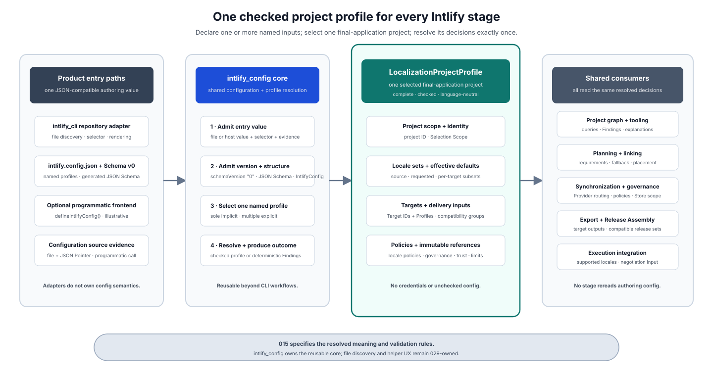
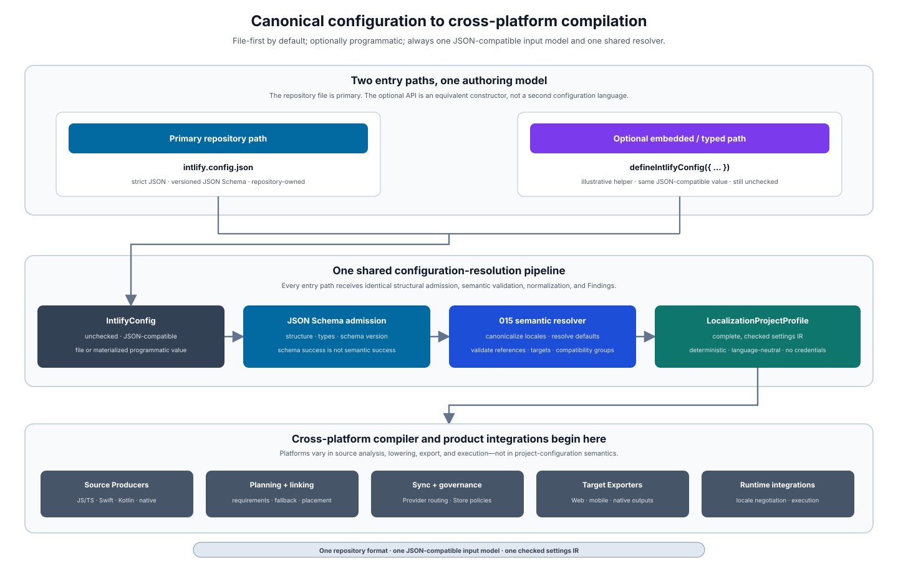
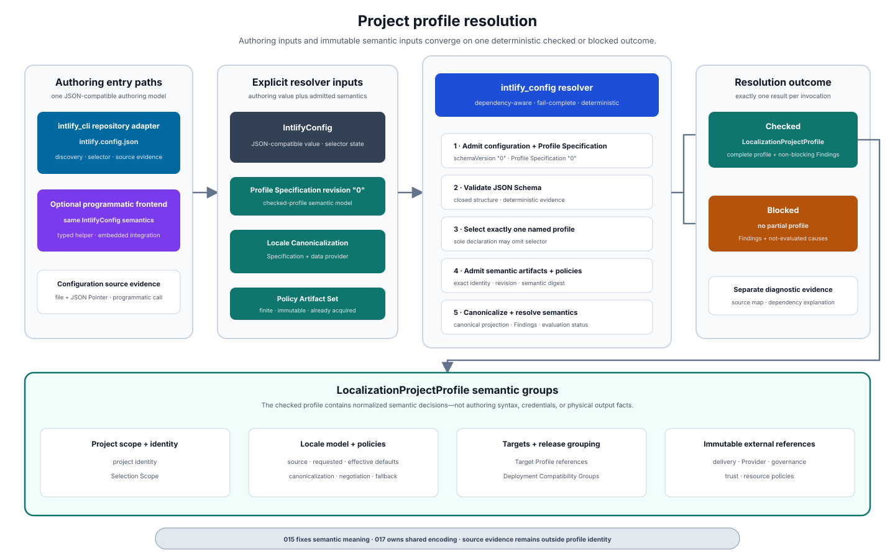

# Intlify Project Profile and Locale Policy Design

## Purpose

This design defines how one named input selected from a canonical repository configuration becomes the complete, checked `LocalizationProjectProfile` consumed by shared Intlify compiler stages. The primary repository input is `intlify.config.json`, described by a versioned JSON Schema. An optional programmatic frontend, such as a future `defineIntlifyConfig()`, may safely snapshot host input for materialization into the same JSON-compatible configuration value, but it does not create a second configuration language or bypass admission into `IntlifyConfig`.

One repository configuration may declare one or more named profile inputs. Each resolver invocation selects exactly one of them and produces the profile for one final-application localization project.

In practical terms, the profile gives every downstream stage the same answers to four questions:

- which localization project and Selection Scope are being processed;
- which source and requested locales apply, including project defaults, target subsets, and effective defaults;
- which Target Profiles, Deployment Compatibility Groups, and delivery inputs belong to the selected build; and
- which versioned negotiation, fallback, coverage, Provider, governance, trust, and resource policies apply.



The following example shows the file-first path and the optional programmatic path converging before shared compilation. The programmatic API name is illustrative; its input semantics are not separate from `intlify.config.json`.



The shared Rust crate `intlify_config` owns the `IntlifyConfig` authoring model, configuration-schema version admission, JSON Schema definition and generation, named-profile selection, semantic resolution, configuration Findings, and the `LocalizationProjectProfile` settings IR. Each resolver implementation embeds one exact Resolver Construction Admission Specification as its non-overridable construction root. Under that root, each resolver instance is constructed from one complete Resolver Construction Input Set whose five components independently admit the Localization Project Profile Specification Schema, the Active Project Profile Specification, the Configuration Schema Authority Set, the Project Profile Resolver Capability Specification, and the complete Normative Resolver Registry Package before yielding one Resolver Construction Identity. It defines provider-driven locale-canonicalization, typed Profile Resolution Specification Input, explicit Intent Surface-Class Vocabulary Artifact, Resource Limit Policy Verification Input, and submitted-artifact-collection boundaries but does not embed raw or generated CLDR data or acquire artifacts. `intlify_cli` is a product adapter: it discovers and reads repository configuration, normalizes the user-facing selector, supplies an admitted vocabulary artifact, canonicalization data artifact, Resource Limit Policy Verification Input, Admitted Implementation Capability, and one finite already acquired Submitted Profile Resolution Artifact Collection through the Resolver Invocation Input Set, calls `intlify_config`, and renders the outcome. Optional programmatic frontends call the same core rather than depending on CLI internals.

Planning, synchronization, linking, export, Release Assembly, tooling, and execution integrations consume the resulting settings IR plus explicitly projected admitted artifact bindings instead of rereading configuration, reacquiring artifacts, or inventing their own defaults. Cross-platform Producers, Lowering Backends, Target Exporters, and Runtime integrations begin downstream of this common configuration boundary. Credentials and other secrets remain outside both the profile and its artifact bindings.

## Goals

- Define what one resolved `LocalizationProjectProfile` represents and how it is identified.
- Define explicit named-profile selection when one repository configuration contains several final-application localization projects.
- Define the semantic split between author-facing `IntlifyConfig` and the checked `LocalizationProjectProfile` settings IR.
- Define `intlify.config.json` and its versioned JSON Schema as the primary repository configuration surface.
- Make `intlify_config` the reusable implementation owner of configuration models, schema generation, profile resolution, and the checked settings IR, while keeping product workflow in adapters such as `intlify_cli`.
- Require file-based and optional programmatic inputs to enter the same resolver with the same semantics, while keeping every live host value outside the resolver boundary.
- Define project requested locales, source-locale defaults, requested-locale defaults, per-Target-ID subsets, target overrides, and effective defaults.
- Keep requested-locale negotiation separate from message locale fallback and single-message evaluation.
- Define the profile inputs for coverage, Provider routing, approval, Glossary Sets, delivery, trust, and resource policies without taking ownership from their detailed designs.
- Define exact typed references and explicit presence states for externally owned Provider, governance, Glossary, trust, and resource policies without embedding their bodies or credentials in project configuration.
- Separate stable delivery specification and placement policy in the profile from the realized host-build Delivery Unit Graph and physical target output.
- Define how Target Profiles form one or more Deployment Compatibility Groups.
- Define deterministic resolution, validation, Finding production, and consumer-visible dependency inputs.
- Fix one revisioned, non-overridable Resolver Construction Admission Specification that closes construction envelopes, schema dialects and meta-schemas, construction-input safety limits, failure precedence, and cross-authority admission before any caller-supplied construction authority is trusted.
- Bind each resolver instance to one admitted Profile Specification Schema, Active Project Profile Specification, Configuration Schema Authority Set, Resolver Capability Specification, and Registry Package before invocation, then require the invocation's fixed-slot Profile Resolution Specification Input to assert the same profile specification.
- Make root `schemaVersion` selection depend only on the constructed finite Configuration Schema Authority Set rather than an implementation-embedded schema switch.
- Distinguish the construction-owned capability vocabulary and bootstrap minima from each invocation's admitted concrete capability value.
- Define one fixed-slot Profile Resolution Specification Input and one completely admitted Profile Resolution Specification Set so admission, profile semantics, reproducibility, and staleness use the same exact toolchain-owned specification members.
- Separate the unordered Submitted Profile Resolution Artifact Collection, which retains multiplicity for admission and resource accounting, from the duplicate-free Profile Resolution Artifact Set used for ordinary exact reference resolution, while admitting only the selected Resource Limit Policy candidate through one closed pre-Set bootstrap procedure.
- Define the non-semantic Resolved Profile Artifact Bindings that carry only referenced admitted Policy and Target Profile bodies to authorized consumers without copying them into the profile.
- Keep the reusable `intlify_config` core free of embedded CLDR-derived data by admitting canonicalization through a versioned provider and separate data artifact.
- Make invalid, ambiguous, incomplete, or incompatible configuration fail before synchronization, linking, export, or production execution.
- Provide construction, pre-invocation admission, and paired resolver fixtures for the shared implementation, plus explicitly owned handoff vectors that downstream consumers can use without making their behavior part of resolver conformance.

## Non-Goals

- Defining TOML, YAML, framework-specific, or platform-specific configuration formats equivalent to `intlify.config.json`.
- Freezing the name, package, or language binding of an optional programmatic configuration helper such as `defineIntlifyConfig()`; those product-facing details belong to [029](./029-intlify-product-workflow-and-packaging-design.md).
- Defining repository-root discovery, workspace profile selection, command-line option precedence, or configuration UX owned by [029](./029-intlify-product-workflow-and-packaging-design.md).
- Defining formatter, linter, or other unrelated tool-specific root sections; version `"0"` does not include them, and a later root-schema addition requires its own explicit versioned decision.
- Defining source authoring, `intent()`, `mf2`, Intent identity, source-evidence rules, surface-class assignment, or vocabulary authoring/generation workflow owned by [016](./016-intlify-source-authoring-and-intent-identity-design.md) and [029](./029-intlify-product-workflow-and-packaging-design.md).
- Defining the complete shared-artifact wire encoding, canonical digest framing, specification-version admission, or migration mechanism owned by [017](./017-intlify-shared-artifact-and-version-admission-design.md).
- Defining canonicalization data acquisition, download, installation, cache layout, or offline product UX owned by [029](./029-intlify-product-workflow-and-packaging-design.md).
- Defining Policy or Target Profile artifact discovery, registry protocols, acquisition, installation, cache layout, or offline product UX owned by [029](./029-intlify-product-workflow-and-packaging-design.md), or each artifact body's schema and admission semantics owned by 017, 018, 021, 022, and 024.
- Defining trust roots, credentials, signatures, actor authorization, or provenance evidence owned by [018](./018-intlify-security-trust-and-provenance-design.md).
- Defining the project graph, common Finding envelope, cache implementation, or query protocol owned by [019](./019-intlify-project-graph-query-and-incremental-design.md).
- Defining requirement-planning, message-locale-fallback selection, reachability, Bundle Plan, or pruning algorithms owned by [020](./020-intlify-requirement-planning-and-linking-design.md).
- Defining Provider/TMS transport, candidate lifecycle, governance decisions, or Translation Store protocols owned by [021](./021-intlify-translation-store-and-governance-design.md) and [022](./022-intlify-provider-and-localization-sync-design.md).
- Defining Target Profile capabilities, target artifact formats, generated bindings, or export behavior owned by [024](./024-intlify-target-profile-and-export-design.md).
- Defining Release publication, deployment activation, execution admission, withdrawal, or rollback owned by [025](./025-intlify-release-assembly-and-deployment-design.md).
- Defining one physical Runtime implementation owned by [027](./027-intlify-reference-runtime-design.md).

## Ownership and Dependencies

This document owns the semantic meaning and deterministic resolution rules of the resolved `LocalizationProjectProfile`, including locale sets, locale defaults, locale-policy inputs, project-scoped Target ID entries, and Deployment Compatibility Group declarations.

It defines the information that downstream specifications may rely on. It does not absorb their internal policy evaluation, artifact, execution, or deployment responsibilities.

| Area | Responsibility relative to this design |
| --- | --- |
| Canonical configuration input | Defines the exact closed version-`"0"` `intlify.config.json` project-profile members, analyzes every entry path into one internal Structural Analysis Result, and produces `IntlifyConfig` only after complete structural admission |
| `intlify_config` crate | Owns the authoring model, configuration-schema version and JSON Schema generation, dependency-aware structural analysis, complete structural admission, the built-in Resolver Construction Admission Specification, all five Resolver Construction Input Set authority components and their cross-admission, origin-kind admission, configuration-source, Profile Selector, and Resolver Input evidence projection and retained-identity validation, profile selection, semantic resolver, fixed-slot Profile Resolution Specification Input admission, submitted-artifact-collection admission, canonicalization-provider boundary, configuration Findings, checked profile IR, Resolver Conformance Suite harness, producer-side Handoff Vector validation, and traceability check without embedding CLDR-derived data or acquiring artifacts |
| JSON Schema validation | Runs through `intlify_config`, produces structural Findings and independently admitted typed fragments, and creates `IntlifyConfig` only when the complete 015-owned project-profile input is structurally valid |
| `intlify_cli` adapter | Owns repository discovery, file I/O, exact file-source identity/revision and canonical locator inputs, fixed `configuration-file` and `profile-selector-cli` origin-kind mapping, CLI selector acquisition and External Profile Selector Input construction, acquired canonicalization-data and Submitted Profile Resolution Artifact Collection assembly, command integration, and outcome rendering without owning configuration semantics |
| Optional programmatic frontend | Safely inspects a live host value into one complete inert Programmatic Entry Snapshot plus its exact Programmatic Entry identity/revision and optional canonical locator inputs, optionally supplies one bounded Programmatic Call-Site Evidence Input, safely normalizes the selector into the fixed External Profile Selector Input, maps configuration and selector entry to the fixed programmatic origin kinds, and enters the shared materialization and `IntlifyConfig` admission path; exact API naming, packaging, and language bindings remain 029-owned |
| 015 project-profile resolver | Is implemented by `intlify_config`; uses only admitted typed fragments for dependency-aware fail-complete analysis, requires complete `IntlifyConfig` before profile projection, and returns either one complete `LocalizationProjectProfile` or a blocked outcome with no partial profile |
| 015 Handoff Vector Set | Fixes producer profile facts and consumer-input relationships without executing downstream behavior; `intlify_config` validates producer facts and each named downstream owner validates its own relationship |
| Locale canonicalization provider | Supplies one already acquired, immutable data artifact through a read-only boundary; it performs no implicit network access and cannot select alternate semantics |
| Resolver construction and invocation boundaries | One built-in Resolver Construction Admission Specification admits one complete five-component Resolver Construction Input Set and produces one immutable revision-specific resolver plus Resolver Construction Identity; one invocation then accepts only the Resolver Invocation Input Set and creates Derived Admission State without replacing its construction authority |
| Resolver Construction Admission Specification | Supplies the exact non-overridable construction-envelope grammar, supported schema dialects and meta-schemas, construction-input limits, validation precedence, and cross-authority rules used before any of the five submitted construction components can become authority |
| Localization Project Profile Specification Schema | Independently validates the complete Profile Specification body before that body can become resolver authority; its exact identity, revision, complete body, and digest are construction inputs rather than registry members or profile semantics |
| Active Project Profile Specification | Supplies the exact Profile Specification identity/revision/semantic digest and complete schema-admitted body used from the first resolver phase; it is admitted from the Resolver Construction Input Set before any invocation can produce a 015 outcome |
| Configuration Schema Authority Set | Supplies one exact Active Project Profile Specification association plus the closed mapping from each admitted root `schemaVersion` to one exact configuration-schema identity, revision, JSON Schema dialect, complete schema body, and canonical digest; it is construction authority, not profile semantics |
| Project Profile Resolver Capability Specification | Supplies the closed capability group and bound vocabulary, units, comparisons, canonical order, and mandatory bootstrap-minimum vector used to admit each invocation's concrete capability value |
| Profile Resolution Specification Input and Set | The input is one typed record with eight fixed optional slots; Phase 0 verifies its `project-profile` assertion against the active specification, later admission verifies the other seven slots, and only complete success creates the closed Profile Resolution Specification Set |
| Intent Surface-Class Vocabulary Artifact | Supplies one finite already acquired project vocabulary before profile resolution; `intlify_config` matches its identity/revision/digest to the fixed-slot assertion, validates its duplicate-free canonical member set, and uses that set to construct coverage cells without inferring vocabulary membership from the current source scan |
| Submitted Profile Resolution Artifact Collection and admitted Set | The input collection is finite, unordered, already acquired, immutable, and multiplicity-preserving; `intlify_config` performs the closed Bootstrap Resource Policy Candidate Admission without creating a Set, then bounds and validates every Policy and Target Profile envelope, rejects duplicate or conflicting envelopes, and creates the duplicate-free Profile Resolution Artifact Set used for ordinary exact reference resolution, while each artifact specification owns body admission |
| Resolved Profile Artifact Bindings output | Projects exactly the distinct referenced admitted Policy and Target Profile bodies needed after a checked resolution as a non-semantic sidecar; 015 owns its exact domain and matching invariants, while each downstream owner admits the minimum binding subset required by its operation |
| ICU4X reference adapter | Initial physical implementation using `icu_locale` without default compiled data and an explicit ICU4X data provider; it remains subordinate to Intlify conformance |
| 016 source authoring | Supplies Intent source-locale declarations, consumes the exact checked vocabulary artifact when assigning or validating each Intent surface class, and uses the resolved default only when source authoring omits one |
| 017 shared artifacts | Defines shared encodings, version admission, canonical identities, migration, Intent Surface-Class Vocabulary and canonicalization-data-artifact representation/admission, `PolicyReference`/`TargetProfileReference` representation, Profile Resolution Artifact encoding, and Finding/evidence encoding for the resolved model |
| 018 trust and provenance | Defines trust inputs, delegation, credentials, signatures, authorization, the non-secret Resource Limit Policy Verification Input, and the Resource Limit Policy artifact's common structure plus trust, signature, integrity, and common-body admission rules; 015 uses that explicit verification input under admitted implementation capacity, selects the sole bootstrap candidate, and defines its `projectProfileResolution` section |
| 019 project graph and queries | Tracks profile dependencies and represents, queries, and projects Findings, evaluation status, suppression causes, and explanations to clients |
| 020 planning and linking | Selects exactly one Deployment Compatibility Group per transaction; consumes its locale, coverage, fallback, target-applicability, and delivery-policy inputs; admits graph applicability as an exact partition of selected targets; and owns reachability and placement |
| 021 Store and governance | Consumes Selection Scope and governance-policy references without redefining locale policy |
| 022 synchronization | Consumes Provider-routing, Glossary Set, refresh, and applicable locale-demand inputs |
| 023 localization execution | Consumes locale-negotiation, locale-service, and scoped-locale semantics |
| 024 target export | Owns Target Profile capability and the physical output paths, chunk/resource identities, loader relationships, and target-artifact details derived from selected placement |
| 025 Release and deployment | Owns one independent Release boundary per selected Deployment Compatibility Group, hydration-coupled execution consistency, publication, activation, rollback, and other Release behavior |
| 029 product workflow | Owns file discovery, workspace selection, user-facing selector input, adapter-specific file logical-source/Source-content, Programmatic Entry, and Call-Site Source identity/revision algorithms and stable versioned identity-domain construction, adapter-side Portable Source Locator canonicalization including any IDNA-to-A-label conversion, commands, schema packaging, optional helper API UX, Intent Surface-Class Vocabulary, canonicalization-data, Resource Limit Policy Verification Input, and Profile Resolution Artifact acquisition and caching, and product packaging without defining alternate configuration or profile-selection semantics |

## Inherited Decisions from 000

The following are fixed inputs from the overview and are not open questions in this document:

- shared compiler stages consume a resolved language-neutral profile rather than unchecked authoring configuration;
- each Message Intent has exactly one source locale;
- a project default source locale applies only when source authoring omits an Intent source locale;
- libraries retain the source locale of each published Intent;
- requested locale is a semantic dimension and does not imply one emitted artifact per locale;
- the project default requested locale is independent of the default source locale;
- each project target entry declares a supported requested-locale subset of the project set;
- a project target entry may override the project default requested locale;
- each Target ID resolves exactly one effective default requested locale inside its supported subset;
- locale negotiation, message locale fallback, and single-message evaluation are separate operations;
- one Locale Compiler transaction covers exactly one selected Deployment Compatibility Group;
- independently released groups have independent Requirement Plans and Release Snapshots; and
- Provider, TMS, governance, or production credentials never become ordinary resolved-profile data available to build or execution stages.

## Terminology

The product-wide definitions in 000 remain authoritative. This section defines the narrower profile-specific semantics and relationships used by this specification.

| Term | Definition in this specification |
| --- | --- |
| JSON-compatible configuration value | Finite materialized tree composed only of objects with unique Unicode-scalar string keys, arrays without holes, Unicode-scalar strings, Portable JSON Numbers, booleans, and `null`; it has not yet passed configuration-version or JSON Schema admission |
| Portable JSON Number | Revision-`"0"` numeric value represented as a finite IEEE 754 binary64 value whose absolute value is at most `9007199254740991`; negative zero is normalized to positive zero before materialization |
| ResourceBoundValue | Shared logical numeric domain for every `policyComparable`, `bootstrapOnly`, and `projectProfileResolution` bound: an unsigned integer in `1..=18446744073709551614` (`u64::MAX - 1`). Its canonical semantic form is eight-byte unsigned big-endian; JSON artifacts and fixtures use the shortest non-zero ASCII decimal string so JavaScript number precision cannot alter it |
| Programmatic Entry Snapshot | Complete finite immutable binding-owned input produced by safe inspection of a live host value without invoking accessors, coercion, serialization hooks, iterators, or other user code. It contains one canonical typed tree of admitted inert data nodes and safely established rejected-node markers, preserves every independently established invalid sibling, and is accompanied by its canonical snapshot-content digest. Internal Snapshot Structural Paths locate nodes during inspection; the resolver receives this snapshot rather than the live host value and either materializes one complete JSON-compatible value or produces a blocked entry result with no partial value |
| Snapshot Structural Path | Binding-internal path into one Programmatic Entry Snapshot, composed from actual admitted object keys and array indices established during safe inspection. It may guide resolver evidence projection but is never retained in Resolution Evidence, Finding identity, logs, or caches |
| Programmatic Entry identity | Required bounded exact non-semantic identity for one adapter-defined logical programmatic configuration input; it remains stable across Programmatic Entry revisions and is independent from an optional call-site source identity |
| Programmatic Entry revision | Required bounded exact non-semantic revision paired with one Programmatic Entry identity; within that adapter identity domain, an equal identity/revision pair always denotes an equal complete canonical Programmatic Entry Snapshot and matching snapshot-content digest |
| Programmatic Call-Site Evidence Input | Optional finite immutable non-semantic sidecar containing exactly one call-site source identity/revision, its exact UTF-8 source snapshot, and a bounded duplicate-free mapping from Programmatic Entry Snapshot Structural Path plus a closed location role to a half-open byte-span candidate. It supplies only provable Entry evidence and never changes materialized configuration or profile semantics |
| Call-Site Source revision | Required bounded exact non-semantic revision paired with the call-site source identity inside a present Programmatic Call-Site Evidence Input; an equal identity/revision pair always denotes byte-identical UTF-8 source snapshot bytes |
| Structural Analysis Result | Internal, non-semantic result of schema-guided analysis over one JSON-compatible configuration value, containing structural Findings, source evidence, per-fragment admitted or unavailable status, and every typed fragment that can be established independently; it is not `IntlifyConfig`, is never consumed as checked configuration, and has no public artifact identity |
| `IntlifyConfig` | Structurally admitted but semantically unresolved author-facing model produced after configuration-version and JSON Schema admission |
| `intlify.config.json` | Primary repository configuration document that declares one or more named project-profile inputs |
| Programmatic configuration frontend | Optional typed or embedded API whose binding safely constructs a Programmatic Entry Snapshot for resolver materialization without introducing different semantics |
| Configuration schema version | Configuration-specific string version admitted by `intlify_config`; its initial value is `"0"` and it is independent of CLI reporter and shared-artifact versions |
| Profile ID | Configuration-scoped opaque name used to select one profile declaration; it is not inferred from a package path, target, or Selection Scope |
| Target ID | Project-scoped semantic identity for one Target Profile use inside a selected project; it is independent from the exact Target Profile artifact identity and is included in profile equality and digest inputs |
| Configuration source evidence | Umbrella term for non-semantic Entry Source Evidence and Materialized Value Evidence retained for Findings and source maps |
| Localization Project Profile Specification Schema | Independent resolver-construction authority containing one exact identity, revision, complete schema body, and canonical digest that validates the complete Localization Project Profile Specification body |
| Active Project Profile Specification | Resolver-construction authority consisting of one exact Localization Project Profile Specification identity/revision/semantic digest and complete body admitted by the constructed Profile Specification Schema; it supplies every 015 phase and references the separately admitted registry, configuration-schema, and capability authorities |
| Configuration Schema Authority Set | Finite immutable construction authority carrying one exact Localization Project Profile Specification identity/revision/semantic-digest association plus a closed mapping from each admitted configuration `schemaVersion` string to one configuration-schema identity, exact revision, JSON Schema dialect, complete schema body, and canonical digest; root `schemaVersion` can select only one member of this already profile-associated set |
| Safe Origin Kind | Required registry-owned non-secret identity of the fixed input boundary that supplied one origin-bearing Entry evidence item; it is distinct from evidence kind, adapter identity, source identity, locator, and transport metadata and never enters Shared Resolution Evidence |
| External Profile Selector Input | Closed binding-produced resolver input that is exactly `absent`, one complete bootstrap-bounded Unicode-scalar UTF-8 string, `over-limit-string`, or one safely established invalid top-level JSON type tag; it never contains a live host object or traversed array/object content |
| Provisional Selector Observation | Bounded internal bootstrap state derived from the External Profile Selector Input under `policyComparable.configurationInput.maxProfileIdBytes`; it supports provisional selection but is never retained as Evidence, tokenized, assigned a Finding Occurrence Key, or exposed as resolver output |
| Profile Selector Evidence Projection | Closed final non-semantic retained representation of the external selector slot; it is exactly `absent`, `safe-profile-id`, or `redacted-value`, is constructed only after its bootstrap-or-policy authority is fixed, and never exposes an arbitrary rejected or unknown selector value |
| String Length Fact | Selector-evidence-only disclosure fact that is absent for a non-string and is exactly `exact(n)` for one completely counted UTF-8 string within the final projection authority's bound or `over-limit` after bounded inspection establishes that bound was crossed without retaining the observed final length |
| Resolver Input Component Path | Required non-dereferenceable origin-relative logical path for `specification-input`, `artifact-input`, `verification-input`, or `implementation-capability` Evidence; the empty path denotes that complete input and every non-root segment is exactly `fixed-role`, `safe-key`, or `redacted-key` |
| Portable Source Identity | Required bounded disclosure-safe retained identity for one adapter-defined logical configuration or programmatic source; it is exactly one typed variant—`safe-opaque` or `redacted`—derived from the applicable admitted file logical source, Programmatic Entry, or Call-Site Source identity, remains stable across that identity's content revisions, and stays separate from an optional human-facing locator |
| Source-content revision | Bounded exact non-semantic revision paired with one admitted file logical source identity; within that adapter identity domain an equal identity/revision pair always denotes a byte-identical file source snapshot, and any source-byte change requires an unequal revision. Programmatic Entry Snapshot and call-site source content instead use their separately typed Programmatic Entry and Call-Site Source revisions |
| Portable Source Locator | Optional non-secret presentation locator attached to a Portable Source Identity; it is exactly one canonical typed variant—`relative-path`, `safe-label`, or `safe-uri`—and never determines semantic or Finding identity by itself |
| Portable Source Span | Optional non-semantic half-open byte interval `[startByte, endByte)` over the exact source snapshot admitted for the applicable file logical-source/Source-content pair or Programmatic Call-Site Source identity/revision pair represented by its enclosing Portable Source Identity; it is retained only after bounded coordinate validation and never contains line or column numbers |
| Redacted evidence token | Complete domain-separated SHA-256 token over a registry-admitted safe evidence projection, with the same deterministic collision-separation rule as a Redacted subject token; excluded arbitrary or secret-bearing values are never direct token inputs |
| Logical input path | Optional bounded disclosure-safe non-dereferenceable structural path retained only by Entry Source Evidence before materialization; a present root is the empty segment sequence, and every non-root segment is exactly one of `safe-member`, `array-index`, or `redacted-member`. The resolver projects it from an internal Snapshot Structural Path or parser path under the active registry; a binding never chooses its disclosure variants |
| Portable Value Locator | Required disclosure-safe locator for Materialized Value Evidence; it is either an exact RFC 6901 JSON Pointer whose every member segment is classified non-secret, or a non-dereferenceable redacted logical value path whose unsafe dynamic-member segments are replaced by Redacted evidence tokens |
| Entry Source Evidence | Origin and best available location information that exists before a JSON-compatible value is materialized; it never requires a materialized-value locator when parsing or Programmatic Entry Snapshot admission cannot establish one |
| Materialized Value Evidence | Portable Source Identity plus one Portable Value Locator into a materialized JSON-compatible value, an optional Portable Source Locator, and an optional Portable Source Span; an exact internal JSON Pointer is not itself retained evidence when any segment is unsafe |
| Resolution outcome | Conceptual result of one resolver invocation: `checked` with one complete profile and bindings, or `blocked` with neither; both variants always carry the exact Resolver Construction Identity and one Resolution Evidence bundle, and these labels do not reserve a public API shape |
| Resolution Evidence | Bounded non-semantic resolver-output bundle containing one Entry Resolution Evidence projection, an optional Shared Resolution Evidence projection available only after materialization, shared-unavailability causes when absent, and bundle-level completeness plus a canonical set of domain-specific terminal states |
| Shared Resolution Evidence | Entry-independent projection produced only after one JSON-compatible value exists and reproducible from the Materialized Resolution Input Set; it contains structural/semantic Findings and evaluation status, Coverage Decision Basis records, established semantic dependency records, and materialized re-resolution dependency records |
| Entry Resolution Evidence | Entry-specific projection containing resolver-bootstrap and configuration-entry Findings and evaluation status, Finding Occurrences, Coverage Decision Evidence, the source-evidence index needed to resolve them, resolver-input, entry-source, and selector-origin dependency records, and no profile semantics |
| Resolution Evidence completeness | Bundle-level state indicating whether every safely required unit in each applicable diagnostic reporting domain and every available or causally unavailable Shared projection is accounted for; it is independent from ordinary checked/blocked validation, and revision `"0"` is incomplete only after terminal diagnostic-reporting exhaustion in one or both applicable domains |
| Diagnostic reporting domain | One of two independently bounded reporting and record-admission domains: `entry` owns resolver-bootstrap and configuration-entry Findings and evaluation status, every retained Finding Occurrence, Coverage Decision Evidence, source-evidence-index records, resolver-input, entry-source, and selector-origin dependency records, and shared-unavailability cause references; `shared` accounts for pre-deduplication Shared Finding candidates and owns Shared Findings and evaluation status, Coverage Decision Basis, semantic dependency records, and materialized re-resolution dependency records; each domain owns its reserved terminal reporting records, and exhaustion in one domain cannot truncate records in the other |
| Evidence record owner | Canonically selected internal evaluation-unit cursor `(phase, subject kind, Logical subject key, check)` assigned to every retained ordinary Entry or Shared record; it determines projection-slice membership, accounting order, and rollback, while an exposed cursor substitutes the corresponding Redacted subject token and neither form changes profile semantics |
| Logical subject key | Entry-location-independent internal identity and order key for one check subject, derived under the Check Registry's closed subject-key strategy from a singleton, stable schema field, canonical semantic identity, schema-guided Canonical content identity, or semantic sequence position; only its Redacted subject token may enter Resolution Evidence |
| Canonical content identity | Collision-free transient internal identity of one materialized JSON-compatible value under schema-declared ordered-versus-unordered collection semantics; it is used only for safe comparison, grouping, ordering, projection, and digest-collision detection and is never serialized into Resolution Evidence |
| Subject content projection | Check-Registry-declared safe projection used when a Logical subject key depends on canonical identity or content; it is either an allowlisted non-secret content projection or a redacted structural projection that excludes all arbitrary scalar content |
| Redacted subject token | Bounded externally retainable representation of one projected Logical subject key, produced by the registry-pinned domain-separated SHA-256 procedure and deterministic collision handling; Finding Keys, suppression causes, exposed evaluation-unit cursors, and dependency records contain this token rather than raw subject content |
| Finding Occurrence ordinal | Zero-based unsigned multiplicity ordinal included in every Finding Occurrence Key and assigned within candidates sharing one Finding Key and one admitted disclosure-safe primary-evidence identity after candidate-level limit admission but before retained-record construction and record-level byte accounting; it starts at zero even for one candidate and preserves indistinguishable occurrence multiplicity without using physical input order or excluded content |
| Evaluation status | Deterministic record of which specified phase and subject checks were evaluated or not evaluated, including the causal blocking Finding Keys for each dependency-suppressed check; an unevaluated check is not itself a synthetic Finding |
| Project Profile Resolver Capability Specification | Resolver-construction authority containing one exact identity, revision, complete body, and canonical digest. It closes every capability group and bound ID, value type, unit, comparison rule, canonical bound order, the `policyComparable` versus `bootstrapOnly` classification, and the minimum vector required to construct every mandatory outcome and terminal record |
| Admitted Implementation Capability | Complete finite immutable invocation capability value normalized by a binding or adapter against the constructed Project Profile Resolver Capability Specification before resolver invocation. Its `policyComparable` bounds are the sole pre-policy authority for exactly the Resource Limit Policy-comparable namespaces, while `bootstrapOnly` bounds cover only non-comparable raw entry, Snapshot, selected-candidate verification overhead, Evidence metadata, and mandatory-reserve work and are never compared with semantic Policy |
| Bootstrap admission | Processing under the already admitted Active Project Profile Specification and Admitted Implementation Capability that may materialize and structurally analyze input, create only a Provisional Selector Observation, provisionally select one Profile ID, and admit only the selected resource-limit reference and artifact needed to establish the semantic Resource Limit Policy; it creates no checked profile or final selector-evidence fact |
| Bootstrap Resource Policy Candidate Admission | The only pre-Set artifact-reference procedure: under Admitted Implementation Capability, it scans the complete submitted collection's envelope metadata, classifies candidates by the selected `resourceLimits` exact-reference and conflict-group predicates, applies the closed mismatch precedence, and admits exactly one Resource Limit Policy candidate without creating a Profile Resolution Artifact Set or admitting any unrelated artifact |
| Provisional profile selection | Internal Profile ID selection performed under bootstrap admission solely to locate the selected declaration's required resource-limit reference; it becomes confirmed resolver selection only after the admitted policy has been reapplied to the complete protected input |
| Localization Project Profile Specification | Intlify-owned semantic specification for the normalized checked-profile model; its initial revision is `"0"` and its version domain is independent of configuration schema, artifact encoding, package, and Runtime ABI versions |
| Profile semantic equality | Equality of the Profile Specification identity, revision, canonical semantic digest, and every remaining field in the canonical semantic projection; the digest identifies the exact admitted semantic specification body but does not replace field-for-field equality of the rest of the projection |
| Resolver construction staleness | State in which the Resolver Construction Identity changed; the resolver must be rebuilt under the exact new Resolver Construction Admission Specification from the new complete Resolver Construction Input Set, and every outcome from the prior construction is stale |
| Resolver invocation staleness | State in which any logical field or occurrence of the complete Resolver Invocation Input Set changes under the same Resolver Construction Identity, including Common Invocation, file-entry, or programmatic-entry inputs, their Safe Origin Kinds, and collection multiplicity. Materialized Resolution Input is a derived replay snapshot rather than the definition of caller-input staleness; representation or order changes that preserve the applicable normalized logical value do not create staleness, while a stale invocation does not imply that the newly resolved profile has different semantics |
| Resolver Construction Admission Specification | Revisioned finite immutable construction root built into a conforming resolver implementation and pinned by identity, revision, complete body, and canonical digest in the Conformance Suite Index. It closes authority-envelope shapes, supported JSON Schema dialects and meta-schemas, construction-input byte/depth/count/work bounds, construction-failure precedence, and cross-authority admission. It is not a sixth caller-supplied Resolver Construction Input Set component and cannot be selected or overridden by configuration, an invocation, or an adapter |
| Resolver Construction Input Set | Finite immutable construction authority containing five independently admitted components: the Localization Project Profile Specification Schema; the Localization Project Profile Specification; the Configuration Schema Authority Set and every mapped complete schema body; the Project Profile Resolver Capability Specification; and the complete Normative Resolver Registry Package. Every component carries its exact identity, revision, complete body, and canonical digest; mappings also carry their closed role or `schemaVersion` key and JSON Schema dialect where applicable. Digest references alone do not reproduce this set |
| Resolver Construction Identity | Compact canonical identity of one successfully constructed revision-specific resolver. Revision `"0"` is the full SHA-256 digest of the 015-owned domain-separated, typed, length-prefixed canonical construction frame and is presented as `rci0_` plus unpadded base64url; it identifies rather than replaces the complete construction authority |
| Intent Surface-Class Vocabulary Artifact | Explicit finite immutable already acquired invocation artifact envelope declaring one vocabulary identity, exact revision, semantic digest, and finite member collection under the asserted vocabulary specification. Successful admission requires body integrity and one complete duplicate-free canonical member set; invalid submitted bodies remain reportable input rather than partial vocabulary authority, and membership is never inferred opportunistically from the current source scan |
| Resource Limit Policy Verification Input | Required finite immutable 018-owned non-secret input that fixes the exact bootstrap verification authority for the selected Resource Limit Policy candidate, including its identity, revision, complete admitted public verification material, and semantic digest. It permits no ambient trust-store, network, or credential lookup, is never profile semantics, and is distinct from the later project-selected Trust Policy |
| Common Invocation Input Set | Complete finite immutable invocation inputs shared by the file and programmatic entry alternatives: the Profile Resolution Specification Input, Intent Surface-Class Vocabulary Artifact, Locale Canonicalization Data Artifact, Submitted Profile Resolution Artifact Collection, Resource Limit Policy Verification Input, and Admitted Implementation Capability, each with its exact required Safe Origin Kind. It contains no entry bytes, Snapshot, source identity, locator, call-site sidecar, or selector |
| Resolver Invocation Input Set | Finite immutable values submitted for one invocation: one exact Resolver Construction Identity reference, one complete Common Invocation Input Set, and exactly one complete file or programmatic Entry Admission Input Set. It contains every semantic, source, selector, and content value required by that entry path; no value is duplicated between the common and entry sets and no harness or resolver default completes it |
| Derived Admission State | Resolver-internal checked or rejected states created from construction and invocation inputs, including the JSON-compatible configuration value, Configuration Schema Selection, Structural Analysis Result, `IntlifyConfig`, confirmed selector, Profile Resolution Specification Set, admitted Resource Limit Policy, and Profile Resolution Artifact Set; none is a caller-supplied invocation input |
| Configuration Schema Selection | Derived structural-admission state that is either `selected` with the exact configuration-schema identity/revision/digest from the constructed Configuration Schema Authority Set or `unavailable` with canonical causal Finding Keys when the root or `schemaVersion` cannot select a member. It is recomputed from the materialized value and construction authority and is never a Materialized Resolution input |
| Entry Admission Input Set | Complete finite immutable inputs specific to exactly one entry path. File entry contains raw configuration bytes, exact logical source identity, Source-content revision, fixed `configuration-file` origin, optional normalized locator, External Profile Selector Input, and fixed `profile-selector-cli` origin. Programmatic entry contains the complete canonical Programmatic Entry Snapshot plus its verified canonical snapshot-content digest, exact Programmatic Entry identity/revision, fixed `configuration-programmatic` origin, optional normalized locator, optional complete Programmatic Call-Site Evidence Input, External Profile Selector Input, and fixed `profile-selector-programmatic` origin. Parser implementation identity, frontend identity/version, raw-file fixture digest, and an independent programmatic-rule revision are conformance or implementation metadata rather than resolver inputs; the live host value is never part of this set |
| Materialized Resolution Input Set | Finite immutable replay snapshot created only after entry materialization. It contains the matching Resolver Construction Identity reference, complete JSON-compatible configuration value, normalized External Profile Selector Input, complete fixed-slot Profile Resolution Specification Input, Intent Surface-Class Vocabulary Artifact, Locale Canonicalization Data Artifact, complete Submitted Profile Resolution Artifact Collection including multiplicity and unreferenced artifacts, exact Resource Limit Policy Verification Input, and exact Admitted Implementation Capability. Together with the matching Resolver Construction Admission Specification and Resolver Construction Input Set it reproduces shared structural and semantic resolution. It contains no Configuration Schema Selection, confirmed selector, admitted Resource Limit Policy, Profile Resolution Specification Set, Profile Resolution Artifact Set, Structural Analysis Result, Finding, or evaluation status and is not a second caller input |
| Canonical resolution traversal | Revision-`"0"` logical order used for deterministic accounting, subject enumeration, and check scheduling after materialization; it is independent of JSON object-member order, filesystem enumeration, Submitted Profile Resolution Artifact Collection order, and worker completion |
| Profile Resolution Specification Input | Closed typed toolchain-supplied record containing exactly eight fixed optional fields for the Localization Project Profile, Locale Canonicalization, Locale Negotiation, Message Locale Fallback, Coverage, Intent Surface-Class Vocabulary, Delivery Graph, and Delivery Placement Policy assertions; its vocabulary assertion identifies the separately supplied Intent Surface-Class Vocabulary Artifact, and unknown or duplicate raw members cannot enter this resolver input |
| Profile Resolution Specification Set | Closed finite immutable admitted value created only when all eight fields of the Profile Resolution Specification Input are present, supported, mutually compatible, and the `project-profile` assertion exactly matches the Active Project Profile Specification; configuration and host APIs cannot select or override its members |
| Submitted Profile Resolution Artifact Collection | Finite unordered immutable multiplicity-preserving resolver input containing every already acquired Policy and Target Profile artifact envelope submitted to one invocation, including duplicate, conflicting, invalid, and unreferenced envelopes before admission; it performs no lookup or I/O |
| Profile Resolution Artifact Set | Closed finite immutable duplicate-free admitted value created from a successfully bounded and validated Submitted Profile Resolution Artifact Collection; only this set is used for ordinary exact reference resolution and checked Resolved Profile Artifact Bindings after the Bootstrap Resource Policy Candidate Admission has established the resolution bounds |
| Resolved Profile Artifact Bindings | Non-semantic checked-output sidecar mapping every distinct exact Policy or Target Profile reference retained by one checked profile to exactly one admitted artifact body from the duplicate-free Profile Resolution Artifact Set; it excludes unreferenced artifacts, canonicalization data, credentials, and acquisition metadata |
| Normative Resolver Registry Package | Required logical revision-`"0"` artifact set with exactly six fixed roles: Safe Origin Kind, Check, and Finding Registry schemas followed by their three complete registries. Each role has an explicit artifact identity, revision, complete body, and digest; the role name is not the artifact identity, and the Conformance Suite Index pins the closed role map before an implementation can claim revision-`"0"` readiness |
| Project Profile Resolver Conformance Suite | Versioned machine-readable fixture suite for the 015-owned construction, pre-invocation admission, and resolver-invocation lifecycle; revision `"0"` binds each case family's inputs, closed failure or expected outcome, entry-path applicability, evidence, dependency status, and traceability without defining a public profile wire format |
| Project Profile Resolver Construction Case | Closed conformance manifest that verifies resolver construction succeeds with one exact Resolver Construction Identity or fails before any resolver invocation, Finding, Evidence, dependency record, or cacheable outcome exists |
| Project Profile Resolver Input Admission Case | Closed conformance manifest that explicitly identifies one successful Resolver Construction and verifies one pre-invocation binding or adapter boundary admits and normalizes its input or rejects it without invoking the resolver or emitting a resolver Finding or Evidence |
| Project Profile Handoff Vector Set | Versioned machine-readable vectors that bind checked profile facts to separately owned downstream inputs and expected relationships; each vector names its verification owner and is not an `intlify_config` resolver pass/fail case |
| Cross-Version Conformance Obligation | Conditional traceability record activated only when the required configuration or semantic revisions coexist and an executable comparison can be constructed |
| Localization Project Profile | Checked project-configuration IR for one final-application localization project, including its exact scope, identity, required sections, and completeness rules |
| Locale identifier | Valid Unicode BCP 47 Locale Identifier as defined by UTS #35, used as the shared semantic locale namespace across project configuration and downstream specifications |
| Locale Canonicalization Specification | Versioned Intlify-owned semantic specification that identifies the exact UTS #35 algorithm and CLDR-derived data requirements and fixes the conformance fixtures used to derive canonical locale identity |
| Locale Canonicalization Data Artifact | Separately versioned, immutable, provider-readable realization of one Locale Canonicalization Specification, carrying a representation-independent canonical dataset identity and digest plus representation-specific integrity metadata |
| Locale canonicalization provider | Read-only boundary through which the resolver receives an already acquired data artifact without embedding it in `intlify_config` or performing network access |
| Project requested-locale set | Required finite non-empty set of explicit canonical requested locales, bounded by an admitted versioned resource-limit policy |
| Default source locale | Optional canonical project default inherited only by application-owned Intents that omit an explicit source locale; absence is an explicit checked profile state |
| Default requested locale | Required canonical project-wide negotiation default that must belong to the project requested-locale set and remains independent of the source default |
| Effective default requested locale | Exactly one canonical default per Target ID, resolved from its explicit override when present and otherwise from the project default |
| Target Profile reference | Exact immutable reference to one 024-owned Target Profile artifact and its checked capability/profile revision |
| Project target entry | Target ID plus one exact Target Profile reference, required requested-locale subset, optional default override, and resolved effective default |
| Deployment Compatibility Group | Non-empty exact set of Target IDs generated and assembled under one independent Requirement Plan and Release compatibility boundary |
| Deployment Compatibility Group ID | Project-scoped semantic identity used for exact compiler-transaction selection; no platform, package, path, target, or release semantics are inferred from it |
| Selected Deployment Compatibility Group | Exactly one checked group chosen as compiler-transaction input; it is not a project-profile default or a merge of several groups |
| Hydration coupling | Explicit finite directed relation from an SSR-capable Target ID to a Browser hydration-client Target ID in the same group, requiring compatible locale selection, selected definitions, logical rendering, and Release identity |
| Locale Negotiation Profile | Checked aggregate of one Locale Negotiation Specification identity/revision and one canonical alias map; it has no independent identity or revision and does not contain the dynamic preference sequence, target-supported set, or effective default |
| Portable lookup candidate sequence | Finite ordered canonical locale sequence derived from one canonical preference by testing the complete locale, removing each rightmost `u` or `t` extension atomically, then removing rightmost variants, region, and script without producing an empty candidate |
| Message locale fallback policy | Checked aggregate of one Message Locale Fallback Specification identity/revision and one canonical map from each applicable project requested locale to its complete ordered definition-locale candidate sequence; it has no independent identity or revision |
| Intent source-locale fallback candidate | Explicit semantic fallback candidate resolved by 020 to the checked source locale of each individual Intent; it is not the project source default or a literal locale stored in the fallback table |
| Coverage policy | Immutable versioned default and scoped-rule specification that resolves one effective coverage mode for each canonical requested locale × checked Intent surface class |
| Normalized coverage rule domain | Source-independent Cartesian product of one canonical project requested-locale member set and one checked Intent surface-class member set; an omitted selector dimension is logically expanded to its complete applicable set before equality, specificity, ordering, and duplicate-domain checks |
| Coverage Decision Basis | Source-independent non-semantic record for one established coverage cell containing its cell identity, `default` or `rule` decision kind, canonical matched rule-domain set when applicable, and effective mode; it belongs to Shared Resolution Evidence and is excluded from profile equality and digests |
| Coverage Decision Evidence | Entry-owned non-semantic record mapping one Coverage Decision Basis identity and decision source to admitted configuration or specification source evidence; it belongs to Entry Resolution Evidence and is excluded from profile equality and digests |
| Effective coverage mode | Exactly one of `direct-required` or `fallback-allowed`, resolved independently of source-equal fulfillment, target packaging, Store state, and fallback-candidate eligibility |
| Source-equal fulfillment | Derived state in which a requirement's requested locale equals its checked Intent source locale and the admitted source artifact fulfills direct demand without Provider work |
| Policy reference | Typed immutable pin for an externally owned Provider, governance, Glossary, trust, or resource policy, composed of policy kind, opaque policy identity, exact policy revision, policy-specification revision, and semantic content digest |
| Policy Artifact Set | Policy-artifact subset of the Profile Resolution Artifact Set |
| Target Profile Artifact Set | 024-owned Target Profile artifact subset of the Profile Resolution Artifact Set |
| Explicit policy absence | Checked semantic state permitted only for a policy kind whose presence is optional; it is not an inferred default or a fabricated empty policy artifact |
| Delivery policy | Versioned profile fact that fixes portable Delivery Graph semantics and placement behavior without containing a realized host-build graph; revision `"0"` admits only `duplicate` placement |
| Delivery Unit Graph artifact | Immutable compiler-transaction input supplied by a host build integration, containing logical units, directed loading/dependency edges, canonical roots, reference bindings, Target ID applicability, and an exact identity, revision, and semantic digest |
| Delivery Unit identity | Project-contextual logical identity of one graph node; it is not a path, filename, URL, content hash, numeric chunk ID, or globally published artifact identity |
| Physical delivery output | 024-owned realization of selected placement as paths, chunks, resources, hashes, URLs, loader IDs, eager/lazy relationships, generated code, or native package metadata |
| Selection Scope | Governance namespace selected by the project profile without inferring target semantics |
| Finding | Evidence-free diagnostic record describing what was established: its Finding Key, code, severity, blocking state, stable reason and safe details, Redacted subject token, and safe suggestion when present; an ordinary Entry- or Shared-owned Finding never contains source, selector, resolver-input, primary, or related Evidence |
| Finding Occurrence | Entry-owned non-semantic record describing where and through which admitted input evidence one ordinary Finding was observed; it references one Finding Key, carries exactly one primary Evidence record plus one canonical duplicate-free related-Evidence set, and contains its Finding Occurrence ordinal and Key |
| Finding Occurrence evidence group | Candidate-level-admitted Finding Occurrence candidates sharing one Finding Key and one admitted disclosure-safe primary-evidence identity; their related Evidence is merged and deduplicated canonically for the group, while candidate multiplicity remains represented by ordinals `0..n-1` |
| Finding Key | Entry-location-independent semantic identity of one evidence-free Finding derived from the owning specification and revision, phase ID, check ID, code, Redacted subject token, and reason; source evidence, message text, raw subject content, and an unordered collection's authoring position are excluded, while a specification-defined ordered sequence position may be semantic |
| Finding Occurrence Key | Identity of one diagnostic occurrence derived from a Finding Key, the admitted disclosure-safe primary-evidence identity, and its zero-based Finding Occurrence ordinal; related Evidence may update the occurrence record but does not change this identity, which preserves multiplicity for indistinguishable candidates and supports editor and incremental tracking without becoming a suppression cause or shared semantic identity or recovering an excluded source value |

## Design Overview

The author-facing configuration and the compiler-facing settings IR are distinct models:



The lower panel summarizes four conceptual groups in the checked profile. This design fixes their semantics without reserving an exact public struct or wire representation.

The resolver must discard authoring conveniences that have no semantic meaning while preserving enough disclosure-safe source, value-location, or programmatic-call evidence for actionable Findings.

## Profile Scope and Identity

One `LocalizationProjectProfile` represents one **final-application localization project**: the logical configuration and governance unit that owns exactly one Selection Scope and one coherent set of project-wide locale and policy inputs.

The profile unit is explicit configuration semantics. It is not automatically a repository, workspace, package, Target Profile, Deployment Compatibility Group, deployable binary, or directory. In a monorepo it commonly corresponds to one application package, but it may instead cover a coordinated set of application packages when they intentionally share one Selection Scope and the same project-wide locale and policy authority.

One profile may contain several Target Profiles and several independently released Deployment Compatibility Groups. Differences in target capabilities or release cadence therefore do not by themselves require separate project profiles.

A final application must use a separate profile when any of the following differ independently:

- Selection Scope or governance authority;
- project requested-locale set or project-level locale defaults; or
- project-wide policy authority that must be resolved without composing another profile.

A source-first library does not define the consuming application's profile. It publishes a `LibraryManifest`; the final application's selected profile supplies requested locales, Selection Scope, policies, targets, and release grouping. A demonstration or executable application inside a library repository may declare its own application profile.

Each named profile declaration has a configuration-scoped Profile ID used only for explicit selection, source dependency tracking, and evidence. A Profile ID is distinct from project identity and Selection Scope, and no target, governance, package, or directory semantics may be inferred from it. It is excluded from profile semantic equality and the profile digest. The selected declaration's checked `projectId` and `selectionScope` and every specification-required exact identity or revision are semantic profile inputs.

Profile IDs, Target IDs, Deployment Compatibility Group IDs, `projectId`, and `selectionScope` use the closed ASCII syntax `^[a-z0-9](?:[a-z0-9._-]*[a-z0-9])?$`. Matching is exact and case-sensitive. Uppercase ASCII, whitespace, slash characters, non-ASCII characters, and punctuation at either end are invalid. Profile, Target, and Group IDs use their dedicated byte bounds; `projectId` and `selectionScope` remain bounded by `configurationInput.maxSingleStringBytes`. Sharing the syntax does not make the identity domains interchangeable. Revision `"0"` classifies an admitted declared Profile ID as a non-secret configuration-scoped diagnostic identifier; credentials, access tokens, private customer data, and other secrets cannot be encoded in it. A syntax-valid external selector does not acquire that classification until it exactly matches one independently admitted declaration.

## Canonical Configuration Input and Resolution

### Primary repository input

`intlify.config.json` is the primary and only normative repository configuration format for the project-profile input defined here. One root document declares named profile inputs in the required `profiles` object. The exact repository-root discovery, workspace selection, command UX, and user-facing way to provide the external Profile ID selector remain owned by 029. Intlify does not require platform-specific configuration DSLs for Web, Apple, Android, JVM, native, or system targets; cross-platform behavior is expressed by Target Profiles and downstream integrations after profile resolution.

An external tool may generate `intlify.config.json`, but TOML, YAML, executable framework configuration, and platform-native objects are not additional configuration semantics recognized by the shared resolver.

Each resolver invocation admits one `IntlifyConfig` and one normalized External Profile Selector Input, then resolves exactly one profile declaration according to these rules:

- when the configuration contains exactly one profile, the selector may be omitted;
- when it contains more than one profile, a selector is required;
- an explicit selector must name exactly one declared profile;
- a missing, invalid, over-limit, or unknown selector that entered the External Profile Selector Input boundary produces a blocking Finding and no resolved profile;
- repository layout, package location, current working directory, or target selection never silently chooses a profile; and
- profile declarations are not implicitly merged.

The initial configuration semantics do not include profile inheritance, shared profile defaults, or profile composition. Each selected declaration must be complete enough for independent semantic resolution. A later proposal may add authoring convenience only if it materializes one unambiguous profile input before the resolver-owned semantics defined here.

The selector binding boundary accepts an absent value, one complete capability-bounded Unicode-scalar UTF-8 string, a string for which bounded inspection established only that `policyComparable.configurationInput.maxProfileIdBytes` was crossed, or one safely established top-level invalid JSON type tag: `null`, `boolean`, `number`, `array`, or `object`. It never traverses an invalid array or object, retains nested content, or passes a live host object to the resolver. A function, symbol, arbitrary-precision integer, non-finite or non-portable number, ill-formed host string, dynamic container, or any value whose top-level category cannot be established without executing user behavior fails binding admission before resolver invocation. That failure is a typed integration error with no `project-profile-*` Finding or partial Resolution Evidence.

The Materialized Resolution Input Set retains only the normalized External Profile Selector Input. For an invalid array or object selector, its top-level type tag is the complete normalized input; member count, depth, nested values, host identity, and physical representation are neither inspected nor retained. The string alternatives are bounded before Policy admission by the applicable Admitted Implementation Capability `policyComparable.configurationInput.maxProfileIdBytes`, and the admitted Resource Limit Policy later reapplies its matching `configurationInput.maxProfileIdBytes` as defined below.

### Implementation ownership and existing configuration reuse

The reusable implementation belongs in a dedicated Rust crate named `intlify_config`, not in `intlify_cli`. The core crate must be usable by the CLI, embedded compiler integrations, tests, and future language bindings without importing command parsing, terminal rendering, repository discovery, or other CLI-only concerns.

The existing `intlify_cli` configuration implementation is the migration baseline rather than a second configuration system. The `intlify_config` implementation should reuse or extract its established behavior where applicable, including:

- duplicate-object-member rejection before ordinary deserialization;
- strict JSON-compatible typed authoring models;
- deterministic Portable Value Locator-based validation evidence;
- Rust-model-driven JSON Schema generation;
- a committed generated-schema artifact with freshness checks;
- optional root `$schema` editor metadata that does not select runtime semantics; and
- deterministic structural validation and error ordering.

This reuse does not make the existing CLI-owned `ProjectConfig` the checked profile IR and does not automatically preserve resource-first configuration semantics. `IntlifyConfig`, the selected profile input, and `LocalizationProjectProfile` remain distinct models. The exact code-migration sequence and compatibility lifetime of current CLI configuration entry points belong to implementation planning and 029.

`intlify_config` owns the canonical schema content and generator. The initial extraction retains the current JSON Schema Draft 7 generation baseline; changing the schema dialect later requires an explicit compatibility decision independent of configuration `schemaVersion`. Product packages such as the CLI may publish or re-export the generated schema at a user-facing package path, but they must not maintain a divergent schema or resolver. `intlify_cli` remains responsible for locating the file and selector and for adapting `intlify_config` Findings to command output.

### Input stages

Resolver construction and the two invocation entry paths remain separate until one immutable resolver has been established:

```text
Resolver construction:
Resolver Construction Input Set
  -> Profile Specification Schema admission
  -> Profile Specification admission
  -> Configuration Schema Authority Set admission
  -> Resolver Capability Specification admission
  -> Registry Package admission and cross-reference validation
  -> revision-specific resolver + Resolver Construction Identity

File invocation entry:
raw UTF-8 bytes
  -> strict JSON parse
  -> duplicate-member check
  -> JSON-compatible value + source map

Programmatic invocation entry:
live host value
  -> binding-owned non-executing safe inspection
  -> complete Programmatic Entry Snapshot
  + Programmatic Entry identity/revision
  + optional Programmatic Call-Site Evidence Input
  -> resolver entry admission
  -> complete JSON-compatible value + source map | blocked with no partial value

Selector entry:
host selector candidate
  -> non-executing binding admission
  -> External Profile Selector Input

Implementation-capability entry:
host or embedding capability declaration
  -> admission against the constructed Resolver Capability Specification
  -> Admitted Implementation Capability

Resource-policy verification entry:
product or trust integration verification material
  -> 018-owned non-secret input admission
  -> Resource Limit Policy Verification Input

Shared structural admission:
constructed resolver + matching Resolver Construction Identity
  + JSON-compatible value
  -> schemaVersion selection from the constructed Configuration Schema Authority Set
  -> schema-guided structural analysis
  -> Structural Analysis Result
       + structurally admitted IntlifyConfig when every required structural check succeeds

Shared semantic resolution:
constructed resolver
  + Resolver Invocation Input Set
  + Derived Admission State
  -> checked | blocked
```

Before shared structural admission, the configuration input is a JSON-compatible configuration value, not `IntlifyConfig`. File entry rejects malformed UTF-8, invalid JSON, duplicate object members, strings or keys outside the Unicode-scalar domain, and numbers outside the Portable JSON Number domain before ordinary schema validation. A programmatic frontend cannot represent raw-token errors; it must safely inspect host configuration input into the complete inert snapshot domain without implicit omission or coercion, and the resolver alone turns that snapshot into one complete JSON-compatible value or no value. The separate selector boundary reduces invalid top-level values to the closed selector alternatives above rather than attempting to materialize them as configuration. After entry succeeds, configuration-version admission, schema-guided structural analysis, named-profile selection, semantic resolution, and Finding semantics are shared.

Structural analysis is dependency-aware rather than an all-or-nothing deserialization attempt. It records each schema-owned fragment as admitted or unavailable, retains every independently established typed fragment, and emits the applicable structural Findings. An invalid or missing fragment suppresses only checks that require that fragment. A valid sibling may continue into profile selection or semantic checking when every prerequisite for that operation is admitted. Failure to admit the configuration version or the root `profiles` shape suppresses the broader work that has no safe structural interpretation.

`IntlifyConfig` is produced only when every required structural check for the complete root succeeds. A Structural Analysis Result containing a structural Finding is therefore never reclassified as a partial `IntlifyConfig`. It exists solely to support fail-complete analysis and evaluation-status reporting. Construction of `LocalizationProjectProfile` requires a complete `IntlifyConfig`, a fully admitted selected declaration, and successful completion of every required semantic check; structural analysis can never produce a partial checked profile.

### `IntlifyConfig` and JSON Schema

`IntlifyConfig` is the structurally admitted but semantically unresolved authoring model. It exists only after the complete root passes structural admission; the internal Structural Analysis Result used to continue independent checks after a structural failure is a different model and cannot be consumed as configuration. The 015-owned project-profile fields are described by a versioned JSON Schema so files, editors, CLI tooling, and optional APIs share one structural definition. 029 coordinates generated-schema publication; any future composition with another root section requires an explicit configuration-schema revision rather than an adapter-owned merge.

The initial configuration schema version is the string `"0"`. It denotes a pre-stable configuration specification owned by `intlify_config`. It is a separate version domain from the CLI JSON reporter's `schemaVersion`, even though both initially serialize the value `"0"`, and it is also separate from shared-artifact, manifest, Runtime ABI, and package versions. Implementations must use a configuration-specific constant and admission path rather than importing the CLI reporter constant.

Configuration `schemaVersion` selects authoring admission only through the constructed Configuration Schema Authority Set. Its submitted value is already part of the complete JSON-compatible configuration value in the Materialized Resolution Input Set; the resulting Configuration Schema Selection is Derived Admission State rather than a second replay input. Configuration `schemaVersion` is not a field of the canonical profile semantic projection. A future configuration version that resolves to the same Profile Specification identity, revision, semantic digest, and remaining canonical semantic fields therefore produces an equal profile, although changing the configuration value always requires re-resolution.

The Configuration Schema Authority Set is finite, closed, and independent from the Normative Resolver Registry Package. The set first carries one exact association:

```text
profile specification identity
+ exact profile specification revision
+ profile specification semantic digest
```

Construction requires that association to equal the Active Project Profile Specification tuple. Within that already associated set, each mapping has the logical form:

```text
schemaVersion
  -> configuration schema identity
  + exact schema revision
  + JSON Schema dialect
  + complete schema body
  + canonical schema digest
```

The set may map several configuration schema revisions to the same Localization Project Profile Specification revision, allowing authoring syntax to evolve without necessarily changing resolved profile semantics. A root version not present in the constructed mapping is unsupported. Changing a mapped schema body while retaining its declared identity and revision changes its canonical digest and therefore Resolver Construction Identity; it cannot silently change admission behavior under a reusable resolver. The complete mapping and bodies are retained in the Resolver Construction Input Set for reproduction. Schema selection is always recomputed from that mapping and the materialized root; neither the mapping nor a selected schema tuple enters the Materialized Resolution Input Set, profile equality, or the profile digest.

Canonical profile-bearing configuration identifies this version through the root `schemaVersion` member. The root `$schema` member remains optional editor-facing metadata and never selects runtime schema or resolver behavior. An explicitly unsupported `schemaVersion` is blocking. The compatibility treatment of existing unversioned configuration, including whether a product adapter temporarily materializes it as version `"0"`, remains owned by 029 and must occur without creating alternate `intlify_config` semantics.

JSON Schema validation admits structural shape, primitive types, required fields, and closed or versioned field sets. The semantic resolver remains responsible for locale canonicalization, cross-field membership, reference admission, default resolution, Target Profile subsets, Deployment Compatibility Groups, and deterministic Findings. Schema success alone never creates a `LocalizationProjectProfile`.

Every fixed object owned by the version-`"0"` configuration specification is closed. An object member not declared by the applicable generated schema is a blocking structural Finding at the member's exact source evidence. This rule applies to the root and every nested `intlify_config`-owned object, and equivalent file and programmatic inputs must produce the same Finding. Root `$schema` and `schemaVersion` are declared fields, not exceptions to unknown-member handling.

Version `"0"` defines no generic pass-through extension namespace. A future extensible section must be introduced explicitly with an owning specification, a declared field, bounded value rules, and deterministic validation; arbitrary unknown members never become extensions by convention. Adding a recognized formatter, linter, profile, or other composed root section requires an explicit schema and implementation update. `intlify_config` must not retain an unknown member in `IntlifyConfig` or copy it into `LocalizationProjectProfile`.

### Version `"0"` project-profile configuration shape

015 owns the exact JSON member names, required and optional presence, and object/array structure of the version-`"0"` project-profile configuration. 029 owns schema publication paths and product-facing helper UX; 017 owns the shared encoding of referenced artifacts and the checked profile. Rust type names and public binding APIs are not fixed here.

The closed root object has this shape:

```json
{
  "$schema": "./intlify.schema.json",
  "schemaVersion": "0",
  "profiles": {
    "web-app": { "...": "ProfileDeclaration" }
  }
}
```

`schemaVersion` and `profiles` are required. `$schema` is optional editor metadata. `profiles` is a non-empty object whose keys are Profile IDs. A Profile ID is the only selector-facing name; no selector member exists inside the file. Valid Profile IDs are traversed by ascending unsigned UTF-8 bytes for deterministic structural diagnostics and selection evidence, but this order and the IDs themselves do not enter profile semantics. An invalid map key uses the registry-defined owning collection scope and Subject content projection to derive its Logical subject key and Redacted subject token; raw key content is exposed only when that projection explicitly classifies it as non-secret, and its Entry occurrence uses a Portable Value Locator that redacts any unsafe member segment while retaining an available Portable Source Span. The selected profile object has this closed, flat shape:

```json
{
  "projectId": "storefront",
  "selectionScope": "storefront.production",
  "requestedLocales": ["en", "fr-FR", "ja-JP"],
  "defaultRequestedLocale": "en",
  "defaultSourceLocale": "en",
  "localeNegotiation": {},
  "messageFallback": {},
  "coverage": {},
  "policies": {},
  "targetProfiles": {},
  "deploymentGroups": {},
  "delivery": {}
}
```

The required members are `projectId`, `selectionScope`, `requestedLocales`, `defaultRequestedLocale`, `policies`, `targetProfiles`, and `deploymentGroups`. `defaultSourceLocale` is optional and omission remains explicit semantic absence. `localeNegotiation`, `messageFallback`, `coverage`, and `delivery` are optional and resolve to the defaults defined below.

`projectId` and `selectionScope` are required opaque semantic identity strings. They use the common identity syntax, are compared as exact UTF-8 bytes, and are included in profile equality and digest inputs. Neither value is inferred from Profile ID, repository, package, directory, target, or environment. The same pair may occur under multiple Profile IDs in one root; each declaration is resolved independently and equal canonical projections produce equal profiles.

The optional negotiation object is closed:

```json
{
  "localeNegotiation": {
    "aliases": {
      "fr": "fr-FR"
    }
  }
}
```

Omission, `{}`, and `{"aliases": {}}` are equivalent. Revision `"0"` has no author-facing algorithm mode or specification-revision member: the toolchain supplies the portable-lookup specification identity and revision.

The optional message-fallback object is a closed locale-keyed map:

```json
{
  "messageFallback": {
    "ja-JP": ["ja", { "kind": "intent-source-locale" }]
  }
}
```

Each literal string names a definition locale. The closed tagged object names the Intent source-locale candidate. Array order is semantic. Omission and an empty object are equivalent; an explicitly empty candidate array is invalid. The toolchain supplies the message-fallback specification identity and revision.

The optional coverage object is closed:

```json
{
  "coverage": {
    "defaultMode": "direct-required",
    "rules": [
      {
        "requestedLocales": ["ja-JP"],
        "intentSurfaceClasses": ["checkout"],
        "mode": "fallback-allowed"
      }
    ]
  }
}
```

Omission, `{}`, and an omitted `defaultMode` are equivalent to `direct-required` with no rules. Omitting `rules` is equivalent to an empty array. Each closed rule requires `mode` and at least one of `requestedLocales` or `intentSurfaceClasses`; a present selector must be non-empty. Repeated locale members are blocking under the common locale-duplicate rule, and repeated surface-class members are blocking under the coverage-rule-invalid `surface-class-duplicate` reason. Rule array order is non-semantic, and revision `"0"` defines no author-facing rule ID. The toolchain supplies the coverage specification identity and revision.

The required `policies` object is closed:

```json
{
  "policies": {
    "resourceLimits": { "...": "PolicyReference" },
    "trust": { "...": "PolicyReference" },
    "sourceAdmission": { "...": "PolicyReference" },
    "approval": { "...": "PolicyReference" },
    "selection": { "...": "PolicyReference" },
    "providerRouting": null,
    "glossarySet": null
  }
}
```

`resourceLimits`, `trust`, `sourceAdmission`, `approval`, and `selection` require exact `PolicyReference` values. `providerRouting` and `glossarySet` are also required members, each containing either an exact reference or explicit `null`. There are no implicit policy defaults or policy presets in revision `"0"`. A built-in policy remains an explicitly pinned reference. 017 owns the shared `PolicyReference` JSON representation referenced by this schema.

The required `targetProfiles` object is non-empty and closed at every target entry:

```json
{
  "targetProfiles": {
    "browser": {
      "profile": { "...": "TargetProfileReference" },
      "requestedLocales": ["en", "fr-FR", "ja-JP"],
      "defaultRequestedLocale": "en"
    },
    "ssr": {
      "profile": { "...": "TargetProfileReference" },
      "requestedLocales": ["en", "fr-FR", "ja-JP"]
    }
  }
}
```

Each object key is a project-scoped Target ID. `profile` is a required exact `TargetProfileReference` whose shared representation is owned by 017 and semantic body by 024. `requestedLocales` is required and `defaultRequestedLocale` is optional. Target IDs are semantic profile identities: two Target IDs may reference the same Target Profile artifact, but they remain distinct project targets and no platform, package, path, or artifact identity is inferred from the key. After ID admission, Target entries are canonically ordered by ascending unsigned UTF-8 Target ID bytes.

The required `deploymentGroups` object is non-empty:

```json
{
  "deploymentGroups": {
    "web": {
      "members": ["browser", "ssr"],
      "hydrationRelations": [{ "server": "ssr", "client": "browser" }]
    }
  }
}
```

Each key is a project-scoped Deployment Compatibility Group ID. Every closed group requires a non-empty `members` array of Target IDs. `hydrationRelations` is optional and defaults to an empty array; each closed relation requires `server` and `client` Target IDs. Group, member, and relation authoring order is non-semantic. After ID, duplicate, endpoint, and membership validation, Group entries are ordered by Group ID, member sets by Target ID, and hydration relations lexicographically by `(server Target ID, client Target ID)`, using ascending unsigned UTF-8 bytes for every ID comparison. The groups must form the exact target partition defined below.

The optional delivery object is closed:

```json
{
  "delivery": {
    "placement": "duplicate"
  }
}
```

Omission, `{}`, and explicit `duplicate` are equivalent. Revision `"0"` rejects `hoist`, scoped overrides, host graphs, paths, chunks, resources, and loader declarations. The toolchain supplies Delivery Graph and Delivery Placement specification identities and revisions.

### Coherent revision `"0"` example blueprint

All configuration fragments above belong to the same `storefront` scenario. The following consolidated example shows their relationships in one selected declaration. `RESOURCE_LIMITS_REF`, `TRUST_REF`, `SOURCE_ADMISSION_REF`, `APPROVAL_REF`, `SELECTION_REF`, `BROWSER_PROFILE_REF`, and `SSR_PROFILE_REF` are metasymbols for complete exact reference objects, not literal strings or reserved JSON syntax. In a machine-readable fixture, each metasymbol is replaced by the 017-owned reference encoding for the exact logical tuple in the table below.

```json
{
  "$schema": "./intlify.schema.json",
  "schemaVersion": "0",
  "profiles": {
    "web-app": {
      "projectId": "storefront",
      "selectionScope": "storefront.production",
      "requestedLocales": ["en", "fr-FR", "ja-JP"],
      "defaultRequestedLocale": "en",
      "defaultSourceLocale": "en",
      "localeNegotiation": {
        "aliases": {
          "fr": "fr-FR"
        }
      },
      "messageFallback": {
        "ja-JP": ["ja", { "kind": "intent-source-locale" }]
      },
      "coverage": {
        "defaultMode": "direct-required",
        "rules": [
          {
            "requestedLocales": ["ja-JP"],
            "intentSurfaceClasses": ["checkout"],
            "mode": "fallback-allowed"
          }
        ]
      },
      "policies": {
        "resourceLimits": { "...": "RESOURCE_LIMITS_REF" },
        "trust": { "...": "TRUST_REF" },
        "sourceAdmission": { "...": "SOURCE_ADMISSION_REF" },
        "approval": { "...": "APPROVAL_REF" },
        "selection": { "...": "SELECTION_REF" },
        "providerRouting": null,
        "glossarySet": null
      },
      "targetProfiles": {
        "browser": {
          "profile": { "...": "BROWSER_PROFILE_REF" },
          "requestedLocales": ["en", "fr-FR", "ja-JP"],
          "defaultRequestedLocale": "en"
        },
        "ssr": {
          "profile": { "...": "SSR_PROFILE_REF" },
          "requestedLocales": ["en", "fr-FR", "ja-JP"]
        }
      },
      "deploymentGroups": {
        "web": {
          "members": ["browser", "ssr"],
          "hydrationRelations": [{ "server": "ssr", "client": "browser" }]
        }
      },
      "delivery": {
        "placement": "duplicate"
      }
    }
  }
}
```

The reference metasymbols have these complete logical identities. Digest text is deliberately concrete so each identity/revision pair names one content value; the field spelling used to encode the tuple remains 017-owned.

| Metasymbol | Kind | Identity | Exact revision | Specification revision | Semantic content digest |
| --- | --- | --- | --- | --- | --- |
| `RESOURCE_LIMITS_REF` | Resource Limit Policy | `storefront-resource-limits` | `1` | `0` | `sha256:1111111111111111111111111111111111111111111111111111111111111111` |
| `TRUST_REF` | Trust Policy | `storefront-trust` | `1` | `0` | `sha256:2222222222222222222222222222222222222222222222222222222222222222` |
| `SOURCE_ADMISSION_REF` | Source Admission Policy | `storefront-source-admission` | `1` | `0` | `sha256:3333333333333333333333333333333333333333333333333333333333333333` |
| `APPROVAL_REF` | Approval Policy | `storefront-approval` | `1` | `0` | `sha256:4444444444444444444444444444444444444444444444444444444444444444` |
| `SELECTION_REF` | Selection Policy | `storefront-selection` | `1` | `0` | `sha256:5555555555555555555555555555555555555555555555555555555555555555` |
| `BROWSER_PROFILE_REF` | Target Profile | `storefront-browser` | `1` | `0` | `sha256:aaaaaaaaaaaaaaaaaaaaaaaaaaaaaaaaaaaaaaaaaaaaaaaaaaaaaaaaaaaaaaaa` |
| `SSR_PROFILE_REF` | Target Profile | `storefront-ssr` | `1` | `0` | `sha256:bbbbbbbbbbbbbbbbbbbbbbbbbbbbbbbbbbbbbbbbbbbbbbbbbbbbbbbbbbbbbbbb` |

One valid resolver fixture for this declaration supplies the following companion inputs:

- one successful Resolver Construction Case executed under the Suite-pinned Resolver Construction Admission Specification and containing the exact Profile Specification Schema, Profile Specification, Configuration Schema Authority Set with its `"0"` schema, Resolver Capability Specification, and six-role Registry Package used by the fixture;
- one Profile Resolution Specification Input whose eight fixed fields are present, whose specification assertions use admitted identity and revision `"0"`, and whose vocabulary assertion also pins its semantic digest, producing the complete Set;
- one Admitted Implementation Capability asserting that constructed Capability Specification, whose `bootstrapOnly` bounds cover the complete fixture and whose `policyComparable` capacity is compatible with the selected Resource Limit Policy;
- one Resource Limit Policy Verification Input admitted by 018 and containing the exact non-secret public verification authority needed to authenticate `RESOURCE_LIMITS_REF` without consulting the project Trust Policy or ambient state;
- one admitted Locale Canonicalization Data Artifact matching the canonicalization slot and recognizing `en`, `fr`, `fr-FR`, `ja`, and `ja-JP` under the pinned locale rules;
- one Submitted Profile Resolution Artifact Collection containing exactly the five referenced required Policy envelopes and two referenced Target Profile envelopes above, producing the duplicate-free admitted Set;
- a Resource Limit Policy whose complete `projectProfileResolution` section contains every required bound, with each bound set high enough for the exact fixture counts—for a simple JSON fixture, every bound may be the canonical decimal string `"1000000"`;
- admitted trust, source-admission, approval, and selection bodies whose semantics permit this example without embedding credentials;
- an admitted Intent Surface-Class Vocabulary Artifact whose asserted identity/revision/digest and canonical member set contain `checkout`;
- a Browser Target Profile with hydration-client capability and an SSR Target Profile with SSR-renderer capability; and
- compatible MF2 and Locale Service capability evidence for the two Target Profiles under the one explicit hydration relation.

The root contains exactly one profile, so selector omission selects `web-app`. With those companion inputs, the expected checked result has these invariants:

- canonical project requested locales are `en`, `fr-FR`, and `ja-JP`; project source and requested defaults are both `en`;
- alias `fr -> fr-FR` is admitted because its destination is a project locale and belongs to both target subsets;
- `ja-JP` message fallback is the ordered sequence `ja`, then the applicable Intent source locale;
- coverage is `fallback-allowed` only for `ja-JP × checkout` and remains `direct-required` for every other locale × admitted surface cell;
- Target IDs `browser` and `ssr` both have effective default `en` and identical requested-locale subsets;
- Group `web` is the exact partition of the Target ID set and contains the valid directed relation `ssr -> browser`;
- delivery placement is `duplicate`;
- Provider-routing and Glossary remain explicit absent states and produce no bindings;
- Resolved Profile Artifact Bindings contain exactly the five required Policy bodies and the two Target Profile bodies; and
- Resolution Evidence is complete, has no Findings, and records the complete coverage and dependency facts for the checked profile.

This blueprint is the normative relationship example for revision `"0"`; it does not preempt 017's wire member names. Before implementation readiness, the Resolver Conformance Suite must materialize the same scenario with the admitted 017 reference encoding, exact artifact bodies and digests, exact expected profile projection, seven binding keys, and complete Resolution Evidence.

### Configuration source evidence

`intlify_config` must preserve enough non-semantic origin and location information to explain every configuration Finding and allow CLI, editor, LSP, and agent integrations to identify the exact input to change. This evidence belongs to Finding Occurrences and the source-evidence index in Entry Resolution Evidence; it is not a semantic member of `LocalizationProjectProfile` or Shared Resolution Evidence. Actionability does not authorize copying an arbitrary adapter string or rejected input value: every retained source identity, locator, logical path, Profile Selector Evidence Projection, and Resolver Input Component Path passes the portable disclosure rules below first.

Evidence has two stages. Entry Source Evidence is available before a JSON-compatible value exists and therefore does not require a materialized-value locator. Materialized Value Evidence is available only after entry admission and requires one Portable Value Locator into the materialized value. A Finding uses the most precise admitted form available for its phase; failure to materialize a value never forces an implementation to invent a locator.

Every retained origin-bearing item in the Entry Resolution Evidence source-evidence index has exactly one Safe Origin Kind identifying the fixed input boundary that supplied it. Evidence kind answers what the item describes, such as `entry-source` or `artifact-input`; Safe Origin Kind answers through which admitted boundary that item entered the invocation. Shared Findings, Shared evaluation status, Coverage Decision Basis, semantic dependencies, materialized re-resolution dependencies, and other non-origin-bearing records carry no Safe Origin Kind. It is never inferred from a filename, URI, option spelling, function name, language binding, artifact transport, cache location, or adapter-provided free-form label.

Revision `"0"` closes the vocabulary and rank order as follows:

| Rank | Safe Origin Kind ID | Permitted evidence kinds | Input boundary |
| --: | --- | --- | --- |
| 0 | `configuration-file` | `entry-source`, `configuration-value` | Raw repository configuration file entry, including a compatibility parser that enters the same file path |
| 1 | `configuration-programmatic` | `entry-source`, `configuration-value` | Programmatic configuration snapshot entry through any conforming language binding |
| 2 | `profile-selector-cli` | `profile-selector` | Profile selector slot supplied by the CLI boundary, including explicit absence |
| 3 | `profile-selector-programmatic` | `profile-selector` | Profile selector slot supplied by a programmatic invocation, including explicit absence |
| 4 | `profile-resolution-specification-input` | `specification-input` | Complete explicit fixed-slot Profile Resolution Specification Input |
| 5 | `intent-surface-class-vocabulary` | `artifact-input` | Explicit Intent Surface-Class Vocabulary Artifact input |
| 6 | `locale-canonicalization-data` | `artifact-input` | Explicit Locale Canonicalization Data Artifact provider input |
| 7 | `profile-resolution-artifact-collection` | `artifact-input` | Complete explicit Submitted Profile Resolution Artifact Collection and its member envelopes |
| 8 | `resource-limit-policy-verification` | `verification-input` | Explicit Resource Limit Policy Verification Input |
| 9 | `implementation-capability` | `implementation-capability` | Explicit Admitted Implementation Capability input |

Each ID is the exact lowercase ASCII spelling in this table. Equality uses the ID, ordering uses the fixed rank, and Redacted evidence token framing includes the exact ID bytes rather than only the numeric rank. The rank is the first discriminator whenever otherwise comparable origin-bearing Entry evidence items have different origins; kind-specific ordering then applies. A configuration reference occurrence related to selector or resolver-input evidence retains its own `configuration-file` or `configuration-programmatic` origin rather than borrowing the primary item's origin.

The Finding Registry permits only the Safe Origin Kind/evidence-kind pairs in this table and may narrow a row to a subset of those pairs. There is no `unknown`, custom, adapter-named, path-derived, or transport-derived origin kind. Adding or renaming an origin kind, changing its rank, or widening this compatibility table requires a new Profile Specification revision and matching registry and conformance updates; a product adapter or 029 workflow cannot extend it locally.

Safe Origin Kind is required at the input boundary even when the corresponding selector, specification member, artifact, or capability value is absent or rejected. A missing, unknown, malformed, or evidence-kind-incompatible candidate fails input-boundary admission before resolver invocation. It is an integration error outside the 015 Finding set and produces no resolver outcome, partial Resolution Evidence, token, source-evidence-index record, or cache entry. `intlify_config` never maps it to a fallback kind, hashes or retains its raw label, or guesses from other metadata.

Every evidence kind has one registry-pinned disclosure policy. `non-secret-literal` admits only explicitly allowlisted identity or locator components whose owning specification classifies them as non-secret. `redacted-structure` retains only Safe Origin Kind, schema role, JSON type, structural path shape, and bounded length or cardinality categories named by that policy; it excludes arbitrary scalar content and unclassified dynamic keys. A policy may combine a safe literal source identity with redacted local details, but no implementation may upgrade a component from redacted to literal based on heuristics, environment, debug mode, or client capability.

A Redacted evidence token is the complete 256-bit SHA-256 digest over the registry-pinned canonical framing of the domain separator `intlify.project-profile.evidence`, Profile Specification identity and revision, evidence kind, Safe Origin Kind ID bytes, disclosure-policy identity, and safe projected evidence identity. It is not truncated. Hashing never substitutes for excluding a secret-bearing value: userinfo, query, fragment, arbitrary selector content, rejected scalar content, and unclassified label or locator bytes are absent from the digest input. Unequal safe projections with the same digest remain distinct through the same canonical collision-ordinal procedure defined for Redacted subject tokens. A deliberately redacted projection may intentionally group several raw inputs; Portable Source Spans, Portable Value Locators, or separately admitted `safe-opaque` Portable Source Identities still distinguish their retained occurrences when available.

Raw adapter evidence metadata is untrusted. Each supplying adapter applies the Admitted Implementation Capability's `bootstrapOnly.evidenceMetadata` bounds before constructing its exact source identity/revision and locator inputs, and `intlify_config` independently validates those bounds before disclosure projection, token generation, or locator admission. After policy admission, retained evidence records and tokens are reaccounted under `diagnostics.entry`; no raw excluded string is copied merely to compute output accounting. Evidence redaction changes only presentation identity and never configuration semantics, Shared Resolution Evidence, profile selection, or the checked/blocked decision.

Before evidence disclosure projection, a file adapter admits one exact logical source identity and one exact Source-content revision. The identity answers which logical file source supplied the entry and remains equal when only that source's bytes are edited. The revision answers which byte snapshot was supplied. Within one adapter identity domain, equal exact identity/revision pairs must denote byte-identical snapshots, and a byte change under the same logical source must retain the identity and change the revision. An adapter may conservatively change a revision when bytes remain equal, causing harmless re-resolution, but cannot reuse a revision after the bytes change.

A programmatic frontend instead admits one exact Programmatic Entry identity and Programmatic Entry revision bound to the complete canonical Programmatic Entry Snapshot and matching digest. It may additionally admit one Programmatic Call-Site Evidence Input whose independent call-site source identity/revision pair is bound to exact immutable UTF-8 source bytes. The Programmatic Entry pair never claims to identify those source bytes, and the call-site pair never substitutes for Snapshot identity or staleness.

A file adapter may derive its exact source identity from a stable configuration-root identity plus an adapter-defined logical source slot; a root-relative or physical path alone is only a locator. A programmatic frontend supplies an equally stable Programmatic Entry identity and, when applicable, call-site source identity in its own versioned identity domain. A path, URI, modification timestamp, filesystem metadata value, process-local object address, stack-frame identity, or per-invocation random value cannot by itself establish any identity or revision. A revision must be content-derived or be a trusted immutable host revision demonstrably bound to the exact applicable byte or canonical Snapshot content; a timestamp or adapter assertion without that binding is insufficient.

The evidence projection derives exactly one required Portable Source Identity from the applicable admitted file logical source, Programmatic Entry, or Call-Site Source identity under the registry-pinned `source-identity` disclosure policy:

- `safe-opaque` contains one non-empty bounded canonical byte string. Its construction includes the adapter's stable versioned identity-domain tag and a collision-free identity payload within that domain; the complete retained bytes must be explicitly classified as non-secret. The payload is opaque rather than human-facing and cannot be inferred from a path, URI, timestamp, object address, per-invocation random value, or applicable content revision. Equality and order use exact unsigned-byte lexicographic comparison with a shorter equal prefix first; no text decoding, Unicode normalization, locale collation, or case folding occurs.
- `redacted` contains the complete Redacted evidence token produced for evidence kind `source-identity`. Its safe projected evidence identity includes the stable adapter identity domain and only the registry-admitted structural source facts; arbitrary or secret-bearing exact-identity bytes and their direct digest are excluded. Equality and order use the complete 256-bit digest bytes followed by the deterministic collision ordinal numerically, with ordinal absence before presence. A policy may deliberately group several exact logical sources under one safe projection and therefore one retained token.

Variant rank is `safe-opaque`, then `redacted`. The variant rank and applicable payload comparison above define Portable Source Identity equality and ordering; 017 and 019 may choose a physical tag or byte encoding but cannot redefine these logical variants, ranks, or comparisons. A policy selects `safe-opaque` only when the whole canonical payload is non-secret and otherwise selects `redacted`; it never falls back based on debug mode, client capability, or heuristic inspection. There is no absent, raw, path, URI, or unclassified variant.

Source-content, Programmatic Entry, and Call-Site Source revisions are excluded from both Portable Source Identity variants and every Redacted evidence token input, so a retained identity remains stable across content edits. A deliberately grouped token may erase distinctions between exact sources for presentation, but it cannot replace the applicable exact identity/revision pair for staleness or cache correctness. Source-content or Call-Site Source revision is used to validate a Portable Source Span; Programmatic Entry revision validates canonical Snapshot identity. Each revision enters only its applicable Entry re-resolution dependency and is excluded from source-evidence-index identity, evidence ordering, Finding Key, Finding Occurrence Key, Shared Resolution Evidence, profile semantic equality, and the profile digest. A revision-only change therefore schedules Entry re-resolution without asserting that the next profile semantics differ.

Every file entry must establish its exact logical source identity/Source-content revision pair, and every programmatic entry must establish its exact Programmatic Entry identity/revision pair, before the 015 resolver is invoked. A present call-site sidecar must independently establish its call-site source identity/revision pair. A missing, over-bound, unstable, or otherwise invalid required pair is an adapter-admission failure, not a configuration Finding; the adapter reports an integration error outside the 015 Finding set, and no resolver outcome, partial Evidence, source-evidence-index record, or cache entry is constructed from that entry. `intlify_config` does not repair a pair with a path, locator, timestamp, process-local identity, random value, or previous cached identity.

019 owns the exact revision algorithm, domain separation and framing, disclosure-safe dependency representation, and cache-key realization. A content digest is one possible physical revision mechanism, not an automatically safe public value: direct hashing does not authorize exposure of secret-bearing source bytes, and 019's representation cannot weaken the exact-pair invariants above.

A source-position candidate is admitted as a Portable Source Span only when `startByte` and `endByte` are checked non-negative integers, `startByte <= endByte`, and `endByte` does not exceed the exact admitted source snapshot's byte length. For file entry, that snapshot is the raw configuration bytes associated with the exact logical source identity and Source-content revision. For programmatic entry, it is the UTF-8 source snapshot associated with the independent call-site source identity and Call-Site Source revision. A span cannot borrow the coordinates, length, identity, or revision of another source. A zero-width interval is valid at any byte boundary, including end of input where `startByte == endByte == sourceLength`. Offsets are byte coordinates and need not be Unicode-scalar boundaries, so a file parser can identify malformed UTF-8 bytes precisely.

Revision `"0"` permits at most one Programmatic Call-Site Evidence Input per programmatic entry. Its mapping key is exactly one Snapshot Structural Path plus one closed location role: `node`, `member-key`, or `member-value`. Mapping keys are unique and canonically ordered by Snapshot Structural Path followed by that role order. Each path must identify an established node or edge in the complete canonical Programmatic Entry Snapshot, and the role must apply to its node kind. Imported, spread, generated, or otherwise indirect values receive no span when the frontend cannot prove this mapping to the one source snapshot; a future revision may admit multiple call-site sources without changing revision `"0"`.

The formal sidecar must be finite, structurally valid, duplicate-free, bounded under `bootstrapOnly.evidenceMetadata`, and contain valid UTF-8 source bytes. Failure of those envelope invariants rejects the `programmatic-call-site-evidence-input` boundary before resolver invocation. After envelope admission, an individual negative, inverted, out-of-bounds, mismatched-path, inapplicable-role, stale-revision, or otherwise unprovable span candidate is normalized to absence rather than failing the entry. Source bytes, raw Snapshot Structural Paths, and mapping records are never copied into Resolution Evidence. Line, column, UTF-16 offset, and client-specific positions are derived from the exact source snapshot by the presenting adapter and are not retained evidence fields.

A negative, inverted, out-of-bounds, mismatched-source, stale-revision, or otherwise unprovable span candidate is treated exactly as absent before evidence ordering, Finding Occurrence Key construction, source-evidence-index identity, or diagnostic byte accounting. Its rejection does not emit a configuration Finding, block an otherwise checked result, or change profile or Shared Resolution Evidence semantics. The supplying adapter may report an integration diagnostic outside the 015 Finding set. Only an admitted Portable Source Span can distinguish occurrences or participate in Entry Resolution Evidence.

A Portable Value Locator is exactly one of these logical variants:

- `exact-json-pointer` is an RFC 6901 JSON Pointer. It is permitted only when every object-member segment is a schema-defined field name or is explicitly classified as non-secret by the applicable Finding Registry disclosure policy. Array-index segments and the empty root pointer are non-secret.
- `redacted-logical-path` is a typed sequence of `safe-member`, `array-index`, and `redacted-member` segments. It is required when any object-member segment is not classified as non-secret. Each such segment is replaced by a Redacted evidence token under the registry-pinned `value-path-member` evidence kind and safe structural projection; the raw member name and a direct digest of that name are excluded. This variant is deliberately not an RFC 6901 JSON Pointer and cannot be treated as a dereferenceable path.

The resolver may derive and use an exact JSON Pointer transiently while traversing one admitted materialized value. If any member segment is unsafe, that exact pointer is discarded before Resolution Evidence, Finding Occurrence Key, source-evidence-index identity, canonical resource accounting, logging, caching, or serialization. A trusted local adapter may maintain an invocation-scoped ephemeral mapping from its own non-serialized evidence-occurrence handle to the exact pointer for editor navigation; the mapping is discarded at the end of the invocation, cannot be observed by the resolver's semantic result, and must never enter logs, caches, artifacts, or cross-process messages.

A Portable Source Locator is exactly one of these presentation-only logical variants:

- `relative-path` is a non-empty bounded configuration-root-relative path whose segments are finite Unicode-scalar strings. Its canonical payload uses `/` separators and contains no NUL, backslash, absolute or root prefix, drive prefix, empty segment, `.` segment, or `..` segment. The adapter classifies the root identity and every retained segment as non-secret. Payload equality and order use the exact unsigned UTF-8 bytes; Unicode normalization, locale collation, case folding, filesystem case rules, symlink resolution, and physical-path canonicalization are not applied.
- `safe-label` is a non-empty bounded Unicode-scalar string whose complete payload the supplying frontend explicitly classifies as non-secret. Payload equality and order use the exact unsigned UTF-8 bytes. No Unicode normalization, locale collation, or case folding occurs, so canonically equivalent Unicode spellings remain distinct presentation locators.
- `safe-uri` is a bounded canonical ASCII absolute URI under the RFC 3986 logical syntax. It has a lowercase scheme; when authority is present it has no userinfo, has an ASCII lowercase host, and has either no port or the shortest decimal representation of a non-default port. Revision `"0"` removes ports `80` for `http` and `ws` and `443` for `https` and `wss`; it consults no ambient service registry. Query and fragment are absent, the lowercase `file` scheme is prohibited, and a Unicode domain name must already be converted by the adapter to its ASCII A-label form. Every percent escape uses uppercase hexadecimal, an escape for an RFC 3986 unreserved byte is decoded, and RFC 3986 dot segments are removed from a hierarchical path after unreserved decoding. The payload is compared by exact unsigned ASCII bytes. URI resolution, IDNA conversion, DNS lookup, filesystem access, and dereference are never part of locator admission.

The product adapter or programmatic frontend constructs one of these canonical forms before invoking `intlify_config`. The core validates the variant, disclosure classification, bounds, and already-canonical payload; it does not convert separators, normalize Unicode, rewrite URI text, perform IDNA conversion, remove credentials, or guess a safe variant. A missing, unsafe, over-bound, malformed, or non-canonical candidate is treated exactly as locator absence before evidence ordering, Finding Occurrence Key construction, source-evidence-index identity, or diagnostic byte accounting. It emits no 015 configuration Finding, cannot block an otherwise checked result, and cannot change profile or Shared Resolution Evidence semantics. The supplying adapter may report an integration diagnostic outside the 015 Finding set. Only an admitted canonical locator contributes retained bytes to `diagnostics.entry` accounting.

A Logical input path is an optional bounded disclosure-safe sequence produced by the resolver only when file parsing or Programmatic Entry Snapshot traversal establishes a structural location before a complete JSON-compatible value exists. The parser's internal structural path and a Programmatic Entry Snapshot's Snapshot Structural Path may contain actual admitted keys, but neither is retained output. Path absence means that no safe structural location was established. A present empty sequence identifies the input root and is distinct from absence. Every non-root projected segment is exactly one of these logical variants:

- `safe-member` contains one bounded Unicode-scalar object-member name that is schema-defined or explicitly classified as non-secret by the applicable evidence-disclosure policy. The empty member name is permitted when explicitly classified non-secret. Equality and order use exact unsigned UTF-8 bytes; Unicode normalization, locale collation, and case folding are not applied.
- `array-index` contains one checked integer in the inclusive range `0..=18446744073709551615` identifying an established array edge. Equality is numeric and order is ascending numeric order; a negative, overflowing, or fractional candidate is invalid, and authoring decimal spelling or host-sized integer representation is never retained.
- `redacted-member` contains the complete Redacted evidence token produced for evidence kind `logical-input-path-member` when an established object-member name is not classified as non-secret. Its safe projection may retain only registry-admitted structural facts and excludes the raw member name and its direct digest. Equality and order use complete digest bytes followed by deterministic collision ordinal numerically, with ordinal absence before presence.

Segment-kind rank is `safe-member`, then `array-index`, then `redacted-member`. Present paths compare lexicographically by segment rank and the applicable payload order, with a shorter equal prefix first; path absence sorts before every present path, including the empty root path. The evidence projection replaces every established unsafe member with `redacted-member`; it never copies or directly hashes that name, converts it to `safe-member`, or silently drops only that segment. A deliberately grouped redacted projection may make different raw member names produce the same retained segment.

A parser or binding establishes only the complete internal root-to-location sequence it can inspect safely, or the longest safely established prefix when a further edge would require dynamic behavior. It does not select `safe-member` or `redacted-member`. `intlify_config` validates the complete internal candidate and projects each object key under the active Profile Specification and Finding Registry: schema-defined or explicitly non-secret keys become `safe-member`; every other admitted key becomes `redacted-member` through resolver-owned token and collision-ordinal generation. The resolver does not truncate, repair, coerce, infer, or extend the structural candidate. A missing, over-bound, malformed, unprovable, or otherwise invalid candidate is treated exactly as projected-path absence before evidence ordering, Finding Occurrence Key construction, source-evidence-index identity, or diagnostic byte accounting. Its rejection emits no 015 Finding, cannot block an otherwise checked result, and cannot change profile or Shared Resolution Evidence semantics; the supplying adapter may report an integration diagnostic outside the 015 Finding set. Only the admitted projected path contributes retained bytes and records to `diagnostics.entry` accounting. Raw structural paths and key bytes are discarded before output, logging, caching, or serialization.

A Logical input path is not an RFC 6901 JSON Pointer, cannot be dereferenced, and cannot substitute for the required Portable Value Locator after materialization. It contains structural member identities and array edges only—never a configuration scalar value, object body, host container, property descriptor, pointer, reference identity, or callback result. 017 and 019 may define its physical encoding but cannot change the empty-root meaning, segment variants, ranks, or comparisons fixed here.

For file input, Entry Source Evidence consists of:

- Safe Origin Kind `configuration-file`;
- one required `safe-opaque` or `redacted` Portable Source Identity derived from the file adapter's admitted exact logical source identity;
- an optional `relative-path` Portable Source Locator for that configuration root;
- an optional Logical input path when the parser can establish one without a complete materialized value; and
- an optional Portable Source Span when an offending token, duplicate key, malformed byte sequence, or end-of-input position can be identified.

An unsafe or unclassifiable physical path is never copied or merely hashed into evidence. The adapter establishes its exact logical source identity independently from that path; the evidence projection uses `safe-opaque` only when the canonical exact-identity payload is explicitly non-secret and otherwise uses `redacted`. The adapter omits the locator and may report its own integration diagnostic outside the configuration Finding set. Absolute host paths remain prohibited.

After file materialization, Materialized Value Evidence adds the required Portable Value Locator and retains a Portable Source Span when a corresponding token exists. A missing-member Finding Occurrence uses the nearest safely locatable owning object followed by the schema-defined missing-field segment. An invalid member or value occurrence points to the applicable key or value token; an unsafe dynamic key uses a `redacted-member` segment while its admitted span remains actionable. A cross-field Finding remains evidence-free, while each of its Finding Occurrences may carry one primary Evidence item and related Evidence for the other relevant locations.

For programmatic input, Entry Source Evidence consists of:

- Safe Origin Kind `configuration-programmatic`;
- one required `safe-opaque` or `redacted` Portable Source Identity derived from the Programmatic Entry identity when no admitted call-site mapping applies, or from the independent call-site source identity when a mapped Portable Source Span applies;
- an optional `safe-label` or `safe-uri` Portable Source Locator;
- an optional resolver-projected Logical input path identifying the rejected Programmatic Entry Snapshot edge or node described by that Evidence record, derived from the marker's internal Snapshot Structural Path; and
- an optional Portable Source Span selected by the exact Snapshot Structural Path and location role from an admitted Programmatic Call-Site Evidence Input.

After programmatic materialization, Materialized Value Evidence contains the applicable Portable Source Identity, optional admitted source locator, a required Portable Value Locator, and the optional admitted call-site Portable Source Span. The frontend constructs distinct Programmatic Entry and call-site source identities in its stable versioned identity domains when excluded URI components would otherwise be required to distinguish sources; it never preserves or hashes those components into a locator. The evidence projection may retain the resulting identity as `safe-opaque` only when its complete canonical payload is non-secret and otherwise uses `redacted`. A label is retained only after the frontend explicitly classifies its complete payload as non-secret; otherwise the source locator is absent. Programmatic evidence must not depend on a stack trace, function identity, class instance, object address, hidden process state, or secret-bearing label. The absence of a Portable Source Locator, Entry Source Evidence logical path, Programmatic Call-Site Evidence Input, applicable mapping, or Portable Source Span does not change a Finding's code, severity, semantic reason, Redacted subject token, or Finding Key.

Malformed UTF-8 and strict JSON syntax Findings normally use file Entry Source Evidence with an offending Portable Source Span and no materialized-value locator. Duplicate-member Findings use the duplicate key's resolver-projected Logical input path and the applicable key spans without requiring a materialized value; a dynamic key not classified as non-secret uses `redacted-member`. Each non-JSON-compatible Programmatic Entry Snapshot marker contributes occurrence evidence using the Portable Source Identity, the Logical input path projected by the resolver from its Snapshot Structural Path when available, and the optional admitted call-site Portable Source Span. Independent rejected siblings therefore retain independent occurrence evidence instead of collapsing to the first marker. Schema and semantic Findings over an admitted JSON-compatible value use Materialized Value Evidence. No Logical input path segment contains a configuration scalar value, and no raw Snapshot Structural Path enters retained Evidence.

Profile-selector evidence always records exactly `profile-selector-cli` or `profile-selector-programmatic` according to the admitted invocation boundary, including when the selector slot is absent. An option name, argument position, environment variable name, framework hook, or custom adapter label is not a Safe Origin Kind. After that origin, every record contains exactly one Profile Selector Evidence Projection:

- `absent` means no selector value was supplied. It carries no value, type, length, locator, or token.
- `safe-profile-id` contains the exact ASCII bytes of a complete string that passed the final byte bound and Profile ID syntax and exactly matched one independently admitted declared Profile ID. Revision `"0"` classifies admitted declared Profile IDs as non-secret configuration-scoped diagnostic identifiers; callers cannot override that classification.
- `redacted-value` represents every unknown selector string even when it passes syntax and byte admission, plus every type-invalid, syntax-invalid, over-limit, or otherwise arbitrary selector input. It contains one canonical JSON type tag, an applicable String Length Fact, and one Redacted evidence token over only those safe facts. The raw unknown value, container contents, scalar payload, and their direct digest are excluded.

The selector JSON type rank is `null`, `boolean`, `number`, `string`, `array`, then `object`. A normalized non-string invalid-type input has no String Length Fact. A string has exactly one of `exact(n)`, when its complete UTF-8 byte length `n` is within the final projection authority's bound, or `over-limit`, when bounded inspection establishes only that the bound was crossed; `over-limit` never retains the observed final length. String Length Fact order is absence, `exact(n)` in ascending numeric order, then `over-limit`. An invalid array or object contributes only its top-level type tag, and a binding rejects a host selector that cannot enter the closed External Profile Selector Input before resolver invocation rather than executing user behavior or inventing a JSON type.

Profile Selector Evidence Projection variant rank is `absent`, `safe-profile-id`, then `redacted-value`. After Safe Origin Kind rank, safe IDs compare by exact unsigned ASCII bytes. Redacted values compare by JSON type rank, String Length Fact, complete token bytes, and collision ordinal numerically with ordinal absence before presence. The Redacted evidence token's safe projected identity contains the JSON type and applicable String Length Fact but not the selector content. A selector Finding may relate this origin to applicable profile declarations when those declarations are available; those configuration occurrences retain their own configuration origins and locators.

Selector projection is transactional across bootstrap and policy admission. Bootstrap inspection creates only a Provisional Selector Observation sufficient to perform bounded provisional selection; it does not create a retained projection, Redacted evidence token, source-evidence-index identity, Finding Occurrence Key, or canonical output record. The final projection authority is:

1. the admitted Resource Limit Policy's `configurationInput.maxProfileIdBytes` after that Policy is schema-valid and compatible with Admitted Implementation Capability, including when retrospective selector recheck under that bound fails; otherwise
2. the Admitted Implementation Capability's `policyComparable.configurationInput.maxProfileIdBytes` when the Policy cannot be selected, admitted, or proved capability-compatible.

A partially decoded or capability-incompatible Policy never becomes projection authority. Once the authority is fixed, the resolver constructs the projection from the normalized selector input, resolves `safe-profile-id` only after the declared Profile ID is independently admitted, constructs every selector-dependent token and Finding Occurrence Key, and performs final diagnostic accounting. For example, a 100-byte selector observed under a 200-byte `policyComparable.configurationInput.maxProfileIdBytes` capability becomes `over-limit` rather than `exact(100)` when the admitted Policy fixes a 50-byte bound. No provisional encoded record is copied and patched into the final bundle.

Specification Input, Intent Surface-Class Vocabulary Artifact, canonicalization-data, Submitted Profile Resolution Artifact Collection, Resource Limit Policy Verification Input, and implementation-capability Findings use `profile-resolution-specification-input`, `intent-surface-class-vocabulary`, `locale-canonicalization-data`, `profile-resolution-artifact-collection`, `resource-limit-policy-verification`, or `implementation-capability` Evidence respectively rather than pretending that every failure has a configuration-value locator. Acquisition mechanism, path, URL, registry, cache, or provider implementation never changes that origin. After the origin, every such record contains one required Resolver Input Component Path relative to the complete input named by that origin. The empty path denotes that root input. Every non-root segment is exactly one of:

- `fixed-role`, containing one exact registry-owned non-secret ASCII role ID. Equality uses the ID; ordering uses its unique rank within the applicable parent path and Safe Origin Kind.
- `safe-key`, containing one non-empty bounded canonical byte string supplied by the owning input specification. It is permitted only when the complete key is explicitly classified non-secret. Equality and ordering use exact unsigned bytes, with a shorter equal prefix first.
- `redacted-key`, containing one Redacted evidence token under the `resolver-input-component-key` projection. That projection retains only registry-allowlisted structural facts and excludes the raw component key, arbitrary envelope content, secret-resolving locator, and their direct digests. Equality and ordering use complete token bytes followed by collision ordinal numerically, with ordinal absence before presence.

Segment-kind rank is `fixed-role`, then `safe-key`, then `redacted-key`. Paths compare lexicographically by segment rank and applicable payload order, with the empty root before every non-empty path and a shorter equal prefix first. A Resolver Input Component Path is a presentation and occurrence identity only. It cannot be dereferenced and never contains a submitted array position, filesystem path, URL, registry or cache location, provider label, acquisition timestamp, host-object identity, or transport locator.

Revision `"0"` closes the allowed path shapes as follows:

- `profile-resolution-specification-input` permits the empty root or one `fixed-role` segment for `project-profile`, `locale-canonicalization`, `locale-negotiation`, `message-locale-fallback`, `coverage`, `intent-surface-class-vocabulary`, `delivery-graph`, or `delivery-placement`, with respective zero-based ranks `0` through `7`;
- `intent-surface-class-vocabulary` permits the empty root or zero-ranked `fixed-role("vocabulary-member")` followed by exactly one `safe-key` or `redacted-key`; a member that establishes its canonical vocabulary identity uses that identity as the source key, while an invalid member uses the 017-supplied stable content-derived admission key before the owning disclosure policy projects it;
- `locale-canonicalization-data` permits only the empty root for 015-owned Findings; artifact-internal diagnostics remain owned by its artifact specification;
- `profile-resolution-artifact-collection` permits the empty root or zero-ranked `fixed-role("artifact-member")` followed by exactly one `safe-key` or `redacted-key`; an admitted envelope uses its owning specification's canonical exact-reference identity as the source key, while an envelope lacking that tuple uses the 017-supplied stable content-derived admission key before disclosure projection; equal projected member paths may identify several submitted occurrences because multiplicity is represented by the Finding Occurrence ordinal rather than a transport-derived path segment;
- `resource-limit-policy-verification` permits the empty root or one `fixed-role` segment for an 018-defined public verification-authority component; private credentials and handles are not valid components; and
- `implementation-capability` permits the empty root or a sequence of `fixed-role` segments beginning with zero-ranked `policyComparable` or one-ranked `bootstrapOnly`. Under `policyComparable`, group and bound roles are exactly the `projectProfileResolution` paths declared by the constructed Capability Specification. Under `bootstrapOnly`, group roles are exactly `rawInput`, `snapshot`, `artifactBootstrap`, `evidenceMetadata`, and `mandatoryReserve` in that order, followed by the bound order in the normative Capability Specification table. An implementation cannot derive rank from map iteration or reuse a policy path for a bootstrap-only bound.

The Finding Registry pins the permitted path shape, fixed-role IDs and ranks, key projection, and literal-versus-redacted disclosure for every resolver-input evidence component. An identity or admission key enters retained Evidence only through `safe-key` or `redacted-key`; a path is never repaired from transport metadata or replaced with authoring order. A missing, malformed, unregistered, structurally incompatible, or incorrectly disclosed path is a resolver implementation error and cannot enter Resolution Evidence, Finding Occurrence Keys, diagnostic accounting, logs, or caches. An intentionally grouped `redacted-key` may identify several raw invalid members as the same presentation component; it does not make an invalid member referenceable or semantic. 017 and 019 own the common physical encoded envelopes, while 015 owns these logical variants, ranks, path shapes, disclosure constraints, and comparisons for 015 Findings.

029 discovers the configuration root. A file adapter supplies an admitted exact logical source identity and Source-content revision; a programmatic frontend supplies an admitted Programmatic Entry identity/revision and optionally one independently identified Programmatic Call-Site Evidence Input. Each entry also supplies its fixed Safe Origin Kind and optional canonical Portable Source Locator to `intlify_config`; the evidence projection derives the required disclosure-safe Portable Source Identity from the applicable identity. Portable evidence never embeds an absolute host path. File and programmatic evidence are canonically ordered first by Safe Origin Kind rank, then by Portable Source Identity variant rank `safe-opaque`, `redacted` and its applicable payload order, Portable Source Locator absence before presence, present locator variant rank `relative-path`, `safe-label`, `safe-uri` and exact payload bytes, local-value-location kind and canonical content as defined below, then Portable Source Span absence before presence, `startByte`, and `endByte`. `relative-path` and `safe-label` payloads compare by unsigned UTF-8 bytes; `safe-uri` payloads compare by unsigned ASCII bytes. Source-content, Programmatic Entry, and Call-Site Source revisions do not participate in that order. A label, URI, or physical path never substitutes for an identity field.

Entry Source Evidence is ordered after its origin and source fields by Logical input path absence before presence, then present-path segment rank and payload order with the empty root before every non-empty path, followed by the Portable Source Span fields. Materialized Value Evidence is ordered after its origin and source fields by Portable Value Locator variant rank `exact-json-pointer`, then `redacted-logical-path`. Exact pointers compare by unsigned UTF-8 encoded-pointer bytes. Redacted paths compare segments lexicographically with segment-kind rank `safe-member`, `array-index`, then `redacted-member`; safe members compare by unsigned UTF-8 bytes, array indices numerically, and redacted members by complete token bytes followed by collision ordinal, with a shorter equal prefix first. It then compares the Portable Source Span fields. Profile-selector evidence compares Safe Origin Kind rank, Profile Selector Evidence Projection variant rank, and the applicable safe-ID or redacted-value component order fixed above. Resolver-input evidence compares Safe Origin Kind rank followed by Resolver Input Component Path segment order, with the root before every non-root path. These evidence orders affect only occurrence presentation and related-evidence ordering, not Finding Key ordering. A Materialized Value Evidence record without one admitted Portable Value Locator is invalid, as is a profile-selector or resolver-input record without exactly one admitted projection or component path respectively.

Equivalent file and programmatic inputs produce the same Finding Key, code, severity, semantic reason, and Redacted subject token. Their Entry Resolution Evidence and therefore their safe origin, locator, selector-origin, Finding Occurrence Keys, and entry dependencies may differ. Both Evidence projections are excluded from profile semantic equality, profile digest, and checked-profile serialization. They may be retained separately by 019 for diagnostics and dependency explanation, but neither may embed an entire source file, raw rejected value, credentials, URI userinfo/query/fragment, absolute host path, secret-bearing label, or arbitrary host object. The common Finding envelope and exact evidence encoding remain owned by 019.

### Optional programmatic frontend

An embedding API may accept host configuration data without first writing a file. A helper provisionally illustrated as `defineIntlifyConfig()` may provide static typing and editor completion, but the binding must first convert its result into the closed Programmatic Entry Snapshot model; neither the live host value nor static type declaration is checked configuration.

The shared Rust core receives only a binding-owned Programmatic Entry Snapshot, never an arbitrary live host object. Each language binding owns the safe host inspection needed to produce that snapshot. An unsupported or invalid host node that can be classified safely becomes one inert rejected-node marker carrying a closed reason at its Snapshot Structural Path; the resolver turns those markers into entry Findings and independently projects disclosure-safe Logical input paths. If the binding cannot establish even a closed reason and structural location without executing user behavior, or cannot produce a finite structurally valid snapshot envelope, it rejects the input before resolver invocation with no 015 outcome. Type declarations may prevent common mistakes, but runtime snapshot admission remains mandatory.

Revision `"0"` admits exactly this portable data-node domain and represents every safely established violation as a rejected-node marker:

- `null` and booleans are retained directly;
- strings and object keys must be finite sequences of Unicode scalar values and therefore cannot contain an isolated UTF-16 surrogate or another binding-specific ill-formed string unit;
- numbers must be finite IEEE 754 binary64 values with absolute value no greater than `9007199254740991`; negative zero becomes positive zero, while `NaN`, infinities, arbitrary-precision integers, and values outside that magnitude are rejected;
- arrays must be finite dense sequences whose every index contains an admitted value; a hole or unsupported element is not converted to `null`;
- objects must be finite inert string-keyed records whose own fields are static data values; keys are unique after binding-level string admission; and
- a shared acyclic host object referenced from several edges is expanded independently at every logical path, while a reference back to any current ancestor is a cycle and is rejected.

The rejected-node marker reason vocabulary is closed. Ordinary data violations use exactly `unsupported-type`, `non-finite-number`, `non-portable-number`, `invalid-unicode`, `non-string-key`, `dynamic-container`, `dynamic-property`, `sparse-array`, or `cycle`. A safely established bootstrap inspection overrun instead uses `bootstrap-limit-exceeded` and carries the fixed capability-bound ID plus its smallest safely established rejecting witness. The resolver maps the former reasons to `project-profile-input-not-json-compatible` and the latter to `project-profile-bootstrap-limit-exceeded`; a binding cannot replace either class with an adapter-defined reason or a pre-invocation failure merely because the resulting resolver outcome will be blocked.

Host-language adapters do not invoke or honor string/number coercion, getters, setters, `toJSON`, serialization replacement, iterator protocols, dynamic member lookup, or user callbacks. They do not omit an unsupported object field, convert an unsupported array element to `null`, stringify a symbol or numeric key, or inspect credentials and platform handles as configuration. A JavaScript binding, for example, admits ordinary data properties from arrays and plain or null-prototype records and records closed rejected-node reasons for `undefined`, `bigint`, symbols, functions, accessor properties, sparse arrays, class instances, `Map`, `Set`, `Date`, `RegExp`, Proxy or other dynamic objects, and host/platform objects whenever that classification is safe. Other bindings map their native values to the same abstract categories rather than inheriting JavaScript-specific type names.

If a binding cannot prove that a submitted container is inert without invoking dynamic behavior but can safely classify that condition, it inserts one rejected dynamic-container marker at the nearest safely established Snapshot Structural Path—the empty root or the longest safely established prefix—and does not probe the object's children speculatively. If it cannot safely construct even that marker, snapshot boundary admission fails before invocation. Bindings may instead expose builder or pre-snapshot APIs that construct binding-owned inert values directly; the exact API belongs to 029 and cannot weaken the entry semantics here.

Safe host inspection and resolver snapshot traversal use ancestor-stack cycle relations, array index order, and ascending unsigned UTF-8 bytes of admitted record keys. Shared acyclic references are expanded and counted at each structural occurrence because object identity is erased before resolver input. The Admitted Implementation Capability's `bootstrapOnly` snapshot bounds limit node, depth, collection-entry, string-byte, envelope, and marker-reserve work. When safe inspection establishes the first overrun and the reserved marker remains constructible, the binding inserts the canonical `bootstrap-limit-exceeded` marker and completes a valid Snapshot; resolver invocation then produces `project-profile-bootstrap-limit-exceeded`. Host input being large never by itself becomes `snapshot-envelope-over-bound`.

`snapshot-envelope-over-bound` is reserved for an invalid formal Snapshot representation: an over-limit tree omits its required canonical terminal marker, the representation exceeds the constructed marker reserve or envelope cap, its accounting metadata disagrees with the canonical tree, or the submitted tree is not finite and canonical. Those conditions reject the `programmatic-entry-snapshot` boundary before invocation. Unsafe host inspection or inability to construct the reserved marker likewise remains a pre-invocation failure. Conformance therefore distinguishes a safely represented first-over host input, an exact-bound marker-reserve case, an unconstructible marker or unsafe inspection, and a malformed over-bound Snapshot envelope.

Snapshot canonical equality is equality of its complete canonical typed tree. The variants are `null`, boolean, normalized Portable JSON Number, Unicode-scalar string, array, object, and rejected-node marker. Objects compare by unique keys ordered by ascending unsigned UTF-8 bytes and their recursively compared values; arrays compare in ascending index order. Negative zero is normalized to positive zero. A marker compares through its complete allowed typed payload, including reason, capability-bound ID, and rejecting witness, while its location is established by its tree position rather than a separately retained evidence path. Host object identity, prototype, allocation layout, aliasing, and enumeration order are excluded; a shared acyclic reference compares after independent expansion, and an ancestor cycle compares as its canonical marker. The binding supplies both the complete canonical Snapshot content and a canonical snapshot-content digest. The Snapshot boundary recomputes and verifies that digest before invocation; mismatch is `snapshot-content-digest-mismatch` and produces no resolver outcome. An admitted digest is a fast staleness identity and never substitutes for the complete Snapshot during replay.

Revision-`"0"` canonical Snapshot variants, normalization, traversal, accounting, and digest-input framing are programmatic-entry rules inside the Active Project Profile Specification. Changing those rules changes the Profile Specification semantic digest and Resolver Construction Identity even when the public frontend version remains unchanged.

The snapshot retains every independently discoverable invalid sibling and the resolver reports those markers in canonical entry order while bootstrap diagnostic capacity remains available. Failure of one child does not authorize materializing valid siblings as a partial root. A dynamic-container marker causally suppresses only descendants that safe inspection could not establish. Snapshot Structural Paths may contain the actual admitted object keys needed to establish tree position, but they are binding-to-resolver internal data: they never enter Evidence, Finding or occurrence keys, diagnostic accounting, logs, or caches. Once one complete snapshot exists, its originating host prototypes, addresses, allocation layout, aliasing, and frontend objects are discarded and cannot participate in reproduction.

For each marker, the resolver—not the binding—projects the Snapshot Structural Path under the Active Project Profile Specification and Finding Registry. A schema-defined or otherwise explicitly non-secret object key becomes `safe-member`, an unsafe dynamic key becomes `redacted-member`, an array edge becomes `array-index`, and the resolver owns redacted-token generation, collision ordinals, and Evidence ordering. The raw structural path and key bytes never leave that projection boundary.

The programmatic path therefore satisfies these invariants:

- it produces only one complete JSON-compatible value covered by the same schema or no value;
- it cannot carry functions, class instances, platform handles, credentials, or hidden process state into shared admission;
- it cannot directly construct or assert a checked `LocalizationProjectProfile`;
- it uses the same named-profile declarations and selector rules as file input;
- equivalent file and programmatic values run the same structural and semantic resolver and produce the same semantic Findings; and
- reproducibility after entry admission depends on the materialized JSON-compatible value and admitted references, not host-language object identity.

The exact helper name, language bindings, and embedding ergonomics belong to 029.

### Active Project Profile Specification and Profile Resolution Specification Input

Before reading caller-supplied construction authority, a conforming `intlify_config` implementation fixes exactly one built-in Resolver Construction Admission Specification. Revision `"0"` pins its identity, revision, complete checked-in body, and canonical digest in the Conformance Suite Index. Its closed rules define the five authority-envelope shapes, the supported JSON Schema dialects and exact meta-schemas used to validate schema artifacts, limits for construction bytes, nesting, members, schemas, registry rows, and validation work, singular construction-failure precedence, and every cross-authority relationship. It is the finite construction-validation root: it is not supplied as a sixth component, does not validate itself at runtime, and cannot be selected or overridden by configuration, an invocation, an adapter, or another authority body. An implementation with a different or unavailable root cannot claim conformance to the pinned suite revision.

The normative revision-`"0"` root is a checked-in machine-readable Resolver Construction Root Package, not an implementation-private interpretation of this prose. The package contains the complete construction-admission body, its closed schema, all five authority-envelope schemas, the exact supported JSON Schema meta-schema closure, and the closed cross-authority rule definitions. The Suite Index pins a repository-relative logical path and canonical SHA-256 digest for every package member. An implementation may compile those bodies into native static data, but the resulting logical bodies and digests must remain identical. A missing member, unavailable body, or digest disagreement is a conformance or implementation-startup failure and never a resolver construction result.

Revision `"0"` admits exactly JSON Schema Draft 7 and Draft 2020-12 under their package-pinned exact meta-schema bodies. A schema URI identifies a dialect but never authorizes network retrieval; an implementation cannot substitute a newer downloaded meta-schema, host registry entry, or package-manager copy. The construction-admission body contains this closed bound inventory in the shown canonical order:

```text
input.maxTotalCanonicalBytes
input.maxSingleAuthorityCanonicalBytes
input.maxDepth
input.maxNodes
input.maxCollectionEntries
input.maxTotalStringBytes
input.maxSingleStringBytes
schema.maxConfigurationSchemas
schema.maxSingleCanonicalBytes
schema.maxTotalCanonicalBytes
schema.maxNodes
schema.maxReferences
schema.maxValidationWorkUnits
registry.maxRows
registry.maxSingleMemberCanonicalBytes
registry.maxTotalCanonicalBytes
registry.maxValidationWorkUnits
crossAuthority.maxChecks
```

Each bound record contains exactly its bound ID, positive finite `u64` value, counting unit, and canonical order. The checked-in body is the sole normative source of the numeric values; this document does not duplicate them. It also contains the five top-level construction component roles, the six Registry Package member roles and order, every authority-envelope schema reference, the complete construction-failure precedence, and each cross-authority rule ID and required relationship. Only an ID from this inventory may appear as `construction-input-limit-exceeded.failureDetails.boundId`, and the first exceeded bound in this canonical order is authoritative.

Under that root, `intlify_config` constructs a revision-specific resolver from exactly one finite immutable Resolver Construction Input Set. Its five independent construction-authority components are:

1. one Localization Project Profile Specification Schema identity, exact revision, complete schema body, and canonical digest;
2. one Localization Project Profile Specification identity, exact revision, complete specification body, and canonical semantic digest;
3. one finite closed Configuration Schema Authority Set, including one exact Profile Specification identity/revision/semantic-digest association, the complete `schemaVersion` mapping, and every mapped configuration-schema identity, exact revision, JSON Schema dialect, complete body, and canonical digest;
4. one Project Profile Resolver Capability Specification identity, exact revision, complete body, and canonical digest; and
5. one complete Normative Resolver Registry Package containing all six required logical-role members and their identities, revisions, complete bodies, and canonical digests.

These are sibling construction authorities; the Profile Specification Schema and Configuration Schema Authority Set are not Registry Package members. Resolver construction first applies the built-in construction-input limits, admits each authority's own envelope and digest, validates the Profile Specification Schema and every configuration or registry schema against the root's pinned dialect and meta-schema rules, validates the complete Profile Specification body against the independently admitted Profile Specification Schema, validates the Capability Specification's closed vocabulary and minimum vector, validates each Registry Package body against its admitted role schema, and finally validates every cross-authority reference. The Configuration Schema Authority Set's Profile Specification association must exactly equal the Active Project Profile Specification identity, revision, and semantic digest. Root `schemaVersion` therefore selects only a member schema inside an already associated set and can never select Profile Specification semantics. Several configuration-schema revisions may target that same exact Profile Specification; targeting another Profile Specification requires another set and Resolver Construction Identity. The Profile Specification digest is computed from the canonical semantic representation of every behavior-affecting field; transport formatting and member order with no specified meaning are excluded. Identity and digest references identify authority members but cannot reproduce their contents.

Only successful construction creates one immutable Resolver Construction Identity. Revision `"0"` hashes the exact ASCII domain separator `intlify.resolver-construction-identity.v0` followed by one typed canonical frame containing, in order: the Resolver Construction Admission Specification tuple; Profile Specification Schema tuple; Profile Specification identity/revision/semantic-digest tuple; Configuration Schema Authority Set tuple and Profile Specification association; every configuration mapping in ascending unsigned UTF-8 `schemaVersion` order with its key, schema identity, revision, dialect, and digest; Resolver Capability Specification tuple; Normative Resolver Registry Package tuple; and the six Registry member role/identity/revision/digest tuples in fixed role order.

Each frame is `field tag + unsigned 64-bit big-endian byte length + exact admitted bytes`; a collection additionally frames its unsigned 64-bit element count. Admitted strings contribute exact UTF-8 bytes without Unicode normalization, and SHA-256 digests contribute their complete 32 binary bytes. 015 owns the domain separator, fields, order, and SHA-256 algorithm. 017 may provide the shared framing and presentation primitives but cannot change those identity inputs. The logical result retains all 32 digest bytes and its canonical text presentation is `rci0_` followed by unpadded base64url; truncation is prohibited. Any future algorithm or frame change requires a new Resolver Construction Identity revision. Construction vectors pin the complete preimage frame and expected digest.

Two byte-different Profile Specification bodies with the same applicable canonical semantic projection may retain a digest, but any behavior-affecting difference changes the applicable digest and therefore both construction identity and checked-profile semantics even when a publisher incorrectly reuses a revision. The identity names the authority used by invocation, dependency, and cache records but never substitutes for the complete construction root and inputs. Observing equal construction identities for unequal canonical frames is construction-authority corruption and forbids reuse. Construction failure is an implementation or toolchain-admission error with no resolver invocation, `project-profile-*` Finding, Resolver Construction Identity, or partial Resolution Evidence.

Every invocation supplies one Resolver Invocation Input Set containing the exact construction-identity reference, one complete Common Invocation Input Set, and exactly one file or programmatic Entry Admission Input Set. The binding or adapter admits the construction-identity reference, Programmatic Entry Snapshot envelope and digest when applicable, optional Programmatic Call-Site Evidence Input, every required Safe Origin Kind, selector, applicable source or Programmatic Entry identity/revision, Profile Resolution Specification Input, vocabulary and canonicalization-data artifact envelopes, Submitted Profile Resolution Artifact Collection container, Resource Limit Policy Verification Input, and concrete capability value under their applicable closed pre-invocation rules before the resolver starts. Capability admission asserts the constructed Capability Specification identity/revision, admits exactly its closed groups and bound IDs, and rejects a value below the specification's mandatory bootstrap-minimum vector. A missing, malformed, unbounded, below-minimum, digest-mismatched, or construction-identity-mismatched value at those boundaries is an integration failure with no resolver outcome, Finding, partial Evidence, dependency, or cache entry. Formally representable invalid artifact members remain in the submitted collection for resolver Findings rather than being removed by the boundary. Parser and frontend implementation identities are excluded: strict JSON behavior, canonical Snapshot rules, and safe-inspection conformance are fixed by the construction root, Active Profile Specification, and applicable adapter conformance suite. Every subsequent phase and pre-policy Finding uses only the already constructed authority and admitted invocation values. A `project-profile` assertion can match or fail against that authority but can never reconstruct or replace it.

Each invocation then receives exactly one finite immutable Profile Resolution Specification Input from the admitted toolchain. It is a typed record with the following eight fixed optional fields:

| Slot | Exact value |
| --- | --- |
| `project-profile` | Localization Project Profile Specification identity and revision |
| `locale-canonicalization` | Locale Canonicalization Specification identity and revision |
| `locale-negotiation` | Locale Negotiation Specification identity and revision |
| `message-locale-fallback` | Message Locale Fallback Specification identity and revision |
| `coverage` | Coverage Specification identity and revision |
| `intent-surface-class-vocabulary` | Exact Intent Surface-Class Vocabulary Artifact identity, revision, and semantic digest assertion |
| `delivery-graph` | Delivery Graph Specification identity and revision |
| `delivery-placement` | Delivery Placement Policy Specification identity and revision |

The typed input cannot contain an unknown field or more than one value for a field. A raw wire object, collection, or host value with a duplicate, unknown, malformed, or over-bound member fails adapter or shared-artifact decoding before resolver invocation rather than becoming a 015 Finding. The adapter never repairs such an input with first-wins, last-wins, or member omission. Because cardinality is fixed at eight and every field already contains one bounded typed specification assertion or absence, revision `"0"` adds no specification-member-count resource bound.

Phase 0 verifies that `project-profile` is present and exactly equals the Active Project Profile Specification identity/revision. The submitted member is an explicit reproducibility and mismatch assertion; it cannot select resolver semantics. A missing assertion or a present unsupported/incompatible assertion produces a blocking Finding under the active registry and bootstrap diagnostic bounds. The remaining seven fields are admitted after Resource Limit Policy confirmation and before their dependent semantic phases. A missing, unsupported, or mutually incompatible field is blocking before member-dependent resolution.

Only complete success creates the finite immutable Profile Resolution Specification Set in which every field occurs exactly once. Configuration fields, environment variables, host APIs, product adapters, and Target Profiles cannot select, replace, append, or downgrade a member. A future multi-revision product may place a trusted toolchain dispatcher outside the revision-specific resolver, but configuration and host input cannot choose that dispatcher result implicitly.

Configuration schema revision is not a member because root `schemaVersion` selects that independent admission domain. The Intent Surface-Class Vocabulary Artifact and Locale Canonicalization Data Artifact remain separate inputs admitted against their corresponding assertions. The vocabulary artifact must establish the asserted identity, exact revision, semantic digest, and one complete duplicate-free finite canonical member set before coverage resolution; changing its content under the same identity/revision changes the digest and blocks an assertion mismatch rather than silently changing the table. Policy and Target Profile specification revisions remain inside their exact references and artifacts. The active Registry Package, rather than the unverified `project-profile` assertion, defines Check, Finding, origin, and evidence semantics from Phase 0 onward. Implementation capability, package version, physical engine version, provider schema, and artifact representation are admission or implementation facts rather than specification-set members.

The complete typed Profile Resolution Specification Input, including absence or a rejected assertion, belongs to the Materialized Resolution Input Set and resolution-staleness tracking. After success, members retained by the closed canonical semantic inventory participate individually in profile equality; the derived set container and the matching submitted `project-profile` assertion add no second aggregate semantic identity. Replacing only a physical input representation while preserving every exact field value is non-semantic, while changing any field value requires re-resolution and changes the applicable canonical profile field or produces a blocked outcome.

### Resolved output

`LocalizationProjectProfile` is a complete, checked settings IR and the only configuration model consumed by shared compiler stages. One resolver invocation always returns exactly one of these conceptual outcomes, whose labels do not reserve a Rust enum, wire tag, or public API. Both variants carry one mandatory top-level Resolver Construction Identity equal to the constructed resolver and admitted invocation reference:

- a checked outcome requires one complete `IntlifyConfig` and contains the mandatory construction identity, exactly one complete profile, one complete Resolved Profile Artifact Bindings sidecar, and one complete Resolution Evidence bundle whose Findings are all non-blocking and whose required checks are all evaluated; or
- a blocked outcome contains the mandatory construction identity and neither a profile nor Resolved Profile Artifact Bindings, but always contains one Resolution Evidence bundle with every independently reportable Finding and dependency record admitted under the reporting bounds plus evaluation status for checks evaluated or causally not evaluated, including semantic checks evaluated from independently admitted typed fragments after a structural failure.

The top-level construction identity is a fixed non-semantic outcome-envelope field, not an ordinary diagnostic record. It remains present when either reporting domain is exhausted, is outside ordinary diagnostic limits, and is covered by the bootstrap fixed reserve. A dependency record that physically repeats it must equal the top-level value; a shared encoding may instead scope dependency records under that value. The identity participates in cache and invalidation scoping but never in profile equality or the profile digest.

A blocking Finding always selects the blocked outcome, but it does not by itself make Resolution Evidence incomplete. Evidence is complete when every safely required reporting record in each applicable diagnostic domain is retained and every applicable check is represented either as evaluated or as not evaluated with canonical causal Finding Keys. Revision `"0"` marks Evidence incomplete only when diagnostic-reporting exhaustion reaches a domain terminal cursor; an early syntax, schema, semantic, artifact, or resource failure can therefore produce a blocked outcome with complete Evidence.

The internal Structural Analysis Result, independently admitted fragments, and partially admitted artifacts are analysis state rather than checked output and cannot be exposed as a partial `IntlifyConfig`, profile, or binding sidecar. The resolver never exposes a partially normalized profile, a valid binding prefix, a profile containing unresolved placeholders, or a checked outcome with dependency-suppressed work. Non-blocking Findings such as canonical replacement suggestions may accompany the complete checked profile and bindings.

Resolution Evidence has no profile semantics and does not reserve a Rust struct or wire encoding. The bundle contains:

- bundle-level `complete: true` with an empty `terminalStates` set, or `complete: false` with a non-empty canonical `terminalStates` set containing at most one exact reporting-limit Finding Key and first omitted unit cursor for each exhausted `entry` or `shared` reporting domain;
- exactly one Entry Resolution Evidence projection;
- either one Shared Resolution Evidence projection plus an empty shared-unavailability cause set after a complete JSON-compatible value was materialized, or `shared: null` plus a non-empty canonical set of blocking entry Finding Keys that explains why no such value exists; and
- no partial JSON-compatible value or fabricated evaluation unit; a reporting-bounded projection prefix is exposed only with `complete: false` and its domain terminal state.

Its Shared Resolution Evidence projection, when present, contains:

- ordered source-independent, evidence-free structural and semantic Findings;
- one deterministic evaluation-status record for every required or safely classifiable check unit, including canonical suppression causes;
- one Coverage Decision Basis for every coverage cell whose decision was established;
- semantic dependency records linking each established semantic fact to its admitted inputs, including independently established facts in a blocked outcome;
- materialized re-resolution dependency records scoped by the outcome's mandatory Resolver Construction Identity and carrying configuration value content, normalized selector input, Profile Resolution Specification Input, Intent Surface-Class Vocabulary Artifact, canonicalization data, Submitted Profile Resolution Artifact Collection, Resource Limit Policy Verification Input, and Admitted Implementation Capability inputs whose dependency identity was established; Configuration Schema Selection and all other derived admission results are recomputed and are not replay inputs.

Its Entry Resolution Evidence projection contains:

- ordered evidence-free resolver-bootstrap and configuration-entry Findings;
- deterministic resolver-bootstrap and configuration-entry evaluation status, including causal suppression before materialization;
- retained Finding Occurrences carrying their primary and canonical related Evidence plus their Finding Occurrence Keys;
- Coverage Decision Evidence mapping each established Basis decision source to admitted source evidence;
- a bounded evidence index sufficient to resolve every retained Entry Source, Materialized Value, selector-origin, specification-input, artifact-input, verification-input, and implementation-capability evidence reference; and
- common- and entry-input Safe Origin Kind, applicable file-source, Programmatic Entry, and Call-Site Source identity/revision state, selector, locator, Snapshot/call-site state where applicable, and other Entry re-resolution dependency records carrying the Resolver Construction Identity reference required to reproduce presentation, watching, and entry-specific invalidation.

A checked outcome requires a complete bundle, a present Shared projection with complete Coverage Decision Basis and dependency records for its complete profile, and the exact-cover Coverage Decision Evidence relation defined under Coverage Policy Inputs. A blocked outcome may have a present Shared projection when materialization succeeded, or `shared: null` when entry admission failed before materialization. After materialization, exhaustion of the Entry reporting domain cannot change the Shared projection, and exhaustion of the Shared reporting domain cannot change the Entry projection; either exhaustion still makes the bundle incomplete and the outcome blocked. The bundle retains only evidence and dependency facts actually established; unavailable entry or shared units are represented respectively by causal evaluation status, a domain terminal state, or the canonical shared-unavailability cause set rather than fabricated records. Evidence references may identify invalid or rejected inputs, but no dependency record may invent an identity, digest, source location, or semantic fact that admission did not establish. An incomplete projection may retain a cross-projection Finding Key or Coverage decision reference whose counterpart lies in the other domain's omitted suffix only when the applicable domain terminal state accounts for that suffix; a complete bundle must resolve every such reference. The bundle and its projections cannot be used independently to fabricate a checked result.

## LocalizationProjectProfile Semantic Model

Profile Specification revision `"0"` defines the closed semantic field inventory below without freezing a Rust struct, public field spelling, or wire encoding. The canonical semantic projection begins with the Profile Specification identity, revision, and canonical semantic digest. A semantic field not listed here cannot be added to revision `"0"` implicitly.

| Semantic group | Required canonical semantic fields |
| --- | --- |
| Profile specification | Localization Project Profile Specification identity, revision, and canonical semantic digest |
| Project identity | Exact `projectId` and `selectionScope` |
| Locale canonicalization | Locale Canonicalization Specification identity/revision plus representation-independent canonical dataset identity and semantic digest |
| Project locales | Canonically ordered requested-locale set, canonical default requested locale, and default source locale as either explicit absence or one canonical locale |
| Locale negotiation | Locale Negotiation Specification identity/revision and canonical alias map |
| Message fallback | Message Locale Fallback Specification identity/revision and canonical fallback mapping with ordered candidate sequences |
| Coverage | Coverage Specification identity/revision, checked Intent Surface-Class Vocabulary Artifact identity/exact revision/semantic digest, effective project default mode, and canonical requested-locale × surface-class decision table |
| Required policies | Exact Resource Limit Policy, trust, source-admission, approval, and selection references, plus the complete normalized `projectProfileResolution` bounds from the admitted Resource Limit Policy |
| Optional policies | Provider-routing and Glossary Set, each represented as either explicit absence or one exact reference |
| Targets | Canonically ordered Target ID map whose entry contains one exact Target Profile reference, canonical requested-locale subset, default-requested-locale override as explicit absence or one canonical locale, and canonical effective default requested locale |
| Deployment groups | Canonically ordered Group ID map whose entry contains one canonical Target ID member set and one canonical directed hydration-relation set |
| Delivery | Delivery Graph Specification identity/revision, Delivery Placement Policy identity/revision, and effective placement mode |

Every Policy and Target Profile reference in this inventory uses the exact kind, identity, revision, specification revision, and semantic content digest required by its owning specification. `LocalizationProjectProfile` does not duplicate Policy or Target Profile artifact bodies or their unrelated capability fields. Artifact transport digests, provider schemas, representation-specific integrity metadata, acquisition records, and implementation objects remain admission or operation evidence rather than profile semantics. The exact consumer handoff for admitted artifact bodies is a separate input boundary defined below rather than an implicit profile field.

The canonical projection excludes Profile ID, selector, configuration schema version, authoring evidence, resolution Findings, Coverage Decision Basis, Coverage Decision Evidence, redundant authoring rules, physical provider representation, implementation capacity, and every physical or host-specific input excluded elsewhere in this specification. 017 owns shared encoding and digest framing for exactly this field inventory; it may choose representation names and nesting but cannot add, remove, or reinterpret semantic fields without a new Profile Specification revision.

## Locale Identity and Canonicalization

The normative locale-identifier domain is the valid **Unicode BCP 47 Locale Identifier** defined by [Unicode Technical Standard #35](https://unicode.org/reports/tr35/). This is the hyphen-separated BCP 47-compatible subset of the more general Unicode Locale Identifier syntax. It applies uniformly to every source, requested, default, fallback, definition, target-supported, and policy locale represented by `LocalizationProjectProfile` or derived from it. Representative members include `en`, `en-US`, `zh-Hant-TW`, and `ar-EG-u-nu-latn`; Unicode locale extensions are therefore part of the shared semantic namespace.

The shared resolver does not admit an arbitrary opaque string, the underscore-separated CLDR form `en_US`, the CLDR special form `root`, a script-leading form such as `Latn`, a POSIX form such as `en_US.UTF-8`, a legacy ICU form such as `en_US@calendar=gregorian`, or another platform-specific locale identifier as profile locale identity. A compatibility adapter owned by 029 may explicitly convert a legacy source before semantic resolution, for example `en_US` to `en-US`, `root` to `und`, or `Latn` to `und-Latn`. The adapter must submit only the converted standard-form value while preserving the original spelling and conversion as non-semantic source evidence; the shared resolver never performs this repair implicitly. Target exporters or execution integrations may adapt the checked common identifier to a platform representation under 023 and 024, but that representation cannot redefine profile locale identity.

During semantic resolution, every admitted locale identifier is converted to its UTS #35 canonical form. Canonicalization includes canonical casing and ordering and replacement of deprecated aliases according to the admitted canonicalization data. For example:

```text
EN-us                    -> en-US
iw-IL                    -> he-IL
en-u-nu-latn-ca-gregory  -> en-u-ca-gregory-nu-latn
```

The canonical form is the locale's semantic identity stored in `LocalizationProjectProfile` and used by semantic equality and profile digests. The original authoring spelling is retained only as configuration source evidence. An admitted spelling that differs from its canonical form produces a non-blocking configuration Finding at that evidence with the exact canonical replacement as its suggested action. The resolver still produces a usable profile when no blocking Finding exists.

Two spellings that canonicalize to the same form name the same locale identity. After canonicalization, the resolver requires uniqueness within each locale collection or locale-keyed namespace that is semantically defined as one set. An exact duplicate or an alias collision such as `iw-IL` and `he-IL` produces one blocking duplicate-locale Finding that identifies the canonical locale and relates every conflicting occurrence. Resolution does not select the first occurrence or silently deduplicate the inputs, and it produces no partial profile. Reusing the same canonical locale in different semantic roles or independently defined collections is not a duplicate unless another profile invariant explicitly relates those scopes.

Every locale collection semantically defined as a set is ordered after canonicalization and duplicate detection by ascending unsigned UTF-8 bytes of the complete canonical identifier. Because the admitted identifiers are ASCII, this is a simple host-independent lexical order: a shorter prefix sorts before its continuation, so `en` precedes `en-US`. Checked-profile serialization, equality inputs, digest inputs, and consumer iteration over such a set use that order. Authoring order is non-semantic and changing it alone cannot change the resolved profile or its digest; locale-aware collation, host `localeCompare` behavior, and host locale data are never used.

An explicitly ordered locale sequence is not a set. A message-locale-fallback chain, locale-negotiation preference sequence, or another specification-defined ordered policy preserves the order resolved by its owning specification and is not sorted by this rule. JSON array order has semantic meaning only when the applicable schema explicitly declares the field to be an ordered sequence; using an array to author a semantic set does not make its source order normative.

Canonicalization does not add likely subtags or otherwise maximize an identifier. `en` remains `en` rather than becoming `en-Latn-US`, and is distinct from `en-US` as profile locale identity. An input such as `en_US` is outside the normative domain and is rejected rather than repaired by this resolver.

Canonicalization is governed by one versioned, Intlify-owned `Locale Canonicalization Specification` supplied by the admitted toolchain specification set. It defines the exact UTS #35 semantics, required CLDR-derived data revision, and conformance fixtures needed to reproduce canonical identities. The specification is normative; no particular physical engine, third-party library, or provider encoding defines Intlify semantics.

The physical engine receives one matching `Locale Canonicalization Data Artifact` through a read-only provider boundary. The artifact is separately distributed, immutable, and admitted by specification identity, canonical dataset identity and digest, compatible provider schema, and representation-specific integrity metadata before use. `intlify_config` contains neither raw CLDR sources nor a generated default CLDR table, and its resolver performs no download, cache lookup, environment discovery, or implicit network access. A product adapter or embedding host acquires the artifact and passes the provider explicitly.

An implementation may use generated baked data, a serialized blob loaded from local storage, or another conforming provider. Those forms are physical delivery choices and must produce identical results for the same admitted specification. `intlify.config.json` and optional programmatic frontends do not select or override the provider or its semantics. Missing data, provider-schema mismatch, digest mismatch, unsupported specification identity, or incomplete required data is blocking before canonicalization, with no fallback to host ICU, ECMA-402, operating-system, or platform locale behavior.

The initial reference adapter pins ICU4X `2.2.0` and the ICU4X 2.2 serialized-provider schema. It disables the default `compiled_data` feature, enables the provider-backed `serde` path, and constructs [`LocaleCanonicalizer`](https://docs.rs/icu/2.2.0/icu/locale/struct.LocaleCanonicalizer.html) with `try_new_extended_with_buffer_provider`. The extended mode is selected because it supplies the `LocaleExpander` data needed for all admitted locales rather than only common locales. Its required marker families are `LocaleAliasesV1`, `LocaleLikelySubtagsLanguageV1`, `LocaleLikelySubtagsScriptRegionV1`, and `LocaleLikelySubtagsExtendedV1`; an admitted provider must contain all four.

Using the extended expander does not change Decision 015-012: canonicalization may use likely-subtag data internally to disambiguate aliases, but it does not maximize the resulting identifier. ICU4X release, mode, provider schema, and marker set are pinned physical adapter details and do not participate in profile semantic identity. ICU4X remains a physical implementation rather than the normative specification: documented parser or canonicalization gaps require an explicit wrapper, an admitted-domain revision, or rejection of the adapter version, never silent divergence.

The initial Locale Canonicalization Specification has revision `"0"` in its own version domain, independent of configuration `schemaVersion`. Its initial canonical dataset contains the logical payload of the four marker families above from `icu_locale_data` `2.2.0`, whose published data was generated from CLDR `48.2.0`, plus the minimal Intlify-owned validity and canonicalization-override data needed by the conformance layer described below. The generated conformance data is derived from the matching CLDR validity and Unicode BCP 47 key/type records; it is not a copy of the full CLDR distribution. The data crate and source records are artifact-generation inputs only and are not linked into or distributed with `intlify_config`.

Before exporting any baked, blob, or other provider representation, the artifact generator deterministically orders and canonically frames the selected logical marker and conformance data and computes a full SHA-256 semantic digest. The exact canonical framing belongs to 017. The resulting manifest records specification revision `"0"`, the `icu_locale_data` release and immutable package checksum, CLDR revision, marker set, conformance-data subset, and semantic digest. A generated release manifest or lockfile pins the literal digest value; this design does not manually copy a generated hexadecimal value into prose.

The semantic digest identifies the canonical logical dataset independently of provider representation. Each physical artifact also carries its own transport digest for byte-level integrity, but changing only between conforming baked and blob exports does not change profile semantics. A digest proves content identity, not publisher authenticity; trust, signatures, and provenance remain owned by 018.

The valid Unicode BCP 47 locale domain from Decision 015-011 remains normative rather than being weakened to syntax-only well-formed input. The initial adapter therefore wraps ICU4X with a thin, Intlify-owned conformance layer. Before ICU4X canonicalization, that layer validates language, script, region, variant, Unicode extension key/type, and transformed-extension key/type membership against the pinned validity data. It delegates conforming canonicalization behavior to ICU4X and applies explicit override mappings where ICU4X `2.2.0` cannot realize revision `"0"` semantics. One known example is the missing `islamicc` to `islamic-civil` Unicode calendar-type alias documented by ICU4X.

A merely well-formed value is not admitted solely because ICU4X can parse it. Inputs such as `zz`, `en-u-ca-madeup`, and `en-u-zz-abc` receive a blocking configuration Finding when their components are not valid under revision `"0"`. A deprecated value is admitted only when the pinned specification provides a deterministic canonical replacement.

Revision `"0"` admits language, script, and region components whose pinned CLDR validity status is `regular`, `special`, `macroregion`, or `unknown`, in addition to a deterministically replaceable `deprecated` spelling. It rejects `reserved` and `private_use` components before canonicalization with a blocking configuration Finding. The status in the pinned dataset, rather than a code's historical origin in an ISO private-use range, controls admission. Publicly defined CLDR forms such as `en-XA`, `ar-XB`, `en-XK`, `und`, and `en-ZZ` therefore remain admissible, while forms containing `qfz`, `Qaaq`, or `XC` do not. The same component-status rule applies inside a transformed-language field in the `t` extension.

Only the registered Unicode `u` and transformed-content `t` extensions are admitted in revision `"0"`, and their keys and types must be valid in the pinned Unicode BCP 47 data. A syntactically well-formed private-use extension such as `en-x-brand` and an `other_extensions` singleton such as `en-a-foo` are outside the admitted domain. A registered `u` or `t` key or type remains governed by its pinned public definition even when that definition describes a private-use function; it is not treated as an opaque `-x-` sequence.

The resolver never strips a rejected component or extension and never silently reinterprets the remaining prefix as another locale. No profile identity, fallback, negotiation, formatting, Provider-routing, or other shared Intlify semantics may depend on an opaque private agreement in revision `"0"`. Admitting such data later requires a new Locale Canonicalization Specification revision and an explicit specification for scope, canonicalization, matching, composition-collision prevention, target capabilities, and permitted semantic consumers. Until then, application concepts such as brand, tenant, or product variant require a separately specified profile or policy dimension rather than a private locale tag.

The correction mappings are generated rather than maintained as handwritten exceptions. Artifact generation reads the pinned CLDR `48.2.0` `common/bcp47` key/type records, selects deprecated, preferred, and alias relationships whose source is itself a valid direct Unicode BCP 47 input, resolves every alias chain to its final preferred value, and compares the result with the pinned ICU4X `2.2.0` behavior. Only mappings that ICU4X does not already realize require the correction path. Legacy-only aliases that cannot occur in the direct domain remain the responsibility of the explicit compatibility adapter from Decision 015-018.

The generated revision-`"0"` correction set remains part of the admitted canonical logical dataset even when another conforming engine can perform those mappings natively. The canonicalization pipeline reapplies canonical syntax and ordering after correction and must reach an idempotent result: canonicalizing the output again produces the same bytes. A mapping that cannot be flattened or represented deterministically blocks artifact or adapter admission.

The initial adapter's gap inventory is generated from the pinned CLDR `48.2.0` `common/testData/localeIdentifiers/localeCanonicalization.txt` corpus. The generator covers all four upstream sets: `explicit`, `fromAliases`, `decanonicalized`, and `withIrrelevants`. Because the upstream corpus uses underscore-separated CLDR locale syntax, the generator parses each source and expected identifier and serializes their semantic subtag sequences into the hyphen-separated direct-domain syntax; it does not pass the raw upstream spelling to the shared resolver.

Every upstream case receives a stable case identity and an explicit disposition. A case that can be projected into revision `"0"`'s admitted direct domain becomes a normative canonicalization fixture. A case that cannot be projected is retained as outside-domain evidence with a machine-readable reason rather than silently skipped. For each admitted case, the harness records the normative expected result, raw ICU4X `2.2.0` behavior, and ICU4X behavior through the Intlify conformance layer. Every raw-engine mismatch produces a machine-readable gap-registry entry classified as corrected or blocking; directly matching behavior is recorded as delegated, and non-projectable input is recorded as outside-domain.

The admitted ICU4X adapter and Intlify layer must produce zero unexplained mismatches against the projected corpus. An unknown or unclassified mismatch blocks adapter admission and CI. Hand-authored regression fixtures may supplement the generated corpus but cannot override its normative expected results. The corpus revision, repository path, and full source-content SHA-256 digest, together with the generated registry and run outcome, are recorded in adapter conformance evidence. The test-corpus byte digest does not by itself participate in profile or canonical-data-artifact semantic identity; a change affects those identities only when it changes admitted normative data, generated corrections, or the Locale Canonicalization Specification.

Every reference-engine difference is therefore represented by a conformance fixture and classified as directly delegated, corrected by the Intlify layer, intentionally outside the admitted domain, or blocking adapter admission. The layer never accepts a merely well-formed but invalid identifier as though it were valid, and it never falls back to host locale behavior. A gap that cannot be corrected deterministically from the admitted data blocks that adapter version. The generated machine-readable registry is the complete per-case release evidence, while the following table is its stable human-readable group summary.

### Initial conformance-gap registry

| Difference group | Classification | Revision `"0"` disposition |
| --- | --- | --- |
| General UTS #35 compatibility forms and legacy host syntaxes, including underscore-separated CLDR identifiers, `root`, script-leading identifiers, POSIX suffixes, and legacy ICU keyword syntax | Outside admitted domain | The shared resolver rejects the direct input. An explicit 029-owned compatibility adapter may convert it to one valid Unicode BCP 47 Locale Identifier before resolution and must retain the original spelling and conversion as source evidence. ICU4X rejection of the original form is not a reference-engine conformance failure. |
| Primary language subtags longer than three characters | Outside admitted domain for revision `"0"` | The pinned CLDR `48.2.0` language-validity data contains no valid primary language code longer than three characters, so the validity layer rejects such input before ICU4X parsing. If a future Locale Canonicalization Specification admits one, ICU4X `2.2.0` becomes blocking unless an Intlify wrapper can represent and canonicalize it or the reference engine is upgraded. Revision `"0"` never follows later validity data implicitly. |
| Syntactically well-formed identifiers containing a language, script, region, variant, Unicode extension key/type, or transformed-extension key/type that is invalid under the pinned data | Outside admitted domain, enforced by Intlify validation | The conformance layer rejects the input before ICU4X canonicalization with a blocking configuration Finding; ICU4X parser acceptance is irrelevant. Generated positive and negative validity fixtures define the boundary. Rejecting a fixture that the specification marks valid is an adapter conformance failure and blocks adapter admission rather than being reported as a user error. |
| CLDR `reserved` or `private_use` language, script, or region components; opaque `-x-` private-use sequences; and non-`u`/`t` extension singletons | Outside admitted domain for revision `"0"` | The validity layer rejects the complete identifier without stripping any component. Public CLDR `regular`, `special`, `macroregion`, and `unknown` codes remain admitted regardless of historical origin. A future revision can expand the domain only with explicit portable semantics, collision rules, and target-capability requirements. |
| Valid Unicode BCP 47 key/type aliases present in pinned CLDR `common/bcp47` data but not canonicalized by ICU4X `2.2.0`, including `und-u-ca-islamicc` to `und-u-ca-islamic-civil` | Corrected by Intlify layer | The artifact generator derives and flattens the valid-direct-input alias mappings, removes those already realized by ICU4X, and emits the remaining correction set without handwritten exceptions. The pipeline applies the correction, restores canonical syntax and ordering, and proves idempotence. An unrepresentable or non-deterministic mapping blocks admission. |

`LocalizationProjectProfile` retains the admitted canonicalization-specification identity and representation-independent canonical dataset identity and digest; they participate in profile equality and digests. Provider schema, baked-versus-blob representation, and transport digest are admission and integrity inputs but do not change semantic profile identity when they realize the same canonical dataset. The exact artifact encoding, provider-schema admission, and cross-artifact identity mechanism belong to 017. Toolchain/lockfile pinning and data acquisition, installation, caching, and offline workflow belong to 029. The ordinary application Runtime does not receive this general canonicalization artifact merely because the compiler used it; any runtime-facing dynamic locale-input requirement belongs to 023 and 027.

Adopting new UTS #35 or CLDR data creates a new Intlify canonicalization-specification revision and requires profile re-resolution and dependent-artifact invalidation. It does not by itself change configuration `schemaVersion`; that version changes only when the authoring specification requires it.

The opaque, exact-byte `Locale` currently defined by 014 is an existing resource-first artifact type, not the semantic locale model for this source-first profile. It cannot be reused unchanged across this boundary. Any migration or adapter between existing 014 artifacts and the normative profile locale domain must be made explicit by 017, 020, and 029 rather than silently accepting opaque values here.

Invalid authoring spelling uses the configuration source evidence and Finding registry defined in this document; no additional locale-specific evidence form is introduced.

## Source Locale Defaults

The author-facing `defaultSourceLocale` field is optional. When present, the resolver validates and canonicalizes it under the same locale rules as every other profile locale and stores its canonical identity as the project default. An application-owned Intent inherits that value only when its authoring surface omits an explicit source locale; an explicit Intent source locale remains authoritative and may differ from the project default. A declared default is valid even when every current Intent is explicit, and its being unused does not produce a Finding.

A library Intent never inherits the consuming application's default. Every published library Intent retains the exact source locale established by its own source authoring and Library Manifest, so application composition cannot reinterpret library source text.

Omitting `defaultSourceLocale` is valid during profile resolution because the configuration resolver runs before source discovery. `LocalizationProjectProfile` represents the result as an explicit semantic absence of a project source-locale default, not as unresolved state. This design does not reserve a Rust enum or wire encoding for that state, but every conforming representation must distinguish absence from every locale value. In particular, it must not substitute `und`, an empty string, the host locale, the project default requested locale, or another inferred value.

After source discovery, every Intent must still resolve to exactly one source locale. If an application-owned Intent omits its source locale while the checked profile records no project default, the 016 source-authoring stage produces a blocking Finding at that Intent occurrence and no downstream checked Intent is emitted for it. The Finding may suggest either adding an explicit source locale to the Intent or adding `defaultSourceLocale` to the selected project declaration. Configuration omission alone is not a Finding, and a project with no localizable Intents or with only explicitly sourced application Intents remains valid.

The presence or absence of the project default and its canonical value when present participate in profile equality and digests. Changing that state invalidates the profile and its source-resolution dependency; 019 owns source-graph scheduling and any proof that downstream recomputation can be narrower when every affected Intent has an explicit source locale.

## Requested Locale Set

The author-facing `requestedLocales` field is required and must explicitly contain at least one locale identifier. Revision `"0"` admits only a finite enumeration of individual identifiers; it does not admit `*`, `all`, a language range, a query, or another dynamically expanded form. The resolver never derives membership from `defaultSourceLocale`, a default requested locale, Target Profiles, source Intents, host locale state, CLDR coverage, or Provider availability. A single-locale application declares its one requested locale explicitly.

After locale validation and canonicalization, exact duplicates and alias collisions block under Decision 015-023. The resulting unique canonical identities form the semantic project requested-locale set and are ordered under Decision 015-024. A duplicate does not increase semantic set cardinality, but it remains an independent blocking error and is never silently removed to make an otherwise invalid declaration pass.

Revision `"0"` defines no product-wide fixed maximum cardinality. Instead, resolution requires `projectProfileResolution.localeResolution.maxRequestedLocales` in the admitted Resource Limit Policy. The canonical set cardinality must not exceed that positive finite value. Exceeding it produces a blocking Resource admission Finding and never truncates the set, selects the first members, or produces a partial profile.

Raw entry bytes and decoding remain subject to bootstrap limits, while `maxLocaleOccurrences` and the materialized-value bounds count every submitted occurrence before canonical duplicate detection. Repeated duplicates therefore cannot bypass resource protection merely because they collapse to fewer semantic identities. A Resource Limit Policy whose requirement exceeds Admitted Implementation Capability produces the closed Phase-4 incompatibility Finding; the resolver does not silently replace the pinned maximum with a host-memory-derived or implementation-default value.

Exclusion from one Target ID's requested-locale subset is explicit target applicability, not localization debt. No Requirement edge exists for that Target ID and excluded locale, so coverage debt cannot arise for that pair. Coverage debt can arise only after planning creates a requirement whose locale belongs to the target's checked subset and direct fulfillment fails under the applicable coverage mode. Revision `"0"` does not require the union of all Target ID subsets to cover every project requested locale: a project locale unused by current targets is valid staged configuration, remains a project semantic input, and may be reported by a future linter but never blocks profile resolution merely because it is currently unused.

## Requested-Locale Default Resolution

The author-facing `defaultRequestedLocale` field is required even when `requestedLocales` contains exactly one member. The resolver validates and canonicalizes it under the common locale rules, then requires the canonical identity to be a member of the canonical project requested-locale set. It never infers the value from declaration order, the sole set member, `defaultSourceLocale`, source Intents, a Target Profile, host locale state, or locale negotiation.

Each configured Target ID declares a non-empty `requestedLocales` set that must be a subset of the project set. Its target entry may also declare one optional `defaultRequestedLocale` override. The referenced 024-owned Target Profile artifact supplies target capabilities rather than project-specific locale membership or default authority. The project resolver computes exactly one effective default for each Target ID:

```text
if the Target ID entry has an override:
  effective default = canonical override
otherwise:
  effective default = canonical project defaultRequestedLocale
```

The selected value must belong to that Target ID's supported subset and therefore to the project set. An override outside the subset is blocking. When no override exists and the project default is outside the subset, resolution is also blocking; the resolver does not choose the first, sole, lexically smallest, or negotiated locale from the subset. An override never adds membership to either set.

The checked profile stores the canonical project default and the canonical effective default associated with every Target ID. Independently released targets may resolve different effective defaults through explicit overrides. Compatibility constraints for targets in one hydration-coupled or otherwise coupled Deployment Compatibility Group remain owned by the group decision below.

Locale negotiation consumes the already resolved effective default as its terminal no-match result. Negotiation does not choose, mutate, or validate default authority, and message locale fallback does not participate in this algorithm. `defaultRequestedLocale` and `defaultSourceLocale` remain independent even when their canonical values happen to be equal.

## Locale Negotiation Policy Inputs

`LocalizationProjectProfile` retains the toolchain-supplied Locale Negotiation Specification identity/revision and the resolved finite project-authored alias map. Together they form the checked Locale Negotiation Profile used by consumers. The profile fixes the matching algorithm and preference-normalization rules. It does not copy a target's supported requested-locale subset or effective default into the negotiation declaration, and it never contains application, user, request, browser, operating-system, or HTTP preference values.

One negotiation invocation has exactly these semantic inputs:

1. one admitted Locale Negotiation Profile;
2. one Target ID entry's canonical non-empty supported requested-locale subset;
3. that Target ID's already resolved effective default requested locale;
4. one finite ordered sequence of application-supplied locale preferences; and
5. the admitted Locale Canonicalization Specification and resource-limit policy required by the selected negotiation profile.

It returns exactly one canonical member of the supported subset. When no preference produces a match, it returns the already resolved effective default. It never returns no locale, chooses another default, or enters message locale fallback.

The ordered preference sequence contains locale identifiers, not a raw preference source. An application, framework, HTTP, or platform adapter owns acquisition and protocol-specific parsing of inputs such as `Accept-Language` quality values, wildcard and exclusion semantics, `navigator.languages`, or operating-system settings. It supplies an ordered sequence after that processing. Raw headers, quality weights, wildcards, malformed protocol tokens, user state, and request state are not `LocalizationProjectProfile` data and are not interpreted by the core negotiator. An empty normalized sequence is valid and resolves to the effective default. The exact typed execution failure for an unchecked adapter that submits an invalid locale identifier remains owned by 023; the negotiator never repairs it as an opaque or platform locale.

Revision `"0"` admits one portable deterministic algorithm, semantically named **portable lookup** here without reserving a public wire spelling. It is inspired by [RFC 4647 Lookup](https://www.rfc-editor.org/rfc/rfc4647.html#section-3.4) but is an Intlify-owned versioned algorithm rather than strict subtag-by-subtag RFC 4647 behavior. In particular, it treats each admitted Unicode `u` or transformed `t` extension as one atomic semantic component.

The algorithm processes normalized preferences in their supplied order. Each preference is canonicalized with the same admitted Locale Canonicalization Specification used by the project profile. An invalid preference is a 023-owned typed invocation failure for the complete operation; the core never skips it and continues with a later preference.

For each canonical preference, revision `"0"` constructs one finite Portable lookup candidate sequence in this exact order:

1. retain the complete canonical locale as the first candidate;
2. remove the rightmost complete `u` or `t` extension in canonical serialized order, repeating while an extension remains;
3. remove the rightmost variant subtag, repeating while a variant remains;
4. remove the region when present;
5. remove the script when present; and
6. retain the language subtag, including `und`, as the last candidate and never produce an empty candidate.

The algorithm removes only complete structural components. It never generates a candidate by removing an attribute, key, type, transformed-language field, or transformed extension field from inside `u` or `t`. It does not recanonicalize a truncated candidate, infer a replacement component, or reattach an unmatched extension after selection.

For example:

```text
preference: zh-Hant-TW-u-ca-chinese
candidates:
  zh-Hant-TW-u-ca-chinese
  zh-Hant-TW
  zh-Hant
  zh
```

Multiple extensions are removed one complete rightmost extension at a time:

```text
preference: en-t-ja-jp-u-nu-latn
candidates:
  en-t-ja-jp-u-nu-latn
  en-t-ja-jp
  en
```

For `de-DE-u-ca-gregory-nu-latn`, candidates such as `de-DE-u-ca-gregory`, `de-DE-u-ca`, or another partial Unicode-extension prefix are never generated. Canonical serialization order therefore cannot accidentally turn a subset of extension keywords into an implicit fallback policy.

At each candidate, the negotiator performs exactly these checks:

1. return the candidate when it is an exact member of the target-supported set;
2. otherwise, look up at most one direct explicit alias whose key is exactly that candidate and return its destination only when the destination belongs to the target-supported set; and
3. otherwise, continue with the next candidate derived from the original preference.

Exact target-supported membership therefore takes precedence over an alias. An inapplicable alias destination does not become a new candidate and is not itself truncated or looked up as another alias. Preference order takes precedence over later preferences, and no canonical supported-set order is used as a tie-breaker. After all candidates for one preference fail, processing continues with the next supplied preference; after all preferences fail, the effective default is returned.

The negotiator does not deduplicate or reorder normalized preferences after canonicalization. Canonically equal repeated preferences remain separate logical occurrences for resource accounting and trace reproduction, although a conforming implementation may memoize their candidate and membership computation without changing observable order or results. An empty preference sequence remains valid and returns the effective default.

Portable lookup revision `"0"` never consults likely-subtag expansion, minimization or maximization, CLDR parent locales, locale distance, available Store definitions, host fallback, or best-fit data. Script and region removal occur only through the structural candidate sequence above.

The optional negotiation alias map is a finite semantic map from a canonical preference candidate to one canonical member of the project requested-locale set. Its keys and values are validated and canonicalized under the common locale rules. Canonical duplicate keys or conflicting definitions are blocking. Alias mappings are direct and non-recursive: an alias destination is returned only when it belongs to the current target-supported subset; otherwise that alias is inapplicable and lookup continues with truncation of the original canonical preference. An alias destination is never used as another alias key and never contributes its own candidate sequence. An alias changes negotiation selection only. It does not redefine locale canonicalization, add membership to a project or target locale set, create a message locale fallback edge, or change Provider and Store identity.

For example, pure prefix lookup cannot select supported `fr-FR` from preference `fr`. A project may explicitly declare the negotiation alias `fr -> fr-FR` in `localeNegotiation.aliases`; a target that supports `fr-FR` then selects it, while a target that excludes `fr-FR` continues lookup and eventually uses another preference or its effective default.

`maxNegotiationAliases` in `projectProfileResolution.localeResolution` bounds aliases admitted by one profile. The 023-owned execution resource section bounds normalized preference occurrences and total generated candidate probes for one invocation; duplicate preferences contribute independently even when computation is memoized. Revision `"0"` defines no product-wide numeric defaults. Limit failure occurs before authoritative selection, never truncates a preference sequence, candidate sequence, or alias map, and never turns an over-limit prefix into a negotiation result.

An application may bypass negotiation by directly selecting one canonical member of the target-supported subset. Membership checking still applies, and an unsupported direct selection is not silently negotiated or replaced by the default.

CLDR/UTS #35 best-fit matching and platform-managed best-fit behavior are not part of the portable lookup selected by Locale Negotiation Specification revision `"0"`. A future portable best-fit specification requires a new versioned algorithm, pinned matching-data requirements, conformance fixtures, resource limits, and dependency identity. A future platform-managed specification additionally requires Target Profile capability and allowed-variation rules and cannot present its result as portable deterministic lookup. Until then, an application may use host-specific selection outside the Intlify negotiator and submit the resulting supported locale through the direct-selection path.

Target-specific and Deployment Compatibility Group validation consumes the applicable negotiation-profile identity, target-supported set, effective default, and declared coupling. Independently released targets may produce different results because their supported subsets differ. Hydration-coupled targets must later prove compatible negotiation results under the group rules; no platform result or target set is silently treated as equivalent merely because both use the same profile revision.

## Message Locale Fallback Policy Inputs

`LocalizationProjectProfile` retains the toolchain-supplied Message Locale Fallback Specification identity/revision together with its checked canonical mapping. The mapping is project-wide in revision `"0"`: Target Profile, Deployment Compatibility Group, delivery-unit, Provider, Store, and runtime conditions do not alter the candidate order for the same project requested locale.

The policy maps an applicable canonical project requested locale to its complete ordered fallback sequence. The requested locale itself is always the implicit first definition-locale candidate and is never authored inside that sequence. Omitting the fallback declaration and declaring an empty mapping both resolve to the same canonical empty policy, meaning that every requested locale has only its direct candidate. A present mapping entry must have a non-empty sequence; omitting one requested-locale member means no fallback for that member.

Revision `"0"` admits exactly two fallback-candidate kinds without reserving their eventual configuration or wire spellings:

1. a literal canonical definition locale; or
2. the semantic **Intent source-locale candidate**, resolved later for each checked Intent.

A literal candidate is validated and canonicalized under the common locale rules. It does not need to belong to the project requested-locale set because it names a possible definition locale rather than a user-selectable or emitted requested locale. Its presence does not add project or Target Profile locale membership, create a locale-negotiation result, or by itself create Provider work. The finite union of literal candidates is retained as checked definition-locale demand evidence for planning and Store queries.

The Intent source-locale candidate is not a synonym for `defaultSourceLocale`. After 016 has resolved every application and library Intent to exactly one source locale, 020 evaluates this candidate against that per-Intent value. An application Intent may have inherited the project default, an explicitly sourced application Intent retains its explicit value, and a library Intent retains its published source locale. The policy therefore expresses an explicit “fall back to this Intent's source” rule without assuming that every Intent shares one source locale.

For example:

```text
requested locale: ja-JP
configured fallback candidates: [ja, Intent source locale]

one Intent whose source locale is en:
  complete candidate order = ja-JP -> ja -> en

one library Intent whose source locale is de:
  complete candidate order = ja-JP -> ja -> de
```

Each configured sequence is complete and non-recursive, preserving the proven 014 model. If `ja` maps to `[en]` and `en` maps to `[fr]`, resolution for requested `ja` considers only `ja -> en`; it does not splice in `en`'s separate sequence. Reciprocal mappings are therefore finite independent sequences rather than graph cycles. The exact 020 probe representation for an Intent source-locale candidate that resolves to the requested locale or an already probed literal remains a Linker-algorithm detail; it cannot change configured priority or authorize an additional locale.

Configuration resolution rejects duplicate mapping keys after canonicalization, an explicit empty sequence, a literal candidate equal to its requested-locale key, a repeated literal candidate, or more than one Intent source-locale candidate in the same sequence. It never deduplicates, recursively expands, or reorders a submitted sequence. Mapping keys are canonically ordered by ascending unsigned UTF-8 bytes after collision detection, while each candidate sequence preserves declared priority.

No implicit candidate is added from a locale parent, Locale Negotiation Profile, project or target default requested locale, `defaultSourceLocale`, Target Profile subset, host locale, available Store content, or Provider capability. A parent such as `ja` and the Intent source-locale candidate appear only when the policy explicitly declares them.

The distinction among selection, permission, and execution is:

```text
locale negotiation
  -> selects one requested locale for the user or operation

015 message locale fallback policy
  -> supplies the ordered definition-locale candidates

015 coverage policy
  -> states whether fallback may satisfy this requirement

020 Message Linker
  -> selects the first eligible admitted definition against exact source evidence,
     one pinned Translation Store snapshot, and applicable governance

target output
  -> materializes that exact selection and retains definitionLocale
```

Message locale fallback never erases direct localization demand. A `direct-required` requirement remains blocking when its direct requested-locale definition is missing even if a fallback candidate is eligible. A `fallback-allowed` requirement may use the first eligible fallback selected by 020, while retaining explicit coverage debt for the missing direct definition. A requested locale equal to the checked Intent source locale is source-equal direct fulfillment rather than fallback; source admission and approval remain independently required where policy says so.

015 owns policy identity/revision admission, canonical locale validation, mapping-key membership, candidate-kind admission, ordering, duplicate and self-reference checks, and resource-bound checks. 020 owns Store/source eligibility, exact probing, the selected artifact and definition locale, unresolved and coverage Findings, trace representation, and Bundle Plan materialization. The fallback policy cannot approve a source or localized artifact, override a Selection Decision, or choose among competing artifacts at one definition locale.

`maxFallbackSources` and `maxFallbackCandidatesPerSource` in `projectProfileResolution.localeResolution` bound configuration admission. The 020-owned planning/linking resource section bounds expanded fallback probes for one transaction. Revision `"0"` defines no product-wide numeric defaults. A limit failure never truncates a mapping, candidate sequence, Intent set, or probe trace and never emits a partial checked profile or Bundle Plan.

The Linker records exactly one admitted definition for each required Intent revision × requested locale or reports the applicable blocking failure. Target export materializes that selected definition into the requested-locale output and retains its `definitionLocale` as provenance and MF2 evaluation context. Runtime and target-native execution load or reference that exact materialized selection; they never re-run this fallback sequence or search another locale definition.

## Coverage Policy Inputs

`LocalizationProjectProfile` retains the toolchain-supplied Coverage Specification identity/revision together with its resolved finite decision table. Revision `"0"` admits exactly two configured coverage modes:

- `direct-required`; and
- `fallback-allowed`.

`source-equal` is not a third configured mode. It is a fulfillment state derived for one Intent revision × requested locale when that requested locale equals the Intent's checked source locale after 016 source resolution.

The author-facing coverage declaration has an optional project default and a finite semantic set of scoped override rules. Omitting the complete declaration, omitting its default, or explicitly selecting `direct-required` as the default all resolve to the same safe project default. An author may explicitly select `fallback-allowed` as the project default; doing so changes policy semantics but still does not erase direct localization demand. Omitting or explicitly declaring an empty rule set has the same semantics.

Revision `"0"` rule matching has exactly two language-neutral dimensions:

1. a non-empty canonical subset of the project requested-locale set; and
2. a non-empty subset of the finite checked Intent Surface-Class Vocabulary Artifact supplied to this resolver invocation.

A rule must constrain at least one dimension. Omitting one selector means that the rule matches every admitted value in that dimension; it is not a dynamic wildcard token. Locale selectors are finite canonical sets and surface selectors are finite registered-value sets. An exact or canonical-alias duplicate in one locale selector produces `project-profile-locale-duplicate`; a repeated admitted identity in one surface-class selector produces `project-profile-coverage-rule-invalid` with reason `surface-class-duplicate`. Both are blocking, retain every duplicate authoring occurrence as Entry evidence, and produce no normalized rule domain. Revision `"0"` admits no regex, prefix, host-language type, source path, package path, arbitrary metadata query, or runtime predicate.

Before coverage resolution, 015 admits exactly one already acquired Intent Surface-Class Vocabulary Artifact against the `intent-surface-class-vocabulary` assertion. The artifact carries its vocabulary identity, exact revision, semantic digest, and complete finite duplicate-free canonical member set. Admission verifies the assertion tuple, artifact integrity, owning vocabulary rules, member validity, uniqueness, and canonical order; no configuration rule, adapter, ambient registry, or current source scan may append, remove, or infer a member. Complete input absence is rejected by the pre-invocation boundary; a submitted mismatched, invalid, or incomplete artifact is blocking inside the resolver and produces no partial coverage table.

015 consumes the artifact's admitted canonical surface-class identities; it does not redefine their syntax or membership. Those identities are ordered by ascending unsigned UTF-8 bytes. The project requested-locale dimension uses the canonical locale-set order defined above. A coverage cell identity is the tuple `(canonical requested locale, checked Intent surface class)` and cells are ordered lexicographically by locale first and surface class second under those byte orders.

Before rule comparison, the resolver validates every present selector member, rejects duplicate identities, orders the admitted duplicate-free sets, and logically replaces an omitted locale or surface dimension with the complete applicable project locale set or vocabulary set. Only then does it establish the normalized rule domain. Domain A is a strict subset of domain B exactly when A's locale set is a subset of B's locale set, A's surface set is a subset of B's surface set, and at least one relation is strict. Two domains are equal only when both member sets are equal. Consequently, an omitted dimension and an explicitly authored selector containing every applicable member normalize identically; two rules that produce the same pair are duplicate normalized rule domains even when their authoring forms differ.

Normalized rule domains are ordered lexicographically by their canonical locale-member sequences and then their canonical surface-class-member sequences; within either sequence, member identifiers use the byte orders above and a shorter exact prefix sorts before its continuation. This is a logical semantic order: a physical representation may intern or compact complete sets, but it cannot preserve authoring order or give an omitted selector a distinct domain identity.

Target Profile, Deployment Compatibility Group, Delivery Unit, Provider route, Store state, approval state, source locale, definition locale, and application runtime state are not coverage-rule selector dimensions. Target and delivery applicability determine whether a requirement edge exists, but every occurrence of the same Intent revision × requested locale within one project profile resolves the same coverage mode. Target-specific communication semantics require a distinct Message Intent rather than a target-conditioned coverage rule, and delivery placement cannot weaken localization quality.

For one canonical requested locale and one checked Intent surface class, resolution proceeds as follows:

1. collect every matching override rule;
2. compare their normalized finite matched domains, treating rule A as more specific than rule B when A's Cartesian domain is a strict subset of B's domain;
3. discard every matching rule that is strictly less specific than another matching rule;
4. when no rule remains, use the project default, retain a source-independent Coverage Decision Basis with decision kind `default`, no matched rule domain, and that effective mode, and map the explicit-default or Coverage-Specification default source into Entry-owned Coverage Decision Evidence;
5. when all maximally specific rules select the same mode, use that mode, retain a source-independent Coverage Decision Basis with decision kind `rule`, the duplicate-free canonical ordered set of their normalized matched domains, and that effective mode, and map every participating rule occurrence into Entry-owned Coverage Decision Evidence; and
6. when maximally specific rules select different modes, produce a blocking coverage-policy conflict rather than using declaration order.

A rule constraining both locale and surface is normally more specific than matching locale-only or surface-only rules. A combined rule can therefore resolve their overlap explicitly. Two incomparable maximal rules with different modes remain conflicting wherever their matched domains overlap and no more-specific rule covers that overlap. Authoring order, JSON object order, filesystem order, and canonical locale-set order never break a tie.

For example:

```text
project default: direct-required

locale fr-CA:
  fallback-allowed

surface internal-tool:
  fallback-allowed

locale fr-CA + surface checkout:
  direct-required
```

The resolver validates the rules against the finite project locale set and admitted vocabulary-artifact member set, then derives a complete checked decision table for their bounded cross-product before requirement planning. Duplicate normalized rule domains are blocking rather than silently merged. Semantically equivalent non-duplicate authoring forms produce the same table; rule source positions remain non-semantic evidence.

Each semantic decision-table cell contains only its canonical requested locale, checked Intent surface class, and effective mode and follows the canonical cell order above. A separate Shared-owned Coverage Decision Basis table has exactly one record for each established cell identity and uses the same order. A Basis contains that identity, the effective mode, decision kind `default` or `rule`, and either no matched rule domain or the duplicate-free canonical ordered set of normalized maximally specific rule domains. It contains no Safe Origin Kind, source identity, Portable Value Locator, Portable Source Span, adapter kind, or occurrence order. Basis equality and ordering are therefore reproducible from the Materialized Resolution Input Set and independent from file/programmatic entry.

The Entry-owned Coverage Decision Evidence table maps each Basis identity and contributing decision source to an admitted source-evidence-index record. A rule decision retains one mapping per participating maximally specific rule occurrence; a default decision maps to the explicit project-default occurrence when present or to the applicable Coverage Specification input evidence when the safe default is omitted. Configuration evidence identity uses the Portable Source Identity plus Portable Value Locator and optional admitted Portable Source Span. Reordering otherwise equivalent rules or changing only entry/source presentation may change these Evidence mappings without changing the Basis or semantic table. Both Basis and Evidence are excluded from the canonical profile projection, profile equality, and digest inputs. 019 stores and queries both projections, while 020 requires the semantic table and may consume Basis plus the applicable Evidence separately for explanations.

In a complete Resolution Evidence bundle, Basis-to-Evidence correspondence is an exact-cover invariant. Each `default` Basis has exactly one Evidence record, identifying either the explicit project-default occurrence or the Coverage Specification default when that declaration is omitted. Each `rule` Basis has exactly one Evidence record for every normalized matched rule domain retained by that Basis and no additional Evidence record. Duplicate normalized rule domains are rejected before a decision table can be established, so one admitted matched domain identifies one participating rule occurrence. Reuse of one rule occurrence by several cells produces a separate mapping for each Basis identity, although those mappings may reference the same deduplicated source-evidence-index record. Every Evidence record references one retained Basis and one decision source admitted by that Basis; duplicate mappings, mappings to an unestablished Basis, and orphan decision sources are prohibited. Evidence mappings are ordered by referenced Basis cell order and then, for a `rule` Basis, by its normalized matched-domain order; a `default` Basis has only its single mapping. Entry source identity, Source-content revision, Portable Value Locator, Portable Source Span, and authoring occurrence order never reorder the mappings. An incomplete bundle may expose only the independently committed prefix of either table, including a temporarily unmatched cross-projection reference, but only when the applicable Entry or Shared terminal state identifies the omitted suffix. Reporting exhaustion never authorizes a fabricated mapping.

016 assigns or derives the checked coverage-facing Intent surface class under its own authoring specification and verifies membership in the exact vocabulary identity/revision/digest carried by the checked profile. An Intent with a missing, invalid, or unknown required class fails that stage; consumers do not infer a new class from source text, DOM placement, file path, framework component name, package, target, or delivery unit. Vocabulary authoring or generation may occur before invocation under 016 or 029, but a scan of the source currently being resolved is never implicit 015 vocabulary authority.

Requirement planning records both the effective configured coverage mode and whether the requirement has a source-equal fulfillment path:

```text
effective coverage mode: direct-required | fallback-allowed
source-equal fulfillment: present | absent
```

For `direct-required`, an eligible direct definition at the requested locale is required. An eligible fallback candidate cannot make a missing, stale, invalid, unapproved, or otherwise ineligible direct definition release-admissible. 020 owns the exact blocking Finding and may retain checked fallback evidence for explanation, but it cannot use fallback as successful fulfillment.

For `fallback-allowed`, direct localization remains in the Requirement Plan and in non-source-equal Provider demand. If no eligible direct definition exists, 020 may select the first eligible candidate from the message locale fallback policy fixed by Decision 015-030. Such selection always emits a visible non-blocking coverage-debt Finding with the typed direct-candidate failure cause and selected definition locale. The coverage policy has no ignore or silent-fallback mode. If no eligible fallback exists, the requirement remains blocking.

For source-equal fulfillment, the checked source artifact satisfies the direct locale dimension and creates no Provider work. Any required source admission, approval, provenance, or trust evidence still applies. A coverage rule cannot reinterpret a different requested locale as source-equal or make an inadmissible source artifact selectable.

Coverage mode controls only whether an eligible fallback may satisfy Release Assembly after direct-candidate failure. It does not change fallback order, canonical locale identity, Provider routing, candidate acquisition, approval, Selection Decisions, source admission, target capability, delivery placement, or runtime behavior. Missing, stale, invalid, unapproved, and otherwise ineligible direct states remain distinct typed causes rather than one unstructured “missing” condition.

The `projectProfileResolution.localeResolution` bounds are `maxCoverageRules`, `maxCoverageLocaleSelectorOccurrences`, `maxCoverageSurfaceSelectorOccurrences`, `maxCoverageDecisionCells`, and `maxCoverageRuleCellComparisons`. Revision `"0"` defines no product-wide numeric defaults. Limit failure never truncates rules or a decision table and never resolves only the first project locales or surface classes.

## Provider, Governance, and Glossary References

Every externally owned Provider, governance, Glossary, trust, or resource policy reference covered by this section uses this common logical form:

```text
PolicyReference
  = policy kind
  + opaque policy identity
  + exact policy revision
  + policy-specification revision
  + semantic content digest
```

This notation defines semantic fields, not JSON member names or a frozen wire encoding; 017 owns their shared representation. Policy kind is part of identity and prevents an artifact admitted as one kind from being coerced into another kind. Policy identity and revision remain meaningful even when two artifacts have the same content digest, while the digest proves which semantic content the revision names.

For these externally owned policies, `intlify.config.json`, or an equivalent programmatic value, contains typed references rather than policy bodies. This does not prohibit the 015-owned authoring declarations for locale negotiation, message fallback, and coverage defined above. A product adapter supplies one finite, already acquired, unordered, immutable Submitted Profile Resolution Artifact Collection as explicit resolver input. Resolution performs no network access, registry discovery, workspace search, mutable-tag lookup, or environment-dependent default selection. Except for the closed Bootstrap Resource Policy Candidate Admission defined below, a reference must resolve through the admitted duplicate-free Profile Resolution Artifact Set to exactly one artifact of the declared kind, identity, exact revision, policy-specification revision, and semantic digest.

Artifact admission separates the multiplicity-preserving input collection from the checked set:

```text
Submitted Profile Resolution Artifact Collection
  unordered · multiplicity-preserving · may contain invalid envelopes
  ├─ Policy artifact envelopes
  └─ Target Profile artifact envelopes
                    ↓ Bootstrap Resource Policy Candidate Admission
              one Resource Limit Policy authority · no Set
                    ↓ policy-bounded complete-collection admission
Profile Resolution Artifact Set
  duplicate-free · conflict-free · canonically ordered
```

The collection retains every submitted occurrence for resource accounting, blocked-outcome reproduction, staleness, and Finding Occurrence multiplicity, but physical submission order is not part of the input. Two envelopes with the same complete exact reference tuple and the same complete canonical submitted body are duplicate envelopes. Reusing the same kind, identity, exact revision, and specification revision with a different semantic digest or canonical submitted body is conflicting content. The owning 017 artifact boundary establishes collision-free canonical submitted-body equality without trusting the declared digest and before body-integrity success, so repeated invalid bodies are still classifiable as duplicates and unequal invalid bodies as conflicts. Either condition blocks complete collection admission even when the envelope is unreferenced; the resolver never silently deduplicates, chooses one body, or applies first-wins or last-wins behavior. Only successful policy-bounded complete admission creates the Profile Resolution Artifact Set, so subsequent ordinary exact reference resolution cannot produce multiple matches.

The resolver keeps four inventories distinct. The Resolver Construction Input Set supplies schema, semantic, capability, and registry authority and is consumed only to construct the immutable resolver under the built-in Resolver Construction Admission Specification. The Common Invocation Input Set contains only the Profile Resolution Specification Input, vocabulary, canonicalization data, Submitted Profile Resolution Artifact Collection, Resource Limit Policy Verification Input, and Admitted Implementation Capability with their exact Safe Origin Kinds. The applicable Entry Admission Input Set contains only file- or programmatic-entry values, including its source, selector, optional call-site sidecar, and origin facts. The Resolver Invocation Input Set combines those two disjoint sets with the matching Resolver Construction Identity reference. Derived Admission State contains resolver-created values such as the JSON-compatible configuration value, Configuration Schema Selection, Structural Analysis Result, `IntlifyConfig`, confirmed selector, admitted Profile Resolution Specification Set, admitted Resource Limit Policy, and admitted Profile Resolution Artifact Set; none of those derived values is a second caller input.

A successful profile-projection path therefore consumes the constructed resolver together with complete admitted Derived Admission State, rather than treating an Input and its admitted Set as parallel external inputs. A structurally blocked path may evaluate only checks supported by its Structural Analysis Result and can never reach profile projection. The Materialized Resolution Input Set is a replay snapshot over the materialized value and exact invocation values, not another input API and not a container for Derived Admission State. Every invocation artifact is finite, immutable, and already acquired before resolution. Exact reference matching uses artifact kind, identity, revision, specification revision, and digest. The vocabulary and canonicalization data artifacts remain separate invocation inputs and are not inserted into either artifact collection or set. Revision `"0"` enumerates the admitted specification fields and artifact kinds; an unknown member is not a generic extension.

The required Resource Limit Policy Verification Input removes trust from the profile-selection cycle. Before resolver invocation, an 018-conforming boundary admits its exact identity, revision, semantic digest, and complete non-secret public verification material. Bootstrap Resource Policy Candidate Admission uses only that explicit input to authenticate the selected Resource Limit Policy; the project-selected Trust Policy is resolved later and governs its ordinarily scoped project artifacts rather than authorizing the bootstrap authority that makes its own resolution safe. A local-development mode that does not require a signature is valid only when 018 defines and admits that explicit verification mode; omission never becomes an unsigned default. The verification input contains no private key, credential, secret-resolving locator, mutable platform trust-store handle, or network capability, does not enter profile semantics or Resolved Profile Artifact Bindings, and remains a complete invocation-staleness dependency.

Resource-limit admission breaks the apparent dependency cycle between profile selection and the profile-selected policy through one normative two-stage procedure:

1. Admitted Implementation Capability supplies `policyComparable` as the sole pre-policy authority for every materialization, structural-analysis, provisional-selection, artifact-admission, and ordinary Entry/Shared reporting resource that has a matching `projectProfileResolution` bound; `bootstrapOnly` independently bounds only raw-entry, Snapshot, selected-candidate decoding and verification overhead, Evidence-metadata, and mandatory-reserve work that has no Policy counterpart;
2. the resolver provisionally selects exactly one declaration, scans the complete collection's envelope metadata under the applicable `policyComparable` artifact bounds and `bootstrapOnly` non-comparable work bounds, classifies candidates against the selected `resourceLimits` reference under the predicates and precedence below, and admits exactly one Resource Limit Policy candidate using the explicit Resource Limit Policy Verification Input without creating a Profile Resolution Artifact Set;
3. the resolver checks only whether the admitted policy requires capacity beyond the capability's `policyComparable` bounds; it does not attempt to admit the capability at this phase and never compares `bootstrapOnly` with policy;
4. the resolver fixes the final selector-projection authority, reconstructs every selector-dependent record from logical candidates, reapplies `configurationInput` and `artifactAdmission` bounds to the complete already submitted inputs, and independently reaccounts every pre-policy Entry-owned and Shared-owned record under `diagnostics.entry` and `diagnostics.shared`, including the selector, all profile declarations, every artifact and reference occurrence, and the resource-limit reference and artifact themselves; and
5. after policy admission, capability compatibility, and every non-diagnostic protected-input recheck succeeds, the provisional selection becomes the confirmed selection used by subsequent semantic phases; diagnostic-domain exhaustion independently fixes an incomplete blocked result but does not revoke that selector or stop the other reporting domain.

Bootstrap Resource Policy Candidate Admission is the only procedure permitted to inspect a reference before the duplicate-free Set exists. Let the selected exact reference be `R = (K, I, V, S, D)` for policy kind, opaque identity, exact revision, policy-specification revision, and semantic content digest. For every envelope that establishes a declared exact-reference tuple, revision `"0"` defines:

```text
exactReferenceGroup(R)
  = { e | e.kind = K, e.identity = I, e.revision = V,
            e.specificationRevision = S, e.semanticDigest = D }

conflictGroup(R)
  = { e | e.kind = K, e.identity = I, e.revision = V,
            e.specificationRevision = S }
```

The conflict group includes the exact-reference group and deliberately excludes the digest from its key. Two occurrences in the exact-reference group with the same canonical submitted body are duplicates even when that body later fails integrity admission. Two bodies in the conflict group with different semantic digests, or the same declared digest with unequal canonical submitted bodies, are conflicting content. An envelope that cannot establish the tuple is not guessed into either group; its envelope or collection admission failure remains independently reportable and cannot become authoritative.

The resolver scans the complete submitted envelope-metadata collection under `policyComparable.artifactAdmission` occurrence and canonical-byte bounds. `bootstrapOnly.artifactBootstrap` separately limits envelope depth, selected-candidate decoded allocation, metadata-scan work, and verification work; it never supplies a second occurrence or canonical-byte limit for the same collection. Inability to complete either independently owned class of checks prevents policy admission. It then applies this closed decision order without using submission order:

1. reject a floating reference or a requested policy-specification revision unsupported by the resolver before candidate classification;
2. reject conflicting content in `conflictGroup(R)`;
3. reject duplicate occurrences in `exactReferenceGroup(R)`;
4. reject failure of the 018-owned trust, signature, or body-integrity admission for the sole exact candidate under the explicit Resource Limit Policy Verification Input;
5. reject failure of that candidate's 018-owned common Resource Limit Policy body schema;
6. reject absence of the 015-owned required `projectProfileResolution` section;
7. reject a present `projectProfileResolution` section that fails its closed group, bound, type, positivity, unit, or relationship rules;
8. admit the sole exact candidate only after all four body checks succeed;
9. otherwise select `digest-mismatch` when the conflict group contains one valid non-exact digest;
10. select `specification-revision-mismatch` when a candidate matches `K + I + V` but differs in `S`;
11. select `revision-mismatch` when a candidate matches `K + I` but differs in `V`;
12. select `kind-mismatch` when a candidate matches `I` but differs in `K`;
13. select `identity-mismatch` when a candidate matches `K` but differs in `I`; or
14. select `not-found` when no related candidate exists.

Each selected decision has one exact Finding mapping. Bootstrap duplicate/conflict collection checks and later Phase 9 complete-collection checks use distinct check IDs even when they share a code, so phase ownership and evidence rules remain explicit:

| Bootstrap decision | Finding code | Stable reason |
| --- | --- | --- |
| Floating selected reference | `project-profile-artifact-reference-floating` | none |
| Requested policy-specification revision unsupported | `project-profile-artifact-reference-not-admitted` | `specification-revision-unsupported` |
| Conflicting selected conflict group | `project-profile-artifact-collection-not-admitted` | `conflicting-content` |
| Duplicate selected exact-reference group | `project-profile-artifact-collection-not-admitted` | `duplicate-envelope` |
| Sole exact candidate fails trust, signature, or body-integrity admission | `project-profile-resource-policy-not-admitted` | `body-integrity-invalid` |
| Sole exact candidate fails the common Resource Limit Policy body schema | `project-profile-resource-policy-not-admitted` | `body-schema-invalid` |
| Sole exact candidate lacks `projectProfileResolution` | `project-profile-resource-policy-not-admitted` | `project-profile-resolution-missing` |
| Sole exact candidate has an invalid `projectProfileResolution` section | `project-profile-resource-policy-not-admitted` | `project-profile-resolution-invalid` |
| Sole exact candidate succeeds all body checks | none | none |
| Non-exact digest in selected conflict group | `project-profile-artifact-reference-not-admitted` | `digest-mismatch` |
| Candidate specification revision differs | `project-profile-artifact-reference-not-admitted` | `specification-revision-mismatch` |
| Candidate exact revision differs | `project-profile-artifact-reference-not-admitted` | `revision-mismatch` |
| Candidate kind differs | `project-profile-artifact-reference-not-admitted` | `kind-mismatch` |
| Candidate identity differs | `project-profile-artifact-reference-not-admitted` | `identity-mismatch` |
| No related candidate | `project-profile-artifact-reference-not-admitted` | `not-found` |

The Finding Registry fixes the subject strategy, disclosure-safe details, primary Evidence, and related Evidence for every row. `project-profile-artifact-collection-not-admitted` has exactly `envelope-invalid`, `kind-unsupported`, `duplicate-envelope`, and `conflicting-content` as allowed reasons; collection size or byte overruns instead use the applicable bootstrap- or resource-limit code. `project-profile-resource-policy-not-admitted` has exactly `body-integrity-invalid`, `body-schema-invalid`, `project-profile-resolution-missing`, and `project-profile-resolution-invalid` as allowed reasons.

`specification-revision-unsupported` is reserved for an unsupported revision requested by the reference itself; candidate disagreement with a supported requested revision is `specification-revision-mismatch`. When several candidates occupy the selected mismatch tier, they are retained as canonically ordered related Evidence for that one reason; a broader tier is not used and no candidate is selected by physical order. A duplicate, conflict, or invalid envelope outside the selected groups may remain reportable during later complete collection admission, but it still blocks the final checked outcome and can never become an ordinary reference match. Ordinary exact resolution after successful Set construction uses the same mismatch vocabulary and specificity order for diagnostic classification, while multiple matches and conflicts remain unreachable there.

The pre-policy selection is an internal bootstrap result, not a semantic profile fact and not permission to expose a selected profile. Failure of policy admission, capability compatibility, or a non-diagnostic protected-input recheck blocks semantic resolution without choosing another declaration or policy. Diagnostic reporting exhaustion also guarantees a blocked final outcome, but after otherwise successful policy admission it preserves the confirmed selector and safe execution envelope needed to finish the unaffected reporting domain deterministically. When root structure, selector admission, or the selected `resourceLimits` reference prevents policy admission, Admitted Implementation Capability remains authoritative for the bounded blocked outcome; the resolver never borrows a policy from an unselected declaration, uses the first discoverable artifact, or infers a product default.

Floating selectors such as `latest`, semantic-version ranges, branch names, mutable tags, or timestamps without content identity are outside revision `"0"`. After complete collection admission, a missing artifact, unsupported requested policy-specification revision, candidate specification-revision mismatch, kind mismatch, identity or revision mismatch, or digest mismatch is blocking and produces no partial checked profile. Duplicate envelopes and one semantic revision presented with conflicting content are collection-admission failures evaluated before ordinary exact reference lookup; the selected Resource Limit Policy group has already passed its stricter bootstrap candidate check.

The responsible 017, 018, 021, 022, or 024 specification owns each artifact body's common schema and semantic admission. The 015 resolver owns Bootstrap Resource Policy Candidate Admission, ordinary exact reference resolution, and presence checks. For the selected Resource Limit Policy, 015 orchestrates the 018-owned trust, signature, integrity, and common-body checks under Admitted Implementation Capability and then owns the required `projectProfileResolution` presence and validity checks. Because those values directly govern 015 resolution, the resolver records both the policy's exact reference and the complete normalized `projectProfileResolution` bounds listed in the canonical semantic inventory. Every other external policy and Target Profile contributes its exact reference only. The resolver may consume an admitted body to validate 015-owned invariants and may project that body into Resolved Profile Artifact Bindings, but it never copies the body or unrelated capability fields into the profile.

Revision `"0"` has these presence rules:

- a resource-limit policy reference is required;
- trust/source-admission policy references are required;
- approval/selection policy references are required;
- Provider-routing is an explicit present-or-absent state; and
- Glossary Set input is an explicit present-or-absent state, with exact set cardinality and composition left to 022.

A project that requires no additional human approval still references an explicit immutable policy with that meaning. Omission never becomes an implicit permissive approval, trust, source-admission, selection, or resource policy. A project or product may select a built-in policy artifact, but its exact identity, revision, specification revision, and digest are pinned like any other artifact; no product default is inferred during shared resolution.

### Resolved Profile Artifact Bindings

Resolved Profile Artifact Bindings are produced only with a checked profile. They form a deterministic non-semantic mapping whose domain is exactly the set of distinct Policy and Target Profile references retained by that profile's canonical semantic projection. Each key is the complete exact reference tuple, and each value is the one admitted artifact body from the duplicate-free Profile Resolution Artifact Set whose kind, identity, revision, specification revision, and semantic content digest match that key.

Repeated use of the same exact reference produces one binding. A permitted explicit-absence state produces no binding. The required Resource Limit Policy, trust, source-admission, approval, and selection artifacts are included, as are every referenced Target Profile and each present Provider-routing or Glossary artifact. Unreferenced submitted artifacts are excluded even though they remain complete-collection admission and staleness inputs. The Locale Canonicalization Data Artifact remains a separate resolver input and is never inserted into this mapping.

Artifact bodies and their physical representation are not profile semantics. The exact references already retained by the profile carry the applicable semantic identity; changing only a conforming body encoding, in-memory object, cache location, or acquisition record cannot change profile equality. If 017 defines a materialized encoding for the binding sidecar, that encoding must preserve this exact domain and one-to-one matching rule without making the bodies fields of the canonical profile projection.

The sidecar contains no credentials, secret-resolving locators, private handles, or acquisition metadata. A producer or project-graph service passes each downstream consumer only the binding subset required by its owning specification. The consumer verifies every received key and body against the exact reference in the checked profile before use.

A missing, extra, or mismatched required binding is a typed consumer-input-admission failure. It does not invalidate the already checked profile, but the affected operation cannot start. A consumer cannot repair the failure by rereading `IntlifyConfig`, searching a repository or registry, fetching a network resource, selecting another revision, or mutating the profile. Runtime execution consumes deployment-admitted Target and Locale Service facts or artifacts rather than reopening raw project-profile bindings.

### Resolver capability authority and invocation value

The Project Profile Resolver Capability Specification is immutable resolver-construction authority, while Admitted Implementation Capability is one concrete invocation value. The specification closes all group and bound IDs, value types, units, comparison operations, and canonical bound order. It also separates two namespaces:

- `policyComparable` contains exactly the capability bounds whose namespaces and units correspond to the Resource Limit Policy's `projectProfileResolution` bounds. Before policy admission they are the sole authority for the corresponding resolver work; only these values participate in Phase 4 policy compatibility and are then replaced as execution authority by an admitted compatible policy.
- `bootstrapOnly` contains only capability bounds for work that has no Resource Limit Policy counterpart, including raw file and parser entry, Programmatic Entry Snapshot construction and envelope admission, selected-candidate decoding and verification overhead, Evidence metadata, token and collision handling, and fixed mandatory-output reserves. These values are never compared with or copied into Resource Limit Policy semantics. No protected operation or accounting unit belongs to both namespaces, so differing values never require precedence or a minimum-of-two rule.

The Capability Specification carries a mandatory bootstrap-minimum vector. At minimum that vector makes it possible to retain the outcome-level Resolver Construction Identity, one terminal reporting-limit Finding and terminal evaluation-status record for each diagnostic domain, the Entry-domain shared-unavailability cause reference, and every fixed discriminant required to encode a closed blocked outcome. The specification may require additional fixed bootstrap records whose omission would make a valid 015 outcome impossible, but it cannot define a product-specific semantic policy default.

Before resolver invocation, the capability boundary verifies the asserted Capability Specification identity/revision, the complete closed value shape, every type and unit, and every bound against the minimum vector. Multiple insufficient bounds are tested in the Capability Specification's canonical bound order; `below-bootstrap-minimum` identifies the first insufficient bound in that order. No discovery, object-member, or worker-completion order may choose it. Only complete success creates Admitted Implementation Capability. Phase 4 later compares the selected Resource Limit Policy with `policyComparable` in the same canonical order and never re-admits the concrete value or compares `bootstrapOnly`.

Revision `"0"` uses one required ResourceBoundValue for every capability bound. The comparison operation is always unsigned `available >= required`; no floating-point conversion, host-sized integer coercion, implementation-defined infinity, sentinel, omitted value, numeric default, wrapping, or saturating conversion is admitted. `policyComparable` is the exact ordered mirror of every bound path defined by the `projectProfileResolution` tables below: group order is `configurationInput`, `localeResolution`, `artifactAdmission`, `targetGrouping`, and `diagnostics`; `diagnostics.entry` precedes `diagnostics.shared`; and bound order is table declaration order. Each mirrored value has the same counting unit as its policy bound and a mandatory minimum of `1`. The capability body must list every mirrored path exactly once and no additional `policyComparable` path.

`bootstrapOnly` has exactly the following group and bound inventory in this canonical order. The minimum column is the revision-`"0"` mandatory vector; values may be larger but never smaller.

| Group | Bound | Counting unit | Minimum | Applicable work |
| --- | --- | --- | --: | --- |
| `rawInput` | `maxFileBytes` | One submitted raw file byte | 1 | File entry before strict parsing |
| `rawInput` | `maxParserTokens` | One strict-JSON lexical value, member-name, or punctuation token | 1 | Tokenization, syntax, and duplicate-member admission |
| `snapshot` | `maxNodes` | One canonical Snapshot node, including a rejected marker | 1 | Safe host inspection and Snapshot admission |
| `snapshot` | `maxDepth` | One Snapshot tree level, with the root at one | 1 | Safe host inspection and Snapshot admission |
| `snapshot` | `maxCollectionEntries` | One Snapshot object-member or array-element occurrence | 1 | Safe host inspection and Snapshot admission |
| `snapshot` | `maxTotalStringBytes` | One UTF-8 byte in a Snapshot string or object key | 1 | Safe host inspection and Snapshot admission |
| `snapshot` | `maxSingleStringBytes` | UTF-8 byte length of one Snapshot string or object key | 1 | Safe host inspection and Snapshot admission |
| `snapshot` | `maxRejectedMarkers` | One canonical rejected-node marker | 1 | Safe representation of invalid or over-limit host input |
| `snapshot` | `maxEnvelopeCanonicalBytes` | One canonical byte in the complete formal Snapshot envelope | 4096 | Snapshot construction, digest verification, and boundary admission |
| `snapshot` | `maxSingleMarkerCanonicalBytes` | One canonical byte in one rejected-node marker | 1024 | Reserved first-over or invalid-node representation |
| `snapshot` | `maxTraversalUnits` | One visited Snapshot node or edge | 1 | Snapshot construction, cycle handling, and resolver traversal |
| `artifactBootstrap` | `maxEnvelopeDepth` | One logical envelope/body level | 1 | Safe selected-candidate decoding |
| `artifactBootstrap` | `maxDecodedAllocationBytes` | One byte of decoded selected-candidate allocation | 1 | Integrity, common-body, and `projectProfileResolution` admission |
| `artifactBootstrap` | `maxMetadataScanUnits` | One examined envelope field occurrence | 1 | Exact-reference and conflict-group classification |
| `artifactBootstrap` | `maxValidationWorkUnits` | One trust, signature, integrity, common-body, or 015 section-rule evaluation | 1 | Sole exact-candidate body admission |
| `evidenceMetadata` | `maxSourceIdentityBytes` | One byte in an exact source-identity input | 1 | Source-identity admission and disclosure projection |
| `evidenceMetadata` | `maxSourceRevisionBytes` | One byte in an exact Source-content, Programmatic Entry, or Call-Site Source revision input | 1 | Revision admission and staleness identity |
| `evidenceMetadata` | `maxLocatorBytes` | One byte in a locator candidate | 1 | Locator admission and projection |
| `evidenceMetadata` | `maxCallSiteSourceBytes` | One byte in the optional exact UTF-8 call-site source snapshot | 1 | Programmatic Call-Site Evidence Input admission and span validation |
| `evidenceMetadata` | `maxCallSiteMappings` | One submitted Snapshot Structural Path and location-role mapping | 1 | Programmatic call-site mapping admission and lookup |
| `evidenceMetadata` | `maxLogicalPathSegments` | One internal or projected path segment | 1 | Source/value/component path construction |
| `evidenceMetadata` | `maxLogicalPathCanonicalBytes` | One canonical byte in one projected logical path | 1 | Evidence path admission and accounting |
| `evidenceMetadata` | `maxSubjectOccurrences` | One pre-deduplication logical subject occurrence | 1 | Subject grouping and deterministic ordering |
| `evidenceMetadata` | `maxTokenInputs` | One safe projected token-input occurrence | 1 | Redacted subject or evidence token construction |
| `evidenceMetadata` | `maxCollisionComparisons` | One full safe-projection comparison inside a digest-collision bucket | 1 | Deterministic collision separation |
| `evidenceMetadata` | `maxMetadataWorkUnits` | One source, locator, path, projection, or token rule evaluation | 1 | Remaining pre-policy Evidence metadata work |
| `mandatoryReserve` | `maxOutcomeEnvelopeSlots` | One complete checked-or-blocked outcome envelope | 1 | Mandatory outcome construction |
| `mandatoryReserve` | `maxConstructionIdentitySlots` | One outcome-level Resolver Construction Identity | 1 | Mandatory construction scoping |
| `mandatoryReserve` | `maxEntryTerminalFindingSlots` | One Entry-domain terminal Finding | 1 | Entry reporting exhaustion |
| `mandatoryReserve` | `maxEntryTerminalStatusSlots` | One Entry-domain terminal evaluation-status record | 1 | Entry reporting exhaustion |
| `mandatoryReserve` | `maxSharedTerminalFindingSlots` | One Shared-domain terminal Finding | 1 | Shared reporting exhaustion |
| `mandatoryReserve` | `maxSharedTerminalStatusSlots` | One Shared-domain terminal evaluation-status record | 1 | Shared reporting exhaustion |
| `mandatoryReserve` | `maxSharedUnavailableCauseSlots` | One Entry-owned Shared-unavailability cause reference | 1 | Closed pre-materialization blocked outcome |
| `mandatoryReserve` | `maxCanonicalBytes` | One byte in the complete revision-`"0"` mandatory logical reserve representation | 65536 | All mandatory discriminants and reserved records above |

The `65536`-byte mandatory reserve is a conservative fixed revision-`"0"` ceiling over the registry-pinned logical resource-accounting representation, not a public wire-size guarantee. Conformance materializes the maximum-length mandatory outcome permitted by the construction authority and proves that it fits this value. Increasing the maximum representation beyond that ceiling requires a new Capability Specification revision or a prior revision whose admitted minimum already covers it. Exact-minimum and one-below fixtures exist for every row, including the two non-unit Snapshot byte minima and the mandatory canonical-byte reserve. The machine-readable Capability Specification body must reproduce this table exactly, and the Suite Index pins its canonical digest.

### Project-profile resolution resource limits

018 owns the Resource Limit Policy artifact's common structure plus its Resource Limit Policy Verification Input, trust, signature, integrity, common-body admission, and fail-closed availability rules. This design owns the split between `policyComparable` input accounting and `bootstrapOnly` selected-candidate verification overhead, the candidate-selection procedure, and the required `projectProfileResolution` section including the names and meanings of its bounds and where they apply. 020, 022, and 023 own their stage-specific sections; 017 owns the shared artifact encoding and identity; 029 owns acquisition, caching, and offline workflow.

`projectProfileResolution` is a closed object with five required closed groups. The empty objects in this schematic identify ordinary bound groups; `diagnostics` contains two required closed reporting-domain groups. An admitted artifact supplies every bound listed afterward:

```json
{
  "projectProfileResolution": {
    "configurationInput": {},
    "localeResolution": {},
    "artifactAdmission": {},
    "targetGrouping": {},
    "diagnostics": {
      "entry": {},
      "shared": {}
    }
  }
}
```

Every bound below is one required ResourceBoundValue. Revision `"0"` defines no numeric default. In a JSON Resource Limit Policy or Conformance fixture, each value is the shortest ASCII decimal string from `"1"` through `"18446744073709551614"`: a JSON number, sign, whitespace, decimal point, exponent, leading zero, zero, `u64::MAX`, or larger value is rejected. 017 may define a different lossless physical encoding, but it must normalize to the same unsigned value and eight-byte big-endian semantic form. Unknown groups or bounds are rejected.

`configurationInput` bounds the complete shared materialized root after either entry path. The normalized External Profile Selector Input and schema-guided structural-analysis work are the only non-root subjects rechecked by this group. Matching `policyComparable.configurationInput` values are the sole pre-policy authority for the same work; after the selected Resource Limit Policy is admitted, every row is reapplied to the already materialized input and completed work before any post-policy semantic phase:

| Bound | Scope | Counting unit | Stage | Duplicate handling |
| --- | --- | --- | --- | --- |
| `maxNodes` | Complete materialized root | One logical JSON value; the root counts as one and object keys are not nodes | Pre-policy under `policyComparable`; Policy recheck immediately after Policy admission | Every array/object value occurrence counts independently |
| `maxDepth` | Complete materialized root | Maximum value level with the root at depth one | Pre-policy under `policyComparable`; Policy recheck immediately after Policy admission | Not applicable |
| `maxCollectionEntries` | Complete materialized root | One object-member or array-element occurrence | Pre-policy under `policyComparable`; Policy recheck immediately after Policy admission | Every admitted occurrence counts |
| `maxTotalStringBytes` | Complete materialized root | One UTF-8 byte in every string value and object key | Pre-policy under `policyComparable`; Policy recheck immediately after Policy admission | Repeated strings and keys in different objects count again |
| `maxSingleStringBytes` | Complete materialized root | UTF-8 byte length of one string value or object key | Pre-policy under `policyComparable`; Policy recheck immediately after Policy admission | Each occurrence is checked independently |
| `maxProfiles` | Root `profiles` object | One profile declaration | Pre-policy under `policyComparable`; Policy recheck immediately after Policy admission | Every declaration counts |
| `maxProfileIdBytes` | Every declared Profile ID and a string External Profile Selector Input | UTF-8 byte length of one complete raw ID, or the smallest first-over witness for an over-limit selector | Pre-policy under `policyComparable`; Policy recheck and final selector projection immediately after Policy admission | Each declaration key and the selector are checked independently; an invalid non-string type tag contributes no ID bytes |
| `maxStructuralAnalysisUnits` | Complete schema-guided structural analysis | One applicable `(schema keyword, logical subject)` evaluation | Pre-policy under `policyComparable`; Policy recheck over completed analysis units immediately after Policy admission | Every applicable evaluation counts even when another independent check blocks |

Raw file bytes and parser work are protected by the Admitted Implementation Capability's construction-specified `bootstrapOnly.rawInput` bounds rather than this semantic group. The same logical value, structural-analysis units, and normalized selector input receive the same `configurationInput` accounting through file and programmatic entry paths. Successful policy admission and capability compatibility make the Policy bound final selector-projection authority before recheck; successful recheck confirms the provisional selector result without rerunning selection under a different declaration set. A selector recheck failure leaves the outcome blocked, replaces any provisionally safe observation with the final `over-limit` projection, and keeps the provisional result unavailable to consumers. When policy admission or compatibility fails, `policyComparable.configurationInput.maxProfileIdBytes` remains final projection authority for the bounded blocked outcome.

`localeResolution` bounds locale and locale-policy work in the selected profile declaration:

| Bound | Scope | Counting unit | Stage | Duplicate handling |
| --- | --- | --- | --- | --- |
| `maxLocaleIdentifierBytes` | Every raw and successfully canonicalized locale occurrence in the selected declaration | UTF-8 bytes in one spelling | Raw spelling before parsing and canonical spelling before retention | Every occurrence is checked independently |
| `maxLocaleOccurrences` | All locale-bearing fields enumerated below | One raw locale spelling | Before validation, canonicalization, and collision detection | Every occurrence counts, including exact and canonical duplicates |
| `maxRequestedLocales` | Canonical project requested-locale set | One unique canonical locale identity | After validation and collision detection, before profile construction | Duplicates remain blocking but do not increase semantic cardinality |
| `maxNegotiationAliases` | Submitted negotiation alias map | One raw map entry | Before canonical key collision detection | Every submitted entry counts |
| `maxFallbackSources` | Submitted fallback map | One raw mapping-key occurrence | Before canonical key collision detection | Every submitted entry counts |
| `maxFallbackCandidatesPerSource` | One submitted fallback sequence | One candidate occurrence of either admitted kind | Before candidate duplicate checks | Every occurrence counts |
| `maxCoverageRules` | Submitted coverage rule array | One rule occurrence | Before selector validation and duplicate-domain detection | Every rule occurrence counts |
| `maxCoverageLocaleSelectorOccurrences` | All coverage locale selectors | One raw selector item | Before locale validation and canonicalization | Every item counts |
| `maxCoverageSurfaceSelectorOccurrences` | All coverage surface selectors | One raw selector item | Before vocabulary admission and duplicate checks | Every item counts |
| `maxCoverageDecisionCells` | Resolved project locale × surface-class domain | One canonical Cartesian-product cell | Before decision-table construction using checked multiplication | No semantic duplicate cells exist |
| `maxCoverageRuleCellComparisons` | Submitted rules × semantic decision cells | One logical rule-to-cell predicate evaluation | Preflighted as `submitted rule count × semantic cell count` before physical evaluation | Submitted duplicate rules still contribute; implementation optimization never changes accounting |

`maxLocaleOccurrences` counts every project `requestedLocales` item; present `defaultSourceLocale`; project `defaultRequestedLocale`; negotiation-alias key and value; message-fallback mapping key and literal candidate; coverage requested-locale selector item; Target ID `requestedLocales` item; and present Target ID `defaultRequestedLocale`. The `intent-source-locale` marker is not a locale spelling and does not count. Locale occurrences inside supplied artifacts belong to their artifact specifications rather than this selected-declaration counter.

`maxLocalePreferences` belongs to 023 because preferences are dynamic execution input. `maxFallbackResolutionProbes` belongs to 020 because probes depend on checked Intents and transaction requirements.

`artifactAdmission` bounds the complete Submitted Profile Resolution Artifact Collection before admitted-set construction or referenced/unreferenced filtering. Matching `policyComparable.artifactAdmission` values are the sole pre-policy occurrence and canonical-byte authority for collection inspection and admission of the selected resource-limit reference and artifact; `bootstrapOnly.artifactBootstrap` separately bounds only non-comparable decoding and verification overhead. The admitted Policy then rechecks the complete collection and every selected-declaration reference occurrence, including those two bootstrap inputs, before duplicate/conflict validation and any remaining exact-reference resolution:

| Bound | Scope | Counting unit | Stage | Duplicate handling |
| --- | --- | --- | --- | --- |
| `maxArtifacts` | Complete submitted collection | One submitted artifact envelope occurrence | Pre-policy under `policyComparable`; Policy recheck before remaining kind, identity, duplicate, conflict, or reference filtering | Every occurrence counts, including byte-identical duplicates |
| `maxPolicyArtifacts` | Complete submitted collection | One artifact occurrence declaring an admitted Policy kind | Pre-policy under `policyComparable`; Policy recheck before remaining reference filtering | Every submitted Policy occurrence counts |
| `maxTargetProfileArtifacts` | Complete submitted collection | One artifact occurrence declaring Target Profile kind | Pre-policy under `policyComparable`; Policy recheck before remaining reference filtering | Every submitted Target Profile occurrence counts |
| `maxArtifactReferences` | Selected declaration | One Policy or Target Profile reference occurrence | Pre-policy under `policyComparable`; Policy recheck before remaining exact-reference resolution | Repeated references count independently, including `resourceLimits` |
| `maxSingleArtifactCanonicalBytes` | Each submitted artifact | 017-defined canonical bytes of one envelope and body | Pre-policy under `policyComparable`; Policy recheck across every artifact | Each artifact is checked independently, including the resource-policy artifact |
| `maxTotalArtifactCanonicalBytes` | Complete submitted collection | One canonical byte across submitted artifact occurrences | Pre-policy under `policyComparable`; Policy recheck in canonical artifact-admission order | Duplicate/conflicting envelopes and the resource-policy artifact still contribute before rejection |
| `maxSingleReferenceCanonicalBytes` | Each reference occurrence in the selected declaration | 017-defined canonical bytes of one reference | Pre-policy under `policyComparable`; Policy recheck before remaining reference resolution | Each occurrence is checked independently, including `resourceLimits` |
| `maxTotalReferenceCanonicalBytes` | All reference occurrences in the selected declaration | One canonical byte across references | Pre-policy under `policyComparable`; Policy recheck in logical subject order before remaining reference resolution | Repeated references and `resourceLimits` contribute again |

017 defines canonical byte measurement. Each artifact body's owning specification defines additional body-complexity bounds. Bootstrap admission opens exactly the provisionally selected resource-limit artifact under Admitted Implementation Capability and then reapplies the admitted policy to the complete Submitted Profile Resolution Artifact Collection and selected-declaration reference set, including that resource-limit artifact and reference. This bootstrap exception is the only exact reference resolved before policy-controlled `artifactAdmission`; it cannot be reused to admit another policy or Target Profile artifact early.

`targetGrouping` bounds target and group declarations in the selected profile:

| Bound | Scope | Counting unit | Stage | Duplicate handling |
| --- | --- | --- | --- | --- |
| `maxTargetProfiles` | Submitted Target ID map | One Target ID entry | Before Target ID and reference admission | Every entry counts |
| `maxTargetIdBytes` | Every submitted Target ID key | UTF-8 bytes in one raw ID | Before ID syntax admission | Each key is checked independently |
| `maxDeploymentGroups` | Submitted Group map | One Group entry | Before Group ID and partition validation | Every entry counts |
| `maxGroupIdBytes` | Every submitted Group ID key | UTF-8 bytes in one raw ID | Before ID syntax admission | Each key is checked independently |
| `maxMembersPerGroup` | One submitted Group member array | One Target ID occurrence | Before duplicate and membership checks | Every occurrence counts |
| `maxMembershipOccurrences` | All submitted Group member arrays | One Target ID occurrence | Before duplicate and partition checks | Every occurrence counts, including duplicates and overlaps |
| `maxHydrationRelations` | All submitted hydration relation arrays | One relation occurrence | Before duplicate, endpoint, role, and compatibility checks | Every occurrence counts |

Revision `"0"` defines a fixed 015 check set for each hydration relation, so `maxHydrationRelations` bounds the resolver's relation-proportional work. The former open-ended `maxStaticCompatibilityChecks` bound is not part of revision `"0"`; variable capability-body work belongs to the applicable 024/026 artifact and conformance bounds. The compiler-transaction Group ID selector bound belongs to 020 because it is not profile-resolution input.

`diagnostics` bounds ordinary resolution reporting through independent required `entry` and `shared` domains. Before policy admission, the matching `policyComparable.diagnostics.entry` and `.shared` capability values supply those independent bounds; `bootstrapOnly.mandatoryReserve` protects only the fixed terminal records that must remain constructible after ordinary capacity is exhausted. When the selected policy is admitted, the resolver reaccounts every already produced ordinary record against its owning domain in canonical unit order, then continues each domain's counters without allowing either domain to consume or reduce the other's capacity.

`diagnostics.entry` bounds Entry Resolution Evidence. Occurrences and source evidence for both Entry and Shared Findings belong here because their identity and size vary by entry path:

| Bound | Scope | Counting unit | Stage | Duplicate handling |
| --- | --- | --- | --- | --- |
| `maxFindingOccurrences` | All ordinary Entry projection Finding-occurrence candidates, including occurrences of Shared Findings | One candidate occurrence | Before Finding Occurrence ordinal assignment and retained-occurrence construction | Every candidate counts, including candidates with equal Finding Keys and equal primary-evidence identities |
| `maxFindings` | Canonical resolver-bootstrap and configuration-entry Finding set | One distinct Entry Finding Key | After Finding Key deduplication, before Entry projection commit | Equal keys merge and count once |
| `maxRelatedEvidencePerOccurrenceGroup` | One Entry projection Finding Occurrence evidence group | One distinct related-Evidence record | After group-local Evidence merge and deduplication | Equal Evidence records count once |
| `maxRelatedEvidenceOccurrences` | All ordinary Entry projection Finding-occurrence candidates | One related-evidence occurrence | Before evidence deduplication | Every occurrence counts |
| `maxSingleEvidenceBytes` | Every primary or related evidence occurrence | 019-defined canonical bytes of one evidence record | Before evidence retention | Each occurrence is checked independently |
| `maxTotalEvidenceBytes` | All ordinary primary and related Evidence occurrences | One canonical Evidence byte | Before Finding deduplication and Finding Occurrence evidence-group merge | Repeated Evidence contributes again |
| `maxEvaluationStatusEntries` | Entry-owned evaluation units | One evaluated or not-evaluated Entry status | Before Entry projection commit | One status per applicable entry phase/subject/check unit |
| `maxSuppressionCausesPerStatus` | One not-evaluated Entry status | One distinct causal Finding Key | After cause-set deduplication | Equal Finding Keys count once |
| `maxSuppressionCauseOccurrences` | All not-evaluated Entry-status candidates | One causal Finding Key occurrence | Before cause-set deduplication | Every occurrence counts |
| `maxRecords` | All retained ordinary Entry-owned records | One Entry Finding, status, Finding Occurrence, Coverage Decision Evidence record, source-evidence-index record, entry dependency, or shared-unavailability cause reference | After kind-specific deduplication, Finding Occurrence ordinal assignment, and canonical owner selection, before Entry projection commit | Finding Occurrences remain distinct through their ordinals; other equal records count once only where their kind defines deduplication |
| `maxTotalCanonicalBytes` | All retained ordinary Entry-owned records | One byte in the 019-defined canonical resource-accounting representation | After kind-specific deduplication, Finding Occurrence ordinal assignment, complete record construction, and canonical owner selection, before Entry projection commit | Every retained record contributes its complete framed bytes, including the complete ordinal in each Finding Occurrence; repeated content in distinct records contributes again |

`diagnostics.shared` bounds the entry-independent diagnostic records in Shared Resolution Evidence:

| Bound | Scope | Counting unit | Stage | Duplicate handling |
| --- | --- | --- | --- | --- |
| `maxFindingOccurrences` | All structural and semantic Finding candidates | One candidate occurrence | Before Shared Finding Key deduplication and Shared projection commit | Every candidate counts, including candidates whose Finding Keys later merge |
| `maxFindings` | Canonical structural and semantic Finding set | One distinct Shared Finding Key | After Finding Key deduplication, before Shared projection commit | Equal keys merge and count once |
| `maxEvaluationStatusEntries` | Shared-owned evaluation units | One evaluated or not-evaluated Shared status | Before Shared projection commit | One status per applicable post-materialization phase/subject/check unit |
| `maxSuppressionCausesPerStatus` | One not-evaluated Shared status | One distinct causal Finding Key | After cause-set deduplication | Equal Finding Keys count once |
| `maxSuppressionCauseOccurrences` | All not-evaluated Shared-status candidates | One causal Finding Key occurrence | Before cause-set deduplication | Every occurrence counts |
| `maxRecords` | All retained ordinary Shared-owned records | One Shared Finding, status, Coverage Decision Basis record, semantic dependency, or materialized re-resolution dependency | After kind-specific deduplication and canonical owner selection, before Shared projection commit | Equal records count once only where their kind defines deduplication; repeated references remain distinct records |
| `maxTotalCanonicalBytes` | All retained ordinary Shared-owned records | One byte in the 019-defined canonical resource-accounting representation | After kind-specific deduplication and canonical owner selection, before Shared projection commit | Every retained record contributes its complete framed bytes; repeated content in distinct records contributes again |

The same spelling in the two nested groups denotes two independent numeric values and counters; revision `"0"` has no cross-domain aggregate diagnostic bound. Each Shared Finding candidate consumes one `diagnostics.shared.maxFindingOccurrences` unit before Shared Finding Key deduplication. Its entry-sensitive occurrence independently consumes one `diagnostics.entry.maxFindingOccurrences` unit when that occurrence is produced. A Shared evaluation may therefore produce a source-independent Shared Finding slice and an entry-sensitive occurrence/evidence slice in the same logical check. Each slice is admitted only against its own domain. Exhaustion may omit one slice while retaining the other, but the bundle is explicitly incomplete and its terminal states disclose the omitted domain suffix.

The two `maxRecords` and `maxTotalCanonicalBytes` pairs are domain-wide final ceilings in addition to every kind-specific bound. They cover dependency records, Shared-owned Coverage Decision Basis, Entry-owned Coverage Decision Evidence and evidence-index records even when no Finding-specific counter applies. Every retained ordinary record has exactly one Evidence record owner in its owning diagnostic domain and is charged to that owner's slice. When equal candidate records from several units deduplicate to one record, the lowest unit in canonical evaluation order is the owner; discovery order, worker completion, and the order of references cannot choose it. An evidence-index record shared by several references is likewise owned by the earliest canonical unit that retains a reference to it. One logical record is counted in exactly one owning domain; a cross-record or cross-projection reference contributes bytes only as part of the record that stores the reference. The canonical resource-accounting representation includes the owner cursor, is deterministic, and is independent from a public API, allocator layout, or 017 artifact wire encoding. The reserved terminal Finding, terminal evaluation-status record, terminal state, reserved shared-unavailability cause reference, and fixed bundle discriminants are excluded from ordinary domain totals and remain bounded by the diagnostic reserve.

For a retained record or exposed owner cursor, canonical byte accounting includes only the complete Redacted subject token and collision ordinal when present, never Canonical content identity or unprojected input. Each Finding Occurrence record additionally charges its complete zero-based Finding Occurrence ordinal. For Materialized Value Evidence, accounting charges the complete retained Portable Value Locator together with every other retained evidence field; it never charges or substitutes a transient exact pointer or a trusted adapter's ephemeral pointer mapping. Profile-selector evidence charges its complete final projection variant and applicable safe ID, JSON type, String Length Fact, token, and collision ordinal. Resolver-input evidence charges its complete retained Resolver Input Component Path. Neither may substitute excluded selector content, resolver-input content, unsafe keys, or their direct digests for retained bytes. An Entry re-resolution dependency charges its complete 019-defined disclosure-safe source identity/revision representation, while the exact pair and source snapshot remain bounded resolver inputs rather than hidden output bytes. Transient subject projection, canonical comparison, pointer derivation, mapping memory, source-revision admission, and SHA-256 work remain bounded by the Admitted Implementation Capability's `bootstrapOnly.evidenceMetadata` bounds plus the already admitted materialized-node, collection-entry, string-byte, subject-occurrence, and implementation-capability limits; the implementation cannot retain an unbounded duplicate copy, use an internal form to reduce charged retained bytes, or exempt that work merely because the full identity is absent from output accounting.

#### Canonical traversal and overflow accounting

After a JSON-compatible value is materialized, revision `"0"` uses one canonical preorder traversal for structural accounting, logical subject enumeration, and checks whose domain is authoring input:

1. visit the root value first;
2. visit object members by ascending unsigned UTF-8 bytes of the raw member name, account for the member occurrence and key as required, then recursively visit its value;
3. visit array elements by ascending zero-based index, accounting for each occurrence before recursively visiting its value; and
4. visit a scalar at its internal logical value path after its containing member or element occurrence is accounted for.

Object authoring order is never retained as semantic order. Array order remains authoritative where the field is specified as an ordered sequence, such as fallback candidates; canonical traversal does not reorder such a sequence. A coverage-rule array is traversed by authoring index for raw occurrence admission, but its admitted semantic rules are compared and retained only by normalized domain order. Raw occurrence traversal determines input accounting and Entry evidence, not a Shared Logical subject key. After identity admission, semantic sets and maps use their separately defined canonical locale, surface-class, coverage-cell, normalized-rule-domain, Profile ID, Target ID, Group ID, member, and hydration-tuple orders. Before a member of an order-insensitive collection has a valid canonical identity, its registry-defined collection scope and Subject content projection derive its Shared grouping and Redacted subject token from transient Canonical content identity; a Portable Value Locator, transient exact pointer, array index, arbitrary scalar, or unprojected value never does. File duplicate object members are rejected before materialized-object traversal.

Non-configuration resolver inputs use these fixed orders:

- the Profile Resolution Specification Input and its admitted Set use `project-profile`, `locale-canonicalization`, `locale-negotiation`, `message-locale-fallback`, `coverage`, `intent-surface-class-vocabulary`, `delivery-graph`, and `delivery-placement` in that exact order;
- the Locale Canonicalization Data Artifact and normalized External Profile Selector Input are singleton subjects in their applicable algorithm phases;
- submitted artifact envelopes that establish an exact tuple are grouped and ordered by artifact-kind bytes, opaque identity bytes, exact revision bytes, specification-revision bytes, and semantic-content-digest bytes before duplicate/conflict rejection;
- an artifact envelope that cannot establish that tuple uses a stable content-derived admission key supplied by the 017 admission boundary, followed only when needed by canonical artifact-input evidence identity; and
- Resource Limit Policy maps use the closed group order `configurationInput`, `localeResolution`, `artifactAdmission`, `targetGrouping`, `diagnostics`; within `diagnostics`, `entry` precedes `shared`, followed by bound declaration order in the corresponding tables above. Admitted Implementation Capability uses the separate constructed Capability Specification order: `policyComparable` precedes `bootstrapOnly`, followed by that specification's canonical group and bound order.

The exact tuple or content-derived admission key is an internal collection-grouping and occurrence-admission fact, not a physical artifact position. A content-derived key cannot make an invalid envelope referenceable or enter profile equality. Physical collection order, filesystem path, registry response order, cache location, and acquisition timestamp are never ordering keys. Submitted occurrences with equal internal admission identity commute for evaluation and accounting. When several Finding candidates also share one Finding Key and one disclosure-safe primary-evidence identity, their multiplicity is retained by Finding Occurrence ordinals `0..n-1`; the resolver does not fabricate distinct Evidence paths for otherwise indistinguishable envelopes or order those ordinals by excluded content.

All accounting uses checked unsigned integer arithmetic. An exact-bound value is admitted. When the complete protected domain is safely enumerable under the current capability or policy envelope, an implementation computes its complete aggregate before proportional work and records an exact total. It does not stop at the first input occurrence that crosses a limit, truncate the domain, or preserve a valid prefix. Addition and multiplication are preflighted without evaluating an overflowing operation; floating-point, host `usize`, wrapping, and saturation are prohibited.

Pre-materialization or streamed bootstrap work may prove a limit violation before a complete total can safely be retained. Such a Finding remains scoped to the complete protected input, uses the fixed bound/check rank rather than physical encounter order, and records the smallest rejecting witness:

```text
actual: limit + 1
actualRelation: at-least
```

An exactly computed total uses `actualRelation: exact`. Because ResourceBoundValue excludes `u64::MAX`, `limit + 1` is always representable as `u64`. A multiplication overrun is proved by division-based preflight or an equivalent exact checked comparison before multiplication. An admitted Portable Source Span may identify the occurrence that completed the proof, but that span is occurrence evidence and cannot affect the Finding Key, bound choice, or evaluation order. If bootstrap work itself prevents further safe inspection, every still-unproven check is causally not evaluated rather than guessed from an unseen suffix.

The Check Registry fixes resource evaluation in the group, diagnostic-domain, and bound order above. Every independently provable violation is retained when its owning diagnostic domain has capacity; a violation of one bound does not select or suppress another whose complete prerequisites remain available. Diagnostic exhaustion invokes the terminal-cursor rule only for its owning domain and never stops the other domain's evaluation or record admission. A revision-`"0"` exact-bound fixture has an exact total equal to the limit, and a first-over fixture has an exact total equal to `limit + 1`; “first-over” never means the first violation encountered in authoring, filesystem, artifact-submission, or worker order.

Policy recheck includes complete protected input plus every logical work and ordinary-record candidate already established under bootstrap. After fixing the final selector-projection authority, the resolver reconstructs selector-dependent candidates from that final projection and independently recalculates each diagnostic domain's admitted canonical prefix from zero under the Policy. Bootstrap numeric counters, encoded evidence records, tokens, and occurrence keys are not carried forward. Later phases continue from the rechecked Policy counter state, so “continue” never means restarting later work at zero or exempting the selector, resource-limit reference, resource-limit artifact, or their Findings. A diagnostic-domain overrun makes the eventual bundle incomplete and outcome blocked but does not revoke an otherwise admitted Resource Limit Policy, confirmed selector, or safe execution envelope for the other reporting domain. No implementation computes a wrapped value, substitutes a host-sized maximum, or continues solely to discover a larger total after only an `at-least` witness can be represented safely.

#### Diagnostic reserve

019 defines canonical evidence representation. The constructed Capability Specification's mandatory minimum vector and each admitted `bootstrapOnly.mandatoryReserve` value reserve, outside ordinary project limits, capacity for the mandatory outcome-level Resolver Construction Identity, one terminal `project-profile-reporting-limit-exceeded` Finding, and one terminal incomplete evaluation-status record per diagnostic reporting domain. The Entry reserve also contains one shared-unavailability cause reference so a pre-materialization reporting overrun can still explain `shared: null`; any additional cause references remain ordinary Entry records. A capability value that cannot provide this reserve is rejected before invocation as `below-bootstrap-minimum`. No limit truncates input into an authoritative checked prefix.

### Policy absence and operation boundaries

Provider-routing absence does not block profile resolution or a build that can use an admitted pinned Store snapshot. An explicit synchronization operation that has non-source-equal Provider demand but no applicable route produces a typed 022-owned failure; it does not mutate the profile or invoke an ambient Provider. Refresh behavior, when applicable, is pinned by the 022-owned Provider/synchronization policy and has no implicit 015 default.

Glossary Set absence means synchronization supplies no glossary context and performs no glossary-derived machine check. It does not invent an empty Glossary Set revision. Present Glossary inputs must be exact immutable references and participate in Provider-work equivalence.

Provider/TMS secrets, reviewer credentials, secret locators, and runtime authentication handles are never policy-reference fields or profile facts. The applicable product integration supplies separately scoped credential and private trust-bootstrap inputs only to the authorized 018-, 021-, or 022-owned operation. For Resource Limit Policy bootstrap, 018 projects only the complete admitted non-secret public verification authority into the explicit Resource Limit Policy Verification Input; private material and mutable handles never cross into the resolver. 018 separately decides which non-secret trust identities or public evidence may appear in the pinned project Trust Policy artifact.

The detailed Provider, Store, and governance workflows remain owned by 021 and 022.

## Delivery Policy and Topology Inputs

`LocalizationProjectProfile` contains stable delivery semantics, not the realized build graph. A checked revision-`"0"` profile records:

- the Intlify Delivery Graph Specification identity and revision `"0"`, which fix the portable meaning of logical unit identity and directed loading/dependency edges; and
- the Intlify Delivery Placement Policy identity and revision `"0"`, whose only admitted effective mode is `duplicate`.

For placement authoring, omission and an explicit `duplicate` value resolve to the same checked mode. An explicitly authored `hoist`, target-specific placement override, scope-specific placement override, or unknown mode is unsupported in revision `"0"` and is never normalized to `duplicate`. The checked profile records the specification revisions and effective mode even when authoring uses the omission form. These 015-owned delivery fields are not external-policy artifacts governed by Decision 015-032.

The realized topology is a separate immutable compiler-transaction input supplied after profile resolution by the applicable bundler, build plugin, compiler integration, object scanner, or whole-program adapter:

```text
LocalizationProjectProfile
  + selected Target Profiles
  + host-supplied Delivery Unit Graph artifact input
  + checked source and reference artifacts
  -> requirement planning and message linking
```

Each submitted graph artifact carries an exact graph identity, artifact revision, semantic digest, and finite language-neutral graph content. Its checked view contains:

- project-contextual logical `DeliveryUnitId` nodes;
- finite directed loading/dependency edges;
- a canonically ordered root set derived from nodes with no incoming edge;
- the exact binding of each applicable message-reference occurrence to one existing unit;
- a finite exact set of applicable Target IDs; and
- source evidence sufficient to explain which host integration supplied each semantic fact.

Graph admission occurs only after one Deployment Compatibility Group is selected. The submitted finite non-empty graph-artifact set must form an exact partition of that group's Target ID members: every artifact has a non-empty applicability subset of the selected group, applicability subsets are pairwise disjoint, and their union equals the complete selected member set. One graph may therefore apply to several targets, but every selected Target ID is covered by exactly one graph artifact. A graph applicable to an unknown, unselected, or differently grouped target and a target covered by zero or several graphs are blocking 020 admission failures.

Targets in one hydration relation may use different graph artifacts and different logical Delivery Unit structures. Hydration compatibility is defined over locale choice, selected messages, logical rendering, and Release identity rather than graph isomorphism, chunk equivalence, or equal Delivery Unit IDs.

A `DeliveryUnitId` is logical and project-contextual. It is never inferred from or reinterpreted as an absolute, current, output, or temporary path; filename; URL; MIME value; content hash; platform enum; bundler numeric chunk ID; output array index; random value; or worker-completion order. The host integration assigns IDs deterministically before physical output generation and supplies the exact same checked identities to source/reference producers and graph construction.

In graph revision `"0"`, an edge `parent -> child` means the child may become loadable only after the parent is loadable. It is not a message-copy edge or source-reference-flow edge. Nodes and directed edge pairs are exact and duplicate-free; every endpoint names an existing node; self-edges and cycles are invalid. Multiple roots and disconnected acyclic components are valid. Input order is non-semantic; checked nodes, edges, roots, Target IDs, and reference bindings use specification-defined canonical ordering.

Every applicable message-reference occurrence binds to exactly one existing graph node. The core never creates an implicit unit, chooses a nearest unit, infers one from a file path or target name, or silently moves an unbound reference to a root. Reachability and placement use only the admitted graph, source/reference facts, profile policy, and selected-target inputs.

Revision `"0"` gives `route`, `feature`, `module`, framework component, package, and similar labels no core placement semantics. They may remain non-semantic display or source evidence. `eager` and `lazy` are 024-owned physical loader relationships, while `shared` is an outcome of placement rather than an authored unit kind. A later policy may promote a category only with a new versioned registered vocabulary, exact matching and composition rules, target capability semantics, and conformance fixtures.

For a CLI, editor, final-binary scan, or other integration that can honestly observe only one whole-program unit, the host supplies the standard one-node graph whose logical ID is `["main"]` and whose edge set is empty. The profile does not infer, synthesize, or store that graph. An integration with finer evidence may supply a larger checked graph; a post-link scan does not claim sub-unit granularity it cannot prove.

024 owns physical realization after 020 selects placement. Output directories, portable output paths, filenames, hashes, URLs, target-native resource names, runtime loader IDs, eager/lazy loader records, generated code, package metadata, and actual load timing are not project-profile or Delivery Unit Graph semantics. An exporter maps exact selected `(requested locale, Target Profile, Delivery Unit)` placement to physical artifacts without changing the selected definition or logical unit relation.

The admitted resource-limit policy supplies positive finite bounds for graph-artifact count, node and edge occurrences, Delivery Unit identity size, Target Profile applicability, reference-binding count, decoded allocation, and validation/placement work. The host and 020 preflight their submitted collections before graph-proportional processing. They never truncate nodes, edges, target applicability, or bindings, partition one authoritative graph implicitly, or process only a valid prefix.

Delivery Graph Specification identity/revision and Delivery Placement Policy identity/revision/effective mode are semantic profile inputs. Graph artifact identity, revision, semantic digest, nodes, edges, applicability, and bindings are compiler-transaction inputs rather than profile identity. A semantic graph change invalidates affected Requirement Plans, Message Bundle Plans, target outputs, and Releases without changing an otherwise identical profile. A physical filename, path, hash, URL, or loader-registration change is an exporter or Release dependency and does not change profile or graph semantics when the logical graph and placement remain identical.

019 owns dependency slicing and graph-evidence projection. 020 owns graph admission, reachability, placement, and pruning. 024 owns physical target output. 025 owns Release consistency. None of those consumers may reread host build state to invent topology after the checked graph input has been admitted.

## Target Profiles and Deployment Compatibility Groups

A profile contains a finite non-empty map from project-scoped Target IDs to checked Target Profile references and resolved target locale facts, plus one or more finite non-empty Deployment Compatibility Groups. Each Group ID is project-scoped semantic identity and each group contains a non-empty semantic set of Target IDs. Target IDs and Group IDs participate in profile equality and digest inputs; their authoring order is non-semantic. A Profile ID remains only a non-semantic selector name.

Revision `"0"` uses one canonical identity order throughout these collections. Valid Target IDs and Group IDs are ordered by ascending unsigned UTF-8 bytes. Group member sets use Target ID order. A directed hydration relation is ordered lexicographically by server Target ID and then client Target ID under the same byte order. Duplicate and validity checks occur before canonical ordering. 015 owns these semantic collection orders; 017 preserves them when encoding the canonical profile projection.

Revision `"0"` requires the group member sets to form an exact partition of the complete Target ID set. Every Target ID belongs to exactly one group. An empty group, unknown member, duplicate member, target omitted from all groups, or target assigned to several groups is blocking. Membership is never inferred from platform family, Target Profile capability, package, directory, output path, graph applicability, hydration relation, or declaration order. A single-target group is valid.

015 defines Group ID syntax, group semantics, exact-partition validation, hydration relations, and normative selection test vectors. 020 owns compiler-transaction selector admission: one group permits omission, several groups require one exact selector, and unknown, multiple, or target-subset selectors are rejected. The compiler never chooses a first group, combines groups named by several selectors, selects a group from a Target ID or Target Profile artifact identity, or treats a subset of one group as a transaction group.

The Group ID selector and its source evidence are 020-owned compiler-transaction input rather than profile identity. The selected Group ID is semantic transaction input. One transaction derives exactly one group-scoped Localization Requirement Plan, one group-scoped Message Bundle Plan, the complete output set for every member Target ID, and one Release Snapshot. Every required member output must be available before Release Assembly; failure of one member cannot silently publish the remaining targets as that group's Release.

Different groups are independent Requirement Plan and Release boundaries. A host build may orchestrate several transactions, but no merged plan, Release Snapshot, publication, activation, or rollback authority is inferred across groups. A higher-level synchronization workflow may aggregate compatible Store-independent plans to deduplicate equivalent Provider demand while retaining every group, target, and delivery-applicability edge; that aggregation never couples their Releases.

### Hydration coupling

A group may contain a finite semantic set of explicit directed hydration relations between Target IDs:

```text
SSR Target ID -> Browser hydration-client Target ID
```

Each endpoint is a distinct Target ID member of the same group. The source endpoint's referenced artifact must expose the 024-owned checked SSR-renderer capability and the destination endpoint's artifact the checked Browser hydration-client capability. Exact capability names and schemas remain owned by 024. Relation pairs are duplicate-free, authoring order is non-semantic, and the checked relation set uses the canonical tuple order above. Fan-out and fan-in are valid, but one Target ID cannot appear in both server and client roles inside the same revision-`"0"` group. The relation set is therefore explicitly bipartite and finite; no relation is inferred from names, platform labels, graph edges, import relations, output formats, or co-membership alone.

For every hydration relation, revision `"0"` requires the two Target Profiles to have:

- exactly the same canonical supported requested-locale set;
- exactly the same effective default requested locale; and
- therefore the same requested-locale result for every admitted normalized preference input when evaluated with the one project-wide Locale Negotiation Specification identity/revision and canonical alias map.

The Locale Negotiation Specification identity/revision and canonical alias map are not endpoint properties in revision `"0"`; both endpoints necessarily consume the same project-wide values from one `LocalizationProjectProfile`. Together they form the checked Locale Negotiation Profile and are shared-by-construction invariants rather than pairwise compatibility checks. A different locale subset or effective default is blocking even if a small observed fixture happens to negotiate the same locale. A future revision may admit target-specific negotiation inputs or a narrower shared hydration locale domain only with explicit selection, transition, and failure semantics; revision `"0"` neither models an unreachable negotiation-input mismatch nor silently intersects the two sets.

020 and 030 derive the initial-render message closure for each relation from checked source/reference and delivery inputs. For every Intent applicable to both sides of that closure and every selected requested locale, the group-scoped Linker selection must retain the same Intent revision, selected source or localized artifact identity, definition locale, and selection/admission evidence. Target lowering may change representation but cannot choose another definition or rerun message locale fallback.

The two Target Profiles may use different physical engines, output formats, Delivery Unit Graphs, and locale-service implementations. Their admitted MF2 semantic capabilities and Locale Service Profiles must nevertheless carry 024/026-owned compatibility evidence sufficient to guarantee that the same checked Intent, requested and definition locales, parameter values, functions, and application data produce the same logical text or structured parts required by the relation. Hydration render equivalence is not graph isomorphism, equal chunking, equal resource bytes, or an unconditional byte-for-byte serialization rule; 030 owns framework projection and the exact initial-render comparison surface.

025 includes both target output sets, their exact Target and Locale Service Profile identities, selected-definition evidence, and the hydration relation in one Release Snapshot. Publication or physical activation need not be simultaneous, but coupled execution may combine only outputs admitted from that same Release identity. A server response from one Release and a hydrating client from another is a typed deployment or execution-admission failure, never permission to rerender with another locale or definition. Ahead-of-time targets must discharge the equivalent consistency check during export, packaging, application admission, or deployment.

Hydration-free group members still share the group's Release compatibility boundary but have no implied render-equivalence relation. Independently grouped Web, mobile, native, worker, service, or other targets may use different requested-locale subsets, effective defaults, negotiation outcomes, graphs, output formats, publication cadence, and rollback history as allowed by their own checked profiles.

`projectProfileResolution.targetGrouping` supplies positive finite bounds for Target ID count/bytes, Group ID count/bytes, members per group, total submitted membership occurrences, and hydration-relation occurrences. A hydration relation invokes a fixed revision-`"0"` set of 015 checks, so relation count bounds 015 work; variable Target Profile capability work remains bounded by its owning artifact specification. Profile resolution checks the complete partition and relation set without truncation, dropping an unassigned target, deleting an overlapping membership, or retaining only a compatible prefix. The 020-owned transaction input separately bounds the Group ID selector.

024 owns exact Target Profile capability and Locale Service Profile schemas. 020 owns selected-group planning, graph-partition admission, shared Linker selection, and initial message applicability. 025 owns Release Assembly and coupled execution admission. 026 owns cross-target equivalence conformance, and 030 owns Browser/SSR framework hydration projection.

## Deterministic Resolution Algorithm

This section defines an ordered, dependency-aware fail-complete resolution pipeline. The following stable phase IDs also define revision-`"0"` Finding-order ranks:

For a programmatic entry, capability admission necessarily precedes live host inspection: construction-owned Capability Specification plus host declaration produces Admitted Implementation Capability; the binding then safely inspects the live host value into one complete Programmatic Entry Snapshot; the snapshot envelope boundary admits that formal input; and only then may resolver invocation begin. A constructible canonical `bootstrap-limit-exceeded` marker is a valid Snapshot node and reaches resolver Phase 1. An unsafe inspection or invalid Snapshot envelope remains outside this phase list and produces no resolver outcome.

Every Common or Entry component crosses two distinct checks. Pre-invocation admission asks only whether a complete value can safely and losslessly enter its formal typed Resolver Invocation Input slot; failure is a typed integration result and the resolver is not invoked. After invocation, the owning phase checks identity, revision, digest, body integrity, schema, semantics, resource policy, and cross-input compatibility and represents failure as a resolver Finding. In particular, a formally admitted canonicalization-data envelope may fail semantic admission in Phase 5, and a formally admitted Submitted Profile Resolution Artifact Collection retains every representable invalid, duplicate, conflicting, and unreferenced member for Phase 4 or 9 rather than filtering it at the adapter boundary.

0. `resolver-bootstrap-admission` verifies the invocation's typed Profile Resolution Specification Input under the already admitted Active Project Profile Specification, requires its `project-profile` assertion to equal the active identity/revision, records that check in the Entry diagnostic domain under `policyComparable.diagnostics.entry` plus the independent mandatory reserve, and never lets the assertion select semantics;
1. `entry-admission` parses strict file bytes and rejects duplicate members, or traverses the complete Programmatic Entry Snapshot without host access, reports its rejected-node, cycle, and safely represented bootstrap-limit markers, projects Logical input paths from internal structural paths, and produces one JSON-compatible value and source map only when the complete applicable snapshot succeeds;
2. `structural-admission` derives one Configuration Schema Selection from the materialized root and constructed Configuration Schema Authority Set: a supported admitted root string produces `selected` with the exact schema identity/revision/digest, while a non-object root or missing, invalid, over-limit, or unsupported `schemaVersion` produces `unavailable` with canonical causal Finding Keys. Schema-guided analysis runs only under a selected exact body and dialect and `policyComparable.configurationInput`, records per-fragment admission status and structural Findings, and produces `IntlifyConfig` only when the complete root succeeds;
3. `profile-selection` derives a Provisional Selector Observation and provisionally applies the normalized External Profile Selector Input under the matching `policyComparable.configurationInput` bounds when the `profiles` container, applicable Profile IDs, selected declaration boundary, and `resourceLimits` reference fragment are independently admitted, and otherwise records dependent work as not evaluated with its causal Finding Keys;
4. `resource-policy-admission` performs Bootstrap Resource Policy Candidate Admission for only the provisional declaration's exact resource-limit reference, scans the complete envelope-metadata collection under `policyComparable.artifactAdmission`, applies the independent `bootstrapOnly.artifactBootstrap` work bounds, exact/conflict predicates, Finding mapping, and closed mismatch precedence, verifies the candidate through the explicit Resource Limit Policy Verification Input, admits exactly one Resource Limit Policy candidate without creating an Artifact Set, compares that Policy only with the already admitted capability's `policyComparable` bounds, fixes the final selector-projection authority, reconstructs selector-dependent records, reapplies `configurationInput` and `artifactAdmission` bounds to complete pre-policy inputs, recalculates each pre-policy diagnostic prefix from zero under the Policy, and confirms the provisional selection when policy/capability compatibility and every non-diagnostic protected-input recheck succeeds even if a diagnostic domain has already fixed an incomplete blocked result;
5. `specification-admission` admits the remaining seven fields of the Profile Resolution Specification Input, creates the complete Profile Resolution Specification Set, semantically admits one already formally admitted Intent Surface-Class Vocabulary Artifact matching the complete identity/revision/digest assertion, and semantically admits one already formally admitted Locale Canonicalization Data Artifact matching its `locale-canonicalization` member under the confirmed resource-policy envelope; identity, revision, digest, integrity, schema, or specification disagreement is a typed Resolver Finding under the corresponding resolver-input origin rather than a pre-invocation integration failure;
6. `project-identity-resolution` admits `projectId` and `selectionScope` as opaque semantic identities;
7. `locale-resolution` validates and canonicalizes locale occurrences, reports canonical replacements, detects collisions, orders semantic sets, resolves requested/default source/default requested locale state, and applies locale bounds;
8. `locale-policy-resolution` resolves toolchain-supplied negotiation, message-fallback, and coverage specifications with their authoring declarations, including aliases, fallback sequences, the semantic coverage table, source-independent Coverage Decision Basis, and entry-sensitive Coverage Decision Evidence;
9. `artifact-reference-resolution` admits the complete Submitted Profile Resolution Artifact Collection into one duplicate-free Profile Resolution Artifact Set, rejects duplicate or conflicting envelopes regardless of reference reachability, and only then performs ordinary exact resolution for every required and explicitly optional Policy or Target Profile reference;
10. `delivery-resolution` resolves omitted or explicit `duplicate` placement under the toolchain-supplied delivery specifications and rejects graphs or physical output facts in configuration;
11. `target-resolution` resolves every Target ID, Target Profile artifact, requested-locale subset, optional default override, and effective default;
12. `group-resolution` resolves every Group ID and canonical member set and proves an exact partition of Target IDs;
13. `hydration-validation` canonicalizes relations; validates endpoint roles, same-group membership, requested-locale-set equality, effective-default equality, and statically knowable Target/Locale Service compatibility; and records the project-wide negotiation profile and alias map as shared relation dependencies rather than endpoint comparison subjects;
14. `profile-projection` requires complete `IntlifyConfig` plus every required admitted semantic result, constructs the Profile Specification revision-`"0"` canonical semantic projection, derives the complete Resolved Profile Artifact Bindings from its distinct exact references and the admitted artifact set, and supplies the profile equality and digest inputs to 017; and
15. `reporting-finalization` verifies already selected Evidence record owners and already assigned Finding Occurrence ordinals and keys, canonically orders the retained Findings, evidence, evaluation status, Coverage Decision Basis, Coverage Decision Evidence, and dependency records within their owning reporting domains, verifies exact-cover Basis-to-Evidence correspondence when both domains are complete, fixes the bundle-level Resolution Evidence completeness and canonical domain-terminal-state set plus either the present Shared projection or its canonical unavailability causes, and returns exactly one checked or blocked outcome; it cannot create or deduplicate an ordinary semantic candidate, assign or change an ordinal or key, change an owner or retained byte size, repair a missing or orphaned mapping, or move a record between domain slices.

Phase 0 is the only invocation phase before configuration entry. Its Finding and evaluation status are Entry-owned resolver-input-admission records so they remain representable when configuration materialization later fails and `shared` is `null`. They use the fixed `profile-resolution-specification-input` origin and bootstrap diagnostic capacity. Failure of the active specification or Registry Package itself occurs earlier at resolver construction and therefore never enters this phase.

The mandatory outcome-level Resolver Construction Identity is fixed by successful construction and pre-invocation identity-reference admission before Phase 0. No phase creates, changes, accounts as an ordinary record, or omits it; Phase 15 only verifies that the returned envelope still carries that exact identity.

Every specified check declares the typed values and earlier checks it requires. The resolver evaluates every check whose prerequisites are admitted, even after an independent blocking Finding occurs. A blocking Finding marks only the checks that depend on its unavailable or invalid result as not evaluated; it does not stop an unrelated locale, policy reference, Target Profile, group, or hydration relation from being checked.

An unsupported configuration version, a non-materializable root value, or failure to admit the specification, data, or safe resource bounds needed by a later phase may suppress a broad dependent phase because that phase has no safe typed interpretation or execution envelope. This is dependency suppression, not discretionary fail-fast behavior. The evaluation status records the exact causal blocking Finding Keys, and the resolver does not emit synthetic cascade Findings for facts it could not prove.

Profile Specification revision `"0"` requires one complete machine-readable Check Registry. Every normative executable check has one row containing:

```text
checkId
phaseId
ruleId
subjectKind
subjectKeyStrategy
subjectContentProjection
subjectKindRank
checkRank
prerequisiteCheckIds
possibleFindingCodes
possibleEvidenceRecordKinds
findingPayloadStrategy
```

Check IDs include `locale.requested-set.non-empty`, `locale.default-requested.member`, `target.requested-locales.project-subset`, `group.membership.exact-partition`, and `hydration.locale-policy.compatible`. A normative executable rule ID is the check ID prefixed with `015.`, while a non-executable ownership or packaging rule names its verification owner instead. `findingPayloadStrategy` closes the derivation and disclosure-safe projection of severity, blocking state, safe details, and safe suggestion for every possible code/reason emitted by that row. Phase, subject-kind, subject-key strategy, Subject content projection, Finding payload strategy, check, and rule meaning may change only with a new Profile Specification revision; prose algorithm numbering is editorial. The registry contains every check rather than treating these examples as the registry.

`subjectKeyStrategy` is one closed logical variant:

- `singleton` uses one exact registry-defined key for a phase-global subject;
- `logical-field` uses a stable schema-relative field path in its registry-defined owning scope, including an escaped missing member name when applicable;
- `canonical-identity-or-content` uses the admitted canonical semantic identity when one can be established and otherwise uses the owning unordered-collection scope plus a registry-declared Subject content projection derived from Canonical content identity; and
- `semantic-position` uses an unsigned ordinal only for a sequence whose order is explicitly semantic, such as a fallback-candidate sequence.

All Check Registry rows with the same `(phaseId, subjectKind)` use one compatible subject-key strategy, owning scope, and Subject content projection. `logical-field` cannot identify an element of a schema-declared unordered collection, and `semantic-position` cannot be assigned merely because the authoring representation is an array. A map key that is itself the admitted semantic identity uses `canonical-identity-or-content`; an object member's physical enumeration position never participates.

Canonical content identity is a logical, collision-free typed value rather than a hash. Portable JSON Numbers use their admitted finite binary64 value after negative-zero normalization; strings use unsigned UTF-8 bytes; booleans order `false` before `true`; and the type order is `null`, boolean, number, string, array, object. Objects order unique member names by unsigned UTF-8 bytes and pair each name with its recursively derived value identity. Arrays declared as semantic sequences preserve element order. Arrays declared as sets or otherwise order-insensitive collections sort recursive member identities while retaining multiplicity, so identical invalid occurrences share a subject but remain separate Entry occurrences. Comparisons are lexicographic with a shorter exact prefix first. The applicable schema and Check Registry fix nested collection semantics before a content identity is used; an unavailable schema prerequisite suppresses the dependent check instead of guessing.

Each `canonical-identity-or-content` row names exactly one closed Subject content projection. A `non-secret-content` projection lists only schema fields and identity components that the owning specification explicitly classifies as safe to disclose; it excludes every undeclared child. A `redacted-structure` projection may retain registry-defined schema-field labels, JSON type tags, structural presence, and bounded cardinality categories, but it excludes arbitrary scalar values, unknown child names unless separately classified as safe, and all artifact or host-object bodies. The other subject-key strategies use projection `none`. A row cannot select `non-secret-content` merely because an implementation expects a value not to contain a credential; the non-secret classification is a normative registry assertion reviewed with 018-owned policy.

Each Logical subject key includes its registry-defined owning scope, so equal projected content in different fields or parent subjects cannot collide. Canonical content identity and unprojected scalar content remain transient resolver state and are discarded after subject grouping, ordering, and collision checks; neither is an ordinary Evidence record and neither may enter a Finding payload, suggestion, dependency, log, cache key exposed outside the resolver, or terminal state.

The externally retainable Redacted subject token is the complete 256-bit SHA-256 digest over the registry-pinned canonical framing of the domain separator `intlify.project-profile.subject`, Profile Specification identity and revision, phase ID, subject kind, owning scope, subject-key strategy, Subject content projection identity, and projected logical subject. The digest is not truncated. A `non-secret-content` token may therefore distinguish safe projected identities without serializing them into the key, while a `redacted-structure` token intentionally groups subjects with the same safe projection; their distinct Entry occurrences remain retained under the normal occurrence rules. Hashing does not make a secret-bearing scalar safe, so such a scalar is never an input to either projection.

If two unequal projected logical subjects produce the same digest, the resolver compares their full safe projected identities, keeps them distinct, and appends a deterministic collision ordinal assigned by canonical projected-identity order to the exposed token. This ordinal is absent when no collision exists and is not an authoring occurrence index. Conformance uses an injectable digest-collision fixture; an implementation may not assume collision impossibility or merge on digest equality alone. The Normative Resolver Registry Package fixes internal comparison, token framing, projection, and collision ordering. This does not reserve a public API or artifact wire representation, and 017 encoding cannot redefine the logical identity or token bytes.

One atomic evaluation unit is one internal `(phase, subject kind, Logical subject key, check)` tuple. Evaluation and result commit use this total order:

1. phase rank from the list above;
2. `subjectKindRank` from the Check Registry, unique within one phase;
3. Logical subject key in the canonical order fixed by its registry strategy;
4. `checkRank`, which is unique within its phase and subject-kind domain.

A valid semantic subject uses its canonical identity when its strategy permits it. An unordered subject that cannot acquire that identity uses the safe Subject content projection selected for its Canonical content identity in the same owning scope rather than an authoring index or arbitrary raw value. A missing member uses its registry-defined logical-field key, and a phase-global input uses its singleton key. Only `semantic-position` may retain an ordinal. Internal evaluation and owner selection compare collision-free Logical subject keys in this order; any cursor retained in Resolution Evidence replaces the internal subject component with its Redacted subject token. Safe Origin Kind, source URI, Portable Value Locator, transient exact pointer, Portable Source Span, adapter kind, unprojected content, and other Entry evidence are never Logical subject keys or Redacted subject token inputs.

Every ordinary record candidate carries its producing or referencing evaluation-unit cursor. Kind-specific deduplication selects one retained record and the lowest contributing cursor as its Evidence record owner before domain-wide accounting. An ordinary record whose production cannot be attributed to one registered evaluation unit is a resolver implementation error and cannot enter Resolution Evidence.

One evaluation unit may own an Entry reporting slice, a Shared reporting slice, or both. Its Entry slice contains every retained Entry Finding/status, Finding Occurrence, Coverage Decision Evidence record, source-evidence-index record, entry dependency, and ordinary shared-unavailability cause reference owned by that unit. Its Shared slice contains every retained Shared Finding/status, Coverage Decision Basis record, semantic dependency, and materialized re-resolution dependency owned by that unit; pre-dedup Shared Finding candidates remain kind-specific accounting inputs rather than retained records. A Shared Finding candidate and its Entry occurrence are counted independently before their respective slices commit.

Before either slice can commit, the resolver constructs one closed Reporting Slice Plan in two bounded stages. The candidate stage enumerates that unit's complete candidate multiset in canonical logical order and preflights every applicable candidate-level occurrence, single-item, and pre-deduplication bound. If this stage fails, the resolver assigns no Finding Occurrence ordinal, constructs no retained ordinary record for that domain slice, and fixes its terminal cursor at the unit. After candidate-level success, it groups Finding Occurrence candidates by Finding Key and admitted disclosure-safe primary-evidence identity, merges and deduplicates related Evidence only within each such group, assigns the complete ordinal set `0..n-1`, performs every other specified record-kind deduplication, selects canonical record owners, and constructs complete records and keys. The record stage then computes exact canonical bytes including every ordinal and preflights every applicable post-deduplication bound plus the domain-wide `maxRecords` and `maxTotalCanonicalBytes`.

Only a record-level-successful complete slice commits atomically against its owning domain. If either planning stage cannot admit the complete slice, none of that slice's ordinary records are committed, that domain's terminal cursor points to the owner unit, and every later slice in that domain is omitted. The underlying check and the other domain continue whenever their non-reporting prerequisites and resource bounds remain admitted. Implementations may compute independent units concurrently, but they construct plans, select owners, and commit slices in canonical order within each domain and discard speculative slices at or after only that domain's terminal cursor. Any domain terminal state prohibits a checked outcome even when the other domain and an internal profile projection complete. Reporting finalization only verifies and orders committed records; it cannot introduce an ordinal, key, owner, or byte contribution that was absent from the committed plan.

After Finding Key deduplication, emitted Findings use this total order:

1. phase rank;
2. subject-kind rank;
3. Logical subject key in its registry-defined internal order;
4. check rank;
5. stable Finding code by ascending unsigned UTF-8 bytes;
6. `details.reason`, with absence before presence and present values ordered by ascending unsigned UTF-8 bytes; and
7. canonical Finding Key bytes as a final tie-breaker.

Finding Occurrence primary and related Evidence are ordered separately by the Evidence rules above and do not enter or reorder evidence-free Findings. Filesystem enumeration, JSON member order, entry path, source position, worker completion, and concurrency therefore do not affect Finding Key order or suppression causes.

Profile resolution validates every declared group but does not select a group or admit host graph artifacts. 015 supplies Group ID semantics and normative selector test vectors to 020. Before 020 plans requirements, its transaction admission applies the exact selection rule, restricts the transaction to the complete selected member set, and admits a graph-artifact applicability partition for that set. Selection and graph admission never rewrite the checked profile.

## Findings and Failure Model

Findings are successful resolver analysis data, not operational errors. Every ordinary Finding is evidence-free and states what the resolver established; its Entry-owned Finding Occurrences state where and through which admitted Evidence it was observed. Failure to establish the required file logical-source/Source-content pair, Programmatic Entry identity/revision pair, or identity/revision/byte-snapshot invariants of a present Programmatic Call-Site Evidence Input is an adapter-admission failure before resolver invocation and therefore has no `project-profile-*` Finding code or partial Resolution Evidence. 015-owned codes are stable kebab-case ASCII strings prefixed with `project-profile-` and have no numeric aliases. Human-readable messages are non-stable. The registry fixes each code's owner, phase/check ID, severity, blocking behavior, allowed subject kinds, allowed `details.reason` values, Finding Occurrence primary and related Evidence rules, safe suggestion shape, and ordering behavior. Revision `"0"` assigns severity `error` to every blocking code and `warning` to `project-profile-locale-non-canonical`; severity and blocking remain separate fields.

One code represents one actionable correction or blocking semantic condition. The same correction across fields uses one code plus `details.field`. Subconditions with the same correction use a stable `details.reason`; the registry freezes the allowed code/reason combinations, and adding a reason requires a Profile Specification revision.

Profile Specification revision `"0"` requires one complete machine-readable Finding Registry. Each row contains:

```text
code
allowedCheckIds
severity
blocking
allowedSubjectKinds
allowedReasons
occurrencePrimaryEvidenceKind
occurrenceRelatedEvidenceKinds
evidenceDisclosurePolicies
allowedSafeOriginKindsByEvidenceKind
suggestionKind
```

The admitted evidence kinds are `entry-source`, `configuration-value`, `profile-selector`, `specification-input`, `artifact-input`, and `implementation-capability`. The registry determines whether a configuration reference occurrence or an explicitly supplied resolver input is primary, which additional occurrences may be related, and the exact disclosure policy for every retained identity, locator, path, Portable Source Span, value fact, and suggestion component. Every source-evidence policy selects exactly one Portable Source Identity variant: `safe-opaque` only when the complete canonical identity-domain and payload bytes are classified non-secret, otherwise `redacted` under the required `source-identity` safe projection; omission and direct hashing of excluded identity bytes are prohibited. A span can be retained only when both its evidence kind permits source-position disclosure and its coordinates pass Portable Source Span admission. For every reachable Portable Source Locator, the policy permits only applicable variants and classifies the complete canonical payload as non-secret; an unclassified payload is omitted rather than retained literally or directly hashed. For an Entry Source Evidence Logical input path, the policy classifies every established object-member segment as schema-defined, explicitly non-secret, or unsafe; the first two use `safe-member`, the last uses `redacted-member` under the `logical-input-path-member` projection, and an established array edge uses `array-index`. For `configuration-value`, that policy also classifies each possible object-member segment as schema-defined, explicitly non-secret, or unsafe; it permits `exact-json-pointer` only when every member segment is in the first two classes and otherwise requires `redacted-logical-path`. For `profile-selector`, the policy permits `safe-profile-id` only when a string passes the final syntax and byte bounds and exactly matches an independently admitted declared Profile ID; every syntax-valid unknown selector still requires `redacted-value`. The policy fixes the safe JSON-type and String Length Fact projection and accepts no caller-supplied secrecy classification. For `specification-input`, `artifact-input`, and `implementation-capability`, it fixes one allowed Resolver Input Component Path grammar, every fixed-role ID and rank, and whether each reachable keyed component uses `safe-key` or the `resolver-input-component-key` redacted projection. `suggestionKind` is closed and includes at least `none` and `canonical-locale-replacement`; a new suggestion shape, selector projection, Resolver Input Component Path role or shape, or disclosure category requires a Profile Specification revision.

The Safe Origin Kind, Check, and Finding Registries are versioned with Profile Specification revision `"0"`, canonically digested, and validated together. The Safe Origin Kind Registry contains exactly the ten IDs, ranks, and permitted evidence-kind sets in the table above. Every `possibleFindingCodes` entry in the Check Registry must have a Finding Registry row that permits that check, and every allowed check/code/reason combination must be reachable from one normative rule. Every `possibleEvidenceRecordKinds` entry must name a closed Entry- or Shared-owned ordinary record kind defined by this specification, and every emitted ordinary record must use a kind permitted by its owner check. Every origin-bearing source-evidence-index or Finding Occurrence Evidence component must additionally use one Safe Origin Kind permitted for its evidence kind; Findings, Shared records, and non-origin-bearing Entry records carry none. Each Check Registry row must also select a subject-key strategy, scope, and Subject content projection compatible with its subject kind, Finding Registry rows, schema-declared collection semantics, and non-secret classification. Each Finding Registry row must cover every possible Finding Occurrence primary/related Evidence component with a compatible `non-secret-literal` or `redacted-structure` policy and an `allowedSafeOriginKindsByEvidenceKind` entry that is a non-empty subset of the Safe Origin Kind Registry compatibility table; absence of either means the component cannot be retained on an occurrence. A materialized configuration-value policy must additionally admit exactly one Portable Value Locator variant for each reachable path classification, and it cannot omit the locator or admit a transient exact pointer whose segments fail disclosure. A profile-selector policy must admit exactly one of the three selector projection variants and reject literal retention of every invalid selector. A resolver-input policy must admit exactly one origin-compatible component path, validate every fixed role and keyed segment against its closed grammar, and reject arbitrary or transport-derived segments. The tables below are the human-readable code and origin summaries and do not replace the complete registries. Resolver implementation, generated documentation, and Conformance Suite traceability must validate against the same registry artifacts rather than maintaining independent lists.

### Normative Resolver Registry Package

The registry package is a logical specification artifact set rather than a required repository path or packaging format. Revision `"0"` requires exactly these members:

| Fixed logical role | Required content |
| --- | --- |
| `safe-origin-kind-registry-schema` | Closed machine-readable schema for every Safe Origin Kind Registry row and the registry container |
| `check-registry-schema` | Closed machine-readable schema for every Check Registry row and the registry container |
| `finding-registry-schema` | Closed machine-readable schema for every Finding Registry row and the registry container |
| `safe-origin-kind-registry` | Exactly the ten revision-`"0"` IDs, unique ranks, and permitted evidence-kind sets fixed above; the prose boundary descriptions are generated documentation rather than registry payload fields |
| `check-registry` | Exactly one row for every executable 015 resolver rule, with complete phase, subject kind, subject-key strategy, scope, Subject content projection, Finding payload strategy, rank, prerequisite, possible-Finding, and possible Evidence-record-kind relationships |
| `finding-registry` | Exactly one row for every 015 Finding code, with complete check, severity, blocking, subject, reason, evidence kind, allowed Safe Origin Kind, evidence-disclosure-policy, selector-projection or Resolver Input Component Path policy when applicable, and suggestion relationships |

Each role contains one explicit artifact `identity`, exact `revision`, complete body, and canonical `digest`. The logical role key identifies the construction slot and is not the artifact identity. Revision `"0"` requires all six roles exactly once, rejects unknown or duplicate roles, and orders them exactly as listed above. Every role tuple must equal the corresponding Resolver Construction Input Set and Suite Index tuple; an implementation cannot infer an identity from the role name or collapse two roles that happen to use equal bodies.

Physical filenames, repository directories, code-generation language, and package layout are implementation choices. Logical member identities and revisions are stable conformance inputs. The Conformance Suite Index pins the canonical digest of each schema and registry artifact; changing a schema or semantic registry row under the same Profile Specification revision is invalid rather than an ordinary implementation update.

The package is complete only when all of these checks succeed:

- every executable normative rule in this document maps to exactly one Check Registry row, and every non-executable rule names a verification owner;
- every Safe Origin Kind Registry ID and rank is unique, uses the exact canonical spelling and compatibility set fixed above, and is reachable from at least one applicable evidence case;
- every profile-selector disclosure policy resolves to one closed projection variant, and every resolver-input fixed-role ID and parent-scoped rank is unique, reachable, and valid only in its registry-pinned origin-relative path grammar;
- every check ID, phase ID, rule ID, subject kind, subject-key strategy, scope, Subject content projection, prerequisite ID, possible Finding code, and possible Evidence record kind resolves, with no duplicate IDs, dangling references, prerequisite cycles, incompatible strategy or projection use, unclassified projected content, or rank collisions in an applicable ordering domain;
- every Finding code and allowed reason in the human-readable summary has exactly one Finding Registry row, every admitted evidence component resolves to one compatible Safe Origin Kind and disclosure policy, and no registry code, reason, origin pairing, selector projection, Resolver Input Component Path role or shape, literal disclosure, or redacted projection lacks an applicable normative rule and non-secret classification;
- every check-to-Finding and Finding-to-check relationship is symmetric, at least one conforming case can reach every allowed check/code/reason combination, subject-key strategy, and Subject content projection kind, and every ordinary Evidence record kind has at least one reachable owner check in its owning domain;
- all three registries pass their pinned closed schemas, their canonical digests match the Suite Index, and the generated traceability report has no unexplained origin kind, rule, check, code, reason, or registry member; and
- generated documentation and implementation dispatch tables are derived from or validated against this package instead of becoming independent authorities.

The prose summary defines the intended revision-`"0"` design inventory during review. Before revision `"0"` is implementation-ready, the materialized registries must match that inventory exactly. After acceptance, the registry package is the sole machine-readable source; any disagreement with the prose blocks readiness and requires an explicit design correction rather than silent precedence in either direction.

Revision `"0"` owns these entry, schema, and selection codes; all are blocking:

| Code | Stable reasons or notes |
| --- | --- |
| `project-profile-json-invalid` | Malformed UTF-8 or strict JSON syntax |
| `project-profile-json-member-duplicate` | Duplicate object member before materialization |
| `project-profile-input-not-json-compatible` | A syntactically parsed file value or Programmatic Entry Snapshot cannot enter the portable JSON-compatible domain; ordinary snapshot rejected-node reasons are `unsupported-type`, `non-finite-number`, `non-portable-number`, `invalid-unicode`, `non-string-key`, `dynamic-container`, `dynamic-property`, `sparse-array`, or `cycle` |
| `project-profile-schema-version-unsupported` | Unsupported explicit configuration version |
| `project-profile-required-field-missing` | `details.field` identifies the missing required member |
| `project-profile-field-type-invalid` | `details.field` identifies the incorrectly typed member |
| `project-profile-field-value-invalid` | `details.field` identifies an invalid closed-schema value |
| `project-profile-unknown-field` | Exact undeclared member evidence |
| `project-profile-selector-required` | More than one profile and no selector |
| `project-profile-selector-invalid` | Selector fails Profile ID admission |
| `project-profile-selector-unknown` | Exact selector names no declaration |
| `project-profile-specification-input-incomplete` | Stable reason `missing-required-slot`; `details.slot` is exactly one of `project-profile`, `locale-canonicalization`, `locale-negotiation`, `message-locale-fallback`, `coverage`, `intent-surface-class-vocabulary`, `delivery-graph`, or `delivery-placement`; duplicate, unknown, malformed, or over-bound raw members fail admission before resolver invocation |
| `project-profile-specification-not-admitted` | The present `project-profile` member is `unsupported` or `incompatible`; a missing slot uses `project-profile-specification-input-incomplete` |

Revision `"0"` owns these locale/default codes:

| Code | Blocking | Stable reasons or notes |
| --- | --- | --- |
| `project-profile-locale-specification-not-admitted` | yes | Present canonicalization member unsupported or incompatible; a missing slot uses `project-profile-specification-input-incomplete` |
| `project-profile-locale-data-not-admitted` | yes | Required canonicalization data unavailable or incompatible |
| `project-profile-locale-invalid` | yes | Any invalid locale occurrence, including `defaultSourceLocale` |
| `project-profile-locale-non-canonical` | no | Suggests the exact canonical replacement |
| `project-profile-locale-duplicate` | yes | Exact duplicate or canonical alias collision |
| `project-profile-default-requested-locale-not-in-project` | yes | Project default is outside `requestedLocales` |
| `project-profile-target-locales-not-subset` | yes | Target ID locale set is not a project subset |
| `project-profile-target-default-locale-not-supported` | yes | `explicit-override` or `inherited-project-default` |

Revision `"0"` owns these locale-policy codes; all are blocking:

| Code | Stable reasons or notes |
| --- | --- |
| `project-profile-negotiation-specification-not-admitted` | Present portable-lookup member unsupported or incompatible; a missing slot uses `project-profile-specification-input-incomplete` |
| `project-profile-negotiation-alias-duplicate` | `same-destination` or `conflicting-destination` |
| `project-profile-negotiation-alias-destination-not-requested` | Alias destination is outside project requested locales |
| `project-profile-message-fallback-specification-not-admitted` | Present fallback member unsupported or incompatible; a missing slot uses `project-profile-specification-input-incomplete` |
| `project-profile-message-fallback-source-not-requested` | Mapping source is outside project requested locales |
| `project-profile-message-fallback-sequence-invalid` | `empty`, `literal-self-reference`, `literal-duplicate`, or `intent-source-duplicate` |
| `project-profile-coverage-specification-not-admitted` | Present Coverage Specification member unsupported or incompatible; a missing slot uses `project-profile-specification-input-incomplete` with `details.slot` |
| `project-profile-intent-surface-class-vocabulary-not-admitted` | Submitted artifact is `identity-mismatch`, `revision-mismatch`, `digest-mismatch`, `body-integrity-invalid`, `member-invalid`, `member-duplicate`, or `non-canonical-order`; complete input absence fails pre-invocation admission, while a missing assertion slot uses `project-profile-specification-input-incomplete` |
| `project-profile-coverage-rule-invalid` | `no-selector`, `empty-selector`, `locale-not-requested`, `surface-class-unknown`, or `surface-class-duplicate` |
| `project-profile-coverage-rule-duplicate` | Duplicate normalized rule domain |
| `project-profile-coverage-rule-conflict` | Incomparable maximal rules select different modes |

Revision `"0"` owns these artifact and delivery codes; all are blocking:

| Code | Stable reasons or notes |
| --- | --- |
| `project-profile-artifact-collection-not-admitted` | Exactly `envelope-invalid`, `kind-unsupported`, `duplicate-envelope`, or `conflicting-content`; bounds use `project-profile-bootstrap-limit-exceeded` or `project-profile-resource-limit-exceeded` instead |
| `project-profile-artifact-reference-floating` | No `details.reason`; mutable or range selector instead of an exact pin |
| `project-profile-artifact-reference-not-admitted` | `not-found`, `kind-mismatch`, `identity-mismatch`, `revision-mismatch`, `specification-revision-mismatch`, `specification-revision-unsupported`, or `digest-mismatch`; unsupported applies to the requested revision, mismatch to a candidate against a supported request, and multiple matches or conflicting content are unreachable after successful collection admission |
| `project-profile-policy-fact-unavailable` | A required normalized fact cannot be obtained from an admitted policy |
| `project-profile-delivery-specification-not-admitted` | Present graph or placement member unsupported or incompatible; `details.component` distinguishes present-member failures, while a missing slot uses `project-profile-specification-input-incomplete` with `details.slot` |
| `project-profile-delivery-placement-unsupported` | Unsupported mode or scoped/host-graph authoring |

Revision `"0"` owns these target, group, and static hydration codes; all are blocking:

| Code | Stable reasons or notes |
| --- | --- |
| `project-profile-group-member-unknown` | Member names no Target ID |
| `project-profile-group-member-duplicate` | Duplicate member occurrence |
| `project-profile-target-unassigned` | Target ID occurs in no group |
| `project-profile-target-assigned-to-multiple-groups` | Target ID occurs in several groups |
| `project-profile-hydration-relation-invalid` | `equal-endpoint`, `unknown-endpoint`, `cross-group`, `duplicate-relation`, `server-capability-missing`, `client-capability-missing`, or `dual-role` |
| `project-profile-hydration-locale-policy-incompatible` | `requested-locales` or `effective-default` |
| `project-profile-hydration-capability-incompatible` | Statically known Target or Locale Service incompatibility |

Revision `"0"` owns these resource and reporting codes; all are blocking:

| Code | Stable details |
| --- | --- |
| `project-profile-resource-policy-capability-incompatible` | The admitted Resource Limit Policy requires capacity beyond the Admitted Implementation Capability; `details.resourceGroup`, `details.bound`, `details.required`, and `details.available` identify the first bound in fixed declaration order, while malformed or missing capability input is rejected before invocation and never produces this Finding |
| `project-profile-bootstrap-limit-exceeded` | Entry work exceeds the admitted bootstrap envelope; a Programmatic Entry Snapshot uses rejected-node reason `bootstrap-limit-exceeded` with the fixed capability-bound ID and smallest safely established rejecting witness |
| `project-profile-resource-policy-not-admitted` | Exactly `body-integrity-invalid`, `body-schema-invalid`, `project-profile-resolution-missing`, or `project-profile-resolution-invalid` |
| `project-profile-resource-limit-exceeded` | `resourceGroup`, `bound`, `limit`, `actual`, `actualRelation` (`exact` or `at-least`), and `subject` |
| `project-profile-reporting-limit-exceeded` | Terminal diagnostic reporting limit; stable `details.reason` is `entry` or `shared` so the Finding Key identifies the exhausted domain, and `details.bound` names that domain's exhausted bound |

Missing/empty objects and invalid IDs use the applicable schema code. This registry intentionally excludes 016 Intent source-locale failures; 020 group-selector, graph, fallback-selection, and coverage-debt outcomes; 022 Provider route-needed failures; 023 runtime-preference failures; and 024–030 export, render, Release, or execution failures. Those specifications define their own code prefixes and registries.

A failure is independently reportable exactly when all typed values needed to prove it remain admitted. The resolver collects every such Finding under the applicable bounds. A failure is dependent when proving it requires an invalid or unavailable result; that check is marked not evaluated with the causal blocking Finding Keys and does not emit an ordinary Finding. Severity does not determine independence, and one blocking Finding does not downgrade or hide another independently provable Finding.

Structural invalidity suppresses semantic checks only for the affected value or subtree when the Structural Analysis Result contains independently admitted typed siblings. Semantic checks consume those fragments through their declared prerequisites; they do not consume or fabricate a partial `IntlifyConfig`. An invalid locale occurrence suppresses canonical-membership, default, duplicate, or compatibility facts that require its missing canonical identity, while other locale occurrences continue. An invalid Target Profile suppresses compatibility comparisons that require that profile but not checks over independent targets or groups. Failure to admit the configuration version, root `profiles` shape, selected declaration boundary, canonicalization semantics, or safe resource bounds suppresses every later check that cannot be interpreted or bounded without that prerequisite. Any structural Finding still blocks `IntlifyConfig`, profile projection, and the final checked outcome even when independent semantic analysis completes.

Suppression is represented only in evaluation status. Client projections may explain that a check was not evaluated and name its causes, but they must not fabricate warnings or errors for a condition the resolver did not establish. If several blocking Findings suppress the same check, its cause set is canonical and duplicate-free. Resolver-bootstrap and entry-admission Findings and their evaluation status belong to Entry Resolution Evidence; structural and semantic Findings and their evaluation status belong to Shared Resolution Evidence only after materialization. If entry admission produces no complete JSON-compatible value, the Shared projection is absent and its canonical unavailability-cause set refers to the blocking Entry Finding Keys instead of fabricating shared not-evaluated records. A checked outcome has no suppressed required checks; a blocked outcome has no `LocalizationProjectProfile`, even when some independent branches were fully evaluated. Causally not-evaluated records still count toward complete Resolution Evidence because they explicitly account for the applicable suppressed units.

Each Finding has a stable Finding Key composed of:

- owning specification identity and revision;
- phase ID and check ID;
- stable Finding code;
- the Redacted subject token derived from the Logical subject key produced by that check's registered strategy and Subject content projection; and
- stable `details.reason` when present.

Source identity, Source-content revision, Portable Value Locator Evidence, transient exact pointer, Portable Source Span, primary Evidence identity, human message text, emitted-list index, raw or unprojected subject content, an unordered collection's authoring index, and related-Evidence order are excluded from the evidence-free Finding and Finding Key. A semantic ordinal selected by `semantic-position` remains inside the projected Logical subject key because changing it changes the ordered policy. Findings with the same Finding Key are deduplicated to one evidence-free Finding without selecting, copying, or merging any source Evidence into that Finding.

Within one resolver invocation, the Finding Key functionally determines the complete evidence-free Finding payload. Every candidate with one equal Finding Key must have byte-identical canonical severity, blocking state, safe details, and safe suggestion under the Check Registry's `findingPayloadStrategy`. Candidate generation cannot use first-wins, last-wins, field merging, or discovery order to repair unequal payloads. When two simultaneously valid diagnostics require different payloads, the owning specification must distinguish them through the Logical subject key, one closed stable reason, or a separate check or code. Producing unequal payloads under one key is a resolver conformance violation and no conforming 015 outcome may contain the arbitrarily selected result.

This functional dependency applies to candidate deduplication within one invocation. A later invocation may retain the same Finding Key while updating key-independent safe details such as a newly measured aggregate or suggestion, allowing an editor to track the same logical problem while replacing its displayed payload. Conformance fixtures cover equal-key/equal-payload candidate permutations and reject equal-key/unequal-payload implementations.

Every Finding candidate contributes one Finding Occurrence candidate. The Entry candidate stage counts the complete candidate multiset before assigning any ordinal. Only after candidate-level admission and final selector projection does canonical grouping collect candidates sharing one Finding Key and one admitted disclosure-safe primary-Evidence identity. Within each Finding Occurrence evidence group, the resolver merges and deduplicates related Evidence in canonical order, preserves candidate multiplicity as the complete ordinal set `0..n-1`, and constructs one occurrence record per ordinal with the group's shared primary Evidence and related-Evidence set. Different primary-Evidence identities always form different groups. Related Evidence is contextual rather than identifying: changing the merged related-Evidence set changes the occurrence record but not its Finding Occurrence Key. Each Finding Occurrence Key is composed only of that Finding Key, primary-Evidence identity, and ordinal.

Because candidates remaining in one evidence group have the same Finding Key, primary-Evidence identity, and merged related-Evidence set, the ordinal set depends only on multiplicity and never associates a candidate with physical input or worker order. For Materialized Value Evidence, the primary-Evidence identity contains only the retained Portable Value Locator, optional admitted Portable Source Span, and other admitted Evidence fields, never Source-content revision, the transient exact pointer, or a rejected span candidate; the source-evidence-index identity follows the same rule. Excluded raw identity, locator, selector, member-name, value, revision, or rejected span coordinates never enter either key. Equal related-Evidence records are not repeated merely to express multiplicity. Identical invalid members of an unordered collection, and distinct values intentionally grouped by one `redacted-structure` projection, therefore produce one evidence-free Finding and one Entry Finding Occurrence per retained candidate whether their admitted primary Evidence differs or is equal. Suppression causes refer only to Finding Keys and cannot recover unprojected subject content.

Finding Occurrences are ordered first by the canonical Finding order, then by admitted primary-evidence order, and finally by Finding Occurrence ordinal in ascending numeric order. Equivalent file and programmatic semantic failures therefore have the same Finding Key and suppression dependency but may have different Finding Occurrence Keys. A presentation-evidence-only edit, including reordering an unordered collection, can change occurrence identity, Portable Value Locator, or admitted Portable Source Span without changing its Logical subject key, semantic diagnostic identity, or profile semantics. 019 owns the common envelope, the retained occurrence identities, and incremental occurrence tracking, while 017 owns canonical encoding and digest framing for these records.

The `projectProfileResolution.diagnostics.entry` and `.shared` groups supply independent exact bounds for their record kinds. Before that Policy is admitted, the matching independent `policyComparable.diagnostics.entry` and `.shared` values are the sole ordinary-reporting authority. Once admitted, the semantic Policy reaccounts every ordinary Entry-owned and Shared-owned record already retained before Policy admission against only its owning domain before accepting later slices; each domain's counters continue from its own rechecked state rather than restarting. Traversal and admission use the deterministic order above and reserve capacity for one typed blocking reporting-limit Finding and terminal incomplete-evaluation status per domain; the mandatory outcome construction identity is separately reserved. When Policy recheck or the next atomic reporting slice would exceed a domain bound, the resolver retains that domain's already committed canonical prefix, emits its reserved limit Finding and terminal state, marks that slice and every later slice in only that domain omitted, and continues the other domain whenever safe prerequisites remain admitted. The final outcome is blocked and the bundle is incomplete. It never commits part of a domain slice, presents a bounded prefix as complete Evidence, or exposes a profile.

The terminal incomplete bundle state has this semantic shape:

```text
complete: false
terminalStates:
  - domain: entry | shared
    nextUnitCursor:
      phase: <phase ID>
      subjectKind: <subject kind>
      subject: <Redacted subject token>
      check: <check ID>
    cause: <project-profile-reporting-limit-exceeded Finding Key for this domain>
    omittedDomain: all reporting slices in this domain at or after nextUnitCursor
```

`terminalStates` contains exactly one state for each exhausted applicable domain, contains no duplicate domain, and is ordered `entry` before `shared`; one or both may occur. A complete bundle has `complete: true` and an empty set. The terminal Finding's stable reason equals the state's domain, so Entry and Shared causes cannot collapse to one Finding Key. `nextUnitCursor` is the producing unit of the first rejected candidate slice or the Evidence record owner of the first rejected retained-record slice in that domain; reporting finalization can never become a substitute owner. If the same slice exceeds several applicable bounds, `details.bound` names the first bound in the fixed declaration order. Within each exhausted domain, the canonical prefix before `nextUnitCursor` is retained and the slice at the cursor plus later slices in that domain are discarded, while the other domain remains independently reportable. This is the only revision-`"0"` condition with `Resolution Evidence.complete: false`. It applies whether Shared Resolution Evidence is present or entry failure leaves `shared: null`. Each terminal Finding and state occupies its domain's bootstrap-reserved slots rather than that domain's ordinary limits and does not require an ordinary cross-domain occurrence to make the terminal state actionable. When pre-materialization Entry exhaustion leaves Shared absent, the reserved shared-unavailability cause reference names the Entry terminal Finding Key; additional admitted blocking causes remain canonically ordered ordinary references.

An accepted non-canonical locale spelling produces one evidence-free non-blocking Locale identity Finding whose Finding Occurrence uses the authoring occurrence as primary Evidence and whose safe suggested action is the exact canonical spelling. A canonical-identity collision within one uniqueness scope produces one evidence-free blocking Locale identity Finding; each retained conflicting authoring occurrence contributes a Finding Occurrence candidate with its own admitted primary Evidence and the other registry-permitted conflicting locations as related Evidence. Exact duplicates and alias collisions have the same blocking semantics. The resolver never applies first-wins behavior or silent deduplication.

An omitted `defaultSourceLocale` does not produce a configuration Finding. If later source discovery finds an application-owned Intent with no explicit source locale, 016 produces the blocking source-default Finding at the Intent occurrence and may relate the selected profile declaration as the location for adding a default. A library Intent with missing source-locale evidence is a library-source admission failure and never falls back to the application profile.

Missing or empty `requestedLocales` is blocking and never triggers inference from another locale field. A dynamic selector is rejected rather than expanded. After canonicalization, a semantic set larger than the admitted maximum produces a blocking Resource admission Finding that reports the actual canonical cardinality, admitted maximum, and policy revision. Duplicate-locale and maximum-cardinality Findings are both reported when each can be proved from the admitted canonical values; an occurrence with no canonical identity suppresses only cardinality or membership facts that require that missing identity. Raw input limits remain independently evaluable before potentially expensive per-member work and cannot be weakened by semantic duplicate collapse.

Missing `defaultRequestedLocale`, a canonical project default outside `requestedLocales`, an empty or non-subset Target ID locale set, a target override outside that subset, and an inherited project default outside a non-overriding target subset are blocking. The applicable Finding remains evidence-free; each Finding Occurrence uses the invalid default or target declaration as primary Evidence and the applicable set as related Evidence. No Finding recovery may select another locale implicitly or emit an effective default from an invalid target.

A missing `locale-negotiation` slot blocks specification-set admission. A present but unsupported or incompatible Locale Negotiation Specification member is also blocking. Invalid alias identifiers, canonical alias-key collisions, conflicting alias definitions, alias destinations outside the project requested-locale set, and alias maps above the admitted bound are blocking and produce no partial checked profile. An alias destination that is valid project membership but absent from one target subset is not a configuration error by itself; the rule is inapplicable for that target and conformance traces expose that step before lookup continues.

Application preference acquisition and protocol parsing do not produce configuration Findings. An execution integration that cannot materialize the required finite ordered sequence, canonicalize it under the admitted specification, enforce its preference bound, or return only a supported locale uses the 023-owned typed execution failure model rather than changing the checked project profile or silently choosing a host default.

Fallback-policy omission is valid and resolves to the canonical empty policy without a Finding. An unsupported or incompatible toolchain-supplied fallback specification, mapping key outside the project requested-locale set, empty declared sequence, literal self-reference, duplicate literal, repeated Intent source-locale candidate, invalid literal locale, or first-over resource bound is blocking and produces no partial checked profile. A valid literal definition locale outside the project requested-locale set is not a Finding and never becomes requested-locale membership.

The configuration resolver does not inspect source Intents to validate the semantic source-locale candidate. A later application Intent with neither explicit nor inherited source locale and a library Intent without published source-locale evidence already fail under Decision 015-026 before 020 may use that candidate. Missing, ineligible, or unapproved definitions encountered while probing an otherwise valid policy are 020-owned Linker or coverage outcomes, not configuration Findings and not permission to mutate the chain.

Coverage-policy omission and an omitted or explicit `direct-required` default are valid and equivalent. An unsupported toolchain-supplied Coverage Specification revision, unknown mode, rule with no constrained dimension, empty explicit selector, locale outside the project requested-locale set, exact or canonical-alias locale selector duplicate, unknown or duplicate surface class, duplicate normalized rule domain, unresolved overlap whose maximally specific rules select different modes, or first-over resource bound is blocking. Locale-member duplicates use the common locale-duplicate Finding; surface-member duplicates use the coverage-rule-invalid `surface-class-duplicate` reason; a duplicate normalized domain uses the coverage-rule-duplicate Finding. The resolver emits no normalized domain for a rule with invalid or duplicate selector members, emits no partial decision table, Basis, Evidence mapping, or checked profile when coverage resolution is blocked, and never selects the first authored rule.

A valid `fallback-allowed` result is not a configuration Finding. During planning and linking, a missing or ineligible direct definition remains visible: direct-required produces the applicable blocking 020 outcome, while fallback-allowed produces a non-blocking coverage-debt Finding only when an eligible fallback is actually selected. No eligible fallback remains blocking. Source-equal fulfillment and source-admission failures retain their separate typed causes and are not projected as configuration conflicts.

A missing resource-limit, trust/source-admission, or approval/selection reference is blocking. So is a reference using `latest`, a version range, a branch, a mutable tag, an environment-selected default, or another floating selector. A reference absent from the admitted artifact set, resolving across policy kinds, naming an unsupported policy-specification revision, or failing identity, exact-revision, or semantic-digest admission produces no partial profile. Duplicate or conflicting candidates in the selected Resource Limit Policy group block bootstrap candidate admission before that policy becomes authoritative; every remaining duplicate or conflict blocks complete collection admission before ordinary reference resolution rather than creating multiple-match behavior.

Explicit Provider-routing absence and explicit Glossary Set absence are valid and do not produce configuration Findings. Provider absence becomes a typed 022 failure only when an explicit synchronization operation must route non-source-equal Provider work. Glossary absence remains a checked no-glossary state; consumers do not synthesize an empty artifact or search for an ambient glossary. An explicit immutable no-additional-human-approval policy is valid, while omission of approval policy is not equivalent to it.

Omitted delivery placement and explicit `duplicate` placement are valid and equivalent under Delivery Placement Policy revision `"0"`. An unsupported Delivery Graph Specification or Delivery Placement Policy identity/revision, `hoist`, unknown mode, target- or scope-conditioned placement override, graph node or edge embedded in profile configuration, or physical path/chunk/loader declaration in the 015-owned delivery section is blocking and produces no partial profile. Resolution never treats a filename, route label, Target Profile name, or source path as an implicit Delivery Unit.

A usable checked profile can exist before any host Delivery Unit Graph is available. Missing transaction graph input, unsupported graph-artifact revision, identity or digest mismatch, unknown Target Profile applicability, duplicate node or edge, unknown endpoint, self-edge, cycle, non-canonical ordering, unbound or multiply bound reference, or graph resource overrun is a 020-owned planning/linking admission failure rather than a configuration Finding. It produces no partial Requirement Plan or Message Bundle Plan and never mutates the already resolved profile.

A missing or duplicate Group ID, empty group, unknown or duplicate member, unassigned Target Profile, or Target Profile assigned to several groups is a blocking configuration Finding. The resolver reports the conflicting group/member evidence and produces no partial profile by dropping a target, choosing one owner, merging groups, or inventing a single-target group. A valid single-target group produces no Finding.

Group selection happens after a complete profile exists. Omission with exactly one checked group and explicit selection of that group are equivalent. Omission with several groups, an unknown selector, several submitted selectors, or any attempt to select a target subset is a blocking 020 transaction-admission failure. It produces no partial Requirement Plan and does not make the underlying profile invalid.

The selected group's graph applicability must be a pairwise-disjoint exact cover of its Target ID members. Empty applicability, unknown or out-of-group targets, overlapping graph applicability, an uncovered member, or graph input for an unselected group is a blocking 020 graph-admission failure. One artifact covering several selected targets is valid, and hydration-related targets are not required to share a graph.

An equal hydration endpoint, endpoint outside the group, duplicate relation, endpoint lacking its declared SSR/client capability, or one target appearing in both roles is blocking configuration input. So is unequal canonical requested-locale membership or effective default across a relation. The resolver never intersects locale sets, chooses one default, removes a relation, or infers a replacement endpoint. Negotiation-profile identity/revision and the canonical alias map cannot differ between endpoints because they are project-wide profile facts; the resolver asserts that shared input relationship rather than emitting an unreachable pairwise-mismatch Finding.

Selection divergence in the derived initial-render closure, missing render-equivalence capability evidence, incompatible locale-service behavior, incomplete member output, or mixed Release identity is a downstream 020, 024, 025, 026, or 030 Finding according to the stage that first has complete evidence. These failures never authorize a different definition, client rerender fallback, partial group Release, or cross-group output substitution.

Configuration Findings must follow the source-evidence rules defined above. 015 owns the independence, suppression, outcome, and deterministic-order semantics; the common Finding envelope, evaluation-status representation, query model, and client-specific projection remain owned by 019.

## Dependency, Invalidation, and Reproducibility

This design separates four related decisions:

| Concept | Meaning in 015 |
| --- | --- |
| Profile semantic equality | Whether two complete checked profiles have the same Profile Specification identity/revision/semantic-digest tuple and field-for-field equal remaining canonical semantic projections |
| Resolver construction staleness | Whether the Resolver Construction Identity changed, requiring a new resolver construction and making every outcome from the previous construction stale |
| Resolver invocation staleness | Whether any logical field or occurrence of the complete Resolver Invocation Input Set changed under the same Resolver Construction Identity, requiring the applicable invocation boundary to run again even when the next profile may remain semantically equal |
| Reproducibility | Whether the exact Resolver Construction Admission Specification, complete Resolver Construction Input Set, and applicable Resolver Invocation and Materialized Resolution Input Sets are available |

Resolution Evidence records these relationships without changing them. A semantic dependency record links one established canonical semantic fact or checked absence state to the exact admitted inputs used to derive it. Every outcome carries the Resolver Construction Identity as a mandatory fixed envelope field; materialized and entry re-resolution dependency records are scoped by that identity and never substitute for the construction root or complete Resolver Construction Input Set. A materialized re-resolution dependency additionally identifies configuration value content, normalized selector input, Profile Resolution Specification Input, Intent Surface-Class Vocabulary Artifact, canonicalization data, Submitted Profile Resolution Artifact Collection, Resource Limit Policy Verification Input, or Admitted Implementation Capability needed to decide whether shared resolution is stale. Configuration Schema Selection, admitted Resource Limit Policy, Profile Resolution Specification Set, Profile Resolution Artifact Set, confirmed selector, Structural Analysis Result, Findings, and evaluation status are recomputed Derived Admission State and are not materialized replay dependencies. An entry re-resolution dependency additionally identifies the exact file bytes and file source pair or the complete canonical Programmatic Entry Snapshot content, verified digest, and Programmatic Entry pair; every Common and Entry Safe Origin Kind; normalized locator state; optional complete Programmatic Call-Site Evidence Input; and selector needed to rerun resolver bootstrap or configuration entry and update presentation. Semantic dependencies support invalidation slicing; construction-identity changes schedule resolver reconstruction, while both re-resolution classes schedule their applicable invocation boundary. Missing exact identities or revisions are never replaced by paths, timestamps, object addresses, random invocation values, or adapter guesses, and an unevaluated dependency remains represented only through evaluation status until its identity can be established.

Profile equality is defined by canonical projection equality, not by source-byte equality or by the final profile digest alone. The Active Profile Specification's canonical semantic digest is itself one explicit projection field because it identifies the exact behavior-defining body admitted at construction. Under one 017-owned framing specification, the final profile digest is the portable fast identity for the complete projection, but changing Profile Specification identity, revision, or semantic digest always changes profile semantics even when all later field bytes happen to match.

Revision `"0"` profile equality includes exactly the fields in the closed canonical semantic inventory above. Every reference compares through its complete exact reference tuple, every present-or-absent state compares explicitly, and every set, map, ordered sequence, and normalized `projectProfileResolution` bound compares through its specified canonical value and order. An admitted Policy or Target Profile body affects equality through its exact semantic reference and the inventory's explicitly normalized facts, never through an unlisted copied field or an open-ended “other semantic input” category.

It excludes Profile ID and selector; configuration `schemaVersion`; the Resolver Construction Admission Specification; every construction-only Profile Specification Schema, Configuration Schema Authority Set, Capability Specification, Registry Package, and authority-body digest other than the explicitly included Active Profile Specification semantic digest; the outcome-level Resolver Construction Identity; Conformance Suite revision, Resolver Construction Case IDs, Resolver Input Admission Case IDs, Resolver Case IDs, Handoff Vector IDs, Conditional Obligation IDs, and fixture metadata; raw JSON bytes, member order, accepted authoring spelling, Coverage Decision Basis, Coverage Decision Evidence, and source positions; Findings and evaluation status; tool binary, package, host-library, adapter-object, and physical provider representation versions; implementation capacity beyond semantic capability references; acquisition, cache, transport, and credential metadata; and compiler-transaction or execution inputs such as selected Group ID, Delivery Unit Graphs, normalized user preferences, Store inventory, Provider results, physical outputs, and Release activation state.

Configuration source evidence is retained separately as diagnostic and dependency-location metadata. Its Safe Origin Kind, Portable Source Identity variant and payload, Portable Source Locator, Logical input path, Portable Value Locator, Portable Source Span, and applicable Source-content, Programmatic Entry, or Call-Site Source revision do not participate in profile semantic equality, the profile digest, or checked-profile serialization. Profile Selector Evidence Projections and Resolver Input Component Paths are equally non-semantic and remain outside the checked profile. A product adapter or 019 project graph uses the applicable exact identity/revision pair to schedule Entry re-resolution, but the revision does not enter source-evidence identity or diagnostic occurrence identity. When every configuration, selector, specification, artifact, policy, verification, and capability input remains identical, changing only an admitted Safe Origin Kind or the disclosure/presentation projection of a source, selector, Logical input path, or Resolver Input Component Path may change Entry evidence, Redacted evidence tokens, and Finding Occurrence Keys but cannot change Shared Resolution Evidence or checked-profile semantics. An actual selector, specification, artifact, policy, Resource Limit Policy Verification Input, or capability value change remains a materialized re-resolution input change even when redaction intentionally produces the same presentation evidence. Changing only other presentation evidence or conservatively changing a revision for content-identical input has the same semantic non-effect.

Locale-bearing semantic inputs participate in profile equality and digests through their canonical identifiers, the admitted Locale Canonicalization Specification identity, and the representation-independent canonical dataset identity and digest. Changing only an accepted authoring spelling without changing its canonical form does not change resolved-profile semantics. Changing the admitted specification revision or canonical dataset identity or digest always invalidates the resolved profile and its dependent artifacts, even if the current project's canonical spellings happen to remain byte-identical. Changing only provider schema or physical representation may require re-admission or re-execution, but it does not change profile semantics when the admitted canonical dataset is identical.

The project source-default state is semantic profile input: explicit absence differs from every present canonical locale, and two present states compare through their canonical locale identities. Source occurrences that inherit the default depend on both that state and their omission of an explicit locale. An explicitly sourced application Intent and every admitted library Intent retain their own source locale rather than acquiring a semantic dependency on the project's default, although a profile-identity change may still require admission or graph checks before 019 proves narrower recomputation safe.

The canonical project requested-locale set and the admitted resource-limit-policy reference and revision are semantic profile inputs; authoring order and the physical implementation's capacity are not. Changing set membership invalidates requirement planning and every consumer of the affected requested-locale dimension. Changing only the admitted maximum still changes the checked policy reference, while 019 determines whether downstream work whose locale membership is unchanged can be reused.

The canonical project default, each Target ID entry's canonical supported subset and optional override, and each resolved effective default are semantic profile inputs. A project-default change affects every target that inherits it but does not change the effective value of an explicitly overriding target; the profile itself still changes. Target-specific invalidation follows these resolved dependency edges rather than assuming that source locale, project requested default, target override, effective default, negotiation, and message fallback are one coupled value.

The Locale Negotiation Specification identity and revision—which select the portable-lookup algorithm—and canonical alias map, applicable Locale Canonicalization Specification and canonical dataset identity, the one exact Resource Limit Policy reference, and its normalized negotiation-applicable `localeResolution` bounds—including `maxNegotiationAliases`—are semantic profile inputs. The checked Locale Negotiation Profile adds no separate identity or revision. Alias-map authoring order is non-semantic; canonical keys are ordered by ascending unsigned UTF-8 bytes for equality and digest inputs after collision detection. Changing any negotiation rule or alias invalidates affected target manifests and execution integrations even when one observed preference fixture still selects the same locale.

The normalized application preference sequence is per-invocation input rather than project-profile identity. One negotiation result depends on that ordered sequence together with the applicable profile revision, target-supported subset, and effective default. Preference acquisition evidence, HTTP header spelling, host API object identity, and user or request identity are not profile digest inputs.

The Message Locale Fallback Specification identity and revision plus canonical mapping keys, ordered candidate kinds and literal locale identities, applicable Locale Canonicalization Specification and canonical dataset identity, the same exact Resource Limit Policy reference, and its normalized fallback-applicable `localeResolution` bounds—including `maxFallbackSources` and `maxFallbackCandidatesPerSource`—are semantic profile inputs. The checked message locale fallback policy adds no separate identity or revision. Mapping-member authoring order is non-semantic after canonical key ordering; candidate order within each sequence is semantic. Omission and an explicit empty mapping have identical profile semantics.

A literal fallback candidate contributes a direct dependency on that definition locale without changing requested-locale demand. The Intent source-locale candidate contributes a typed dependency from each applicable requirement to that Intent's checked source locale after 016; changing an unrelated Intent's source locale cannot invalidate another Intent's fallback resolution. Changing fallback policy never erases or rewrites the Store-independent direct requirement, but it invalidates affected Store queries, Linker selection, Bundle Plans, target outputs, and Releases. Current Store inventory, candidate eligibility, and selected artifact identity remain downstream inputs rather than project-profile semantics.

The Coverage Specification identity and revision, explicit or defaulted project mode, resolved canonical locale × surface decision table, Intent Surface-Class Vocabulary Artifact identity/exact revision/semantic digest, the same exact Resource Limit Policy reference, and its normalized coverage-applicable `localeResolution` bounds—including rule, selector-occurrence, decision-cell, and rule-to-cell-comparison bounds—are semantic profile inputs. Rule authoring order, source positions, Coverage Decision Basis, and Coverage Decision Evidence are non-semantic. Two admitted declarations that resolve to the same table under the same Coverage Specification and exact vocabulary artifact have the same coverage semantics even when their Basis differs because one uses a default and another an equivalent override, or when only their entry-sensitive Evidence differs. Basis changes remain shared-resolution changes for explanation and invalidation, while Evidence-only changes remain entry/presentation changes; neither changes profile equality.

These three paragraphs identify dependency slices of the one Resource Limit Policy reference and the complete normalized `projectProfileResolution` object already present in the canonical semantic inventory. They do not introduce negotiation-, fallback-, or coverage-specific Policy references or duplicate profile fields. Dynamic 023 preference/candidate-probe limits and 020 fallback-probe limits remain transaction inputs in their owning specifications rather than profile semantics.

Each requirement depends on exactly one table cell selected by its canonical requested locale and checked Intent surface class, plus its separately derived source-equal state. Changing one cell invalidates only requirements in that locale × surface domain after 019 proves the dependency slice; changing the vocabulary artifact identity, exact revision, semantic digest, or admitted member set invalidates the complete table. Target membership and delivery applicability may add or remove requirement edges but do not alter the mode of an edge that remains. Store contents, approval state, fallback eligibility, Provider results, and coverage-debt Findings are downstream facts rather than profile equality inputs.

Every present policy reference participates in profile equality and digests through its policy kind, opaque identity, exact policy revision, policy-specification revision, and semantic content digest. Each permitted explicit-absence state is also semantic and differs from every present reference. A change to any of those fields changes the profile even when the newly referenced artifact currently produces the same observed fixture result. The path, URI, cache location, retrieval timestamp, transport encoding, adapter object identity, credential binding, and acquisition evidence do not change profile semantics when the admitted reference and content are identical.

Resolved Profile Artifact Bindings are deterministically derivable from those exact profile references and the admitted duplicate-free Profile Resolution Artifact Set, but the sidecar and its body representations do not participate in profile equality beyond the references already present in the canonical projection. A binding representation change under the same exact reference may require a new consumer handoff or local cache update without changing the profile. A missing or mismatched binding after checked resolution is output-handoff corruption or consumer input failure, not a semantic profile mutation.

Resource-policy changes invalidate profile resolution and every fact derived under its bounds, although 019 may prove reusable downstream output when admitted values and semantic inputs remain sufficient. Trust/source-admission and approval/selection changes invalidate affected source or Store admission, Linker eligibility, and Release decisions. Provider-routing, refresh, or Glossary changes invalidate affected synchronization work and candidate provenance without authorizing hidden work during a build. An optional-policy transition between present and absent is a semantic change. Exact invalidation slicing remains owned by 019.

Delivery Graph Specification identity/revision and Delivery Placement Policy identity/revision/effective mode are semantic profile inputs. Omitted and explicit `duplicate` authoring have identical profile semantics. A graph artifact's identity, revision, semantic digest, logical nodes, edges, roots, target applicability, and reference bindings are separate compiler-transaction dependencies and never enter profile equality. A graph-only change invalidates affected planning, linking, target output, and Release dependencies while preserving an otherwise equal profile.

Graph source-evidence positions, display labels, artifact file location, bundler object identity, submitted order, worker-completion order, and physical-output facts are non-semantic. When logical graph content and applicability are identical, changing those values does not change graph semantics. Changing an output path, filename, content hash, URL, loader identifier, package registration, or actual load timing may invalidate exporter or deployment work but does not retroactively change the checked graph or profile.

The canonical Target ID map with its exact Target Profile references and target locale facts, each Group ID, each canonical non-empty Target ID member set, and each canonical directed hydration-relation set are semantic profile inputs. Group and member authoring order, relation authoring order, Profile ID, selector source position, and display labels are non-semantic. Reordering declarations without changing those checked maps and sets produces the same profile semantics and digest inputs.

The Group ID selector and selected group are compiler-transaction dependencies rather than profile equality inputs. Selecting another group reuses the same profile but creates an independent Requirement Plan, Message Bundle Plan, target-output set, and Release dependency closure. Changing group membership invalidates every affected group's planning and Release closure; it cannot migrate an existing plan or Release authority to the new group. Unaffected groups may be reused only after 019 proves their dependency slices.

Each selected target depends on exactly one admitted graph-artifact applicability entry. Changing the graph partition, even with byte-identical graph nodes and edges, invalidates the affected transaction because target applicability is semantic transaction input. A graph shared by several targets creates one graph-content dependency plus an applicability edge for each target; it does not merge their Target Profile or output identities.

Each hydration relation depends on both endpoint Target Profile revisions, canonical requested-locale sets, effective defaults, the one shared project-wide Locale Negotiation Specification identity/revision and canonical alias map, MF2 capability admission, Locale Service compatibility evidence, group-scoped Linker selections for the initial-render closure, both complete target output sets, and the final Release identity. Negotiation inputs remain invalidation dependencies even though they cannot form an endpoint mismatch in revision `"0"`. Changing one edge does not add render-equivalence requirements to unrelated co-members, but it changes the profile and invalidates that group's complete Release compatibility evaluation.

Staleness is tracked separately from equality and is evaluated at the construction boundary before either invocation boundary. A changed Resolver Construction Identity requires reconstruction from the exact new Resolver Construction Admission Specification and complete new Resolver Construction Input Set and makes every prior resolver outcome stale. An equal identity permits reuse only when the matching complete construction root and input set are still available and admitted; their digest tuples identify those bodies but cannot reproduce an omitted construction-root body, Profile Specification Schema, Profile Specification, Configuration Schema Authority Set member, Capability Specification, registry schema, or registry body. Any body or closed mapping that differs under the same identity/revision/digest tuple is construction-authority corruption and forbids reuse. Repackaging the same admitted bodies and mappings without changing their canonically framed keys and identity/revision/digest tuples is not a construction change.

Within one Resolver Construction Identity, every logical field and occurrence of the complete formal Resolver Invocation Input Set is an invocation-staleness dependency, whether or not entry materialization previously succeeded. Common dependencies are the complete Profile Resolution Specification Input, Intent Surface-Class Vocabulary Artifact, Locale Canonicalization Data Artifact, complete Submitted Profile Resolution Artifact Collection including occurrence multiplicity and every admitted or rejected envelope state, exact Resource Limit Policy Verification Input, exact Admitted Implementation Capability, and each component's required Safe Origin Kind. File Entry dependencies are the complete raw bytes, exact logical source identity/Source-content revision pair, fixed configuration and selector origins, normalized locator state, and normalized External Profile Selector Input. Programmatic Entry dependencies are the complete canonical Programmatic Entry Snapshot and verified canonical digest, exact Programmatic Entry identity/revision pair, fixed origins, normalized locator state, complete optional Programmatic Call-Site Evidence Input including its source pair, UTF-8 bytes, and mapping, and normalized selector.

A change to any of those logical values makes the prior invocation stale even when it affects only Entry presentation and the next checked profile remains equal. An equal file source pair with unequal raw bytes, equal Programmatic Entry pair with an unequal canonical Snapshot or digest, or equal call-site source pair with unequal UTF-8 bytes is adapter conformance failure or input corruption rather than normal staleness and forbids reuse. Parser identity, frontend identity/version, raw-file fixture digest, and an independent programmatic-rule revision are not resolver dependencies. The complete JSON-compatible configuration value content, normalized selector, and every Common Invocation Input Set value other than its presentation-only Safe Origin Kind are materialized re-resolution dependencies. Configuration Schema Selection, Resource Limit Policy admission, and every other Derived Admission State are recomputed from the construction authority and those values. Replacing only a typed-input representation while preserving every exact logical field, or permuting an unordered submitted collection while preserving every occurrence, is not a distinct dependency value; changing collection multiplicity is. A changed Resolver Construction Identity reference is construction staleness and requires reconstruction rather than an invocation-only refresh. 019 may prove narrower Entry, Shared, or downstream reuse after these rules schedule re-execution, but it cannot declare a changed formal invocation current.

Because the initial file integration tracks the complete `intlify.config.json`, changing an unselected declaration also schedules re-resolution. It never composes that declaration into the selected profile. If the complete configuration remains admitted and the selected declaration produces the same canonical semantic projection, profile equality and its digest remain unchanged and downstream work may be reused. If the edit makes root structural admission or profile selection invalid, the new outcome is blocked. 019 may later prove a narrower source dependency slice, but it cannot change these resolution semantics or infer cross-profile composition.

Reproducibility has three explicit layers:

```text
Construction context
  Resolver Construction Admission Specification
    identity/revision, complete built-in body, and canonical digest
  + Resolver Construction Input Set
    Localization Project Profile Specification Schema
      identity/revision, complete body, and canonical digest
    + Active Project Profile Specification identity/revision,
      complete body, and canonical semantic digest
    + complete Configuration Schema Authority Set identity/revision/digest,
      exact Profile Specification association, complete mapping, and every
      schema identity/revision/dialect, complete body, and canonical digest
    + Project Profile Resolver Capability Specification
      identity/revision, complete body, and canonical digest
    + Normative Resolver Registry Package identity/revision/digest and every
      fixed-role member's identity/revision, complete body, and canonical digest
  -> revision-specific resolver + Resolver Construction Identity

Resolver Invocation Input Set
  matching Resolver Construction Identity reference
  + Common Invocation Input Set:
    + complete Profile Resolution Specification Input + fixed origin
    + vocabulary, canonicalization, and artifact-collection inputs
      with their exact Safe Origin Kinds
    + Resource Limit Policy Verification Input + fixed origin
    + Admitted Implementation Capability + fixed origin
  + exactly one Entry Admission Input Set:
    file:
      raw configuration bytes
      + exact logical source identity + Source-content revision
      + fixed configuration-file origin + normalized locator state
      + External Profile Selector Input + profile-selector-cli origin
    programmatic:
      complete canonical Programmatic Entry Snapshot
      + verified canonical snapshot-content digest
      + exact Programmatic Entry identity + Programmatic Entry revision
      + fixed configuration-programmatic origin + normalized locator state
      + External Profile Selector Input + profile-selector-programmatic origin
      + optional Programmatic Call-Site Evidence Input:
        call-site source identity/revision + exact UTF-8 source snapshot
        + Snapshot Structural Path/location-role/span mapping

Materialized Resolution Input Set
  matching Resolver Construction Identity reference
  + JSON-compatible configuration value
  + normalized External Profile Selector Input
  + fixed-slot Profile Resolution Specification Input
  + Intent Surface-Class Vocabulary Artifact
  + Locale Canonicalization Data Artifact
  + complete Submitted Profile Resolution Artifact Collection
  + exact Resource Limit Policy Verification Input
  + exact Admitted Implementation Capability
```

The Resolver Construction Admission Specification plus Resolver Construction Input Set reproduce the complete validation root and schema, semantic, capability, and registry authority used to construct the resolver; the Resolver Construction Identity alone only identifies that context. The complete matching Resolver Invocation Input Set reproduces Profile Resolution Specification Input assertion admission, entry-specific Safe Origin Kinds, syntax, duplicate-member and JSON-compatibility behavior, selector origin, source-map and Logical input path projection, file-span admission, retained programmatic Portable Source Span evidence, resolver-bootstrap and configuration-entry Evidence, and entry-dependency behavior. The file bytes are also the file-span validation snapshot. A missing or rejected path candidate has already normalized to Logical input path absence at this boundary, while a present empty path remains the distinct input-root location. A present Programmatic Call-Site Evidence Input is retained as replay input even when all of its span candidates normalize to absence; its exact UTF-8 bytes and mapping never enter Resolution Evidence. The complete canonical Programmatic Entry Snapshot, its verified canonical snapshot-content digest, and the Snapshot rules in the Active Profile Specification reproduce every safely classified invalid host condition without retaining the originating live host value or frontend implementation identity. The digest alone is insufficient for replay. If configuration entry is blocked before a complete JSON-compatible value exists, the construction context and Resolver Invocation Input Set reproduce the complete blocked outcome, including its mandatory Resolver Construction Identity, complete Entry projection, `shared: null`, and shared-unavailability cause set; no Materialized Resolution Input Set exists for that invocation. After entry success, all three layers together reproduce the complete Entry projection because occurrences and source evidence for Shared Findings depend on both the shared check result and the entry path. The combined inputs reproduce the final Profile Selector Evidence Projection under its Policy-or-`policyComparable` authority and every Resolver Input Component Path from the exact Common Invocation Input Set plus the pinned Finding Registry path grammar; acquisition and physical collection order are not additional inputs. The Materialized Resolution Input Set exists only after entry success and, together with the matching construction context, reproduces shared structural admission, semantic resolution, and Shared Resolution Evidence by recomputing Configuration Schema Selection, confirmed selector, Resource Limit Policy, specification and artifact Sets, Structural Analysis Result, Findings, and evaluation status rather than storing those Derived Admission State values as replay inputs.

For an invocation that reaches materialization, the same construction context and Materialized Resolution Input Set with the matching Resolver Construction Identity must produce the same entry-independent structural/semantic resolution and the same Shared Resolution Evidence: ordered Finding Keys and semantic payloads, Coverage Decision Basis, established semantic and materialized re-resolution dependency records, and evaluated/not-evaluated structure with the same causal Finding Keys. Entry-domain counters, Coverage Decision Evidence, and remaining capacity are not Shared inputs and cannot change that projection. When the applicable Entry domains are also complete and the shared result admits a checked outcome, the exposed canonical profile projection is byte-identical and the binding keys and admitted bodies match semantically. Exact reproduction of the complete Resolution Evidence bundle—including final outcome, bundle completeness, all domain terminal states, Finding Occurrence Keys, Coverage Decision Evidence, diagnostic locations, source/selector evidence, and entry re-resolution dependencies—additionally requires the complete applicable Resolver Invocation Input Set. Raw whitespace, JSON member order, newline style, parser implementation identity, and frontend implementation identity are non-semantic and cannot change the shared projection, Finding Keys, Basis, or suppression dependencies. Provider representation, filesystem enumeration, concurrency, conforming tool binary, and host locale-library version cannot change the semantic result under the same admitted specifications.

Profile equality excludes both raw entry inputs and source evidence. Unreferenced artifact envelopes remain in bounded collection admission and staleness dependencies but not the canonical profile projection. Exact referenced artifact identities, revisions, specification revisions, and semantic digests remain semantic where this specification requires them.

The checked binding sidecar contains exactly the admitted bodies selected by those semantic references. Its domain is reproducible from the matching Resolver Construction Admission Specification, Resolver Construction Input Set, and Materialized Resolution Input Set, while its physical encoding, allocation, and consumer-specific projection remain non-semantic. Reproduction of the complete checked resolver outcome includes the same exact binding keys and semantically matching admitted bodies; it does not require object identity, cache-path identity, or byte-identical alternative artifact encodings when 017 admits them as the same semantic content.

Finding source locations and presentation details remain non-semantic profile evidence. A non-blocking Finding never changes the semantic completeness of a checked profile, and a blocked outcome never contributes a partial profile identity. 017 owns canonical encoding and digest framing; 019 owns dependency slicing, cache keys, staleness scheduling, and downstream reuse decisions.

## Security and Credential Handling

The resolved profile may identify Provider, Store, trust, publication, or delivery policy by immutable reference, but it must not carry Provider/TMS secrets, reviewer credentials, publication signing keys, deployment credentials, or production request data into ordinary compiler or execution consumers.

This section defines the profile-specific credential exclusion and redaction requirements. The complete trust, provenance, authorization, and signature specification remains owned by 018.

A canonicalization provider is a pure input to one resolver invocation. It cannot perform implicit network access, read credentials, discover an unpinned host data source, or mutate its artifact while resolution is running. Data artifact integrity, size, decoded-allocation, and work limits must be checked before any locale result is trusted; 017 and 018 own the shared artifact and trust mechanisms.

Raw file bytes and parser work are bounded by `bootstrapOnly.rawInput`. Materialization, structural analysis, provisional selection, collection/reference occurrence and canonical-byte admission, and ordinary pre-policy reporting are bounded solely by the corresponding `policyComparable` values. Snapshot construction, selected Resource Limit Policy candidate depth/decoded-allocation/verification work, Evidence metadata, and mandatory output reserve remain separately bounded by `bootstrapOnly` because no semantic Policy field corresponds to them. 018 may define shared resource-policy artifact structure, but it does not replace the 015 Capability Specification or concrete pre-invocation capability admission. After the selected Resource Limit Policy is admitted, `configurationInput` is reapplied to logical nodes, depth, collection entries, string bytes, profile count, every declared Profile ID, the selector, and structural-analysis units; `artifactAdmission` and both diagnostic domains are likewise rechecked. A Policy check that necessarily follows pre-policy work is a required retrospective admission check, not permission to exceed capability or to retain a checked result from an over-limit input. No work unit is charged to both namespaces, and all checks fail closed without truncating input or consulting ambient host-memory heuristics.

Programmatic host input is untrusted entry data. The shared resolver never receives a live object capable of executing accessors, proxies, coercion, serialization hooks, iterators, finalizers, or callbacks; it receives only a binding-owned inert snapshot. Snapshot construction uses `bootstrapOnly` limits, ancestor-cycle detection, checked expansion accounting for shared references, and no secret-bearing host inspection. A safely established overrun becomes a canonical marker only when the reserved marker and complete formal Snapshot remain constructible; an unsafe inspection or malformed envelope fails before invocation. Neither path returns a partial JSON-compatible value or falls back to stringification or another ambient serializer.

Entry Findings/status plus all Finding occurrences, Coverage Decision Evidence, and source evidence are bounded by `projectProfileResolution.diagnostics.entry`; Shared Finding candidates before deduplication plus Shared Findings/status and Coverage Decision Basis are separately bounded by `.shared`. Each domain also bounds every retained ordinary record and its total canonical resource-accounting bytes, covering source-evidence indexes and dependency records that have no Finding-specific counter. A Shared candidate and its entry-sensitive occurrence consume the corresponding counters independently, so duplicate-heavy semantic failures remain bounded even after the Entry domain exhausts. The resolver reserves enough bootstrap capacity to report one terminal reporting-limit Finding and incomplete evaluation status per domain even when the semantic resource-limit artifact cannot be admitted. When it can be admitted, all pre-policy reporting work is reaccounted under its owning domain before later slices proceed. A reporting overrun is blocking, exposes no profile, commits no partial slice in the exhausted domain, never consumes the other domain's capacity, and never disguises a bounded diagnostic prefix as complete evaluation.

Negotiation alias count is bounded during profile resolution. Per-invocation normalized-preference occurrences and generated portable-lookup candidate probes belong to the 023 resource section. An execution adapter parses and bounds raw protocol input before materializing the normalized sequence; the core negotiator then preflights its complete structural candidate count and enforces its semantic sequence and work bounds before matching. Neither layer may deduplicate, truncate, skip an invalid preference, or treat a processed prefix as authoritative.

Fallback mapping-source count and per-source candidate count are bounded by `projectProfileResolution.localeResolution`. 020 separately checks transaction-wide expanded probe work after finite Intent and requirement admission. Neither layer may truncate a chain, omit an Intent, or return the first portion of a Bundle Plan as complete.

Coverage rule count, locale/surface selector occurrences, resolved decision-table cells, and rule-to-cell comparisons are independently bounded by `projectProfileResolution.localeResolution`. The resolver preflights submitted collections before comparison and checks the finite locale × surface cross-product before materializing any authoritative table. It never drops overlapping rules, surface classes, or project locales to fit a limit.

`projectProfileResolution.artifactAdmission` bounds reference count and canonical bytes plus complete-collection artifact-occurrence counts and canonical bytes before duplicate/conflict validation or referenced/unreferenced filtering. Bootstrap capability and each artifact body's owning specification separately bound decoded allocation, depth, and body-specific work. The Submitted Profile Resolution Artifact Collection is explicit and finite, and only successful admission creates the duplicate-free Profile Resolution Artifact Set; neither the resolver nor an artifact validator may fetch a missing artifact, consult a mutable registry, or substitute a locally cached revision. A limit, collection-admission, or exact-reference failure is blocking and never drops an artifact suffix to create a smaller authoritative profile.

Because the resource-limit artifact is itself inside that input, pre-admission Submitted Profile Resolution Artifact Collection occurrence and canonical-byte bounds come from `policyComparable.artifactAdmission`, while depth, selected-body allocation, metadata-scan work, and verification work come from `bootstrapOnly.artifactBootstrap`. Bootstrap resolves only the provisionally selected `resourceLimits` reference and authenticates it through the explicit Resource Limit Policy Verification Input without consulting the later project Trust Policy or ambient trust state. After that artifact is admitted, its versioned semantic limits recheck the complete materialized root, normalized selector input, submitted artifact collection, selected-declaration references, structural-analysis units, and independently owned retained reporting candidates—including the resource-limit reference and artifact themselves—before governing the remaining resolution and downstream stages. An implementation never lets the artifact being checked enlarge the capability envelope needed to check it, substitutes another profile's policy, or preserves a provisional selection after Policy admission, capability compatibility, or a non-diagnostic protected-input recheck fails. Diagnostic-domain exhaustion preserves the otherwise confirmed selector only to finish the unaffected domain under the already admitted safe envelope and can never produce a checked outcome.

Policy references and normalized profile facts are safe to expose to ordinary compiler consumers only after the owning specifications classify their fields as non-secret. Resolved Profile Artifact Bindings likewise contain only owning-specification-admitted non-secret bodies, and each consumer receives the minimum exact binding projection required for its operation rather than the complete admitted artifact set or submitted collection. Credential material, secret-resolving locators, reviewer sessions, trust-bootstrap secrets, runtime authentication handles, and acquisition metadata remain in separately authorized operation inputs and must be excluded from bindings and redacted from configuration Findings and dependency evidence.

Resolution Evidence contains only bounded, redacted identities, digests, logical paths, admitted source locations, semantic facts, and typed failure data needed for diagnostics and dependency tracking. It cannot embed raw credentials, secret values, bearer material, private handles, arbitrary host objects, or complete artifact bodies. A rejected secret-bearing input may contribute a redacted evidence identity and Finding, but successful or failed resolution never serializes the secret itself into an occurrence, dependency record, source map, suggestion, or suppression cause.

An exact file logical-source, Programmatic Entry, or Call-Site Source identity or its paired revision may itself be derived from secret-capable source metadata or bytes and is not automatically safe to disclose. Portable Source Identity retains only an explicitly non-secret, domain-separated `safe-opaque` payload or a `redacted` token over the registry-admitted `source-identity` projection; neither variant contains Source-content, Programmatic Entry, or Call-Site Source revision. Their only retained revision use is the 019-owned disclosure-safe Entry re-resolution dependency representation; the exact applicable pair remains available only at trusted span-validation, staleness, and cache-correctness boundaries. A raw path, timestamp, object address, random invocation value, raw content digest, or direct digest of excluded source bytes cannot be copied into source evidence or treated as a safe dependency projection merely because it is called an identity or revision.

Canonical content identity is transient internal comparison state, not evidence. Every Finding Key, evaluation-status reference, suppression cause, exposed Evidence record owner, domain terminal cursor, and dependency record uses only the applicable Redacted subject token. `non-secret-content` projection is permitted only for exact components explicitly classified as non-secret by the normative registry; all arbitrary, unknown, credential-capable, or secret-bearing values use `redacted-structure`, and SHA-256 is never applied directly to excluded secret content as a substitute for redaction. Logs, caches, panic messages, telemetry, and debug formatting follow the same exclusion. Implementations discard unprojected subject content after the bounded comparison and collision checks that require it.

Entry Resolution Evidence applies the same rule to origin and location metadata. Every origin-bearing source-evidence or occurrence component retains one required registry-admitted Safe Origin Kind. Configuration Entry Source and Materialized Value Evidence additionally retain one required `safe-opaque` or `redacted` Portable Source Identity, an optional admitted `relative-path`, `safe-label`, or `safe-uri` Portable Source Locator, an optional admitted typed Logical input path for Entry Source Evidence or a required Portable Value Locator for Materialized Value Evidence, and an optional admitted Portable Source Span. Profile-selector evidence instead retains exactly one `absent`, `safe-profile-id`, or `redacted-value` Profile Selector Evidence Projection and never a source locator. Specification, artifact, Resource Limit Policy verification, and implementation-capability evidence instead retain exactly one Resolver Input Component Path and never pretend to have a configuration source identity.

Only the ten fixed Safe Origin Kind IDs, registry-owned fixed roles, fully admitted safe Profile IDs, and fully admitted safe keys are eligible non-secret literals. Arbitrary adapter labels, option spellings, function names, language-binding names, paths, URLs, registry names, cache locations, provider descriptions, and submitted positions are neither origin kinds nor resolver-input path segments. A missing or unknown origin fails before record construction and its candidate label is never copied or directly hashed into output, logs, caches, telemetry, debug formatting, or cross-process transport. A malformed selector projection or Resolver Input Component Path is likewise excluded as an integration or implementation error rather than repaired from unsafe input.

Source-content, Programmatic Entry, and Call-Site Source revisions may occur only in the separate disclosure-safe Entry re-resolution dependency representation and never in those location projections. URI userinfo/query/fragment, `file:` URIs, absolute paths, secret-bearing labels, arbitrary selector values, rejected scalar values, secret-resolving locators, raw unsafe dynamic keys, rejected path, locator, or span candidates, source-snapshot bytes, unsafe resolver-input identities, and direct digests of excluded values are excluded before record construction. A `safe-uri`, Logical input path, Portable Value Locator, and Resolver Input Component Path are inert evidence: the resolver never resolves or dereferences them and performs no DNS, network, IDNA, filesystem, host-object, getter, or callback operation. Finding Occurrence Keys are derived only from the Finding Key, admitted origin and applicable projection or path, and the multiplicity-only Finding Occurrence ordinal; source-evidence-index identities omit that ordinal. Neither identity can restore an excluded value, revision, path, locator, selector, resolver-input key, or span. A transient raw structural path, an exact pointer containing an unsafe segment, an unprojected resolver-input admission key, and any trusted local adapter mapping remain invocation-local, are discarded after their admitted projection or navigation support ends, and cannot affect output, accounting, logs, caches, telemetry, debug formatting, or cross-process transport. Debug or editor presentation cannot opt out of these rules.

Host graph inputs are untrusted bounded artifacts. Graph-artifact count, encoded bytes, node and edge occurrences, ID lengths, target-applicability entries, reference bindings, decoded allocation, cycle-detection work, and placement work are checked before or during the protected phase under explicit implementation and admitted resource limits. Validation never follows filesystem paths, URLs, loader IDs, or build-host object references and never expands labels into graph structure.

A graph failure is fail-complete for its planning/linking transaction. The host and 020 never remove a cycle edge, deduplicate a conflicting occurrence, drop an unknown target or unbound reference, collapse units into `["main"]`, split a graph to fit a bound, or substitute a previous cached graph. Evidence is bounded and refers to logical identities and non-secret host source locations without serializing arbitrary build-system objects.

Target count and ID bytes, Group count and ID bytes, submitted membership occurrences, members per group, and hydration-relation occurrences are bounded by `projectProfileResolution.targetGrouping`. Relation endpoints use the same Target ID byte bound, and each relation invokes the fixed revision-`"0"` 015 check set. Variable Target Profile capability work belongs to 024/026 rather than an open-ended 015 compatibility counter. Group selector and graph-applicability bounds belong to 020. Checks account for every submitted occurrence before duplicate collapse and use checked arithmetic and deterministic canonical order. A limit failure never truncates a group, drops a target or relation, selects only the first group, or treats an incomplete membership partition as authoritative.

## Consumer Input Boundaries

Checked-path consumers receive the `LocalizationProjectProfile`, the minimum applicable projection of Resolved Profile Artifact Bindings, and explicitly identified operation or transaction inputs. Every checked or blocked outcome also exposes its mandatory Resolver Construction Identity; diagnostic and graph consumers may consume the accompanying Resolution Evidence. Credentials, selected groups, host graphs, dynamic preferences, Store state, physical outputs, and Release state are not reclassified as profile facts, bindings, or Evidence. The construction identity and Resolution Evidence remain separate non-semantic output and cannot substitute for a missing checked profile, binding, Resolver Construction Admission Specification, or complete Resolver Construction Input Set.

| Consumer | `LocalizationProjectProfile` facts | Resolved binding projection | Other operation or transaction inputs |
| --- | --- | --- | --- |
| Source producer | Present-or-absent project source default and exact source-admission/trust policy references | Applicable source-admission, trust, and resource-limit artifacts | Source files, authoring evidence, Library Manifests, and producer capability |
| Project graph and query service | Canonical profile identity and semantic dependency facts | Complete binding set only for dependency storage and authorized downstream projection | Mandatory Resolver Construction Identity, corresponding Resolver Construction Admission Specification and complete Resolver Construction Input Set, Resolver Invocation Input Set, Materialized Resolution Input Set when present, Resolution Evidence, source revisions, cache state, and query request |
| Requirement planner | Project/target locale facts, all Deployment Compatibility Groups, coverage table, fallback policy, delivery specifications, and policy references | Selected-group Target Profile artifacts plus applicable resource-limit artifacts | One 020-admitted Group ID selector, checked source/reference graph, selected target applicability, and exact Delivery Unit Graph partition |
| Synchronization | Project requested locales, Selection Scope, Provider-routing and Glossary reference or explicit absence, and governance/trust references | Present Provider-routing and Glossary artifacts plus applicable trust and resource-limit artifacts | Store-independent locale demand, Store snapshot, Provider state, refresh request, and separately authorized credentials |
| Governance and Store | Selection Scope and exact approval, selection, trust, and source-admission references | Applicable approval, selection, trust, source-admission, and resource-limit artifacts | Candidate artifacts, actor/action context, decisions, provenance, and Store transaction |
| Message Linker | Requested locales, target facts, fallback mapping, semantic coverage table, hydration relations, and delivery placement policy | Selected-group Target Profile artifacts plus applicable approval, selection, trust, source-admission, and resource-limit artifacts | Selected Group ID, checked Intents/references, Store snapshot and decisions, source-equal facts, admitted graph partition, and optional Coverage Decision Basis with applicable Entry-owned Coverage Decision Evidence |
| Target Exporter | Target ID map, target locale facts, hydration roles, delivery specifications, and exact semantic references | Selected Target Profile artifacts plus applicable resource-limit artifacts | Selected group plan, Message Bundle Plan, lowering backend capability, and physical output configuration |
| Release Assembly | Deployment Compatibility Groups, hydration relations, and applicable approval, selection, trust, and the one Resource Limit Policy reference | Applicable Target Profile, approval, selection, trust, and Resource Limit Policy artifacts | Selected Group ID, complete member outputs, compatibility evidence, publication request, and signing/deployment authority |
| Execution integration | Target locale subset, effective default, negotiation specification and aliases, and hydration relations | None from raw project-profile resolution | Deployment-admitted Release and Target/Locale Service facts or artifacts, normalized preferences or direct locale choice, request/application data, parameters, and execution-scoped credentials |

Each consumer verifies that every required binding key exactly matches a reference in the checked profile and that every body matches that key. A missing, extra, or mismatched required binding blocks that consumer operation without invalidating or mutating the profile. No consumer may repair the handoff by rereading `IntlifyConfig`, fetching or searching a registry, selecting another artifact, inferring ambient defaults, or using an unreferenced artifact from the admitted set or submitted collection.

The project graph may index, invalidate, and locate construction authority by Resolver Construction Identity, but replay is possible only while the exact Resolver Construction Admission Specification and complete matching Resolver Construction Input Set are retained or can be supplied explicitly. The compact identity and its component digests never stand in for an omitted construction-root, Profile Specification, schema, capability, or registry body. An ordinary dependency record omitted by reporting exhaustion cannot erase the mandatory outcome-level construction identity.

## Conformance and Fixtures

The Project Profile Resolver Conformance Suite is a versioned machine-readable suite whose initial revision is `"0"`. It tests the complete 015-owned resolver lifecycle: construction-authority admission, each closed binding- or adapter-owned pre-invocation boundary, and semantic resolver invocation. It remains independent of a specific public CLI or binding API, physical canonicalization-provider representation, downstream consumer implementation, or public checked-profile encoding. Downstream behavior is represented separately by the Project Profile Handoff Vector Set and is never counted as an `intlify_config` resolver pass/fail result.

Revision `"0"` requires five machine-readable artifact families:

1. one Suite Index Schema body and one Suite Index;
2. the complete Resolver Construction Root Package plus the Profile Specification Schema and Profile Specification, Configuration Schema Authority Set and all mapped schemas, and Resolver Capability Specification construction authorities;
3. one complete Case Schema body plus closed Resolver Construction Case, Resolver Input Admission Case, Resolver Case, Handoff Vector, and Conditional Obligation manifests;
4. the complete Normative Resolver Registry Package defined above; and
5. every complete fixture body referenced by those manifests.

Every JSON block in this section is a schematic, non-executable shape example. Strings enclosed in angle brackets are documentation metavariables, and abbreviated fixture references do not claim to pass the Case Schema by themselves. The executable suite consists only of checked-in, closed-schema-valid manifests and complete content-addressed fixtures. Every schema, authority, package member, manifest, and fixture reference contains exactly a suite-root-relative path and canonical SHA-256 digest; the harness verifies existence and digest before construction, boundary admission, or resolver invocation. Absolute paths, `..` segments, backslashes, URLs, network retrieval, directory scans, and filename-convention discovery are prohibited. Missing content, digest mismatch, malformed content, or an unlisted required body is a Conformance harness failure, never a resolver construction failure, input-admission failure, Finding, or resolver outcome.

### Suite Index

The closed Suite Index pins the registry artifacts and enumerates each artifact class explicitly:

```json
{
  "suiteRevision": "0",
  "suiteIndexSchema": {
    "identity": "intlify-project-profile-conformance-suite-index",
    "revision": "0",
    "path": "schemas/suite-index-v0.schema.json",
    "digest": "<sha256>"
  },
  "resolverConstructionRootPackage": {
    "identity": "intlify-resolver-construction-root-package",
    "revision": "0",
    "path": "construction/root-package-v0.json",
    "digest": "<sha256>",
    "members": {
      "construction-admission-specification": {
        "path": "construction/construction-admission-v0.json",
        "digest": "<sha256>"
      },
      "construction-admission-schema": {
        "path": "construction/construction-admission-v0.schema.json",
        "digest": "<sha256>"
      },
      "authority-envelope-schema-package": {
        "path": "construction/authority-envelope-schemas-v0.json",
        "digest": "<sha256>"
      },
      "json-schema-meta-schema-package": {
        "path": "construction/json-schema-meta-schemas-v0.json",
        "digest": "<sha256>"
      },
      "cross-authority-rules": {
        "path": "construction/cross-authority-rules-v0.json",
        "digest": "<sha256>"
      }
    }
  },
  "profileSpecificationSchema": {
    "identity": "intlify-project-profile-specification-schema",
    "revision": "0",
    "path": "authorities/project-profile-specification-v0.schema.json",
    "digest": "<sha256>"
  },
  "profileSpecification": {
    "identity": "intlify-project-profile",
    "revision": "0",
    "path": "authorities/project-profile-specification-v0.json",
    "digest": "<sha256>",
    "semanticDigest": "<sha256>"
  },
  "configurationSchemaAuthoritySet": {
    "identity": "intlify-configuration-schema-authority-set",
    "revision": "0",
    "path": "authorities/configuration-schema-authority-set-v0.json",
    "digest": "<sha256>",
    "profileSpecification": {
      "identity": "intlify-project-profile",
      "revision": "0",
      "semanticDigest": "<sha256>"
    },
    "members": {
      "0": {
        "identity": "intlify-configuration-schema",
        "revision": "0",
        "dialect": "<json-schema-dialect>",
        "path": "authorities/configuration-v0.schema.json",
        "digest": "<sha256>"
      }
    }
  },
  "resolverCapabilitySpecification": {
    "identity": "intlify-project-profile-resolver-capability",
    "revision": "0",
    "path": "authorities/resolver-capability-v0.json",
    "digest": "<sha256>"
  },
  "caseSchema": {
    "identity": "intlify-project-profile-conformance-case",
    "revision": "0",
    "path": "schemas/case-v0.schema.json",
    "digest": "<sha256>"
  },
  "registryPackage": {
    "identity": "intlify-project-profile-resolver-registry-package",
    "revision": "0",
    "path": "registries/package-v0.json",
    "digest": "<sha256>",
    "members": {
      "safe-origin-kind-registry-schema": {
        "identity": "<identity>",
        "revision": "0",
        "path": "registries/safe-origin-kind-v0.schema.json",
        "digest": "<sha256>"
      },
      "check-registry-schema": {
        "identity": "<identity>",
        "revision": "0",
        "path": "registries/check-v0.schema.json",
        "digest": "<sha256>"
      },
      "finding-registry-schema": {
        "identity": "<identity>",
        "revision": "0",
        "path": "registries/finding-v0.schema.json",
        "digest": "<sha256>"
      },
      "safe-origin-kind-registry": {
        "identity": "<identity>",
        "revision": "0",
        "path": "registries/safe-origin-kind-v0.json",
        "digest": "<sha256>"
      },
      "check-registry": {
        "identity": "<identity>",
        "revision": "0",
        "path": "registries/check-v0.json",
        "digest": "<sha256>"
      },
      "finding-registry": {
        "identity": "<identity>",
        "revision": "0",
        "path": "registries/finding-v0.json",
        "digest": "<sha256>"
      }
    }
  },
  "resolverConstructionCases": [
    {
      "id": "015-construction-revision-0",
      "path": "cases/construction/015-construction-revision-0.json",
      "digest": "<sha256>"
    }
  ],
  "resolverInputAdmissionCases": [
    {
      "id": "015-admission-safe-origin-kind-unknown",
      "path": "cases/input-admission/015-admission-safe-origin-kind-unknown.json",
      "digest": "<sha256>"
    }
  ],
  "resolverCases": [
    {
      "id": "015-locale-default-not-in-project",
      "path": "cases/resolver/015-locale-default-not-in-project.json",
      "digest": "<sha256>"
    }
  ],
  "handoffVectors": [
    {
      "id": "015-handoff-group-selection",
      "path": "cases/handoff/015-handoff-group-selection.json",
      "digest": "<sha256>"
    }
  ],
  "conditionalObligations": [
    {
      "id": "015-XV-001",
      "path": "cases/conditional/015-XV-001.json",
      "digest": "<sha256>"
    }
  ]
}
```

The conformance runner has the exact revision-`"0"` Suite Index Schema identity and digest as its package-opening trust root. It first validates that checked-in schema body and then the Suite Index before following any index path. The index cannot establish or replace its own validator. This root belongs only to conformance packaging and is not a Resolver Construction Input or profile fact.

Every listed ID occurs exactly once within and across all five manifest arrays, every array reference carries exactly `id`, `path`, and `digest`, every referenced manifest passes the complete Case Schema body, and every construction-root or construction-authority tuple matches its canonical checked-in artifact. Every other referenced body carries its suite-root-relative `path` and file-integrity `digest`; the Profile Specification additionally carries its representation-independent `semanticDigest`. Each manifest contains one required `manifestKind`: `resolver-construction`, `resolver-input-admission`, `resolver`, `handoff-vector`, or `conditional-obligation`. The Resolver Construction Root Package identifies the exact built-in root against which the suite runs and is not copied into the five-component Resolver Construction Input Set. The Configuration Schema Authority Set's `profileSpecification` tuple must exactly match the indexed Profile Specification, and its `members` keys are admitted `schemaVersion` values in canonical string order; each value pins the full schema tuple including dialect and path. `registryPackage.members` is a closed object with exactly the six fixed logical roles in the shown order. A role key is not an artifact identity, no unknown or duplicate logical role is permitted, and each role value must explicitly carry identity, revision, path, and digest. Array order is canonical ID order and duplicate IDs are invalid. A Suite Index that omits or mismatches the Suite Index Schema, Construction Root Package or member, Profile Specification Schema, complete Profile Specification file-integrity or semantic digest, Configuration Schema Authority Set association or mapped schema tuple, Resolver Capability Specification, complete Case Schema body, manifest reference, fixture closure, Registry Package tuple, or registry member is not a revision-`"0"` index.

### Resolver Construction Case manifest

Every Resolver Construction Case references one content-addressed fixture that materializes a complete five-component Resolver Construction Input Set and asserts whether that authority constructs a usable resolver under the Suite Index's exact built-in Resolver Construction Admission Specification:

```json
{
  "suiteRevision": "0",
  "manifestKind": "resolver-construction",
  "caseId": "015-construction-registry-digest-mismatch",
  "constructionInputFixture": {
    "path": "fixtures/construction/015-construction-registry-digest-mismatch.json",
    "digest": "<fixture-sha256>"
  },
  "expected": {
    "constructed": false,
    "resolverConstructionIdentity": null,
    "failureReason": "registry-member-digest-mismatch",
    "resolverInvoked": false
  },
  "traceability": {
    "decisionIds": ["015-086"],
    "ruleIds": ["015.resolver-construction.registry-package"],
    "checkIds": []
  }
}
```

A successful case requires `constructed: true`, one exact full Resolver Construction Identity derived by the revision-`"0"` domain-separated canonical frame and SHA-256 procedure, and no `failureReason`. A failed case requires `constructed: false`, a null identity, one closed construction-failure reason, and `resolverInvoked: false`. Its fixture must make every authority check preceding the expected failure valid; for the schematic example above, only the targeted registry member digest is invalid. Construction success vectors pin both the complete framed preimage bytes and expected `rci0_` presentation. Construction failure is outside resolver invocation: it emits no resolver Finding, Evidence, dependency record, checked/blocked outcome, or reusable cache entry. The Case Schema rejects any such fields in a failed construction expectation.

Case Schema revision `"0"` closes construction `failureReason` to exactly:

| Construction failure reason | Meaning |
| --- | --- |
| `construction-input-limit-exceeded` | The complete submitted construction input crosses the first byte, depth, count, schema, registry-row, or work bound in the built-in construction-root order |
| `profile-specification-schema-missing` | No complete Profile Specification Schema body was supplied |
| `profile-specification-schema-invalid` | The supplied Profile Specification Schema authority body is not a valid closed schema artifact |
| `profile-specification-schema-identity-mismatch` | Its identity differs from the Suite Index authority |
| `profile-specification-schema-revision-unsupported` | Its revision is not supported by this resolver construction |
| `profile-specification-schema-digest-mismatch` | Its complete canonical body does not match the pinned digest |
| `profile-specification-missing` | No complete Profile Specification body was supplied |
| `profile-specification-body-schema-invalid` | The supplied Profile Specification body fails the admitted Profile Specification Schema |
| `profile-specification-identity-mismatch` | Its identity differs from the Suite Index authority |
| `profile-specification-revision-unsupported` | Its revision is not supported by this resolver construction |
| `profile-specification-digest-mismatch` | Its canonical semantic body does not match the pinned digest |
| `configuration-schema-authority-set-missing` | No complete Configuration Schema Authority Set was supplied |
| `configuration-schema-authority-set-schema-invalid` | The set envelope, mapping, or closed member shape is invalid |
| `configuration-schema-authority-set-identity-mismatch` | The set identity differs from the Suite Index authority |
| `configuration-schema-authority-set-revision-unsupported` | The set revision is unsupported |
| `configuration-schema-authority-set-digest-mismatch` | The complete canonical mapping does not match the pinned digest |
| `configuration-schema-member-identity-mismatch` | A `schemaVersion` mapping names the wrong schema identity |
| `configuration-schema-member-revision-unsupported` | A mapped schema revision is unsupported |
| `configuration-schema-member-dialect-unsupported` | A mapped JSON Schema dialect is unsupported |
| `configuration-schema-member-schema-invalid` | A mapped complete body is not a valid schema in its declared dialect |
| `configuration-schema-member-digest-mismatch` | A mapped complete schema body does not match its pinned digest |
| `resolver-capability-specification-missing` | No complete Resolver Capability Specification was supplied |
| `resolver-capability-specification-schema-invalid` | Its closed groups, bounds, units, order, or minimum vector are invalid |
| `resolver-capability-specification-identity-mismatch` | Its identity differs from the Suite Index authority |
| `resolver-capability-specification-revision-unsupported` | Its revision is unsupported |
| `resolver-capability-specification-digest-mismatch` | Its complete canonical body does not match the pinned digest |
| `registry-package-incomplete` | One required schema or registry member is absent |
| `registry-member-schema-invalid` | One member fails its pinned closed schema |
| `registry-member-identity-mismatch` | One member has the wrong identity |
| `registry-member-revision-unsupported` | One member revision is unsupported |
| `registry-member-digest-mismatch` | One complete member body does not match its pinned digest |
| `registry-cross-reference-invalid` | Registry references, ranks, codes, reasons, strategies, or allowed relationships do not form the required closed graph |
| `construction-cross-authority-reference-invalid` | Profile, configuration-schema, capability, or registry authorities disagree on an identity, revision, role, vocabulary, or required relationship |

No `unknown`, `other`, implementation-defined, or free-form construction reason is admitted. Case Schema revision `"0"` pins one construction `failurePrecedence`: construction-root input bounds; Profile Specification Schema; Profile Specification envelope and digest; Profile Specification body validation; Configuration Schema Authority Set envelope followed by `schemaVersion` key order and member checks; Resolver Capability Specification; Registry Package fixed logical-role order; then cross-authority checks. Within one member, envelope presence, closed shape, identity, revision, dialect when applicable, digest, body-schema validation, and cross-reference checks follow their Case-Schema order. A `construction-input-limit-exceeded` expectation requires exactly one `failureDetails.boundId` naming the first bound in the construction root's canonical order; every other failure reason forbids `failureDetails`. If several failures are present, the case and implementation expose only the first reason in this order. Discovery order, object-member order, and worker completion cannot choose it.

### Resolver Input Admission Case manifest

Every Resolver Input Admission Case tests exactly one binding- or adapter-owned pre-invocation boundary:

```json
{
  "suiteRevision": "0",
  "manifestKind": "resolver-input-admission",
  "caseId": "015-admission-safe-origin-kind-unknown",
  "resolverConstruction": {
    "caseId": "015-construction-revision-0",
    "identityReference": "<construction-identity>"
  },
  "boundaryKind": "safe-origin-kind",
  "inputFixture": {
    "path": "fixtures/input-admission/015-admission-safe-origin-kind-unknown.json",
    "digest": "<fixture-sha256>"
  },
  "expected": {
    "admitted": false,
    "normalizedInput": null,
    "failureReason": "unknown-safe-origin-kind",
    "resolverInvoked": false
  },
  "verificationOwner": "intlify_config",
  "traceability": {
    "decisionIds": ["015-084"],
    "ruleIds": ["015.input-admission.safe-origin-kind"],
    "checkIds": []
  }
}
```

Revision `"0"` closes `boundaryKind` and its failure vocabulary as follows:

| Boundary kind | Closed failure reasons |
| --- | --- |
| `profile-resolution-specification-input` | `missing-input`, `malformed-input`, `duplicate-member`, `unknown-member`, `over-bound-member` |
| `intent-surface-class-vocabulary-artifact` | `missing-input`, `malformed-envelope`, `duplicate-member`, `unknown-member`, `over-bound-envelope` |
| `locale-canonicalization-data-artifact` | `missing-input`, `malformed-envelope`, `duplicate-member`, `unknown-member`, `over-bound-envelope` |
| `submitted-profile-resolution-artifact-collection` | `missing-input`, `malformed-container`, `unsafe-host-inspection`, `unrepresentable-member`, `formal-envelope-over-bound` |
| `resource-limit-policy-verification-input` | `missing-input`, `malformed-input`, `duplicate-member`, `unknown-member`, `over-bound-input`, `secret-bearing-input`, `ambient-authority`, `verification-identity-mismatch`, `verification-revision-mismatch`, `verification-digest-mismatch` |
| `safe-origin-kind` | `missing-safe-origin-kind`, `unknown-safe-origin-kind`, `non-canonical-safe-origin-kind`, `evidence-kind-incompatible` |
| `external-profile-selector-binding` | `unsafe-host-inspection`, `unrepresentable-selector`, `malformed-normalized-selector` |
| `file-source-identity-revision` | `missing-source-identity`, `missing-source-revision`, `over-bound-source-identity`, `over-bound-source-revision`, `unstable-source-identity`, `unbound-source-revision`, `source-snapshot-mismatch` |
| `programmatic-entry-identity-revision` | `missing-entry-identity`, `missing-entry-revision`, `over-bound-entry-identity`, `over-bound-entry-revision`, `unstable-entry-identity`, `unbound-entry-revision`, `snapshot-identity-mismatch` |
| `programmatic-entry-snapshot` | `missing-snapshot`, `malformed-snapshot`, `snapshot-content-digest-mismatch`, `snapshot-envelope-over-bound`, `unsafe-host-inspection` |
| `programmatic-call-site-evidence-input` | `malformed-input`, `duplicate-mapping`, `invalid-utf8-source`, `missing-source-identity`, `missing-source-revision`, `over-bound-input`, `unsafe-host-inspection`, `source-snapshot-mismatch` |
| `implementation-capability` | `missing-capability`, `malformed-capability`, `capability-specification-identity-mismatch`, `capability-specification-revision-mismatch`, `incomplete-capability`, `non-canonical-bound`, `non-positive-bound`, `unrepresentable-bound`, `below-bootstrap-minimum` |
| `resolver-construction-identity-reference` | `missing-construction-identity`, `malformed-construction-identity`, `construction-identity-mismatch` |

Every Resolver Input Admission Case requires the same explicit `resolverConstruction` shape as a Resolver Case. The harness first resolves that content-addressed Resolver Construction Case through the Suite Index, constructs its authority, verifies the stated Resolver Construction Identity, and only then evaluates the boundary. This field is conformance execution context rather than a Resolver Invocation Input. Failure to establish it invalidates the case or harness run; it cannot become the boundary's expected admission failure. In particular, `implementation-capability` is checked against that construction's Capability Specification, and `resolver-construction-identity-reference` is checked against that construction's actual identity. No harness default may supply construction context.

An admitted case requires `admitted: true`, the complete normalized input, no `failureReason`, and `resolverInvoked: false`; a rejected case requires `admitted: false`, `normalizedInput: null`, exactly one reason allowed by its boundary row, and `resolverInvoked: false`. There is no `unknown`, `other`, binding-defined, or free-form reason. Case Schema revision `"0"` pins an ordered `failurePrecedence` for each boundary kind; unless a narrower rule is stated, the order is the row's reason order. If one submitted boundary value violates several checks, only the first reason is exposed. For `below-bootstrap-minimum`, multiple insufficient bounds use the constructed Capability Specification's canonical bound order. No discovery, raw-object-member, collection, or worker order participates.

Each raw component is admitted independently. Several invalid components therefore produce several typed adapter results, not one combined Resolver Input Admission Case or one combined formal failure result. The Resolver Invocation Input Set exists only after every required component succeeds. A product UI may aggregate those separate primary integration errors for presentation, but it cannot reclassify them as one resolver outcome, Finding, or Evidence bundle.

Raw-envelope admission is distinct from resolver-semantic admission: for example, a structurally admitted vocabulary or canonicalization-data artifact with an assertion, identity, revision, semantic-digest, integrity, body-schema, or specification mismatch is a Resolver Case, not an Input Admission Case. The Submitted Profile Resolution Artifact Collection boundary admits only the complete occurrence-preserving formal container and every representable submitted-envelope value; it never deduplicates, removes an invalid member, verifies a member body, or turns a capability or Policy overrun into an authoritative prefix. Likewise, a valid Programmatic Entry Snapshot containing several ordinary rejected-node or canonical `bootstrap-limit-exceeded` markers is admitted and produces fail-complete Resolver Findings; `snapshot-envelope-over-bound` applies only to invalid formal representations, while `snapshot-content-digest-mismatch` applies only when a structurally admissible complete Snapshot disagrees with its supplied canonical digest. A malformed call-site sidecar is a boundary failure, while an individually unprovable span candidate in an otherwise admitted sidecar is normalized to absence and may produce only an adapter diagnostic outside 015. Parser implementation identity, frontend identity/version, and an independent programmatic-rule revision are not boundary kinds because conforming implementation behavior is fixed by the construction root, Active Profile Specification, and adapter suite. A content-addressed raw-file fixture digest is checked by the Conformance harness rather than this table. This case type never emits a resolver outcome, Finding, Evidence, dependency record, token, or cache entry. A boundary failure that occurs after resolver invocation starts is instead represented by a Resolver Case.

### Resolver Case manifest and expected outcome

Every Resolver Case has one stable `015-`-prefixed kebab-case ID and a closed manifest validated by Conformance Suite Case Schema revision `"0"`:

```json
{
  "suiteRevision": "0",
  "manifestKind": "resolver",
  "caseId": "015-locale-default-not-in-project",
  "resolverConstruction": {
    "caseId": "015-construction-revision-0",
    "identityReference": "<construction-identity>"
  },
  "commonInvocationInputFixture": {
    "path": "fixtures/resolver/locale-default-not-in-project.common.json",
    "digest": "<fixture-sha256>"
  },
  "entries": {
    "file": {
      "entryAdmissionInputFixture": {
        "path": "fixtures/resolver/locale-default-not-in-project.file-input.json",
        "digest": "<fixture-sha256>"
      },
      "expectedOutcomeFixture": {
        "path": "fixtures/resolver/locale-default-not-in-project.file-expected.json",
        "digest": "<fixture-sha256>"
      }
    },
    "programmatic": {
      "entryAdmissionInputFixture": {
        "path": "fixtures/resolver/locale-default-not-in-project.programmatic-input.json",
        "digest": "<fixture-sha256>"
      },
      "expectedOutcomeFixture": {
        "path": "fixtures/resolver/locale-default-not-in-project.programmatic-expected.json",
        "digest": "<fixture-sha256>"
      }
    }
  },
  "traceability": {
    "decisionIds": ["015-028"],
    "ruleIds": ["015.locale.default-requested.member"],
    "checkIds": ["locale.default-requested.member"]
  }
}
```

Every Resolver Case references exactly one successful Resolver Construction Case through `resolverConstruction`, and its identity reference must equal the identity constructed by that case, every derived Materialized Resolution input, and every expected outcome. A normal Resolver Case with unequal identities is invalid conformance data; accepted and rejected identity-reference behavior, including `construction-identity-mismatch`, is tested by the dedicated Resolver Input Admission Case before invocation.

`commonInvocationInputFixture` materializes one complete Common Invocation Input Set containing the full Profile Resolution Specification Input, Intent Surface-Class Vocabulary Artifact, Locale Canonicalization Data Artifact, Submitted Profile Resolution Artifact Collection, Resource Limit Policy Verification Input, and Admitted Implementation Capability; every item carries its required Safe Origin Kind. `entries.file.entryAdmissionInputFixture` materializes raw bytes, exact logical source identity, Source-content revision, fixed `configuration-file` origin, normalized locator state, External Profile Selector Input, and fixed `profile-selector-cli` origin. `entries.programmatic.entryAdmissionInputFixture` materializes the complete canonical Snapshot and matching digest, exact Programmatic Entry identity/revision, fixed `configuration-programmatic` origin, normalized locator state, optional complete Programmatic Call-Site Evidence Input with its independent source identity/revision, UTF-8 bytes, and path/role/span mappings, selector input, and fixed `profile-selector-programmatic` origin. The selector is intentionally per-entry because its Safe Origin Kind differs. No fixture contains parser identity, frontend identity/version, an independent programmatic-rule revision, or a raw-file fixture digest as a resolver field.

Every common, entry, and expected-outcome fixture reference is content-addressed and verified before use. Materialized Resolution Input Set is resolver-derived and never a parallel caller-input object in this manifest. The Case Schema forbids harness defaults for file source identity/revision, Programmatic Entry identity/revision, Safe Origin Kind, selector, locator state, Snapshot content or digest, complete call-site sidecar state, Resource Limit Policy Verification Input, or any other common invocation input. Parser/frontend metadata cannot be supplied as a hidden default because it is not a resolver input. Every executable entry is self-contained apart from its explicit construction and content-addressed fixture references.

The value materialized from each `expectedOutcomeFixture` is one complete expected resolver outcome rather than a case-level result assembled by the harness. Its `resolutionEvidence.shared.findings`, when Shared Resolution Evidence is present, contains source-evidence-independent structural and semantic Finding Keys and their payloads, while `coverageDecisionBases` contains the source-independent coverage explanation records. Its `resolutionEvidence.entry` contains resolver-bootstrap and configuration-entry Findings and evaluation status, Finding Occurrences with ordinals, Coverage Decision Evidence, the bounded source-evidence index, and resolver-input, entry, and selector dependency records. Shared and Entry evaluation status refer to Finding Keys, so paired entries can have equal shared suppression dependencies and Basis records even when their Entry evidence, Coverage Decision Evidence, bundle completeness, terminal states, or occurrence evidence differs.

Each expected-outcome fixture is a closed discriminated union with exactly one mandatory Resolver Construction Identity and one complete bundle-level Evidence expectation. The construction identity is present for checked, blocked, complete, and incomplete outcomes and is not removed by an omitted ordinary dependency record. A checked outcome requires the fixture-only canonical JSON view of the complete profile semantic projection, including its Profile Specification identity/revision/semantic-digest tuple, a fixture-only manifest of every exact Resolved Profile Artifact Binding key and matched artifact identity/digest, a present Shared Resolution Evidence projection containing ordered non-blocking Findings, complete evaluation status, complete Coverage Decision Basis, and the expected semantic/materialized dependency sets, plus exact-cover Coverage Decision Evidence in its Entry projection. The harness verifies exactly one Evidence mapping for each `default` Basis and exactly one mapping per matched rule domain for each `rule` Basis, with no duplicate, extra, or orphan mapping. A blocked outcome requires both `profile: null` and `resolvedProfileArtifactBindings: null`; after successful materialization its projections contain only the structural/semantic Findings, evaluated/not-evaluated status, dependency records, Coverage Decision Basis, and Coverage Decision Evidence actually established. A blocked entry failure instead requires `shared: null` and a non-empty canonical `sharedUnavailableCauseKeys` set naming blocking Findings in the same entry's Entry projection. Bundle-level `complete: false` requires a non-empty canonical `terminalStates` array with one domain-tagged cursor/cause per exhausted domain; `complete: true` requires an empty array. A present Shared projection requires an empty shared-unavailability cause set. Only an incomplete expectation may contain an unmatched cross-projection coverage reference, and its applicable domain terminal state must account for the omitted counterpart. No executable expected fixture may omit its construction identity, `shared` field, shared-unavailability causes, bundle-level completeness/terminal fields, or Entry projection by relying on a harness default.

The profile JSON view is a fixture-only canonical test representation ordered by 015 semantics. It does not reserve a Rust type, public field spelling, shared-artifact encoding, or wire compatibility rule; 017 remains the owner of canonical artifact encoding and digest framing. Its complete field structure and collection orders are fixed by Case Schema revision `"0"`. Finding expectations assert code, severity, blocking state, semantic subject, stable reason, safe details, Finding Key, safe suggestion when present, canonical order, and causal Finding Keys; occurrence expectations assert evidence and Finding Occurrence Keys separately. The harness verifies that every candidate set sharing one Finding Key has one byte-identical canonical evidence-free payload and rejects an implementation that selects or merges unequal payloads. Every ordinary Entry or Shared record expectation also asserts its Evidence record owner, and the harness rejects an owner not permitted by the applicable Check Registry row even when the record payload is otherwise equal.

### File and programmatic pairing

Every case whose input can be represented as a JSON-compatible value runs through both a file-value adapter and a Programmatic Entry Snapshot adapter, and each path carries its own complete expected outcome. When both paths use the same Resolver Construction Admission Specification, Resolver Construction Input Set, and Identity and reach materialization with equal Materialized Resolution Input Sets, they must produce the same entry-independent structural/semantic resolution, present Shared Resolution Evidence, shared Finding Keys and semantic order, shared evaluation status with the same causal Finding Keys, Coverage Decision Basis, semantic dependencies, and materialized re-resolution dependencies. Every expected outcome carries the same construction identity even when one diagnostic domain exhausts. When both bundles are complete, their final outcome must also match and any checked canonical profile projection and bindings must be equal. Their configuration-entry Findings and evaluation status, Coverage Decision Evidence, final outcome under Entry-domain exhaustion, bundle completeness, Entry-domain terminal state, Finding Occurrence Keys, origin, path or URI, Portable Source Span, selector origin, and entry re-resolution dependencies may differ and remain explicit in the two entry expectations without changing shared resolution semantics. Resolver-bootstrap results are equal when the construction authority, Common Invocation Input Set, normalized selector input, and entry-independent capacity are equal. Their Shared-domain terminal state and Coverage Decision Basis must be equal because they are determined by the matching construction context and Materialized Resolution Input Set.

Raw JSON syntax failures, duplicate object members, malformed encoding, and exact token-span behavior are file-only because no materialized JSON-compatible programmatic value can preserve them. Their complete blocked expectations use `shared: null` and canonical shared-unavailability causes from their Entry Findings. Programmatic source-label, call-site, Programmatic Entry Snapshot, and safe-host-inspection boundary cases may be programmatic-only and use the same absent-Shared rule when they produce no materialized value. Every unpaired case declares the reason and its adapter owner in the manifest; an unpaired semantic-resolver case is invalid. Platform-specific configuration semantics are not an allowed exception.

An unpaired entry is a closed object containing one registry-defined reason and one verification owner. It cannot be represented by omission alone. A file-only or programmatic-only entry failure that has a representable post-entry semantic value must also map to a paired Resolver Case for that shared value.

### Project Profile Handoff Vector Set

A Handoff Vector fixes an 015-produced checked profile fact, the applicable projected Resolved Profile Artifact Bindings, the separately supplied consumer input, and the relationship that the owning downstream specification must verify. It is not executed as part of `intlify_config` conformance:

```text
suiteRevision: 0
manifestKind: handoff-vector
vectorId
producerProfileFacts
producerArtifactBindings
consumerInputs
expectedRelationship
verificationOwner
relatedDecisionIds
relatedRuleIds
```

Revision `"0"` admits the following verification owners:

| Owner | Handoff domain |
| --- | --- |
| 016 | Intent source-locale/default-source consumption |
| 019 | Resolution Evidence, dependency, and incremental-query consumption |
| 020 | Group selection, Requirement planning, graph admission, linking, fallback selection, and coverage debt |
| 021 | Translation Store and governance-policy consumption |
| 022 | Provider routing and synchronization |
| 023 | Negotiation execution and direct locale selection |
| 024 | Target Profile capability consumption and target export |
| 025 | group-scoped Release Assembly and same-Release admission |
| 026 | cross-target logical render equivalence |
| 027 | reference Runtime consumption |
| 030 | Vue/SSR hydration projection |

`intlify_config` CI validates each Handoff Vector schema and reproduces its `producerProfileFacts` and exact `producerArtifactBindings` projection. The named owner validates `(producerProfileFacts, producerArtifactBindings, consumerInputs) -> expectedRelationship` in that specification's suite. A Handoff Vector never makes a downstream Finding, output artifact, Provider operation, Runtime result, or Release state part of the Resolver Conformance Suite.

### Conditional cross-version obligations

Suite revision `"0"` records Cross-Version Obligation `015-XV-001` instead of pretending that a second configuration schema revision already exists:

```text
suiteRevision: 0
manifestKind: conditional-obligation
id: 015-XV-001
activation: at least two configuration schema revisions are admitted
requirement:
  authoring under different configuration revisions that resolves to the same
  Profile Specification identity/revision/semantic-digest tuple and remaining
  canonical semantic projection produces
  profile semantic equality
additional expectation:
  the configuration revisions remain distinct Materialized Resolution Input
  Set and resolution-staleness dependencies
verificationOwner: intlify_config
```

Until activation, the traceability report records `verificationStatus: not-applicable` and `reason: no-second-admitted-configuration-schema-revision`. When activated, the obligation must be replaced or supplemented by an ordinary paired Resolver Case. A conditional obligation is explicit traceability, not a silently unmapped rule or a passing synthetic fixture.

### Sufficiency and traceability

Suite revision `"0"` is sufficient only when its generated traceability report satisfies all of these conditions:

- the built-in Resolver Construction Admission Specification, Profile Specification Schema, complete Profile Specification, Configuration Schema Authority Set and every mapped schema, Resolver Capability Specification, and every fixed-role Normative Resolver Registry Package member are materialized, body-valid, cross-reference-valid where applicable, and pinned by the Suite Index at their exact role or mapping key, identity, revision, dialect where applicable, and canonical digest;
- the complete Case Schema is pinned by identity, revision, and canonical digest; every construction or boundary failure reason belongs to exactly one closed vocabulary row; and every construction and boundary kind has one complete deterministic `failurePrecedence`;
- every resolver-construction success and closed construction-failure reason maps to a Resolver Construction Case, and every closed pre-invocation boundary kind and each of its failure reasons has accepted and rejected Resolver Input Admission Cases;
- every testable Accepted Decision and normative 015 invariant maps to at least one positive case and, where rejection or suppression is meaningful, at least one negative case;
- every construction rule maps to a Resolver Construction Case, every pre-invocation rule maps to a Resolver Input Admission Case, every executable resolver rule and check resolves through the complete Check and Finding Registries to at least one Resolver Case, every downstream relationship maps to a Handoff Vector, and every not-yet-activated cross-version rule maps to a Conditional Obligation;
- every ordinary Evidence record kind is produced by at least one Resolver Case, uses an owner check whose `possibleEvidenceRecordKinds` permits it, and has a multi-producer deduplication case where that kind can arise from several units;
- every non-resolver ownership, packaging, static-generation, integration, or downstream-consumer decision maps to an explicit verification owner and either a check or Handoff Vector instead of being silently marked covered;
- every Resource Limit Policy and Capability Specification bound has an exact-bound case and a first-over case, and every mandatory capability minimum has an exact-minimum and one-below case;
- every class of non-semantic input has an equivalence relation proving an unchanged profile, while every semantic dependency class has a mutation relation proving the expected equality or invalidation change;
- Finding independence and each dependency-suppression class have cases that assert both emitted Findings and checks deliberately left not evaluated;
- each raw-file-only or programmatic-only exception has a machine-readable reason and a paired semantic case when the underlying semantic value is representable;
- every generated corpus records its normative source identity, revision, complete source digest, generator revision, projection rule, and all explicit outside-domain cases, with zero unexplained omissions or mismatches; and
- every conditional obligation records its activation state, verification owner, status, and closed reason when not applicable; and
- no Accepted Decision, normative rule, construction reason, boundary kind, boundary failure reason, check, Resolver Construction Case, Resolver Input Admission Case, Resolver Case, Handoff Vector, conditional obligation, or declared relation remains unexplained or unmapped.

The Resolver Conformance Suite and traceability report run in CI for `intlify_config`; each future binding or product adapter runs the applicable entry-path subset, and each alternate physical resolver implementation runs the complete shared semantic subset. Handoff owners run only their applicable vectors in their own suites. A semantic change to checked profile expectations, Finding semantics, suppression behavior, or dependency identity requires a corresponding Accepted design decision or Profile Specification revision. A Conformance Suite revision alone may add coverage, provenance, or non-semantic fixture metadata, but it cannot silently redefine resolver semantics.

### Coverage inventory

Revision `"0"` includes at least the following combined coverage inventory. The machine-readable Suite Index is authoritative about classification: resolver-authority construction is a Resolver Construction Case; a binding- or adapter-owned failure before invocation is a Resolver Input Admission Case; an item whose expected result is wholly produced after the 015 resolver starts is a Resolver Case; and an item that requires behavior owned by a downstream specification in the table above is a Handoff Vector with that owner. Merely mentioning a downstream result in this inventory never moves it into resolver conformance.

- successful construction under the exact built-in Resolver Construction Root Package, including every package member, supported JSON Schema dialect and exact meta-schema body, construction-bound ID and value, authority-envelope schema, cross-authority rule, and failure-precedence rule; one exact Resolver Construction Identity covers that construction-root tuple, the Profile Specification Schema, Profile Specification identity/revision/semantic-digest tuple, complete Configuration Schema Authority Set mapping, Resolver Capability Specification, and six fixed Registry Package role tuples; vectors pin the complete typed preimage frame, full 32-byte SHA-256 result, and canonical `rci0_` presentation;
- every closed missing, malformed, unsupported, identity-, revision-, dialect-, cross-reference-, body-schema-, digest-mismatch, over-bound, and construction-root-package mismatch reason producing no resolver invocation, Finding, Evidence, dependency, or cacheable output; construction cases with several invalid authorities select exactly one singular `failureReason` under Case Schema precedence, including Configuration Schema Authority Set member-key order and Registry Package logical-role order, independently of discovery, object-member, and worker order;
- Configuration Schema Authority Set cases proving its exact set-level Profile Specification identity/revision/semantic-digest association must equal the Active Profile Specification, while several mapped configuration-schema revisions may target that same association and no mapped schema can independently select another Profile Specification;
- accepted and rejected cases for every closed pre-invocation boundary kind—Profile Resolution Specification Input, Intent Surface-Class Vocabulary Artifact envelope, Locale Canonicalization Data Artifact envelope, Submitted Profile Resolution Artifact Collection container, Resource Limit Policy Verification Input, Safe Origin Kind, External Profile Selector binding, file logical-source/Source-content identity pair, Programmatic Entry identity/revision pair, Programmatic Entry Snapshot and its supplied canonical digest, optional Programmatic Call-Site Evidence Input, Implementation Capability, and Resolver Construction Identity reference—and every boundary-specific closed reason, with normalized accepted values and no resolver-shaped output on rejection; parser implementation identity, frontend identity/version, independent programmatic-rule revision, and raw-file fixture digest remain outside the formal boundary inventory;
- formal artifact boundary cases that reject a malformed collection or envelope container before invocation but preserve every formally representable invalid member and occurrence inside the admitted Submitted Profile Resolution Artifact Collection for resolver-owned semantic Findings;
- a capability value asserting the constructed Capability Specification identity/revision, complete `policyComparable` and `bootstrapOnly` namespaces, canonical bound-order admission, exact mandatory-minimum vectors, and first-insufficient-bound selection; every capability and Resource Limit Policy bound uses ResourceBoundValue, including exact `1` and `u64::MAX - 1` success, non-canonical decimal-string and JSON-number rejection, and a representable `limit + 1 == u64::MAX` first-over witness; plus several independently invalid input components remaining separate typed admission results with no combined resolver outcome;
- the exact closed root `$schema`/`schemaVersion`/`profiles` shape and every required, optional, defaulted, and explicitly nullable project-profile member, with `schemaVersion` selecting only an exact constructed Configuration Schema Authority Set member;
- one checked machine-readable materialization of the coherent `storefront` blueprint, including its eight specification slots, exact Intent Surface-Class Vocabulary Artifact with `checkout`, canonicalization data, five required Policy artifacts, two hydration-compatible Target Profiles, exact target partition, seven resolved bindings, mandatory Resolver Construction Identity, complete profile projection, and complete Finding-free Resolution Evidence;
- Profile, Target, and Group ID map-key admission plus `projectId` and `selectionScope` admission under the common syntax and applicable byte bounds;
- Profile ID remaining external selection evidence and excluded from profile semantics while Target IDs, Group IDs, `projectId`, and `selectionScope` remain semantic;
- strict file entry, duplicate-member rejection, programmatic JSON-compatibility rejection, and both entry paths converging on the same `IntlifyConfig` only after structural admission;
- every executable Resolver Case entry carrying one complete expected outcome and Resolution Evidence bundle, including entry-specific completeness and domain terminal states, with no case-level expected outcome or harness default;
- every construction, input-admission, common-invocation, entry-admission, and expected-outcome fixture being repository-relative and content-addressed, with missing files, digest mismatches, malformed fixture content, and Case-Schema-invalid manifests classified only as Conformance harness failures and never as resolver results;
- portable JSON-domain boundaries for Unicode-scalar strings and keys, finite binary64 numbers within magnitude `9007199254740991`, negative-zero normalization, dense arrays, and inert string-keyed records through both representable entry paths;
- closed programmatic rejection reasons for unsupported values, non-finite or non-portable numbers, invalid Unicode, non-string keys, dynamic containers or properties, sparse arrays, and cycles, with no implicit omission, `null` replacement, coercion, serialization hook, getter, iterator, or callback execution;
- live host values being absent from every Resolver Invocation, Entry Admission, Materialized Resolution, dependency, and reproduction input; complete binding-owned Programmatic Entry Snapshots retaining all safely established invalid siblings, closed rejected-node reasons, internal Snapshot Structural Paths, and cycle relations; resolver-owned projection to disclosure-safe Logical input paths; and inability to construct even that closed snapshot failing the pre-invocation boundary with no resolver-shaped output;
- shared acyclic host references expanded and resource-counted at every logical occurrence while host identity is erased, contrasted with ancestor cycles producing no partial materialized value;
- independently discoverable invalid programmatic siblings reported in canonical entry order, a dynamic container suppressing unsafe descendant inspection, and bootstrap snapshot limits returning no valid JSON-compatible prefix while still admitting a canonical terminal marker when its reserve is available;
- canonical Snapshot equality across typed null, boolean, normalized number, Unicode-scalar string, array, object, and rejected-marker variants; object-key and array order; complete marker payload; expansion of shared acyclic aliases; canonical cycle markers; and exclusion of host identity, prototype, allocation, aliasing, and enumeration order;
- separate programmatic boundary cases for a safely represented first-over marker, exact marker reserve, unconstructible marker or unsafe inspection, and `snapshot-envelope-over-bound` caused only by a malformed, non-finite, non-canonical, accounting-inconsistent, or reserve-exceeding formal Snapshot;
- structural failure producing an internal Structural Analysis Result but never a partial `IntlifyConfig`, checked profile, or public artifact;
- one invalid or missing nested fragment suppressing only checks that declare that fragment as a prerequisite while independently admitted sibling fragments continue through semantic analysis;
- failure to admit the configuration version, root `profiles` shape, or selected declaration boundary suppressing every selection or semantic check that lacks a safe typed subject;
- omission-equivalence cases for locale negotiation, message fallback, coverage, and delivery, plus explicit absence and no-implicit-default cases for every required policy member;
- Bootstrap Resource Policy Candidate Admission across permuted collection order, including the exact five-field and four-field conflict predicates, one exact candidate, each ordered body failure (`body-integrity-invalid`, `body-schema-invalid`, `project-profile-resolution-missing`, and `project-profile-resolution-invalid`), duplicate exact candidates with equal canonical submitted bodies whether valid or invalid, conflicting digests or unequal canonical submitted bodies in the selected conflict group, every fixed mismatch-precedence tier and its exact code/reason mapping, several candidates in one tier ordered only as related Evidence, `policyComparable.artifactAdmission` occurrence/canonical-byte exhaustion independently from `bootstrapOnly.artifactBootstrap` depth/allocation/work exhaustion, no provisional Set or unrelated-artifact admission, distinct bootstrap-versus-Phase-9 check IDs, and an unrelated duplicate or conflict that becomes blocking during later complete collection admission;
- complete Submitted Profile Resolution Artifact Collection admission, including multiplicity-preserving referenced and unreferenced Policy and Target Profile envelopes, duplicate/conflict rejection, construction of the duplicate-free admitted Set, ordinary exact-reference matching only after Set construction, closed artifact kinds, and absence of resolver I/O;
- checked Resolved Profile Artifact Bindings whose key domain exactly equals the distinct Policy and Target Profile references in the profile, including one binding for repeated exact references, no binding for explicit absence or unreferenced artifacts, and no canonicalization-data, credential, secret-locator, or acquisition-metadata entry;
- binding-body kind, identity, revision, specification revision, and semantic digest equality with each exact reference, plus checked-outcome completeness, blocked-outcome absence, consumer-specific minimum projections, and typed consumer rejection of missing, extra, or mismatched required bindings without ambient reacquisition;
- equivalent admitted body representations under the same exact semantic reference preserving profile equality while still permitting binding-handoff or local-cache invalidation;
- exact and first-over cases for every `projectProfileResolution` bound, including complete-collection occurrence counting before artifact admission or filtering and raw locale occurrence counting before duplicate detection;
- exact-bound fixtures with complete totals equal to the limit and first-over fixtures with complete totals equal to `limit + 1`, distinct from streamed bootstrap `at-least` witnesses;
- canonical preorder accounting across permuted JSON object members, index-ordered arrays, fixed specification slots, permuted artifact submissions, invalid-artifact content-derived admission keys, and fixed resource group/bound ranks;
- multiple independently provable resource violations producing the same ordered Findings regardless of physical encounter order, while bootstrap inspection exhaustion causally suppresses only still-unproven checks and diagnostic exhaustion alone produces domain-tagged incomplete Evidence state;
- every Safe Origin Kind Registry row and Check/Finding Registry row, closed origin/evidence compatibility, subject-key strategy and scope, Subject content projection, Finding payload strategy, evidence-disclosure policy and non-secret classification, allowed code/reason combination, semantic Finding Key, equal-key/equal-payload functional dependency, rejection of equal-key/unequal-payload candidate generation, entry-specific Finding Occurrence Key including its zero-based ordinal assigned after candidate-level admission and before record construction, canonical semantic/evidence order, Finding deduplication, occurrence multiplicity, and atomic domain-specific terminal cursor;
- permutations of every schema-declared unordered collection, including invalid or not-yet-identifiable members, preserving Logical subject ordering, Redacted subject tokens, Shared Finding/evaluation-status order, suppression causes, and Evidence record owners while allowing Entry Portable Value Locators and Finding Occurrence Keys to change;
- repeated identical invalid members in an unordered collection deduplicating to one Shared Finding with one Entry Finding Occurrence per retained occurrence and deterministic ordinals `0..n-1` even when their evidence identities are equal, distinct arbitrary values intentionally grouped by one `redacted-structure` projection retaining their separate Entry occurrences, and a specification-defined ordered sequence whose `semantic-position` key and semantic result may change when reordered;
- pinned domain-separated SHA-256 token vectors for every strategy/projection combination, full 256-bit non-truncation, owning-scope separation, deterministic injected digest-collision ordinals without subject merging, and identical token results across file/programmatic entry and conforming implementations;
- the exact ten Safe Origin Kind Registry IDs, ranks, and permitted evidence-kind sets, including `configuration-file` shared by strict JSON and any compatible file parser, `configuration-programmatic` shared across conforming language bindings, explicit `intent-surface-class-vocabulary` and `resource-limit-policy-verification`, and resolver-input origins unchanged by acquisition path, URL, registry, cache, or provider implementation;
- positive vectors for every permitted Safe Origin Kind/evidence-kind pair and rejection vectors for every cross-category mismatch, duplicate ID, duplicate rank, non-canonical spelling, missing kind, unknown kind, and adapter-defined label, with boundary failure before resolver invocation and no 015 Finding, partial Evidence, token, index record, or cache entry;
- equal safe projected evidence under different admitted origins producing different pinned `intlify.project-profile.evidence` tokens, source-evidence-index identities, and Finding Occurrence Keys while retaining equal Finding Keys, Shared Resolution Evidence, checked profile semantics, and digests;
- pinned `intlify.project-profile.evidence` token vectors for every Safe Origin Kind, evidence kind, and disclosure policy, using exact origin ID bytes, complete 256-bit non-truncation, origin separation, deterministic injected digest-collision ordinals, and Finding Occurrence Keys derived only from Finding Keys, admitted evidence identities, and multiplicity ordinals;
- Profile Selector Evidence Projection vectors for `absent`, a syntax-and-bound-admitted selector that exactly matches an independently admitted declared Profile ID as `safe-profile-id`, and every unknown, type-invalid, syntax-invalid, or over-limit selector as `redacted-value`, with variant order `absent`, `safe-profile-id`, `redacted-value`, exact ASCII safe-ID ordering, no caller secrecy override, and no literal rejected or unknown selector;
- redacted selector JSON-type order `null`, `boolean`, `number`, `string`, `array`, `object`, String Length Fact order absence, ascending `exact(n)`, `over-limit`, and complete token/collision order, including grouped equal safe projections and proof that `over-limit` retains no observed final length;
- every allowed Resolver Input Component Path shape: root and eight fixed Profile Resolution Specification Input fields, Intent Surface-Class Vocabulary Artifact root and safe/redacted vocabulary-member keys, canonicalization-data root, submitted-artifact-collection root and safe/redacted artifact-member keys, resource-limit-policy-verification root, and implementation-capability root followed by `policyComparable` or `bootstrapOnly` plus Capability-Specification-ordered group/bound paths, with no additional role, key, or path shape;
- Resolver Input Component Path ordering by Safe Origin Kind, segment rank `fixed-role`, `safe-key`, `redacted-key`, parent-scoped fixed-role rank, applicable payload, and shorter-prefix-first order, invariant under artifact submission order, path, URL, registry, cache, provider, transport, and worker order;
- rejected resolver-input envelopes and unsafe admission keys using only `redacted-key` structural projections, including intentionally grouped inputs and injected digest collisions, with raw bodies, unsafe keys, secret-resolving locators, submitted indices, and their direct digests absent from retained Evidence and Finding Occurrence Keys;
- every configuration source retaining exactly one Portable Source Identity under fixed variant order `safe-opaque`, `redacted`, with no absent, raw, path, URI, timestamp, object-address, random, or Source-content-revision variant;
- `safe-opaque` source identities whose canonical bytes include distinct stable versioned adapter identity domains and collision-free payloads, compare by exact unsigned bytes with a shorter equal prefix first, and remain unchanged across source-byte revisions without text decoding, Unicode normalization, collation, or case folding;
- source identities not wholly classified non-secret producing `redacted` tokens only from the registry-admitted `source-identity` structural projection, including deliberately grouped identities, secret-canary exclusions, complete digest-byte ordering, and deterministic collision-ordinal ordering without merging unequal safe projections;
- missing, over-bound, unstable, or otherwise invalid file logical-source/Source-content or Programmatic Entry identity/revision pairs failing adapter admission before resolver invocation, with no 015 Finding, partial Resolution Evidence, source-evidence-index record, or cache entry and no repair from locator, timestamp, process identity, random value, or previous cache state;
- Portable Source Locator absence followed by fixed present-variant order `relative-path`, `safe-label`, `safe-uri`, then exact unsigned payload-byte order, independent from locale collation, filesystem order, and adapter discovery order;
- canonical `relative-path` locators plus absolute, rooted, drive-prefixed, backslash-bearing, empty-segment, dot-segment, parent-segment, NUL-bearing, over-bound, and unclassified path cases, proving exact UTF-8 comparison without Unicode normalization, case folding, or filesystem canonicalization and omission of unsafe candidates rather than copying or directly hashing them;
- `safe-label` locators whose complete payloads are explicitly non-secret, including composed and decomposed canonically equivalent Unicode spellings that remain distinct and compare by exact UTF-8 bytes, contrasted with empty, over-bound, unclassified, and secret-canary candidates that are omitted;
- canonical ASCII `safe-uri` locators covering lowercase scheme and host, preconverted ASCII A-label hosts, shortest non-default decimal ports, revision-`"0"` default-port removal, unreserved percent-decoding, uppercase retained percent escapes, and dot-segment removal after unreserved decoding;
- `safe-uri` candidates containing uppercase scheme or host, a Unicode host not already in A-label form, userinfo, query, fragment, `file:` scheme, default or non-shortest port spelling, malformed or lowercase retained percent escapes, encoded unreserved bytes, residual dot segments, credentials, or over-bound content, proving that `intlify_config` rejects rather than repairs them and that the resolver performs no URI dereference, DNS, IDNA, network, or filesystem operation;
- invalid Portable Source Locator candidates producing the same Entry evidence as candidate absence, with no locator-caused 015 Finding, blocked outcome, or Shared/profile semantic change and no participation by rejected bytes in evidence ordering, Finding Occurrence Keys, source-evidence-index identity, or diagnostic byte accounting;
- Logical input path absence followed by a distinct present empty root and non-empty paths, with lexicographic segment-kind rank `safe-member`, `array-index`, `redacted-member`, applicable payload order, and a shorter equal prefix first;
- `safe-member` segments for schema-defined and explicitly non-secret names, including an admitted empty name and canonically equivalent Unicode spellings that remain distinct by exact UTF-8 bytes, plus ascending unsigned-64-bit `array-index` boundary vectors with negative, overflowing, fractional, and spelling-carrying candidates rejected;
- unsafe dynamic member names producing `redacted-member` only through the registry-admitted `logical-input-path-member` structural projection, including deliberate grouping and injected digest collisions whose raw names and direct digests remain absent while complete digest bytes and collision ordinals determine order;
- file duplicate-member and programmatic host-traversal cases retaining the complete safely established root-to-location path or a producer-declared longest safely established prefix, without probing a dynamic descendant, dropping one unsafe segment, or retaining a configuration scalar or host value;
- invalid, over-bound, malformed, and unprovable Logical input path candidates producing the same Entry evidence as path absence, while present root remains distinct, with no path-caused 015 Finding, blocked outcome, or Shared/profile semantic change and no participation by rejected content in evidence ordering, Finding Occurrence Keys, source-evidence-index identity, or diagnostic byte accounting;
- every Logical input path remaining non-dereferenceable and distinct from RFC 6901 and Portable Value Locator semantics, with no use as a post-materialization locator and no filesystem, host-object, getter, callback, or pointer traversal during admission or presentation;
- repeated resolution of one file logical source before and after byte edits preserving its admitted exact and retained Portable Source Identities while changing Source-content revision, plus repeated resolution of one canonical Programmatic Entry Snapshot preserving Programmatic Entry identity and requiring an unequal revision whenever canonical Snapshot content changes; conservative revision changes over content-identical input schedule Entry re-resolution without changing Finding Keys, Finding Occurrence Keys, Shared Resolution Evidence, profile semantics, or digests;
- equal file logical-source/Source-content pairs denoting byte-identical file snapshots and equal Programmatic Entry identity/revision pairs denoting byte-identical canonical Snapshot content across repeated and conforming adapter executions, contrasted with different applicable content under an equal pair being rejected as an adapter conformance failure and never authorizing source-level reuse;
- normalized path or URI, modification timestamp, filesystem metadata, process-local object address, stack-frame identity, and per-invocation random value cases proving that none alone establishes a file logical-source/Source-content pair, Programmatic Entry pair, or Call-Site Source pair, while a stable configuration-root identity plus logical source slot can establish a file identity independently from its locator;
- Source-content, Programmatic Entry, and Call-Site Source revisions excluded from `safe-opaque` payload and `redacted` token construction, source-evidence-index identity, evidence ordering, Finding Key, Finding Occurrence Key, Shared Resolution Evidence, profile equality, and profile digest while their 019-owned disclosure-safe representations remain only in applicable Entry re-resolution dependencies and exact source revisions remain available for Portable Source Span validation;
- source identities whose retained Redacted evidence token deliberately groups different exact logical sources, proving that presentation grouping never authorizes cache reuse without the underlying exact identity/revision pair, and secret-canary revision inputs whose raw value and direct source-content digest remain absent from retained dependency projections;
- normalized invalid selector type tags `null`, `boolean`, `number`, `array`, and `object` retaining no String Length Fact, in-bound strings retaining only `exact(n)`, over-limit strings retaining only `over-limit`, arrays and objects retaining no child content, and host selectors that cannot be safely classified failing before resolver invocation without executing user behavior or fabricating resolver Evidence;
- secret-canary values in source identities, rejected origin-kind candidates, labels, URI components, selectors, unknown fields, dynamic member names, invalid collection members, rejected artifacts, and programmatic inputs producing actionable redacted Findings when the input reaches resolver analysis, while the canary bytes and their direct digest are absent from Findings, Finding Keys, occurrences, Portable Value Locators, source maps, suggestions, evaluation status, suppression causes, owner and terminal cursors, dependencies, logs, caches, and fixture snapshots;
- `exact-json-pointer` Portable Value Locators for the root, schema-defined member paths, explicitly non-secret dynamic-member paths, and array-index paths, with rejection of the exact variant when any member segment lacks non-secret classification;
- `redacted-logical-path` Portable Value Locators that preserve safe members and array indices, replace every unsafe dynamic member with a pinned `value-path-member` Redacted evidence token, cannot be parsed or dereferenced as RFC 6901 JSON Pointers, and remain actionable through admitted Portable Source Spans;
- missing-member evidence using the nearest safely locatable owner and schema-defined missing-field segment, plus invalid dynamic-member evidence whose raw key and direct digest remain absent while its admitted Portable Source Span still identifies the source occurrence;
- Portable Value Locator variant and segment ordering, Finding Occurrence Keys, source-evidence-index identities, and diagnostic byte accounting derived only from the retained locator, never from a transient exact pointer;
- trusted local editor-navigation mappings proving invocation-scoped dereference without changing resolver output, and proving that the mapping and unsafe exact pointer are absent from serialization, fixture snapshots, logs, caches, telemetry, and cross-process messages;
- Portable Source Span boundary vectors for `[0, 0)`, `[0, sourceLength)`, and the zero-width EOF interval `[sourceLength, sourceLength)`, plus malformed UTF-8 byte ranges whose endpoints need not be Unicode-scalar boundaries;
- negative, inverted, out-of-bounds, mismatched-source, stale-revision, and missing-snapshot span candidates producing the same Entry evidence as candidate absence, with no span-caused 015 Finding, blocked outcome, or Finding Key change and no participation by the rejected coordinates in evidence ordering, Finding Occurrence Keys, source-evidence-index identity, or diagnostic byte accounting;
- an optional Programmatic Call-Site Evidence Input admitting at most one exact bounded immutable UTF-8 Call-Site Source snapshot with its own identity/revision pair and mappings from Snapshot Structural Path plus closed role `node`, `member-key`, or `member-value` to a candidate span; a malformed sidecar rejects the entry before invocation, while an individually invalid or unprovable mapping is treated as absent and never invalidates the Programmatic Entry Snapshot;
- programmatic call-site spans admitted only against that independent Call-Site Source identity/revision and exact UTF-8 bytes, never against the Programmatic Entry identity/revision or Portable Source Identity by implication, with source bytes and mappings absent from retained Resolution Evidence;
- line, column, UTF-16 offset, and client-specific positions derived from the admitted source snapshot without entering retained Evidence or occurrence identity;
- every ordinary Entry/Shared Evidence record kind mapping to a permitted owner check, with equal records proposed by several units selecting the earliest canonical owner regardless of discovery or worker-completion order;
- coverage decision-table and Coverage Decision Basis equality under rule reordering, while Entry-owned Coverage Decision Evidence changes only when its source evidence changes;
- surface-class identity ordering by unsigned UTF-8 bytes, locale-first coverage-cell ordering, and normalized-domain ordering independent from vocabulary declaration, rule authoring, JSON member, and worker-completion order;
- omitted versus explicitly complete selector dimensions normalizing to equal rule domains, including duplicate-domain detection across different authoring forms and strict-subset comparisons over the resulting Cartesian products;
- exact and canonical-alias locale duplicates within one coverage selector producing the common locale-duplicate Finding, and repeated surface-class identities producing coverage-rule-invalid `surface-class-duplicate`, with every raw occurrence counted before rejection and no normalized rule or partial coverage output;
- exact-cover coverage explanation cases with one Evidence mapping for an explicit or specification-default Basis, one mapping per matched domain for a rule Basis, separate per-cell mappings when one rule occurrence decides several cells, reusable deduplicated source-evidence-index records, and rejection of duplicate, extra, or orphan mappings; and
- Group ID selector vectors handed to 020 without making the selector or selected group part of profile equality;
- JSON Schema success and failure, including missing, unknown, incorrectly typed, and incompatible-version fields;
- exact configuration `schemaVersion: "0"`, unsupported explicit versions, and `$schema` values that do not alter resolver semantics;
- unknown root and nested fields rejected at the most precise disclosure-safe evidence, using an exact or redacted Portable Value Locator according to member-name classification and producing the same Finding through file and programmatic paths;
- file Entry Source Evidence for malformed input without a required materialized-value locator, duplicate-key typed Logical input paths in safe and redacted member forms plus Portable Source Spans, and Materialized Value Evidence containing a Portable Source Identity, optional admitted `relative-path` Portable Source Locator, required Portable Value Locator in both exact and redacted variants, and optional Portable Source Span;
- programmatic Entry Source Evidence with absent, empty-root, complete, and longest-safely-established-prefix Logical input paths, plus Materialized Value Evidence containing a Portable Source Identity, optional admitted `safe-label` or `safe-uri` Portable Source Locator, and required Portable Value Locator in both exact and redacted variants, with and without an admitted call-site Portable Source Span;
- profile-selector evidence using exactly `profile-selector-cli` and `profile-selector-programmatic`, covering selector absence, literal disclosure of an admitted non-secret Profile ID, structural redaction of arbitrary rejected values, and related configuration occurrences retaining their own configuration origin;
- equivalent file and programmatic failures with the same Finding Keys, semantic order, evaluation status, and suppression dependencies but entry-specific Finding Occurrence Keys and origin/location evidence;
- source evidence excluded from profile semantic equality, profile digest, and checked-profile serialization;
- one typed Profile Resolution Specification Input with exactly eight fixed optional fields and one admitted complete Set after all are present and compatible, with missing fields producing resolver Findings while duplicate, unknown, malformed, and over-bound raw members fail adapter decoding before invocation;
- one explicit finite Intent Surface-Class Vocabulary Artifact matching the fixed-slot identity/revision/digest assertion, including duplicate-free canonical members and a checked `checkout` member, plus pre-invocation complete-input absence and resolver-owned mismatched, invalid-member, duplicate-member, non-canonical-order, digest-change, and source-scan-non-authority cases with no partial coverage table;
- configuration, host, product-adapter, and Target Profile attempts to select or override a specification-set member having no effect or being rejected at their applicable input boundary;
- each exact specification member identity/revision participating in Materialized Resolution Input Set reproduction and staleness, while a container-only representation change with identical members remains non-semantic;
- Profile Specification revision `"0"` admitted independently of configuration `schemaVersion`, with either revision changing only its own version domain;
- the closed canonical semantic inventory containing the Active Profile Specification identity/revision/semantic-digest tuple, every other listed specification identity, canonicalization dataset identity/digest, locale/default state, resolved locale-policy field, exact Policy and Target Profile reference, normalized `projectProfileResolution` bound, target/group fact, and delivery field and no unlisted construction authority, artifact-body, or implementation field;
- exact present-versus-absent and field-mutation cases for every inventory member, plus proof that changing an unlisted Policy/Target Profile body projection or representation cannot add an implicit profile field beyond the exact reference and explicitly normalized facts;
- a missing `project-profile` slot producing `project-profile-specification-input-incomplete` with `details.slot: project-profile`, and a present unsupported or incompatible Profile Specification identity/revision producing its member-specific blocking Finding;
- two declarations with different Profile IDs and selectors but the same checked project identity and canonical semantic projection producing equal profiles and digest inputs;
- inactive `015-XV-001` cross-version traceability with its closed not-applicable reason until a second configuration schema revision is admitted, followed by a paired equality/staleness Resolver Case when activated;
- changes to any canonical semantic field or exact semantic reference identity, revision, specification revision, or content digest changing profile equality;
- raw JSON encoding, object order, accepted spelling, source evidence, Finding presentation, conforming tool binary, host library, and physical provider representation changes leaving profile equality unchanged;
- selected Group ID, Delivery Unit Graph, normalized user preferences, Store inventory, Provider results, physical outputs, and Release activation excluded from profile equality while remaining dependencies of their owning transactions;
- a valid edit confined to an unselected declaration scheduling initial file-based re-resolution but preserving the selected profile digest when its canonical projection is unchanged;
- an unselected-declaration edit that breaks complete-root structural admission producing a blocked new outcome without composing that declaration into the selected profile;
- equal Resolver Construction Admission Specifications, complete Resolver Construction Input Sets, and Materialized Resolution Input Sets under the same Resolver Construction Identity, for invocations that reach materialization, producing the same entry-independent structural/semantic resolution and Shared Resolution Evidence across conforming implementations, plus byte-identical canonical profile projection and binding domain whenever both complete bundles expose checked outcomes;
- Materialized Resolution Input Sets containing only the exact replay inventory—matching Resolver Construction Identity reference, materialized value, normalized selector, fixed-slot specification input, vocabulary artifact, canonicalization artifact, complete submitted artifact collection, exact Resource Limit Policy Verification Input, and Admitted Implementation Capability—while schema bodies remain construction authority and Configuration Schema Selection, confirmed selector, admitted Resource Limit Policy, specification/artifact Sets, Structural Analysis Result, Findings, and evaluation status are absent and deterministically recomputed;
- malformed, incomplete, specification-identity/revision-mismatched, non-canonical, non-positive, unrepresentable, or below-minimum implementation capability failing its closed pre-invocation boundary without a Resolver outcome, contrasted with one admitted capability whose selected Resource Limit Policy requirement exceeds a `policyComparable` bound and produces `project-profile-resource-policy-capability-incompatible` during Phase 4 while no `bootstrapOnly` bound is compared;
- every logical field and collection occurrence in the complete Resolver Invocation Input Set participating in invocation staleness even when entry materialization previously failed, including collection multiplicity, Safe Origin Kinds, optional call-site sidecar presence and content, and Resource Limit Policy Verification Input; representation or order changes that preserve the applicable normalized logical value are not stale, while multiplicity changes are stale;
- changed Entry Admission Input Set evidence preserving profile equality and Shared Resolution Evidence after successful equal materialization, while exact bundle-level completeness, domain terminal states, and Entry Resolution Evidence reproduction require the complete matching Resolver Invocation Input Set, including that entry input;
- malformed JSON, duplicate members, rejected-node Programmatic Entry Snapshots, ancestor-cycle markers, and bootstrap snapshot-limit markers producing a complete blocked Resolution Evidence bundle with resolver-bootstrap plus configuration-entry Findings and evaluation status as applicable, `shared: null`, canonical shared-unavailability cause keys, mandatory Resolver Construction Identity, and no Materialized Resolution Input Set;
- a checked outcome containing its mandatory Resolver Construction Identity, one complete profile, complete bindings, and complete Resolution Evidence with deterministic non-blocking canonical-replacement Findings;
- an ordinary blocked outcome after materialization containing its mandatory Resolver Construction Identity, no profile or bindings, and complete Resolution Evidence with a present Shared projection accounting for every evaluated or causally suppressed structural/semantic unit and all independently provable Findings under the admitted bounds;
- diagnostic-reporting exhaustion producing the only revision-`"0"` incomplete Resolution Evidence state, while retaining the mandatory Resolver Construction Identity outside ordinary reporting limits and exposing one exact domain-tagged terminal cause and first omitted cursor for each exhausted domain rather than conflating incompleteness with ordinary blocked validation;
- checked and post-materialization blocked Evidence retaining only established Coverage Decision Basis, corresponding Coverage Decision Evidence, and semantic/re-resolution dependency records, with unavailable facts represented by evaluation status and no fabricated identity, digest, or source evidence;
- invalid independent sibling locales, policy references, Target Profiles, or groups all producing Findings rather than stopping at the first blocking failure;
- one invalid locale or Target Profile suppressing only checks that require its unavailable canonical identity or checked profile, while independent subjects continue;
- unsupported configuration version, non-materializable root shape, missing canonicalization semantics, or missing safe resource bounds suppressing every downstream check that cannot be interpreted or bounded safely;
- dependency-suppressed checks appearing only as not evaluated with canonical causal Finding Keys, never as fabricated cascade Findings;
- identical outcome, Finding order, and suppression-cause sets under permuted JSON members, filesystem enumeration, worker scheduling, and concurrency;
- exact reporting-bound and first-over cases for every `diagnostics.entry` and `diagnostics.shared` bound, including independently counted Entry occurrence candidates, Shared pre-dedup Finding candidates, and both domains' Finding/status/suppression counters, with atomic projection-slice rollback, reserved per-domain terminal evidence, one-domain and dual-domain exhaustion, and no profile on overrun;
- candidate-stage first-over cases producing no ordinal or retained record for the rejected slice, followed by record-stage exact and first-over cases proving that complete ordinals, Finding Occurrence Keys, owners, and canonical bytes are fixed before `maxRecords` and `maxTotalCanonicalBytes` admission and remain unchanged by reporting finalization;
- duplicate-heavy Shared Finding candidates reaching `diagnostics.shared.maxFindingOccurrences` independently of equal-key deduplication and independently of the associated `diagnostics.entry.maxFindingOccurrences` result;
- domain-wide `maxRecords` and `maxTotalCanonicalBytes` exact/first-over cases covering Finding-free source-evidence/dependency output, Shared Coverage Decision Basis, Entry Coverage Decision Evidence, semantic/materialized dependencies, repeated cross-record references, and deterministic 019 canonical framing;
- aggregate first-over caused by each non-Finding record kind pointing its domain terminal cursor to that record's canonical owner unit, with reporting finalization prohibited from becoming a synthetic owner;
- pre-materialization Entry aggregate exhaustion retaining the reserved terminal Finding/status and one shared-unavailability cause reference while excluding every omitted ordinary suffix record from a supposedly complete bundle;
- paired file/programmatic cases in which Entry evidence sizes differ at an exact or first-over boundary while Shared Resolution Evidence remains identical, plus Shared-domain first-over cases that preserve the complete Entry projection;
- paired file/programmatic coverage cases with identical Coverage Decision Basis and entry-specific source identities/ranges in Coverage Decision Evidence, plus semantically equal default-versus-override declarations that preserve profile equality while permitting different non-semantic Basis records;
- Entry-only, Shared-only, and dual-domain reporting exhaustion cases permitting unmatched Basis-to-Evidence references only when the applicable canonical terminal state accounts for the omitted counterpart, while complete bundles require exact cover;
- future recognized schema sections admitted only after an explicit schema and implementation update, with no generic pass-through extension behavior;
- equivalent CLI-adapter and direct-`intlify_config` inputs that produce the same profile or Findings;
- one declared profile with an omitted or explicit valid selector;
- several declared profiles with an explicit valid selector;
- missing and unknown profile selection with no partial profile output; duplicate JSON members are rejected before they could create ambiguous map-key selection;
- provisional selection occurring only under Admitted Implementation Capability and becoming confirmed only after Resource Limit Policy/capability compatibility plus successful non-diagnostic recheck of the complete protected input, while diagnostic exhaustion independently forces an incomplete blocked result without changing the selected Shared input;
- `maxProfiles` or `maxProfileIdBytes` rejecting the already materialized root or selector during policy recheck without selecting a different profile or preserving the provisional result;
- the selected `resourceLimits` reference and artifact being resolved during bootstrap under the sole `policyComparable.artifactAdmission` occurrence/canonical-byte authority and independent `bootstrapOnly.artifactBootstrap` overhead authority, then counted again by every applicable admitted-Policy `artifactAdmission` bound and remaining the only exact-reference bootstrap exception;
- inability to admit the selected resource policy returning one bootstrap-bounded blocked outcome without consulting another declaration's policy, an unselected artifact, or a product default;
- pre-policy Entry-owned and Shared-owned records being independently reaccounted under the admitted `diagnostics.entry` and `.shared` bounds without resetting either counter set at the policy boundary;
- independently resolved profiles that prove there is no implicit cross-profile merge;
- byte-distinct JSON documents and programmatic values that materialize the same `IntlifyConfig` semantics;
- valid Unicode BCP 47 Locale Identifiers covering language, script, region, and Unicode locale extensions;
- arbitrary opaque and platform-specific identifiers plus `en_US`, `root`, script-leading, POSIX, and legacy ICU forms rejected by the shared resolver;
- explicit compatibility conversions such as `en_US` to `en-US`, `root` to `und`, and `Latn` to `und-Latn` producing the same checked locale as direct standard-form input while retaining conversion evidence and leaving shared resolver semantics unchanged;
- a syntactically well-formed primary language subtag longer than three characters rejected as invalid under the pinned CLDR `48.2.0` validity data before ICU4X parsing;
- a fixture for a hypothetical later specification that admits such a language subtag, proving that the ICU4X `2.2.0` adapter is blocked unless a conforming wrapper or upgraded engine handles it;
- syntactically well-formed but invalid cases such as `zz`, `en-u-ca-madeup`, and `en-u-zz-abc` rejected with a blocking configuration Finding before ICU4X canonicalization;
- generated positive and negative validity boundaries for language, script, region, variant, Unicode extension key/type, and transformed-extension key/type data;
- an adapter that rejects a normative valid fixture blocked from admission instead of projecting the failure as a user-input Finding;
- deprecated values admitted only when a deterministic canonical replacement is present;
- `regular`, `special`, `macroregion`, and `unknown` CLDR-status components admitted, including `en-XA`, `ar-XB`, `en-XK`, `und`, and `en-ZZ`;
- CLDR `reserved` and `private_use` components rejected before canonicalization, including representative `qfz`, `Qaaq`, and `XC` cases in both the primary language identifier and a `t` extension's transformed-language field;
- registered and valid `u` and `t` extension fields admitted under the pinned Unicode BCP 47 data, including any publicly registered private-use function distinguished from an opaque `-x-` sequence;
- `en-x-brand`, `en-a-foo`, and equivalent private-use or non-`u`/`t` extension inputs rejected as complete identifiers without stripping the rejected suffix or resolving the remaining prefix as another locale;
- a hypothetical future specification that admits private-use or another registered extension requiring a new canonicalization-specification revision plus explicit scope, canonicalization, matching, composition-collision, target-capability, and semantic-consumer rules;
- `und-u-ca-islamicc` canonicalized to `und-u-ca-islamic-civil` by generated correction data;
- generated coverage for every valid-direct-input CLDR BCP 47 key/type alias, separating ICU4X-delegated mappings from Intlify-corrected mappings without a handwritten exception list;
- legacy-only key/type aliases excluded from the direct correction set and left to explicit compatibility conversion;
- every generated alias chain flattened to its final preferred value and every corrected result remaining byte-identical after a second canonicalization pass;
- artifact or adapter admission rejected for a cyclic, unrepresentable, or otherwise non-deterministic correction mapping;
- non-canonical casing, deprecated aliases, and extension ordering converted to one canonical identifier;
- each admitted non-canonical authoring spelling producing a non-blocking Finding with its exact canonical replacement and source evidence while still permitting one complete profile;
- exact duplicate spellings and distinct aliases that canonicalize to one identity producing the same blocking duplicate-locale Finding semantics, with every conflicting occurrence identified and no first-wins or silent-deduplication behavior;
- the same canonical locale used in independent semantic roles or collections remaining valid when no profile invariant relates their uniqueness scopes;
- semantic locale sets sorted after canonicalization and duplicate detection by ascending unsigned UTF-8 bytes, including prefix cases such as `en` before `en-US`;
- permutations of one authored locale set producing byte-identical checked-profile ordering and digest inputs without using locale-aware or host-dependent collation;
- explicitly ordered fallback, negotiation-preference, and equivalent locale sequences retaining their specification-resolved order rather than receiving set ordering;
- `en` preserved without likely-subtag maximization and kept distinct from `en-US`;
- authoring spellings excluded from checked-profile equality and digests when their canonical identifiers are equal;
- identical canonical output across hosts with different ICU, ECMA-402, and operating-system locale data;
- a missing `locale-canonicalization` slot producing `project-profile-specification-input-incomplete` with reason `missing-required-slot` and `details.slot: locale-canonicalization`, while present unsupported or incompatible Locale Canonicalization Specification identities are rejected without host fallback;
- canonicalization-specification identity included in profile equality and digests, with a revision change invalidating dependent artifacts;
- configuration `schemaVersion` remaining unchanged when only the canonicalization specification is revised;
- `intlify_config` built and exercised without ICU4X default compiled data or any embedded CLDR-derived table;
- the ICU4X `2.2.0` reference adapter using `try_new_extended_with_buffer_provider` through the ICU4X 2.2 serialized-provider schema, with all four required marker families and no identifier maximization;
- specification revision `"0"` remaining independent of configuration `schemaVersion` and admitting only the selected logical marker data from `icu_locale_data` `2.2.0` plus the minimal conformance data derived from CLDR `48.2.0`;
- the same selected logical dataset producing one full SHA-256 semantic digest across conforming baked and blob exports while each physical export has its own transport digest;
- the generated artifact manifest recording the immutable upstream package checksum, source-data revision, marker set, and literal semantic digest without making generated digest text normative prose;
- equivalent baked and serialized-blob providers producing byte-identical canonical profiles for the same admitted data identity;
- missing data, provider-schema mismatch, digest mismatch, truncated data, omitted required marker families, and omitted conformance data rejected before canonicalization;
- baked-versus-blob representation, provider schema, and transport digest excluded from profile semantics while the specification identity and representation-independent canonical dataset identity and digest remain semantic dependency inputs;
- the selected ICU4X adapter passing all Intlify locale conformance fixtures, with every known gap explicitly wrapped, excluded by an admitted-domain revision, or rejected;
- valid-but-noncanonical identifiers corrected by the ICU4X path or explicit Intlify override data, while merely well-formed but invalid identifiers are rejected;
- an uncorrectable reference-engine gap blocking adapter admission rather than silently producing host- or engine-specific semantics;
- all four sets in the pinned CLDR `48.2.0` locale-canonicalization corpus projected into hyphen-separated direct-domain fixtures where representable;
- every non-projectable upstream corpus case retained as outside-domain evidence with a machine-readable reason and no silently skipped case;
- each admitted corpus case compared across its normative expected result, raw ICU4X `2.2.0`, and ICU4X through the Intlify conformance layer;
- a generated machine-readable gap registry that records delegated, corrected, outside-domain, and blocking dispositions, with zero unexplained wrapper mismatches required for adapter admission and CI;
- the corpus revision, repository path, full source-content SHA-256 digest, generated registry, and run outcome recorded as adapter conformance evidence without making the test-corpus byte digest a profile or canonical-data-artifact semantic input by itself;
- hand-authored regression fixtures supplementing but never overriding generated normative corpus expectations;
- a provider that attempts implicit I/O or changes data during resolution being outside the conforming provider boundary;
- one Target Profile in one valid single-target Deployment Compatibility Group;
- several Target Profiles partitioned exactly once across independently released Web, mobile, native, or service groups;
- missing or duplicate Group IDs, empty groups, unknown or duplicate members, unassigned targets, and overlapping group membership producing blocking configuration Findings with no inferred or partial group;
- Target map, Group map, member-set, and hydration-relation permutations producing the same canonical profile ordering and digest inputs under unsigned UTF-8 ID and `(server, client)` tuple order;
- omitted selection and explicit exact selection being equivalent for a one-group profile;
- omitted selection with several groups, an unknown Group ID, multiple selectors, and a target-subset selector failing 020 transaction admission without invalidating the profile;
- one selected group producing exactly one group-scoped Requirement Plan, Message Bundle Plan, complete member-output set, and Release Snapshot without publishing a valid member prefix after another member fails;
- graph-artifact applicability subsets being non-empty, pairwise disjoint, and an exact cover of selected group members, including one graph validly shared by several targets;
- hydration-related Browser and SSR targets being allowed to use different graph artifacts and logical Delivery Unit structures;
- hydration coupling declared only through explicit directed SSR-to-Browser relations, with no inference from names, platform labels, graph edges, output formats, or co-membership;
- valid finite fan-out and fan-in hydration relations, while duplicate pairs, equal endpoints, endpoints outside the group, missing role capability, and one target used in both roles are blocking;
- every hydration pair having equal canonical supported requested-locale sets and effective defaults;
- any hydration locale-set or effective-default mismatch being rejected without intersecting sets or accepting one observed matching negotiation result;
- both endpoints consuming the same project-wide negotiation-profile identity/revision and canonical alias map by construction, with no unreachable endpoint-mismatch Resolver Case or Finding reason;
- the same normalized preference sequence selecting the same requested locale on both hydration endpoints through those shared negotiation inputs;
- every shared initial-render Intent retaining the same Intent revision, selected artifact identity, definition locale, and selection/admission evidence across both outputs;
- different physical engines, output formats, Locale Service implementations, and graphs remaining valid only with capability and conformance evidence that proves equal logical text or structured parts for the same checked input;
- hydration equivalence not requiring graph isomorphism, equal chunking, equal resource bytes, or unconditional byte-for-byte serialization;
- missing render-equivalence evidence, divergent selected definition, incompatible locale-service behavior, or incomplete member output blocking the applicable downstream stage without a client rerender or alternate-definition fallback;
- both hydration outputs bound to one Release Snapshot, with staggered physical activation permitted but mixed-Release coupled execution rejected explicitly;
- relation-free co-members sharing Release compatibility without acquiring an implicit render-equivalence relation;
- independently grouped targets retaining separate plans, Releases, publication, activation, and rollback authority while compatible synchronization may deduplicate Provider demand without merging those authorities;
- group membership and hydration relations participating in profile semantics while the selected Group ID remains compiler-transaction input; and
- exact and first-over Target Profile, Target/Group ID byte, membership, and hydration-relation resolver limits without truncation or prefix selection, plus separately owned handoff vectors for graph-applicability and variable capability-work limits;
- a single-locale application with exactly one explicit `requestedLocales` member;
- missing and empty `requestedLocales` rejected without inference from source defaults, requested defaults, Target Profiles, source Intents, host locale state, CLDR coverage, or Provider availability;
- wildcard, `all`, language-range, query, and other dynamically expanded requested-locale declarations rejected in revision `"0"`;
- the canonical unique requested-locale cardinality accepted exactly at the admitted `maxRequestedLocales` value and rejected at the first value above it without truncation or partial profile output;
- duplicate and alias-collision inputs remaining blocking even though repeated canonical identities do not increase semantic set cardinality;
- generic raw-input member and work limits rejecting duplicate-heavy input before it can evade protection through semantic collapse;
- a missing, non-positive, non-finite, incompatible, or implementation-unsupported maximum-cardinality policy rejected rather than replaced by an ambient host or implementation default;
- a required canonical project `defaultRequestedLocale`, including a single-locale project that does not infer the sole `requestedLocales` member;
- a project `defaultRequestedLocale` outside the canonical project requested-locale set rejected without selecting another member;
- each Target ID entry declaring a non-empty requested-locale subset of the project set;
- one Target explicitly excluding a project locale without creating a Requirement edge or coverage debt for that pair, including a valid staged profile in which one project locale is currently present in no Target subset;
- a target override taking precedence over the project default and being accepted only when it belongs to that target's subset;
- a Target ID entry without an override inheriting the project default only when that default belongs to its subset, and otherwise producing a blocking Finding without first-member, sole-member, sorted-member, or negotiated-locale inference;
- independently released Target IDs resolving different effective defaults through explicit overrides;
- the project requested default remaining independent from `defaultSourceLocale` and message locale fallback;
- locale negotiation consuming the already resolved effective default as its terminal no-match result without choosing or mutating default authority;
- the portable lookup selected by Locale Negotiation Specification revision `"0"` selecting an exact target-supported canonical preference before consulting an alias or a less-specific candidate;
- an ordered sequence such as `de`, `fr` preserving application priority and selecting the first matching preference rather than canonical target-set order;
- `fr -> fr-FR` selecting `fr-FR` when that project alias destination is supported by the target, and the same alias remaining inapplicable without adding target membership when another target excludes `fr-FR`;
- canonical duplicate or conflicting alias keys, non-project alias destinations, unsupported profile revisions, and first-over `maxNegotiationAliases` declarations producing blocking configuration Findings with no partial profile;
- exact structural candidate traces for language, script, region, multiple variants, one or both `u`/`t` extensions, and `und`, with each complete rightmost extension removed atomically before variants, region, and script and no empty candidate;
- negative fixtures proving that partial `u` attributes, keys, types, transformed-language fields, or transformed fields are never candidates and that unmatched extensions are never reattached to another supported locale;
- exact membership preceding a direct alias at every candidate, an unsupported alias destination continuing the original preference's truncation, and alias destinations never chaining, recursing, or producing their own candidate sequences;
- repeated canonically equal preferences remaining ordered resource occurrences despite optional computation memoization, plus invalid preferences failing the complete 023 invocation rather than being skipped;
- no likely-subtag, maximize/minimize, CLDR parent-locale, Store-availability, host-fallback, locale-distance, or best-fit candidate entering the portable lookup selected by Locale Negotiation Specification revision `"0"`;
- an empty normalized preference sequence, an exhausted sequence, and a sequence with no applicable exact, alias, or less-specific match all returning the already resolved effective default;
- direct selection accepting exactly a canonical target-supported member and never silently negotiating or defaulting an unsupported value;
- raw `Accept-Language` syntax, quality weighting, wildcards, exclusions, `navigator.languages`, and operating-system preference acquisition being normalized by adapters rather than stored in or parsed by `LocalizationProjectProfile`;
- 023 handoff vectors for normalized-preference-occurrence and total candidate-probe limits, without treating either dynamic bound as a 015-owned resource bound or permitting a processed prefix to select a locale;
- identical portable-lookup inputs producing identical results across conforming hosts, while a host best-fit result cannot claim the portable profile revision;
- independently released targets being allowed to negotiate differently from different supported subsets, with hydration-coupled compatibility left to the applicable group validation;
- omitted and explicitly empty fallback declarations producing the same canonical empty policy and direct-only candidate order for every requested locale;
- one requested-locale mapping producing an implicit direct candidate followed by its exact declared literal and Intent-source candidates, without permitting the requested locale to be authored again;
- mapping keys outside the canonical project requested-locale set rejected, while a valid literal definition candidate outside that set remains admitted without adding requested or target membership;
- an Intent source-locale candidate resolving independently to an inherited application source, an explicit application source, and a published library source;
- a missing checked Intent source locale failing at the 016-owned source-admission stage rather than being replaced by `defaultSourceLocale` during linking;
- `ja-JP -> [ja, Intent source locale]` producing `ja-JP -> ja -> en` for an English-source Intent and `ja-JP -> ja -> de` for a German-source library Intent;
- no implicit parent, project or target requested default, project source default, negotiation result, host locale, Store locale, or Provider locale being appended to a fallback sequence;
- `ja -> [en]` and `en -> [fr]` remaining two independent complete sequences, with `ja` never recursively reaching `fr`, while reciprocal entries remain finite;
- mapping-member permutations producing identical profile ordering and digest inputs while a candidate-order permutation changes policy semantics;
- an explicit empty sequence, literal self-reference, duplicate literal, repeated Intent source-locale candidate, invalid literal locale, unsupported fallback-specification revision, and first-over `maxFallbackSources` or `maxFallbackCandidatesPerSource` declaration producing a blocking configuration Finding;
- 020 handoff vectors for expanded fallback-probe limits, without treating `maxFallbackResolutionProbes` as a 015-owned resource bound;
- a direct-required missing definition remaining blocking despite an eligible fallback, and a fallback-allowed requirement retaining direct localization demand and coverage debt after selection of an eligible fallback;
- a source-equal requested locale using checked source fulfillment directly rather than classifying it as fallback;
- 020 selecting exactly one eligible definition and retaining its definition locale and probe evidence without allowing fallback policy to approve or choose among same-locale artifacts;
- target output materializing the selected fallback definition under the requested locale while runtime and native execution never search the policy chain;
- omitted coverage configuration, an omitted project default, and an explicit `direct-required` default producing the same strict resolved table when no override rule exists;
- an explicit `fallback-allowed` project default changing every otherwise unmatched table cell without erasing direct demand;
- exactly `direct-required` and `fallback-allowed` admitted as configured modes, with `source-equal` rejected as an authored mode and derived separately per requirement;
- finite locale-only, surface-only, and locale-plus-surface rules matched against the project requested-locale set and exact checked Intent Surface-Class Vocabulary Artifact;
- Target Profile, Deployment Compatibility Group, Delivery Unit, Provider, Store, source locale, definition locale, source path, package path, and runtime state rejected as revision-`"0"` coverage selector dimensions;
- a locale-plus-surface rule taking precedence over matching locale-only and surface-only rules regardless of authoring order;
- overlapping incomparable maximal rules with equal modes resolving that mode and retaining canonical explanation identities, while different modes produce a blocking conflict unless a more-specific rule covers the overlap;
- rule permutations and JSON member permutations producing the same complete locale × surface decision table, with no first-authored or canonical-locale-order tie-break;
- an unknown mode, unconstrained rule, empty selector, out-of-project locale, exact or canonical-alias locale selector duplicate, unknown or duplicate surface class, duplicate normalized rule domain, unresolved maximal-rule conflict, and unsupported coverage-specification revision producing a blocking configuration Finding with no partial table, Basis, or Evidence mapping;
- exact and first-over `maxCoverageRules`, selector, decision-cell, and resolution-work limits proving that no rule, locale, surface, or table suffix is truncated;
- each Requirement Plan record retaining its effective coverage mode and source-equal state, with Coverage Decision Basis and applicable Entry-owned Coverage Decision Evidence available separately from profile semantics and target/delivery applicability;
- direct-required blocking Release Assembly when the direct candidate is missing, stale, invalid, unapproved, or otherwise ineligible despite an eligible configured fallback;
- fallback-allowed preserving non-source-equal Provider demand and emitting visible typed non-blocking coverage debt whenever 020 selects an eligible fallback;
- fallback-allowed with no eligible direct or fallback definition remaining blocking rather than becoming ignored debt or runtime fallback;
- source-equal fulfillment creating no Provider work while still enforcing applicable source admission, approval, provenance, and trust requirements;
- coverage rules unable to reorder fallback, approve an artifact, override a Selection Decision, change Provider routing, or condition production execution;
- a one-cell coverage change invalidating only its dependent locale × surface requirements when 019 can prove that slice, while a vocabulary artifact identity/revision/digest or admitted-member-set change invalidates the complete table;
- a present `defaultSourceLocale` canonicalized into the profile and inherited only by application-owned Intents that omit an explicit source locale;
- an omitted `defaultSourceLocale` producing a usable profile with an explicit absent state and no configuration Finding, including projects with no localizable Intents and projects whose application Intents are all explicitly sourced;
- no substitution of `und`, an empty string, host locale, default requested locale, or another inferred value for an absent project source default;
- an application Intent that omits its source locale resolving through a present project default, and the same Intent producing a blocking 016-owned Finding when the profile default is absent;
- an explicit application Intent source locale remaining authoritative over a different project default;
- every library Intent retaining its published source locale without inheriting the consuming application's default, and missing library source-locale evidence failing library admission;
- the source-default present/absent state and canonical value participating in profile equality and digests while authoring spelling remains non-semantic;
- direct-required and fallback-allowed coverage;
- locale negotiation distinct from message locale fallback;
- required exact resource-limit, trust/source-admission, and approval/selection references producing one complete checked profile;
- an explicit immutable no-additional-human-approval policy being valid while omission of approval policy is blocking;
- missing required policy references producing blocking Findings without an inferred permissive or implementation default;
- explicit Provider-routing absence allowing profile resolution and an existing-Store build, while explicit synchronization with non-source-equal Provider demand produces a typed 022 failure;
- explicit Glossary Set absence remaining a checked no-glossary state without creating an empty artifact or consulting an ambient glossary;
- each typed reference resolving to exactly one artifact matching its policy kind, opaque identity, exact revision, policy-specification revision, and semantic digest;
- `latest`, semantic-version ranges, branch names, mutable tags, timestamp-only identities, and environment-selected defaults being rejected as floating policy references;
- zero-match, cross-kind, unsupported requested specification revision, candidate specification-revision mismatch, identity-mismatch, revision-mismatch, and digest-mismatch references producing blocking Findings after successful duplicate-free set admission, with multiple matches unreachable;
- one policy identity/revision pair presented with different semantic digests producing a conflict rather than replacement or last-wins behavior;
- equivalent file and programmatic declarations resolving through the same finite already acquired Submitted Profile Resolution Artifact Collection and derived duplicate-free Set with no network, registry, workspace, or environment discovery;
- profile output retaining exact references and normalized 015-owned facts such as admitted resource bounds without copying unrelated Provider, governance, trust, or Glossary bodies;
- credentials, secret-resolving locators, reviewer sessions, trust-bootstrap secrets, and runtime authentication handles remaining outside references, profile serialization, Findings, and ordinary compiler inputs;
- changing only artifact path, cache location, retrieval timestamp, transport representation, or adapter object identity preserving profile semantics when the admitted reference and content are identical;
- changing policy kind, identity, exact revision, policy-specification revision, semantic digest, or a permitted present/absent state changing profile semantics and invalidating the applicable consumer dependencies;
- Provider-routing, refresh, and Glossary changes invalidating affected synchronization work without triggering Provider access during a normal build;
- trust/source-admission or approval/selection changes invalidating affected admission, Linker eligibility, and Release decisions;
- exact and first-over policy-reference, artifact-occurrence-count, artifact-size, decoded-allocation, validation-depth, and admission-work limits without dropping an envelope or emitting a partial profile, including pre-admission Submitted Profile Resolution Artifact Collection limits that cannot be enlarged by the resource policy being checked;
- omitted and explicit `duplicate` placement producing the same Delivery Placement Policy revision-`"0"` checked profile fact;
- `hoist`, an unknown mode, and target- or scope-specific placement overrides producing blocking configuration Findings rather than normalizing to `duplicate`;
- profile configuration containing only the Delivery Graph Specification and placement policy, with submitted graph nodes, edges, reference bindings, and physical output declarations rejected from that configuration surface;
- the same checked profile being reusable with distinct dev, production, Browser, SSR, mobile, native, and whole-program graph artifacts;
- each graph artifact carrying exact identity, revision, semantic digest, finite logical content, and Target Profile applicability;
- logical Delivery Unit identities remaining independent of absolute, current, output, and temporary paths, filenames, URLs, hashes, platform enums, numeric chunk IDs, array positions, random values, and worker-completion order;
- `parent -> child` meaning loading/dependency order, with a canonical derived root set, multiple roots, and disconnected acyclic components;
- duplicate nodes or edges, unknown endpoints, self-edges, cycles, unknown Target Profile applicability, and graph revision or digest mismatch failing 020 admission without a partial Requirement Plan or Message Bundle Plan;
- every applicable message-reference occurrence binding to exactly one existing unit, with missing and multiple bindings rejected rather than moved to a root or nearest unit;
- route, feature, module, framework, and package labels remaining non-semantic evidence and producing identical graph semantics when only those labels change;
- eager/lazy relationships remaining physical 024 output and shared placement remaining a computed result rather than an authored unit kind;
- CLI, editor, final-binary, and honest whole-program integrations explicitly supplying the one-node `["main"]` graph instead of obtaining it from the profile;
- a post-link scan remaining single-unit while a build integration with pre-link evidence may supply finer logical units;
- a logical graph change invalidating affected plans, target outputs, and Releases without changing an otherwise equal profile;
- physical path, filename, content-hash, URL, loader-ID, or registration changes invalidating only applicable export or Release dependencies when logical graph semantics are unchanged;
- exact and first-over graph-artifact, node, edge, ID-size, target-applicability, reference-binding, allocation, validation-work, and placement-work limits without truncation, implicit partitioning, or a valid-prefix result;
- no consumer rereading host state or a previous cache entry to invent topology after graph admission;
- duplicate, invalid, missing, stale, unsupported, and cross-target-incompatible inputs;
- deterministic ordering under permuted JSON object member order; and
- exact and first-over resource-limit cases.

Checked-in expectations are reviewable normative test evidence rather than output regenerated and accepted automatically from the implementation under test. Generated fixtures retain their pinned upstream provenance and generator inputs. Updating an implementation may regenerate candidate files for review, but CI accepts them only when the case manifest, traceability report, and applicable design or specification decision remain consistent.

## Implementation Phasing

The accepted semantic decisions establish the following implementation dependency order:

1. establish `intlify_config`, extract the reusable existing configuration behavior, and define the version-`"0"` `IntlifyConfig` project-profile schema;
2. define the Locale Canonicalization Specification, provider boundary, data-artifact admission requirements, and a data-free `intlify_config` integration, then evaluate the ICU4X reference adapter against conformance fixtures;
3. define profile scope, named-profile selection, identity, inline locale-policy inputs, explicit Intent Surface-Class Vocabulary Artifact admission, typed Policy and Target Profile references, typed Profile Resolution Specification Input admission, exact/conflict-group Bootstrap Resource Policy Candidate Admission, Submitted Profile Resolution Artifact Collection admission and duplicate-free Set construction, delivery-specification and placement-policy resolution, and deterministic semantic resolution;
4. exact Target ID partitioning into Deployment Compatibility Groups, canonical Target/Group/member/relation ordering, hydration-relation validation, and Group ID selection-vector handoff to 020;
5. materialize the complete machine-readable Resolver Construction Root Package, Profile Specification Schema, Profile Specification, profile-associated Configuration Schema Authority Set and mapped schemas, Resolver Capability Specification, and complete Normative Resolver Registry Package; establish full Resolver Construction Input Set admission and exact framed Resolver Construction Identity, closed canonical Programmatic Entry Snapshot, optional Programmatic Call-Site Evidence Input, Resource Limit Policy Verification Input, and Admitted Implementation Capability boundaries, exact Entry and Materialized replay inventories, Safe Origin Kind admission, resolver-owned Logical input path projection, Profile Selector Evidence Projection and Resolver Input Component Path construction, mandatory outcome-level construction identity, evidence-free Finding and occurrence identity plus Finding-Key-to-payload functional dependency, dependency-aware Finding collection, atomic evaluation status and reporting limits, exact ResourceBoundValue accounting, profile equality, construction staleness, and complete-invocation staleness;
6. Conformance Suite revision-`"0"` with a Suite Index Schema and Suite Index, complete construction package and authorities, one complete Case Schema and all five manifest kinds, complete Registry Package, and every referenced fixture; require repository-relative content-addressed closure with no scanning or harness defaults, closed singular construction and boundary failure vocabularies plus precedence, paired-entry harness, fixture-only profile view, golden expectations, conditional cross-version obligations, and zero-gap lifecycle traceability report; and
7. file loader, optional Programmatic Entry Snapshot frontend, vocabulary- and canonicalization-data product integration, host Delivery Unit Graph handoff, exact Resolver Construction Admission Specification and complete Resolver Construction Input Set retention for replay, and downstream-consumer evidence.

Apart from the accepted internal Rust crate name `intlify_config`, these checkpoints do not reserve package names, commands, or public APIs.

An implementation cannot claim Profile Specification revision `"0"` support until checkpoints 5 and 6 produce every construction-authority artifact and the complete registry package, a Suite Index that pins all authority tuples and mappings, schema and cross-reference validation, reachable registry coverage, and a zero-gap traceability report. Earlier checkpoints may be implemented experimentally, but they are not a complete revision-`"0"` resolver.

## Decision Log

This table records the accepted decisions fixed by this design.

| ID | Decision | Status | Rationale | Affected sections |
| --- | --- | --- | --- | --- |
| 015-001 | Use `intlify.config.json` as the primary and only normative repository format for project-profile configuration | Accepted | A repository-scoped declarative input is sufficient across target platforms and avoids platform-specific configuration DSLs and resolvers | Purpose; Goals; Canonical Configuration Input and Resolution; Conformance and Fixtures |
| 015-002 | Keep `IntlifyConfig` and `LocalizationProjectProfile` as separate models | Accepted | The authoring model may omit defaults or contain unnormalized values, while compiler consumers require a complete, checked settings IR | Design Overview; LocalizationProjectProfile Semantic Model; Deterministic Resolution Algorithm |
| 015-003 | Allow optional programmatic frontends only as safe producers of the closed Programmatic Entry Snapshot that enters the same materialization and `IntlifyConfig` admission path | Accepted | Embedded and typed use cases remain possible without passing live host values to the resolver, creating alternate semantics, or bypassing shared admission | Purpose; Canonical Configuration Input and Resolution; Dependency, Invalidation, and Reproducibility |
| 015-004 | Use JSON Schema for structural admission and the shared resolver for semantic validation | Accepted | Cross-field locale, target, policy, and default invariants cannot be delegated to structural validation alone | Ownership and Dependencies; Canonical Configuration Input and Resolution; Findings and Failure Model |
| 015-005 | Define one profile as one final-application localization project with exactly one Selection Scope and coherent project-wide locale and policy authority | Accepted | Repository, package, target, and release boundaries do not reliably identify the unit that owns final-application localization decisions | Goals; Profile Scope and Identity; Consumer Input Boundaries |
| 015-006 | Allow one root configuration to declare one or more named profiles while requiring each resolver invocation to select exactly one without inheritance or implicit merging | Accepted | Monorepositories need several independent application profiles without turning repository layout into semantics or producing composite checked profiles | Purpose; Design Overview; Canonical Configuration Input and Resolution; Deterministic Resolution Algorithm; Conformance and Fixtures |
| 015-007 | Implement the reusable configuration and profile-resolution core in a dedicated `intlify_config` crate, using the existing `intlify_cli` configuration behavior as the extraction and migration baseline | Accepted | The checked profile and its resolver must be reusable by CLI, compiler, embedded, and future binding frontends without depending on CLI workflow concerns | Purpose; Goals; Ownership and Dependencies; Canonical Configuration Input and Resolution; Implementation Phasing |
| 015-008 | Start the independent configuration schema-version domain at the string value `"0"`; keep `$schema` editor-only and do not share the CLI reporter version constant | Accepted | The configuration specification is pre-stable and can follow the existing reporter convention while retaining independent evolution and admission semantics | Terminology; Canonical Configuration Input and Resolution; Deterministic Resolution Algorithm; Conformance and Fixtures |
| 015-009 | Reject unknown members in every fixed version-`"0"` configuration object and add extensibility only through explicit versioned schema sections | Accepted | Strict admission catches author and agent mistakes, prevents silent semantic loss, and keeps CLI and programmatic resolution deterministic | Canonical Configuration Input and Resolution; Findings and Failure Model; Conformance and Fixtures |
| 015-010 | Preserve non-semantic configuration origin and location evidence for file, programmatic, and selector input in resolution Findings and source maps, while excluding it from `LocalizationProjectProfile` semantic identity and digest | Accepted | Humans, editors, and agents need actionable locations without making host-specific source positions part of portable checked configuration | Terminology; Canonical Configuration Input and Resolution; Findings and Failure Model; Dependency, Invalidation, and Reproducibility; Conformance and Fixtures |
| 015-011 | Use valid Unicode BCP 47 Locale Identifiers as defined by UTS #35 as the normative semantic locale domain and require explicit adapters for legacy, opaque, or platform-specific identifiers | Accepted | One standard locale namespace can express language, script, region, and Unicode locale preferences consistently across compiler, target, and execution integrations | Terminology; Locale Identity and Canonicalization; Findings and Failure Model; Conformance and Fixtures; Deferred Follow-Up Notes |
| 015-012 | Canonicalize admitted locale identifiers during resolution, use the canonical form for semantic identity, equality, and digests, retain the authoring spelling only as evidence, and do not add likely subtags | Accepted | Portable checked profiles need one deterministic identity while preserving meaningful distinctions such as `en` versus `en-US` | Locale Identity and Canonicalization; Dependency, Invalidation, and Reproducibility; Conformance and Fixtures |
| 015-013 | Let the Intlify toolchain supply one versioned Locale Canonicalization Specification, prohibit configuration or host APIs from selecting canonicalization semantics, and include its identity in profile equality and digests | Accepted | Compiler-owned immutable rules prevent locale identity from drifting with host libraries while keeping author configuration simple and reproducible | Terminology; Locale Identity and Canonicalization; Deterministic Resolution Algorithm; Findings and Failure Model; Dependency, Invalidation, and Reproducibility; Conformance and Fixtures |
| 015-014 | Keep `intlify_config` free of embedded CLDR-derived data, admit a separately versioned data artifact through a read-only provider boundary, and use ICU4X as the initial reference-implementation candidate subject to Intlify conformance | Accepted | Provider-driven data keeps reusable modules small, permits baked or dynamic physical delivery, and reuses ICU4X data-management work without making its current behavior normative | Purpose; Goals; Ownership and Dependencies; Terminology; Locale Identity and Canonicalization; Deterministic Resolution Algorithm; Findings and Failure Model; Dependency, Invalidation, and Reproducibility; Security and Credential Handling; Conformance and Fixtures; Implementation Phasing |
| 015-015 | Pin the initial reference adapter to ICU4X `2.2.0`, extended locale canonicalization through the ICU4X 2.2 serialized `BufferProvider` schema, default `compiled_data` disabled, and the four marker families required by that constructor | Accepted | Extended mode covers every admitted locale while an explicit provider keeps CLDR-derived data outside `intlify_config`; the physical pin makes the reference implementation reproducible without turning ICU4X details into profile semantics | Locale Identity and Canonicalization; Dependency, Invalidation, and Reproducibility; Conformance and Fixtures; Deferred Follow-Up Notes |
| 015-016 | Define Locale Canonicalization Specification revision `"0"` from the four selected logical marker payloads in `icu_locale_data` `2.2.0` plus minimal conformance data derived from CLDR `48.2.0`, identify that dataset with a full representation-independent SHA-256 semantic digest, and record the generated value in an artifact manifest or lockfile | Accepted | Pinning the minimal logical dataset and its content digest makes canonicalization reproducible without distributing all CLDR data or coupling semantic identity to baked/blob encoding; generated evidence avoids manually maintained digest text | Locale Identity and Canonicalization; Dependency, Invalidation, and Reproducibility; Security and Credential Handling; Conformance and Fixtures; Deferred Follow-Up Notes |
| 015-017 | Preserve the valid Unicode BCP 47 locale domain and wrap ICU4X with an Intlify-owned conformance layer that validates against pinned data, delegates conforming behavior, applies explicit deterministic overrides, and blocks admission for uncorrectable gaps | Accepted | ICU4X parsing alone establishes syntactic well-formedness and its canonicalizer documents missing mappings; a small versioned layer preserves strict portable semantics without embedding full CLDR data or treating physical-engine behavior as normative | Locale Identity and Canonicalization; Findings and Failure Model; Dependency, Invalidation, and Reproducibility; Conformance and Fixtures |
| 015-018 | Classify general UTS #35 compatibility forms, CLDR forms, POSIX forms, legacy ICU forms, and platform-specific identifiers as outside the direct shared-resolver domain, while permitting explicit pre-resolution adapters that produce one valid Unicode BCP 47 identifier and retain conversion evidence | Accepted | A precise BCP 47-compatible input boundary removes the ambiguity in “Unicode Locale Identifier,” matches the existing no-repair rule, and keeps compatibility conversion explicit without making ICU4X parser limitations normative | Terminology; Locale Identity and Canonicalization; Findings and Failure Model; Conformance and Fixtures; Deferred Follow-Up Notes |
| 015-019 | Classify primary language subtags longer than three characters as outside revision `"0"` because none is valid in the pinned CLDR `48.2.0` language data, and block ICU4X `2.2.0` for any future specification that admits one unless a conforming wrapper or engine upgrade handles it | Accepted | The initial adapter limitation does not affect the initial valid domain, but tying the classification to the pinned specification prevents a future data revision from silently turning that limitation into divergent behavior | Locale Identity and Canonicalization; Dependency, Invalidation, and Reproducibility; Conformance and Fixtures |
| 015-020 | Generate the valid-direct-input CLDR BCP 47 key/type alias mappings missing from ICU4X `2.2.0` as a deterministic Intlify correction set, flatten alias chains, restore canonical syntax and ordering, and require idempotent output | Accepted | Data-derived corrections cover `islamicc` and any equivalent pinned gap without handwritten exceptions, while keeping legacy-only aliases outside the direct domain and rejecting correction data that cannot reproduce one stable canonical identity | Locale Identity and Canonicalization; Dependency, Invalidation, and Reproducibility; Conformance and Fixtures |
| 015-021 | Treat ICU4X parsing as syntax admission only and use pinned Intlify validity data to reject well-formed but invalid language, script, region, variant, Unicode extension, and transformed-extension components before canonicalization | Accepted | Separating syntax from data-backed validity prevents engine over-acceptance from weakening the normative domain, while generated boundary fixtures distinguish user-input Findings from adapter conformance failures | Locale Identity and Canonicalization; Findings and Failure Model; Conformance and Fixtures |
| 015-022 | Generate the complete initial adapter conformance inventory from all four sets in the pinned CLDR `48.2.0` locale-canonicalization corpus, project representable cases into the hyphen-separated direct domain, retain explicit reasons for outside-domain cases, and require zero unexplained mismatches after the Intlify conformance layer | Accepted | A generated, digest-pinned corpus and machine-readable per-case registry discover unknown ICU4X differences without a handwritten list, while preserving the direct-domain boundary and making every exclusion, correction, and admission failure reviewable | Locale Identity and Canonicalization; Dependency, Invalidation, and Reproducibility; Conformance and Fixtures |
| 015-023 | Emit a non-blocking replacement Finding for each admitted non-canonical locale spelling, and reject exact duplicates or alias collisions within one locale uniqueness scope without first-wins or silent deduplication | Accepted | Canonical suggestions keep configuration readable without blocking valid input, while rejecting canonical-identity collisions prevents ambiguous per-locale authority and preserves all conflicting source evidence | Locale Identity and Canonicalization; Deterministic Resolution Algorithm; Findings and Failure Model; Conformance and Fixtures |
| 015-024 | Order every semantic locale set by ascending unsigned UTF-8 bytes of canonical identifiers after duplicate detection, treat authoring order as non-semantic, and preserve order only for fields explicitly specified as ordered locale sequences | Accepted | Canonical ASCII byte ordering is simple and host-independent, while separating sets from fallback or negotiation sequences prevents deterministic serialization from erasing policy semantics | Locale Identity and Canonicalization; Requested Locale Set; Deterministic Resolution Algorithm; Dependency, Invalidation, and Reproducibility; Conformance and Fixtures |
| 015-025 | In revision `"0"`, admit CLDR `regular`, `special`, `macroregion`, `unknown`, and deterministically replaceable `deprecated` components plus valid registered `u` and `t` extensions; reject `reserved`, `private_use`, opaque `-x-`, and non-`u`/`t` extensions without stripping them | Accepted | The closed admitted set preserves publicly specified cross-platform locale semantics, keeps CLDR pseudo and unknown identifiers usable, and prevents private agreements or pass-through syntax from silently affecting shared compiler behavior | Locale Identity and Canonicalization; Deterministic Resolution Algorithm; Findings and Failure Model; Conformance and Fixtures |
| 015-026 | Make `defaultSourceLocale` optional, represent omission as an explicit checked profile state, inherit a present default only for application-owned Intents that omit their source locale, and block such an Intent during source authoring when no default exists | Accepted | Profile resolution precedes source discovery, so configuration omission is valid by itself; explicit absence preserves a complete settings IR without guessing a locale, while the later Intent-level check still guarantees exactly one source locale and never reinterprets library Intents | Source Locale Defaults; Deterministic Resolution Algorithm; Findings and Failure Model; Dependency, Invalidation, and Reproducibility; Consumer Input Boundaries; Conformance and Fixtures |
| 015-027 | Require `requestedLocales` to enumerate a finite non-empty set with no dynamic expansion, define no product-wide fixed maximum, and enforce canonical set cardinality against a positive finite maximum from an admitted versioned resource-limit policy without truncation | Accepted | One explicit locale supports source-only applications and keeps requirement planning finite, while policy-bound maxima protect resolution without imposing an arbitrary global ceiling on large projects or relying on host-dependent defaults | Requested Locale Set; Deterministic Resolution Algorithm; Findings and Failure Model; Dependency, Invalidation, and Reproducibility; Security and Credential Handling; Conformance and Fixtures |
| 015-028 | Require a canonical project `defaultRequestedLocale`, resolve each Target ID's effective default by explicit-override-first precedence, and block any project default, target subset, override, or inherited result that violates project or target membership | Accepted | Explicit project authority and one simple precedence rule avoid order- and negotiation-based inference while allowing independently released targets to choose different defaults without coupling source locale or message fallback | Requested-Locale Default Resolution; Deterministic Resolution Algorithm; Findings and Failure Model; Dependency, Invalidation, and Reproducibility; Consumer Input Boundaries; Conformance and Fixtures |
| 015-029 | Define Locale Negotiation Specification revision `"0"` to select bounded portable deterministic lookup, combine it with project aliases as the checked Locale Negotiation Profile, and keep normalized preferences, target-supported subset, effective default, raw preference acquisition, best-fit matching, and message locale fallback outside that profile | Accepted | A small versioned input specification produces one portable supported locale without host-dependent best-fit data, preserves explicit application priority and project aliases, and keeps dynamic request state out of the checked project profile without inventing another aggregate identity | Terminology; Locale Negotiation Policy Inputs; Deterministic Resolution Algorithm; Findings and Failure Model; Dependency, Invalidation, and Reproducibility; Security and Credential Handling; Consumer Input Boundaries; Conformance and Fixtures |
| 015-030 | Define Message Locale Fallback Specification revision `"0"` plus its bounded project-wide canonical map as one checked fallback policy with complete ordered, non-recursive literal-definition or Intent-source candidate sequences; keep direct demand and coverage permission separate and leave eligible-artifact selection and materialization to 020 | Accepted | Explicit complete chains preserve deterministic 014 behavior while source-aware candidates support application and library Intents with different source locales, definition locales need not become requested outputs, and no runtime or host fallback can invent another selection or aggregate identity | Terminology; Message Locale Fallback Policy Inputs; Deterministic Resolution Algorithm; Findings and Failure Model; Dependency, Invalidation, and Reproducibility; Security and Credential Handling; Consumer Input Boundaries; Conformance and Fixtures |
| 015-031 | Resolve coverage revision `"0"` into a bounded project-wide requested-locale × checked-Intent-surface decision table with `direct-required` and `fallback-allowed` modes, a safe default of `direct-required`, specificity-based order-independent overrides, and separately derived source-equal fulfillment | Accepted | A finite checked table gives planners and the Linker one explainable permission per requirement, prevents target or delivery packaging from weakening localization quality, preserves direct Provider demand and visible debt under fallback, and rejects ambiguous overlapping authority instead of using source order | Terminology; Coverage Policy Inputs; Deterministic Resolution Algorithm; Findings and Failure Model; Dependency, Invalidation, and Reproducibility; Security and Credential Handling; Consumer Input Boundaries; Conformance and Fixtures |
| 015-032 | Represent externally owned Provider, governance, Glossary, trust, and resource policy inputs as typed immutable references containing policy kind, opaque identity, exact revision, policy-specification revision, and semantic content digest; resolve them only from one explicit finite already acquired artifact set; require resource-limit, trust/source-admission, and approval/selection policies; and model Provider-routing and Glossary Set input as explicit present-or-absent states | Accepted | Exact typed pins make profile resolution reproducible and detect replaced content, required safe policies prevent omission from becoming permissive behavior, optional Provider/Glossary absence keeps existing-Store builds valid, and separating acquisition and credentials prevents hidden network or secret-bearing compiler behavior | Terminology; LocalizationProjectProfile Semantic Model; Provider, Governance, and Glossary References; Deterministic Resolution Algorithm; Findings and Failure Model; Dependency, Invalidation, and Reproducibility; Security and Credential Handling; Consumer Input Boundaries; Conformance and Fixtures |
| 015-033 | Keep Delivery Graph Specification and Delivery Placement Policy in `LocalizationProjectProfile`, admit only `duplicate` placement in revision `"0"`, and supply the realized immutable logical Delivery Unit Graph as a separate host-build compiler-transaction input while leaving physical paths, chunks, resources, and loader relationships to target export | Accepted | Stable profile policy can be reused across targets and dev/production builds, while an exact host graph reflects real code splitting and native granularity without duplicating stale topology in configuration; logical graph changes invalidate plans without changing profile identity, and physical output changes remain exporter or Release concerns | Terminology; Goals; Ownership and Dependencies; LocalizationProjectProfile Semantic Model; Delivery Policy and Topology Inputs; Deterministic Resolution Algorithm; Findings and Failure Model; Dependency, Invalidation, and Reproducibility; Security and Credential Handling; Consumer Input Boundaries; Conformance and Fixtures |
| 015-034 | Partition every project-scoped Target ID into exactly one non-empty Deployment Compatibility Group, select exactly one complete group per compiler transaction, require graph applicability to partition its selected targets, and model Browser/SSR hydration as explicit finite directed relations that preserve locale selection, selected definitions, logical render equivalence, and same-Release coupled execution | Accepted | Exact membership gives every target one unambiguous Requirement Plan and Release authority; independent groups retain independent publication and rollback; explicit hydration edges permit fan-in/out without platform-name inference; equal target locale sets and effective defaults plus shared project-wide negotiation inputs prevent divergent initial locale selection; and capability-based render evidence preserves cross-platform physical implementation freedom without allowing mixed definitions or Releases | Terminology; Ownership and Dependencies; Target Profiles and Deployment Compatibility Groups; Delivery Policy and Topology Inputs; Deterministic Resolution Algorithm; Findings and Failure Model; Dependency, Invalidation, and Reproducibility; Security and Credential Handling; Consumer Input Boundaries; Conformance and Fixtures |
| 015-035 | Use dependency-aware fail-complete Finding collection: evaluate every check whose prerequisites are admitted, suppress only checks that depend on invalid or unavailable results, represent suppression as deterministic not-evaluated status with causal Finding Keys, return no partial profile on any blocking Finding, and fail explicitly when bounded diagnostic reporting becomes incomplete | Accepted | This reports independent problems in one run without inventing cascade errors, preserves safe phase gates when typed semantics or execution bounds are unavailable, makes parallel implementations reproducible, and prevents a truncated diagnostic prefix from masquerading as complete validation | Terminology; Ownership and Dependencies; Canonical Configuration Input and Resolution; Deterministic Resolution Algorithm; Findings and Failure Model; Dependency, Invalidation, and Reproducibility; Security and Credential Handling; Consumer Input Boundaries; Conformance and Fixtures; Implementation Phasing |
| 015-036 | Define profile semantic equality by Profile Specification revision `"0"` plus field-for-field canonical semantic projection; track re-resolution staleness separately from semantic change; and separate the Entry Admission Input Set from the Materialized Resolution Input Set | Accepted | Separating these identities lets entry or admission changes trigger safe re-resolution without forcing downstream invalidation when semantics remain equal, reproduces raw and shared behavior at the correct layers, and excludes authoring and physical implementation details from the portable profile | Terminology; Profile Scope and Identity; Canonical Configuration Input and Resolution; LocalizationProjectProfile Semantic Model; Deterministic Resolution Algorithm; Findings and Failure Model; Dependency, Invalidation, and Reproducibility; Consumer Input Boundaries; Conformance and Fixtures; Implementation Phasing |
| 015-037 | Define Project Profile Resolver Conformance Suite revision `"0"` as a machine-readable case-manifest suite with exact checked/blocked expectations, paired file/programmatic execution for every representable semantic value, explicit adapter-only exceptions, decision-to-verification traceability, boundary/equivalence/mutation/suppression coverage, pinned generated corpora, and review-gated golden changes | Accepted | A single versioned suite proves shared resolver semantics across entry paths and implementations without freezing a public wire format, distinguishes legitimate evidence differences from semantic divergence, makes coverage gaps visible, and prevents implementation output from silently redefining the specification | Terminology; Ownership and Dependencies; Conformance and Fixtures; Implementation Phasing |
| 015-038 | Freeze the exact closed version-`"0"` project-profile JSON shape, required and optional members, external Profile ID selector, common opaque-identity syntax, and omission equivalences for inline locale and delivery declarations | Accepted | One precise source format lets JSON Schema, editors, agents, programmatic frontends, and resolver implementations agree without deferring semantic member names or inventing platform-specific configuration | Profile Scope and Identity; Canonical Configuration Input and Resolution; Source Locale Defaults; Requested-Locale Default Resolution; Provider, Governance, and Glossary References; Target Profiles and Deployment Compatibility Groups; Conformance and Fixtures |
| 015-039 | Define `IntlifyConfig` as the completely structurally admitted authoring model and split entry admission, schema-guided structural analysis, complete structural admission, and semantic resolution into explicit stages | Accepted | Raw JSON and Programmatic Entry Snapshot failures occur before a common typed model exists, independently admitted fragments are needed for fail-complete analysis, and every representable value must share schema and semantic behavior after materialization | Terminology; Canonical Configuration Input and Resolution; Deterministic Resolution Algorithm; Dependency, Invalidation, and Reproducibility; Conformance and Fixtures |
| 015-040 | Accept one finite, immutable, already acquired, multiplicity-preserving Submitted Profile Resolution Artifact Collection containing Policy and Target Profile envelopes, derive a duplicate-free admitted Set only after complete admission, and keep canonicalization data as a separate provider input | Accepted | The resolver needs policy bodies and target capability facts, must reject duplicate or conflicting submissions deterministically, and must never perform network, registry, workspace, or mutable-tag lookup during resolution | Purpose; Ownership and Dependencies; Terminology; Provider, Governance, and Glossary References; Deterministic Resolution Algorithm; Security and Credential Handling; Conformance and Fixtures |
| 015-041 | Require every Resource Limit Policy admitted through the 018-owned common boundary to contain a 015-owned closed `projectProfileResolution` section with exact required configuration, locale, artifact, target/group, and independently grouped Entry/Shared diagnostic bounds and no numeric defaults | Accepted | Fixed bound names and accounting domains make file/programmatic behavior, bootstrap admission, complete-collection checks, and first-over conformance deterministic without moving downstream transaction limits into 015 | Provider, Governance, and Glossary References; Deterministic Resolution Algorithm; Findings and Failure Model; Security and Credential Handling; Conformance and Fixtures |
| 015-042 | Freeze the 015-owned Finding code/reason registry, stable phase and check IDs, Finding Key, evidence ordering, dependency suppression, and terminal incomplete-reporting aggregate while leaving downstream Findings to their owning specifications | Accepted | Stable machine-readable diagnostics support editors and agents, prevent message text or parallel completion order from becoming identity, and distinguish proven profile failures from downstream transaction outcomes | Terminology; Configuration source evidence; Deterministic Resolution Algorithm; Findings and Failure Model; Conformance and Fixtures |
| 015-043 | Keep only requested locale, Intent surface class, and effective mode in each semantic coverage cell, and store rule/default explanations as separate Coverage Decision Basis and Coverage Decision Evidence | Accepted | Reordering equivalent authoring rules may change source evidence but must not change profile equality or digest inputs, while planners and users still need source-independent decisions and actionable entry evidence for explainability | Terminology; Coverage Policy Inputs; Dependency, Invalidation, and Reproducibility; Consumer Input Boundaries; Conformance and Fixtures |
| 015-044 | Let 015 define Group ID semantics, project partitioning, hydration validation, and selection test vectors while 020 owns compiler-transaction Group ID selector admission | Accepted | The profile must contain stable groups without treating a later transaction choice as project identity or duplicating planner admission responsibility | Ownership and Dependencies; Target Profiles and Deployment Compatibility Groups; Deterministic Resolution Algorithm; Consumer Input Boundaries; Conformance and Fixtures; Implementation Phasing |
| 015-045 | Define consumer boundaries as checked profile facts plus separately named operation, transaction, credential, evidence, graph, Store, target-output, and Release inputs | Accepted | Downstream stages need more than the profile, but naming those inputs explicitly prevents them from being mistaken for profile semantics or reconstructed from unchecked configuration | Consumer Input Boundaries; Dependency, Invalidation, and Reproducibility; Security and Credential Handling |
| 015-046 | Include the complete Submitted Profile Resolution Artifact Collection, including multiplicity and unreferenced envelopes, in the Materialized Resolution Input Set while including only required exact referenced semantic artifacts in the canonical profile projection | Accepted | Complete-collection admission, bounded work, blocked-outcome reproduction, and staleness depend on unreferenced and duplicate input, but unused admitted artifacts must not change checked profile semantics merely by being available | Terminology; Provider, Governance, and Glossary References; Dependency, Invalidation, and Reproducibility; Conformance and Fixtures |
| 015-047 | Split configuration evidence into pre-materialization Entry Source Evidence and post-materialization Materialized Value Evidence, and admit explicit evidence kinds for selectors, specifications, artifacts, and implementation capability | Accepted | Syntax and Programmatic Entry Snapshot failures cannot truthfully point into a materialized value, while schema and semantic failures need disclosure-safe value locators and exact local positions and non-configuration resolver inputs need their own actionable identities | Terminology; Canonical Configuration Input and Resolution; Findings and Failure Model; Conformance and Fixtures |
| 015-048 | Separate the entry-independent semantic Finding Key from the evidence-bearing Finding Occurrence Key; include a zero-based multiplicity ordinal in every occurrence key; define complete machine-readable Check and Finding Registries; and order evaluation units, Evidence record owners, atomic per-domain reporting slices, deduplicated Findings, and occurrences by fixed ranks | Accepted | Stable suppression and paired-entry conformance require evidence-independent causes, while editors still need every occurrence even when several candidates have identical safe evidence; complete registries, canonical ownership, ordinals, and total per-domain commit order remove implementation-defined diagnostics and partial-slice reporting | Terminology; Deterministic Resolution Algorithm; Findings and Failure Model; Dependency, Invalidation, and Reproducibility; Conformance and Fixtures; Implementation Phasing |
| 015-049 | Canonically order valid Profile, Target, and Group IDs by ascending unsigned UTF-8 bytes, Group members by Target ID, and hydration relations lexicographically by `(server Target ID, client Target ID)` after validity and duplicate checks | Accepted | Authoring order is non-semantic, so 015 must define the collection order that 017 preserves rather than leaving profile projection, digest inputs, and diagnostics to host map iteration | Canonical Configuration Input and Resolution; Target Profiles and Deployment Compatibility Groups; Deterministic Resolution Algorithm; Dependency, Invalidation, and Reproducibility; Conformance and Fixtures |
| 015-050 | Define every `projectProfileResolution` bound by exact scope, unit, counting stage, and duplicate handling; place occurrence/evidence bounds in `diagnostics.entry`, independently bound pre-dedup occurrences and post-dedup Findings in both applicable domains, add domain-wide record/byte ceilings, use checked arithmetic and logical coverage work, and remove open-ended `maxStaticCompatibilityChecks` | Accepted | Exact and first-over behavior must be reproducible and resistant to duplicate-heavy or Finding-free output, while fixed per-relation 015 checks and owning capability bounds make an unspecified compatibility-work counter unnecessary | Provider, Governance, and Glossary References; Deterministic Resolution Algorithm; Findings and Failure Model; Security and Credential Handling; Conformance and Fixtures |
| 015-051 | Structure conformance as a closed Suite Index, lifecycle-specific Construction, Input Admission, and Resolver Case manifests, complete registries, a separately owned Project Profile Handoff Vector Set, and activation-gated cross-version obligations including `015-XV-001` | Accepted | `intlify_config` and each applicable binding must prove the 015 lifecycle boundaries they own, downstream owners must verify their own relationships, and a future-version equality requirement cannot masquerade as an executable revision-`"0"` case before another configuration revision exists | Terminology; Goals; Ownership and Dependencies; Conformance and Fixtures; Implementation Phasing |
| 015-052 | Treat exclusion from one Target ID's requested-locale subset as explicit target applicability rather than coverage debt, and allow a project locale to be absent from every current Target subset in revision `"0"` | Accepted | Coverage debt applies only to an existing requirement edge; permitting an unused project locale supports staged configuration without weakening subset checks or inventing target demand | Requested Locale Set; Requested-Locale Default Resolution; Coverage Policy Inputs; Target Profiles and Deployment Compatibility Groups; Conformance and Fixtures |
| 015-053 | Introduce an internal Structural Analysis Result that retains independently admitted typed fragments and structural Findings, create `IntlifyConfig` only after complete structural success, and allow dependency-aware semantic checks over admitted fragments without ever exposing partial configuration or profile output | Accepted | Fail-complete diagnostics require valid siblings to remain analyzable after a local structural failure, while compiler consumers and profile projection still require one fully admitted authoring model and must never mistake analysis state for checked configuration | Terminology; Ownership and Dependencies; Canonical Configuration Input and Resolution; Deterministic Resolution Algorithm; Findings and Failure Model; Conformance and Fixtures |
| 015-054 | Resolve the Resource Limit Policy dependency cycle through implementation-bounded provisional selection, bootstrap admission of only the selected `resourceLimits` reference and artifact, final selector-projection authority selection, mandatory recheck of complete protected inputs, reconstruction of selector-dependent records, and independent recalculation of each pre-policy diagnostic prefix from zero | Accepted | The selected profile must supply semantic limits without letting an untrusted policy bound its own admission; every protected occurrence must be counted under the final authority, bootstrap encodings and counters must not leak into policy-governed output, and no alternate profile or implicit default may authorize resolution | Terminology; Provider, Governance, and Glossary References; Deterministic Resolution Algorithm; Findings and Failure Model; Security and Credential Handling; Conformance and Fixtures |
| 015-055 | Treat the Locale Negotiation Specification identity/revision and canonical alias map as shared project-wide hydration dependencies rather than endpoint compatibility fields, and compare only target-specific requested-locale sets and effective defaults during revision-`"0"` hydration locale validation | Accepted | Endpoint negotiation mismatch is unreachable while negotiation inputs are project-wide; removing impossible Finding reasons preserves complete registry reachability without weakening the guarantee that equal target locale facts and shared negotiation inputs produce equal selection | Locale Negotiation Policy Inputs; Target Profiles and Deployment Compatibility Groups; Deterministic Resolution Algorithm; Findings and Failure Model; Dependency, Invalidation, and Reproducibility; Conformance and Fixtures |
| 015-056 | Define one closed revision-`"0"` canonical semantic field inventory, include canonicalization specification/data identity and normalized `projectProfileResolution` bounds explicitly, remove the duplicate trust and undefined integrity-reference categories, and prohibit implicit Policy or Target Profile body projection | Accepted | Profile equality, digest inputs, conformance, and consumer handoff require exact semantic membership even while Rust types and wire names remain unfrozen; admission metadata and physical representation must not become profile semantics accidentally | LocalizationProjectProfile Semantic Model; Locale Identity and Canonicalization; Provider, Governance, and Glossary References; Dependency, Invalidation, and Reproducibility; Conformance and Fixtures |
| 015-057 | Require one typed Profile Resolution Specification Input with fixed project-profile, canonicalization, negotiation, fallback, coverage, Intent surface-class vocabulary-artifact assertion, delivery-graph, and delivery-placement fields as an explicit Materialized Resolution Input Set dependency, and derive a closed Set only after complete admission | Accepted | A single fixed-slot input removes adapter-selected semantics, makes missing-field Findings and pre-invocation raw decoding distinct, keeps reproduction and staleness exact, and preserves independent configuration-schema, vocabulary-artifact, canonicalization-data, referenced-artifact, and implementation-capability domains | Terminology; Ownership and Dependencies; Canonical Configuration Input and Resolution; LocalizationProjectProfile Semantic Model; Deterministic Resolution Algorithm; Dependency, Invalidation, and Reproducibility; Conformance and Fixtures |
| 015-058 | Produce one non-semantic Resolved Profile Artifact Bindings sidecar whose domain is exactly the distinct Policy and Target Profile references retained by a checked profile, project only the minimum required subset to each consumer, and fail consumer admission rather than perform ambient reacquisition when a required binding is missing or mismatched | Accepted | Downstream stages need admitted artifact bodies without turning those bodies into profile semantics; an exact checked sidecar preserves deterministic handoff, excludes unreferenced artifacts and secrets, and prevents consumers from silently rereading configuration or selecting different artifacts | Purpose; Goals; Ownership and Dependencies; Terminology; Canonical Configuration Input and Resolution; Provider, Governance, and Glossary References; Deterministic Resolution Algorithm; Dependency, Invalidation, and Reproducibility; Security and Credential Handling; Consumer Input Boundaries; Conformance and Fixtures |
| 015-059 | Require a materialized Normative Resolver Registry Package containing closed schemas and complete Safe Origin Kind, Check, and Finding Registries, including each check's possible Evidence record kinds and Finding payload strategy, pin every member in the Suite Index, and prohibit an implementation from claiming revision-`"0"` readiness until registry validation, reachability, and traceability are complete | Accepted | The design must not imply that unmaterialized registries already exist, but implementation also cannot invent origin identity, check ordering, Finding semantics, payload derivation, or record ownership; an explicit completion gate creates one reviewable machine-readable authority without freezing its physical repository layout | Terminology; Deterministic Resolution Algorithm; Findings and Failure Model; Conformance and Fixtures; Implementation Phasing |
| 015-060 | Return one bounded non-semantic Resolution Evidence bundle with every checked or blocked outcome, keep ordinary validation failure independent from Evidence completeness, and reserve incomplete Evidence in revision `"0"` for terminal diagnostic-reporting exhaustion in one or both domains | Accepted | A normal validation failure can still be analyzed completely, while each reporting-limit failure must disclose its domain-specific omitted suffix; one explicit bundle aligns Findings, occurrences, evaluation status, coverage explanations, dependency records, conformance expectations, and project-graph consumption without permitting a partial profile | Terminology; Canonical Configuration Input and Resolution; Deterministic Resolution Algorithm; Findings and Failure Model; Dependency, Invalidation, and Reproducibility; Security and Credential Handling; Consumer Input Boundaries; Conformance and Fixtures |
| 015-061 | Use one canonical post-materialization traversal, fixed external-input and resource-bound orders, exact complete-domain accounting when safely enumerable, and a root-scoped `limit + 1` at-least witness for streamed bootstrap overflow | Accepted | Resource decisions and Findings must not depend on JSON member order, artifact enumeration, filesystem order, or worker completion; separating exact totals from bounded overflow proof preserves fail-closed admission without treating an encountered prefix as authoritative | Terminology; Provider, Governance, and Glossary References; Deterministic Resolution Algorithm; Findings and Failure Model; Security and Credential Handling; Conformance and Fixtures |
| 015-062 | Admit programmatic input only through a complete binding-owned inert Programmatic Entry Snapshot, prohibit implicit host coercion or user-code execution, expand shared acyclic references by value, retain safely established rejected-node and cycle markers, and return no partial materialized root | Accepted | Static typing cannot prove runtime host values, and host serializers silently omit, replace, coerce, or execute values differently; one bounded snapshot boundary makes file and programmatic semantics reproducible while erasing object identity and keeping live host state out of the resolver | Terminology; Canonical Configuration Input and Resolution; Findings and Failure Model; Dependency, Invalidation, and Reproducibility; Security and Credential Handling; Conformance and Fixtures |
| 015-063 | Define the portable lookup selected by Locale Negotiation Specification revision `"0"` as an Intlify-owned structural candidate algorithm that tests the complete canonical locale, removes rightmost `u`/`t` extensions atomically, then removes variants, region, and script; test exact membership before one direct alias at each candidate and never chain aliases or consult implicit locale data | Accepted | Strict subtag truncation can expose partial Unicode-extension state whose meaning depends on canonical serialization, while atomic extensions and a closed structural order preserve deterministic user preference without turning best-fit, CLDR parents, Store contents, or alias destinations into hidden fallback authority | Terminology; Locale Negotiation Policy Inputs; Security and Credential Handling; Conformance and Fixtures |
| 015-064 | Use one coherent revision-`"0"` `storefront` scenario across every configuration fragment and require its complete companion specification, canonicalization, Policy, Target Profile, binding, profile, and Resolution Evidence expectations to become one machine-readable Resolver Case | Accepted | Independent snippets had incompatible locale sets and undeclared group members, so they could not demonstrate that the complete design resolves; one end-to-end blueprint exposes cross-section contradictions while preserving 017 ownership of physical reference encoding | Canonical Configuration Input and Resolution; Conformance and Fixtures |
| 015-065 | Compose Resolution Evidence from one entry-sensitive Entry Resolution Evidence projection, an optional Materialized-Input-reproducible Shared Resolution Evidence projection produced only after materialization, explicit shared-unavailability causes when absent, and bundle-level completeness plus domain terminal states | Accepted | Semantic Findings, evaluation, coverage, and materialized dependencies must be equal across equivalent materialized values, while entry admission can fail before a Materialized Resolution Input Set exists and complete occurrence/location evidence after materialization requires both input sets; the conditional projection prevents fabricated shared state without changing profile semantics | Terminology; Canonical Configuration Input and Resolution; Findings and Failure Model; Dependency, Invalidation, and Reproducibility; Conformance and Fixtures |
| 015-066 | Require each executable Resolver Case entry to carry one complete expected resolver outcome including its mandatory Resolver Construction Identity and Resolution Evidence bundle instead of composing entry-specific evidence with one case-level expectation | Accepted | Entry admission and diagnostic accounting can produce path-specific completeness, Entry terminal states, or blocked outcomes even when file and programmatic cases share a representable value; per-entry expectations encode the actual invocation result and unconditional construction scope while pairing rules still verify equal Shared Resolution Evidence and Shared terminal state after materialization | Conformance and Fixtures |
| 015-067 | Split diagnostic reporting into independently bounded `entry` and `shared` domains, commit each evaluation unit's projection slices atomically within its owning domain, continue the unaffected domain after one exhausts, and report a canonical terminal state for each exhausted domain | Accepted | A single continuous counter lets entry-path-specific evidence capacity truncate Shared Resolution Evidence and violates Materialized-Input reproducibility; independent domains preserve equal Shared output across file/programmatic entries while bundle-level incompleteness still blocks profile exposure and reports every omitted domain suffix | Terminology; Canonical Configuration Input and Resolution; Provider, Governance, and Glossary References; Deterministic Resolution Algorithm; Findings and Failure Model; Dependency, Invalidation, and Reproducibility; Security and Credential Handling; Conformance and Fixtures |
| 015-068 | Require `diagnostics.shared.maxFindingOccurrences` to bound structural/semantic Finding candidates before Shared Finding Key deduplication independently from `diagnostics.entry.maxFindingOccurrences` for entry-sensitive occurrences | Accepted | Shared processing must remain protected against duplicate-heavy candidate work after the Entry domain exhausts; counting the semantic candidate and its presentation occurrence independently preserves both resource safety and Shared reproducibility | Provider, Governance, and Glossary References; Deterministic Resolution Algorithm; Security and Credential Handling; Conformance and Fixtures |
| 015-069 | Require independent `maxRecords` and `maxTotalCanonicalBytes` final ceilings in each diagnostic domain, covering every retained ordinary projection record in addition to kind-specific bounds while keeping terminal records in reserved capacity | Accepted | Resolution Evidence also contains source-evidence indexes, Coverage Decision Basis and Evidence, and dependency records that Finding/status counters do not cover; domain-wide totals make the whole bundle bounded without multiplying configuration knobs for every record kind or coupling Entry capacity to Shared output | Provider, Governance, and Glossary References; Deterministic Resolution Algorithm; Findings and Failure Model; Security and Credential Handling; Conformance and Fixtures |
| 015-070 | Assign every retained ordinary Evidence record to exactly one canonical evaluation-unit owner, select the earliest canonical contributing unit after kind-specific deduplication, charge and atomically commit the record in that owner's domain slice, and prohibit reporting finalization from creating or re-owning records | Accepted | Domain-wide record/byte overruns require an exact rollback unit and terminal cursor, while shared evidence-index or dependency records may have several producers; canonical ownership removes discovery-order ambiguity and makes every record kind traceable through the Check Registry | Terminology; Provider, Governance, and Glossary References; Deterministic Resolution Algorithm; Findings and Failure Model; Conformance and Fixtures |
| 015-071 | Split coverage explanation into Materialized-Input-reproducible Shared Coverage Decision Basis and entry-sensitive Coverage Decision Evidence mapping each Basis decision source to admitted source evidence | Accepted | Source identities, Portable Value Locators, and ranges differ across file and programmatic entry and therefore cannot live in Shared Resolution Evidence; the split preserves identical Shared output while retaining actionable explanation locations | Terminology; Canonical Configuration Input and Resolution; Coverage Policy Inputs; Provider, Governance, and Glossary References; Deterministic Resolution Algorithm; Dependency, Invalidation, and Reproducibility; Security and Credential Handling; Consumer Input Boundaries; Conformance and Fixtures |
| 015-072 | Require complete Resolution Evidence to form an exact cover from every retained Coverage Decision Basis to its Entry-owned Coverage Decision Evidence, with one default mapping or one mapping per matched rule domain and no duplicate, extra, or orphan mapping | Accepted | A generic claim of corresponding evidence does not define implementable cardinality or fixture validity; exact cover makes explanation completeness machine-checkable while independent domain terminal states still describe the only permitted unmatched suffix in an incomplete bundle | Canonical Configuration Input and Resolution; Coverage Policy Inputs; Deterministic Resolution Algorithm; Conformance and Fixtures |
| 015-073 | Normalize every coverage rule to a Cartesian locale-set × surface-class-set domain, expand omitted dimensions to their complete applicable sets, and define byte-stable surface-class, cell, domain, Basis, and Evidence mapping orders | Accepted | Specificity, duplicate detection, Shared reproducibility, diagnostic ownership, resource accounting, and canonical encoding cannot depend on vocabulary declaration order, rule authoring order, or whether a complete selector was written explicitly | Terminology; Coverage Policy Inputs; Provider, Governance, and Glossary References; Deterministic Resolution Algorithm; Dependency, Invalidation, and Reproducibility; Conformance and Fixtures |
| 015-074 | Reject duplicate members inside coverage selectors before normalized-domain construction, using the common locale-duplicate Finding for exact or alias-equal locales and coverage-rule-invalid `surface-class-duplicate` for repeated surface identities | Accepted | Silently deduplicating a set-shaped selector would hide authoring mistakes and leave resource accounting and diagnostic behavior ambiguous; retaining raw occurrences while withholding the invalid rule gives deterministic actionable evidence without conflating member duplication with duplicate normalized rule domains | Canonical Configuration Input and Resolution; Coverage Policy Inputs; Provider, Governance, and Glossary References; Findings and Failure Model; Conformance and Fixtures |
| 015-075 | Separate Entry occurrence location from Shared Logical subject identity and require every Check Registry row to select a closed subject-key strategy, using canonical content identity instead of authoring index for unidentifiable members of unordered collections | Accepted | Non-semantic array reordering must not change Shared Finding Keys, suppression, ownership, or reporting-limit cursors, while editors still need exact per-occurrence Portable Source Spans and Portable Value Locators; registry-defined strategies make that distinction machine-checkable without erasing semantic position from genuinely ordered policies | Terminology; Canonical Configuration Input and Resolution; Provider, Governance, and Glossary References; Deterministic Resolution Algorithm; Findings and Failure Model; Conformance and Fixtures |
| 015-076 | Keep Canonical content identity transient and internal, require each content-sensitive subject strategy to declare a non-secret or redacted structural projection, and expose only a full domain-separated SHA-256 Redacted subject token with deterministic collision handling | Accepted | Raw invalid values and even direct digests of low-entropy secrets can leak through Finding Keys, suppression, owner cursors, or terminal state; projection-gated tokens preserve deterministic cross-entry identity and ordering without serializing arbitrary or secret-bearing subject content | Terminology; Canonical Configuration Input and Resolution; Provider, Governance, and Glossary References; Deterministic Resolution Algorithm; Findings and Failure Model; Security and Credential Handling; Conformance and Fixtures |
| 015-077 | Admit Entry origin and location only through Portable Source Identity, optional safe Portable Source Locator, safe Logical input path, and registry-pinned evidence-disclosure policies, using Redacted evidence tokens for arbitrary or secret-capable input | Accepted | Source labels, URI userinfo/query/fragment, absolute paths, invalid selectors, rejected locators, and resolver-input metadata can leak credentials even when Shared subject tokens are safe; a separate evidence boundary preserves actionable positions and occurrence identity without retaining or directly hashing excluded values | Terminology; Canonical Configuration Input and Resolution; Provider, Governance, and Glossary References; Findings and Failure Model; Security and Credential Handling; Conformance and Fixtures |
| 015-078 | Separate transient exact materialized-value pointers from retained Portable Value Locators, exposing an exact RFC 6901 pointer only when every member segment is non-secret and otherwise using a non-dereferenceable tokenized logical path | Accepted | JSON Pointer member segments can leak dynamic or secret-bearing keys; disclosure-safe locator variants preserve portable evidence and actionable ranges without serializing unsafe keys, while an optional trusted invocation-local mapping can still support editor dereference | Terminology; Canonical Configuration Input and Resolution; Provider, Governance, and Glossary References; Findings and Failure Model; Security and Credential Handling; Conformance and Fixtures |
| 015-079 | Admit file ranges and programmatic call-site locations only as bounded Portable Source Spans over the exact source snapshot associated with the applicable Portable Source Identity and file Source-content or Call-Site Source revision, treating an invalid or unprovable individual candidate as absent | Accepted | Unchecked, inverted, out-of-bounds, cross-source, or stale coordinates can corrupt occurrence identity and editor navigation; one half-open byte-coordinate rule preserves malformed-input precision and reproducibility without turning one bad coordinate into a configuration failure | Terminology; Canonical Configuration Input and Resolution; Coverage Policy Inputs; Deterministic Resolution Algorithm; Findings and Failure Model; Dependency, Invalidation, and Reproducibility; Security and Credential Handling; Conformance and Fixtures |
| 015-080 | Separate stable file logical source identity from exact Source-content revision, require equal exact pairs to denote byte-identical snapshots and every byte edit to change the revision within that pair, and exclude revision from diagnostic identity and profile semantics while retaining it for span validation and Entry re-resolution | Accepted | Paths, timestamps, object addresses, and per-invocation values cannot prove source or snapshot identity; explicit pair invariants preserve reproducible navigation and incremental correctness without making content revision part of a Finding or checked profile | Terminology; Canonical Configuration Input and Resolution; Coverage Policy Inputs; Provider, Governance, and Glossary References; Findings and Failure Model; Dependency, Invalidation, and Reproducibility; Security and Credential Handling; Conformance and Fixtures |
| 015-081 | Define Portable Source Locator as the closed typed variants `relative-path`, `safe-label`, and canonical ASCII `safe-uri`, with fixed variant ordering and adapter-produced, core-validated canonical forms | Accepted | Typed canonical locators make cross-platform evidence comparison deterministic and actionable without letting paths, labels, URI credentials, host normalization, or ambient I/O leak into semantic resolution; treating invalid candidates as absent preserves configuration semantics | Ownership and Dependencies; Terminology; Canonical Configuration Input and Resolution; Findings and Failure Model; Security and Credential Handling; Conformance and Fixtures; Deferred Follow-Up Notes |
| 015-082 | Define required Portable Source Identity as the closed typed variants `safe-opaque` and `redacted`, with fixed variant ordering, exact byte comparison, stable adapter identity-domain separation, and no absent or inferred variant | Accepted | A retained source identity must remain deterministic across content revisions and safe across adapter domains without confusing presentation locators with source or cache identity; explicit literal-versus-redacted projection prevents secret exposure and ambiguous byte ordering | Ownership and Dependencies; Terminology; Canonical Configuration Input and Resolution; Findings and Failure Model; Dependency, Invalidation, and Reproducibility; Security and Credential Handling; Conformance and Fixtures; Deferred Follow-Up Notes |
| 015-083 | Define optional Logical input path as a non-dereferenceable typed sequence with distinct absent and empty-root states, closed `safe-member`/`array-index`/`redacted-member` segments, fixed comparison order, and invalid-candidate normalization to absence | Accepted | Entry failures need deterministic structural locations before materialization without exposing dynamic keys, retaining host values, or pretending that an incomplete input has an RFC 6901 locator; typed segments preserve actionable evidence while keeping configuration semantics unchanged | Terminology; Canonical Configuration Input and Resolution; Findings and Failure Model; Dependency, Invalidation, and Reproducibility; Security and Credential Handling; Conformance and Fixtures |
| 015-084 | Define Safe Origin Kind as a required closed registry identity with ten revision-`"0"` IDs including explicit Intent Surface-Class Vocabulary Artifact and Resource Limit Policy Verification Input origins, fixed ranks, exact evidence-kind compatibility, token-domain separation, and input-boundary rejection of missing or unknown kinds | Accepted | Evidence kind alone does not identify whether equal evidence entered through file, programmatic, selector, specification, vocabulary, artifact, verification, or capability boundaries; one pinned vocabulary makes tokens, occurrence identity, ordering, and disclosure reproducible without retaining arbitrary adapter or transport labels | Ownership and Dependencies; Terminology; Canonical Configuration Input and Resolution; Findings and Failure Model; Dependency, Invalidation, and Reproducibility; Security and Credential Handling; Conformance and Fixtures; Implementation Phasing |
| 015-085 | Define Profile Selector Evidence Projection as the closed `absent`/`safe-profile-id`/`redacted-value` variants and define every non-configuration resolver-input location as one closed non-dereferenceable Resolver Input Component Path with fixed-role, safe-key, and redacted-key segments | Accepted | Without exact retained variants and component order, conforming implementations could expose invalid selectors, depend on transport or submission order, or produce different source-evidence identities and Finding Occurrence Keys for the same input; registry-pinned projections and paths preserve actionable deterministic evidence without making presentation metadata semantic | Ownership and Dependencies; Terminology; Canonical Configuration Input and Resolution; Findings and Failure Model; Dependency, Invalidation, and Reproducibility; Security and Credential Handling; Conformance and Fixtures; Implementation Phasing |
| 015-086 | Construct each revision-specific resolver with one admitted semantic-digest-pinned Active Project Profile Specification and digest-pinned Normative Resolver Registry Package before invocation, and treat the invocation `project-profile` field only as a matching assertion | Accepted | Findings, evidence, ordering, and admission need one exact body-pinned authority before any invocation input is interpreted; allowing the assertion to select semantics or revision reuse to hide a body change would make untrusted or corrupted input choose the rules used to validate itself | Purpose; Ownership and Dependencies; Terminology; Active Project Profile Specification and Profile Resolution Specification Input; Deterministic Resolution Algorithm; Conformance and Fixtures |
| 015-087 | Accept one typed Profile Resolution Specification Input with eight fixed optional fields, reject malformed raw representations before invocation, and create a Profile Resolution Specification Set only after every field is present and compatible | Accepted | A typed fixed-slot boundary distinguishes transport decoding from resolver Findings, removes unknown/duplicate-member ambiguity inside 015, and preserves exact specification inputs for staleness without an unnecessary member-count bound | Goals; Ownership and Dependencies; Terminology; Active Project Profile Specification and Profile Resolution Specification Input; Findings and Failure Model; Conformance and Fixtures |
| 015-088 | Separate the unordered multiplicity-preserving Submitted Profile Resolution Artifact Collection from the duplicate-free admitted Profile Resolution Artifact Set; admit only the selected Resource Limit Policy through a closed pre-Set candidate procedure that rejects duplicates or conflicts in its reference group; reject every remaining duplicate or conflict before ordinary exact reference resolution; and preserve indistinguishable diagnostic multiplicity with zero-based Finding Occurrence ordinals | Accepted | Resource-limit authority is needed before policy-bounded complete collection admission, but it must never be selected by first-wins behavior; isolating this one bootstrap candidate procedure preserves the cycle break while keeping every ordinary reference lookup duplicate-free and retaining submitted multiplicity for accounting, staleness, and diagnostics | Goals; Ownership and Dependencies; Terminology; Provider, Governance, and Glossary References; Deterministic Resolution Algorithm; Findings and Failure Model; Conformance and Fixtures |
| 015-089 | Require each binding to normalize a host selector into the closed External Profile Selector Input before resolver invocation and reject values that cannot be safely classified without executing host behavior | Accepted | The shared resolver must not traverse live host objects or inherit language-specific coercion; closed absence, bounded-string, over-limit-string, and top-level invalid-type states give it portable bounded input | Ownership and Dependencies; Terminology; Canonical Configuration Input and Resolution; Security and Credential Handling; Conformance and Fixtures |
| 015-090 | Classify admitted declared Profile IDs as non-secret diagnostic identifiers, allow `safe-profile-id` only for an exact match to one such declaration, and redact every syntax-valid unknown selector without a caller override | Accepted | Literal matched IDs are actionable and already declared configuration identities, while unknown external strings may contain secrets and cannot become safe merely because their syntax is valid or a caller labels them non-secret | Profile Scope and Identity; Canonical Configuration Input and Resolution; Findings and Failure Model; Security and Credential Handling; Conformance and Fixtures |
| 015-091 | Keep bootstrap selector inspection as an unretained Provisional Selector Observation, let an admitted capability-compatible Resource Limit Policy become final projection authority even when its lower bound rejects the selector, rebuild all selector-dependent records, and reaccount each pre-policy diagnostic domain from zero | Accepted | Retaining bootstrap-encoded selector evidence or counters would make output depend on a provisional bound and could undercount a stricter admitted policy; complete reconstruction gives one deterministic final projection and accounting history | Terminology; Canonical Configuration Input and Resolution; Provider, Governance, and Glossary References; Deterministic Resolution Algorithm; Findings and Failure Model; Conformance and Fixtures |
| 015-092 | Build every reporting slice through a candidate stage followed by a record stage, assign Finding Occurrence ordinals only after candidate-level admission and before retained-record construction and byte accounting, and limit reporting finalization to verification and ordering | Accepted | Atomic record admission requires complete Finding Occurrence Keys, owners, and canonical bytes before `maxRecords` and `maxTotalCanonicalBytes` are checked; assigning ordinals during finalization would mutate already committed records and make exact accounting impossible | Terminology; Provider, Governance, and Glossary References; Deterministic Resolution Algorithm; Findings and Failure Model; Conformance and Fixtures |
| 015-093 | Keep every Finding evidence-free, place primary and related Evidence only on Entry-owned Finding Occurrences, group occurrences by Finding Key plus primary-Evidence identity, and merge related Evidence only within that group | Accepted | Separating what happened from where it was observed preserves cross-entry semantic diagnostic identity while retaining every actionable source occurrence and deterministic multiplicity | Terminology; Canonical Configuration Input and Resolution; Provider, Governance, and Glossary References; Deterministic Resolution Algorithm; Findings and Failure Model; Conformance and Fixtures |
| 015-094 | Separate resolver construction inputs, resolver invocation inputs, exact materialized replay inputs, and derived admission state instead of presenting admitted Sets, policies, Findings, or analysis results as caller inputs | Accepted | The resolver API and its reproducibility model must distinguish externally supplied authority and invocation values from internal states deterministically recomputed after admission | Purpose; Goals; Terminology; Canonical Configuration Input and Resolution; Active Project Profile Specification and Profile Resolution Specification Input; Dependency, Invalidation, and Reproducibility |
| 015-095 | Define a complete body-digest-pinned Resolver Construction Input Set and compact Resolver Construction Identity, rebuild on identity change, and require the matching construction set in addition to applicable invocation sets for reproduction | Accepted | Digests identify pinned authority but cannot reproduce omitted specification or registry bodies, and authority changes invalidate the resolver itself rather than only one invocation | Terminology; Active Project Profile Specification and Profile Resolution Specification Input; Dependency, Invalidation, and Reproducibility; Conformance and Fixtures; Implementation Phasing |
| 015-096 | Represent resolver construction and pre-invocation input admission with dedicated closed conformance case types and boundary-specific failure vocabularies that cannot contain resolver Findings or Evidence on failure | Accepted | Construction and adapter-boundary failures occur before resolver semantics begin and must be testable without disguising them as checked or blocked resolver outcomes or using free-form failure labels | Terminology; Conformance and Fixtures; Implementation Phasing |
| 015-097 | Name missing specification slots as `project-profile-specification-input-incomplete` with reason `missing-required-slot`, and name occurrence evidence fields and bounds by their actual Finding Occurrence ownership | Accepted | Names should describe typed input incompleteness and occurrence-owned Evidence directly rather than imply that an admitted Set already exists or that Evidence belongs to a Finding | Terminology; Canonical Configuration Input and Resolution; Provider, Governance, and Glossary References; Findings and Failure Model; Conformance and Fixtures |
| 015-098 | Make the complete Programmatic Entry Snapshot—not the live host value—the formal resolver and reproduction input; retain safely established invalid nodes, paths, cycle relations, and independent siblings in that snapshot; and reject only an unsafe or malformed snapshot boundary before invocation | Accepted | The resolver can report portable entry Findings only from finite inert input, while a live host graph is executable, mutable, language-specific, and not reproducible | Terminology; Canonical Configuration Input and Resolution; Deterministic Resolution Algorithm; Dependency, Invalidation, and Reproducibility; Security and Credential Handling; Conformance and Fixtures |
| 015-099 | Require one explicit already acquired Intent Surface-Class Vocabulary Artifact with identity, exact revision, semantic digest, and finite duplicate-free canonical members before profile resolution, and prohibit 015 from inferring its members from the current source scan | Accepted | Coverage resolution needs the complete locale × surface-class domain before 016 source discovery, so identity/revision alone cannot construct the table and opportunistic discovery would make profile semantics order-dependent | Purpose; Ownership and Dependencies; Terminology; Active Project Profile Specification and Profile Resolution Specification Input; LocalizationProjectProfile Semantic Model; Coverage Policy Inputs; Dependency, Invalidation, and Reproducibility; Conformance and Fixtures |
| 015-100 | Include the canonical semantic digest of the complete Localization Project Profile Specification body in Resolver Construction Identity, Profile semantic equality and projection, and the Conformance Suite Index | Accepted | A reused revision must not let behavior-changing specification bodies share resolver, profile, cache, or reproduction identity, while canonical semantic framing avoids treating irrelevant transport formatting as authority changes | Terminology; Active Project Profile Specification and Profile Resolution Specification Input; LocalizationProjectProfile Semantic Model; Dependency, Invalidation, and Reproducibility; Conformance and Fixtures |
| 015-101 | Admit Implementation Capability through a closed pre-invocation boundary, let bootstrap consume only Admitted Implementation Capability, and limit Phase 4 to Resource Limit Policy compatibility | Accepted | Bootstrap cannot safely use a capability value that the resolver purports to admit later; separating boundary validity from policy compatibility removes the dependency cycle and distinguishes integration failure from a configuration Finding | Terminology; Canonical Configuration Input and Resolution; Provider, Governance, and Glossary References; Deterministic Resolution Algorithm; Findings and Failure Model; Security and Credential Handling; Conformance and Fixtures |
| 015-102 | Define Materialized Resolution Input Set as an exact replay snapshot of the materialized value and invocation inputs, excluding Configuration Schema Selection, confirmed selector, admitted policies and Sets, Structural Analysis Result, Findings, and evaluation status | Accepted | Shared resolution must be reproducible by recomputing schema selection and every other Derived Admission State from construction authority and replay inputs rather than treating prior validation results as caller authority or ambiguous parallel inputs | Terminology; Canonical Configuration Input and Resolution; Provider, Governance, and Glossary References; Dependency, Invalidation, and Reproducibility; Conformance and Fixtures |
| 015-103 | Define Bootstrap Resource Policy exact-reference grouping by the full five-field tuple, conflict grouping by kind/identity/revision/specification-revision, and one closed duplicate/conflict/integrity/common-body/required-section/section-validity/mismatch precedence independent of submission order | Accepted | Bootstrap policy authority must be unique and deterministic before the complete artifact Set exists, its body must pass 018 common admission before 015 section admission, and mismatch diagnostics cannot depend on whichever near candidate happens to be encountered first | Terminology; Provider, Governance, and Glossary References; Deterministic Resolution Algorithm; Findings and Failure Model; Conformance and Fixtures |
| 015-104 | Require all candidates sharing one Finding Key within an invocation to have byte-identical canonical evidence-free payloads under a registry-declared Finding payload strategy | Accepted | Key-based deduplication is deterministic only when severity, blocking state, safe details, and safe suggestion agree; legitimate simultaneous differences must become distinct subjects, reasons, checks, or codes rather than first-wins payload selection | Terminology; Deterministic Resolution Algorithm; Findings and Failure Model; Conformance and Fixtures; Implementation Phasing |
| 015-105 | Carry the exact Resolver Construction Identity as a mandatory fixed field of every checked or blocked outcome outside ordinary reporting limits, and require the project graph to retain the corresponding Resolver Construction Admission Specification plus complete Resolver Construction Input Set for replay | Accepted | Dependency records can be omitted by reporting exhaustion and a compact identity cannot reproduce omitted construction-root or authority bodies, so every outcome needs an unconditional construction scope without pretending that identity alone is replay data | Terminology; Active Project Profile Specification and Profile Resolution Specification Input; Dependency, Invalidation, and Reproducibility; Consumer Input Boundaries; Conformance and Fixtures |
| 015-106 | Define the Conformance Suite over the complete 015 lifecycle, close construction and boundary-specific failure vocabularies in the digest-pinned Case Schema, require executable manifests to use complete content-addressed fixtures with no defaults, classify fixture failures as harness failures, and route every normative rule to its exact case family or handoff owner | Accepted | Construction and pre-invocation failures are neither resolver Findings nor downstream behavior; explicit lifecycle classification, verified fixture identity, and zero-gap traceability prevent untestable free-form failure reasons, hidden inputs, and resolver-only coverage claims | Terminology; Conformance and Fixtures; Implementation Phasing |
| 015-107 | Make one independently identified, revisioned, body- and digest-pinned Localization Project Profile Specification Schema a required Resolver Construction Input Set member and validate the Profile Specification body against it before that body becomes authority | Accepted | A semantic specification body cannot be reproducibly admitted by an implicit implementation schema or by the diagnostic Registry Package; independently pinned schema authority makes body validity, construction identity, and failure classification explicit | Purpose; Ownership and Dependencies; Terminology; Active Project Profile Specification and Profile Resolution Specification Input; Dependency, Invalidation, and Reproducibility; Conformance and Fixtures |
| 015-108 | Construct one finite Configuration Schema Authority Set mapping every admitted `schemaVersion` to an exact schema identity, revision, dialect, complete body, and digest; derive Configuration Schema Selection from the materialized root plus that construction authority and exclude the selected tuple from materialized replay and profile semantics | Accepted | Authoring schemas may evolve independently while resolving to one semantic Profile Specification, while reproducibility comes from retaining the value and complete construction authority and recomputing selection rather than persisting a derived result | Goals; Ownership and Dependencies; Terminology; Canonical Configuration Input and Resolution; Deterministic Resolution Algorithm; Dependency, Invalidation, and Reproducibility; Conformance and Fixtures |
| 015-109 | Represent the Normative Resolver Registry Package in the Suite Index as one identified, revisioned, body- and digest-pinned `registryPackage` whose closed `members` object has six fixed logical roles and whose values each carry explicit identity, revision, path, and digest | Accepted | Logical construction roles and artifact identities are different concepts; a closed content-addressed package and role map prevent omitted, duplicated, inferred, or order-dependent registry authority | Findings and Failure Model; Conformance and Fixtures |
| 015-110 | Separate the construction-owned Project Profile Resolver Capability Specification from each invocation's Admitted Implementation Capability; define revision `"0"` with the exact `policyComparable` mirror and exact ordered `bootstrapOnly.rawInput`, `.snapshot`, `.artifactBootstrap`, `.evidenceMetadata`, and `.mandatoryReserve` inventories; and pin every type, unit, comparison, and mandatory minimum | Accepted | A concrete capacity value needs one reproducible vocabulary, unit system, comparison order, and minimum reserve before safe host inspection or resolver invocation, while bootstrap-only safety capacity must never become semantic Resource Limit Policy | Terminology; Canonical Configuration Input and Resolution; Resolver capability authority and invocation value; Project-profile resolution resource limits; Deterministic Resolution Algorithm; Findings and Failure Model; Conformance and Fixtures |
| 015-111 | Map every Bootstrap Resource Policy Candidate Admission decision to one exact Finding code/reason pair, close collection and resource-policy reason vocabularies, and distinguish bootstrap checks from later complete-collection checks | Accepted | Exact diagnostic ownership removes ambiguity between reference mismatch, selected-body admission, collection conflict, and resource overrun without allowing transport order or a generic collection code to hide the actual condition | Provider, Governance, and Glossary References; Deterministic Resolution Algorithm; Findings and Failure Model; Conformance and Fixtures |
| 015-112 | Keep construction and boundary `failureReason` singular, pin deterministic per-context failure precedence in the Case Schema, admit raw components independently, and permit only product-level aggregation of their separate typed errors | Accepted | One formal result needs deterministic identity and cannot depend on discovery or worker order, while unrelated invalid pre-invocation components must not be disguised as one resolver outcome | Conformance and Fixtures |
| 015-113 | Make every Resolver Case explicitly contain its construction reference, complete common invocation inputs, complete formal per-entry file or programmatic admission inputs, exact Safe Origin Kinds, and per-entry expected outcome with no harness defaults; exclude parser/frontend identity, independent programmatic-rule revision, and raw-file fixture digest from resolver inputs | Accepted | Self-contained manifests are required to reproduce resolver behavior across entry paths, while implementation metadata and harness integrity metadata must not become semantic or staleness inputs | Terminology; Dependency, Invalidation, and Reproducibility; Conformance and Fixtures |
| 015-114 | Admit a safely constructible `bootstrap-limit-exceeded` Snapshot marker into resolver analysis, reserve `snapshot-envelope-over-bound` for invalid formal Snapshot representations, and keep unsafe inspection or an unconstructible marker outside invocation | Accepted | Large host input and malformed replay input are different boundaries; preserving that distinction allows fail-complete resolver Findings without accepting a partial or structurally invalid Snapshot | Canonical Configuration Input and Resolution; Deterministic Resolution Algorithm; Conformance and Fixtures |
| 015-115 | Separate internal Snapshot Structural Paths from resolver-projected disclosure-safe Logical input paths, define canonical typed-tree Snapshot equality and digest inputs, and prohibit raw structural paths from Evidence, identity, logs, and caches | Accepted | Bindings must preserve enough structure for deterministic replay without choosing disclosure policy or leaking dynamic keys; resolver-owned projection plus canonical value equality keeps evidence portable and host object identity irrelevant | Terminology; Canonical Configuration Input and Resolution; Dependency, Invalidation, and Reproducibility; Security and Credential Handling; Conformance and Fixtures |
| 015-116 | Fix one revisioned, digest-pinned, non-overridable Resolver Construction Admission Specification as the built-in construction root and derive Resolver Construction Identity from its tuple plus the five submitted construction-authority components | Accepted | Caller-supplied authority cannot safely define its own envelope grammar, schema dialects, input limits, failure precedence, or cross-authority checks; a finite built-in root closes construction without becoming a sixth submitted component | Purpose; Goals; Ownership and Dependencies; Terminology; Active Project Profile Specification and Profile Resolution Specification Input; Dependency, Invalidation, and Reproducibility; Conformance and Fixtures |
| 015-117 | Define Resolver Invocation Input Set as one matching construction-identity reference plus one complete Common Invocation Input Set and exactly one disjoint file or programmatic Entry Admission Input Set | Accepted | A closed hierarchy prevents duplicated selector or source values, makes entry-path differences explicit, and gives conformance and staleness one exact caller-input inventory without mixing in Derived Admission State | Terminology; Canonical Configuration Input and Resolution; Provider, Governance, and Glossary References; Dependency, Invalidation, and Reproducibility; Conformance and Fixtures |
| 015-118 | Let 018 own Resource Limit Policy trust, signature, integrity, and common-body admission, while 015 orchestrates those checks under admitted implementation capacity and owns selected-candidate grouping plus required `projectProfileResolution` presence and validity | Accepted | The policy artifact needs one common security and body boundary across consumers, while only the profile resolver can define the section and deterministic bootstrap procedure that governs its own protected work | Ownership and Dependencies; Terminology; Provider, Governance, and Glossary References; Resolver capability authority and invocation value; Project-profile resolution resource limits; Deterministic Resolution Algorithm; Findings and Failure Model; Conformance and Fixtures |
| 015-119 | Make `policyComparable` the sole pre-policy authority for every work class mirrored by `projectProfileResolution`, including artifact occurrence/byte accounting and `configurationInput.maxStructuralAnalysisUnits`, and reserve `bootstrapOnly` for non-comparable host inspection, decoding, allocation, verification, and mandatory-output overhead | Accepted | Overlapping capability namespaces could disagree about the same protected input before its Policy was admitted; a single comparable authority plus disjoint bootstrap overhead removes that ambiguity and preserves an exact later Policy recheck | Terminology; Resolver capability authority and invocation value; Project-profile resolution resource limits; Deterministic Resolution Algorithm; Conformance and Fixtures |
| 015-120 | Require one explicit 018-owned Resource Limit Policy Verification Input in every Common Invocation Input Set, admit it before invocation, and prohibit project Trust Policy, ambient trust stores, credentials, or network lookup from authorizing bootstrap Resource Limit Policy admission | Accepted | The Resource Limit Policy must be authenticated before the profile can resolve its ordinary Trust Policy, so bootstrap verification needs finite immutable non-secret authority that does not recreate the dependency cycle | Purpose; Ownership and Dependencies; Terminology; Provider, Governance, and Glossary References; Dependency, Invalidation, and Reproducibility; Security and Credential Handling; Conformance and Fixtures |
| 015-121 | Give Locale Canonicalization Data Artifact, Submitted Profile Resolution Artifact Collection, and Resource Limit Policy Verification Input explicit pre-invocation representability boundaries, then leave semantically invalid but representable artifact members in the submitted collection for resolver-owned admission and Findings | Accepted | Malformed integration values cannot safely enter the resolver, while filtering representable invalid members before semantic analysis would hide occurrences, change diagnostics, and make adapters redefine resolver behavior | Active Project Profile Specification and Profile Resolution Specification Input; Provider, Governance, and Glossary References; Deterministic Resolution Algorithm; Conformance and Fixtures |
| 015-122 | Require every Resolver Input Admission Case to identify the exact Resolver Construction Identity under which its boundary schema, vocabulary, limits, normalization, and failure precedence are interpreted | Accepted | Boundary admission is revision-specific resolver behavior even when failure occurs before invocation; an implicit construction would make the same case non-reproducible across authority changes | Dependency, Invalidation, and Reproducibility; Conformance and Fixtures |
| 015-123 | Separate Programmatic Entry identity/revision over the canonical Snapshot from an optional one-source Programmatic Call-Site Evidence Input with its own source identity/revision, immutable UTF-8 bytes, and Snapshot-path-plus-role span mappings; reject a malformed sidecar before invocation but treat an invalid individual span as absent | Accepted | Configuration-value staleness and editor source locations identify different content domains; separating them preserves cache correctness while allowing precise optional navigation without letting one bad coordinate invalidate valid configuration semantics | Terminology; Canonical Configuration Input and Resolution; Findings and Failure Model; Dependency, Invalidation, and Reproducibility; Security and Credential Handling; Conformance and Fixtures |
| 015-124 | Materialize revision `"0"` as one machine-readable Resolver Construction Root Package containing the complete construction body and schema, authority-envelope schemas, exact Draft 7 and Draft 2020-12 meta-schema closure, cross-authority rules, failure precedence, and exact closed bound inventory, with numeric values defined only by the checked body | Accepted | Resolver construction cannot be implemented reproducibly from prose, ambient schema registries, or hidden implementation limits; a digest-pinned finite package makes every root rule executable and reviewable | Active Project Profile Specification and Profile Resolution Specification Input; Dependency, Invalidation, and Reproducibility; Conformance and Fixtures; Implementation Phasing |
| 015-125 | Define Resolver Construction Identity revision `"0"` as full SHA-256 over domain `intlify.resolver-construction-identity.v0` and one typed, length-framed, count-framed canonical authority sequence, presented as `rci0_` plus unpadded base64url | Accepted | Exact framing, fixed order, and an untruncated algorithm remove cross-implementation ambiguity and collision risk while keeping a recognizable portable textual identity | Terminology; Active Project Profile Specification and Profile Resolution Specification Input; Dependency, Invalidation, and Reproducibility; Conformance and Fixtures |
| 015-126 | Require the Configuration Schema Authority Set to carry one exact set-level Profile Specification identity/revision/semantic-digest association equal to the Active Profile Specification, while allowing several configuration-schema revisions to map to that same semantic specification | Accepted | Configuration syntax may evolve without changing profile semantics, but an individual schema mapping must never become an implicit selector for a different semantic authority | Terminology; Canonical Configuration Input and Resolution; Active Project Profile Specification and Profile Resolution Specification Input; Dependency, Invalidation, and Reproducibility; Conformance and Fixtures |
| 015-127 | Make Conformance Suite revision `"0"` a self-contained content-addressed closure of five artifact families—Suite Index schema/index, construction root and authorities, Case Schema and five manifest kinds, Registry Package, and fixtures—with explicit `{id, path, digest}` manifest references and no directory scan, default, or network lookup | Accepted | Independent implementations can reproduce construction, boundary, resolver, handoff, and conditional cases only when every executable body is explicitly named and integrity-checked from one finite root | Conformance and Fixtures; Implementation Phasing |
| 015-128 | Use ResourceBoundValue `1..=u64::MAX - 1` for every capability and `projectProfileResolution` bound, eight-byte unsigned big-endian semantic form, shortest decimal-string JSON form, unsigned comparison, and checked arithmetic | Accepted | One lossless cross-platform numeric domain prevents JavaScript precision drift, implicit infinity, and overflow while reserving `u64::MAX` as the representable first-over witness for the largest limit | Terminology; Resolver capability authority and invocation value; Project-profile resolution resource limits; Deterministic Resolution Algorithm; Conformance and Fixtures |
| 015-129 | Define invocation staleness from every logical field and occurrence in the complete Resolver Invocation Input Set, independently from successful Materialized Resolution Input Set creation; treat construction-identity change as construction staleness, ignore representation/order-only equivalence, and preserve collection multiplicity as significant | Accepted | Failed entry materialization still has reproducible inputs that must invalidate correctly, while derived state and semantically irrelevant representation order must not become false dependencies | Terminology; Dependency, Invalidation, and Reproducibility; Conformance and Fixtures |

## Deferred Follow-Up Notes

The following remain in their owning designs unless a concrete 015 semantic dependency requires a narrower interface here:

- repository-root discovery, workspace profile selection, adapter-specific stable file logical-source/Source-content, Programmatic Entry, and Call-Site Source identity/revision algorithms and versioned identity-domain construction, Portable Source Locator construction and any IDNA-to-A-label conversion, commands, generated-schema publication paths, optional helper API UX, compatibility handling for existing unversioned configuration, and packaging: 029;
- alignment of 000's broader illustrative host-configuration wording with the canonical JSON decision recorded here: 000;
- compatibility disposition for the existing `intlify.config.jsonc` discovery described by 006; if retained, it must materialize the same JSON-compatible value and enter the same `IntlifyConfig` admission path, while remaining non-primary: 029 and the compatibility specification;
- explicit migration from 014's opaque, exact-byte locale values into the normative Unicode BCP 47 Locale Identifier domain: 017, 020, and 029;
- source authoring, Intent source-locale evidence, surface-class assignment, and vocabulary authoring/generation: 016 and 029;
- artifact encoding, digest framing, version migration, Profile Specification Schema, Configuration Schema Authority Set, Resolver Capability Specification and concrete Implementation Capability wire representations, Programmatic Entry Snapshot canonical encoding, Intent Surface-Class Vocabulary Artifact and Locale Canonicalization Specification identity encoding, provider-readable canonicalization-data-artifact admission, external-policy reference and artifact representation, and Delivery Unit Graph artifact representation: 017 and 029;
- Resource Limit Policy common structure, Resource Limit Policy Verification Input representation/admission, trust roots, actor powers, credentials, signatures, integrity, common-body admission, and provenance: 018; 015 retains the requirement for that explicit input, selected-candidate orchestration, and `projectProfileResolution` section admission;
- common Finding envelope, exact Source-content, Programmatic Entry, and Call-Site Source revision algorithms and framing, disclosure-safe Entry dependency representation, graph queries, cache implementation, and incremental scheduling: 019;
- selected-group admission, exact Delivery Unit Graph applicability, initial-render closure, requirement planning, fallback selection, reachability, placement, and pruning: 020;
- Store, governance, Provider, TMS, and synchronization workflows: 021 and 022;
- locale-service execution semantics, portable values, and any runtime-facing dynamic canonicalization-data requirement: 023;
- exact Target Profile capability and Browser/SSR hydration-role admission, physical delivery mapping, loader relationships, and output schemas: 024;
- independent group Release assembly, same-Release hydration coupling, publication, deployment, and execution admission: 025;
- cross-target logical-render equivalence and conformance evidence: 026;
- ICU4X adapter packaging and dependency-lock realization of the version pin: implementation planning;
- any reference Runtime data-provider realization: 027;
- toolchain/lockfile pinning plus acquisition, installation, caching, and offline workflow for the Intent Surface-Class Vocabulary Artifact, Locale Canonicalization Specification and its Data Artifact, and Profile Resolution Artifacts: 029; and
- Vue/SSR tooling integration and hydration projection: 030.

Only decisions marked Accepted in the Decision Log are fixed here. The internal Rust crate name `intlify_config` is accepted, but it does not by itself reserve a public package or binding API. Illustrative helper names remain non-normative unless an owning specification accepts them.

## Relationship to Other Documents

| Document | Relationship |
| --- | --- |
| [000 — Intlify overview](./000-intlify-overview-design.md) | Defines the product-wide architecture, terminology, inherited locale invariants, Roadmap, and Expected Outcomes refined here. Its broader illustrative configuration-format wording requires alignment with the canonical JSON decision recorded by 015. |
| [006 — Tooling foundation](./006-ox-mf2-phase-3a-tooling-foundation-design.md) | Provides the existing CLI-owned parser, duplicate-member rejection, strict validation, JSON Schema generation, freshness checks, and configuration Findings used as the `intlify_config` extraction baseline. 015 makes strict JSON primary and leaves JSONC compatibility to follow-up product design. |
| [014 — Message linker](./014-ox-mf2-message-linker-design.md) | Provides current locale, fallback, delivery, and resolved-policy implementation experience; 020 owns the source-first linker evolution that consumes this profile. |
| [016 — Source authoring and Intent identity](./016-intlify-source-authoring-and-intent-identity-design.md) | Owns Intent source-locale declarations and evidence that use the project default defined here only when omitted, plus Intent surface-class assignment and membership validation against the exact vocabulary artifact fixed here. |
| [017 — Shared artifacts and version admission](./017-intlify-shared-artifact-and-version-admission-design.md) | Owns canonical encoding and digest framing for the profile semantic projection plus shared identities, version admission, migration, Intent Surface-Class Vocabulary Artifact and provider-readable Locale Canonicalization Data Artifact representation/admission, `PolicyReference` and `TargetProfileReference` representation, Profile Resolution Artifact encoding, and Delivery Unit Graph artifact representation for the semantic model defined here. |
| [018 — Security, trust, and provenance](./018-intlify-security-trust-and-provenance-design.md) | Owns the Resource Limit Policy common structure, explicit non-secret Resource Limit Policy Verification Input representation and admission, trust, signature, integrity, common-body admission, and credential specifications referenced, but not embedded as secrets, by the profile. 015 requires that input, orchestrates those checks for the selected bootstrap candidate, and owns its required `projectProfileResolution` section. |
| [019 — Project graph, query, and incremental processing](./019-intlify-project-graph-query-and-incremental-design.md) | Owns the exact Source-content, Programmatic Entry, and Call-Site Source revision algorithms, domain separation and framing, disclosure-safe Entry dependency representation, re-resolution dependency tracking, staleness scheduling, semantic dependency slicing, cache and downstream reuse decisions, common Finding and evaluation-status projection, query, and incremental processing over profile inputs without weakening 015's identity/revision invariants. |
| [020 — Requirement planning and linking](./020-intlify-requirement-planning-and-linking-design.md) | Selects exactly one complete Deployment Compatibility Group per compiler transaction; consumes resolved locale, coverage, fallback, target-applicability, and profile delivery-policy inputs; admits an exact graph-applicability partition for the selected targets; and owns initial-render closure, reachability, placement, and pruning. |
| [021 — Translation Store and governance](./021-intlify-translation-store-and-governance-design.md) | Consumes Selection Scope and governance-policy references. |
| [022 — Provider and localization sync](./022-intlify-provider-and-localization-sync-design.md) | Consumes Provider-routing, Glossary Set, refresh, and locale-demand inputs. |
| [023 — Localization execution specification](./023-intlify-localization-execution-specification-design.md) | Consumes locale-negotiation, locale-service, and scoped-locale semantics and owns any runtime-facing dynamic canonicalization-data requirement. |
| [024 — Target Profile and export](./024-intlify-target-profile-and-export-design.md) | Owns exact Target Profile capabilities, Browser/SSR hydration-role admission, and the physical paths, resources, loader relationships, and output semantics produced from selected logical placement. |
| [025 — Release Assembly and deployment](./025-intlify-release-assembly-and-deployment-design.md) | Owns independent Release authority for each Deployment Compatibility Group, same-Release hydration coupling, publication, deployment, activation, rollback, and execution admission. |
| [026 — Conformance and measurement](./026-intlify-conformance-and-measurement-design.md) | Owns cross-target logical-render equivalence and the capability and conformance evidence required by explicit hydration relations. |
| [027 — Reference Runtime](./027-intlify-reference-runtime-design.md) | Implements one physical execution path that consumes the effective requested-locale and negotiation inputs defined here through 023–025 and owns any reference Runtime realization of a canonicalization data provider. |
| [029 — Product workflow and packaging](./029-intlify-product-workflow-and-packaging-design.md) | Owns `intlify.config.json` discovery, workspace selection, adapter-specific stable file logical-source/Source-content, Programmatic Entry, and Call-Site Source identity/revision algorithms and versioned identity-domain construction, Portable Source Locator construction including any IDNA-to-A-label conversion, the user-facing mechanism that supplies one Profile ID selector, generated-schema publication and re-export, legacy unversioned-config compatibility, optional programmatic helper UX, Intent Surface-Class Vocabulary, canonicalization-data, Resource Limit Policy Verification Input, and Profile Resolution Artifact acquisition and caching, commands, packaging, offline behavior, and workflow without introducing alternate configuration or profile-selection semantics. |
| [030 — Vue and SSR tooling integration](./030-intlify-vue-ssr-tooling-integration-design.md) | Owns Vue/SSR tooling integration and the projection of explicit hydration relations into framework-specific build and execution behavior. |
