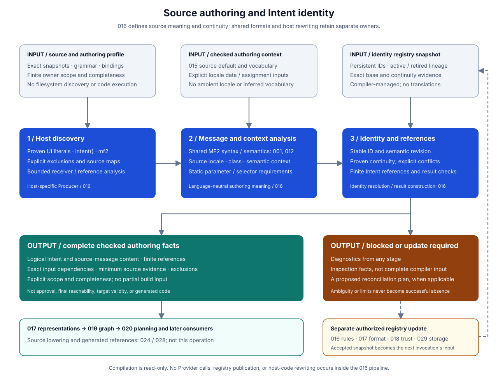

# Intlify Source Authoring and Intent Identity Design

## Purpose

This design defines how application-owned source becomes identifiable, language-neutral Message Intents and references. It answers four questions that a source-first compiler must answer before localization planning can begin:

- Which source occurrences communicate a localizable message, and which are deliberately excluded?
- What are the source message, source locale, parameter requirements, and communication context?
- Is an occurrence the continuation of an existing Intent, a new Intent, or an ambiguous identity change?
- What checked facts can later planning, synchronization, tooling, and source lowering consume?

For example, an application can keep a simple label in its original form:

```js
const button = document.querySelector('#pay')
button.textContent = 'Pay now'
```

A supported Producer proves the UI destination, extracts the literal message, resolves its source locale and context, and associates it with a persistent Intent identity. A move to another file does not inherently create a new message. Changing the wording changes the Intent's localization-relevant revision, not inherently its persistent identity. The actual rewrite to a generated target reference belongs to the later build and lowering stages.



The design separates language-neutral meaning and identity rules from a first JavaScript/TypeScript authoring profile. It does not require every Producer to recognize the same syntax. Unless recorded as accepted below, public authoring spellings, identity-update ergonomics, and the open choices remain proposals for review. An accepted design choice does not imply an implemented capability.

## Goals

- Preserve readable source-locale messages without requiring developer-maintained translation keys or catalogs.
- Define bounded automatic UI recognition, explicit MF2 authoring, and inspectable non-localizable declarations.
- Reuse the shared MF2 parser and semantic model for all recognized authoring forms.
- Keep static message structure separate from runtime parameter expressions and finite message selection.
- Define the source-locale and surface-class handoff from 015 without implementing another configuration resolver.
- Separate persistent identity, semantic revision, source evidence, and target-generated Message Handles.
- Preserve identity through justified continuations and require explicit resolution of ambiguous history reuse.
- Define read-only compilation and an explicit, atomic identity-registry update workflow.
- Produce bounded, deterministic authoring outcomes suitable for later shared-artifact encoding and project-graph queries.
- Apply 026's allocation, ownership, measurement, and optional-profiling requirements from the first implementation.

## Non-Goals

- Implementing translation, Provider calls, TMS synchronization, approval, candidate selection, or Translation Store publication.
- Computing final reachability, requested-locale requirements, message-locale fallback, delivery placement, or Release membership.
- Defining portable runtime value encodings, MF2 function implementations, runtime locale ownership, or formatting execution.
- Rewriting host code, selecting generated handles, or freezing exporter and Runtime ABIs.
- Defining the wire schemas, persistent ID encoding, registry file format, or canonical digest framing owned by 017.
- Defining repository discovery, commands, editor/LSP protocols, package names, or automatic update scheduling owned by 019 and 029.
- Translating arbitrary runtime-generated strings, treating all string constants as UI, or providing a general-purpose data-flow analyzer.
- Completing Vue, JSX/TSX UI, Swift, Kotlin, Rust, C/C++, Go, or .NET Producer profiles in the first JavaScript/TypeScript implementation.
- Promoting PR #183's placeholder grammar, path/content-derived IDs, or global runtime helper into production specifications.

## Ownership and Dependencies

| Owner | Responsibility relevant to this design |
| --- | --- |
| 000 | Source-first direction, authoring principles, artifact roles, identity lifecycle, and separation of synchronization, build, and execution |
| 001, 002, 012 | MF2 syntax, source ownership, CST and semantic facts, parser diagnostics, and parser-owned semantic validation |
| 015 | Checked project identity, optional canonical default source locale, exact surface-class vocabulary binding, and applicable configuration and policy inputs |
| 016 | Recognition semantics, declaration/reference distinction, host-to-MF2 extraction, static parameter bindings, context assignment, identity continuity, revision meaning, reconciliation, and authoring Findings |
| 017 | Shared Intent/reference/source-evidence representations, identity domains and encodings, registry representation, digest framing, and version admission |
| 018 | Authentication and authorization of source, imported artifacts, registry publication actors, and shared trust/resource-policy admission |
| 019 | Project graph, common Finding envelope, incremental scheduling/cache management, identity and inventory queries, and client projections |
| 020 | Reachability, complete Requirement Plans, source fulfillment, final library composition, and linking |
| 021, 022 | Governance and Store history, plus explicit localization synchronization; identity continuity alone grants neither approval nor candidate eligibility |
| 023 | Portable parameter/value/function semantics and execution behavior; 016 supplies source-derived requirements without independently implementing them |
| 024, 028 | Checked source-lowering plans, target references, host rewriting, and the first end-to-end Web integration |
| 026 | Cross-component performance requirements, common conformance/measurement records, optional profiling, and comparison admission |
| 029 | Acquisition of source and configuration inputs, declaration-binding configuration, registry storage/update UX, commands, package layout, and product orchestration |
| 030–035 | Additional host, framework, mobile, library-distribution, and native integration profiles |

These are ownership relationships, not a requirement to finish every downstream design before discussing 016. The shared meaning can be designed now. An implementation needs the exact upstream specifications for the subset it claims to support; test-owned inputs may exercise a smaller slice but cannot masquerade as complete checked project or artifact inputs.

In particular, PR #205 supplies 015's minimum configuration/canonicalization/locale-core path and 017's initial configuration-reference and measurement subset. It does not supply a complete `LocalizationProjectProfile`, Intent artifact schema, production registry, or production locale-data implementation. Those gaps remain explicit adoption prerequisites rather than being filled with hidden Producer defaults.

## Inherited Decisions from 000

- Application source is the authoring source of truth; localization artifacts are managed outputs.
- Automatic recognition requires a provable supported UI surface. Explicit authoring is a first-class programmable interface, not merely error recovery.
- Message structure is static; runtime values and finite selection among known messages may vary.
- `intent()` establishes an MF2 authoring context without requiring an additional `mf2` tag. Standalone `mf2` authoring remains useful.
- Every checked Intent has exactly one source locale. Application defaults apply only when omitted; library source locales are not reinterpreted by consumers.
- Identical text at unrelated declaration sites does not merge identity.
- Persistent `MessageIntentId` is opaque and independent of source text, file path, and occurrence order. Target-local handles are a different identity domain.
- Localization-relevant semantics affect `IntentRevision`; source coordinates and non-semantic formatting do not.
- Ambiguous copies, splits, merges, and identity conflicts require explicit reconciliation. Retired identities are not silently recycled.
- Normal build and production execution do not invoke translation services or acquire governance authority.

## Terminology

| Term | Meaning in this design |
| --- | --- |
| Authoring profile | Versioned rules for one supported host syntax, intrinsic-binding recognition, UI surfaces, bounded analysis, extraction, and context assignment |
| Source unit | One immutable host source snapshot with an exact identity/revision, bytes, grammar selection, and owning application or library scope |
| Authoring inventory | Explicit finite source-unit membership for one declared scope, including whether the inventory is complete or a partial editor/incremental view |
| Declaration | A source occurrence that establishes a message's source semantics; an inline `intent()` literal, a reusable `mf2` declaration, or an automatically recognized UI literal |
| Reference | A source occurrence that may use an already declared message; several references can point to one declaration |
| Occurrence locator | Source-unit and syntax-role evidence used to locate a declaration/reference in a particular snapshot; not a persistent Intent ID |
| Semantic UI usage | The declaration's communication purpose, such as a button label or accessibility label, when established by bounded Producer rules |
| Surface class | A coverage-facing class from the exact vocabulary admitted through 015; distinct from a DOM tag or inferred UI role |
| Authoring semantic projection | The source message, canonical source locale, parameter/selector requirements, semantic usage, explicit context, and localization constraints that determine revision |
| Identity registry snapshot | Immutable compiler-managed associations between declaration lineage and persistent IDs, with active/retired state and exact update ancestry |
| Continuity evidence | Checked evidence that a current declaration continues one previous declaration; a content match or similarity score alone is insufficient |
| Reconciliation plan | A bounded proposed registry change against one exact base snapshot, recording continuations, allocations, retirements, and unresolved conflicts |
| Checked authoring result | A complete result for its declared input scope whose supported syntax, source semantics, identity associations, and finite references passed the applicable checks |

These names describe conceptual values and operations. They do not reserve Rust type names, JavaScript exports, or serialized member names.

## Design Overview

The Producer pipeline has five logical operations. The overview diagram groups them into three boxes: discovery; message analysis plus context resolution; and identity resolution plus result construction. A physical implementation may share parsed state between them, but it must preserve their distinct inputs, failures, and measurement meaning.

| Operation | Reads | Produces |
| --- | --- | --- |
| Host admission and discovery | Source snapshots, explicit grammar/profile, intrinsic bindings, finite inventory | Candidate declarations, references, exclusion evidence, and host Findings |
| Message analysis | Extracted literal/MF2 text, source maps, parser specification | Parser-validated message facts and external parameter/selector requirements |
| Context resolution | Message facts, source annotations, projected 015 inputs | One canonical source locale, checked surface class, semantic usage/context, and semantic projection |
| Identity resolution | Current declarations, one registry snapshot, admitted continuity decisions | Stable IDs, revisions, or a reconciliation-required outcome |
| Result construction | Admitted declarations, finite references, source evidence, completeness facts | Complete checked authoring result or blocked outcome; optional inspection projections |

The registry update operation is separate. Compilation may explain why an update is needed and produce a candidate plan, but it does not write files or allocate durable identity as a hidden side effect. An authorized host validates and publishes an accepted plan, after which compilation uses the resulting immutable registry snapshot.

## Inputs and Results

### Invocation inputs

Each invocation receives already acquired, bounded inputs:

- An authoring profile and its supported specification revisions, including the exact MF2 parser/semantic behavior it uses.
- A finite authoring inventory with source-unit identities, revisions, content verification, owner scope, grammar, and completeness evidence.
- Exact intrinsic bindings and any admitted module-reference summaries. The shared semantic core does not resolve package names or read the filesystem.
- The applicable checked projection of 015: project/owner context, optional default source locale, exact surface-class vocabulary and any separately declared source-assignment defaults.
- A canonicalization service/data binding compatible with the checked profile for any explicit source-locale declarations. No ambient OS locale or network lookup is permitted.
- One immutable identity-registry snapshot, plus any explicit, validated reconciliation decisions or continuity evidence needed by the requested operation.
- Explicit limits and requested diagnostic/inspection projections. Trust and policy admission belongs to the relevant owner, not a boolean supplied as a substitute for validation.

Application and library compilation are distinct owner scopes. A published library's supplied Intent and reference artifacts enter through 017/018/020 admission; an application Producer does not rescan them as new application declarations or replace their source locale.

### Outcome states

The initial result model distinguishes `checked`, `blocked`, and operational failure. Cancellation, inconsistent snapshot attachment, parser invariant failure, and unsupported implementation specifications are not successful empty results.

- `checked` contains the entire declaration/reference result for the declared invocation scope, required minimum source evidence, exclusions, exact input dependencies, and completeness information.
- `blocked` contains bounded Findings and independently established inspection facts, but no result that consumers may treat as complete authoring input.
- A partial editor inventory may yield checked facts for that explicitly partial scope. It never establishes complete-project absence, authorizes retirement, or replaces a complete build inventory.
- An exceeded limit, unanalysed eligible source unit, unresolved declaration identity, or non-enumerable known message reference prevents complete success for the affected scope.

Inventory membership is supplied by the host and checked for consistency with returned source-unit results. This design does not claim that scanning only a supported file subset proves localization coverage for every file or UI API in a repository.

## Authoring Classification

Every occurrence considered by a supported recognizer receives one of the following classifications:

| Classification | Required behavior |
| --- | --- |
| Proven ordinary UI literal | Create a distinct declaration with literal-message semantics and a reference at that use site |
| Explicit MF2 declaration | Analyze its static MF2 source even when it is not attached to a UI sink |
| Reference to existing declaration(s) | Retain the exact finite possible declaration set and parameter-expression evidence |
| Explicit non-localizable occurrence | Preserve host behavior, emit exclusion evidence, and create no Intent or localization requirement |
| Known UI destination with unsupported message source | Emit a blocking authoring Finding; do not silently translate or silently exclude it |
| Source outside the selected recognition profile | Do not reinterpret it as localizable; report profile coverage in inventory/inspect output rather than claiming it was proven non-localizable |

An arbitrary object property named `textContent`, a string constant containing an HTTP error description, and a function named `intent` are not sufficient evidence by spelling alone. Explicitly excluded occurrences and occurrences outside the supported profile remain different facts.

The classification pass gives recognized explicit authoring precedence over automatic extraction at the same use site. `button.textContent = intent('Pay now')` creates one declaration/reference pair, not an additional automatic Intent for the surrounding assignment.

## Proposed JavaScript/TypeScript Authoring Profile

This section proposes the first concrete host profile. Its accepted naming decisions and remaining review choices for public spellings and annotation placement are recorded below. Other host languages may implement equivalent semantics through macros, annotations, templates, or compiler-recognized declarations.

Unless an annotation says otherwise, the conceptual examples assume an admitted source-locale default of `en` and an explicit authoring-scope surface-class default that belongs to the supplied vocabulary. These are example inputs, not implicit product defaults. The snippets illustrate authoring rather than an already available production package.

### Intrinsic binding recognition

Recognition uses lexical binding identity under an explicitly admitted module/export mapping, not a search for callee text. Package resolution and actual distribution names belong to 029.

The first profile supports direct named imports and their import aliases. Shadowed names, unrelated functions, arbitrary wrappers, reassigned aliases, namespace/member lookups, and unregistered re-exports are not implicitly recognized. A binding that is known to be an authoring intrinsic but used in an unsupported way produces a Finding rather than being treated as an ordinary call.

Examples below assume `intent`, `mf2`, and `noIntent` are recognized bindings. They do not define a package import path or a runtime implementation.

### Inline programmable messages

```js
intent('Pay now')
intent('Hello {$name}!', { name })
intent('Total: {$amount :number}', { amount: calculateTotal() })
```

The proposed signature is `intent(sourceOrDeclaration, parameters?)`:

- A static string literal in the first argument creates one declaration and one use-site reference. An untagged, substitution-free template literal is also static source.
- The string contains MF2, not a separate placeholder language. Requiring ``intent(mf2`...`)`` is unnecessary; an explicitly nested static tag may still be recognized as one declaration.
- The second argument contains interpolation parameters only. It is not an options/metadata object, and no third metadata argument is introduced by this proposal.
- Each separate inline declaration has separate identity by default. To reuse one Intent, reference an explicitly shared declaration rather than relying on equal text.
- Locale selection and the execution context are not authoring arguments here. Their binding and generated execution API belong to 023/024/027.

### Reusable MF2 declarations

```js
const inboxMessage = mf2`.input {$count :number}
.match $count
one {{You have one message}}
* {{You have {$count} messages}}`

intent(inboxMessage, { count })
```

The proposed standalone tag establishes a reusable message declaration, not a formatted string or a translation-service request. Calls referring to the same declaration share its Intent identity. Exact runtime representation, TypeScript declaration types, and whether the tag is fully erased by lowering are not frozen here.

The initial profile admits direct immutable local declaration references. Cross-module references require an exact admitted module/export graph or source-first library manifest; dynamic module discovery is not performed by this operation. Until that capability is implemented, a Producer reports an unsupported reference rather than claiming to have enumerated it.

An authoring tag contains no JavaScript `${...}` substitutions. Runtime values belong in MF2 variables and the `intent()` parameter object. A bare tagged descriptor assigned directly to a DOM string property is not a supported rendering form in this proposed profile; use `intent(descriptor, parameters)`.

### Bounded automatic DOM recognition

The proposed minimum automatic surface is assignment to `textContent` of a proven DOM receiver. A first extension can admit `setAttribute('aria-label', literal)` on the same receiver proof. Other setters, HTML parsing, JSX text, template whitespace, and framework-specific surfaces require explicit profile extensions and fixtures.

Receiver evidence starts from admitted standard DOM bindings, such as an unshadowed `document.querySelector` or `document.createElement`, and may follow bounded immutable local aliases. The literal selector/tag and receiver chain are retained as evidence; the compiler does not run selectors or assume that an element exists at runtime. Host null checks, exceptions, and control flow must remain unchanged by later lowering.

Type assertions or a `textContent` property name alone do not prove a DOM receiver. Mutation, escaping aliases, unknown interprocedural flow, or exhausted analysis limits cannot strengthen proof. The exact permitted alias/escape rules must be pinned with the profile before implementation claims automatic coverage.

```js
const button = document.querySelector('#pay')
button.textContent = 'Pay now' // Automatic declaration at a supported sink.

const status = { textContent: 'internal-state' } // Not a proven DOM sink.
const errorDescription = 'Service unavailable' // Not automatically localized.
```

The first automatic profile accepts static literals only. A runtime string, interpolated JavaScript template, or arbitrary string-producing call at a known UI destination requires explicit MF2 authoring or explicit exclusion. The Producer does not evaluate application code to recover message source.

### Explicit non-localizable values

The selected exclusion-marker name is `noIntent()`. The proposed signature remains `noIntent(value, reason)`, with a required nonempty static reason and an identity-bound intrinsic. It explicitly excludes the value from Message Intent generation; it does not mean that an `intent()` call is merely absent. Supported ordinary UI literals remain eligible for automatic recognition without `intent()`.

```js
button.textContent = noIntent('Intlify', 'Product name')
comment.textContent = noIntent(userComment, 'User-authored content')
```

The marker returns the same host value, evaluated once in the same position. It is not escaping, sanitization, formatting, or trust admission. The reason is inspectable exclusion evidence, not a translation key. Contradictory nested localizable and non-localizable markers are rejected in the first profile rather than resolved by marker order.

### Source metadata without parameter overloading

A proposed static annotation attaches semantic metadata to one declaration:

```js
/* @intlify { "sourceLocale": "en", "surfaceClass": "checkout", "description": "Primary payment action" } */
button.textContent = 'Pay now'
```

The initial annotation payload is a closed JSON object with optional `sourceLocale`, `surfaceClass`, and `description` members; present members are nonempty strings. Duplicate or unknown members, invalid encoding, and multiple annotations for one declaration are errors. Ordinary comments are not semantic input.

The proposed placement rule attaches the annotation to the next statement in the same lexical statement list, with no intervening statement. That statement must contain exactly one eligible declaration. Multiple candidates, an intervening scope change, or no declaration produces an attachment Finding rather than selecting the first string. Nested annotations must not compete for the same declaration.

A reference to an existing descriptor cannot redefine its source locale, surface class, or description. Authors needing a different meaning declare a different message. A reference's own source/UI evidence remains available for diagnostics without silently changing the shared declaration.

Vocabulary authoring and any explicit source-wide assignment defaults are separate inputs supplied before this invocation. This proposal does not add fields to `intlify.config.json`, scan source to invent the 015 vocabulary, or equate a `button` role with a coverage class named `checkout`. The exact source-wide default syntax and larger semantic-context vocabulary remain open questions.

## MF2 Extraction and Parameter Bindings

### Literal text versus explicit MF2

Ordinary UI text has literal semantics. The Producer encodes it as a literal MF2 pattern using shared MF2 escaping rules and then uses the same parser/semantic pipeline. For example, braces in ordinary displayed text do not become interpolation merely because the application now enables localization. The literal encoder must round-trip to exactly the host-profile-defined displayed text, with no external MF2 variables.

Explicit `intent()` strings and `mf2` declarations contain MF2 syntax. The proposed JavaScript profile uses host-cooked string/template content for both, rejects invalid cooked escapes and non-scalar strings, preserves literal newlines, and performs no implicit trimming, dedenting, or Unicode normalization. Quote/escape spelling differences that cook to the same content are source-evidence differences, not different message text. Cooked versus raw tagged-template behavior is an explicit review item.

Host decoding and MF2 literal escaping produce a mapping from extracted MF2 byte ranges to original source ranges. Escapes may map several generated bytes to one host range; mapping must not fabricate one-to-one offsets. Any future HTML/template profile must define its own displayed-text and whitespace extraction rules separately.

### Shared parser and semantics

The pipeline follows 012: parse first; only diagnostic-free parsing permits semantic-model construction; only a successfully constructed model permits parser-owned semantic validation. Parser and semantic diagnostics preserve their owning codes. An invariant failure is operational failure, not an ordinary malformed-message Finding.

016 consumes parser-owned facts to derive external parameter names, declarations, selectors, and function/option requirements. It does not implement a regex placeholder parser, duplicate MF2 selector validation, or infer runtime formatting behavior from host types.

Function references and source annotations become symbolic requirements. Checking supported portable value families, function implementations, and target capabilities belongs to 023/024. A checked authoring result therefore does not assert runtime or target conformance.

### Parameter object rules

For the proposed initial profile:

- Parameter names must be statically enumerable and unique. Plain object properties with static identifier/string keys and shorthand properties are supported.
- Spreads, computed keys, getters, setters, methods, prototype-derived members, and passing an opaque runtime object as the parameter set are unsupported.
- Parameter values may be ordinary runtime expressions, including side-effecting calls. The compiler never executes them during discovery.
- The provided name set must exactly match the required external MF2 inputs. Missing and extra names are distinct Findings. No-parameter messages may omit the object or pass an empty plain object.
- MF2-local declarations are not caller parameters. Selector/function requirements are retained for later type and capability checks, not replaced by JavaScript string coercion.
- A parameter expression must be evaluated once, in original JavaScript argument/property order, at its original control-flow point. Optional metadata collection cannot cause an additional evaluation.

Parameter-expression source text, variable renames in surrounding host code, and value evaluation locations are reference evidence. They do not change Intent revision when the parameter names and source-derived requirements remain identical.

## Static References and Finite Selection

The first finite-selection form is a conditional expression whose alternatives are admitted immutable message declarations:

```js
const loading = mf2`Loading`
const done = mf2`Done`
intent(pending ? loading : done)
```

Both declarations remain possible references even when a compiler cannot predict `pending`. The condition remains runtime code. An implementation may add finite arrays, maps, enums, switches, aliases, and module edges only under explicit bounded profile rules; user-provided labels claiming completeness are not proof.

The initial rule for one shared parameter object requires compatible external-name and symbolic-requirement shapes across every alternative. Otherwise authors put separate `intent()` calls in the branches. Richer discriminated bindings require a later explicit extension, not an unbounded runtime source path.

Every member of the conservative finite set is retained for 020. The Producer does not prune an alternative based on translation availability, current locale, Store state, or guessed runtime values. Build-provided applicability and delivery evidence are recorded separately; 020 owns final reachability and target/group partitioning.

`intent(createMessageAtRuntime())`, dynamic imports without a finite admitted module set, and unbounded reference selection produce a blocking Finding. UGC or text localized by another subsystem uses explicit exclusion rather than a hidden runtime translation fallback.

## Source Locale, Usage, and Context

Source locale is resolved per declaration:

1. Use and canonicalize an explicit source-locale annotation when present.
2. Otherwise, for an application-owned declaration, use the canonical default supplied by 015 when present.
3. Otherwise, block the declaration with a source-locale Finding. Do not substitute the requested locale, host locale, `und`, or inferred text language.

A source-first library is compiled with its own admitted authoring context and publishes the resulting exact source locale. Consumers retain that locale; no application default is applied to imported Intents. Locale equality follows the admitted canonicalization specification/data, not raw spelling equality.

Context has three separate projections:

| Projection | Examples | Effect |
| --- | --- | --- |
| Source evidence | Unit/revision, span, declaration/reference role, nearby source, extraction mapping | Navigation and explanations; not semantic revision by itself |
| Semantic UI usage and explicit context | Proven accessibility-label purpose, declaration description, later structured semantic constraints | Participates in revision when communication meaning changes |
| Coverage-facing surface class | An exact declared class such as `checkout` | Must belong to the vocabulary pinned by 015; contributes a planning dependency |

An automatically extracted inline UI declaration may acquire semantic usage from its proven sink. A standalone reusable declaration owns its declared meaning; call-site evidence does not silently specialize it or mutate an imported library Intent. If a use requires a different communication purpose, it needs a distinct declaration or an explicit later specialization feature.

Every declaration requires a checked surface-class assignment from explicit source metadata or an explicit, versioned assignment default supplied for the authoring scope. A missing/unknown class blocks the declaration and a complete checked authoring result. This does not require per-message boilerplate when a scope has an explicit valid default, but the scope default must exist independently of the current source scan. Class changes update planning dependencies; class spelling alone does not change translation semantics unless the same edit changes semantic context.

Physical path, component name, DOM tag, or nearby words never invent a vocabulary member. An AI agent may propose context or assignment changes, but they become authoring inputs only after they are explicitly recorded and recompiled.

## Intent Identity and Revision

### Four distinct identities

| Identity | Stability and purpose |
| --- | --- |
| Source unit/revision and occurrence locator | Identifies source evidence in a particular snapshot; may change during edits or moves |
| Owner-qualified persistent `MessageIntentId` | Identifies one message lineage independently of wording and physical location |
| `IntentRevision` | Identifies a versioned localization-relevant semantic projection of that lineage |
| Generated Message Handle | Compact target/Release-local execution reference; produced downstream, never stored as persistent identity |

A declaration is the unit of identity allocation, not each call that references it. Two inline `intent('Open')` calls or two unrelated automatic `Open` labels have distinct IDs. Two calls referencing the same named `mf2` declaration share its ID and revision. Internal reuse of parsed content must never merge these identity decisions.

### Semantic projection and revision changes

The proposed revision input is a versioned projection of:

- literal message text and MF2 semantic structure, including declaration dependencies, selectors, variants, function references, and options;
- canonical source locale;
- external parameter names and source-derived parameter/selector requirements; and
- semantic UI usage, explicit semantic context, and localization constraints attached to the declaration.

The projection excludes host source coordinates, quote spelling, non-semantic CST trivia, reference counts/order, parameter-expression implementation, and source locators. It is not a hash of an entire host file or raw tagged-template spelling. Literal whitespace remains message content; a formatter may change only whitespace proven non-semantic by the pinned MF2 behavior without changing revision.

017 must freeze the exact canonical representation, digest domain, and revision encoding before persisted production revisions are implemented. 016 supplies the semantic inclusion/exclusion rules and independent equivalence vectors. It does not reuse a fast in-process hash or PR #183's truncated path/source payload as a persistent ID.

| Change, with an established identity continuation | Persistent ID | Semantic revision | Other affected facts |
| --- | --- | --- | --- |
| Move file, change host indentation, equivalent host escaping | Preserved | Preserved | Source evidence and registry locator associations |
| Edit literal wording or significant message whitespace | Preserved | Changes | Source artifact, localization freshness, downstream evidence eligibility |
| Change MF2 external parameter name, selector, or function requirement | Preserved | Changes | Parameter and capability requirements |
| Rename the host variable used for the same parameter | Preserved | Preserved | Parameter-expression mapping and later lowering |
| Switch explicit/inherited source evidence but retain the same canonical locale | Preserved | Preserved | Dependency/evidence basis |
| Change canonical source locale or semantic purpose/description | Preserved | Changes | Source artifact and applicable localization work |
| Change only coverage class, policy, glossary, requested locales, target, or Provider revision | Preserved | Preserved | Separate planning, selection, validation, or synchronization dependencies |
| Copy an unrelated declaration with identical wording | New identity required | Computed for the new declaration | Possible reuse suggestions, never automatic history adoption |

Equal revision labels in a lineage must identify equal projections. Full source/message artifacts may have changed envelope identities even when localization semantics are equal. Declaration renames and alpha-equivalent MF2 rewrites do not receive broader semantic-equivalence guarantees than the frozen projection proves.

## Identity Registry and Reconciliation

### Registry responsibilities

The registry retains owner-qualified IDs, declaration lineage associations, active/retired state, and an exact snapshot/update ancestry. Locator and continuity evidence are indexes into source history, not the definition of identity. The registry contains no translations, approval decisions, requested-locale catalogs, runtime handles, or Provider credentials.

The exact representation, ID allocation domain/encoding, integrity rules, and schema evolution are 017 work. A product may use a file such as `intent.lock`, but that filename and the update commands remain 029 decisions.

### Read-only compilation

Given the same source snapshots, authoring/profile specifications, accepted identity associations, and registry snapshot, compilation must produce the same logical result. It never invents durable IDs from traversal order, wall-clock time, source text, or filesystem location.

Existing associations may be reused through checked continuity evidence even when locators change. A new declaration, missing registry, conflicting association, or insufficient continuity evidence produces a reconciliation-required outcome. A normal build must not silently pick an old ID by text similarity or publish a new registry snapshot. Developer tooling may propose updates automatically, but the accepted update remains an explicit operation with its own result.

The intent is to preserve IDs across ordinary edits and unambiguous moves, not to promise that every arbitrary source refactoring can be inferred correctly. The exact continuity proof and permitted automatic update classes are high-priority review items.

### Proposed reconciliation procedure

1. Admit the exact base registry, owning scope, finite source inventory, source revisions, and supplied continuity or explicit resolution evidence.
2. Classify and analyze current declarations independently from matching history. Invalid declarations cannot acquire checked identity merely because a matching old record exists.
3. Apply explicit identity decisions bound to the exact base and current inputs, rejecting foreign-owner IDs, conflicting decisions, and resurrection without an explicit restore operation.
4. Retain exact source-snapshot associations and verified one-to-one continuations. Evidence must identify one prior and one current declaration; matching text, path, or ordinal alone is not sufficient.
5. Classify remaining declarations as new or unresolved. Similarity and refactoring heuristics may suggest candidates but cannot break ambiguous ties authoritatively.
6. Propose fresh opaque IDs for confirmed new declarations through the registry-update host, checking the entire retained owner domain for collisions, including retired IDs. Candidate IDs become replayable inputs of the accepted plan, not nondeterminism inside normal compilation.
7. Propose retirement only for declarations proven absent from a complete owning inventory. Missing units, parse errors, cancellation, partial editor views, and mere unreachability are not proof of deletion.
8. Emit one plan bound to the exact base snapshot, current inventory, proposed associations, and unresolved Findings. No accepted snapshot is produced while any required identity decision is unresolved.
9. The authorized host verifies that the base is still current and atomically publishes the complete accepted snapshot. A changed base causes a conflict/replan, not a silent last-writer-wins merge.

016 owns validity of associations and plan preconditions. 017 owns encoding and integrity, 018 owns actor authority, and 029 owns persistence, atomic file/storage replacement, and update UX. The operation never publishes a translation, approval, or Release.

### Copy, split, merge, restoration, and retirement

- Copying a declaration creates a separate identity unless it is an explicit reference to the existing declaration. Reusing translation memory is independent from identity reuse.
- A split or merge requires an explicit plan. At most one current declaration may continue one prior identity; all other new declarations require fresh IDs. Lineage links are audit facts, not approval transfer.
- Restoring a retired identity requires an explicit, exact restore decision. Newly allocated IDs cannot collide with or recycle tombstones.
- A currently unreferenced but still declared message retains its identity. 020 may omit it from a particular build without instructing 016 to retire it.
- Retirement changes future authoring inventory; it does not delete immutable Store or Release history. Historical execution and rollback continue to use their pinned artifacts.
- Source-controlled registry conflicts cannot be resolved by unioning duplicate entries or choosing the newest timestamp. The same association and plan checks apply after branch merges.

## Source Evidence and Consumer Handoff

Minimum evidence binds each declaration/reference to its exact source unit/revision, half-open source range, authoring form, and extraction/parameter mapping needed for correctness. Evidence is validated against the actual immutable snapshot; an arbitrary supplied locator is not trusted as proof of origin.

UTF-8 byte ranges are the shared coordinate basis. Host bindings with UTF-16 or another indexing model convert against the exact source snapshot. Cooked host escapes and generated MF2 literal escaping retain segment mappings; multi-byte text, CRLF, zero-width insertion ranges, and EOF positions require explicit fixtures. Detailed snippets, navigation labels, and expanded maps may be lazy, but evidence required for correct admission and diagnostics is not optional.

The checked result supplies the logical fields needed by:

| Consumer artifact/model | 016 contribution | Not established by 016 |
| --- | --- | --- |
| `MessageIntentArtifact` | Persistent ID/revision, checked source semantics, source locale, context, parameter/selector requirements | Approval, selectable candidates, target compatibility |
| `SourceLocaleMessageArtifact` | Deterministic source definition derivable from one checked Intent revision and its source locale | Source authentication/approval or a Selection Decision |
| `MessageReferenceArtifact` | Exact or conservative finite Intent references, parameter bindings, source and supplied host applicability evidence | Final reachability, fallback, coverage, or delivery placement |
| Project graph and Findings | Input dependencies, source evidence, explicit exclusions, completeness, typed authoring failures | Query storage, client protocols, or a second common Finding format |
| Later source-lowering plan | Host occurrence and evaluation-order facts associated with checked references | Generated accessor name, compact handle, runtime ABI, or host rewrite |

Source-locale message derivation requires no Provider and does not place a translated candidate payload into the Store. Its envelope/digests and source-admission dependencies must use the later 017/018 definitions. Governance and linking still verify the applicable source evidence before use in a Release.

## Findings and Failure Model

The following are proposed component-owned reason families, not a frozen global code registry. 019 owns the common envelope; MF2 parser/semantic codes retain their existing owners.

| Reason family | Meaning and remediation |
| --- | --- |
| `authoring-input-invalid` | Source/profile/inventory/binding inputs are malformed, incompatible, or inconsistently attached |
| `authoring-form-unsupported` | A recognized intrinsic or known UI surface uses an unsupported form; use a supported static declaration or explicit exclusion |
| `authoring-source-dynamic` | Message source or reference identity cannot be enumerated finitely |
| `authoring-metadata-invalid` | Metadata is malformed, multiply attached, ambiguously placed, or attempts to redefine an existing declaration |
| `authoring-source-locale-missing` / `authoring-source-locale-invalid` | No permitted source-locale basis exists, or the supplied locale fails the admitted canonicalization rules |
| `authoring-surface-class-invalid` | Required assignment is missing or not a member of the exact admitted vocabulary |
| `authoring-parameter-mismatch` | Missing/extra/duplicate parameter names or incompatible finite-alternative requirements |
| `authoring-identity-update-required` | New or moved source needs accepted identity associations before complete compilation |
| `authoring-identity-conflict` | Several lineages compete, one ID is assigned twice, a retired ID is reused, or plan/base inputs conflict |
| `authoring-resource-limit` | A named source, analysis, reference-set, registry, mapping, or reporting limit was exceeded |

Known-UI classification failures, MF2 validity failures, and identity failures remain separate. Failure in MF2 syntax suppresses dependent semantic/revision work for that declaration, not independent Findings in other admitted units. Source parse failure prevents claims about declarations absent from that unit.

Logical Findings use deterministic ordering independent of worker scheduling or hash-map iteration. The proposed component order is stage, admitted source-unit identity, source range, component reason, then a stable related-occurrence discriminator. Related locations use the same admitted source domain. Any reporting truncation is explicit and cannot turn a blocked result into checked success.

## Dependency, Invalidation, and Reproducibility

016 emits dependency facts; 019 owns cache keys, graph scheduling, and client-visible invalidation queries.

- Host discovery depends on exact source bytes/revision, grammar, authoring profile, intrinsic bindings, and any admitted module/receiver-analysis inputs.
- Message analysis depends on extracted MF2/literal content and exact parser/semantic/projection specifications. Parsing shared content once is allowed without merging declaration identities.
- Source-locale resolution depends on explicit locale evidence or the applicable 015 default, plus canonicalization specification/data.
- Surface assignment depends on explicit assignment/default rules and the exact vocabulary binding. A spelling-preserving vocabulary revision can invalidate admission evidence without changing message semantics.
- Identity resolution depends on owner scope, registry snapshot, continuity/reconciliation inputs, and complete versus partial inventory state.
- Reference/evaluation evidence depends on host expressions and source ranges even when an Intent revision is unchanged.

Locale requests, policies, glossary revisions, Store snapshots, and target changes may invalidate downstream work without invalidating the host syntax parse or allocating new Intent IDs. A consumer must not use `IntentRevision` as a cache key for source evidence or all planning inputs.

Fresh, reused, incremental, and differently scheduled runs over equivalent admitted inputs must produce equivalent logical results. Source maps and source coordinates may differ only when their own source inputs differ. Read-only compilation performs no registry, Store, or network mutation.

## Security and Resource Limits

Source, metadata, registry contents, module summaries, and context are untrusted inputs until admitted. Discovery never executes module initializers, property accessors, macros outside the selected trusted Producer mechanism, arbitrary plugins supplied as source, user functions, or template substitutions to find text.

The invocation must have finite limits for source-unit count/bytes, host parser capacity, declaration/reference count, extracted MF2 bytes, mapping segments, metadata bytes/depth, alias/module traversal work, finite-selection members, registry entries/candidate associations, and retained Findings/evidence. Work exhaustion is reported separately from an ordinary semantic mismatch. Partial scans never authorize retirement.

The first reference implementation uses caller-owned scheduling and safe APIs. Digests establish identity/integrity, not authorization. Registry continuity is not a signature, and source-derived metadata is not authority to execute instructions in later Provider prompts. 018/022 own safe transport and trust treatment when context leaves the compiler.

Absolute paths, source snippets, parameter values, and user-provided descriptions must not enter telemetry or profiler labels by default. Runtime parameter expressions are never evaluated or serialized as values by this stage. Exclusion is not sanitization and does not confer trust on excluded UGC.

## Performance and Measurement

The [026 Performance Implementation Architecture](./026-intlify-conformance-and-measurement-design.md#performance-implementation-architecture), [Profiling Specification](./026-intlify-conformance-and-measurement-design.md#profiling-specification), and [Adoption and Verification Requirements](./026-intlify-conformance-and-measurement-design.md#adoption-and-verification-requirements) apply alongside each adopting implementation phase.

### Storage and hot paths

- Parse each physical source snapshot once per admitted grammar/profile rather than reparsing per recognizer, message, or reference. Reuse parser-owned MF2 facts at an exact semantic revision.
- Start with cheap binding/node-kind checks, then perform bounded receiver/reference proof. A text search may locate candidates but never replace semantic recognition or absence proof.
- Keep host ASTs, source snapshots, extracted-message storage, scratch indexes, immutable authoring results, and optional projections in explicit lifetime classes. Host-specific nodes never enter shared artifacts.
- Prefer bounded reusable vectors/maps/buffers in a per-worker Scratch Workspace. Use an arena only for an actual common lifetime demonstrated by measurements; retained results must not borrow resettable storage.
- Intern repeated admitted names or use dense local IDs for repeated traversal. A fast local hash, including an FxHash-style map where appropriate, is not a persistent ID/digest and must not expose unbounded attacker-controlled collision work.
- Use safe byte-search primitives such as `memchr` for measured delimiter/escape scans where useful. SIMD, custom layouts, and unsafe paths require the separate evidence and review described by 026; they are not prerequisites for this design.
- Keep registry candidate search indexed and bounded. Do not compare every declaration against every historical source fragment or run an unbounded global similarity search on each build.
- Construct snippets, expanded maps, detailed explanations, and host projections only when requested, without disabling minimum correctness evidence or required Findings.

### Initial measured operations

The proposed component vocabulary is below. Exact Method Descriptors, cases, and checksum projections must be frozen with the implementing slice; these labels are not claims of existing benchmarks.

| Operation | Core interval | Important observations |
| --- | --- | --- |
| `source-discovery` | Admitted in-memory source/profile to classified declarations/references, including host parsing and binding analysis | Source bytes, parse attempts, visited nodes, proof steps, declarations/references, complete/blocked outcome |
| `message-analysis` | Extracted messages to parser/semantic facts and parameter requirements | Message count/bytes, literal versus MF2 cases, parser/semantic outcomes, reuse state |
| `context-resolution` | Source semantics and admitted projected context to locale/class/context facts | Declaration count, explicit/default locale cases, canonicalization/assignment work |
| `identity-reconciliation` | Admitted base/current inventory to association decisions and a proposed plan | Entries, candidate comparisons, ambiguous/new/continued/retired counts, exact plan observation |
| `authoring-result` | Admitted component facts to complete immutable result and requested projections | Output/evidence bytes, ownership transfer, logical result checksum, allocation domain when measured |

File discovery/I/O, registry publication, package resolution, and host/native transfer are separate product-workflow or host-boundary cases. An optional parsed-input recognition measurement is a separate Method Descriptor, not a relabeling of the parse-inclusive `source-discovery` interval. ID allocation outside read-only compilation is measured separately from deterministic reconciliation with a fixed allocation input. Requested-locale count must not multiply source parsing work.

Required workloads include no candidates, many short UI literals, repeated equal text with distinct IDs, complex MF2, sparse/dense parameter maps, many references to one declaration, long alias chains, large finite selections, ambiguous copies, complete versus partial inventories, invalid source, and exact/first-over limits. Repeated workspace use must agree with fresh execution after success, failure, and cancellation.

The initial gate checks semantic observations, required-case coverage, record integrity, and fresh/reused equivalence. Physical time/allocation observations do not become numeric pass/fail thresholds without 026's applicable method, comparison, and budget requirements. Optional profiling is feature-isolated and uses controlled labels; profiler observations are not substituted for primary benchmark samples.

## Conformance and Fixtures

The implementing subset must provide independent expected logical results, not only round trips or snapshots regenerated by the Producer under test.

| Fixture family | Required examples |
| --- | --- |
| Binding identity | Named import, alias, shadowing, unrelated `intent`, unsupported wrapper/member access, and conflicting binding configuration |
| Automatic UI | Proven DOM literal, immutable receiver alias, non-DOM `textContent`, null-guarded use, unknown value at known sink, and explicit authoring inside a known sink without double extraction |
| Exclusion | Literal and dynamic values with reasons, malformed/nested markers, inspect evidence, unchanged host value semantics, and no resulting Intent/reference |
| Metadata | Exact attachment, duplicate/unknown fields, multiple candidate declarations, scope changes, missing/invalid class, explicit scope defaults, and invalid reference-side overrides |
| Extraction | Literal braces/backslashes, explicit MF2 interpolation, cooked host escapes, multiline content, no dedent/trim, invalid Unicode, CRLF and multi-byte source mapping |
| Parser ownership | Syntax versus semantic diagnostics, skipped dependent work, invariant failure, and identical parser meaning across authoring forms |
| Parameters and selection | Missing/extra/duplicate names, unsupported object forms, side-effecting values, conditional descriptors, incompatible alternatives, and unbounded source/reference rejection |
| Locale handoff | Explicit locale, inherited canonical default, absent default, invalid/unsupported canonicalization input, changed canonicalization binding, and preserved library source locale |
| Identity equivalence | Same declaration after justified edit/move, same text at distinct declarations, shared descriptor references, unchanged semantic projection with changed source evidence, and significant wording/context edits |
| Reconciliation | New allocation, collision with active/retired ID, ambiguous copy, explicit split/merge/restore, mismatched base, simultaneous conflicting updates, and atomic accepted publication |
| Inventory completeness | Deleted unit in a complete inventory, omitted unit in a partial view, parse failure/cancellation, unreferenced live declaration, and no accidental retirement |
| Handoff | Stable ID distinct from target handle, source artifact without Provider work, finite references without final reachability claims, and blocked result never accepted as complete input |
| Performance safety | Exact/first-over limits, workspace reset, bounded registry lookup, fresh/reused equality, deterministic parallel merge, and optional instrumentation isolation |

Host evaluation-order preservation must eventually be tested against the actual lowering consumer in 024/028. Producer-only facts are not proof that generated code behaves correctly. Similarly, native/mobile equivalence cannot be claimed from a JavaScript-only fixture suite.

## Implementation Phasing

These are proposed implementation-readiness gates, not PR boundaries or a claim that implementation has begun. Each phase adopts the applicable 026 checks at its own active operation.

| Phase | Scope | Completion condition |
| --- | --- | --- |
| 1 — Shared authoring semantics | Literal/MF2 extraction distinction, parser handoff, parameter requirements, source-locale/context/class inputs, and semantic revision projection | Language-neutral logical fixtures pass, unsupported inputs stay explicit, and 015 fixture projections cannot be mistaken for complete production Profiles |
| 2 — Initial JavaScript/TypeScript Producer | Exact bindings, explicit forms, proposed metadata/exclusion syntax after review, bounded DOM recognition, source maps, and local finite references | Recognition and diagnostic fixtures pass; each source is parsed under an explicit profile; no duplicate extraction or host-code execution occurs |
| 3 — Persistent identity and reconciliation | Registry admission, stable association rules, replayable allocation inputs, conflict/restore/retirement handling, and read-only compile operation | Necessary 017 representation/identity decisions are fixed; independent history fixtures pass; production publication adopts the applicable 018 authorization slice and host adapter exact-base/atomicity checks |
| 4 — Shared consumer handoff | Versioned Intent/source/reference artifacts, admitted module/library references, graph dependency/diagnostic projection, and broader bounded selection | Adopted 017/019 interfaces validate complete versus partial outcomes; consumers cannot infer source approval, final reachability, or target validity from authoring success |
| 5 — Integration and conformance closure | 020/024/028 source-first integration, evaluated host behavior, adopted-case inventory, and performance baseline evidence | One supported Web path proves source → stable Intent → checked reference → preserved host execution, with complete conformance and measurement records for the claimed subset |

Phases 1 and 2 may start with finite, explicitly test-owned project/registry inputs while shared encodings are being completed. That experiment is not persistent-identity support or full authoring conformance. Production identity claims require Phase 3; end-to-end localization claims require the corresponding downstream adoption, not merely a checked Producer result.

The existing `intlify_producer_js` offers reusable host parsing, bounded static analysis, source grouping, and scheduling/cache foundations, but its current configured-callee/key-reference model is not the source-first Intent specification. Reuse code selectively without making that format authoritative. The PR #183 implementation remains behavioral evidence, not a migration protocol or stable public API.

## Decision Log

`Inherited` records a constraint from existing designs. `Proposed` records an initial choice to review interactively; it does not represent user acceptance. `Accepted` records an explicitly agreed design choice, not an implementation claim.

| ID | Decision | State | Rationale |
| --- | --- | --- | --- |
| 016-001 | Separate language-neutral authoring/identity meaning from host recognition and later source rewriting | Inherited | Keeps host ASTs out of shared artifacts and preserves 000 ownership |
| 016-002 | Keep inline `intent()` and standalone MF2 declarations; put only parameters in the second `intent()` argument | Proposed | Supports programmable messages without mandatory nested tags or metadata/parameter ambiguity |
| 016-003 | Begin automatic recognition with proven DOM `textContent` assignments | Proposed | Establishes a bounded concrete Web surface without claiming all strings or all UI APIs |
| 016-004 | Distinguish ordinary literal text from explicit MF2 and use one MF2 semantic pipeline | Inherited | Prevents accidental placeholders and divergent message semantics |
| 016-005 | Use cooked host text without automatic trimming/dedenting in the first JS profile | Proposed | Gives exact extraction and source-mapping expectations; raw-template ergonomics still need review |
| 016-006 | Keep explicit exclusions and static semantic metadata separate from parameter objects | Proposed | Makes intentional non-localization inspectable while preserving the proposed API shape |
| 016-007 | Resolve source locale and surface assignment from explicit source/checked inputs, never ambient locale or inferred vocabulary | Inherited | Respects 015's defaults, absence, and vocabulary ownership |
| 016-008 | Separate declaration identity from references, semantic revisions, and target-local handles | Inherited | Preserves history without developer-maintained translation keys |
| 016-009 | Make compilation read-only and registry updates exact-base, explicit, and atomic | Proposed | Makes identity changes reviewable and prevents nondeterministic build mutations |
| 016-010 | Use conservative finite references and require compatible parameter requirements in the first selection form | Proposed | Gives planning a complete finite set while keeping evaluation-order obligations explicit |
| 016-011 | Require complete-inventory absence for retirement and never transfer approval through lineage links | Proposed | Refines the inherited retirement/history rules without inferring deletion from partial or unreachable source |
| 016-012 | Activate owner measurement, storage-lifetime rules, and optional profiling isolation with implementation phases | Inherited | Applies 026 without creating a separate performance implementation phase |
| 016-013 | Name the explicit exclusion marker `noIntent()` | Accepted | Pairs with `intent()` and expresses deliberate exclusion from Message Intent generation, not merely an absent declaration |

## Open Questions

The proposed defaults above make this a concrete review input. The following decisions remain open; they must be resolved before the affected implementation phase is considered ready.

| ID | Question | Proposed starting point | Needed before |
| --- | --- | --- | --- |
| Q1 | Which remaining JS intrinsic spellings, signatures, and binding forms should be supported? | The exclusion name `noIntent()` is accepted. Continue reviewing `intent(sourceOrDeclaration, parameters?)`, reusable `mf2`, and the proposed `noIntent(value, reason)` signature with exact binding recognition; package names stay with 029 | Phase 2 |
| Q2 | Should the standalone MF2 tag use cooked or raw template content? | Cooked content matching ordinary source literals; no host-template substitutions, trimming, or dedenting; compare real escape-heavy examples before freezing | Phases 1–2 extraction fixtures |
| Q3 | What metadata syntax, attachment rules, and explicit scope-default input should authors use? | One closed declaration annotation plus an explicit pre-invocation scope default; no source-scan vocabulary inference and no second-argument options | Phases 1–2 context inputs |
| Q4 | Which receiver/alias/refactoring proofs are sufficiently precise for the first automatic profile? | Bounded local immutable flow and checked one-to-one continuity; ambiguity blocks instead of applying a similarity threshold | Phases 2–3 |
| Q5 | How are opaque IDs, registry ancestry, and accepted reconciliation decisions encoded? | Owner-qualified opaque allocation with collision rejection and exact-base updates; 017 fixes representation, not a path/text-derived ID | Phase 3 and the required 017 extension |
| Q6 | Which identity updates may developer tooling accept automatically, and how is lost registry history recovered? | Ordinary provable continuations may be proposed automatically; copy/split/merge/restore conflicts need explicit decisions; ordinary builds never rewrite history | Phase 3, with 029 workflow adoption |
| Q7 | What exact MF2 projection distinguishes semantic changes from formatting-only changes? | Parser-owned facts plus explicit context/locale/parameter requirements; freeze independent equality/change vectors before selecting 017 revision encoding | Phase 1 semantics; persisted revisions in Phase 3 |
| Q8 | What are the first complete build inventory, admitted module-reference, and fixture Profile handoff shapes? | Explicit finite owner scope; partial views cannot retire or satisfy a complete build; retain adoption gaps instead of promoting PR #205's private core | Phases 1–4 with 015/017/019/028 |

## Deferred Follow-Up Notes

- Vue/template, JSX/TSX UI, mobile, and native authoring profiles should refine the same declaration, exclusion, context, and identity semantics in their owning integration documents.
- Rich structured semantic context, more ergonomic source annotations, message specialization, parameter-object inference, and finite container selection need separate versioned profile extensions.
- Registry file distribution, source-control merge tooling, automated update triggers, migration/recovery UX, and public authoring package layout belong to 029, constrained by the reconciliation rules here.
- 017 must expand beyond its current 015/measurement subset to encode persisted Intent identity, source/reference artifacts, and registry/evidence representations. This draft does not silently extend that subset.
- 018/019/020/023/024 remain owners of trust, graph/query, final planning, portable execution, and target/source lowering respectively. Their unfinished details are not redefined here.
- Broad similarity matching, cross-language refactoring inference, cryptographic source attestation, and long-history registry compaction are not prerequisites for the first bounded Producer experiment.

## Relationship to Other Documents

| Document | Relationship |
| --- | --- |
| [000 — Intlify overview](./000-intlify-overview-design.md) | Product direction and I0/I1 authoring/identity responsibilities; this document refines rather than replaces them |
| [001 — Toolchain foundation](./001-ox-mf2-toolchain-foundation.md), [012 — Parser semantic validation](./012-ox-mf2-parser-semantic-validation-design.md) | Shared source, syntax, and semantic facts reused by all authoring forms |
| [014 — Message linker](./014-ox-mf2-message-linker-design.md) | Existing reference-extraction and host-grouping implementation evidence; its key-oriented artifact semantics do not define this source-first interface |
| [015 — Project profile and locale policy](./015-intlify-project-profile-and-locale-policy-design.md) | Source defaults, canonicalization and surface-vocabulary handoff; a partial test core is not a checked production Profile |
| [017 — Shared artifacts and version admission](./017-intlify-shared-artifact-and-version-admission-design.md) | Required later representation of the semantic and identity rules defined here |
| [018 — Security, trust, and provenance](./018-intlify-security-trust-and-provenance-design.md), [019 — Project graph and queries](./019-intlify-project-graph-query-and-incremental-design.md) | Trust admission, authoring inventory/identity queries, common Findings, and incremental scheduling |
| [020 — Requirement planning and linking](./020-intlify-requirement-planning-and-linking-design.md) | Consumes checked finite references and Intent source facts; owns final requirement and reachability decisions |
| [023 — Localization execution](./023-intlify-localization-execution-specification-design.md), [024 — Target Profile and export](./024-intlify-target-profile-and-export-design.md) | Portable parameter/function meaning, target admission, and host-lowering obligations |
| [026 — Conformance and measurement](./026-intlify-conformance-and-measurement-design.md) | Performance architecture and verification requirements adopted by every active implementation slice |
| [028 — JavaScript/Web vertical slice](./028-intlify-javascript-web-vertical-slice-design.md), [029 — Product workflow and packaging](./029-intlify-product-workflow-and-packaging-design.md) | First integration evidence, public authoring packages, source/registry acquisition, and explicit update workflow |
