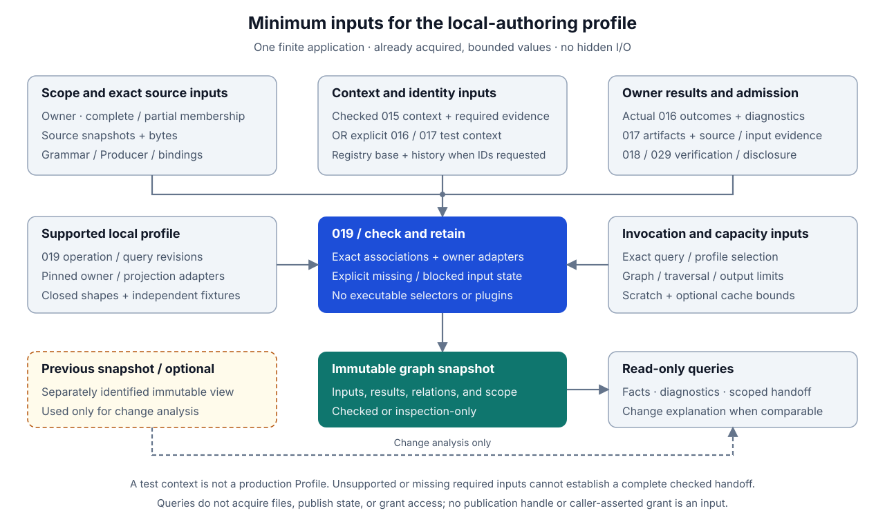
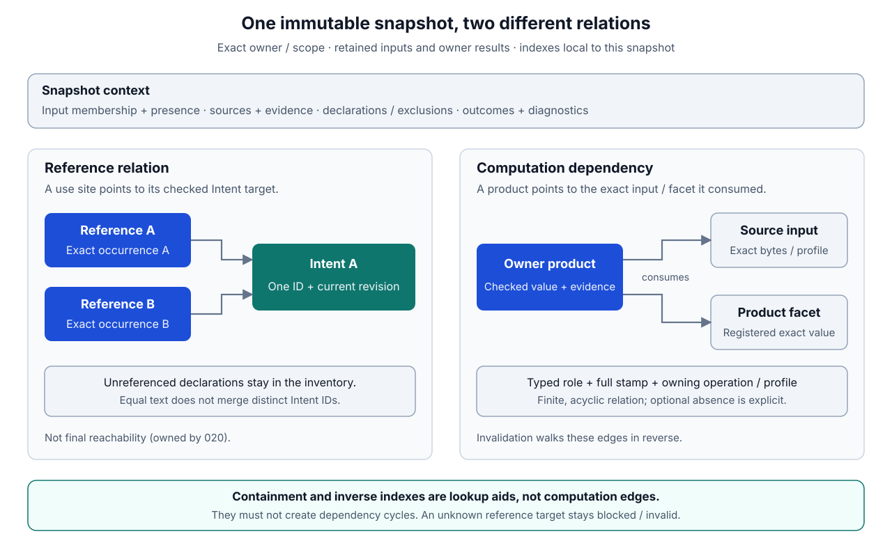
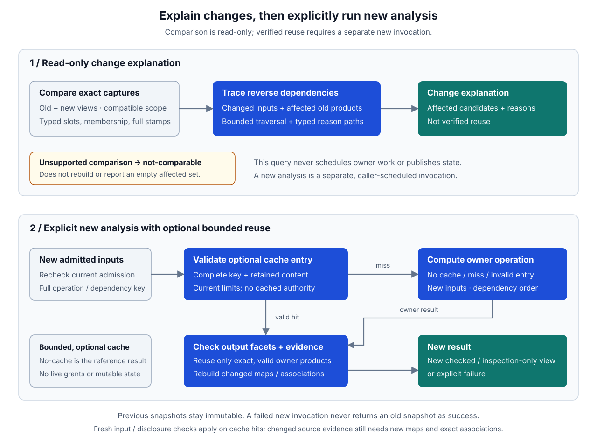

# Intlify Project Graph, Query, and Incremental Design

## Purpose

This design defines the smallest read-only project model needed to carry [016](./016-intlify-source-authoring-and-intent-identity-design.md)'s checked source, Intent, reference, and diagnostic facts into later tooling and planning. It answers three questions:

- What facts and dependencies belong to this exact application analysis?
- Is the result complete enough for a downstream consumer, or only useful for scoped inspection?
- When an input changes, which retained results need revalidation, and why?

For example, two greeting references may share one Intent. Changing a parameter expression can leave its `IntentRevision` unchanged while invalidating the reference's evaluation evidence and source map. Changing the message wording can change the revision as well. The graph preserves both distinctions; it neither assigns a new ID nor decides which requested locales need translation.

| Layer | Responsibility |
| --- | --- |
| 016/017 | Establish source meaning, identity associations, exact references, and their representations |
| 018/029 | Admit the caller and acquired inputs; manage registry initialization and conditional publication separately |
| 019, this subset | Retain and query checked dependencies, preserve diagnostics and scope, and control safe local reuse |
| 020 and later consumers | Decide final reachability, localization requirements, selected definitions, delivery, and generated behavior |

The initial deliverable is an in-process, finite, single-application graph and query layer. It supports 016's local Phase 4 handoff and [028](./028-intlify-javascript-web-vertical-slice-design.md#ownership-and-dependencies)'s minimum application scenario. It is not the complete repository service, Store audit system, or incremental product described by 000.

## Goals

- Retain actual admitted inputs and checked owner results instead of reconstructing meaning from filenames, log text, or cache entries.
- Keep source occurrences, persistent Intent identities, semantic revisions, artifact references, and graph-local indexes distinct.
- Make complete, partial, blocked, and operational outcomes visible to every query and consumer.
- Supply one minimal common Diagnostic projection without replacing component codes, semantic outcomes, or authority checks.
- Explain invalidation through exact typed dependencies, including membership and explicit absence.
- Permit bounded in-memory reuse while preserving fresh-execution equivalence and 026's storage-lifetime requirements.
- Keep acquisition, publication, localization, and arbitrary user-code execution out of graph queries.

## Non-Goals

- Repository discovery, package resolution, watch/event scheduling, LSP/agent transport, public commands, or a general query language.
- Cross-owner/library composition, arbitrary import cycles or conditional authoring extensions, and a complete application module graph.
- Requirement Plans, final reachability, requested-locale work, message-locale fallback, Delivery Unit Graphs, Store selection, or Release assembly.
- Registry initialization, ID allocation, reconciliation acceptance, filesystem persistence, or automatic translation/governance operations.
- A persistent/distributed cache, database, background daemon, fine-grained self-adjusting computation engine, or cross-process graph format.
- Completing 015's configuration-entry revision/re-resolution protocols, all common diagnostic adapters, or the later artifact families owned by 017.
- Store-wide audit, historical candidate queries, automatic edits, suppression configuration, or production telemetry transport.

## Ownership and Dependencies

| Owner | Responsibility in this subset |
| --- | --- |
| 015 | Checked Profile facts, applicable binding projections, construction identity, and retained resolution inputs/evidence |
| 016 | Source recognition, semantic facts, continuity and identity validity, complete/partial authoring outcomes, and component diagnostics |
| 017 | Existing source/inventory/Intent/reference/registry representations and exact identity, integrity, ordering, and replay rules |
| 018 | Input-origin admission, current caller/read authority, safe disclosure, and separation from write capabilities |
| 019 | Immutable graph views, dependency-use records, local queries and handoff, common Diagnostic projection, invalidation, and cache management |
| 020 | Admission of the source/reference handoff into complete planning, including applicability and final reachability |
| 026 | Applicable conformance, lifetime and performance architecture, observations, and profiling isolation |
| 028/029 | Integration fixtures and explicitly acquired host inputs; local operations and any current-state or publication claims |

This subset consumes existing 017 authoring artifacts; it does not turn an `AuthoringInventory` into a complete serialized project result. Actual 016 validators and 018 admission remain required. Test-owned contexts may exercise their declared subset but cannot become a production `LocalizationProjectProfile` by entering the graph.

## Terminology

| Term | Meaning here |
| --- | --- |
| Graph snapshot | One immutable indexed view of exact input membership, retained owner results, dependency facts, scope, and outcome; not a mutable current-project pointer |
| Input slot | A typed role and identity within the selected owner/scope, such as one source unit or the supplied vocabulary binding |
| Input stamp | The complete owner-defined value/reference and relevant presence state for that slot, verified against its actual retained input |
| Product | One retained result or explicitly defined result facet of an owner operation; not necessarily a separately serialized artifact |
| Dependency use | A typed record that one product depends on an input or another product facet under an exact operation/profile |
| Reference relation | The checked relation from a use-site occurrence to its finite Intent targets; distinct from a computation dependency or final reachability |
| Diagnostic | The shared structured diagnostic/informational result called Finding in parts of 000/015/026; not a second competing reporting model |
| Invalidation | A previous result is no longer eligible for reuse against a new input set until checked again; its immutable history is not changed |

Names in this document describe logical in-process values. They do not reserve crate names, public exports, a new 017 artifact kind, or a portable graph identifier.

## Minimum Inputs and Supported Profile

The initial local-authoring profile receives already acquired, bounded values:

- one application owner, declared scope, explicit complete/partial mode, and expected finite source membership;
- exact source snapshots and bytes, grammar/Producer/parser profiles, intrinsic bindings, and any supported local reference summaries;
- the applicable checked 015 context/bindings or an explicitly test-owned context admitted by 016/017;
- one exact admitted registry base and necessary history/continuity inputs when resolved Intent identities are requested;
- actual owner results, including the complete 016 outcome and diagnostics, existing 017 artifacts, and minimum input/source evidence;
- the non-secret verification/disclosure projection established by 018/029, not a publication handle or caller-asserted grant;
- finite graph, traversal, query-output, diagnostic, scratch, and optional cache capacities; and
- exact query/profile selections and, for change analysis, a separately identified retained previous snapshot.

The implementing local profile pins its 019 operation/query revision and each adopted owner/projection adapter before accepting values. Adapters have closed input/result/dependency shapes and independent fixtures. A missing or unknown adapter is unsupported, not a callback that returns success. No source-supplied plugin, executable selector, or arbitrary dependency list may establish these rules.

When a production 015 outcome is adopted, retain its mandatory Resolver Construction Identity and the corresponding construction root, complete construction input set, applicable invocation/materialized inputs, bindings, and Resolution Evidence under [015's consumer rules](./015-intlify-project-profile-and-locale-policy-design.md#consumer-input-boundaries). Digests alone do not supply omitted bodies or replay authority. A blocked resolver result may support authorized inspection but supplies no checked Profile. This minimum neither changes 015's revision algorithms nor claims its complete entry/re-resolution query support.

## Design Overview

| Step | Work | Required separation |
| --- | --- | --- |
| 1. Admit the capture | Check owner, finite expected membership, exact input associations, applicable 017/018 results, and supported owner adapters | No acquisition, registry initialization, or synthetic defaults |
| 2. Retain owner outcomes | Keep checked products, unresolved/failed status, minimum evidence, and exact dependencies | An inventory label or an empty diagnostic list is not proof of success |
| 3. Build indexes | Construct canonical source/occurrence/Intent/reference indexes and typed dependency edges | Equal text never merges identities; inverse indexes add no reachability meaning |
| 4. Freeze the view | Produce an immutable checked or inspection-only snapshot with explicit scope and retained inputs | No partially built graph becomes a complete consumer input |
| 5. Query or compare | Return bounded facts, handoff, diagnostics, or a change explanation for that exact snapshot | Comparison does not schedule a Provider or publish any state |

The first implementation is synchronous and caller-scheduled. It can run with no cache and without a previous snapshot. A later host may replace its own selected view after a new invocation completes; 019 does not mutate an existing view or make a registry current.

## Graph Snapshot and Relations

### Retained records and identity

| Record | Retained identity and content |
| --- | --- |
| Scope and input set | Exact owner/scope, expected membership, complete/partial mode, supplied profiles and binding roles, and explicit present/absent/unavailable input states |
| Source unit | Complete 017 `SourceSnapshot`, actual immutable bytes, owner result state, and admitted source-evidence mapping |
| Declaration and exclusion | Existing 017 occurrences and facts; an exclusion remains distinct from an unsupported or unanalysed occurrence |
| Intent | Complete owner-qualified ID, current semantic revision, exact `message-intent` artifact, declaration, registry/continuity evidence, and referenced inventory |
| Reference | Exact use-site occurrence and `message-reference` artifact, finite checked targets, and original parameter-expression/evaluation evidence |
| Product and dependencies | Owning operation/profile, result facet, exact direct dependency uses, checked value or blocked/failed state, and required retained evidence |
| Diagnostics | Owner result association and the common projection below, separate from the graph's outcome and completeness |

Source/occurrence/Intent/artifact equality and ordering follow [017](./017-intlify-shared-artifact-and-version-admission-design.md#source-facts-and-bounded-inventory). Dense graph-local indexes are allowed, but a query handle pairs its index with its exact snapshot. An index from another snapshot is rejected; it is not a persistent ID, shared digest, or cross-invocation diagnostic identity.

One view contains at most one current source revision per unit and one admitted semantic revision/association per Intent ID. Duplicate submissions and unequal content under an equal reference are errors, not last-write-wins updates. Multiple legitimate references to one retained artifact are allowed and preserve their separate occurrences. A different source revision or owner cannot be hidden by an equal message string or digest.

### Two relations, not one reachability graph

Reference relations retain all checked use sites and declarations in the declared inventory, including unreferenced live declarations. A use points to exactly the targets admitted by 016/017. The first profile does not accept a still-proposed conditional form merely because it fits into an array. A missing target is a blocked/invalid association, not an empty target set or a new declaration.

Computation dependencies point from a product to what it consumed. Each use retains the dependency role, exact input/product facet, its value stamp, and the defining owner operation/profile. Initial roles cover source bytes/grammar, recognition bindings, message semantics, context/default/vocabulary/locale data, registry/continuity, inventory membership, reference/evaluation evidence, and diagnostic projection. Optional absence is a recorded value, never an omitted dependency.

Owner adapters define exhaustive dependency inputs for the operation; 019 validates their attachment and cannot infer a narrower key from a few visible fields. Missing required dependency metadata blocks reuse/handoff. Minimum owner operations form a finite acyclic computation relation; cycles, unknown endpoints, duplicate submitted uses, or role mismatches fail. Repeated logical uses retain their declared occurrence/slot while shared payload storage remains allowed.

Containment and inverse reference indexes are not computation edges. In particular, an inventory contains declaration facts while a message artifact references that inventory; indexing both directions must not manufacture a dependency cycle. This rule is not a ban on all cyclic JavaScript module imports: broader module composition is outside the adopted profile, not proven by this local graph. This graph is also not a Delivery Unit Graph.

## Completeness and Consumer Handoff

| Source/graph outcome | Permitted use |
| --- | --- |
| Checked, complete for the declared expected membership | Full local authoring handoff if identities, references, minimum evidence, and applicable admission are also complete |
| Checked, explicitly partial | Inspection of that named subset; no complete-build, global absence, or retirement claim |
| Blocked | Independently established facts and diagnostics in an inspection-only view; no complete handoff |
| Operational failure, cancellation, or exceeded required capacity | Typed failure and any safely retained inspection facts; no empty-success or previous-result fallback |

A failed complete attempt keeps failed/missing members visible. It cannot discard those members, reuse their previous checked results under new input stamps, or relabel the remainder complete. Joining several partial views is not completeness proof; a new invocation must check the full expected set and all cross-unit associations under one compatible input context. Empty complete membership is valid only when explicitly supplied and actually supported by the adopted owner rules.

The minimum local handoff retains the exact snapshot/scope, checked inventory, all current Intent/reference artifacts, exclusions, input bindings, minimum source/evaluation evidence, owner outcomes, and diagnostics. It owns or safely shares the actual required inputs; no reference silently triggers a file or network fetch. A native checked constructor, not deserializing a `complete` flag, establishes eligibility.

020 separately admits this handoff with its selected group, applicability, policies, and other planner inputs. 019 does not supply a complete `SourceLocaleMessageArtifact`, prove source approval, decide final reachability, or compute Intent × Locale requirements. A graph with three declarations and four references, as in 028, exposes those counts and relations; it does not infer six locale requirements or three Provider jobs. Those are later 020/021/022 results.

## Minimum Queries

The following are logical operations, not public API spellings or a query DSL.

| Query | Exact input and result |
| --- | --- |
| Inventory | Snapshot plus declared scope; ordered membership, owner outcomes, supported profile, declarations/references/exclusions, and completeness |
| Intent and use sites | Complete Intent ID or exact occurrence within the snapshot; current admitted declaration/revision and ordered finite references, or explicit absence/unresolved state |
| Dependencies | One snapshot-local product/input and direct or transitive direction; typed dependency paths and exact retained endpoints |
| Diagnostics | Snapshot plus an explicit finite source/component filter and projection; mandatory status plus canonically ordered diagnostic records |
| Change explanation | Explicit old/new snapshots and compatible owner/scope correspondence; changed inputs, affected products, and typed reasons, with reuse candidates distinguished from verified reuse |
| Consumer handoff | Exact expected complete scope; the checked local handoff above or a typed blocked/failure result |

Every response retains its query/profile, exact snapshot association (both old and new for change queries), source scope, underlying owner outcome, and whether the requested enumeration completed. A not-found result means absent in that selected view, not retired globally or missing from every checkout. No implicit selection of the latest registry, Profile, or filesystem revision is allowed.

Bound query traversal and output separately. A truncated inspection response retains its explicit truncation/known bounds; it cannot answer exhaustive absence or serve as a complete handoff. Optional projection truncation does not retroactively invalidate an otherwise checked immutable source result. Failure to retain required graph/evidence/status records, however, prevents a checked handoff. Return a typed resource failure even when there is no remaining diagnostic payload budget.

Queries are side-effect free with respect to source, registry, Store, and publication. The host applies fresh applicable 018 read/disclosure checks for each invocation and required lifecycle checks before exposing results. Retained historical inputs and cached facts do not confer access rights or establish that a pinned registry is still current.

## Dependency, Invalidation, and Local Reuse

### Complete dependency keys

A local reuse key is the complete typed tuple of owner operation/specification, adapter/profile and implementation revision, product facet, declared scope where consumed, and every consumed input stamp in its registered role/order. It includes applicable limits and result-affecting options. Absence, presence, and unavailable input are distinct. A hash may index this tuple but never replaces full key/retained-content comparison or 017 integrity rules.

An input stamp uses its owning representation: full 017 source/artifact references, exact Profile/vocabulary/canonicalization bindings, or the actual immutable typed value for an input without a shared encoding. No new global digest of arbitrary host objects, debug serialization, pointer addresses, timestamps, or query order is introduced. Equal declared identities with unequal retained content are input conflicts, not hits.

| Product/facet | Dependencies that must not be omitted |
| --- | --- |
| Host parse/recognition | Exact source/grammar, parser/Producer profile, supported intrinsic/receiver/module inputs, and applicable operation limits |
| Message analysis/projection | Extracted literal/MF2 content, parser/projection rules, and the locale/semantic context actually consumed; shared parsing does not share Intent identity |
| Context and surface admission | Explicit/default/absent assignment, actual checked context and vocabulary, canonicalization specification/data, and applicable source/policy inputs |
| Identity association | Exact owner/scope, registry base/history, current inventory membership and completeness, and supported continuity/decision evidence |
| Reference/evaluation evidence | Exact occurrence, source and extraction maps, parameter expressions/order, finite declaration targets, and their checked identity/revision association |
| Graph/handoff and diagnostics | All required owner outcomes, exact artifact/input associations, scope state, dependency records, minimum evidence, and selected projection rules |

`IntentRevision` alone is never a key for source maps, parameters' host expressions, authorization, or a complete graph. Nor does an unchanged registry mean that source semantics are unchanged. Conversely, requested locale, Store, or target inputs do not become host-parser dependencies merely because later consumers use them. If a current owner adapter consumes the complete Profile/inventory rather than a validated narrower projection, its key conservatively includes that complete input.

A registered semantic facet may compare its exact semantic value/specification separately from its enclosing evidence envelope. Reuse through that facet still requires the new invocation to establish its current association and applicable admission; it does not carry old source evidence into a new artifact. Without that explicitly defined facet, depend on the complete owner product rather than guessing that a few equal fields make it reusable.

### Change propagation

Change analysis is deterministic and performs no publication:

1. Check that both views and their comparison request have a supported owner/scope and graph-projection relationship. Match input slots by their typed roles and exact owning identities, not path similarity or equal source text. Without an adopted comparison rule, return `not-comparable`; a later rebuild uses fresh computation instead of reuse decisions from that comparison. Do not report an empty affected set. This limitation does not invalidate an independently checked new view, and the comparison query itself does not invoke a rebuild.
2. Compare complete stamps, including declared membership and present/absent states. Record changed, newly supplied, no-longer-supplied, or unavailable inputs. A partial view establishes no project-wide removal; unknown coverage remains explicit.
3. Follow reverse computation dependencies to mark affected previous products as requiring revalidation. Traverse each node/edge within finite limits; preserve the direct changed inputs and typed paths as explanation evidence.
4. On an explicit new analysis, evaluate affected operations in dependency order using the new admitted inputs. Missing, blocked, failed, or cancelled prerequisites prevent dependent success. Newly created products are evaluated rather than inferred from old cache contents.
5. Compare each recomputed, owner-defined output facet. If its complete value and required dependencies remain valid, an unaffected semantic consumer may reuse it. Source-evidence consumers still require new maps/occurrences when those inputs changed. Rebuild exact artifact/handoff associations whenever their enclosing inventory or reference changed.
6. Freeze a new checked or inspection-only result. The previous snapshot remains immutable and is never returned as the successful result of a failed new invocation.

An invalidation query returns reasons and affected candidates, not a prediction that an Intent revision or translation must change. Verified reuse is reported only after the applicable owner checks. Identity correspondence across edits/moves comes from 016/017; the graph cannot create it through slot matching. Removal from a current graph does not retire a registry ID or delete Store/history data.

The minimum may rebuild the small aggregate graph and its canonical indexes on each invocation while reusing valid owner products. It need not implement per-node incremental mutation or the finest possible invalidation. Coarse dependency slices are explicit and safe; they must not be presented as exact minimal affected-work sets. A broader consumer can adopt narrower facets later with its own complete dependency specification and equivalence fixtures.

### Cache behavior

The initial optional cache is in-process, bounded, and stores completed immutable owner products under the exact keys above. Only products constructed by the adopted checked owner operation enter it; arbitrary serialized cache values are not admitted by this profile. It stores no live authority, publication permits, pending transaction state, or claims of currentness. Blocked/failed/denied/cancelled outcomes are not cached as successful products. Current input admission and query disclosure still happen on a hit; applicable resource limits are not bypassed by work done under another invocation's capacities.

A missing, evicted, unsupported, or corrupt optional cache entry is a miss and triggers normal bounded computation from the admitted inputs. It cannot hide a conflict in the actual input set or repair missing authoritative bodies. Cache diagnostics/statistics remain optional optimization observations, not new semantic errors or reasons to turn blocked source into success. An unavailable required retained input is a query/admission failure, not something to reconstruct from an untrusted cache.

Bound entry count, key/value bytes, retained source/artifact bytes, and lookup/validation work. Cache eviction releases only cache-owned retention; snapshots/results already handed to a caller keep their storage valid and remain separately accounted for. Insertion failure or an oversized value may skip caching without changing the logical result. Cache replacement and eviction order do not determine artifact or diagnostic order. The no-cache path is the semantic reference for repeated, incremental, and differently scheduled execution.

## Minimum Common Diagnostic Projection

This is the common logical Diagnostic envelope for the adopted local profile, not a new JSON reporter or a second 026 Verification Record Envelope. Component reason codes and details remain owned by their specifications. Serialized/exported forms and wider adapters require explicit 017/019 adoption later.

| Field group | Required meaning |
| --- | --- |
| Projection and origin | Exact 019 projection revision, component/specification and adapter revision, owning operation/input association, and deterministic owner-local reason occurrence |
| Classification | Component-owned stable code, registered stage, severity (`error`, `warning`, or `info`), and the unmodified associated owner outcome |
| Affected subjects | Canonically ordered typed source/input/product/Intent references within the selected view; no text-derived persistent diagnostic ID |
| Evidence | Applicable exact source snapshot and half-open UTF-8 ranges, related subjects, and retained owner evidence/result references; absence of a source location is explicit |
| Cause | The owning typed reason plus applicable dependency relation: changed, missing/unavailable, invalid, or blocked-by input/product; no invented dependency path when none was established |
| Detail and optional suggestion | Bounded owner-validated structured detail and an optional registered symbolic action; human message text/snippets are projections, not identity or executable edits |

Source evidence uses 016/017's ranges, exact bytes, and mapping rules. A host projection converts UTF-8 to UTF-16 or display coordinates against those same bytes, never a newly opened file. Snippets, expanded related locations, and human messages may be lazy; minimum evidence needed to understand the code and validate its association is not optional. A suggestion can point to explicit authoring or identity review, but cannot apply an edit, invoke sync, or carry authorization.

For an input rejected before safe identity/source admission, use its bounded invocation-local input slot and the owning safe cause. Do not copy its submitted actor name, path, source content, or a digest of unsafe content into a public diagnostic identity. Native retained handles remain non-serializable; an export adapter must separately define admitted references and disclosure.

The initial 019-owned codes are `graph-input-invalid`, `graph-input-unavailable`, `graph-profile-unsupported`, `graph-dependency-invalid`, `graph-handoff-incomplete`, `graph-query-invalid`, `graph-resource-limit`, `graph-cancelled`, and `graph-invariant-failure`. They classify 019 operations, not MF2, resolver, security, or linker errors. Adopted owner adapters pin the actual supported component codes/stages and typed details; an unsupported projection reports that limitation instead of dropping its owner's failure. This does not accept 016 semantic decisions still marked `Proposed`.

### Ordering, duplication, and failure meaning

Order diagnostics by component/specification and projection revision, registered stage ordinal, primary admitted source identity/range when present, component code, related-subject tuple, and the owner's canonical detail/occurrence discriminator. Non-source subjects sort before source subjects at that position; absent optional fields sort before present ones. Source and reference fields use 017 order, textual tokens use unsigned UTF-8 byte order, and numeric coordinates use numeric order. No message rendering, wall-clock timestamp, hash iteration, or worker arrival order breaks a tie.

Owner-local ordering, including 016's stage/source/range/reason distinctions, remains intact. Deduplication is allowed only for repeated delivery of the same origin and complete diagnostic value. Distinct source occurrences or owner reasons remain distinct even when their messages match. Conflicting values under the same asserted origin are invalid projection input, not a reason to choose the higher severity or last record.

Severity and diagnostic count do not define success. A denied/blocked owner result remains denied/blocked even if a filter hides its explanation, and reporting truncation remains explicit. Retain mandatory outcome/scope and the typed reporting status independently of optional message materialization. General severity overrides, suppression, automatic fixes, and Store-wide audit policies are deferred.

026 Verification Reasons, Measurement Evidence, and policy responses keep their own record identities and meanings. A later diagnostic adapter may reference them but must not replace exact evidence with formatted numbers or treat a diagnostic as conformance proof. The minimum does not claim all 015/026 projections are implemented merely because this envelope can represent an owner result reference.

## Security, Limits, and Failure Isolation

018/029 establish the trusted invocation and admitted input routes. A graph retains only the narrow verification/disclosure projection and authorized immutable inputs. It never possesses a registry writer, authentication credential, Provider client, executable source callback, or authority-minting handle. Historical graph/cache access is subject to the new invocation's permitted scope; cache presence is not permission to expose another caller's source.

Finite limits cover submitted and retained input bytes/counts, nodes, edge occurrences, keys, adjacency storage, source/evidence retention, history references, traversal depth/steps, query rows, explanation paths, diagnostics, and optional cache resident bytes. Count submissions before deduplication or shared storage. Check arithmetic and capacity before allocation/growth. A bounded iterative traversal with visited state avoids unbounded recursion and repeated paths; reaching a limit reports the affected operation, not a successful partial closure.

Graph input/admission failure, unsupported adapter, semantic blocking, invalid query, required-input unavailability, capacity exhaustion, cancellation, and internal invariant failure remain distinguishable. A rejected optional cache value may be a miss; a malformed supplied graph/input/result is not. Do not continue from an invariant failure with fabricated empty facts. The previous complete snapshot remains available only as explicitly historical input, not as a repair for the failed new request.

Source bytes, descriptions, parameter-expression text, source paths, and detailed reasons remain potentially sensitive. Default logs/profiler labels use admitted controlled identifiers only; even opaque digests are not automatically safe public telemetry. Query filters and native handles constrain access but are not a sandbox against a compromised trusted host. No query broadens its scope through a file, network, Store, or implicit registry lookup.

## Performance and Measurement

Apply [026's performance architecture](./026-intlify-conformance-and-measurement-design.md#performance-implementation-architecture) from the first implementation, keeping 016 component intervals, 018 admission, and 029 acquisition/publication separate from 019 graph work.

- Share admitted immutable source/artifact storage. Use dense snapshot-local indexes, contiguous record/edge tables, and bounded per-invocation Scratch Workspace; results own or safely share storage that outlives scratch reset.
- Build source/Intent/reference indexes once per view. Do not scan all declarations for each reference, reparse per query/locale, or copy full inventories and source text into each node/diagnostic.
- Construct reverse-dependency indexes and expanded paths only when change/query operations require them, or reuse an already constructed index. One-shot graph assembly does not require a persistent cache or scheduler.
- Start with bounded safe ordered lookup and dense indexes. Process-local fast hashes may index admitted/internal keys under 026's collision/work rules; they are not shared identities. Canonical output order remains explicit.
- Keep minimum evidence/status available while making snippets, host objects, detailed explanation paths, and profiling optional. Byte search, SIMD, custom arenas/layouts, and unsafe graph code are not prerequisites; parsing stays with the owning parser.
- Retain useful scratch capacity across repeated work and reset after every outcome. Bound pathological retained capacity explicitly; distinguish cache retention, caller-pinned snapshots, temporary traversal memory, and returned projections.
- Keep core operations synchronous and scheduler-neutral. A host may schedule independent owner work, but no nested worker pool or background recomputation is created by a query. Merge results canonically regardless of execution order.

| Operation | Core interval and observations |
| --- | --- |
| Graph assembly | Retained admitted owner inputs/results to frozen graph and indexes; node/edge counts, retained/shared bytes, index construction, and logical outcome |
| Local query/projection | Pinned graph plus exact query to bounded typed response; visited records, returned rows/evidence, optional materialization, and completeness |
| Change analysis | Two retained captures to changed stamps, affected candidates, and reasons; compared inputs, traversed dependencies, and explanation size |
| Reuse/rebuild | Complete new operation request through cache lookup/validation and required owner recomputation to the new view; hits/misses, affected work, separately retained owner intervals, and fresh-equivalent result |

Pure graph assembly excludes parsing and file I/O. A reuse/rebuild workflow reports those owner intervals when it invokes them rather than counting the same work as both parser and graph-only time. Host serialization/transfer is a separate `host_boundary` case when adopted. No-cache, cold-cache, warm-cache, evicted-cache, and changed-input cases state their actual 026 Execution State and memory domains.

The implementing slice pins its owner method/profile, finite workloads, checked result schema, logical observation/checksum, and independent expected outcomes before admitting measurements. Logical observations include scope/outcome, ordered checked facts and relations, exact evidence association, and diagnostic meaning; transient handles, allocation addresses, cache hit counters, timings, and optional rendered text do not define semantic equivalence. Required source-coordinate changes remain observable in the appropriate new input context.

Begin with descriptive baselines and work/retention counts, not invented numeric speed budgets. Optional profiling follows [026 isolation](./026-intlify-conformance-and-measurement-design.md#profiling-specification) and cannot replace primary timing samples. A missing observer or unsupported metric is explicit, not a zero value.

## Conformance and Completion

| Area | Required independent cases |
| --- | --- |
| Input and scope | Exact owner/context/source pins; duplicate/conflicting inputs; missing bodies; test versus production context; complete, partial, empty, blocked, cancelled, and failed inventories |
| Identity and relations | Equal text at distinct declarations remains distinct; multiple references share one Intent; unreferenced declarations remain present; unknown targets and mixed owner/revision associations fail |
| Dependency validation | Exact role/endpoints, explicit optional absence, membership changes, malformed/missing dependency records, computation cycles, and inverse indexes not creating cycles |
| Handoff | Complete checked handoff succeeds; failed members, unresolved identity, missing evidence, truncated enumeration, and joined partial snapshots cannot claim a complete input; no final reachability or locale-work claim |
| Queries | Stable ordering under input/worker permutations, snapshot-local handle rejection across views, exact filtered scope, absence limited to that scope, bounded transitive traversal, and explicit truncation |
| Change semantics | Wording/context changes; host-only expression/source-position changes with equal Intent revision; registry/continuity changes; vocabulary/canonicalization changes; added/absent units and partial coverage; changed Profile with reusable unchanged parser inputs; unsupported comparisons without a false empty affected set |
| Cache and lifecycle | Fresh/cold/warm/evicted/corrupt-cache equivalence; changed limits/profile/input keys; no stale source maps; no cached grants/permits; unchanged semantic facets with rebuilt exact artifact associations |
| Diagnostics | Owner stage/code/outcome preserved, repeated versus distinct occurrences, conflicting origin, UTF-8/UTF-16 and escaped-source mappings, safe pre-admission failures, filtering/truncation without false success, and lazy versus eager projection |
| Failure and bounds | Exact/first-over capacities, cancellation/invariant failure, repeated workspace use after every outcome, old snapshot remaining immutable, and no hidden source/registry/Store/Provider writes |
| Local integration | Actual 016/017/018 results through the 029 test host; 028's three declarations, four references, and one exclusion retained without inferring requirements or executing generated code |

Completion requires actual adopted owner validators, graph/query operations, and diagnostic adapters, not fabricated accepted nodes or a mock `complete` flag. Independently specified fresh results are compared with reordered, repeated, incremental, and cache-perturbed runs. A full rebuild is the reference result for every tested incremental change; performance counters may differ, semantic observations may not.

At least one real local authoring path must exercise admission, checked and blocked graph construction, queries, change explanation, and downstream-handoff eligibility with scoped 026 records. This proves the adopted 019 subset, not the 020 planner, full 016 Phase 4, complete production Profile support, or 028 execution.

## Adoption with 016 and 028

| Adopting work | Minimum 019 use | Remaining condition |
| --- | --- | --- |
| 016 Phases 1–2 | Optional finite fact/diagnostic inspection using explicitly test-owned context | 019 need not delay the shared semantics or Producer implementation; no durable identity or production Profile claim |
| 016 Phase 3 | Query accepted source/registry associations and explain why reanalysis/reconciliation is required | Actual 015/017/018 inputs and 029 publication remain their own prerequisites; a graph query cannot accept an update |
| 016 Phase 4, local subset | Complete source/Intent/reference handoff and common Diagnostic projection defined here | Cross-owner/library forms, complete source-locale artifact extensions, and other unadopted Phase 4 features remain separate |
| 016 Phase 5 / 028 | Supply and compare the exact local graph used by planning/build; preserve diagnostics and dependency evidence | Requires actual 020 and later supply/execution/export/Release consumers and their necessary 017/018 extensions |

The implementing plan can deliver admitted retained records/indexes, complete/partial query and diagnostic behavior, local handoff, and then bounded change analysis/cache equivalence. Freeze each adopted owner adapter and required fixture before its consumer. This is dependency guidance, not a new project-wide phase numbering or a requirement to finish the broad repository service first.

## Decision Log

| ID | Decision | Rationale |
| --- | --- | --- |
| 019-001 | Start with one finite, read-only, in-process application graph | Supplies the local 016/028 handoff without a repository service, database, or product commands |
| 019-002 | Retain exact owner inputs/results and use snapshot-local indexes | Reuses 017 identities without inventing path/text-derived IDs or portable graph hashes |
| 019-003 | Separate reference relations, computation dependencies, and later reachability | Prevents graph indexing from silently becoming 020 planning or delivery topology |
| 019-004 | Keep scope, outcome, enumeration status, and handoff eligibility distinct | Partial views and filtered/empty diagnostics cannot prove a complete build input |
| 019-005 | Use exhaustive typed dependency keys and explicit absence/membership | Avoids stale reuse based only on Intent revision, source timestamp, or incomplete keys |
| 019-006 | Allow bounded owner-product reuse with an immutable fresh-result reference | Enables incremental work without requiring a fine-grained mutation engine |
| 019-007 | Define a minimal common Diagnostic projection while preserving owner meaning | Gives local consumers shared facts without a competing code registry, wire envelope, or authority |
| 019-008 | Keep caches optional, bounded, and outside trust/currentness decisions | Cache loss changes cost, not semantic results, permissions, or publication state |
| 019-009 | Require real owner integration and scoped 026 equivalence/measurement | A fast graph or successful mock does not prove authoring correctness or complete Web localization |

## Deferred Follow-Up Notes

- Full configuration-entry/programmatic/call-site source revision algorithms, disclosure-safe entry dependencies, resolver re-resolution queries, and complete 015 evidence projections.
- Portable graph/query/diagnostic schemas and the necessary 017 artifact families; all component diagnostic adapters, suppression, edit proposals, localization of presentation, and CLI/LSP/agent transports.
- Cross-owner/library/module composition, complete host applicability, conditional reference extensions, and broader graph services under the adopting 016/020/034 profiles.
- Complete planning, Store/approval/Provider dependency slices, Store-wide audit, selected-versus-historical diagnostic scope, target/export/Release invalidation, and wider 028/030/031 workflows.
- Persistent/distributed cache storage, fine-grained incremental scheduling, file watchers, concurrency orchestration, retention/compaction, and product-level workspace discovery.

## Relationship to Other Documents and Existing Foundations

- [000](./000-intlify-overview-design.md#incremental-and-explainable-processing) assigns the broader shared graph, Diagnostic, and explainability responsibilities; this design first fixes the local authoring subset.
- [015](./015-intlify-project-profile-and-locale-policy-design.md#consumer-input-boundaries), [016](./016-intlify-source-authoring-and-intent-identity-design.md#dependency-invalidation-and-reproducibility), and [017](./017-intlify-shared-artifact-and-version-admission-design.md#minimal-intent-and-reference-artifacts) supply exact inputs, owner dependency semantics, and local artifact identities.
- [018](./018-intlify-security-trust-and-provenance-design.md#failures-and-disclosure) and [029](./029-intlify-product-workflow-and-packaging-design.md#acquisition-and-read-only-analysis) keep safe acquisition, read authority, and publication separate from queries. [020](./020-intlify-requirement-planning-and-linking-design.md) separately owns complete planning.
- [026](./026-intlify-conformance-and-measurement-design.md#performance-implementation-architecture) supplies performance/evidence rules; [028](./028-intlify-javascript-web-vertical-slice-design.md#adoption-with-016) adopts the local handoff as one prerequisite, not a substitute for generated execution.
- Existing [Producer cache](../crates/intlify_producer_js/src/cache.rs) provides exact-key validation and optimization-miss separation as implementation evidence. Its configured-callee/key-reference model and cache framing are not this source-first graph's shared identities or adopted codecs.
- Existing [linker graph](../crates/intlify_linker/src/graph.rs) provides bounded canonical graph-validation techniques. Its Delivery Unit DAG, root derivation, and resource-oriented types do not define this project's dependency or reference relations. Reuse helpers only where the new owner rules are independently tested.
