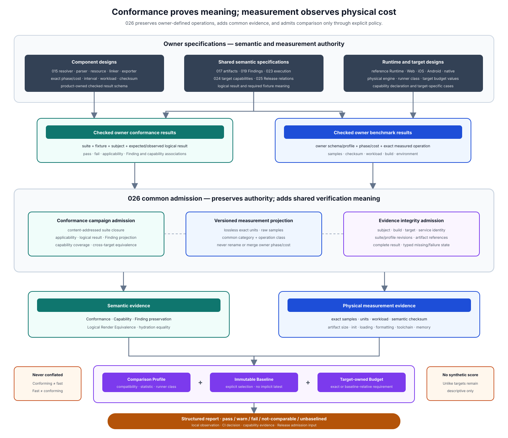
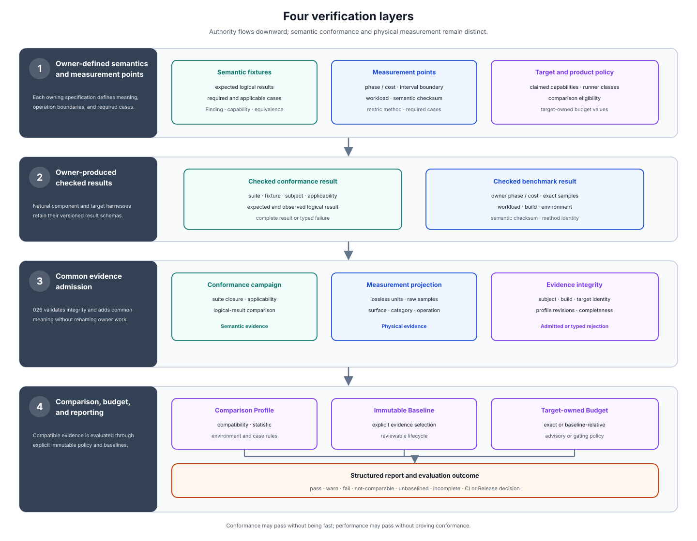

# Intlify Conformance and Measurement Design

## Purpose

This design defines how Intlify proves two different properties without confusing them:

1. a Producer, compiler component, Target Exporter, Localization Execution Layer, or physical engine preserves the applicable Intlify semantics; and
2. one physical implementation has an observable artifact-size, initialization, loading, formatting, toolchain, or memory cost under a recorded workload and environment.

The first property is **conformance**. It is a semantic pass, fail, or non-applicable result over versioned fixtures and claimed capabilities. The second property is **measurement**. It is physical evidence that may vary with hardware, operating system, build configuration, runtime, allocator, power state, and sampling policy.

The design also defines the shared performance implementation architecture needed before those measurements are useful: remove duplicate and optional work, align allocation with data lifetime, keep common paths narrow, bound parallel and cached work, measure host boundaries and generated-output delivery, and reserve low-level specialization for demonstrated bottlenecks. An opt-in Profiler locates cost; an uninstrumented Benchmark quantifies it; an admitted comparison and budget retain the improvement.

026 provides the common verification model between component-owned specifications and product-wide reporting. It does not take ownership of a component's semantic operation names. For example, 015 continues to own `profile_locale_resolve / locale_canonicalization` and its exact interval. 026 defines how that owner-produced observation records exact units, samples, environment, and workload identity, and when it may be compared with a baseline or evaluated against a budget.



The diagram shows the verification-evidence path. The Performance Implementation Architecture and opt-in Profiling Specification are cross-cutting inputs to owner harnesses; they do not add another semantic authority or evidence-admission layer.

In practical terms, the design establishes the following flow:

```text
component or target specification
  -> owner-defined fixtures, phase/cost names, and semantic checksums
  -> owner-produced conformance or benchmark result
  -> 026 admission and lossless common projection
  -> immutable conformance and measurement evidence
  -> explicitly compatible comparison and budget evaluation
  -> structured report, CI decision, or Release evidence
```

The common projection is intentionally not one universal benchmark runner. Existing and future parser, formatter, resource, linker, profile-resolver, Runtime, browser, mobile, and native harnesses retain their natural execution mechanisms and product-owned checked result schemas. A conforming projection preserves their owner, schema revision, fixture identity, phase, cost, interval, workload, and semantic observation instead of renaming or averaging them into one score.

This separation lets the 015 minimum implementation record projection-ready measurements from its first implementation phase. Numeric performance gates can be admitted later without changing the resolver's semantic APIs, measurement points, or result meaning.

## Goals

- Define one language-neutral model for conformance evidence, physical measurement evidence, comparisons, budgets, and their outcomes.
- Preserve each owning design's exact fixture, phase, cost, interval, checksum, and result-schema authority.
- Make semantic conformance independent from machine-dependent performance.
- Give all duration, size, memory, count, difference, and ratio values exact cross-language representations.
- Record enough workload, build, runtime, and environment information to decide comparability rather than assuming it.
- Define common artifact-size, delivery-topology, initialization, loading, formatting, host-boundary, toolchain, and memory categories while retaining finer owner-specific operations.
- Make cold, warm, cache-hit, cache-miss, fresh/reused scratch, in-process, fresh-process, text, structured-parts, and optional-output paths explicit.
- Define immutable baseline selection and reproducible regression and budget evaluation.
- Allow deterministic size budgets to gate ordinary CI while limiting duration and memory gates to admitted, sufficiently stable runner classes.
- Define capability evidence that proves every claimed required capability through applicable conformance cases.
- Define common Finding-projection verification without making presentation text the semantic source of truth.
- Define exact logical-render equivalence for hydration-coupled Browser and SSR targets and controlled equivalence for other cross-target execution paths.
- Keep result collection useful for local development, continuous integration, release admission, and longitudinal reporting.
- Prevent benchmark instrumentation, timestamps, or machine identity from changing product semantics, artifact identity, or localization output.
- Define cross-component performance implementation principles for avoiding duplicate work, unnecessary materialization, and avoidable allocation before applying low-level optimization.
- Treat core execution, host-language boundaries, generated-output topology, and complete product workflows as distinct performance surfaces.
- Define an opt-in profiling model that can diagnose hierarchical time and allocation cost without imposing runtime work on ordinary builds.
- Separate profiling for cause discovery, benchmarking for quantified verification, and regression gates for retained performance.
- Give 015 an initial observational profile that avoids reworking its benchmark record path after numeric policy is introduced.

## Non-Goals

- Defining the semantic behavior owned by 015, 017, 019, 020, 023, 024, or 025.
- Replacing owner-defined conformance suites or product benchmark result schemas with one universal runner or schema.
- Defining one mandatory physical MF2 engine, locale-service implementation, timer, allocator, profiler, CI vendor, or benchmark framework.
- Freezing component-specific Workspace types, arena choices, collection implementations, cache layouts, prepared-message layouts, or output-buffer APIs.
- Treating profiler output as benchmark evidence or allowing an instrumented diagnostic build to establish an uninstrumented performance budget automatically.
- Making results from unlike machines, runtimes, target profiles, or workloads numerically comparable by normalization or a synthetic score.
- Defining target-specific numeric budgets before the applicable target design supplies them.
- Treating elapsed time, allocation behavior, or artifact size as part of message semantics.
- Treating a conformance pass as proof of linguistic, cultural, legal, accessibility, product, or translation quality.
- Treating a performance pass as proof of semantic conformance or security.
- Reserving public CLI commands, package names, report file paths, dashboard products, or wire encodings.
- Collecting hostnames, usernames, repository paths, environment variables, credentials, or other unrelated machine data.
- Benchmarking Provider, TMS, or network service latency as if it were deterministic Locale Compiler or production execution cost.
- Defining the logical resource limits owned by 018, 023, and the applicable component. Resource admission and physical measurement remain separate.

## Ownership and Dependencies

026 owns verification and measurement semantics. It consumes normative behavior from other designs and produces evidence about implementations of that behavior.

| Area | Responsibility relative to this design |
| --- | --- |
| Component and target designs | Own semantic operations, fixture meaning, phase/cost vocabulary, interval boundaries, workload dimensions, required cases, checksum observations, concrete data structures and memory lifetimes, component fast paths, and target-specific budget values |
| 017 shared artifacts | Owns the eventual wire encoding, version admission, canonical identity, and migration of shared conformance and measurement artifacts defined semantically here |
| 018 security and provenance | Owns trust, signatures, actor authority, sensitive-data policy, and whether evidence is authenticated for Release use |
| 019 project graph and Findings | Owns the common Finding envelope, dependency causes, evidence indexing, invalidation, queries, and scheduling |
| 020 planning and linking | Owns reachability, selected definitions, delivery placement, and pruning semantics used by output-size and finite-delivery fixtures |
| 023 execution specification | Owns logical message evaluation, values, functions, parts, locale services, diagnostics, failure behavior, and resource limits tested here |
| 024 target and export specification | Owns Target Profiles, capabilities, generated output semantics, artifact relationships, Runtime/native paths, and target-output identity |
| 025 Release specification | Owns Deployment Compatibility Groups, Release identity, publication, activation, execution admission, and the Release conditions that may require evidence |
| 026 common verification | Owns conformance campaigns, common evidence meaning, cross-component performance implementation principles, profiling/benchmark separation, measurement categories and units, comparison admission, baseline lifecycle, budget evaluation, and common reporting outcomes |
| 027 reference Runtime | Produces reference physical execution and measurement evidence; it does not redefine common conformance or comparison rules |
| Platform designs | Own target fixtures, allowed physical engines, runner classes, platform-specific budget values, and any target-specific measurement limitations |
| Product workflow | Owns commands, repository paths, CI scheduling, evidence retention services, dashboards, and user-facing presentation |

The dependency direction is one-way:

```text
semantic specification -> fixtures and claimed capabilities -> conformance evidence
physical operation specification -> owner benchmark result -> measurement evidence
measurement evidence + comparison policy -> comparison or budget outcome
```

A measurement outcome never becomes an alternate semantic authority. A budget may block a CI or Release decision, but it does not modify a Message Intent, selected artifact, Target Profile, formatted value, Finding, or resource-limit result.

### Relationship to product-owned benchmark schemas

[001](./001-ox-mf2-toolchain-foundation.md) requires checked structured benchmark results to remain product-owned because parser, formatter, linker, resolver, Runtime, and target workflows have different phase relationships and payloads. 026 preserves that decision.

An owner result is authoritative for:

- its `schemaVersion` and benchmark-profile revision;
- its closed phase/cost and metric vocabulary;
- exact interval start and end;
- permitted nesting or overlap;
- required-case matrix;
- fixture and workload semantics;
- semantic checksum observation;
- operational failure behavior; and
- any owner-specific relationships among records.

026 admits a result only through a versioned **Measurement Projection** registered for that exact owner schema and benchmark-profile revision. The projection:

- copies owner identities and tokens without renaming them;
- converts physical quantities only when conversion is exact;
- supplies one common category and operation class without replacing the owner phase/cost;
- maps owner workload and environment facts into their common fields;
- retains a reference to the complete owner result;
- rejects an absent, ambiguous, lossy, or revision-mismatched mapping; and
- never manufactures missing raw samples, checksums, interval metadata, or environment facts.

An owner result that cannot be projected remains valid for its product-local purpose. It is simply ineligible for common comparison, budget, or cross-target claims.

### Relationship to component conformance suites

026 also does not absorb component suites such as the 015 Project Profile Resolver Conformance Suite. A component suite remains authoritative for its own construction, input, semantic, and failure cases. 026 defines a **Conformance Campaign** that can select exact suite revisions, execute or import their results, and prove cross-component or cross-target relationships.

Common fixtures owned by 026 are limited to relationships no single component owns, including:

- capability claims backed by applicable cases;
- preservation of common Finding meaning across projections;
- logical execution equivalence across physical engines;
- Browser/SSR hydration render equivalence;
- Release-consistent target combinations; and
- measurement-projection and comparison integrity.

## Design Principles

### Prove meaning before measuring speed

Every measured operation produces the semantic outcome expected by its owner fixture. Duration or memory samples are discarded when the semantic checksum, expected checked/blocked state, logical output, or required Finding differs.

A fast incorrect result is a failed benchmark operation, not a successful performance sample.

### Preserve owner vocabulary

The component that defines an operation is the only authority allowed to name and delimit it. A common category is an additional reporting dimension, not a replacement phase.

For example:

```text
owner:     015
phase:     profile_locale_resolve
cost:      locale_canonicalization
category:  toolchain
operation: component
metric:    wall_duration
```

The common model may group this record in a report, but it cannot call it `parse`, merge it with policy resolution, or infer its cost by subtracting another interval.

### Admit comparability explicitly

Two measurements are not comparable merely because their metric units match. Comparison requires one admitted Comparison Profile and compatible:

- owner operation meaning;
- fixture and workload;
- semantic result;
- subject and artifact set;
- build configuration;
- execution state;
- locale-service inputs where applicable;
- measurement method;
- sampling policy; and
- environment class.

An incompatible pair produces `not-comparable` with typed reasons. It never produces a misleading percentage.

### Retain observations; derive decisions

Raw admitted observations are immutable evidence. Baseline selection, statistical summaries, differences, ratios, regressions, and budget decisions are derived records that reference their exact inputs.

Changing a threshold or selecting a new baseline creates a new evaluation. It does not rewrite previous observations.

### Use exact quantities

Canonical measurement meaning uses integer nanoseconds, octets, and counts. Signed changes use a sign plus unsigned magnitude. Ratios retain exact numerator and denominator. Floating-point milliseconds, percentages, throughput, and humanized sizes are presentation only.

### Instrument early; gate deliberately

The first implementation of a component records the stable identities, semantic checksum, exact quantities, samples, and environment needed by later comparison. Initially, physical values may be observational while CI gates schema, required cases, interval integrity, and deterministic output.

Numeric gates activate only after a reviewed runner class, statistic, baseline lifecycle, tolerance, and failure disposition exist.

### Remove work before accelerating work

Performance work follows this order unless evidence justifies an exception:

1. remove duplicate computation and repeated parsing or normalization;
2. avoid optional analysis, metadata, diagnostics, and output that the caller did not request;
3. improve algorithms, incremental invalidation, and cache identity;
4. align ownership and memory lifetime;
5. improve data layout, capacity planning, and output construction;
6. reduce host-language boundary crossings and transferred materialization;
7. add bounded coarse-grained parallelism; and
8. specialize instructions, vectorize, or introduce isolated unsafe code.

A lower step is not accepted merely because it improves a microbenchmark while an earlier step still performs avoidable logical work in the same production path.

### Make the common path pay only for requested behavior

The common successful path uses cheap discriminators before expensive semantic work, processes contiguous literal or source-backed runs in bulk, and constructs final output directly where ownership permits.

Optional parts, source evidence, source maps, detailed diagnostics, traces, capability explanations, and debug statistics are not materialized unless the invoked operation or profile requests them. An optional feature may share semantic computation with the common path, but disabling it must avoid its feature-specific collection and output cost.

### Separate diagnosis, verification, and enforcement

Profiling identifies where time, allocation, contention, or materialization occurs. Benchmarking verifies the physical effect of a change with instrumentation disabled under an admitted workload. A regression gate retains an established property through an explicit baseline, runner class, statistic, and tolerance.

No stage substitutes for another:

- a profiler observation does not establish a benchmark value;
- a faster benchmark result does not explain its cause;
- a one-time improvement does not establish a durable budget; and
- a performance pass does not prove semantic conformance.

### Do not invent cross-platform normalization

026 provides common categories and side-by-side reporting across Web, mobile, and native targets. It does not divide results by clock frequency, core count, synthetic benchmark score, or another guessed normalization factor.

Numeric cross-target comparison is admitted only for a deliberately paired experiment whose Comparison Profile names the permitted target differences. Otherwise the report is descriptive.

## Terminology

| Term | Meaning |
| --- | --- |
| **Verification Subject** | Exact implementation, component, target output set, execution path, or Release relation being tested or measured |
| **Owner Result** | Versioned, checked component- or target-specific conformance or benchmark result whose schema and semantic operation names remain owner-controlled |
| **Conformance Suite** | Immutable versioned set of fixtures, cases, expected semantic results, and applicability rules owned by one specification |
| **Conformance Campaign** | Exact selection of suite revisions, Verification Subjects, Target and Locale Service Profiles, and required cross-suite relations evaluated together |
| **Capability Declaration** | Versioned statement of capabilities an implementation or target execution path claims to provide |
| **Capability Evidence** | Conformance evidence binding claimed capabilities to exact applicable passing cases and subject identities |
| **Logical Result** | Canonical semantic result compared by conformance: checked artifact facts, Finding facts, text or parts output, diagnostics, or typed failure state rather than platform presentation bytes |
| **Measurement Projection** | Versioned, lossless mapping from one exact owner benchmark schema/profile revision into the common measurement model |
| **Measurement Profile** | Immutable rules for categories, required metadata, measurement method, samples, warmup, execution state, environment capture, and admissible comparisons |
| **Measurement Case** | One exact owner phase/cost, fixture, variant, scale, subject, workload, execution model, metric, and measurement-method combination |
| **Observation Sample** | One ordinal measured value covering a declared positive repetition count after warmup |
| **Measurement Evidence Set** | Immutable admitted set containing common metadata and samples while retaining exact owner-result identity and semantic observations |
| **Performance Surface** | One physical observation boundary such as core computation, host-language projection, generated-output delivery, retained memory, or an end-to-end workflow; equal metric names do not merge different surfaces |
| **Scratch Workspace** | Component-owned reusable temporary storage with an explicit reset boundary that cannot be referenced by the resulting immutable artifact |
| **Profiler Observation** | Diagnostic hierarchical span, allocation, contention, or materialization record used to locate cost; it is not Measurement Evidence unless an owner schema measures and projects the same operation independently |
| **Profiling Build** | Explicit non-default build or execution mode that enables diagnostic instrumentation and is distinct from the uninstrumented build used for performance comparison |
| **Environment Class** | Versioned comparison-relevant machine, OS, runtime, toolchain, build, and measurement-method facts selected by a Comparison Profile |
| **Comparison Profile** | Immutable rules that decide whether two evidence sets are compatible and how an admitted statistic, difference, and ratio are derived |
| **Baseline** | Explicit immutable reference to an admitted Measurement Evidence Set selected for a named comparison scope |
| **Performance Budget** | Versioned target- or product-owned upper, lower, range, exact, or baseline-relative requirement over one admitted measurement case |
| **Evaluation Outcome** | Structured `pass`, `warn`, `fail`, `not-comparable`, `unbaselined`, or `invalid-evidence` result that references all evidence and policy inputs |
| **Logical Render Equivalence** | Equality or explicitly bounded equivalence of canonical text/parts and diagnostics for the same selected message, locale context, values, and execution specification |

## Architecture



The architecture has four verification layers.

### 1. Owner-defined semantics and measurement points

Each owning specification defines what is being tested or measured. It owns semantic fixtures, product phases and costs, interval boundaries, valid nesting, workload dimensions, deterministic observations, and required cases.

This layer prevents a common reporting system from guessing where resolver construction, linker placement, artifact loading, Runtime preparation, or hot formatting begins and ends.

### 2. Owner-produced checked results

Each harness emits a checked result under its own versioned schema. A result must be complete for the invoked profile: malformed input, a missing required case, a partial prefix after failure, an unknown phase/cost, or a semantic checksum mismatch invalidates the result.

Console output, Criterion reports, Markdown tables, browser traces, and profiler files may accompany the checked result, but they are not automatically admitted as common evidence.

### 3. Common evidence admission

026 validates the exact Measurement Projection or conformance import adapter, preserves the owner result reference, and creates:

- semantic Conformance Evidence;
- physical Measurement Evidence;
- Capability Evidence derived from applicable passing conformance cases; or
- cross-target Logical Render Equivalence Evidence.

Evidence admission checks integrity and internal consistency. It does not yet declare a performance regression or budget pass.

### 4. Comparison, budget, and reporting

A Comparison Profile selects compatible evidence and derives exact statistics. A Performance Budget may then evaluate those statistics. Structured reports expose both the decision and its reasons, while human presentation may render milliseconds, MiB, ratios, trends, and charts.

The report must keep these result kinds visually and structurally distinct:

| Result kind        | Question answered                                                       |
| ------------------ | ----------------------------------------------------------------------- |
| Conformance        | Did the subject preserve the required semantics?                        |
| Capability         | Is a claimed capability supported by applicable passing evidence?       |
| Measurement        | What physical value was observed under this exact case and environment? |
| Comparison         | Are these observations compatible, and how do they differ?              |
| Budget             | Does one compatible statistic satisfy an explicit requirement?          |
| Render equivalence | Did two execution paths produce the required same logical result?       |

## Performance Implementation Architecture

This section defines cross-component constraints that keep Intlify implementations measurable and make later optimization less likely to require an architectural rewrite. It does not prescribe one allocator, collection library, scheduler, binary layout, or host binding. Each component owns those physical choices and demonstrates them through its owner result.

### Performance surfaces

Performance is observed across distinct surfaces rather than reduced to one core-operation score. Revision `"0"` uses the following closed surface tokens.

| Token | Surface | Includes | Required separation |
| --- | --- | --- | --- |
| `core` | Core computation | Parse, normalize, resolve, link, plan, prepare, or evaluate inside one physical implementation | Excludes host projection and workflow I/O unless the owner interval explicitly includes them |
| `host_boundary` | Host boundary | Encoding, decoding, marshaling, native/managed calls, host-object materialization, and result projection | Reports transferred bytes, call count, materialization, and duration independently from the underlying core operation where measurable |
| `product_workflow` | Product workflow | Repository discovery, file I/O, scheduling, incremental lookup, component invocation, and checked result assembly | Keeps component intervals available instead of replacing them with only one end-to-end duration |
| `generated_output` | Generated output and delivery | Payload, packaging, compression, generated files, Delivery Units, eager-load closure, and required load requests | Uses one checked Target/Release artifact relation rather than filename inference |
| `memory_lifetime` | Memory lifetime | Invocation scratch, worker scratch, retained artifact, cache, host projection, and process-level memory | States the allocation domain and does not compare incompatible observers |

Every Measurement Case maps to exactly one surface for one metric. An owner may measure the same logical operation on multiple surfaces as distinct cases, such as `core` duration and `host_boundary` duration.

If an operation crosses a host-language boundary, a promoted performance profile normally includes both a core-only case and a boundary-inclusive case. If a target generates deployable output, the profile includes both byte weight and delivery topology when both can affect application cost.

### Memory lifetime classes

Components classify storage before selecting an allocation technique.

| Lifetime class | Intended use | Cross-component requirement |
| --- | --- | --- |
| Immutable artifact | Checked Profile, linked message, plan, prepared message, Runtime artifact, or evidence retained after an invocation | Owns or safely shares its storage and never references resettable scratch |
| Invocation scratch | Temporary vectors, maps, strings, indexes, and queues for one operation | Has an explicit reset boundary and cannot escape in the result |
| Worker scratch | Reusable temporary state for repeated independent work on one worker | Is worker-owned rather than concurrently mutated by unrelated workers |
| Shared cache | Reusable immutable or synchronized state across operations | Has explicit identity, invalidation, entry and resident-byte limits, and deterministic uncached equivalence |
| Output buffer | Text, parts, serialization, or generated-code destination | Distinguishes caller-owned reusable output from an owned convenience result whose capacity leaves the producer |

A Scratch Workspace is preferred when ordinary collections and buffers can retain useful capacity across invocations. An arena is considered only when many objects share one demonstrable lifetime and bulk reset materially reduces measured allocation cost. Arena allocation is not a product-wide requirement and must not hold values that require independent destruction or outlive its reset boundary.

Workspace behavior follows these rules:

- `clear`-equivalent reset retains capacity; shrinking is explicit rather than part of the common path;
- no reference into scratch survives reset or enters an immutable artifact;
- workers do not share mutable scratch merely to reduce allocation count;
- capacity hints derive from admitted input or observed workload, are bounded, and are not copied blindly from an attacker-controlled maximum;
- pathological high-water capacity can be released by an explicit policy outside the latency-sensitive path; and
- owner diagnostics can expose capacity high-water marks and growth counts before those become common metrics.

An API that transfers an owned output buffer to its caller does not claim capacity reuse for the next call. A component that requires repeat-call output reuse provides a caller-owned or explicitly recyclable output path in addition to any owned convenience API.

### Common-case fast paths and optional work

The common successful path minimizes the number of semantic operations before considering instruction-level optimization.

- Cheap byte, tag, ID, capability, or state discriminators select a narrow parser or evaluator path before expensive recognition.
- Contiguous source-backed or literal runs are processed in bulk rather than one node, character, or host call at a time.
- Normalization, parsing, sorting, graph construction, and validation results are reused within their valid revision instead of recomputed by adjacent phases.
- Final output is constructed directly when doing so preserves the required ownership and checked failure semantics.
- Empty diagnostics, optional parts, source evidence, source maps, debug statistics, traces, and capability explanations are not allocated on a successful path that did not request them.
- Optional feature preflight is cheaper than the avoided feature work and is itself benchmarked for workloads where the feature is absent and present.

Fast-path selection cannot weaken admission, resource limits, deterministic output, or semantic checks. A cheap discriminator identifies candidates; it does not replace the parser or semantic decision that proves the result.

### Data layout, lookup, and identity

After input admission and canonicalization, frequently repeated processing prefers compact IDs and dense storage over repeated string hashing and pointer-heavy traversal where the domain is finite.

- Dense `0..N` IDs normally index contiguous vectors, compact tables, or bitsets.
- Canonical strings are normalized and interned or assigned an ID once per valid revision rather than repeatedly in an inner loop.
- An unordered internal lookup never determines artifact, Finding, evidence, or report order; freeze or projection establishes canonical order explicitly.
- A fast process-local hash may be used for admitted internal keys, but it does not become an artifact identity, integrity digest, wire value, or trust decision.
- Untrusted external strings are not inserted without admission and resource bounds into a predictable non-cryptographic hash domain.
- Small inline collections or compact strings are introduced only when measured cardinality and value length justify their size and branch trade-offs.
- Array-of-structures remains appropriate when all fields are consumed together; structure-of-arrays is considered only for measured large scans over a field subset.

Physical record size and alignment may have regression tests, but an in-memory language layout is never used as the shared wire encoding merely because it is compact locally.

### Bounded parallel and incremental work

Core component APIs remain synchronous and scheduler-neutral unless their owning design requires another execution model. Workflow and binding layers schedule independent files, profiles, locales, Delivery Units, or batch requests.

Parallel execution:

- uses coarse independent units rather than fine-grained parallelism inside one small message;
- preserves deterministic input/result association and canonical merge order;
- gives each worker its own Scratch Workspace;
- bounds a batch by item count, admitted input bytes, and predicted peak memory;
- avoids parallel startup when fixed scheduling cost dominates small workloads;
- records actual worker concurrency and contention where they affect the case; and
- does not create an implicit nested thread pool beneath a host scheduler.

Incremental execution keeps its bookkeeping off the one-shot common path. Cache identity includes every semantic input that can change the result, and cached and uncached execution must produce the same logical observation. Entry count alone is not a sufficient cache bound; resident bytes and any retained source/artifact bytes are also bounded and measurable.

### Host-boundary and output construction

Moving work to native code, a worker, or a binary representation is not itself a performance result. A boundary design minimizes crossings and independently accounts for transfer and host materialization.

- Batch APIs are preferred when independent per-item crossings would dominate core work.
- Compact handles, snapshots, or lazy accessors are candidates for large internal graphs; verbose host objects are produced only when required by the API.
- Heavy diagnostics, source maps, statistics, and trace payloads are opt-in.
- Encoding formats are compared end to end, including producer allocation, copies, transfer bytes, host decode, object materialization, and consumer access.
- A binary representation is not assumed to be smaller, zero-copy, or faster than a textual representation.
- Async or worker execution records queueing, transfer, execution, and result projection separately when those costs are independently observable.

Generated output is evaluated as a complete product surface. Reducing one file's compressed size does not establish improvement if it increases required files, Delivery Units, initial requests, initialization work, or retained memory for the same checked workload.

### Low-level specialization and unsafe code

Byte-search libraries, compiler-vectorizable loops, and other safe optimized primitives are preferred before architecture-specific code. Candidate low-level work is limited to measured byte-oriented operations such as delimiter search, escaping, UTF-8 validation/transcoding, digest calculation, and literal copying.

Locale-policy evaluation, fallback traversal, graph linking, Finding construction, and other branch-heavy semantic operations are not SIMD targets without contrary evidence.

An implementation-specific unsafe or architecture-specialized path requires:

- an existing scalar safe reference implementation;
- a stable benchmark showing material improvement on representative input distributions;
- isolation behind a safe facade and a portable fallback;
- documented safety and data-layout invariants;
- exact semantic differential tests;
- fuzzing and applicable memory/undefined-behavior checks; and
- a separate decision in the owning component specification.

026 does not authorize unsafe code merely by listing a possible optimization class.

### Enforceable performance guardrails

A stable performance rule is expressed as a lint, invariant test, feature-matrix test, size/alignment assertion, or benchmark fixture where practical instead of relying only on reviewer memory.

Candidate guardrails include:

- rejecting temporary formatting/collection patterns in allocation-sensitive modules when direct output construction is available;
- testing deterministic output independently from unordered internal lookup order;
- snapshotting allocation count or compact record size only under a pinned method and target layout;
- compiling ordinary and profiling feature sets separately;
- checking that profiler-only dependencies are absent from ordinary product artifacts; and
- recording all optimization, link, assertion, allocator, and feature differences between benchmark and release builds.

Guardrails prevent known regressions; they do not prove that an implementation is fast. Every rule that constrains ordinary implementation style must retain a correctness reason or measured performance justification and can be revised when the owning evidence changes.

## Profiling Specification

Profiling is a diagnostic capability for finding expensive spans, allocations, contention, and materialization. It is deliberately separate from common Measurement Evidence and Performance Budget evaluation.

### Build isolation and ordinary-build cost

Diagnostic instrumentation is guarded by an explicit non-default build feature or equivalent compile-time mechanism.

When profiling is disabled, an instrumentation call site contributes no required:

- span registration or dynamic label construction;
- runtime branch or enabled-state check;
- atomic operation;
- thread- or task-local access;
- allocation or trace-buffer write; or
- profiler dependency in a production target artifact.

The disabled and enabled variants have identical product semantics, public artifact formats, and logical results. Instrumentation cannot become necessary for cache identity, control flow, error handling, or cleanup.

Timing and allocation instrumentation may be separate features. In particular, replacing or wrapping a global allocator is a more invasive diagnostic mode and is not enabled merely because timing spans are enabled.

### Span registry and observation model

The owning component defines a finite versioned span registry aligned with, but not required to equal, its benchmark phase/cost registry. Hot call sites use static span IDs or static labels. Dynamic source text, paths, message content, locale values, and user-provided labels are not constructed or stored as span names.

A Profiler Observation conceptually contains:

```text
ProfilerObservation {
  profiler and registry revision
  Verification Subject and Profiling Build identity
  fixture and workload identity
  instrumentation capabilities
  thread, task, or worker context model
  ordered span records [
    span ID and parent span ID
    occurrence count
    inclusive duration
    self duration when valid
    allocation and deallocation deltas when enabled
    current and peak live-byte observations when enabled
    optional contention or materialization counters
  ]
  truncation and profiler diagnostics
}
```

The physical representation may be a tree, table, event stream, or aggregate. It must retain enough parent/context information to distinguish nested work from repeated sibling work and must report when limits truncate the observation.

Recording favors fixed IDs and preallocated or reusable bounded storage. Human labels, sorting, aggregation across roots, and report formatting occur after the profiled workload where practical. The profiler reports its own recorder mode so a full event trace is not compared as though it had the same perturbation as aggregate counters.

Self duration is derived only for properly nested serial spans in the same declared timing context. When valid, it is the checked subtraction of the inclusive durations of direct serial children from the parent's inclusive duration. Overlap, underflow, an incomplete child, or incompatible clocks makes self duration unavailable rather than saturated or guessed.

Time from concurrent workers is not subtracted from a parent as if it were serial child time. Cross-thread or async relationships require explicit context propagation; otherwise they remain separate roots.

### Allocation profiling

An allocation-profiler observation states:

- observed allocation domain and allocator identity;
- whether the harness, runtime, dependencies, and profiler recorder are included;
- allocation, reallocation, and deallocation counting semantics;
- live-byte and peak-live calculation;
- thread/process coverage;
- counter overflow behavior; and
- known self-observation or sampling effects.

Profiler bookkeeping can itself allocate or perturb timing. Therefore allocation-profiler values locate likely cost and compare diagnostic shapes under the same profiler revision; they are not silently projected as uninstrumented allocation or duration evidence.

A process-wide allocator delta cannot be attributed to one span while unrelated threads allocate concurrently unless the observer can distinguish those domains. Such a recorder reports a process-wide overlapping observation or marks per-span attribution unavailable; it does not present the delta as thread-local self allocation.

An owner that needs gating allocation evidence defines a separate benchmark measurement method with explicit interval and allocation domain. Its result is admitted through the normal Measurement Projection.

### Bounded recording and privacy

Profiler state is bounded by registered span count, nesting depth, event/record count, retained bytes, and report size. Exceeding a bound produces explicit truncation or profiler failure; it does not silently wrap counters or discard an unknown subset.

Shared profiler output uses fixture and semantic identities rather than source content where possible. Source text, translations, absolute paths, dynamic labels, environment dumps, and credentials are excluded unless a separate local-only diagnostic mode explicitly requests them.

### Profiling-to-regression workflow

Performance changes follow this evidence flow:

```text
conforming representative fixture
  -> opt-in profiling build locates dominant self time/allocation/materialization
  -> implementation change
  -> same profiler setup confirms the diagnosed cost moved as expected
  -> uninstrumented owner benchmark quantifies the end-to-end effect
  -> admitted comparison evaluates compatible evidence
  -> advisory or gating budget retains the improvement
```

Real repository and product-path workloads are profiled before specializing a synthetic micro-case. A microbenchmark may then isolate the changed primitive and protect it from local regression, while an end-to-end benchmark verifies that the product surface improved.

Profiler reports may accompany owner results as diagnostic attachments. They are not automatically admitted as common evidence, are not used to select a numeric statistic, and cannot satisfy a Performance Budget.

## Common Evidence Model

The following shapes are semantic records. Their eventual wire representation, field tags, canonical encoding, digest framing, and migration are owned by 017.

### Evidence identity

Every evidence item binds:

- evidence kind and 026 specification revision;
- owner ID and owner specification revision;
- complete owner-result identity and integrity digest;
- Verification Subject identity and implementation revision;
- applicable suite, benchmark, fixture, and profile identities;
- applicable Target Profile, Locale Service Profile, Release, artifact, or capability identities;
- canonical result body; and
- creation tool identity.

Wall-clock creation time is optional report context. It never participates in semantic result equality, Measurement Case identity, comparison compatibility, or product cache identity.

An evidence digest identifies the complete immutable evidence body. It is not proof that the runner was trustworthy. Authentication and authorized use are separate 018-owned decisions.

### Conformance evidence

Conceptually:

```text
ConformanceEvidence {
  evidence identity
  campaign identity
  suite identity and revision
  case identity and fixture digest
  verification subject
  applicability: applicable | not-applicable
  outcome: pass | fail
  expected logical result identity
  observed logical result identity
  finding observations
  capability associations
}
```

An applicable case has only `pass` or `fail`. A `not-applicable` record has no pass/fail outcome and retains the exact applicability rule that excluded it. Environmental inability to execute is a campaign execution failure, not a semantic pass and not silently `not-applicable`.

`not-applicable` is allowed only when a suite rule proves that the case is outside an unclaimed optional capability or target dimension. A Target Profile that requires the capability makes the case applicable.

### Measurement evidence

Conceptually:

```text
MeasurementEvidenceSet {
  evidence identity
  measurement profile identity
  projection identity
  owner result identity
  verification subject
  build identity
  environment observation
  ordered measurement cases [
    owner phase and cost
    common category and operation class
    performance surface
    fixture, variant, scale, execution model
    workload identity and logical work vector
    metric and measurement method
    interval identity and overlap facts when applicable
    warmup policy
    ordered observation samples
    semantic observation identity
  ]
}
```

The common evidence retains samples rather than only a precomputed average. A product result may contain additional owner-specific aggregates and relationships, which remain available through its retained identity.

### Comparison and budget evidence

Conceptually:

```text
ComparisonEvaluation {
  comparison profile identity
  baseline evidence and case identity
  candidate evidence and case identity
  compatibility outcome and typed reasons
  admitted statistic
  exact baseline and candidate quantities
  signed difference
  exact ratio
}

BudgetEvaluation {
  performance budget identity
  comparison or direct measurement identity
  evaluated limit
  tolerance when applicable
  outcome
  typed reasons
}
```

Neither record copies observations and then treats the copy as new evidence. It references exact admitted inputs.

## Conformance Specification

### Suite closure and reproducibility

Every promoted Conformance Suite is a finite, immutable, content-addressed closure. Its index explicitly references:

- the suite specification and schema revisions;
- every case manifest and fixture payload;
- expected logical result observations;
- applicable capability and target selectors;
- canonical observation codecs;
- required-case groups;
- permitted implementation parameters; and
- all transitive suite-owned data.

The suite does not discover authoritative cases by scanning a directory, following a changing `latest` reference, or consulting the network. A runner verifies every referenced digest before executing a case.

External standards fixtures may be included by pinned revision and digest. A repository URL or standards version label alone is not a fixture identity.

### Case identity and parameters

A conformance case has a stable opaque ID within one suite revision. Its semantic identity includes:

- fixture bytes and fixture role;
- exact semantic specification revision;
- input artifacts and values;
- requested locale and definition locale when applicable;
- Target Profile and Locale Service Profile requirements;
- output mode;
- expected successful or typed failure result;
- required and excluded capabilities;
- resource-bound vector where applicable; and
- canonical observation codec.

Case parameters are finite and enumerated in the suite. A runner may shard or reorder cases, but execution order and worker assignment cannot change an individual case result.

A generated family records the generator identity, revision, parameters, and digest of every realized case. A runner cannot substitute a new generated input under an existing case identity.

### Logical result comparison

Conformance compares canonical logical results, not private memory layout, pointer identity, thread schedule, filesystem path, JavaScript object prototype, DOM serialization, native view hierarchy, or human reporter text.

Depending on the owning specification, the logical result may include:

- checked artifact fields and canonical identity;
- an ordered Finding set and typed dependency causes;
- selected Intent, requested locale, definition locale, and Message Artifact identity;
- plain text;
- ordered structured parts, annotations, markup, fallback values, and bidi facts;
- stable diagnostic code, category, severity, typed data, and source identity/span;
- typed success, blocked, recoverable, or failure classification;
- resource-counter observations at exact and first-over limits; or
- capability-admission facts.

Private implementation details are excluded unless the owning semantic specification makes them observable.

### Finding projection conformance

019 owns the common Finding model. 026 verifies that CLI, editor, agent, build, Runtime, and target-specific projections preserve its meaning.

A projection case compares at least:

- stable Finding code and owning specification;
- severity and blocking effect;
- affected semantic entities;
- typed dependency cause;
- primary and related source identities;
- canonical UTF-8 spans before host-position conversion;
- structured parameters;
- suggested action or edit identity when present; and
- deterministic ordering and truncation state.

The following may vary only when the projection specification explicitly allows it:

- human-readable message localization;
- path presentation relative to an editor or workspace;
- line/column or UTF-16 conversion derived from the same canonical span;
- terminal color and layout; and
- UI grouping that retains every underlying Finding identity.

A projection must not drop a blocking Finding, change severity, erase truncation, merge distinct semantic entities, or convert an unknown required field into a guessed default.

### Capability declaration and evidence

A Capability Declaration is not self-certifying. For every capability claimed by a Verification Subject:

1. the applicable Target Profile or implementation specification selects the required suite and case group;
2. the campaign resolves every required case after considering declared dependencies and exclusions;
3. every applicable case passes against the same subject build and compatible service profiles;
4. no required case is skipped, missing, stale, or executed under a different implementation identity; and
5. the resulting Capability Evidence records the complete case set and any allowed variation.

Capability Evidence is valid only for its exact:

- implementation and build identity;
- capability-set revision;
- Target Profile;
- physical execution-path kind;
- artifact and Runtime ABI revisions;
- Locale Service Profile and locale-data identity where applicable;
- suite and fixture revisions; and
- required host/runtime versions.

A change to any comparison-relevant member invalidates the affected evidence through 019-owned dependency processing. Passing a smaller capability subset cannot be reused as evidence for a superset.

An unsupported optional capability is represented by its absence from the declaration. An implementation that claims the capability and fails its case is non-conforming; it cannot relabel the case as non-applicable.

### Execution conformance

023 supplies normative execution behavior. Its common campaign covers at least:

- simple text and interpolation;
- declarations, selectors, exact variants, and fallback variants;
- every promoted portable Message Value and function;
- requested-locale and definition-locale separation;
- plain-text and structured-parts output;
- bidi and direction behavior;
- missing, unexpected, and incompatible arguments;
- recoverable evaluation diagnostics and fallback values;
- inert markup and allowlisted projection inputs;
- exact and first-over resource bounds;
- cached and uncached semantic equality;
- locale-bound isolation;
- mixed-release and incompatible-artifact rejection through 024–025; and
- deterministic behavior under admitted concurrency.

A runtime-backed engine and an ahead-of-time or platform-native engine may use different physical representations. They conform when their applicable logical observations satisfy the same campaign and their Capability Declarations accurately describe any unsupported features.

### Locale Service Profile conformance

A pinned Locale Service Profile requires exact canonical logical output for the same complete input, implementation/data revisions, and applicable execution specification.

A platform-managed profile may admit only variation enumerated by its profile and fixture codec. Allowed variation is represented through typed alternatives or relations, not a free-form statement that results may differ.

Examples of admissible typed variation include:

- one of a finite set of spacing code points;
- an explicitly allowed numbering-system result;
- a platform-owned time-zone-name variant; or
- a declared native collation behavior when collation is in scope.

Examples that are not admissible include:

- arbitrary string inequality;
- missing or reordered message parts;
- a different selected Message Artifact;
- a changed requested or definition locale;
- a dropped diagnostic; or
- a semantic downgrade hidden as platform variation.

### Logical render equivalence

Logical Render Equivalence compares two complete execution observations with the same:

- Message Intent revision;
- selected Message Artifact and definition locale;
- requested locale;
- portable argument values;
- function and capability inputs;
- applicable message and execution specification;
- output mode; and
- declared locale-service relationship.

For ordinary cross-engine comparison:

- pinned compatible Locale Service Profiles require exact logical-result equality;
- platform-managed profiles use only the explicit typed variation relation above; and
- an unsupported required feature is a capability-admission failure rather than approximate output.

For a Browser/SSR hydration relation, equivalence is stricter. Server output and the client initial render must have the same effective requested locale, selected Message Artifact, definition locale, and exact logical text or parts required by the hydration fixture. A platform-managed profile cannot weaken this relation. If the pair cannot guarantee it, 024–025 must reject that hydration-coupled target combination before Release Assembly.

The comparison excludes physical DOM node identity, framework component instances, HTML serializer choices not represented in logical parts, and native view objects. Framework designs may add a later projection-specific hydration check after this logical check.

### Conformance campaign outcomes

A campaign produces one of:

- `pass` — every required applicable case passed and every required relation was satisfied;
- `fail` — at least one applicable case or relation produced a different logical result;
- `incomplete` — required evidence was missing, stale, corrupt, or could not be executed; or
- `invalid` — the campaign, suite closure, subject declaration, or result was malformed or inconsistent.

Only `pass` is positive conformance evidence. `incomplete` is never converted into `pass` because a platform or runner was unavailable.

One failing case does not permit a result prefix to certify other capability groups unless the suite explicitly partitions those groups and each partition has independently complete evidence.

## Measurement Specification

### Measurement Case identity

A Measurement Case is identified by the following semantic dimensions:

- owner ID and owner result-schema revision;
- owner benchmark-profile revision;
- owner phase and cost;
- common category and operation class;
- performance surface;
- interval boundary identity when the metric observes an interval;
- fixture ID and fixture revision;
- variant and scale;
- Verification Subject kind and stable identity;
- applicable artifact, Target, Release, and Locale Service Profile identities;
- execution model;
- cache and preparation state;
- Scratch Workspace, allocator, and output-buffer reuse state where applicable;
- concurrency and worker model;
- workload profile and logical work vector;
- metric and measurement-method identity; and
- Measurement Profile revision.

Human labels, generated time, sample values, VCS branch name, absolute path, worker ID, and implementation revision being compared do not enter the case identity.

The implementation revision is retained on each evidence set so different implementations can be compared under the same case.

### Common categories and operation classes

026 defines closed revision-`"0"` common categories. An owner-specific phase/cost maps to exactly one category, operation class, and Performance Surface for each metric.

| Category | Initial operation classes | Meaning |
| --- | --- | --- |
| `toolchain` | `component`, `workflow`, `startup`, `io` | Compiler, resolver, parser, linker, exporter, codec, command, and other build/tooling work |
| `artifact_size` | `payload`, `packaged`, `transfer`, `installed`, `initial_eager`, `complete_set` | Exact size of generated localization outputs or shipped execution components under one declared representation |
| `delivery_topology` | `generated_file`, `delivery_unit`, `initial_load_request`, `complete_load_request` | Exact count of generated or required loading units under checked Target/Release artifact relationships |
| `initialization` | `process`, `engine`, `release_admission`, `localizer`, `binding` | Startup work before artifact loading or message formatting, with each owned operation kept separate |
| `loading` | `io`, `decode`, `integrity`, `admission`, `registration`, `complete` | Retrieval and admission of an immutable manifest, delivery unit, locale artifact, or native resource |
| `formatting` | `preparation`, `cache_lookup`, `cold_text`, `hot_text`, `cold_parts`, `hot_parts`, `application_e2e` | Selected-message preparation and synchronous evaluation under an explicit cache/output state |
| `boundary` | `encode`, `decode`, `marshal`, `call`, `batch`, `materialize`, `application_e2e` | Host-language, process, worker, or managed/native boundary work kept distinct from the underlying core operation |
| `memory` | `peak_live`, `retained_live`, `peak_rss`, `cache_resident`, `artifact_resident` | Memory observations whose provider and lifetime are explicit |

The categories are for common reports and budget selection. They do not imply that every target implements every operation class.

Category and Performance Surface are independent dimensions. Category describes the kind of operation or cost; surface describes the physical inclusion boundary. For example, producer-side encoding alone may be `boundary / encode` on the `core` surface, while the complete encode-cross-decode-materialize path is `boundary / application_e2e` on the `host_boundary` surface.

A combined operation such as end-to-end loading may coexist with component observations. The relationship is declared through owner interval topology; its duration is not treated as the sum of separately sampled children.

### Metrics and units

Revision `"0"` admits these common metric meanings:

| Metric                       | Canonical unit | Value                          |
| ---------------------------- | -------------- | ------------------------------ |
| `wall_duration`              | nanosecond     | non-negative unsigned quantity |
| `payload_bytes`              | octet          | non-negative unsigned quantity |
| `packaged_bytes`             | octet          | non-negative unsigned quantity |
| `transfer_bytes`             | octet          | non-negative unsigned quantity |
| `installed_bytes`            | octet          | non-negative unsigned quantity |
| `peak_live_bytes`            | octet          | non-negative unsigned quantity |
| `retained_live_bytes`        | octet          | non-negative unsigned quantity |
| `peak_rss_bytes`             | octet          | non-negative unsigned quantity |
| `cache_resident_bytes`       | octet          | non-negative unsigned quantity |
| `artifact_resident_bytes`    | octet          | non-negative unsigned quantity |
| `allocation_count`           | count          | non-negative unsigned quantity |
| `reallocation_count`         | count          | non-negative unsigned quantity |
| `boundary_call_count`        | count          | non-negative unsigned quantity |
| `materialized_object_count`  | count          | non-negative unsigned quantity |
| `generated_file_count`       | count          | non-negative unsigned quantity |
| `delivery_unit_count`        | count          | non-negative unsigned quantity |
| `initial_load_request_count` | count          | non-negative unsigned quantity |

The metric fixes the unit. A record cannot relabel milliseconds as nanoseconds or megabytes as bytes.

Throughput, operations per second, milliseconds per operation, MiB, percentage change, and compression percentage are derived presentation values. They are not canonical stored observations in revision `"0"`.

### Owner-specific diagnostic metrics and promotion

An owner result may retain diagnostic metrics that are not common revision-`"0"` metrics, including:

- Scratch Workspace capacity high-water mark;
- output-buffer growth count;
- cache hit, miss, and eviction counts;
- lock-wait duration;
- actual peak worker concurrency;
- unchanged entities recomputed after an edit; and
- serializer section copies or intermediate bytes.

A Measurement Projection preserves such fields through the retained owner result but does not rename them into an inexact common metric. A diagnostic metric is promoted in a later 026 revision only when its observation point, unit, inclusion domain, overflow behavior, and cross-component meaning are stable enough for lossless projection and useful comparison.

Unsupported observation remains explicit. Implementations do not estimate a metric from another metric, infer reallocation from capacity, or substitute a profiler counter for an uninstrumented benchmark observation.

### Exact numeric representation

The semantic numeric domain is `0..=u64::MAX`. A wire representation must preserve every value exactly across Rust, JavaScript, JSON, WASM, C ABI, Swift, Kotlin, and other bindings. Until 017 fixes a canonical wire encoding, JSON-facing product schemas use the shortest unsigned decimal string for values that may exceed the JavaScript safe-integer range.

Duration is captured from a monotonic clock and converted exactly to integer nanoseconds before admission. A timer that cannot provide a finite non-negative duration or whose value cannot be represented exactly is not eligible for common evidence.

Differences use:

```text
SignedDifference =
  baseline-larger { magnitude: u64 }
  | equal { magnitude: 0 }
  | candidate-larger { magnitude: u64 }
```

Ratios use exact unreduced integers:

```text
Ratio =
  defined { numerator: u64, denominator: non-zero u64 }
  | undefined-zero-denominator
```

Reporters may round a displayed value. The exact quantity and ratio remain available in structured output and are the only inputs to a decision.

### Interval measurement

Every interval observation names an owner-defined boundary descriptor containing:

- stable boundary ID;
- owner phase and cost;
- metric;
- occurrence policy;
- first included stage marker;
- final included stage marker;
- ordered included and excluded stage markers; and
- permitted direct parent/child overlap.

The timer, allocator, or sampler starts and stops at those owner-defined markers. Fixture generation, input acquisition, benchmark setup, clock or allocator setup, semantic checksum encoding, result validation, reporting, and teardown are excluded unless the owner explicitly defines a broader operation that includes one of them.

Nested and overlapping intervals are reported independently. 026 never subtracts `parent - child` to invent an unmeasured cost.

A profiling span may share an owner phase/cost label with a benchmark interval, but it does not define that interval implicitly. The owner boundary descriptor remains authoritative, and changing profiler nesting does not move a benchmark timer or allocator boundary without an owner-profile revision.

Concurrent operations require an owner-declared occurrence policy:

- `single` — exactly one interval in one repetition;
- `sequential-aggregate` — a canonical ordered sequence is measured as one sample;
- `concurrent-wall` — one wall interval covers the complete concurrent operation; or
- `per-occurrence` — each occurrence is a separate Measurement Case dimension.

CPU-time summation across workers is outside revision `"0"`. It cannot be substituted for wall duration.

### Artifact-size and delivery-topology measurement

Artifact size is deterministic only when the measured representation and complete artifact set are fixed.

The exact meanings are:

- `payload_bytes` — length of the artifact payload produced by the checked exporter, excluding metadata not in that payload;
- `packaged_bytes` — exact bytes of a named deterministic package or container representation;
- `transfer_bytes` — exact bytes after one named deterministic compression and framing profile;
- `installed_bytes` — exact regular-file bytes in the admitted installed artifact set, excluding filesystem block allocation unless a future metric names it separately.

A report must not label any of these as generic `bundle size`.

Size evidence records the applicable grouping and attribution:

- complete Release or Target Profile output set;
- initial/eager-load closure;
- concrete requested locale or `shared`;
- concrete Delivery Unit or `shared`;
- artifact kind;
- execution component;
- locale-data component; and
- Runtime-backed, ahead-of-time, or platform-native path.

The grouping derives from checked 024–025 artifact relationships, never filename parsing or content sniffing. Shared bytes are reported in a separate bucket unless a target-owned budget explicitly defines another attribution rule. A comparison uses the same grouping and attribution revision on both sides.

Compression evidence fixes algorithm, implementation revision, parameters, dictionary identity, and container framing. Compressed sizes produced under different profiles are not comparable.

Delivery-topology metrics use the same checked grouping and attribution:

- `generated_file_count` counts regular generated files in the named complete or initial/eager artifact set;
- `delivery_unit_count` counts distinct checked Delivery Units required by that set; and
- `initial_load_request_count` counts the target-defined load requests required to make the initial/eager closure ready under one fixed packaging and loader profile.

Directories, source inputs, debug outputs, source maps, and optional metadata are included only when the measured Target/Release relation includes them. Shared files and Delivery Units are counted once per measured closure, not once per referencing locale or message.

`initial_load_request_count` describes deterministic loader topology. It is not an observation of live network traffic, retries, protocol multiplexing, cache state, or latency. A runtime network experiment uses a separate owner case and environment.

### Initialization measurement

Initialization observations keep these physical responsibilities separate:

- host process or wrapper startup;
- language binding initialization;
- Runtime Engine construction;
- Release or manifest compatibility admission;
- immutable function and locale-service registry construction;
- Localizer creation; and
- framework or application adapter initialization.

A target may expose only a subset. A complete application-start observation may include several components, but it is a separately named owner workflow and does not replace the component observations required by its profile.

Process startup uses `fresh_process`. Engine and Localizer construction normally use `in_process` unless their owner specifies otherwise. A warm reused process cannot be compared with a fresh-process baseline.

### Loading measurement

Loading observations distinguish:

- application- or repository-owned I/O;
- transfer or fetch when a deterministic local delivery fixture exists;
- decoding;
- integrity verification;
- artifact and ABI admission;
- registration into an immutable Runtime Engine;
- cache-hit validation/access; and
- complete ready-to-format loading.

Provider or TMS access is never part of production loading.

A network benchmark may exist for a host delivery integration, but it requires its own network environment and is not comparable with deterministic local artifact loading. It cannot become evidence for offline execution latency.

The end of `loading / complete` is the point at which the declared Localizer/delivery unit can perform the profiled synchronous format operation. Lazy loading of another Delivery Unit is a separate case.

### Host-boundary measurement

A host-boundary case identifies both sides of the boundary and separates, where observable:

- producer-side encoding or serialization;
- queueing or call setup;
- transferred payload bytes;
- boundary crossing count;
- consumer-side decoding;
- host-object or managed-value materialization;
- result projection; and
- complete boundary-inclusive operation.

`boundary_call_count` counts actual crossings made by the declared operation, including callback crossings when the profile includes them. A batch invocation is one crossing plus its declared item count; it is not relabeled as one logical item.

`materialized_object_count` requires an owner-defined object domain. For example, a host object, array, string, part, or wrapper may each be a counted object if the method declares that taxonomy. Values from different taxonomies or instrumentation revisions are not comparable.

A transfer case records representation and version, framing, copy/ownership mode where observable, batch size, input and output bytes, and whether consumer access is eager or lazy. A format described as binary, compact, shared, or zero-copy receives no special comparison status without these observations.

Core-only and boundary-inclusive cases use the same semantic observation for the same logical input. The boundary-inclusive result is not admitted when host projection drops diagnostics, changes part structure, or otherwise changes the logical result.

### Formatting measurement

Formatting cases must state:

- text or structured-parts output;
- cold or hot state;
- whether message preparation is included;
- cache state and cache capacity;
- argument shape and value classes;
- selected message complexity;
- requested and definition locale;
- Locale Service Profile and data identity;
- diagnostic/fallback path;
- output consumption or checksum behavior outside the interval;
- requested optional outputs and diagnostic detail;
- output-buffer ownership and reuse mode;
- Localizer reuse;
- concurrency and contention model; and
- batch/repetition size.

Revision `"0"` meanings are:

- `preparation` — convert one already admitted checked message into the physical prepared representation;
- `cache_lookup` — locate an existing prepared representation under an exact cache identity;
- `cold_text` / `cold_parts` — format when the declared prepared-message cache state is absent; preparation is included only when the owner boundary says so;
- `hot_text` / `hot_parts` — format with all declared required artifacts and prepared-message entries already admitted and resident;
- `application_e2e` — compiler-lowered application call through binding, handle resolution, evaluation, and host result projection.

Cold and hot results must be semantically equal for the same logical input. That equivalence is checked before their physical values are admitted.

A hot benchmark cannot silently omit required locale-service work, argument admission, result construction, or diagnostics simply because the result is known to the fixture.

A case named `hot_text` or `hot_parts` has already admitted required artifacts and prepared-message state. Its measured interval does not perform filesystem/network I/O, message syntax parsing, locale canonicalization, fallback-graph construction, sorting, artifact admission, or global configuration mutation. If an implementation intentionally performs one of those operations during formatting, the owner uses a different operation class or explicitly includes and reports the work rather than calling the case hot.

### Memory measurement

Memory metrics are not interchangeable.

- `peak_live_bytes` and `retained_live_bytes` require an allocator-observation method with a declared allocation domain.
- `allocation_count` and `reallocation_count` require an allocator or runtime observer that defines allocation, growth, shrink, and zero-size behavior.
- `peak_rss_bytes` requires a process sampler, sampling cadence, platform API, process-tree inclusion rule, and interval.
- `cache_resident_bytes` measures exact cache-owned live storage under a declared full state.
- `artifact_resident_bytes` measures admitted artifact storage retained for the subject state.

Peak live bytes cannot be compared with peak RSS. Allocator-observed results from different allocator or instrumentation revisions are not comparable unless a Comparison Profile explicitly admits them.

Memory measurement records whether harness, language runtime, JIT, shared libraries, locale data, and child processes are included. Missing measurement support is `unsupported-measurement`, not zero.

### Workload identity and logical work vectors

Every case references an immutable Workload Profile and records one logical work vector. The owner decides the meaningful dimensions. Typical dimensions include:

- source or artifact bytes;
- syntax nodes, messages, parameters, selectors, variants, and parts;
- locale occurrences and canonical locale count;
- requested locales and definition locales;
- Target Profiles, groups, delivery units, and artifact count;
- cache entries and resident bytes;
- Finding and diagnostic counts;
- concurrent workers or requests; and
- boundary calls and materialized host objects;
- generated files, Delivery Units, and initial load requests;
- requested optional features and diagnostic detail; and
- output bytes or parts.

Where a normative resource counter exists, the work-vector dimension uses the same counting point and unit. This makes scale visible without turning a resource limit into a performance claim.

The workload identity covers fixture revision, generator revision and parameters, logical input identities, and expected semantic observation. Reordering equivalent input may be a separate variant if the owner wants to prove order independence.

Two cases with different work vectors are not a direct regression pair. A scaling report may compare them only under an explicit scale-series profile and may not present the result as a same-workload speed regression.

### Representative workload matrix

An owner benchmark profile selects applicable cases from the following dimensions rather than reporting one undifferentiated average:

- fresh-process startup, in-process cold operation, and warm operation;
- cache miss, cache hit, unchanged rerun, and one admitted local edit;
- fresh scratch allocation, bounded input-derived preallocation, and reset/reused Scratch Workspace;
- caller-owned reusable output and owned convenience output;
- small and large batches, including the threshold below which scheduling remains sequential;
- short common input, long literal/source runs, Unicode-heavy input, escape/syntax-heavy input, diagnostic-heavy input, and resource-limit boundaries;
- one large aggregate input and a realistic set of many small files or messages;
- synthetic primitive fixture and pinned real-repository or product-path fixture;
- core-only and host-boundary-inclusive operation;
- supported transfer representations and eager/lazy host materialization; and
- complete and pruned output sets with initial/eager delivery topology.

Not every component implements every dimension. Its owning design records applicability and the minimum required matrix. A benchmark claim names the exact case rather than generalizing a favorable variant to unmeasured workloads.

Preallocation uses a bounded hint derived from the admitted workload. Profiles do not use a logical resource-limit maximum as the initial capacity merely because that maximum is available.

### Semantic observations and benchmark integrity

Every duration case records a deterministic semantic observation for each measured sample. This may be:

- an owner-defined checksum over canonical logical output;
- an exact artifact/content digest already owned by the product;
- an expected typed blocked outcome plus canonical Findings; or
- a conformance Logical Result identity.

The observation excludes time, memory, sample ordinal, worker identity, pointer identity, environment metadata, and report time.

All repetitions within one sample and all samples in one evidence set must produce the same semantic observation unless the Measurement Profile explicitly defines a finite output family for a platform-managed Locale Service Profile. Any unexpected difference invalidates the complete case.

Checksums prevent work elimination and detect non-determinism. They are not authentication, artifact identity, or evidence of translation quality.

### Warmup, samples, and repetitions

A Measurement Profile records:

- warmup strategy and count;
- measured sample count;
- positive repetitions per sample or a deterministic calibration rule;
- process reuse or restart policy;
- fixture reset policy;
- Scratch Workspace, allocator, cache, and output-buffer reset/reuse policy;
- case order or interleaving policy;
- minimum clock-resolution relationship;
- timeout and cancellation behavior; and
- required raw sample retention.

Warmup completes before measured samples and contributes no value to a statistic. Fixture or persistent state is restored to the declared pre-sample state before every warmup and measured sample when the operation mutates state.

Each sample records:

- zero-based ordinal;
- positive repetition count;
- aggregate exact quantity for those repetitions;
- semantic observation identity; and
- optional measurement-method diagnostics.

Revision `"0"` requires raw ordered sample retention for any evidence used by common numeric comparison or a Performance Budget. A local smoke profile may use one measured sample; it remains observational and cannot satisfy a numeric gate.

Automatic outlier deletion is not allowed in revision `"0"`. A contaminated run is rejected or retained visibly. A future profile may add a deterministic exclusion method only with a specification revision and complete raw-sample preservation.

### Measurement environment

Every evidence set records one finite Environment Observation. It includes at least:

- operating-system family, version, and kernel/runtime build where observable;
- CPU architecture and target triple;
- controlled runner-class ID;
- physical or virtualized execution kind;
- processor model/class and available logical CPU count;
- memory capacity class;
- power/thermal policy when the platform exposes a controlled value;
- language runtime, browser, VM, or device model and version;
- compiler/toolchain identity;
- build profile, optimization, debug assertions, link mode, and relevant feature set;
- instrumentation mode, including whether timing, allocation, trace, or other profiling is compiled or enabled;
- allocator and memory-observer identity;
- monotonic-clock or sampler identity and resolution;
- process, worker, thread, and concurrency policy;
- container/emulator/simulator identity where applicable;
- Locale Service Profile and data revision when applicable; and
- measurement harness and projection revisions.

The Environment Observation uses controlled identifiers, not a raw environment dump. Hostname, username, home directory, repository path, arbitrary environment variables, access tokens, and command-line secrets are forbidden.

The complete observation is retained for diagnosis. A Comparison Profile selects which fields form its Environment Class and which may differ. Omitted required fields make the pair not comparable.

### Build and subject identity

The evidence separately records:

- source revision or content identity;
- implementation package/crate/binary revisions;
- exact executable or module digest when available;
- dependency lock identity;
- build configuration;
- Target Profile and physical engine kind;
- generated artifact and Release identities; and
- Measurement Profile identity.

Implementation revision is intentionally allowed to differ between baseline and candidate. Build configuration and all other fields selected by the Comparison Profile must remain compatible. A Profiling Build is not compatible with an ordinary uninstrumented performance baseline unless a specialized observational profile explicitly permits that difference; it cannot produce a gating comparison against that baseline.

A dirty source tree may produce local observational evidence if recorded as such. It cannot become an authorized shared baseline or Release gate unless the product workflow can identify its complete source content.

### Failure, skip, and unsupported measurement

Owner harness execution distinguishes:

- expected semantic checked or blocked result — successful measured operation;
- semantic mismatch or checksum mismatch — invalid benchmark result;
- operational panic/crash/timeout — failed invocation with no successful prefix;
- unsupported physical measurement method — explicit unsupported measurement;
- non-applicable case — only when profile applicability proves it; and
- missing required case — incomplete result.

A required performance gate cannot pass from a skipped, unsupported, failed, incomplete, or projection-ineligible case.

## Comparison Admission

### Comparison Profile

A Comparison Profile is immutable, versioned policy. It declares:

- admitted 026 specification revision;
- admitted owner schema/profile and Measurement Projection revisions;
- selected Measurement Case or finite case group;
- required common category, operation class, metric, and unit;
- equal case dimensions;
- explicitly permitted subject or target differences;
- Environment Class fields and compatibility predicates;
- sampling and pairing requirements;
- statistic;
- baseline-selection scope;
- tolerance calculation;
- missing/incompatible evidence disposition; and
- whether the result is observational, advisory, CI-gating, or Release-gating.

There are no implicit defaults for a gating profile. A missing statistic, sample minimum, environment rule, or failure disposition makes the profile invalid.

### Compatibility procedure

Before calculating a statistic, the evaluator checks in this order:

1. both evidence sets and their owner results are admitted and integrity-consistent;
2. both use the exact Measurement Projection admitted by the Comparison Profile;
3. case identity fields required equal by the profile match;
4. any differing target, engine, artifact, or implementation fields are explicitly permitted;
5. semantic observation identities match or satisfy the declared logical equivalence relation;
6. metric, unit, measurement method, interval meaning, and sampling model are compatible;
7. every required Environment Class field is present and compatible;
8. both evidence sets satisfy sample-count, repetition, fixture-reset, and pairing requirements; and
9. neither input is failed, incomplete, unsupported, or observational-only when a gate is requested.

The first failure is retained together with all other safely detectable compatibility reasons. No numeric statistic is emitted for an incompatible pair.

### Comparison modes

Revision `"0"` defines four modes:

| Mode | Use |
| --- | --- |
| `same_environment_regression` | Compare implementation revisions for the same case on one compatible controlled runner class |
| `paired_implementation` | Interleave baseline and candidate on the same runner to reduce drift while preserving separate raw samples |
| `paired_target_path` | Compare runtime-backed, ahead-of-time, or platform-native paths when one profile explicitly names allowed target/path differences and semantic equivalence |
| `cross_platform_report` | Present common categories side by side without a numeric pass/fail claim |

`cross_platform_report` may contain unlike environments and targets. It shows exact context and values but emits no percentage comparison or budget result between incompatible rows.

### Statistics

Deterministic artifact-size and delivery-topology cases use one exact quantity after repeated generation has proven quantity and semantic-output equality. A Comparison Profile may admit another count metric as deterministic only when its measurement method requires the same exact value across repetitions.

Duration, memory, and non-deterministic sampled count comparisons select one of the following revision-`"0"` statistics:

- `minimum`;
- `maximum`;
- `nearest_rank_p50`; or
- `nearest_rank_p95`.

Nearest-rank percentile for `p` over `N` ordered quantities selects the one-based element at `ceil(p × N)`. No interpolation or floating point is used. `p50` and `p95` therefore have identical results across implementations for the same sample vector.

A profile must justify `minimum` if used for gating because it emphasizes ideal rather than typical behavior. Runtime hot-format budgets normally use `nearest_rank_p50` and may additionally report `nearest_rank_p95`. Peak-memory budgets normally use `maximum`. These are guidance, not hidden defaults.

For a sample that aggregates several repetitions, the statistic operates on the aggregate sample quantity. Per-operation display divides by the exact repetition count as a rational value; it does not replace the stored sample.

### Paired comparison

`paired_implementation` and `paired_target_path` record an explicit ordered run schedule and pair identity. Each pair executes baseline and candidate under the same Environment Observation and declared fixture reset. A profile may choose `AB`, `BA`, or a fixed balanced sequence such as `ABBA`; the exact sequence is profile data.

The evaluator derives one signed candidate-minus-baseline difference per pair before applying the selected order statistic. Signed values are ordered mathematically: `baseline-larger` is negative, `equal` is zero, and `candidate-larger` is positive; among negative values, a larger magnitude sorts earlier. It never joins samples by timestamp or array position without matching pair identity.

An interrupted pair is incomplete and contributes neither side to a gating statistic. Its partial observations remain available for diagnosis but cannot be re-paired with another run.

### Cross-target interpretation

Common units make reports consistent, not automatically comparable.

Valid numeric cross-target experiments include:

- Runtime-backed and ahead-of-time output on the same browser and device;
- two physical MF2 engines built for the same native target and runner class;
- complete and pruned artifacts generated from the same checked Target Profile inputs; and
- Browser and SSR paths measured separately on their own stable runner classes and compared only to their own baselines.

Examples that are descriptive unless a specialized profile is admitted include:

- browser hot formatting on a laptop versus Swift formatting on a phone;
- simulator versus physical device;
- Node.js N-API versus browser WASM on different machines; and
- artifact sizes from semantically different Target Profiles.

026 never produces one Intlify-wide performance score.

## Baselines, Regressions, and Budgets

### Baseline lifecycle

A baseline is an explicit immutable pointer to admitted Measurement Evidence, not an implicit lookup of the latest successful run on `main`.

A Baseline Selection records:

- stable baseline-scope ID;
- Comparison Profile identity;
- Measurement Case identity;
- selected evidence and subject implementation identity;
- selecting actor and authority when shared or Release-gating;
- selection reason;
- superseded baseline identity when applicable; and
- optional expiry or review condition.

Selection and supersession create new records. They do not mutate evidence or delete historical baselines.

A candidate cannot select itself as its baseline. A failed candidate cannot automatically refresh the baseline. Scheduled refresh, dependency upgrades, compiler upgrades, runner replacement, or intentional architecture changes require an explicit new selection and a reviewable discontinuity.

When an Environment Class or Measurement Profile changes, the old baseline remains historical but is not comparable. The new class starts unbaselined unless a controlled bridging campaign records both classes; a bridge is report context and cannot mathematically normalize unrelated future runs.

### Direct and relative budgets

A Performance Budget is supplied by the applicable target, Runtime, product, or release design. 026 defines its evaluation shape.

Revision `"0"` admits:

- `maximum` — candidate statistic must be less than or equal to an exact quantity;
- `minimum` — candidate statistic must be greater than or equal to an exact quantity;
- `range` — candidate statistic must fall within inclusive exact lower and upper quantities;
- `exact` — candidate quantity must equal an exact deterministic value; and
- `baseline_relative_maximum` — candidate regression over a selected baseline must remain within exact absolute and relative tolerance.

Duration, size, allocation, materialization, boundary-call, delivery-topology, and memory costs normally use upper bounds. A minimum is available for metrics where larger is intentionally better, but revision `"0"` defines no canonical throughput metric.

Performance Budgets are distinct from Resource Limit Policies:

| Resource limit | Performance budget |
| --- | --- |
| Bounds admitted input or execution work semantically | Evaluates observed implementation cost |
| Failure is part of normative operation behavior | Failure is a CI/Release/product quality decision |
| Must hold on every execution | Holds under one admitted measurement case/environment |
| Often protects security or availability | Prevents footprint or performance regression |

A performance result never permits a Resource Limit Policy violation.

### Relative tolerance calculation

For `baseline_relative_maximum`, the budget contains:

- `absoluteTolerance` in the metric's canonical unit; and
- `relativeTolerancePpm` as an integer parts-per-million value.

The allowed increase is:

```text
relative = ceil(baseline × relativeTolerancePpm / 1_000_000)
allowedIncrease = max(absoluteTolerance, relative)
limit = baseline + allowedIncrease
```

All arithmetic is checked with a wider intermediate representation. Overflow makes the budget invalid; it is never saturated silently.

The candidate passes when `candidate <= limit`. The evaluation retains the exact baseline, candidate, absolute tolerance, relative tolerance, computed increase, and limit.

Using the maximum of absolute and relative tolerance prevents noise near zero from making a small absolute change look catastrophic while preserving proportional control for larger values. A target may set either tolerance to zero explicitly.

### Evaluation outcome

Every evaluation uses one closed outcome:

- `pass` — compatible evidence satisfies the budget;
- `warn` — a policy-designated advisory budget is exceeded;
- `fail` — a gating budget is exceeded;
- `not-comparable` — evidence exists but compatibility admission failed;
- `unbaselined` — a relative evaluation has no applicable selected baseline; or
- `invalid-evidence` — evidence, projection, baseline, or budget failed admission.

The Comparison Profile declares how `not-comparable` and `unbaselined` affect its workflow. A Release-gating profile must treat both as blocking; a local observational profile may report them without failing.

### Budget ownership and aggregation

Target designs own their numeric budgets and applicable cases. A Deployment Compatibility Group may add a group-level budget for its complete target outputs or hydration-critical path. 026 owns evaluation but does not invent those numbers.

A group budget never averages away a failing required member budget. Aggregation is allowed only when the budget itself defines an exact aggregate subject such as:

- complete Release bytes;
- total initial/eager-load bytes;
- all required locale artifacts;
- a fixed hydration path; or
- an explicit peak-memory scenario.

Per-locale, per-delivery-unit, per-kind, and per-engine observations remain individually available.

## Reporting

### Structured report

A structured report contains:

- report specification revision;
- exact selected evidence, Comparison Profile, baseline, and budget identities;
- conformance and capability summaries;
- measurement rows with owner and common names;
- performance surface, reuse state, transfer representation, and delivery-topology context;
- Environment Class and relevant differing fields;
- raw-sample references and selected statistic;
- exact quantities, differences, and ratios;
- compatibility and evaluation outcomes with typed reasons;
- missing/unsupported case inventory; and
- truncation state.

A report is a projection of evidence and decisions. It does not become a second authority for samples or semantic results.

Machine consumers use structured fields. They do not scrape human Markdown, terminal tables, chart labels, or CI log text.

### Human report

A human report should lead with:

- semantic conformance and capability status;
- blocking budget or compatibility outcomes;
- changed owner phase/cost;
- workload and execution state;
- performance surface and whether host materialization or workflow overhead is included;
- baseline and candidate statistic;
- runner/environment class; and
- whether the result is gating, advisory, or observational.

It may group rows under common categories and show ms, µs, KiB, MiB, percentages, sparklines, or charts. It always retains a route to the exact structured quantities and evidence identities.

Profiler output is presented in a separate diagnostic view labeled with its Profiling Build and instrumentation capabilities. It is not placed in the same numeric comparison column as uninstrumented benchmark evidence.

Cross-platform reports clearly label side-by-side values as non-comparable when no admitted numeric comparison exists.

### Finding projection

026 evaluation failures may be projected as 019 Findings. Stable codes and exact code allocation belong to the implementation specification, but categories include:

- invalid owner result or projection;
- missing required conformance case;
- failed capability evidence;
- semantic checksum mismatch;
- unsupported measurement method;
- incompatible environment or case;
- missing baseline;
- exceeded advisory or gating budget; and
- incomplete hydration render-equivalence evidence.

A measurement Finding references evidence and policy identities. It does not copy an approximate humanized value as the only diagnostic data.

## CI and Release Policy

### Verification levels

026 defines four workflow levels:

| Level | Required behavior |
| --- | --- |
| `integrity` | Validate suite/result schemas, required cases, registry and interval topology, fixture identities, checksums, deterministic outputs, projection mappings, and report generation |
| `observational` | Collect physical samples and publish trends without a numeric pass/fail decision |
| `advisory` | Compare against an admitted baseline/budget and report warnings without blocking the ordinary change |
| `gating` | Apply an explicitly approved stable-runner policy and block the configured CI or Release decision on failure, missing evidence, or incompatibility |

Every implementation begins with `integrity`. It may add `observational` immediately. `advisory` and `gating` require baseline and runner lifecycle operations.

### Normal pull-request CI

Normal CI always gates:

- deterministic conformance fixtures selected for the changed closure;
- benchmark harness compilation and smoke execution;
- owner result-schema and required-case validation;
- interval boundary and overlap tests;
- semantic checksum stability;
- exact quantity/unit validation;
- Measurement Projection tests; and
- common structured report generation.

Where an implementation provides profiling, normal CI also compiles and smoke-tests the profiling feature separately, verifies enabled/disabled logical-result equivalence, and verifies that ordinary production feature selection does not require the profiler runtime or recorder.

Deterministic artifact-size and delivery-topology budgets may also gate normal CI when identical checked inputs produce byte-identical outputs and exact topology counts.

Machine-sensitive duration and memory values are observational until a stable runner class and Comparison Profile are explicitly promoted.

### Stable performance CI

A stable performance runner must have:

- a versioned runner-class identity;
- pinned hardware or device class;
- controlled OS/runtime/toolchain/build revisions;
- controlled CPU governor, power, thermal, and background-load policy where applicable;
- exclusive or declared contention behavior;
- calibrated monotonic clock or memory observer;
- retained Environment Observations;
- periodic noise and drift checks; and
- an explicit baseline refresh process.

Gating duration and memory benchmarks run with diagnostic profiling disabled unless their Measurement Profile defines the instrumentation itself as the measured subject. A separate Profiling Build may accompany a regression for diagnosis but cannot replace the uninstrumented evidence.

A run that fails preflight remains visible but cannot make a gating decision.

Mobile physical-device farms and browser runners may use target-specific stability checks. Simulator/emulator evidence remains a distinct Environment Class.

### Release evidence

025 may require exact Conformance, Capability, Logical Render Equivalence, and Budget Evidence before Release publication or deployment activation. Such evidence is admissible only when:

- its subject identities match the Release and Target output identities;
- every applicable suite and policy revision is admitted;
- it is complete and not stale;
- the producing actor and runner evidence satisfy 018-owned trust policy; and
- the publication policy explicitly names the required evidence set.

Local developer evidence is not automatically Release authority.

Production Release artifacts do not include profiling instrumentation, recorder state, or profiling-only dependencies unless a Target Profile explicitly defines a separate diagnostic product. Such a diagnostic product has a distinct build and artifact identity and cannot be substituted for the ordinary Release artifact.

## Security, Privacy, and Trust

Benchmark fixtures, localized artifacts, and Runtime inputs are untrusted data unless admitted by their owning specifications. Harnesses apply the same resource limits and sandboxing expectations as the operations they invoke.

Measurement collection:

- does not gain Provider, TMS, governance, publication, or deployment credentials;
- does not run arbitrary code embedded in translated messages;
- does not upload source, messages, artifacts, traces, or machine details implicitly;
- redacts or omits application content when a shared report needs only digests and logical counts;
- uses controlled environment fields rather than raw environment dumps;
- bounds samples, trace bytes, diagnostics, and retained evidence; and
- treats profiler and crash outputs as potentially sensitive separate attachments.

An evidence digest proves content identity, not who ran it or whether the runner was controlled. 018-owned signatures, attestations, and actor policy determine whether shared or Release-gating evidence is trusted.

## Initial 015 Adoption

026 is designed so the minimum 015 resolver implementation can adopt the stable measurement shape before cross-target Runtime work exists.

### Initial profile

The initial 015 implementation uses an owner-defined profile conceptually named `015-profile-resolver-observational-v0`. The final file, module, and public label remain implementation choices.

It has these properties:

- every active 015 phase/cost keeps its exact 015 name and boundary;
- ordinary component and end-to-end duration cases map to `toolchain`;
- `profile_resolve_peak_memory` maps to `memory`;
- durations are recorded as exact nanoseconds;
- memory and allocation observations are exact octets/counts when supported;
- ordered raw samples and positive repetition counts use the common semantics;
- each sample carries the 015 semantic checksum observation;
- the full 015 logical work vector is retained;
- the owner result records complete build and Environment Observation inputs needed by its projection;
- CI gates registry, required-case, interval, checksum, deterministic-output, projection, and report integrity; and
- no revision-`"0"` duration or memory value is a numeric CI budget.

The initial implementation may also expose non-default timing spans aligned with the 015 phase/cost boundaries and a separately enabled allocation observer. Those Profiler Observations support local diagnosis only. Projection-ready benchmark samples are collected with diagnostic profiling disabled, so adding the profiler does not redefine the 015 Measurement Cases.

### Minimum projection mappings

| 015 owner pair                       | Common category | Operation class | Performance Surface |
| ------------------------------------ | --------------- | --------------- | ------------------- |
| `profile_resolver_construct` costs   | `toolchain`     | `component`     | `core`              |
| `profile_entry_materialize` costs    | `toolchain`     | `component`     | `core`              |
| `profile_structural_admit` costs     | `toolchain`     | `component`     | `core`              |
| `profile_select` costs               | `toolchain`     | `component`     | `core`              |
| `profile_locale_resolve` costs       | `toolchain`     | `component`     | `core`              |
| `profile_artifact_admit` costs       | `toolchain`     | `component`     | `core`              |
| `profile_target_group_resolve` costs | `toolchain`     | `component`     | `core`              |
| `profile_evidence_materialize` costs | `toolchain`     | `component`     | `core`              |
| `profile_resolve_e2e` costs          | `toolchain`     | `workflow`      | `product_workflow`  |
| `profile_resolve_peak_memory` costs  | `memory`        | `peak_live`     | `memory_lifetime`   |

This table does not define the owner pair meanings. It only fixes their common grouping.

### Avoided reimplementation

The first 015 harness must not emit only a console average. It retains:

- exact owner schema/profile revision;
- fixture and workload identity;
- phase/cost and interval identity;
- exact raw quantities and sample/repetition structure;
- semantic checksum;
- build and controlled environment metadata;
- metric provider identity; and
- a versioned mapping to the common category.

With those fields, later work can add an immutable baseline and Comparison Profile without moving timers, changing semantic checksums, or replacing the product-owned result schema. A future schema revision may add data, but numeric policy does not require a second resolver benchmark architecture.

015 ResourceBoundValue and Resource Limit Policy cases remain conformance inputs. They are never derived from the physical measurements above.

## Conformance and Measurement Fixtures

### Common fixture families

026 owns fixtures for:

1. Measurement Projection admission and rejection;
2. exact numeric/unit conversion;
3. Environment Class compatibility;
4. sample/statistic derivation;
5. baseline and budget lifecycle;
6. Capability Declaration coverage;
7. Finding projection preservation;
8. logical execution equivalence;
9. Browser/SSR hydration render equivalence;
10. profiler feature isolation, hierarchy, and bounded recording;
11. performance-surface and delivery-topology identity; and
12. report determinism and truncation.

Component specifications own the semantic fixture bodies imported by those campaigns.

### Required projection fixtures

Every Measurement Projection includes cases for:

- the exact admitted owner schema/profile revision;
- unknown phase or cost;
- missing required owner record;
- duplicate owner record;
- wrong metric or unit;
- missing or unknown Performance Surface;
- exact zero and `u64::MAX` quantity;
- first-over or lossy numeric input rejection;
- absent required raw samples;
- checksum mismatch;
- interval-boundary mismatch;
- missing environment field;
- unsupported measurement method;
- owner failure or partial prefix;
- allowed optional owner metadata; and
- deterministic output under input-order permutation where the owner permits permutation.

### Required profiling fixtures

Profiling fixtures cover:

- an ordinary build with instrumentation call sites disabled and no required profiler recorder dependency;
- enabled/disabled logical-result and deterministic-artifact equality;
- nested sibling and repeated spans with correct occurrence, inclusive, and self duration relationships;
- separate worker roots when no cross-context parent is declared;
- explicit propagated context when asynchronous parentage is supported;
- static registry rejection of an unknown span ID;
- record-count, depth, retained-byte, and report-size exact-boundary and first-over behavior;
- explicit truncation propagation;
- allocation observation with declared included and excluded domains;
- counter overflow or observer failure without silent saturation;
- absence of source content and dynamic user values from ordinary shared span labels; and
- rejection when a Profiler Observation is submitted directly as a benchmark owner result.

### Required comparison fixtures

Comparison fixtures cover:

- identical evidence;
- permitted implementation revision difference;
- each incompatible case dimension;
- each missing Environment Class field;
- equal and unequal semantic observations;
- one-sample observational ineligibility;
- exact percentile selection for odd and even sample counts;
- paired and interrupted-pair behavior;
- baseline zero;
- candidate larger, equal, and smaller;
- tolerance exact boundary and first-over;
- checked-arithmetic overflow;
- missing and superseded baseline;
- deterministic size evidence;
- incompatible memory providers;
- core-only versus boundary-inclusive surface mismatch;
- profiling versus uninstrumented build mismatch;
- transfer-representation mismatch without an explicitly paired profile;
- generated-file, Delivery Unit, and initial-load-request exact counts;
- cross-platform descriptive-only results; and
- stable report ordering.

### Required logical-equivalence fixtures

Logical-equivalence fixtures cover:

- exact text equality;
- exact structured-parts equality;
- changed part order or nesting;
- changed requested or definition locale;
- changed selected artifact;
- dropped or changed diagnostic;
- pinned locale-service equality;
- each admitted platform-managed variation;
- variation outside the declared set;
- Runtime-backed versus ahead-of-time execution; and
- Browser/SSR hydration equality and mismatch.

## Candidate Implementation Boundaries

Exact crate, package, and command names are not frozen. A reusable implementation is expected to separate:

```text
owner harnesses
  -> checked owner result
  -> measurement projection registry
  -> common evidence admission
  -> comparison and budget evaluator
  -> structured report projection

component suites
  -> conformance campaign runner/importer
  -> logical observation codecs
  -> capability and equivalence evidence
```

Candidate internal components are:

- a language-neutral evidence model and validator;
- a registry of versioned owner Measurement Projections;
- exact quantity/statistic helpers;
- optional static span registry, bounded profiler recorder, and diagnostic report projection;
- a comparison and budget evaluator;
- a conformance campaign planner and evidence validator;
- shared fixture codecs;
- structured JSON or binary report projection; and
- product adapters for Rust, Node.js, browser, mobile, and native runners.

Production libraries and target artifacts do not depend on benchmark runners, sample collectors, comparison history, or report renderers.

Instrumentation is test/benchmark-only or guarded behind non-default implementation features. Disabled instrumentation call sites compile without a required runtime branch, atomic operation, thread-local access, allocation, or recorder dependency. Instrumentation cannot change normal product artifact formats or ship in a release merely because a benchmark uses an optimized build profile.

The profiler recorder and benchmark sample collector remain separate components. They may share clocks or allocation-observer adapters, but a profiler report cannot be passed directly to evidence admission as though it were an owner benchmark result.

## Implementation Phasing

Implementation phases are dependency-ordered capability slices, not Runtime phases, Roadmap milestones, PR boundaries, or a promise that all targets land together.

### Phase 1 — Common measurement foundation and 015 adoption

- Define revision-`"0"` performance surfaces, categories, metrics, exact quantities, sample semantics, Environment Observation, and projection validation.
- Implement exact statistic, difference, ratio, and compatibility primitives.
- Define a compile-time-disabled span facade and bounded optional hierarchical timing recorder; keep allocation observation a separately enabled capability.
- Add the initial 015 Measurement Projection and projection fixtures.
- Make 015 benchmark smoke results retain projection-ready raw samples, checksum, workload, reuse state, build, and environment data.
- Add feature-matrix tests for profiling-disabled ordinary builds and profiling-enabled semantic equivalence.
- Gate integrity and deterministic behavior; keep physical values observational.

Phase 1 is complete when one 015 result can be validated, projected, reported, and rejected by every applicable negative fixture without changing any 015 semantic operation boundary, and profiling can be enabled for diagnosis without changing the ordinary build's logical result or required runtime path.

### Phase 2 — Baseline, comparison, and budget evaluation

- Implement immutable Baseline Selection.
- Implement all revision-`"0"` Comparison Profile modes and statistics.
- Implement exact direct and baseline-relative budget evaluation.
- Add stable-runner preflight input and structured reasons.
- Establish an advisory resolver baseline on a controlled runner without making it a revision-`"0"` normal-CI gate.

Phase 2 is complete when repeated evaluation over the same evidence and policies is deterministic and all tolerance, incompatibility, overflow, and baseline-lifecycle fixtures pass.

### Phase 3 — Common conformance campaign foundation

- Integrate 017 artifact/version admission and 019 Finding projection.
- Define suite/campaign, Logical Result, applicability, and capability-evidence implementations.
- Import component-owned suites without copying their semantic authority.
- Add complete/incomplete/invalid campaign behavior.

Phase 3 is complete when one multi-suite campaign proves capability coverage and Finding preservation with no implicit skip or directory-discovered authority.

### Phase 4 — Execution, Web, and reference Runtime evidence

- Integrate 023–025 logical execution, target, and Release identities.
- Add reference Runtime initialization, loading, preparation, cold/hot formatting, parts, cache, artifact-size, delivery-topology, boundary, and memory profiles.
- Compare core-only and host-materialized paths and retain transfer representation, boundary call, and object-materialization observations.
- Establish Web baseline evidence for the I1 vertical slice.
- Add Runtime-backed versus ahead-of-time equivalence and measurement reports.

Phase 4 is complete when 027/028 can prove semantic conformance and emit the I1 footprint baseline required by 000 without conflating owner phases or environment classes.

### Phase 5 — Cross-target and Release evidence

- Add Browser/SSR hydration equivalence campaigns.
- Add iOS, Android, and native runner/environment profiles.
- Add paired target-path comparisons where physically meaningful.
- Add target-owned budgets and group-level Release evidence.
- Keep unrelated platforms descriptive rather than synthetically normalized.

Phase 5 is complete when Web, mobile, and native implementations can use the same evidence semantics, each claimed capability is covered, and every numeric comparison is backed by an admitted Comparison Profile.

## Validation Strategy

The implementation validates:

- schema and version admission;
- complete content-addressed suite closure;
- owner authority preservation;
- projection losslessness;
- exact unit and numeric handling across Rust and JavaScript;
- interval and overlap topology;
- semantic checksum stability;
- raw-sample and statistic behavior;
- performance-surface identity and core/boundary separation;
- deterministic generated-file, Delivery Unit, and initial-load-request counting;
- profiling enabled/disabled logical equivalence;
- absence of required profiler runtime work and dependencies from ordinary product feature selection;
- nested profiler span, self/inclusive-time, context, bound, and truncation behavior;
- allocation-profiler domain and self-observation disclosure;
- rejection of profiler output presented directly as benchmark evidence;
- comparison compatibility;
- baseline and policy immutability;
- budget arithmetic;
- Finding projection;
- capability coverage;
- logical execution and hydration equivalence;
- deterministic report ordering;
- bounded evidence size; and
- absence of benchmark-only code and data from ordinary product artifacts.

Shared vectors are required for exact quantity parsing, percentile selection, differences, ratios, tolerance calculation, compatibility reasons, and evidence/report ordering in every promoted language binding.

## Decision Log

| ID | Decision | Status | Reason |
| --- | --- | --- | --- |
| 026-001 | Keep owner conformance and benchmark result schemas authoritative; use versioned common projections rather than one universal runner/schema | Accepted | Product operations have different semantic phases and payloads, and 001 already fixes product ownership |
| 026-002 | Separate semantic Conformance Evidence from physical Measurement Evidence | Accepted | Machine-dependent values cannot define semantic correctness |
| 026-003 | Preserve owner phase/cost and interval identity in every common observation | Accepted | Grouping must not rename, merge, or reinterpret measured work |
| 026-004 | Use exact integer nanoseconds, octets, and counts; derive floats and human units only for presentation | Accepted | Cross-language evidence and budget arithmetic must be lossless |
| 026-005 | Retain ordered raw samples for any common numeric comparison or budget | Accepted | Aggregate-only reports prevent deterministic statistic changes and noise diagnosis |
| 026-006 | Require an explicit Comparison Profile and Environment Class before numeric comparison | Accepted | Matching units alone do not make physical observations comparable |
| 026-007 | Do not create a cross-platform normalized performance score | Accepted | Hardware and runtime differences cannot be corrected safely by a generic factor |
| 026-008 | Make baselines immutable explicit selections rather than implicit latest-main results | Accepted | Comparison history and intentional discontinuities must remain reviewable |
| 026-009 | Keep target budget values target-owned while standardizing evaluation and evidence | Accepted | 026 can compare consistently without guessing acceptable product costs |
| 026-010 | Distinguish Performance Budgets from normative Resource Limit Policies | Accepted | One evaluates physical quality; the other bounds semantic work and safety |
| 026-011 | Forbid automatic outlier deletion in revision `"0"` | Accepted | Hidden sample removal makes small initial datasets difficult to audit |
| 026-012 | Treat missing, skipped, unsupported, stale, or incompatible evidence as non-passing for a gate | Accepted | Absence of evidence cannot prove performance or conformance |
| 026-013 | Require capability claims to reference complete applicable passing case groups | Accepted | Declared support must be independently testable and cannot self-certify |
| 026-014 | Compare canonical logical results, not private target representation | Accepted | Conforming physical engines may use different code, artifacts, or native resources |
| 026-015 | Require exact logical equality for Browser/SSR hydration relations | Accepted | Platform variation cannot justify a client/server initial-render mismatch |
| 026-016 | Adopt a projection-ready observational profile for the first 015 implementation | Accepted | Capturing stable data now prevents later timer, checksum, and schema rework |
| 026-017 | Allow deterministic artifact-size budgets in normal CI but require promoted stable runners for duration/memory gates | Accepted | Byte output can be reproducible across runners while physical timing and memory are environment-sensitive |
| 026-018 | Remove duplicate and optional work before applying instruction-level specialization | Accepted | Faster primitives do not compensate for avoidable parsing, normalization, materialization, or boundary crossings |
| 026-019 | Classify memory by lifetime and prefer component-owned reusable scratch before requiring arena allocation | Accepted | Immutable artifacts, invocation scratch, worker scratch, caches, and returned output have different ownership and reset needs |
| 026-020 | Keep optional diagnostics, parts, source evidence, traces, and metadata off paths that do not request them | Accepted | Common successful operations should not pay allocation and materialization cost for unused outputs |
| 026-021 | Separate feature-gated profiling, uninstrumented benchmarking, and regression enforcement | Accepted | Diagnostic instrumentation locates cost but perturbs the values that compatible benchmark evidence must quantify |
| 026-022 | Treat host boundaries and generated-output delivery as first-class performance surfaces | Accepted | Core throughput alone does not reveal serialization, materialization, transfer, file, Delivery Unit, or request cost |
| 026-023 | Compare transfer representations end to end rather than assuming binary or native paths are faster | Accepted | Copies and host materialization can dominate compact core representations |
| 026-024 | Require a safe reference path and measured evidence before component-owned SIMD or unsafe specialization | Accepted | Low-level specialization is narrow, platform-sensitive, and unnecessary for most semantic processing |
| 026-025 | Preserve owner-specific diagnostic metrics until their common meaning is stable enough for a versioned promotion | Accepted | Premature common naming would create lossy comparison across unlike observation domains |

## Deferred Follow-Up Notes

The following remain in their owning designs:

- shared wire schemas, canonical encoding, digest framing, version migration, and artifact admission: 017;
- evidence authentication, attestations, runner trust, actor authority, and disclosure policy: 018;
- common Finding code allocation, query APIs, evidence storage/indexing, invalidation, and scheduling: 019;
- exact reachability and artifact-placement semantics used by size groupings: 020;
- exact Runtime values, parts, functions, locale-service variation, diagnostics, and resource-limit semantics: 023;
- Target Profile capability vocabulary, output kinds, artifact relationships, and physical target-path identity: 024;
- Release evidence requirements, publication policy, activation, and rollback: 025;
- reference Runtime owner phase/cost registry, timer locations, allocator implementation, and cache workload profiles: 027;
- concrete component Workspace types, arena decisions, collection/data layouts, capacity heuristics, and fast-path implementations: their owning component designs;
- exact profiler public API, macro spelling, package layout, local report format, commands, report locations, CI workflow, dashboard, baseline storage, and retention: 029 and the implementing component designs;
- framework projection and Browser/SSR application-level hydration fixtures: 030;
- target-specific runner classes and numeric budgets: 032, 033, and 035; and
- any compatibility benchmark for legacy resource/catalog paths: 036.

No public command, package, artifact name, schema field spelling, budget value, runner vendor, or dashboard is reserved merely by an illustrative name in this design.

## Relationship to Other Documents

| Document | Relationship |
| --- | --- |
| [000 — Intlify overview](./000-intlify-overview-design.md) | Defines the product architecture, O6/O9/O11/O12/O15/O16 outcomes, I0 common measurement foundation, and cross-platform direction verified here |
| [001 — ox-mf2 toolchain foundation](./001-ox-mf2-toolchain-foundation.md) | Defines phase-separated, benchmark-driven design and product-owned result schemas preserved by Measurement Projections |
| [002 — parser and performance](./002-ox-mf2-phase-1-rust-parser-design.md) | Supplies parser measurement experience, workload separation, and external-comparison cautions without becoming the common schema |
| [013 — resource adapter](./013-ox-mf2-resource-catalog-adapter-design.md) | Supplies owner-defined extraction measurements and imported-boundary precedent |
| [014 — message linker](./014-ox-mf2-message-linker-design.md) | Supplies checked phase/cost, interval, workload, checksum, artifact-size, and result-integrity patterns retained under owner authority |
| [015 — Project Profile and locale policy](./015-intlify-project-profile-and-locale-policy-design.md) | Owns resolver phase/cost boundaries, workload vectors, and semantic checksums; 026 supplies common units, projection, comparison, and budget policy |
| [017 — shared artifacts](./017-intlify-shared-artifact-and-version-admission-design.md) | Owns physical representation and version admission for the semantic evidence model defined here |
| [018 — security and provenance](./018-intlify-security-trust-and-provenance-design.md) | Owns trust and authorization of evidence producers and consumers |
| [019 — project graph and Findings](./019-intlify-project-graph-query-and-incremental-design.md) | Owns Finding semantics, evidence dependencies, invalidation, and query projection checked here |
| [020 — requirement planning and linking](./020-intlify-requirement-planning-and-linking-design.md) | Supplies reachability, fallback, placement, and pruning facts used by conformance and artifact-size fixtures |
| [023 — localization execution](./023-intlify-localization-execution-specification-design.md) | Owns the logical execution results and resource semantics used by Runtime and cross-engine conformance |
| [024 — Target Profile and export](./024-intlify-target-profile-and-export-design.md) | Owns capabilities, output identities, and artifact relations measured and certified here |
| [025 — Release Assembly and deployment](./025-intlify-release-assembly-and-deployment-design.md) | Owns Release and hydration-group conditions that may consume 026 evidence |
| [027 — reference Runtime](./027-intlify-reference-runtime-design.md) | Produces one physical Runtime's conformance, initialization, loading, formatting, size, and memory evidence |
| [028 — JavaScript/Web vertical slice](./028-intlify-javascript-web-vertical-slice-design.md) | Supplies the first end-to-end Web subject and footprint baseline |
| [029 — product workflow](./029-intlify-product-workflow-and-packaging-design.md) | Owns commands, CI integration, evidence persistence, and presentation |
| [030 — Vue and SSR integration](./030-intlify-vue-ssr-tooling-integration-design.md) | Supplies framework-specific hydration subjects and projections |
| [032 — iOS target](./032-intlify-ios-target-design.md) | Supplies Apple target runner classes, capability requirements, and budgets |
| [033 — Android target](./033-intlify-android-target-design.md) | Supplies Android target runner classes, capability requirements, and budgets |
| [035 — Native and system targets](./035-intlify-native-system-target-design.md) | Supplies native runner classes, final-binary footprint, capability pruning, and target budgets |
