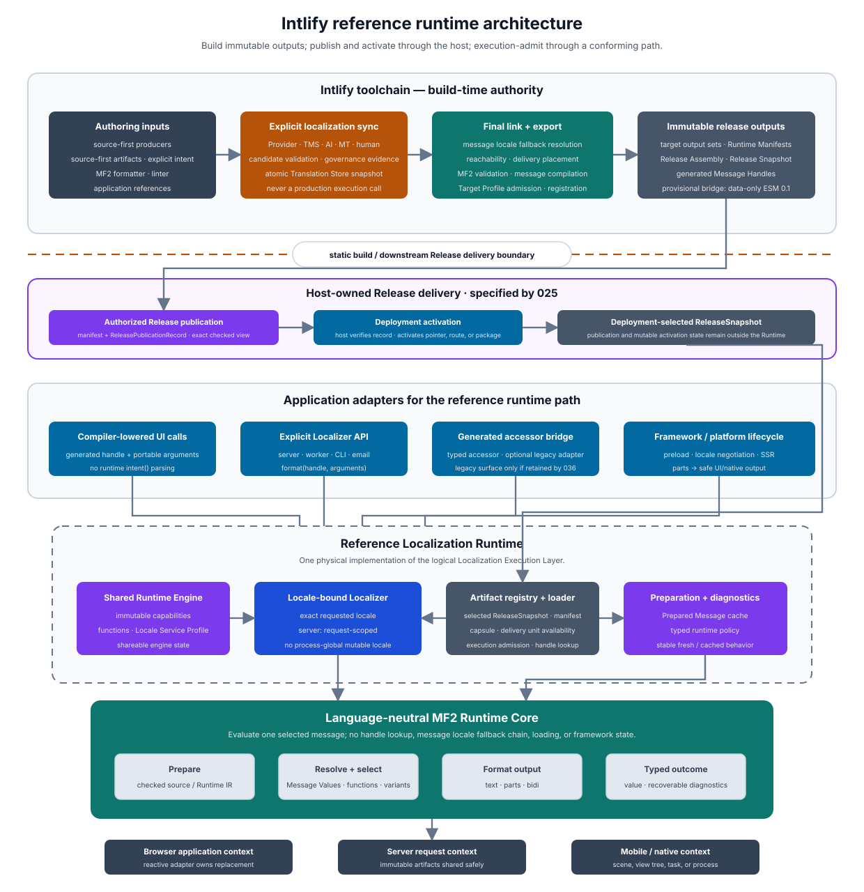

# Intlify Reference Runtime Design

## Status

This document defines the high-level reference runtime architecture that complements the existing ox-mf2 parser, formatter, linter, resource, message-linker, and export designs. It is one physical implementation path for the logical Localization Execution Layer defined by [000](./000-intlify-overview-design.md); a capability-checked target-native engine may fulfill the same logical responsibilities.

Runtime implementation has not started. This document fixes the initial responsibility boundaries, execution model, build/runtime separation, context ownership, portable-value direction, locale-profile model, and milestone direction. It does not yet freeze a public Rust, JavaScript, C, Swift, Kotlin, or other language API; a compiled Locale Capsule wire format; a runtime IR; exact portable-value wire encodings; or the complete diagnostic and resource-limit specifications.

The current `dev.intlify/esm-module` format `0.1` from [014](./014-ox-mf2-message-linker-design.md) remains a data-only artifact specification. Nothing in this document changes that ABI or infers formatter behavior from it. A future compiled representation requires a new artifact kind or a coordinated format-version decision.

## Purpose

Intlify is intended to provide two cooperating product sides.

- The **toolchain side** discovers localizable messages, synchronizes translations through pluggable localization services, validates MF2, formats and lints authoring input, links application requirements, and exports deterministic target artifacts.
- The **localization execution side** loads only admitted immutable artifacts, binds them to an application, request, scene, or operation locale, resolves compiler-generated message handles, and formats selected messages for presentation. The Runtime Engine and MF2 Runtime Core in this document are the reference physical path.

The Localization Execution Layer is not a translation service. It performs no machine translation, TMS synchronization, human-review workflow, or source extraction. Those operations end before the build/runtime boundary.

This design makes the runtime usable by current catalog-backed applications and by future source-first Locale Compiler frontends. Application authoring style does not change the runtime core: both paths lower to checked message identity, localized message data, and target-specific artifacts before execution.

## Goals

- Define a language-neutral MF2 runtime core for formatting one already selected message.
- Define an application-facing localization runtime that owns locale binding, artifact loading, message lookup, preparation caches, and runtime invocation without using a process-global mutable locale.
- Make browser localization application-scoped and server localization request-scoped.
- Keep formatting synchronous after the required immutable artifacts have been loaded.
- Consume linker- and exporter-produced artifacts without repeating source discovery, translation synchronization, coverage analysis, or message locale fallback resolution.
- Support plain-string and structured-parts output so framework and native adapters can render rich localized content safely.
- Lower host-language arguments through one versioned portable parameter and runtime-value specification.
- Keep optional requested-locale negotiation separate from linker-materialized message locale fallback and single-message evaluation.
- Support Web, SSR, workers, mobile, and native systems through one shared semantic specification without requiring every target to ship the same physical runtime implementation.
- Permit current TMS, localization-service, AI, MT, and human-authored workflows through toolchain-owned synchronization adapters while keeping production execution offline and artifact-driven.
- Preserve exact locale-service reproducibility under pinned profiles, explicitly classified variation under platform-managed profiles, bounded resource use, explicit compatibility, typed diagnostics, and fail-complete artifact admission.

## Non-Goals

- Calling a Localization Provider, TMS, model API, or remote translation service from production formatting.
- Replacing `intlify_linker` locale resolution, reachability, placement, completeness, or finding generation.
- Re-running message locale fallback at runtime after the linker has materialized one requested-locale plan.
- Defining framework reactivity, component lifecycles, Suspense, hydration, or native view updates inside the MF2 runtime core.
- Treating translated markup as executable HTML, JavaScript, native code, or an unrestricted component tree.
- Requiring one global mutable locale, one global runtime singleton, or one global function registry.
- Making raw MF2 source parsing part of every production formatting call.
- Freezing the TC39 `Intl.MessageFormat` proposal as Intlify's public API while that proposal remains an evolving standards surface.
- Reusing the Phase 2 Binary AST snapshot as runtime bytecode. The lossless syntax snapshot and an execution-oriented runtime representation have different compatibility and optimization requirements.
- Defining runtime locale negotiation, user preference persistence, HTTP language negotiation, or application routing policy as part of single-message formatting.

## Design Principles

### Compile and synchronize remotely; run locally

Localization Provider and TMS interaction belongs to an explicit synchronization workflow. A normal application build reads stored, validated artifacts and does not silently use the network, credentials, or AI services.

Production runtime consumes only artifacts published by the toolchain. Provider availability, rate limits, prompt changes, model changes, and approval-system outages cannot change an already published rendering.

### Separate message evaluation from localization service behavior

`t()`-style APIs commonly combine locale state, catalog lookup, message locale fallback, parsing, formatting, loading, and diagnostics. The runtime architecture separates those responsibilities.

- The **MF2 Runtime Core** evaluates one selected message.
- The **Localization Runtime** selects a checked message from loaded runtime artifacts and invokes the core.
- An **Application or Framework Adapter** supplies the applicable localizer and projects output into a UI or host-language value.

### Bind locale explicitly

A shared runtime engine may be process- or application-scoped, but one localizer binds one exact locale context. A server creates or obtains a localizer for each request or task. A browser adapter associates a localizer with one application tree.

Changing locale replaces the current localizer or application context after the new artifacts are ready. The core specification does not mutate a process-global locale.

### Load asynchronously; format synchronously

Artifact loading and locale transitions may require asynchronous work. Once a localizer has admitted the required artifact, `format` and `format_to_parts` are synchronous.

A formatting call never changes from a value-returning operation to a promise-returning operation based on cache state. Framework adapters may preload, suspend, or coordinate route transitions above this runtime specification.

### Keep linker decisions authoritative

The linker resolves configured message locale fallback and emits one `MessageBundlePlan` per requested locale and delivery unit. Exported requested-locale artifacts materialize that exact selection, including a definition selected from a fallback locale.

The runtime loads the requested-locale artifact and does not search another locale for a missing message. A missing admitted message is an artifact, deployment, or integration failure, not permission to invent a second message locale fallback policy.

### Treat localization artifacts as data

Translated messages cannot introduce arbitrary executable code. MF2 annotations resolve through a checked, immutable function registry owned by the runtime integration. Markup is returned as typed parts and interpreted only by an allowlisted framework or platform adapter.

## Terminology

| Term | Meaning |
| --- | --- |
| **Localization Execution Layer** | Logical target-side responsibility for release admission, locale binding, handle resolution, and selected-message evaluation. The runtime architecture in this document is its reference physical path. |
| **MF2 Runtime Core** | Language-neutral engine that prepares and evaluates one selected MF2 message. |
| **Runtime Engine** | Shareable application/process object that owns immutable runtime capabilities, locale services, artifact admission, and reusable caches. |
| **Localizer** | Locale-bound view used by one application, request, task, scene, or equivalent ownership scope. |
| **Locale Capsule** | Future immutable runtime artifact containing one requested locale's selected messages for one delivery unit in a runtime-consumable representation. |
| **Runtime Manifest** | Target-specific description of supported locales, delivery units, artifact relationships, compatibility, and loading entry points. |
| **Release Snapshot** | Immutable localization release manifest binding compatible application handles, manifests, locale outputs, one or more Target Profile output sets, specifications, and Runtime ABI inputs for one deployment compatibility group. |
| **Message Handle** | Opaque checked identity embedded in generated code or bindings and resolved only against compatible admitted runtime artifacts. |
| **Prepared Message** | Reusable runtime-owned representation produced before repeated formatting calls. It is not the parser's public `SemanticModel` or Binary AST snapshot. |
| **Message Value** | Versioned language-neutral runtime value produced by a host binding before MF2 evaluation. |
| **Locale Negotiation Profile** | Versioned rules for choosing one supported requested locale from application-supplied preferences. It does not select message locale fallback. |
| **Definition Locale** | Locale of the Linker-selected message definition. It may differ from the requested locale and provides the language context for MF2 evaluation. |
| **Locale Service Profile** | Versioned provider, locale-data, timezone-data, function-capability, and reproducibility identity for locale-dependent operations. |
| **Target Profile** | Deployment-target semantic, Runtime ABI, Locale Service Profile, capability, and output-model requirements checked by the Target Exporter and runtime admission. |
| **Format Context** | Per-localizer or per-call immutable values required to evaluate a selected message, including exact locale, functions, locale services, direction, and diagnostic policy. |
| **Application Adapter** | Browser, SSR, framework, worker, mobile, or native integration that supplies a localizer and projects output to application values or UI nodes. |

## Architecture



The build/runtime boundary is explicit. The toolchain may access application source, Translation Stores, Localization Providers, TMS connections, approval metadata, and project configuration. The runtime receives none of those capabilities. It receives only immutable exported artifacts, generated handles or accessors, and application-supplied runtime configuration.

### End-to-end flow

```text
application and library producers + resolved project profile
  -> message / intent artifacts
  -> LocalizationRequirementPlan
  -> explicit Provider or TMS synchronization
  -> validated localized artifacts / TranslationStoreSnapshot
  -> final message linking
  -> export preparation and Target Exporter
  -> one or more target output sets
  -> Release Assembly
  -> ReleaseSnapshot
  -> conforming Localization Execution Layer
     -> reference Localization Runtime + MF2 Runtime Core
     or capability-checked target-native execution
  -> string or structured parts
```

The synchronization step and application build are separable.

```text
intlify sync
  -> consume a finite LocalizationRequirementPlan
  -> pull or request candidates from Provider / TMS
  -> validate MF2, arguments, policy, provenance, and approval
  -> atomically publish a TranslationStoreSnapshot

application build
  -> pin the resolved profile and TranslationStoreSnapshot
  -> recompute requirement planning and validate coverage and freshness
  -> link required messages and perform authoritative Target Profile admission
  -> emit deterministic target output sets
  -> assemble one ReleaseSnapshot for the deployment compatibility group

production localization execution
  -> admit one compatible release and its emitted artifacts
  -> format without Provider or TMS access
```

## Ownership Boundaries

### Toolchain-owned work

The toolchain owns:

- application-source and catalog inventory;
- source-first Intent Frontends and explicit authoring markers;
- resource extraction and validated write-back;
- MF2 syntax and semantic validation;
- Localization Provider and Translation Store adapters;
- TMS push, pull, synchronization, provenance, review, and approval;
- stale translation and coverage detection;
- message locale fallback policy resolution;
- reachability and delivery-unit placement;
- runtime artifact generation, compatibility metadata, and output registration; and
- generated message handles, accessors, source maps, and compile-time argument surfaces.

No toolchain-owned network, credential, agent, prompt, or approval capability crosses into the Runtime Engine.

### MF2 Runtime Core

The MF2 Runtime Core owns only single-message preparation and evaluation.

Conceptually:

```rust
let prepared = runtime.prepare(checked_message, &prepare_context)?;

let text = prepared.format(&arguments, &format_context);
let parts = prepared.format_to_parts(&arguments, &format_context);
```

The exact Rust API is deferred, but the processing split is fixed.

`prepare` may:

- defensively admit one checked source or runtime representation;
- build selector and declaration lookup structures;
- bind required function identifiers to admitted capabilities;
- derive immutable evaluation metadata; and
- produce one runtime-owned value independent of caller scratch storage.

Formatting may:

- resolve external and local variables;
- evaluate declarations, expressions, selectors, and variants;
- invoke built-in and registered functions;
- resolve MF2 fallback values for failed expressions;
- apply the selected bidi strategy;
- return plain text or structured parts; and
- retain recoverable typed diagnostics without changing message or locale lookup.

The core does not own:

- catalogs, message sets, Intent Graphs, scope mapping, or Translation Stores;
- application message handles or key syntax;
- locale negotiation or Linker-owned message locale fallback chains;
- filesystem, module, network, TMS, or Provider I/O;
- delivery-unit loading;
- framework contexts or UI node construction; or
- mutable process-global state.

### Localization Runtime

The Localization Runtime is the reference application-facing physical service above the MF2 Runtime Core. Within this path it owns:

- Release Snapshot, Runtime Manifest, and artifact compatibility admission;
- exact locale binding;
- Locale Capsule or current ESM locale-module loading;
- delivery-unit registration and availability;
- Message Handle lookup within compatible admitted artifacts;
- runtime capability preflight;
- prepared-message and immutable artifact caches;
- invocation of the MF2 Runtime Core; and
- application-selected diagnostic and failure policy.

The Runtime Engine and Localizer are separate concepts.

- The **Runtime Engine** is safe to share when its installed capabilities and cache semantics permit sharing.
- The **Localizer** binds an exact locale and the applicable loaded artifact view for one ownership scope.

A Localizer does not claim that a locale is globally current.

### Application and Framework Adapters

Adapters own target-specific convenience and lifecycle behavior.

They may provide:

- compiler-lowered message-call helpers;
- dependency injection, context, provide/inject, or environment integration;
- reactive locale transitions;
- route or delivery-unit preloading;
- framework Suspense integration;
- server request-context propagation;
- hydration consistency checks;
- safe projection of structured markup parts to components or native attributed text;
- target-native diagnostic reporting; and
- generated typed function, macro, or resource-ID facades.

Adapters do not reimplement MF2 semantics, message locale fallback, or Translation Store synchronization.

### Locale services and function registry

Locale-aware number, date, time, plural, and other formatting primitives are explicit runtime dependencies. A target may implement them with ECMA-402 `Intl`, ICU4C, ICU4J, ICU4X, Foundation, platform APIs, or another conforming provider.

Each target declares a `LocaleServiceProfile` containing at least the provider kind and revision, locale-data and timezone-data revisions, supported functions, and reproducibility class.

- A `pinned` profile must produce the same locale-dependent output parts and diagnostics for the same complete semantic input and profile revision.
- A `platform-managed` profile preserves artifact selection, shared MF2 evaluation, parameter validation, failure classification, diagnostic schemas, and output schemas while allowing only explicitly declared locale-dependent formatting differences supplied by the platform.

The function registry is immutable after Runtime Engine construction for the initial design. A Locale Capsule declares the function capabilities it requires. Artifact admission or Localizer creation fails before formatting if those requirements cannot be satisfied.

Functions have versioned identifiers, declared input and output value kinds, checked option schemas, selector behavior, locale-service capability requirements, and defined failure and fallback classifications. Translations select only registered function identifiers and checked options. They cannot supply implementation code.

### Portable parameters and runtime values

Host-language types do not cross directly into the language-neutral Runtime Core. Generated or handwritten bindings convert JavaScript, Swift, Kotlin/Java, Rust, C/C++, Go, .NET, or other host values into a versioned `MessageValue` model before evaluation.

The initial portable value family is closed and includes text, boolean, integer, canonical decimal, instant, local date, and local date-time concepts. Exact ranges, ownership, and wire encodings are R0 decisions. Missing is distinct from a null-like value, non-finite numeric values are never accepted through implicit coercion, and an ambiguous host date/time object requires explicit conversion.

The accompanying parameter specification records requiredness, allowed value kind, interpolation/selector/function usage, and applicable constraints. Target-specific values or functions are allowed only when declared as Target Profile capabilities; artifact admission rejects their use on an incompatible target.

## Application-facing Model

### Conceptual explicit API

The initial application model is conceptually:

```ts
const runtime = createRuntime({
  loader,
  functions,
  onDiagnostic
})

const localizer = await runtime.createLocalizer({
  locale: 'ja'
})

const text = localizer.format(messages.greeting, {
  name: 'Ada'
})

const parts = localizer.formatToParts(messages.checkout, {
  total: 1200
})
```

These names and argument shapes are illustrative. The fixed property is that asynchronous artifact readiness precedes synchronous formatting through a locale-bound object.

### Compiler-lowered UI calls

A source-first authoring call is compile-time syntax, not the production formatting function.

```ts
intent('Hello {$name}!', { name })
```

A producer and Target Exporter may conceptually lower it to:

```ts
__intlify_message(messageHandles.greeting, { name })
```

The application adapter resolves `__intlify_message` against the current application Localizer in a client build and the current request Localizer in a server build. The Runtime Core never recognizes JavaScript `intent()` calls, tagged templates, Vue nodes, Swift macros, Rust macros, or other authoring syntax.

### Explicit headless formatting

Server jobs, domain adapters, CLI applications, workers, email rendering, notifications, and code outside a framework context may retain and pass a Localizer explicitly.

```ts
const localizer = await sharedRuntime.createLocalizer({ locale: requestLocale })

return localizer.format(messages.paymentFailed, {
  reason
})
```

This is the reference ownership model even when a framework offers an implicit context convenience.

### Existing generated accessor compatibility

The current ESM exporter generates a scope-bound `MessageRuntime<Result>` interface and `createMessageAccessor(runtime)` helper. An initial JavaScript Localization Runtime can implement that injected interface without changing its `0.1` ABI.

The generated accessor remains a thin application facade. It performs no locale selection, artifact loading, fallback, parsing, or formatting itself.

### Legacy key facade

Existing applications may continue to use a `t(key, arguments)`-style adapter. That adapter resolves its legacy scope, domain, and key into the same runtime lookup and formatting path.

Source-first generated application code should use opaque generated Message Handles rather than require developers to author and maintain those keys. Legacy lookup syntax is an adapter concern, not the MF2 Runtime Core identity model.

## Runtime Context and Lifecycle

| Environment | Runtime Engine scope | Localizer scope | Locale transition |
| --- | --- | --- | --- |
| Browser SPA | application or shared immutable engine | application tree | load artifacts, create replacement Localizer, update application context |
| SSR / server | process or server instance | request | create or obtain one locale-bound Localizer per request |
| Worker / job | process or worker | task or job | create explicitly from job metadata |
| Mobile UI | application or scene infrastructure | application, scene, or view tree | platform adapter replaces bound localization context |
| Native service / CLI | process | explicit operation or command | caller selects exact Localizer |

Framework adapters may store the current Localizer in a reactive container. The contained Localizer remains locale-bound; reactivity belongs to the container and framework, not to the MF2 Runtime Core.

For SSR, locale modules, prepared messages, locale data, and immutable Runtime Engine state may be shared across requests. The selected Localizer and request diagnostic context are not process-global mutable state.

## Locale and Fallback Semantics

### Locale negotiation

The application, framework, HTTP layer, or platform obtains user or request preferences. Locale negotiation then chooses one supported requested locale before Localizer construction. The application may select a supported locale directly or use an optional Intlify Locale Negotiator. Negotiation is not single-message formatting.

The versioned `LocaleNegotiationProfile` records supported locales, default locale, configured aliases, matching algorithm, canonicalization version, and profile revision. The initial portable algorithm is deterministic lookup:

1. canonicalize preferences through the declared versioned rules;
2. select an exact supported match;
3. apply an explicit configured alias;
4. perform hierarchical locale lookup; and
5. select the configured default locale.

A platform best-fit algorithm is an explicitly `platform-managed` option and cannot masquerade as portable deterministic lookup. The Runtime Manifest records supported requested locales, the negotiation-profile revision, and the exact locale-artifact map.

The runtime does not otherwise normalize or coerce an opaque configured locale. No negotiation step mutates a process-global current locale.

### Linker-materialized message locale fallback

For every requested locale, the linker selects each reachable definition through the configured message locale fallback policy. The exporter places that selected message in the requested-locale artifact and retains `definitionLocale` as provenance and evaluation context.

```text
requested locale: fr
fr definition: absent
configured fallback: en
linker selection: en definition
runtime artifact: fr capsule containing the selected en payload
runtime lookup: fr capsule only
```

`definitionLocale` supplies the language context for language-sensitive MF2 evaluation and diagnostics, but it is not an instruction to load or search another locale artifact.

The generated loader's fallback table may support locale negotiation and configuration alignment. It does not authorize runtime message locale fallback or override the bundle plan.

### Missing runtime data

After successful artifact admission, a generated Message Handle that is absent from its expected capsule is a deployment or integration failure. The runtime does not silently return the source text, choose another key, call a Provider, or search another locale unless a separately designed application policy explicitly owns such development-only behavior.

## Artifact Model

### Release admission

Each Target Exporter produces one capability-admitted output set for its Target Profile. Host build integration then invokes Release Assembly after every output in one deployment compatibility group is available. Release Assembly creates a `ReleaseSnapshot` over the project-profile digest, Translation Store revision, source-locale artifacts, Message Bundle Plan, generated bindings, one or more Target Profile output sets, locale outputs, Runtime Manifests, specifications, and Runtime ABIs. Runtime or target-native admission verifies that every loaded handle, manifest, delivery unit, and locale artifact belongs to that compatible release.

Artifacts may be packaged together or fetched from versioned remote locations. In either case, runtime never combines objects from different releases or treats a mutable `latest` path as compatibility evidence. A packaged mobile/native application may obtain atomicity from the application package; a Web or OTA deployment uploads immutable artifacts before activating the matching manifest or release pointer.

### Current data-only ESM input

The current `dev.intlify/esm-module` format `0.1` contains validated exact MF2 source records selected by the linker. Its loader map provides exact requested-locale module loading. It contains no formatter or prepared representation.

The first Runtime Adapter may consume this existing ABI and prepare each message once when admitting or first using an immutable module. This provides the shortest end-to-end implementation path and completes the already generated `MessageRuntime<Result>` injection boundary.

Runtime parsing or preparation of `0.1` is an adapter behavior. It does not retroactively make the ESM module a compiled Runtime Capsule.

### Future compiled Locale Capsule

The AOT path introduces an execution-oriented artifact rather than silently changing ESM `0.1`.

Conceptually:

```text
validated MF2 + linker plan
  -> message compilation
  -> checked runtime representation
  -> Locale Capsule
  -> Runtime Engine admission
  -> synchronous evaluation
```

A Locale Capsule needs at least these semantic fields, although their exact wire representation is deferred.

| Field | Purpose |
| --- | --- |
| Capsule format version | Decode and compatibility selection |
| Runtime ABI version or range | Reject an incompatible execution engine before registration |
| Release and Target identity | Reject handles or artifacts from another release or Target Profile |
| Requested locale | Bind the artifact to the exact Localizer locale |
| Locale Service Profile | Bind locale-dependent behavior and reproducibility expectations |
| Delivery unit | Bind messages to one linker-owned loading unit |
| Message records | Canonically ordered opaque identity and prepared/compiled payload |
| Definition locale | Preserve linker-selected provenance and formatting context |
| Argument requirements | Defensively check portable Message Values and generated bindings |
| Required functions | Preflight built-in and custom runtime capabilities |
| Direction / bidi metadata | Apply the selected presentation strategy without inference drift |
| Integrity identity | Cache, registration, and corruption detection |

The Locale Capsule format, Runtime Manifest, runtime IR, and host-specific wrapper are separate compatibility decisions. A target may use a language-neutral capsule, generated ESM functions, a baked native blob, platform resources, or another target-native artifact as long as its exporter and execution adapter declare and satisfy the same semantic capability specification.

### Message Handles

Generated code uses checked opaque Message Handles rather than arbitrary user-authored runtime strings. A handle is meaningful only with its compatible generated bindings, Release Snapshot, and admitted runtime artifacts.

The persistent compiler-owned `MessageIntentId` and generated runtime handle are separate identities. The exact handle shape is deferred. It may be an artifact-local compact index paired with an artifact identity or a target-native generated resource identifier. The design must prevent accidental resolution against an unrelated release, project, capsule version, scope, or delivery unit.

External serialization of deferred message references requires its own versioned identity and argument specification. It is not implied by an in-process generated handle.

## Formatting Output

### Plain text

`format` returns presentation text according to MF2 formatting and bidi rules. Markup has no executable or HTML interpretation in this path.

### Structured parts

`format_to_parts` preserves text, resolved values, fallback values, bidi isolation, and MF2 markup as typed values suitable for a higher-level adapter.

Framework and native adapters use structured parts to construct allowlisted component trees, DOM nodes, attributed text, accessibility output, or other host-native values. They do not parse generated HTML strings.

The core resolution pipeline is shared by text and parts output. The exact public part union, ownership model, FFI representation, and nesting policy require a dedicated specification. The TC39 proposal is an input to that design, not the sole compatibility authority.

## Diagnostics and Failures

Runtime failures fall into distinct categories.

### Artifact and setup failures

Examples include:

- mixed-release handle, manifest, or locale artifact;
- unsupported artifact or Runtime ABI version;
- invalid or corrupted artifact;
- unsupported locale;
- missing delivery unit;
- missing required function capability;
- message-handle/artifact mismatch; and
- loader or registration failure.

These failures produce no partially admitted artifact or half-configured Localizer.

### Application usage failures

Examples include missing, unexpected, or incompatible portable argument values, failed host-to-Message-Value conversion, and a generated binding mismatch. Generated typed APIs should prevent these where possible, while the runtime rechecks the applicable boundary defensively.

### Recoverable MF2 formatting diagnostics

MF2 expression or function resolution may produce a fallback representation while retaining a diagnostic. The core should expose a typed outcome or typed diagnostic sink rather than unconditionally logging, warning, or throwing from deep inside the engine.

Conceptually:

```rust
pub struct FormatOutcome<T> {
    value: T,
    diagnostics: Box<[FormatDiagnostic]>,
}
```

The exact type is deferred. Application adapters may offer strict development/test policy, production MF2-formatting fallback policy, telemetry, or framework error-boundary integration without changing core evaluation semantics.

No diagnostic contains Provider credentials, prompts, arbitrary translation-service responses, raw dependency error chains, or executable markup.

## Caching and Concurrency

Locale artifacts are immutable after admission. Runtime caches may reuse decoded capsules and Prepared Messages only when their complete artifact identity, runtime revision, function capabilities, locale-service revision, and relevant options match.

Cache presence, eviction, worker scheduling, and pointer identity cannot change formatted values, diagnostics, ordering, or failure classification.

The initial concurrency direction is:

- Runtime Engine: immutable or internally synchronized and safe to share where the target permits;
- admitted artifact and Prepared Message: immutable and shareable;
- Localizer: safe for concurrent reads when its target binding permits;
- format call scratch: owned by one call and never shared through global mutable state;
- function registry and locale-service provider: immutable after engine construction; and
- application diagnostic sink: must declare its concurrency requirements explicitly.

Exact Rust `Send + Sync`, JavaScript worker, C ABI, and target-thread-affinity specifications are milestone-owned follow-ups.

## Security and Trust

- Runtime artifacts are admitted by exact kind, format version, Runtime ABI compatibility, structure, limits, and integrity identity before use.
- Translated MF2 remains data. It cannot embed JavaScript, native code, module imports, filesystem paths, or network requests.
- Custom function implementations are installed by trusted application/runtime configuration and selected only through checked function identifiers.
- Structured markup is inert until an application adapter maps an allowlisted markup name to a trusted component or platform operation.
- Plain-text formatting never treats translated text as HTML.
- Runtime limits bound artifact bytes, message count, compiled-program size, selector work, output size, part count, nesting where applicable, diagnostics, and cache residency.
- A limit failure is fail-complete for the affected admission or formatting operation; it never truncates a capsule into a valid-looking partial message set.

## Cross-Platform Strategy

All targets follow the same logical Localization Execution Layer and semantic specification, but the physical engine need not be identical on every target. The exact shared layer covers MF2 declarations and selection, portable parameter validation, MF2 fallback values, markup and parts ordering, bidi behavior, failure classification, diagnostic and evidence schemas, resource-limit meaning, handle/artifact compatibility, and output models.

Locale-dependent functions are isolated behind the declared Locale Service Profile. A pinned profile is tested for identical locale-dependent parts and diagnostics under identical complete inputs. A platform-managed profile is tested for shared artifact selection, MF2 behavior, failure classification, and schema conformance while permitting only its declared locale-service output variation.

### Rust reference implementation

A Rust MF2 Runtime Core is the reference behavior implementation and reuses parser-owned semantic definitions where appropriate without exposing parser construction tables as runtime ABI. It provides the primary conformance oracle for evaluation, diagnostics, output parts, and resource accounting.

### JavaScript and Web

The initial JavaScript adapter may use the Rust core through N-API on Node.js and WASM in browsers, or a separately generated/runtime implementation that passes the same conformance suite. ECMA-402 supplies locale primitives where compatible.

The architecture does not require every browser application to ship a parser or WASM module after compiled Locale Capsules become available.

### Server and SSR

Server integrations share immutable engine state and locale artifacts while binding one Localizer to each request. Framework integration supplies request context to compiler-lowered render code. No mutable module-global current locale is required.

### Mobile and native

Target Exporters may emit a portable capsule consumed through Rust/C ABI bindings, or target-native resources consumed by a thin Intlify execution adapter. Platform-resource export is capability-checked: an exporter fails before publication when a selected MF2 feature cannot be represented without semantic loss.

Swift, Kotlin/Java, C/C++, Go, .NET, and other bindings remain ergonomic adapters over the shared runtime semantics or conforming target-native implementations. They do not define independent MF2 languages.

## Candidate Component Boundaries

Exact package names are not frozen, but the intended ownership split is:

```text
crates/
  ox_mf2_runtime      # selected-message preparation and MF2 evaluation
  intlify_runtime     # artifact admission, Localizer, handles, caches, outcomes

packages/
  @intlify/runtime    # JavaScript application API and common adapter specifications
  target adapters     # browser, server, framework, native bindings as needed
```

`ox_mf2_runtime` may depend on parser-owned checked semantic foundations and locale-service traits. It does not depend on the CLI, resource adapter, linker, exporter, TMS adapter, or application framework.

`intlify_runtime` may depend on runtime artifact specifications and `ox_mf2_runtime`. It does not invoke source producers, Translation Stores, Localization Providers, linkers, or exporters.

## Initial Milestones

### R0: MF2 Runtime Core specification

- Define the selected-message input and Prepared Message ownership boundary.
- Define the initial portable parameter, Message Value, function, Locale Service Profile, format-context, parts, outcome, and diagnostic specifications.
- Implement the minimum MF2 evaluation path required by initial validated fixtures.
- Establish deterministic evaluation, bidi, fallback-value, and resource-limit conformance.
- Keep catalog lookup, locale loading, and framework behavior outside the crate.

### R1: Current ESM Runtime Adapter

- Consume `dev.intlify/esm-module` and loader-map format `0.1` without changing their ABI.
- Implement exact release/module admission and requested-locale binding.
- Implement deterministic lookup negotiation over a versioned Locale Negotiation Profile while allowing direct supported-locale selection.
- Implement the generated TypeScript `MessageRuntime<Result>` interface.
- Prepare each immutable MF2 source at most once per compatible cache identity.
- Provide an explicit application-scoped and request-scoped Localizer path.
- Verify concurrent SSR requests with different locales and no global locale mutation.

### R2: Compiled Locale Capsule

- Define versioned Runtime Manifest, Locale Capsule, Target Profile output-set, and Release Snapshot artifact specifications plus the Release Assembly boundary.
- Define and benchmark a runtime IR or target-compiled representation.
- Add `GenerationStage::MessageCompilation` through an explicit exporter format.
- Generate opaque Message Handles and runtime capability requirements.
- Support delivery-unit registration and lazy artifact loading while retaining synchronous formatting after readiness.
- Keep current ESM `0.1` as its existing data-only format.

### R3: Web and framework integration

- Add browser and server target resolution for compiler-lowered runtime imports.
- Add a framework-neutral application context specification.
- Add Vue client and SSR adapters without placing Vue types in the Runtime Core.
- Define locale transition, preload, hydration, and structured-markup projection behavior.
- Integrate development missing/stale/message-locale-fallback diagnostics and explicit sync updates without changing production message-locale-fallback semantics.

### R4: Native integration

- Define the binding-friendly Runtime Core and C ABI boundary.
- Add target capability negotiation for portable capsules and native resources.
- Add Swift and Kotlin/Java portable-value adapters, followed by additional systems-language bindings.
- Validate cross-implementation results through common MF2 runtime conformance fixtures.

## Validation Strategy

Every runtime implementation and adapter must eventually cover:

- simple text and interpolation;
- portable text, boolean, integer, decimal, instant, local-date, and local-date-time argument admission;
- declarations, selectors, exact and fallback variants;
- built-in number/string and promoted function sets;
- missing, unexpected, and incompatible arguments;
- recoverable function failure and fallback parts;
- plain-text and structured-parts equivalence where the projection specification requires it;
- bidi direction and isolation;
- inert and allowlisted markup behavior;
- exact requested-locale and definition-locale handling;
- linker-materialized message locale fallback without runtime key fallback;
- unsupported locale, missing message, unsupported function, and ABI mismatch;
- deterministic lookup negotiation and declared platform-managed negotiation behavior;
- pinned and platform-managed Locale Service Profile conformance;
- mixed-release rejection and matching-release admission;
- application-scoped client isolation and concurrent request-scoped server isolation;
- deterministic fresh/cached results;
- exact and first-over resource limits;
- current ESM source preparation and future compiled-capsule equivalence; and
- conformance across Rust, JavaScript/WASM, and promoted native implementations.

Benchmarks should separate at least artifact admission, message preparation, cold formatting, warm formatting, parts formatting, cache lookup, Localizer creation, and end-to-end application formatting. Artifact loading I/O remains separately observable from synchronous evaluation.

## Deferred Follow-Up Notes

The following details require dedicated implementation specifications and do not block accepting this high-level architecture:

- exact Rust and JavaScript public names and constructors;
- source, data-model, semantic-view, and compiled-IR preparation entry points;
- public Prepared Message exposure and lifetime;
- exact portable runtime-value ranges, wire encoding, FFI ownership, and extension policy;
- exact structured-parts schema and ownership;
- function registry, default functions, date/time support, and custom-function ABI;
- Locale Service Profile provider selection, revision derivation, and conformance fixtures;
- Runtime Manifest and Locale Capsule wire formats;
- Message Handle shape, generated-code ABI, and deferred-reference serialization;
- cache capacity, eviction, persistence, and cross-call preparation rules;
- diagnostic codes, retained evidence, MF2-formatting fallback policy, and strict mode;
- locale-negotiation profile wire format, preference input APIs, and platform-managed adapters;
- framework context, Suspense, hydration, and rich-markup policies;
- `no_std`, `alloc`, binary size, embedded targets, and thread affinity;
- N-API, WASM, and C ABI ownership and cancellation behavior; and
- compatibility with a future standardized `Intl.MessageFormat` implementation.

No dormant field, package, wire tag, error code, or command name is reserved merely by appearing as a candidate in this overview.

## Relationship to Other Documents

| Document | Relationship |
| --- | --- |
| [000-intlify-overview-design.md](./000-intlify-overview-design.md) | Defines the product-wide source-first compiler, synchronization, Store/Release snapshot, target, and logical Localization Execution Layer. This document owns its detailed reference runtime path. |
| [001-ox-mf2-toolchain-foundation.md](./001-ox-mf2-toolchain-foundation.md) | Parser, semantic foundation, binding philosophy, and future runtime/compiler direction. This document adds the runtime-side ownership split without changing parser specifications. |
| [003-ox-mf2-phase-2-binary-ast-snapshot-design.md](./003-ox-mf2-phase-2-binary-ast-snapshot-design.md) | Lossless syntax transport. A Runtime IR or Locale Capsule is a separate artifact and does not repurpose the Binary AST snapshot. |
| [004-ox-mf2-phase-2-language-bindings-design.md](./004-ox-mf2-phase-2-language-bindings-design.md) | Binding precedent for Rust-owned behavior and stable N-API/WASM/C-facing values. Runtime bindings require their own result and lifetime specifications. |
| [009-ox-mf2-phase-3d-lsp-editor-design.md](./009-ox-mf2-phase-3d-lsp-editor-design.md) | Editor lifecycle and source diagnostics. Runtime preview may reuse the Runtime Core, while editor document/project state remains 009-owned. |
| [012-ox-mf2-parser-semantic-validation-design.md](./012-ox-mf2-parser-semantic-validation-design.md) | Parser-owned SemanticModel construction and validation reused before export and, where appropriate, runtime preparation. |
| [014-ox-mf2-message-linker-design.md](./014-ox-mf2-message-linker-design.md) | Authoritative message resolution, message locale fallback materialization, bundle plans, export preparation, data-only ESM `0.1`, loader map, generated accessor, and output registration. Runtime begins after those exported artifacts exist. |
| [appendix-ox-mf2-error-code.md](./appendix-ox-mf2-error-code.md) | Existing public error namespace registry. Runtime codes are added only with the detailed owning specification. |
| [../refers/message-format-wg/spec/README.md](../refers/message-format-wg/spec/README.md) | Primary MF2 syntax, data-model, resolution, selection, formatting, fallback-value, markup, and bidi semantic reference. |
| [../refers/proposal-intl-messageformat/README.md](../refers/proposal-intl-messageformat/README.md) | Tracked ECMAScript application API and parts-shape input; not yet the frozen Intlify API specification. |
