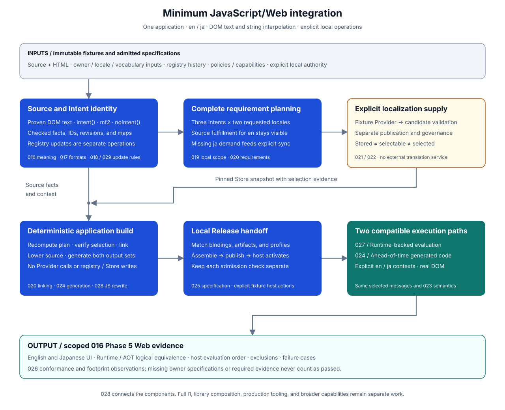

# Intlify JavaScript/Web Vertical Slice Design

## Purpose

This design defines the smallest local Web integration that exercises [016](./016-intlify-source-authoring-and-intent-identity-design.md)'s source-authoring and Intent-identity work through generated code and observable localized UI. It connects the component implementations; it does not move their specifications into a Web-specific compiler.

The application writes ordinary static DOM text or explicit `intent()` / `mf2` messages. The integration extracts and validates those messages, establishes persistent identity through a separate registry operation, supplies checked Japanese translations through an explicit fixture synchronization, and builds locale-specific outputs. Generated application code then renders English or Japanese through an explicitly bound execution context. Neither the normal build nor rendering calls a Provider.



The initial scenario is one application-owned JavaScript module, standard DOM `textContent`, source locale `en`, requested locales `en` and `ja`, and literal text plus string interpolation. It supplies a bounded Web-path acceptance target for 016 Phase 5. It does not claim that every feature in 016 Phases 1–5 or the complete I1 roadmap is implemented. In particular, the fixture-library composition and broader workflows required by [000](./000-intlify-overview-design.md#i1-javascriptweb-vertical-slice) remain follow-up work.

## Goals

- Demonstrate source-first authoring without application-maintained translation keys or catalogs.
- Exercise the actual Producer, shared MF2 analysis, identity, linking, lowering, and execution implementations on one finite application scope.
- Keep identity updates, localization synchronization/governance, normal build, and execution as distinct operations with independently checked inputs and powers.
- Prove that changing locale changes the displayed message while preserving host evaluation order, exclusions, and unrelated application behavior.
- Require one Runtime-backed versus ahead-of-time Logical Render Equivalence relation for the same admitted messages and arguments, as required by 026.
- Establish component and Web footprint observations without requiring production services, a public CLI, or a full cross-platform Runtime.

## Non-Goals

- Defining public commands, package/import names, repository discovery, bundler plugins, watch mode, or installation workflows owned by 029.
- Designing all of 017–025, or treating a test fixture as permission to bypass their applicable semantic, integrity, or authorization checks.
- Completing TypeScript-specific syntax, JSX/TSX, Vue, SSR/hydration, workers, mobile, native, or source-first library distribution.
- Supporting conditional/container message selection, arbitrary module graphs, or other choices still recorded as `Proposed` in 016.
- Supporting numeric/date formatting, plurals, selectors, custom functions, rich markup/parts, or the full MF2 execution capability set in the initial output profile.
- Providing automatic locale negotiation, runtime message fallback, reactive DOM updates, or production deployment.
- Building an external AI/TMS integration or requiring network credentials; fixture localization is test supply, not a product catalog workflow.
- Reusing PR #183's placeholder regex, source-derived IDs, or mutable global locale as production specifications.

## Ownership and Dependencies

028 owns the finite scenario, orchestration, Web host adapter, execution harness, and cross-component acceptance observations. Shared meanings, schemas, and compatibility rules stay with their owners.

The following table is the minimum dependency checklist, not a requirement to finish every listed document. A missing owner specification must be fixed in that owner's file before the corresponding integration claim is made; a mock with the expected output is not a replacement.

| Owner | Minimum needed by this scenario | 028 responsibility |
| --- | --- | --- |
| [015](./015-intlify-project-profile-and-locale-policy-design.md) | Checked application ownership, exact source/requested locales, supplied vocabulary and defaults, finite applicable policy/target/canonicalization inputs | Supply the actual inputs and verify that every component uses the same admitted scope; do not promote PR #205's partial core to a complete Profile |
| [016](./016-intlify-source-authoring-and-intent-identity-design.md) | Accepted recognition, MF2/context analysis, source mappings, ID continuity, read-only compilation, and complete/partial results | Exercise the selected forms and preserve their source/evaluation evidence through lowering |
| [017](./017-intlify-shared-artifact-and-version-admission-design.md) | Existing minimum authoring/registry representations; necessary source/localized message, plan, Store, target, Release, and verification-record extensions | Retain exact references and supplied bodies; do not reuse an authoring inventory digest as a complete source-message or Release artifact |
| [018](./018-intlify-security-trust-and-provenance-design.md) | Local source/artifact admission and separate registry, candidate, governance, and Release-publication powers | Supply isolated test principals and verify denial as well as success; no unconditional `trusted: true` adapter |
| [019](./019-intlify-project-graph-query-and-incremental-design.md) | Finite application dependency/diagnostic handoff with complete versus partial scope and exact input invalidation | Supply one complete local graph and project component diagnostics; no repository query service is needed |
| [020](./020-intlify-requirement-planning-and-linking-design.md) | Complete requirements for the selected group, source fulfillment, direct localized selection, final reference and delivery linking | Run planning before sync and recompute it during build; do not turn Provider results directly into a bundle |
| [021](./021-intlify-translation-store-and-governance-design.md), [022](./022-intlify-provider-and-localization-sync-design.md) | Finite Provider work, candidate validation, separate publication/governance, selected-state evidence, and immutable Store snapshots | Use deterministic fixture supply and explicit local transactions; no remote TMS is needed |
| [023](./023-intlify-localization-execution-specification-design.md) | Literal/string-interpolation semantics, string value admission, locale ownership, direction/isolation, diagnostics, and limits | Assert exact logical observations under the adopted capability profile, including invalid arguments |
| [024](./024-intlify-target-profile-and-export-design.md) | Minimum Web output profiles for Runtime-backed and ahead-of-time execution, capability admission, generated references, source-lowering plans/maps, and output-set compatibility | Implement the JS host rewrite and load only complete compatible generated outputs; do not freeze a private ABI in this document |
| [025](./025-intlify-release-assembly-and-deployment-design.md) | Local Release Assembly, exact generated-binding/output-set consistency, publication evidence, activation handoff, and execution admission | Stage immutable local outputs and explicitly activate the admitted Release in the test host |
| [026](./026-intlify-conformance-and-measurement-design.md) | Applicable conformance, equivalence, performance/storage, and evidence requirements | Produce the scoped campaign and footprint evidence; do not infer full I1 or cross-platform conformance |
| [027](./027-intlify-reference-runtime-design.md) | A reference evaluator, artifact admission/readiness, locale-bound Localizer, and immutable preparation/cache behavior for the selected capability | Instantiate and exercise the real reference execution path; leave its internal IR and component split with 027 |
| [029](./029-intlify-product-workflow-and-packaging-design.md) | Host obligations for explicit operations and exact-base atomic registry publication | Exercise those obligations through a local test host without fixing public commands or packaging |

017 now provides the Phase 1–3 authoring representation foundation. It does not yet provide all later artifact families in this table. 027 provides the reference architecture, not an implemented formatter or a frozen Web ABI. These are explicit adoption prerequisites, not reasons to postpone 016's bounded Phase 1–2 implementation.

## Terminology

| Term | Meaning here |
| --- | --- |
| Minimum Web scenario | A finite, test-owned application and exact locale/capability scope, not an entire repository or the full I1 roadmap |
| Fixture Provider | A deterministic source of candidate MF2 and provenance for explicit sync requests; it cannot approve, select, build, or render messages |
| Test host | The local orchestrator that supplies inputs and exercises separately authorized operations; its temporary storage is not a public workflow specification |
| Generated application | Transformed code and its compatible generated bindings; source authoring markers are not production formatting APIs |
| Execution pair | Runtime-backed and ahead-of-time targets consuming the same selected logical messages under an admitted equivalence relation |
| Scenario evidence | Retained component results, exact input/output references, browser observations, and applicable 026 records for one declared case |

Fixture labels, DOM selectors, and test case names identify tests only. They are not persistent Intent IDs, application translation keys, schema revisions, or public API names.

## Minimum Scenario

### Fixed scope

| Dimension | Initial scope |
| --- | --- |
| Application | One checked application owner; one complete supplied JavaScript ESM source inventory with one authoring module and `render` as its explicitly declared execution root |
| Host | Standard browser DOM; explicit named authoring imports and their accepted aliases; no framework |
| Locales | Source/default requested locale `en`; supported requested locales exactly `en` and `ja`; direct explicit locale selection |
| Classification | One supplied surface vocabulary containing a test class `ui`, with that class explicitly passed as the authoring-scope default; no DOM-derived vocabulary |
| Messages | Ordinary static `textContent` literals, inline `intent()` MF2, one reusable local `mf2` declaration, and `noIntent(value, reason)` |
| Execution capability | Plain text and external string parameters, including the adopted implicit string-expression behavior; no general JavaScript coercion |
| Coverage | Every reachable message has an admitted source definition for `en` and a selected direct `ja` definition; no message-locale fallback in the success case |
| Delivery | One selected Deployment Compatibility Group; one eager Delivery Unit per Web target; no lazy loading or multi-group composition |
| Physical paths | One Runtime-backed output and one ahead-of-time output for the same logical capability and message selection |
| Supply | Deterministic local fixture Provider; explicit candidate publication and governance; no external service calls |
| Execution host | Local browser harness serving generated assets; no production deployment, OS-locale inference, or runtime network translation |

The locale and class values are scenario inputs, not new `intlify.config.json` defaults or members. The test host supplies exact applicable specification revisions, limits, and actual checked bodies. This scenario requires no number/plural/date locale-data payload; any data required by the adopted canonicalization or execution profile remains an explicit dependency, not an ambient platform assumption.

A syntactically valid MF2 message outside this execution capability may pass 016 analysis and then fail 024 capability admission. It must not be mislabeled as invalid MF2 or silently implemented using a different placeholder language.

### Representative application

The import below denotes a test-only module/export mapping supplied to the recognizer. It does not reserve a public package name. This intrinsic-only fixture module has no application side effects under its admitted lowering rules; unrelated module imports cannot be erased on that basis. The HTML fixture provides the selected elements before rendering.

```js
import { intent, mf2, noIntent } from 'fixture-authoring'

/* @intlify { "description": "Greeting addressed to the signed-in user" } */
const greeting = mf2`Hello {$name}!`

export function render(name) {
  const save = document.querySelector('#save')
  const heading = document.querySelector('#heading')
  const first = document.querySelector('#first')
  const second = document.querySelector('#second')
  const brand = document.querySelector('#brand')

  save.textContent = 'Save'
  heading.textContent = intent('Welcome')
  first.textContent = intent(greeting, { name })
  second.textContent = intent(greeting, { name })
  brand.textContent = noIntent('Intlify', 'Product name')
}
```

This fixture has three declarations, four localizable references, and one exclusion. The two greeting references share one declaration/ID; adding an unrelated declaration with the same wording must not merge identity. The author writes no ID, generated handle, locale switch, or translation resource in this module.

The readable display expectations for `name = 'Ada'` are:

| Occurrence          | `en` display | `ja` display     |
| ------------------- | ------------ | ---------------- |
| `#save`             | Save         | 保存             |
| `#heading`          | Welcome      | ようこそ         |
| `#first`, `#second` | Hello Ada!   | こんにちは、Ada! |
| `#brand`            | Intlify      | Intlify          |

The actual oracle must retain exact Unicode text, diagnostics, and any direction/isolation metadata required by the adopted 023 profile. This readable table does not authorize stripping bidi controls or other meaningful characters during comparison. Rendering again with `name = 'Kai'` changes both greeting values without source analysis, synchronization, or rebuilding.

## Inputs and Retained Results

The test host explicitly supplies:

- immutable source/HTML fixtures, grammar and intrinsic bindings, owner scope, expected inventory membership, and applicable checked 015 inputs;
- a registry base and exact source/history inputs for the requested read-only analysis or separate update;
- the selected group, Web target profiles, capability declarations, finite policies, and local authorization inputs;
- a pinned Store snapshot and deterministic Provider fixture implementation for sync only; and
- browser environment, render arguments, supported requested locale, limits, and expected observations for each case.

Retained results include the checked authoring inventory and Intent/reference artifacts, source-locale artifacts, Requirement Plan, sync/governance results and immutable Store snapshots, final linking/lowering results, generated source/maps and target output sets, assembled Release/publication evidence, execution observations, and applicable 026 records.

These are references to owner-defined results, not a new universal JSON envelope. The scenario record identifies exact retained inputs and the required cases. It never substitutes an arbitrary digest, filename, or success flag for a missing body, validator, authorization decision, or complete result.

## Design Overview

The test host runs the following sequence. Each operation can fail independently; later operations require the actual checked result of the preceding operation.

| Step | Work and retained result | Required separation |
| --- | --- | --- |
| 1. Admit and analyze source | Validate finite inputs; run 016/017 discovery, MF2/context analysis, and source/reference extraction | No application-code execution, Provider call, or implicit registry write |
| 2. Establish identity explicitly | Initialize only a genuinely new fixture registry, or reconcile against the exact retained base; publish an authorized atomic update; rerun read-only authoring against the accepted snapshot | New ID candidates are fixed in the plan, not regenerated by compilation; missing/corrupt history is not new-project authorization |
| 3. Plan complete requirements | Use 019/020's admitted local scope to derive requirements for all reachable Intent revisions and both requested locales | Source-equal `en` requirements remain in the plan even though they create no Provider work |
| 4. Supply localization separately | Compare requirements with one pinned Store base; run fixture sync only for missing direct `ja` demand; validate and publish candidates; perform separate governance/selection transactions | Stored, selectable, and selected remain distinct; Provider output alone is not build input |
| 5. Build from pinned inputs | Recompute requirements, verify source/selection evidence, link exact definitions, admit target capabilities, and generate the two target output sets and their host rewrites | No Provider/governance authority or registry mutation; no valid-looking partial output set on failure |
| 6. Assemble and activate locally | Assemble the matching Release, record the authorized local publication, then let the test deployment host explicitly activate that Release reference | Assembly, publication, activation, and execution admission are different checks even in one test process |
| 7. Execute and compare | Admit matching generated bindings/artifacts, await readiness, render under `en` and `ja`, compare the execution pair, and retain diagnostics/work/footprint observations | No source rediscovery, message fallback search, runtime translation, or mutable global locale |

For the primary fixture, the complete requirement set contains six Intent revision × requested-locale pairs. Starting from an empty admitted Store, the first Provider work set contains three `ja` requests and no `en` request. The two greeting references do not duplicate localization work. After successful supply and selection, a repeated sync over unchanged inputs has no new work; a normal build has zero Provider calls regardless of Store state.

Fixture translations are bound to the complete requested Intent identity/revision and target locale by the fixture adapter. Case labels may select predetermined test content inside that adapter, but source text or a DOM selector never becomes a persistent lookup key. An unrecognized request is an explicit fixture failure, not a fallback to source text.

The local setup materializes the 021-defined candidate, approval/rejection, and selection evidence under the applicable policy. A technically valid but unselected candidate must fail strict direct-coverage build admission. Required source approval is independently supplied or waived only by an explicit admitted source policy, never inferred from authored text or Provider approval.

## Source Lowering and Host Behavior

The application module above stays unchanged as authoring input. The build emits a generated module and bindings under the 024 specification; 028 applies that plan to the JavaScript representation and verifies browser behavior.

- Rewrite only the exact, checked source occurrences in the lowering plan. Reject stale snapshots, mismatched ranges, overlapping incompatible edits, or an unresolved reference before publishing output.
- Replace a proven ordinary UI literal with its generated checked message reference. Do not add a second declaration when the same assignment already uses explicit authoring.
- Replace each supported `intent()` use with the target's checked formatting reference, preserving declaration identity and parameter requirements. Generated handle spelling and public helper names remain 024/029 decisions.
- Lower reusable `mf2` declarations and authoring imports only under the adopted 024 rules. Prove that all relevant uses were handled before erasing a declaration/import; reject unsupported descriptor escape rather than inventing runtime MF2-string behavior.
- Preserve `noIntent`'s exact host value and evaluation position. Its reason remains inspectable exclusion evidence, not a runtime translation key. Exclusion does not sanitize or authorize the value.
- Evaluate each original parameter expression once, in original argument/property order and at its original control-flow point. A rejected branch must not execute parameters; exceptions and receiver/null behavior remain those of the corresponding host evaluation.
- Bind generated formatting to an application instance's immutable Localizer or equivalent ahead-of-time context. The fixture adapter may inject that context through the generated module's construction path; it must not require a new locale argument in authored `intent()` calls or install a mutable global current locale.
- Return strings to the original `textContent` assignments. Do not interpret candidate text as HTML, execute translation content, or install a DOM observer to translate arbitrary text after rendering.

The host oracle records parameter call order/count, branch execution, exceptions, unaffected state, exclusions, and mapped source positions independently of expected translated text. Tests compare that trace with a checked source-form reference harness; the reference harness executes test application code only during the execution test, never during extraction, linking, or generation. It is not a production fallback implementation of the authoring API.

Generated-code source maps compose the host-to-MF2 evidence and later lowering maps where applicable. Synthetic helper code is identified as synthetic rather than assigned a fabricated source location. Target/runtime diagnostics retain the original declaration/reference association when available.

## Execution Pair and Locale Lifecycle

The two paths consume the same selected source/localized Message Artifacts, revisions, requested and definition locales, portable arguments, and admitted execution/locale-service profile. Different target encodings or Release output identities must not be compared as if they were the selected logical Message Artifact identity.

| Path | Required implementation | What it demonstrates |
| --- | --- | --- |
| Runtime-backed | 027's real preparation/evaluation path for the admitted literal/string subset, with exact 024/025 artifact admission and an explicitly locale-bound Localizer | Asynchronous readiness followed by synchronous formatting; reusable immutable prepared state; no ambient locale |
| Ahead-of-time | 024-generated literal/string-parameter execution code derived from the same validated messages and admitted 023 semantics | Equivalent observable results without invoking the Runtime MF2 evaluator; not a wrapper around the first path or a list of hard-coded expected DOM values |

Both paths must use the shared MF2 analysis; neither may replace it with a regex placeholder parser. Generated JavaScript quotes and escapes candidate literals as data under the target specification and never evaluates candidate-supplied code. Full Locale Capsule design is not required if 024 explicitly adopts a smaller compatible Web representation. The existing data-only ESM `0.1` format is only a possible explicitly admitted bridge, not an implicitly extended source-first format or a formatter.

The test host directly selects `en` or `ja`, prepares the required eager artifacts, then invokes the generated render entry. Selecting another locale creates a new bound context; re-rendering is an explicit application/test-host action. No reactive locale-switch API is specified here.

At least two bound contexts remain usable concurrently: interleaving `en`, `ja`, and `en` formatting/render calls must not leak locale state. Runtime caches may share only compatible immutable state under 027's identity rules. Missing artifacts, unsupported locales, and cross-Release handles fail admission/lookup under their owners rather than silently displaying source text.

## Identity, Rebuild, and Failure Cases

| Case | Required observation |
| --- | --- |
| Unchanged input replay | The same admitted registry, source, specifications, Store, and targets produce the same semantic result and deterministic generated payloads; no new IDs or Provider calls during build |
| Host-only quote/format change | With checked continuity, preserve ID and semantic revision while updating applicable source evidence; never infer continuity merely from equal wording |
| Wording change | With checked one-to-one continuity or an authorized explicit association, preserve ID and change revision; a build cannot reuse a stale selected translation; explicit sync/governance is needed for the new `ja` demand |
| Parameter value change | Rendering `Ada` then `Kai` changes output without rebuilding; changing only the host value expression preserves message revision when requirements stay equal |
| Shared versus copied declaration | Two uses of one `mf2` declaration share ID/revision; an independently confirmed new copy receives a distinct owner-local ID despite equal text |
| Missing or ambiguous identity history | Report reconciliation required; do not regenerate IDs or silently initialize a replacement registry |
| Stale registry/Store publication base | Reject the update atomically; retain the previous accepted snapshot and require revalidation/replanning |
| Partial/failed source inventory | Permit only declared inspection facts; do not issue a complete requirement plan, authorize absence/retirement, or build a complete Release |
| Bad authoring | Invalid MF2, parameter-name mismatch, invalid annotations/exclusions, unsupported descriptor flow, or invalid proof for a known DOM candidate produce the applicable 016 diagnostics and no successful transform |
| Binding isolation | Shadowed/unrelated `intent` or `document` bindings are not recognized by spelling alone; outside-profile code remains distinct from a known UI destination with an unsupported message source |
| Unsupported execution capability | A valid message using an unadopted function/selector is rejected at capability admission; parsing success does not promise formatting support |
| Bad localization | Malformed or parameter-incompatible candidate data fails validation; valid but unselected/rejected/stale candidates cannot satisfy direct coverage |
| Bad runtime arguments/output | The two execution paths preserve the adopted 023 failure classification and diagnostics; neither silently coerces arbitrary host objects or strips meaningful text |
| Incompatible output set | Wrong locale, target, schema/specification, Message Handle, integrity, or Release association is rejected before successful rendering |
| Missing runtime data | No source fallback, alternate-locale search, or Provider call; retain a typed integration failure |

The initial history scenarios do not adopt 016-010's proposed conditional selection or finalize 016-011's proposed retirement/approval-lineage policy. Tests must preserve already accepted complete-inventory and no-implicit-reset constraints. Broader copy/split/merge/retirement coverage remains with the adopting 016 implementation and later integration cases.

## Performance and Measurement

Apply [026's performance architecture](./026-intlify-conformance-and-measurement-design.md#performance-implementation-architecture) from the first harness/component slice. Use the existing 016 operation definitions for source discovery, message analysis, context resolution, identity reconciliation, and authoring results instead of inventing competing component timings.

### Storage and hot paths

- Analyze each immutable host snapshot once per compatible grammar/profile and reuse MF2/context facts within their valid identities. Requested locales and the two physical outputs must not multiply identical source-discovery work.
- Keep source/AST storage, worker Scratch Workspaces, immutable intermediate artifacts, generated output buffers, and Runtime prepared/cache storage in distinct lifetime classes. No retained result borrows resettable scratch.
- Start with one bounded worker and indexed references; no unbounded all-pairs history lookup or nested worker pools. Workspace reset/reuse after success, failure, and cancellation must agree with fresh execution.
- Retain deterministic canonical order independently of internal map iteration. Process-local fast hashes never replace 017 identities or digests.
- Keep batch ownership and host transfers explicit. If the implementation crosses Rust/WASM/JavaScript, account for transferred bytes and materialization separately; no per-node bridge calls hidden inside an end-to-end total.
- Prepare Runtime-backed messages at most once per retained compatible preparation-cache entry. Repeated hot formatting must not reparse unchanged MF2 or reload artifacts. Cache eviction/readiness state is explicit, so legitimate cold re-preparation is not mislabeled a hot path.
- Keep optional snippets, expanded inspection output, and profiling out of the unrequested common path. Correctness evidence and the source maps required by this scenario remain mandatory.
- Do not require SIMD, unsafe code, a universal arena, or bundled full locale data. Introduce low-level specialization only under the measured owner rules in 026.

### Initial observations

| Operation/surface | Minimum observations |
| --- | --- |
| 016 component operations | Logical work, parse/proof counts, result/diagnostic identity, fresh versus reused behavior, and owner-defined intervals |
| Local sync and build workflow | Provider request count, immutable input/output association, build duration, and zero build-time mutation/service calls; keep fixture I/O separate from core timings |
| Target generation | Source rewrite/export duration and output bytes, with the lowering and message-generation intervals identifiable |
| Generated output | Complete runtime-backed and ahead-of-time application/bindings/locale/manifest/Release dependencies; raw and consistently compressed bytes plus eager delivery closure and required requests |
| Initialization and loading | Cold module/engine admission, eager artifact readiness, and Localizer construction; browser module/JIT and cache state explicit |
| Preparation and formatting | Runtime preparation, first call and repeated hot calls on both paths, exact result/diagnostic checksums, and declared output ownership |
| Host boundary | Boundary-inclusive observations alongside available core-only observations; report call/transfer/materialization scope rather than equating them |
| Memory | Scoped source-workspace, prepared/cache/output, and actual browser/process observations where supported, each with the applicable 026 Memory Observation Domain |

Before a measurement case is accepted, freeze its owner method, workload, repetition/warmup and execution state, included/excluded work, environment, and checksum projection. The small primary fixture proves semantics; scaled fixtures add many short declarations, shared-reference reuse, parameter-heavy messages within the capability, negative inputs, and exact/first-over limits. Do not label a rendering loop alone as compiler throughput.

Record a descriptive baseline without inventing numeric performance pass/fail budgets. Unsupported observers remain explicit rather than becoming zero allocations or missing successful samples. The conformance gate and the completeness of required measurement evidence remain enforced independently of speed. Optional profiling follows [026's isolation rules](./026-intlify-conformance-and-measurement-design.md#profiling-specification); a profiled run does not replace primary timing samples.

## Verification and Completion

The minimum Web integration is complete only when all required cases for its declared scope pass:

1. The primary fixture yields exactly three declarations, four localizable references, and one exclusion with checked owner/ID/revision/source associations.
2. Complete planning retains all six requirements; source fulfillment avoids `en` Provider work; explicit initial supply requests exactly three `ja` candidates; unchanged sync has no new work; build and execution invoke no Provider or governance publication.
3. The actual lowered application displays the expected English and Japanese messages for at least two string argument values, leaving exclusions and unrelated host behavior unchanged.
4. Independent host-trace tests prove once-only parameter evaluation, order, branch/exception/null behavior, descriptor sharing, intrinsic shadowing, escape rejection, and valid source mapping. A source-text snapshot alone is insufficient.
5. Required history, stale-input, candidate-selection, capability, artifact-corruption, and mixed-Release failure cases remain failures; no stage publishes or renders a valid-looking partial result.
6. Two explicitly bound locale contexts remain isolated, with asynchronous readiness before synchronous formatting and equivalent fresh/reused execution.
7. At least one required Runtime-backed versus ahead-of-time relation passes [026 Logical Render Equivalence](./026-intlify-conformance-and-measurement-design.md#logical-render-equivalence), using the same selected Message Artifacts and exact admitted semantic inputs. Compare full logical text/diagnostics and applicable metadata, not only screenshots or DOM node identity.
8. The scoped 026 conformance and required footprint/measurement records retain actual inputs, owner results, and independent expectations. Missing required evidence is incomplete, not passed; a mock evaluator or unavailable browser cannot satisfy the execution cases.

The browser is a real execution target, not the translation oracle. Unit tests and independent fixture expectations supply semantic baselines; browser tests exercise the generated modules and actual DOM projection. A disabled-Provider/denied-publication spy verifies build/execution separation. Deliberately corrupted artifacts and wrong arguments must reach the applicable validators, not be rejected only by test-name dispatch.

## Adoption with 016

| Adopting work | What can be built/tested | Required limit on the claim |
| --- | --- | --- |
| 016 Phases 1–2 | Source/metadata/parameter fixtures and the finite inventory/projection handoff using 017's existing minimum formats | Explicit test-only context may exercise the supported analysis slice; no production Profile, persistent-identity, or localized execution claim |
| 016 Phase 3 | Real registry admission/replay and accepted local identity associations, using a test host that exercises required exact-base/atomic publication checks | Adopt actual applicable 015/017 inputs, continuity verification, and 018/029 rules; assigning fixture IDs instead of exercising allocation/replay, or using unconditional authorization, does not establish conformance |
| 016 Phase 4 | The initial local Intent/source/reference/diagnostic handoff into the planner and build | Adopt the necessary 017/019/020 interfaces and later artifact subset; do not claim library/conditional-reference support |
| 016 Phase 5 | The generated-code execution pair, locale isolation, failure cases, and scoped 026 evidence defined here | Requires the actual applicable supply, execution, export, Release, and Runtime implementations; analysis-only tests or wiring mocks are insufficient |

An implementation plan may deliver these pieces in smaller commits. It must list the required owner-specification additions before the operations that consume them and may not mark the Web gate complete because only 016/017 codecs or the source-analysis fixture are available. The wider I1 requirements and unadopted 016 cases retain their own completion conditions.

## Decision Log

These decisions define this initial integration scope; they do not change upstream `Proposed` decisions or claim that missing owner specifications have been completed.

| ID | Decision | Rationale |
| --- | --- | --- |
| 028-001 | Start with one local application module, two explicit locales, standard DOM text, and literal/string interpolation | Provides visible source-first behavior with a bounded host/execution capability |
| 028-002 | Keep real registry, sync/governance, build, and execution operations separate even in a fixture host | Tests architectural responsibilities without requiring external services or public commands |
| 028-003 | Define dependency requirements here and exact shared specifications in their owning files | Prevents the Web harness from becoming an alternative artifact, execution, or Release specification |
| 028-004 | Require generated-code host-behavior checks and one Runtime-backed/AOT equivalence relation | Connects 016's source facts to observable execution and satisfies the applicable 026 Web verification requirement |
| 028-005 | Use explicit locale-bound contexts and direct coverage; no runtime fallback or automatic DOM translation | Keeps source meaning, linked selection, and execution responsibilities distinct |
| 028-006 | Treat this as the first local application profile, not full I1 or complete 016 support | Preserves the deferred library, workflow, and capability requirements without blocking bounded implementation |

## Deferred Follow-Up Notes

- Complete I1's fixture-library composition, broader bounded selection, message-locale fallback coverage, Store-wide audit, and dependency-digest incremental-processing scenarios under 000 and their owning specifications.
- Extend execution and equivalence fixtures to selectors, numeric/date values, functions, rich parts, broader direction/bidi cases, and locale services only after the corresponding 023/024 capability is adopted.
- Add TypeScript-specific syntax, bundler/module graphs, lazy delivery, framework reactivity, SSR/hydration, and other target integrations in their owning designs.
- Productize the local harness through 029 commands, packaging, workspaces, watch/sync UX, CI, and production persistence/publication; external TMS integration belongs to 031 and the 021/022 interfaces.
- Add production trust/distribution, deployment rollout, multiple compatibility groups, registry-history compaction, and extended governance cases without weakening the minimum's checks.

## Relationship to Other Documents

- [000](./000-intlify-overview-design.md#detailed-design-traceability) assigns the complete I1 integration scope; this document defines its initial application-only slice.
- [016](./016-intlify-source-authoring-and-intent-identity-design.md#implementation-phasing) supplies the authoring/identity phases whose local handoff and Phase 5 Web evidence are exercised here.
- [017](./017-intlify-shared-artifact-and-version-admission-design.md#adoption-in-the-016-implementation) supplies the existing minimum authoring formats and owns separately adopted artifact extensions.
- [023](./023-intlify-localization-execution-specification-design.md), [024](./024-intlify-target-profile-and-export-design.md), [025](./025-intlify-release-assembly-and-deployment-design.md), and [027](./027-intlify-reference-runtime-design.md) supply execution meaning, generated target/Release compatibility, and the reference physical execution path, not Web-specific substitutes.
- [026](./026-intlify-conformance-and-measurement-design.md#execution-web-and-reference-runtime-integration) supplies the applicable verification/equivalence and performance requirements. The Ownership and Dependencies table above identifies the remaining component handoffs and host obligations.
